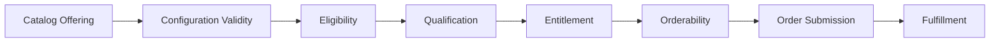
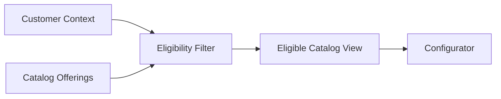
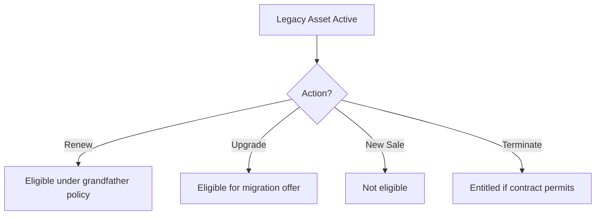
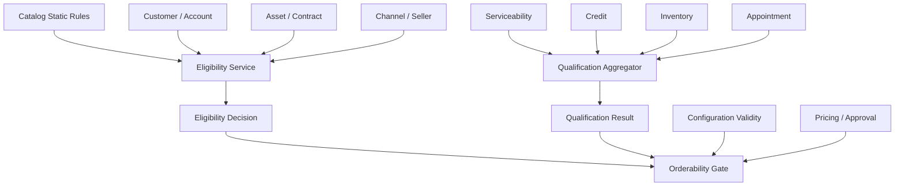

# Part 008 — Eligibility, Qualification, and Entitlement

## Learning Goal

Setelah bagian ini, kamu harus mampu membedakan dan mendesain:

1. **eligibility** — apakah produk/offering boleh ditawarkan kepada customer dalam konteks tertentu;
2. **qualification** — apakah customer/location/account memenuhi syarat teknis, komersial, atau operasional;
3. **entitlement** — apakah customer sudah memiliki hak/asset/contract yang memungkinkan aksi tertentu;
4. **orderability** — apakah konfigurasi yang sudah valid dan eligible bisa benar-benar diubah menjadi order yang dapat dieksekusi;
5. **policy evidence** — bukti mengapa sistem mengizinkan atau menolak sebuah offering.

Dalam CPQ enterprise, bagian ini adalah pemisah antara platform yang hanya “bisa quote” dan platform yang **commercially safe**.

Kaufman lens:

- pecah skill menjadi sub-skill kecil;
- kuasai istilah boundary dulu;
- latih dengan kasus nyata;
- gunakan feedback loop dari invalid quote/order;
- bangun checklist untuk menghindari kesalahan berulang.

---

## 1. Why Eligibility Is Not Configuration

Configurator menjawab:

> Apakah kombinasi pilihan produk ini valid secara struktur?

Eligibility menjawab:

> Apakah offering ini boleh dijual kepada customer ini, di channel ini, pada tanggal ini, dalam region ini, dengan segment ini, berdasarkan policy ini?

Contoh:

```text
Produk "Enterprise Fiber 10Gbps" secara konfigurasi valid.
Tapi produk itu tidak eligible untuk customer SMB, tidak tersedia di region tertentu, dan hanya bisa dijual lewat direct sales.
```

Jadi:

```text
Configured ≠ Eligible
Eligible ≠ Qualified
Qualified ≠ Entitled
Entitled ≠ Orderable
Orderable ≠ Fulfilled
```

Diagram:



Each step narrows the candidate set.

---

## 2. Core Definitions

### 2.1 Eligibility

Eligibility is a policy decision.

It determines whether an offering, option, promotion, or action is available for a given context.

Eligibility dimensions:

| Dimension | Example |
|---|---|
| Customer segment | Enterprise, SMB, consumer, public sector |
| Account type | New customer, existing customer, partner, reseller |
| Geography | Country, region, city, service area |
| Channel | Direct sales, partner, web, call center |
| Legal entity | Which seller entity can offer it |
| Currency | Product only sold in certain currencies |
| Time | Campaign or product effective dates |
| Contract status | Only eligible for active contract |
| Customer risk | Credit hold blocks new sales |
| Regulatory | Product restricted in certain jurisdiction |
| Installed base | Upgrade only if customer owns base product |
| Migration cohort | Offer available only to migration group |

Eligibility result should not just be boolean.

It should return:

- eligible/not eligible;
- reason code;
- evidence;
- effective date;
- policy version;
- remediation if available.

### 2.2 Qualification

Qualification checks whether specific conditions are satisfied.

Examples:

| Qualification Type | Question |
|---|---|
| Serviceability | Can service be delivered to this address? |
| Technical feasibility | Can requested bandwidth/SLA be provisioned? |
| Credit qualification | Is customer allowed to place order? |
| Identity/KYC | Is identity verified? |
| Inventory availability | Is device/resource available? |
| Capacity check | Is network/resource capacity available? |
| Appointment availability | Can installation be scheduled? |
| Contract qualification | Does contract allow this amendment? |

Eligibility is often policy. Qualification often needs data or external systems.

Example:

```text
Eligibility: Fiber 1Gbps is sold to enterprise customers in Jakarta.
Qualification: Customer's specific building has fiber access and enough port capacity.
```

### 2.3 Entitlement

Entitlement asks:

> What does this customer already have the right to use, modify, renew, upgrade, downgrade, suspend, or terminate?

Entitlement usually depends on:

- installed base;
- active product inventory;
- subscription;
- contract;
- license;
- service account;
- billing account;
- support plan;
- partner relationship;
- regulatory permission.

Example:

```text
Customer can buy "Premium Support Add-on" only if they already have an active Enterprise SaaS subscription.
```

### 2.4 Orderability

Orderability asks:

> Can this quote/configuration be submitted as an order now?

Orderability combines:

- valid configuration;
- eligibility;
- qualification;
- entitlement;
- price validity;
- quote validity;
- billing readiness;
- contract readiness;
- required documents;
- downstream availability;
- fraud/risk checks;
- fulfillment feasibility.

Orderability is the last gate before order capture.

---

## 3. Decision Boundary Matrix

Use this matrix to avoid mixing rules.

| Decision | Owned By | Stable Inputs | Volatile Inputs | Typical Timing |
|---|---|---|---|---|
| Configuration | Catalog/configuration service | Product model, option relationships | Catalog version | During configuration |
| Eligibility | Eligibility/policy service | Product policy, customer segment | Customer status, channel, date | Before/during configuration |
| Qualification | Qualification/serviceability service | Product requirements | Address, capacity, inventory, credit | Before quote/order |
| Entitlement | Asset/subscription/contract service | Contract/product rules | Installed base, subscription state | Amendment/change order |
| Pricing | Pricing service | Price book, price rules | Customer-specific price, currency | Quote generation |
| Approval | Approval/policy service | Approval matrix | Discount, margin, risk | Submit approval |
| Orderability | Order capture/OMS | Order submission requirements | Payment, inventory, appointment | Convert quote to order |
| Fulfillment | Orchestration/fulfillment | Decomposition rules | Downstream availability | After order submission |

Design rule:

> The closer a decision is to fulfillment, the more volatile and operational the inputs become.

So do not force all decisions into catalog.

---

## 4. Eligibility as a Policy Engine

Eligibility should be modeled as a policy decision service.

Input:

- subject: customer/account/user;
- resource: offering/option/promotion/action;
- context: channel, region, effective date, quote type;
- evidence: customer segment, contract, risk state, asset state.

Output:

- decision;
- reason;
- obligations;
- warnings;
- policy version.

Conceptual request:

```json
{
  "subject": {
    "customerId": "cust_123",
    "segment": "enterprise",
    "riskStatus": "normal",
    "country": "ID"
  },
  "resource": {
    "type": "productOffering",
    "code": "enterprise-fiber-10g",
    "catalogVersion": "2026.07.01"
  },
  "action": "SELL",
  "context": {
    "channel": "direct-sales",
    "effectiveDate": "2026-07-02",
    "quoteType": "new-sale"
  }
}
```

Conceptual response:

```json
{
  "decision": "eligible",
  "policyVersion": "eligibility-policy-2026.07.01",
  "reasonCode": "ENTERPRISE_DIRECT_SALES_ALLOWED",
  "evidence": {
    "customerSegment": "enterprise",
    "channel": "direct-sales",
    "country": "ID"
  },
  "obligations": [
    {
      "type": "REQUIRE_QUALIFICATION",
      "qualificationType": "SERVICEABILITY"
    }
  ]
}
```

For not eligible:

```json
{
  "decision": "not_eligible",
  "policyVersion": "eligibility-policy-2026.07.01",
  "reasonCode": "CHANNEL_NOT_ALLOWED",
  "message": "Enterprise Fiber 10Gbps can only be sold via direct sales.",
  "evidence": {
    "channel": "partner",
    "allowedChannels": ["direct-sales"]
  },
  "remediation": [
    {
      "type": "CHANGE_CHANNEL",
      "value": "direct-sales"
    },
    {
      "type": "SELECT_ALTERNATIVE",
      "offeringCode": "enterprise-fiber-1g"
    }
  ]
}
```

---

## 5. Eligibility Scope

Eligibility can apply to different resources.

| Scope | Example |
|---|---|
| Product offering | Customer may buy Enterprise Fiber |
| Option | Customer may add Premium SLA |
| Attribute value | Customer may choose 10Gbps |
| Promotion | Customer eligible for migration discount |
| Action | Customer may upgrade but not downgrade |
| Quantity | Customer may buy up to 500 seats |
| Term | Customer may select 36-month contract |
| Payment model | Customer allowed invoice billing, not prepaid |
| Channel | Product visible in direct sales only |
| Document/legal clause | Special terms required for public sector |

Do not model eligibility only at root product level.

Example:

```text
Customer is eligible for SaaS Enterprise Plan.
But not eligible for HIPAA add-on unless they are in healthcare vertical and sign required agreement.
```

---

## 6. Eligibility Result Granularity

A boolean result is insufficient.

Better model:

```json
{
  "rootOffering": {
    "code": "enterprise-saas-suite",
    "decision": "eligible"
  },
  "options": [
    {
      "code": "advanced-analytics",
      "decision": "eligible"
    },
    {
      "code": "regulated-data-module",
      "decision": "conditionally_eligible",
      "obligations": ["LEGAL_DPA_REQUIRED"]
    },
    {
      "code": "public-sector-discount",
      "decision": "not_eligible",
      "reasonCode": "CUSTOMER_NOT_PUBLIC_SECTOR"
    }
  ],
  "attributeValues": [
    {
      "attribute": "contractTerm",
      "value": "60_months",
      "decision": "not_eligible",
      "reasonCode": "TERM_EXCEEDS_SEGMENT_LIMIT"
    }
  ]
}
```

Decision types:

| Decision | Meaning |
|---|---|
| `eligible` | May proceed |
| `not_eligible` | Must not be selected/sold |
| `conditionally_eligible` | May proceed if obligations are satisfied |
| `unknown` | Insufficient data |
| `temporarily_unavailable` | Usually operational issue |
| `requires_manual_review` | Human decision needed |
| `grandfathered` | Allowed due to existing right |
| `migration_only` | Allowed only in migration path |

---

## 7. Qualification Deep Dive

Qualification is often expensive and external.

Examples:

### 7.1 Serviceability Qualification

```text
Can this address receive this service?
```

Inputs:

- address;
- product requirements;
- access technology;
- building data;
- network coverage;
- capacity;
- installation constraints.

Output:

- qualified/not qualified;
- available technologies;
- max bandwidth;
- install type;
- appointment requirement;
- confidence;
- expiration.

### 7.2 Technical Qualification

```text
Can this specific product configuration be provisioned?
```

Example:

```text
1Gbps + Premium SLA + Managed Router HA requires fiber, redundant CPE, and local support coverage.
```

### 7.3 Credit Qualification

```text
Can customer place new order under financial policy?
```

Possible result:

- approved;
- deposit required;
- credit limit exceeded;
- manual review;
- blocked.

### 7.4 Inventory Qualification

```text
Is required stock/resource available?
```

Important distinction:

- available-to-sell;
- available-to-promise;
- reserved;
- allocated;
- physically shipped;
- fulfilled.

### 7.5 Appointment Qualification

```text
Can installation be scheduled?
```

This may be needed before order submission for some domains.

---

## 8. Qualification Result Expiration

Qualification results are volatile.

Examples:

| Qualification | Why It Expires |
|---|---|
| Serviceability | Capacity changes |
| Inventory | Stock consumed |
| Credit | Risk status changes |
| Appointment | Slot taken |
| Identity | Document expires |
| Regulatory | Policy changes |
| Promotion qualification | Campaign ends |

Therefore qualification result should include:

```json
{
  "qualificationId": "qual_123",
  "status": "qualified",
  "qualifiedAt": "2026-07-02T10:00:00+07:00",
  "expiresAt": "2026-07-02T12:00:00+07:00",
  "confidence": "confirmed",
  "evidence": {}
}
```

Quote/order conversion must check expiry.

Invariant:

> A quote can reference an expired qualification for historical evidence, but an order should not rely on it without revalidation or policy exception.

---

## 9. Entitlement Deep Dive

Entitlement is asset-aware decisioning.

It answers:

| Question | Example |
|---|---|
| What does customer own? | Active broadband subscription |
| What can customer change? | Upgrade bandwidth |
| What cannot customer change? | Downgrade before minimum term |
| What can customer add? | Add managed firewall |
| What can customer remove? | Remove optional add-on after contract term |
| What can customer renew? | Renew annual subscription |
| What is grandfathered? | Legacy plan not sold anymore but still renewable |
| What must be migrated? | Old plan must move to new product family |

Entitlement depends on accurate installed base.

If installed base is wrong, change orders become unsafe.

### 9.1 Installed Base Example

```json
{
  "customerId": "cust_123",
  "assets": [
    {
      "assetId": "asset_001",
      "offeringCode": "enterprise-fiber-1g",
      "status": "active",
      "startDate": "2025-01-01",
      "contractEndDate": "2027-01-01",
      "attributes": {
        "bandwidth": "1Gbps",
        "sla": "enhanced"
      },
      "relatedAssets": [
        {
          "assetId": "asset_002",
          "relationship": "includes"
        }
      ]
    }
  ]
}
```

### 9.2 Entitlement Actions

| Action | Meaning |
|---|---|
| `ADD` | Add new product/option |
| `CHANGE` | Modify existing product |
| `UPGRADE` | Move to higher tier/capability |
| `DOWNGRADE` | Move to lower tier/capability |
| `RENEW` | Extend contract/subscription |
| `SUSPEND` | Temporarily stop service |
| `RESUME` | Reactivate suspended service |
| `TERMINATE` | End product/subscription |
| `TRANSFER` | Move ownership/account |
| `MIGRATE` | Move from legacy product to new model |

Entitlement result:

```json
{
  "assetId": "asset_001",
  "action": "DOWNGRADE",
  "decision": "not_entitled",
  "reasonCode": "MINIMUM_TERM_NOT_COMPLETED",
  "evidence": {
    "contractEndDate": "2027-01-01",
    "currentDate": "2026-07-02"
  },
  "remediation": [
    {
      "type": "REQUIRES_APPROVAL",
      "approvalPolicy": "early-downgrade-exception"
    }
  ]
}
```

---

## 10. Orderability

Orderability is the final gate.

An order is orderable when:

1. configuration is valid;
2. customer is eligible;
3. required qualifications are valid and not expired;
4. customer is entitled to requested action;
5. price is valid;
6. quote is not expired;
7. approval is complete;
8. required documents are present;
9. billing account is valid;
10. payment method or credit terms are acceptable;
11. fulfillment prerequisites exist;
12. required appointments/reservations are valid;
13. no blocking compliance/risk/fraud issue exists.

Orderability response should be explicit:

```json
{
  "orderability": "blocked",
  "blockingReasons": [
    {
      "code": "QUALIFICATION_EXPIRED",
      "message": "Serviceability qualification expired at 12:00.",
      "remediation": "Run serviceability check again."
    },
    {
      "code": "APPROVAL_NOT_COMPLETE",
      "message": "VP Sales approval is still pending."
    }
  ],
  "warnings": [
    {
      "code": "INSTALLATION_SLOT_NOT_RESERVED",
      "message": "Installation slot must be selected before submission."
    }
  ]
}
```

Do not let OMS discover obvious commercial blockers too late.

But also do not make CPQ responsible for all fulfillment concerns.

Boundary:

```text
CPQ should know if something is orderable.
OMS should own order submission, decomposition, and execution.
```

---

## 11. Eligibility and Configurator Interaction

There are two common patterns.

### 11.1 Pre-Filter Pattern

Eligibility filters available offerings before configuration.



Pros:

- cleaner UX;
- fewer invalid choices;
- faster sales flow.

Cons:

- user may not know why something is missing;
- hidden options can create support issues;
- eligibility result may become stale.

Use when:

- product should not be visible;
- regulatory restriction;
- channel restriction;
- customer segment restriction.

### 11.2 Post-Validation Pattern

User can configure, then eligibility validates.


Pros:

- transparent;
- useful for what-if selling;
- good for sales engineering.

Cons:

- user may spend time on impossible configurations;
- more error handling.

Use when:

- user needs exploration;
- eligibility depends on selected attributes;
- sales wants alternative recommendation.

### 11.3 Hybrid Pattern

Best enterprise pattern:

- pre-filter obviously unavailable offerings;
- allow expert search for hidden offerings with explanation;
- run eligibility continuously for selected options;
- run authoritative eligibility before pricing/approval/order.

---

## 12. Eligibility Caching

Eligibility can be expensive.

But bad caching causes incorrect sales.

Cache key must include:

- customer/account;
- segment;
- channel;
- region;
- catalog version;
- policy version;
- effective date;
- offering/action;
- quote type;
- asset snapshot if relevant.

Example key:

```text
eligibility:{customerId}:{channel}:{region}:{catalogVersion}:{policyVersion}:{effectiveDate}:{offeringCode}:{action}
```

Cache invalidation triggers:

- customer segment changes;
- risk status changes;
- catalog publish;
- eligibility policy publish;
- asset state changes;
- contract status changes;
- regulatory change;
- channel change.

Avoid:

```text
cache by offeringCode only
```

That is unsafe.

---

## 13. Policy Versioning and Evidence

Eligibility policies must be versioned and auditable.

A quote should record:

- eligibility decision ID;
- policy version;
- input context snapshot;
- decision result;
- reason code;
- obligations;
- timestamp;
- service/source that made decision.

Example:

```json
{
  "eligibilityEvidence": {
    "decisionId": "eligdec_987",
    "policyVersion": "eligibility-policy-2026.07.01",
    "decision": "eligible",
    "reasonCode": "ENTERPRISE_REGION_CHANNEL_MATCH",
    "evaluatedAt": "2026-07-02T10:05:00+07:00",
    "inputSnapshot": {
      "customerSegment": "enterprise",
      "region": "ID-JK",
      "channel": "direct-sales"
    }
  }
}
```

Why this matters:

- customer dispute;
- internal audit;
- revenue leakage investigation;
- regulatory review;
- legal defense;
- migration analysis.

Audit invariant:

> If a quote was allowed, the system must be able to explain why it was allowed under the policy version active at the time.

---

## 14. Eligibility Result as Obligations

Eligibility is not always allow/deny.

Sometimes it returns obligations.

Examples:

| Obligation | Meaning |
|---|---|
| `REQUIRE_APPROVAL` | Can proceed but needs approval |
| `REQUIRE_DOCUMENT` | Specific legal/customer document required |
| `REQUIRE_DEPOSIT` | Payment/security deposit required |
| `REQUIRE_QUALIFICATION` | Must run serviceability/credit check |
| `REQUIRE_MIN_TERM` | Must use minimum contract term |
| `REQUIRE_BILLING_ACCOUNT` | Billing setup required |
| `REQUIRE_INSTALL_APPOINTMENT` | Appointment must be selected |
| `REQUIRE_IDENTITY_VERIFICATION` | KYC/identity check required |
| `REQUIRE_PARTNER_AUTHORIZATION` | Partner must be authorized |
| `REQUIRE_MANUAL_REVIEW` | Human review required |

Example:

```json
{
  "decision": "conditionally_eligible",
  "reasonCode": "PUBLIC_SECTOR_REQUIRES_DOCUMENTS",
  "obligations": [
    {
      "type": "REQUIRE_DOCUMENT",
      "documentType": "PUBLIC_SECTOR_PROCUREMENT_APPROVAL"
    },
    {
      "type": "REQUIRE_APPROVAL",
      "approvalPolicy": "public-sector-deal-review"
    }
  ]
}
```

This model prevents rule duplication across eligibility, approval, document generation, and orderability.

---

## 15. Grandfathering and Migration

Enterprise platforms often support legacy products.

A product can be:

| State | Sellable New? | Renewable? | Changeable? |
|---|---:|---:|---:|
| Active | Yes | Yes | Yes |
| Retired | No | Maybe | Maybe |
| Grandfathered | No | Yes for existing customers | Limited |
| Migration-only | No | No | Only migrate |
| End-of-life | No | No | Terminate/migrate |

Grandfathering rule:

```text
Customer may renew legacy product if they already own active asset from same legacy family.
```

Migration rule:

```text
Customer with LegacyPlanA is eligible for MigrationOfferB.
New customers are not eligible for MigrationOfferB.
```

This is not simple catalog visibility. It requires installed-base context.

Diagram:



---

## 16. Customer Hierarchy and Account Context

Enterprise customers are not flat.

They may have:

- global parent;
- regional subsidiary;
- billing account;
- service account;
- legal entity;
- department;
- cost center;
- contract account;
- partner/reseller account.

Eligibility may apply at different levels.

Example:

```text
Global parent has master contract.
Regional subsidiary places order.
Billing account belongs to local legal entity.
Service location is in another jurisdiction.
```

Decision must specify context level:

| Context | Example Rule |
|---|---|
| Global account | Strategic discount eligibility |
| Legal entity | Tax and seller entity restriction |
| Billing account | Credit hold |
| Service account | Installed base entitlement |
| Location | Serviceability |
| User/channel | Seller authorization |
| Contract | Renewal/downgrade rights |

Anti-pattern:

> Passing only `customerId` to eligibility and assuming it contains all context.

Better:

```json
{
  "accountContext": {
    "globalAccountId": "acct_global_1",
    "buyingAccountId": "acct_buy_2",
    "billingAccountId": "acct_bill_3",
    "serviceAccountId": "acct_service_4",
    "legalEntity": "PT Seller Indonesia",
    "contractId": "contract_123"
  }
}
```

---

## 17. Channel and Seller Authorization

A product may be valid for the customer but not for the seller/channel.

Examples:

- direct sales only;
- partner tier restriction;
- call center cannot sell complex enterprise bundle;
- web channel can sell only simplified offer;
- public sector requires certified seller;
- cross-border seller entity restriction.

Authorization dimensions:

| Dimension | Example |
|---|---|
| Channel | Web, partner, direct, marketplace |
| Seller role | Account executive, partner manager |
| Partner tier | Gold partner can sell advanced bundle |
| Geography | Seller licensed for region |
| Product certification | Seller trained for regulated product |
| Deal type | Renewal handled by customer success |

This is often confused with security authorization.

Distinguish:

```text
RBAC/security says user can access CPQ.
Seller authorization says user/channel can sell this product/action.
```

---

## 18. Regulatory and Compliance Eligibility

Some products require regulatory gating.

Examples:

- healthcare data module;
- financial compliance add-on;
- telecom regulated service;
- export-controlled hardware/software;
- public-sector procurement;
- age-restricted services;
- cross-border data processing;
- encryption products;
- country-specific tax/legal restrictions.

Regulatory eligibility must be:

- explicit;
- versioned;
- explainable;
- auditable;
- conservative when uncertain.

Result example:

```json
{
  "decision": "not_eligible",
  "reasonCode": "COUNTRY_RESTRICTION",
  "message": "This product is not available for sale in the selected country.",
  "policyVersion": "regulatory-policy-2026.06.15",
  "evidence": {
    "country": "XX",
    "offeringCode": "regulated-data-module"
  }
}
```

Do not hide regulatory decisions in UI code.

---

## 19. Eligibility vs Approval

A common mistake:

> “If not eligible, send for approval.”

This is not always valid.

Some decisions are non-overridable.

| Decision | Can Approval Override? | Example |
|---|---:|---|
| Discount threshold | Yes | VP can approve extra discount |
| Missing required document | Maybe | Legal can approve exception |
| Credit risk | Maybe | Finance can approve with deposit |
| Product not sold in country due to regulation | No | Regulatory restriction |
| Channel not authorized | Maybe/No | Depends on policy |
| Technical infeasibility | Usually no | Cannot deliver service |
| Contract minimum term | Maybe | Exception approval |
| Customer not entitled to asset change | Maybe | Depends on contract/legal |

Model:

```json
{
  "decision": "not_eligible",
  "overridable": false,
  "reasonCode": "REGULATORY_RESTRICTION"
}
```

Or:

```json
{
  "decision": "conditionally_eligible",
  "overridable": true,
  "obligations": [
    {
      "type": "REQUIRE_APPROVAL",
      "approvalPolicy": "early-termination-exception"
    }
  ]
}
```

---

## 20. Architecture Patterns

### 20.1 Embedded Eligibility in Catalog

Rules stored in catalog.

Pros:

- close to product model;
- easy for product team;
- consistent catalog publish.

Cons:

- can become too static;
- poor for volatile customer/risk data;
- catalog becomes overloaded.

Good for:

- product availability;
- channel visibility;
- effective dates;
- simple segment restrictions.

### 20.2 Dedicated Eligibility Service

Policy service evaluates decisions.

Pros:

- clear ownership;
- reusable across CPQ/OMS/commerce;
- auditable;
- supports complex context.

Cons:

- extra service dependency;
- latency and caching complexity.

Good for:

- regulated products;
- multi-channel commerce;
- enterprise account policy;
- asset-aware action eligibility.

### 20.3 Hybrid

Recommended enterprise pattern:

- catalog contains static eligibility metadata;
- eligibility service evaluates dynamic context;
- qualification services provide external facts;
- OMS performs final orderability gate.

Diagram:



---

## 21. API Design

### 21.1 Evaluate Eligibility

```http
POST /eligibility-decisions
```

Request:

```json
{
  "requestId": "req_001",
  "action": "SELL",
  "resources": [
    {
      "type": "productOffering",
      "code": "enterprise-fiber-10g"
    }
  ],
  "subject": {
    "customerId": "cust_123"
  },
  "context": {
    "channel": "direct-sales",
    "effectiveDate": "2026-07-02",
    "catalogVersion": "2026.07.01",
    "quoteType": "new-sale"
  }
}
```

Response:

```json
{
  "decisionSetId": "eligset_001",
  "decisions": [
    {
      "resourceCode": "enterprise-fiber-10g",
      "decision": "eligible",
      "reasonCode": "SEGMENT_REGION_CHANNEL_MATCH",
      "policyVersion": "eligibility-policy-2026.07.01"
    }
  ]
}
```

### 21.2 Evaluate Qualification

```http
POST /qualification-requests
```

Request:

```json
{
  "qualificationType": "SERVICEABILITY",
  "customerId": "cust_123",
  "locationId": "loc_456",
  "configuredProduct": {
    "offeringCode": "enterprise-fiber-10g",
    "attributes": {
      "bandwidth": "10Gbps",
      "sla": "premium"
    }
  }
}
```

Response:

```json
{
  "qualificationId": "qual_001",
  "status": "not_qualified",
  "reasonCode": "INSUFFICIENT_CAPACITY",
  "expiresAt": "2026-07-02T12:00:00+07:00",
  "alternatives": [
    {
      "offeringCode": "enterprise-fiber-1g",
      "reasonCode": "AVAILABLE_CAPACITY"
    }
  ]
}
```

### 21.3 Evaluate Entitlement

```http
POST /entitlement-decisions
```

Request:

```json
{
  "customerId": "cust_123",
  "assetId": "asset_001",
  "action": "UPGRADE",
  "targetOfferingCode": "enterprise-fiber-10g",
  "effectiveDate": "2026-07-02"
}
```

Response:

```json
{
  "decision": "entitled",
  "reasonCode": "UPGRADE_ALLOWED_WITHIN_CONTRACT",
  "evidence": {
    "currentOffering": "enterprise-fiber-1g",
    "contractStatus": "active"
  }
}
```

### 21.4 Evaluate Orderability

```http
POST /orderability-checks
```

Request:

```json
{
  "quoteId": "quote_123",
  "configurationSnapshotId": "cfgsnap_456",
  "eligibilityDecisionSetId": "eligset_001",
  "qualificationIds": ["qual_001"],
  "approvalSnapshotId": "approval_001"
}
```

Response:

```json
{
  "status": "orderable",
  "warnings": [],
  "requiredActions": []
}
```

---

## 22. Event Design

Eligibility and qualification may emit events.

Examples:

```text
EligibilityDecisionCreated
EligibilityPolicyPublished
QualificationRequested
QualificationCompleted
QualificationExpired
EntitlementDecisionCreated
OrderabilityCheckCompleted
```

Event example:

```json
{
  "eventType": "QualificationExpired",
  "eventId": "evt_001",
  "occurredAt": "2026-07-02T12:00:00+07:00",
  "data": {
    "qualificationId": "qual_001",
    "quoteId": "quote_123",
    "qualificationType": "SERVICEABILITY"
  }
}
```

Usage:

- mark quote as needing requalification;
- alert sales rep;
- block quote-to-order conversion;
- update operational dashboard.

---

## 23. Failure Modes

| Failure Mode | Symptom | Root Cause | Prevention |
|---|---|---|---|
| Eligible but not deliverable | Quote accepted but order fails | No qualification before order | Qualification obligations |
| Not eligible but visible | Sales offers restricted product | Catalog visibility not context-aware | Eligibility pre-filter |
| Wrong customer context | Product allowed incorrectly | Flat customer ID only | Account context model |
| Expired qualification used | Order fails after capacity changes | Expiry ignored | Orderability recheck |
| Entitlement drift | Customer changes asset they do not own | Installed base stale | Asset reconciliation |
| Approval used as override for non-overridable rule | Regulatory violation | No overridable flag | Policy metadata |
| Hidden eligibility failure | Product disappears from UI | No explanation for filtered item | Explainable filtering |
| Cache poisoning | Wrong decision reused | Incomplete cache key | Context-rich cache key |
| Policy replay impossible | Audit cannot prove why quote was allowed | No policy version/evidence | Decision snapshot |
| Mixed rule ownership | Rule duplicated in UI, OMS, pricing | Poor boundary | Decision matrix |

---

## 24. Enterprise Invariants

These invariants should hold across CPQ/OMS.

### Invariant 1 — Context Completeness

Eligibility decision must state which context was used.

```text
No eligibility decision without customer/account/channel/effective date/resource/action.
```

### Invariant 2 — Versioned Decision

```text
No quote should rely on an unversioned eligibility policy.
```

### Invariant 3 — Expirable Qualification

```text
Any volatile qualification must have expiry or freshness metadata.
```

### Invariant 4 — Entitlement Uses Installed Base

```text
Any asset-based action must reference asset/subscription/contract state.
```

### Invariant 5 — Orderability Rechecks Blocking Dependencies

```text
Quote-to-order conversion must verify configuration, eligibility, qualification, approval, and price validity.
```

### Invariant 6 — Non-Overridable Means Non-Overridable

```text
Approval workflow must not bypass regulatory or physical infeasibility restrictions.
```

### Invariant 7 — Evidence Preservation

```text
If the platform allowed or blocked an offering, it must preserve reason and policy evidence.
```

---

## 25. Design Review Checklist

### Eligibility

- Are resource, subject, action, and context explicit?
- Is eligibility evaluated at option/attribute/action level, not only product level?
- Are decisions more expressive than boolean?
- Are obligations supported?
- Are policy versions persisted?
- Is overridability explicit?

### Qualification

- Are qualification types separated?
- Is qualification expiry modeled?
- Are alternatives returned when possible?
- Is asynchronous qualification supported?
- Is qualification rechecked before order submission?

### Entitlement

- Is installed base reliable enough?
- Are asset actions explicitly modeled?
- Are legacy/grandfathered/migration rules supported?
- Are contract constraints included?
- Are entitlement decisions snapshotted?

### Orderability

- Does quote-to-order conversion call an orderability gate?
- Are expired dependencies blocked?
- Are required documents/approvals checked?
- Is billing readiness checked?
- Are blocking vs warning reasons separated?

### Audit

- Can old eligibility decision be replayed or explained?
- Is policy evidence immutable once quote is approved?
- Are context snapshots stored?
- Are manual overrides recorded?

---

## 26. Practical Exercise

Use this scenario:

```text
Customer: PT Alpha Manufacturing
Segment: Enterprise
Country: Indonesia
Channel: Partner
Account status: Active
Credit status: Manual Review
Installed base: Enterprise Fiber 1Gbps active until 2027-01-01
Requested action: Upgrade to Enterprise Fiber 10Gbps + Premium SLA + Managed Router HA
Location: Jakarta industrial area
Qualification: Fiber available, but 10Gbps capacity not confirmed
Promotion: Q3 migration discount for direct sales only
```

Tasks:

1. Identify which checks are configuration, eligibility, qualification, entitlement, pricing, approval, and orderability.
2. Decide whether customer can see the offer.
3. Decide whether partner channel can sell it.
4. Decide whether customer is entitled to upgrade.
5. Decide what qualification is required.
6. Decide what obligations are returned.
7. Decide whether quote can be generated.
8. Decide whether order can be submitted now.
9. Write decision evidence.
10. Identify what must be rechecked at quote-to-order conversion.

Expected answer direction:

- configuration may be valid;
- customer may be eligible by segment;
- partner channel may block or require direct sales;
- upgrade may be entitled due to active installed base;
- 10Gbps capacity qualification is required;
- credit status may require finance review;
- promotion may not apply because channel is partner;
- order should not be submitted until qualification/credit/approval obligations are satisfied.

---

## 27. Kaufman Practice Loop

For one product family you know:

1. list 10 eligibility dimensions;
2. list 5 qualification checks;
3. list 5 entitlement actions;
4. define decision result vocabulary;
5. define one API request/response;
6. define one cache key;
7. define expiry rules;
8. define evidence snapshot;
9. design orderability gate;
10. write 10 failure modes.

This practice compresses the skill because it forces you to separate decisions that many teams accidentally merge.

---

## Summary

Eligibility, qualification, entitlement, and orderability are distinct but connected.

The deepest mental model:

> Configuration validates the shape of the product. Eligibility validates commercial permission. Qualification validates contextual feasibility. Entitlement validates existing rights. Orderability validates readiness to submit an executable order.

Key takeaways:

1. do not put all rules into configurator;
2. eligibility must be contextual and explainable;
3. qualification is volatile and must expire;
4. entitlement requires accurate installed base;
5. orderability is the final gate before OMS;
6. obligations are better than binary decisions;
7. policy versioning protects auditability;
8. non-overridable restrictions must be explicit;
9. cache keys must include full context;
10. quote-to-order conversion must recheck critical freshness.

In the next part, we will go deeper into **Installed Base and Asset-Based Ordering**, where entitlement becomes concrete through asset lifecycle, amendments, renewals, upgrades, downgrades, suspensions, and terminations.
