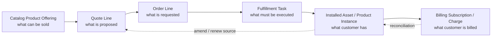
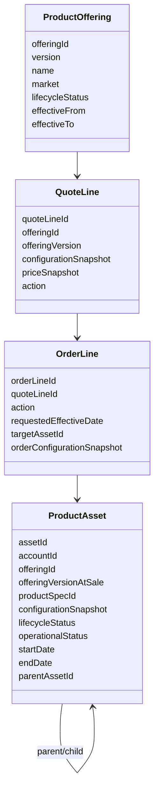
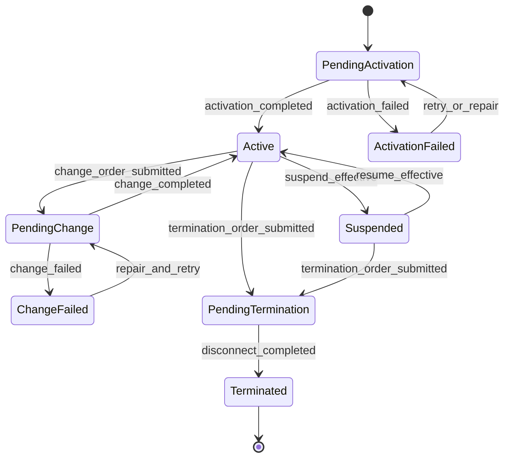
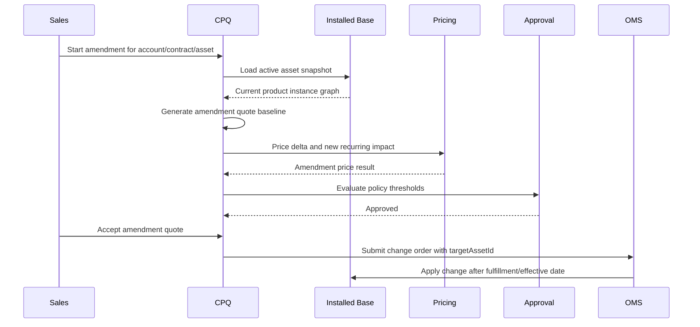
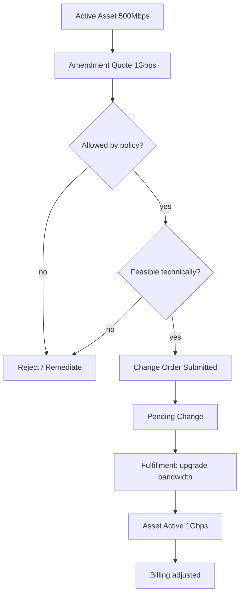
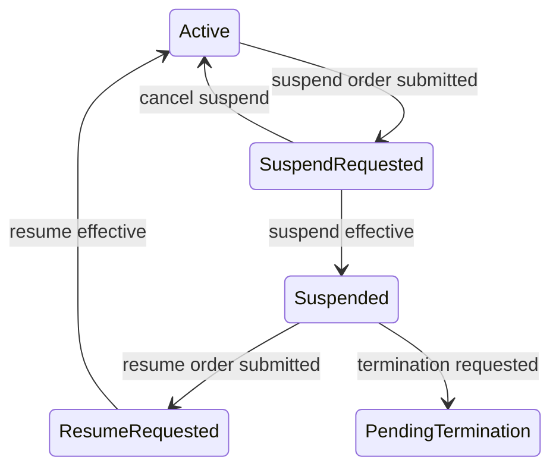
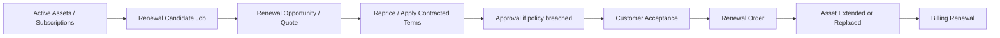
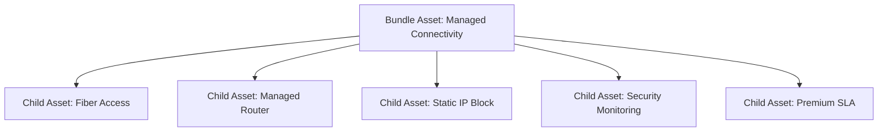
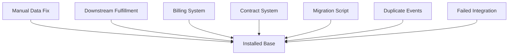
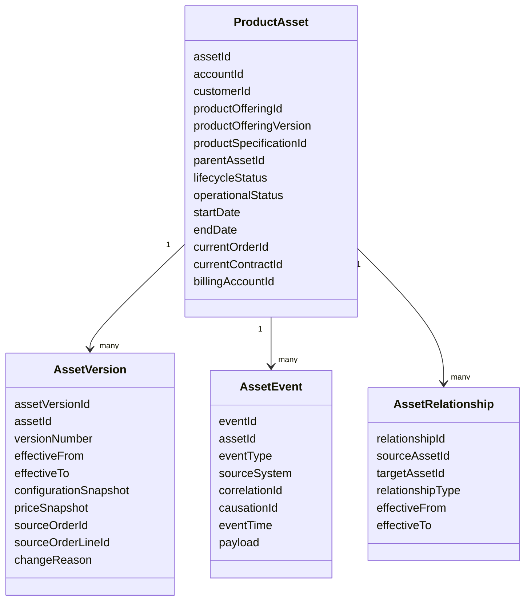

# Part 009 — Installed Base and Asset-Based Ordering

Pada CPQ/OMS enterprise, transaksi paling berisiko jarang berupa **new sale** yang benar-benar kosong. Kasus yang lebih sulit adalah:

- customer sudah punya produk aktif,
- ada bundle yang pernah dijual dengan versi catalog lama,
- ada kontrak yang masih berjalan,
- ada harga kontraktual yang berbeda dari list price sekarang,
- ada entitlement yang melekat ke asset existing,
- ada fulfillment/provisioning status yang tidak selalu sinkron,
- sales ingin upgrade, downgrade, amend, suspend, resume, terminate, atau renew,
- finance ingin invoice dan revenue tetap benar,
- support ingin tahu “customer sebenarnya punya apa sekarang”.

Itulah wilayah **installed base** dan **asset-based ordering**.

Dalam mental model TM Forum, product inventory merepresentasikan instance produk yang sudah dimiliki atau digunakan customer. Product Inventory API menyediakan mekanisme standar untuk create, update, retrieve, dan event notification atas representasi product dalam inventory. Product Ordering API menangani penempatan order berdasarkan product offering dari catalog. Artinya, secara arsitektural, **order adalah permintaan perubahan**, sedangkan **product inventory/asset adalah hasil keadaan bisnis setelah perubahan efektif**.

> Goal part ini: kamu mampu mendesain installed base sebagai sumber fakta operasional untuk produk aktif customer, lalu menggunakan fakta tersebut untuk quote/order perubahan tanpa merusak history, pricing, entitlement, fulfillment, dan audit.

---

## 1. Kaufman Target Performance

Setelah mempelajari bagian ini, target performa praktisnya:

1. Bisa membedakan **catalog product**, **quote line**, **order line**, **contract line**, **subscription**, dan **asset/product instance**.
2. Bisa mendesain lifecycle asset dari `Pending Activation` sampai `Terminated` tanpa membuat state machine yang ambigu.
3. Bisa menjelaskan bagaimana CPQ membuat amendment/renewal/change quote berdasarkan installed base.
4. Bisa mendesain order action: `add`, `modify`, `delete`, `suspend`, `resume`, `disconnect`, `renew`, `replace`.
5. Bisa mencegah **asset drift**: keadaan asset di CPQ/OMS berbeda dari fulfillment, billing, atau customer reality.
6. Bisa membuat invariant dan test scenario untuk upgrade, downgrade, cotermination, renewal, cancellation, dan in-flight mutation.

---

## 2. Mental Model: Offer, Order, Asset

Jangan mulai dari tabel. Mulai dari waktu.



Definisi singkat:

| Entity | Pertanyaan yang dijawab | Mutability | Contoh |
|---|---|---:|---|
| Product Offering | Apa yang boleh dijual? | Versioned | “Enterprise Fiber 1Gbps, Jakarta, 24 bulan” |
| Quote Line | Apa yang ditawarkan ke customer? | Mutable sampai accepted | “1Gbps, discount 15%, valid until 2026-08-01” |
| Order Line | Apa yang diminta untuk dieksekusi? | Mostly immutable setelah submit | “Activate 1Gbps at site A” |
| Fulfillment Task | Apa pekerjaan teknis/operasionalnya? | Mutable dalam orchestration | “Provision ONT, assign VLAN, schedule technician” |
| Asset/Product Instance | Customer punya apa sekarang? | Mutable melalui order/effective event | “Active Fiber 1Gbps at site A, assetId A123” |
| Billing Subscription | Apa yang ditagihkan? | Mutable melalui billing lifecycle | “Monthly recurring RpX, next invoice date” |

Enterprise engineer yang matang tidak mencampur entity di atas. Kesalahan umum: menjadikan quote line sebagai asset, atau menjadikan catalog offering sebagai bukti customer punya produk.

---

## 3. Installed Base: Apa yang Harus Direpresentasikan?

Installed base bukan sekadar daftar SKU yang pernah dibeli. Ia adalah representasi produk yang **sedang atau pernah menjadi hak/customer state**.

Minimal installed base perlu menjawab:

1. Produk apa yang aktif?
2. Customer/account mana yang memilikinya?
3. Lokasi/site/service account mana yang terkait?
4. Product offering dan specification versi mana yang menjadi asalnya?
5. Order mana yang menciptakan atau terakhir mengubahnya?
6. Kontrak/subscription/billing account mana yang terkait?
7. Term, start date, end date, renewal date, dan effective date-nya apa?
8. Status bisnis dan status operasionalnya apa?
9. Entitlement apa yang muncul dari asset ini?
10. Dependency ke asset lain apa?
11. Apakah asset ini masih sesuai dengan downstream fulfillment dan billing?

### 3.1 Asset sebagai Product Instance, Bukan Catalog Row

Catalog menjawab “apa yang bisa dijual”. Asset menjawab “apa yang terjadi pada customer tertentu”.



Asset harus menyimpan **snapshot yang cukup** untuk audit, support, billing, dan future amendment. Jangan hanya menyimpan `offeringId`. Catalog bisa berubah. Price bisa berubah. Rule bisa berubah. Bundle bisa diubah. Tapi customer membeli versi tertentu pada waktu tertentu.

---

## 4. Asset Lifecycle State Machine

Installed base membutuhkan dua dimensi status:

1. **Business lifecycle status**: apakah asset secara komersial aktif, suspended, terminated, pending activation, pending change.
2. **Operational/provisioning status**: apakah layanan teknis sudah provisioned, degraded, failed, disconnected, atau pending technician.

Jangan memaksa semua realitas ke satu status tunggal.



### 4.1 Contoh Status Bisnis

| Status | Arti | Boleh diubah? | Boleh ditagih? |
|---|---|---:|---:|
| `PENDING_ACTIVATION` | Order sudah diterima, asset belum aktif | Terbatas | Biasanya belum |
| `ACTIVE` | Customer memiliki layanan/produk aktif | Ya | Ya |
| `PENDING_CHANGE` | Ada perubahan in-flight | Terbatas | Ya, tergantung billing rule |
| `SUSPENDED` | Hak/customer access ditahan sementara | Ya, terbatas | Tergantung kontrak |
| `PENDING_TERMINATION` | Disconnect sedang berjalan | Tidak untuk upgrade normal | Tergantung effective date |
| `TERMINATED` | Asset selesai/dihentikan | Tidak, kecuali restore khusus | Tidak setelah end date |

### 4.2 Contoh Operational Status

| Status | Arti |
|---|---|
| `NOT_PROVISIONED` | Belum pernah diprovision |
| `PROVISIONING` | Proses aktivasi berjalan |
| `PROVISIONED` | Sistem downstream menyatakan aktif |
| `DEGRADED` | Service aktif tapi quality bermasalah |
| `PROVISIONING_FAILED` | Aktivasi gagal |
| `DISCONNECTING` | Proses pemutusan berjalan |
| `DISCONNECTED` | Resource sudah dilepas |

Business status dan operational status bisa berbeda. Contoh: business `ACTIVE`, operational `DEGRADED`. Itu bukan kontradiksi; itu informasi penting untuk support dan SLA.

---

## 5. Asset-Based Ordering

Asset-based ordering berarti quote/order berikutnya dibuat dengan referensi terhadap asset existing.

New sale:

```text
Product Offering -> Quote Line -> Order Line(action=ADD) -> New Asset
```

Change sale:

```text
Existing Asset -> Amendment Quote Line -> Order Line(action=MODIFY) -> Updated Asset
```

Terminate:

```text
Existing Asset -> Termination Quote/Order Line(action=DELETE/DISCONNECT) -> End-Dated Asset
```

Renewal:

```text
Existing Asset/Subscription -> Renewal Quote -> Renewal Order -> Extended/Replacement Asset
```

### 5.1 Order Action Taxonomy

| Action | Meaning | Target asset required? | Creates new asset? | Typical use case |
|---|---|---:|---:|---|
| `ADD` | Menambah produk baru | No | Yes | New subscription/product |
| `MODIFY` | Mengubah konfigurasi asset existing | Yes | Usually no | Upgrade bandwidth |
| `DELETE` / `DISCONNECT` | Mengakhiri asset | Yes | No | Cancel service |
| `SUSPEND` | Suspend hak layanan | Yes | No | Non-payment, legal hold |
| `RESUME` | Mengaktifkan kembali asset suspended | Yes | No | Payment resolved |
| `REPLACE` | Mengganti asset lama dengan asset baru | Yes | Yes | Hardware swap, migration |
| `RENEW` | Memperpanjang term/contract period | Yes | Maybe | Subscription renewal |
| `TRANSFER` | Mengubah ownership/account/site | Yes | Maybe | Account restructuring |

Kunci: action harus eksplisit. Jangan menyembunyikan perubahan dalam payload konfigurasi tanpa action semantics.

---

## 6. Asset Snapshot Strategy

Saat asset dibuat atau diubah, simpan snapshot yang cukup untuk replay dan future amendment.

### 6.1 Snapshot Minimal

```json
{
  "assetId": "asset-123",
  "accountId": "acct-456",
  "sourceOrderId": "ord-789",
  "sourceOrderLineId": "ol-001",
  "sourceQuoteId": "quote-555",
  "offering": {
    "offeringId": "fiber-enterprise-1g",
    "version": "2026.04",
    "name": "Enterprise Fiber 1Gbps"
  },
  "configuration": {
    "bandwidth": "1Gbps",
    "contractTermMonths": 24,
    "installationType": "managed"
  },
  "commercial": {
    "currency": "IDR",
    "recurringCharge": 10000000,
    "discountPercent": 15,
    "billingFrequency": "MONTHLY"
  },
  "lifecycle": {
    "status": "ACTIVE",
    "startDate": "2026-07-01",
    "endDate": "2028-06-30"
  }
}
```

### 6.2 Apa yang Disimpan sebagai Reference vs Snapshot?

| Data | Reference | Snapshot | Reasoning |
|---|---:|---:|---|
| `offeringId` | Ya | Ya | Perlu lookup dan audit |
| offering version | Ya | Ya | Mencegah ambiguity catalog |
| configuration values | Tidak cukup | Ya | Future rules bisa berubah |
| price values | Tidak cukup | Ya | Contractual evidence |
| discount approval | Ya | Ya | Audit dan governance |
| fulfillment resource IDs | Ya | Sebagian | Untuk traceability downstream |
| billing account | Ya | Ya | Finance reconciliation |
| customer legal entity | Ya | Ya | Legal/audit evidence |

Rule sederhana:

> Snapshot semua hal yang memengaruhi hak customer, kewajiban perusahaan, harga, kontrak, fulfillment, atau audit.

---

## 7. Amendment

Amendment adalah perubahan terhadap contract/subscription/asset yang masih berjalan.

Contoh:

- upgrade dari 500 Mbps ke 1 Gbps,
- menambah add-on security,
- mengurangi jumlah seat,
- mengubah lokasi,
- memperpanjang term,
- mengubah billing frequency,
- menambah site baru ke bundle existing.

### 7.1 Amendment Flow



### 7.2 Delta vs Full Replacement

Ada dua gaya amendment:

| Strategy | Cara kerja | Kelebihan | Risiko |
|---|---|---|---|
| Delta amendment | Quote/order hanya menyimpan perubahan | Ringkas, jelas secara action | Butuh baseline asset yang akurat |
| Full replacement amendment | Quote/order menyimpan konfigurasi final penuh | Mudah divalidasi end-state | Risiko overwrite field yang tidak dimaksud |
| Hybrid | Simpan delta dan resulting snapshot | Paling audit-friendly | Lebih kompleks |

Untuk enterprise-grade, gunakan hybrid:

1. `beforeSnapshot`: asset sebelum perubahan.
2. `requestedDelta`: perubahan yang diminta.
3. `afterSnapshot`: expected asset setelah perubahan.
4. `effectiveDate`: kapan berlaku.
5. `pricingDelta`: dampak harga.
6. `billingInstruction`: cara billing menerapkan perubahan.

---

## 8. Upgrade and Downgrade

Upgrade/downgrade bukan hanya mengubah value. Ia berdampak ke:

- compatibility,
- entitlement,
- pricing,
- contract minimum term,
- proration,
- capacity/resource availability,
- approval,
- billing,
- fulfillment sequencing.

### 8.1 Upgrade Example

Customer memiliki asset:

```text
Enterprise Fiber 500Mbps
Term: 24 months
Start: 2026-01-01
End: 2027-12-31
MRR: Rp7.000.000
```

Minta upgrade ke:

```text
Enterprise Fiber 1Gbps
Effective: 2026-08-01
MRR after discount: Rp10.000.000
```

Pertanyaan desain:

1. Apakah upgrade boleh sebelum minimum term?
2. Apakah contract end date tetap 2027-12-31 atau reset 24 bulan?
3. Apakah ada installation fee tambahan?
4. Apakah billing melakukan proration pada bulan efektif?
5. Apakah fulfillment butuh technician atau hanya logical provisioning?
6. Apakah asset ID tetap sama atau dibuat asset baru?
7. Apakah entitlement add-on berubah?
8. Apakah approval dibutuhkan karena discount/price berubah?

### 8.2 Upgrade State Transition



### 8.3 Downgrade Pitfalls

Downgrade sering lebih sulit daripada upgrade karena ada commercial protection.

Pertanyaan:

- Apakah customer masih dalam lock-in?
- Apakah downgrade memicu penalty?
- Apakah minimum spend masih terpenuhi?
- Apakah add-on yang bergantung ke tier lama harus dihapus?
- Apakah entitlement premium harus dicabut?
- Apakah credit memo perlu diterbitkan?
- Apakah approval finance/legal diperlukan?

Invariant:

> Downgrade tidak boleh menghasilkan asset final yang melanggar contractual minimum, dependency graph, atau entitlement policy.

---

## 9. Suspend and Resume

Suspend/resume adalah action terhadap hak layanan tanpa selalu mengakhiri kontrak.

Use case:

- non-payment,
- fraud hold,
- regulatory hold,
- customer request vacation mode,
- operational safety issue,
- temporary legal restriction.

### 9.1 Suspend Dimensions

| Dimension | Pertanyaan |
|---|---|
| Commercial | Apakah billing tetap berjalan? |
| Service | Apakah service benar-benar dimatikan atau hanya dibatasi? |
| Entitlement | Apakah support/SLA tetap berlaku? |
| Legal | Apakah suspend butuh notice? |
| Recovery | Apa syarat resume? |
| Audit | Siapa yang menyetujui suspend? |

### 9.2 Suspend State Machine



Suspension harus punya reason code yang jelas:

```text
NON_PAYMENT
FRAUD_INVESTIGATION
CUSTOMER_REQUEST
REGULATORY_HOLD
OPERATIONAL_RISK
CONTRACT_DISPUTE
```

Tanpa reason code, reporting dan compliance akan buruk.

---

## 10. Termination and Cancellation

Terminasi asset adalah penghentian hak customer atas produk. Cancellation bisa berarti:

1. Membatalkan quote sebelum order.
2. Membatalkan order sebelum fulfillment selesai.
3. Mengakhiri asset aktif.
4. Membatalkan contract/subscription renewal.

Jangan memakai satu kata “cancel” untuk semua hal tanpa context.

### 10.1 Termination Types

| Type | Arti | Contoh |
|---|---|---|
| Pre-activation cancel | Order dibatalkan sebelum aktif | Customer batal sebelum install |
| Early termination | Asset dihentikan sebelum term end | Cancel bulan ke-10 dari kontrak 24 bulan |
| Natural expiry | Asset berakhir di end date | Tidak renew |
| Forced termination | Perusahaan memutus layanan | Fraud, legal, non-payment |
| Migration termination | Asset lama dihentikan karena diganti produk baru | Legacy plan to new plan |

### 10.2 Termination Invariants

1. Asset terminated harus punya `endDate` dan `terminationReason`.
2. Termination tidak boleh menghapus historical snapshot.
3. Billing harus menerima instruction yang konsisten.
4. Fulfillment harus melepas resource jika diperlukan.
5. Entitlement harus dicabut sesuai effective date.
6. Dependent asset harus ikut ditangani atau divalidasi.
7. Termination harus idempotent.

---

## 11. Renewal

Renewal adalah proses memperpanjang commercial relationship setelah term existing mendekati selesai.

Renewal bisa berupa:

- same product, same price,
- same product, new price,
- same product, new term,
- upgraded product,
- consolidated products,
- cotermed multi-asset renewal,
- renewal with add-on,
- renewal with partial cancellation.

### 11.1 Renewal Flow



### 11.2 Renewal Model Decision

| Model | Cara kerja | Cocok untuk | Risiko |
|---|---|---|---|
| Extend same asset | Asset ID tetap, end date diperpanjang | Subscription sederhana | History perubahan perlu jelas |
| Create renewal asset | Asset baru dibuat, asset lama end-dated | Perubahan besar/migration | Bisa membuat asset graph panjang |
| Contract-level renewal | Contract diperpanjang, assets ikut | B2B enterprise contracts | Perlu alignment multi-asset |
| Asset-level renewal | Asset dipilih satu per satu | Account kompleks | Risiko partial renewal membingungkan |

Tidak ada satu model universal. Pilihan tergantung finance, billing, legal, dan fulfillment.

---

## 12. Cotermination

Cotermination berarti beberapa asset/subscription dibuat memiliki end date yang sama.

Contoh:

- Customer punya kontrak utama berakhir 2027-12-31.
- Pada 2026-07-01 membeli add-on baru.
- Add-on tidak berjalan 24 bulan penuh, tetapi dibuat berakhir 2027-12-31 agar aligned dengan kontrak utama.

### 12.1 Cotermination Calculation

```text
Master term end date: 2027-12-31
Add-on start date:    2026-07-01
Cotermed duration:    18 months
Standard duration:    24 months
```

Pertanyaan pricing:

1. Apakah add-on diprorate berdasarkan remaining term?
2. Apakah discount schedule berubah karena durasi lebih pendek?
3. Apakah minimum term policy memperbolehkan coterm kurang dari standard term?
4. Apakah renewal berikutnya mencakup add-on tersebut?

### 12.2 Cotermination Invariant

> Asset yang dicoterm harus menyimpan `coterminationSource`, `masterContractId`, dan `originalStandardTerm`, supaya future renewal/pricing tidak kehilangan konteks.

---

## 13. Parent/Child Asset Graph

Enterprise products sering berbentuk bundle.

Contoh:

```text
Managed Connectivity Bundle
├── Enterprise Fiber Access
├── Managed Router
├── Static IP Block
├── Security Monitoring Add-on
└── SLA Premium Support
```

Installed base harus merepresentasikan graph, bukan flat list.



### 13.1 Graph Rules

| Rule | Example |
|---|---|
| Parent cannot terminate while mandatory child active | Bundle termination must include child assets |
| Optional child can be added after parent active | Add security monitoring |
| Child may inherit term from parent | SLA ends with bundle |
| Child may have own fulfillment lifecycle | Router shipment separate from fiber provisioning |
| Child may have own billing charge | Static IP monthly fee |

### 13.2 Bundle Amendment Pitfall

Jika bundle structure tidak dipertahankan, future amendment menjadi sulit:

- sales tidak tahu add-on belongs to which parent,
- price recalculation kehilangan bundle discount context,
- termination bisa meninggalkan orphan child asset,
- renewal bisa memperpanjang add-on tanpa parent,
- support tidak bisa melihat full service composition.

---

## 14. Asset Drift

Asset drift adalah kondisi ketika installed base tidak lagi merepresentasikan realitas bisnis/operasional.

Contoh drift:

1. CPQ asset `ACTIVE`, tetapi provisioning gagal.
2. Billing menagih produk yang sudah terminated.
3. Fulfillment sudah upgrade ke 1Gbps, tapi asset masih 500Mbps.
4. Contract end date berubah, asset end date tidak berubah.
5. Add-on aktif tanpa parent asset.
6. Renewal quote dibuat dari stale asset snapshot.
7. Downstream resource disconnected, tetapi OMS tidak menerima event.

### 14.1 Sources of Drift



### 14.2 Drift Prevention Techniques

| Technique | Purpose |
|---|---|
| Event-sourced asset changes | Semua perubahan punya sebab |
| Source order reference | Asset change bisa ditrace ke order |
| Idempotency key | Duplicate event tidak menggandakan perubahan |
| Reconciliation job | Bandingkan asset vs billing/fulfillment |
| Repair workflow | Drift diperbaiki dengan controlled process |
| Immutable history | Audit tidak hilang saat correction |
| Effective dating | Future/past state jelas |
| Ownership matrix | Sistem mana boleh mengubah field mana |

### 14.3 Drift Detection Query Examples

```sql
-- Asset active but no billing subscription
select a.asset_id, a.account_id, a.product_name
from product_asset a
left join billing_subscription b on b.asset_id = a.asset_id
where a.lifecycle_status = 'ACTIVE'
  and b.subscription_id is null;
```

```sql
-- Child asset active while parent terminated
select child.asset_id, child.parent_asset_id
from product_asset child
join product_asset parent on parent.asset_id = child.parent_asset_id
where child.lifecycle_status = 'ACTIVE'
  and parent.lifecycle_status = 'TERMINATED';
```

```sql
-- Asset pending change too long
select asset_id, last_order_id, updated_at
from product_asset
where lifecycle_status = 'PENDING_CHANGE'
  and updated_at < now() - interval '48 hours';
```

---

## 15. Ownership Matrix

Installed base sering gagal karena semua sistem merasa boleh mengubah asset.

| Field | Owner | Other systems |
|---|---|---|
| asset lifecycle status | OMS/Asset Service | CPQ read-only, Billing read-only |
| operational status | Fulfillment/Service Inventory | OMS consumes event |
| commercial price snapshot | CPQ at order time | Billing consumes |
| billing status | Billing | OMS read-only |
| contract term | Contract/Billing/CPQ depending model | Asset stores reference/snapshot |
| entitlement | Entitlement service | Support consumes |
| parent-child relation | CPQ/OMS at creation/change | Fulfillment consumes |
| resource IDs | Fulfillment/resource inventory | Asset stores references |

Rule:

> Kalau field bisa diubah oleh lebih dari satu sistem tanpa arbitration, drift adalah kepastian, bukan risiko.

---

## 16. Recommended Domain Model



### 16.1 Asset Versioning

Asset versioning memudahkan:

- melihat state per tanggal tertentu,
- audit perubahan,
- rollback/logical correction,
- amendment based on effective current state,
- billing proration,
- legal evidence.

Contoh version history:

| Version | Effective From | Effective To | Bandwidth | MRR | Source |
|---:|---|---|---|---:|---|
| 1 | 2026-01-01 | 2026-07-31 | 500Mbps | 7M | Original order |
| 2 | 2026-08-01 | 2027-12-31 | 1Gbps | 10M | Upgrade order |
| 3 | 2028-01-01 | 2029-12-31 | 1Gbps | 11M | Renewal order |

---

## 17. API Boundary

Asset API jangan menjadi “do everything API”. Pisahkan command intention dari read model.

### 17.1 Command Examples

```http
POST /orders
Content-Type: application/json

{
  "type": "CHANGE_PRODUCT",
  "accountId": "acct-456",
  "orderLines": [
    {
      "action": "MODIFY",
      "targetAssetId": "asset-123",
      "requestedEffectiveDate": "2026-08-01",
      "configurationDelta": {
        "bandwidth": "1Gbps"
      }
    }
  ]
}
```

### 17.2 Asset Read API Examples

```http
GET /accounts/acct-456/assets?status=ACTIVE
GET /assets/asset-123
GET /assets/asset-123/versions
GET /assets/asset-123/relationships
GET /assets/asset-123/events
GET /assets/asset-123/state-at?date=2026-07-15
```

### 17.3 Avoid Direct Mutation

Hindari API seperti:

```http
PATCH /assets/asset-123
{
  "bandwidth": "1Gbps"
}
```

Kecuali untuk controlled data correction. Perubahan bisnis normal harus lewat order/action supaya pricing, approval, billing, fulfillment, dan audit tidak bypass.

---

## 18. Event Model

Installed base sebaiknya mempublikasikan event yang jelas.

```text
AssetCreated
AssetActivated
AssetActivationFailed
AssetChangeRequested
AssetChanged
AssetSuspended
AssetResumed
AssetTerminationRequested
AssetTerminated
AssetRenewed
AssetRelationshipChanged
AssetDriftDetected
AssetCorrected
```

### 18.1 Event Payload Principles

1. Include `assetId`.
2. Include `accountId`.
3. Include `sourceOrderId` if applicable.
4. Include `effectiveDate`.
5. Include before/after summary for change events.
6. Include correlation and causation IDs.
7. Avoid leaking confidential pricing unless event audience is restricted.

Example:

```json
{
  "eventType": "AssetChanged",
  "eventId": "evt-001",
  "assetId": "asset-123",
  "accountId": "acct-456",
  "sourceOrderId": "ord-789",
  "effectiveDate": "2026-08-01",
  "changeSummary": {
    "bandwidth": {
      "before": "500Mbps",
      "after": "1Gbps"
    }
  },
  "correlationId": "corr-abc",
  "causationId": "order-line-001"
}
```

---

## 19. Testing Strategy

### 19.1 Golden Scenarios

| Scenario | Expected result |
|---|---|
| Add new product | New asset active after fulfillment |
| Upgrade active asset | Same or replacement asset updated with version history |
| Downgrade locked contract | Rejected or requires approval/penalty |
| Suspend for non-payment | Asset suspended, billing follows policy |
| Resume after payment | Asset active, entitlement restored |
| Early terminate | Asset end-dated, billing stopped/penalty applied |
| Renew same product | End date extended or renewal asset created |
| Coterm add-on | Add-on end date equals master contract end |
| Cancel in-flight activation | No active asset or asset cancelled before activation |
| Duplicate fulfillment event | No duplicate asset version |
| Stale amendment quote | Revalidation fails before order submit |
| Parent terminated with active child | Validation fails or child termination included |

### 19.2 Property-Like Invariants

1. No active child without active/valid parent unless relationship explicitly allows it.
2. No two active versions of the same asset for overlapping effective period.
3. Every active asset must have source order or migration evidence.
4. Every termination must have reason, effective date, and actor/system.
5. Every billed asset must be commercially active or intentionally billable while suspended.
6. Every asset modification must be traceable to order, correction, or migration event.
7. Asset state transition must be monotonic unless correction workflow is used.

---

## 20. Common Anti-Patterns

### 20.1 Treating Asset as Current Quote

Quote adalah proposal. Asset adalah current/historical customer reality. Jika keduanya dicampur, amendment akan menghancurkan audit.

### 20.2 Updating Asset Directly from UI

UI support boleh request correction, tapi jangan langsung mengubah commercial state tanpa workflow, approval, dan event.

### 20.3 No Effective Dating

Tanpa effective dates, billing proration, renewal, audit, dan state-at-time query menjadi sulit.

### 20.4 Flat Asset List for Bundles

Bundle enterprise membutuhkan hierarchy/relationship. Flat list akan gagal saat partial amendment dan renewal.

### 20.5 Ignoring Downstream State

CPQ bisa menyatakan order valid, tapi fulfillment bisa gagal. Installed base harus merekonsiliasi kedua realitas.

### 20.6 Repricing Old Asset with Current Catalog

Saat amendment/renewal, boleh ada reprice policy, tetapi jangan diam-diam menghitung ulang old asset dengan current catalog tanpa rule eksplisit.

---

## 21. Design Review Checklist

Gunakan checklist ini saat mereview desain installed base:

- [ ] Apakah asset berbeda jelas dari catalog, quote, order, contract, dan billing subscription?
- [ ] Apakah lifecycle status dan operational status dipisah?
- [ ] Apakah asset menyimpan offering version at sale?
- [ ] Apakah configuration dan price snapshot disimpan?
- [ ] Apakah order action eksplisit?
- [ ] Apakah amendment menyimpan before/delta/after?
- [ ] Apakah parent-child asset graph didukung?
- [ ] Apakah cotermination direpresentasikan eksplisit?
- [ ] Apakah effective dating didukung?
- [ ] Apakah asset change idempotent?
- [ ] Apakah reconciliation dengan billing dan fulfillment ada?
- [ ] Apakah correction workflow berbeda dari normal order workflow?
- [ ] Apakah event model aman untuk pricing/confidential data?
- [ ] Apakah test scenario mencakup drift, duplicate event, stale quote, dan in-flight change?

---

## 22. Practice: Build a Mini Asset Model

Latihan 1 jam:

1. Ambil contoh produk bundle:
   - Enterprise Internet,
   - Managed Router,
   - Static IP,
   - Premium Support.
2. Buat asset graph untuk customer dengan 2 lokasi.
3. Tambahkan scenario upgrade bandwidth salah satu lokasi.
4. Tambahkan add-on security yang coterm ke master contract.
5. Buat order lines dengan action eksplisit.
6. Buat expected asset version history.
7. Buat 10 invariant.
8. Buat 5 drift detection query.

Output latihan:

- Mermaid asset graph,
- order action table,
- asset version table,
- failure scenario table,
- reconciliation checklist.

---

## 23. Summary

Installed base adalah pusat kebenaran tentang apa yang customer miliki dan bagaimana produk itu berubah sepanjang waktu. CPQ enterprise tidak bisa hanya menjual produk baru; ia harus memahami produk existing, entitlement existing, kontrak existing, harga existing, dan perubahan yang aman terhadap semua itu.

Core mental model:

```text
Catalog = what can be sold
Quote = what is proposed
Order = what change is requested
Fulfillment = what must be executed
Asset = what customer has
Billing = what customer is charged for
```

Enterprise-grade asset-based ordering membutuhkan:

1. asset lifecycle yang eksplisit,
2. order action yang eksplisit,
3. snapshot dan versioning,
4. effective dating,
5. parent-child graph,
6. amendment/renewal/cotermination model,
7. drift detection,
8. reconciliation,
9. ownership matrix,
10. audit-safe correction workflow.

Jika bagian ini benar, quote/order berikutnya bisa dibangun di atas fakta customer yang akurat. Jika bagian ini salah, pricing, billing, fulfillment, support, dan audit akan terus saling menyalahkan.

---

## References

- TM Forum — TMF637 Product Inventory Management API REST Specification: product inventory API for creation, update, retrieval, and lifecycle event notification of product representation in inventory.
- TM Forum — TMF622 Product Ordering API REST Specification: product orders are created from catalog-defined product offerings and carry required order parameters.
- Salesforce CPQ documentation — Amend contracts/assets and renew contracts/assets as references for CPQ amendment/renewal behavior patterns.
