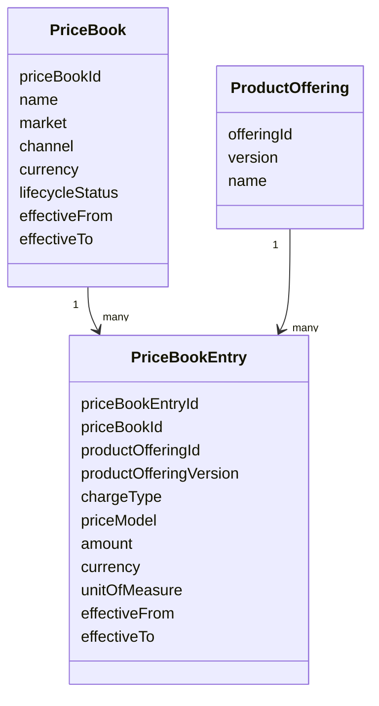
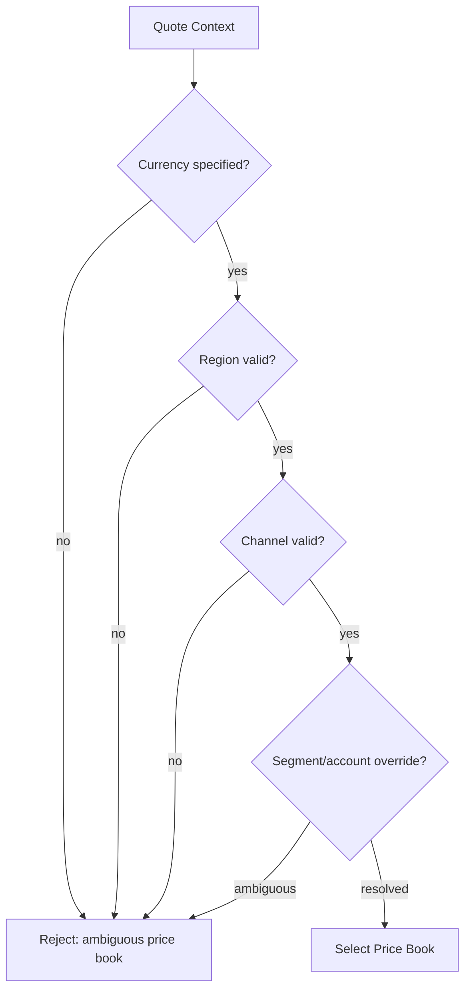
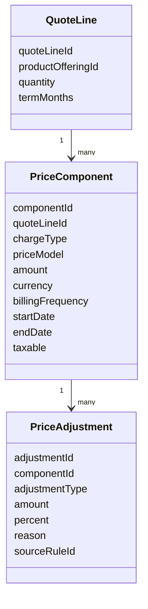
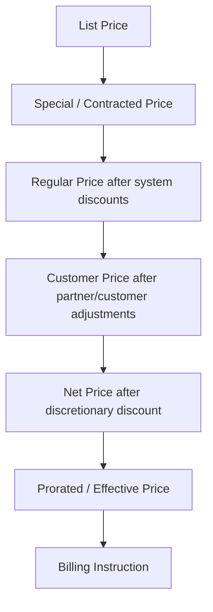
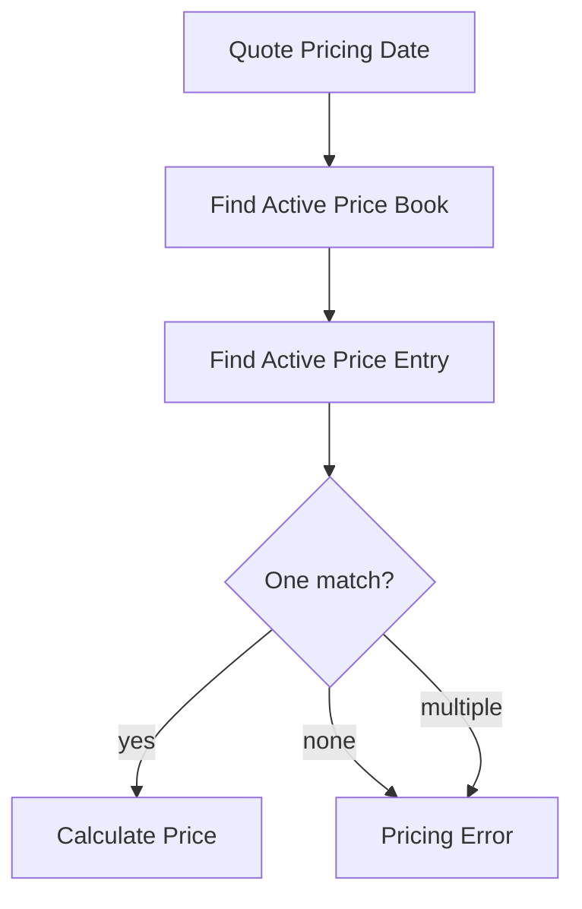
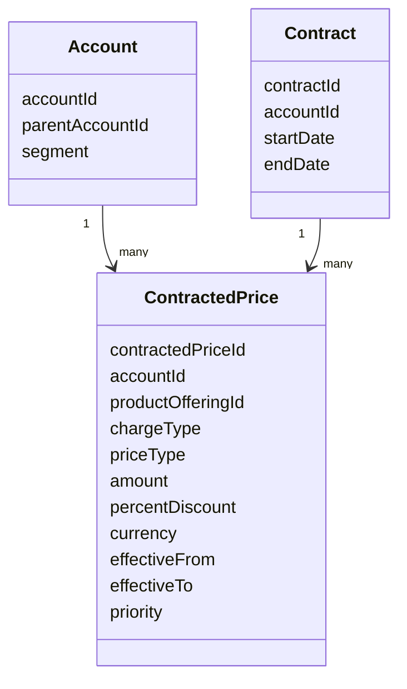
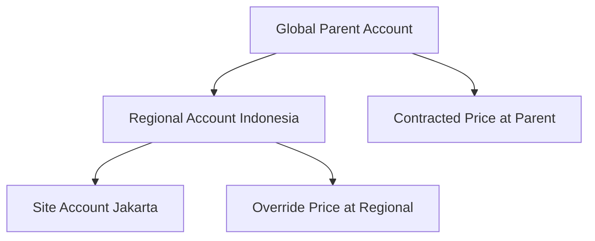
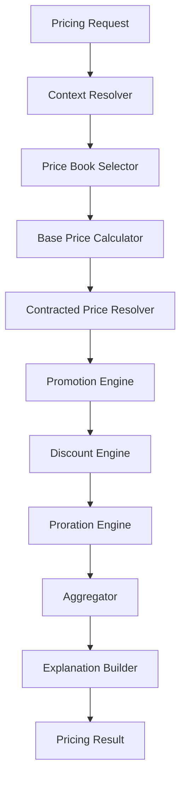

# Part 010 — Enterprise Pricing Model

Pricing adalah bagian CPQ yang paling sering terlihat sederhana dari luar, tetapi paling berbahaya di enterprise.

Dari perspektif user, pricing terlihat seperti:

```text
pilih produk -> lihat harga -> kasih diskon -> kirim quote
```

Dari perspektif enterprise system, pricing adalah komposisi dari:

- product offering,
- price book,
- customer segment,
- account hierarchy,
- contracted price,
- currency,
- region,
- term,
- quantity,
- bundle relationship,
- promotion,
- discount policy,
- tax boundary,
- billing frequency,
- proration,
- approval threshold,
- revenue recognition input,
- audit evidence.

Salesforce CPQ, misalnya, memakai konsep price waterfall untuk menurunkan net price dari list price melalui beberapa tahap pricing dan discounting. Salesforce CPQ juga memiliki price rules yang dapat mengotomasi kalkulasi harga dan memperbarui quote line fields, serta konsep contracted price yang dapat diwariskan melalui account hierarchy. Ini bukan untuk meniru Salesforce, tetapi untuk menunjukkan bahwa CPQ enterprise selalu membutuhkan **pricing pipeline yang eksplisit, terurut, dan bisa dijelaskan**.

> Goal part ini: kamu mampu mendesain pricing model yang deterministic, auditable, versioned, scalable, dan aman untuk revenue; bukan hanya membuat formula harga.

---

## 1. Kaufman Target Performance

Setelah bagian ini, kamu harus bisa:

1. Membedakan list price, base price, regular price, customer price, contract price, net price, dan billing price.
2. Mendesain price book dengan region, currency, channel, segment, effective date, dan lifecycle.
3. Menjelaskan recurring charge, one-time charge, usage charge, tiered price, block price, ramp price, and minimum commitment.
4. Mendesain price waterfall yang deterministic dan explainable.
5. Menentukan kapan harga di-snapshot, direcalculate, atau direference.
6. Membuat invariant pricing untuk mencegah revenue leakage.
7. Mendesain pricing test set/golden master.

---

## 2. Mental Model: Price Is Not One Number

Dalam enterprise CPQ, “harga” adalah hasil pipeline.

```mermaid
flowchart LR
  A[Product Offering]
  B[Price Book Entry]
  C[Base/List Price]
  D[Context Adjustments\nregion, channel, segment]
  E[Contracted Price]
  F[Promotions / System Discounts]
  G[Manual Discounts]
  H[Proration / Term Adjustment]
  I[Net Price]
  J[Billing Instructions]
  K[Quote Price Snapshot]

  A --> B --> C --> D --> E --> F --> G --> H --> I --> J --> K
```



Satu quote line bisa memiliki banyak price components:

```text
List Price:              Rp10.000.000 / month
Regional Adjustment:      +Rp1.000.000
Contracted Discount:      -Rp2.000.000
Promotion Discount:       -Rp500.000
Manual Discount:          -Rp300.000
Proration:                 x 0.5 for half month
Net Price:                Rp4.100.000 for first billing period
```

Jika sistem hanya menyimpan `price = 4100000`, engineer berikutnya tidak bisa menjawab:

- dari mana angka itu muncul,
- discount mana yang sah,
- siapa yang approve,
- apakah promotion masih berlaku,
- apakah tax sudah termasuk,
- apakah billing harus monthly atau annual,
- apakah renewal harus memakai harga itu lagi.

---

## 3. Price Terminology

| Term | Meaning | Example |
|---|---|---|
| List Price | Harga publik/default dari price book | Rp10M/month |
| Base Price | Harga awal sebelum adjustment; kadang sama dengan list price | Rp10M/month |
| Regular Price | Harga setelah system-level adjustment sebelum discretionary discount | Rp8M/month |
| Customer Price | Harga setelah customer/account-specific condition | Rp7.5M/month |
| Contract Price | Harga yang sudah dinegosiasikan/terikat kontrak | Rp7M/month |
| Net Price | Harga final line setelah discount dan adjustment | Rp6.8M/month |
| Billing Price | Instruksi harga yang benar-benar dikirim ke billing | Rp6.8M monthly recurring |
| Effective Price | Harga untuk periode tertentu setelah proration/ramp | Rp3.4M untuk half month |
| Unit Price | Harga per unit | Rp100K/seat/month |
| Extended Price | Unit price x quantity | Rp10M for 100 seats |
| Total Contract Value | Nilai kontrak total sepanjang term | Rp240M |
| Annual Contract Value | Nilai tahunan | Rp120M/year |
| Monthly Recurring Revenue | Revenue recurring per bulan | Rp10M/month |

Terminology harus disepakati lintas sales, finance, billing, legal, and product. Jika tidak, angka yang sama akan diberi nama berbeda oleh setiap tim.

---

## 4. Price Book Model

Price book adalah struktur harga yang bisa dipakai untuk market/channel/customer tertentu.

### 4.1 Basic Model



### 4.2 Price Book Dimensions

| Dimension | Example | Why it matters |
|---|---|---|
| Currency | IDR, USD, EUR | Quote and billing currency correctness |
| Region | Indonesia, SG, EU | Local market price and tax boundary |
| Channel | Direct, partner, online | Different commercial policy |
| Segment | SMB, enterprise, public sector | Different discount and package rules |
| Legal Entity | PT A vs PT B | Accounting and contracting boundary |
| Effective Date | 2026-07-01 | Historical and future pricing |
| Product Version | v2026.04 | Catalog compatibility |
| Lifecycle | Draft, active, retired | Governance and release control |

### 4.3 Price Book Selection

Price book selection is a policy decision.



Invariant:

> Untuk setiap quote line yang priceable, sistem harus bisa memilih tepat satu applicable price book entry untuk context tertentu, atau gagal dengan error yang eksplisit.

---

## 5. Charge Types

Enterprise pricing jarang hanya satu charge.

| Charge Type | Meaning | Example |
|---|---|---|
| One-Time Charge / OTC | Dibayar sekali | Installation fee |
| Recurring Charge / MRC/ARR | Dibayar per periode | Monthly license fee |
| Usage Charge | Berdasarkan konsumsi | API calls, GB transferred |
| Minimum Commitment | Minimum spend/usage | Rp100M/year minimum |
| Overage Charge | Di atas allowance | RpX per GB over quota |
| Penalty / Early Termination Fee | Fee akibat terminate early | 3 months remaining MRC |
| Credit | Negative charge | Service credit |
| Deposit | Upfront guarantee | Security deposit |
| Tax / Fee | Government or regulatory charge | VAT, service fee |

### 5.1 Charge Component Model



Satu quote line dapat memiliki:

```text
Line: Enterprise Fiber 1Gbps
- OTC: Installation fee Rp5M
- MRC: Service fee Rp10M/month
- Usage: Overage bandwidth RpX/GB
- Discount: 15% on MRC only
- Promotion: Waive installation fee
```

Kalau model harga hanya satu number per line, kasus di atas tidak bisa direpresentasikan dengan aman.

---

## 6. Price Models

### 6.1 Flat Price

Harga tetap.

```text
Rp10.000.000 / month
```

Cocok untuk layanan sederhana.

### 6.2 Per-Unit Price

```text
Rp100.000 / seat / month
Total = unitPrice * quantity
```

Pitfall: definisikan rounding, minimum quantity, and unit of measure.

### 6.3 Tiered Price

Harga berubah berdasarkan tier quantity.

| Quantity | Unit Price |
|---:|---:|
| 1-100 | Rp100K |
| 101-500 | Rp90K |
| 501+ | Rp80K |

Ada dua gaya:

| Style | Meaning | Example for 150 units |
|---|---|---|
| Volume pricing | Semua unit memakai tier yang dicapai | 150 x Rp90K |
| Graduated pricing | Tiap bracket dihitung sendiri | 100 x Rp100K + 50 x Rp90K |

Jangan mencampur dua gaya ini tanpa field eksplisit.

### 6.4 Block Price

Customer membeli block.

```text
1 block = 100 API calls
Rp50.000 per block
150 calls -> 2 blocks -> Rp100.000
```

Butuh rounding rule: ceil, floor, nearest, exact.

### 6.5 Usage Price

Harga berdasarkan consumption aktual.

```text
Rp10 per API call after first 1M calls
```

CPQ biasanya membuat rating instruction, bukan final usage amount. Billing/rating engine menghitung berdasarkan usage aktual.

### 6.6 Ramp Price

Harga berubah per periode.

| Period | MRC |
|---|---:|
| Year 1 | Rp8M/month |
| Year 2 | Rp10M/month |
| Year 3 | Rp12M/month |

Ramp pricing butuh schedule, bukan satu price.

### 6.7 Attribute-Based Price

Harga bergantung pada konfigurasi.

```text
Base: Rp5M
Bandwidth 500Mbps: +Rp2M
Bandwidth 1Gbps: +Rp5M
Managed router: +Rp1M
Premium SLA: +Rp3M
```

Ini menghubungkan pricing engine dengan configurator. Harus deterministic dan explainable.

### 6.8 Cost-Plus / Margin-Based Price

```text
Price = cost / (1 - targetMargin)
```

Cocok untuk custom deal, hardware, procurement-based service, or project-based quote. Perlu cost source yang jelas dan approval jika margin rendah.

---

## 7. Price Waterfall

Price waterfall adalah urutan transformasi harga.



Contoh pipeline:

| Step | Amount | Explanation |
|---|---:|---|
| List Price | 10,000,000 | Price book ID PB-IDR-ENT |
| Contracted Price | 9,000,000 | Account has negotiated price |
| Bundle Discount | 8,550,000 | 5% bundle discount |
| Promotion | 8,050,000 | Rp500K campaign discount |
| Manual Discount | 7,750,000 | Sales discretionary discount |
| Proration | 3,875,000 | Half-month effective period |

Pricing engine harus mengembalikan **explanation**, bukan hanya number.

```json
{
  "netPrice": 7750000,
  "currency": "IDR",
  "waterfall": [
    {
      "step": "LIST_PRICE",
      "amount": 10000000,
      "source": "PB-IDR-ENT:entry-001"
    },
    {
      "step": "CONTRACTED_PRICE",
      "amount": 9000000,
      "source": "contracted-price-123"
    },
    {
      "step": "BUNDLE_DISCOUNT",
      "adjustment": -450000,
      "amount": 8550000,
      "source": "bundle-rule-020"
    },
    {
      "step": "PROMOTION",
      "adjustment": -500000,
      "amount": 8050000,
      "source": "promo-2026-midyear"
    },
    {
      "step": "MANUAL_DISCOUNT",
      "adjustment": -300000,
      "amount": 7750000,
      "source": "sales-user-approval-pending"
    }
  ]
}
```

---

## 8. Currency and FX

Multi-currency pricing tidak boleh dianggap sebagai formatting.

Pertanyaan desain:

1. Apakah harga disimpan per currency atau dikonversi dari master currency?
2. Rate FX siapa yang digunakan?
3. Kapan rate dikunci?
4. Apakah quote price valid jika FX berubah?
5. Apakah billing menerima currency yang sama?
6. Apakah rounding berbeda per currency?
7. Apakah tax engine butuh local currency?

### 8.1 Currency Invariants

1. Quote line harus punya currency eksplisit.
2. Semua price components dalam quote total harus currency-compatible.
3. FX conversion harus menyimpan source rate dan timestamp.
4. Net price tidak boleh dikonversi ulang tanpa explicit reprice.
5. Billing instruction harus menyatakan currency final.

### 8.2 Rounding

Rounding harus policy-driven.

| Currency | Minor unit | Example |
|---|---:|---|
| IDR | 0 | Rp10.001,4 -> Rp10.001 or Rp10.002 depending policy |
| USD | 2 | $10.005 -> $10.01 depending rounding mode |
| JPY | 0 | ¥100.5 -> ¥101 |

Rounding field:

```json
{
  "roundingMode": "HALF_UP",
  "roundingScale": 0,
  "roundingAppliedAt": "LINE_COMPONENT"
}
```

Jangan melakukan rounding diam-diam di UI saja. Rounding adalah bagian dari pricing result.

---

## 9. Effective Dating

Pricing harus punya waktu berlaku.

### 9.1 Effective Date Types

| Date | Meaning |
|---|---|
| Price book effective date | Kapan price entry bisa dipakai |
| Quote pricing date | Tanggal context harga quote dihitung |
| Quote validity date | Sampai kapan harga ditawarkan valid |
| Order effective date | Kapan produk/perubahan mulai berlaku |
| Billing start date | Kapan charge mulai ditagihkan |
| Contract start/end date | Periode legal commitment |

### 9.2 Time-Based Price Selection



Invariant:

> Tidak boleh ada dua active price entries untuk product, price book, charge type, currency, dan overlapping effective period yang sama.

SQL detection:

```sql
select a.price_book_entry_id, b.price_book_entry_id
from price_book_entry a
join price_book_entry b
  on a.price_book_id = b.price_book_id
 and a.product_offering_id = b.product_offering_id
 and a.charge_type = b.charge_type
 and a.currency = b.currency
 and a.price_book_entry_id <> b.price_book_entry_id
 and a.effective_from < coalesce(b.effective_to, '9999-12-31')
 and b.effective_from < coalesce(a.effective_to, '9999-12-31');
```

---

## 10. Customer-Specific and Contracted Pricing

Enterprise customers sering memiliki harga khusus.

Model:



### 10.1 Inheritance

Account hierarchy dapat memiliki price inheritance.



Resolution policy harus eksplisit:

1. Most specific account wins.
2. Active contract price overrides account inherited price.
3. Product-specific price overrides category-level price.
4. Explicit zero discount can block parent inheritance.
5. If conflict remains, fail pricing rather than guessing.

### 10.2 Contracted Price Types

| Type | Example |
|---|---|
| Fixed price | Fiber 1Gbps = Rp8M/month |
| Percent discount | 20% off list price |
| Amount discount | Rp2M off MRC |
| Price cap | Max Rp9M/month |
| Floor commitment | Minimum Rp100M/year |
| Custom ramp | Year 1 Rp8M, Year 2 Rp10M |

---

## 11. Quantity and Term

Quantity and term are not just inputs; they affect price eligibility.

### 11.1 Quantity

Questions:

- Is quantity integer or decimal?
- Does quantity mean seats, devices, sites, bandwidth, licenses, blocks?
- Is there minimum quantity?
- Is there maximum quantity?
- Is quantity aggregated across bundle/account/contract?
- Does discount schedule use line quantity or total quantity?

### 11.2 Term

Term affects:

- eligibility,
- price level,
- discount approval,
- contract value,
- renewal,
- proration,
- early termination fee.

Example:

| Term | Monthly Price | Discount |
|---:|---:|---:|
| 12 months | Rp10M | 0% |
| 24 months | Rp9M | 10% |
| 36 months | Rp8.5M | 15% |

Invariant:

> Term-based discount must store original term, effective start/end date, and policy source. Otherwise amendment and early termination cannot be calculated safely.

---

## 12. Bundled Pricing

Bundle pricing can be modeled several ways.

| Model | Meaning | Example |
|---|---|---|
| Parent-only price | Bundle has one price; children zero-priced | Managed Connectivity Rp15M |
| Child-sum price | Children each priced and summed | Fiber + Router + SLA |
| Parent discount on child sum | Child prices calculated, bundle discount applied | 10% off total |
| Option price override | Child option gets special price inside bundle | Router discounted to Rp0 |
| Included allowance | Some quantity included, overage charged | 100GB included |

### 12.1 Bundle Price Allocation

Even if parent-only price is shown to sales, finance may need allocation.

```text
Bundle net price: Rp15M/month
Allocation:
- Fiber Access: Rp10M
- Router: Rp2M
- Support: Rp3M
```

Why allocation matters:

- revenue recognition,
- product profitability,
- tax category,
- partner commission,
- termination credit,
- renewal repricing.

---

## 13. Tax Boundary

CPQ pricing and tax calculation are related but not identical.

In many architectures:

- CPQ computes commercial price before tax.
- Tax engine computes tax based on jurisdiction, product taxability, customer exemption, legal entity, and invoice context.
- Billing owns final invoice calculation.

Pricing result should state tax treatment boundary:

```json
{
  "netPrice": 7750000,
  "taxIncluded": false,
  "taxCategory": "TELECOM_SERVICE",
  "taxCalculationOwner": "BILLING_TAX_ENGINE"
}
```

Do not hide tax assumption inside price amount.

---

## 14. Pricing Snapshot

When quote is presented, snapshot pricing result.

Snapshot should include:

1. price book ID and version,
2. price book entry ID,
3. pricing date,
4. product offering version,
5. account/customer context,
6. selected currency,
7. all price components,
8. all adjustments,
9. pricing rules applied,
10. rule versions,
11. manual discount actor/reason,
12. approval status,
13. rounding policy,
14. tax boundary,
15. quote validity date.

### 14.1 Snapshot vs Reprice

| Situation | Use snapshot | Reprice |
|---|---:|---:|
| View accepted quote | Yes | No |
| Submit order from valid quote | Yes, with validation | Maybe limited |
| Quote expired | No | Yes |
| Catalog changed after quote | Yes for audit | Revalidate compatibility |
| Customer changes quantity | No | Yes |
| Manual discount changed | No | Yes |
| Renewal after term end | No | Yes based on renewal policy |
| Amendment effective mid-term | Use existing asset snapshot + delta pricing | Yes for delta |

Invariant:

> Accepted quote price is evidence. Do not mutate it. Create revision or reprice result instead.

---

## 15. Pricing Engine Boundary

Pricing engine should be deterministic service/function.

Inputs:

- quote context,
- account context,
- product configuration,
- catalog reference,
- price book reference,
- contract/asset context,
- promotions,
- manual adjustments,
- pricing date.

Outputs:

- price components,
- adjustments,
- totals,
- explanation,
- warnings,
- approval triggers,
- billing instructions,
- trace ID.



### 15.1 Pricing Request Example

```json
{
  "pricingDate": "2026-07-02",
  "accountId": "acct-456",
  "currency": "IDR",
  "channel": "DIRECT",
  "region": "ID",
  "quoteLines": [
    {
      "lineId": "ql-001",
      "productOfferingId": "fiber-enterprise-1g",
      "productOfferingVersion": "2026.04",
      "quantity": 1,
      "termMonths": 24,
      "configuration": {
        "bandwidth": "1Gbps",
        "managedRouter": true
      }
    }
  ]
}
```

### 15.2 Pricing Result Example

```json
{
  "pricingResultId": "pr-123",
  "status": "PRICED",
  "currency": "IDR",
  "totals": {
    "monthlyRecurring": 7750000,
    "oneTime": 0,
    "totalContractValue": 186000000
  },
  "approvalTriggers": [
    {
      "type": "DISCOUNT_ABOVE_THRESHOLD",
      "severity": "APPROVAL_REQUIRED",
      "message": "Manual discount exceeds sales rep threshold"
    }
  ],
  "lines": []
}
```

---

## 16. Revenue Leakage Failure Modes

Pricing failure directly leaks revenue or creates customer/legal disputes.

| Failure | Example | Impact |
|---|---|---|
| Wrong price book | Indonesia quote uses US price | Margin loss/legal issue |
| Stale price | Expired promotion still applied | Revenue leakage |
| Double discount | Contract discount + promotion both applied incorrectly | Margin loss |
| Missing approval | Sales applies 50% discount | Governance breach |
| Wrong proration | Full month charged for half-month | Customer dispute |
| Rounding mismatch | CPQ and billing totals differ | Invoice dispute |
| Currency mismatch | Quote USD, billing IDR without agreed FX | Legal/payment issue |
| Bundle allocation missing | Finance cannot recognize revenue correctly | Accounting issue |
| Reprice after acceptance | Customer accepted one price, order uses another | Legal issue |
| Hidden tax assumption | Price shown as tax inclusive but billed exclusive | Trust/compliance issue |

---

## 17. Pricing Invariants

Use these as design/test guardrails:

1. Every priced quote line has currency.
2. Every price component has charge type.
3. Every price component has source price entry or rule source.
4. Every adjustment has reason and source.
5. Manual discount has actor and authorization context.
6. Net price cannot be negative unless component type is credit and policy allows it.
7. Price book selection must resolve to exactly one applicable entry.
8. Price entry effective periods cannot overlap for same dimension set.
9. Quote total equals sum of rounded line/component totals according to policy.
10. Billing instruction must be derivable from pricing result.
11. Accepted quote price snapshot must not mutate.
12. Reprice creates a new pricing result version.
13. Pricing result must be explainable to sales, finance, and audit.
14. Discount stacking order must be deterministic.
15. Contracted price conflict must fail closed.

---

## 18. Testing Strategy

### 18.1 Golden Master Pricing Tests

Create dataset like:

| Test | Context | Expected |
|---|---|---|
| Base list price | IDR enterprise direct | Rp10M MRC |
| Region adjustment | Remote region | Rp11M MRC |
| Contracted price | Parent account price | Rp9M MRC |
| Specific account override | Child account override | Rp8.5M MRC |
| Promotion active | Promo date inside window | Rp500K off |
| Promotion expired | Promo date outside window | No promo |
| Manual discount allowed | 5% discount | No approval |
| Manual discount excessive | 30% discount | Approval required |
| Tiered volume | 150 seats volume | Correct tier |
| Graduated tier | 150 seats graduated | Correct bracket sum |
| Ramp price | 3-year ramp | Period schedule created |
| Coterm add-on | 18-month remaining | Prorated/coterm schedule |
| Currency rounding | IDR no decimals | Correct rounding |
| Duplicate price entry | overlapping effective dates | Pricing error |

### 18.2 Metamorphic Tests

Metamorphic testing checks relationships, not only fixed expected values.

Examples:

1. Increasing quantity should not reduce total price unless discount rule explicitly allows it.
2. Moving pricing date outside promotion window should remove promotion.
3. Reordering independent quote lines should not change totals.
4. Applying same idempotency key should produce same pricing result.
5. Removing a required bundle parent should invalidate child bundle price.
6. Same request with same catalog/price/rule version should produce same result.

---

## 19. Operational Observability

Pricing needs operational telemetry.

Metrics:

- pricing latency p50/p95/p99,
- pricing error rate by reason,
- no price found count,
- multiple price found count,
- discount approval trigger rate,
- average discount by segment/product/rep,
- promotion usage,
- price override count,
- CPQ vs billing mismatch count,
- stale quote reprice count.

Logs/traces should include:

- pricing result ID,
- quote ID,
- account ID,
- price book ID,
- rule versions,
- correlation ID,
- execution steps,
- warning/error codes.

Do not log confidential customer-specific prices to unrestricted logs.

---

## 20. Common Anti-Patterns

### 20.1 One Price Field per Quote Line

A single `price` column cannot explain components, adjustments, charge types, taxes, billing schedule, or approval.

### 20.2 UI-Only Pricing Logic

If pricing logic lives in UI, API, batch, quote PDF, and billing will diverge.

### 20.3 Spreadsheet as Runtime Source

Spreadsheet can be authoring/import medium, but runtime pricing needs versioned, validated, queryable data.

### 20.4 Implicit Discount Stacking

If stacking order is not explicit, every migration or rule change can alter price unexpectedly.

### 20.5 Repricing Accepted Quotes Silently

This destroys customer trust and legal evidence.

### 20.6 Ignoring Billing Compatibility

A price CPQ can display but billing cannot invoice is not a valid enterprise price.

### 20.7 No Explanation Engine

If sales, finance, and audit cannot understand the result, pricing will be manually overridden.

---

## 21. Design Review Checklist

- [ ] Are price book dimensions explicit?
- [ ] Is price book selection deterministic?
- [ ] Are charge types modeled separately?
- [ ] Are recurring, one-time, usage, minimum, overage, penalty, and credit supported?
- [ ] Are effective dates modeled for price entries?
- [ ] Are contract/account-specific prices supported?
- [ ] Is account hierarchy inheritance deterministic?
- [ ] Is discount stacking explicit?
- [ ] Is price waterfall explainable?
- [ ] Is currency and rounding policy explicit?
- [ ] Is quote pricing snapshotted?
- [ ] Is reprice versioned?
- [ ] Can pricing result produce billing instruction?
- [ ] Are approval triggers included in result?
- [ ] Are golden master tests maintained?
- [ ] Are CPQ vs billing mismatches monitored?

---

## 22. Practice: Build a Pricing Model

Latihan 90 menit:

1. Pilih produk: `Enterprise Fiber 1Gbps`.
2. Definisikan price book untuk:
   - IDR Enterprise Direct,
   - IDR Partner,
   - USD Enterprise Direct.
3. Tambahkan charge:
   - MRC service fee,
   - OTC installation fee,
   - usage overage.
4. Tambahkan term discount:
   - 12 bulan: 0%,
   - 24 bulan: 10%,
   - 36 bulan: 15%.
5. Tambahkan contracted price untuk parent account.
6. Tambahkan child account override.
7. Tambahkan promotion yang waive installation fee.
8. Buat waterfall untuk quote 24 bulan.
9. Buat pricing snapshot JSON.
10. Buat 15 golden test cases.

Deliverable:

- Mermaid pricing pipeline,
- price book table,
- waterfall table,
- pricing result JSON,
- invariant checklist.

---

## 23. Summary

Enterprise pricing adalah pipeline deterministik, bukan formula tunggal. Sistem yang baik tidak hanya menjawab “berapa harga final”, tetapi juga:

- harga berasal dari price book mana,
- rule apa yang diterapkan,
- discount apa yang valid,
- siapa yang boleh override,
- promotion mana yang aktif,
- currency dan rounding apa yang dipakai,
- billing harus menerima instruksi apa,
- apakah harga masih valid,
- apakah approval dibutuhkan,
- apakah audit bisa menjelaskan hasilnya.

Core mental model:

```text
Price Book + Context + Configuration + Contract + Policy + Time
= Explainable Pricing Result
```

Jika pricing model benar, CPQ menjadi sistem revenue-safe. Jika pricing model salah, setiap quote adalah potensi margin leakage, billing dispute, legal issue, atau manual exception.

---

## References

- Salesforce Help — Salesforce CPQ Price Waterfall: CPQ derives net price from list price through multi-step pricing.
- Salesforce Help — Price Rules in Salesforce CPQ: price rules automate calculations and update quote line fields.
- Salesforce Help — Contracted Pricing in Salesforce CPQ: contracted prices can inherit through parent account hierarchy and override inherited prices.
- TM Forum — TMF622 Product Ordering API: product orders are created from catalog-defined product offerings that include pricing, options, and market characteristics.
