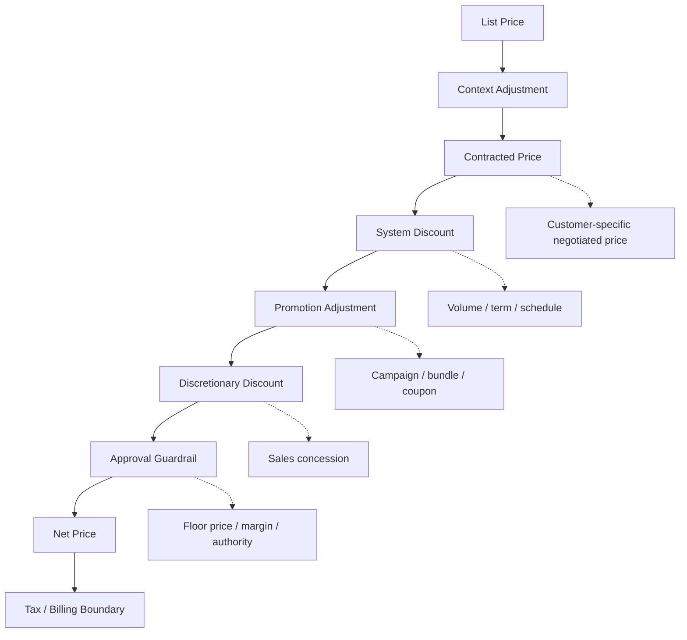
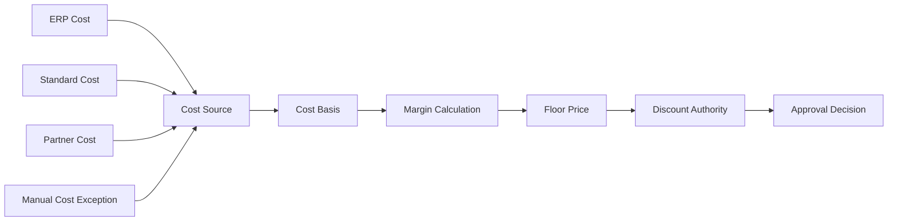
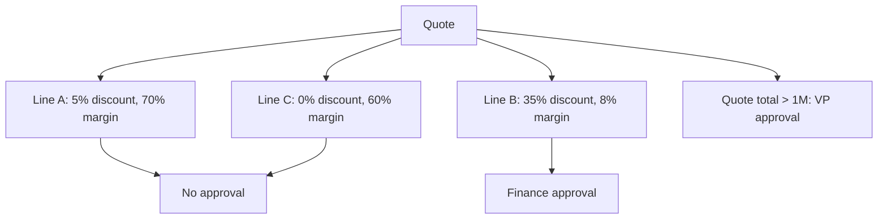
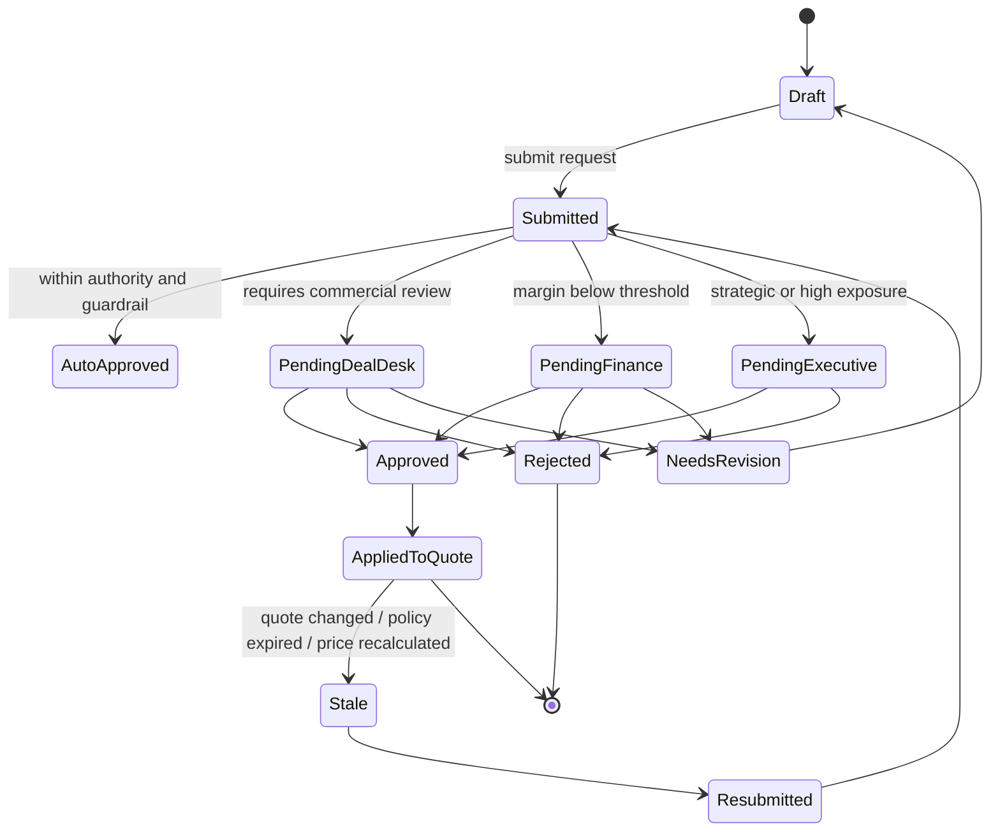
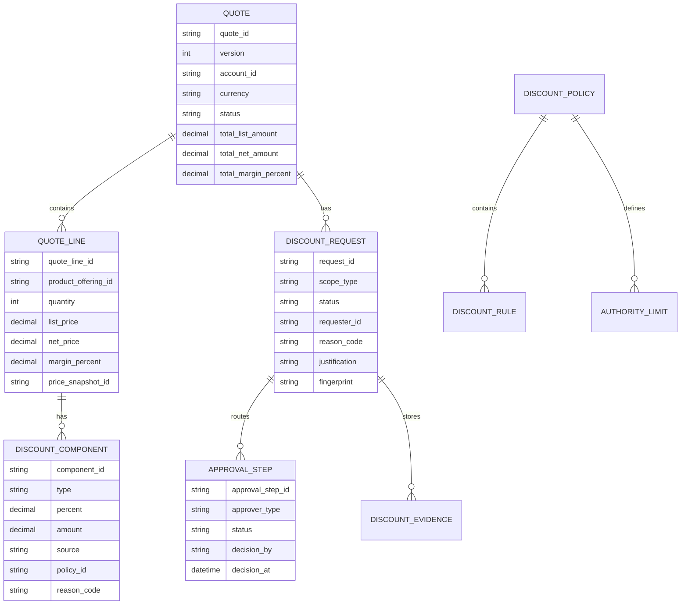
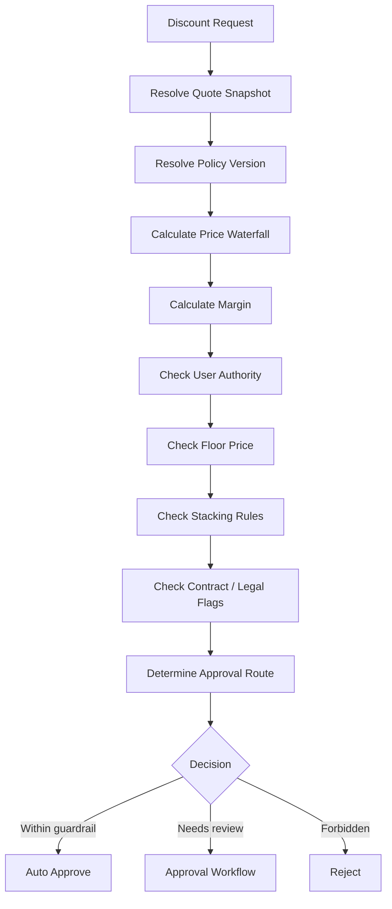

# Part 011 — Discounting, Deal Desk, and Margin Governance

Discounting adalah tempat enterprise CPQ paling sering kehilangan uang secara diam-diam.

Bukan karena sales sengaja salah. Biasanya karena sistem membiarkan terlalu banyak interpretasi:

- discount boleh diberikan, tapi tidak jelas sampai batas mana,
- approval ada, tapi threshold-nya tidak konsisten,
- margin dihitung, tapi cost basis-nya tidak jelas,
- partner price berbeda, tapi guardrail-nya sama dengan direct sales,
- quote sudah approved, tapi setelah diedit tidak re-approved,
- bundle discount diberikan dua kali,
- contracted price bercampur dengan discretionary discount,
- approval hanya melihat total quote, bukan line-level risk,
- quote PDF tidak menyimpan alasan dan bukti approval.

Part ini membahas discounting bukan sebagai tombol `Apply Discount`, tetapi sebagai **financial control system**.

> Goal part ini: kamu mampu mendesain discounting dan deal desk governance yang deterministic, auditable, defensible, dan menjaga margin tanpa membunuh fleksibilitas sales.

---

## 1. Kaufman Target Performance

Setelah bagian ini, kamu harus bisa:

1. Membedakan system discount, discretionary discount, strategic discount, partner discount, promotion, rebate, contracted price, dan price override.
2. Mendesain discount guardrail berdasarkan product, customer segment, channel, quantity, term, geography, cost, margin, dan approval authority.
3. Membuat approval threshold yang line-level dan quote-level.
4. Mendesain deal desk workflow untuk exception, escalation, delegation, dan evidence.
5. Mencegah revenue leakage akibat double discounting, stale approval, expired policy, dan incorrect margin basis.
6. Membuat invariant discounting yang bisa diuji otomatis.
7. Mendesain observability untuk margin erosion, approval latency, dan policy bypass.

---

## 2. Mental Model: Discount Is a Controlled Commercial Exception

Diskon bukan sekadar pengurangan harga.

Diskon adalah **commercial exception** terhadap standard price.

```text
standard commercial policy -> customer-specific concession -> approval -> evidence -> enforceable quote
```

Dalam enterprise system, setiap discount harus menjawab lima pertanyaan:

| Pertanyaan | Mengapa penting |
|---|---|
| Siapa yang memberi? | Authority, accountability, and segregation of duties |
| Kenapa diberi? | Business justification and future audit |
| Berapa besar dampaknya? | Margin, revenue, quota, finance impact |
| Berlaku untuk apa? | Product, line, bundle, term, account, region |
| Sampai kapan valid? | Expiry, reapproval, stale policy prevention |

Discounting yang sehat bukan berarti sales tidak boleh fleksibel. Discounting yang sehat berarti fleksibilitasnya **terbatas, dapat dijelaskan, dan dapat dipertanggungjawabkan**.

---

## 3. Discount vs Promotion vs Contracted Price vs Rebate

Banyak desain CPQ rusak karena semua price reduction disebut “discount”. Itu salah.

| Konsep | Karakter | Contoh | Biasanya diputuskan oleh |
|---|---|---|---|
| System discount | Otomatis berdasarkan policy | Volume discount 10% untuk 100+ unit | Pricing/Product Ops |
| Discretionary discount | Diberikan oleh sales/deal desk | Sales memberi tambahan 7% | Sales + Approver |
| Strategic discount | Exception karena alasan strategis | Logo besar, competitive displacement | Executive/Deal Desk |
| Promotion | Campaign commercial offer | Buy 10 get 2 months free | Marketing/Pricing |
| Contracted price | Harga yang sudah dinegosiasikan dalam kontrak | Enterprise customer mendapat unit price $80 | Legal/Sales/Finance |
| Rebate | Pengembalian setelah kondisi terpenuhi | End-of-quarter rebate jika volume tercapai | Finance/Channel Ops |
| Price override | Override langsung terhadap price field | Manual set net price | Highly restricted |

Rule sederhana:

> Jangan menyimpan semua pengurangan harga dalam satu field `discountPercent`.

Karena setiap jenis reduction punya lifecycle, owner, approval, accounting implication, dan audit requirement yang berbeda.

---

## 4. Discount Position in the Price Waterfall

Discounting harus diposisikan eksplisit dalam price waterfall.



Urutan ini bukan satu-satunya kemungkinan, tetapi sistem harus punya **urutan resmi**.

Tanpa urutan resmi:

- promotion bisa diterapkan setelah manual discount padahal seharusnya sebelum,
- contracted price bisa dianggap sebagai discount padahal bukan,
- approval threshold berubah tergantung urutan kalkulasi,
- quote replay tidak menghasilkan angka yang sama,
- finance tidak bisa menjelaskan revenue leakage.

### 4.1 Principle: discount calculation must be replayable

Setiap discount decision harus bisa direkonstruksi:

```json
{
  "quoteLineId": "QL-10001",
  "listPrice": 1000,
  "contractedPrice": 900,
  "systemDiscount": 0.05,
  "promotionDiscount": 0.10,
  "manualDiscount": 0.07,
  "netPrice": 715.365,
  "roundingPolicy": "HALF_UP_2_DECIMALS",
  "policyVersion": "discount-policy-2026.07.01",
  "approvedBy": ["deal-desk", "finance"],
  "approvalCaseId": "APR-88421"
}
```

Ini bukan sekadar logging. Ini adalah **commercial evidence**.

---

## 5. Discount Taxonomy

### 5.1 System discount

System discount adalah discount yang otomatis muncul dari policy.

Contoh:

- volume discount,
- term discount,
- bundle relationship discount,
- channel discount,
- loyalty discount,
- customer segment discount,
- pre-approved campaign discount.

System discount sebaiknya tidak memerlukan manual approval selama:

1. policy-nya active,
2. quote context memenuhi eligibility,
3. discount tidak melewati guardrail,
4. tidak dikombinasikan dengan discount lain yang prohibited.

### 5.2 Discretionary discount

Discretionary discount adalah concession yang diminta user.

Contoh:

```text
Sales rep: Customer meminta tambahan diskon 8% agar deal close minggu ini.
```

Discretionary discount harus memiliki:

- requester,
- reason code,
- free-text justification,
- effective scope,
- expiration,
- approver authority,
- evidence snapshot.

### 5.3 Strategic discount

Strategic discount biasanya di luar normal policy.

Contoh:

- replace competitor,
- enter new market,
- retain strategic account,
- multi-year enterprise commitment,
- board-level negotiated deal.

Strategic discount sebaiknya tidak hanya disetujui oleh sales manager. Ia membutuhkan finance/legal/business approval karena efeknya bisa menyentuh margin, precedent, and contract obligation.

### 5.4 Partner/channel discount

Partner discount tidak sama dengan customer discount.

Misalnya:

```text
List price:       1000
Partner buy price: 700
Suggested resale: 900
End customer discount: 5%
```

Jika sistem salah memodelkan partner discount sebagai end-customer discount, margin report akan salah.

### 5.5 Price override

Price override adalah mekanisme paling berbahaya.

Aturan enterprise:

> Price override harus menjadi exception path, bukan primary pricing mechanism.

Jika banyak deal membutuhkan price override, berarti pricing model atau catalog model salah.

---

## 6. Discount Scope

Discount bisa berlaku di beberapa level.

| Level | Contoh | Risiko |
|---|---|---|
| Quote-level | 5% untuk seluruh quote | Bisa merusak margin produk tertentu |
| Line-level | 10% untuk product A | Lebih presisi, tetapi lebih kompleks approval |
| Bundle-level | Parent bundle discount | Risiko double discount ke child line |
| Charge-level | Discount hanya recurring charge | One-time charge tidak terdiskon |
| Term-level | Discount tahun pertama saja | Perlu ramp schedule |
| Customer-level | Contracted customer concession | Perlu asset/renewal continuity |
| Channel-level | Distributor discount | Perlu partner margin tracking |

### 6.1 Quote-level discount is dangerous

Quote-level discount mudah untuk UX, tetapi berbahaya untuk margin.

Contoh:

```text
Product A gross margin: 80%
Product B gross margin: 12%
Quote-level discount: 15%
```

Secara total quote mungkin terlihat aman, tetapi Product B bisa dijual di bawah floor margin.

Karena itu enterprise CPQ harus bisa melakukan **allocation** atau **guardrail line-level** meskipun user memberi discount di header.

---

## 7. Margin Governance

Margin governance membutuhkan cost model yang jelas.



### 7.1 Cost basis

Cost basis bisa berbeda:

| Cost basis | Cocok untuk | Risiko |
|---|---|---|
| Standard cost | Simple product | Tidak akurat untuk custom service |
| Average cost | Inventory product | Bisa lagging |
| Marginal cost | SaaS/usage product | Bisa terlalu optimis |
| Fully loaded cost | Enterprise service | Bisa kompleks dan lambat |
| Partner cost | Resale/channel | Perlu partner agreement |
| Estimated delivery cost | Professional service | Risiko underestimation |

### 7.2 Margin formula

```text
Gross Margin Amount = Net Revenue - Cost
Gross Margin %      = (Net Revenue - Cost) / Net Revenue
Markup %            = (Net Revenue - Cost) / Cost
```

Margin dan markup sering tertukar. CPQ harus eksplisit.

Contoh:

```text
Cost = 70
Price = 100
Margin = (100 - 70) / 100 = 30%
Markup = (100 - 70) / 70 = 42.86%
```

Jika approval rule salah memakai markup sebagai margin, threshold akan salah.

### 7.3 Floor price

Floor price adalah harga minimum yang boleh diberikan.

Floor bisa berbasis:

- absolute net price,
- minimum margin percentage,
- minimum margin amount,
- competitive exception,
- regulatory minimum,
- partner agreement,
- country-specific commercial policy.

Contoh policy:

```yaml
policyId: floor-price-saas-enterprise-2026
productFamily: cloud-security
segment: enterprise
defaultMinimumMarginPercent: 35
exceptionMinimumMarginPercent: 20
requiresFinanceApprovalBelowMarginPercent: 30
requiresCfoApprovalBelowMarginPercent: 20
allowBelowCost: false
```

---

## 8. Approval Threshold Design

Approval threshold harus memadukan beberapa dimensi.

Bad design:

```text
If discount > 20%, require approval.
```

Better design:

```text
If line discount > role authority OR margin below floor OR total concession impact > limit OR strategic reason code used, require approval.
```

### 8.1 Dimensions of approval

| Dimension | Example |
|---|---|
| User authority | Sales rep can approve up to 5%, manager up to 15% |
| Product sensitivity | Regulated product needs legal approval |
| Margin risk | Below 30% margin needs finance |
| ARR impact | Deal above $1M needs VP Sales |
| Term | Multi-year non-standard ramp needs finance |
| Region | Country-specific policy |
| Customer type | Public sector requires compliance review |
| Contract deviation | Non-standard legal terms require legal |
| Competitive reason | Competitor displacement requires deal desk |

### 8.2 Line-level vs quote-level approval

Quote-level approval alone misses local risk.



Enterprise CPQ biasanya perlu dua level:

1. **Line approval** untuk product/margin risk.
2. **Quote approval** untuk total commercial exposure.

### 8.3 Approval authority ladder

```text
0-5%       Account Executive
5-15%      Sales Manager
15-25%     Regional Director
25-35%     VP Sales + Finance
35%+       Executive Deal Desk
Below cost CFO exception only
```

Namun authority ladder tidak boleh hanya berbasis discount percent. Produk dengan gross margin 90% dan produk dengan gross margin 15% tidak boleh punya ladder yang sama.

---

## 9. Deal Desk Operating Model

Deal desk bukan hanya approver. Deal desk adalah function yang menjaga quality, speed, and commercial consistency.

### 9.1 Deal desk responsibilities

| Responsibility | Output |
|---|---|
| Commercial review | Approve/reject/modify discount request |
| Policy interpretation | Decide if exception is valid |
| Margin review | Confirm cost and margin basis |
| Precedent control | Prevent dangerous customer expectation |
| Cross-functional routing | Finance, legal, product, delivery |
| Negotiation support | Suggest alternative concession |
| Evidence capture | Store rationale and approval |
| Feedback to pricing team | Identify broken pricing/catalog policy |

### 9.2 Deal desk should suggest alternatives

A mature deal desk does not only say yes/no.

Alternative concession examples:

- give higher discount only for first year,
- increase term length,
- require minimum commitment,
- remove premium support,
- use ramp pricing,
- convert discount to marketing development fund,
- offer training credits instead of price discount,
- bundle additional high-margin product,
- change payment terms,
- require auto-renewal.

This is why discounting is not only math. It is commercial architecture.

---

## 10. Discount Request State Machine



Key design point:

> Approval is for a specific quote snapshot, not for an abstract quote ID forever.

Jika quote line berubah setelah approval, approval bisa menjadi stale.

---

## 11. Stale Approval Model

Approval harus invalid jika commercial basis berubah secara material.

Trigger reapproval:

| Change | Reapproval? | Reason |
|---|---:|---|
| Add new product line | Yes | New commercial risk |
| Increase quantity | Depends | Could improve or worsen margin |
| Decrease quantity | Usually yes | Volume discount basis may break |
| Change term | Yes | ARR/TCV/margin changes |
| Change customer/account | Yes | Eligibility and contracted price change |
| Change currency | Yes | FX and floor price risk |
| Change delivery country | Yes | Tax/regulatory/cost risk |
| Change legal terms | Yes | Non-price commercial risk |
| Update quote description only | No | No commercial impact |

A robust implementation stores an **approval fingerprint**.

```json
{
  "approvalFingerprint": {
    "quoteVersion": 12,
    "pricingSnapshotHash": "sha256:...",
    "discountPolicyVersion": "2026.07.01",
    "catalogVersion": "2026.Q3",
    "lineHashes": ["sha256:line-a", "sha256:line-b"],
    "totalNetAmount": "840000.00",
    "currency": "USD",
    "minimumMarginPercent": "31.4"
  }
}
```

If fingerprint changes materially, approval becomes stale.

---

## 12. Data Model



### 12.1 Discount component is better than one discount field

Bad:

```json
{
  "discountPercent": 30
}
```

Good:

```json
{
  "discountComponents": [
    {
      "type": "VOLUME_DISCOUNT",
      "percent": 10,
      "source": "SYSTEM_POLICY",
      "policyId": "volume-2026-q3"
    },
    {
      "type": "PROMOTION",
      "percent": 5,
      "source": "CAMPAIGN",
      "campaignId": "cloud-migration-q3"
    },
    {
      "type": "DISCRETIONARY_DISCOUNT",
      "percent": 15,
      "source": "SALES_REQUEST",
      "approvalCaseId": "APR-88421"
    }
  ]
}
```

This makes audit, explanation, and reapproval possible.

---

## 13. Policy-as-Data

Discount policy should be manageable without deploying code for every commercial change.

Example:

```yaml
policyId: enterprise-saas-discount-policy-2026-q3
status: ACTIVE
effectiveFrom: 2026-07-01T00:00:00Z
effectiveTo: 2026-10-01T00:00:00Z
scope:
  productFamilies: ["identity", "security", "observability"]
  regions: ["APAC", "EMEA", "NA"]
  channels: ["direct"]
rules:
  - id: ae-default-limit
    when:
      role: ACCOUNT_EXECUTIVE
      productFamily: "identity"
    allow:
      maxManualDiscountPercent: 5
      minMarginPercent: 45
  - id: manager-limit
    when:
      role: SALES_MANAGER
      productFamily: "identity"
    allow:
      maxManualDiscountPercent: 15
      minMarginPercent: 40
  - id: finance-required
    when:
      marginPercentBelow: 35
    requireApproval:
      - FINANCE
  - id: cfo-required
    when:
      marginPercentBelow: 20
    requireApproval:
      - CFO
constraints:
  allowBelowCost: false
  requireReasonCodeForManualDiscount: true
  requireReapprovalOnCommercialChange: true
```

Important: policy-as-data does not mean business users can change anything freely. Policy needs governance, testing, approval, and publishing lifecycle.

---

## 14. Guardrail Evaluation Pipeline



### 14.1 Guardrail result should be explicit

```json
{
  "decision": "REQUIRES_APPROVAL",
  "requiredApprovals": ["FINANCE", "VP_SALES"],
  "violations": [
    {
      "code": "MARGIN_BELOW_MANAGER_LIMIT",
      "message": "Line QL-1 margin 28% is below manager authority minimum 35%",
      "severity": "APPROVAL_REQUIRED"
    }
  ],
  "forbidden": false,
  "policyVersion": "enterprise-saas-discount-policy-2026-q3"
}
```

Do not return only `true/false`. Sales UX needs explanation.

---

## 15. Revenue Leakage Failure Modes

| Failure mode | Example | Control |
|---|---|---|
| Double discounting | Promotion and manual discount both reduce same base | Component model + stacking rules |
| Stale approval | Quote changed after approval | Approval fingerprint |
| Below-floor sale | Net price below cost | Floor price invariant |
| Wrong margin basis | Markup used as margin | Explicit formula and tests |
| Contract price plus discount | Already negotiated price discounted again | Contracted price guardrail |
| Unauthorized override | User edits net price directly | Field-level restriction and audit |
| Expired discount | Old campaign still applied | Effective dating and validation |
| Channel leakage | Partner discount visible to direct customer | Channel-specific price context |
| Currency leakage | USD floor applied to IDR quote without FX policy | Currency-aware floor price |
| Bundle leakage | Parent and child discounted inconsistently | Bundle allocation and rule constraints |

---

## 16. Invariants

A top-tier engineer designs discounting with invariants.

### 16.1 Core invariants

```text
INVARIANT 1:
No quote can be accepted if any line violates a hard floor price rule.

INVARIANT 2:
No discretionary discount can affect net price without requester, reason code, and source.

INVARIANT 3:
No approval is valid after material commercial change unless reapproval policy says otherwise.

INVARIANT 4:
Every net price must be explainable from price waterfall components.

INVARIANT 5:
A discount component must have exactly one source type: SYSTEM, PROMOTION, CONTRACT, USER_REQUEST, or OVERRIDE.

INVARIANT 6:
A quote cannot be converted to order if discount approval status is Pending, Rejected, Expired, or Stale.

INVARIANT 7:
Forbidden stacking rules must be evaluated before approval routing.

INVARIANT 8:
Discount authority is scoped by product, channel, region, role, and margin; not only by user role.
```

### 16.2 Example invariant test

```java
@Test
void approvedDiscountBecomesStaleWhenQuantityDropsBelowVolumeTier() {
    Quote quote = approvedQuoteWithVolumeDiscount(quantity(100));

    quote.changeQuantity(lineId("QL-1"), 50);

    DiscountApproval approval = discountApprovalService.evaluate(quote);

    assertThat(approval.status()).isEqualTo(STALE);
    assertThat(approval.reason()).contains("volume tier basis changed");
}
```

---

## 17. API Boundary

### 17.1 Discount simulation API

```http
POST /discounts/simulations
```

Request:

```json
{
  "quoteId": "Q-10001",
  "quoteVersion": 7,
  "discountRequest": {
    "scope": {
      "type": "QUOTE_LINE",
      "lineId": "QL-1"
    },
    "manualDiscountPercent": 12,
    "reasonCode": "COMPETITIVE_MATCH",
    "justification": "Customer comparing against competitor renewal offer."
  }
}
```

Response:

```json
{
  "simulationId": "SIM-9921",
  "netPriceBefore": "100000.00",
  "netPriceAfter": "88000.00",
  "marginBeforePercent": "42.0",
  "marginAfterPercent": "33.2",
  "decision": "REQUIRES_APPROVAL",
  "requiredApprovals": ["SALES_DIRECTOR", "FINANCE"],
  "violations": [],
  "explanation": [
    "Manual discount exceeds Sales Manager limit of 10%",
    "Margin after discount is below Finance review threshold of 35%"
  ]
}
```

### 17.2 Submit discount request API

```http
POST /quotes/{quoteId}/discount-requests
```

Important fields:

- quote version,
- scope,
- requested discount,
- reason code,
- justification,
- calculated impact,
- policy version,
- fingerprint.

### 17.3 Approval decision API

```http
POST /discount-requests/{requestId}/decisions
```

Decision must include:

- approver identity,
- decision,
- optional modifications,
- comment,
- timestamp,
- authority basis,
- evidence hash.

---

## 18. UX Principles

Discounting UX should guide, not surprise.

### 18.1 Good UX behavior

- Show user authority before submission.
- Explain why approval is needed.
- Show margin impact if user has permission.
- Suggest acceptable alternatives.
- Show stale approval reason.
- Prevent submit if hard-forbidden.
- Allow simulation before formal request.
- Preserve negotiation context.

### 18.2 Bad UX behavior

- User enters discount, system silently changes it.
- Approval is required but reason unknown.
- Quote says approved but order conversion fails later.
- Margin hidden from approver who must approve margin risk.
- Sales can edit net price after approval.

---

## 19. Observability and Metrics

Discounting needs operational visibility.

| Metric | Why it matters |
|---|---|
| Average discount by product family | Detect margin erosion |
| Discount by rep/team/channel | Detect behavior pattern |
| Approval cycle time | Sales velocity |
| Approval rejection rate | Policy friction or poor training |
| Stale approval rate | Quote volatility |
| Below-floor attempts | Policy bypass pressure |
| Manual override count | Pricing model weakness |
| Promotion + manual discount stacking rate | Revenue leakage risk |
| Discount-to-win-rate correlation | Commercial effectiveness |
| Margin leakage by segment | Strategic pricing feedback |

### 19.1 Dashboards

Minimum dashboards:

1. Deal desk queue.
2. High-risk quote queue.
3. Margin erosion dashboard.
4. Approval SLA dashboard.
5. Policy exception dashboard.
6. Discount leakage dashboard.
7. User behavior dashboard.

---

## 20. Testing Strategy

### 20.1 Unit tests

- discount component calculation,
- margin calculation,
- floor price evaluation,
- authority limit resolution,
- stacking rule evaluation,
- stale approval fingerprint.

### 20.2 Golden master tests

Create canonical deal scenarios:

| Scenario | Expected |
|---|---|
| AE asks 4% discount on high-margin product | Auto-approved |
| AE asks 12% discount | Manager approval |
| Manager asks 18% but margin remains high | Director approval |
| Discount puts line below floor | Finance/CFO or reject |
| Contracted price plus manual discount | Approval or forbidden depending policy |
| Promo exclusive with manual discount | Reject stacking |
| Quote changed after approval | Approval stale |
| Currency change after approval | Reapproval |

### 20.3 Property-based tests

Useful properties:

```text
For any quote line:
net price must never be negative.

For any approved discount:
approval fingerprint must match current commercial fingerprint.

For any hard floor rule:
quote acceptance must fail if rule is violated.

For any non-stackable promotion:
manual discount must not apply to same charge basis.
```

### 20.4 Replay tests

Every accepted quote should be replayable from:

- catalog snapshot,
- price snapshot,
- discount policy snapshot,
- promotion snapshot,
- approval evidence.

If replay produces a different net price, that is a severity-1 financial correctness bug.

---

## 21. Common Anti-Patterns

### 21.1 One discount field

`discountPercent` cannot represent system discount, manual discount, promotion, contracted price, and override. It destroys auditability.

### 21.2 Approval only at quote total

Quote total hides product-level risk.

### 21.3 Approval detached from quote version

If approval is tied only to quote ID, users can change quote after approval.

### 21.4 Hardcoding approval rules

Commercial policy changes frequently. Hardcoded approval thresholds create release bottleneck and emergency patches.

### 21.5 Ignoring margin source quality

Margin calculation is only as good as its cost input. If cost is stale or missing, approval decision is misleading.

### 21.6 Allowing net price edits

Direct net price edits bypass price waterfall. If unavoidable, treat as high-risk override with explicit approval.

### 21.7 Not distinguishing partner vs customer discount

This corrupts revenue and channel analytics.

---

## 22. Enterprise Review Checklist

Use this checklist in architecture/design review:

```text
[ ] Are discount components stored separately?
[ ] Is every manual discount linked to requester, reason, and approval/evidence?
[ ] Is discount authority scoped by product, channel, region, role, margin, and amount?
[ ] Are line-level and quote-level risks both evaluated?
[ ] Is approval tied to quote version or commercial fingerprint?
[ ] Can an approved discount become stale after quote change?
[ ] Are floor price and margin formulas explicit?
[ ] Is cost basis versioned and auditable?
[ ] Are stacking/exclusivity rules enforced before approval?
[ ] Can pricing and discounting be replayed after acceptance?
[ ] Are direct net price overrides restricted and audited?
[ ] Are metrics available for margin erosion and approval latency?
```

---

## 23. Kaufman Practice Drill

### Drill 1 — Build discount taxonomy

Take a fictional enterprise SaaS company with:

- direct sales,
- partner channel,
- enterprise accounts,
- volume discount,
- quarterly campaign,
- strategic discount,
- contracted pricing.

Design discount components and decide which are system, promotion, discretionary, contracted, or override.

### Drill 2 — Design approval threshold

Create a policy table for:

- Account Executive,
- Sales Manager,
- Regional Director,
- VP Sales,
- Finance,
- CFO.

Policy must consider:

- discount percent,
- margin percent,
- ARR,
- product family,
- customer segment.

### Drill 3 — Stale approval scenarios

List 15 quote changes and decide whether they trigger reapproval. Explain why.

### Drill 4 — Revenue leakage test cases

Write 10 test cases for double discounting, below-floor discount, stale approval, and wrong cost basis.

---

## 24. Summary

Discounting enterprise-grade is not a UI feature. It is a financial control layer.

The key design principles are:

1. Discount is a controlled commercial exception.
2. Discount components must be explicit, typed, versioned, and auditable.
3. Approval must be tied to quote snapshot, not just quote ID.
4. Margin governance requires reliable cost basis.
5. Guardrails must run before order conversion.
6. Deal desk should optimize both speed and commercial correctness.
7. Every accepted quote must be replayable.

A top 1% engineer does not ask only, “Can the system apply a discount?”

They ask:

> Can the system explain, govern, replay, audit, and defend every discount after the deal is signed?

---

## 25. References

- Salesforce Help — Salesforce CPQ Price Waterfall.
- Salesforce Help — Advanced Approvals for Salesforce CPQ.
- Salesforce Help — Approval Rules.
- Salesforce Help — Approval Variables.
- Salesforce Help — Apply Discount Schedules to a Cost-Priced Product.
- Salesforce Help — Combine Block Pricing with Discount Schedules.
- Oracle Documentation — REST API Services for Oracle CPQ Pricing Rules.
