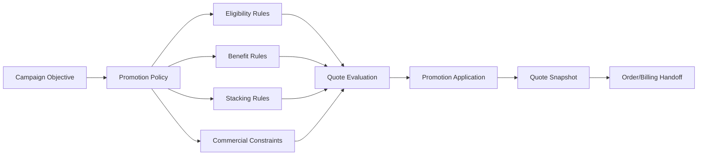
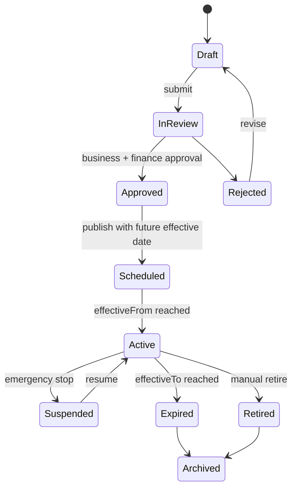
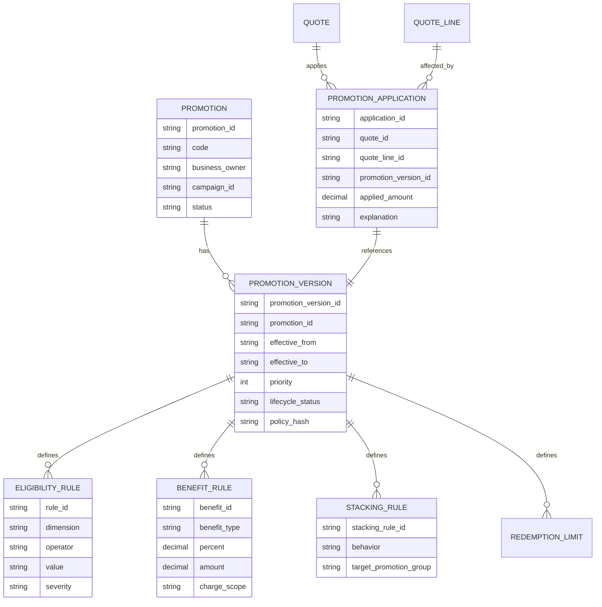
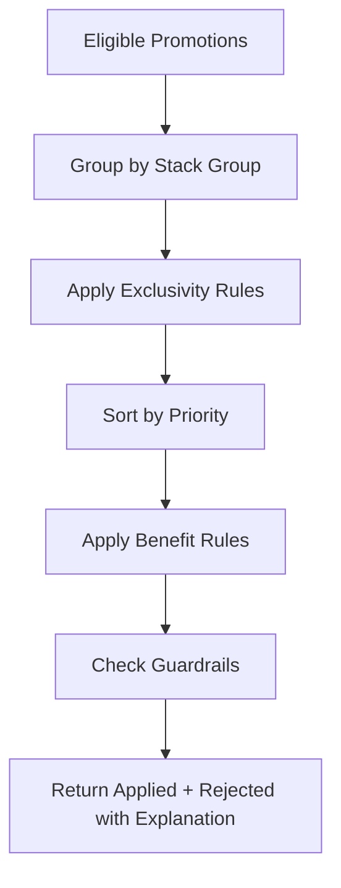
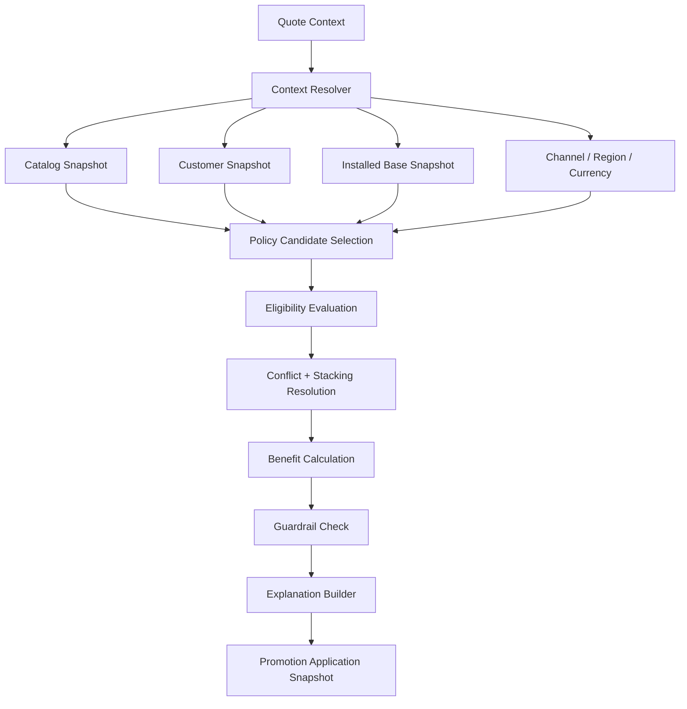
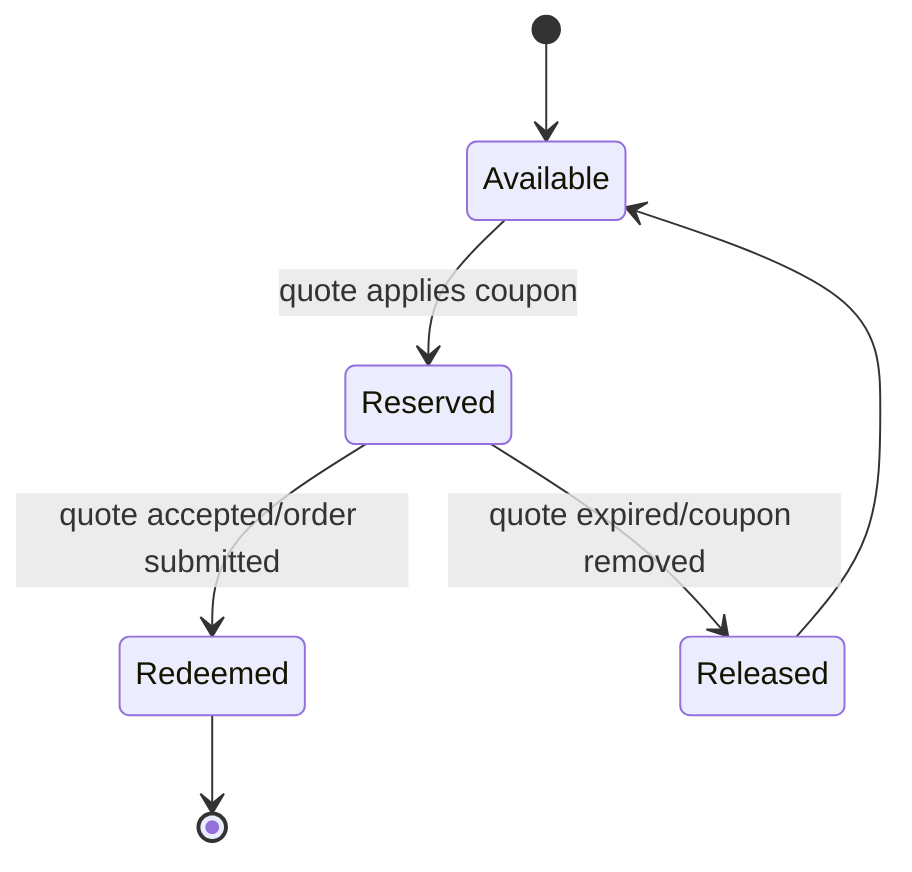
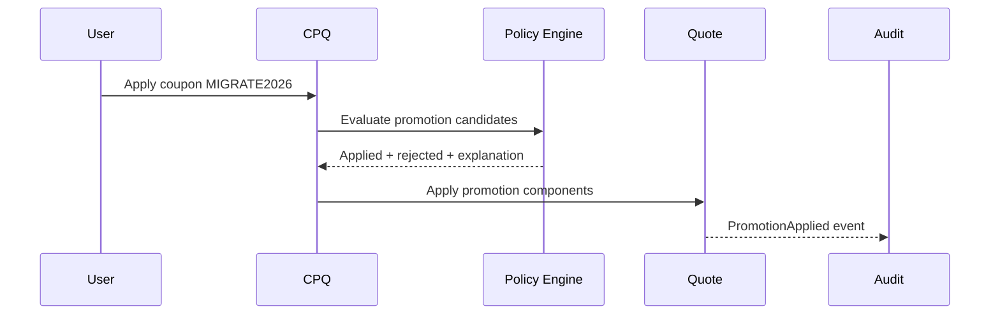

# Part 012 — Promotions, Bundles, and Commercial Policy Engine

Promotion adalah salah satu sumber complexity terbesar dalam CPQ.

Di permukaan, promotion terlihat seperti:

```text
Black Friday 20% off
Buy 2 get 1 free
Free setup fee
First 3 months free
Bundle discount 15%
```

Di enterprise CPQ, promotion menyentuh:

- catalog visibility,
- eligibility,
- pricing waterfall,
- quote line generation,
- discount stacking,
- approval,
- legal terms,
- billing schedule,
- revenue recognition input,
- contract commitment,
- order decomposition,
- fulfillment obligation,
- audit evidence.

Part ini membahas promotion dan bundle bukan sebagai marketing label, tetapi sebagai **commercial policy system**.

> Goal part ini: kamu mampu mendesain promotion, bundle, dan commercial policy engine yang deterministic, explainable, testable, and safe for revenue.

---

## 1. Kaufman Target Performance

Setelah bagian ini, kamu harus bisa:

1. Membedakan promotion, discount, bundle pricing, coupon, campaign, contracted price, and entitlement.
2. Mendesain promotion lifecycle dari authoring sampai retirement.
3. Menentukan stacking, exclusivity, priority, and conflict resolution.
4. Mendesain bundle commercial policy: parent/child price, included items, optional add-ons, and allocation.
5. Membuat policy engine yang deterministic dan explainable.
6. Menentukan snapshot strategy untuk quote, order, billing, and audit.
7. Mendesain test suite untuk promotion correctness.

---

## 2. Mental Model: Promotion Is a Time-Bounded Commercial Policy

Promotion bukan sekadar discount.

Promotion adalah policy yang biasanya memiliki:

- business objective,
- eligible audience,
- eligible products,
- active window,
- commercial benefit,
- constraints,
- priority,
- stacking behavior,
- redemption limit,
- evidence requirement.



Promotion yang baik harus bisa menjawab:

```text
Siapa yang berhak?
Produk apa yang terkena?
Manfaat apa yang diberikan?
Boleh digabung dengan apa?
Kapan valid?
Apa efeknya ke quote/order/billing?
Bagaimana sistem menjelaskan hasilnya?
```

---

## 3. Promotion vs Discount vs Bundle vs Coupon

| Konsep | Definisi | Example | Common Owner |
|---|---|---|---|
| Promotion | Time/context-bound commercial offer | 20% off for Q3 new logos | Marketing/Pricing |
| Discount | Price reduction component | Manual 10% discount | Sales/Deal Desk |
| Bundle | Product grouping with relationship and price behavior | Security Suite includes 3 modules | Product/Pricing |
| Coupon | Token/code to activate benefit | MIGRATE2026 | Marketing/Channel |
| Campaign | Business initiative that may contain promotions | APAC Cloud Migration Campaign | Marketing |
| Contracted price | Customer-specific negotiated price | $80/unit for Account A | Sales/Legal/Finance |
| Entitlement | Existing customer right | Free upgrade because support plan active | Customer Success/Product |

Design mistake:

> Treating coupon, promotion, and manual discount as the same thing.

They are not the same because ownership, lifecycle, eligibility, and audit differ.

---

## 4. Promotion Types

### 4.1 Percent discount

```text
20% off Product Family A
```

Risk:

- stacking with manual discount,
- margin erosion,
- wrong basis amount.

### 4.2 Fixed amount discount

```text
$500 off setup fee
```

Risk:

- currency conversion,
- small deals getting excessive effective discount,
- negative charge.

### 4.3 Free months / free period

```text
First 3 months free
```

Risk:

- billing schedule complexity,
- revenue recognition implication,
- renewal expectation.

### 4.4 Waived fee

```text
Implementation fee waived
```

Risk:

- delivery cost still exists,
- margin impact hidden if fee is one-time charge.

### 4.5 Buy X Get Y

```text
Buy 10 seats, get 2 seats free
```

Risk:

- asset creation for free units,
- renewal pricing ambiguity,
- usage entitlement mismatch.

### 4.6 Bundle discount

```text
Buy suite and get 15% off all child products
```

Risk:

- parent/child allocation,
- cancellation/amendment complexity,
- child product revenue attribution.

### 4.7 Ramp promotion

```text
Year 1: 50% off
Year 2: 25% off
Year 3: list price
```

Risk:

- subscription schedule,
- contract term enforcement,
- customer expectation at renewal.

### 4.8 Conditional promotion

```text
Free premium support if annual contract > $500k
```

Risk:

- condition changes after quote revision,
- free product fulfillment obligation,
- eligibility revalidation.

---

## 5. Promotion Lifecycle



### 5.1 Lifecycle rules

| Transition | Requirement |
|---|---|
| Draft -> InReview | Complete promotion definition |
| InReview -> Approved | Finance/product/legal review as needed |
| Approved -> Scheduled | Publish package created |
| Scheduled -> Active | Runtime system sees effective date |
| Active -> Suspended | Emergency kill switch |
| Active -> Expired | Automatic effective date end |
| Active -> Retired | Manual business decision |
| Expired -> Archived | Retention policy |

### 5.2 Promotion should be immutable after activation

Do not edit an active promotion in place.

Better:

```text
promotion-v1 -> retire/suspend
promotion-v2 -> publish replacement
```

Reason:

- quotes created under v1 must remain explainable,
- accepted quotes need replay,
- billing handoff may rely on old terms,
- audit requires historical policy.

---

## 6. Promotion Data Model



### 6.1 Promotion version is mandatory

A quote should not store only `promotionCode = Q3SALE`.

It must store:

```json
{
  "promotionId": "PROMO-CLOUD-MIGRATION",
  "promotionVersionId": "PROMO-CLOUD-MIGRATION-v3",
  "policyHash": "sha256:...",
  "appliedAt": "2026-07-02T10:20:00Z",
  "benefitType": "PERCENT_DISCOUNT",
  "appliedAmount": "12000.00",
  "currency": "USD"
}
```

Without versioning, replay is impossible.

---

## 7. Eligibility Dimensions

Promotion eligibility can depend on many dimensions.

| Dimension | Example |
|---|---|
| Customer segment | New logo only, enterprise only |
| Region | APAC excluding regulated markets |
| Channel | Direct only, partner only |
| Product | Product family, SKU, bundle, add-on |
| Quantity | Minimum 100 seats |
| Term | Minimum 24 months |
| Contract value | TCV > $250k |
| Date | Valid from July 1 to September 30 |
| Account status | Not applicable to overdue accounts |
| Installed base | Existing product required |
| Campaign membership | Account must be in campaign |
| Coupon | Code required |
| Legal entity | Offered only by specific seller entity |

### 7.1 Eligibility must be explainable

Bad response:

```json
{
  "eligible": false
}
```

Good response:

```json
{
  "eligible": false,
  "failedRules": [
    {
      "code": "MIN_TERM_NOT_MET",
      "message": "Promotion requires a minimum contract term of 24 months. Current term is 12 months."
    },
    {
      "code": "CHANNEL_NOT_ELIGIBLE",
      "message": "Promotion is available for direct channel only. Current channel is partner."
    }
  ]
}
```

This matters for UX and support.

---

## 8. Stacking and Exclusivity

Stacking defines whether multiple promotions/discounts can apply together.



### 8.1 Stacking behaviors

| Behavior | Meaning |
|---|---|
| STACKABLE | Can combine with other compatible benefits |
| EXCLUSIVE | Cannot combine with any other promotion in scope |
| BEST_OF | Choose best financial outcome |
| PRIORITY_ONLY | Highest priority promotion wins |
| MUTUALLY_EXCLUSIVE_GROUP | Only one promotion within group |
| ADDITIVE | Discounts add together |
| SEQUENTIAL | Discounts apply one after another |
| CAPPED | Total benefit capped |

### 8.2 Additive vs sequential discount

Assume list price = 1000, promo A = 10%, promo B = 20%.

Additive:

```text
1000 * (1 - 0.30) = 700
```

Sequential:

```text
1000 * (1 - 0.10) * (1 - 0.20) = 720
```

Both can be valid, but the system must define one explicitly.

### 8.3 Best-of is safer but needs explanation

Example:

```text
Promotion A: 15% off
Promotion B: $200 off
List price: $1000
Best promotion: $200 off, because $200 > $150
```

The system should show:

```json
{
  "applied": "PROMO-B",
  "rejected": [
    {
      "promotion": "PROMO-A",
      "reason": "Lower benefit than PROMO-B under BEST_OF group"
    }
  ]
}
```

---

## 9. Bundle Commercial Policy

Bundle is not only a UI grouping.

Bundle can define:

- required child products,
- optional child products,
- min/max cardinality,
- included quantity,
- dependency,
- compatibility,
- price behavior,
- discount allocation,
- order decomposition,
- asset relationship,
- cancellation dependency.

### 9.1 Bundle price models

| Model | Description | Example |
|---|---|---|
| Parent-priced bundle | Parent has price, children included | Security Suite $10k |
| Child-priced bundle | Children each have price | Suite is grouping only |
| Hybrid bundle | Parent base price + child add-ons | Platform fee + modules |
| Included quantity | Parent includes N child units | Includes 100 seats |
| Tiered bundle | Bundle price changes by package level | Basic/Pro/Enterprise |
| Dynamic bundle | Price depends on selected components | Build-your-own package |

### 9.2 Allocation problem

If parent bundle is sold for $10,000 and includes three child products, how much revenue belongs to each child?

Possible allocation methods:

| Method | Description |
|---|---|
| List price ratio | Allocate based on child list price proportion |
| Standalone selling price | Allocate based on finance-defined SSP |
| Equal allocation | Split evenly |
| Zero child price | Parent owns all revenue |
| Product family allocation | Allocate by category rule |

This is not only analytics. Allocation may affect revenue reporting, renewal price, compensation, and product profitability.

### 9.3 Bundle discount can cause double-counting

Example:

```text
Bundle discount: 20%
Child product promotion: 15%
Manual discount: 10%
```

Without stacking control, the child may receive discount multiple times.

Bundle commercial policy must answer:

```text
Does child-level promotion apply inside discounted bundle?
Does quote-level manual discount apply to included items?
Can user remove child but keep bundle price?
If child quantity changes, does bundle discount remain valid?
```

---

## 10. Commercial Policy Engine Architecture



### 10.1 Policy engine responsibilities

The policy engine should:

1. Select candidate policies.
2. Evaluate eligibility.
3. Resolve conflicts.
4. Apply benefits.
5. Check commercial guardrails.
6. Produce explanation.
7. Produce auditable snapshot.

It should not:

- own product master data,
- own customer master data,
- mutate quote directly without command boundary,
- silently override prices,
- hide conflicts from user.

---

## 11. Deterministic Evaluation

Promotion evaluation must be deterministic.

Given the same input:

```text
quote snapshot + catalog snapshot + customer snapshot + policy version
```

The engine must return the same output:

```text
applied promotions + rejected promotions + calculated benefits + explanations
```

### 11.1 Sources of nondeterminism

| Source | Example | Fix |
|---|---|---|
| Missing priority | Two promos apply, random order | Explicit priority |
| Live policy lookup | Policy changed during quote | Snapshot policy version |
| Time zone ambiguity | Promotion expires at local midnight | Explicit timezone |
| Floating point math | Decimal rounding drift | Money decimal type + rounding policy |
| Concurrent edits | Quote changes during evaluation | Quote version locking |
| External dependency | Campaign service unavailable | Snapshot or graceful degradation |

---

## 12. Promotion Evaluation Result

A good evaluation result contains applied and not-applied decisions.

```json
{
  "quoteId": "Q-10001",
  "quoteVersion": 9,
  "policyEvaluationId": "PE-44291",
  "appliedPromotions": [
    {
      "promotionVersionId": "PROMO-Q3-MIGRATION-v2",
      "scope": "QUOTE_LINE",
      "lineId": "QL-1",
      "benefitType": "PERCENT_DISCOUNT",
      "benefitValue": "15",
      "appliedAmount": "1500.00",
      "currency": "USD"
    }
  ],
  "rejectedPromotions": [
    {
      "promotionVersionId": "PROMO-NEWLOGO-v1",
      "reasonCode": "NOT_NEW_LOGO",
      "message": "Account has existing active assets."
    }
  ],
  "warnings": [
    {
      "code": "APPROVAL_REQUIRED_AFTER_PROMOTION",
      "message": "Promotion plus manual discount reduces margin below finance threshold."
    }
  ]
}
```

---

## 13. Coupon Design

Coupon is an activation mechanism, not the policy itself.

```text
Coupon code -> resolves promotion candidate -> eligibility evaluation -> benefit application
```

### 13.1 Coupon fields

```yaml
couponCode: MIGRATE2026
promotionId: PROMO-CLOUD-MIGRATION
status: ACTIVE
redemptionLimit:
  global: 10000
  perAccount: 1
  perUser: 5
validFrom: 2026-07-01T00:00:00Z
validTo: 2026-09-30T23:59:59Z
channel: direct
caseSensitive: false
```

### 13.2 Coupon risks

| Risk | Control |
|---|---|
| Shared coupon abuse | Per-account/user redemption limit |
| Expired coupon still accepted | Effective date validation |
| Coupon applies to wrong product | Promotion eligibility check |
| Coupon discount plus manual discount | Stacking rules |
| Coupon used after quote acceptance | Snapshot application |
| Race condition in redemption limit | Atomic reservation/commit model |

### 13.3 Reservation vs redemption

For limited coupons, evaluation should not always consume coupon.

Better lifecycle:



---

## 14. Promotion and Quote Lifecycle

Promotion can become stale.

| Quote event | Promotion behavior |
|---|---|
| Add product | Re-evaluate candidate promotions |
| Remove product | Remove dependent promotions |
| Change quantity | Re-evaluate tier/threshold |
| Change term | Re-evaluate commitment promotions |
| Change account | Re-evaluate customer eligibility |
| Change region/currency | Re-evaluate regional promotion |
| Quote expires | Promotion reservation may release |
| Quote accepted | Freeze promotion application |
| Quote cloned | Re-evaluate unless clone policy says preserve |

### 14.1 Promotion expiry after quote created

Important business decision:

```text
If promotion expires after quote creation but before acceptance, should it remain valid?
```

Common models:

| Model | Behavior |
|---|---|
| Strict active-at-acceptance | Promotion must be active when accepted |
| Quote-lock | Promotion locked while quote validity remains |
| Grace period | Promotion valid for N days after expiry |
| Approval required | Expired promotion requires deal desk approval |

There is no universal answer. But the policy must be explicit.

---

## 15. Promotion and Order/Billing Boundary

Promotion output must be understandable by order and billing systems.

### 15.1 CPQ responsibility

CPQ should determine:

- what promotion applied,
- what price/discount resulted,
- what obligations were added,
- what terms must appear in proposal/contract,
- what billing schedule impact exists.

### 15.2 OMS responsibility

OMS should preserve:

- applied promotion snapshot,
- fulfillment obligations,
- product/asset relationships,
- order actions caused by promotion.

### 15.3 Billing responsibility

Billing should receive:

- charge schedule,
- recurring discount schedule,
- free period,
- coupon/promotion references,
- revenue allocation if needed,
- renewal behavior.

### 15.4 Example: first three months free

CPQ output should not merely say:

```json
{
  "discount": "100%"
}
```

It should express schedule:

```json
{
  "chargeSchedule": [
    {
      "period": "2026-07-01/2026-09-30",
      "chargeAmount": "0.00",
      "reason": "PROMO_FIRST_3_MONTHS_FREE"
    },
    {
      "period": "2026-10-01/2027-06-30",
      "chargeAmount": "1000.00",
      "reason": "STANDARD_RECURRING_CHARGE"
    }
  ]
}
```

---

## 16. Event Model

Promotion systems need events for traceability and integration.



Example events:

```text
PromotionCreated
PromotionVersionApproved
PromotionVersionPublished
PromotionActivated
PromotionSuspended
PromotionExpired
PromotionAppliedToQuote
PromotionRemovedFromQuote
PromotionBecameStale
PromotionReservationCreated
PromotionReservationReleased
PromotionRedeemed
```

### 16.1 PromotionApplied event

```json
{
  "eventType": "PromotionAppliedToQuote",
  "eventId": "EVT-10001",
  "occurredAt": "2026-07-02T09:00:00Z",
  "quoteId": "Q-10001",
  "quoteVersion": 9,
  "promotionId": "PROMO-CLOUD-MIGRATION",
  "promotionVersionId": "PROMO-CLOUD-MIGRATION-v2",
  "appliedAmount": "1500.00",
  "currency": "USD",
  "policyHash": "sha256:..."
}
```

---

## 17. Performance and Caching

Promotion evaluation can become expensive because it depends on:

- catalog,
- customer,
- account hierarchy,
- installed base,
- campaign membership,
- quote lines,
- pricing output,
- region/currency/date,
- coupon redemption limits.

### 17.1 Candidate selection first

Do not evaluate every active promotion for every quote.

Use candidate selection:

```text
region + channel + product family + date + customer segment -> candidate promotions
```

Then evaluate detailed rules.

### 17.2 Cache carefully

Cache safe data:

- active promotion index,
- product-to-promotion mapping,
- eligibility rule metadata,
- static campaign mappings.

Cache dangerous data:

- customer-specific eligibility,
- coupon remaining redemption,
- installed-base dependent eligibility,
- quote-dependent thresholds.

Dangerous data needs version key, TTL, or direct lookup.

---

## 18. Failure Modes

| Failure mode | Example | Control |
|---|---|---|
| Promotion applies after expiry | Timezone mismatch | Explicit timezone and validity policy |
| Wrong stacking | Promo + manual discount double applied | Stacking engine |
| Coupon over-redemption | Concurrent quote submissions | Reservation/commit model |
| Bundle child discounted twice | Bundle and child promo both applied | Scope-aware rules |
| Promotion not removed after quote change | Quantity falls below threshold | Stale detection |
| Promotion unavailable during quote replay | Policy overwritten | Versioned immutable policy |
| Billing cannot interpret promotion | CPQ sends only text label | Structured charge schedule |
| Promotion visible to wrong channel | Candidate selection bug | Channel visibility tests |
| Manual override bypasses promotion policy | User edits net price | Override guardrail |
| Best-of gives wrong result | Currency/rounding error | Golden master tests |

---

## 19. Invariants

```text
INVARIANT 1:
A promotion application must reference an immutable promotion version.

INVARIANT 2:
A quote cannot contain an applied promotion that fails current quote-snapshot eligibility unless policy explicitly allows quote-lock.

INVARIANT 3:
Mutually exclusive promotions cannot both apply to the same charge scope.

INVARIANT 4:
Coupon redemption must not be committed until quote acceptance/order submission.

INVARIANT 5:
Promotion application must be explainable with applied and rejected reasons.

INVARIANT 6:
Bundle discount must define whether it applies to parent, children, or allocated charge basis.

INVARIANT 7:
Promotion benefits must never produce negative charge unless explicitly configured as credit.

INVARIANT 8:
Promotion-induced free products must create explicit fulfillment/entitlement obligations.

INVARIANT 9:
Promotion calculation must be replayable from quote snapshot and policy snapshot.

INVARIANT 10:
Promotion stacking must be evaluated before final net price approval.
```

---

## 20. Testing Strategy

### 20.1 Eligibility tests

Test matrix:

| Dimension | Cases |
|---|---|
| Date | before active, active, after expiry, timezone boundary |
| Product | eligible product, ineligible product, bundle child |
| Channel | direct, partner, reseller |
| Customer | new logo, existing customer, churned customer |
| Quantity | below threshold, at threshold, above threshold |
| Term | 12, 24, 36 months |
| Coupon | valid, invalid, expired, exhausted |

### 20.2 Stacking tests

Scenarios:

1. Two stackable promotions.
2. Two exclusive promotions.
3. Best-of fixed vs percentage benefit.
4. Promotion plus manual discount.
5. Bundle discount plus child promotion.
6. Contracted price plus promotion.
7. Promotion cap reached.

### 20.3 Lifecycle tests

Scenarios:

1. Draft promotion cannot apply.
2. Scheduled promotion cannot apply before effective date.
3. Active promotion applies.
4. Suspended promotion does not apply.
5. Expired promotion does not apply unless quote-lock.
6. Retired promotion remains replayable for historical quote.

### 20.4 Replay tests

For every accepted quote with promotion:

```text
Re-evaluate using stored quote snapshot + stored promotion version + stored rounding policy.
Expected result must match accepted quote net price and promotion application.
```

---

## 21. Example Policy Definition

```yaml
promotionId: PROMO-CLOUD-MIGRATION
version: v2
status: ACTIVE
effectiveFrom: 2026-07-01T00:00:00Z
effectiveTo: 2026-09-30T23:59:59Z
timezone: UTC
priority: 100
campaignId: CAMP-APAC-CLOUD-MIGRATION
eligibility:
  customer:
    segment: ENTERPRISE
    newLogo: true
  channel:
    allowed: [DIRECT]
  product:
    productFamilies: [CLOUD_PLATFORM, SECURITY]
  commercial:
    minimumTermMonths: 24
    minimumTCV: 250000
benefit:
  type: PERCENT_DISCOUNT
  percent: 15
  chargeScope: RECURRING_CHARGE
  applyTo: ELIGIBLE_LINES
stacking:
  group: MIGRATION_PROMO
  behavior: EXCLUSIVE
  compatibleWithManualDiscount: false
limits:
  perAccountRedemption: 1
  globalRedemption: 1000
snapshotPolicy:
  quoteLock: true
  validUntilQuoteExpiry: true
```

---

## 22. Commercial Policy Engine API

### 22.1 Evaluate promotions

```http
POST /commercial-policies/evaluations
```

Request:

```json
{
  "quoteId": "Q-10001",
  "quoteVersion": 8,
  "evaluationMode": "SIMULATION",
  "context": {
    "accountId": "A-100",
    "channel": "DIRECT",
    "region": "APAC",
    "currency": "USD",
    "couponCodes": ["MIGRATE2026"]
  }
}
```

Response:

```json
{
  "evaluationId": "PE-10001",
  "quoteVersion": 8,
  "appliedPolicies": [
    {
      "type": "PROMOTION",
      "promotionVersionId": "PROMO-CLOUD-MIGRATION-v2",
      "benefitAmount": "15000.00",
      "currency": "USD"
    }
  ],
  "rejectedPolicies": [
    {
      "type": "PROMOTION",
      "promotionVersionId": "PROMO-NEWLOGO-v1",
      "reasonCode": "MUTUALLY_EXCLUSIVE_LOWER_PRIORITY"
    }
  ],
  "warnings": []
}
```

### 22.2 Apply evaluation

```http
POST /quotes/{quoteId}/promotion-applications
```

This command should require:

- quote version,
- evaluation ID,
- selected promotions if user choice is allowed,
- coupon reservation token if applicable.

---

## 23. Common Anti-Patterns

### 23.1 Promotion hardcoded in pricing formula

This makes campaign changes require deployment and makes replay difficult.

### 23.2 Editing active promotions in place

Historical quotes become impossible to explain.

### 23.3 No rejected-reason tracking

Support cannot answer why customer did not receive a promotion.

### 23.4 Coupon equals discount

Coupon should activate policy, not replace policy evaluation.

### 23.5 Bundle only as UI grouping

If bundle has commercial consequences, it must be represented in pricing, quote, order, and asset model.

### 23.6 Stacking as afterthought

Stacking must be core design, not a final if-statement.

### 23.7 Billing receives only net price

Billing often needs schedule and reason, not only final amount.

---

## 24. Enterprise Review Checklist

```text
[ ] Are promotions versioned and immutable after activation?
[ ] Are promotion eligibility rules explainable?
[ ] Are applied and rejected promotions both captured?
[ ] Are stacking, exclusivity, priority, and caps explicit?
[ ] Does coupon usage have reservation and redemption lifecycle?
[ ] Can promotion be replayed after quote acceptance?
[ ] Is promotion expiry behavior explicit?
[ ] Are bundle parent/child pricing rules defined?
[ ] Is bundle discount allocation defined?
[ ] Can OMS and billing understand promotion output structurally?
[ ] Are promotion events emitted for audit and integration?
[ ] Are time zone, currency, and rounding policies explicit?
[ ] Are failure modes covered by golden master tests?
```

---

## 25. Kaufman Practice Drill

### Drill 1 — Promotion design

Design a promotion:

```text
Enterprise customers in APAC get 15% off recurring charges for Cloud Security Suite if they sign a 24-month contract before September 30. Not stackable with manual discount. Coupon required.
```

Define:

- eligibility,
- benefit,
- stacking,
- lifecycle,
- expiry behavior,
- quote/order/billing output.

### Drill 2 — Bundle policy

Design a bundle:

```text
Security Suite includes Identity, Endpoint, and Audit modules. Parent has package price. Customers may add Premium Support. Bundle discount applies only if all required modules remain selected.
```

Define:

- bundle relationship,
- child cardinality,
- pricing model,
- discount allocation,
- cancellation behavior,
- asset relationship.

### Drill 3 — Conflict resolution

Given three promotions:

1. New logo 20% off.
2. Cloud migration 15% off.
3. Bundle discount 10% off.

Define stacking rules for:

- direct customer,
- partner channel,
- existing customer,
- quote with manual discount.

### Drill 4 — Golden test suite

Create 20 tests covering:

- eligibility,
- stacking,
- coupon lifecycle,
- quote revision,
- bundle discount,
- billing handoff,
- replay.

---

## 26. Summary

Promotion and bundle design is commercial policy design.

The key principles:

1. Promotion is a time-bounded, versioned commercial policy.
2. Promotion is not the same as discount, coupon, bundle, or contracted price.
3. Eligibility, benefit, stacking, and guardrail must be separate but coordinated.
4. Promotion evaluation must be deterministic and explainable.
5. Bundle commercial rules must define parent/child price behavior and allocation.
6. Coupon needs reservation and redemption lifecycle.
7. Billing and OMS need structured output, not just final net price.
8. Historical quote replay requires immutable promotion versions.

A top 1% engineer does not only ask:

```text
Can we apply this promotion?
```

They ask:

```text
Can we explain exactly why this promotion applied, why other promotions did not apply, whether it is safe to stack, how it affects order and billing, and whether we can replay the decision years later?
```

---

## 27. References

- Salesforce Help — Product Rules.
- Salesforce Help — Price Rules in Salesforce CPQ.
- Salesforce Help — Salesforce CPQ Price Waterfall.
- Salesforce Help — Combine Block Pricing with Discount Schedules.
- Conga Documentation — Managing Price Rules.
- Oracle Documentation — REST API Services for Oracle CPQ.
