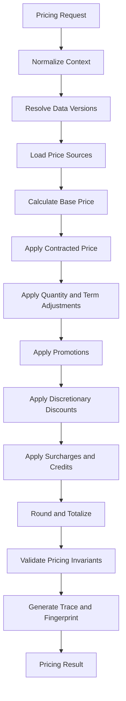
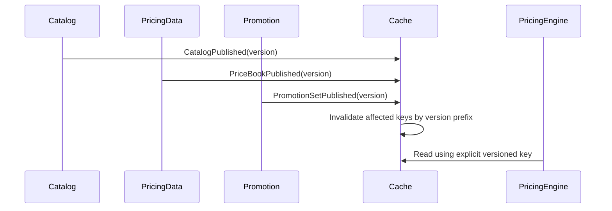
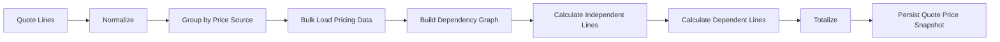
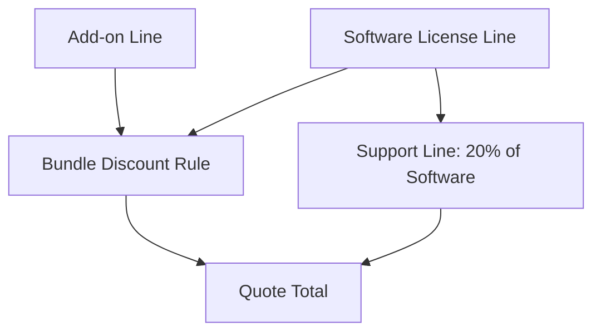
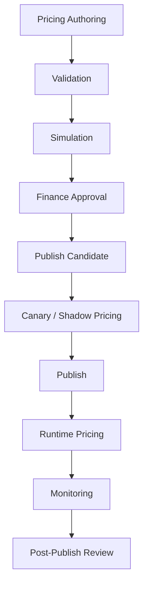

# Part 013 — Pricing Engine Architecture and Correctness

Pricing engine adalah salah satu komponen paling berbahaya dalam CPQ.

Bukan karena menghitung angka itu sulit.

Yang sulit adalah memastikan angka itu:

- benar menurut catalog,
- benar menurut contract,
- benar menurut policy,
- benar menurut currency,
- benar menurut waktu efektif,
- benar menurut approval,
- benar saat quote direvisi,
- benar saat order dibuat,
- benar saat diaudit enam bulan kemudian,
- dan tetap benar ketika rule berubah.

Di sistem kecil, pricing sering dibuat sebagai beberapa `if-else`:

```text
if customer is GOLD => discount 10%
if quantity > 100 => discount 15%
if promo active => subtract setup fee
```

Di enterprise CPQ, pendekatan itu cepat menjadi tidak defensible.

Pricing harus diperlakukan sebagai **calculation platform** yang deterministic, explainable, replayable, testable, versioned, and revenue-safe.

> Goal part ini: kamu mampu mendesain pricing engine enterprise-grade yang tidak hanya menghasilkan angka, tetapi juga menghasilkan alasan, evidence, trace, dan invariant yang bisa dipertanggungjawabkan.

---

## 1. Kaufman Target Performance

Setelah bagian ini, kamu harus bisa:

1. Menentukan boundary pricing engine: input, output, dependency, dan non-responsibility.
2. Mendesain pricing pipeline yang deterministic dan explainable.
3. Membedakan price component, price adjustment, discount, promotion, surcharge, tax boundary, and totalization.
4. Mendesain calculation trace yang bisa dipakai untuk audit, debugging, approval, and customer explanation.
5. Menangani effective dating, currency, rounding, tiering, term, quantity, bundle, and asset-based changes.
6. Mendesain golden master test dataset untuk pricing correctness.
7. Mengidentifikasi failure mode yang menyebabkan revenue leakage atau customer dispute.
8. Membuat decision framework: kapan pakai rule engine, formula engine, table lookup, graph, atau compiled pricing plan.

Kaufman framing-nya sederhana: jangan mencoba menguasai semua detail pricing vendor dulu. Pecah skill menjadi sub-skill operasional:

- membaca pricing request,
- membaca price book,
- menerapkan policy,
- menghasilkan trace,
- mengecek invariant,
- mereplay hasil,
- menguji skenario ekstrem.

---

## 2. Mental Model: Pricing Is Not a Formula, It Is a Controlled Derivation

Pricing bukan hanya:

```text
price = listPrice - discount
```

Pricing adalah proses derivasi terkontrol:

```text
commercial context + product configuration + policy version + price data + time
= price result + explanation + evidence + fingerprint
```

Artinya, hasil pricing harus menjawab lima pertanyaan:

1. **What** — angka apa yang dihasilkan?
2. **Why** — rule atau data apa yang menyebabkan angka itu?
3. **When** — berdasarkan effective date dan policy version mana?
4. **For whom** — customer, account, contract, region, and channel mana?
5. **Can we replay it?** — apakah hasil ini bisa dihitung ulang secara identik nanti?

Tanpa lima jawaban ini, pricing engine hanya calculator. Dengan lima jawaban ini, pricing engine menjadi enterprise control system.

---

## 3. Boundary Pricing Engine

Pricing engine harus punya boundary yang jelas.

### 3.1 Pricing Engine Owns

Pricing engine bertanggung jawab untuk:

- menerima pricing request,
- memilih price book atau price source,
- menerapkan price waterfall,
- menerapkan contract price,
- menerapkan tier/ramp/usage model,
- menerapkan discount policy,
- menerapkan promotion benefit jika promotion sudah eligible,
- menghitung subtotal, recurring charge, one-time charge, usage rate, and adjustment,
- melakukan rounding sesuai policy,
- menghasilkan calculation trace,
- menghasilkan pricing fingerprint,
- menghasilkan warning/error yang bisa dipakai quote validation.

### 3.2 Pricing Engine Does Not Own

Pricing engine sebaiknya tidak menjadi owner untuk:

- product configuration validity,
- customer master data,
- tax filing logic,
- invoice generation,
- revenue recognition,
- contract lifecycle,
- approval workflow,
- fulfillment,
- credit risk decision,
- legal term generation.

Namun pricing engine perlu mengonsumsi output dari domain-domain tersebut sebagai context.

Contoh:

- Eligibility engine mengatakan customer eligible untuk promo.
- Pricing engine menghitung nilai promo.
- Approval engine menentukan apakah discount butuh approval.
- Billing engine menagih berdasarkan order/subscription/billing schedule.

---

## 4. Pricing Request and Pricing Result

Pricing request harus cukup kaya untuk deterministic calculation, tetapi tidak boleh menjadi dump seluruh CRM.

### 4.1 Pricing Request

Contoh struktur konseptual:

```text
PricingRequest
├── requestId
├── quoteId?
├── pricingDate
├── currency
├── channel
├── market
├── sellingEntity
├── customerContext
│   ├── customerId
│   ├── accountId
│   ├── segment
│   ├── contractIds[]
│   └── entitlements[]
├── lines[]
│   ├── lineId
│   ├── productOfferingId
│   ├── productSpecificationId
│   ├── actionType
│   ├── quantity
│   ├── term
│   ├── configurationSnapshot
│   ├── assetReference?
│   └── requestedAdjustments[]
└── policyContext
    ├── catalogVersion
    ├── priceBookVersion
    ├── promotionSetVersion
    └── approvalPolicyVersion?
```

### 4.2 Pricing Result

Pricing result tidak cukup hanya berisi total.

```text
PricingResult
├── requestId
├── pricedAt
├── pricingFingerprint
├── status: SUCCESS | WARNING | ERROR
├── currency
├── totals
│   ├── oneTimeTotal
│   ├── recurringTotal
│   ├── usageCommitmentTotal
│   ├── discountTotal
│   └── estimatedTax?    // optional, if tax preview exists
├── lineResults[]
│   ├── lineId
│   ├── unitPrices[]
│   ├── components[]
│   ├── adjustments[]
│   ├── warnings[]
│   └── traceRef
└── trace
    ├── dataVersions
    ├── ruleExecutions[]
    ├── priceComponents[]
    └── roundingEvents[]
```

Enterprise principle:

> Total tanpa component adalah angka mati. Total dengan trace adalah evidence.

---

## 5. Price Component Model

Jangan simpan harga hanya sebagai satu angka di quote line.

Simpan sebagai component.

```text
QuoteLinePrice
├── lineId
├── currency
├── components[]
│   ├── componentType
│   ├── chargeType
│   ├── sourceType
│   ├── sourceId
│   ├── amountBeforeAdjustment
│   ├── adjustmentAmount
│   ├── amountAfterAdjustment
│   ├── quantityBasis
│   ├── termBasis
│   ├── roundingMode
│   └── traceId
└── totals
```

Contoh component type:

| Component Type | Meaning |
|---|---|
| `LIST_PRICE` | harga dasar dari price book |
| `CONTRACT_PRICE` | harga khusus dari kontrak/customer agreement |
| `VOLUME_ADJUSTMENT` | adjustment karena quantity tier |
| `TERM_ADJUSTMENT` | adjustment karena durasi kontrak |
| `PROMOTION_ADJUSTMENT` | benefit dari promotion |
| `DISCRETIONARY_DISCOUNT` | manual/sales discount |
| `BUNDLE_ALLOCATION` | alokasi harga dari bundle parent ke child |
| `SURCHARGE` | biaya tambahan seperti expedited service |
| `CREDIT` | credit atau waiver |
| `ROUNDING_DELTA` | selisih karena rounding |

Kenapa component model penting?

Karena enterprise system perlu menjawab:

- diskon mana yang membuat margin turun,
- apakah promo sudah diaplikasikan,
- apakah harga kontrak menimpa list price,
- apakah ada rounding drift,
- apakah order memakai harga quote yang sudah disetujui,
- apakah billing menerima component yang sama.

---

## 6. Pricing Pipeline

Pipeline pricing yang sehat biasanya explicit.



Setiap tahap harus punya:

- input yang jelas,
- output yang jelas,
- rule version,
- error model,
- trace entry,
- invariant check.

Anti-pattern:

```text
pricingService.calculate(quote)
```

yang di dalamnya melakukan semua hal tanpa trace.

Lebih baik:

```text
normalize -> resolve -> calculate -> adjust -> round -> validate -> trace
```

---

## 7. Price Waterfall as an Execution Contract

Price waterfall adalah urutan derivasi harga.

Contoh umum:

```text
List Price
- automatic product adjustment
- contracted price adjustment
- volume adjustment
- term adjustment
- promotion adjustment
- manual discount
+ surcharge
= net price
```

Namun enterprise CPQ tidak boleh hanya menyalin waterfall vendor. Harus didefinisikan sebagai execution contract.

### 7.1 Waterfall Must Answer

1. Apakah contract price menggantikan list price atau menjadi adjustment?
2. Apakah promotion dihitung sebelum discretionary discount?
3. Apakah discount dihitung dari list price, regular price, customer price, atau net price?
4. Apakah bundle discount dialokasikan ke child line?
5. Apakah rounding dilakukan per component, per line, atau per quote?
6. Apakah tax preview dihitung sebelum atau sesudah discount?
7. Apakah approval threshold memakai pre-discount margin atau post-discount margin?

### 7.2 Waterfall as Policy Version

Waterfall harus versioned:

```text
WaterfallPolicy
├── policyId
├── version
├── effectiveStart
├── effectiveEnd
├── currencyPolicyRef
├── roundingPolicyRef
├── stages[]
└── approvalImpactModel
```

Jika waterfall berubah pada bulan Agustus, quote bulan Juli tetap harus bisa direplay dengan waterfall Juli.

---

## 8. Determinism

Pricing deterministic berarti:

> Input yang sama + data version yang sama + policy version yang sama menghasilkan output yang sama.

Ini terdengar sederhana, tetapi sering gagal karena hidden dependency.

### 8.1 Hidden Dependency yang Merusak Determinism

| Hidden Dependency | Dampak |
|---|---|
| `now()` di tengah kalkulasi | hasil berubah tergantung waktu eksekusi |
| live customer segment lookup | customer segment berubah, quote lama berubah |
| floating-point arithmetic | rounding drift |
| unordered rule execution | hasil berbeda antar node |
| cache tanpa version key | harga stale dipakai |
| external promotion lookup saat pricing | promo bisa berubah saat quote direprice |
| implicit locale/currency setting | angka berbeda antar environment |
| manual DB patch | replay tidak sama |

### 8.2 Deterministic Context

Semua dependency harus menjadi explicit:

```text
pricingDate = 2026-07-02
catalogVersion = 2026.07.01.3
priceBookVersion = APAC-IDR-2026-Q3-v2
promotionSetVersion = JULY-CAMPAIGN-v5
roundingPolicyVersion = IDR-B2B-v1
currency = IDR
```

Jangan biarkan pricing engine memutuskan sendiri versi data secara implisit.

---

## 9. Time Semantics and Effective Dating

Pricing selalu temporal.

Ada beberapa tanggal yang berbeda:

| Date | Meaning |
|---|---|
| `quoteCreatedAt` | kapan quote dibuat |
| `pricingDate` | tanggal efektif untuk mencari harga |
| `quoteValidUntil` | batas customer boleh menerima harga |
| `contractStartDate` | kapan kontrak/subscription mulai |
| `serviceActivationDate` | kapan service aktif |
| `billingStartDate` | kapan billing mulai |
| `promotionEffectiveDate` | window promo |
| `priceBookEffectiveDate` | window price book |

Jangan mencampur semuanya menjadi `date`.

Contoh failure:

```text
Quote dibuat 30 Juni.
Promo berlaku sampai 30 Juni.
Customer menerima 2 Juli.
Order dibuat 3 Juli.
```

Pertanyaan yang harus dijawab:

- Apakah harga quote masih valid?
- Apakah promo masih boleh dipertahankan karena sudah quoted?
- Apakah butuh approval ulang?
- Apakah order memakai pricing snapshot atau reprice?
- Apakah billing menerima promo expired?

Keputusan harus policy-driven, bukan kebetulan implementasi.

---

## 10. Currency and Rounding

Money bukan `double`.

Enterprise pricing harus memakai decimal arithmetic dengan scale dan rounding policy yang explicit.

### 10.1 Rounding Decisions

Tentukan:

1. currency scale,
2. rounding mode,
3. rounding level,
4. allocation remainder handling,
5. FX rate source,
6. FX rate effective date,
7. display precision vs calculation precision.

### 10.2 Rounding Level

| Level | Example | Risk |
|---|---|---|
| component-level | round every discount component | banyak rounding delta |
| line-level | round total line amount | child allocation bisa tidak balance |
| quote-level | round final total only | line display bisa tidak match total |
| invoice-level | billing yang menentukan rounding | quote-order-billing dispute |

Tidak ada satu jawaban universal. Yang penting adalah policy harus eksplisit.

### 10.3 Rounding Delta Component

Jika ada selisih rounding, jangan hilangkan diam-diam.

```text
Bundle parent total: 100.00
Child allocation:
- A: 33.33
- B: 33.33
- C: 33.33
Rounding delta: 0.01
```

Tambahkan component:

```text
ROUNDING_DELTA +0.01 assignedToLine=C
```

Ini membuat total explainable.

---

## 11. Quantity, Term, and Unit of Measure

Banyak pricing bug berasal dari basis yang tidak jelas.

Contoh:

```text
$10 per user per month
100 users
24 months
10% discount for annual commitment
```

Pertanyaan:

- Apakah quantity = user count?
- Apakah term = 24 bulan atau 2 tahun?
- Apakah discount diterapkan per bulan atau total contract value?
- Apakah ramp price berlaku per year segment?
- Apakah partial month prorated?
- Apakah committed quantity berbeda dari actual usage?

### 11.1 Price Basis

Modelkan basis secara eksplisit:

```text
PriceBasis
├── unitOfMeasure: USER
├── billingPeriod: MONTH
├── quantity: 100
├── termLength: 24
├── termUnit: MONTH
├── prorationPolicy: CALENDAR_MONTH_DAILY
└── chargeTiming: IN_ADVANCE
```

Tanpa basis, angka total tidak bisa diaudit.

---

## 12. Tiered, Volume, Block, and Usage Pricing

Enterprise pricing sering menggabungkan banyak model.

### 12.1 Pricing Model Types

| Model | Meaning | Example |
|---|---|---|
| flat | satu harga per unit | IDR 100k/user/month |
| volume tier | semua unit memakai tier berdasarkan total quantity | 100 users masuk tier 100+ |
| graduated tier | tiap rentang quantity dihitung berbeda | 1-10, 11-50, 51+ |
| block | harga per blok quantity | IDR 1M untuk 100 API calls block |
| usage | harga dihitung berdasarkan konsumsi aktual | IDR/call |
| committed usage | minimum commitment + overage | commit 1M calls/month |
| ramp | harga berubah per periode | year 1 discount, year 2 normal |
| percent of total | harga item berdasarkan persentase item lain | support 20% of license |
| cost plus | harga = cost + margin | hardware/service project |

### 12.2 Anti-Ambiguity Rule

Jangan simpan pricing model sebagai label string saja.

Buruk:

```json
{ "pricingType": "tiered" }
```

Lebih baik:

```json
{
  "pricingModel": "GRADUATED_TIER",
  "tiers": [
    { "from": 1, "to": 10, "unitPrice": 100 },
    { "from": 11, "to": 50, "unitPrice": 90 },
    { "from": 51, "to": null, "unitPrice": 80 }
  ],
  "basis": "USER_PER_MONTH"
}
```

---

## 13. Bundle Pricing Correctness

Bundle pricing adalah tempat banyak pricing engine rusak.

Ada beberapa model:

1. Parent has price, children are included.
2. Children have price, parent is display group.
3. Parent discount applies to children.
4. Bundle has fixed price allocated to children.
5. Some children are optional paid add-ons.
6. Some children are technical components with no commercial price.

### 13.1 Bundle Price Allocation

Allocation penting untuk:

- revenue reporting,
- billing line mapping,
- cancellation credit,
- upgrade/downgrade,
- tax category,
- revenue recognition input,
- margin analysis.

Contoh:

```text
Bundle price: 1,000
Child standalone fair value:
- A: 600
- B: 300
- C: 100
Allocation:
- A: 600
- B: 300
- C: 100
```

Jika bundle price 800:

```text
A allocation = 800 * 600/1000 = 480
B allocation = 800 * 300/1000 = 240
C allocation = 800 * 100/1000 = 80
```

Tapi allocation policy harus explicit. Jangan dibiarkan sebagai implicit spreadsheet logic.

---

## 14. Manual Discount and Approval Fingerprint

Manual discount tidak boleh hanya field angka.

Manual discount harus punya governance:

```text
ManualDiscount
├── requestedBy
├── amountOrPercent
├── reasonCode
├── justification
├── allowedByPolicy
├── requiresApproval
├── approvalPolicyVersion
├── marginImpact
└── fingerprint
```

### 14.1 Approval Fingerprint

Saat quote approved, simpan fingerprint dari semua hal yang relevan:

```text
ApprovalFingerprint = hash(
  quoteVersion,
  lineItems,
  configurationSnapshots,
  priceComponents,
  discountComponents,
  promotionComponents,
  marginMetrics,
  approvalPolicyVersion,
  quoteValidUntil
)
```

Jika setelah approval ada perubahan harga, line, quantity, term, discount, configuration, promotion, atau validity, fingerprint berubah.

Policy harus memutuskan:

- reapproval required,
- warning only,
- reject change,
- allowed if non-commercial change.

---

## 15. Calculation Trace

Trace adalah inti pricing correctness.

Trace minimal harus berisi:

- input snapshot,
- data version,
- rule evaluation order,
- matched rules,
- skipped rules with reason,
- calculation components,
- rounding events,
- warnings/errors,
- external reference IDs,
- engine version.

### 15.1 Trace Example

```json
{
  "traceId": "ptr-20260702-0001",
  "lineId": "QL-1",
  "stages": [
    {
      "stage": "BASE_PRICE",
      "source": "PRICE_BOOK_ENTRY:PB-APAC-IDR-2026-Q3:SKU-CRM-ENT",
      "input": { "quantity": 100, "termMonths": 24 },
      "output": { "unitPrice": "250000.00" }
    },
    {
      "stage": "VOLUME_DISCOUNT",
      "source": "DISCOUNT_SCHEDULE:VOL-100-499-v3",
      "input": { "quantity": 100 },
      "output": { "discountPercent": "10.00" }
    },
    {
      "stage": "PROMOTION",
      "source": "PROMO:JULY-SETUP-WAIVER-v5",
      "input": { "eligible": true },
      "output": { "waivedAmount": "5000000.00" }
    }
  ]
}
```

Trace bukan hanya untuk engineer. Trace juga berguna untuk:

- sales support,
- deal desk,
- finance,
- audit,
- billing dispute,
- customer explanation.

---

## 16. Pricing Fingerprint

Fingerprint adalah hash dari pricing-determinant data.

```text
PricingFingerprint = hash(
  pricingRequestNormalized,
  priceBookVersion,
  catalogVersion,
  promotionSetVersion,
  contractPriceVersion,
  currencyPolicyVersion,
  roundingPolicyVersion,
  pricingEngineVersion
)
```

Gunanya:

- mendeteksi stale quote,
- mendeteksi price drift,
- memvalidasi quote-to-order conversion,
- menghindari silent repricing,
- membuat replay reproducible,
- mendukung audit.

### 16.1 Fingerprint Is Not a Security Boundary

Fingerprint bukan pengganti access control atau tamper-proof ledger.

Fingerprint adalah consistency signal.

Jika butuh tamper evidence, kombinasikan dengan:

- append-only audit log,
- signed event,
- immutable storage,
- strict write authorization,
- segregation of duties.

---

## 17. Pricing API Design

Pricing API sebaiknya memisahkan use case.

### 17.1 API Types

| API | Purpose |
|---|---|
| `PriceQuote` | menghitung quote penuh |
| `PriceLine` | menghitung satu line untuk interactive UI |
| `PreviewChange` | melihat impact amendment/change order |
| `ValidatePricing` | mengecek apakah snapshot masih valid |
| `ReplayPricing` | menghitung ulang berdasarkan frozen data version |
| `ExplainPricing` | mengambil trace/explanation |
| `SimulatePolicy` | menguji rule/policy sebelum publish |

### 17.2 Command vs Query

`PriceQuote` bisa menjadi pure query jika tidak menyimpan state.

Namun dalam quote lifecycle, sering ada command:

```text
RepriceQuoteCommand
```

yang menyimpan hasil ke quote snapshot.

Pisahkan:

```text
calculatePricing(request) -> result only
applyPricingToQuote(quoteId, resultId) -> state mutation
```

Ini memudahkan testing dan mengurangi side effect.

---

## 18. Interactive Pricing vs Final Pricing

Configurator UI butuh cepat. Final quote pricing butuh akurat dan lengkap.

Jangan memaksakan satu mode untuk semua.

| Mode | Need | Trade-off |
|---|---|---|
| interactive preview | low latency, partial line | boleh approximate untuk display tertentu |
| full quote price | complete, auditable | lebih lambat tapi harus traceable |
| approval price | stable, margin-aware | harus freeze commercial determinant |
| order conversion price | validate against approved snapshot | tidak boleh silent reprice |
| billing handoff price | component-level mapping | harus match order/contract policy |

Jika interactive preview approximate, UI harus jelas membedakan:

```text
Estimated price
Final price pending validation
```

Jangan menampilkan approximate price sebagai committed price.

---

## 19. Caching Strategy

Pricing butuh cache, tetapi cache bisa berbahaya.

### 19.1 Safe Cache Key

Cache key harus mencakup determinant data:

```text
pricingCacheKey = hash(
  productOfferingId,
  configurationHash,
  quantity,
  term,
  currency,
  customerSegment,
  contractPriceVersion,
  priceBookVersion,
  promotionSetVersion,
  pricingDate,
  channel,
  market
)
```

Cache key yang buruk:

```text
productId + quantity
```

Kenapa buruk?

Karena harga bisa berubah berdasarkan customer, contract, date, region, promotion, term, and channel.

### 19.2 Cache Invalidation

Gunakan event:



Tapi lebih aman lagi: bukan invalidasi global, melainkan versioned key. Data baru menghasilkan key baru; data lama tetap bisa dipakai untuk replay.

---

## 20. Batch and Large Quote Pricing

Enterprise quote bisa punya ratusan atau ribuan line.

Masalah umum:

- N+1 lookup ke price book,
- repeated rule evaluation,
- bundle dependency recalculation,
- line-level API call yang meledak,
- synchronous UI timeout,
- lock contention saat reprice.

### 20.1 Strategy

1. Normalize seluruh quote dulu.
2. Group line berdasarkan product/price source.
3. Bulk load price entries.
4. Bulk evaluate eligible promotions.
5. Build dependency graph untuk bundle/percent-of-total.
6. Calculate in topological order.
7. Totalize quote.
8. Persist snapshot atomically at quote version level.



---

## 21. Dependency Graph Pricing

Be careful with percent-of-total, bundle, cross-line discounts, and commitment discounts.

Example:

```text
Support = 20% of software license total
Bundle discount applies if product A and B exist
Enterprise tier applies if total users across lines >= 1000
```

Line pricing is no longer independent.

Model dependency:



Need safeguards:

- cycle detection,
- topological ordering,
- explicit dependency declaration,
- deterministic tie-breaking,
- max iteration limit if iterative calculation is unavoidable.

Avoid hidden dependency where rule reads `quote.total` while quote total is still being calculated.

---

## 22. Validation Invariants

Pricing engine should fail fast if invariants are violated.

### 22.1 Core Invariants

| Invariant | Meaning |
|---|---|
| currency consistency | all line components use expected currency or explicit FX conversion |
| component sum | line total equals sum of components plus rounding delta |
| quote total | quote total equals sum of line totals |
| no negative price unless allowed | negative charge needs explicit credit policy |
| discount cap | discount must not exceed policy threshold unless approved |
| price source existence | every commercial line has a valid price source |
| effective date validity | price source active on pricing date |
| quantity basis | quantity and UOM must match pricing model |
| rounding trace | every rounding delta is represented |
| approval fingerprint | approved quote cannot mutate silently |
| replay determinism | replay with same versions returns same output |

### 22.2 Invariant Failure Severity

| Severity | Example | Behavior |
|---|---|---|
| `ERROR` | missing price entry | cannot price quote |
| `BLOCKING_WARNING` | promo expired but quote still has promo | user must resolve |
| `APPROVAL_REQUIRED` | discount exceeds threshold | route to approval |
| `NON_BLOCKING_WARNING` | price near expiry | allow but warn |
| `INFO` | rounded by 0.01 | trace only |

Do not collapse every failure into `500 Internal Server Error`.

---

## 23. Repricing Strategy

Quote repricing is dangerous.

### 23.1 Reprice Modes

| Mode | Meaning | Use Case |
|---|---|---|
| full reprice | recalculate everything with current data | early draft |
| frozen reprice | recalculate using original data versions | debugging/replay |
| delta reprice | recalculate changed lines and dependencies | large quote UX |
| policy revalidation | do not change price, only validate | approval/order conversion |
| forced reprice | admin forces current price | controlled exception |

### 23.2 Never Silent Reprice Approved Quotes

If quote has been approved or presented, repricing must be explicit.

Bad:

```text
User opens approved quote.
System auto-reprices because price book changed.
Net price changes silently.
```

Good:

```text
System detects price book changed.
Quote shows: pricing snapshot is stale.
User can request reprice.
Reprice creates new quote revision and may require approval.
```

---

## 24. Quote-to-Order Pricing Boundary

When quote becomes order, decide whether order uses:

1. approved quote price snapshot,
2. revalidated quote price snapshot,
3. fresh reprice,
4. hybrid strategy.

For enterprise CPQ/OMS, default safe approach:

> Order should use the accepted quote price snapshot unless policy explicitly requires revalidation or reprice.

Why?

Because accepted quote is commercial commitment.

However, validate:

- quote not expired,
- quote not superseded,
- approval fingerprint still valid,
- order quantity matches accepted quote,
- customer/account still valid,
- required legal terms accepted,
- price snapshot exists and is not corrupted.

---

## 25. Tax Boundary

Tax can be previewed in CPQ, but tax ownership often belongs to tax engine/billing/ERP.

Pricing engine should not accidentally become tax authority.

### 25.1 Possible Models

| Model | Meaning |
|---|---|
| no tax in CPQ | quote shows pre-tax only |
| estimated tax preview | CPQ calls tax service for estimate |
| tax category only | CPQ sends taxable classification downstream |
| final tax in billing | billing/ERP calculates final invoice tax |

If CPQ shows estimated tax, label it as estimate unless legally committed.

Include tax trace:

```text
taxPreviewSource = ExternalTaxService
taxPreviewAt = 2026-07-02T10:00:00+07:00
taxJurisdiction = ID-JK
taxPolicyVersion = TAX-ID-2026-v4
```

---

## 26. Pricing Data Governance

Pricing correctness starts before runtime.

Authoring mistakes can be worse than code bugs.

### 26.1 Governance Workflow



### 26.2 Publish Gate

Before price data publish:

- no overlapping price entries unless explicit priority,
- no missing currency,
- no negative price without policy,
- no duplicate tier range,
- no gap in required tier range,
- no effective date conflict,
- no product offering without active price,
- no promotion referencing retired product,
- no rule conflict detected in simulation.

---

## 27. Golden Master Pricing Dataset

Pricing engine without golden dataset is not enterprise-grade.

Golden dataset berisi canonical scenarios yang harus selalu benar.

### 27.1 Dataset Dimensions

| Dimension | Example |
|---|---|
| product type | standalone, bundle, add-on, usage, subscription |
| customer type | SMB, enterprise, partner, government |
| contract status | no contract, contracted price, renewal |
| quantity | 1, tier boundary, huge quantity |
| term | 1 month, 12 months, 36 months, partial term |
| currency | IDR, USD, multi-currency |
| promotion | none, one promo, stacking promo, expired promo |
| discount | none, allowed, approval required, forbidden |
| date | before effective date, active, after expiry |
| order type | new, amendment, upgrade, downgrade, cancellation |

### 27.2 Golden Test Shape

```yaml
scenarioId: PRICE-BUNDLE-PROMO-001
input:
  pricingDate: 2026-07-02
  currency: IDR
  customerSegment: ENTERPRISE
  lines:
    - productOfferingId: BUNDLE-CRM-ENT
      quantity: 100
      termMonths: 24
expected:
  oneTimeTotal: "0.00"
  recurringTotal: "450000000.00"
  discountTotal: "50000000.00"
  requiredApprovals:
    - DEAL_DESK
  components:
    - type: LIST_PRICE
    - type: VOLUME_ADJUSTMENT
    - type: PROMOTION_ADJUSTMENT
```

Golden tests should assert:

- amount,
- component presence,
- trace source,
- warning/error,
- approval impact,
- fingerprint stability.

---

## 28. Property-Based and Metamorphic Tests

Golden tests catch known examples. Property tests catch classes of bugs.

### 28.1 Useful Properties

| Property | Example |
|---|---|
| determinism | same input/version returns same output |
| component sum | components add to total |
| rounding bounded | rounding delta within expected tolerance |
| no hidden negative | total cannot be negative unless credit policy exists |
| expired data blocked | inactive price cannot be used |
| version stability | old quote replay uses old version |
| discount cap | unapproved discount cannot exceed threshold |

### 28.2 Metamorphic Tests

Metamorphic test compares related scenarios.

Example:

```text
If quantity increases from 10 to 11, and tier threshold starts at 10,
then discount should not decrease unless policy explicitly says so.
```

Careful: pricing is not always monotonic. Promotions can create cliffs. But if policy says monotonic, test it.

---

## 29. Observability for Pricing

Pricing observability is not just latency.

Track:

- pricing latency by quote size,
- error rate by product offering,
- missing price entry count,
- stale price warning count,
- manual discount distribution,
- approval-required rate,
- average discount by segment,
- margin leakage signals,
- promotion application count,
- reprice frequency,
- price dispute count,
- replay mismatch count.

### 29.1 Revenue Safety Signals

High-value alerts:

```text
missing_price_entry > 0 for published sellable product
discount_above_floor without approval
quote_order_price_mismatch
replay_mismatch for approved quote
negative_net_price without credit policy
promotion_applied_after_expiry
manual_discount_spike by sales team
```

---

## 30. Failure Modes

### 30.1 Stale Price Book

**Scenario:** Sales creates quote after price update, but pricing cache still uses old price.

**Impact:** undercharge or overcharge.

**Prevention:** versioned cache key, publish event, cache warming, pricing fingerprint.

### 30.2 Silent Repricing

**Scenario:** Approved quote changes total after price book update.

**Impact:** legal dispute, lost trust, approval invalid.

**Prevention:** snapshot, reprice explicit, approval fingerprint.

### 30.3 Rounding Drift

**Scenario:** quote total differs from billing by small amount across many invoices.

**Impact:** customer dispute, reconciliation cost.

**Prevention:** explicit rounding policy, rounding delta component, billing alignment.

### 30.4 Conflicting Promotions

**Scenario:** two exclusive promos both applied due to rule ordering bug.

**Impact:** excessive discount.

**Prevention:** exclusivity group, priority, conflict detection simulation.

### 30.5 Contract Price Override Bug

**Scenario:** contracted price ignored because list price has higher priority.

**Impact:** breach of customer agreement.

**Prevention:** clear waterfall stage contract, golden test for contracted account.

### 30.6 Percent-of-Total Cycle

**Scenario:** product A is 20% of B; product B is 10% of A.

**Impact:** infinite loop or unstable pricing.

**Prevention:** dependency graph cycle detection.

### 30.7 Multi-Currency Drift

**Scenario:** quote uses FX rate from one date, order uses current FX rate.

**Impact:** mismatch and reporting issues.

**Prevention:** explicit FX rate source/date/version and conversion snapshot.

---

## 31. Design Review Checklist

Use checklist ini saat review pricing architecture.

### 31.1 Boundary

- [ ] Pricing engine has explicit responsibility boundary.
- [ ] Tax, billing, contract, approval, and eligibility ownership are separated.
- [ ] Input context is explicit and versioned.
- [ ] Output includes components, totals, trace, and fingerprint.

### 31.2 Correctness

- [ ] Calculation is deterministic.
- [ ] Effective dating is explicit.
- [ ] Currency and rounding policy are explicit.
- [ ] Price component sum equals line total.
- [ ] Quote total equals line total sum.
- [ ] Bundle allocation is traceable.
- [ ] Manual discount is governed.
- [ ] Approval fingerprint exists.

### 31.3 Reliability

- [ ] Cache keys include data versions.
- [ ] Reprice is explicit for approved/presented quotes.
- [ ] Replay uses frozen data versions.
- [ ] Pricing engine has idempotent request handling.
- [ ] External dependency failures have domain errors.

### 31.4 Testing

- [ ] Golden dataset exists.
- [ ] Boundary tier tests exist.
- [ ] Promotion conflict tests exist.
- [ ] Contracted price tests exist.
- [ ] Rounding tests exist.
- [ ] Quote-to-order price mismatch tests exist.
- [ ] Replay determinism tests exist.

---

## 32. Practice: Build a Pricing Correctness Matrix

Ambil satu contoh domain:

```text
Enterprise SaaS bundle:
- CRM Enterprise License
- Support package = 20% of license
- Setup fee waived by promo
- 24-month term
- 100 users
- 10% volume discount
- manual discount 5%
- approval required if total discount > 12%
```

Buat matrix:

| Case | Expected Result |
|---|---|
| no promo | setup fee charged |
| promo active | setup fee waived |
| promo expired | pricing warning/blocking |
| quantity 99 | no volume discount |
| quantity 100 | volume discount applies |
| manual discount 5% | no approval if total <= threshold |
| manual discount 15% | approval required |
| quote accepted after expiry | policy decides retain/reprice/block |
| support line removed | validation error |
| price book updated | approved quote unchanged |

Kemudian tulis expected components untuk setiap case.

---

## 33. Common Anti-Patterns

### 33.1 Single Net Price Field

```text
quote_line.net_price = 12345
```

Tidak cukup. Hilang trace, component, and source.

### 33.2 Pricing Rules as Spaghetti

Rule saling membaca field hasil rule lain tanpa dependency model.

Akibatnya rule order menjadi hidden architecture.

### 33.3 Reprice on Read

Membuka quote memicu reprice.

Ini menghancurkan auditability.

### 33.4 Approval Based on Display Fields

Approval threshold memakai field UI yang rounded atau user-editable.

Approval harus memakai canonical pricing components.

### 33.5 No Versioned Price Data

Price book diupdate in-place.

Quote lama tidak bisa direplay.

### 33.6 Tax Preview Treated as Final Tax

Customer melihat tax estimate tetapi billing menghasilkan tax berbeda.

Harus ada explicit tax boundary.

---

## 34. Staff-Level Heuristics

1. Jika harga tidak bisa dijelaskan, harga itu belum enterprise-ready.
2. Jika harga tidak bisa direplay, approval tidak defensible.
3. Jika price book diupdate in-place, audit akan gagal.
4. Jika rounding policy tidak eksplisit, reconciliation akan mahal.
5. Jika quote accepted bisa berubah karena reprice otomatis, sistem melanggar commercial commitment.
6. Jika pricing engine melakukan customer lookup diam-diam, determinism rusak.
7. Jika promotion conflict hanya ditemukan di production, publish pipeline belum matang.
8. Jika billing tidak menerima component-level price, downstream dispute akan sulit diselesaikan.
9. Jika discount tidak punya reason/evidence, deal desk hanya formalitas.
10. Jika pricing test hanya happy path, revenue leakage tinggal menunggu waktu.

---

## 35. Summary

Pricing engine enterprise-grade bukan sekadar komponen kalkulasi.

Ia adalah control system untuk commercial correctness.

Mental model utama:

```text
Pricing = deterministic derivation + trace + evidence + governance
```

Hal yang harus selalu dijaga:

- explicit input context,
- versioned data,
- deterministic waterfall,
- componentized price,
- explainable trace,
- approval fingerprint,
- replay capability,
- explicit rounding/currency policy,
- golden dataset,
- quote-to-order snapshot integrity.

Di part berikutnya, kita masuk ke **Quote Domain Model and Lifecycle State Machine**. Pricing result yang benar belum cukup. Quote harus punya lifecycle yang menjaga commercial intent dari draft sampai accepted, expired, canceled, superseded, atau converted to order.

---

## Further Reading

- Salesforce Help — CPQ Price Waterfall: https://help.salesforce.com/s/articleView?id=000380701&language=en_US&type=1
- Salesforce Help — CPQ Quote Fields: https://help.salesforce.com/s/articleView?id=sales.cpq_quote_fields.htm&language=en_US&type=5
- Oracle Configure, Price, Quote Documentation: https://docs.oracle.com/en/cloud/saas/configure-price-quote/
- Oracle CPQ REST API Services: https://docs.oracle.com/en/cloud/saas/configure-price-quote/cxcpq/index.html
- TM Forum TMF622 Product Ordering Management API: https://www.tmforum.org/resources/specifications/tmf622-product-ordering-management-api-user-guide-v5-0-0/
