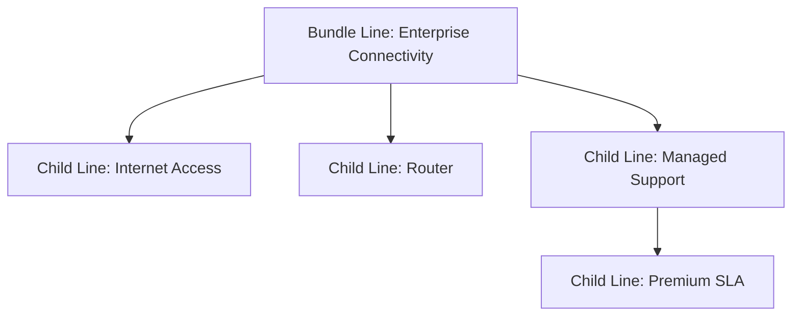
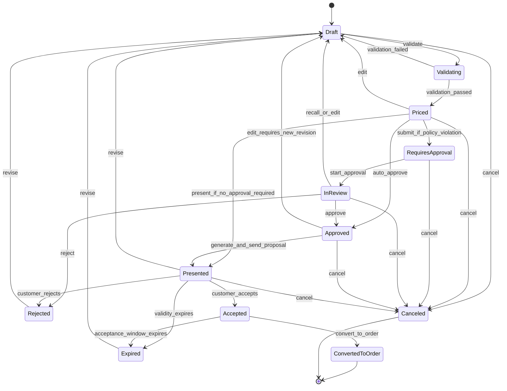
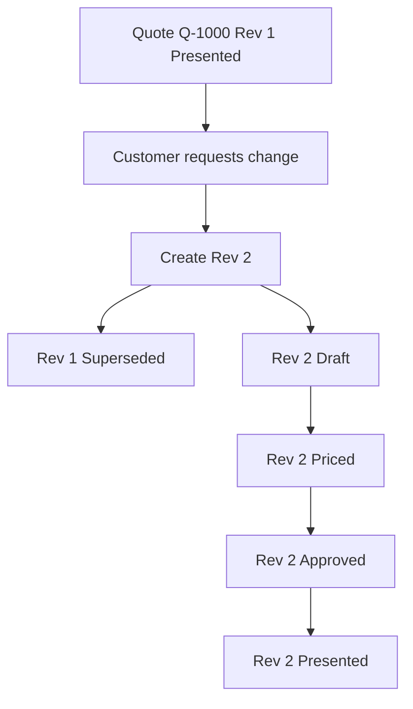
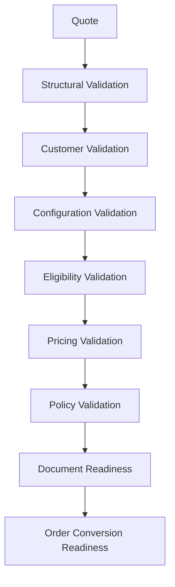
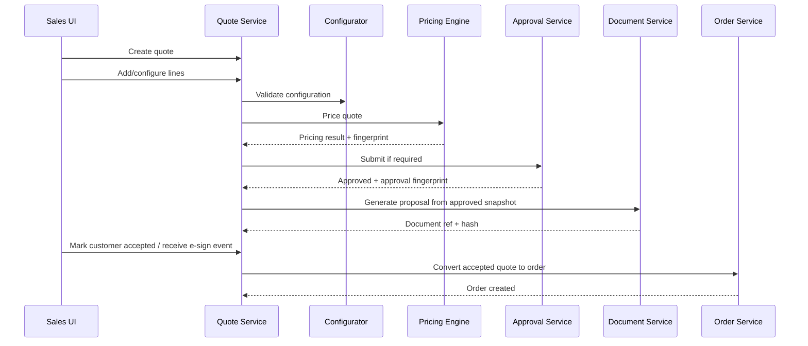

# Part 014 — Quote Domain Model and Lifecycle State Machine

Quote adalah pusat gravitasi CPQ.

Product model menjawab:

```text
Apa yang bisa dijual?
```

Configurator menjawab:

```text
Kombinasi apa yang valid?
```

Eligibility menjawab:

```text
Kepada siapa ini boleh dijual?
```

Pricing menjawab:

```text
Dengan harga berapa dan mengapa?
```

Quote menjawab:

```text
Apa penawaran komersial yang sedang dinegosiasikan, disetujui, dikirim, diterima, atau dikonversi menjadi order?
```

Di sistem kecil, quote sering diperlakukan seperti cart.

Di enterprise CPQ, quote bukan cart. Quote adalah **commercial commitment artifact**.

Quote harus punya:

- identity,
- version,
- lifecycle,
- price snapshot,
- configuration snapshot,
- approval evidence,
- document evidence,
- acceptance evidence,
- expiry policy,
- revision policy,
- conversion boundary to order.

> Goal part ini: kamu mampu mendesain quote domain model dan state machine yang menjaga commercial correctness dari draft sampai accepted/expired/canceled/converted.

---

## 1. Kaufman Target Performance

Setelah bagian ini, kamu harus bisa:

1. Membedakan cart, quote, proposal, contract, and order.
2. Mendesain quote aggregate: header, parties, lines, snapshots, terms, price, approval, and document references.
3. Mendesain lifecycle state machine yang explicit dan defensible.
4. Menentukan guard condition untuk transition penting.
5. Mendesain revision, clone, supersede, and amendment semantics.
6. Menentukan kapan quote bisa diedit, diprice ulang, disubmit approval, dipresent, diaccept, expire, cancel, atau convert to order.
7. Menangani concurrent edits, stale quote, expired price, approval invalidation, and quote-to-order mismatch.
8. Membuat checklist design review quote lifecycle.

Kaufman framing: quote lifecycle adalah sub-skill utama CPQ. Kamu tidak perlu menghafal semua status vendor, tetapi harus bisa mendesain state, transition, guard, invariant, and recovery.

---

## 2. Mental Model: Quote Is a Versioned Commercial Offer

Quote adalah penawaran komersial yang versioned.

```text
Quote = customer intent + seller offer + product config + price snapshot + terms + validity + approval evidence
```

Quote bukan hanya list product.

Quote menyimpan konteks negosiasi:

- siapa customer-nya,
- siapa seller/legal entity-nya,
- produk apa yang ditawarkan,
- konfigurasi apa yang dipilih,
- harga mana yang berlaku,
- diskon apa yang diberikan,
- policy mana yang dilanggar atau disetujui,
- terms mana yang dilampirkan,
- kapan quote valid,
- siapa yang menerima,
- apakah sudah menjadi order.

### 2.1 Quote vs Cart

| Aspect | Cart | Quote |
|---|---|---|
| Purpose | temporary selection | commercial offer |
| Ownership | buyer/user session | sales/customer/account process |
| Price | often dynamic | snapshot with validity |
| Approval | usually none | often required |
| Versioning | weak | strong |
| Audit | low | high |
| Legal meaning | weak | can become binding offer |
| Conversion | checkout | order/contract handoff |

### 2.2 Quote vs Order

| Aspect | Quote | Order |
|---|---|---|
| Meaning | offer/proposal | request/commitment to fulfill |
| Mutability | editable before locked states | controlled mutation only |
| Pricing | proposed/approved price | accepted price to execute |
| Fulfillment | no fulfillment yet | triggers fulfillment |
| Lifecycle | sales negotiation | operational execution |
| Failure | commercial invalidity | fulfillment fallout |

---

## 3. Quote Aggregate Boundary

Quote should usually be an aggregate root.

It coordinates:

- quote header,
- quote lines,
- quote parties,
- quote price snapshot,
- quote approval state,
- quote documents,
- quote lifecycle history.

But quote should not own everything.

### 3.1 Quote Owns

Quote owns:

- quote identity,
- quote version/revision,
- quote status,
- quote validity,
- quote line commercial snapshot,
- quote price snapshot reference or embedded snapshot,
- approval requirement summary,
- approval result reference,
- document/proposal reference,
- customer acceptance record,
- quote-to-order conversion status,
- lifecycle history.

### 3.2 Quote References

Quote references:

- customer/account master,
- product catalog version,
- price book version,
- promotion set version,
- contract/agreement,
- opportunity/deal,
- legal template,
- billing account,
- asset/installed base,
- approval workflow instance,
- order created from quote.

### 3.3 Quote Does Not Own

Quote should not own:

- master customer data,
- product catalog authoring,
- price book authoring,
- legal contract repository,
- invoice generation,
- provisioning fulfillment,
- tax authority logic.

Quote captures snapshots and references; it should not become a database copy of the entire enterprise.

---

## 4. Quote Domain Model

Conceptual model:

```text
Quote
├── quoteId
├── quoteNumber
├── revisionNumber
├── status
├── quoteType
├── createdAt
├── createdBy
├── validFrom
├── validUntil
├── customer
├── sellingContext
├── commercialContext
├── lines[]
├── pricingSnapshot
├── validationSummary
├── approvalSummary
├── documentSummary
├── acceptanceSummary
├── conversionSummary
└── lifecycleHistory[]
```

### 4.1 Quote Header

Quote header contains context that applies to all lines:

```text
QuoteHeader
├── quoteId
├── quoteNumber
├── revisionNumber
├── quoteGroupId
├── status
├── quoteType: NEW | RENEWAL | AMENDMENT | UPGRADE | DOWNGRADE | CANCELLATION
├── currency
├── market
├── channel
├── sellingEntity
├── salesOrg
├── opportunityId?
├── accountId
├── customerId
├── billingAccountId?
├── contractId?
├── validFrom
├── validUntil
└── ownerUserId
```

`quoteGroupId` groups revisions of the same commercial negotiation.

Example:

```text
Q-1000 Rev 1
Q-1000 Rev 2
Q-1000 Rev 3
```

All share one `quoteGroupId`, but each revision has its own immutable or semi-immutable identity.

### 4.2 Quote Line

Quote line should not be just product ID + quantity.

```text
QuoteLine
├── quoteLineId
├── parentLineId?
├── lineNumber
├── actionType: ADD | MODIFY | REMOVE | RENEW | SUSPEND | RESUME
├── productOfferingId
├── productSpecificationId
├── catalogVersion
├── quantity
├── unitOfMeasure
├── term
├── configurationSnapshot
├── assetReference?
├── eligibilitySnapshot
├── priceSnapshot
├── validationStatus
└── lineStatus
```

For bundles, quote line hierarchy matters:



### 4.3 Snapshot Fields

Important snapshots:

| Snapshot | Purpose |
|---|---|
| configuration snapshot | what exactly was configured |
| catalog snapshot/version | product definitions used |
| price snapshot | price components and totals |
| eligibility snapshot | why customer/line was allowed |
| approval snapshot | what was approved |
| document snapshot | what was sent |
| acceptance snapshot | what customer accepted |

Quote should not rely on live catalog/pricing data to interpret old commercial offers.

---

## 5. Quote Lifecycle State Machine

A mature quote lifecycle is explicit.

Example state machine:



Ini contoh. Status aktual harus disesuaikan dengan bisnis.

Prinsipnya:

> State machine harus membatasi apa yang boleh terjadi, bukan hanya merekam apa yang sudah terjadi.

---

## 6. State Definitions

### 6.1 Draft

Quote sedang dibuat atau diedit.

Allowed:

- add/remove line,
- change configuration,
- run eligibility,
- run pricing preview,
- change customer context jika policy mengizinkan,
- cancel.

Not allowed:

- customer acceptance,
- order conversion,
- final proposal as committed document.

### 6.2 Validating

Quote sedang dicek completeness dan validity.

Checks:

- required customer data,
- required line configuration,
- product eligibility,
- product compatibility,
- price availability,
- contract reference validity,
- billing account validity,
- asset reference validity.

This can be synchronous or asynchronous depending on complexity.

### 6.3 Priced

Quote has valid pricing result.

Meaning:

- all lines have price components,
- quote total exists,
- pricing fingerprint exists,
- warnings/errors are resolved or classified,
- approval requirement can be evaluated.

Priced does not mean approved.

### 6.4 RequiresApproval

Quote violates or triggers commercial policy that requires approval.

Examples:

- discount above threshold,
- margin below floor,
- non-standard term,
- expired promotion override,
- legal clause exception,
- high contract value,
- strategic account exception.

### 6.5 InReview

Approval workflow is active.

Quote should usually be locked for commercial edits.

Allowed:

- approval action,
- recall if policy permits,
- comment,
- attach justification.

Not allowed:

- changing line price,
- changing quantity,
- changing product configuration,
- changing discount.

If edit is needed, recall or create revision.

### 6.6 Approved

Quote has passed approval policy.

Approved means:

- approval evidence exists,
- approval fingerprint matches current quote content,
- approved terms/discount/pricing are frozen or controlled,
- quote can be presented.

Approved does not mean customer accepted.

### 6.7 Presented

Quote/proposal was sent to customer or made available for acceptance.

Important evidence:

- document version,
- recipient,
- sent timestamp,
- validity date,
- terms version,
- price snapshot.

Presented quote should not mutate in-place.

If change needed, create revision or return to draft according to policy.

### 6.8 Accepted

Customer accepted the quote.

Acceptance evidence can include:

- signed document,
- e-signature envelope,
- portal acceptance,
- purchase order reference,
- authorized contact,
- accepted timestamp,
- accepted quote revision.

Accepted quote is a strong conversion candidate.

### 6.9 ConvertedToOrder

Quote was converted into order.

Rules:

- one quote revision should not create duplicate orders accidentally,
- conversion should be idempotent,
- order should reference accepted quote revision,
- order should capture required quote snapshots.

### 6.10 Rejected

Quote was rejected by approver or customer.

Rejected quote can often be revised, but the rejected revision should remain auditable.

### 6.11 Expired

Quote validity expired.

Expired quote should not be accepted or converted without explicit revalidation/revision.

### 6.12 Canceled

Quote was canceled internally.

Canceled quote is terminal unless business explicitly supports restoration.

---

## 7. Transition Guard Conditions

State transitions need guards.

### 7.1 Draft → Priced

Guard:

- quote has at least one line,
- required customer/account exists,
- all mandatory configurations complete,
- product offering active for pricing date,
- price book available,
- currency supported,
- no blocking validation errors.

### 7.2 Priced → RequiresApproval

Guard:

- approval policy evaluated,
- one or more approval conditions triggered,
- approval reason generated,
- quote fingerprint created.

### 7.3 Priced → Approved

Guard:

- no approval required, or auto-approval policy applies,
- pricing fingerprint exists,
- validation summary is clean.

### 7.4 InReview → Approved

Guard:

- all mandatory approvers approved,
- approval policy version matches,
- quote fingerprint unchanged,
- approval SLA policy satisfied or override authorized.

### 7.5 Approved → Presented

Guard:

- proposal document generated from approved quote snapshot,
- legal terms resolved,
- quote validity date set,
- recipient authorized or policy allows sending.

### 7.6 Presented → Accepted

Guard:

- quote not expired,
- presented document version matches accepted version,
- acceptance actor authorized,
- acceptance method valid,
- no superseding revision already accepted,
- quote fingerprint unchanged or policy allows.

### 7.7 Accepted → ConvertedToOrder

Guard:

- quote accepted,
- quote not expired unless policy allows accepted-but-delayed conversion,
- no existing successful order conversion,
- billing/account/order prerequisites complete,
- quote price snapshot valid,
- conversion idempotency key unique,
- order mapping validated.

---

## 8. Lifecycle Invariants

Quote state machine should enforce invariants.

| Invariant | Meaning |
|---|---|
| only current revision can be presented | old revision cannot confuse customer |
| only presented quote can be accepted | customer must accept what was sent |
| accepted quote cannot mutate | changes require revision/amendment |
| approved fingerprint must match | approval applies to exact commercial content |
| expired quote cannot convert | unless explicit override exists |
| converted quote cannot convert again | idempotency and duplicate prevention |
| quote total equals line totals | pricing integrity |
| document matches quote snapshot | legal/commercial traceability |
| quote line references valid offering snapshot | catalog auditability |
| order references accepted quote revision | quote-to-order traceability |

Invariant lebih penting daripada status label.

Status label hanya berguna jika invariant dijaga.

---

## 9. Quote Versioning and Revisioning

Quote revisioning adalah salah satu area paling sering salah.

### 9.1 Version vs Revision

| Concept | Meaning |
|---|---|
| technical version | optimistic locking / row version |
| quote revision | business-visible revision of commercial offer |
| document version | version of proposal document |
| price snapshot version | version of calculated price result |
| approval version | approval workflow instance/fingerprint |

Jangan mencampur semuanya sebagai satu `version`.

### 9.2 Revision Policy

New revision should usually be created when:

- customer-facing price changes,
- line items change after presented,
- discount changes after approval,
- terms change after presented,
- validity date changes materially,
- customer requests alternate option,
- approved quote requires commercial edit,
- expired quote is revived.

Minor internal edits may not require revision:

- internal note,
- sales owner reassignment,
- non-commercial attachment,
- typo in internal description.

But policy must be explicit.

### 9.3 Supersede Semantics

When Rev 2 is created from Rev 1:

```text
Rev 1 -> Superseded
Rev 2 -> Draft
```

But do not delete Rev 1. It might have been presented, rejected, or used for negotiation evidence.



---

## 10. Editability Matrix

Define editability by state.

| Field/Action | Draft | Priced | InReview | Approved | Presented | Accepted | Converted |
|---|---:|---:|---:|---:|---:|---:|---:|
| add line | yes | yes, then reprice | no | no/revision | no/revision | no | no |
| change quantity | yes | yes, then reprice | no | no/revision | no/revision | no | no |
| manual discount | yes | yes, then reprice | no | no/revision | no/revision | no | no |
| internal note | yes | yes | yes | yes | yes | yes | yes |
| send proposal | no | conditional | no | yes | resend policy | no | no |
| accept quote | no | no | no | no/conditional | yes | already | no |
| convert to order | no | no | no | no | no/conditional | yes | already |
| cancel | yes | yes | yes | yes | yes | conditional | no |

This matrix prevents accidental mutation.

---

## 11. Quote Locking and Concurrency

Enterprise quote may be edited by:

- sales rep,
- solution engineer,
- deal desk,
- legal,
- partner user,
- integration job,
- approval workflow.

### 11.1 Concurrency Risks

| Risk | Example |
|---|---|
| lost update | sales changes quantity while pricing job writes old result |
| stale approval | approver approves old discount while sales changed line |
| stale document | customer receives outdated proposal |
| duplicate conversion | user double-clicks convert to order |
| parallel revision | two users create competing revisions |

### 11.2 Controls

Use:

- optimistic locking,
- quote version number,
- state transition compare-and-set,
- approval fingerprint,
- document fingerprint,
- idempotency key for conversion,
- edit lock for long-running review if needed,
- event log for audit.

Example transition command:

```text
ApproveQuoteCommand
├── quoteId
├── expectedQuoteVersion
├── expectedApprovalFingerprint
├── approverId
└── decision
```

If expected version mismatches, reject with domain error:

```text
QUOTE_CHANGED_DURING_APPROVAL
```

---

## 12. Quote Validation Model

Quote validation is not only pricing validation.

Validation layers:



### 12.1 Validation Categories

| Category | Example |
|---|---|
| structural | quote has no line |
| customer | missing billing account |
| configuration | required option missing |
| eligibility | product not sellable in region |
| pricing | missing price entry |
| policy | discount requires approval |
| legal | non-standard terms not approved |
| document | proposal template missing |
| conversion | order mapping unavailable |

Validation result should include remediation.

Bad:

```text
Invalid quote.
```

Good:

```text
MISSING_BILLING_ACCOUNT: Select or create billing account before submitting quote.
PRICE_EXPIRED: Reprice quote or create revision.
DISCOUNT_REQUIRES_APPROVAL: Submit to deal desk.
```

---

## 13. Approval Boundary

Approval is part of quote lifecycle but should be a separate capability.

Quote should know:

- approval required or not,
- approval status,
- approval workflow reference,
- approval fingerprint,
- approval result,
- approved by whom and when.

Approval engine should own:

- routing,
- approver resolution,
- delegation,
- escalation,
- SLA,
- approval tasks,
- approval decision history.

### 13.1 Approval Fingerprint Recap

Approval applies to exact quote content.

```text
approvalFingerprint = hash(
  quoteRevision,
  quoteLines,
  priceSnapshot,
  discountSnapshot,
  termsSnapshot,
  marginMetrics,
  policyVersion
)
```

If fingerprint changes, approval is stale.

---

## 14. Proposal Document Boundary

Proposal document is not quote itself.

Quote is system-of-record commercial artifact.

Proposal document is generated representation.

### 14.1 Document Snapshot

```text
QuoteDocument
├── documentId
├── quoteId
├── quoteRevision
├── templateId
├── templateVersion
├── generatedAt
├── generatedBy
├── documentHash
├── deliveryStatus
├── recipients[]
└── storageRef
```

Why hash?

Because if customer accepts document, you need prove which document they accepted.

### 14.2 Document Mismatch Failure

Scenario:

```text
Quote approved at total 1,000.
Proposal generated at total 1,000.
Sales edits quote to 900.
Customer signs old proposal.
System converts current quote at 900.
```

This is unacceptable.

Acceptance must reference exact document and quote revision.

---

## 15. Acceptance Model

Acceptance is a domain event, not just status update.

```text
QuoteAccepted
├── quoteId
├── quoteRevision
├── acceptedAt
├── acceptedBy
├── acceptanceMethod
├── acceptedDocumentId
├── acceptedDocumentHash
├── purchaseOrderRef?
├── ipAddress?
├── eSignatureEnvelopeId?
└── evidenceRef
```

### 15.1 Authorized Acceptance

Need policy:

- who may accept,
- whether email acceptance is enough,
- whether PO is required,
- whether signature is required,
- whether acceptance after expiry is blocked,
- whether partner can accept on behalf of customer,
- whether legal entity mismatch blocks acceptance.

Do not assume clicking a button is always legally valid.

---

## 16. Expiry Model

Quote expiry is commercial control.

### 16.1 Expiry Types

| Type | Meaning |
|---|---|
| price validity expiry | price no longer guaranteed |
| proposal validity expiry | customer can no longer accept document |
| approval expiry | approval only valid for a time window |
| promotion expiry | promo benefit no longer available |
| contract start constraint | quote must start before date |

These are not the same.

### 16.2 Expiry Handling

When quote expires:

- mark as expired,
- block acceptance,
- block conversion,
- allow revision from expired quote,
- require reprice,
- possibly require reapproval.

Avoid background mutation that surprises users. Expiry can be computed at read time, but final transitions must enforce it transactionally.

---

## 17. Quote-to-Order Conversion Readiness

Quote can be accepted but not ready to convert.

Conversion requires:

- accepted quote revision,
- valid price snapshot,
- customer/account/billing account complete,
- order action mapping available,
- asset references valid,
- fulfillment prerequisites known,
- legal acceptance captured,
- no duplicate order,
- quote not superseded by accepted newer revision.

### 17.1 Conversion Command

```text
ConvertQuoteToOrderCommand
├── quoteId
├── quoteRevision
├── expectedQuoteStatus: ACCEPTED
├── idempotencyKey
├── requestedBy
└── conversionOptions
```

### 17.2 Conversion Result

```text
QuoteConversionResult
├── quoteId
├── quoteRevision
├── orderId
├── orderNumber
├── convertedAt
├── conversionSnapshotHash
└── warnings[]
```

If command is retried with same idempotency key, return existing order result.

---

## 18. Quote Events

Quote lifecycle should emit domain events.

| Event | Meaning |
|---|---|
| `QuoteCreated` | new quote started |
| `QuoteLineAdded` | line added |
| `QuoteConfigured` | configuration completed/changed |
| `QuotePriced` | pricing snapshot produced |
| `QuoteValidationFailed` | blocking validation found |
| `QuoteSubmittedForApproval` | approval requested |
| `QuoteApproved` | approval completed |
| `QuoteRejectedByApprover` | approval rejected |
| `QuotePresented` | proposal sent |
| `QuoteAccepted` | customer accepted |
| `QuoteRejectedByCustomer` | customer rejected |
| `QuoteExpired` | validity expired |
| `QuoteCanceled` | quote canceled |
| `QuoteRevisionCreated` | new revision created |
| `QuoteSuperseded` | old revision superseded |
| `QuoteConvertedToOrder` | order created |

### 18.1 Event Payload Principle

Events should contain identifiers, state, and important immutable facts.

Do not emit entire huge quote as every event unless explicitly using event sourcing with a clear model.

---

## 19. Data Model: Snapshot vs Reference

A core quote design decision:

> What do we snapshot, and what do we reference?

### 19.1 Reference Live Data When

Reference is acceptable when:

- data is master identity,
- current value is intended,
- change does not alter old commercial meaning.

Examples:

- customer ID,
- account ID,
- sales owner ID,
- opportunity ID.

### 19.2 Snapshot Data When

Snapshot is required when:

- old value must be preserved,
- value affects commercial/legal meaning,
- value may change later,
- audit/replay depends on it.

Examples:

- product offering version,
- configuration values,
- price components,
- discount reason,
- approval fingerprint,
- legal terms version,
- presented document hash.

### 19.3 Hybrid Pattern

Store both:

```text
productOfferingId = CRM-ENTERPRISE
catalogVersion = 2026.07.01.3
productDisplayNameSnapshot = CRM Enterprise Suite
```

This allows:

- machine reference,
- human readability,
- historical stability.

---

## 20. Quote Status Is Not Enough

Never rely only on status string.

Bad:

```text
if quote.status == "APPROVED" then allowOrderConversion()
```

Better:

```text
allowOrderConversion if:
- status == ACCEPTED
- acceptedRevision == currentRevision
- quote not expired
- approvalFingerprint valid
- priceSnapshot exists
- documentHash accepted
- no existing converted order
- conversion readiness passed
```

State is a summary. Guards and invariants are the real protection.

---

## 21. Error Model

Quote lifecycle errors should be domain-specific.

Examples:

| Error Code | Meaning |
|---|---|
| `QUOTE_NOT_EDITABLE_IN_STATE` | current state blocks edit |
| `QUOTE_PRICE_STALE` | price snapshot no longer valid |
| `QUOTE_APPROVAL_STALE` | quote changed after approval |
| `QUOTE_ALREADY_SUPERSEDED` | old revision cannot be presented/accepted |
| `QUOTE_EXPIRED` | validity expired |
| `QUOTE_DOCUMENT_MISMATCH` | accepted doc does not match quote revision |
| `QUOTE_ALREADY_CONVERTED` | duplicate conversion attempt |
| `QUOTE_CONVERSION_NOT_READY` | order prerequisites missing |
| `QUOTE_CONCURRENT_MODIFICATION` | optimistic lock conflict |

Error should include remediation:

```json
{
  "code": "QUOTE_APPROVAL_STALE",
  "message": "Quote changed after approval.",
  "remediation": "Create a new revision or resubmit for approval."
}
```

---

## 22. Quote Lifecycle and UX

State machine should shape UX.

Examples:

- In Draft: show configure, price, validate.
- In Priced: show submit approval or present.
- In InReview: lock commercial fields and show approval progress.
- In Approved: show generate/send proposal.
- In Presented: show acceptance status and revision action.
- In Accepted: show convert to order.
- In Expired: show create revision/reprice.
- In Converted: show linked order tracking.

UX should not let user attempt impossible transitions.

But backend must still enforce guards. UI is not control boundary.

---

## 23. Quote Lifecycle in Distributed Architecture

Quote lifecycle interacts with other systems.



Important: each system can fail.

Quote state should reflect partial progress and support retry.

---

## 24. Asynchronous Operations

Some operations are long-running:

- full quote pricing,
- complex eligibility,
- approval workflow,
- document generation,
- e-signature,
- quote-to-order conversion.

Avoid pretending all are single synchronous transaction.

### 24.1 Operation State

Separate quote status from operation status.

```text
Quote.status = APPROVED
DocumentGeneration.status = IN_PROGRESS
```

Do not create weird quote status like:

```text
APPROVED_BUT_DOCUMENT_GENERATING
```

Use operation records/events.

---

## 25. Audit Trail

Quote audit must capture:

- who changed what,
- old and new values,
- state transition,
- command reason,
- source system,
- timestamp,
- correlation ID,
- approval/document/acceptance references.

### 25.1 Audit Log Example

```text
2026-07-02T10:00:00+07:00 QuoteCreated by sales_rep_1
2026-07-02T10:05:00+07:00 QuoteLineAdded SKU=CRM-ENT quantity=100
2026-07-02T10:07:00+07:00 QuotePriced total=450000000 fingerprint=abc123
2026-07-02T10:10:00+07:00 QuoteSubmittedForApproval reason=DISCOUNT_ABOVE_THRESHOLD
2026-07-02T11:00:00+07:00 QuoteApproved by deal_desk_1 fingerprint=abc123
2026-07-02T11:10:00+07:00 QuotePresented documentHash=def456
2026-07-03T09:00:00+07:00 QuoteAccepted by customer_contact_1 documentHash=def456
2026-07-03T09:05:00+07:00 QuoteConvertedToOrder orderId=O-9000
```

Audit should be append-only. Do not overwrite lifecycle history.

---

## 26. Metrics and Operational Visibility

Track quote health:

- quotes created,
- quotes priced,
- pricing failure rate,
- quote approval cycle time,
- approval rejection rate,
- quote revision count,
- quote expiry rate,
- quote acceptance rate,
- quote-to-order conversion rate,
- average time from presented to accepted,
- average time from accepted to order,
- stale approval count,
- quote-order mismatch count.

These metrics reveal friction.

Examples:

- High revision count may mean poor guided selling or unclear pricing.
- High expiry rate may mean validity window too short or sales process too slow.
- High stale approval count may mean users edit after approval too often.
- Long accepted-to-order time may mean order prerequisites are incomplete.

---

## 27. Failure Modes

### 27.1 Quote Accepted After Expiry

**Scenario:** customer clicks old proposal link after validity date.

**Impact:** company may accidentally honor expired price.

**Prevention:** transactional expiry guard at acceptance.

### 27.2 Approval Applied to Changed Quote

**Scenario:** quote approved, then user changes discount without reapproval.

**Impact:** governance failure.

**Prevention:** approval fingerprint and editability matrix.

### 27.3 Customer Signs Old Revision

**Scenario:** Rev 2 exists, but customer signs Rev 1.

**Impact:** ambiguity in commercial commitment.

**Prevention:** supersede old document links or clearly reject acceptance of superseded revision.

### 27.4 Duplicate Order Conversion

**Scenario:** user double-clicks convert or retry happens after timeout.

**Impact:** duplicate orders and fulfillment.

**Prevention:** idempotency key, unique constraint on accepted quote revision conversion.

### 27.5 Proposal Document Drift

**Scenario:** proposal generated before final price update.

**Impact:** customer sees one price, system stores another.

**Prevention:** document hash tied to exact quote snapshot.

### 27.6 Quote Modified During Approval

**Scenario:** approval in progress while sales changes quantity.

**Impact:** approver decision no longer valid.

**Prevention:** lock commercial fields or invalidate approval on edit.

### 27.7 Converted Order Missing Quote Context

**Scenario:** order only stores product IDs, no price snapshot.

**Impact:** billing dispute cannot be traced.

**Prevention:** order references accepted quote revision and carries required snapshots.

---

## 28. Design Review Checklist

### 28.1 Domain Model

- [ ] Quote has identity, number, revision, and group identity.
- [ ] Quote line supports hierarchy and action type.
- [ ] Product/configuration/pricing/approval/document snapshots are modeled.
- [ ] Quote references master data without copying everything.
- [ ] Quote supports quote type: new, renewal, amendment, upgrade, downgrade, cancellation.

### 28.2 Lifecycle

- [ ] States are explicitly defined.
- [ ] Transitions have guard conditions.
- [ ] Terminal states are clear.
- [ ] Expiry is enforced transactionally.
- [ ] Accepted quote cannot mutate.
- [ ] Converted quote cannot convert again.
- [ ] Superseded revision cannot be accepted accidentally.

### 28.3 Governance

- [ ] Approval fingerprint exists.
- [ ] Document hash exists.
- [ ] Acceptance evidence exists.
- [ ] Audit trail is append-only.
- [ ] Editability matrix exists.
- [ ] Revisions are not overwritten.

### 28.4 Integration

- [ ] Pricing result is persisted as snapshot.
- [ ] Approval workflow is referenced.
- [ ] Document generation uses exact approved snapshot.
- [ ] Quote-to-order conversion is idempotent.
- [ ] Order references accepted quote revision.
- [ ] Domain events are emitted.

### 28.5 Reliability

- [ ] Concurrent modification is handled.
- [ ] Long-running operations have separate operation state.
- [ ] Retry does not duplicate order/document.
- [ ] Stale quote/pricing/approval errors are domain errors.

---

## 29. Practice: Design a Quote Lifecycle

Scenario:

```text
A sales rep creates an enterprise SaaS quote for 500 users.
The quote includes:
- base subscription,
- premium support,
- implementation service,
- 18% discretionary discount,
- 24-month term,
- custom payment term,
- July promotion.
```

Exercise:

1. Define quote header.
2. Define quote line structure.
3. Define price snapshot components.
4. Determine approval triggers.
5. Define lifecycle path from Draft to ConvertedToOrder.
6. Define what happens if customer asks for 600 users after approval.
7. Define what happens if promo expires before acceptance.
8. Define what happens if customer signs old revision.
9. Define idempotency control for conversion.
10. Define audit events.

Expected high-level answer:

```text
Draft -> Validating -> Priced -> RequiresApproval -> InReview -> Approved -> Presented -> Accepted -> ConvertedToOrder
```

If customer asks for 600 users after approval:

```text
Create new revision or return to Draft according to policy.
Invalidate approval fingerprint.
Reprice.
Resubmit approval if threshold still applies.
Generate new proposal.
```

---

## 30. Common Anti-Patterns

### 30.1 Quote as Mutable Cart Forever

Quote can be edited even after sent to customer.

This destroys commercial traceability.

### 30.2 Status-Only Lifecycle

System has status field but no transition guard.

Users can jump from Draft to Accepted by API patch.

### 30.3 No Revision Model

Every change overwrites same quote.

Old proposal cannot be reconstructed.

### 30.4 Approval Without Fingerprint

Approval says “approved” but does not identify what was approved.

### 30.5 Document Generated from Live Quote

Proposal PDF changes if quote changes.

Document must be generated from snapshot.

### 30.6 Conversion Without Idempotency

Retry creates duplicate orders.

### 30.7 Expiry Only in UI

UI hides accept button after expiry, but API still accepts.

Backend transition must enforce expiry.

---

## 31. Staff-Level Heuristics

1. A quote is not a cart; it is a commercial evidence object.
2. Quote state is less important than transition guards and invariants.
3. Approval without fingerprint is ceremonial, not governance.
4. Presented quote should not mutate in-place.
5. Accepted quote should convert idempotently.
6. Old quote revision should remain reconstructable.
7. Quote-to-order conversion must reference accepted revision, not current mutable quote.
8. Document hash and quote snapshot must match.
9. Expiry must be enforced at backend transition time.
10. If finance/legal/support cannot reconstruct what customer accepted, quote model is incomplete.

---

## 32. Summary

Quote lifecycle is the commercial backbone of CPQ.

A strong quote model has:

- aggregate boundary,
- line hierarchy,
- configuration snapshot,
- price snapshot,
- lifecycle state machine,
- approval fingerprint,
- proposal document hash,
- acceptance evidence,
- revision/supersede model,
- quote-to-order idempotency,
- audit trail.

Mental model utama:

```text
Quote = versioned commercial offer + evidence + lifecycle controls
```

Part berikutnya akan membahas **Quote Validation, Completeness, and Error Model**. Kita akan masuk lebih dalam ke bagaimana quote dinilai siap atau tidak siap: hard error, soft warning, stale catalog, stale price, missing data, expired promotion, invalid asset, and remediation UX.

---

## Further Reading

- Salesforce Help — CPQ Quote Fields: https://help.salesforce.com/s/articleView?id=sales.cpq_quote_fields.htm&language=en_US&type=5
- Salesforce CPQ Documentation Map: https://resources.docs.salesforce.com/latest/latest/en-us/sfdc/pdf/final_cpq_map.pdf
- Oracle Configure, Price, Quote Documentation: https://docs.oracle.com/en/cloud/saas/configure-price-quote/
- Oracle CPQ — Get Started with Quotes and Orders: https://docs.oracle.com/en/cloud/saas/configure-price-quote/faicp/get-started-with-quotes-and-orders.html
- TM Forum TMF622 Product Ordering Management API User Guide: https://www.tmforum.org/resources/specifications/tmf622-product-ordering-management-api-user-guide-v5-0-0/
