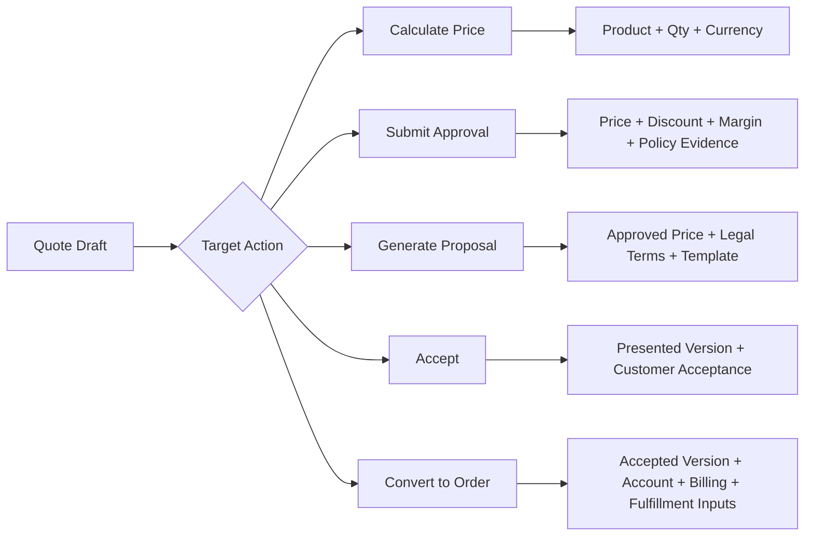
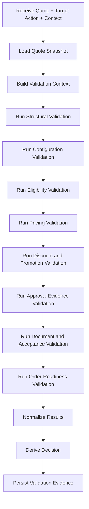
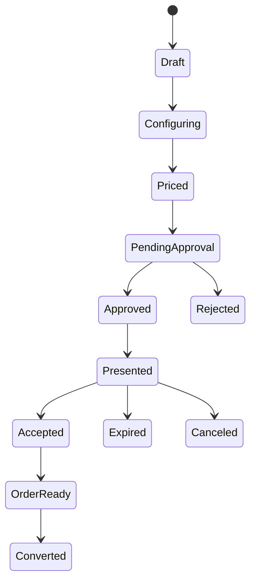
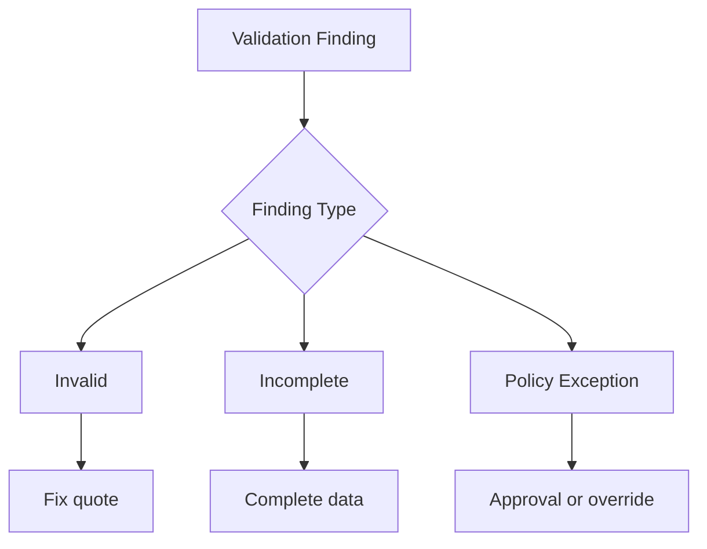
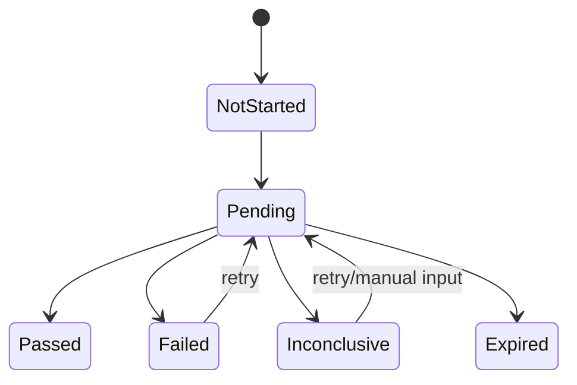
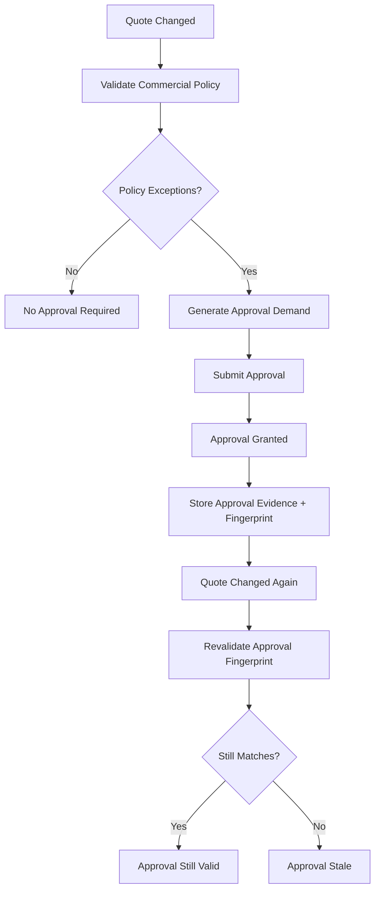

# Part 015 — Quote Validation, Completeness, and Error Model

Quote lifecycle tanpa validation model akan berubah menjadi kumpulan tombol:

```text
Save
Calculate
Submit
Approve
Generate PDF
Accept
Convert to Order
```

Masalahnya, tombol bukan guarantee.

Di CPQ enterprise, quote bisa terlihat benar di UI tetapi tetap salah secara bisnis:

- product sudah deprecated,
- price sudah expired,
- promotion sudah tidak eligible,
- required legal term belum dilampirkan,
- quote line tidak match dengan installed base,
- billing account belum valid,
- approval sudah stale karena diskon berubah,
- quantity terlihat valid tetapi melanggar packaging rule,
- configuration valid untuk sales tetapi tidak orderable untuk fulfillment,
- customer hierarchy salah sehingga tax, price book, atau contract price salah.

Karena itu quote membutuhkan **validation and completeness layer** yang explicit.

> Goal part ini: kamu mampu mendesain quote validation model yang membedakan error, warning, incompleteness, policy violation, stale evidence, dan order-readiness secara jelas, traceable, dan bisa direpair.

---

## 1. Kaufman Target Performance

Setelah bagian ini, kamu harus bisa:

1. Menjelaskan kenapa quote validation bukan sekadar form validation.
2. Mendesain validation taxonomy untuk quote header, quote line, product config, pricing, discount, promotion, approval, document, contract, account, asset, and order readiness.
3. Membedakan hard error, soft warning, blocker, missing data, stale data, policy violation, and downstream readiness issue.
4. Mendesain completeness model berdasarkan lifecycle state.
5. Mendesain validation execution pipeline yang deterministic, explainable, and replayable.
6. Mendesain remediation UX untuk sales, deal desk, approver, legal, finance, and operations.
7. Menentukan kapan validation harus jalan: edit, save, calculate, submit approval, present, accept, convert to order.
8. Membuat validation evidence yang bisa diaudit.
9. Menghindari anti-pattern: hidden validation, duplicate rule, UI-only rule, stale approval, and generic error.
10. Menguji validation dengan scenario matrix dan golden dataset.

Kaufman framing: quote validation adalah sub-skill yang memberikan feedback cepat. Tanpa feedback cepat, sales baru tahu quote salah saat approval, order submit, provisioning, billing, atau audit.

---

## 2. Mental Model: Validation Is a Commercial Quality Gate

Validation menjawab:

```text
Apakah quote ini cukup benar untuk aksi berikutnya?
```

Aksi berikutnya bisa berbeda:

- save draft,
- calculate price,
- submit approval,
- generate proposal,
- present to customer,
- accept,
- convert to order.

Jadi validasi bukan boolean global.

Quote yang valid untuk disimpan belum tentu valid untuk disubmit approval.

Quote yang valid untuk approval belum tentu valid untuk order conversion.

Quote yang valid kemarin belum tentu valid hari ini.

Mental model yang tepat:

```text
Validation = rules + context + target action + lifecycle state + evidence freshness
```

### 2.1 Validation Is Not Just Input Validation

| Layer | Example | Nature |
|---|---|---|
| Syntax validation | Quantity must be number | Technical correctness |
| Field validation | Start date required | Data completeness |
| Domain validation | Product A requires option B | Product correctness |
| Commercial validation | Discount above threshold requires approval | Governance correctness |
| Temporal validation | Quote price expired | Time correctness |
| Eligibility validation | Customer not eligible for promotion | Policy correctness |
| Asset validation | Upgrade requires active base asset | Installed-base correctness |
| Legal validation | Required clause missing | Contract correctness |
| Order-readiness validation | Billing account missing | Downstream correctness |
| Evidence validation | Approval fingerprint stale | Audit correctness |

A top-tier engineer tidak mencampur semua ini dalam satu `validateQuote()` besar.

Ia membuat validation layer yang tahu:

```text
Apa yang divalidasi?
Untuk aksi apa?
Pada state apa?
Dengan evidence apa?
Siapa yang bisa memperbaiki?
```

---

## 3. Quote Completeness Model

Completeness adalah pertanyaan berbeda dari validity.

Quote bisa valid secara field-level tetapi belum complete.

Contoh:

```text
Quote punya customer, product, price, and discount.
Tidak ada field yang invalid.
Tapi belum ada billing account, belum ada legal terms, belum ada approval untuk margin exception.
```

Itu bukan quote invalid secara mutlak. Itu quote **incomplete untuk present/accept/convert**.

### 3.1 Completeness by Lifecycle Stage

| Quote State | Completeness Minimum |
|---|---|
| Draft | customer intent, sales owner, preliminary line items |
| Configuring | valid product selections and required characteristics |
| Priced | pricing snapshot, currency, charge components, price trace |
| Pending Approval | complete commercial data and approval fingerprint |
| Approved | approval evidence, no stale commercial input |
| Presented | approved/final document, validity date, terms |
| Accepted | acceptance evidence, accepted version, signer/authority |
| Order Ready | order account, billing account, delivery data, valid asset refs, fulfillment inputs |
| Converted | product order reference and immutable conversion evidence |

### 3.2 Completeness Is Action-Specific

Instead of storing one field:

```text
quote.isComplete = true
```

Model it as:

```text
CompletenessResult(targetAction)
```

Example target actions:

```text
SAVE_DRAFT
CALCULATE_PRICE
SUBMIT_APPROVAL
GENERATE_PROPOSAL
PRESENT_TO_CUSTOMER
ACCEPT_QUOTE
CONVERT_TO_ORDER
```

Each target action has different required dimensions.



### 3.3 Completeness Dimension Matrix

| Dimension | Draft | Price | Approval | Present | Accept | Convert |
|---|---:|---:|---:|---:|---:|---:|
| Customer identity | Required | Required | Required | Required | Required | Required |
| Product selection | Optional | Required | Required | Required | Required | Required |
| Product configuration | Optional | Required | Required | Required | Required | Required |
| Quantity | Optional | Required | Required | Required | Required | Required |
| Currency | Optional | Required | Required | Required | Required | Required |
| Price snapshot | No | Required | Required | Required | Required | Required |
| Discount reason | No | Conditional | Conditional | Conditional | Conditional | Conditional |
| Approval evidence | No | No | Created | Required if exception | Required if exception | Required if exception |
| Legal terms | No | No | Conditional | Required | Required | Required |
| Document snapshot | No | No | No | Required | Required | Required |
| Customer acceptance | No | No | No | No | Required | Required |
| Billing account | No | No | No | Optional | Conditional | Required |
| Asset references | Conditional | Conditional | Conditional | Conditional | Conditional | Required |
| Fulfillment data | No | No | No | Optional | Conditional | Required |

The point is not the exact table. The point is the modeling habit:

```text
Completeness should be target-action aware.
```

---

## 4. Error Taxonomy

A weak system says:

```text
Quote is invalid.
```

A strong system says:

```text
Q-PRICE-STALE-003: Net price is stale because catalog version changed from 2026.07.01 to 2026.07.02 after the quote was last calculated. Recalculate pricing before submitting approval.
```

Good error model contains:

- stable code,
- severity,
- target action,
- affected entity,
- source rule,
- business explanation,
- technical explanation,
- remediation action,
- responsible role,
- evidence link,
- suppressibility,
- expiry,
- audit relevance.

### 4.1 Severity Levels

| Severity | Meaning | Example | Can Proceed? |
|---|---|---|---|
| `INFO` | Useful context | Promotion expires in 5 days | Yes |
| `WARNING` | Risk but not blocker | Non-standard term recommended review | Yes, maybe with acknowledgement |
| `SOFT_BLOCKER` | Can proceed only with override/approval | Discount exceeds sales authority | Conditional |
| `HARD_BLOCKER` | Cannot proceed | Product combination invalid | No |
| `SYSTEM_BLOCKER` | Platform cannot safely evaluate | Pricing engine unavailable | No |
| `EVIDENCE_STALE` | Prior approval/evidence no longer valid | Discount changed after approval | No for governed action |
| `DATA_INCOMPLETE` | Required input missing | Billing account missing for order conversion | No for target action |
| `DOWNSTREAM_NOT_READY` | Valid quote, not order-ready | Delivery appointment missing | No for conversion |

### 4.2 Error Categories

| Category | Example |
|---|---|
| `CUSTOMER_DATA` | Missing legal entity, wrong account hierarchy |
| `PRODUCT_CONFIGURATION` | Required option missing, incompatible option selected |
| `CATALOG_STALENESS` | Product offering no longer active |
| `ELIGIBILITY` | Customer segment not eligible |
| `PRICING` | Price missing, price expired, currency unsupported |
| `DISCOUNT_POLICY` | Discount above threshold without approval |
| `PROMOTION_POLICY` | Promotion not stackable |
| `MARGIN_POLICY` | Margin below floor |
| `TAX_BOUNDARY` | Tax jurisdiction data incomplete |
| `LEGAL_TERMS` | Required clause missing |
| `APPROVAL` | Approval missing, rejected, expired, or stale |
| `DOCUMENT` | Proposal generated from outdated quote version |
| `ACCEPTANCE` | Accepted version does not match current quote version |
| `ASSET_REFERENCE` | Base asset inactive or owned by another account |
| `ORDER_READINESS` | Billing account, shipping site, or fulfillment attribute missing |
| `INTEGRATION` | Downstream eligibility/credit/tax service unavailable |
| `SECURITY` | User cannot apply price override or view confidential price |

### 4.3 Error Object Shape

```json
{
  "code": "Q-APPROVAL-STALE-001",
  "severity": "EVIDENCE_STALE",
  "category": "APPROVAL",
  "targetAction": "PRESENT_TO_CUSTOMER",
  "entityType": "QUOTE",
  "entityId": "Q-100029",
  "entityPath": "/quote",
  "ruleId": "APPROVAL_FINGERPRINT_MATCH",
  "ruleVersion": "2026.07.02",
  "message": "Approval is stale because discount changed after approval.",
  "explanation": "The approved fingerprint differs from the current commercial fingerprint.",
  "remediation": "Resubmit the quote for approval or revert the discount to the approved value.",
  "ownerRole": "SALES_REP",
  "canOverride": false,
  "auditRelevant": true,
  "evidence": {
    "approvedFingerprint": "sha256:abc",
    "currentFingerprint": "sha256:def"
  }
}
```

This object is not only for API response.

It supports:

- UI remediation,
- audit,
- analytics,
- support troubleshooting,
- regression testing,
- rule ownership,
- product governance.

---

## 5. Validation Context

Validation result depends on context.

Same quote can produce different result depending on:

- user role,
- target action,
- channel,
- region,
- quote type,
- customer segment,
- contract relationship,
- legal entity,
- effective date,
- price date,
- catalog version,
- fulfillment geography,
- transaction type.

### 5.1 Validation Context Object

```json
{
  "targetAction": "SUBMIT_APPROVAL",
  "actor": {
    "userId": "u-123",
    "roles": ["SALES_REP"],
    "salesTerritory": "APAC-ENT"
  },
  "channel": "DIRECT_SALES",
  "region": "ID",
  "quoteType": "NEW_BUSINESS",
  "customerSegment": "ENTERPRISE",
  "effectiveDate": "2026-07-02",
  "catalogVersion": "2026.07.01",
  "priceBookVersion": "2026.07.01",
  "policySetVersion": "2026.07.02",
  "validationMode": "BLOCKING"
}
```

### 5.2 Deterministic Context

Never let validation read random “current state” silently.

Bad:

```text
Validation checks current catalog from cache and current price from another service without recording versions.
```

Good:

```text
Validation explicitly receives catalogVersion, priceBookVersion, policySetVersion, and effectiveDate.
```

This is essential for replay:

```text
Why was quote Q-100029 valid when it was approved on July 2, 2026?
```

If the platform cannot answer that, it has weak commercial defensibility.

---

## 6. Validation Pipeline

A practical pipeline:



### 6.1 Pipeline Stages

| Stage | Purpose |
|---|---|
| Structural validation | Required IDs, line hierarchy, quantity shape, dates |
| Configuration validation | Product rules, compatibility, cardinality |
| Eligibility validation | Customer/channel/region/product eligibility |
| Pricing validation | Price availability, freshness, currency, rounding |
| Discount validation | Authority, floor, margin, approval requirement |
| Promotion validation | Eligibility, stacking, expiry, allocation |
| Approval validation | Approval existence, status, fingerprint, expiry |
| Document validation | Proposal generated from correct quote version |
| Acceptance validation | Accepted version equals presented version |
| Order-readiness validation | Account, billing, fulfillment, asset, downstream inputs |

### 6.2 Fail Fast vs Collect All

For sales UX, usually collect all actionable errors.

For system safety, fail fast on prerequisites that make later checks meaningless.

Example:

- If quote has no customer, eligibility and customer-specific price cannot run meaningfully.
- If product configuration is structurally invalid, pricing can be skipped or run in degraded mode.
- If pricing service is unavailable, approval validation may still run, but result cannot approve submission.

Recommended pattern:

```text
Stage-level fail fast, pipeline-level collect all meaningful errors.
```

### 6.3 Validation Decision

The output should not be raw list only.

It should derive decision:

```json
{
  "targetAction": "SUBMIT_APPROVAL",
  "decision": "BLOCKED",
  "blockingCount": 3,
  "warningCount": 5,
  "canProceed": false,
  "requiresAcknowledgement": false,
  "requiresApproval": true,
  "resultFingerprint": "sha256:...",
  "results": []
}
```

Possible decisions:

| Decision | Meaning |
|---|---|
| `PASS` | Action allowed |
| `PASS_WITH_WARNINGS` | Action allowed, warnings shown |
| `REQUIRES_ACKNOWLEDGEMENT` | Actor must acknowledge known risk |
| `REQUIRES_APPROVAL` | Action cannot complete without approval |
| `BLOCKED` | Action not allowed until remediation |
| `DEFERRED` | Async validation pending |
| `UNKNOWN` | Validation could not determine safe result |

For enterprise systems, `UNKNOWN` should usually be conservative for commercial commitments:

```text
Unknown price correctness must block presentation/acceptance/order conversion.
```

---

## 7. Lifecycle-Aware Validation Gates

Quote lifecycle from Part 014:



Now attach gates.

### 7.1 Save Draft Gate

Allowed to be incomplete, but not corrupted.

Checks:

- quote ID exists,
- owner exists,
- customer reference is valid if provided,
- line hierarchy is not cyclic,
- quantities are syntactically valid,
- currency format valid if provided,
- user has permission to edit.

Save draft should not require everything.

Otherwise sales cannot progressively build a quote.

### 7.2 Calculate Price Gate

Checks:

- product offering active for pricing date,
- product configuration has required characteristics,
- quantity valid,
- currency supported,
- price book applicable,
- contracted price resolvable,
- promotion references resolvable,
- pricing engine dependencies available.

Price calculation can return warnings, but must not silently price invalid configuration.

### 7.3 Submit Approval Gate

Checks:

- price snapshot exists,
- price snapshot fresh,
- discount reason present where needed,
- margin calculation available,
- approval policy resolvable,
- approver routing resolvable,
- quote not already pending approval,
- actor can submit,
- commercial fingerprint computed.

Approval submission must freeze or fingerprint the relevant commercial inputs.

### 7.4 Generate Proposal Gate

Checks:

- quote state approved or approval not required,
- required terms available,
- proposal template applicable,
- document data complete,
- price and discount not stale,
- proposal generated from exact quote version,
- legal clause set version recorded.

### 7.5 Present to Customer Gate

Checks:

- proposal document exists,
- quote validity period set,
- quote state allows presentation,
- document version matches quote version,
- required approvals still valid,
- user can send/present quote.

### 7.6 Accept Quote Gate

Checks:

- quote was presented,
- quote not expired,
- accepted version equals presented version,
- customer signer authorized,
- acceptance timestamp captured,
- terms accepted,
- e-signature evidence stored if required.

### 7.7 Convert to Order Gate

Checks:

- quote accepted,
- quote not already converted,
- customer/account still valid,
- billing account exists,
- order type can be derived,
- quote lines map to order lines,
- asset references valid,
- fulfillment required fields complete,
- accepted commercial snapshot can be frozen into order snapshot,
- conversion idempotency key available.

---

## 8. Staleness Validation

Staleness is one of the hardest enterprise CPQ problems.

A quote can become stale because:

- catalog version changed,
- price book changed,
- promotion expired,
- customer segment changed,
- contract pricing changed,
- asset state changed,
- credit status changed,
- approval policy changed,
- legal template changed,
- tax jurisdiction changed,
- fulfillment availability changed.

### 8.1 Staleness Is Not Always Invalidity

If catalog changes after quote approval, should the quote be invalid?

It depends.

Design dimensions:

| Dimension | Question |
|---|---|
| Quote state | Draft, approved, presented, accepted? |
| Change type | Price increase, product sunset, legal compliance, typo fix? |
| Customer commitment | Was quote already sent or accepted? |
| Validity policy | Are quotes honored until expiry? |
| Risk | Revenue leakage, legal risk, impossible fulfillment? |
| Governance | Who can override? |

### 8.2 Staleness Policy Matrix

| Change | Draft | Approved | Presented | Accepted | Converted |
|---|---|---|---|---|---|
| Product name typo | Warn | Warn | No block | No block | No effect |
| Product discontinued | Block new present | Revalidate | Conditional | Conditional | No effect unless fulfillment impossible |
| Price increase | Reprice | Reapproval | Usually honor until expiry | Honor accepted snapshot | No effect |
| Promotion expiry | Block if not presented | Block if not locked | Honor if presented within validity | Honor | No effect |
| Legal compliance change | Block | Block | Block/reissue | Legal review | Depends |
| Asset state changed | Block affected action | Block conversion | Block conversion | Block conversion | Order fallout/recovery |

The exact policy is business-specific, but the model must be explicit.

### 8.3 Fingerprints for Staleness

Use fingerprints to detect whether evidence still matches current quote.

Commercial fingerprint may include:

- quote header version,
- line item IDs,
- product offering IDs and versions,
- quantities,
- term length,
- list price,
- discount,
- net price,
- promotion IDs,
- margin metrics,
- contract price references,
- currency,
- effective dates,
- legal term IDs if relevant.

Do not include irrelevant fields like UI notes unless approval should be invalidated by note changes.

```text
approvalFingerprint = hash(commerciallyRelevantQuoteShape)
```

Validation checks:

```text
currentFingerprint == approvedFingerprint
```

If not equal:

```text
Approval is stale.
```

---

## 9. Policy Violations vs Validation Errors

Not all failures are the same.

Invalid product combination is an error.

Discount above threshold is not necessarily an error. It is a policy exception.

### 9.1 Distinguish Three Classes

| Class | Meaning | Example | Resolution |
|---|---|---|---|
| Invalid | The quote cannot be true | Quantity below minimum | Fix data/config |
| Incomplete | The quote lacks required information | Billing account missing | Add data |
| Exception | The quote violates normal policy but may be approved | Discount above authority | Approval/override |

Bad systems represent all three as errors.

Good systems model them separately.



### 9.2 Exception Must Produce Approval Demand

Example:

```text
Net margin below 25% floor.
```

This should generate:

- policy violation finding,
- required approval level,
- reason code,
- evidence needed,
- approval chain candidate,
- commercial fingerprint.

Not just:

```text
Error: margin too low.
```

---

## 10. Remediation UX

Validation is not useful if user cannot fix it.

A strong validation result tells:

```text
What failed?
Why did it fail?
Where is it?
Who can fix it?
What action should be taken?
What happens if ignored?
```

### 10.1 Remediation Patterns

| Problem | Bad UX | Better UX |
|---|---|---|
| Missing field | Required field missing | Add Billing Account before converting to order |
| Invalid option | Invalid configuration | Remove Option X or add Required Option Y |
| Stale price | Price invalid | Recalculate price using Price Book 2026.07 |
| Approval stale | Approval invalid | Resubmit approval because net discount changed from 18% to 22% |
| Promotion conflict | Promo invalid | Promotion A cannot stack with Promotion B; choose one |
| Asset mismatch | Asset invalid | Selected base asset belongs to Account B, but quote customer is Account A |
| Legal missing | Terms missing | Attach Data Processing Addendum for EU customer |

### 10.2 Role-Based Remediation

| Role | Needs |
|---|---|
| Sales rep | Fast explanation and clear next action |
| Sales manager | Reason for exception and risk |
| Deal desk | Full price waterfall and policy trace |
| Legal | Terms/clause evidence and customer context |
| Finance | Margin, revenue, billing, tax boundary |
| Order ops | Order-readiness and downstream data quality |
| Support | Technical trace, rule version, failure code |
| Auditor | Evidence of rule execution, override, approval, timestamp |

The same finding can have multiple views.

Technical trace is not enough for sales.

Sales-friendly explanation is not enough for audit.

---

## 11. Validation Rule Ownership

Enterprise failure often happens because no one owns rules.

Rules are scattered across:

- UI required fields,
- backend validators,
- CPQ product rules,
- pricing rules,
- approval rules,
- legal templates,
- ERP integration,
- spreadsheet-controlled policy,
- custom scripts,
- human convention.

This creates inconsistent behavior.

### 11.1 Rule Metadata

Every important validation rule should have metadata:

| Field | Meaning |
|---|---|
| Rule ID | Stable identifier |
| Rule name | Human-readable name |
| Domain owner | Product, pricing, finance, legal, ops |
| Technical owner | Engineering team |
| Version | Rule version |
| Effective period | Start/end date |
| Target actions | When the rule applies |
| Severity | Blocking/warning/etc |
| Remediation | Suggested fix |
| Test scenarios | Golden cases |
| Audit relevance | Whether evidence is retained |
| Change approval | Who may change it |

### 11.2 Rule Registry

A rule registry can be simple at first:

```text
Rule ID -> metadata -> implementation -> test cases -> owner -> release history
```

It enables:

- impact analysis,
- governance,
- test automation,
- audit evidence,
- support explainability,
- safe rule change.

---

## 12. Validation API Design

### 12.1 Command

```http
POST /quotes/{quoteId}/validations
```

Request:

```json
{
  "targetAction": "CONVERT_TO_ORDER",
  "mode": "BLOCKING",
  "effectiveDate": "2026-07-02",
  "includeWarnings": true,
  "includeTrace": true
}
```

Response:

```json
{
  "quoteId": "Q-100029",
  "quoteVersion": 8,
  "targetAction": "CONVERT_TO_ORDER",
  "decision": "BLOCKED",
  "canProceed": false,
  "validationRunId": "VR-9001",
  "resultFingerprint": "sha256:...",
  "summary": {
    "hardBlockers": 2,
    "softBlockers": 1,
    "warnings": 4
  },
  "results": [
    {
      "code": "Q-ORDER-ACCOUNT-001",
      "severity": "DATA_INCOMPLETE",
      "category": "ORDER_READINESS",
      "entityPath": "/quote/billingAccount",
      "message": "Billing account is required before quote conversion.",
      "remediation": "Select or create a billing account for the customer.",
      "ownerRole": "SALES_OPS"
    }
  ]
}
```

### 12.2 Query Latest Validation

```http
GET /quotes/{quoteId}/validations/latest?targetAction=CONVERT_TO_ORDER
```

Useful for UI and automation.

### 12.3 Persist or Not Persist?

Persist validation evidence when:

- action is governed,
- result affects approval,
- result blocks order conversion,
- result is used for audit,
- result is used in support/replay.

Do not persist every keystroke validation unless needed.

Pattern:

```text
Interactive validation can be transient.
Action-gate validation should be persisted.
```

---

## 13. Async Validation

Some checks cannot complete synchronously:

- credit check,
- complex tax preview,
- network feasibility,
- legal clause review,
- inventory reservation,
- fraud/risk screening,
- external entitlement service.

### 13.1 Async Validation State



### 13.2 Handling Pending

For each target action, define policy:

| Target Action | Pending External Validation |
|---|---|
| Save draft | Allow |
| Price | Usually allow if not needed |
| Submit approval | Conditional |
| Present | Usually block if commercial/legal risk |
| Accept | Usually block if customer commitment depends on result |
| Convert to order | Usually block |

Do not hide pending checks.

A quote can be internally valid but externally not yet validated.

---

## 14. Validation and Approval Interaction

Validation decides whether approval is needed.

Approval decides whether exception is accepted.

Validation also verifies approval remains valid.



Part 016 will cover approval workflow deeper. For now, remember:

```text
Validation and approval must share the same policy evidence.
```

If validation says discount requires VP approval, approval engine must not route using different logic that says manager approval only.

---

## 15. Error Codes and Versioning

Error codes become public contracts.

They are used by:

- frontend,
- support scripts,
- analytics,
- documentation,
- automated tests,
- external channels,
- integration partners.

Do not make them unstable.

### 15.1 Code Structure

Example:

```text
Q-PRICE-STALE-001
Q-CONFIG-CARDINALITY-002
Q-APPROVAL-MISSING-001
Q-ASSET-OWNERSHIP-001
Q-ORDER-BILLING-001
```

Structure:

```text
<domain>-<category>-<specific>-<sequence>
```

### 15.2 Versioning Rules

- Do not reuse old code for different meaning.
- Do not delete code without migration plan.
- Add new code for materially different failure.
- Keep human message changeable, but code stable.
- Make remediation text versioned if it affects regulated operations.

---

## 16. Validation Data Model

### 16.1 Core Tables or Documents

```text
quote_validation_run
- validation_run_id
- quote_id
- quote_version
- target_action
- decision
- actor_id
- context_hash
- result_fingerprint
- started_at
- completed_at
- engine_version

quote_validation_result
- validation_result_id
- validation_run_id
- code
- severity
- category
- entity_type
- entity_id
- entity_path
- rule_id
- rule_version
- message
- remediation
- owner_role
- can_override
- audit_relevant
- evidence_json
```

### 16.2 Snapshot vs Current Reference

Persist:

- quote version,
- rule version,
- policy set version,
- catalog version,
- price book version,
- result fingerprint,
- evidence.

Reference:

- current rule metadata,
- current remediation text,
- current owner team.

Why?

Audit needs historical evidence.

Operations needs current remediation.

---

## 17. Concurrency and Race Conditions

Validation can be invalidated by concurrent edits.

Scenario:

```text
User A validates quote for approval.
User B changes discount.
User A submits approval based on stale validation result.
```

Guard:

```text
submitApproval requires validationRun.quoteVersion == currentQuote.version
```

Also use commercial fingerprint:

```text
submitApproval requires validationRun.resultFingerprint == currentCommercialFingerprint
```

### 17.1 Optimistic Locking

Quote updates should use version checks:

```http
PATCH /quotes/Q-100029
If-Match: quote-version-8
```

If current version is 9:

```text
409 Conflict
```

### 17.2 Idempotency

For action gates:

```text
Idempotency-Key: submit-approval-Q-100029-v8
```

Avoid duplicate approval submissions.

---

## 18. Failure Modes

| Failure Mode | Root Cause | Consequence | Countermeasure |
|---|---|---|---|
| UI-only validation | Rule implemented only in frontend | API/import bypasses rule | Backend authoritative validation |
| Duplicate validation logic | UI, backend, approval engine disagree | Inconsistent decisions | Rule registry and shared policy engine |
| Generic error | No stable code/remediation | Support cannot troubleshoot | Error taxonomy |
| Stale approval | Quote changed after approval | Unauthorized discount | Approval fingerprint |
| Stale price | Price book changed | Revenue leakage | Price snapshot + staleness policy |
| Over-blocking draft | Too strict too early | Sales friction | Target-action-specific validation |
| Under-blocking conversion | Missing downstream data | Order fallout | Order-readiness gate |
| Hidden warnings | User unaware of risk | Customer/legal issue | Explicit warnings and acknowledgement |
| Async check ignored | External validation pending | Commitment without feasibility | Pending state and block policy |
| Rule change no tests | Policy update breaks quotes | Production incident | Golden dataset and rule regression tests |

---

## 19. Testing Strategy

### 19.1 Validation Scenario Matrix

Create scenarios by dimension:

- quote type: new, amendment, renewal, cancellation,
- product type: simple, bundle, usage, subscription,
- customer type: SMB, enterprise, public sector,
- pricing type: list, contract, custom, promotion,
- lifecycle state: draft, priced, approved, presented, accepted,
- target action: submit approval, present, accept, convert,
- data freshness: current, stale catalog, stale price, stale approval,
- actor role: sales rep, manager, deal desk, legal,
- external dependency: available, unavailable, timeout.

### 19.2 Golden Validation Dataset

Example cases:

| Case | Expected Decision |
|---|---|
| Valid simple quote submit approval | PASS |
| Discount above threshold | REQUIRES_APPROVAL |
| Product missing required option | BLOCKED |
| Stale price before proposal | BLOCKED |
| Approved quote with unchanged fingerprint | PASS |
| Approved quote with changed discount | BLOCKED / EVIDENCE_STALE |
| Accepted quote missing billing account for conversion | BLOCKED |
| Quote with warning-only legal recommendation | PASS_WITH_WARNINGS |
| External credit pending for acceptance | DEFERRED or BLOCKED by policy |

### 19.3 Property-Based Tests

Useful properties:

```text
If quote version changes after validation, prior validation cannot authorize governed action.
```

```text
If approval fingerprint differs from current commercial fingerprint, approval validation must fail.
```

```text
A hard blocker must always make canProceed=false.
```

```text
Warnings alone must not block unless target action requires acknowledgement.
```

```text
Convert-to-order cannot pass unless accepted version equals current conversion snapshot.
```

---

## 20. Design Review Checklist

Use this checklist when reviewing quote validation design.

### 20.1 Completeness

- [ ] Is validation target-action-specific?
- [ ] Is completeness different from validity?
- [ ] Are lifecycle gates defined?
- [ ] Are required fields different per action?
- [ ] Are downstream order-readiness requirements explicit?

### 20.2 Error Model

- [ ] Are error codes stable?
- [ ] Is severity explicit?
- [ ] Is category explicit?
- [ ] Does each error have remediation?
- [ ] Does each error identify owner role?
- [ ] Are override and acknowledgement modeled?

### 20.3 Evidence

- [ ] Is validation context recorded?
- [ ] Are rule versions recorded?
- [ ] Are catalog/price/policy versions recorded?
- [ ] Are fingerprints used for staleness?
- [ ] Can validation be replayed?

### 20.4 Governance

- [ ] Are validation rules owned?
- [ ] Is there a rule registry?
- [ ] Are changes tested with golden dataset?
- [ ] Are UI and backend rules consistent?
- [ ] Are approval demands derived from same policy evidence?

### 20.5 Operations

- [ ] Can support search by error code?
- [ ] Can business see top blockers?
- [ ] Can stale quotes be remediated in batch?
- [ ] Are async validations visible?
- [ ] Are validation failures observable by domain, rule, and release?

---

## 21. Practice: Design Validation for a Telecom Bundle Quote

Scenario:

```text
Customer: Enterprise account in Indonesia
Quote Type: New business
Products:
- Fiber Internet 1Gbps
- Static IP add-on
- Managed Router
- 24-month contract
Promotion:
- 15% bundle discount for 24-month term
Discount:
- Additional 12% discretionary discount
Order Requirements:
- Installation address
- Billing account
- Site contact
- Feasibility check
```

Design validation for:

1. Calculate price.
2. Submit approval.
3. Present to customer.
4. Accept quote.
5. Convert to order.

Expected findings:

- service address required for feasibility,
- 24-month term required for promotion,
- additional discount may require approval,
- static IP may require public IP eligibility,
- managed router may require device inventory/fulfillment data,
- billing account required for order conversion,
- feasibility pending may block presentation or conversion depending policy.

---

## 22. Key Takeaways

1. Quote validation is not form validation. It is commercial quality control.
2. Validity, completeness, policy exception, and staleness are different concepts.
3. Validation must be target-action-specific.
4. Error codes, severity, remediation, owner role, and evidence are part of the domain model.
5. Staleness must be handled explicitly with versions and fingerprints.
6. Approval and validation must share policy evidence.
7. UI-only validation is not defensible.
8. Order conversion requires stronger validation than quote drafting.
9. The validation engine must be explainable and replayable.
10. Golden validation datasets are mandatory for enterprise CPQ stability.

---

## 23. References

- Salesforce Help — Product Validation Rules in Salesforce CPQ can prevent users from saving quote configurations that meet defined criteria.
- Salesforce Help — CPQ Product Rules and quote line/product rule concepts.
- Salesforce Help — CPQ Quote fields and quote lifecycle statuses.
- Salesforce Help — Advanced Approvals evaluates approval rules when records such as quotes are submitted.
- Oracle CPQ documentation — CPQ covers product selection, configuration, pricing, quoting, ordering, and approval workflows.
- TM Forum TMF622 Product Ordering API — product order is created based on a product offering defined in a catalog and contains necessary order parameters.

---

## 24. What Comes Next

Part 016 akan membahas **Approval Workflow and Policy Governance**:

- approval demand model,
- approval routing,
- approval chains,
- parallel/sequential approval,
- delegation,
- escalation,
- stale approval,
- separation of duties,
- override governance,
- audit evidence,
- and approval engine design.
