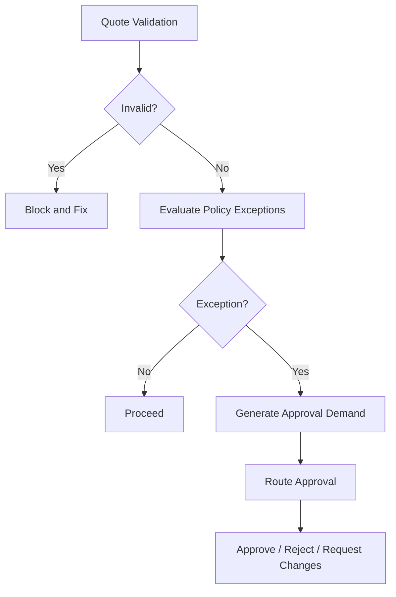
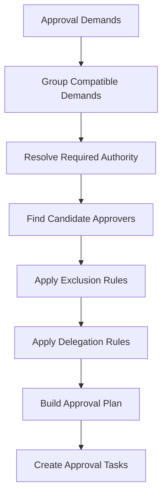
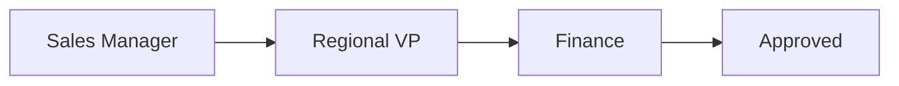
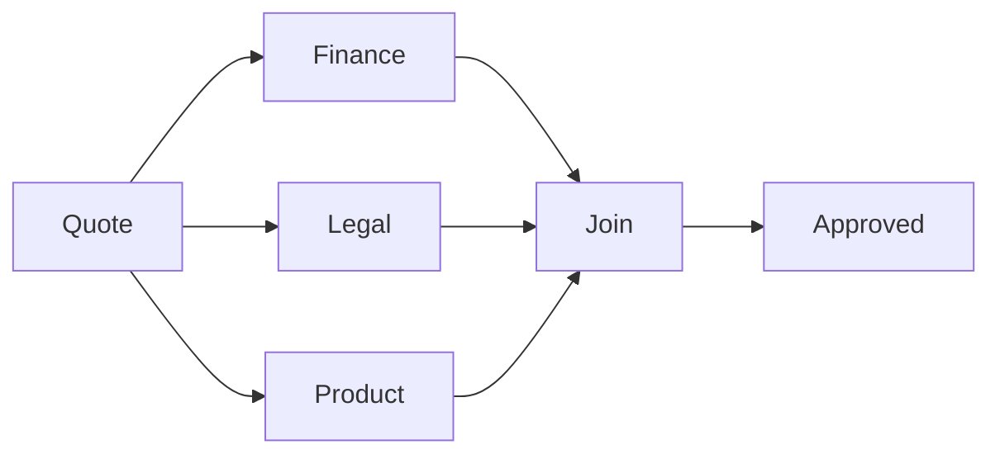
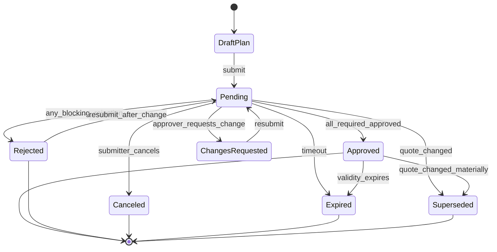
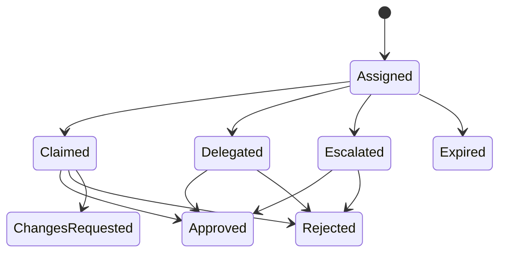
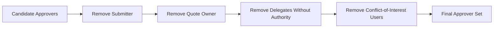
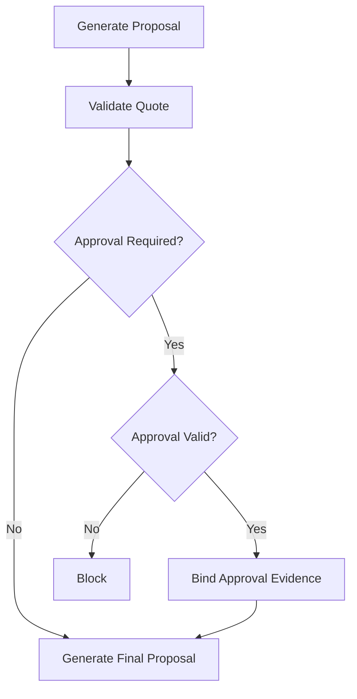
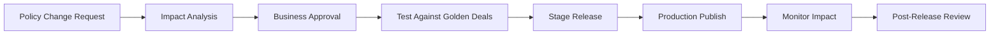

# Part 016 — Approval Workflow and Policy Governance

Approval adalah control plane untuk commercial exception.

Di CPQ enterprise, approval bukan sekadar:

```text
Manager clicks Approve.
```

Approval menjawab:

```text
Siapa yang berwenang menerima risiko komersial, legal, margin, delivery, atau compliance dari quote ini?
```

Tanpa approval model yang kuat, organisasi akan mengalami:

- discount leakage,
- unauthorized margin erosion,
- inconsistent deal policy,
- shadow approval via chat/email,
- stale approval after quote edit,
- approval bottleneck,
- poor audit evidence,
- unclear accountability,
- sales frustration,
- downstream contract/order disputes.

> Goal part ini: kamu mampu mendesain approval workflow dan policy governance untuk CPQ enterprise yang deterministic, explainable, auditable, scalable, and resilient terhadap quote changes.

---

## 1. Kaufman Target Performance

Setelah bagian ini, kamu harus bisa:

1. Membedakan validation error, policy exception, approval demand, approval task, and approval evidence.
2. Mendesain approval demand model dari hasil validation/policy evaluation.
3. Mendesain approval routing berdasarkan policy, authority, role, region, product, customer segment, margin, discount, legal terms, and risk.
4. Mendesain sequential, parallel, conditional, and hierarchical approval.
5. Menangani delegation, escalation, timeout, reassignment, and out-of-office.
6. Mencegah stale approval dengan commercial fingerprint.
7. Menerapkan separation of duties and conflict-of-interest control.
8. Mendesain approval audit trail yang bisa dipakai untuk finance, legal, compliance, and internal audit.
9. Mendesain approval UX untuk sales, approver, deal desk, and support.
10. Membuat design review checklist untuk approval workflow enterprise-grade.

Kaufman framing: approval adalah sub-skill untuk mengelola exception. Latihan utama bukan menghafal vendor feature, tetapi mendesain policy-to-decision flow yang bisa dipertanggungjawabkan.

---

## 2. Mental Model: Approval Is Acceptance of Exception Risk

Quote normal mengikuti policy.

Quote exceptional melanggar policy normal tetapi masih mungkin diterima jika orang/role yang tepat menyetujui.

```text
Approval = explicit acceptance of a detected policy exception under defined authority
```

Approval bukan validasi.

Approval tidak membuat konfigurasi invalid menjadi valid.

Approval hanya bisa menerima exception yang memang boleh di-override.

### 2.1 Validation vs Approval

| Concept | Question | Example |
|---|---|---|
| Validation | Apakah quote cukup benar untuk aksi ini? | Required option missing |
| Policy evaluation | Apakah quote melanggar policy? | Discount above 20% |
| Approval demand | Approval apa yang dibutuhkan? | VP Sales approval |
| Approval task | Siapa harus approve? | Jane as VP Sales APAC |
| Approval evidence | Siapa approve apa, kapan, atas data apa? | Jane approved discount 22% on quote v8 |

If product combination is impossible, do not send to approval.

If discount is outside rep authority but within executive authority, generate approval demand.



---

## 3. Approval Demand Model

Approval demand adalah output dari policy evaluation.

It says:

```text
This quote requires these approvals for these reasons.
```

### 3.1 Approval Demand Example

```json
{
  "approvalDemandId": "AD-1001",
  "quoteId": "Q-100029",
  "quoteVersion": 8,
  "commercialFingerprint": "sha256:...",
  "reasonCode": "DISCOUNT_ABOVE_AUTHORITY",
  "riskArea": "MARGIN",
  "severity": "HIGH",
  "requiredAuthority": "VP_SALES_APAC",
  "policyId": "DISC-ENT-APAC-2026",
  "policyVersion": "2026.07.02",
  "evidence": {
    "netDiscountPercent": 22.5,
    "salesRepAuthority": 15.0,
    "marginPercent": 18.2,
    "floorMarginPercent": 20.0
  },
  "canBeOverridden": true,
  "expiresAt": "2026-07-09T00:00:00+07:00"
}
```

### 3.2 Demand vs Task

Demand is logical.

Task is assigned.

One demand can produce many tasks.

Example:

```text
Demand: Legal approval required for non-standard indemnity clause.
Tasks:
- APAC Legal Counsel approval
- Data Protection Officer approval if customer is EU entity
```

One task can cover multiple demands.

Example:

```text
VP Sales approval task covers:
- discount above threshold
- margin below floor
- non-standard payment term
```

Keep this distinction.

It prevents duplicate approval spam.

---

## 4. Approval Policy Types

### 4.1 Commercial Policies

| Policy | Example Approval Trigger |
|---|---|
| Discount authority | Net discount exceeds role threshold |
| Margin floor | Gross margin below minimum |
| Contract value | TCV above delegation limit |
| Payment terms | Net 90 requested instead of Net 30 |
| Price override | Manual price lower than price book floor |
| Promotion exception | Non-stackable promo combination requested |
| Free period | Free months added to subscription |
| Ramp pricing | Year 1 below allowed ramp floor |

### 4.2 Legal Policies

| Policy | Example Approval Trigger |
|---|---|
| Non-standard terms | Customer redlines liability clause |
| Data processing | DPA required for personal data |
| Public sector | Government clause required |
| Export/regulatory | Restricted product/customer/region |
| Early termination | Customer requests non-standard termination rights |

### 4.3 Operational Policies

| Policy | Example Approval Trigger |
|---|---|
| Delivery exception | Requested install date below SLA |
| Inventory exception | Product not generally available |
| Manual fulfillment | Non-standard provisioning path |
| Support exception | Premium SLA without paid package |
| Migration exception | Legacy asset migration outside standard path |

### 4.4 Financial Policies

| Policy | Example Approval Trigger |
|---|---|
| Credit risk | Customer credit status below threshold |
| Billing exception | Manual invoice schedule |
| Revenue impact | Non-standard revenue recognition input |
| Tax exception | Missing exemption evidence |
| Write-off/waiver | One-time charge waived |

A mature approval system supports multiple risk areas without hard-coding all into one discount workflow.

---

## 5. Approval Routing

Approval routing answers:

```text
Who must approve this demand?
```

Routing depends on:

- authority matrix,
- policy reason,
- product family,
- region,
- sales territory,
- legal entity,
- customer segment,
- deal size,
- margin impact,
- discount percentage,
- channel,
- contract term,
- quote type,
- special flags.

### 5.1 Authority Matrix

Example:

| Condition | Required Authority |
|---|---|
| Discount <= 10% | Sales Rep |
| 10% < Discount <= 20% | Sales Manager |
| 20% < Discount <= 35% | Regional VP |
| Discount > 35% | CRO + Finance |
| Margin below floor | Finance |
| Non-standard legal terms | Legal |
| Payment term > 60 days | Finance |
| Public sector customer | Public Sector Deal Desk |

Authority matrix must be versioned.

The matrix used for approval must be recorded.

### 5.2 Routing Algorithm



### 5.3 Candidate Resolution

Candidate approvers can come from:

- role hierarchy,
- territory hierarchy,
- account team,
- product owner,
- finance approver group,
- legal queue,
- deal desk queue,
- static approver list,
- dynamic rule output,
- external HR/identity system.

Avoid hard-coded user IDs.

Use stable roles/groups whenever possible.

---

## 6. Approval Plan Types

### 6.1 Sequential Approval

Approvers act in order.



Use when later approver should see prior decision, or lower authority must filter before higher authority.

Pros:

- simpler accountability,
- lower senior approver load,
- clear escalation path.

Cons:

- slower,
- queue bottleneck,
- high latency for deals.

### 6.2 Parallel Approval

Approvers act independently.



Use when approvals are independent.

Pros:

- faster,
- reduces cycle time.

Cons:

- inconsistent conditions if approvers request conflicting changes,
- needs join logic.

### 6.3 Conditional Approval

Approval path depends on data.

```text
If discount > 20% and margin < 25% -> Finance + VP
If legal terms changed -> Legal
If public sector -> Compliance
```

### 6.4 Hierarchical Approval

Approval follows management chain.

Useful for sales authority.

Risk:

- org hierarchy changes,
- vacant managers,
- wrong manager data,
- cross-region matrix org.

### 6.5 Queue-Based Approval

Task goes to group.

Example:

- Deal Desk APAC,
- Legal Commercial Team,
- Finance Pricing Team.

Need assignment policy:

- first claim,
- round robin,
- workload-based,
- skill-based,
- territory-based.

---

## 7. Approval State Machine

Approval request needs explicit lifecycle.



### 7.1 Approval Task State



### 7.2 Join Rules

For approval request:

| Join Rule | Meaning |
|---|---|
| All required approve | Standard multi-approver approval |
| Any one approve | Queue/group approval |
| Any reject blocks | Conservative commercial governance |
| Weighted quorum | Rare; used for committee style |
| Conditional join | Approval depends on specific demand |

Be explicit.

---

## 8. Stale Approval

Stale approval is one of the biggest CPQ governance risks.

Scenario:

```text
Quote v8 has 18% discount.
Manager approves.
Sales rep changes discount to 28%.
System still shows approved.
Quote is sent to customer.
```

This is a control failure.

### 8.1 Commercial Fingerprint

Approval must bind to a fingerprint:

```text
approvalFingerprint = hash(commerciallyRelevantQuoteData)
```

If quote changes materially:

```text
currentFingerprint != approvedFingerprint
```

Then approval becomes:

```text
STALE / SUPERSEDED
```

### 8.2 Material vs Non-Material Change

Not every change should invalidate approval.

| Change | Invalidate Approval? |
|---|---|
| Internal note typo | No |
| Customer display name correction | Usually no |
| Quantity change | Yes |
| Product change | Yes |
| Discount change | Yes |
| Contract term change | Yes |
| Payment term change | Yes if governed |
| Legal clause change | Yes if legal-approved |
| Billing contact change | Usually no, unless legal/credit relevant |
| Proposal template visual change | No if no terms/prices changed |

Materiality matrix should be owned by governance, not random engineering judgment.

---

## 9. Delegation, Escalation, and Timeout

Real organizations have absences and bottlenecks.

Approval system must handle:

- out-of-office,
- delegated authority,
- temporary assignment,
- manager vacancy,
- SLA breach,
- urgent deal escalation,
- queue backlog,
- approver conflict.

### 9.1 Delegation

Delegation must define:

- delegator,
- delegate,
- scope,
- period,
- authority limit,
- risk areas,
- audit evidence.

Example:

```json
{
  "delegatorRole": "VP_SALES_APAC",
  "delegateUserId": "u-999",
  "validFrom": "2026-07-01",
  "validTo": "2026-07-10",
  "riskAreas": ["DISCOUNT", "MARGIN"],
  "maxDiscountPercent": 30,
  "reason": "Out of office coverage"
}
```

### 9.2 Escalation

Escalation policy:

| Trigger | Action |
|---|---|
| No response in 8 business hours | Reminder |
| No response in 24 business hours | Escalate to manager |
| Quote expires in 24 hours | High-priority notification |
| Strategic customer | Deal desk escalation |
| Approval queue overloaded | Rebalance assignment |

### 9.3 Timeout Semantics

Never default approve on timeout for high-risk approval.

Possible timeout outcomes:

- reminder,
- escalation,
- expire approval request,
- return to submitter,
- auto-reject for specific low-risk cases,
- route to backup approver.

Default approve is dangerous unless explicitly governed and low risk.

---

## 10. Separation of Duties

Separation of duties prevents conflict of interest.

Examples:

- Submitter cannot approve own quote.
- Sales rep cannot approve own discount exception.
- Deal creator cannot approve margin floor breach.
- Account owner cannot approve special credit exception.
- Legal approval cannot be bypassed by sales manager.
- Finance approval required for payment term exception.

### 10.1 Exclusion Rules

Approval routing must apply exclusion rules after candidate resolution.



### 10.2 Break-Glass Override

Sometimes urgent deals need exceptional path.

Break-glass must be explicit:

- restricted roles,
- reason required,
- evidence required,
- post-facto review,
- audit flag,
- notification to governance owner,
- expiry or scope limit.

Never implement break-glass as hidden admin edit.

---

## 11. Approval Evidence

Approval evidence must answer:

```text
Who approved what, when, based on which quote version, under which policy, with which authority?
```

### 11.1 Evidence Fields

```text
approval_request
- approval_request_id
- quote_id
- quote_version
- commercial_fingerprint
- status
- submitted_by
- submitted_at
- policy_set_version
- authority_matrix_version
- approval_plan_json
- final_decision
- final_decision_at

approval_demand
- approval_demand_id
- approval_request_id
- reason_code
- risk_area
- policy_id
- policy_version
- required_authority
- evidence_json

approval_task
- approval_task_id
- approval_request_id
- approval_demand_id nullable
- assigned_to_user_id nullable
- assigned_to_group_id nullable
- required_authority
- sequence
- status
- due_at
- delegated_from_user_id nullable
- escalated_from_task_id nullable

approval_decision
- approval_decision_id
- approval_task_id
- decided_by
- decision
- decision_reason
- decision_comment
- decided_at
- authority_source
- ip/device metadata if required
```

### 11.2 Evidence Snapshot

Persist enough to reconstruct decision.

Do not rely only on current quote.

Store:

- quote version,
- fingerprint,
- relevant price/margin evidence,
- policy version,
- approver authority at time of approval,
- delegation record if used,
- final decision,
- comments,
- timestamp.

---

## 12. Approval API Design

### 12.1 Preview Approval

Before submission, users need preview.

```http
POST /quotes/{quoteId}/approval-preview
```

Request:

```json
{
  "quoteVersion": 8,
  "includeApproverCandidates": true
}
```

Response:

```json
{
  "quoteId": "Q-100029",
  "quoteVersion": 8,
  "approvalRequired": true,
  "commercialFingerprint": "sha256:...",
  "demands": [
    {
      "reasonCode": "DISCOUNT_ABOVE_AUTHORITY",
      "riskArea": "MARGIN",
      "requiredAuthority": "VP_SALES_APAC",
      "evidence": {
        "netDiscountPercent": 22.5,
        "repAuthority": 15.0
      }
    }
  ],
  "approvalPlan": {
    "type": "PARALLEL_THEN_SEQUENTIAL",
    "steps": []
  }
}
```

Preview must use same policy engine as submit.

Salesforce CPQ Advanced Approvals has a similar practical concept: users can preview approvals and see approval rules before submitting. The enterprise design lesson is that preview must be authoritative enough to prevent “surprise routing”.

### 12.2 Submit Approval

```http
POST /quotes/{quoteId}/approval-requests
```

Request:

```json
{
  "quoteVersion": 8,
  "commercialFingerprint": "sha256:...",
  "validationRunId": "VR-9001",
  "submitterComment": "Strategic renewal; discount approved by account strategy."
}
```

Guards:

- quote version matches current version,
- validation run matches quote version,
- quote has no hard blockers,
- approval demands generated,
- approver routing resolvable,
- no existing active approval for same quote version,
- submitter has permission.

### 12.3 Decide Approval Task

```http
POST /approval-tasks/{taskId}/decision
```

Request:

```json
{
  "decision": "APPROVE",
  "comment": "Approved for strategic account renewal. Do not increase discount further.",
  "conditions": [
    "No additional free months",
    "Customer must sign before 2026-07-31"
  ]
}
```

Decision types:

| Decision | Meaning |
|---|---|
| `APPROVE` | Approver accepts risk |
| `REJECT` | Approver rejects quote/exception |
| `REQUEST_CHANGES` | Quote can be revised and resubmitted |
| `DELEGATE` | Route to authorized delegate |
| `ESCALATE` | Route to higher authority |
| `ABSTAIN` | Optional in committee workflows |

---

## 13. Approval UX

### 13.1 Submitter UX

Sales needs:

- why approval is required,
- who needs to approve,
- expected SLA,
- what data approver will see,
- what changes would avoid approval,
- whether quote is locked during approval,
- whether quote changes will reset approval.

Example:

```text
Approval required because net discount is 22.5%, above your 15% authority and below margin floor by 1.8 points.
Required approvals: VP Sales APAC and Finance Pricing.
Changing discount to 15% or increasing term value may remove approval requirement.
```

### 13.2 Approver UX

Approver needs:

- approval reason,
- quote summary,
- customer context,
- price waterfall,
- margin impact,
- policy threshold,
- comparison to standard policy,
- prior approvals,
- risk notes,
- recommended action,
- comments/history,
- ability to request changes.

### 13.3 Deal Desk UX

Deal desk needs:

- queue view,
- SLA status,
- exception type,
- deal size,
- sales stage,
- strategic account flag,
- bottleneck analysis,
- duplicate approval detection,
- batch triage.

### 13.4 Audit UX

Audit needs:

- immutable timeline,
- policy versions,
- approver authority,
- delegated authority evidence,
- decision comments,
- quote fingerprint,
- final quote/order link,
- exportable report.

---

## 14. Quote Locking During Approval

Should quote be editable while pending approval?

There are three patterns.

### 14.1 Hard Lock

Quote cannot be edited.

Pros:

- simple,
- avoids stale approval.

Cons:

- slows negotiation,
- user must cancel approval for small changes.

### 14.2 Soft Lock with Stale Detection

Quote can be edited, but material changes supersede approval.

Pros:

- flexible,
- safe if fingerprint is strong.

Cons:

- more complex UX.

### 14.3 Draft Revision

Pending approval stays on current version. Edits create new draft revision.

Pros:

- clean version semantics,
- supports parallel negotiation.

Cons:

- requires mature revisioning.

Recommended for enterprise:

```text
Versioned quote + materiality matrix + fingerprint-based stale detection.
```

---

## 15. Approval Conditions and Conditional Approval

Approvers may approve with conditions:

```text
Approved only if customer signs by July 31.
```

```text
Approved only if no additional free months are added.
```

```text
Approved only if payment term remains Net 45.
```

Conditional approval must be machine-readable if it affects downstream action.

Bad:

```text
Approver comment: OK if customer signs soon.
```

Good:

```json
{
  "conditionCode": "SIGN_BY_DATE",
  "requiredDate": "2026-07-31",
  "enforcedAt": ["PRESENT_TO_CUSTOMER", "ACCEPT_QUOTE", "CONVERT_TO_ORDER"]
}
```

Otherwise conditions live only in comments and are not enforced.

---

## 16. Approval and Proposal Generation

Proposal generation must check approval status.

Rules:

- Do not generate final proposal if required approval missing.
- Do not generate final proposal if approval stale.
- Proposal must reference quote version and approval evidence.
- If legal terms were approved, proposal must use approved clause version.
- If conditions apply, proposal must include or respect them.



---

## 17. Approval and Quote-to-Order Conversion

Order conversion must not simply check:

```text
quote.status == APPROVED
```

It must check:

- quote accepted,
- approval evidence valid,
- approval fingerprint matches accepted commercial snapshot,
- conditional approval constraints satisfied,
- approval not expired,
- no material change since approval,
- no policy that requires reapproval before conversion.

Conversion gate:

```text
AcceptedQuoteSnapshot must be covered by ApprovalEvidence.
```

If not, conversion is blocked.

---

## 18. Policy Governance Operating Model

Approval workflow is not only software. It is business governance encoded in software.

### 18.1 Governance Roles

| Role | Responsibility |
|---|---|
| Pricing owner | Discount/margin policy |
| Finance owner | Margin, payment, billing exception |
| Legal owner | Terms/clause policy |
| Product owner | Product availability and exception |
| Sales ops | Sales authority matrix |
| Deal desk | Exception triage and process improvement |
| Compliance | Regulated/customer/geography control |
| Engineering | Implementation correctness and observability |
| Internal audit | Evidence and control review |

### 18.2 Policy Change Lifecycle



### 18.3 Policy Versioning

Every approval decision should record:

- policy set version,
- approval rule version,
- authority matrix version,
- delegation version,
- quote fingerprint,
- quote version.

Policy changes should not rewrite history.

Historical approvals must remain explainable using the rules active at that time.

---

## 19. Observability and Metrics

Approval workflow needs operational metrics.

### 19.1 Business Metrics

| Metric | Meaning |
|---|---|
| Approval cycle time | How long approvals take |
| Approval queue backlog | Current workload |
| Approval rejection rate | Policy friction / quote quality |
| Request changes rate | Missing evidence or poor quote quality |
| Discount exception rate | Commercial discipline |
| Margin exception rate | Profitability risk |
| Stale approval rate | Quote revision instability |
| Escalation rate | SLA/process stress |
| Manual override rate | Policy or system gaps |

### 19.2 Technical Metrics

| Metric | Meaning |
|---|---|
| Routing latency | Approval plan generation cost |
| Candidate resolution failures | Identity/org data issue |
| Policy engine errors | Rule evaluation issue |
| Duplicate submissions | Idempotency issue |
| Approval decision conflicts | Concurrency issue |
| Notification failures | Workflow delivery issue |
| Stale fingerprint mismatches | Quote mutation after approval |

### 19.3 Audit Events

Emit events:

```text
ApprovalPreviewed
ApprovalRequested
ApprovalTaskAssigned
ApprovalTaskDelegated
ApprovalTaskEscalated
ApprovalTaskApproved
ApprovalTaskRejected
ApprovalChangesRequested
ApprovalRequestApproved
ApprovalRequestRejected
ApprovalRequestSuperseded
ApprovalRequestExpired
```

Events must include correlation IDs and quote version.

---

## 20. Failure Modes

| Failure Mode | Root Cause | Consequence | Countermeasure |
|---|---|---|---|
| Stale approval | Quote changed after approval | Unauthorized terms/discount | Commercial fingerprint |
| Wrong approver | Bad hierarchy/routing | Invalid authority | Authority matrix + candidate validation |
| Submitter self-approves | Missing separation of duties | Control failure | Exclusion rules |
| Approval spam | One task per minor rule | Slow process | Demand grouping |
| Hidden approval reason | Approver lacks context | Poor decisions | Evidence-rich task UX |
| Comments-only conditions | Conditions not enforced | Contract/order mismatch | Structured conditional approval |
| Timeout auto-approve | Unsafe SLA handling | Uncontrolled risk | Escalation not default approval |
| Hard-coded users | Org changes break routing | Stuck approvals | Role/group-based routing |
| Approval rule drift | Validation and approval differ | Inconsistent decisions | Shared policy engine |
| No audit snapshot | Only current data retained | Cannot prove decision basis | Persist quote/policy/fingerprint evidence |
| Manual bypass | Admin edits status | Untraceable exception | Break-glass workflow and audit |
| Approval bottleneck | Sequential path overused | Deal delay | Parallel/queue routing and SLA metrics |

---

## 21. Testing Strategy

### 21.1 Approval Scenario Matrix

Test by:

- discount percent,
- margin percent,
- deal size,
- quote type,
- region,
- product family,
- customer segment,
- legal terms,
- payment terms,
- sales hierarchy,
- delegation,
- approver absence,
- quote changes after approval,
- concurrent submit,
- retry/idempotency.

### 21.2 Golden Approval Cases

| Case | Expected Result |
|---|---|
| Discount within rep authority | No approval required |
| Discount above rep but below manager authority | Manager approval |
| Discount above manager authority | VP approval |
| Margin below floor | Finance approval |
| Non-standard legal clause | Legal approval |
| Public sector customer | Compliance approval |
| Quote changed after approval | Approval stale |
| Submitter is candidate approver | Candidate excluded |
| Approver out of office | Delegated or escalated |
| Approval timeout | Reminder/escalation/expiry by policy |
| Approval condition missed | Proposal/acceptance/conversion blocked |

### 21.3 Property-Based Tests

```text
A user must never approve their own submitted quote when separation-of-duties policy applies.
```

```text
If quote commercial fingerprint changes after approval, approval cannot authorize presentation/conversion.
```

```text
If any required approval task rejects, the approval request cannot become approved.
```

```text
If a required approver cannot be resolved, submit approval must fail or route to governed fallback, never silently skip.
```

```text
Preview and submit must produce equivalent approval demands for the same quote version and policy version.
```

---

## 22. Design Review Checklist

### 22.1 Domain Model

- [ ] Is approval demand separate from approval task?
- [ ] Are approval reasons explicit and versioned?
- [ ] Are policy, authority, and quote versions recorded?
- [ ] Is approval evidence immutable?
- [ ] Are conditional approvals structured?

### 22.2 Routing

- [ ] Is authority matrix versioned?
- [ ] Are candidate approvers resolved dynamically?
- [ ] Are hard-coded user IDs avoided?
- [ ] Are exclusion rules applied?
- [ ] Is fallback routing governed?
- [ ] Are delegation and escalation modeled?

### 22.3 Staleness

- [ ] Is commercial fingerprint defined?
- [ ] Is materiality matrix explicit?
- [ ] Does quote edit invalidate/supersede approval correctly?
- [ ] Does proposal generation check approval freshness?
- [ ] Does order conversion check approval coverage?

### 22.4 Governance

- [ ] Are policy owners defined?
- [ ] Are policy changes tested before release?
- [ ] Are golden approval cases maintained?
- [ ] Are manual overrides audited?
- [ ] Are separation-of-duties controls enforced?

### 22.5 Operations

- [ ] Are approval cycle times measured?
- [ ] Are stale approvals monitored?
- [ ] Can support explain why approval was routed?
- [ ] Can deal desk triage backlog?
- [ ] Are notification failures visible?
- [ ] Are stuck approvals recoverable?

---

## 23. Practice: Approval Design for an Enterprise Renewal

Scenario:

```text
Customer: Strategic enterprise account
Quote Type: Renewal + expansion
TCV: USD 2.5M
Base discount: 18%
Additional discount requested: 12%
Net discount: 30%
Margin: 19%
Standard floor margin: 22%
Payment term: Net 90
Legal: customer requests non-standard liability cap
Sales region: APAC
Quote expires in 14 days
```

Design:

1. Approval demands.
2. Approval routing.
3. Sequential vs parallel plan.
4. Stale approval fingerprint.
5. Conditional approval constraints.
6. Audit evidence.
7. Failure handling if VP is out of office.
8. Conversion gate after acceptance.

Expected approval demands:

- Regional VP for discount above manager authority.
- Finance for margin below floor.
- Finance/AR for Net 90 payment term.
- Legal for non-standard liability cap.
- Possibly CRO if TCV/discount combination crosses strategic threshold.

Potential plan:

```text
Parallel: Finance + Legal + Regional VP
Then: CRO if any condition or discount exceeds high-risk threshold
```

---

## 24. Key Takeaways

1. Approval is explicit acceptance of exception risk.
2. Validation, policy evaluation, approval demand, approval task, and approval evidence are different concepts.
3. Approval must bind to quote version and commercial fingerprint.
4. Stale approval is a serious governance failure.
5. Approval routing should be role/authority-based, not hard-coded to people.
6. Separation of duties must be enforced by system rules.
7. Delegation and escalation are first-class workflow concepts.
8. Conditional approvals should be structured, not buried in comments.
9. Approval history must preserve policy, authority, quote, and evidence versions.
10. Approval workflow quality should be measured through cycle time, stale rate, rejection rate, escalation rate, and override rate.

---

## 25. References

- Salesforce Help — Advanced Approvals uses approval rules to determine which approvers receive approval requests; rules are evaluated when users submit records such as quotes or opportunities.
- Salesforce Help — Approval Rule Fields describe active approval rules, approval conditions, advanced conditions, and approval chain concepts.
- Salesforce Help — Preview or Submit a Record for Approval lets users preview approval rules before submission.
- Oracle CPQ documentation — CPQ includes product selection, configuration, pricing, quoting, ordering, and approval workflows.
- Oracle E-Business Suite documentation — quote approval can depend on status transition to Approval Pending and approval initiation.
- NetSuite documentation — order quote approval workflow can be modeled through states, actions, and transitions.

---

## 26. What Comes Next

Part 017 akan membahas **Proposal Generation, Document Assembly, and Legal Traceability**:

- proposal document generation,
- template/version strategy,
- legal clause selection,
- quote-to-document binding,
- e-signature handoff,
- evidence preservation,
- and document auditability.
