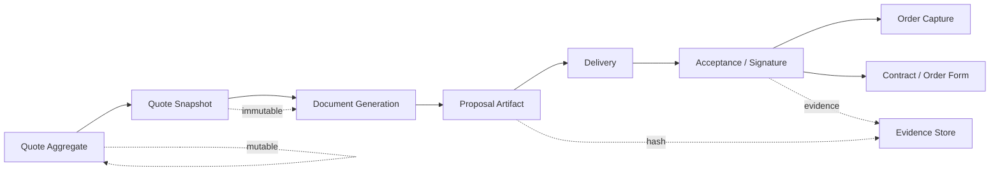
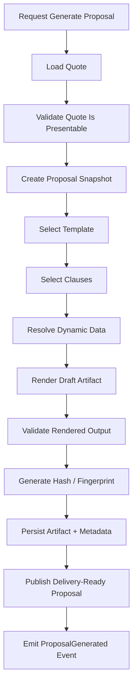
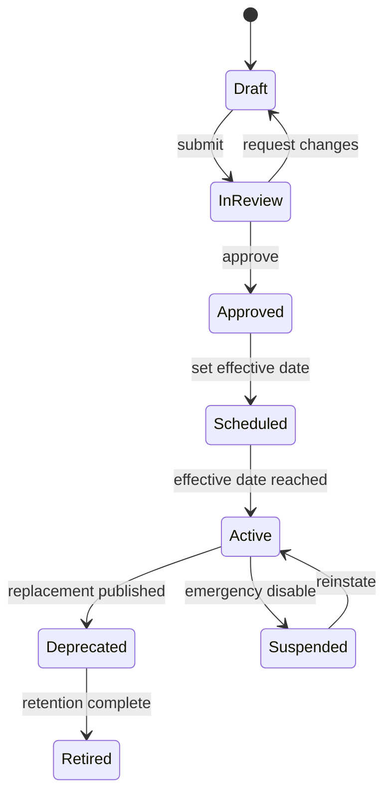
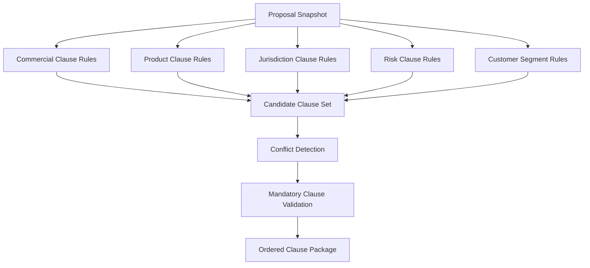
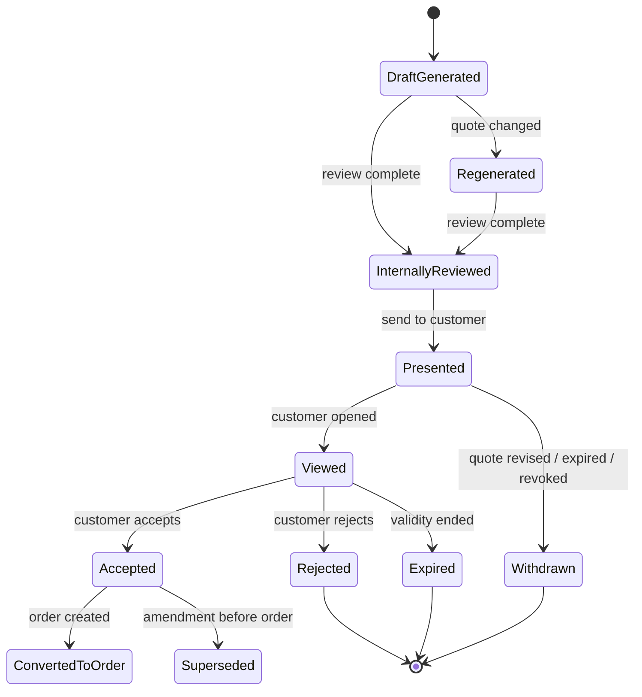
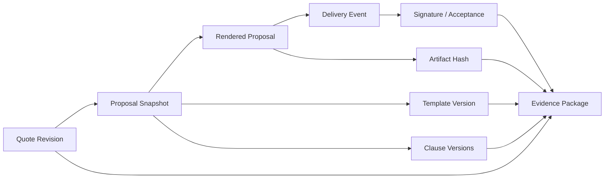
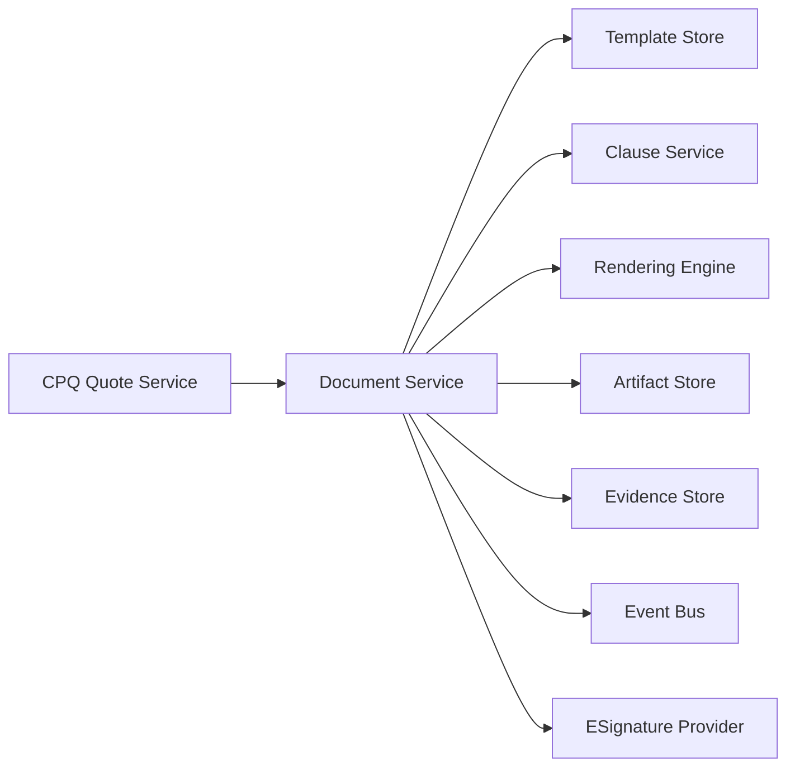

# Part 017 — Proposal Generation, Document Assembly, and Legal Traceability

Proposal generation adalah titik ketika quote berubah dari internal commercial model menjadi external customer-facing commitment.

Di CPQ sederhana, proposal sering dianggap sebagai:

```text
Generate PDF from quote.
```

Di CPQ enterprise, proposal adalah:

```text
A legally relevant evidence package generated from a versioned commercial snapshot,
using approved templates, selected clauses, traceable data, and controlled delivery.
```

Ini bukan masalah tampilan dokumen saja. Ini masalah **legal defensibility, commercial evidence, customer trust, and downstream enforceability**.

Tanpa document assembly yang kuat, organisasi akan mengalami:

- proposal dengan harga yang berbeda dari quote approved,
- terms and conditions yang salah versi,
- clause yang tidak sesuai jurisdiction,
- discount yang sudah expired tetapi masih muncul di PDF,
- document yang dikirim tanpa approval valid,
- sales manual-editing proposal di luar sistem,
- quote accepted tetapi evidence acceptance tidak lengkap,
- dispute karena customer melihat dokumen yang berbeda dari order/contract,
- legal tidak bisa membuktikan versi terms yang berlaku,
- audit tidak bisa merekonstruksi apa yang sebenarnya ditawarkan.

> Goal part ini: kamu mampu mendesain proposal generation dan document assembly untuk CPQ enterprise yang deterministic, versioned, secure, auditable, and legally traceable.

---

## 1. Kaufman Target Performance

Setelah bagian ini, kamu harus bisa:

1. Membedakan quote model, proposal document, order form, contract, attachment, and evidence package.
2. Mendesain document generation pipeline dari quote snapshot sampai generated artifact.
3. Mendesain template governance: versioning, effective dating, approval, localization, brand, and jurisdiction.
4. Mendesain clause selection model berbasis product, region, channel, customer type, risk, and legal policy.
5. Mendesain legal traceability: source data, template version, clause version, rendered document hash, recipient, delivery event, acceptance event.
6. Mencegah proposal drift setelah approval.
7. Menentukan field mana yang boleh diedit manual dan mana yang harus system-controlled.
8. Mendesain document state machine, API, event, and audit log.
9. Mendesain integration boundary dengan e-signature, CLM, document storage, CRM, and order capture.
10. Membuat failure model dan test strategy untuk proposal generation enterprise-grade.

Kaufman framing: document generation adalah sub-skill yang terlihat administratif tetapi sangat menentukan correctness. Latihan utamanya adalah membuat **evidence chain**, bukan membuat PDF cantik.

---

## 2. Mental Model: Proposal Is an Evidence Package

Proposal bukan hanya file.

Proposal adalah bundle dari:

| Element | Meaning |
|---|---|
| Quote snapshot | Commercial source at generation time |
| Pricing trace | Explanation of calculated price |
| Configuration snapshot | What product/options were selected |
| Approval evidence | Who approved exceptions and under which policy |
| Template version | Which layout and structure were used |
| Clause versions | Which legal terms were included |
| Generated artifact | PDF/DOCX/HTML package presented to customer |
| Delivery event | Who received it, when, through which channel |
| Acceptance evidence | Who accepted/signed and what exact artifact was accepted |
| Hash/fingerprint | Tamper detection for rendered output |

The enterprise invariant:

```text
A customer-facing proposal must be reproducible or explainable from immutable source evidence.
```

If the system cannot answer “what exactly did we offer and why?”, the proposal process is not enterprise-grade.

---

## 3. Proposal vs Quote vs Contract vs Order Form

Do not collapse these terms.

| Concept | Primary Role | Mutable? | Owned By |
|---|---|---:|---|
| Quote | Internal commercial decision model | Yes, until locked | CPQ |
| Proposal | Customer-facing representation of quote | No, after generation | CPQ / Document service |
| Order form | Commercial commitment artifact for purchase | Usually no after signature | CPQ / CLM / Contracting |
| Contract | Legal agreement and obligation framework | Controlled amendment | CLM / Legal |
| Order | Fulfillment request derived from accepted commercial intent | Controlled mutation | OMS |
| Subscription | Time-bound recurring commercial entitlement | Controlled amendment | Subscription/Billing platform |
| Invoice | Billing demand for payment | No, except credit/rebill process | Billing / ERP |

A mature architecture treats proposal as a **projection** of quote, not as the source of truth.



---

## 4. Why Enterprise Proposal Generation Is Hard

Proposal generation seems easy until real conditions appear.

### 4.1 Multiple Templates

Different templates may exist for:

- product family,
- region,
- legal entity,
- customer segment,
- sales channel,
- language,
- brand,
- public sector vs commercial,
- direct sale vs partner sale,
- new sale vs renewal vs amendment,
- quote amount threshold,
- regulated vs non-regulated product.

### 4.2 Conditional Legal Terms

Terms may depend on:

- jurisdiction,
- industry,
- data processing involvement,
- SLA tier,
- support tier,
- hosting region,
- security commitments,
- custom discount,
- trial vs paid contract,
- subscription vs perpetual license,
- hardware shipment vs pure SaaS,
- professional services involvement.

### 4.3 Commercial Snapshot Drift

A generated proposal can become invalid if:

- quote lines change,
- price changes,
- discount approval expires,
- catalog version changes,
- promotion expires,
- tax region changes,
- currency rate changes,
- legal terms are superseded,
- customer account changes,
- configured product becomes non-orderable.

### 4.4 Manual Editing Risk

Sales teams often want to edit proposal documents manually.

Some edits are harmless:

- customer-facing introduction,
- optional executive summary,
- branding notes,
- contact details.

Some edits are dangerous:

- price,
- discount,
- quantity,
- contract term,
- renewal term,
- legal clause,
- product entitlement,
- SLA commitment,
- cancellation right,
- payment term.

The platform must separate **controlled variables** from **editable narrative**.

---

## 5. Document Assembly Pipeline

A robust proposal pipeline looks like this:



Each step has a different correctness concern.

| Step | Correctness Question |
|---|---|
| Load Quote | Is this the latest intended quote revision? |
| Validate Presentable | Is the quote complete, approved, and not stale? |
| Snapshot | What exact data is being frozen? |
| Template Selection | Which template is legally and commercially correct? |
| Clause Selection | Which terms apply and why? |
| Dynamic Data | Are values sourced from approved fields only? |
| Render | Is output complete and deterministic? |
| Validate Rendered Output | Are mandatory sections present? |
| Fingerprint | Can the artifact be tamper-detected? |
| Persist | Is evidence immutable and retrievable? |
| Delivery | Was the correct recipient sent the correct artifact? |

---

## 6. Proposal Snapshot Strategy

Never render a proposal directly from live quote rows without creating a proposal snapshot.

A proposal snapshot should include:

```yaml
proposalSnapshot:
  proposalId: P-2026-000184
  quoteId: Q-000492
  quoteRevision: 7
  quoteFingerprint: sha256:...
  catalogVersion: 2026.07.01-enterprise
  pricingRunId: PR-88321
  pricingFingerprint: sha256:...
  approvalCaseId: APR-7721
  approvalFingerprint: sha256:...
  templateId: enterprise-order-form
  templateVersion: 14
  clauseSetVersion: legal-global-2026-06
  language: en-US
  jurisdiction: US-CA
  legalEntity: ACME-US-INC
  generatedBy: user-123
  generatedAt: 2026-07-02T09:15:10+07:00
```

The snapshot allows the system to say:

```text
This artifact came from quote revision 7 using template version 14 and legal clause set 2026-06.
```

Without this, generated documents become operational folklore.

---

## 7. Template Governance

Templates are not static files. They are governed business assets.

### 7.1 Template Lifecycle



### 7.2 Template Metadata

A template needs metadata, not just content.

```yaml
template:
  id: enterprise-saas-order-form
  version: 14
  status: Active
  effectiveFrom: 2026-07-01T00:00:00Z
  effectiveTo: null
  language: en-US
  region: US
  legalEntity: ACME-US-INC
  channel: DirectSales
  customerSegment: Enterprise
  quoteType:
    - NewSale
    - Renewal
  supportedProductFamilies:
    - SaaSPlatform
    - SupportPlan
  owner: LegalOperations
  approvedBy:
    - LegalCounsel
    - RevenueOperations
  checksum: sha256:...
```

### 7.3 Template Selection Rule

Template selection must be deterministic.

Bad:

```text
Sales rep chooses any template from dropdown.
```

Better:

```text
System computes eligible templates from quote context and policy.
```

Example:

```text
IF quote.region = "EU"
AND quote.productFamily contains "DataProcessing"
AND quote.customerSegment = "Enterprise"
THEN template = "enterprise-eu-dpa-order-form"
```

But this still needs conflict resolution:

```text
If multiple templates match, choose highest specificity; if tied, block generation.
```

Template selection invariant:

```text
For a given proposal snapshot, template selection must resolve to exactly one approved template.
```

---

## 8. Clause Selection Model

Clause selection is often more important than the layout.

Clauses represent legal commitments. They must be controlled like policy.

### 8.1 Clause Metadata

```yaml
clause:
  id: data-processing-addendum-us
  version: 5
  type: DataProtection
  status: Active
  jurisdiction: US
  appliesWhen:
    productHandlesPersonalData: true
    customerSegment:
      - Enterprise
      - PublicSector
  requiresApprovalIfModified: true
  owner: Legal
  effectiveFrom: 2026-06-01
  supersedes: data-processing-addendum-us:v4
```

### 8.2 Clause Types

| Clause Type | Example |
|---|---|
| Commercial | Payment terms, late fees, renewal language |
| Product | Service description, license metric, usage limits |
| Operational | Support hours, SLA, maintenance window |
| Legal | Limitation of liability, governing law, indemnity |
| Compliance | Data processing, audit rights, regulatory obligations |
| Security | Security controls, breach notification |
| Delivery | Shipping, installation, acceptance criteria |
| Termination | Cancellation, early termination fee, refund |

### 8.3 Clause Selection Flow



Clause selection invariant:

```text
Every included clause must be explainable by at least one rule or explicit legal override.
Every mandatory clause for the quote context must be included exactly once.
```

---

## 9. Controlled Fields vs Editable Narrative

Enterprise document systems need field-level edit policy.

| Field | Editable? | Reason |
|---|---:|---|
| Customer display name | Sometimes | May need legal name correction through account process |
| Product name | No | Must match catalog/order/billing mapping |
| Quantity | No | Affects price and fulfillment |
| List price | No | Comes from approved pricing source |
| Net price | No | Requires pricing trace and approval |
| Discount | No | Requires policy and approval |
| Contract start date | Controlled | Affects billing/revenue/subscription |
| Intro paragraph | Yes | Low-risk narrative |
| Case study section | Yes, controlled library | Marketing-approved content |
| Legal terms | No | Legal-controlled |
| Payment terms | Usually no | Finance-controlled |
| Implementation notes | Sometimes | May create delivery obligation |

Dangerous principle:

```text
If manual edit changes commercial, legal, fulfillment, billing, or compliance obligation,
it must be modeled as structured data or legal redline workflow, not free-text editing.
```

---

## 10. Proposal State Machine

Proposal lifecycle should be separate from quote lifecycle.



State invariants:

| State | Invariant |
|---|---|
| DraftGenerated | Artifact exists but is not customer-facing |
| InternallyReviewed | Internal quality gate passed |
| Presented | Exact artifact was sent to known recipient |
| Viewed | View event captured if channel supports it |
| Accepted | Acceptance evidence attached to artifact hash |
| Withdrawn | Customer should not accept this artifact anymore |
| Expired | Validity window ended |
| ConvertedToOrder | Accepted artifact is linked to order |

---

## 11. Proposal Validity and Withdrawal

A proposal should have validity semantics.

```yaml
proposalValidity:
  validFrom: 2026-07-02T09:00:00Z
  validUntil: 2026-07-31T23:59:59Z
  invalidatedBy:
    - quoteRevisionChanged
    - approvalFingerprintChanged
    - priceExpired
    - legalTemplateWithdrawn
    - promotionExpired
    - customerAccountBlocked
```

Common mistake:

```text
Quote expired, but proposal link still works and customer signs it.
```

Better:

```text
Acceptance endpoint checks proposal state and validity before accepting.
```

Proposal acceptance invariant:

```text
A proposal can be accepted only if it is presented, unexpired, unwithdrawn, and matches the accepted artifact fingerprint.
```

---

## 12. Legal Traceability Model

Legal traceability means the platform can reconstruct the legal-commercial path.

### 12.1 Evidence Chain



### 12.2 Evidence Fields

```yaml
evidencePackage:
  proposalId: P-2026-000184
  artifactHash: sha256:2b7d...
  renderedAt: 2026-07-02T09:15:10Z
  renderedBySystemVersion: document-service@3.8.2
  quoteId: Q-000492
  quoteRevision: 7
  template:
    id: enterprise-order-form
    version: 14
  clauses:
    - id: limitation-of-liability-us
      version: 9
    - id: data-processing-addendum-us
      version: 5
  recipients:
    - name: Jane Customer
      email: jane.customer@example.com
      role: AuthorizedSigner
  delivery:
    channel: ESignature
    deliveredAt: 2026-07-02T09:17:02Z
  acceptance:
    acceptedAt: 2026-07-03T18:44:19Z
    acceptedBy: jane.customer@example.com
    ipAddressCaptured: true
    signatureProviderEnvelopeId: env-7782
```

### 12.3 Evidence Design Rules

1. Store the rendered artifact, not only the template and quote.
2. Store template and clause versions.
3. Store quote revision and pricing fingerprint.
4. Store delivery recipient and delivery channel.
5. Store signature/acceptance provider reference.
6. Store hash of the final artifact.
7. Store withdrawal/expiry events.
8. Store redline/change events if negotiation modifies terms.

Do not rely on “we can regenerate it later” as legal evidence. Regeneration can differ due to template changes, dependency changes, locale changes, or rendering engine changes.

---

## 13. Document Generation Service Boundary

A dedicated document generation service is usually better than embedding rendering logic inside CPQ.



### Responsibilities

| Capability | Owner |
|---|---|
| Quote commercial data | CPQ Quote Service |
| Template metadata and lifecycle | Document Service / Legal Ops |
| Clause selection | Clause / Legal Policy Service |
| Rendering | Document Service |
| Artifact storage | Document / Content Platform |
| Delivery to signer | E-signature integration |
| Acceptance evidence | E-signature / Evidence Service |
| Order creation | OMS / Order Capture |

The document service should not re-price, reconfigure, or re-approve quote content.

It should consume already-approved source evidence.

---

## 14. API Design

### 14.1 Generate Proposal

```http
POST /quotes/{quoteId}/proposal-generations
Idempotency-Key: 8c3b1a19-...
```

Request:

```json
{
  "quoteRevision": 7,
  "generationPurpose": "CUSTOMER_PRESENTATION",
  "language": "en-US",
  "deliveryIntent": "ESIGNATURE",
  "requestedTemplateId": null,
  "requestedBy": "user-123"
}
```

Response:

```json
{
  "proposalId": "P-2026-000184",
  "status": "DRAFT_GENERATED",
  "quoteId": "Q-000492",
  "quoteRevision": 7,
  "templateId": "enterprise-order-form",
  "templateVersion": 14,
  "artifactHash": "sha256:2b7d...",
  "warnings": []
}
```

### 14.2 Present Proposal

```http
POST /proposals/{proposalId}/presentations
Idempotency-Key: 3f8df...
```

Request:

```json
{
  "channel": "ESIGNATURE",
  "recipients": [
    {
      "name": "Jane Customer",
      "email": "jane.customer@example.com",
      "role": "AUTHORIZED_SIGNER"
    }
  ],
  "message": "Please review and sign the attached order form."
}
```

Guard conditions:

- proposal exists,
- artifact hash exists,
- proposal is not withdrawn,
- quote is still presentable,
- approval fingerprint still valid,
- recipients are allowed,
- customer account is not blocked,
- e-signature channel is allowed for jurisdiction.

### 14.3 Accept Proposal

Acceptance may come from an e-signature callback, customer portal, or manual evidence upload.

```http
POST /proposals/{proposalId}/acceptance-events
```

Request:

```json
{
  "acceptedBy": "jane.customer@example.com",
  "acceptedAt": "2026-07-03T18:44:19Z",
  "artifactHash": "sha256:2b7d...",
  "signatureProvider": "ESIGN_PROVIDER",
  "signatureEnvelopeId": "env-7782"
}
```

Acceptance handler must verify artifact hash and proposal state.

---

## 15. Event Model

Key events:

```text
ProposalGenerationRequested
ProposalGenerated
ProposalGenerationFailed
ProposalPresented
ProposalViewed
ProposalWithdrawn
ProposalExpired
ProposalAccepted
ProposalRejected
ProposalSuperseded
ProposalEvidenceCaptured
```

Example event:

```json
{
  "eventType": "ProposalGenerated",
  "eventId": "evt-90018",
  "proposalId": "P-2026-000184",
  "quoteId": "Q-000492",
  "quoteRevision": 7,
  "templateId": "enterprise-order-form",
  "templateVersion": 14,
  "artifactHash": "sha256:2b7d...",
  "generatedAt": "2026-07-02T09:15:10Z",
  "correlationId": "corr-quote-492"
}
```

Event design rule:

```text
Proposal events should describe artifact lifecycle, not mutate quote economics.
```

---

## 16. Idempotency and Concurrency

Proposal generation is expensive and legally sensitive.

Common duplicate scenarios:

- sales clicks Generate twice,
- browser retries,
- async job retries,
- integration timeout triggers retry,
- multiple users generate from same quote revision,
- quote changes while proposal is being generated.

Use idempotency key with quote revision and generation purpose.

```text
idempotency scope = quoteId + quoteRevision + generationPurpose + idempotencyKey
```

But do not automatically deduplicate all generations. Sometimes two artifacts may be intentionally different because of language, template, or delivery purpose.

Better uniqueness model:

```text
same idempotency key -> same generation attempt
same quote revision + same template + same clause set + same locale -> can be safely reused if artifact still valid
```

---

## 17. Handling Redlines and Negotiated Terms

Enterprise customers often redline terms.

Do not let redlines become uncontrolled file exchange.

Redline handling options:

| Approach | When Useful | Risk |
|---|---|---|
| No redline allowed | Standard low-risk SaaS | Enterprise customers may reject |
| Manual legal process | Low volume, high value | Poor system traceability |
| CLM integration | Complex enterprise contracting | Integration complexity |
| Structured term exception | Common repeated changes | Requires clause model maturity |

A good CPQ/CLM boundary:

```text
CPQ owns commercial configuration and pricing.
CLM owns negotiated legal terms and contract redline lifecycle.
OMS consumes accepted commercial-order intent after legal/commercial acceptance.
```

If legal terms change in CLM, CPQ may need to know:

- payment term changed,
- contract term changed,
- cancellation term changed,
- SLA changed,
- liability cap changed,
- billing milestone changed,
- custom service obligation added.

These changes can affect approval and billing. Treat them as structured contract deltas where possible.

---

## 18. Document Storage and Retention

Generated proposal artifacts should be stored in a controlled artifact store.

Required capabilities:

- immutability after finalization,
- versioned metadata,
- access control,
- retention policy,
- legal hold,
- hash verification,
- encryption at rest,
- secure download links,
- audit log for access,
- deletion policy aligned with legal/compliance rules.

Avoid storing important proposal artifacts only as email attachments.

Email is a delivery channel, not a source of truth.

---

## 19. Security Model

Proposal documents contain sensitive information:

- customer data,
- pricing,
- discounts,
- product architecture,
- legal terms,
- business commitments,
- payment terms,
- account hierarchy,
- service locations.

Security controls:

| Control | Purpose |
|---|---|
| RBAC/ABAC | Restrict who can generate, view, present, withdraw |
| Field masking | Hide internal margin and approval notes |
| Watermarking | Mark draft/internal/customer copy |
| Expiring links | Reduce uncontrolled sharing |
| Recipient validation | Avoid sending to wrong party |
| Audit logging | Track access and delivery |
| Hash verification | Detect tampering |
| DLP scanning | Prevent leakage of internal notes |
| Legal hold | Preserve evidence during disputes |

Do not expose internal calculation traces to customers unless explicitly designed as customer-facing explanation.

---

## 20. Observability

Proposal generation needs operational visibility.

Metrics:

- generation success rate,
- generation latency p50/p95/p99,
- rendering failure rate by template,
- missing clause failure rate,
- template selection conflict count,
- proposal withdrawal count,
- proposal acceptance conversion rate,
- stale proposal generation attempts,
- e-signature callback failure rate,
- artifact storage failure rate,
- average time from approved quote to presented proposal,
- average time from presented to accepted.

Logs should include:

- quote ID,
- quote revision,
- proposal ID,
- template ID/version,
- clause set version,
- artifact hash,
- correlation ID,
- error classification.

Do not log full customer-sensitive proposal content unless there is a controlled secure logging policy.

---

## 21. Failure Modes

### 21.1 Wrong Template Selected

Cause:

- ambiguous template rules,
- missing region/legal entity criteria,
- manual template override.

Impact:

- wrong terms,
- unenforceable order form,
- legal dispute.

Control:

- deterministic template selection,
- conflict detection,
- legal approval for overrides,
- template selection audit.

### 21.2 Missing Mandatory Clause

Cause:

- clause rule bug,
- product metadata missing,
- jurisdiction mapping incomplete.

Impact:

- compliance exposure,
- customer dispute,
- legal risk.

Control:

- mandatory clause validation,
- clause coverage test matrix,
- high-risk quote legal review.

### 21.3 Proposal Drift After Quote Edit

Cause:

- quote revised after proposal generated,
- proposal not withdrawn,
- customer signs old link.

Impact:

- order created from obsolete commercial terms.

Control:

- quote revision fingerprint,
- automatic proposal withdrawal on material quote change,
- acceptance-time validation.

### 21.4 Manual Document Tampering

Cause:

- sales downloads editable DOCX,
- modifies pricing/terms,
- sends outside system.

Impact:

- unauthorized commitments.

Control:

- PDF finalization,
- e-signature controlled channel,
- artifact hash,
- customer acceptance only through official channel,
- manual-upload exception workflow.

### 21.5 E-Signature Callback Lost

Cause:

- provider outage,
- webhook failure,
- network issue.

Impact:

- signed deal not converted,
- sales operations delay.

Control:

- webhook retry,
- provider polling reconciliation,
- idempotent acceptance handler,
- manual evidence recovery process.

### 21.6 Artifact Store Failure

Cause:

- storage outage,
- permissions error,
- file corruption.

Impact:

- proposal generated but not retrievable.

Control:

- transaction boundary around metadata/artifact persistence,
- checksum verification,
- retry with idempotency,
- fail closed before presentation.

---

## 22. Testing Strategy

### 22.1 Template Selection Tests

Create a matrix:

| Region | Legal Entity | Product | Segment | Expected Template |
|---|---|---|---|---|
| US | ACME-US | SaaS | Enterprise | enterprise-us-saas |
| EU | ACME-EU | SaaS + DPA | Enterprise | enterprise-eu-dpa |
| JP | ACME-JP | Hardware | SMB | jp-hardware-standard |

Test not only happy path but conflicts and no-match cases.

### 22.2 Clause Coverage Tests

For each high-risk product/customer combination, assert mandatory clauses.

```text
Given product handles personal data
And customer jurisdiction is EU
Then DPA clause must be included
And governing law clause must match legal entity policy
```

### 22.3 Golden Document Tests

Use stable quote fixtures and compare generated output metadata.

Do not compare binary PDFs naively if rendering timestamps or font metadata vary.

Compare:

- selected template,
- selected clauses,
- rendered field values,
- section presence,
- page count range,
- artifact hash if deterministic,
- validation errors/warnings.

### 22.4 Acceptance Validation Tests

Test that customer cannot accept:

- withdrawn proposal,
- expired proposal,
- proposal with mismatched artifact hash,
- proposal generated from stale quote revision,
- proposal without required approval,
- proposal sent to unauthorized recipient.

### 22.5 Security Tests

Test:

- sales cannot view margin notes,
- partner cannot access direct-sales proposal,
- user cannot download proposal for unrelated account,
- expired signed URL fails,
- internal draft watermark exists,
- customer copy excludes internal fields.

---

## 23. Practice: Design a Proposal Evidence Package

Scenario:

A global enterprise customer buys:

- SaaS subscription,
- premium support,
- implementation services,
- usage-based add-on,
- special 35% discount,
- custom payment term,
- EU data processing requirement.

Design:

1. Proposal snapshot schema.
2. Template selection rule.
3. Mandatory clause set.
4. Approval evidence needed.
5. Acceptance validation rules.
6. Events emitted from generation to acceptance.
7. Failure modes and recovery process.

Expected thinking:

- special discount links to approval fingerprint,
- custom payment term may require finance approval,
- EU data processing requires DPA clause,
- implementation services require delivery/SOW reference,
- usage-based add-on requires usage billing explanation,
- acceptance must reference exact artifact hash.

---

## 24. Design Review Checklist

Use this checklist when reviewing proposal generation architecture.

### Domain Boundary

- Is proposal modeled separately from quote?
- Is document generation separated from pricing/configuration logic?
- Is CLM boundary clear?
- Is e-signature boundary clear?

### Snapshot and Traceability

- Is there a proposal snapshot?
- Does it include quote revision?
- Does it include pricing fingerprint?
- Does it include approval fingerprint?
- Does it include template and clause versions?
- Is rendered artifact stored?
- Is artifact hash stored?

### Template and Clause Governance

- Are templates versioned?
- Are templates effective-dated?
- Are templates approved before use?
- Is template selection deterministic?
- Are clause rules testable?
- Are mandatory clauses validated?
- Are manual overrides controlled?

### Proposal Lifecycle

- Can proposal be withdrawn?
- Can proposal expire?
- Is old proposal invalidated after material quote change?
- Is acceptance validated at acceptance time?
- Is accepted proposal linked to order/contract?

### Security and Audit

- Are internal fields excluded from customer documents?
- Are artifacts access-controlled?
- Are delivery and view events tracked?
- Is signature evidence captured?
- Is retention policy defined?

---

## 25. Common Anti-Patterns

| Anti-Pattern | Why It Fails |
|---|---|
| PDF as source of truth | Hard to validate, reconcile, and automate |
| Manual DOCX editing | Creates unauthorized commitments |
| Template dropdown free-choice | Wrong legal/commercial document selected |
| No clause versioning | Cannot prove terms at acceptance time |
| Regenerate instead of storing artifact | Reproduction may differ from original |
| Accept old proposal after quote changed | Creates commercial/order mismatch |
| Email-only delivery | Weak evidence and poor access control |
| No artifact hash | Tampering cannot be detected |
| No acceptance-time validation | Expired/withdrawn offers can be accepted |
| No document observability | Proposal failures become sales support tickets |

---

## 26. Key Takeaways

1. Proposal generation is not PDF generation; it is evidence generation.
2. Proposal must be generated from a quote snapshot, not mutable live quote rows.
3. Template and clause selection must be deterministic, versioned, and auditable.
4. Manual edits must not bypass commercial, legal, fulfillment, or billing controls.
5. Proposal lifecycle must support withdrawal, expiry, acceptance, and supersession.
6. Acceptance must bind to the exact artifact hash.
7. Generated artifact must be stored as evidence; do not depend on regeneration.
8. E-signature integration must be idempotent and reconciled.
9. Legal traceability requires quote, template, clause, delivery, and acceptance evidence.
10. Enterprise-grade proposal architecture protects revenue, legal enforceability, and customer trust.

---

## 27. What Comes Next

Part 018 moves from customer-facing proposal to downstream commercial execution:

```text
accepted quote/proposal -> contract boundary -> subscription boundary -> billing handoff
```

The key question becomes:

```text
Which system owns legal obligation, commercial entitlement, billing schedule, and financial truth?
```
