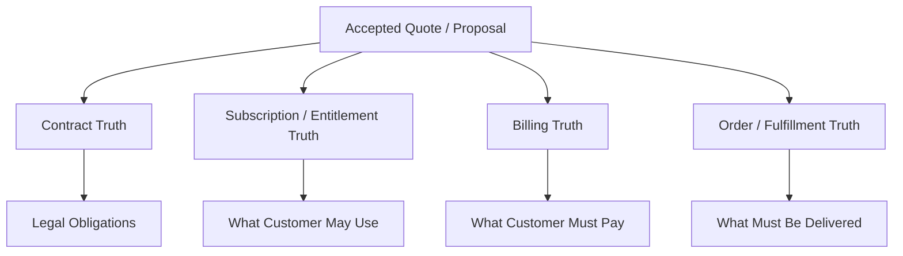
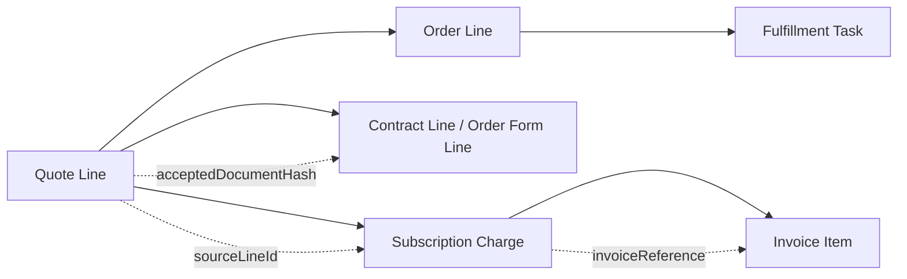
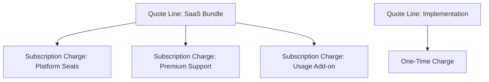
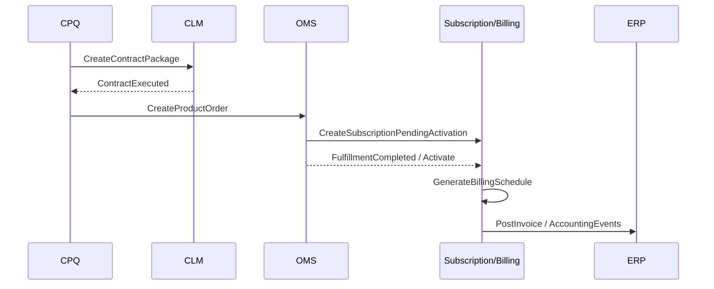

# Part 018 — Contract Boundary, Subscription Boundary, and Billing Handoff

After quote acceptance, the platform enters a dangerous zone.

Sales thinks:

```text
Deal is closed.
```

Engineering should think:

```text
A legally accepted commercial intent must now become contract obligations, product entitlements, fulfillment instructions, billing schedules, and financial records without semantic drift.
```

This is where many enterprise CPQ/OMS programs fail.

Not because they cannot generate a quote, but because quote data is handed off poorly to contract, subscription, billing, fulfillment, and ERP systems.

Symptoms:

- customer signed one price but invoice shows another,
- subscription starts on wrong date,
- billing account is wrong,
- quote line maps to wrong billing charge,
- order form says annual upfront but billing runs monthly,
- discount approved for year one but applied forever,
- amendment creates duplicate subscription,
- renewal loses contracted price,
- tax calculation uses wrong ship-to/sold-to/bill-to,
- finance cannot reconcile order, invoice, and contract,
- support cannot tell what the customer is entitled to use.

> Goal part ini: kamu mampu mendesain contract, subscription, and billing handoff boundary yang precise, auditable, idempotent, and safe for revenue operations.

---

## 1. Kaufman Target Performance

Setelah bagian ini, kamu harus bisa:

1. Membedakan quote, proposal, order form, contract, subscription, billing account, invoice, and revenue schedule.
2. Menentukan system of record untuk contract, subscription, billing, entitlement, and invoice.
3. Mendesain quote-to-contract and quote-to-billing handoff package.
4. Menentukan data mana yang harus disnapshot vs direferensikan.
5. Mendesain billing account mapping: sold-to, bill-to, payer, ship-to, legal entity, tax context.
6. Menangani start date, contract effective date, service activation date, billing trigger date, term start, and renewal date.
7. Mendesain subscription lifecycle: create, amend, renew, suspend, resume, cancel.
8. Mencegah double billing, underbilling, wrong discount duration, and re-pricing drift.
9. Mendesain reconciliation between CPQ, OMS, contract, subscription, billing, and ERP.
10. Membuat design review checklist untuk downstream commercial handoff.

Kaufman framing: handoff bukan integrasi teknis saja. Ini sub-skill untuk menjaga **semantic continuity** dari sales intent ke financial truth.

---

## 2. Mental Model: Four Truths After Quote Acceptance

Quote acceptance creates four downstream truths.



They are related but not identical.

| Truth | Main Question | Typical Owner |
|---|---|---|
| Contract | What did both parties legally agree to? | CLM / Legal |
| Subscription | What is active over time? | Subscription platform / Billing / Entitlement |
| Billing | What should be invoiced, when, to whom? | Billing / ERP |
| Order/Fulfillment | What must be provisioned/delivered? | OMS / Fulfillment |

Enterprise mistake:

```text
Treating accepted quote as enough for all downstream purposes.
```

Better:

```text
Accepted quote is the commercial source package from which specialized downstream records are created under controlled mapping rules.
```

---

## 3. Quote vs Contract vs Subscription vs Billing

### 3.1 Quote

A quote represents an offer or negotiated commercial proposal.

It contains:

- products,
- quantities,
- prices,
- discounts,
- terms,
- validity,
- approvals,
- customer context,
- configuration snapshot.

Quote is sales/commercial intent.

### 3.2 Contract

A contract represents legal obligation.

It contains:

- parties,
- legal entity,
- governing terms,
- order form,
- master agreement reference,
- signed document,
- effective date,
- term,
- amendment history,
- negotiated clauses.

Contract is legal commitment.

### 3.3 Subscription

A subscription represents time-bound commercial entitlement.

It contains:

- subscription start date,
- term start/end,
- renewal behavior,
- product/rate plan charges,
- quantities,
- amendments,
- cancellations,
- service activation status,
- entitlement mapping.

Subscription is commercial service continuity.

### 3.4 Billing

Billing represents monetization schedule.

It contains:

- bill-to account,
- payer,
- invoice owner,
- payment terms,
- billing frequency,
- invoice schedule,
- taxation context,
- charge timing,
- credit/rebill logic,
- dunning/collections context.

Billing is financial demand for payment.

---

## 4. Boundary Invariant

The core invariant:

```text
Downstream systems must not reinterpret commercial intent differently from the accepted quote package.
```

This does not mean every system copies all quote fields.

It means:

```text
Every downstream record must be traceable to the accepted source and mapping rule that created it.
```

For example:

```text
Quote line QL-10 -> Subscription charge SC-330 -> Invoice item INV-991-L2
```

Traceability chain:



---

## 5. Handoff Package

Do not hand off random quote fields.

Create a controlled handoff package.

```yaml
commercialHandoffPackage:
  packageId: CHP-2026-000881
  source:
    quoteId: Q-000492
    quoteRevision: 7
    proposalId: P-2026-000184
    acceptedArtifactHash: sha256:2b7d...
    acceptanceAt: 2026-07-03T18:44:19Z
  parties:
    soldToAccountId: A-1001
    billToAccountId: A-2002
    payerAccountId: A-2002
    shipToLocationId: LOC-551
    legalEntityId: LE-US-01
  commercialTerms:
    currency: USD
    paymentTerm: NET_30
    contractTermMonths: 36
    renewalMode: AUTO_RENEW
    billingFrequency: ANNUAL_UPFRONT
  dates:
    contractEffectiveDate: 2026-08-01
    serviceStartDate: 2026-08-15
    billingTriggerDate: 2026-08-15
    termStartDate: 2026-08-15
    termEndDate: 2029-08-14
  lines:
    - sourceQuoteLineId: QL-10
      productOfferingId: PO-SaaS-Enterprise
      configuredProductSnapshotId: CPS-883
      action: ADD
      quantity: 500
      pricing:
        listPrice: 120000.00
        netPrice: 78000.00
        discountPercent: 35
        discountDuration: YEAR_1_ONLY
      billing:
        chargeType: RECURRING
        billingTiming: ADVANCE
        billingFrequency: ANNUAL
        revenueTreatmentHint: SUBSCRIPTION
      entitlement:
        entitlementCode: SAAS_ENTERPRISE_SEATS
        activationDependency: FULFILLMENT_COMPLETE
```

The handoff package is not necessarily persisted as a single database table. It is a conceptual contract between systems.

---

## 6. Snapshot vs Reference Rules

A common architecture bug is copying everything or referencing everything.

Use this rule:

```text
Snapshot values that represent accepted commercial/legal intent.
Reference records that represent durable identity or operational relationship.
```

| Data | Snapshot or Reference? | Reason |
|---|---|---|
| Net price | Snapshot | Must match accepted offer |
| Discount | Snapshot | Approval tied to exact value |
| Product name shown to customer | Snapshot | Customer-facing evidence |
| Product offering ID | Reference + version | Needed for mapping/orderability |
| Account ID | Reference | Master data identity |
| Account legal name | Snapshot + reference | Legal document evidence plus MDM link |
| Billing account | Reference | Billing owner record |
| Payment term | Snapshot | Accepted commercial term |
| Tax rate | Usually not quote snapshot as final tax | Tax often calculated at invoice using jurisdiction/date |
| Tax classification | Snapshot/reference | Needed for invoice calculation |
| Template version | Snapshot | Legal evidence |
| Clause version | Snapshot | Legal evidence |
| Fulfillment product mapping | Reference/version | Operational mapping may be controlled by version |

Decision question:

```text
If this value changes tomorrow, should the accepted deal change?
```

If no, snapshot it.

---

## 7. Billing Account and Party Model

Enterprise billing often involves multiple parties.

| Party | Meaning |
|---|---|
| Sold-to | Customer that buys/owns commercial relationship |
| Bill-to | Account receiving invoices |
| Payer | Entity paying invoices |
| Ship-to | Delivery/service location |
| Service user | End user or consuming organization |
| Partner/reseller | Channel intermediary |
| Legal entity | Seller entity issuing contract/invoice |
| Tax registration party | Entity used for tax handling |

Bad model:

```text
customerId only
```

Better model:

```yaml
partyContext:
  soldTo: account-1001
  billTo: account-2002
  payer: account-2002
  shipTo: location-551
  reseller: partner-91
  sellerLegalEntity: legal-entity-us-01
  taxRegistration: tax-profile-us-01
```

Party invariant:

```text
Billing handoff must identify who bought, who receives invoice, who pays, where service is delivered, and which legal entity sells.
```

---

## 8. Dates Are Not One Date

CPQ teams often use one field called `startDate`.

That is not enough.

| Date | Meaning |
|---|---|
| Quote acceptance date | Customer accepted offer |
| Contract effective date | Legal agreement starts |
| Service start date | Customer may start consuming service |
| Fulfillment start date | Delivery/provisioning begins |
| Activation date | Product becomes active/usable |
| Billing trigger date | Billing should start |
| Term start date | Contract/subscription term starts |
| Term end date | Contract/subscription term ends |
| Renewal date | Renewal takes effect |
| Cancellation effective date | Service/contract ends |
| Invoice date | Invoice generated |
| Revenue recognition start | Revenue schedule begins |

Example:

```text
Customer signs on July 3.
Contract effective date is August 1.
Service activates August 15.
Billing starts August 15.
Term ends August 14 three years later.
```

If the system has only `startDate`, someone will be wrong.

Date invariant:

```text
Every downstream date must have a business meaning and owner. Do not overload one date for legal, fulfillment, billing, and revenue semantics.
```

---

## 9. Billing Handoff Should Not Re-Price

Billing may calculate invoice amounts based on charges, schedules, usage, taxes, proration, and credits.

But billing should not silently re-run CPQ pricing logic and produce a different commercial result.

### 9.1 What CPQ Sends

- product/rate plan mapping,
- charge model,
- contracted price,
- discount duration,
- billing frequency,
- payment term,
- term dates,
- quantity,
- currency,
- accepted commercial metadata.

### 9.2 What Billing Calculates

- invoice schedule,
- invoice items,
- proration,
- usage charges,
- taxes,
- credits,
- payment collection,
- dunning,
- accounting integration.

Boundary rule:

```text
CPQ determines accepted commercial price.
Billing determines invoicing execution based on accepted commercial price and billing rules.
```

If billing must transform price, transformation must be explicit and reconcilable.

---

## 10. Subscription Creation

A quote line often maps to one or more subscription charges.

Example:

| Quote Line | Subscription Output |
|---|---|
| SaaS Enterprise 500 seats | Recurring seat charge |
| Premium Support 20% of SaaS | Recurring support charge |
| Implementation Package | One-time service charge |
| API Usage Add-on | Usage charge |

Mapping is not always 1:1.



Mapping metadata:

```yaml
lineMapping:
  sourceQuoteLineId: QL-10
  targetSubscriptionId: SUB-10082
  targetCharges:
    - chargeId: CH-1
      chargeType: RECURRING
      productRatePlanChargeId: RPC-SEATS
    - chargeId: CH-2
      chargeType: USAGE
      productRatePlanChargeId: RPC-API-USAGE
```

Mapping invariant:

```text
Every downstream charge must trace back to source quote/order line and mapping version.
```

---

## 11. Discount Duration and Renewal Behavior

Discount is not just a number.

A 35% discount can mean:

- one-time discount,
- first invoice only,
- first year only,
- full initial term,
- forever until canceled,
- until renewal,
- renewal with step-up,
- ramp schedule,
- volume threshold-based discount.

Model it explicitly.

```yaml
discount:
  type: PERCENT
  value: 35
  appliesTo: RECURRING_CHARGE
  duration: YEAR_1_ONLY
  renewalBehavior: EXPIRES_AT_RENEWAL
  approvalId: APR-7721
```

Do not encode duration in comments like:

```text
"35% discount for year 1 only"
```

That comment will not protect revenue.

---

## 12. Ramp Deals

Enterprise contracts often use ramp pricing.

Example:

| Period | Seats | Annual Net Price |
|---|---:|---:|
| Year 1 | 500 | 78,000 |
| Year 2 | 750 | 125,000 |
| Year 3 | 1,000 | 180,000 |

Ramp deal requires structured schedule.

```yaml
rampSchedule:
  - period: 1
    startDate: 2026-08-15
    endDate: 2027-08-14
    quantity: 500
    netAmount: 78000
  - period: 2
    startDate: 2027-08-15
    endDate: 2028-08-14
    quantity: 750
    netAmount: 125000
  - period: 3
    startDate: 2028-08-15
    endDate: 2029-08-14
    quantity: 1000
    netAmount: 180000
```

Failure mode:

```text
Billing receives only current quantity and current price, then loses future ramp commitments.
```

Control:

```text
Ramp schedule must be first-class commercial data in handoff package.
```

---

## 13. Amendments and Change Orders

After subscription creation, future quote activity often modifies existing commercial truth.

Amendment types:

| Type | Meaning |
|---|---|
| Add product | Add new subscription product/charge |
| Remove product | Terminate product/charge |
| Increase quantity | Expansion |
| Decrease quantity | Contraction |
| Upgrade | Replace lower tier with higher tier |
| Downgrade | Replace higher tier with lower tier |
| Suspend | Temporarily stop service/billing/entitlement depending policy |
| Resume | Reactivate suspended service |
| Renew | Extend term |
| Cancel | End contract/subscription |
| Change billing term | Modify invoicing/payment schedule |

Amendment invariant:

```text
An amendment must identify the existing subscription/asset/contract line it modifies.
```

Bad:

```json
{
  "product": "Enterprise Plan",
  "quantity": 1000
}
```

Better:

```json
{
  "action": "INCREASE_QUANTITY",
  "targetSubscriptionChargeId": "CH-1",
  "sourceAssetId": "AST-773",
  "oldQuantity": 500,
  "newQuantity": 1000,
  "effectiveDate": "2027-01-01"
}
```

---

## 14. Contract Boundary

The contract boundary determines what becomes legally binding.

Typical CLM-owned concepts:

- master services agreement,
- order form,
- statement of work,
- data processing agreement,
- amendment document,
- renewal document,
- negotiated legal clauses,
- signature envelope,
- legal approval history,
- contract repository.

Typical CPQ-owned concepts:

- configuration,
- pricing,
- discount approval,
- quote line structure,
- commercial terms before contract execution,
- proposal generation input.

Typical OMS-owned concepts:

- accepted order intent,
- order decomposition,
- fulfillment tasks,
- fallout resolution,
- delivery status.

Boundary rule:

```text
CLM should not become the pricing engine.
CPQ should not become the legal redline system.
OMS should not become the contract repository.
```

---

## 15. Billing Boundary

Billing system owns invoices and billing execution.

Billing typically owns:

- customer billing account,
- invoice generation,
- billing schedule,
- usage rating,
- taxation integration,
- payment application,
- credit memo/debit memo,
- dunning,
- revenue/accounting handoff.

CPQ should not own:

- invoice number,
- invoice state,
- payment status,
- collections workflow,
- accounting posting.

But CPQ must provide:

- accepted price,
- charge model,
- billing terms,
- billing frequency,
- quantity,
- product mapping,
- commercial evidence.

Boundary rule:

```text
Billing executes financial obligations. CPQ defines accepted commercial obligations.
```

---

## 16. Order vs Billing Timing

Order fulfillment and billing do not always start together.

Examples:

| Scenario | Fulfillment | Billing |
|---|---|---|
| SaaS immediate activation | Starts immediately | Starts immediately or next cycle |
| Hardware shipment | Starts shipment workflow | Billing on shipment or delivery |
| Professional services | Starts project onboarding | Billing by milestone |
| Telecom service | Starts feasibility/provisioning | Billing after activation |
| Trial conversion | Entitlement starts as trial | Billing starts after trial end |
| Backordered product | Delayed | Billing may wait until delivery |

Do not hard-code:

```text
order submitted = billing starts
```

Use billing trigger rules.

```yaml
billingTrigger:
  triggerType: SERVICE_ACTIVATION
  sourceEvent: FulfillmentCompleted
  gracePeriodDays: 0
```

---

## 17. Event-Driven Handoff

A common event sequence:



This is one possible flow. Some organizations create order before contract execution for pre-provisioning, but that requires strong cancellation/hold controls.

Safer default:

```text
No irreversible fulfillment or billing before commercial/legal acceptance.
```

---

## 18. Idempotency

Handoff is highly vulnerable to duplicates.

Duplicate causes:

- user clicks convert twice,
- network retry,
- webhook replay,
- asynchronous worker retry,
- timeout after downstream success,
- partial failure after subscription created but before CPQ receives response.

Use idempotency by source acceptance event.

```text
idempotency key = acceptedProposalId + acceptedArtifactHash + targetSystem + operationType
```

Downstream creation should store source reference.

```yaml
subscription:
  id: SUB-10082
  sourceSystem: CPQ
  sourceQuoteId: Q-000492
  sourceQuoteRevision: 7
  sourceProposalId: P-2026-000184
  sourceAcceptanceEventId: ACC-991
  sourceLineMappings:
    - quoteLineId: QL-10
      subscriptionChargeId: CH-1
```

Idempotency invariant:

```text
The same accepted commercial event must not create duplicate contracts, subscriptions, orders, or invoices.
```

---

## 19. Reconciliation

Even with good design, systems drift.

Reconciliation should be designed from day one.

### 19.1 Reconciliation Dimensions

| Dimension | Compare |
|---|---|
| Identity | quote/order/subscription/invoice linkage |
| Product | product offering vs subscription charge |
| Quantity | quote quantity vs subscription quantity |
| Price | accepted net price vs billing charge |
| Discount | discount amount/duration vs billing discount |
| Dates | term/billing/activation dates |
| Account | sold-to/bill-to/payer/legal entity |
| Status | order completed vs subscription active |
| Invoice | invoice amount vs billing schedule |

### 19.2 Reconciliation Example

```text
For all accepted quotes converted in last 24 hours:
  assert every quote line with billable charge has subscription charge
  assert subscription charge sourceQuoteLineId exists
  assert net recurring amount equals accepted recurring amount within rounding policy
  assert billToAccount matches handoff package
  assert first billing trigger matches activation/billing rule
```

### 19.3 Drift Severity

| Severity | Example | Action |
|---|---|---|
| P0 | Customer billed wrong amount | Stop billing / credit / incident |
| P1 | Subscription missing entitlement | Urgent fix |
| P2 | Missing source reference | Data correction |
| P3 | Reporting lag | Monitor |

---

## 20. Revenue Leakage Failure Modes

### 20.1 Underbilling

Cause:

- quote line not mapped to billing charge,
- discount applied forever by mistake,
- quantity not updated,
- usage charge not configured,
- billing trigger not fired.

Control:

- mapping completeness test,
- discount duration model,
- activation-billing reconciliation,
- missing invoice report.

### 20.2 Overbilling

Cause:

- duplicate subscription,
- duplicate invoice schedule,
- cancellation not propagated,
- amendment creates add instead of replace,
- proration error.

Control:

- idempotency,
- source reference uniqueness,
- amendment target identity,
- billing simulation,
- credit/rebill process.

### 20.3 Wrong Customer Billed

Cause:

- bill-to defaults from sold-to,
- account hierarchy mapping wrong,
- partner/reseller model ignored.

Control:

- party model,
- bill-to validation,
- approval for third-party billing,
- billing account preview before activation.

### 20.4 Wrong Contract Term

Cause:

- start date overloaded,
- leap-year/end-date bug,
- timezone date conversion,
- manual override.

Control:

- explicit date semantics,
- date calculation tests,
- timezone-safe date handling,
- contract term preview.

### 20.5 Repricing Drift

Cause:

- billing re-fetches current catalog price,
- quote price expired after acceptance but before billing,
- renewal uses current price instead of contracted renewal rule.

Control:

- accepted price snapshot,
- contracted price record,
- renewal pricing policy,
- billing charge source fingerprint.

---

## 21. Data Ownership Matrix

| Data | Source of Truth | CPQ Role | OMS Role | Billing Role | CLM Role |
|---|---|---|---|---|---|
| Quote price | CPQ | Own | Consume | Consume as accepted charge | Evidence |
| Contract terms | CLM | Provide commercial input | Consume constraints | Consume billing terms | Own |
| Subscription active state | Subscription/Billing | Reference | May trigger fulfillment | Own | Reference |
| Order fulfillment state | OMS | Reference | Own | Activation dependency | Reference |
| Invoice | Billing/ERP | Reference | Reference | Own | Reference |
| Billing account | Billing/MDM | Select/validate | Consume | Own/validate | Reference |
| Product offering | Catalog | Consume | Consume | Map to charges | Reference |
| Entitlement | Entitlement/Subscription | Input | Activate | May own | Reference |

Architecture smell:

```text
Multiple systems can independently edit the same commercial truth.
```

Use ownership, commands, and events to control mutation.

---

## 22. API Boundary Examples

### 22.1 Create Contract Package

```http
POST /contract-packages
Idempotency-Key: accepted-proposal-P-2026-000184
```

```json
{
  "sourceQuoteId": "Q-000492",
  "sourceQuoteRevision": 7,
  "proposalId": "P-2026-000184",
  "acceptedArtifactHash": "sha256:2b7d...",
  "legalEntityId": "LE-US-01",
  "soldToAccountId": "A-1001",
  "contractEffectiveDate": "2026-08-01",
  "termMonths": 36,
  "documents": [
    {
      "type": "ORDER_FORM",
      "artifactId": "ART-991",
      "hash": "sha256:2b7d..."
    }
  ]
}
```

### 22.2 Create Product Order

```http
POST /product-orders
Idempotency-Key: accepted-proposal-P-2026-000184
```

```json
{
  "sourceQuoteId": "Q-000492",
  "sourceProposalId": "P-2026-000184",
  "orderType": "NEW_SALE",
  "requestedCompletionDate": "2026-08-15",
  "relatedParties": {
    "soldTo": "A-1001",
    "billTo": "A-2002",
    "shipTo": "LOC-551"
  },
  "orderLines": [
    {
      "sourceQuoteLineId": "QL-10",
      "action": "ADD",
      "productOfferingId": "PO-SaaS-Enterprise",
      "quantity": 500,
      "commercialSnapshotRef": "CHP-2026-000881"
    }
  ]
}
```

### 22.3 Create Subscription

```http
POST /subscriptions
Idempotency-Key: accepted-proposal-P-2026-000184-subscription
```

```json
{
  "sourceQuoteId": "Q-000492",
  "sourceOrderId": "O-000331",
  "accountId": "A-1001",
  "billToAccountId": "A-2002",
  "termStartDate": "2026-08-15",
  "termEndDate": "2029-08-14",
  "status": "PENDING_ACTIVATION",
  "charges": [
    {
      "sourceQuoteLineId": "QL-10",
      "chargeType": "RECURRING",
      "quantity": 500,
      "netAmount": 78000,
      "billingFrequency": "ANNUAL",
      "discountDuration": "YEAR_1_ONLY"
    }
  ]
}
```

---

## 23. Testing Strategy

### 23.1 Handoff Golden Tests

Given quote fixture, assert handoff package.

```text
Given accepted quote Q-000492 revision 7
When commercial handoff package is created
Then billToAccountId = A-2002
And contractTermMonths = 36
And QL-10 maps to recurring charge
And discount duration = YEAR_1_ONLY
And accepted artifact hash is included
```

### 23.2 Billing Simulation Tests

Before creating live billing records, simulate invoice schedule.

Assert:

- first invoice date,
- invoice amount,
- tax basis fields present,
- annual/monthly frequency,
- proration,
- discount duration,
- ramp schedule,
- renewal behavior.

### 23.3 Idempotency Tests

Send same accepted proposal event multiple times.

Expected:

- one contract package,
- one product order,
- one subscription,
- no duplicate charges,
- repeated response references same created records.

### 23.4 Amendment Tests

For existing subscription:

- increase quantity,
- decrease quantity,
- upgrade,
- downgrade,
- cancel,
- renew,
- suspend/resume.

Assert correct target line mutation, not duplicate create.

### 23.5 Reconciliation Tests

Create synthetic drift:

- missing subscription charge,
- wrong bill-to,
- wrong discount duration,
- duplicate subscription,
- activation complete but billing pending.

Assert reconciliation flags with correct severity.

---

## 24. Practice: Design a Billing Handoff

Scenario:

A customer signs:

- 36-month SaaS contract,
- 500 seats year 1, 750 year 2, 1000 year 3,
- 35% discount only in year 1,
- annual upfront billing,
- premium support at 20% of SaaS net price,
- implementation service billed 50% upfront and 50% at go-live,
- bill-to is different from sold-to,
- service starts 14 days after contract effective date.

Design:

1. Handoff package.
2. Date model.
3. Subscription charge mapping.
4. Billing schedule preview.
5. Discount duration representation.
6. Milestone billing representation.
7. Idempotency strategy.
8. Reconciliation checks.

Expected reasoning:

- ramp schedule must be structured,
- discount duration must not be free text,
- implementation billing is milestone-based, not simple recurring,
- bill-to must be explicit,
- service start and contract effective date differ,
- support pricing formula must be resolved or governed for billing,
- accepted quote artifact hash must be carried downstream.

---

## 25. Design Review Checklist

### Boundary

- Is CPQ/CLM/OMS/Billing ownership explicit?
- Is accepted quote treated as source package, not universal source of truth?
- Does billing avoid silent repricing?
- Does CLM avoid owning product pricing logic?
- Does OMS avoid owning invoice/payment state?

### Handoff Package

- Does package include quote revision?
- Does it include accepted proposal artifact hash?
- Does it include sold-to/bill-to/payer/ship-to/legal entity?
- Does it include payment term and billing frequency?
- Does it include explicit date semantics?
- Does it include source line IDs?
- Does it include discount duration and renewal behavior?
- Does it include ramp schedules if applicable?

### Subscription and Billing

- Are charge mappings explicit?
- Are one-time, recurring, and usage charges separated?
- Are billing triggers explicit?
- Are activation dependencies explicit?
- Are amendment targets identified by existing asset/subscription line?
- Are duplicate subscriptions prevented?

### Reconciliation

- Can quote line be traced to subscription charge?
- Can subscription charge be traced to invoice item?
- Can order line be traced to fulfillment task?
- Are mismatches detected automatically?
- Is revenue leakage severity classified?

### Testing

- Are handoff golden tests implemented?
- Are billing simulation tests implemented?
- Are date semantics tested?
- Are idempotency retries tested?
- Are amendment scenarios tested?
- Are reconciliation jobs tested?

---

## 26. Common Anti-Patterns

| Anti-Pattern | Why It Fails |
|---|---|
| One `customerId` for everything | Cannot handle sold-to/bill-to/payer/ship-to/legal entity |
| One `startDate` for all semantics | Breaks contract, billing, fulfillment, and revenue logic |
| Billing re-runs CPQ pricing | Causes accepted price drift |
| Discount as text note | Billing cannot enforce duration |
| No source line mapping | Reconciliation becomes manual |
| Amendment creates new subscription blindly | Causes duplicate billing/entitlement |
| Quote-to-billing direct write without OMS/contract context | Loses fulfillment and legal controls |
| No idempotency on handoff | Duplicate orders/subscriptions/invoices |
| No billing preview | Errors discovered on real invoices |
| No reconciliation | Revenue leakage found by customers or finance |

---

## 27. Key Takeaways

1. Accepted quote is not the same as contract, subscription, billing, or order.
2. Handoff must preserve semantic continuity from accepted commercial intent to downstream records.
3. Snapshot accepted commercial/legal values; reference durable identities and governed mappings.
4. Billing account model must distinguish sold-to, bill-to, payer, ship-to, and legal entity.
5. Date semantics must be explicit; one `startDate` is not enough.
6. Billing should execute accepted commercial terms, not silently re-price them.
7. Discount duration, ramp schedule, and renewal behavior must be structured data.
8. Amendments must target existing assets/subscriptions, not create duplicates accidentally.
9. Idempotency is mandatory for quote-to-contract/order/subscription/billing handoff.
10. Reconciliation is not optional; it is revenue safety infrastructure.

---

## 28. What Comes Next

Part 019 starts Phase 5:

```text
Order Capture and Order Domain Model
```

We move from accepted commercial intent into the OMS domain:

- product order,
- order line,
- action type,
- related party,
- billing account reference,
- delivery appointment,
- quote reference,
- order snapshot,
- order lifecycle.

The key question becomes:

```text
How do we model an order so it can be validated, decomposed, fulfilled, changed, cancelled, and audited without corrupting the accepted commercial intent?
```
