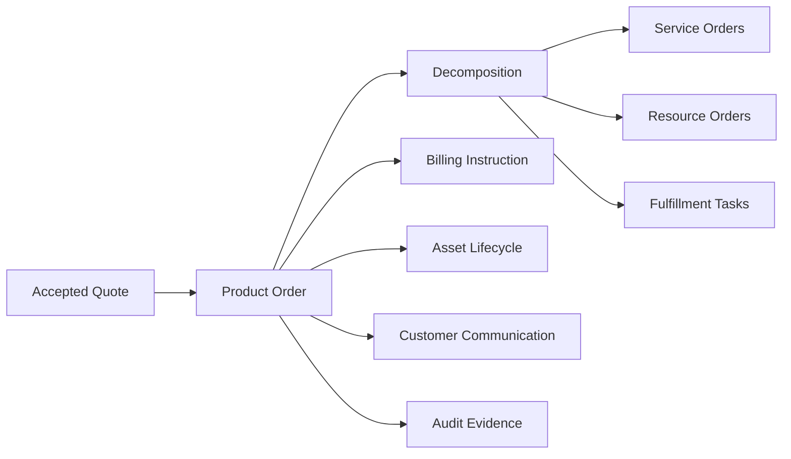
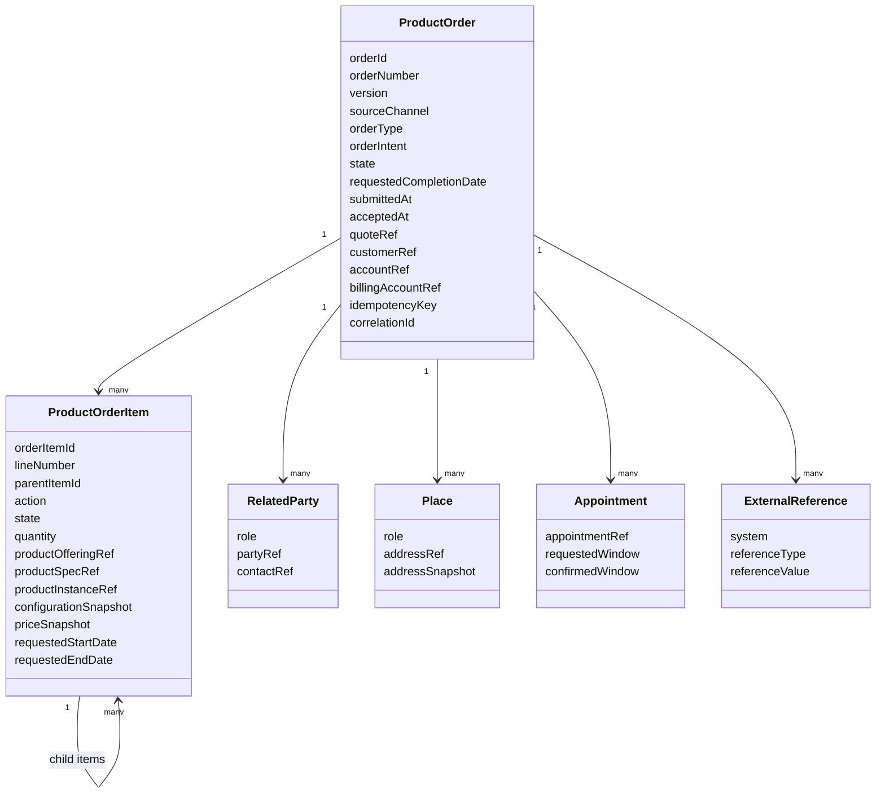
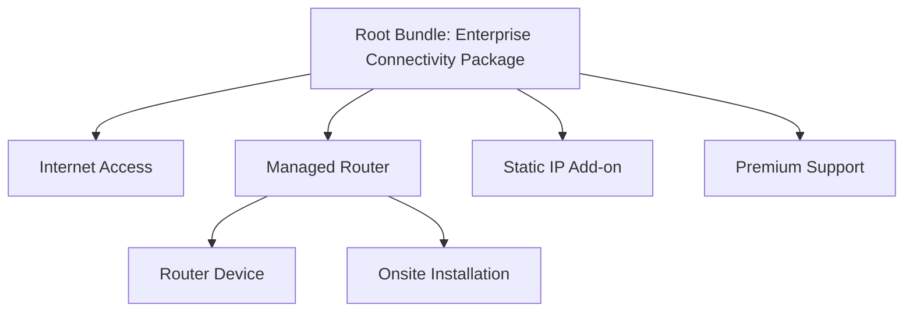
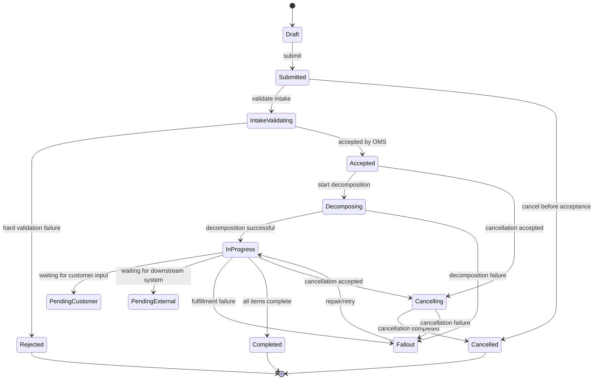
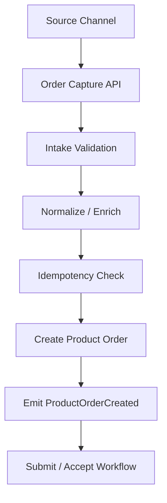
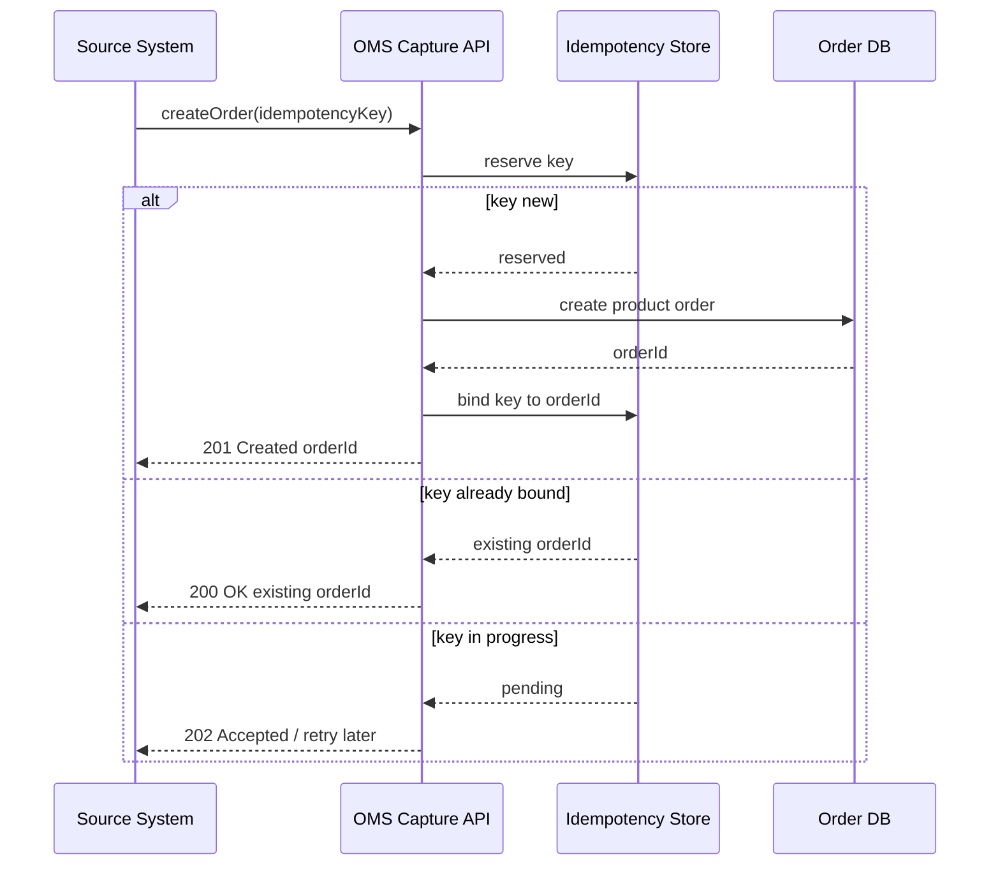
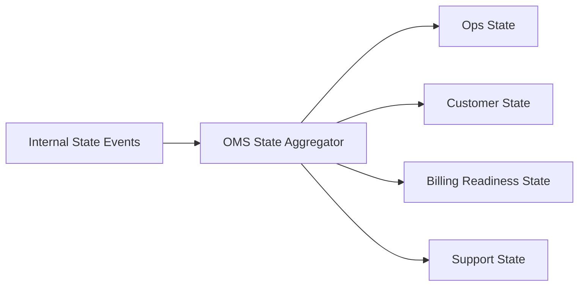
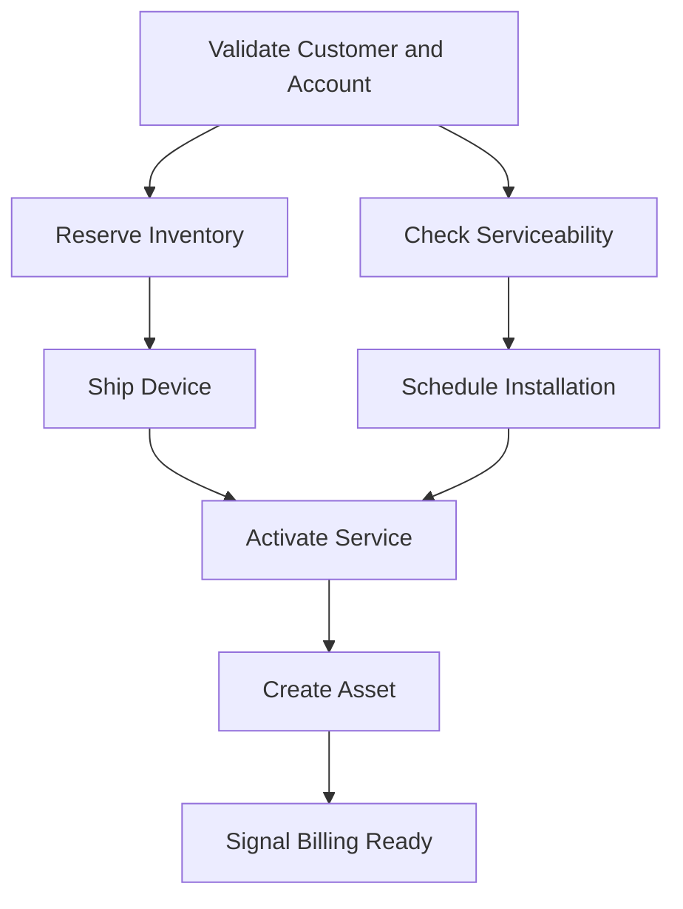
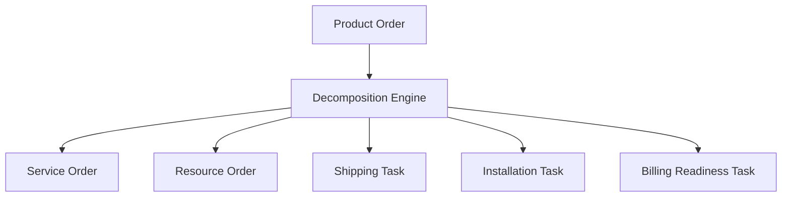

# Part 019 — Order Capture and Order Domain Model

Quote is commercial intent.

Order is execution intent.

That distinction sounds simple, but it is one of the most important boundaries in an enterprise CPQ/OMS platform.

A quote answers:

```text
What is the customer willing to buy, under what commercial terms?
```

An order answers:

```text
What must the enterprise now deliver, activate, change, bill, track, and prove?
```

The order is not just a copy of the quote. It is the durable operational instruction that connects sales commitment to fulfillment, provisioning, asset lifecycle, billing, support, revenue operations, audit, and customer communication.

In small systems, an order is often just a row named `orders` with child rows named `order_items`.

In enterprise CPQ/OMS, that is dangerously insufficient.

An enterprise order must preserve:

- customer intent,
- accepted commercial terms,
- product and configuration snapshot,
- price and discount evidence,
- fulfillment dependency,
- billing context,
- legal/accounting context,
- related parties,
- requested dates,
- source channel,
- external references,
- state transition history,
- retry and idempotency semantics,
- cancellation/change constraints,
- downstream correlation.

> Goal part ini: kamu mampu mendesain order capture and order domain model yang tidak sekadar menerima order, tetapi menjaga semantic continuity dari quote ke delivery, billing, support, and audit.

---

## 1. Kaufman Target Performance

Setelah bagian ini, kamu harus bisa:

1. Membedakan quote, cart, product order, service order, resource order, fulfillment task, and billing instruction.
2. Mendesain product order aggregate: header, order item, party, account, appointment, contact, address, payment, quote reference, and external reference.
3. Menentukan state machine untuk order dan order item.
4. Mendesain action semantics: add, modify, delete, suspend, resume, renew, no-change, replace.
5. Memodelkan parent-child line hierarchy and dependency graph.
6. Membedakan capture validation, submission validation, feasibility validation, decomposition validation, and fulfillment validation.
7. Mendesain idempotent order submission.
8. Menentukan data mana yang order capture boleh ubah dan mana yang harus immutable.
9. Menghindari duplicate order, stale quote conversion, wrong account mapping, and broken fulfillment dependency.
10. Membuat design review checklist untuk order intake layer.

Kaufman framing: ini adalah sub-skill inti untuk OMS. Kamu tidak sedang belajar “membuat endpoint create order”. Kamu sedang belajar membangun mental model agar order dapat menjadi durable, auditable, and executable business instruction.

---

## 2. Mental Model: Order as an Execution Contract

Order bukan kontrak legal penuh, tetapi ia adalah kontrak eksekusi internal.



A good order model answers five questions:

| Question | Example |
|---|---|
| Who is buying? | customer, account, related party, legal entity |
| What is being requested? | product offering, product configuration, quantity, action |
| Under what commercial terms? | quote reference, price snapshot, discount, promotion, contract term |
| How should it be executed? | requested dates, addresses, appointments, dependencies, fulfillment constraints |
| How will we prove correctness later? | version, snapshot, state history, event history, correlation, evidence hash |

Bad order model:

```text
order = customerId + list of SKUs + status
```

Better order model:

```text
order = accepted commercial execution package + operational context + immutable evidence + lifecycle state
```

---

## 3. Boundary: Cart, Quote, Product Order, Service Order, Fulfillment Task

Before modeling an order, lock the vocabulary.

| Concept | Meaning | Volatility | Owner |
|---|---|---:|---|
| Cart | Prospective selection before commercial commitment | High | Commerce / Sales UX |
| Quote | Commercial proposal with price, terms, validity, approval state | Medium | CPQ |
| Product Order | Customer-facing order for product offering/actions | Low after submit | OMS |
| Service Order | Technical/service-level instruction derived from product order | System-controlled | Fulfillment / OSS |
| Resource Order | Resource-level instruction: device, SIM, port, license, inventory | System-controlled | Inventory / Provisioning |
| Fulfillment Task | Concrete operational work item | Operational | Fulfillment engine / workforce |

Core distinction:

```text
Product order is what the customer purchased or requested.
Service/resource/fulfillment orders are how the enterprise delivers it.
```

Do not expose service decomposition as the customer-facing order model unless the business truly sells technical services directly.

Enterprise anti-pattern:

```text
The sales order line is directly mapped to 17 provisioning tasks and those task IDs become the customer order model.
```

Why this fails:

- customer support cannot explain technical task fragmentation,
- cancellation becomes impossible to reason about,
- billing cannot map fulfillment status to commercial charges,
- retries create duplicate technical tasks,
- business reports count tasks instead of orders,
- future product changes require changing the customer order schema.

Better:

```text
Customer-facing product order remains stable.
Internal decomposition is derived and versioned behind a boundary.
```

---

## 4. Product Order Aggregate

At the domain level, a product order is an aggregate.



Aggregate responsibility:

- preserve order identity,
- enforce lifecycle transitions,
- preserve item hierarchy,
- expose customer-facing order state,
- carry commercial and operational context,
- coordinate validation and submission,
- emit order events,
- protect immutable fields after submit.

It should not directly do:

- technical decomposition,
- inventory allocation,
- device shipment,
- billing invoice generation,
- provisioning command execution,
- tax remittance,
- contract authoring.

Those are downstream responsibilities triggered or coordinated from the order lifecycle.

---

## 5. Product Order Header

The order header contains context shared by all order items.

### 5.1 Identity Fields

| Field | Purpose |
|---|---|
| `orderId` | Internal immutable identifier |
| `orderNumber` | Human-facing order number |
| `version` | Optimistic concurrency/version tracking |
| `sourceSystem` | System that originated the order |
| `sourceChannel` | direct sales, partner, e-commerce, call center, API |
| `externalReferences` | CRM opportunity, quote, marketplace order, partner order |
| `correlationId` | End-to-end trace across systems |
| `idempotencyKey` | Prevent duplicate order creation |

Important invariant:

```text
The same accepted quote conversion request must not create two product orders.
```

Common idempotency key design:

```text
sourceSystem + sourceRequestId + quoteId + quoteVersion + conversionIntent
```

For API-sourced orders without quote:

```text
sourceSystem + externalOrderId + externalOrderVersion
```

### 5.2 Commercial Context

| Field | Purpose |
|---|---|
| `quoteRef` | Accepted quote reference |
| `quoteVersion` | Exact quote version converted |
| `proposalDocumentRef` | Accepted proposal/order form evidence |
| `contractRef` | Contract reference if already created |
| `priceListRef` | Price book/list used at quote time |
| `currency` | Transaction currency |
| `term` | Contract/order term context |
| `salesRepRef` | Sales owner |
| `dealDeskCaseRef` | Approval/deal governance trace |

Never rely only on current quote lookup for historical order interpretation.

The order must carry enough snapshot data to remain understandable after:

- quote is superseded,
- catalog changes,
- prices expire,
- discount policy changes,
- sales rep leaves,
- approval rules are modified,
- templates are retired.

### 5.3 Customer and Account Context

| Field | Purpose |
|---|---|
| `customerRef` | Buyer/customer party |
| `accountRef` | Commercial account |
| `billingAccountRef` | Billing account to invoice |
| `payerRef` | Party responsible for payment |
| `soldToRef` | Legal buyer |
| `billToRef` | Invoice recipient |
| `shipToRef` | Delivery recipient/location |
| `serviceAccountRef` | Account where service is installed/managed |

The same enterprise customer can have multiple accounts, billing accounts, legal entities, branches, sites, and service locations. The order model must not collapse these.

Bad design:

```text
customerId = accountId = billToId = shipToId
```

Better:

```text
Order carries role-specific party/account/location references.
```

### 5.4 Date Context

Order dates are not interchangeable.

| Date | Meaning |
|---|---|
| `createdAt` | Order record created |
| `submittedAt` | Customer/source submitted order |
| `acceptedAt` | OMS accepted order for processing |
| `requestedStartDate` | Customer desired start/effective date |
| `requestedCompletionDate` | Desired fulfillment completion |
| `committedCompletionDate` | Enterprise promised completion |
| `serviceActivationDate` | Service becomes active |
| `billingTriggerDate` | Billing should begin |
| `contractEffectiveDate` | Legal contract effective date |

Enterprise bug:

```text
Use submittedAt as billing start date.
```

This causes premature billing, delayed billing, revenue leakage, and customer disputes.

---

## 6. Product Order Item

The order item is the executable commercial line.

A quote line says:

```text
Customer intends to buy this line under this configuration and price.
```

An order item says:

```text
Enterprise must perform this action on this product offering/product instance under this configuration, price, and execution context.
```

### 6.1 Core Fields

| Field | Purpose |
|---|---|
| `orderItemId` | Internal line identity |
| `lineNumber` | Human-readable line number |
| `parentItemId` | Bundle/option hierarchy |
| `rootItemId` | Top-level commercial item |
| `action` | add, modify, delete, suspend, resume, renew |
| `state` | item lifecycle state |
| `quantity` | requested quantity |
| `productOfferingRef` | Commercial offering sold |
| `productSpecificationRef` | Product specification reference |
| `productInstanceRef` | Existing asset/product instance for change orders |
| `configurationSnapshot` | Chosen characteristic values/options |
| `priceSnapshot` | Price components from quote |
| `dependencyRefs` | Required sequencing/dependency |
| `fulfillmentPolicyRef` | How this line is fulfilled |

### 6.2 Action Semantics

Action is not optional.

| Action | Meaning | Requires Existing Asset? |
|---|---|---:|
| `ADD` | Create new product instance/service | No |
| `MODIFY` | Change existing product instance | Yes |
| `DELETE` / `TERMINATE` | End product instance | Yes |
| `SUSPEND` | Temporarily stop service/use | Yes |
| `RESUME` | Resume suspended service | Yes |
| `RENEW` | Extend term/contract | Usually yes |
| `REPLACE` | End old and create replacement | Usually yes |
| `NO_CHANGE` | Carry existing component inside a bundle context | Usually yes |

The action determines validation, decomposition, billing impact, asset impact, and cancellation semantics.

Example:

```text
A customer upgrades internet speed from 100 Mbps to 1 Gbps.
```

Bad model:

```text
Order item: SKU=1GB_INTERNET, quantity=1
```

Better model:

```text
Order item action=MODIFY
productInstanceRef=existing internet asset
configuration delta: bandwidth 100Mbps -> 1Gbps
commercial impact: price delta + new term
technical impact: service reconfiguration + possible router replacement
```

### 6.3 Item Hierarchy

Bundles require hierarchy.



Hierarchy matters because:

- parent price may include child components,
- child component may be non-billable,
- child fulfillment may depend on parent service,
- cancellation of parent may imply cancellation of child,
- asset lifecycle may track child separately,
- support entitlement may come from bundle membership.

Do not flatten bundle lines too early.

Flattening destroys:

- bundle discount evidence,
- dependency semantics,
- optional vs mandatory distinction,
- commercial grouping,
- cancellation rules,
- reporting accuracy.

---

## 7. Order Types and Order Intents

Enterprise systems usually need both `orderType` and `orderIntent`.

### 7.1 Order Type

Order type describes the lifecycle category.

| Order Type | Example |
|---|---|
| New Provide | New product/customer service |
| Change | Upgrade, downgrade, add-on, plan change |
| Disconnect | Termination/cancellation |
| Suspend/Resume | Temporarily stop/resume service |
| Move | Change service location |
| Renewal | Extend term/subscription |
| Migration | Move from legacy product/platform |
| Transfer | Change ownership/account |

### 7.2 Order Intent

Order intent describes business reason.

| Intent | Example |
|---|---|
| Customer Purchase | New sale |
| Amendment | Contract amendment |
| Retention Save | Special renewal/change to retain customer |
| Compliance Change | Required regulatory migration |
| Technical Remediation | Order created to repair asset mismatch |
| Internal Migration | Platform migration without new commercial sale |

Why separate type and intent?

Because the same type can have different governance.

Example:

```text
Change order caused by customer upgrade: billable, needs approval if discounted.
Change order caused by internal migration: non-billable, should not trigger sales commission.
```

---

## 8. State Machine: Product Order Lifecycle

A product order must have explicit lifecycle states.



### 8.1 Header vs Item State

Order header state summarizes the order.

Order item state tracks each line.

Header state should not be a naive copy of one item state.

Example:

| Item | State |
|---|---|
| Internet Access | Completed |
| Managed Router | In Progress |
| Static IP | Pending External |

Header state:

```text
In Progress
```

Not:

```text
Completed
```

A good OMS needs state aggregation rules.

Example aggregation:

```text
if all terminal success -> Completed
else if any fallout requiring human repair -> Fallout
else if any cancelling -> Cancelling
else if any in progress/pending -> InProgress
else if all cancelled -> Cancelled
else -> Accepted
```

### 8.2 Terminal States

Terminal states should be explicit.

| State | Meaning |
|---|---|
| `Completed` | All executable items reached success terminal state |
| `Cancelled` | Order was cancelled and no further fulfillment should occur |
| `Rejected` | Order was never accepted for execution |
| `FailedClosed` | Order failed and was closed by business decision |

Do not use one `FAILED` state for everything.

Distinguish:

- validation rejection,
- downstream failure still repairable,
- cancellation failure,
- business-abandoned order,
- terminal technical failure.

---

## 9. Order Capture Layer

Order capture is the boundary where external intent becomes internal order intent.

Sources:

- accepted quote conversion,
- e-commerce checkout,
- partner API,
- marketplace order,
- call center assisted order,
- bulk import,
- migration program,
- support-initiated change,
- internal remediation order.



Responsibilities:

1. authenticate and authorize source,
2. validate minimum intake shape,
3. normalize source-specific payload,
4. map external references,
5. resolve customer/account/billing context,
6. enforce idempotency,
7. create draft/submitted order,
8. persist immutable source payload if required,
9. emit order event,
10. return stable order reference.

Non-responsibilities:

- executing provisioning,
- generating invoice,
- allocating inventory,
- deciding all technical decomposition,
- silently changing accepted commercial terms.

---

## 10. Validation Boundaries

Order validation is layered.

| Layer | Question | Example Failure |
|---|---|---|
| Intake validation | Is the request structurally acceptable? | missing customer/account |
| Commercial validation | Does it match accepted commercial truth? | price snapshot mismatch |
| Eligibility validation | Is customer/location/channel allowed? | unavailable product at location |
| Account validation | Are parties/accounts/billing roles valid? | inactive billing account |
| Feasibility validation | Can enterprise deliver it? | no network coverage/inventory |
| Decomposition validation | Can order be decomposed? | missing product-to-service mapping |
| Fulfillment validation | Can a specific downstream execute task? | provisioning system rejects parameter |

Do not do all validation in a single function named `validateOrder()`.

Better:

```text
Validation should be staged, reason-coded, explainable, and tied to lifecycle transitions.
```

### 10.1 Intake Validation

Checks minimum shape:

- source identity,
- customer/account,
- at least one item,
- action present,
- item references valid shape,
- requested date format,
- required related parties,
- idempotency key.

### 10.2 Commercial Validation

Checks quote/order continuity:

- quote is accepted,
- quote version matches,
- quote not expired,
- quote approval not stale,
- accepted document hash matches,
- order line total equals accepted quote line total,
- promotion/discount evidence is present,
- currency matches,
- order item hierarchy matches quote hierarchy unless approved transformation exists.

### 10.3 Feasibility Validation

Checks deliverability:

- service address is serviceable,
- inventory/resource available or reservable,
- installation appointment available,
- customer credit condition satisfied,
- technical constraints satisfied,
- partner/downstream system accepts order.

Important: feasibility may be asynchronous. Do not pretend all feasibility checks are synchronous.

---

## 11. Idempotency and Duplicate Order Prevention

Duplicate order is a high-severity OMS failure.

It can cause:

- double shipment,
- duplicate provisioning,
- double billing,
- duplicate contract/subscription,
- wrong commission,
- customer dispute,
- manual cleanup.

### 11.1 Idempotency Model



### 11.2 Idempotency Invariants

```text
Same idempotency key + same semantic payload => same order result.
Same idempotency key + different semantic payload => reject as conflict.
No idempotency key for external create request => reject or generate source-scoped safe key.
```

Payload fingerprint should include:

- source system,
- external request ID,
- quote ID/version if applicable,
- line identifiers,
- action types,
- customer/account,
- accepted quote/document fingerprint,
- requested intent.

Do not include noisy fields such as request timestamp unless timestamp changes order meaning.

---

## 12. Snapshot vs Reference in Order Capture

The order must mix references and snapshots.

| Data | Reference? | Snapshot? | Why |
|---|---:|---:|---|
| Customer ID | Yes | Sometimes | identity reference, optional name snapshot |
| Billing account ID | Yes | Sometimes | downstream lookup + audit display |
| Product offering ID | Yes | Yes | need historical interpretation |
| Catalog version | Yes | Yes | prevent drift |
| Configuration values | No | Yes | exact selected configuration |
| Price components | No | Yes | accepted commercial terms |
| Approval evidence | Ref | Yes | audit/defensibility |
| Address | Ref | Yes | address may change later |
| Contact | Ref | Yes | contact may change later |
| Source payload | No | Yes | forensic/replay |

Rule of thumb:

```text
If a later change could alter interpretation of what was ordered, snapshot it.
If lifecycle ownership belongs to another system, reference it.
If audit needs both, store both reference and snapshot.
```

---

## 13. API Design for Order Capture

### 13.1 Commands

Typical commands:

```text
CreateProductOrder
SubmitProductOrder
CancelProductOrder
AmendProductOrder
AddOrderNote
AttachOrderDocument
UpdateRequestedDate
UpdateContactDetails
```

Be strict about which commands are allowed in each state.

Example:

| Command | Draft | Submitted | Accepted | In Progress | Completed |
|---|---:|---:|---:|---:|---:|
| Update item | Yes | Limited | No | No | No |
| Submit | Yes | No | No | No | No |
| Cancel | Yes | Yes | Conditional | Conditional | No |
| Update contact | Yes | Yes | Conditional | Conditional | No |
| Attach document | Yes | Yes | Yes | Yes | Yes |
| Amend commercial line | Yes | No | No | No | No |

### 13.2 Query APIs

Query APIs should support:

- order by number,
- order by quote reference,
- order by customer/account,
- order by external reference,
- order by state,
- order by item state,
- order by stuck/fallout condition,
- order timeline,
- order event history,
- order downstream correlation.

Do not force support users to search across downstream systems manually.

### 13.3 Event API

Important events:

```text
ProductOrderCreated
ProductOrderSubmitted
ProductOrderAccepted
ProductOrderRejected
ProductOrderDecompositionStarted
ProductOrderItemStarted
ProductOrderItemCompleted
ProductOrderItemFailed
ProductOrderFalloutRaised
ProductOrderFalloutResolved
ProductOrderCancellationRequested
ProductOrderCancelled
ProductOrderCompleted
```

Event payload should include:

- order ID,
- order number,
- state,
- version,
- changed item IDs,
- reason code,
- correlation ID,
- source command ID,
- timestamp,
- actor/system.

---

## 14. Customer-Facing vs Internal Order State

Do not leak internal complexity to the customer.

Internal state:

```text
DecompositionStarted -> ServiceOrderCreated -> ResourceReservationPending -> ProvisioningRetrying
```

Customer-facing state:

```text
Processing
```

Design state projection.



Different consumers need different projections.

| Consumer | Wants |
|---|---|
| Customer | clear simple progress |
| Sales | whether deal/order is moving |
| Support | current blocker and next action |
| Fulfillment Ops | exact task/fallout state |
| Finance | billable activation/readiness |
| Compliance | evidence and audit trail |

---

## 15. Order Line Dependency Graph

Order items often have dependencies.

Examples:

- cannot activate static IP before internet access,
- cannot ship device before payment authorization,
- cannot schedule installation before serviceability check,
- cannot activate add-on before parent subscription exists,
- cannot terminate old product before replacement is live,
- cannot bill recurring charge before activation event.



Do not store only parent-child hierarchy. Store dependencies separately.

Hierarchy answers:

```text
What belongs to what commercially?
```

Dependency answers:

```text
What must happen before what operationally?
```

They are related but not identical.

---

## 16. Order Capture and Decomposition Boundary

Order capture should preserve customer-facing product order.

Decomposition converts it into executable work.



Boundary rules:

1. Capture owns customer-facing order structure.
2. Decomposition owns technical execution plan.
3. Fulfillment owns task execution.
4. Billing owns invoice generation.
5. Asset inventory owns product instance state.
6. OMS coordinates but does not become all systems.

Good decomposition is deterministic for the same:

```text
order snapshot + decomposition rules version + inventory/context snapshot
```

If decomposition rules change, existing orders should not silently change execution plan unless explicitly re-planned.

---

## 17. Order Modification After Submission

After submit, modifications must be controlled.

Allowed low-risk changes may include:

- contact phone number,
- installation appointment preference,
- delivery note,
- support note,
- shipping contact,
- non-commercial metadata.

High-risk changes require new order/amendment:

- product offering,
- configuration value affecting price/fulfillment,
- quantity,
- discount,
- term,
- billing account,
- legal entity,
- ship-to location if it affects tax/serviceability,
- action type.

Invariant:

```text
A submitted order must not be materially changed in a way that breaks accepted quote evidence or downstream execution trace.
```

If business requires change, create:

- order revision,
- supplement order,
- change order,
- cancellation + replacement,
- amendment flow.

Do not mutate silently.

---

## 18. Error Model

Order capture errors should be structured.

| Error Category | Example | Retry? |
|---|---|---:|
| Structural | missing required field | No until fixed |
| Reference | unknown customer/account | Maybe after sync |
| State | quote not accepted | No until state changes |
| Staleness | quote expired | No; re-quote |
| Conflict | idempotency payload mismatch | No |
| Authorization | channel not allowed | No |
| Policy | product not orderable | No unless policy changes |
| Feasibility | no inventory | Maybe |
| Downstream Timeout | CRM/account lookup timeout | Yes |

Avoid generic error:

```json
{"error":"Bad request"}
```

Better:

```json
{
  "code": "QUOTE_VERSION_MISMATCH",
  "severity": "BLOCKING",
  "message": "Order request references quote Q-100 version 4, but the accepted version is 5.",
  "remediation": "Reload the accepted quote and retry conversion using version 5.",
  "correlationId": "..."
}
```

---

## 19. Security and Access Control

Order capture is high-risk.

Controls:

- source-system authentication,
- channel-level authorization,
- account visibility checks,
- quote ownership checks,
- permission to submit on behalf of customer,
- partner scope validation,
- field-level restrictions,
- PII minimization,
- audit of actor/system,
- tamper-evident event history.

Important access questions:

1. Can this actor see the quote?
2. Can this actor convert the quote?
3. Can this actor submit for this account?
4. Can this channel order this offering?
5. Can this source set billing account or legal entity?
6. Can this source override requested dates?
7. Can this source perform change/termination on existing asset?

Do not trust internal systems blindly. Internal source systems can still send invalid or unauthorized requests.

---

## 20. Observability

Order capture needs operational visibility from day one.

### 20.1 Metrics

Track:

- create order request rate,
- submit order rate,
- validation rejection rate,
- idempotency replay rate,
- duplicate conflict rate,
- quote-to-order conversion latency,
- order acceptance latency,
- percentage of orders entering fallout within N minutes,
- orders stuck in submitted/validating/accepted,
- order creation by source channel,
- validation error distribution.

### 20.2 Logs

Structured logs should include:

- order ID,
- order number,
- quote ID/version,
- source system,
- source request ID,
- idempotency key hash,
- correlation ID,
- validation codes,
- state transition,
- actor/system.

### 20.3 Tracing

Trace across:

```text
quote conversion -> order capture -> validation -> decomposition -> fulfillment -> asset -> billing readiness
```

If support cannot trace a customer order from quote to provisioning event, the platform is not operationally mature.

---

## 21. Common Failure Modes

| Failure | Cause | Prevention |
|---|---|---|
| Duplicate order | retry without idempotency | idempotency key + payload fingerprint |
| Wrong billing account | customer/account collapsed | role-specific party/account model |
| Price drift | order references current price only | price snapshot |
| Stale quote conversion | quote expired or superseded | quote state/version guard |
| Broken bundle | flattened hierarchy | preserve item hierarchy |
| Uncancellable order | no dependency/cancellation model | cancellation capability by state/item |
| Support blind spot | no event timeline | order timeline/read model |
| Fulfillment mismatch | product order directly used as task | decomposition boundary |
| Wrong customer status | internal task state exposed | state projection |
| Audit gap | source payload discarded | source payload/evidence snapshot |

---

## 22. Design Invariants

Use these invariants in design review.

```text
Invariant 1: A product order has durable identity independent of quote, cart, and downstream task IDs.
```

```text
Invariant 2: Order item action is explicit and determines validation, fulfillment, asset, and billing behavior.
```

```text
Invariant 3: A submitted order cannot be materially changed without controlled revision/change-order semantics.
```

```text
Invariant 4: Same idempotent create request cannot create duplicate orders.
```

```text
Invariant 5: Order header state is derived from valid aggregation rules, not arbitrary downstream status.
```

```text
Invariant 6: Product order hierarchy and fulfillment dependency are related but separate models.
```

```text
Invariant 7: Customer-facing order state is a projection, not a leak of internal task states.
```

```text
Invariant 8: Order capture preserves enough snapshot evidence to explain what was ordered even after catalog, price, quote, or account data changes.
```

---

## 23. Baeldung-Style Implementation Sketch

This is not a full implementation, but a design sketch.

```java
public final class ProductOrder {
    private ProductOrderId id;
    private OrderNumber orderNumber;
    private OrderVersion version;
    private OrderState state;
    private SourceContext sourceContext;
    private CommercialContext commercialContext;
    private CustomerContext customerContext;
    private List<ProductOrderItem> items;
    private List<OrderEvent> history;

    public void submit(Actor actor, Clock clock) {
        ensureState(OrderState.DRAFT);
        ensureHasAtLeastOneItem();
        ensureEveryItemHasAction();
        transitionTo(OrderState.SUBMITTED, actor, clock);
    }

    public void accept(ValidationResult result, Actor actor, Clock clock) {
        ensureState(OrderState.SUBMITTED);
        if (result.hasBlockingErrors()) {
            transitionTo(OrderState.REJECTED, actor, clock);
            return;
        }
        transitionTo(OrderState.ACCEPTED, actor, clock);
    }

    public void cancel(CancellationRequest request, Actor actor, Clock clock) {
        if (!state.isCancellable()) {
            throw new InvalidOrderTransitionException(state, "cancel");
        }
        transitionTo(OrderState.CANCELLING, actor, clock);
    }
}
```

Key idea:

```text
Lifecycle rules belong near the aggregate, not scattered across controllers, scripts, and downstream adapters.
```

---

## 24. Practice: Design an Order Capture Model

Scenario:

```text
A B2B customer accepts a quote for an enterprise connectivity bundle:
- primary internet access,
- managed router,
- static IP add-on,
- premium support,
- onsite installation,
- 36-month term,
- discounted year-one recurring charge,
- billing to regional legal entity,
- service installed at branch location,
- signed proposal document.
```

Design:

1. Product order header fields.
2. Product order item hierarchy.
3. Action type for each item.
4. Party/account/location roles.
5. Snapshot vs reference data.
6. Initial state machine.
7. Idempotency key.
8. Validation stages.
9. Events emitted after creation and submission.
10. Customer-facing status projection.

Expected thinking:

- quote evidence is not enough by itself,
- billing account is not necessarily customer account,
- installation is operational but may be represented as order item or fulfillment task depending commercial visibility,
- managed router may create device shipment/resource order,
- static IP depends on internet access,
- premium support depends on active subscription/asset,
- discount duration must survive into billing/subscription handoff,
- service address should be snapshotted.

---

## 25. Part 019 Review Checklist

Before approving an order capture design, ask:

- Does the order aggregate have durable identity?
- Are quote/cart/order/decomposition boundaries explicit?
- Are customer/account/billing/ship-to/service-location roles separated?
- Are order item actions explicit?
- Is product hierarchy preserved?
- Are operational dependencies modeled separately from hierarchy?
- Is idempotency enforced at create/submit boundaries?
- Are validation stages separated?
- Is quote/order continuity protected?
- Are accepted prices and configurations snapshotted?
- Are state transitions explicit and audited?
- Can order state be projected differently for customer, support, operations, and finance?
- Can the system explain why an order was rejected?
- Can the system prevent duplicate fulfillment from retry?
- Can the order be traced from quote to billing readiness?

---

## 26. Key Takeaways

1. Order is execution intent, not just quote copy.
2. Product order is customer-facing; service/resource/fulfillment orders are internal execution artifacts.
3. Order capture must preserve semantic continuity from commercial commitment to operational execution.
4. Header, item, party, account, date, action, hierarchy, dependency, and snapshot models are all critical.
5. Idempotency is a first-class domain requirement, not middleware decoration.
6. Validation should be staged and explainable.
7. Header and item state machines must be explicit.
8. Customer-facing status is a projection of internal state, not a raw downstream status leak.
9. A strong order model prevents duplicate fulfillment, price drift, billing errors, support blind spots, and audit gaps.

---

## 27. References

- TM Forum — TMF622 Product Ordering Management API User Guide v5.0.0: https://www.tmforum.org/resources/specifications/tmf622-product-ordering-management-api-user-guide-v5-0-0/
- TM Forum — TMF622 Product Ordering Management API v5.0: https://www.tmforum.org/open-digital-architecture/open-apis/product-ordering-management-api-TMF622/v5.0
- TM Forum — TMF620 Product Catalog Management API User Guide v5.0.0: https://www.tmforum.org/resources/specifications/tmf620-product-catalog-management-api-user-guide-v5-0-0/
- TM Forum — TMF620 Product Catalog Management API REST Specification: https://www.tmforum.org/resources/specification/tmf620-product-catalog-management-api-rest-specification-r17-5-0/

---

Next: **Part 020 — Quote-to-Order Conversion and Snapshot Strategy**.
