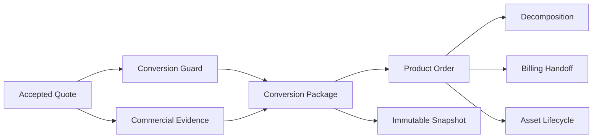
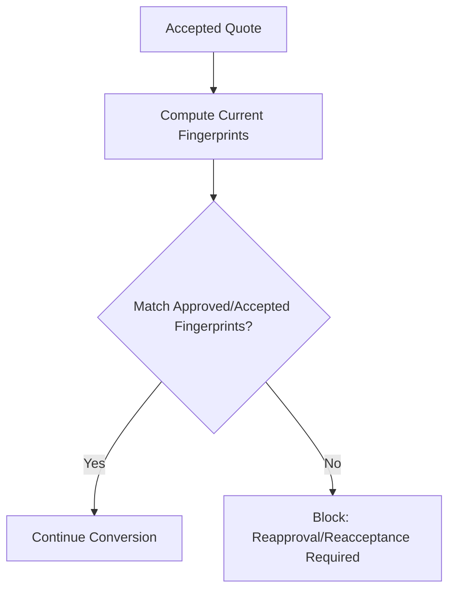
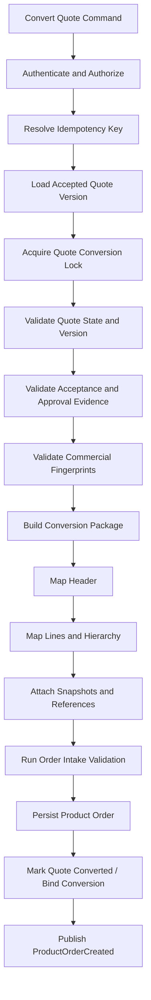
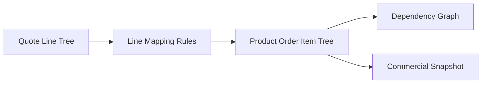
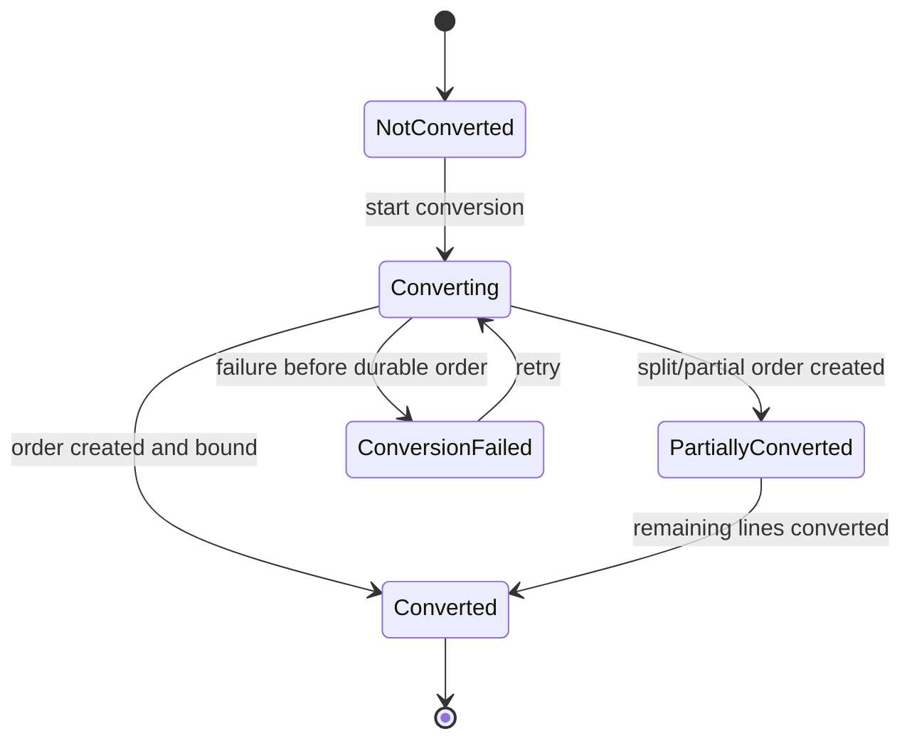
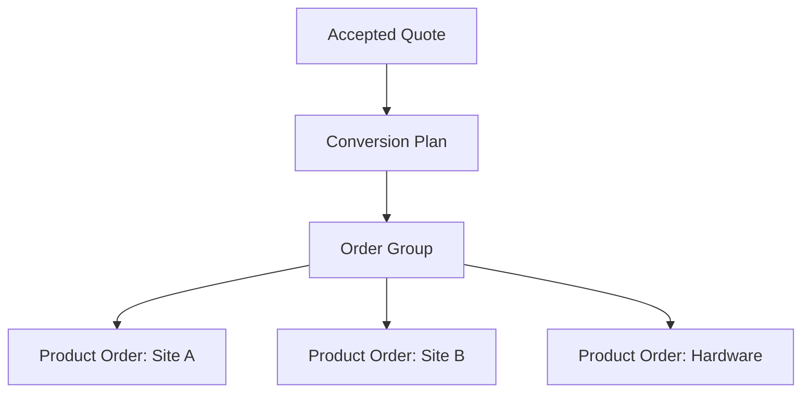
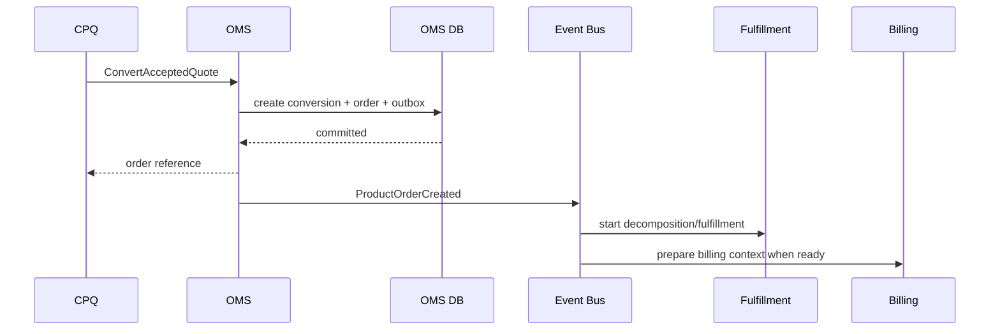

# Part 020 — Quote-to-Order Conversion and Snapshot Strategy

Quote-to-order conversion is the handoff where enterprise systems often lose truth.

Sales sees it as:

```text
Convert quote to order.
```

Engineering should see it as:

```text
Transform an accepted commercial commitment into a durable execution instruction without changing meaning, losing evidence, duplicating intent, or letting downstream systems reinterpret the deal.
```

This is not a CRUD copy operation.

It is a controlled semantic transformation.

A quote contains commercial proposal state:

- product selection,
- configuration,
- eligibility decision,
- price waterfall,
- discount and promotion evidence,
- approval result,
- proposal document,
- validity period,
- legal/commercial terms,
- customer acceptance evidence.

An order contains execution state:

- product order identity,
- customer/account/billing roles,
- order item actions,
- delivery/service context,
- fulfillment dependency,
- quote evidence snapshot,
- downstream correlation,
- lifecycle state,
- cancellation/change constraints.

The conversion must preserve what matters and intentionally transform what must change.

> Goal part ini: kamu mampu mendesain quote-to-order conversion yang deterministic, idempotent, auditable, and resistant to commercial drift.

---

## 1. Kaufman Target Performance

Setelah bagian ini, kamu harus bisa:

1. Menjelaskan mengapa quote-to-order conversion bukan copy-paste entity.
2. Membedakan data yang harus disnapshot, direferensikan, dihitung ulang, divalidasi ulang, atau dilarang berubah.
3. Mendesain conversion pipeline dari accepted quote ke product order.
4. Membuat quote/order mapping rule untuk header, line, price, configuration, party, account, address, and documents.
5. Mendesain approval fingerprint and price/configuration hash.
6. Menentukan idempotency key untuk conversion.
7. Mencegah stale quote, stale approval, stale price, and stale eligibility.
8. Menangani partial conversion, split order, bundle hierarchy, and change order conversion.
9. Mendesain conversion error model and remediation.
10. Membuat golden test strategy untuk quote-to-order conversion.

Kaufman framing: quote-to-order conversion adalah salah satu sub-skill dengan leverage tinggi. Jika kamu menguasainya, kamu akan melihat banyak bug enterprise sebelum terjadi: double order, wrong bill-to, lost discount duration, stale catalog, missing approval evidence, and broken fulfillment.

---

## 2. Mental Model: Semantic Continuity

The most important design principle:

```text
Quote-to-order conversion must preserve semantic continuity.
```

Meaning:

```text
The order must mean the same commercial commitment that the customer accepted, even though it is represented in an execution-oriented model.
```



Bad conversion:

```text
Read current quote lines and create order lines from current catalog/prices.
```

Better conversion:

```text
Read accepted quote version, validate its evidence, construct immutable conversion package, map to product order under versioned mapping rules, and persist snapshot + references + audit trail in one idempotent transaction.
```

---

## 3. Conversion Is a Domain Process

Do not hide quote-to-order logic inside:

- UI button handler,
- CRM integration script,
- database trigger,
- workflow expression,
- pricing callback,
- order controller,
- ETL job.

Create an explicit domain process:

```text
QuoteToOrderConversion
```

Responsibilities:

1. validate quote state,
2. validate quote version,
3. validate acceptance evidence,
4. validate approval and policy freshness,
5. resolve conversion intent,
6. build conversion package,
7. map quote header to order header,
8. map quote line hierarchy to order item hierarchy,
9. copy/freeze commercial snapshots,
10. create product order idempotently,
11. attach evidence and external references,
12. emit events.

Non-responsibilities:

- executing fulfillment,
- recalculating commercial terms without policy,
- silently changing quote line structure,
- inventing billing terms,
- creating technical tasks directly,
- mutating accepted quote after conversion.

---

## 4. Quote State Preconditions

A quote can be converted only if it satisfies strict preconditions.

| Guard | Reason |
|---|---|
| Quote is `Accepted` or equivalent final accepted state | customer/source committed |
| Quote version matches accepted version | avoid superseded quote conversion |
| Quote not expired at acceptance/conversion according to policy | avoid stale commercial commitment |
| Approval state is valid | avoid unauthorized discount/deal |
| Approval fingerprint still matches quote commercial data | avoid post-approval mutation |
| Price snapshot exists | order needs accepted price evidence |
| Configuration snapshot exists | order needs exact product choices |
| Required customer/account/billing context exists | order must be executable |
| Proposal/order form evidence exists if required | legal traceability |
| Quote not already converted unless idempotent replay | avoid duplicate order |

A common enterprise bug:

```text
Quote was approved, then sales changed quantity or discount, then converted without reapproval.
```

Prevent with approval fingerprint.

---

## 5. Approval, Price, and Configuration Fingerprints

A fingerprint is a stable hash of meaningful data.

It helps answer:

```text
Is the object being converted the same object that was approved, priced, and accepted?
```

### 5.1 Price Fingerprint

Include:

- quote ID,
- quote version,
- line IDs,
- product offering IDs,
- quantities,
- charge types,
- list prices,
- discounts,
- promotions,
- net prices,
- currency,
- tax boundary indicator if applicable,
- price book/version,
- rounding mode,
- effective dates.

Exclude:

- UI label ordering,
- temporary display fields,
- request timestamp,
- localized formatting.

### 5.2 Configuration Fingerprint

Include:

- product offering ID/version,
- selected options,
- characteristic names/IDs and values,
- cardinality decisions,
- bundle hierarchy,
- included/excluded components,
- dependent option choices.

### 5.3 Approval Fingerprint

Include:

- approved quote version,
- approval policy version,
- threshold calculations,
- approver identity/role,
- approved exception set,
- margin/discount metrics,
- final price fingerprint.

If fingerprint changes after approval, require reapproval or block conversion.



---

## 6. Snapshot Strategy

Quote-to-order conversion must classify data.

| Category | Meaning | Example |
|---|---|---|
| Reference | Store pointer to source of truth | customer ID, account ID, quote ID |
| Snapshot | Copy historical value into order | price components, config values |
| Derived | Compute from quote data under mapping rules | order type, order item action |
| Revalidated | Check again without changing accepted commercial meaning | account active, entitlement still exists |
| Recalculated | Recompute because business policy requires current value | tax estimate, delivery window |
| Excluded | Do not transfer | UI-only fields, draft notes |

Rule:

```text
Commercial commitment data is usually snapshotted.
Operational availability data is often revalidated.
Technical execution data is often derived later.
```

---

## 7. Freeze vs Recalculate Decision Matrix

| Data | Freeze? | Recalculate? | Revalidate? | Rationale |
|---|---:|---:|---:|---|
| Product offering identity | Yes | No | Yes | preserve what was sold; verify still orderable if required |
| Catalog version | Yes | No | No/Maybe | historical interpretation |
| Configuration values | Yes | No | Maybe | exact customer selection |
| List price | Yes | No | No | accepted commercial evidence |
| Discount | Yes | No | No | approved terms |
| Promotion | Yes | No | Maybe | approved applied promo; check fraud/expiry policy if required |
| Net price | Yes | No | No | order must match accepted quote |
| Currency | Yes | No | No | commercial commitment |
| Tax estimate | Sometimes | Sometimes | Yes | depends whether tax was final or estimate |
| Billing account | Ref + snapshot | No | Yes | must still be valid |
| Ship-to address | Snapshot | No | Yes | address affects serviceability/tax |
| Serviceability result | Snapshot | Maybe | Yes | stale feasibility may need refresh |
| Inventory reservation | No | Yes | Yes | operational state changes |
| Installation appointment | Ref + snapshot | Maybe | Yes | availability changes |
| Contract terms | Yes | No | Yes | legal/commercial continuity |
| Approval result | Yes | No | Yes via fingerprint | audit evidence |

Important:

```text
Do not reprice accepted quote during conversion unless the business has an explicit, customer-visible policy for repricing.
```

Silent repricing is a trust, legal, and revenue operations risk.

---

## 8. Conversion Pipeline

A robust pipeline looks like this.



### 8.1 Conversion Lock

The lock prevents two actors/processes from converting the same quote simultaneously.

Options:

- pessimistic DB row lock,
- compare-and-swap conversion status,
- distributed lock with durable idempotency record,
- unique constraint on accepted quote version conversion.

The safest simple invariant:

```text
There can be at most one active product order for quoteId + acceptedQuoteVersion + conversionIntent unless split conversion is explicitly modeled.
```

### 8.2 Conversion Package

Before creating an order, build an immutable conversion package.

It contains:

- quote header snapshot,
- accepted quote version,
- quote line tree,
- price snapshot,
- configuration snapshot,
- approval snapshot,
- proposal/document snapshot,
- customer/account/party context,
- conversion mapping rule version,
- conversion actor/system,
- conversion timestamp,
- validation result,
- payload fingerprint.

Why package first?

Because it gives you a replayable artifact.

```text
If order creation fails midway, you can inspect what conversion intended to create.
```

---

## 9. Header Mapping

Quote header to order header is not one-to-one.

| Quote Field | Product Order Field | Strategy |
|---|---|---|
| `quoteId` | `quoteRef` | reference |
| `quoteVersion` | `quoteVersion` | snapshot/reference |
| `quoteNumber` | external reference | snapshot |
| `opportunityRef` | external reference | reference |
| `customerRef` | `customerRef` | reference + optional snapshot |
| `accountRef` | `accountRef` | reference + revalidate |
| `billingAccountRef` | `billingAccountRef` | reference + revalidate |
| `currency` | `currency` | snapshot |
| `validUntil` | quote evidence | snapshot |
| `acceptedAt` | commercial context | snapshot |
| `acceptedBy` | acceptance evidence | snapshot |
| `proposalDocumentRef` | order evidence/document | reference + hash snapshot |
| `salesRepRef` | commercial context | reference/snapshot |
| `channel` | source channel | snapshot |
| `priceBookVersion` | commercial context | snapshot |
| `approvalCaseRef` | approval evidence | reference + snapshot |

Do not map quote status directly to order status.

Quote status:

```text
Accepted
```

Initial order status:

```text
Draft/Submitted/Accepted depending conversion policy
```

Recommended for accepted quote conversion:

```text
Create order in Submitted or Accepted only after intake validation passes.
```

---

## 10. Line Mapping

Quote lines become order items.

But mapping must preserve hierarchy and semantics.



### 10.1 Mapping Fields

| Quote Line | Order Item | Strategy |
|---|---|---|
| `quoteLineId` | external reference | snapshot/reference |
| `parentQuoteLineId` | parent order item | preserve hierarchy |
| `productOfferingRef` | product offering ref | reference + snapshot version |
| `productSpecRef` | product spec ref | reference + snapshot version |
| `quantity` | quantity | snapshot |
| `configuration` | configuration snapshot | snapshot |
| `priceComponents` | price snapshot | snapshot |
| `discounts` | price snapshot/approval evidence | snapshot |
| `promotionRefs` | promotion evidence | snapshot/reference |
| `term` | order item term | snapshot |
| `existingAssetRef` | productInstanceRef | reference + revalidate |
| `lineAction` | action | derived or direct |
| `requestedStartDate` | requestedStartDate | snapshot/revalidate |

### 10.2 Preserve Line Identity

Each order item should know its source quote line.

```text
orderItem.source.quoteLineId = QL-123
```

Why:

- audit,
- support traceability,
- revenue reconciliation,
- change order mapping,
- data correction,
- analytics,
- dispute resolution.

### 10.3 Preserve Hierarchy

If quote has hierarchy:

```text
Bundle
  - Base product
  - Option A
  - Option B
```

Order should preserve commercial hierarchy even if fulfillment later decomposes differently.

---

## 11. Action Derivation

Quote lines do not always explicitly contain order actions.

The conversion may derive action from quote intent, asset reference, amendment type, and line delta.

| Quote Scenario | Order Item Action |
|---|---|
| New product line | `ADD` |
| Add-on to existing subscription | `ADD` with parent asset reference |
| Upgrade existing product | `MODIFY` |
| Downgrade existing product | `MODIFY` |
| Remove add-on | `DELETE` / `TERMINATE` |
| Renew same product | `RENEW` or `MODIFY_TERM` depending model |
| Suspend service | `SUSPEND` |
| Resume service | `RESUME` |
| Replacement | `REPLACE` or pair of `DELETE` + `ADD` |
| Existing bundle child carried forward | `NO_CHANGE` |

Do not infer action only from SKU presence.

Example problem:

```text
Quote contains SKU "Premium Support".
```

Could mean:

- new premium support,
- renewal of premium support,
- upgrade from standard support,
- no-change carry-forward,
- add-on to existing asset.

The order action must be explicit after conversion.

---

## 12. Price Snapshot in Order

The order should carry a price snapshot for commercial traceability.

Recommended structure:

```text
OrderItemPriceSnapshot
  - currency
  - priceBookRef/version
  - charge components
  - list price
  - contracted price
  - discount components
  - promotion components
  - net price
  - billing frequency
  - charge timing
  - term/duration
  - price waterfall trace ref
  - rounding mode
  - tax treatment indicator
```

Do not store only `totalPrice`.

A single total loses:

- recurring vs one-time distinction,
- discount duration,
- promotion attribution,
- billable vs non-billable components,
- allocation across bundle children,
- currency/rounding details,
- price waterfall trace,
- approval evidence.

---

## 13. Configuration Snapshot in Order

Order item must preserve configuration values.

Example:

```json
{
  "offeringId": "ENT-INTERNET",
  "catalogVersion": "2026.07",
  "characteristics": [
    {"code": "bandwidth", "value": "1Gbps"},
    {"code": "accessType", "value": "fiber"},
    {"code": "sla", "value": "99.95"},
    {"code": "ipBlock", "value": "/29"}
  ],
  "selectedOptions": [
    {"offeringId": "MANAGED_ROUTER", "quantity": 1},
    {"offeringId": "PREMIUM_SUPPORT", "quantity": 1}
  ]
}
```

Why snapshot?

Because catalog/configuration rules change.

A future catalog may no longer allow the same combination, but the order must still be interpretable as historical commitment.

---

## 14. Party, Account, and Address Mapping

Quote often captures customer context for sales.

Order needs operational role context.

| Role | Why It Matters |
|---|---|
| Buyer / Sold-to | legal/commercial ownership |
| Bill-to | invoice recipient |
| Payer | payment responsibility |
| Ship-to | delivery recipient/location |
| Service location | where service is installed/used |
| Technical contact | installation/provisioning coordination |
| Commercial contact | order/contract communication |
| Support contact | post-activation service |

Never assume:

```text
sold-to = bill-to = ship-to = service location = payer
```

Enterprise B2B orders frequently separate these roles.

### 14.1 Address Snapshot

Addresses should usually be both referenced and snapshotted.

```text
addressRef = ADDR-123
addressSnapshot = exact address at order submission
```

Why:

- address master may be corrected later,
- serviceability decisions depend on historical address,
- tax jurisdiction may depend on address,
- delivery dispute may require original address,
- installation appointment needs exact location.

---

## 15. Quote-to-Order Idempotency

Quote conversion must be idempotent.

Common idempotency key:

```text
QUOTE_TO_ORDER:{quoteId}:{acceptedQuoteVersion}:{conversionIntent}
```

If split conversion is supported:

```text
QUOTE_TO_ORDER:{quoteId}:{acceptedQuoteVersion}:{conversionIntent}:{splitGroupId}
```

Payload fingerprint should include:

- quote ID/version,
- conversion intent,
- selected quote line IDs if partial conversion,
- requested order type,
- source actor/system,
- mapping rule version,
- commercial fingerprints.

Semantics:

| Situation | Result |
|---|---|
| Same key, same fingerprint, existing order | return existing order |
| Same key, different fingerprint | reject conflict |
| New key, quote already fully converted | reject or return existing depending policy |
| Conversion started but not completed | return pending/retry-safe response |

---

## 16. Quote Conversion State

The quote should track conversion state.

Possible fields:

```text
conversionStatus: NOT_CONVERTED | CONVERTING | CONVERTED | PARTIALLY_CONVERTED | CONVERSION_FAILED
convertedOrderRefs: [...]
conversionAttemptId
conversionPackageHash
convertedAt
convertedBy
```

State machine:



Important:

```text
Do not mark quote as converted before product order is durably created and bound to conversion record.
```

Use transaction/outbox patterns where possible.

---

## 17. Partial Conversion and Split Orders

Some businesses allow one accepted quote to create multiple orders.

Examples:

- hardware and software delivered separately,
- multi-site quote split by service location,
- phased rollout,
- product families handled by different fulfillment organizations,
- regulatory/legal entity split,
- partner vs direct fulfillment split.

Do not support split conversion accidentally.

If supported, model it explicitly.



Need:

- order group ID,
- split criteria,
- line allocation,
- total reconciliation,
- duplicate prevention,
- partial conversion status,
- cancellation/change semantics,
- billing aggregation policy.

Invariant:

```text
Every quote line eligible for conversion is either converted once, intentionally excluded, or pending conversion. Never ambiguous.
```

---

## 18. Conversion for Asset-Based Orders

For amendment/change quotes, line mapping is more complex.

The quote references existing assets/product instances.

Conversion must preserve:

- asset ID,
- asset version/snapshot,
- current state,
- proposed change,
- before/after configuration,
- before/after price,
- effective date,
- cotermination logic,
- proration rules,
- cancellation/termination terms.

Example:

```text
Existing asset: Internet 100 Mbps, $500/month
Accepted quote: Upgrade to 1 Gbps, $900/month, effective next month
Order item:
  action = MODIFY
  productInstanceRef = existing asset
  beforeSnapshot = 100 Mbps / $500
  afterSnapshot = 1 Gbps / $900
  effectiveDate = accepted requested start
```

Without before/after snapshots, downstream billing and asset reconciliation become fragile.

---

## 19. Conversion Error Model

Use specific conversion errors.

| Error Code | Meaning | Remediation |
|---|---|---|
| `QUOTE_NOT_ACCEPTED` | Quote not in accepted state | accept quote first |
| `QUOTE_VERSION_MISMATCH` | Command references wrong version | reload accepted version |
| `QUOTE_EXPIRED` | Quote no longer valid | re-quote or override policy |
| `QUOTE_ALREADY_CONVERTED` | Existing order bound | return existing order or block |
| `APPROVAL_FINGERPRINT_MISMATCH` | Quote changed after approval | reapproval required |
| `PRICE_FINGERPRINT_MISMATCH` | Price changed after acceptance | reprice/reaccept required |
| `CONFIGURATION_FINGERPRINT_MISMATCH` | Configuration changed after acceptance | reconfigure/reaccept required |
| `MISSING_BILLING_ACCOUNT` | Order cannot be billed | fix account context |
| `INVALID_ASSET_REFERENCE` | Change order asset invalid | reconcile installed base |
| `LINE_MAPPING_FAILED` | No rule for quote line | fix catalog/mapping rule |
| `SPLIT_CONFLICT` | Partial/split conversion ambiguity | resolve conversion plan |

Avoid:

```text
Conversion failed.
```

Better:

```text
Conversion blocked because the approved discount fingerprint does not match the accepted quote version. Reapproval is required before order creation.
```

---

## 20. Transaction and Consistency Boundary

Quote-to-order conversion crosses bounded contexts.

Potential writes:

- conversion record,
- product order,
- order items,
- order evidence,
- quote conversion status,
- outbox events.

Recommended local transaction:

```text
create conversion attempt
create product order
create order items/snapshots
bind quote conversion record to order
write outbox event
commit
```

Avoid distributed transaction across:

- CRM,
- CLM,
- billing,
- fulfillment,
- catalog,
- pricing,
- asset inventory.

For downstream work, publish events and use sagas/orchestration after order creation.



---

## 21. Conversion Mapping Rule Versioning

Mapping rules change over time.

Examples:

- new product offering introduced,
- bundle structure changed,
- fulfillment mapping changed,
- quote line type added,
- billing treatment changed,
- asset model changed.

Every conversion should record:

```text
conversionRuleSetVersion
lineMappingRuleVersion
priceMappingRuleVersion
assetMappingRuleVersion
```

Why:

- replay,
- audit,
- incident investigation,
- deterministic testing,
- migration analysis,
- explaining why old orders look different from new orders.

---

## 22. Anti-Drift Controls

Drift happens when accepted quote meaning changes during or after conversion.

### 22.1 Commercial Drift

Symptoms:

- order price differs from accepted quote,
- discount duration lost,
- promotion applied differently,
- quote line quantity changed,
- bundle allocation changed.

Controls:

- price snapshot,
- price fingerprint,
- approval fingerprint,
- conversion golden tests,
- order/quote reconciliation report.

### 22.2 Catalog Drift

Symptoms:

- order references current catalog instead of accepted catalog,
- retired option disappears from order,
- new mandatory option added after acceptance,
- product spec mapping changes silently.

Controls:

- catalog version snapshot,
- configuration snapshot,
- conversion rule version,
- historical catalog lookup.

### 22.3 Account Drift

Symptoms:

- billing account changed after quote acceptance,
- ship-to address corrected and order loses original address,
- customer hierarchy changes.

Controls:

- role-specific references,
- address/contact snapshot,
- account revalidation with explicit result,
- audit of account resolution.

### 22.4 Fulfillment Drift

Symptoms:

- order decomposes using new rules without trace,
- fulfillment task no longer matches ordered product,
- dependency graph changed mid-flight.

Controls:

- decomposition rule version,
- order snapshot immutable after submit,
- replan event and audit,
- fulfillment plan snapshot.

---

## 23. Quote-to-Order Reconciliation

Build reconciliation from day one.

Checks:

| Check | Purpose |
|---|---|
| Quote total vs order total | commercial continuity |
| Quote line count vs order item count | mapping correctness |
| Quote line IDs all mapped | no lost line |
| Order item source quote line exists | traceability |
| Price component equality | no price drift |
| Configuration fingerprint equality | no configuration drift |
| Approval fingerprint equality | no unauthorized change |
| Proposal document hash present | evidence |
| Billing account present | downstream readiness |
| Conversion status bound to order | duplicate prevention |

Reconciliation query examples:

```text
find accepted quotes with no order after N minutes
find orders with missing quote line source references
find orders where order price hash != quote price hash
find quotes marked converted but no bound order exists
find duplicate orders for same quote version
```

---

## 24. Testing Strategy

### 24.1 Golden Conversion Tests

Create fixed accepted quote fixtures.

For each fixture, assert expected order output.

Scenarios:

- simple new order,
- bundle with included options,
- bundle with optional paid add-ons,
- tiered recurring price,
- year-one discount,
- ramp price,
- promotion with exclusivity,
- multi-site quote,
- asset upgrade,
- asset downgrade,
- termination,
- renewal,
- split order,
- expired quote,
- stale approval,
- idempotent retry.

### 24.2 Property-Based Tests

Useful properties:

```text
Every convertible quote line maps to exactly one order item unless explicit split rule exists.
```

```text
Order net total equals accepted quote net total for non-tax commercial charges.
```

```text
Every order item has action, source quote line, product offering reference, and configuration snapshot.
```

```text
Same conversion command produces same order reference under idempotent retry.
```

```text
Changing approved discount after approval invalidates conversion.
```

### 24.3 Replay Tests

Use production-like historical conversion packages.

Assert:

- old conversion packages can still be interpreted,
- mapping rule versions are available,
- order reconstruction is stable,
- reconciliation detects known drift.

---

## 25. Baeldung-Style Conversion Service Sketch

```java
public final class QuoteToOrderConversionService {

    public ConversionResult convert(ConvertQuoteCommand command) {
        Actor actor = authorization.authorize(command);

        IdempotencyRecord idem = idempotency.reserve(
            command.idempotencyKey(),
            command.semanticFingerprint()
        );

        if (idem.isBound()) {
            return ConversionResult.existing(idem.orderId());
        }

        AcceptedQuote quote = quoteRepository.loadAcceptedVersion(
            command.quoteId(),
            command.quoteVersion()
        );

        conversionGuards.assertConvertible(quote, command);
        fingerprintVerifier.verify(quote);

        ConversionPackage conversionPackage = packageBuilder.build(
            quote,
            command,
            actor
        );

        ProductOrder order = orderMapper.map(conversionPackage);
        OrderValidationResult validation = orderValidator.validateIntake(order);

        if (validation.hasBlockingErrors()) {
            throw new ConversionBlockedException(validation.errors());
        }

        transaction.execute(() -> {
            orderRepository.save(order);
            conversionRepository.bindQuoteToOrder(conversionPackage.id(), order.id());
            quoteRepository.markConverted(quote.id(), quote.version(), order.id());
            outbox.publish(ProductOrderCreated.from(order));
            idempotency.bind(idem.key(), order.id());
        });

        return ConversionResult.created(order.id(), order.orderNumber());
    }
}
```

Important design decisions:

- authorization happens before conversion,
- idempotency is reserved before expensive work,
- accepted quote version is explicit,
- guards and fingerprints run before mapping,
- conversion package is explicit,
- order validation runs before persistence,
- quote conversion status and order creation are bound in one durable boundary,
- events are published through outbox.

---

## 26. Practice: Convert a Complex Quote

Scenario:

```text
Accepted quote Q-900 version 7:
- Enterprise Connectivity Bundle
- Internet 1 Gbps
- Managed Router
- Static IP /29
- Premium Support
- 36-month term
- Year 1: 25% recurring discount
- Years 2-3: list recurring price
- One-time installation fee waived
- Service location: Jakarta branch
- Bill-to: Singapore regional billing account
- Sold-to: Indonesian legal entity
- Proposal document signed
- Deal desk approval for discount and waived install fee
```

Design the conversion.

Answer:

1. Order header mapping.
2. Order item hierarchy.
3. Snapshot vs reference decision for each major field.
4. Price snapshot structure.
5. Approval fingerprint inputs.
6. Idempotency key.
7. Initial order state.
8. Conversion errors that should block.
9. Events emitted.
10. Reconciliation checks.

Expected reasoning:

- signed proposal evidence must be attached,
- discount duration must be preserved,
- waived one-time fee must not disappear,
- bill-to and sold-to are separate,
- service location must be snapshotted,
- catalog version must be preserved,
- bundle hierarchy must remain visible,
- static IP depends on internet access,
- managed router may later decompose into device/shipment/install tasks,
- no repricing during conversion unless explicit policy exists.

---

## 27. Part 020 Design Review Checklist

Before approving a quote-to-order conversion design, ask:

- Is conversion modeled as explicit domain process?
- Does it require accepted quote state and exact quote version?
- Does it validate quote expiry, approval, price, and configuration fingerprints?
- Does it prevent duplicate conversion through idempotency and quote conversion state?
- Is there a conversion package that can be replayed/audited?
- Are snapshot/reference/recalculation decisions documented?
- Does order preserve quote line source references?
- Does order preserve bundle hierarchy?
- Are order item actions explicit?
- Is price snapshot detailed enough for billing/reconciliation?
- Is configuration snapshot detailed enough for fulfillment/audit?
- Are party/account/address roles separated?
- Are split/partial conversions explicitly modeled or prohibited?
- Are asset-based changes represented with before/after semantics?
- Are conversion errors specific and remediable?
- Are conversion rule versions stored?
- Does reconciliation detect quote/order drift?

---

## 28. Key Takeaways

1. Quote-to-order conversion is a semantic transformation, not entity copying.
2. Accepted commercial truth must be preserved as order execution truth.
3. Freeze commercial commitments; revalidate operational feasibility; derive execution semantics intentionally.
4. Price, configuration, approval, and proposal evidence need fingerprints/hashes.
5. Idempotency and quote conversion state prevent duplicate orders.
6. Order item actions must be explicit after conversion.
7. Snapshot strategy is a core architecture decision.
8. Split/partial conversion must be modeled explicitly or prohibited.
9. Conversion packages, rule versions, and reconciliation make the process auditable and replayable.
10. A strong conversion boundary prevents price drift, missing approvals, duplicate fulfillment, billing errors, and audit gaps.

---

## 29. References

- TM Forum — TMF622 Product Ordering Management API User Guide v5.0.0: https://www.tmforum.org/resources/specifications/tmf622-product-ordering-management-api-user-guide-v5-0-0/
- TM Forum — TMF622 Product Ordering Management API v5.0: https://www.tmforum.org/open-digital-architecture/open-apis/product-ordering-management-api-TMF622/v5.0
- TM Forum — TMF620 Product Catalog Management API User Guide v5.0.0: https://www.tmforum.org/resources/specifications/tmf620-product-catalog-management-api-user-guide-v5-0-0/
- TM Forum — Product Catalog Management component: https://www.tmforum.org/oda/directory/components-map/core-commerce-management/TMFC001

---

Next: **Part 021 — Order Validation, Feasibility, and Decomposition**.
