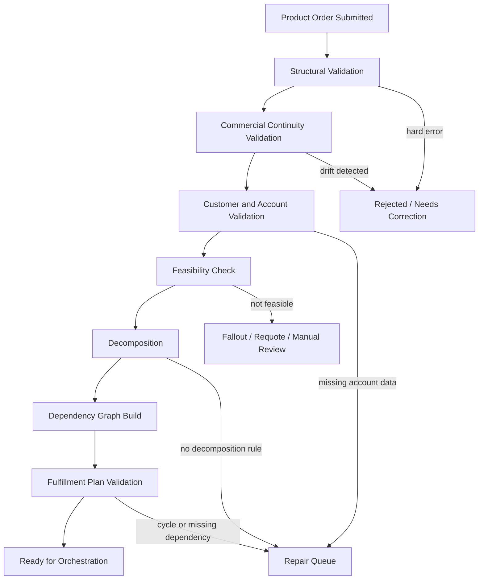
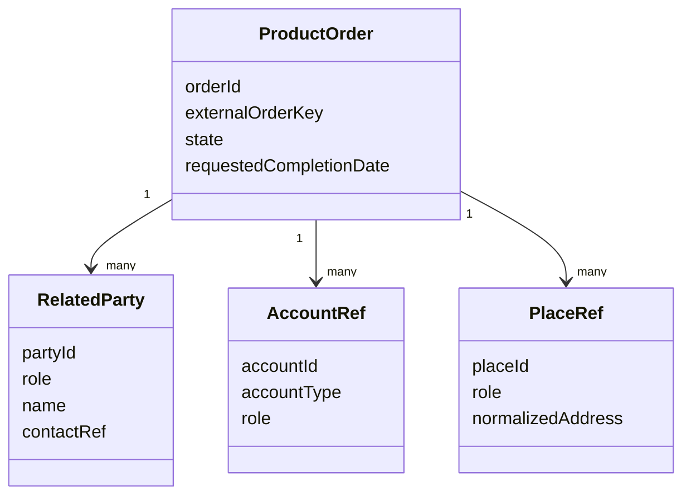
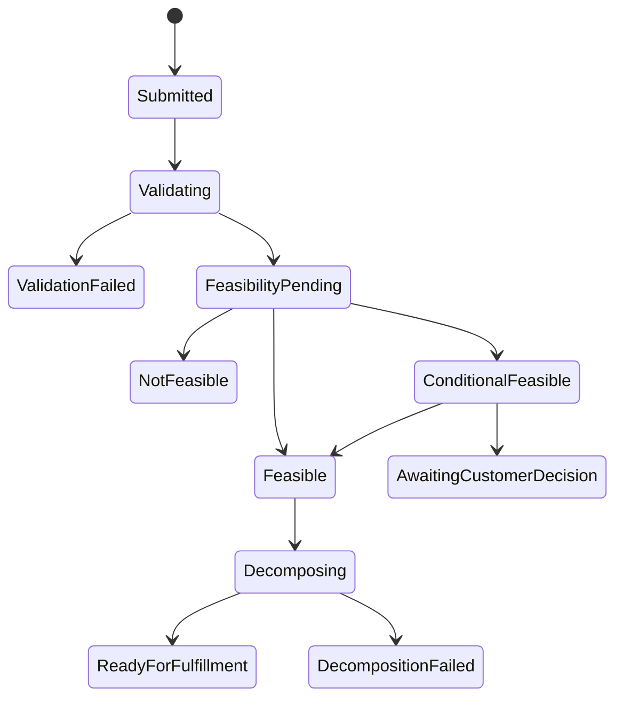
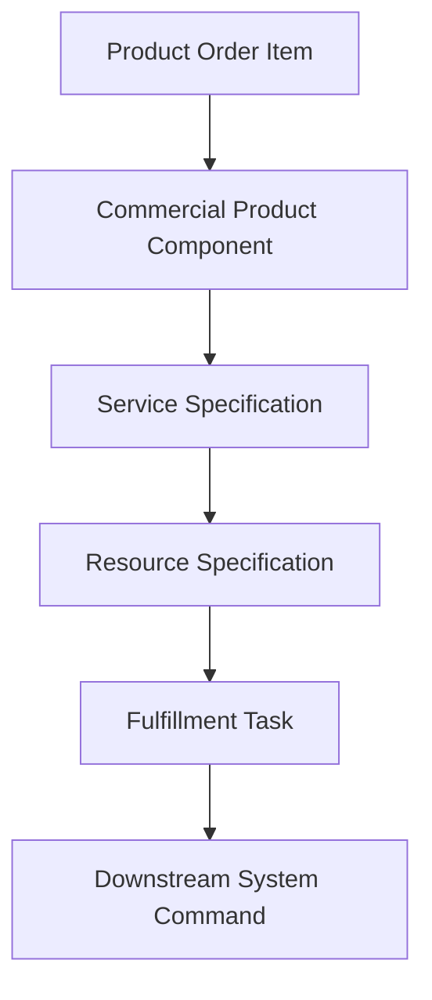
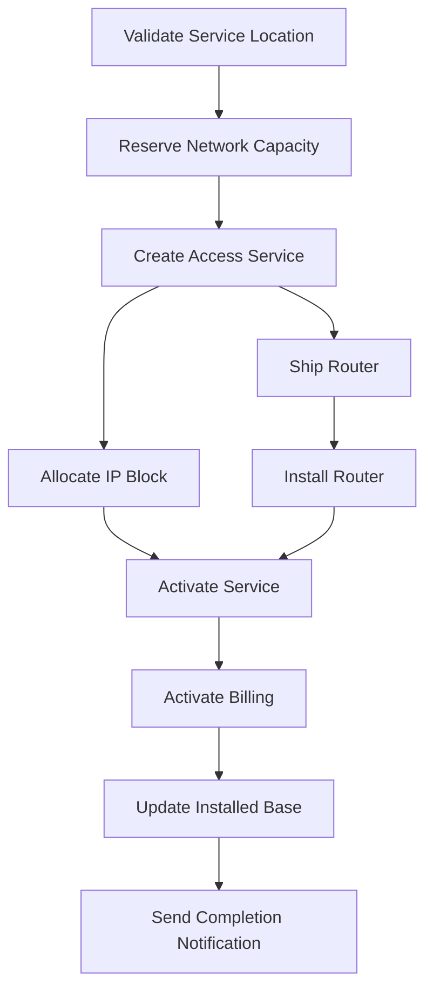
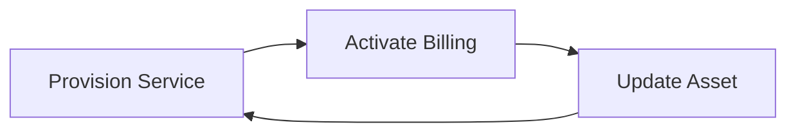
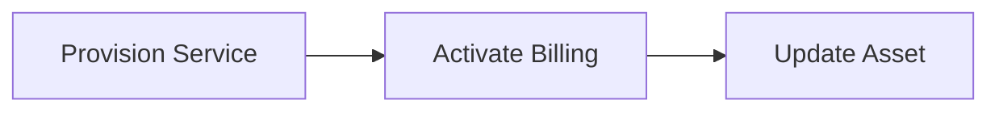
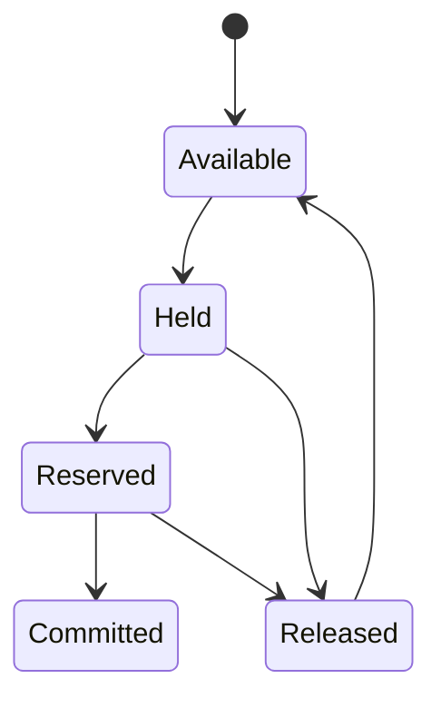
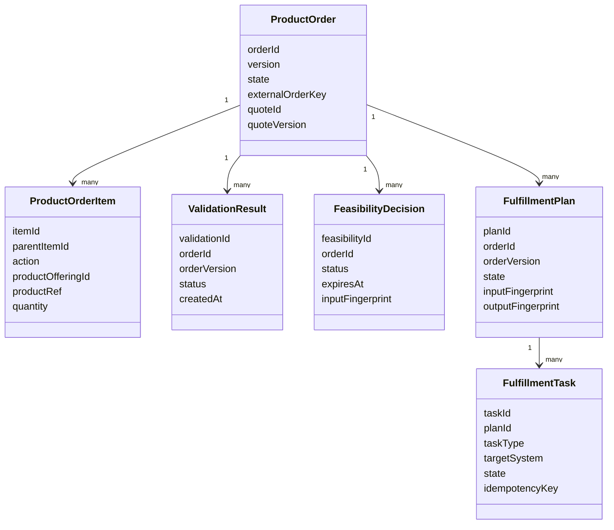

# Part 021 — Order Validation, Feasibility, and Decomposition

Order submission is not the end of CPQ.

It is the point where commercial truth becomes operational obligation.

A sales quote can be commercially valid but operationally impossible. A product can be eligible but not feasible. A price can be approved but attached to an address that cannot be served. A customer can accept a bundle whose child services must be delivered by multiple downstream systems with different lead times, identifiers, and failure modes.

That is why enterprise OMS needs a dedicated layer for:

- order validation,
- feasibility check,
- technical decomposition,
- dependency graph construction,
- fulfillment readiness,
- and evidence capture.

The job of this layer is not to make the order look clean.

The job is to convert an externally meaningful product order into an internally executable fulfillment plan without losing intent.

```text
Quote accepted -> Product order submitted -> Validated -> Feasibility confirmed -> Decomposed -> Fulfillment plan ready
```

> Goal part ini: kamu mampu mendesain validation + feasibility + decomposition layer yang mencegah bad orders masuk fulfillment, mengurangi fallout, dan menghasilkan fulfillment graph yang deterministic, auditable, and repairable.

---

## 1. Kaufman Target Performance

Setelah bagian ini, kamu harus bisa:

1. Membedakan quote validation, order validation, feasibility, and decomposition.
2. Menentukan validation yang harus blocking, warning, async, atau deferred.
3. Mendesain feasibility model untuk serviceability, inventory, capacity, credit, compliance, and technical viability.
4. Membuat product-to-service/resource decomposition strategy.
5. Mendesain dependency graph untuk fulfillment orchestration.
6. Menjelaskan invariant yang mencegah order fallout.
7. Membuat test strategy untuk decomposition correctness.

Kaufman framing:

```text
Skill besar:
Design enterprise-grade order validation and decomposition.

Sub-skill:
1. Identify order intent.
2. Validate required facts.
3. Determine feasibility.
4. Convert product order items to fulfillment tasks.
5. Build dependency graph.
6. Preserve traceability.
7. Recover from invalid or partial downstream readiness.
```

---

## 2. Mental Model: Order Is Intent, Fulfillment Plan Is Execution

Product order adalah intent:

```text
Customer wants Product X with configuration Y under commercial terms Z.
```

Fulfillment plan adalah execution instruction:

```text
Provision service A.
Reserve inventory B.
Ship device C.
Create billing subscription D.
Activate entitlement E.
Notify customer F.
```

Jangan campur dua hal ini.

Order line tidak sama dengan fulfillment task.

Satu order line bisa menghasilkan banyak task. Banyak order line bisa digabung menjadi satu task. Satu task bisa bergantung pada hasil task lain.

Contoh:

```text
Order line:
- Enterprise Internet 1Gbps + Static IP + Managed Router

Possible decomposition:
- validate serviceability at site
- reserve port capacity
- create access service
- provision IP block
- ship managed router
- schedule installation appointment
- activate billing subscription
- update installed base
```

Jika sistem menganggap `order_item == fulfillment_task`, maka design akan pecah saat masuk enterprise reality.

---

## 3. Boundary: Quote Validation vs Order Validation vs Feasibility

Banyak sistem gagal karena semua validasi dipaksa menjadi satu tahap.

Padahal domain-nya berbeda.

| Layer | Pertanyaan | Contoh |
|---|---|---|
| Quote validation | Apakah proposal ini boleh dikirim/diterima? | price approved, required terms present, quote not expired |
| Order validation | Apakah order request lengkap dan konsisten? | billing account exists, address present, accepted quote matches order |
| Feasibility | Apakah order bisa dipenuhi secara operasional/teknis? | site serviceable, inventory available, capacity exists |
| Decomposition | Bagaimana order dieksekusi? | product line becomes service/order/resource/billing tasks |
| Orchestration | Dalam urutan apa task dijalankan? | reserve before provision, install before activate |

A quote can be valid but not feasible.

A feasible order can still fail if decomposition is wrong.

A well-decomposed order can still fail if orchestration ignores dependencies.

---

## 4. High-Level Flow



This pipeline should be deterministic.

For the same order snapshot, decomposition rules, catalog version, asset state, and feasibility inputs, the system should produce the same fulfillment plan.

---

## 5. Order Validation Taxonomy

Order validation should not be one boolean.

It should produce structured findings.

```text
ValidationResult
- status: PASS | PASS_WITH_WARNINGS | FAIL | NEEDS_REPAIR | NEEDS_ASYNC_CHECK
- findings[]
  - code
  - severity
  - category
  - target
  - message
  - evidence
  - remediation
  - blockingAction
```

### 5.1 Severity Model

| Severity | Meaning | Example | System Behavior |
|---|---|---|---|
| Info | useful but non-blocking | preferred delivery window omitted | continue |
| Warning | risk exists but allowed | installation date near SLA limit | continue with flag |
| Soft block | needs user/business repair | billing contact missing | repair before fulfillment |
| Hard block | illegal/impossible | accepted quote expired and not approved | reject or re-quote |
| Async pending | external decision needed | credit check, serviceability check | wait/poll/callback |
| Compliance hold | regulated decision | export restriction, KYC issue | manual/compliance workflow |

Do not encode all of these as `400 Bad Request`.

A production OMS needs semantic outcomes.

---

## 6. Structural Validation

Structural validation checks whether the order document is well-formed and internally coherent.

Examples:

- order has at least one item,
- each item has action type,
- quantity is valid,
- item hierarchy has no cycles,
- parent line exists,
- quote reference is valid when required,
- customer and account references are present,
- required addresses are present,
- currency is consistent,
- requested dates are valid,
- duplicate external order key is handled idempotently.

### 6.1 Structural Invariants

```text
Invariant: Every order item must have exactly one executable intent.
```

Bad:

```json
{
  "itemId": "10",
  "action": "ADD_AND_DISCONNECT"
}
```

Good:

```json
{
  "itemId": "10",
  "action": "ADD"
}
```

```text
Invariant: Order item hierarchy must be acyclic.
```

Bad:

```text
A parent B
B parent C
C parent A
```

This must never reach orchestration.

---

## 7. Commercial Continuity Validation

Commercial continuity ensures that the submitted order still matches the accepted quote or accepted commercial commitment.

Validate:

- quote ID,
- quote version,
- accepted quote status,
- quote validity period,
- approval fingerprint,
- pricing fingerprint,
- configuration fingerprint,
- proposal document hash,
- accepted terms hash,
- customer party alignment,
- order line mapping to quote line,
- order total vs accepted commercial total.

### 7.1 Why This Exists

Without commercial continuity validation, downstream systems can accidentally fulfill a deal that nobody approved.

Examples:

| Failure | Cause | Impact |
|---|---|---|
| Price drift | order recalculated price using newer price book | revenue leakage or customer dispute |
| Config drift | order line edited after quote acceptance | unsupported bundle fulfilled |
| Approval drift | discount changed after approval | unauthorized deal |
| Terms drift | document regenerated with newer template | legal mismatch |
| Customer drift | order submitted for different account | compliance/accounting issue |

### 7.2 Fingerprint Pattern

Use fingerprint to detect drift.

```text
quotePricingFingerprint = hash(
  quoteLineIds,
  productOfferingVersions,
  priceComponents,
  discounts,
  promotions,
  taxBoundaryInputs,
  roundingPolicy,
  currency,
  effectiveDate
)
```

At order submit:

```text
if order.acceptedQuote.pricingFingerprint != quote.pricingFingerprint:
    block conversion or require reapproval
```

Fingerprint is not a replacement for domain validation.

It is a cheap guardrail.

---

## 8. Customer, Account, and Party Validation

Enterprise orders usually involve multiple parties:

- buyer,
- bill-to,
- sold-to,
- ship-to,
- service location,
- payer,
- legal entity,
- reseller,
- partner,
- end customer,
- technical contact,
- approver,
- installer contact.

These are not interchangeable.

### 8.1 Common Party Model



### 8.2 Invariants

```text
Invariant: Billing account cannot be inferred from sold-to customer if more than one active billing account exists.
```

```text
Invariant: Service location must be explicit for physical or location-bound products.
```

```text
Invariant: Legal entity for contract/invoice must be determined before billing handoff.
```

---

## 9. Feasibility Is Not Eligibility

Eligibility answers:

```text
Is the customer allowed to buy this offering?
```

Feasibility answers:

```text
Can the enterprise actually deliver it under this context?
```

Examples:

| Dimension | Eligibility | Feasibility |
|---|---|---|
| Geography | product is sold in country | address is serviceable |
| Customer | segment can buy plan | credit check passes |
| Channel | reseller can sell product | reseller has inventory/allocation |
| Technical | product can be ordered | required network capacity exists |
| Commercial | discount approved | fulfillment lead time can meet promise date |

A product can be eligible but infeasible.

Example:

```text
Customer is eligible for fiber internet in the region, but the specific building has no available port capacity.
```

---

## 10. Feasibility Dimensions

### 10.1 Serviceability

Serviceability checks whether a product/service can be provided at a location.

Inputs:

- normalized address,
- location ID,
- network footprint,
- building access,
- technology availability,
- regulatory zone,
- product offering,
- service specification,
- install type.

Output:

```text
SERVICEABLE | NOT_SERVICEABLE | CONDITIONALLY_SERVICEABLE | UNKNOWN
```

Conditional serviceability matters.

Example:

```text
Available only with installation survey.
Available only after construction.
Available only below 500 Mbps.
```

### 10.2 Inventory Availability

Inventory feasibility checks whether physical or logical inventory can be allocated.

Examples:

- device stock,
- SIM inventory,
- phone numbers,
- IP addresses,
- license pool,
- capacity block,
- slot reservation,
- warehouse availability.

Important distinction:

```text
Check availability != reserve inventory.
```

A feasibility check may be non-binding. A reservation is a state-changing commitment.

### 10.3 Capacity Feasibility

Capacity checks whether the platform/network/team can deliver.

Examples:

- network capacity,
- port capacity,
- compute quota,
- professional service capacity,
- installation crew capacity,
- delivery slot capacity,
- provisioning throughput.

### 10.4 Credit and Risk

Credit feasibility checks whether the order can proceed from risk perspective.

Examples:

- credit score,
- payment history,
- outstanding debt,
- fraud risk,
- spending limit,
- credit hold,
- deposit requirement.

Credit can produce conditions:

```text
APPROVED
APPROVED_WITH_DEPOSIT
APPROVED_WITH_LIMIT
REJECTED
MANUAL_REVIEW
```

### 10.5 Regulatory and Compliance Feasibility

Examples:

- KYC complete,
- export control,
- sanctioned party screening,
- data residency,
- sector restriction,
- age restriction,
- regulated product license.

Compliance feasibility should produce evidence.

Not just a boolean.

---

## 11. Feasibility Result Model

```text
FeasibilityCheck
- feasibilityId
- orderId
- orderVersion
- status
- checkedAt
- expiresAt
- inputFingerprint
- dimensions[]
- conditions[]
- evidence[]
```

```text
FeasibilityDimensionResult
- dimension: SERVICEABILITY | INVENTORY | CAPACITY | CREDIT | COMPLIANCE | DELIVERY
- status: PASS | FAIL | CONDITIONAL | UNKNOWN | PENDING
- target: order item / service location / party / account
- reasonCode
- evidence
- remediation
```

### 11.1 Expiry

Feasibility expires.

Inventory changes. Capacity changes. Credit status changes. Serviceability database changes.

```text
Invariant: A feasibility decision must include expiry or freshness metadata.
```

---

## 12. Synchronous vs Asynchronous Feasibility

Not all checks can run inline.

| Check | Sync/Async | Reason |
|---|---|---|
| structural validation | sync | local and deterministic |
| quote fingerprint check | sync | local or near-local |
| billing account exists | sync | fast master-data lookup |
| serviceability pre-check | sync or async | depends on system |
| network survey | async | human/field process |
| credit review | sync/async | risk engine or manual |
| inventory reservation | sync or async | external allocation system |
| construction feasibility | async | long-running |

A mature OMS supports both.



---

## 13. Decomposition: From Product Intent to Execution Plan

Decomposition translates product order items into technical tasks.

Input:

```text
ProductOrder + Catalog Snapshot + Product-to-Service Rules + Asset State + Feasibility Evidence
```

Output:

```text
FulfillmentPlan
- tasks
- dependencies
- resources
- correlation keys
- rollback/compensation policy
- execution constraints
```

### 13.1 Why Decomposition Is Hard

Because product/commercial structure is not the same as technical structure.

Commercial line:

```text
Premium Cloud Contact Center Bundle
```

Technical decomposition:

```text
- create tenant
- provision identity group
- assign licenses
- configure phone numbers
- create SIP trunk
- enable recording storage
- configure compliance retention
- activate billing subscription
- notify admin
```

If product model is weak, decomposition becomes spaghetti.

---

## 14. Decomposition Levels

Enterprise decomposition often has multiple levels.



### 14.1 Product Decomposition

Breaks bundle/options into product components.

Example:

```text
Bundle: Internet + Router + Static IP
- Internet access product
- Router product
- Static IP add-on
```

### 14.2 Service Decomposition

Maps products to services.

Example:

```text
Internet access product -> Access Service
Static IP add-on -> IP Allocation Service
Router product -> Managed CPE Service
```

### 14.3 Resource Decomposition

Maps services to resources.

Example:

```text
Access Service -> network port + circuit + installation task
IP Allocation Service -> IP block
Managed CPE Service -> router serial number + shipping task
```

### 14.4 System Command Decomposition

Maps fulfillment tasks to downstream commands.

Example:

```text
Provision Access Service -> Network Provisioning API command
Allocate IP -> IPAM command
Ship Router -> Logistics order
Activate Billing -> Billing API command
```

---

## 15. Decomposition Rule Types

| Rule Type | Purpose | Example |
|---|---|---|
| Mapping rule | map product offering to service spec | Fiber 1G -> BroadbandAccessService |
| Action rule | determine add/modify/delete behavior | upgrade speed -> modify access service |
| Dependency rule | define execution order | install before activate billing |
| Merge rule | combine lines into one task | multiple licenses -> one tenant update |
| Split rule | split one line into many tasks | bundle -> service + device + billing |
| Conditional rule | apply only under condition | static IP requires IPAM task |
| Compensation rule | define undo behavior | release reserved inventory on cancel |
| Manual task rule | create human task when automation not possible | site survey required |

Decomposition rule should be versioned.

```text
Invariant: Fulfillment plan must record decomposition rule version.
```

---

## 16. Example: Add Order Decomposition

Order:

```text
ADD: Enterprise Internet 1Gbps
ADD: Static IP /29
ADD: Managed Router
```

Decomposition:



Key decisions:

- billing after activation or after shipment?
- installed base updated at activation or completion?
- IP allocation before or after circuit creation?
- installation appointment before capacity reservation?
- can router ship before serviceability completes?

These are business architecture decisions, not just workflow choices.

---

## 17. Example: Modify Order Decomposition

Order:

```text
MODIFY: Enterprise Internet 500Mbps -> 1Gbps
ADD: Static IP /29
```

Decomposition:

```text
- retrieve current access service
- validate upgrade path
- reserve additional capacity
- modify access service bandwidth
- allocate IP block
- update billing subscription
- update installed base
```

Important:

```text
Modify order must reference existing asset/service instance.
```

Without asset reference, the system may create duplicate service instead of modifying existing service.

---

## 18. Example: Disconnect Order Decomposition

Order:

```text
DELETE: Static IP add-on
DELETE: Managed Router
```

Decomposition:

```text
- validate termination rights
- schedule disconnect date
- remove IP assignment
- create return logistics task for router
- update billing subscription
- update installed base
- release resources
```

Caution:

```text
Do not release resources before disconnect effective date unless policy allows it.
```

---

## 19. Dependency Graph Design

A fulfillment plan is a graph.

Not a flat list.

```text
Task
- taskId
- taskType
- targetSystem
- action
- input
- output
- dependencies[]
- compensation
- retryPolicy
- timeoutPolicy
- idempotencyKey
- state
```

### 19.1 Graph Invariants

```text
Invariant: Fulfillment graph must be acyclic unless cycles are explicitly modeled as polling/wait states.
```

```text
Invariant: Every task dependency must reference a task in the same plan or an external milestone with clear ownership.
```

```text
Invariant: Every task must have a deterministic idempotency key.
```

```text
Invariant: No task may depend on data produced by a task that is not declared as dependency.
```

---

## 20. Dependency Graph Validation

Before orchestration, validate the graph.

Checks:

- no cycles,
- no missing dependencies,
- no orphan tasks,
- every task has owner system,
- every task has retry policy,
- every irreversible task has approval/guard,
- every external command has idempotency key,
- every manual task has queue/role/SLA,
- every billing task has commercial evidence,
- every asset update has source fulfillment evidence.

### 20.1 Cycle Detection

Bad:



Good:



---

## 21. Product-to-Service Mapping Strategy

There are three common approaches.

### 21.1 Hardcoded Mapping

```text
if offering == FIBER_1G:
    create AccessService
```

Works for small systems.

Fails with large catalogs.

### 21.2 Catalog-Driven Mapping

Product offering includes references to service specifications and fulfillment patterns.

```text
ProductOffering
- offeringId
- serviceSpecificationRefs[]
- fulfillmentPatternRef
- decompositionRuleRef
```

Better for enterprise catalog governance.

### 21.3 Policy/Rule-Driven Mapping

A decomposition engine evaluates rules.

```text
when productOffering.category == CONNECTIVITY
and speed >= 1Gbps
and accessTechnology == FIBER
then create FiberAccessService task set
```

Powerful but risky if ungoverned.

### 21.4 Recommended Model

Use catalog-driven mapping for stable product-to-service relationship, plus rule-driven enrichment for conditional behavior.

```text
Catalog defines default decomposition intent.
Rule engine handles context-sensitive variation.
```

---

## 22. Decomposition Snapshot

The fulfillment plan must preserve enough evidence to explain why tasks were created.

```text
FulfillmentPlanSnapshot
- orderId
- orderVersion
- catalogVersion
- decompositionRuleVersion
- assetSnapshotVersion
- feasibilityDecisionId
- generatedAt
- generatedBy
- inputFingerprint
- outputFingerprint
```

Without this, production support cannot answer:

```text
Why did this order create this task?
Why was this dependency chosen?
Which rule version generated this plan?
Why did customer A get manual survey but customer B did not?
```

---

## 23. Re-Decomposition Rules

Sometimes orders change before fulfillment starts.

Sometimes catalog rules change after order submission.

Sometimes feasibility result expires before execution.

You need a clear re-decomposition policy.

| Situation | Re-Decompose? | Notes |
|---|---:|---|
| Order amended before fulfillment | yes | preserve old plan as superseded |
| Catalog rule changed after order submission | usually no | unless re-validation policy allows |
| Feasibility expired before start | maybe | rerun feasibility, then re-decompose if result changed |
| Manual repair changes missing account data | partial | enrich plan, do not change commercial intent |
| Downstream system returns alternate resource | no | update task output, not product intent |

```text
Invariant: Re-decomposition must create a new plan version, not mutate old plan silently.
```

---

## 24. Feasibility and Reservation Boundary

A common design bug:

```text
Feasibility check reserves scarce resource but system treats it as read-only validation.
```

This creates hidden state.

Separate:

| Operation | Side Effect | Example |
|---|---|---|
| Check | no durable reservation | “is router stock available?” |
| Hold | temporary reservation | “hold router for 30 minutes” |
| Reserve | durable reservation for order | “reserve router for order item 10” |
| Commit | consume resource | “ship router / assign serial” |
| Release | undo reservation | “release held router” |

Model this explicitly.



---

## 25. Fallout Prevention Through Early Design

Fallout is often treated as operational noise.

Actually, most fallout is design debt.

| Fallout Type | Preventive Design |
|---|---|
| Missing customer data | completeness validation before submit |
| Unserviceable location | feasibility before orchestration |
| Unsupported product combination | configurator + order validation |
| Downstream unknown product code | catalog-driven decomposition |
| Duplicate provisioning | idempotency key per task |
| Wrong billing date | explicit date semantics |
| Stale inventory | reservation expiry and refresh |
| Manual queue overload | rule governance + capacity metric |

A good OMS reduces fallout by preventing invalid execution plans, not by creating bigger repair teams.

---

## 26. Error Model

Order validation and decomposition errors need stable codes.

```text
ORDER_STRUCT_001: Missing required order item action
ORDER_COMM_004: Accepted quote fingerprint mismatch
ORDER_PARTY_002: Billing account ambiguous
ORDER_FEAS_003: Service location not serviceable
ORDER_FEAS_008: Inventory unavailable
ORDER_DECOMP_001: No decomposition rule for product offering
ORDER_DECOMP_004: Dependency cycle detected
ORDER_DECOMP_007: Target system mapping missing
```

Each error should include:

- code,
- severity,
- target,
- business message,
- technical message,
- remediation,
- support owner,
- correlation IDs,
- evidence.

---

## 27. API Boundary

### 27.1 Submit Order

```http
POST /product-orders
Idempotency-Key: ext-order-123
```

```json
{
  "externalOrderKey": "crm-order-123",
  "quoteRef": {
    "quoteId": "Q-90001",
    "version": 7,
    "acceptedAt": "2026-07-02T08:00:00+07:00"
  },
  "items": [
    {
      "itemId": "10",
      "action": "ADD",
      "productOfferingId": "fiber-1g",
      "configurationRef": "cfg-abc"
    }
  ]
}
```

### 27.2 Validate Order

```http
POST /product-orders/{orderId}/validations
```

```json
{
  "scope": "PRE_FULFILLMENT",
  "includeFeasibility": true
}
```

### 27.3 Feasibility Check

```http
POST /product-orders/{orderId}/feasibility-checks
```

```json
{
  "dimensions": ["SERVICEABILITY", "INVENTORY", "CAPACITY", "CREDIT"],
  "mode": "BINDING_HOLD"
}
```

### 27.4 Generate Fulfillment Plan

```http
POST /product-orders/{orderId}/fulfillment-plans
```

```json
{
  "orderVersion": 3,
  "feasibilityDecisionId": "feas-123",
  "decompositionMode": "STRICT"
}
```

---

## 28. Event Model

Important events:

```text
ProductOrderSubmitted
ProductOrderValidated
ProductOrderValidationFailed
ProductOrderFeasibilityRequested
ProductOrderFeasibilityCompleted
ProductOrderFeasibilityFailed
ProductOrderDecompositionRequested
ProductOrderDecomposed
FulfillmentPlanCreated
FulfillmentPlanValidationFailed
ProductOrderReadyForFulfillment
```

Event payload should include:

- order ID,
- order version,
- validation result ID,
- feasibility decision ID,
- fulfillment plan ID,
- state,
- reason codes,
- correlation ID,
- causation ID,
- timestamp.

Do not put the entire order in every event unless you have an event-carried-state-transfer strategy.

---

## 29. Observability

Metrics:

| Metric | Why It Matters |
|---|---|
| validation failure rate | quality of upstream capture |
| validation error by code | recurring data/model issue |
| feasibility failure rate | product promise vs operational reality |
| feasibility latency | customer/order delay |
| decomposition failure rate | catalog/decomposition rule quality |
| no-rule failure count | catalog mapping gap |
| graph validation failure | orchestration design issue |
| manual repair rate | automation/control weakness |
| fallout prevented | value of validation layer |

Logs must include:

- order ID,
- quote ID,
- order version,
- catalog version,
- decomposition rule version,
- input fingerprint,
- validation result ID,
- feasibility decision ID,
- fulfillment plan ID.

Tracing should show:

```text
submit order -> validate -> feasibility -> decompose -> plan validation -> ready for orchestration
```

---

## 30. Data Model Sketch



---

## 31. Security and Authorization

Not everyone can validate or decompose orders manually.

Authorization examples:

| Action | Required Control |
|---|---|
| submit order | sales/order capture permission |
| override validation warning | policy-specific permission |
| bypass feasibility | very restricted, audited |
| force decomposition | ops/admin role |
| edit fulfillment plan | usually prohibited; repair through controlled command |
| approve not-feasible exception | business/ops authority |

Dangerous permission:

```text
Can edit order after submit.
```

Prefer explicit commands:

```text
Amend order
Repair missing billing contact
Request feasibility override
Regenerate fulfillment plan
Cancel order
```

---

## 32. Testing Strategy

### 32.1 Structural Validation Tests

Test invalid orders:

- missing action,
- duplicate item ID,
- cyclic parent relation,
- unknown quote,
- ambiguous billing account,
- invalid requested date.

### 32.2 Commercial Continuity Tests

Test drift:

- price fingerprint changed,
- quote expired,
- approval revoked,
- customer changed,
- quote line omitted,
- line quantity changed after acceptance.

### 32.3 Feasibility Tests

Test:

- serviceable address,
- unserviceable address,
- conditional serviceability,
- inventory unavailable,
- credit hold,
- expired feasibility result,
- async pending result.

### 32.4 Decomposition Golden Tests

Use golden fixtures:

```text
input: order snapshot + catalog version + asset state + feasibility result
expected: fulfillment task graph
```

Validate:

- task count,
- task types,
- dependency edges,
- target systems,
- idempotency keys,
- compensation policy,
- generated evidence.

### 32.5 Property-Based Tests

Examples:

```text
For every generated fulfillment graph, graph is acyclic.
```

```text
For every task, idempotency key is stable for same order version and task semantics.
```

```text
For every billing task, there is commercial evidence from accepted quote or approved order amendment.
```

---

## 33. Common Anti-Patterns

### 33.1 Treating Feasibility as UI Validation

Bad:

```text
UI calls serviceability once and order assumes it forever.
```

Better:

```text
Feasibility decision is persisted with input fingerprint and expiry.
```

### 33.2 Decomposition Hidden in Workflow Code

Bad:

```text
Workflow step directly decides which downstream tasks to call.
```

Better:

```text
Decomposition service generates explicit fulfillment plan before orchestration.
```

### 33.3 No Decomposition Version

Bad:

```text
Task appeared but no one knows which rule created it.
```

Better:

```text
Every task records decomposition rule/version/evidence.
```

### 33.4 Manual Repair by Database Update

Bad:

```text
Ops edits task payload in DB.
```

Better:

```text
Ops executes controlled repair command with audit and revalidation.
```

### 33.5 Recalculating Commercial Facts During Decomposition

Bad:

```text
Decomposition recalculates price to decide billing task.
```

Better:

```text
Use accepted quote/order commercial snapshot. Recalculate only if policy explicitly requires it.
```

---

## 34. Design Review Checklist

Ask these questions:

1. What validations run before order acceptance?
2. Which validations are blocking vs warning?
3. Which feasibility checks are synchronous vs asynchronous?
4. Does feasibility produce evidence and expiry?
5. Does decomposition use catalog version and rule version?
6. Can we explain why each task exists?
7. Can we regenerate the same plan from the same inputs?
8. Is the fulfillment graph validated before execution?
9. Are idempotency keys deterministic?
10. Can manual repair happen without database mutation?
11. What happens when feasibility expires?
12. What happens when decomposition rule is missing?
13. What happens when the graph has a cycle?
14. What happens when a downstream target system is unavailable?
15. Can support see order -> validation -> feasibility -> plan trace?

---

## 35. Practice: Design an Order Decomposition Model

Scenario:

```text
Customer accepts a quote for:
- Cloud Contact Center Enterprise
- 200 agent licenses
- 20 supervisor licenses
- 50 phone numbers
- call recording retention 7 years
- premium support
- existing customer with current identity tenant
```

Design:

1. order validation checks,
2. feasibility checks,
3. product-to-service decomposition,
4. fulfillment tasks,
5. dependency graph,
6. idempotency keys,
7. evidence model,
8. failure modes.

Expected decomposition may include:

```text
- verify existing tenant
- check license pool
- reserve phone numbers
- update identity groups
- assign licenses
- configure phone numbers
- configure call recording retention
- activate premium support entitlement
- update billing subscription
- update installed base
- send admin notification
```

---

## 36. Key Takeaways

1. Order validation checks whether the submitted order is complete, consistent, and commercially continuous.
2. Feasibility checks whether the order can be delivered under operational, technical, risk, capacity, and compliance constraints.
3. Decomposition translates product intent into executable fulfillment plan.
4. Decomposition output should be a graph, not a flat list.
5. Fulfillment tasks must carry dependency, idempotency, retry, compensation, and evidence metadata.
6. Feasibility decisions must include freshness/expiry.
7. Every fulfillment plan should be reproducible from input snapshot and rule versions.
8. Most fallout is preventable through validation, feasibility, and decomposition design.

---

## 37. References

- TM Forum, TMF622 Product Ordering Management API: product order as standardized mechanism for placing product orders with necessary order parameters, based on product offerings in catalog.
- TM Forum, TMF640 Activation and Configuration API: activation/configuration and async monitor pattern for service/resource execution.
- Enterprise integration practice: order validation, feasibility, decomposition, and orchestration should be separated to preserve intent and improve failure recovery.

