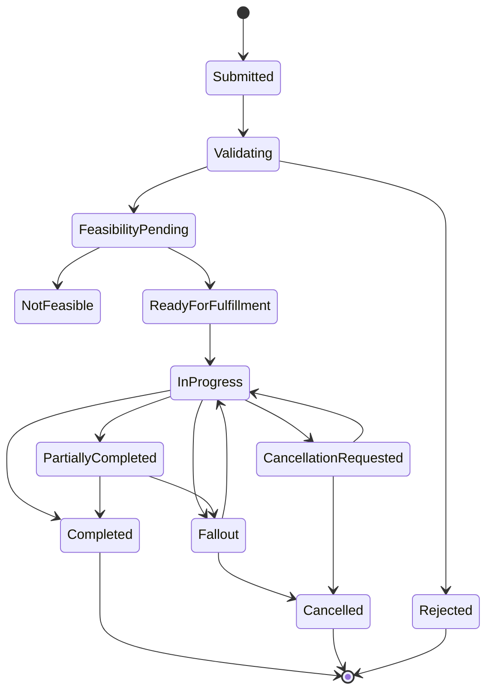
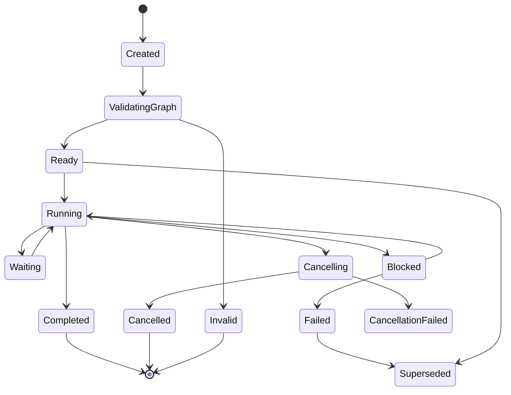
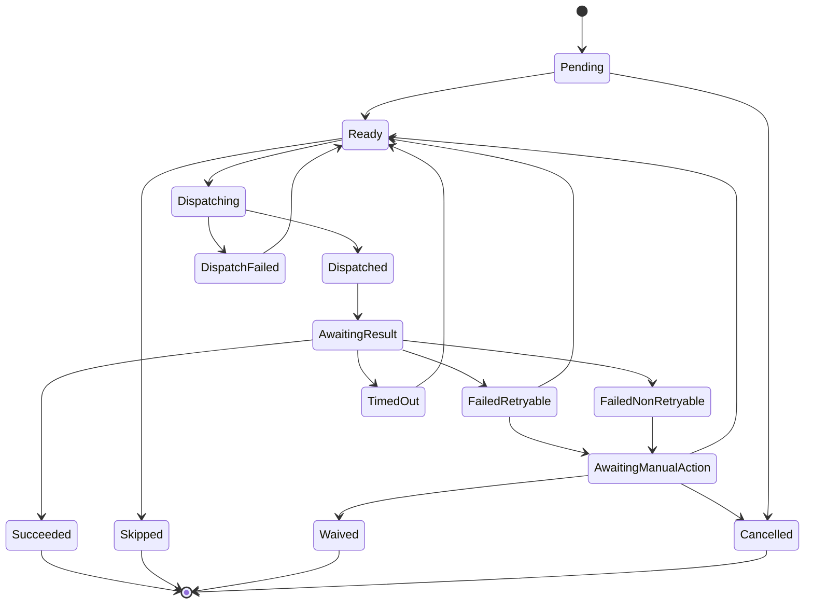
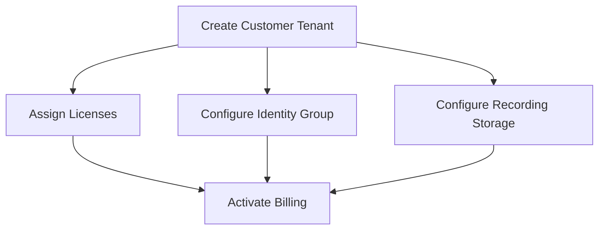
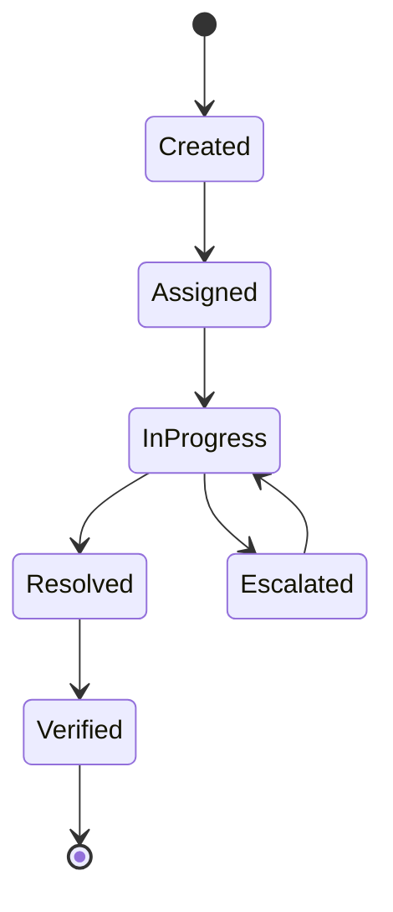
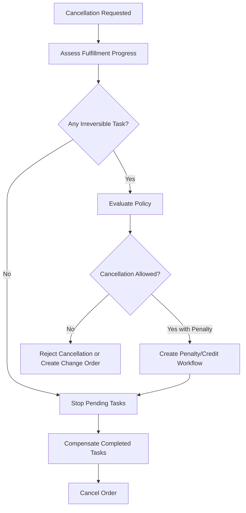
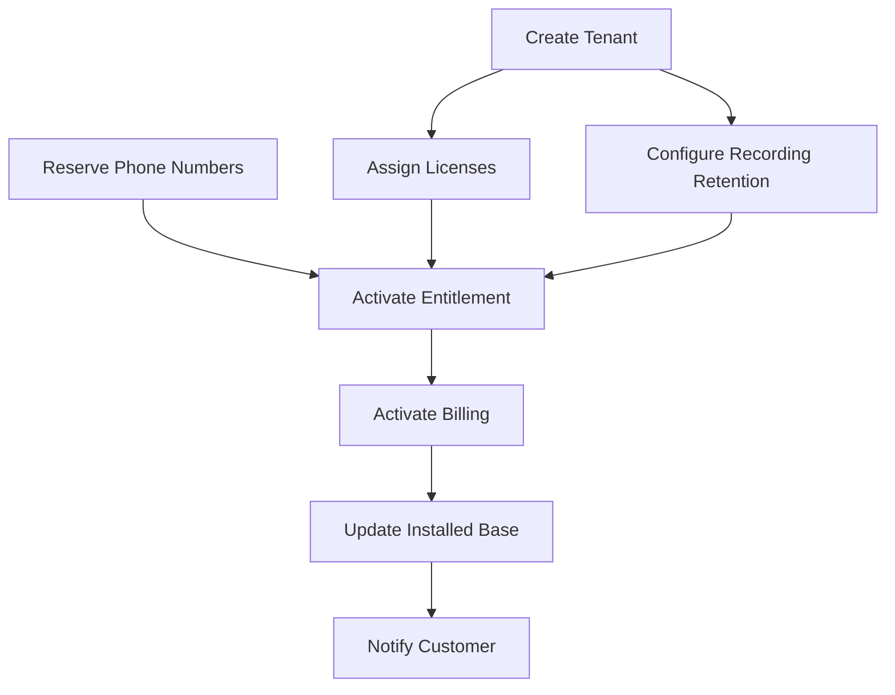

# Part 022 — Order Orchestration and Fulfillment State Machines

Once an order has been validated, checked for feasibility, and decomposed into a fulfillment plan, the next problem is execution.

Execution is where enterprise OMS becomes a distributed system.

A single customer order may touch:

- CRM,
- product inventory,
- service inventory,
- resource inventory,
- billing,
- tax,
- payment,
- logistics,
- appointment scheduling,
- provisioning,
- identity,
- entitlement,
- partner systems,
- support systems,
- analytics,
- and customer notification channels.

Some systems are synchronous. Some are asynchronous. Some are reliable. Some are not. Some operations are reversible. Some are not. Some tasks can run in parallel. Some must wait for physical installation or human approval.

Order orchestration is the control plane that turns a fulfillment graph into reliable progress.

> Goal part ini: kamu mampu mendesain orchestration dan fulfillment state machine yang deterministic, observable, recoverable, idempotent, dependency-aware, and safe under partial failure.

---

## 1. Kaufman Target Performance

Setelah bagian ini, kamu harus bisa:

1. Menjelaskan perbedaan order state, fulfillment plan state, and task state.
2. Mendesain state machine untuk order orchestration.
3. Menentukan retry, timeout, compensation, cancellation, and manual intervention policy.
4. Menjalankan dependency graph secara aman.
5. Menghindari duplicate fulfillment.
6. Menangani partial completion dan fallout.
7. Membuat observability model untuk production operations.

Kaufman framing:

```text
Skill besar:
Design enterprise-grade order orchestration.

Sub-skill:
1. Model order/plan/task states separately.
2. Execute dependency graph.
3. Handle async downstream systems.
4. Make commands idempotent.
5. Recover from failure.
6. Support manual intervention.
7. Preserve auditability and customer-visible truth.
```

---

## 2. Mental Model: Orchestration Is Progress Under Constraint

Order orchestration is not “call API A, then API B”.

It is controlled progress under constraints:

```text
Given a fulfillment plan graph,
execute eligible tasks,
respect dependencies,
handle external uncertainty,
persist every transition,
recover after crash,
and never execute irreversible side effects without required preconditions.
```

The core loop:

```text
1. Find runnable tasks.
2. Dispatch commands idempotently.
3. Wait for result or timeout.
4. Update task state.
5. Recompute plan progress.
6. Trigger next tasks.
7. Escalate failures.
```

---

## 3. Separate Three State Machines

Do not use one state field for everything.

Enterprise OMS needs at least three levels:

| Level | Meaning | Example States |
|---|---|---|
| Order state | customer/business lifecycle | Submitted, In Progress, Completed, Cancelled |
| Fulfillment plan state | execution plan lifecycle | Created, Running, Blocked, Completed, Failed |
| Fulfillment task state | individual work lifecycle | Pending, Ready, Dispatched, Succeeded, Failed |

### 3.1 Why Separation Matters

An order can be `InProgress` while fulfillment plan is `Blocked` and one task is `AwaitingManualAction`.

If you collapse all into one state, you lose operational precision.

Bad:

```text
Order.status = FAILED
```

Better:

```text
Order.state = IN_PROGRESS
FulfillmentPlan.state = BLOCKED
Task[ReserveInventory].state = FAILED_RETRYABLE
FalloutCase.state = ASSIGNED_TO_SUPPLY_OPS
```

---

## 4. Order State Machine

Order state is customer/business-facing.



### 4.1 Order State Rules

```text
Submitted -> Validating
Only allowed once per order version.
```

```text
ReadyForFulfillment -> InProgress
Only allowed when active fulfillment plan exists and graph validation passed.
```

```text
InProgress -> Completed
Only allowed when all mandatory fulfillment tasks are terminal successful or intentionally waived.
```

```text
InProgress -> Cancelled
Only allowed if cancellation policy succeeds for completed/irreversible tasks.
```

---

## 5. Fulfillment Plan State Machine

Fulfillment plan state is orchestration-facing.



### 5.1 Plan Invariants

```text
Invariant: Only one active fulfillment plan per order version.
```

```text
Invariant: A superseded plan must never dispatch new tasks.
```

```text
Invariant: A completed plan must be immutable.
```

```text
Invariant: A plan cannot be Running if graph validation failed.
```

---

## 6. Fulfillment Task State Machine

Task state is execution-facing.



### 6.1 Task Terminal States

Terminal successful:

```text
SUCCEEDED
SKIPPED_BY_POLICY
WAIVED_BY_AUTHORIZED_USER
```

Terminal unsuccessful:

```text
CANCELLED
FAILED_FINAL
```

Be careful with `WAIVED`.

A waived task must include authority, reason, and downstream impact.

---

## 7. Runnable Task Selection

A task is runnable when:

```text
task.state == PENDING
and all required dependencies are terminal successful
and plan.state == RUNNING
and task.preconditions pass
and task.notBefore <= now
and no cancellation hold exists
```

Pseudo-code:

```java
List<Task> runnableTasks(Plan plan) {
    return plan.tasks().stream()
        .filter(task -> task.state() == PENDING || task.state() == READY)
        .filter(task -> dependenciesSatisfied(task, plan))
        .filter(task -> preconditionsSatisfied(task))
        .filter(task -> withinExecutionWindow(task))
        .filter(task -> !plan.hasCancellationHold())
        .toList();
}
```

This selection must be deterministic.

Use stable ordering:

```text
priority DESC, dependencyDepth ASC, taskId ASC
```

---

## 8. Dependency Semantics

Not every dependency means “wait for success”.

| Dependency Type | Meaning | Example |
|---|---|---|
| Success dependency | next task waits for success | activate billing after service activation |
| Output dependency | next task needs output value | configure router after serial assigned |
| Milestone dependency | wait for external milestone | install appointment completed |
| Time dependency | wait until date/time | disconnect on contract end date |
| Human dependency | wait for manual decision | site survey complete |
| Conditional dependency | dependency only applies under condition | ship router only if device required |
| Compensation dependency | undo after prior task failure | release reservation after cancellation |

Model the type explicitly.

Do not encode all dependencies as a generic edge.

---

## 9. Parallel Execution

Tasks without dependencies can run in parallel.

Example:



Parallelism improves latency but increases complexity.

You need:

- concurrency limits,
- target system rate limits,
- per-customer locks,
- per-resource locks,
- deterministic retry,
- deadlock avoidance,
- backpressure.

### 9.1 Locking Examples

| Lock Scope | Why |
|---|---|
| customer account | avoid conflicting subscription updates |
| asset ID | prevent simultaneous modify/disconnect |
| service location | avoid duplicate installation |
| resource pool | avoid double allocation |
| billing account | avoid conflicting billing amendments |

Locking should be coarse enough to prevent corruption but not so coarse that it kills throughput.

---

## 10. Idempotency Is Mandatory

Fulfillment calls may be retried after:

- network timeout,
- orchestrator crash,
- worker restart,
- duplicate event delivery,
- downstream callback delay,
- manual retry.

Every external side-effect command needs an idempotency key.

```text
idempotencyKey = hash(orderId, orderVersion, planId, taskId, taskSemanticAction, targetSystem)
```

### 10.1 Idempotency Invariant

```text
Invariant: Retrying the same task command with the same idempotency key must not create duplicate fulfillment.
```

If downstream system does not support idempotency, build an adapter that does.

Adapter responsibilities:

- persist outbound command,
- deduplicate by idempotency key,
- correlate response,
- handle unknown outcome,
- expose status query,
- prevent duplicate side effects.

---

## 11. Unknown Outcome Problem

The hardest failure is not clear success or clear failure.

It is unknown outcome.

Example:

```text
OMS sends CreateSubscription to billing.
Network timeout occurs.
Billing may have created subscription.
OMS does not know.
```

Bad response:

```text
Retry create subscription with new request ID.
```

Possible result: duplicate subscription.

Better response:

```text
Retry with same idempotency key or query downstream by correlation key before retry.
```

Unknown outcome state:

```text
Task.state = OUTCOME_UNKNOWN
Action = reconcile before retry
```

---

## 12. Retry Policy

Retry must be classified.

| Failure | Retry? | Example |
|---|---:|---|
| network timeout | yes with reconciliation | downstream may have succeeded |
| HTTP 429 | yes with backoff | rate limit |
| HTTP 503 | yes with backoff | temporary outage |
| validation error from downstream | no | payload invalid |
| duplicate request with same key | query/result | may be idempotent success |
| business rejection | no automatic retry | inventory unavailable |
| manual data error | after repair | missing site code |

### 12.1 Retry Metadata

```text
RetryPolicy
- maxAttempts
- backoffStrategy
- initialDelay
- maxDelay
- retryableErrorCodes
- requiresReconciliationBeforeRetry
- escalationAfterAttempts
```

### 12.2 Avoid Retry Storm

Retry storm happens when many orders retry at once after downstream outage.

Controls:

- exponential backoff,
- jitter,
- circuit breaker,
- bulkhead by target system,
- global rate limit,
- queue depth control,
- pause orchestration by target system.

---

## 13. Timeout Policy

Timeout is not failure.

Timeout means the orchestrator did not receive result within expected time.

Task timeout options:

| Timeout Action | Use When |
|---|---|
| query status | downstream supports status query |
| mark outcome unknown | side effect may have happened |
| retry same command | idempotent command guaranteed |
| escalate to manual | downstream has no reliable status |
| cancel task | no side effect started |

### 13.1 Timeout Invariant

```text
Invariant: A timeout after dispatch must not be treated as safe-to-repeat unless idempotency and/or reconciliation exists.
```

---

## 14. Compensation and Rollback

Distributed fulfillment rarely supports true rollback.

Better model:

```text
Compensation is a new business operation that attempts to neutralize or reverse the effect of a completed operation.
```

Examples:

| Completed Task | Compensation |
|---|---|
| reserve inventory | release reservation |
| create billing subscription | cancel subscription or create credit |
| allocate IP block | release IP block |
| ship device | create return order |
| activate service | disconnect service |
| create contract | create amendment/void if allowed |

### 14.1 Compensation Metadata

```text
CompensationPolicy
- compensatable: true/false
- compensationTaskType
- compensationDeadline
- requiresApproval
- customerImpact
- financialImpact
- legalImpact
```

### 14.2 Irreversible Tasks

Some tasks are effectively irreversible:

- physical shipment already delivered,
- installation completed,
- contract legally executed,
- regulatory notification sent,
- number porting completed,
- customer data migration completed.

For these, design must use guard conditions before execution.

```text
Invariant: Irreversible tasks require all mandatory upstream validations, approvals, and cancellation windows to be closed explicitly.
```

---

## 15. Partial Fulfillment

Partial fulfillment is normal.

Example:

```text
Cloud tenant created.
Licenses assigned.
Billing activation failed.
```

Question:

```text
Is customer considered active?
Should billing retry?
Should entitlement be suspended until billing succeeds?
Should support see this as fulfilled or fallout?
```

Answer depends on domain policy.

### 15.1 Partial Fulfillment Categories

| Category | Meaning | Example |
|---|---|---|
| Operational partial | some fulfillment tasks complete | router shipped, install pending |
| Commercial partial | some order lines complete | add-on completed, base product pending |
| Customer-visible partial | customer can use part of service | tenant active, phone numbers pending |
| Billing partial | service active but billing not started | revenue leakage risk |
| Asset partial | installed base updated partially | support inconsistency risk |

Do not hide partial fulfillment behind `IN_PROGRESS` only.

Expose structured progress.

---

## 16. Order Progress Computation

Order progress should be computed from task graph, not manually set everywhere.

```text
mandatoryTasks = all tasks where requiredForCompletion == true
completedMandatoryTasks = mandatoryTasks where terminalSuccessful == true
progress = completedMandatoryTasks / mandatoryTasks
```

But progress percentage is not enough.

Expose milestones:

```text
- Validation completed
- Feasibility completed
- Inventory reserved
- Installation scheduled
- Provisioning completed
- Billing activated
- Installed base updated
- Customer notified
```

Customer-visible progress may be different from internal task progress.

---

## 17. Manual Intervention

Manual intervention is not failure of automation.

It is part of enterprise operations.

But it must be modeled, not improvised.

Manual task should include:

- queue,
- role,
- SLA,
- required action,
- context snapshot,
- allowed outcomes,
- audit trail,
- escalation rule,
- customer impact,
- revalidation after repair.

### 17.1 Manual Task State Machine



Manual task outcomes:

```text
REPAIRED
WAIVED
REJECTED
NEEDS_CUSTOMER_INPUT
NEEDS_REQUOTE
CANCEL_ORDER
```

---

## 18. Fallout Case vs Task Failure

A task failure is a technical execution state.

A fallout case is an operational work item.

```text
Task failure:
Provisioning API returned SERVICE_CODE_UNKNOWN.

Fallout case:
Order blocked because provisioning mapping missing for product offering fiber-1g-v3.
Assigned to Catalog Ops.
SLA 4 business hours.
```

Fallout case should aggregate context across tasks.

Fields:

```text
FalloutCase
- falloutId
- orderId
- planId
- taskId
- category
- severity
- ownerQueue
- slaDueAt
- customerImpact
- revenueImpact
- reasonCode
- repairOptions
- auditEvents
```

---

## 19. Cancellation During Fulfillment

Cancellation is not deleting the order.

It is a controlled process.

Cancellation must evaluate:

- order state,
- completed tasks,
- irreversible tasks,
- compensatable tasks,
- billing impact,
- shipment status,
- installation status,
- legal terms,
- customer communication,
- refund/credit requirement.

### 19.1 Cancellation Flow



### 19.2 Cancellation Invariants

```text
Invariant: Cancellation must not leave reserved resources orphaned.
```

```text
Invariant: Cancellation must not silently remove customer-visible committed state.
```

```text
Invariant: Cancellation must preserve original order history.
```

---

## 20. Change During Fulfillment

In-flight mutation is dangerous.

Do not edit running fulfillment plan in place.

Better patterns:

### 20.1 Cancel-and-Recreate

Use when change is large and fulfillment has not started.

```text
cancel current order -> create new order from revised quote
```

### 20.2 Amend Future Tasks

Use when completed tasks remain valid and future tasks can be changed safely.

```text
supersede plan version 1 -> create plan version 2 for remaining work
```

### 20.3 Compensating Change Order

Use when original fulfillment partly completed.

```text
complete original order -> create change order to adjust state
```

### 20.4 Policy

```text
Invariant: Running plan mutation must create new plan version or explicit change order.
```

---

## 21. Orchestrator Architecture Options

### 21.1 Centralized Workflow Orchestrator

A workflow engine owns state transitions and task dispatch.

Pros:

- strong visibility,
- explicit state,
- easier compensation,
- operational dashboard,
- better long-running process support.

Cons:

- engine dependency,
- workflow versioning complexity,
- possible central bottleneck,
- risk of over-modeling.

### 21.2 Choreography Through Events

Services react to events and emit new events.

Pros:

- loose coupling,
- independent services,
- natural event-driven scale.

Cons:

- hard to see overall state,
- compensation scattered,
- duplicate handling complex,
- harder operations.

### 21.3 Hybrid Model

Recommended for enterprise OMS.

```text
Central orchestration for order-level control and critical dependencies.
Event choreography for local downstream progress and notifications.
```

The orchestration layer owns:

- plan state,
- task state,
- dependency graph,
- retry policy,
- fallout creation,
- cancellation policy.

Downstream services own:

- local command execution,
- local resource state,
- local idempotency,
- local events.

---

## 22. Command and Event Pattern

### 22.1 Command

```json
{
  "commandId": "cmd-123",
  "idempotencyKey": "idem-order-1-plan-1-task-10",
  "orderId": "O-10001",
  "taskId": "T-10",
  "targetSystem": "BILLING",
  "action": "CREATE_SUBSCRIPTION",
  "payload": {
    "accountId": "BA-1",
    "productCode": "FIBER_1G",
    "effectiveDate": "2026-07-05"
  },
  "correlationId": "corr-abc",
  "causationId": "evt-task-ready"
}
```

### 22.2 Event

```json
{
  "eventType": "FulfillmentTaskSucceeded",
  "orderId": "O-10001",
  "planId": "P-1",
  "taskId": "T-10",
  "resultRef": "billing-subscription-789",
  "occurredAt": "2026-07-02T10:20:00+07:00",
  "correlationId": "corr-abc",
  "causationId": "cmd-123"
}
```

### 22.3 Correlation Invariant

```text
Invariant: Every downstream result must be correlated to exactly one fulfillment task or explicitly placed in an unmatched-event queue.
```

---

## 23. Persistence Model

Do not rely on in-memory workflow state only.

Persist:

- order state,
- fulfillment plan,
- task state,
- dependency graph,
- outbound command log,
- inbound event log,
- retry attempts,
- timeout deadlines,
- manual actions,
- compensation actions,
- audit trail.

### 23.1 Outbox Pattern

When state changes and event/command must be emitted:

```text
transaction:
  update task state
  insert outbound command/event into outbox
commit
publisher:
  publish outbox row
  mark published
```

This prevents state/event mismatch.

### 23.2 Inbox Pattern

When receiving events:

```text
if eventId already processed:
    ignore
else:
    process event
    record eventId in inbox
```

This handles duplicate delivery.

---

## 24. Workflow Versioning

Long-running orders may outlive deployment versions.

Problems:

- new workflow code changes task sequence,
- old order resumes with new semantics,
- compensation path changes,
- state transition no longer exists.

Controls:

- version fulfillment plans,
- version task definitions,
- version workflow templates,
- store generated graph per order,
- migrate only through explicit migration command,
- avoid changing semantics of active task types.

```text
Invariant: An active order must continue under the fulfillment plan version generated for it unless explicitly migrated.
```

---

## 25. Customer Communication State

Internal task success should not automatically notify customer.

Customer communication should be milestone-based.

Examples:

| Milestone | Customer Message |
|---|---|
| order accepted | “We received your order.” |
| installation scheduled | “Installation is scheduled.” |
| shipment dispatched | “Your device has shipped.” |
| activation completed | “Your service is active.” |
| delay detected | “Your order is delayed.” |
| cancellation completed | “Your order has been cancelled.” |

Do not expose internal failures directly.

Bad:

```text
Provisioning API returned 503.
```

Good:

```text
Activation is delayed. We are working on it.
```

---

## 26. Billing Activation Timing

Billing is one of the most dangerous orchestration steps.

Options:

| Trigger | Risk |
|---|---|
| billing at order submit | charge before delivery |
| billing at shipment | wrong for service activation |
| billing at installation complete | delayed revenue if install not required |
| billing at service activation | common for service products |
| billing at contract effective date | legal/commercial alignment |
| billing manually after verification | operational delay |

Design by product type.

```text
Invariant: Billing activation must be tied to explicit commercial and fulfillment milestone.
```

---

## 27. Installed Base Update Timing

Installed base should represent reality, not intention.

But support teams need pending view.

Recommended split:

```text
Order state: customer intent and execution progress.
Asset state: active/inactive product instances.
Pending asset projection: expected future asset state from in-flight order.
```

Do not mark asset active before activation unless your domain explicitly treats order acceptance as activation.

---

## 28. Observability

### 28.1 Operational Metrics

| Metric | Meaning |
|---|---|
| order cycle time | submitted to completed |
| plan running duration | orchestration latency |
| task success rate by type | downstream quality |
| retry count by target system | instability signal |
| timeout rate | downstream observability weakness |
| fallout rate | process/data/system quality |
| manual intervention rate | automation gap |
| compensation rate | fulfillment reversal volume |
| cancellation success rate | operational flexibility |
| stuck order count | urgent operational risk |

### 28.2 Dashboards

Build dashboards for:

- orders by state,
- stuck orders by age,
- fallout by reason code,
- target system health,
- retry queue depth,
- manual queue SLA,
- high-value orders blocked,
- revenue at risk,
- customer-impacting delays.

### 28.3 Trace

Every order should be traceable:

```text
Order -> Plan -> Task -> Command -> Downstream Result -> Event -> State Transition -> Customer Milestone
```

---

## 29. Data Correction and Repair

Production OMS must support controlled repair.

Repair commands:

```text
Retry task
Skip task with authority
Waive task
Reassign manual task
Update missing downstream reference
Mark downstream result reconciled
Regenerate remaining plan
Create compensation task
Cancel order
Create change order
```

Forbidden:

```text
Update task_state set state='SUCCEEDED' where task_id='...';
```

Every repair must include:

- who,
- when,
- why,
- before/after,
- authority,
- evidence,
- customer impact,
- financial impact.

---

## 30. Security and Segregation of Duties

Some orchestration actions are high-risk.

| Action | Control |
|---|---|
| waive billing task | finance approval |
| waive provisioning task | ops approval |
| force complete order | senior ops + audit |
| cancel after activation | policy check + customer communication |
| retry payment/billing | payment control |
| edit downstream reference | support/ops restricted |
| create compensation | authority matrix |

Use RBAC/ABAC.

Example:

```text
User can retry failed logistics task for region=ID, but cannot waive billing activation.
```

---

## 31. Failure Modes

### 31.1 Duplicate Fulfillment

Cause:

- retry without idempotency,
- duplicate event,
- worker crash after downstream success but before local persist.

Controls:

- idempotency key,
- command log,
- reconciliation,
- inbox deduplication.

### 31.2 Stuck Order

Cause:

- waiting event never arrives,
- manual task unassigned,
- timeout not configured,
- dependency blocked.

Controls:

- timeout policy,
- stuck-order detector,
- SLA dashboard,
- escalation.

### 31.3 Premature Completion

Cause:

- optional/mandatory task incorrectly modeled,
- task marked success on dispatch not completion,
- missing dependency.

Controls:

- explicit completion criteria,
- mandatory task flag,
- graph validation,
- downstream confirmation.

### 31.4 Revenue Leakage

Cause:

- service active but billing failed,
- billing task waived incorrectly,
- activation event lost.

Controls:

- billing milestone reconciliation,
- active-without-billing report,
- task dependency from activation to billing,
- compensation/repair workflow.

### 31.5 Customer Harm

Cause:

- cancel after irreversible task,
- disconnect wrong asset,
- activate wrong service location,
- duplicate charge.

Controls:

- asset locks,
- party/location validation,
- irreversible task guard,
- billing reconciliation,
- audit trail.

---

## 32. Testing Strategy

### 32.1 State Machine Tests

Verify allowed and disallowed transitions.

```text
READY -> RUNNING allowed
RUNNING -> COMPLETED only if mandatory tasks complete
COMPLETED -> RUNNING forbidden
SUPERSEDED -> RUNNING forbidden
```

### 32.2 Dependency Execution Tests

Test:

- parallel tasks,
- blocked tasks,
- conditional tasks,
- missing dependency,
- cycle detection,
- output dependency,
- time dependency.

### 32.3 Idempotency Tests

Test duplicate dispatch:

```text
same task command sent twice -> downstream side effect once
```

Test duplicate callback:

```text
same success event received twice -> task transitions once
```

### 32.4 Unknown Outcome Tests

Simulate:

```text
command sent -> downstream succeeds -> network timeout -> orchestrator restarts
```

Expected:

```text
orchestrator reconciles, does not create duplicate
```

### 32.5 Compensation Tests

Test:

- cancellation before dispatch,
- cancellation after reservation,
- cancellation after shipment,
- cancellation after activation,
- partial compensation failure.

### 32.6 Chaos Tests

Inject:

- downstream 503,
- callback delay,
- duplicate events,
- out-of-order events,
- database transaction failure,
- worker crash,
- message broker redelivery,
- target system rate limit.

---

## 33. Design Review Checklist

Ask:

1. Are order, plan, and task states separate?
2. Is fulfillment graph persisted before execution?
3. Are dependencies typed?
4. Are task commands idempotent?
5. What happens after timeout?
6. What happens when outcome is unknown?
7. What is retryable vs non-retryable?
8. Are irreversible tasks guarded?
9. Is compensation modeled as explicit task?
10. Can cancellation happen safely in every order state?
11. Can in-flight changes be represented without mutating history?
12. Can support see why an order is stuck?
13. Are manual interventions audited?
14. Can active orders survive deployment changes?
15. Is billing activation tied to correct milestone?
16. Can we detect service active but billing inactive?
17. Can duplicate downstream callbacks corrupt state?
18. Are all state transitions persisted and observable?

---

## 34. Practice: Build a Fulfillment State Machine

Scenario:

```text
Order:
- ADD Cloud Contact Center Enterprise
- 200 agent licenses
- 50 phone numbers
- call recording retention 7 years
- billing starts on activation
```

Tasks:

```text
T1 create tenant
T2 reserve phone numbers
T3 assign licenses
T4 configure recording retention
T5 activate entitlement
T6 activate billing
T7 update installed base
T8 notify customer
```

Exercise:

1. Draw dependency graph.
2. Identify which tasks can run in parallel.
3. Define task state machine transitions.
4. Define idempotency key per task.
5. Define retry policy per target system.
6. Define compensation for each task.
7. Define cancellation behavior before and after T5.
8. Define customer-visible milestones.
9. Define monitoring dashboard.
10. Define tests for duplicate callback and timeout.

---

## 35. Example Dependency Graph



Possible parallelism:

```text
T1 and T2 can start together.
T3 and T4 can run after T1.
T5 waits for T2, T3, T4.
```

Critical risk:

```text
If T5 succeeds but T6 fails, customer may have service without billing.
```

Control:

```text
Create reconciliation report: entitlement active + billing inactive.
Escalate after X minutes/hours depending on product and revenue policy.
```

---

## 36. Key Takeaways

1. Orchestration is progress under constraint, not simple API sequencing.
2. Separate order state, fulfillment plan state, and task state.
3. Fulfillment should execute a persisted dependency graph.
4. Every external command needs idempotency and correlation.
5. Timeout creates unknown outcome unless idempotency/reconciliation exists.
6. Compensation is a business operation, not magical rollback.
7. Partial fulfillment is normal and must be modeled explicitly.
8. Manual intervention must be first-class and audited.
9. Billing and installed-base updates require careful milestone semantics.
10. Operational visibility is part of architecture, not an afterthought.

---

## 37. References

- TM Forum, TMF622 Product Ordering Management API: standardized mechanism for product order placement and product-order lifecycle boundary.
- TM Forum, TMF640 Activation and Configuration API: activation/configuration API pattern and monitor resource for asynchronous execution.
- Distributed systems reliability patterns: idempotent commands, outbox/inbox, saga compensation, backoff, circuit breaker, reconciliation, and explicit state machines.

