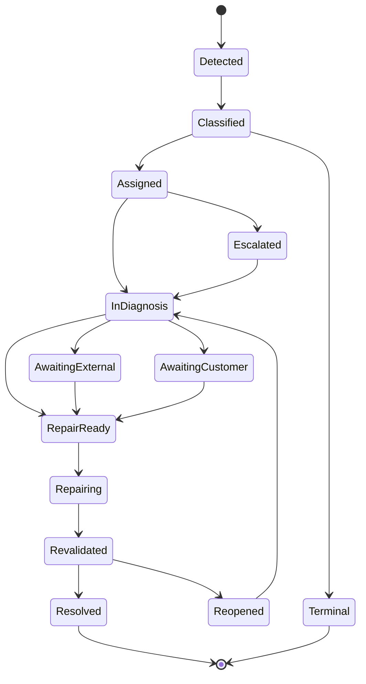
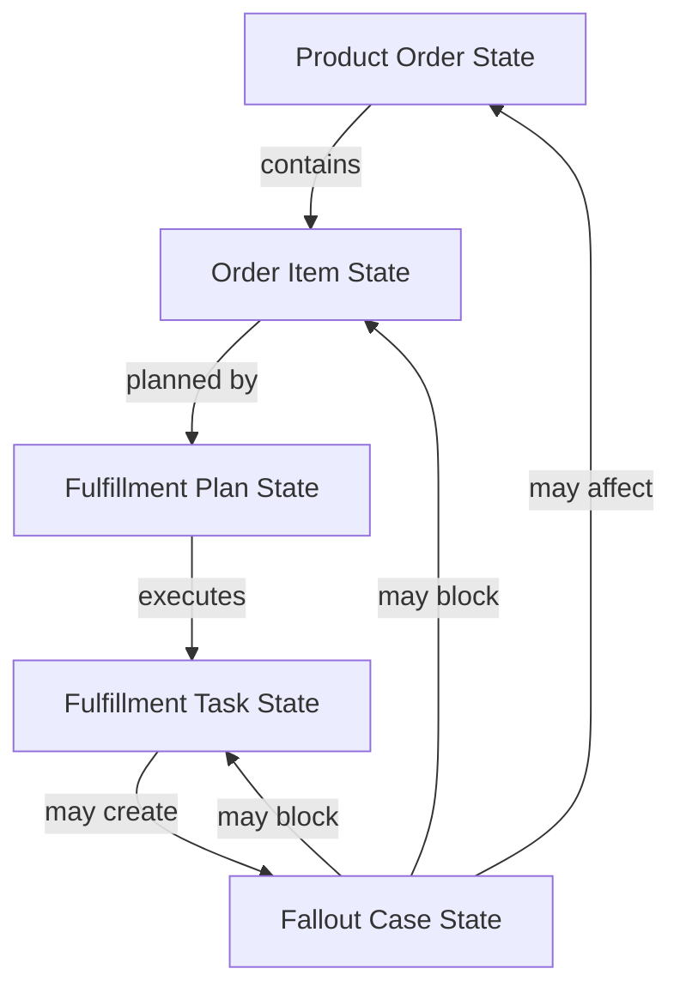
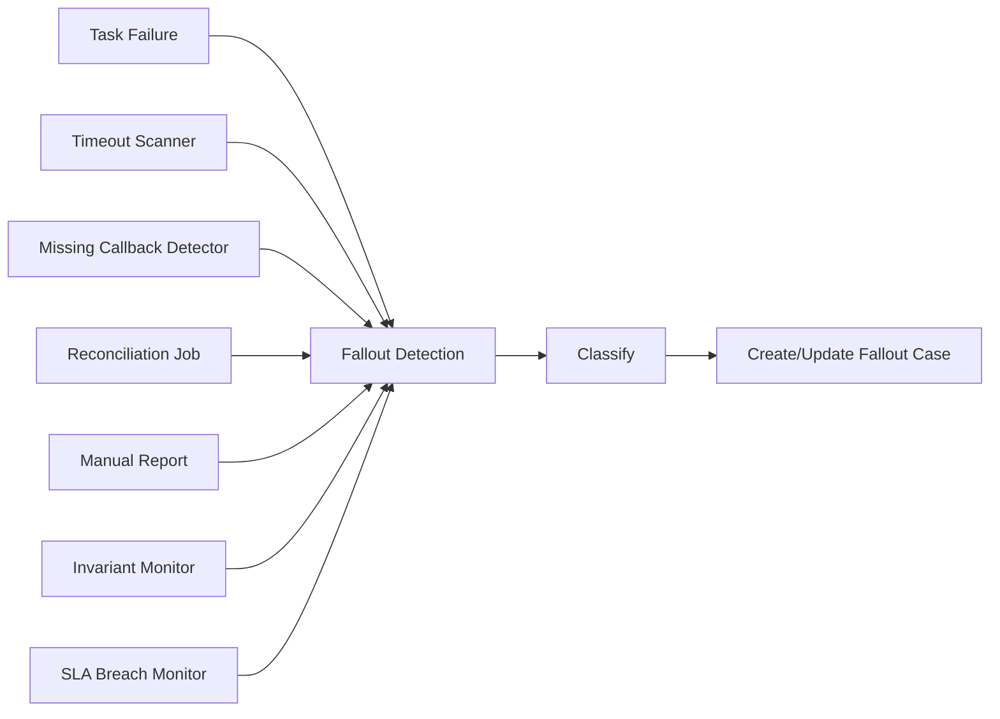
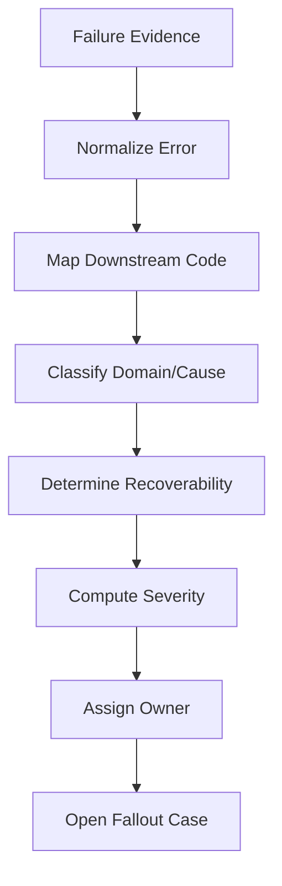
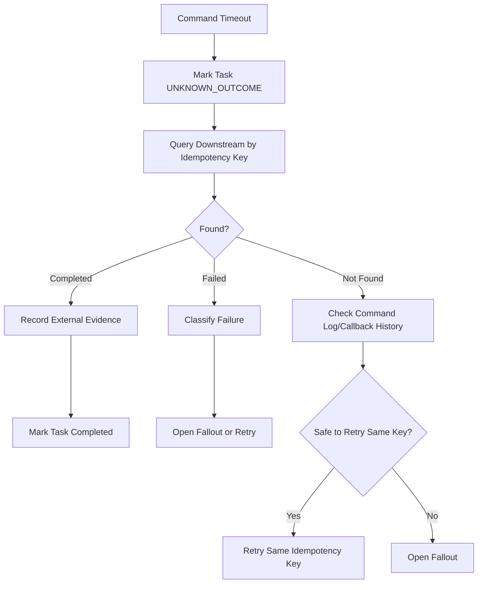
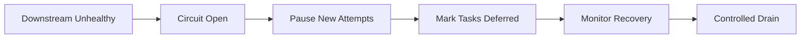
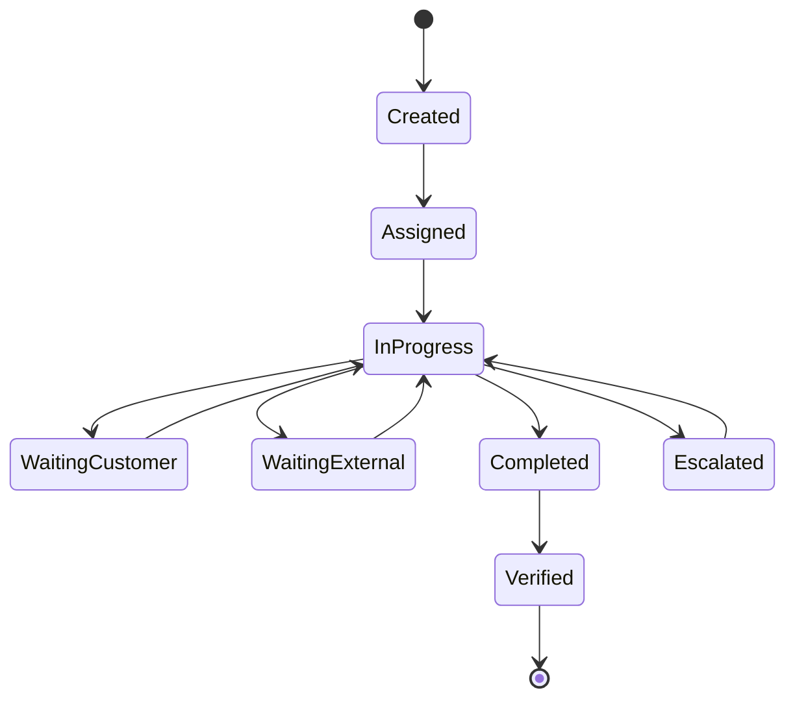
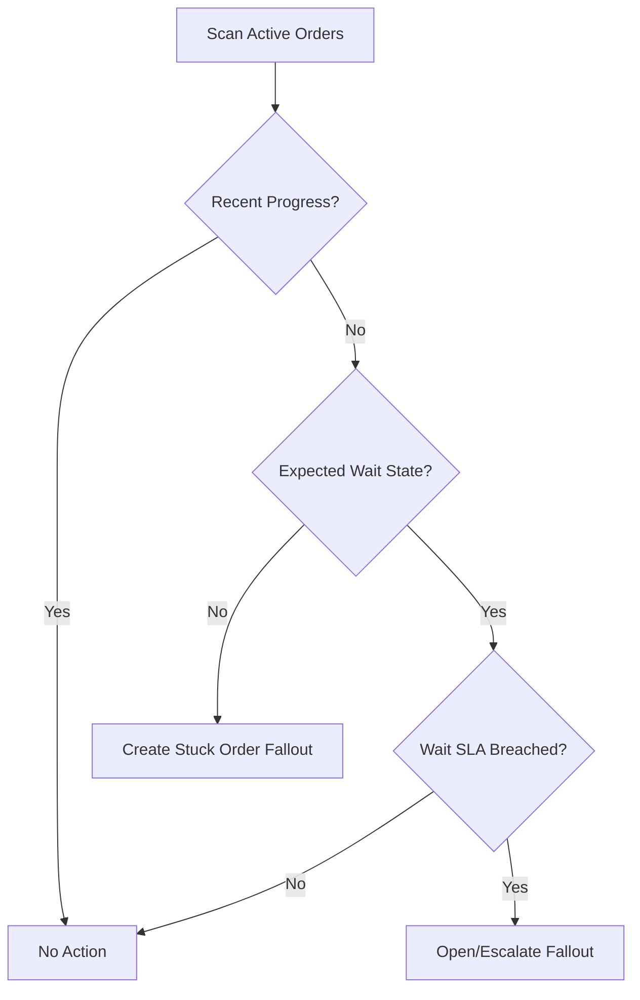
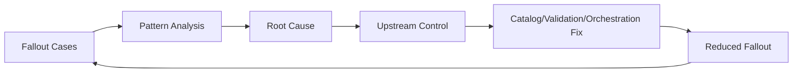
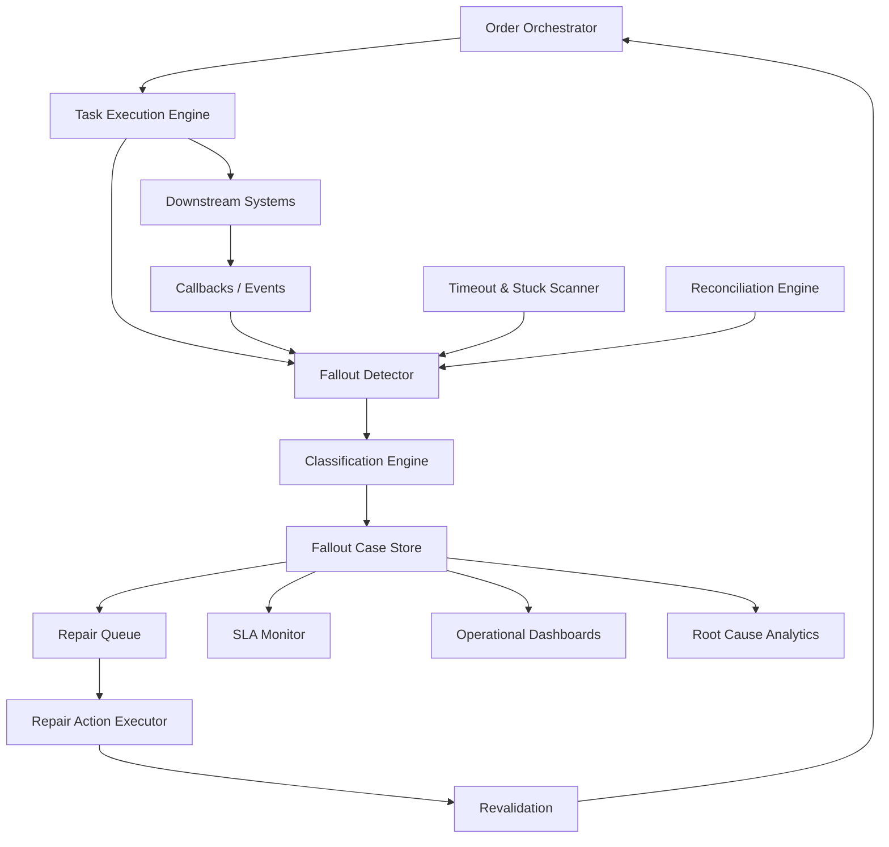

# Part 023 — Fallout Management, Exception Handling, and Recovery

In an enterprise OMS, failure is not an edge case.

It is the normal state of a system that depends on many other systems.

A customer order may pass validation, pass feasibility, decompose correctly, and still fail during fulfillment because:

- inventory changed,
- a downstream API timed out,
- a provisioning system accepted a request but never sent completion,
- a partner system rejected a payload,
- billing account creation failed,
- a delivery appointment was missed,
- customer data was incomplete,
- an address was normalized differently downstream,
- a manual team skipped a task,
- a retry duplicated an external action,
- or a rule/configuration version changed mid-execution.

Fallout management is the discipline of detecting, classifying, repairing, and learning from these failures without corrupting the order, hiding the truth, or breaking auditability.

TM Forum explicitly treats order fallout as a cross-order execution concern across product, service, and resource orders. That is the right mental model: fallout is not just an exception thrown by one service. It is a managed business-operational state.

> Goal part ini: kamu mampu mendesain fallout management dan recovery model untuk OMS enterprise-grade yang observable, repairable, auditable, and safe under partial failure.

---

## 1. Kaufman Target Performance

Setelah bagian ini, kamu harus bisa:

1. Membedakan technical exception, business exception, fallout, and operational blockage.
2. Mendesain fallout taxonomy yang bisa dipakai engineering, ops, support, and business.
3. Mendesain repair queue yang aman, auditable, and role-aware.
4. Membuat recovery strategy untuk timeout, duplicate, stale state, rejected downstream command, and unknown outcome.
5. Menentukan kapan retry, compensate, wait, repair manually, cancel, or escalate.
6. Mendesain stuck-order detection and SLA breach model.
7. Membuat feedback loop dari fallout ke catalog, validation, decomposition, orchestration, and process improvement.

Kaufman framing:

```text
Skill besar:
Design enterprise-grade order fallout management.

Sub-skill:
1. Classify failure precisely.
2. Preserve immutable execution history.
3. Separate detection, diagnosis, repair, and prevention.
4. Make repair actions constrained and auditable.
5. Recover safely from partial completion.
6. Operate with SLA and ownership clarity.
7. Feed learnings back into upstream design.
```

Prinsip utamanya sederhana:

> A failed order must never become an invisible order.

---

## 2. The Mental Model: Exception Is an Event, Fallout Is a Managed State

A common mistake is treating fallout as a Java exception, HTTP error, or retry condition.

That is too shallow.

An exception is evidence that something failed.

Fallout is a state in the business execution lifecycle where the platform cannot safely progress without intervention, correction, compensation, external completion, or explicit business decision.

```text
Exception:
A local failure signal.

Fallout:
A durable, classified, assigned, observable, and auditable execution blockage.
```

Examples:

| Situation | Exception? | Fallout? | Why |
|---|---:|---:|---|
| HTTP 503 from provisioning, retry succeeds | Yes | No | transient failure resolved automatically |
| HTTP 400 because payload missing required field | Yes | Yes | order cannot progress without correction |
| downstream accepts request but no callback arrives | Maybe | Yes | unknown outcome blocks safe progress |
| manual installer misses appointment | No technical exception | Yes | business execution blocked |
| discount approval missing | Maybe | Yes, if order submitted | governance violation blocks fulfillment |
| duplicate callback received | No | Usually no | should be idempotently ignored |
| duplicate fulfillment command sent | Maybe | Critical fallout | possible customer/resource damage |

A mature OMS does not ask: “Did the call throw?”

It asks:

1. Can the order safely continue?
2. Is the external world consistent with the order record?
3. Is the failure transient, repairable, compensatable, or terminal?
4. Who owns the next action?
5. What evidence must be preserved?

---

## 3. Fallout Lifecycle

A good fallout model has its own lifecycle, separate from order lifecycle and task lifecycle.



Important: fallout state must not be a string attached casually to order.

It should be modeled as a first-class entity:

```text
FalloutCase
- falloutCaseId
- orderId
- orderItemId?
- fulfillmentTaskId?
- correlationId
- classification
- severity
- ownerGroup
- currentState
- detectedAt
- lastTouchedAt
- slaDueAt
- customerImpact
- financialImpact
- repairActions[]
- evidenceRefs[]
- auditTrail[]
```

Why first-class?

Because one order can have multiple fallouts.

Example:

```text
Order O-1001
- Item 1: broadband activation
  - Fallout F-1: address rejected by network system
- Item 2: router shipment
  - Fallout F-2: warehouse out of stock
- Item 3: billing setup
  - blocked by Item 1
```

If fallout is only a single `order.status = FAILED`, operations become blind.

---

## 4. Order, Task, and Fallout State Must Be Separate

Never collapse these into one state field.



Example state separation:

| Layer | Example State | Meaning |
|---|---|---|
| Product order | In Progress | order is actively executing |
| Order item | Blocked | this item cannot progress |
| Fulfillment task | Failed | specific task failed |
| Fallout case | Assigned | case is owned by repair team |
| SLA | Breached | committed resolution time exceeded |
| Customer comms | Notified | customer has been informed |

Bad design:

```text
order.status = FAILED
```

Better design:

```text
order.status = IN_PROGRESS
orderItem.status = BLOCKED
fulfillmentTask.status = FAILED_REPAIRABLE
falloutCase.status = ASSIGNED
falloutCase.severity = HIGH
falloutCase.ownerGroup = NETWORK_OPERATIONS
```

Why it matters:

- an order may still be partially progressing,
- a failure may be repairable,
- multiple teams may own different issues,
- customer-visible state may be different from internal diagnostic state,
- and cancellation eligibility depends on execution position.

---

## 5. Fallout Taxonomy

A taxonomy is not bureaucracy. It is the operating language of recovery.

Without taxonomy, every failed order becomes bespoke investigation.

A strong taxonomy covers at least:

1. failure domain,
2. failure cause,
3. recoverability,
4. impact,
5. ownership,
6. automation eligibility,
7. recurrence pattern.

### 5.1 Failure Domain

| Domain | Meaning | Example |
|---|---|---|
| Data | required data invalid/missing | bad address, missing tax ID |
| Configuration | invalid product/service configuration | option combination unsupported downstream |
| Catalog | catalog mismatch | order references retired offer |
| Pricing | commercial mismatch | billing rejects charge component |
| Eligibility | qualification changed | customer no longer eligible |
| Inventory | capacity/resource unavailable | router out of stock |
| Provisioning | activation failed | network service rejected request |
| Billing | account/subscription setup failed | invoice profile missing |
| Partner | external partner failed | shipping provider error |
| Manual Ops | human workflow blocked | installation team no-show |
| Platform | OMS/platform fault | orchestration bug, event loss |

### 5.2 Recoverability

| Recoverability | Meaning | Example Action |
|---|---|---|
| Transient | likely resolves with retry | retry with backoff |
| Repairable | data/process can be corrected | repair payload and resume |
| Compensatable | must undo previous action | cancel created resource |
| Terminal | cannot continue | cancel/reject order item |
| Unknown outcome | external state unknown | reconcile before continuing |
| Policy exception | needs business decision | escalate to approval/deal desk |

The most dangerous state is **unknown outcome**.

Example:

```text
OMS sends activateService(commandId=CMD-9)
Provisioning times out.
OMS does not know whether service was activated.
```

Wrong response:

```text
Retry immediately with a new command id.
```

Better response:

```text
1. Query downstream by original idempotency key.
2. Check callback/event history.
3. Reconcile resource inventory.
4. Resume only when external truth is known.
```

### 5.3 Impact

| Impact Type | Example |
|---|---|
| Customer impact | customer cannot use service |
| Revenue impact | billing cannot start |
| Cost impact | duplicate shipment/provisioning |
| Compliance impact | regulated product activated without evidence |
| Operational impact | manual queue overloaded |
| Data quality impact | product inventory drift |

Severity should be derived, not manually guessed.

Example severity formula:

```text
severity = f(
  customerImpact,
  revenueImpact,
  regulatoryImpact,
  orderValue,
  customerSegment,
  slaRemaining,
  recurrencePattern,
  downstreamBlastRadius
)
```

---

## 6. Detection Model

Fallout can be detected by multiple mechanisms.



### 6.1 Direct Detection

A task fails with a known error.

Example:

```json
{
  "taskId": "TASK-123",
  "downstream": "billing",
  "operation": "createSubscription",
  "errorCode": "BILLING_ACCOUNT_NOT_FOUND",
  "retryable": false
}
```

This is easy.

### 6.2 Timeout Detection

A task remains in `WAITING_CALLBACK` too long.

Example:

```text
activation task entered WAITING_CALLBACK at 10:00
expected callback within 15 minutes
no callback by 10:20
create fallout: MISSING_CALLBACK
```

Timeouts need context.

A logistics task may wait days. A payment authorization may wait seconds. A network activation may wait minutes.

So timeout policy must be per task type:

```text
TaskTypePolicy
- taskType
- expectedDuration
- warningDuration
- breachDuration
- timeoutAction
- ownerGroup
```

### 6.3 Invariant-Based Detection

Some failures are not reported by any system.

Detect them by invariant monitoring.

Examples:

```text
Invariant:
If order item is COMPLETED, all mandatory fulfillment tasks must be COMPLETED or SKIPPED_WITH_REASON.

Invariant:
If billing subscription is ACTIVE, product inventory must contain corresponding active product instance.

Invariant:
If shipment is DELIVERED, customer order must not remain WAITING_SHIPMENT.

Invariant:
If service is activated, entitlement must exist before customer notification.
```

Invariant monitors catch silent corruption.

### 6.4 Reconciliation-Based Detection

Reconciliation compares OMS truth with downstream truth.

```text
OMS says: activation pending.
Provisioning says: service active.
Product inventory says: no asset.
Billing says: no subscription.
```

This is not just reporting. It is operational control.

A mature platform runs reconciliation as a normal capability, not a one-off incident script.

---

## 7. Classification Pipeline

Classification should be automatic where possible, but editable under control.



Example mapping table:

| Downstream | Error Code | Domain | Recoverability | Owner |
|---|---|---|---|---|
| Billing | ACCOUNT_NOT_FOUND | Billing/Data | Repairable | Billing Ops |
| Network | ADDRESS_NOT_SERVICEABLE | Feasibility | Terminal or Repairable | Network Ops |
| Warehouse | SKU_OUT_OF_STOCK | Inventory | Repairable/Wait | Supply Chain |
| Provisioning | DUPLICATE_REQUEST | Idempotency | Unknown Outcome | OMS Engineering |
| Partner | 500 | Partner | Transient | Partner Ops |
| OMS | SERIALIZATION_ERROR | Platform | Repairable | Engineering |

Keep two forms of code:

```text
rawErrorCode:
  the original downstream error, preserved exactly.

normalizedFailureCode:
  platform-level classification used for routing and reporting.
```

Do not throw away raw downstream evidence.

---

## 8. Repair Queue Design

A repair queue is not just a table of failed orders.

It is an operational workbench with controlled mutation power.

### 8.1 Repair Queue Views

Different users need different views.

| User | View |
|---|---|
| Support agent | customer-impacting fallout with customer-friendly summary |
| Fulfillment ops | task-level fallout by owner group and SLA |
| Engineering | technical error, payload, correlation, replay data |
| Finance ops | billing/subscription fallout and revenue impact |
| Manager | queue aging, breach risk, throughput, recurrence |
| Auditor | evidence, actions, approvals, state history |

### 8.2 Repair Queue Fields

Minimum useful fields:

```text
- fallout case id
- order id
- customer id/account id
- affected order item
- failed task
- owner group
- current assignee
- severity
- normalized failure code
- raw failure evidence
- detected at
- SLA due at
- retry count
- last action
- next recommended action
- customer impact
- financial impact
- repair permissions
```

### 8.3 Repair Actions

Repair actions must be constrained.

Bad:

```text
Ops user edits arbitrary JSON payload and clicks resume.
```

Better:

```text
Repair action catalog:
- update service address
- select replacement inventory item
- re-run feasibility check
- resend provisioning command using same idempotency key
- mark external task completed with evidence
- compensate previous task
- cancel affected order item
- request customer clarification
- escalate to engineering
```

Each action has:

```text
RepairActionDefinition
- actionCode
- allowedRoles
- requiredInputSchema
- preconditions
- validationRules
- approvalRequired?
- executionMode: automatic/manual/hybrid
- auditTemplate
- riskLevel
```

A repair action is a domain command, not a database update.

---

## 9. Safe Repair Principles

### Principle 1: Repair Must Be Auditable

Every repair must record:

```text
- who performed it
- when
- what changed
- why
- evidence used
- old value
- new value
- approval reference if required
- downstream commands triggered
```

### Principle 2: Repair Must Revalidate

A repair cannot simply resume execution.

It must re-run relevant validation.

Example:

```text
Address repair:
1. update candidate address
2. run address normalization
3. run serviceability check
4. run tax jurisdiction check if pricing/billing depends on address
5. update fulfillment payload snapshot
6. resume blocked task
```

### Principle 3: Repair Must Respect Snapshots

Do not silently reprice or reconfigure during repair.

If a repair changes commercial meaning, it may need quote amendment, re-approval, or customer acceptance.

Example:

```text
Repairing router SKU out of stock by selecting a premium router may change price.
That is not a simple repair.
It is a commercial change.
```

### Principle 4: Repair Must Be Idempotent

Repair actions can also fail.

So they need command identity.

```text
repairActionId = RA-123
commandId = CMD-REPAIR-RA-123
idempotencyKey = orderId + taskId + repairActionId
```

### Principle 5: Repair Must Not Hide Fallout

Resolved fallout should remain searchable.

```text
Fallout status: Resolved
Resolution type: DataCorrected
Resolution evidence: address verification result
Resolved by: ops-user-17
Resolved at: timestamp
```

Do not delete resolved fallout cases.

---

## 10. Recovery Strategy Matrix

Recovery should be driven by state and risk, not human intuition.

| Failure Mode | Safe Default | Dangerous Default |
|---|---|---|
| transient HTTP 503 | retry with backoff | immediate infinite retry |
| validation reject | create repair case | retry same payload |
| missing callback | reconcile external state | send duplicate command blindly |
| duplicate callback | idempotently ignore | regress task state |
| partial downstream completion | reconcile + resume/compensate | mark whole order failed |
| billing mismatch | block billing handoff | manually edit invoice downstream |
| stale catalog mapping | stop and classify | pick latest catalog automatically |
| manual task overdue | escalate | leave invisible |
| customer data missing | request clarification | fabricate data |
| duplicate shipment risk | freeze task until verified | resend shipment request |

The key question:

```text
Can we prove what happened externally?
```

If not, the first recovery action is reconciliation, not retry.

---

## 11. Unknown Outcome Pattern

Unknown outcome is the most important recovery pattern in distributed OMS.

### 11.1 Scenario

```text
OMS sends command to provisioning.
Connection times out.
Provisioning may or may not have activated the service.
```

### 11.2 Wrong Design

```text
catch TimeoutException:
  retry(command with new id)
```

Risk:

- duplicate service,
- duplicate cost,
- inconsistent inventory,
- customer receives two activations,
- billing may charge twice.

### 11.3 Better Design



### 11.4 Invariant

```text
An operation with unknown external outcome must not be retried with a new business identity.
```

---

## 12. Retry Strategy

Retry is useful only when controlled.

### 12.1 Retry Eligibility

Retry only if:

1. the failure is transient,
2. the command is idempotent,
3. downstream supports duplicate-safe handling,
4. retry budget is not exceeded,
5. no human correction is required,
6. external outcome is known or retry uses same idempotency key.

### 12.2 Retry Policy

```text
RetryPolicy
- taskType
- retryableFailureCodes[]
- maxAttempts
- backoffStrategy
- jitter
- retryWindow
- circuitBreakerPolicy
- falloutOnExhaustion
```

Example:

```text
paymentAuthorization:
  maxAttempts: 2
  backoff: short
  falloutOnExhaustion: PAYMENT_REVIEW

networkActivation:
  maxAttempts: 3
  backoff: exponential
  onTimeout: UNKNOWN_OUTCOME_RECONCILIATION

shipmentRequest:
  maxAttempts: 1
  onTimeout: RECONCILE_SHIPMENT_BY_REFERENCE
```

### 12.3 Retry Storm Prevention

A downstream outage can create thousands of failing tasks.

Use:

- circuit breaker,
- retry budget,
- queue backpressure,
- global downstream health state,
- task deferral,
- incident-level suppression,
- and batch recovery once downstream is healthy.



---

## 13. Compensation Strategy

Not all failures are repaired by moving forward.

Sometimes previous actions must be undone.

Example:

```text
1. Create billing subscription: success
2. Activate service: failure terminal
3. Ship hardware: success
```

Possible compensation:

- cancel billing subscription,
- reverse charges,
- deactivate partial service,
- return/cancel shipment,
- notify customer,
- mark product inventory as not active,
- create manual follow-up.

### 13.1 Compensation Is Not Rollback

Database rollback returns local state to an earlier point.

Compensation executes new business actions to counteract already-visible external effects.

```text
Rollback:
Undo local uncommitted transaction.

Compensation:
Create new domain action that reverses or neutralizes a committed external effect.
```

### 13.2 Compensation Metadata

```text
CompensationAction
- compensationId
- originalTaskId
- targetSystem
- compensationCommand
- riskLevel
- preconditions
- evidenceRequired
- status
- resultEvidence
```

### 13.3 Compensation Invariant

```text
If a task creates external side effects, the orchestration plan must know whether and how it can be compensated.
```

---

## 14. Manual Intervention Model

Manual repair is unavoidable in enterprise systems.

But uncontrolled manual repair is dangerous.

### 14.1 Good Manual Intervention

Good manual intervention is:

- explicitly assigned,
- constrained by role,
- guided by recommended action,
- backed by evidence,
- validated before resume,
- logged immutably,
- and measured for recurrence.

### 14.2 Bad Manual Intervention

Bad manual intervention is:

- direct database updates,
- spreadsheet-based tracking,
- unclear owner,
- no SLA,
- no evidence,
- no customer impact classification,
- no relation to upstream defect,
- and no feedback loop.

### 14.3 Human Task State Machine



Human task completion should not automatically mean order progress.

It should trigger verification and revalidation.

---

## 15. Stuck Order Detection

A stuck order is an order that is not technically failed but is not making progress.

This is common and dangerous.

Examples:

```text
- order item has been IN_PROGRESS for 6 days with no task transition
- task is WAITING_CALLBACK beyond SLA
- fallout assigned but untouched for 48 hours
- order is blocked by dependency that already completed
- customer notification says delivery scheduled but appointment system has no appointment
```

### 15.1 Progress Invariant

Each active order should have one of these:

```text
- recently completed task
- active task waiting within expected duration
- open fallout case
- explicit customer wait state
- explicit external wait state
- scheduled future action
```

If none exists, it is stuck.

### 15.2 Stuck Order Scanner



### 15.3 Stuck Detection Data

```text
OrderProgressRecord
- orderId
- lastStateTransitionAt
- lastTaskCompletedAt
- activeTaskCount
- openFalloutCount
- waitingReason
- expectedNextActionAt
- customerCommittedDate
- slaDueAt
```

---

## 16. SLA and Escalation Model

Fallout without SLA becomes invisible backlog.

### 16.1 SLA Types

| SLA | Meaning |
|---|---|
| Detection SLA | time from failure to fallout case creation |
| Assignment SLA | time from case creation to owner assignment |
| First-touch SLA | time until human/system starts diagnosis |
| Resolution SLA | time until case resolved or terminally closed |
| Customer update SLA | time until customer/support receives update |
| Revenue recovery SLA | time until billing/revenue risk resolved |

### 16.2 Escalation Policy

```text
EscalationPolicy
- falloutType
- severity
- ownerGroup
- warningThreshold
- breachThreshold
- escalationGroup
- customerNotificationRequired
- managementNotificationRequired
```

### 16.3 Escalation Is Not Resolution

Escalation changes visibility and ownership priority.

It does not fix the underlying issue.

Track them separately.

---

## 17. Customer Communication Boundary

Not every internal fallout should be exposed to the customer.

But customer-impacting fallout must be communicable.

### 17.1 Internal vs External State

| Internal State | Customer Message |
|---|---|
| `TASK_FAILED_NETWORK_ADDRESS_REJECTED` | “We need to verify your service address.” |
| `WAITING_CALLBACK_TIMEOUT` | “Your activation is taking longer than expected.” |
| `BILLING_SUBSCRIPTION_CREATE_FAILED` | Usually hidden unless it affects service/billing |
| `WAREHOUSE_SKU_OUT_OF_STOCK` | “Your shipment is delayed.” |
| `UNKNOWN_OUTCOME` | “We are confirming your activation status.” |

### 17.2 Communication Invariant

```text
Customer-facing status must be truthful without exposing internal implementation details.
```

Do not show “failed” when operations can repair it.

Do not show “completed” when downstream state is unverified.

---

## 18. Data Correction vs Business Correction

Repair frequently requires correction.

But not all corrections are equal.

### 18.1 Data Correction

Corrects erroneous data without changing customer agreement.

Examples:

- normalize address format,
- add missing contact phone,
- fix downstream account mapping,
- correct spelling where legal identity is unchanged.

### 18.2 Business Correction

Changes the commercial/legal meaning of the order.

Examples:

- replacing product with a different priced product,
- changing contract term,
- changing billing start date materially,
- changing customer legal entity,
- removing a required regulatory attribute,
- altering discount or promotion.

Business correction may require:

- quote revision,
- re-approval,
- customer re-acceptance,
- contract amendment,
- or cancellation/reorder.

### 18.3 Correction Decision Rule

```text
If the correction changes what the customer bought, what they pay, what they receive, what they agreed to, or what must be legally evidenced, it is not a simple repair.
```

---

## 19. Fallout API Boundary

A fallout service should not expose arbitrary mutation endpoints.

Example command API:

```http
POST /fallout-cases
POST /fallout-cases/{id}/assign
POST /fallout-cases/{id}/diagnose
POST /fallout-cases/{id}/repair-actions/{actionCode}/execute
POST /fallout-cases/{id}/escalate
POST /fallout-cases/{id}/resolve
POST /fallout-cases/{id}/reopen
GET  /fallout-cases?orderId=&ownerGroup=&severity=&state=
GET  /fallout-cases/{id}/evidence
```

Important rules:

1. repair is command-based,
2. commands validate preconditions,
3. commands produce events,
4. events update read models,
5. sensitive payload is access-controlled,
6. evidence is immutable.

### 19.1 Example Repair Command

```json
{
  "repairActionId": "RA-2026-0001",
  "actionCode": "CORRECT_SERVICE_ADDRESS",
  "reasonCode": "CUSTOMER_CONFIRMED_ADDRESS",
  "input": {
    "normalizedAddressId": "ADDR-8812",
    "customerConfirmationRef": "CASE-9901"
  },
  "requestedBy": "ops-user-17"
}
```

### 19.2 Example Event

```json
{
  "eventType": "FalloutRepairActionCompleted",
  "falloutCaseId": "F-1001",
  "orderId": "O-777",
  "orderItemId": "OI-2",
  "actionCode": "CORRECT_SERVICE_ADDRESS",
  "result": "REVALIDATION_PASSED",
  "occurredAt": "2026-07-02T10:00:00+07:00"
}
```

---

## 20. Event Model

Useful fallout events:

```text
FalloutDetected
FalloutClassified
FalloutAssigned
FalloutSlaWarningRaised
FalloutSlaBreached
FalloutRepairActionRequested
FalloutRepairActionCompleted
FalloutRepairActionFailed
FalloutRevalidated
FalloutResolved
FalloutReopened
FalloutEscalated
OrderMarkedStuck
UnknownOutcomeDetected
ExternalStateReconciled
```

Do not use events only for notification.

Use them for:

- audit,
- reporting,
- SLA monitoring,
- read model updates,
- downstream remediation,
- and learning loops.

---

## 21. Observability for Fallout

Metrics:

```text
fallout.created.count by type/domain/severity
fallout.open.count by owner/severity/age
fallout.resolution.time p50/p95/p99
fallout.sla.breach.count
fallout.reopened.count
fallout.automated_recovery.rate
fallout.manual_repair.rate
fallout.retry_exhausted.count
fallout.unknown_outcome.count
fallout.customer_impacting.count
fallout.revenue_impact.amount
fallout.by_catalog_version
fallout.by_offer_id
fallout.by_downstream_system
```

Logs should include:

```text
orderId
orderItemId
fulfillmentTaskId
falloutCaseId
correlationId
causationId
downstreamSystem
rawErrorCode
normalizedFailureCode
repairActionId
```

Traces should show:

```text
quote -> order -> decomposition -> fulfillment plan -> task -> downstream command -> callback -> fallout -> repair -> resume
```

Operational dashboards:

1. open fallout by age,
2. breach risk,
3. fallout heatmap by downstream,
4. fallout heatmap by catalog version,
5. top recurring failure codes,
6. customer-impacting backlog,
7. revenue-blocking backlog,
8. unknown outcome queue,
9. manual repair throughput,
10. reopened fallout trend.

---

## 22. Feedback Loop: Fallout Is Product Intelligence

Fallout is not just operations waste. It is signal.

Recurring fallout tells you where your platform lies to itself.

Examples:

| Fallout Pattern | Upstream Fix |
|---|---|
| address rejected by provisioning | improve pre-order serviceability/normalization |
| billing account missing | strengthen order completeness validation |
| SKU out of stock after quote | add inventory reservation or ATP check |
| product mapping missing | improve catalog publish validation |
| stale approval after price change | approval fingerprint invalidation |
| duplicate activation | idempotency and unknown outcome handling |
| manual repair frequent | automate repair action or improve rule model |

A good OMS has a closed loop:



---

## 23. Root Cause Analysis Model

Do not stop at “downstream rejected order.”

Ask:

1. Why did OMS send a payload that downstream rejected?
2. Why did validation not catch it?
3. Why did catalog/decomposition allow it?
4. Why did test data not cover it?
5. Why did monitoring not detect it earlier?
6. Why did repair take that long?
7. Is this one order, one product, one region, one channel, or systemic?

Root cause categories:

```text
- catalog modeling defect
- pricing/promotion policy defect
- quote validation gap
- order validation gap
- decomposition rule defect
- downstream contract drift
- data quality defect
- integration reliability defect
- manual process defect
- customer-provided data issue
- operational capacity issue
- platform bug
```

Root cause should feed backlog with priority based on recurrence and impact.

---

## 24. Common Anti-Patterns

### Anti-Pattern 1: `FAILED` as Terminal State

Many failures are repairable.

A blunt `FAILED` state causes unnecessary cancellation and support confusion.

### Anti-Pattern 2: Direct Database Repair

Direct DB updates may fix one order and corrupt auditability for all orders.

### Anti-Pattern 3: Retry Everything

Retry without idempotency and outcome knowledge creates duplicate side effects.

### Anti-Pattern 4: No Raw Error Preservation

If raw downstream evidence is overwritten by normalized labels, diagnosis suffers.

### Anti-Pattern 5: No Fallout Ownership

A queue without ownership is a graveyard.

### Anti-Pattern 6: Hidden Manual Work

If manual teams solve problems outside OMS, the system cannot learn.

### Anti-Pattern 7: Repair Changes Commercial Meaning

Ops “fixes” that alter product/price/contract without approval create legal and financial risk.

### Anti-Pattern 8: No Reconciliation

If you cannot compare OMS truth with downstream truth, you cannot safely recover from unknown outcome.

---

## 25. Staff-Level Design Review Questions

Ask these in architecture review:

1. What types of fallout can occur for each fulfillment task?
2. Which failures are retryable, repairable, compensatable, terminal, or unknown?
3. How do we prevent duplicate fulfillment on timeout?
4. What is the idempotency key for every downstream command?
5. What is the repair action catalog?
6. Who owns each fallout category?
7. What SLA applies to each fallout type?
8. What customer-facing message is shown for each customer-impacting fallout?
9. Which repair actions require approval?
10. How do we distinguish data repair from commercial amendment?
11. How do we reconcile external state?
12. Can one order have multiple fallout cases?
13. Can partial fulfillment continue while one item is blocked?
14. How do we measure recurring fallout?
15. How does fallout feed catalog/validation/decomposition improvements?

---

## 26. Practice Drill

Design fallout handling for this scenario:

```text
Customer orders:
- Fiber internet
- Static IP add-on
- Wi-Fi router shipment
- Monthly subscription billing

Execution:
1. Quote accepted.
2. Order validated.
3. Decomposition creates:
   - create billing account
   - create subscription
   - reserve router
   - schedule installation
   - activate fiber service
   - activate static IP
4. Billing account succeeds.
5. Router reservation succeeds.
6. Installation scheduling succeeds.
7. Fiber activation times out.
8. Static IP activation is blocked by fiber activation.
9. Customer committed date is tomorrow.
```

Answer:

1. What fallout case is created?
2. What is the recoverability classification?
3. What should not be retried blindly?
4. What reconciliation is required?
5. Which tasks are blocked?
6. What is customer-facing status?
7. What SLA applies?
8. What repair actions are allowed?
9. What compensation may be needed if fiber activation is terminal?
10. What upstream control could reduce recurrence?

---

## 27. Reference Architecture



---

## 28. What Good Looks Like

A mature fallout management capability has these properties:

1. every blocked order is visible,
2. every fallout has owner and SLA,
3. failures are classified consistently,
4. repair is command-based and auditable,
5. unknown outcomes are reconciled before retry,
6. customer-visible status is truthful,
7. commercial changes are not hidden as repairs,
8. recovery actions are idempotent,
9. recurring fallout drives upstream fixes,
10. operations can repair without bypassing governance.

The highest bar:

```text
The platform can fail loudly, recover safely, explain what happened, and improve from it.
```

---

## 29. Summary

Fallout management is not an afterthought.

It is the operational safety system of enterprise OMS.

The core lessons:

1. Exception is a signal; fallout is a managed state.
2. Order, task, and fallout states must be separate.
3. Unknown outcome is more dangerous than known failure.
4. Repair must be constrained, validated, auditable, and idempotent.
5. Manual intervention is acceptable only when governed.
6. Stuck orders need proactive detection.
7. SLA and ownership turn failures into operational work.
8. Customer-facing truth must be accurate but not overly technical.
9. Fallout patterns should improve catalog, validation, decomposition, and orchestration.
10. A mature OMS treats recovery as a first-class product capability.

In the next part, we move from recovery to mutation: change orders, amendments, cancellations, and in-flight order modifications.

That is where the system must decide whether to alter, compensate, split, supersede, or reject changes to a moving order.

---

## References

- TM Forum, **TMFS011 Use Case: Order Fallout Management v5.0.2**.
- TM Forum, **TMF622 Product Ordering Management API v5.0**.
- TM Forum, **TMF641 Service Ordering Management API**.
- TM Forum, **Product Order Delivery Orchestration and Management component guidance**.
