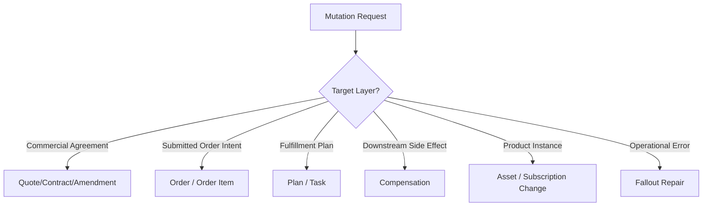
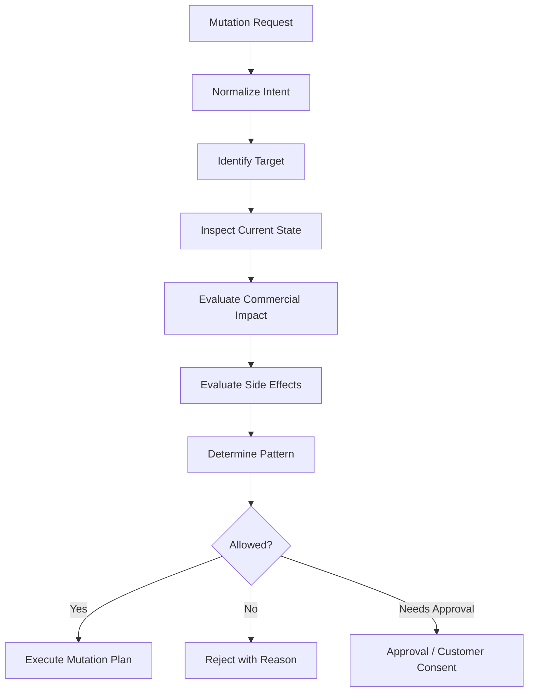
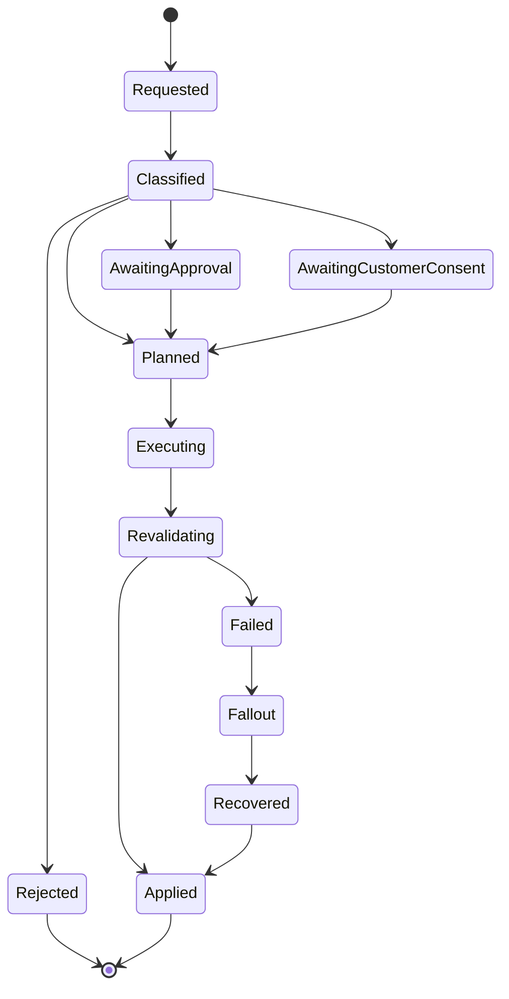
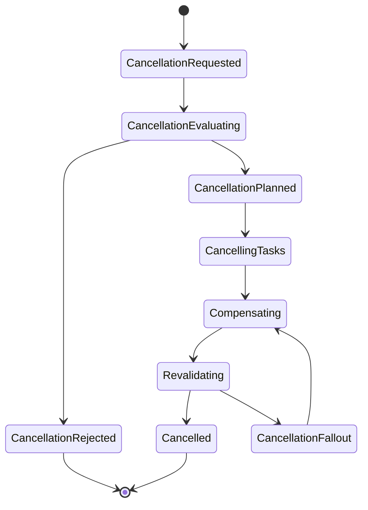
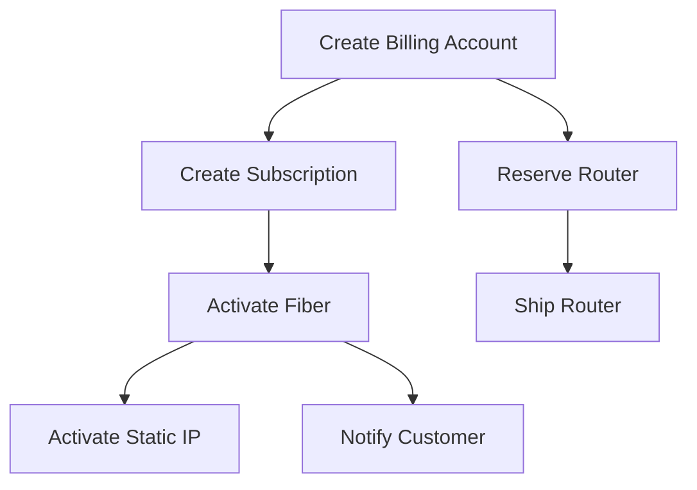
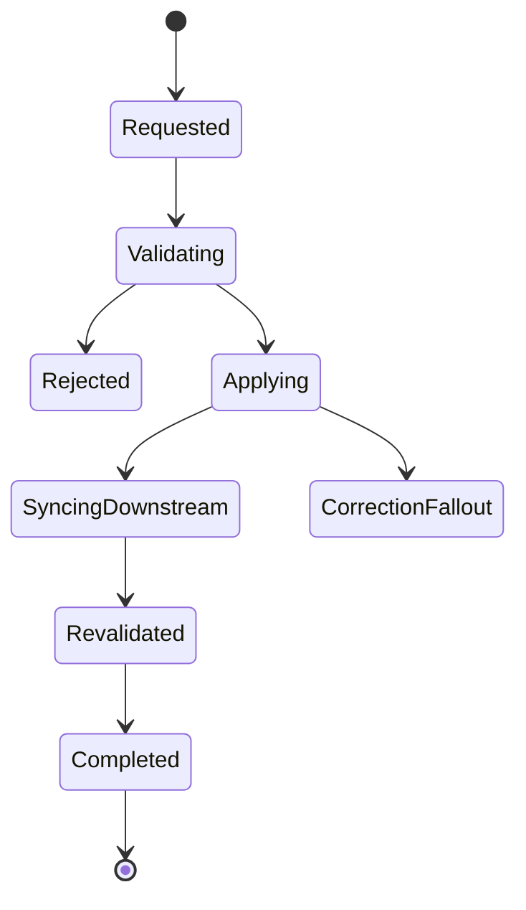
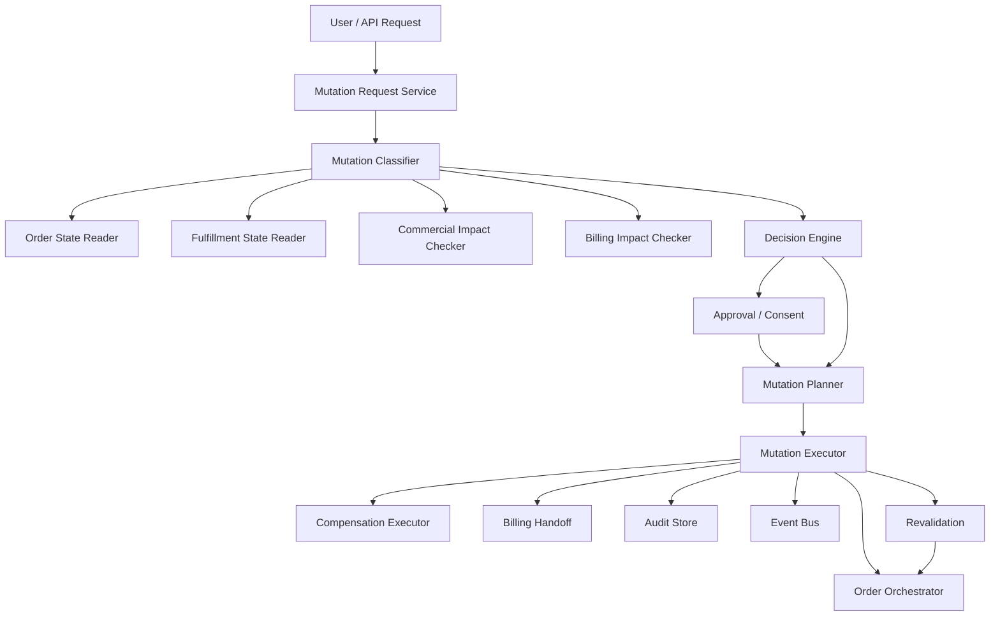

# Part 024 — Change Order, Amendment, Cancellation, and In-Flight Mutation

An enterprise OMS is not complete if it only supports happy-path order creation.

Real customers change their minds. Sales teams correct mistakes. Operations discovers infeasibility. Regulators require additional data. Inventory runs out. A partner misses a delivery window. Finance blocks an account. A customer asks to cancel after some tasks already succeeded.

The hard question is not “can we update an order row?”

The hard question is:

> Can we safely alter customer intent after execution has started, without losing auditability, violating commercial agreement, duplicating side effects, or corrupting downstream systems?

That is the domain of change order, amendment, cancellation, and in-flight mutation.

> Goal part ini: kamu mampu mendesain mutation model untuk OMS enterprise-grade: when to modify, when to cancel, when to amend, when to supersede, when to compensate, and when to refuse.

---

## 1. Kaufman Target Performance

Setelah bagian ini, kamu harus bisa:

1. Membedakan pre-submit edit, quote revision, order correction, change order, amendment, cancellation, and compensation.
2. Mendesain mutation policy berdasarkan order state, task state, fulfillment side effects, and commercial impact.
3. Menentukan kapan in-flight order boleh dimodifikasi dan kapan harus dibuat order baru.
4. Mendesain dependency-aware cancellation.
5. Menjaga immutable history sambil tetap memungkinkan operational repair.
6. Mencegah stale mutation, duplicate cancellation, and illegal commercial change.
7. Mendesain API/event/state machine untuk mutation enterprise-grade.

Kaufman framing:

```text
Skill besar:
Design safe order mutation in enterprise OMS.

Sub-skill:
1. Classify mutation intent.
2. Inspect execution point.
3. Evaluate commercial/legal impact.
4. Decide modify vs amend vs cancel vs compensate.
5. Preserve immutable order history.
6. Revalidate and re-orchestrate safely.
7. Communicate state truthfully.
```

The invariant:

```text
An order mutation is not a database update. It is a new business decision applied to an already-evidenced lifecycle.
```

---

## 2. Mutation Vocabulary

Precise vocabulary prevents bad architecture.

| Term | Meaning | Example |
|---|---|---|
| Draft edit | change before quote/order commitment | sales rep edits quantity before submit |
| Quote revision | new version of quote before acceptance or after rejection | change discount and reapprove |
| Order correction | fix non-commercial data error | correct contact phone |
| In-flight mutation | alter submitted order before completion | change delivery appointment |
| Cancellation | stop order/order item execution | customer cancels router shipment |
| Compensation | reverse already-completed side effect | deactivate service, cancel subscription |
| Change order | new order that changes an existing asset/subscription | upgrade plan, add feature |
| Amendment | contractual/commercial change to existing agreement | extend term, change price, add line |
| Supersession | replace previous order/quote with new one | cancel old order and create replacement |
| Fallout repair | guided fix to resume blocked execution | correct service address after rejection |

Common mistake:

```text
Treat all of the above as PATCH /orders/{id}
```

That is not enterprise-safe.

---

## 3. The Core Decision: What Is Being Mutated?

A mutation may target different layers.



Examples:

| Request | Target Layer | Likely Pattern |
|---|---|---|
| customer changes product before accepting quote | quote | quote revision |
| customer changes delivery date after submit | fulfillment plan | in-flight mutation |
| sales changes discount after acceptance | commercial agreement | amendment/re-approval |
| ops fixes typo in contact name | order data | correction |
| customer cancels service after activation | asset/subscription | change order/termination |
| order cannot be fulfilled due to no serviceability | order item | cancellation/terminal fallout |
| router already shipped but customer cancels | downstream side effect | compensation/return process |

Design starts by asking: which layer owns the truth?

---

## 4. Execution Point Determines Mutation Safety

The same request may be safe or unsafe depending on execution progress.

Example request:

```text
Cancel router shipment.
```

| Execution Point | Safe Action |
|---|---|
| shipment task not started | cancel task |
| shipment reserved but not picked | release reservation |
| shipment picked but not dispatched | warehouse cancel if supported |
| shipment dispatched | initiate return process |
| shipment delivered | create return/RMA/change order |

Therefore mutation policy must inspect execution state.

```text
MutationSafety = f(
  orderState,
  orderItemState,
  taskStates,
  sideEffects,
  compensationCapability,
  commercialImpact,
  customerConsent,
  regulatoryImpact
)
```

---

## 5. Immutable History with Mutable Intent

Enterprise systems need both:

1. history that never changes,
2. operational ability to alter future execution.

The solution is not to mutate old events.

The solution is to append new intent.

```text
Original order:
O-1001 submitted at T1.

Mutation:
M-2001 requested at T2: cancel order item OI-2.

Result:
O-1001 remains historically true.
OI-2 receives cancellation lifecycle.
New events explain why and how.
```

### 5.1 Event-Sourced Mental Model Without Requiring Event Sourcing

Even if your database is relational, think in append-only business facts.

```text
OrderSubmitted
OrderItemAccepted
FulfillmentTaskStarted
MutationRequested
MutationApproved
OrderItemCancellationRequested
ShipmentCancelCommandSent
ShipmentCancellationConfirmed
OrderItemCancelled
```

Current state is derived from accumulated facts.

Do not overwrite the past.

### 5.2 Correction vs Historical Rewrite

Bad:

```sql
UPDATE order_item SET product_id = 'NEW_PRODUCT' WHERE id = 'OI-1';
```

Better:

```text
OrderCorrectionRequested
CorrectionApproved
OrderItemCorrected
CorrectionEvidenceAttached
```

Even if implemented with database updates, preserve audit facts.

---

## 6. Mutation Classification

A mutation request should be classified before execution.



Classification output:

```text
MutationDecision
- mutationId
- targetType
- targetId
- mutationType
- commercialImpact
- operationalImpact
- sideEffectImpact
- approvalRequired
- customerConsentRequired
- allowedActions
- blockedActions
- reasonCodes
- revalidationRequired
- compensationRequired
```

---

## 7. Mutation Policy Matrix

| Requested Change | Draft Quote | Accepted Quote | Submitted Order | In Fulfillment | Completed Asset |
|---|---|---|---|---|---|
| change quantity | edit quote | quote revision/reaccept | maybe cancel/reorder item | depends on side effects | change order |
| change discount | edit quote | reapproval/reaccept | usually amendment | amendment + billing impact | amendment/change order |
| change install date | not applicable | maybe quote metadata | allowed if task not locked | reschedule if possible | service appointment change |
| cancel item | remove line | quote revision/reaccept | cancel item | cancellation + compensation | termination/change order |
| change address | edit quote | revalidate/reaccept if material | correction if non-commercial | repair/replan if not activated | move order/change order |
| replace hardware | edit config | quote revision | mutate if not shipped | cancel/return/ship replacement | return/exchange/change order |
| change legal entity | quote rewrite | reaccept/contract update | usually not allowed | usually cancel/reorder | contract/account amendment |

The matrix should be codified as policy, not tribal knowledge.

---

## 8. In-Flight Mutation State Machine



Mutation itself deserves state.

Do not hide mutation progress inside order status.

---

## 9. Change Order vs In-Flight Mutation

This distinction matters.

### 9.1 In-Flight Mutation

Alters an order that has not reached stable completion.

Examples:

- reschedule delivery,
- cancel order item not yet fulfilled,
- correct shipping address before dispatch,
- swap inventory before reservation,
- add missing data to resume fulfillment.

### 9.2 Change Order

Creates new intent against existing asset/subscription/product instance.

Examples:

- upgrade bandwidth,
- add seat licenses,
- downgrade subscription,
- suspend service,
- resume service,
- terminate product,
- move service to new address.

### 9.3 Decision Rule

```text
If the target is an active/stable product instance, use change order.
If the target is a submitted but incomplete execution intent, use in-flight mutation.
If the target changes the original commercial agreement, use amendment/revision/approval.
```

---

## 10. Amendment Boundary

An amendment changes commercial/legal agreement.

It is not simply “updating an order.”

Examples:

```text
- price changes
- contract term changes
- billing frequency changes
- service commitment changes
- customer legal entity changes
- cancellation rights change
- SLA terms change
- product substitution with different legal/commercial terms
```

Amendment may require:

- new quote version,
- approval,
- customer acceptance,
- contract document,
- billing schedule adjustment,
- revenue recognition update,
- legal clause update,
- audit evidence.

### 10.1 Amendment Invariant

```text
A mutation that changes customer obligation, vendor obligation, price, term, product entitlement, or legal evidence must pass through commercial governance.
```

---

## 11. Cancellation Semantics

Cancellation is not one thing.

### 11.1 Cancellation Types

| Type | Meaning |
|---|---|
| Full order cancellation | cancel entire order |
| Order item cancellation | cancel one line/item |
| Task cancellation | cancel a fulfillment task |
| Requested cancellation | customer/business asks to cancel |
| Accepted cancellation | OMS determines cancellation is allowed |
| Effective cancellation | downstream side effects are stopped/compensated |
| Terminal cancellation | no further progress possible |
| Administrative cancellation | internal correction, usually restricted |

### 11.2 Cancellation Is a Process



A product order should not instantly jump from `IN_PROGRESS` to `CANCELLED` if external side effects still exist.

---

## 12. Dependency-Aware Cancellation

Cancellation must respect task and item dependencies.



If customer cancels static IP only:

```text
Cancel D only.
Keep fiber, billing, router.
```

If customer cancels fiber:

```text
Cancel/compensate C.
Cancel D because D depends on C.
Evaluate B because subscription may include fiber billing.
Evaluate F because router may not be needed.
```

### 12.1 Cancellation Impact Graph

Build a cancellation impact graph:

```text
CancellationImpact
- targetOrderItem
- dependentOrderItems
- startedTasks
- completedTasks
- irreversibleTasks
- compensatableTasks
- billingImpact
- assetImpact
- customerImpact
- requiredApprovals
```

### 12.2 Cancellation Rule

```text
You cannot cancel a parent fulfillment dependency without evaluating all dependent child tasks and commercial consequences.
```

---

## 13. Irreversible and Semi-Reversible Side Effects

Not every task can be undone.

| Side Effect | Reversibility |
|---|---|
| local validation | reversible/no side effect |
| reservation | usually reversible |
| billing account creation | often reversible or harmless |
| subscription activation | reversible with billing consequences |
| physical shipment dispatched | semi-reversible through return |
| installation completed | semi-reversible, may require truck roll |
| number porting | hard/regulated reversal |
| domain registration | often irreversible or time-bound |
| legal contract execution | requires amendment/termination |

Orchestration metadata should include reversibility:

```text
TaskDefinition
- taskType
- sideEffectType
- reversible: yes/no/partial
- compensationAction
- cancellationCutoffState
- customerNotificationRequired
- billingImpact
```

---

## 14. Cancellation Cutoff

A cutoff is the point after which a simple cancellation becomes compensation/change order.

Examples:

```text
shipment:
  cutoff = DISPATCHED
  before cutoff = cancel shipment
  after cutoff = return process

service activation:
  cutoff = ACTIVATED
  before cutoff = cancel activation
  after cutoff = termination/change order

contract:
  cutoff = CUSTOMER_SIGNED
  before cutoff = quote revision
  after cutoff = amendment/termination
```

Cancellation cutoff must be explicit and visible to UX.

Bad UX:

```text
Cancel button always shown.
```

Better UX:

```text
Cancel available until dispatch.
After dispatch, show return/cancel-after-delivery process.
```

---

## 15. Order Correction

Order correction fixes mistakes without changing commercial meaning.

Examples:

- contact phone,
- delivery instruction,
- internal reference,
- spelling correction,
- tax exemption certificate attachment if already agreed,
- missing technical parameter that does not affect product/price/contract.

Correction must still be governed.

```text
CorrectionPolicy
- field
- allowedOrderStates
- allowedRoles
- commercialImpactCheck
- revalidationRequired
- downstreamSyncRequired
- auditRequired
```

### 15.1 Correction State Machine



---

## 16. Revalidation After Mutation

Every mutation changes assumptions.

Revalidation decides whether the mutated order is still executable and compliant.

Revalidation may include:

```text
- product configuration validation
- eligibility recheck
- feasibility recheck
- pricing impact check
- approval validity check
- contract/legal evidence check
- billing handoff validation
- fulfillment dependency validation
- customer notification validation
```

### 16.1 Selective Revalidation

Do not re-run everything blindly if expensive.

Use impact analysis.

Example:

```text
Change delivery appointment:
- appointment availability validation
- installation task reschedule
- customer notification update
- no repricing
- no quote reapproval
```

Example:

```text
Change service address:
- address normalization
- eligibility
- serviceability
- tax jurisdiction
- pricing if region-based
- contract if legal service location changes
- fulfillment decomposition
```

---

## 17. Stale Mutation Prevention

Mutation requests race with order progress.

Example:

```text
10:00 customer requests shipment cancellation
10:01 warehouse dispatches shipment
10:02 OMS processes cancellation request using old state
```

Use optimistic concurrency and state guards.

```text
MutationRequest
- expectedOrderVersion
- expectedTaskState
- requestedAt
- evaluatedAt
```

Before applying:

```text
if currentOrderVersion != expectedOrderVersion:
    re-evaluate mutation
```

### 17.1 Mutation Must Be Evaluated at Apply Time

Do not rely on state at request time.

```text
requestedAt state: shipment RESERVED
applyAt state: shipment DISPATCHED

Result:
change action from cancel shipment to return process, or ask for renewed confirmation.
```

---

## 18. Idempotency for Mutation

Customers double-click. APIs retry. Support agents resubmit. Events duplicate.

Mutation commands must be idempotent.

```text
mutationId = client-provided or generated business id
idempotencyKey = orderId + mutationType + target + requesterIntentId
```

Example:

```http
POST /orders/O-1001/cancellation-requests
Idempotency-Key: cancel-O-1001-OI-2-customer-case-881
```

Expected behavior:

- same key returns same cancellation request,
- duplicate event does not create second cancellation,
- downstream cancellation commands use stable command ids,
- compensation commands are not duplicated.

---

## 19. Mutation API Boundary

Avoid generic PATCH for business-critical mutation.

Use intent-specific commands.

```http
POST /orders/{orderId}/cancellation-requests
POST /orders/{orderId}/items/{itemId}/cancellation-requests
POST /orders/{orderId}/corrections
POST /orders/{orderId}/change-requests
POST /orders/{orderId}/reschedule-requests
POST /orders/{orderId}/mutation-requests/{mutationId}/approve
POST /orders/{orderId}/mutation-requests/{mutationId}/reject
GET  /orders/{orderId}/mutation-requests
```

Why?

Because each mutation type has different:

- validation,
- approval,
- customer consent,
- downstream actions,
- side effects,
- audit evidence,
- and customer-facing state.

### 19.1 Example Cancellation Request

```json
{
  "requestId": "CANCEL-REQ-1001",
  "target": {
    "type": "ORDER_ITEM",
    "id": "OI-2"
  },
  "reasonCode": "CUSTOMER_REQUEST",
  "requestedBy": {
    "type": "CUSTOMER_SERVICE_AGENT",
    "id": "agent-17"
  },
  "customerConsentRef": "CASE-7781",
  "expectedOrderVersion": 12
}
```

### 19.2 Example Mutation Decision

```json
{
  "mutationId": "MUT-2001",
  "decision": "APPROVED_WITH_COMPENSATION",
  "requiredActions": [
    "CANCEL_STATIC_IP_ACTIVATION",
    "UPDATE_BILLING_SUBSCRIPTION",
    "NOTIFY_CUSTOMER"
  ],
  "blockedActions": [],
  "approvalRequired": false,
  "customerConsentRequired": false,
  "revalidationRequired": true
}
```

---

## 20. Event Model for Mutation

Useful events:

```text
OrderMutationRequested
OrderMutationClassified
OrderMutationRejected
OrderMutationApprovalRequested
OrderMutationApproved
OrderMutationPlanCreated
OrderCancellationRequested
OrderItemCancellationRequested
FulfillmentTaskCancellationRequested
CompensationRequested
CompensationCompleted
OrderCorrectionApplied
OrderRevalidatedAfterMutation
OrderMutationApplied
OrderMutationFailed
OrderMutationSuperseded
```

Event design rule:

```text
Events should describe business facts, not implementation steps only.
```

Bad:

```text
OrderPatchApplied
```

Better:

```text
OrderItemCancellationAccepted
ShipmentReturnRequired
BillingSubscriptionAdjustmentRequested
```

---

## 21. Supersession Pattern

Sometimes the safest mutation is not mutation.

Instead:

```text
1. stop/cancel old order where possible,
2. preserve old order history,
3. create replacement order,
4. link replacement to original,
5. migrate safe reusable artifacts,
6. communicate clear status.
```

Use supersession when:

- too many fields change,
- commercial agreement changes materially,
- original decomposition is no longer valid,
- downstream execution is not too advanced,
- audit clarity matters,
- or patching would create ambiguous state.

```text
SupersessionLink
- originalOrderId
- replacementOrderId
- reasonCode
- migrationSummary
- customerConsentRef
```

Supersession is often cleaner than over-mutating an order.

---

## 22. Partial Cancellation

Enterprise orders are often line-based.

Canceling one line should not automatically cancel the whole order.

But dependencies matter.

Example:

```text
Order:
- Base fiber service
- Static IP add-on
- Managed router
- Installation service
```

Cancel static IP:

```text
Allowed if base fiber remains.
Billing subscription update required.
No need to cancel installation.
```

Cancel base fiber:

```text
Static IP must cancel.
Router may cancel or change shipping reason.
Installation likely cancel.
Billing subscription must adjust or cancel.
```

### 22.1 Partial Cancellation Invariant

```text
An order item cannot remain active if its required parent item is cancelled.
```

---

## 23. In-Flight Additions

Can we add a new item to an order already in progress?

Sometimes yes, but be careful.

Example safe addition:

```text
Add installation note before technician assignment.
```

Example risky addition:

```text
Add a paid add-on after contract acceptance without approval.
```

Possible patterns:

| Addition Type | Pattern |
|---|---|
| non-commercial instruction | correction/mutation |
| accessory before shipment | in-flight add if pricing/approval safe |
| paid product add-on | quote amendment or change order |
| service dependency | re-decomposition and revalidation |
| completed asset add-on | change order |

Rule:

```text
Adding customer obligation usually requires commercial governance.
```

---

## 24. Asset-Based Change Orders

Once order completes, future changes target asset/subscription/product inventory.

Change order actions:

```text
ADD
MODIFY
UPGRADE
DOWNGRADE
SUSPEND
RESUME
TERMINATE
MOVE
RENEW
AMEND
```

A change order should reference current asset state.

```text
ChangeOrder
- changeOrderId
- customerId
- targetAssetId
- currentAssetVersion
- requestedAction
- desiredFutureState
- effectiveDate
- commercialTerms
- validationEvidence
```

### 24.1 Asset Version Guard

```text
If currentAssetVersion changed after quote/change-order preparation, revalidate before submit.
```

This prevents lost updates.

Example:

```text
Sales prepares downgrade quote from asset version 4.
Customer support suspends service, asset becomes version 5.
Downgrade submission must revalidate against version 5.
```

---

## 25. Effective Dates

Change orders and amendments are highly date-sensitive.

Important dates:

```text
requestedDate
acceptedDate
effectiveDate
billingEffectiveDate
serviceEffectiveDate
contractEffectiveDate
cancellationEffectiveDate
fulfillmentStartDate
fulfillmentCompletionDate
```

These are not interchangeable.

Example:

```text
Customer requests cancellation on July 1.
Cancellation accepted on July 2.
Service terminates on July 15.
Billing ends on July 31 due to contract terms.
```

Bad design uses one `date` field.

Good design names date semantics explicitly.

---

## 26. Billing Impact of Mutation

Mutation often affects billing.

Examples:

- prorated cancellation,
- credit memo,
- subscription adjustment,
- new charge,
- discount end date,
- ramp schedule update,
- one-time fee reversal,
- tax recalculation,
- invoice suppression,
- revenue recognition adjustment.

OMS should not compute all finance logic unless it owns billing.

But it must pass clear intent and evidence.

```text
BillingAdjustmentIntent
- targetSubscriptionId
- reasonCode
- effectiveDate
- chargeAction
- sourceOrderMutationId
- commercialEvidenceRef
```

Invariant:

```text
Any mutation that changes billable state must create explicit billing handoff evidence.
```

---

## 27. Security and Authorization

Mutation is high-risk.

Authorization should consider:

- actor role,
- customer/account visibility,
- order state,
- field/action sensitivity,
- financial impact,
- legal impact,
- whether customer consent is present,
- whether approval is required,
- separation of duties.

Example:

| Action | Required Control |
|---|---|
| cancel own draft order | customer or sales role |
| cancel submitted enterprise order | support role + reason + maybe approval |
| change discount after acceptance | deal desk/legal approval |
| change legal entity | restricted role + contract process |
| mark task completed manually | ops role + evidence + manager approval |
| compensate billing charge | finance role + audit evidence |

---

## 28. Observability

Metrics:

```text
mutation.requested.count by type/state/channel
mutation.rejected.count by reason
mutation.approval.required.count
mutation.applied.count
mutation.failed.count
mutation.average.duration
cancellation.requested.count
cancellation.completed.count
cancellation.compensation.required.count
cancellation.rejected.count
mutation.revalidation.failed.count
mutation.stale_request.count
mutation.customer_consent.missing.count
billing_adjustment.generated.count
```

Dashboard views:

1. pending mutation queue,
2. rejected mutation reasons,
3. cancellation aging,
4. compensation backlog,
5. high-value order mutations,
6. post-acceptance commercial changes,
7. stale mutation attempts,
8. mutation failure by downstream system.

Logs should include:

```text
orderId
orderItemId
mutationId
mutationType
expectedVersion
actualVersion
actorId
reasonCode
approvalId
customerConsentRef
correlationId
causationId
```

---

## 29. Testing Strategy

Test mutation with scenario matrices, not only unit tests.

### 29.1 Cancellation Matrix

```text
For each task state:
- NOT_STARTED
- RESERVED
- IN_PROGRESS
- WAITING_CALLBACK
- COMPLETED
- FAILED
- UNKNOWN_OUTCOME

Test:
- cancel parent item
- cancel child item
- cancel whole order
- duplicate cancel request
- stale cancel request
- cancellation after downstream side effect
```

### 29.2 Mutation Race Tests

Examples:

```text
- cancellation requested while shipment dispatch event arrives
- address correction requested while activation starts
- discount amendment requested after billing handoff
- duplicate cancellation event delivered twice
- customer cancels while fallout repair is executing
```

### 29.3 Golden Scenarios

Maintain golden mutation scenarios:

1. cancel before fulfillment starts,
2. cancel after reservation,
3. cancel after shipment dispatch,
4. cancel after service activation,
5. change appointment before assignment,
6. change address after serviceability but before activation,
7. change legal entity after quote acceptance,
8. downgrade active subscription,
9. suspend then resume service,
10. terminate with prorated billing.

---

## 30. Common Anti-Patterns

### Anti-Pattern 1: Generic PATCH for Everything

It bypasses business semantics.

### Anti-Pattern 2: Mutable Order Lines Without History

Audit, billing, and legal traceability break.

### Anti-Pattern 3: Cancellation Without Compensation

External side effects remain active.

### Anti-Pattern 4: No Execution-Point Awareness

System allows cancellation after irreversible work.

### Anti-Pattern 5: Commercial Change Hidden as Ops Repair

Creates legal and revenue risk.

### Anti-Pattern 6: No Stale Mutation Guard

Race conditions corrupt fulfillment.

### Anti-Pattern 7: One Date Field

Billing, service, contract, and request dates diverge.

### Anti-Pattern 8: Change Active Asset by Editing Old Order

Completed orders are historical evidence. Active assets need change orders.

---

## 31. Staff-Level Review Questions

Ask these before approving OMS mutation design:

1. What mutation types are supported?
2. Which mutations are commands rather than generic updates?
3. What is the difference between correction, amendment, change order, and cancellation?
4. How does the system inspect fulfillment side effects before mutation?
5. What are cancellation cutoff states per task type?
6. Which side effects are compensatable?
7. How are customer consent and approval captured?
8. How does mutation preserve immutable history?
9. How does stale mutation detection work?
10. What happens if cancellation races with task completion?
11. How does partial cancellation affect dependent items?
12. How does mutation affect billing/subscription state?
13. What customer-facing status appears during cancellation?
14. What mutation events are emitted?
15. How are mutation failures repaired?

---

## 32. Practice Drill

Scenario:

```text
Customer ordered:
- business internet
- static IP
- managed router
- installation appointment

Current execution:
- billing account created
- subscription created but not yet billed
- router reserved, not shipped
- installation scheduled
- internet activation not started
- static IP activation not started

Customer asks:
1. cancel static IP
2. change installation date
3. upgrade router to premium model
```

Answer:

1. Which request is in-flight mutation?
2. Which request may require quote amendment?
3. Which downstream tasks are affected?
4. What revalidation is required?
5. Is billing impacted?
6. What events are emitted?
7. What should be visible to customer?
8. What if router is dispatched before mutation applies?
9. What stale mutation guard is required?
10. When would you supersede the order instead?

---

## 33. Reference Mutation Architecture



---

## 34. What Good Looks Like

A mature mutation model has these properties:

1. mutation requests are explicit business commands,
2. execution point is inspected before action,
3. commercial changes go through governance,
4. history is append-only and auditable,
5. cancellation is dependency-aware,
6. compensation is modeled per side effect,
7. stale mutation is prevented,
8. mutation is idempotent,
9. billing impact is explicit,
10. customer-facing state remains truthful.

The design bar:

```text
The system can change future execution without rewriting past truth.
```

---

## 35. Summary

Order mutation is one of the hardest parts of enterprise OMS.

The key lessons:

1. A mutation is a business decision, not a row update.
2. Correction, amendment, cancellation, compensation, and change order are different patterns.
3. Execution point determines what is safe.
4. Completed side effects require compensation, not rollback.
5. Commercial/legal changes require governance and evidence.
6. Cancellation must be dependency-aware.
7. Active assets should be changed through change orders, not old order edits.
8. Stale mutation guards prevent race-condition corruption.
9. Billing impact must be explicit.
10. Immutable history is non-negotiable.

This completes the OMS execution core phase: order capture, conversion, validation, decomposition, orchestration, fallout, and mutation.

Next, we move into enterprise integration architecture: CRM, ERP, billing, tax, payment, inventory, provisioning, identity, data warehouse, event bus, API gateway, MDM, and document systems.

---

## References

- TM Forum, **TMF622 Product Ordering Management API v5.0**.
- TM Forum, **TMF641 Service Ordering Management API**.
- TM Forum, **TMFS011 Use Case: Order Fallout Management v5.0.2**.
- TM Forum, **Product Order Delivery Orchestration and Management component guidance**.
