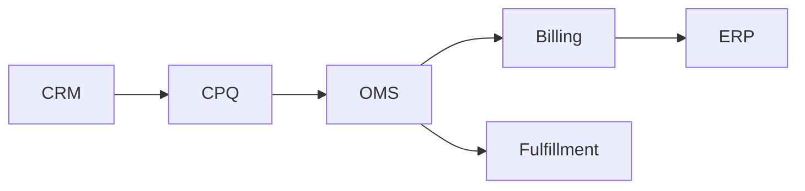
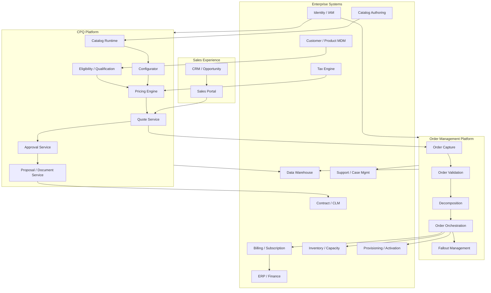
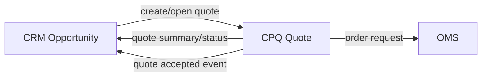
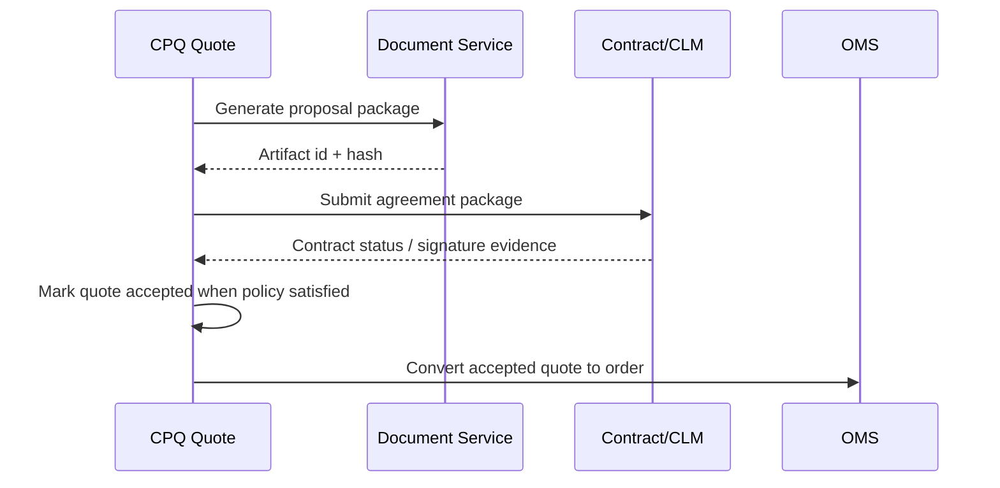
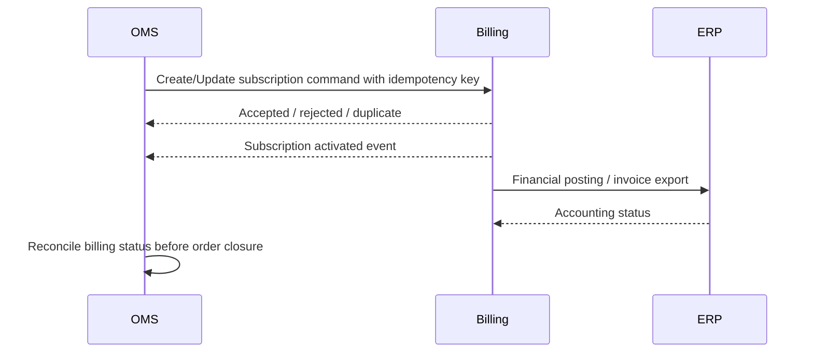
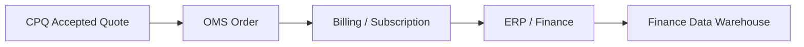
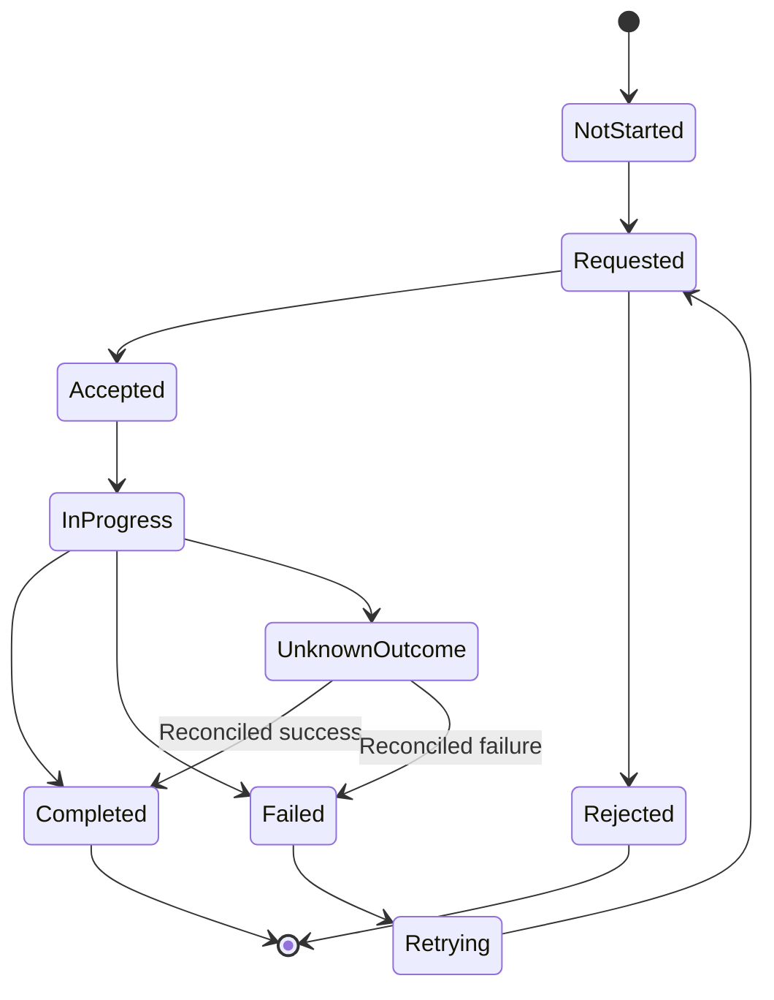
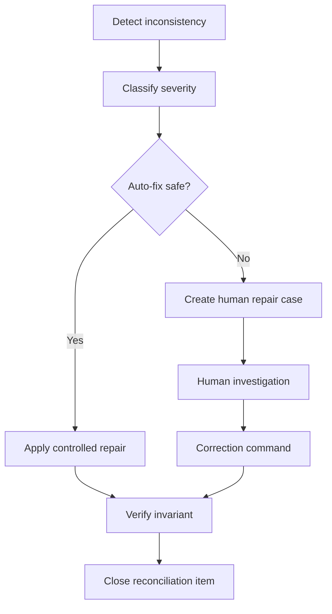
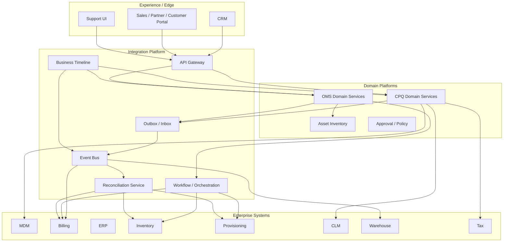

# Part 025 — Enterprise Integration Architecture for CPQ/OMS

Enterprise CPQ/OMS does not live alone. It is usually the commercial and operational spine between CRM, product catalog, pricing, tax, billing, contract, ERP, fulfillment, inventory, provisioning, customer master, identity, analytics, and support systems.

A small CPQ system can behave like an application. An enterprise CPQ/OMS platform behaves like an integration control plane.

The core question in this part is not:

> “How do we connect CPQ to other systems?”

The real question is:

> “How do we design system boundaries, handoffs, ownership, consistency, observability, and recovery so that quote-to-order-to-fulfillment remains correct even when every downstream system evolves, fails, or disagrees?”

This part builds the integration architecture mental model required before we discuss API/event contracts in Part 026.

---

## 1. Kaufman Lens: What Skill Are We Practicing?

Josh Kaufman's learning model pushes us to define the target performance, deconstruct the skill, learn enough to self-correct, and practice against real feedback.

For enterprise CPQ/OMS integration, the target performance is:

> Given a CPQ/OMS domain capability, you can decide whether it should be synchronous, asynchronous, authoritative, cached, replicated, referenced, snapshotted, reconciled, or manually repairable — and you can explain the operational consequences.

This part trains five sub-skills:

1. Identifying integration ownership.
2. Choosing handoff semantics.
3. Designing consistency boundaries.
4. Modeling failure and recovery paths.
5. Making integration observable and governable.

Do not start with protocols. Start with business invariants.

---

## 2. Why Enterprise CPQ/OMS Integration Is Hard

Most integration diagrams are misleading because they show boxes and arrows, but not truth ownership, timing, failure, or reversibility.

For example:



This diagram is incomplete. It does not answer:

- Who owns customer identity?
- Who owns price validity?
- Who owns accepted commercial terms?
- Who owns tax determination?
- Who owns asset state?
- Who owns order state?
- Who can reverse an order?
- Which system can be temporarily wrong?
- Which errors are retryable?
- Which errors require human repair?
- Which handoffs are legally binding?

A real CPQ/OMS integration architecture must describe the meaning of each connection, not only the data exchanged.

---

## 3. The Enterprise CPQ/OMS Integration Map

A typical enterprise-grade CPQ/OMS platform integrates with these system categories:

| System | Typical Responsibility | Integration Risk |
|---|---|---|
| CRM | Lead, opportunity, account-facing sales process | CRM treats opportunity as sales pipeline, not legally binding commercial state |
| Product Catalog | Product offering, option, eligibility metadata | Stale catalog can invalidate quotes/orders |
| Pricing Engine | Price calculation, price waterfall, discount policy | Non-deterministic pricing causes revenue leakage |
| Tax Engine | Tax estimate or tax finalization | Incorrect tax boundary can create compliance exposure |
| Contract/CLM | Legal agreement, clause, signature | Quote terms may drift from signed agreement |
| Billing | Subscription, invoice schedule, charge activation | Incorrect handoff causes overbilling/underbilling |
| ERP/Finance | GL, revenue, accounting, financial master data | Finance requires stronger control than sales UI |
| Inventory | Stock, resource availability, capacity | Availability may change between quote and fulfillment |
| Provisioning | Technical service activation | Unknown outcome and retry can duplicate activation |
| Identity/IAM | User, role, authorization, delegated access | Mis-scoped visibility leaks price/customer data |
| MDM | Customer/account/product master data | Master data conflict causes broken joins downstream |
| Data Warehouse/Lakehouse | Analytics, audit, reporting | Event drift creates incorrect operational reporting |
| Support/Case Management | Customer issue and order fallout handling | Support needs trace, not only status |
| Notification/Document System | Proposal, order confirmation, notification | Customer-visible artifact must match system-of-record |

The important pattern: CPQ/OMS is both a consumer and producer of enterprise truth.

---

## 4. Integration Architecture as Boundary Design

An integration boundary defines more than transport. It defines five things:

| Boundary Aspect | Question |
|---|---|
| Ownership | Which system is authoritative? |
| Timing | When must the information be correct? |
| Mutability | Can the value change after handoff? |
| Evidence | What proof is retained? |
| Recovery | What happens if the handoff fails or is ambiguous? |

A weak integration design says:

> “OMS calls Billing API.”

A strong integration design says:

> “OMS emits `OrderBillingActivationRequested` after fulfillment reaches a billable milestone. Billing is authoritative for invoice schedule and subscription billing status. OMS retains the accepted quote snapshot, order snapshot, fulfillment milestone, billing request idempotency key, and billing response correlation ID. Billing response is asynchronously reconciled. If outcome is unknown, OMS enters `BillingActivationUnconfirmed` and blocks order closure until reconciliation succeeds.”

The second design is operationally meaningful.

---

## 5. Integration Style Taxonomy

Enterprise CPQ/OMS should not use one integration style for everything. Different interactions need different styles.

### 5.1 Synchronous Query

Used when the user needs immediate information to continue.

Examples:

- Check current customer status.
- Validate account exists.
- Retrieve catalog item.
- Estimate tax.
- Check quote conversion eligibility.

Use synchronous query when:

- Latency is acceptable.
- Failure can be shown to the user.
- The result is not a durable command.
- The caller can tolerate temporary unavailability.

Avoid synchronous query when:

- The downstream call creates side effects.
- The call participates in long-running fulfillment.
- The result must be retried safely after timeout.

### 5.2 Synchronous Command

Used when the caller needs an immediate acceptance/rejection decision.

Examples:

- Submit quote for approval.
- Reserve inventory temporarily.
- Create order draft in downstream system.

Use carefully. Synchronous command creates tight coupling.

Required controls:

- Idempotency key.
- Caller correlation ID.
- Explicit command result.
- Clear timeout semantics.
- Safe retry behavior.
- Durable command log.

### 5.3 Asynchronous Command

Used for long-running side effects.

Examples:

- Start fulfillment.
- Activate service.
- Generate proposal package.
- Create billing subscription.
- Send customer notification.

Preferred for enterprise OMS because most order work is long-running and failure-prone.

Required controls:

- Durable outbox.
- Idempotent consumer.
- Command accepted event.
- Completion event.
- Failure event.
- Reconciliation path.

### 5.4 Domain Event

Used to publish facts that already happened.

Examples:

- `QuoteAccepted`
- `OrderSubmitted`
- `OrderDecomposed`
- `FulfillmentTaskCompleted`
- `BillingActivationRequested`
- `AssetActivated`

Events should not be disguised commands. A command asks another system to do something. An event states that something happened.

### 5.5 Replication Feed

Used when another system needs a local read model.

Examples:

- Replicate catalog into CPQ runtime.
- Replicate order status to support portal.
- Replicate quote/order facts to analytics.
- Replicate asset status into eligibility service.

Required controls:

- Versioning.
- Replay.
- Ordering model.
- Tombstones/deletions.
- Backfill process.
- Data quality monitoring.

### 5.6 Batch Integration

Still common in large enterprises.

Examples:

- Nightly ERP financial extract.
- Catalog bulk import.
- Price book update.
- Revenue report.
- Data warehouse load.

Batch is not bad. Uncontrolled batch is bad.

Required controls:

- File checksum.
- Row-level rejection handling.
- Re-run semantics.
- Effective dating.
- Audit log.
- Reconciliation report.

---

## 6. Integration Pattern Selection Matrix

| Scenario | Recommended Pattern | Reason |
|---|---|---|
| User opens quote and needs customer info | Synchronous query + cache | User-facing latency, low side effect |
| User prices quote | Synchronous calculation | Feedback must be immediate |
| Price book changes | Event/batch publish to pricing runtime | Runtime needs versioned refresh |
| Quote accepted | Durable domain event | Many downstream consumers need fact |
| Order submitted | Command to OMS + event after acceptance | Order creation must be controlled |
| Start fulfillment | Async command | Long-running, failure-prone |
| Activate service | Async command + reconciliation | Unknown outcome is possible |
| Create billing subscription | Async command with idempotency | Financial side effect must be safe |
| Update analytics | Event stream / CDC | Reporting should not block order |
| Send customer email | Async notification command | Non-critical but auditable |
| Generate legal document | Async job + artifact hash | Durable artifact required |
| Check tax estimate | Sync query | Needed before quote presentation |
| Post final invoice | Billing/ERP controlled | CPQ/OMS should not fake finance truth |

The best pattern is determined by side effect, timing, authority, reversibility, and failure mode.

---

## 7. Enterprise System Boundary Map



Notice the important separation:

- CRM owns sales pipeline.
- CPQ owns commercial construction and quote evidence.
- OMS owns order execution control.
- Billing owns invoice/subscription billing truth.
- ERP owns accounting truth.
- Fulfillment/provisioning owns technical execution truth.
- Data warehouse owns analytics, not operational command decisions.

---

## 8. CRM Integration

CRM often initiates the commercial process, but CRM should not be the authority for CPQ correctness.

### 8.1 What CRM Usually Owns

- Lead.
- Opportunity.
- Account relationship from sales perspective.
- Sales stage.
- Forecast category.
- Sales owner.
- Campaign attribution.
- Pipeline reporting.

### 8.2 What CPQ Should Own

- Configured product set.
- Quote line hierarchy.
- Price calculation snapshot.
- Discount policy result.
- Quote revision.
- Approval evidence.
- Proposal artifact linkage.
- Quote acceptance state.

### 8.3 Common Anti-Pattern

CRM custom objects become the quote system of record.

This works early because it is convenient. It fails later because:

- Quote lines become too complex.
- Pricing trace is missing.
- Approval evidence is incomplete.
- Quote revisioning becomes ambiguous.
- Large quotes exceed UI/data model assumptions.
- Order conversion becomes lossy.

### 8.4 Recommended Boundary

CRM references quote summary. CPQ owns quote details.



CRM should see enough to sell. CPQ should retain enough to prove.

---

## 9. Product Catalog Integration

Catalog integration is one of the most important boundaries because every downstream object depends on product interpretation.

TM Forum's Product Catalog Management API describes catalog lifecycle management and consultation of catalog elements during ordering, campaign management, and sales management. The Product Ordering API states that a product order is created based on a product offer defined in a catalog, including characteristics such as pricing, product options, and market.

### 9.1 Authoring vs Runtime Catalog

Do not make sales runtime depend directly on catalog authoring.

| Layer | Responsibility |
|---|---|
| Catalog Authoring | Drafting, review, approval, lifecycle management |
| Catalog Publish Pipeline | Validation, normalization, compatibility checks, environment promotion |
| Catalog Runtime | Low-latency read model for CPQ/OMS |
| Historical Catalog Snapshot | Interpretation of old quotes/orders |

### 9.2 Integration Invariant

A quote/order must be explainable using the catalog version that was valid when it was constructed or accepted.

Bad:

```text
Order line references product code only.
```

Better:

```text
Order line references productOfferingId, productOfferingVersion, catalogVersion, selectedCharacteristics, configurationSnapshotHash.
```

### 9.3 Catalog Event Examples

- `CatalogVersionPublished`
- `ProductOfferingActivated`
- `ProductOfferingRetired`
- `PriceBookPublished`
- `CompatibilityRuleChanged`
- `EligibilityPolicyChanged`

### 9.4 Failure Modes

| Failure | Consequence | Control |
|---|---|---|
| Catalog runtime stale | Invalid quote options | Version checks and cache invalidation |
| Product retired after quote | Quote may become unorderable | Quote validity rules |
| Rule changed mid-approval | Approval may be stale | Approval fingerprint |
| Missing historical version | Cannot explain old order | Immutable catalog archive |

---

## 10. Pricing and Tax Integration

Pricing and tax are related but should not be casually merged.

### 10.1 Pricing Owns Commercial Charge Logic

Pricing determines:

- List price.
- Discounted price.
- Promotion result.
- Contract price.
- Price override result.
- Charge component.
- Price allocation.
- Rounding policy before tax.

### 10.2 Tax Owns Jurisdictional Tax Determination

Tax determines:

- Tax category.
- Tax jurisdiction.
- Tax rate.
- Tax exemption.
- Tax amount estimate or final amount.
- Tax evidence.

### 10.3 Quote-Time vs Invoice-Time Tax

Quote-time tax is often an estimate. Invoice-time tax may be final.

| Moment | Purpose | Ownership |
|---|---|---|
| Quote tax estimate | Customer-facing approximation | CPQ + Tax engine |
| Order tax validation | Prevent impossible order | OMS + Tax engine |
| Invoice tax | Financial/compliance truth | Billing/Tax/ERP |

### 10.4 Integration Invariant

Do not promise that quote-time tax estimate is the accounting truth unless the business and legal policy explicitly says so.

The quote should record:

- Tax engine version.
- Request inputs.
- Jurisdiction result.
- Exemption status.
- Estimate timestamp.
- Tax disclaimer if applicable.

---

## 11. Contract and CLM Integration

CPQ generates commercial intent. CLM/legal systems manage legal agreement lifecycle.

### 11.1 Contract Boundary Problem

A quote can be accepted in many ways:

- Click-to-accept.
- Signed PDF.
- E-signature envelope.
- Master agreement reference.
- Purchase order acceptance.
- Verbal/internal approval for certain channels.

The platform must know which acceptance type creates legal authority to order.

### 11.2 Recommended Handoff



### 11.3 Contract Integration Controls

- Document hash.
- Template version.
- Clause version.
- Signer identity.
- Signature timestamp.
- Accepted quote revision.
- Contract id.
- Contract effective date.
- Contract term.
- Renewal conditions.
- Termination conditions.

### 11.4 Failure Modes

| Failure | Consequence | Control |
|---|---|---|
| Contract signed for old quote revision | Wrong terms ordered | Quote revision binding |
| Document regenerated after signature | Evidence mismatch | Artifact immutability |
| CLM status delayed | Order blocked | Pending acceptance state |
| Contract terms not passed to billing | Billing mismatch | Contract-to-billing mapping test |

---

## 12. Billing and Subscription Integration

Billing is one of the highest-risk integrations because mistakes become invoices.

### 12.1 Billing Usually Owns

- Subscription billing status.
- Invoice schedule.
- Billing account.
- Payment terms.
- Tax finalization in invoice context.
- Invoice generation.
- Dunning and collections.
- Credit memo/debit memo.

### 12.2 CPQ/OMS Usually Provides

- Accepted commercial terms.
- Order activation milestone.
- Charge components.
- Effective dates.
- Billing trigger event.
- Contract reference.
- Customer/account reference.
- Asset/subscription mapping intent.

### 12.3 Billing Handoff Pattern



### 12.4 Key Invariant

A fulfilled product is not automatically billable unless billing activation policy is satisfied.

For example:

- Physical product may be billable on shipment.
- SaaS subscription may be billable on activation.
- Telecom service may be billable on service acceptance.
- Professional service may be billable on milestone.

OMS must model billable milestone explicitly.

---

## 13. ERP and Finance Integration

ERP is not just another downstream system. It often represents financial control.

### 13.1 ERP Usually Owns

- Legal entity.
- General ledger account.
- Cost center.
- Revenue account mapping.
- Tax/accounting posting.
- Accounts receivable.
- Financial period.
- Financial close.
- Audit controls.

### 13.2 CPQ/OMS Should Not Own

- Final accounting postings.
- GL truth.
- Revenue recognition truth.
- Invoice truth.

### 13.3 Integration Pattern

Usually CPQ/OMS does not post directly to ERP. Billing or finance middleware does.



### 13.4 Finance-Oriented Data Controls

- Legal entity mapping.
- Currency and exchange rate policy.
- Billing account mapping.
- Product-to-revenue-code mapping.
- Tax code mapping.
- Effective date rules.
- Month-end close lock.
- Correction vs mutation policy.

A sales system can tolerate some correction. Finance often requires reversal and adjustment, not silent update.

---

## 14. Inventory, Capacity, and Reservation Integration

Inventory integration is difficult because availability is time-sensitive.

### 14.1 Availability vs Reservation vs Allocation

| Concept | Meaning |
|---|---|
| Availability | System estimates that something can be supplied |
| Reservation | Temporary hold for a customer/order |
| Allocation | Inventory/capacity is assigned to a specific fulfillment plan |
| Consumption | Inventory/capacity is actually used |

### 14.2 Quote-Time Inventory

For many businesses, quote-time inventory is informational.

Example:

> “Available today” may not be guaranteed if the customer accepts tomorrow.

### 14.3 Order-Time Reservation

OMS should reserve when the business needs supply protection.

Required controls:

- Reservation ID.
- Expiry time.
- Quantity.
- Location/warehouse/resource pool.
- Renewal policy.
- Release policy.
- Compensation if order cancelled.

### 14.4 Failure Modes

| Failure | Consequence | Control |
|---|---|---|
| Inventory available at quote but gone at order | Order fallout | Re-check feasibility at submit |
| Reservation expires silently | Fulfillment failure | Reservation expiry monitor |
| Duplicate reservation | Inventory leakage | Idempotent reservation key |
| Cancellation does not release inventory | Capacity loss | Compensation workflow |

---

## 15. Provisioning and Activation Integration

Provisioning systems often have the most dangerous failure mode: unknown outcome.

An API timeout does not mean activation failed. It may have succeeded but response was lost.

### 15.1 Provisioning Integration Rule

Never blindly retry non-idempotent provisioning commands.

Use:

- Idempotency key.
- External order/task reference.
- Query-by-reference reconciliation.
- Status callback.
- Timeout monitor.
- Manual repair path.

### 15.2 Provisioning State Model



### 15.3 Activation Evidence

OMS should retain:

- Provisioning command payload hash.
- Provisioning system reference.
- Request timestamp.
- Response/callback timestamp.
- External status.
- Reconciliation result.
- Technical resource identifier.
- Activated asset reference.

Without this evidence, support and audit teams cannot explain customer state.

---

## 16. Identity, Access, and Tenant Boundary Integration

CPQ/OMS often exposes sensitive data:

- Special customer pricing.
- Margin data.
- Approval rules.
- Contract terms.
- Customer information.
- Order and provisioning details.

Identity integration is not only login. It is policy enforcement.

### 16.1 Identity Sources

- Corporate IdP.
- CRM user identity.
- Partner portal identity.
- Customer portal identity.
- Service account identity.
- Downstream system technical identity.

### 16.2 Authorization Dimensions

| Dimension | Example |
|---|---|
| Role | Sales rep, deal desk, approver, operations, support |
| Account scope | User can see assigned accounts only |
| Region | User can price only in allowed region |
| Channel | Partner cannot access direct-sales programs |
| Price sensitivity | Margin visible only to authorized roles |
| Action | User can edit quote but cannot approve own exception |
| State | Accepted quote cannot be modified |

### 16.3 Integration Invariant

Do not trust UI authorization only.

Every command boundary must enforce authorization based on server-side policy.

---

## 17. MDM and Master Data Integration

Master data issues create subtle CPQ/OMS failures.

### 17.1 Common Master Data Domains

- Customer.
- Account.
- Billing account.
- Legal entity.
- Product master.
- Supplier/vendor.
- Location/address.
- Currency.
- Tax code.
- Payment terms.

### 17.2 Master Data Anti-Pattern

Each system creates its own customer/account identity and integrations join by name/email.

This eventually causes:

- Duplicate customers.
- Wrong billing account.
- Incorrect entitlement.
- Broken renewal.
- Incorrect discount agreement.
- Failed credit check.
- Incorrect revenue reporting.

### 17.3 Recommended Model

Use stable enterprise identifiers and keep local references separate.

```text
customerMasterId: CUST-0019283
crmAccountId: 001xx000003DGSW
billingAccountId: BA-883721
erpCustomerId: ERP-55291
supportAccountId: SUP-11822
```

Local system IDs are references, not universal truth.

---

## 18. Data Warehouse, Lakehouse, and Analytics Integration

Analytics should not drive operational command decisions unless explicitly designed as operational data product.

### 18.1 Reporting Needs

- Quote conversion rate.
- Average discount by segment.
- Approval SLA.
- Order cycle time.
- Fallout rate.
- Revenue leakage.
- Stuck order dashboard.
- Catalog adoption.
- Pricing exception trend.

### 18.2 Operational vs Analytical Read Models

| Model | Latency | Use |
|---|---|---|
| Operational read model | Seconds/subseconds | User workflow, support, order tracking |
| Analytical model | Minutes/hours/day | BI, trend, finance analytics |
| Audit/event archive | Durable historical proof | Investigation, replay, compliance |

### 18.3 Event Feed Controls

- Schema version.
- Event id.
- Event time.
- Source service.
- Correlation ID.
- Entity version.
- Redaction policy.
- Backfill capability.
- Replay capability.

Analytics without lineage is just a spreadsheet with better tooling.

---

## 19. API Gateway and Edge Integration

API gateway is useful, but it should not become the domain boundary.

### 19.1 Gateway Responsibilities

- Authentication integration.
- Rate limiting.
- Routing.
- TLS termination.
- Request size limits.
- API version exposure.
- External developer access.
- Basic observability.

### 19.2 Gateway Should Not Own

- Quote state transition rules.
- Pricing policy.
- Approval routing.
- Order decomposition.
- Idempotency semantics.
- Business authorization.

Business invariants must live in domain services, not edge configuration.

---

## 20. Document and Notification Integration

Customer-visible communication must match system-of-record state.

### 20.1 Document Types

- Quote proposal.
- Order confirmation.
- Contract package.
- Change order summary.
- Cancellation confirmation.
- Billing activation notice.
- Service activation notice.

### 20.2 Notification Invariant

Do not send irreversible customer communication before the underlying state is durable.

Bad:

```text
Send "Your service is active" before activation is confirmed.
```

Better:

```text
Send "Your order is being activated" after order accepted.
Send "Your service is active" after activation milestone confirmed.
```

### 20.3 Notification Outbox

Use notification outbox for customer-facing messages:

- Message intent.
- Entity reference.
- Template version.
- Rendered payload hash.
- Delivery channel.
- Recipient.
- Delivery status.
- Retry status.

---

## 21. Cross-System State Propagation

State propagation is where many integration designs fail.

A quote/order state should not be copied everywhere as if every system owns it.

### 21.1 State Ownership Example

| State | Owner | Consumers |
|---|---|---|
| Opportunity stage | CRM | CPQ, reporting |
| Quote status | CPQ | CRM, analytics, document service |
| Approval status | Approval service/CPQ | CPQ, CRM |
| Order status | OMS | CRM, support, customer portal |
| Fulfillment task status | OMS/Fulfillment | OMS, support |
| Billing status | Billing | OMS, CRM, support |
| Asset status | Asset inventory | CPQ eligibility, support, billing |

### 21.2 Derived State Rule

If a system displays a state it does not own, label it as derived and include source timestamp.

Example:

```text
Order status: In Fulfillment
Source: OMS
Last updated: 2026-07-02T08:15:10+07:00
```

This prevents false confidence.

---

## 22. Integration Consistency Patterns

### 22.1 Snapshot

Use when historical interpretation matters.

Examples:

- Accepted quote pricing.
- Proposal document package.
- Order line configuration.
- Approval evidence.

### 22.2 Reference

Use when the target system remains authoritative and current value matters.

Examples:

- Customer master ID.
- Billing account ID.
- ERP legal entity ID.

### 22.3 Replication

Use when local read performance or availability matters.

Examples:

- Catalog runtime.
- Asset summary for eligibility.
- Order status for support portal.

### 22.4 Reconciliation

Use when asynchronous side effects can become inconsistent.

Examples:

- Billing subscription creation.
- Provisioning activation.
- Inventory reservation.
- ERP posting.

### 22.5 Compensation

Use when a completed side effect must be logically reversed.

Examples:

- Release inventory reservation.
- Cancel billing subscription.
- Deactivate provisioned service.
- Issue credit memo.

---

## 23. Reconciliation Architecture

Reconciliation is not a batch afterthought. It is part of correctness.

### 23.1 Reconciliation Types

| Type | Example |
|---|---|
| Command outcome reconciliation | Did billing create the subscription? |
| State reconciliation | Does OMS order status match fulfillment status? |
| Financial reconciliation | Do accepted charges match billed charges? |
| Asset reconciliation | Does asset inventory match activated services? |
| Catalog reconciliation | Do active quotes reference valid catalog versions? |

### 23.2 Reconciliation Flow



### 23.3 Reconciliation Invariants

- Every discrepancy has an owner.
- Every correction is audited.
- Auto-repair is allowed only for deterministic safe cases.
- Financial correction follows finance policy, not engineering convenience.
- Reconciliation results feed root-cause analysis.

---

## 24. Integration Observability

A distributed CPQ/OMS platform must answer:

- Where is this quote/order now?
- Who touched it?
- Which system rejected it?
- Which event triggered the downstream command?
- Was the command retried?
- Did the downstream system complete it?
- Is the customer waiting?
- Is billing correct?

### 24.1 Required Correlation Fields

| Field | Purpose |
|---|---|
| correlationId | End-to-end business journey correlation |
| causationId | Which command/event caused this event |
| entityId | Quote/order/task/entity reference |
| entityVersion | Optimistic concurrency and replay semantics |
| idempotencyKey | Safe retry and duplicate detection |
| sourceSystem | Origin of command/event |
| targetSystem | Destination of command/event |
| tenant/legalEntity | Partition and compliance dimension |
| actorId | Human/system actor |

### 24.2 Observability Views

- Quote timeline.
- Order timeline.
- Integration timeline.
- Event replay view.
- Fallout queue.
- Billing reconciliation dashboard.
- Provisioning unknown-outcome queue.
- Catalog publish status.
- Price calculation trace.

Logs alone are not enough. Users need business timeline observability.

---

## 25. Integration Security

Integration security has three layers:

1. Transport security.
2. Service-to-service authorization.
3. Business authorization.

### 25.1 Service-to-Service Controls

- mTLS or equivalent trusted service identity.
- Scoped credentials.
- Short-lived tokens.
- Rotation policy.
- Least privilege.
- Per-client rate limits.
- Audit of technical actors.

### 25.2 Data Protection Controls

- PII minimization.
- Price/margin redaction.
- Encryption at rest and in transit.
- Field-level masking for logs/events.
- Data retention policy.
- Right-to-delete/retention conflict handling.

### 25.3 Event Security

Events often leak more than APIs because they are broadly consumed.

Avoid publishing:

- Full customer PII unless needed.
- Margin-sensitive fields to generic topics.
- Contract confidential clauses.
- Payment details.
- Secrets or credentials.

Use purpose-specific topics and redacted event shapes.

---

## 26. Enterprise Integration Anti-Patterns

### 26.1 Point-to-Point Spaghetti

Every system calls every other system directly.

Symptoms:

- No single journey trace.
- Changes break unknown consumers.
- Duplicate business logic.
- Hard-to-debug failures.

### 26.2 CRM-as-Everything

CRM stores quote, order, billing, asset, and fulfillment state as custom fields.

Symptoms:

- Weak lifecycle modeling.
- Poor audit trail.
- Slow large quotes.
- Difficult fulfillment orchestration.

### 26.3 Event-as-Database

Teams publish huge events and downstream consumers infer state however they want.

Symptoms:

- Consumer-specific interpretation.
- Inconsistent reporting.
- Breaking changes.
- Reprocessing difficulty.

### 26.4 Synchronous Orchestration Chain

A user submit waits for CRM, billing, ERP, inventory, provisioning, and document systems synchronously.

Symptoms:

- Timeouts.
- Unknown outcomes.
- Poor UX.
- Retry duplicates.

### 26.5 No Reconciliation

The architecture assumes that if an API returned success, systems are consistent forever.

Symptoms:

- Billing mismatch discovered by customer.
- Activated service not in asset inventory.
- Order closed while downstream failed.

---

## 27. Reference Integration Blueprint



This blueprint separates:

- Experience layer.
- Domain services.
- Integration infrastructure.
- Enterprise systems.
- Observability and reconciliation.

The most important part is not the diagram. It is the ownership model behind the diagram.

---

## 28. Design Review Checklist

Use this checklist when reviewing any CPQ/OMS integration.

### Ownership

- [ ] Which system is authoritative for each field?
- [ ] Which values are snapshots vs references?
- [ ] Is derived state labeled clearly?
- [ ] Is there one owner for state transition?

### Timing

- [ ] Is the integration synchronous or asynchronous for the right reason?
- [ ] What is the expected latency?
- [ ] What happens during timeout?
- [ ] Can the user continue if downstream is unavailable?

### Idempotency

- [ ] Is there an idempotency key for side-effecting commands?
- [ ] Can the receiver detect duplicates?
- [ ] Can the caller safely retry?
- [ ] Is duplicate side effect impossible or repairable?

### Consistency

- [ ] What consistency model is promised?
- [ ] Is eventual consistency acceptable?
- [ ] Is there reconciliation?
- [ ] Are stale reads detectable?

### Recovery

- [ ] Is every failure classified?
- [ ] Is there a retry policy?
- [ ] Is there a compensation policy?
- [ ] Is there a human repair path?

### Observability

- [ ] Is correlation ID propagated?
- [ ] Is causation recorded?
- [ ] Can support see business timeline?
- [ ] Can operators identify stuck integrations?

### Governance

- [ ] Are schema changes versioned?
- [ ] Are consumers known?
- [ ] Is data sensitivity classified?
- [ ] Is audit evidence preserved?

---

## 29. Practical Exercise

Design the integration architecture for this scenario:

> A sales rep creates a quote for a bundled subscription with hardware, recurring software, installation service, and usage-based add-on. The quote uses customer-specific discounting, requires deal desk approval, generates a signed proposal, converts to order, reserves hardware inventory, schedules installation, activates the software subscription, creates billing, and publishes analytics events.

Produce:

1. System boundary map.
2. Source-of-truth matrix.
3. Sync vs async integration decision table.
4. Event list.
5. Idempotency strategy.
6. Reconciliation strategy.
7. Fallout scenarios.
8. Business timeline design.

### Expected Senior-Level Answer

A strong answer will not say “use Kafka” or “use REST”. It will say:

- Which facts are authoritative.
- Which side effects are durable.
- Which calls are safely retryable.
- Which outcomes are unknown.
- Which states require human repair.
- Which events are facts vs commands.
- Which data is snapshotted.
- Which data is referenced.
- Which process owns customer-visible communication.

---

## 30. Key Takeaways

Enterprise CPQ/OMS integration architecture is not connector plumbing. It is business correctness under distributed failure.

The strongest mental model is:

> Every integration is a contract about ownership, timing, mutability, evidence, and recovery.

A high-quality CPQ/OMS platform should make integration behavior explicit:

- CRM owns sales pipeline, not quote truth.
- CPQ owns commercial construction and quote evidence.
- OMS owns order execution control.
- Billing owns invoice/subscription billing truth.
- ERP owns accounting truth.
- Fulfillment owns technical execution truth.
- MDM owns master identifiers.
- Analytics owns insight, not operational command decisions.

If those boundaries are clear, the architecture can evolve. If those boundaries are unclear, every integration becomes a future incident.

---

## References

- TM Forum Open APIs Directory: https://www.tmforum.org/open-digital-architecture/open-apis
- TMF620 Product Catalog Management API: https://www.tmforum.org/resources/specification/tmf620-product-catalog-management-api-rest-specification-r17-5-0/
- TMF622 Product Ordering Management API v5.0: https://www.tmforum.org/open-digital-architecture/open-apis/product-ordering-management-api-TMF622/v5.0
- TMF622 Product Ordering Management API User Guide v5.0.0: https://www.tmforum.org/resources/specifications/tmf622-product-ordering-management-api-user-guide-v5-0-0/
- CloudEvents Specification: https://cloudevents.io/
- OpenAPI Initiative: https://www.openapis.org/
- AsyncAPI Initiative: https://www.asyncapi.com/
