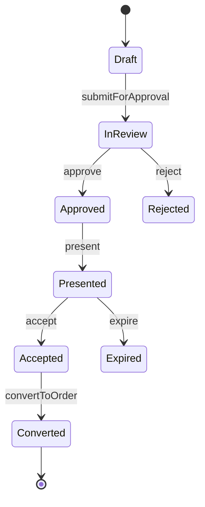
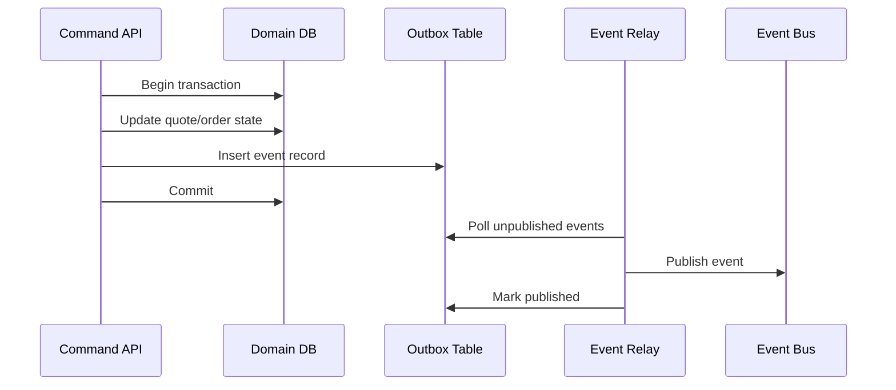

# Part 026 — API Design, Event Design, and Contract Boundaries

In Part 025, we designed integration architecture as ownership, timing, mutability, evidence, and recovery.

Now we move one layer deeper:

> How should CPQ/OMS APIs and events be shaped so that other systems can interact with the platform safely?

Enterprise CPQ/OMS APIs are not simple CRUD endpoints. They encode commercial and operational contracts.

A weak API says:

```http
POST /orders
```

A strong API design answers:

- Is this a command or a resource creation request?
- Is the request idempotent?
- Which quote version is being converted?
- Which state transition is being requested?
- Which validations are performed synchronously?
- Which work continues asynchronously?
- Which event proves acceptance?
- What can consumers rely on after the response?
- What is the compatibility policy when the schema evolves?

This part builds the API/event design discipline required for large-scale CPQ/OMS platforms.

---

## 1. Kaufman Lens: What Skill Are We Practicing?

The target performance for this part is:

> Given a CPQ/OMS capability, you can design its command API, query API, event contract, idempotency model, versioning policy, and compatibility guarantees without leaking internal implementation or weakening domain invariants.

The sub-skills are:

1. Separating commands from queries.
2. Modeling state transitions explicitly.
3. Designing idempotent side-effecting APIs.
4. Designing domain events as durable facts.
5. Establishing schema evolution and contract testing.
6. Preserving auditability and traceability across boundaries.

The goal is not pretty endpoints. The goal is safe evolution.

---

## 2. API Contract Is a Business Boundary

An API is not merely a technical interface. It is a promise.

In CPQ/OMS, that promise may affect:

- Revenue.
- Contractual commitment.
- Customer communication.
- Fulfillment execution.
- Billing activation.
- Regulatory audit.
- Support operations.

Therefore, API design must be domain-first.

### 2.1 Bad API Thinking

```text
Expose database tables as REST endpoints.
```

Symptoms:

- Consumers depend on internal structure.
- State transitions are bypassed.
- Invariants spread across clients.
- Backward compatibility becomes impossible.
- Audit evidence is incomplete.

### 2.2 Better API Thinking

```text
Expose business capabilities and state transitions.
```

Examples:

- `submitQuoteForApproval`
- `approveQuote`
- `acceptQuote`
- `convertQuoteToOrder`
- `submitOrder`
- `cancelOrder`
- `requestOrderChange`
- `retryFulfillmentTask`
- `repairOrderFallout`

The API should reveal what the business is doing, not how the database is arranged.

---

## 3. CPQ/OMS API Families

A mature CPQ/OMS platform usually needs multiple API families.

| API Family | Purpose | Example |
|---|---|---|
| Command API | Request state change or side effect | Submit quote, approve quote, create order |
| Query API | Retrieve state/read models | Search quotes, get order timeline |
| Calculation API | Compute without committing | Price quote, validate configuration |
| Simulation API | Evaluate future scenarios | Simulate renewal, price change, migration |
| Admin API | Govern catalog/policy/configuration | Publish catalog, update rule set |
| Repair API | Controlled operational correction | Retry task, mark fallout repaired |
| Event API/Stream | Publish durable facts | Quote accepted, order submitted |
| Bulk API | Process large-scale operations | Price book import, migration, backfill |

Do not force all capabilities into one style.

---

## 4. Command API vs Query API

Command-query separation is essential in CPQ/OMS.

### 4.1 Command API

A command API asks the system to do something.

Examples:

```http
POST /quotes/{quoteId}/submit-for-approval
POST /quotes/{quoteId}/accept
POST /quotes/{quoteId}/convert-to-order
POST /orders/{orderId}/cancel
POST /orders/{orderId}/fulfillment-tasks/{taskId}/retry
```

Command APIs should:

- Be intention-revealing.
- Enforce state transition guards.
- Require idempotency for side effects.
- Return acceptance/rejection clearly.
- Produce audit evidence.
- Emit domain events after durable change.

### 4.2 Query API

A query API retrieves state.

Examples:

```http
GET /quotes/{quoteId}
GET /quotes/{quoteId}/timeline
GET /orders/{orderId}
GET /orders/{orderId}/timeline
GET /orders?customerId=...&status=...
```

Query APIs should:

- Be side-effect free.
- Support projection where needed.
- Expose source and freshness for derived state.
- Avoid leaking internal event store or tables.
- Use pagination and filtering safely.

### 4.3 Calculation API

Calculation APIs are special: they compute but do not commit.

Examples:

```http
POST /pricing/calculate
POST /quotes/{quoteId}/validate
POST /configurations/evaluate
POST /orders/{orderId}/simulate-cancellation
```

They must declare whether the result is:

- Advisory.
- Binding for a validity window.
- Based on a specific version of catalog/pricing/rules.
- Safe to cache.
- Eligible for snapshot.

---

## 5. Resource-Oriented vs Action-Oriented Design

REST-oriented design works well for resources, but CPQ/OMS has many state transitions.

### 5.1 Resource-Oriented Example

```http
GET /quotes/{quoteId}
PATCH /quotes/{quoteId}
GET /orders/{orderId}
```

Good for:

- Retrieving quote/order.
- Updating draft metadata.
- Searching resources.

### 5.2 Action-Oriented Example

```http
POST /quotes/{quoteId}/submit-for-approval
POST /orders/{orderId}/cancel
```

Good for:

- Guarded state transitions.
- Business workflow commands.
- Side effects requiring audit.

### 5.3 Avoid Fake REST Purity

Do not pretend a complex business transition is a generic update.

Bad:

```http
PATCH /quotes/{quoteId}
{
  "status": "Accepted"
}
```

This allows clients to bypass:

- Validation.
- Approval.
- Acceptance evidence.
- Document signature.
- Quote expiry.
- Price freshness.

Better:

```http
POST /quotes/{quoteId}/accept
{
  "quoteVersion": 17,
  "acceptanceMethod": "E_SIGNATURE",
  "contractId": "CON-90128",
  "acceptedDocumentHash": "sha256:..."
}
```

State transitions deserve explicit commands.

---

## 6. State Transition API Design

A command should map to a transition in a state machine.



Each transition should define:

- Source state.
- Target state.
- Guard conditions.
- Required actor permissions.
- Required input data.
- Produced events.
- Audit record.
- Failure responses.
- Idempotency behavior.

### 6.1 Transition Contract Example

Command: `acceptQuote`

| Aspect | Rule |
|---|---|
| Source state | `Presented` or `Approved` depending channel policy |
| Required version | Current quote version |
| Required evidence | Acceptance method + accepted artifact reference |
| Guard | Not expired, not superseded, price still valid or explicitly frozen |
| Side effect | Quote state becomes `Accepted` |
| Event | `QuoteAccepted` |
| Idempotency | Same idempotency key returns same result |
| Audit | Actor, timestamp, quote version, document hash |

---

## 7. Idempotency Model

Idempotency is mandatory for side-effecting CPQ/OMS APIs.

### 7.1 Why It Matters

Network timeout creates ambiguity:

- Did the server receive the request?
- Did it commit the state change?
- Did it emit the event?
- Did the response get lost?

If clients retry without idempotency, duplicate orders, duplicate billing subscriptions, duplicate reservations, or duplicate activations can happen.

### 7.2 Idempotency Key Pattern

Request header:

```http
Idempotency-Key: quote-123-convert-v17-client-req-abc
Correlation-Id: journey-789
```

Server stores:

- Idempotency key.
- Request fingerprint.
- Actor.
- Command type.
- Entity ID.
- Result.
- Expiry policy.

### 7.3 Idempotency Rules

| Case | Behavior |
|---|---|
| Same key, same payload, completed | Return original result |
| Same key, same payload, in progress | Return current status or 202 |
| Same key, different payload | Reject as idempotency conflict |
| No key for side-effect command | Reject or generate only at trusted boundary |
| Expired key retry | Require reconciliation or explicit new command |

### 7.4 Idempotency Scope

Define whether idempotency key is scoped by:

- Tenant.
- Actor.
- Entity.
- Command type.
- External client.

Recommended:

```text
scope = tenantId + commandType + entityId + idempotencyKey
```

---

## 8. Optimistic Concurrency and Version Guards

CPQ/OMS APIs must protect against stale client decisions.

### 8.1 Quote Version Example

Client retrieves:

```json
{
  "quoteId": "Q-1001",
  "version": 12,
  "status": "Draft"
}
```

Client submits:

```http
POST /quotes/Q-1001/submit-for-approval
If-Match: "12"
```

If quote is now version 13, reject with conflict.

### 8.2 Why Version Guards Matter

Without version guards:

- A user approves stale discount.
- A document is signed for old terms.
- A quote is converted after lines changed.
- A cancellation applies to wrong order state.

### 8.3 Versioned Command Payload

```json
{
  "expectedVersion": 12,
  "reason": "Customer ready to approve",
  "submittedBy": "user-123"
}
```

Version guard belongs in server-side transition logic, not only UI.

---

## 9. Error Model

Enterprise APIs need consistent error semantics.

### 9.1 Error Categories

| Category | Meaning | Example |
|---|---|---|
| Validation error | Input structurally invalid | Missing billing account |
| Policy violation | Business policy blocks action | Discount exceeds threshold |
| State conflict | Entity state does not allow command | Quote already converted |
| Version conflict | Client used stale version | Expected 12, actual 13 |
| Dependency unavailable | Downstream temporarily unavailable | Tax engine unavailable |
| Unknown outcome | Side effect status unclear | Provisioning timeout |
| Authorization error | Actor not allowed | Approver approves own exception |
| Idempotency conflict | Same key, different payload | Duplicate key reuse |

### 9.2 Error Response Shape

```json
{
  "errorCode": "QUOTE_VERSION_CONFLICT",
  "message": "Quote version is stale.",
  "entityId": "Q-1001",
  "expectedVersion": 12,
  "actualVersion": 13,
  "correlationId": "journey-789",
  "remediation": "Reload the quote and resubmit if still valid."
}
```

A good error is actionable.

### 9.3 Avoid These Errors

Bad:

```json
{"error":"Bad request"}
```

Bad:

```json
{"error":"Something went wrong"}
```

Bad:

```json
{"error":"NullPointerException"}
```

These are not enterprise-grade. They do not support self-correction or operations.

---

## 10. Event Design Principles

Events represent facts.

A domain event should be named in past tense:

- `QuoteSubmittedForApproval`
- `QuoteApproved`
- `QuoteAccepted`
- `OrderSubmitted`
- `OrderValidationFailed`
- `OrderDecomposed`
- `FulfillmentTaskCompleted`
- `BillingActivationRequested`
- `AssetActivated`

Avoid command-like event names:

- `ProcessOrder`
- `CreateBilling`
- `ActivateService`

Those are commands, not facts.

---

## 11. Domain Event Envelope

Use a consistent event envelope. CloudEvents is a useful standard because it defines common event metadata such as id, source, type, and specversion for interoperability.

Example:

```json
{
  "specversion": "1.0",
  "id": "evt-01J2ABC123",
  "source": "cpq.quote-service",
  "type": "com.example.cpq.quote.accepted.v1",
  "subject": "quotes/Q-1001",
  "time": "2026-07-02T10:15:30+07:00",
  "datacontenttype": "application/json",
  "correlationid": "journey-789",
  "causationid": "cmd-456",
  "tenantid": "tenant-a",
  "data": {
    "quoteId": "Q-1001",
    "quoteVersion": 17,
    "acceptedAt": "2026-07-02T10:15:29+07:00",
    "acceptedBy": "user-123",
    "acceptanceMethod": "E_SIGNATURE",
    "acceptedDocumentHash": "sha256:...",
    "priceSnapshotHash": "sha256:...",
    "approvalSnapshotHash": "sha256:..."
  }
}
```

### 11.1 Envelope Fields

| Field | Purpose |
|---|---|
| event id | Deduplication and traceability |
| source | Producing service/system |
| type | Event semantic and version |
| subject | Entity reference |
| time | When fact occurred |
| correlation id | Business journey trace |
| causation id | Command/event that caused this event |
| tenant/legal entity | Partition/security/audit |
| schema version | Compatibility management |
| data | Business payload |

---

## 12. Event Payload Design

Event payloads should be intentionally designed.

### 12.1 Thin Event

Contains only identifiers and minimal facts.

```json
{
  "quoteId": "Q-1001",
  "quoteVersion": 17,
  "status": "Accepted"
}
```

Pros:

- Small.
- Less sensitive data.
- Easier compatibility.

Cons:

- Consumers must call back.
- Producer availability may affect consumers.
- Historical reconstruction harder.

### 12.2 Rich Event

Contains enough snapshot data for consumers.

```json
{
  "quoteId": "Q-1001",
  "quoteVersion": 17,
  "customerId": "C-100",
  "totalAmount": {
    "amount": "12000.00",
    "currency": "USD"
  },
  "lineCount": 12,
  "acceptedDocumentHash": "sha256:..."
}
```

Pros:

- Fewer callbacks.
- Better analytics.
- Easier replay.

Cons:

- Larger payload.
- More privacy/security risk.
- Harder compatibility.

### 12.3 Recommended Approach

Use purpose-specific event shapes:

| Event Audience | Shape |
|---|---|
| Operational orchestration | IDs + required control data |
| Analytics | Business summary facts |
| Audit archive | Full immutable evidence package reference |
| External partners | Minimal redacted public event |

Do not create one universal event for all consumers.

---

## 13. Command Events vs Domain Events vs Integration Events

### 13.1 Command Message

Asks another system to do something.

Example:

```text
CreateBillingSubscriptionCommand
```

### 13.2 Domain Event

Fact inside your domain.

Example:

```text
OrderSubmitted
```

### 13.3 Integration Event

Externalized fact for other systems.

Example:

```text
com.example.oms.order.submitted.v1
```

A domain event may be transformed into an integration event. Do not expose internal domain events blindly.

---

## 14. Event Topic Design

Topic design affects ownership, security, replay, and consumer coupling.

### 14.1 Common Strategies

| Strategy | Example | Pros | Cons |
|---|---|---|---|
| Entity-based | `quote-events` | Simple | Mixed sensitivity and semantics |
| Domain-based | `cpq.quote.lifecycle` | Clear ownership | More topics |
| Event-type-based | `quote-accepted` | Easy subscription | Topic explosion |
| Consumer-purpose-based | `analytics.quote-events` | Purpose-specific | More transformation |

### 14.2 Recommended Baseline

Use domain-based internal topics and purpose-specific external topics.

```text
internal.cpq.quote.lifecycle.v1
internal.oms.order.lifecycle.v1
internal.oms.fulfillment.task.v1
external.partner.order-status.v1
analytics.cpq.quote-summary.v1
```

### 14.3 Topic Boundary Rule

A topic is a contract boundary. Treat it like a public API once consumed by another team.

---

## 15. Event Ordering and Partitioning

Ordering is not free. Design for the ordering you actually need.

### 15.1 Ordering Key

For quote lifecycle events:

```text
partitionKey = quoteId
```

For order lifecycle events:

```text
partitionKey = orderId
```

For fulfillment task events:

```text
partitionKey = orderId or fulfillmentPlanId
```

### 15.2 Ordering Invariant

Consumers should not require global ordering across all orders.

Usually you need ordering per aggregate:

- Per quote.
- Per order.
- Per fulfillment task.
- Per billing subscription.

### 15.3 Event Version Per Aggregate

Include entity version:

```json
{
  "orderId": "O-1001",
  "orderVersion": 8,
  "status": "InFulfillment"
}
```

Consumers can detect:

- Duplicate events.
- Out-of-order events.
- Missing events.

---

## 16. Outbox and Inbox Pattern

Side effect and event publication must be consistent.

### 16.1 Problem

If service updates database then publishes event, publish can fail.

If service publishes event then updates database, database commit can fail.

### 16.2 Outbox Pattern



The state change and event record commit together.

### 16.3 Inbox Pattern

Consumers store processed event IDs to avoid duplicate processing.

Required because event delivery is commonly at-least-once.

---

## 17. API Versioning

API versioning must be boring and predictable.

### 17.1 Version What Matters

Version:

- URL or media type for public APIs.
- Schema for events.
- Command payloads.
- Response payloads.
- Error model.
- Business semantics when changed incompatibly.

### 17.2 Backward-Compatible Changes

Usually safe:

- Add optional field.
- Add enum value only if consumers tolerate unknowns.
- Add new endpoint.
- Add new event type.
- Add nullable field.

Risky:

- Add required field.
- Remove field.
- Rename field.
- Change field meaning.
- Change state transition semantics.
- Change event ordering guarantee.
- Change idempotency behavior.

### 17.3 Compatibility Rule

Schema compatibility is not enough. Semantic compatibility matters more.

Example:

Changing `totalPrice` from pre-tax to post-tax may keep the same JSON schema but break every consumer.

---

## 18. Event Versioning

Version events by semantic contract.

Example:

```text
com.example.oms.order.submitted.v1
com.example.oms.order.submitted.v2
```

### 18.1 When to Create a New Event Version

Create a new major version when:

- Required fields change.
- Field meaning changes.
- Event occurrence semantics change.
- Ordering guarantee changes.
- Sensitive data policy changes.
- Consumers cannot safely ignore difference.

### 18.2 Event Evolution Strategy

Preferred:

1. Add compatible fields.
2. Support old and new consumers.
3. Publish dual version if needed.
4. Monitor consumer migration.
5. Deprecate old version.
6. Retire after agreed window.

Do not break event consumers silently.

---

## 19. OpenAPI and AsyncAPI

OpenAPI provides a formal standard for describing HTTP APIs, enabling humans and computers to understand API behavior, generate clients, create tests, and apply design standards. AsyncAPI is used to describe message-driven/asynchronous APIs in a machine-readable, protocol-agnostic way.

### 19.1 Use OpenAPI For

- Command HTTP APIs.
- Query HTTP APIs.
- Calculation APIs.
- Admin APIs.
- Error schemas.
- Authentication expectations.
- Request/response examples.

### 19.2 Use AsyncAPI For

- Event topics/channels.
- Message schemas.
- Producer/consumer contracts.
- Protocol bindings.
- Event examples.
- Async command messages.

### 19.3 Contract-First Principle

For enterprise CPQ/OMS, prefer contract-first design for externally consumed APIs/events.

Reason:

- Consumers can review early.
- Breaking changes are visible.
- Tests can be generated.
- Documentation stays close to schema.
- Governance can inspect changes.

Implementation-first is acceptable for internal spikes, not stable enterprise boundaries.

---

## 20. Contract Testing

Contract testing prevents producer/consumer drift.

### 20.1 What to Test

| Contract | Test |
|---|---|
| Command API request | Required fields, validation, idempotency |
| Command API response | Status, error shape, version behavior |
| Query API | Pagination, filtering, projection, freshness metadata |
| Event schema | Required fields, compatibility, enum handling |
| Event semantics | Event emitted only after durable state change |
| Consumer behavior | Unknown fields, duplicate events, out-of-order events |

### 20.2 Consumer-Driven Contract Testing

Consumer-driven contracts are useful when multiple consumers rely on producer behavior.

Example consumers for `OrderSubmitted`:

- CRM status sync.
- Billing pre-check.
- Analytics pipeline.
- Support timeline.
- Notification service.

Each may need different guarantees.

### 20.3 Golden Contract Dataset

Maintain realistic sample contracts:

- Simple new sale.
- Bundle with add-ons.
- Amendment.
- Renewal.
- Cancellation.
- Multi-currency quote.
- Stale approval conflict.
- Partial fulfillment.
- Billing activation failure.

Contract tests should include ugly enterprise cases, not only happy paths.

---

## 21. API Design Examples

### 21.1 Convert Quote to Order

```http
POST /quotes/{quoteId}/convert-to-order
Idempotency-Key: convert-Q-1001-v17-req-001
Correlation-Id: journey-789
Content-Type: application/json
```

```json
{
  "expectedQuoteVersion": 17,
  "conversionMode": "FULL",
  "acceptedQuoteId": "Q-1001",
  "acceptedDocumentHash": "sha256:...",
  "requestedBy": "user-123"
}
```

Response:

```json
{
  "orderId": "O-9001",
  "orderStatus": "Draft",
  "quoteId": "Q-1001",
  "quoteVersion": 17,
  "conversionId": "QC-777",
  "correlationId": "journey-789"
}
```

Events:

- `QuoteConvertedToOrder`
- `OrderDraftCreated`

Guard conditions:

- Quote accepted.
- Quote not expired.
- Quote version matches.
- Accepted document hash matches.
- Not already converted, unless idempotent retry.

### 21.2 Submit Order

```http
POST /orders/{orderId}/submit
Idempotency-Key: submit-O-9001-v3-req-001
```

Payload:

```json
{
  "expectedOrderVersion": 3,
  "submissionReason": "Customer accepted signed proposal",
  "requestedFulfillmentDate": "2026-07-15"
}
```

Response:

```json
{
  "orderId": "O-9001",
  "status": "Submitted",
  "validationStatus": "Accepted",
  "correlationId": "journey-789"
}
```

Events:

- `OrderSubmitted`
- `OrderValidationRequested`

### 21.3 Cancel Order

```http
POST /orders/{orderId}/cancel
Idempotency-Key: cancel-O-9001-req-002
```

Payload:

```json
{
  "expectedOrderVersion": 8,
  "reasonCode": "CUSTOMER_REQUEST",
  "cancelScope": "FULL_ORDER",
  "requestedBy": "user-456"
}
```

Response may be synchronous acceptance:

```json
{
  "orderId": "O-9001",
  "cancellationRequestId": "CAN-100",
  "status": "CancellationRequested"
}
```

Cancellation may continue asynchronously because fulfillment compensation may be required.

---

## 22. Query API Design Examples

### 22.1 Order Timeline

```http
GET /orders/{orderId}/timeline
```

Response:

```json
{
  "orderId": "O-9001",
  "currentStatus": "InFulfillment",
  "source": "OMS",
  "lastUpdatedAt": "2026-07-02T11:01:12+07:00",
  "events": [
    {
      "time": "2026-07-02T10:15:30+07:00",
      "type": "OrderSubmitted",
      "actor": "user-123",
      "summary": "Order submitted from accepted quote Q-1001"
    },
    {
      "time": "2026-07-02T10:16:05+07:00",
      "type": "FulfillmentTaskStarted",
      "actor": "system",
      "summary": "Hardware reservation task started"
    }
  ]
}
```

Timeline APIs are critical for support and operations.

### 22.2 Search Quotes

```http
GET /quotes?customerId=C-100&status=Accepted&pageSize=50&pageToken=...
```

Search APIs must define:

- Sort order.
- Pagination stability.
- Filtering semantics.
- Authorization filtering.
- Freshness.
- Result projection.

---

## 23. API Security Design

Security is part of contract design.

### 23.1 Authentication

- Human user token.
- Service-to-service token.
- Partner token.
- Delegated access token.

### 23.2 Authorization

Commands must check:

- Actor role.
- Account scope.
- Channel scope.
- Region scope.
- State transition permission.
- Separation of duties.
- Price/margin visibility.

### 23.3 Do Not Trust Client Claims

Bad:

```json
{
  "approved": true,
  "approvalLevel": "CFO"
}
```

Better:

- Client requests approval action.
- Server resolves actor.
- Server checks policy.
- Server writes approval evidence.

---

## 24. Pagination, Filtering, and Large Objects

Enterprise quotes/orders can be large.

### 24.1 Large Quote Problem

A quote may contain:

- Thousands of lines.
- Nested bundles.
- Many charges per line.
- Pricing trace.
- Approval evidence.
- Attachments.
- Documents.

Do not always return full quote by default.

### 24.2 Projection Strategy

```http
GET /quotes/{quoteId}?view=summary
GET /quotes/{quoteId}?view=lines
GET /quotes/{quoteId}?view=pricingTrace
GET /quotes/{quoteId}?view=approvalEvidence
```

Or use dedicated subresources:

```http
GET /quotes/{quoteId}/lines
GET /quotes/{quoteId}/pricing-trace
GET /quotes/{quoteId}/approval-history
```

### 24.3 Pagination Rule

Any collection that can grow beyond a small fixed bound needs pagination.

This includes:

- Quote lines.
- Order items.
- Timeline events.
- Fallout cases.
- Approval history.
- Search results.

---

## 25. Bulk API Design

Enterprise platforms need bulk APIs for migration, backfill, catalog import, and large quote operations.

### 25.1 Bulk Import Pattern

```http
POST /bulk-jobs
```

```json
{
  "jobType": "PRICE_BOOK_IMPORT",
  "inputFileId": "file-123",
  "validationMode": "VALIDATE_ONLY"
}
```

Response:

```json
{
  "jobId": "JOB-900",
  "status": "Accepted"
}
```

Then:

```http
GET /bulk-jobs/JOB-900
GET /bulk-jobs/JOB-900/errors
```

### 25.2 Bulk API Requirements

- Async job status.
- Row-level errors.
- Dry-run/validate-only mode.
- Idempotency.
- Input checksum.
- Approval before apply.
- Partial failure semantics.
- Rollback or correction strategy.

---

## 26. Schema Governance

Schema governance is not bureaucracy. It prevents platform entropy.

### 26.1 Governance Questions

- Who approves API/event changes?
- Who owns schema registry?
- Who reviews breaking changes?
- How are consumers notified?
- What is the deprecation policy?
- Are examples required?
- Are error codes standardized?
- Are sensitive fields classified?

### 26.2 Schema Checklist

- [ ] Field names are domain-clear.
- [ ] Required vs optional fields are intentional.
- [ ] Enum evolution policy is documented.
- [ ] Monetary amounts include currency.
- [ ] Dates specify timezone/meaning.
- [ ] IDs identify source system or namespace.
- [ ] Sensitive fields are marked.
- [ ] Examples include realistic data.
- [ ] Error model is consistent.
- [ ] Backward compatibility is tested.

---

## 27. Contract Boundary Anti-Patterns

### 27.1 CRUD API Over State Machine

```http
PATCH /orders/{id}
{"status":"Completed"}
```

This bypasses orchestration and audit.

### 27.2 Events Without Version

```json
{"type":"OrderUpdated"}
```

Consumers cannot reason about compatibility.

### 27.3 Generic Event Payload

```json
{"before": {...}, "after": {...}}
```

This leaks internal persistence and forces consumers to infer meaning.

### 27.4 No Idempotency

Duplicate order submission becomes possible.

### 27.5 One Endpoint for Everything

```http
POST /process
```

No one knows what contract is being invoked.

### 27.6 Consumer-Specific Hacks in Producer API

The quote service adds random fields because one downstream report needs them.

Better: create a purpose-specific read model or analytics event.

---

## 28. Design Review Checklist

Use this checklist for CPQ/OMS API/event design.

### Domain Meaning

- [ ] Is the API named after business capability?
- [ ] Is the state transition explicit?
- [ ] Are guard conditions documented?
- [ ] Are invariants enforced server-side?

### Idempotency and Concurrency

- [ ] Is idempotency required for side effects?
- [ ] Is request fingerprint stored?
- [ ] Are stale versions rejected?
- [ ] Are duplicate/out-of-order events handled?

### Events

- [ ] Is event named in past tense?
- [ ] Is it a fact, not a command?
- [ ] Does it include event id, source, type, time?
- [ ] Does it include correlation and causation?
- [ ] Is the payload purpose-specific?
- [ ] Is schema versioned?

### Compatibility

- [ ] Are breaking changes defined?
- [ ] Are unknown enum values handled?
- [ ] Are optional fields safe?
- [ ] Are old consumers supported during migration?

### Security

- [ ] Are sensitive fields minimized?
- [ ] Is authorization enforced server-side?
- [ ] Are partner/customer APIs redacted?
- [ ] Are audit fields preserved?

### Operations

- [ ] Are errors actionable?
- [ ] Is correlation visible?
- [ ] Can support reconstruct timeline?
- [ ] Can failed commands be reconciled?

---

## 29. Practical Exercise

Design API and event contracts for this flow:

1. Sales rep submits quote for approval.
2. Deal desk approves discount.
3. Customer accepts signed proposal.
4. Quote is converted to order.
5. Order is submitted.
6. OMS decomposes order.
7. Fulfillment starts.
8. Billing activation is requested after fulfillment milestone.
9. Billing reports subscription activated.

Produce:

- Command endpoints.
- Query endpoints.
- Event names.
- Event payload summary.
- Idempotency keys.
- Version/concurrency guards.
- Error codes.
- Contract test cases.

### Expected Senior-Level Answer

A senior/principal-level answer will identify:

- Where state transition happens.
- Which event proves the transition.
- Which commands are async.
- Which APIs need idempotency.
- Which events require ordering per aggregate.
- Which payloads must avoid sensitive data.
- Which contracts must be backward compatible.
- Which tests prove semantic compatibility.

---

## 30. Key Takeaways

Enterprise CPQ/OMS API and event design is about preserving domain invariants across organizational and technical boundaries.

Strong API/event design has these properties:

- Commands express business intent.
- Queries are side-effect free.
- State transitions are explicit.
- Idempotency is mandatory for side effects.
- Version guards prevent stale decisions.
- Events are durable facts, not disguised commands.
- Event envelopes support traceability.
- Payloads are purpose-specific.
- Schemas evolve predictably.
- Contract tests protect consumers.
- Errors are actionable.

The strongest rule:

> Do not expose internal data shape. Expose stable business contracts.

A CPQ/OMS platform survives enterprise scale when its APIs and events remain clear even as teams, systems, products, rules, and downstream integrations change.

---

## References

- OpenAPI Initiative: https://www.openapis.org/
- OpenAPI Specification: https://swagger.io/specification/
- AsyncAPI Initiative: https://www.asyncapi.com/
- AsyncAPI Specification: https://www.asyncapi.com/docs/reference/specification/latest
- CloudEvents Specification: https://cloudevents.io/
- CloudEvents GitHub Specification: https://github.com/cloudevents/spec/blob/main/cloudevents/spec.md
- TM Forum Open APIs Directory: https://www.tmforum.org/open-digital-architecture/open-apis
- TMF622 Product Ordering Management API v5.0: https://www.tmforum.org/open-digital-architecture/open-apis/product-ordering-management-api-TMF622/v5.0
