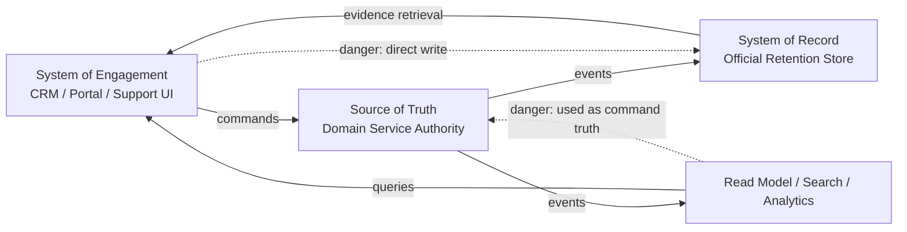
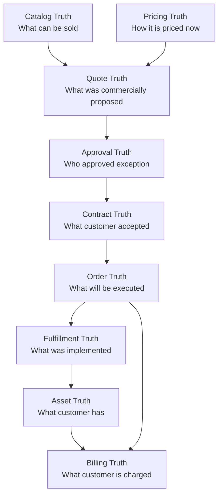
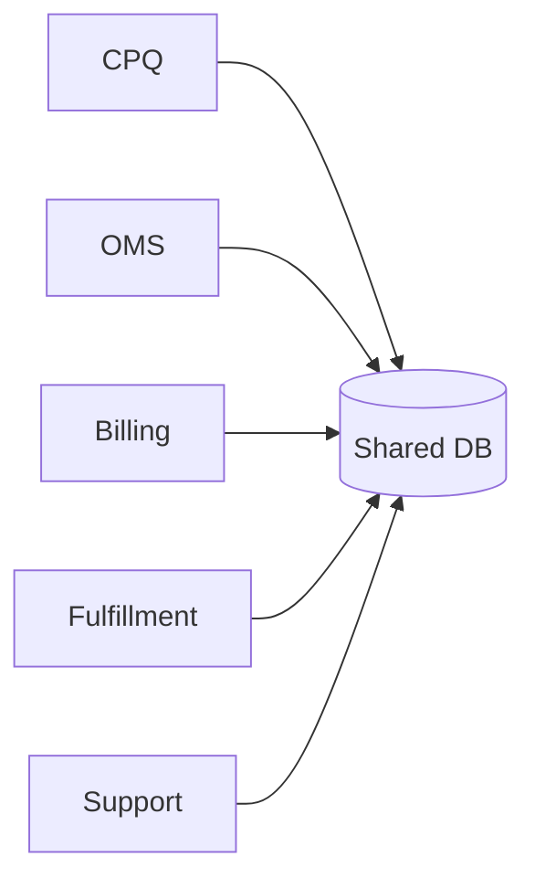
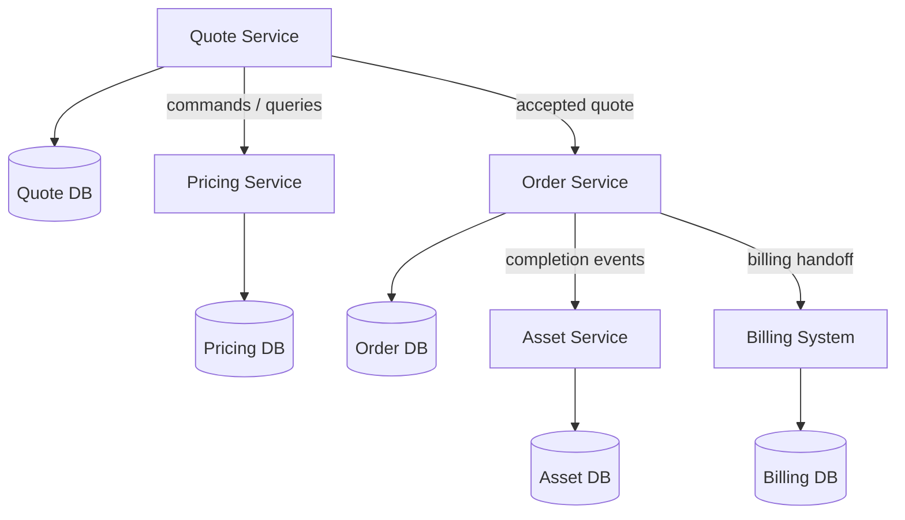
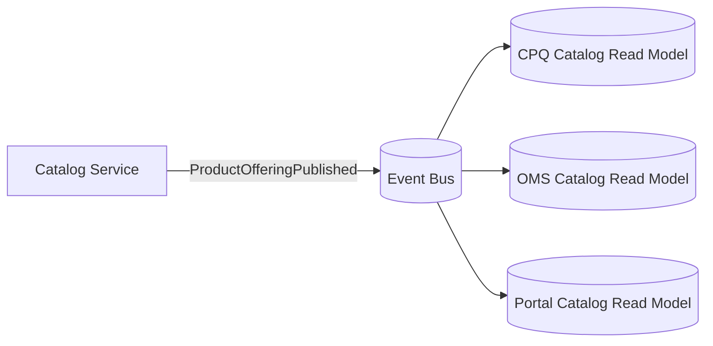
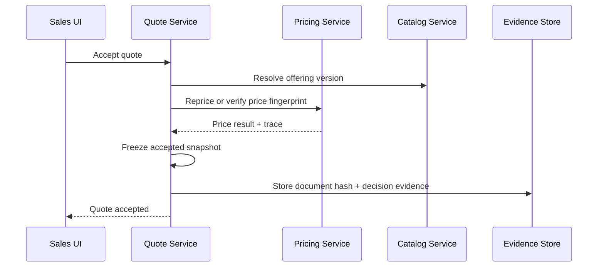
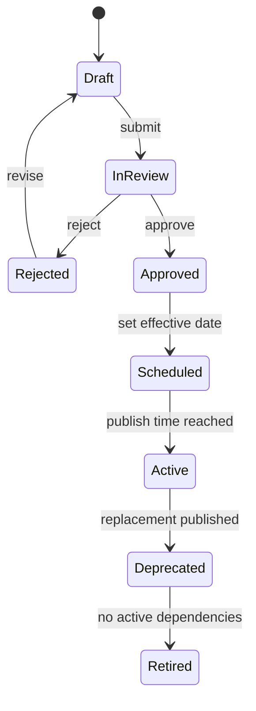
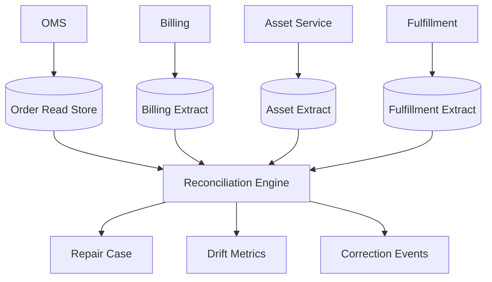
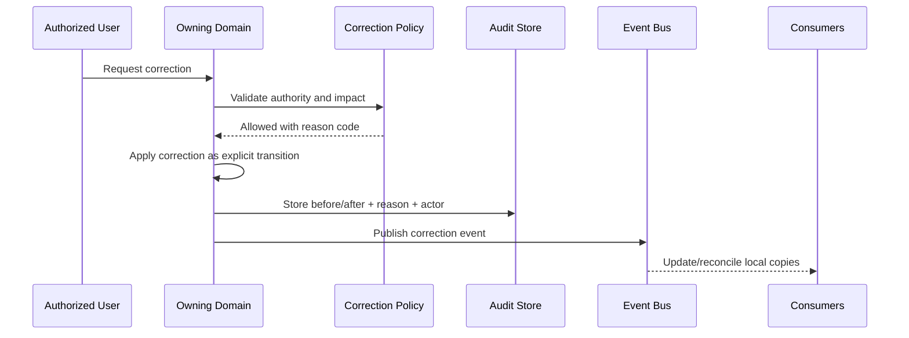
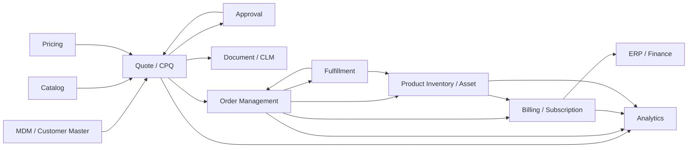

# Part 027 — Data Ownership, Master Data, and Source of Truth

Enterprise CPQ/OMS does not fail only because APIs are slow or workflows are complex. It often fails because no one can answer basic operational questions with confidence:

- Which product definition was valid when this quote was accepted?
- Which price was legally offered to the customer?
- Which account, contract, and billing entity owned the order?
- Which system is allowed to correct an asset after a failed fulfillment?
- Which downstream status is truth: OMS, provisioning, billing, inventory, or CRM?

This part builds the mental model for **data ownership**. The goal is not to create a perfect canonical data model. The goal is to make every critical fact in the CPQ/OMS landscape have a clear owner, lifecycle, mutation path, and reconciliation model.

A top-level engineer should be able to review a CPQ/OMS architecture and quickly detect dangerous data ambiguity before it becomes revenue leakage, audit exposure, operational fallout, or customer-impacting drift.

---

## 1. Kaufman Framing: The Sub-Skill We Are Practicing

In Josh Kaufman's learning model, we deconstruct a complex skill into smaller sub-skills and practice the high-leverage ones early. For CPQ/OMS, data ownership is one of those high-leverage skills because it affects every other part of the platform.

By the end of this part, you should be able to:

1. Identify the source of truth for each business entity.
2. Separate master data, transactional data, derived data, reference data, and evidence data.
3. Design ownership boundaries that survive distributed systems and enterprise integration.
4. Detect duplicated ownership and hidden shared-database coupling.
5. Define synchronization, snapshot, correction, and reconciliation rules.
6. Explain why a CPQ/OMS platform should not have a single universal canonical model for all concerns.

The practical output is a **data ownership matrix** and **truth boundary map**.

---

## 2. The Core Problem: Truth Is Contextual, Not Global

A weak enterprise design asks:

> What is the source of truth for the customer/order/product?

A stronger design asks:

> Source of truth for which fact, at which lifecycle point, for which purpose, under which authority, and with which audit obligations?

For example, consider `Product X`:

| Question | Likely Owner | Why |
|---|---|---|
| What products can be sold? | Product Catalog | Commercial sellability and offering lifecycle. |
| What product was quoted? | Quote Service | Historical commercial commitment snapshot. |
| What product was ordered? | OMS | Execution commitment accepted for fulfillment. |
| What product is installed? | Product Inventory / Asset Service | Actual customer-owned/subscribed product instance. |
| What product is billed? | Billing / Subscription System | Financial charge schedule and invoice behavior. |
| What product is provisioned? | Fulfillment / Service Inventory | Technical service/resource realization. |

There is no single universal answer. A product has multiple representations because each representation exists for a different business purpose.

The architectural mistake is not having multiple representations. The mistake is allowing those representations to mutate independently without ownership, traceability, or reconciliation.

---

## 3. Data Categories in CPQ/OMS

Before assigning ownership, classify the data.

### 3.1 Master Data

Master data is relatively stable business data reused across multiple processes.

Examples:

- Product catalog
- Price books
- Customer master
- Account hierarchy
- Legal entity
- Tax jurisdiction
- Sales channel
- Partner hierarchy
- Currency table
- Cost center
- Country/region reference

Master data is dangerous because it looks simple but has enterprise-wide consequences. A wrong product catalog entry can break quotes. A wrong account hierarchy can route approvals incorrectly. A wrong legal entity can affect contract terms and tax.

### 3.2 Transactional Data

Transactional data records business actions and commitments.

Examples:

- Quote
- Quote revision
- Approval request
- Contract acceptance
- Product order
- Order item
- Fulfillment task
- Cancellation request
- Change order
- Payment authorization

Transactional data should usually be immutable or append-only around legally meaningful transitions. Updating it as if it were a normal mutable profile record destroys auditability.

### 3.3 Derived Data

Derived data is computed from source data.

Examples:

- Quote total
- Discount percentage
- Margin estimate
- Approval requirement
- Order health status
- Fulfillment progress percentage
- Customer 360 summary
- Revenue pipeline dashboard

Derived data must declare:

- Inputs
- Formula or rule version
- Calculation timestamp
- Validity window
- Whether it is authoritative or only informational

A derived value without lineage becomes fake truth.

### 3.4 Reference Data

Reference data constrains allowed values.

Examples:

- Order action type: `ADD`, `MODIFY`, `DISCONNECT`, `SUSPEND`, `RESUME`
- Quote status
- Country code
- Currency code
- Tax category
- Fulfillment task type
- Approval reason code

Reference data should be versioned when it affects interpretation of historical records.

### 3.5 Evidence Data

Evidence data proves what happened.

Examples:

- Accepted proposal document hash
- Approval decision record
- Pricing trace
- Catalog version snapshot
- Customer acceptance timestamp
- E-signature envelope ID
- Terms and conditions version
- API request/response audit record
- Fulfillment callback payload

Evidence data is not just logging. It is part of business defensibility.

---

## 4. Source of Truth vs System of Record vs System of Engagement

These terms are often used loosely. In CPQ/OMS architecture, the distinction matters.

### 4.1 Source of Truth

The source of truth is the authority for a specific fact.

Example:

- The Quote Service is source of truth for the accepted quote snapshot.
- The Catalog Service is source of truth for active sellable product offerings.
- The OMS is source of truth for product order lifecycle.

### 4.2 System of Record

The system of record is where the official record is stored for operational/legal purposes.

A system of record may be the same as the source of truth, but not always.

Example:

- CRM may store customer account data but an MDM platform may be the mastering authority.
- CPQ may generate a proposal document, but CLM/document management may become the record holder after signature.

### 4.3 System of Engagement

The system of engagement is where users interact.

Example:

- Sales users may interact through CRM.
- Partner users may interact through a partner portal.
- Support users may interact through a case management system.

A system of engagement should not automatically be treated as a system of truth. UI ownership and data ownership are different concerns.



---

## 5. CPQ/OMS Entity Ownership Matrix

Use this matrix as a starting point, not as universal law. The exact owner may vary by organization, but the ownership must be explicit.

| Entity / Fact | Primary Owner | Consumers | Mutation Path | Snapshot Required? |
|---|---|---|---|---|
| Product Offering | Catalog Service | CPQ, OMS, CRM, Commerce | Catalog authoring/publish workflow | Yes, in quote/order |
| Product Specification | Catalog / Product Model | Catalog, Fulfillment mapping | Product governance workflow | Yes, if interpretation affects order |
| Price Book | Pricing Service / Catalog Pricing | CPQ, Billing, Finance | Price governance workflow | Yes, in quote/order |
| Promotion | Promotion/Policy Service | CPQ, Commerce, Billing | Campaign/promotion lifecycle | Yes, if applied |
| Customer Master | MDM / CRM | CPQ, OMS, Billing, Support | Customer master workflow | Usually reference + selected attributes |
| Account Hierarchy | CRM / MDM | Approval, Billing, Reporting | Account governance workflow | Yes, for approval/billing context |
| Quote | Quote Service / CPQ | CRM, OMS, CLM | Quote commands | Yes, own aggregate |
| Quote Price Trace | Pricing Service + Quote Evidence | Audit, Finance, Support | Pricing calculation event | Yes, immutable |
| Approval Decision | Approval Service | CPQ, Audit, Finance | Approval workflow | Yes, immutable |
| Accepted Proposal | Document/CPQ/CLM | Legal, Customer, Audit | Document generation/signature | Yes, immutable hash |
| Product Order | OMS | Fulfillment, Billing, Support | Order commands | Yes, own aggregate |
| Fulfillment Plan | OMS / Orchestration | Fulfillment systems | Decomposition/orchestration | Yes, execution snapshot |
| Service Order | Service Order Manager | Network/provisioning | Service order commands | Yes |
| Asset / Product Instance | Product Inventory / Asset Service | CPQ, OMS, Billing, Support | Fulfillment completion/change order | Yes, current + historical |
| Subscription | Billing/Subscription System | Finance, CPQ, Support | Billing/subscription lifecycle | Yes, finance truth |
| Invoice | Billing/ERP | Customer, Finance | Billing system | Yes, financial record |

### Engineering Rule

For every entity, define:

```text
Owner = who may decide the truth
Record = where official persistence lives
Publisher = who announces changes
Consumer = who can cache/copy/read
Correction Path = how wrong data is fixed
Reconciliation = how drift is detected
```

If any of these are missing, the system will eventually rely on tribal knowledge.

---

## 6. Why a Single Canonical Enterprise Object Usually Fails

Many organizations try to create a universal object such as:

```json
{
  "customer": {},
  "account": {},
  "quote": {},
  "order": {},
  "product": {},
  "price": {},
  "billing": {},
  "fulfillment": {}
}
```

This looks elegant but usually fails because each domain has different semantics.

Example:

- Sales thinks `customer` means buying organization.
- Legal thinks `customer` means contracting party.
- Billing thinks `customer` means invoice recipient.
- Fulfillment thinks `customer` means service location owner.
- Support thinks `customer` means the user requesting help.

A canonical model is useful for integration language, but dangerous as a replacement for domain ownership.

### Better Approach

Use **bounded canonical contracts**, not one universal model.

| Boundary | Contract Type |
|---|---|
| Catalog to CPQ | Product offering contract |
| CPQ to Pricing | Price request/response contract |
| CPQ to OMS | Accepted quote / order capture contract |
| OMS to Fulfillment | Service/resource order contract |
| OMS to Billing | Billing activation handoff contract |
| Billing to Data Warehouse | Financial event contract |
| All to Audit | Evidence event contract |

Each contract should be explicit, versioned, and owned.

---

## 7. Truth Across Lifecycle Stages

A quote and an order pass through multiple truth boundaries.



The key insight: each transition changes the type of truth.

| Transition | What Must Be Preserved |
|---|---|
| Catalog → Quote | Product offering interpretation, rules, effective date. |
| Pricing → Quote | Price result, trace, currency, rounding, discount basis. |
| Quote → Approval | Policy violation, approval reason, exact approved payload. |
| Approval → Contract | Approved quote version and customer-facing terms. |
| Contract → Order | Accepted commercial commitment and execution intent. |
| Order → Fulfillment | Decomposition rules and dependency plan. |
| Fulfillment → Asset | Actual implementation result and product instance identity. |
| Asset → Billing | Chargeable state and effective dates. |

---

## 8. Snapshot vs Reference vs Replication

A core design decision is whether to snapshot data, reference it, or replicate it.

### 8.1 Reference

Use references when the latest current truth is needed.

Example:

```json
{
  "customerId": "cust-123",
  "accountId": "acct-456",
  "productOfferingId": "po-789"
}
```

Pros:

- Avoids duplication
- Easier correction
- Smaller payload

Cons:

- Historical interpretation can drift
- External dependency at read time
- Harder audit reconstruction

Use references for mutable operational relationships, not legal/commercial commitments.

### 8.2 Snapshot

Use snapshots when historical meaning must not change.

Example:

```json
{
  "productOfferingSnapshot": {
    "id": "po-789",
    "version": "2026.07.01",
    "name": "Enterprise Fiber 1Gbps",
    "chargeModel": "RECURRING_MONTHLY",
    "contractTermMonths": 36
  }
}
```

Pros:

- Audit-safe
- Replayable
- Drift-resistant
- Supports dispute resolution

Cons:

- Larger payload
- Need schema evolution strategy
- Corrections require explicit correction events

Use snapshots for quote acceptance, pricing, approval, legal documents, and order execution basis.

### 8.3 Replication

Use replication when a domain needs a local copy for performance or autonomy.

Examples:

- CPQ keeps a published catalog read model.
- OMS keeps account and location read model for order validation.
- Support keeps order summary for customer service UI.

Replication must declare whether the copy is:

- Informational
- Command-validating
- Cache-only
- Eventually consistent
- Rebuildable from events
- Reconciliation-controlled

### Snapshot Decision Matrix

| Data | Quote | Order | Asset | Billing |
|---|---:|---:|---:|---:|
| Product offering name | Snapshot | Snapshot | Reference + history | Snapshot/reference depends on invoice requirement |
| Product offering ID | Reference + snapshot | Reference + snapshot | Reference | Reference |
| Product offering version | Snapshot | Snapshot | Snapshot at creation | Snapshot if billing depends on it |
| List price | Snapshot | Snapshot | No | Snapshot in charge schedule |
| Discount | Snapshot | Snapshot | No | Snapshot in subscription |
| Approval decision | Snapshot | Reference + snapshot | No | Reference/evidence |
| Customer legal name | Snapshot at acceptance | Snapshot if contract/order evidence | Reference | Snapshot on invoice |
| Service address | Snapshot | Snapshot | Current + historical | Snapshot if tax/location-sensitive |

---

## 9. Mutation Ownership: Who May Change What?

Ownership is not only about reading. It is mainly about mutation authority.

### 9.1 Mutation Rules

A robust CPQ/OMS platform follows these rules:

1. A service may only mutate entities it owns.
2. Cross-domain changes happen through commands or events, not direct database writes.
3. A consumer may cache another domain's data, but must not silently become its owner.
4. Historical commercial commitments are corrected through explicit correction records, not destructive updates.
5. Derived data must be recalculated or invalidated when its source changes.
6. Manual operations need the same audit rigor as automated operations.

### 9.2 Example: Product Name Change

A product manager renames `Enterprise Fiber 1Gbps` to `Business Fiber 1Gbps`.

What should happen?

| Artifact | Expected Behavior |
|---|---|
| Catalog current view | Shows new name. |
| Draft quote using current catalog | May show new name after refresh. |
| Accepted quote | Keeps old name in accepted snapshot. |
| Generated proposal PDF | Keeps old name and document hash. |
| Submitted order | Keeps quote/order snapshot. |
| Asset current display | May show current catalog display name, but history must show original sold name. |
| Invoice | Follows billing policy and legal invoice requirements. |

If all screens immediately show the new name without historical context, you lost auditability.

---

## 10. Data Ownership Anti-Patterns

### 10.1 Shared Enterprise Database

Multiple services update the same tables:



This creates hidden coupling. Every schema change becomes a cross-organization event. No service truly owns data. Data corrections bypass business invariants.

### 10.2 CRM as Universal Truth

CRM is often the system of engagement for sales. That does not mean it should own pricing, quote calculation, order lifecycle, fulfillment state, or asset truth.

Danger signs:

- CRM fields become the only integration contract.
- OMS reads status from CRM instead of its own state machine.
- Billing changes are manually copied into CRM without event lineage.
- Support agents edit order data in CRM directly.

### 10.3 Data Warehouse as Operational Truth

A data warehouse is optimized for analytics. It should not be used as command truth.

Danger signs:

- OMS validates orders using warehouse tables.
- Finance corrections are made in analytics and never propagated to operational systems.
- Dashboards show values that no operational owner can explain.

### 10.4 Event Stream as Source of Truth Without Ownership

Event sourcing can be powerful, but an event log without ownership still produces chaos.

Questions to ask:

- Who is allowed to emit the event?
- What aggregate transition caused it?
- Is the event a fact or a notification?
- Can it be replayed safely?
- What schema version applies?
- What is the correction event?

---

## 11. Ownership Patterns for CPQ/OMS

### 11.1 Domain-Owned Database

Each domain owns its persistent state.



This does not mean every service must use a different database technology. It means each service's data is private and accessible through its API/events.

### 11.2 Published Read Model

A domain publishes events. Consumers build local read models.



This improves performance and autonomy, but it requires explicit staleness handling.

### 11.3 Snapshot-on-Commit

When a commercial commitment is made, snapshot all facts needed to reconstruct the decision.



### 11.4 Correction-as-Event

Never silently rewrite historical facts that support legal or financial decisions.

Example:

```text
QuoteAccepted
QuoteCorrectionRequested
QuoteCorrectionApproved
QuoteCorrectionApplied
QuoteSuperseded
```

Corrections become part of the record.

---

## 12. Master Data Governance Model

Master data governance is the operating model that prevents chaos.

### 12.1 Governance Dimensions

| Dimension | Questions |
|---|---|
| Ownership | Who may create/update/deprecate the data? |
| Lifecycle | Draft, review, approved, active, retired? |
| Versioning | Does history need exact interpretation? |
| Effective Dating | When does the change apply? |
| Scope | Global, region, channel, customer, legal entity? |
| Validation | What rules must pass before publish? |
| Approval | Who approves commercial/legal/technical impact? |
| Rollback | Can the change be reversed safely? |
| Propagation | How do consumers receive updates? |
| Reconciliation | How do we detect mismatched consumers? |

### 12.2 Catalog Governance Example



A catalog change should not be a direct database update. It should be a governed release.

### 12.3 Price Governance Example

Price changes require stronger control because they affect revenue.

Minimum controls:

- Effective date
- Currency
- region/channel/customer scope
- approval record
- simulation result
- impacted active quotes
- impacted promotions
- rollback plan
- finance sign-off for sensitive changes

---

## 13. Reconciliation and Drift Detection

Even with good design, drift happens.

Sources of drift:

- Event delivery failure
- Manual data correction
- Legacy batch integration
- Partial fulfillment
- Retry after unknown outcome
- Downstream status mismatch
- Catalog or pricing change after quote
- Duplicate customer/account records
- Asset update failure

### 13.1 Reconciliation Types

| Type | Purpose | Example |
|---|---|---|
| Referential reconciliation | Detect missing/mismatched references | Order references unknown account ID. |
| State reconciliation | Compare lifecycle states | OMS says completed, billing not active. |
| Financial reconciliation | Compare charges and billing | Quote MRC differs from subscription MRC. |
| Asset reconciliation | Compare expected vs installed product | Order completed but asset not created. |
| Catalog reconciliation | Compare snapshot vs active catalog interpretation | Active catalog changed but order snapshot remains old. |
| Event reconciliation | Compare event log with consumer state | Consumer missed `OrderCompleted`. |

### 13.2 Reconciliation Architecture



### 13.3 Reconciliation Invariant

For every completed order item that has a billable recurring charge, there must be either:

1. an active subscription charge with matching commercial basis, or
2. an approved non-billing reason code, or
3. an open reconciliation case.

This is the kind of invariant that prevents silent revenue leakage.

---

## 14. Data Correction Model

Enterprise data will be wrong. The question is whether correction is safe.

### 14.1 Correction Categories

| Correction Type | Example | Handling |
|---|---|---|
| Display correction | Typo in product display name | Catalog correction + version/effective date. |
| Operational correction | Wrong fulfillment status | Owner system correction + event. |
| Commercial correction | Wrong discount approved | Approval/legal path; may require supersede. |
| Financial correction | Wrong billing charge | Billing adjustment/credit note, not silent rewrite. |
| Identity correction | Duplicate account merged | MDM merge event + relationship repair. |
| Historical correction | Incorrect accepted quote evidence | Strong audit workflow; preserve original and corrected evidence. |

### 14.2 Correction Flow



Never allow ad hoc SQL updates to become the normal correction mechanism.

---

## 15. Designing a CPQ/OMS Truth Boundary Map

A truth boundary map shows who owns what and how truth moves.



This map should be included in architecture reviews. Without it, discussions about integration become vague.

---

## 16. API and Event Implications

Data ownership changes API design.

### 16.1 Command API

Commands go to the owner.

Examples:

```http
POST /quotes/{quoteId}/submit-for-approval
POST /orders/{orderId}/cancel
POST /assets/{assetId}/correct-service-address
POST /catalog/product-offerings/{id}/publish
```

A command should represent a business transition, not a raw field update.

### 16.2 Query API

Queries may be served by read models, but must clearly disclose freshness and authority.

Example response metadata:

```json
{
  "data": {},
  "metadata": {
    "source": "order-read-model",
    "authoritativeFor": ["orderSearch", "supportSummary"],
    "notAuthoritativeFor": ["orderMutation", "billingCorrection"],
    "lastSyncedAt": "2026-07-02T09:31:10Z"
  }
}
```

### 16.3 Event Contract

Events should state:

- Producer
- Aggregate ID
- Event type
- Event version
- Occurred time
- Correlation ID
- Causation ID
- Source system
- Snapshot/fact payload
- Correction semantics

CloudEvents can be used as a common envelope format, but domain semantics still need explicit design.

---

## 17. Security and Access Control for Data Ownership

Ownership also affects authorization.

Examples:

- Sales can edit draft quote lines but cannot change accepted quote snapshots.
- Deal desk can approve discounts but cannot change catalog list price.
- Finance can correct billing charges but cannot edit OMS order state directly.
- Support can request order repair but cannot bypass orchestration policy.
- Product manager can publish catalog changes but cannot alter historical quotes.

### Minimum Control Set

| Control | Purpose |
|---|---|
| RBAC/ABAC | Role + context-aware access. |
| Field-level permission | Protect sensitive price/margin data. |
| State-aware permission | Different permissions for draft vs accepted vs completed. |
| Reason codes | Force explainable correction. |
| Approval for correction | Prevent silent high-impact edits. |
| Audit evidence | Preserve who/what/when/why. |

---

## 18. Observability for Data Ownership

You need observability not only for latency, but also for truth health.

### 18.1 Metrics

Track:

- Catalog publish lag per consumer
- Pricing version mismatch count
- Quote/order snapshot mismatch count
- Order-to-billing mismatch count
- Fulfillment-to-asset mismatch count
- Duplicate account reference count
- Manual correction volume
- Reconciliation backlog age
- Event consumer lag
- Read model staleness
- Unauthorized mutation attempts

### 18.2 Logs and Audit

Every critical mutation should include:

```json
{
  "actor": "user-123",
  "role": "DEAL_DESK_MANAGER",
  "action": "APPROVE_DISCOUNT_EXCEPTION",
  "aggregateType": "Quote",
  "aggregateId": "quote-456",
  "fromState": "IN_REVIEW",
  "toState": "APPROVED",
  "reasonCode": "STRATEGIC_ACCOUNT_EXCEPTION",
  "correlationId": "corr-789",
  "policyVersion": "discount-policy-2026-07",
  "occurredAt": "2026-07-02T09:30:00Z"
}
```

---

## 19. Design Review Checklist

Use this checklist when reviewing a CPQ/OMS design.

### Ownership

- [ ] Does every critical entity have a named owner?
- [ ] Is mutation authority explicit?
- [ ] Are consumers prevented from bypassing the owner?
- [ ] Are manual corrections routed through the owner?

### Snapshot and History

- [ ] Are accepted quote facts snapshotted?
- [ ] Are price traces preserved?
- [ ] Are approval decisions immutable?
- [ ] Are order execution snapshots preserved?
- [ ] Can historical documents be reconstructed?

### Replication

- [ ] Are replicated read models marked as non-authoritative where appropriate?
- [ ] Is staleness visible?
- [ ] Can read models be rebuilt?
- [ ] Is missed event detection implemented?

### Reconciliation

- [ ] Are order/billing/asset/fulfillment mismatches detected?
- [ ] Are reconciliation cases routed to owners?
- [ ] Are financial mismatches prioritized?
- [ ] Are correction events published?

### Governance

- [ ] Are catalog and price changes versioned?
- [ ] Are effective dates handled consistently?
- [ ] Are high-impact changes approved?
- [ ] Is rollback planned?

---

## 20. Common Interview / Staff-Level Questions

Use these prompts to test your understanding.

1. Who owns the product name shown on an invoice if the catalog name changed after quote acceptance?
2. Can OMS update customer master data if fulfillment discovers an address typo?
3. Should a quote reference the latest product offering or preserve the offering snapshot?
4. How do you detect that billing activated a subscription with a different monthly recurring charge than the accepted quote?
5. What is the difference between source of truth and system of engagement?
6. When is replication acceptable?
7. What is the correction path for a wrong approval decision?
8. Why is a single canonical enterprise object dangerous?
9. How should manual repair operations be audited?
10. Which data can be rebuilt from events, and which data must be retained as evidence?

---

## 21. Practice Exercise

Design a data ownership matrix for this scenario:

> A B2B customer buys a 36-month enterprise connectivity bundle. The quote includes a special discount approved by deal desk, a promotional free-installation waiver, two service locations, and billing to a parent account. After order submission, one location fails feasibility and must be replaced. Billing has already received the initial activation handoff.

Produce:

1. Entity ownership matrix.
2. Snapshot/reference decision matrix.
3. Correction flow for the failed location.
4. Reconciliation invariant between OMS, asset, and billing.
5. Events that should be emitted.
6. Data that must never be silently overwritten.

---

## 22. Key Takeaways

1. Source of truth is contextual. Ask: truth for which fact, lifecycle stage, and purpose?
2. UI ownership is not data ownership.
3. A system of engagement should not become a hidden source of truth.
4. Snapshots preserve historical meaning; references preserve current relationship.
5. Replication is acceptable only when authority and staleness are explicit.
6. Corrections must be domain-owned, audited, and evented.
7. Reconciliation is not optional in enterprise CPQ/OMS.
8. Data ownership is a revenue, audit, and reliability concern, not just a data architecture concern.

---

## 23. References

- TM Forum, TMF620 Product Catalog Management API: describes catalog element lifecycle management and consultation during ordering, campaign, and sales processes.
- TM Forum, TMF622 Product Ordering Management API: describes standardized product order placement based on product offerings defined in catalog.
- Chris Richardson, Microservices.io Database per Service Pattern: describes service-owned private data and API-based access.
- CNCF CloudEvents: describes a common event data format for interoperability across services and platforms.
