# Part 028 — Transaction Boundaries, Consistency, and Saga Design

A large-scale CPQ/OMS platform is a distributed decision and execution system. It coordinates catalog, pricing, quote, approval, contract, order, fulfillment, asset, billing, ERP, tax, payment, and customer data.

The dangerous assumption is that the end-to-end business process can behave like one database transaction.

It cannot.

This part explains how to design transaction boundaries and consistency models that are realistic for enterprise CPQ/OMS. The core objective is to know exactly where strong consistency is required, where eventual consistency is acceptable, where compensation is possible, and where the only safe recovery is reconciliation plus human-controlled repair.

---

## 1. Kaufman Framing: The Sub-Skill We Are Practicing

The skill here is not "knowing the Saga pattern". The real skill is deciding:

1. Which state changes must be atomic.
2. Which cross-system actions should be eventually consistent.
3. Which business operations are reversible.
4. Which failures require compensation.
5. Which failures require reconciliation.
6. Which events must be emitted exactly once from a business perspective, even if infrastructure delivery is at-least-once.
7. Which invariants must hold at all times, and which only need to converge.

By the end of this part, you should be able to design a CPQ/OMS saga without pretending that distributed transactions, message brokers, or workflow engines magically solve business consistency.

---

## 2. Why CPQ/OMS Cannot Be One Transaction

Consider quote-to-order-to-fulfillment:

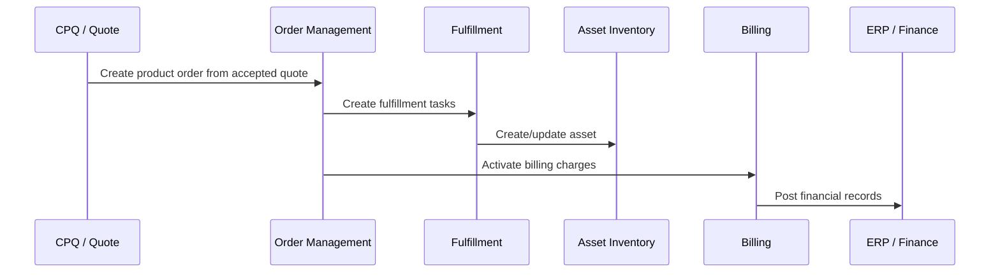

This chain may take seconds, minutes, hours, days, or weeks. Some steps involve external vendors, human approval, network provisioning, inventory reservation, credit checks, legal documentation, payment authorization, or field appointments.

A database transaction cannot cover this process because:

- It spans multiple independently owned systems.
- Some steps are asynchronous.
- Some steps are irreversible or legally meaningful.
- Some steps depend on external systems you do not control.
- Some steps require human intervention.
- Holding locks for long-running workflows is impossible.
- Retrying can create duplicates if idempotency is not designed.

The answer is not "eventual consistency everywhere". The answer is **precise consistency by boundary**.

---

## 3. Consistency Taxonomy for CPQ/OMS

### 3.1 Strong Local Consistency

Within one aggregate or one domain-owned database transaction, consistency should be strong.

Examples:

- A quote line total must match the sum of its charge components.
- A quote cannot be both `APPROVED` and `REJECTED`.
- An order item state transition must be valid.
- A pricing trace must be persisted with the quote price snapshot.
- An approval decision must be stored atomically with the decision outcome.

### 3.2 Cross-Domain Eventual Consistency

Across domains, consistency often converges through events, commands, and reconciliation.

Examples:

- OMS order status eventually appears in CRM.
- Billing activation eventually reflects completed order items.
- Asset inventory eventually reflects fulfilled product instances.
- Data warehouse eventually reflects quote/order/billing lifecycle.

### 3.3 Monotonic Business Consistency

Some transitions should only move forward unless a formal correction occurs.

Examples:

- Accepted quote should not become draft again.
- Signed document should not be overwritten.
- Completed fulfillment should not disappear silently.
- Invoice should not be deleted and recreated without financial adjustment record.

### 3.4 Compensating Consistency

Some operations cannot be rolled back technically, but can be compensated commercially or operationally.

Examples:

- A billing charge was activated incorrectly; issue credit or adjustment.
- A provisioning task completed but order later canceled; send disconnect task.
- A customer received wrong product; create corrective change order.

### 3.5 Reconciled Consistency

Some failures cannot be resolved automatically. You detect drift, open a case, and repair safely.

Examples:

- Downstream system returned timeout but may have completed the action.
- Billing says subscription active, OMS says order failed.
- Fulfillment completed a service but asset creation failed.
- Manual downstream correction occurred outside the OMS process.

---

## 4. Transaction Boundary Design

A transaction boundary should align with aggregate ownership, not user journey boundaries.

### 4.1 Local Transaction Examples

| Domain | Local Transaction |
|---|---|
| Catalog | Publish product offering version + emit publish event. |
| Pricing | Persist pricing rule version + simulation result. |
| Quote | Accept quote + freeze snapshot + persist price trace reference. |
| Approval | Record decision + transition approval request. |
| OMS | Create order aggregate + order items + initial orchestration plan. |
| Fulfillment | Create task + persist provider request ID. |
| Asset | Create/update product instance. |
| Billing | Activate subscription charge. |

### 4.2 Cross-Boundary Transaction Examples

These are not database transactions:

| Business Operation | Distributed Nature |
|---|---|
| Quote-to-order conversion | CPQ produces accepted snapshot; OMS creates order. |
| Order fulfillment | OMS coordinates fulfillment, asset, billing. |
| Cancellation | OMS coordinates cancellation, compensation, billing stop. |
| Amendment | CPQ/OMS/Billing/Asset align effective-dated changes. |
| Price change impact | Catalog/pricing changes may affect draft quotes only. |

### 4.3 Boundary Rule

```text
A local transaction protects local invariants.
A saga coordinates cross-domain progress.
A reconciliation process detects when convergence failed.
```

Do not use a saga to hide weak local invariants. Do not use local transactions to fake end-to-end consistency.

---

## 5. Saga Pattern in CPQ/OMS

A saga is a sequence of local transactions. Each local transaction updates one service/database and triggers the next step. If a step fails, compensating actions may be executed.

There are two common styles:

1. Choreography: participants react to events.
2. Orchestration: a coordinator commands participants.

CPQ/OMS usually needs orchestration for order fulfillment because dependencies, compensation, customer communication, and operational visibility are complex.

---

## 6. Choreography vs Orchestration

### 6.1 Choreography

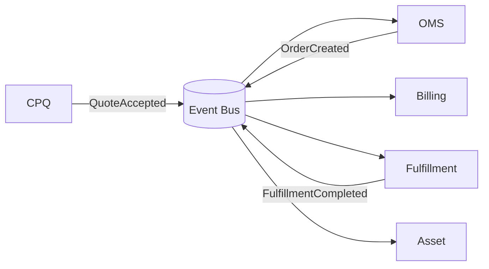

Pros:

- Loose coupling
- Simple for small workflows
- Easy to add passive consumers

Cons:

- Hard to see whole process
- Hard to model dependencies
- Hard to compensate safely
- Risk of emergent behavior
- Debugging is harder

Good for:

- Notifications
- Analytics feeds
- Read model updates
- Simple independent reactions

### 6.2 Orchestration

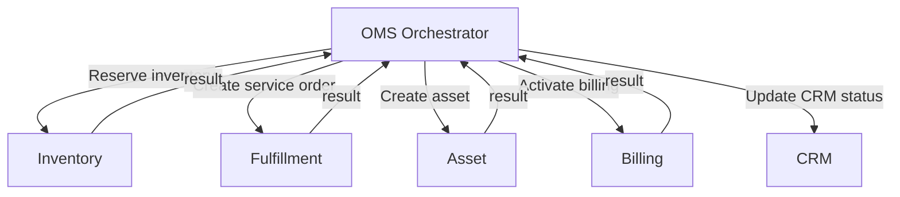

Pros:

- Central process visibility
- Easier dependency management
- Better compensation control
- Better SLA/fallout management
- Easier operational dashboards

Cons:

- Coordinator can become too smart
- Risk of coupling to downstream details
- Requires careful state modeling

Good for:

- Order fulfillment
- Cancellation
- Change order
- Multi-step provisioning
- Dependency-heavy workflows

### 6.3 Hybrid Model

Use orchestration for command-bearing process control and events for visibility/integration.

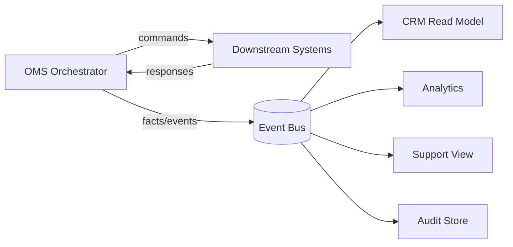

This is often the best enterprise compromise.

---

## 7. CPQ/OMS Saga Example: Quote to Order

### 7.1 Business Goal

Convert an accepted quote into a product order, preserving commercial commitment and preparing execution.

### 7.2 Steps

1. Verify quote is accepted and not expired.
2. Verify quote version/fingerprint.
3. Create order aggregate in OMS.
4. Persist order snapshot.
5. Emit `ProductOrderCreated`.
6. Build orchestration plan.
7. Emit `OrderPlanCreated`.
8. Start validation/feasibility/decomposition.

### 7.3 Transaction Boundaries

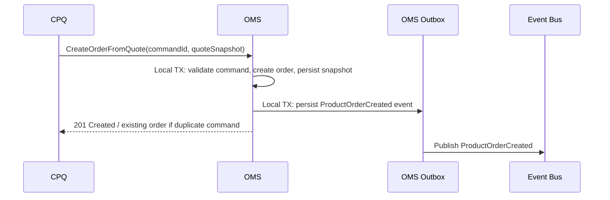

Important: the event is written to the outbox in the same local transaction as the order. Publishing to the broker happens after commit.

### 7.4 Failure Cases

| Failure | Correct Handling |
|---|---|
| CPQ sends duplicate command | Idempotency key returns existing order. |
| OMS creates order but response to CPQ times out | CPQ retries with same command ID; OMS returns existing order. |
| OMS creates order but event publish fails | Outbox relay retries. |
| Quote expired before command received | Reject command; no order created. |
| Quote accepted snapshot missing required evidence | Reject or create fallout depending on policy. |

---

## 8. CPQ/OMS Saga Example: Order Fulfillment

### 8.1 Business Goal

Execute a product order across fulfillment, asset, and billing systems.

### 8.2 Simplified Flow

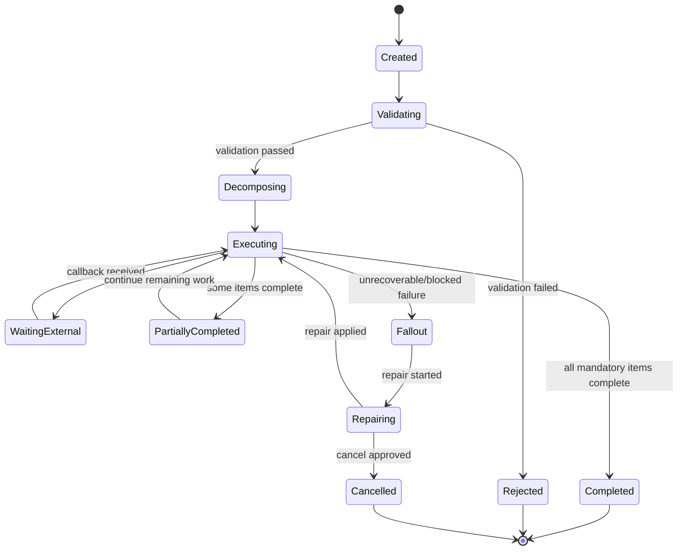

### 8.3 Step Types

| Step Type | Example | Reversible? | Compensation |
|---|---|---:|---|
| Validation | Validate account/billing/location | Yes | Not needed; no side effect. |
| Reservation | Reserve inventory/capacity | Usually yes | Release reservation. |
| Provisioning | Activate service | Often not directly | Disconnect/deactivate service. |
| Asset creation | Create product instance | Usually yes with audit | Reverse/correct asset state. |
| Billing activation | Start recurring charge | Financially sensitive | Credit/adjust/stop billing. |
| Notification | Send customer update | No | Send correction notice. |

### 8.4 Design Rule

Do not treat all failed steps equally. A failed validation is not the same as failed billing activation after service provisioning completed.

---

## 9. Outbox Pattern

The transactional outbox pattern solves a common problem:

> How do we update a database and publish an event without losing one of them?

You write both the business state change and the event record in the same local database transaction. A relay later publishes the event to the broker.

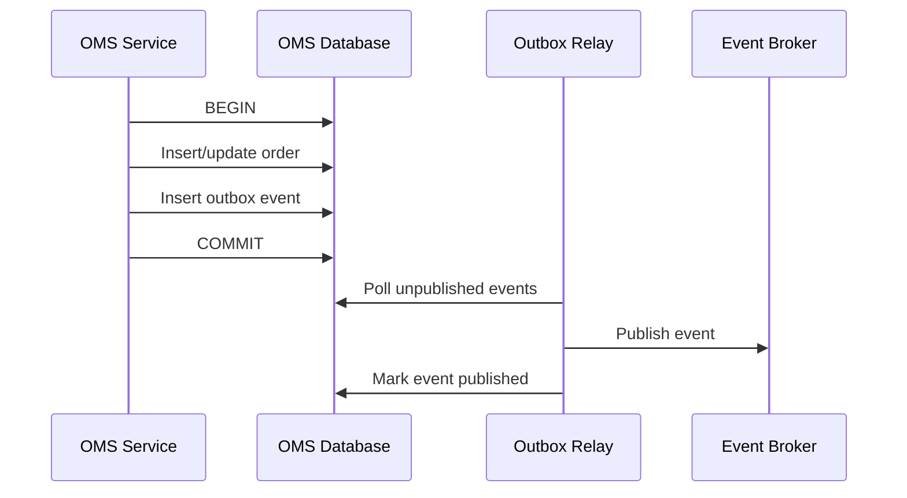

### 9.1 Outbox Table Shape

```sql
CREATE TABLE outbox_event (
    event_id           UUID PRIMARY KEY,
    aggregate_type     VARCHAR(100) NOT NULL,
    aggregate_id       VARCHAR(100) NOT NULL,
    event_type         VARCHAR(200) NOT NULL,
    event_version      INT NOT NULL,
    payload_json       JSONB NOT NULL,
    correlation_id     VARCHAR(100),
    causation_id       VARCHAR(100),
    occurred_at        TIMESTAMPTZ NOT NULL,
    published_at       TIMESTAMPTZ,
    publish_attempts   INT NOT NULL DEFAULT 0,
    status             VARCHAR(30) NOT NULL
);
```

### 9.2 Outbox Invariants

- Every business event must correspond to a committed aggregate change.
- Events must be publishable more than once safely.
- Consumers must deduplicate by event ID.
- Event payloads must be versioned.
- Relay failure must not lose events.
- Event ordering must be considered per aggregate, not globally.

---

## 10. Inbox Pattern

If producers may publish duplicates, consumers need idempotent processing. The inbox pattern records processed message IDs.

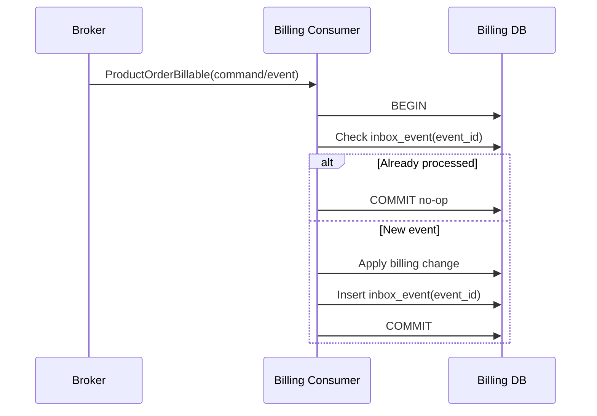

### 10.1 Inbox Table Shape

```sql
CREATE TABLE inbox_event (
    event_id        UUID PRIMARY KEY,
    source          VARCHAR(100) NOT NULL,
    event_type      VARCHAR(200) NOT NULL,
    aggregate_id    VARCHAR(100),
    received_at     TIMESTAMPTZ NOT NULL,
    processed_at    TIMESTAMPTZ,
    status          VARCHAR(30) NOT NULL,
    error_message   TEXT
);
```

---

## 11. Idempotency Design

Idempotency means repeated requests produce the same business result.

### 11.1 Idempotency Key Placement

| Operation | Recommended Idempotency Key |
|---|---|
| Create order from quote | `quoteId + quoteVersion + conversionRequestId` |
| Submit quote for approval | `quoteId + quoteVersion + submitRequestId` |
| Approve quote | `approvalRequestId + approverId + decisionId` |
| Create fulfillment task | `orderItemId + taskType + planVersion` |
| Activate billing | `orderItemId + chargeId + billingActivationRequestId` |
| Create asset | `orderItemId + productInstanceKey` |
| Cancel order | `orderId + cancellationRequestId` |

### 11.2 Idempotent Command Response

If a command is retried, return the existing outcome.

```json
{
  "status": "ALREADY_PROCESSED",
  "resourceId": "order-123",
  "idempotencyKey": "quote-789:v3:convert-001",
  "originalProcessedAt": "2026-07-02T09:35:00Z"
}
```

### 11.3 Common Idempotency Bug

A common bug is generating a new ID inside the receiver before checking idempotency.

Bad:

```text
receive command -> create new orderId -> check duplicate -> too late
```

Good:

```text
receive command -> check idempotency key -> return existing or create new resource atomically
```

---

## 12. Retry Semantics

Retries are necessary, but unsafe retries create duplicates and incorrect state.

### 12.1 Retry Categories

| Failure Type | Retry? | Notes |
|---|---:|---|
| Network timeout before request reached downstream | Yes | Safe only with idempotency key. |
| HTTP 500 unknown outcome | Yes with caution | Query status or retry idempotently. |
| Validation error | No | Requires data correction. |
| Business rejection | No | Move to fallout/rejected. |
| Rate limit | Yes with backoff | Preserve order of dependent steps. |
| Downstream unavailable | Yes with backoff/circuit breaker | Avoid retry storm. |
| Timeout after downstream completed | Query/reconcile first | Unknown outcome. |

### 12.2 Retry Policy Example

```yaml
taskType: ACTIVATE_BILLING
maxAttempts: 5
backoff:
  type: exponential
  initialDelaySeconds: 30
  maxDelayMinutes: 30
retryOn:
  - TIMEOUT
  - HTTP_502
  - HTTP_503
  - HTTP_504
noRetryOn:
  - VALIDATION_ERROR
  - BUSINESS_REJECTION
  - UNAUTHORIZED
unknownOutcomePolicy: QUERY_THEN_RECONCILE
fallback: OPEN_FALLOUT_CASE
```

---

## 13. Unknown Outcome Handling

Unknown outcome is one of the hardest distributed systems problems.

Example:

1. OMS sends `ActivateBilling`.
2. Billing processes the request successfully.
3. Billing response times out.
4. OMS does not know whether billing activated the charge.

Wrong handling:

- Blindly send another activation without idempotency.
- Mark billing as failed without checking.
- Let support manually override OMS state.

Correct handling:

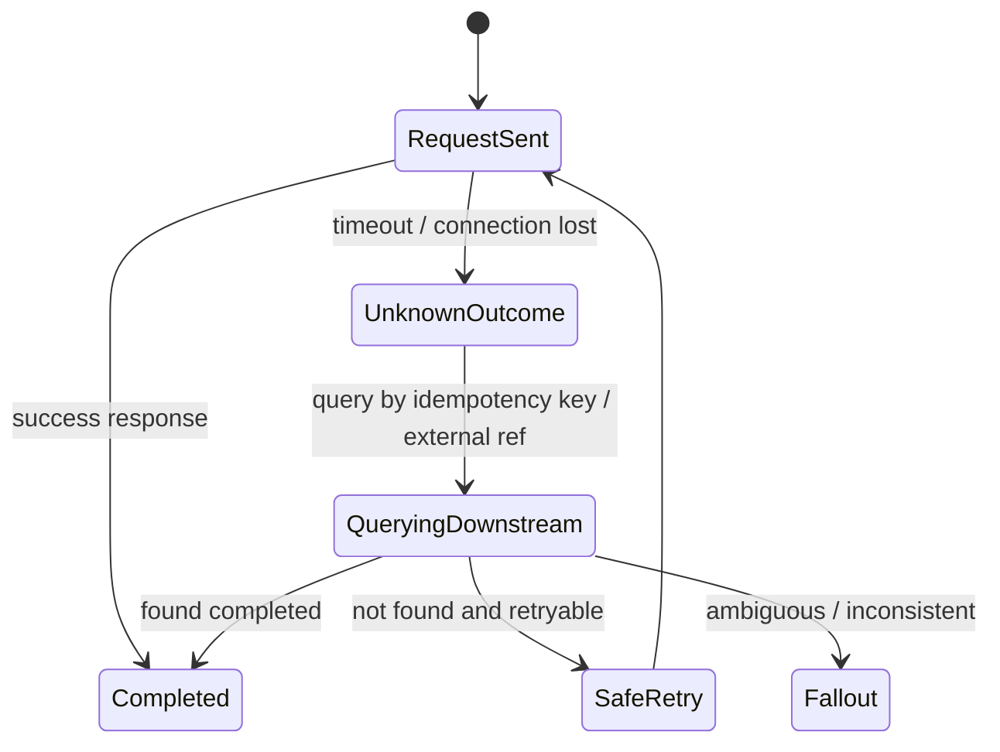

Unknown outcome should be a first-class state, not hidden as generic failure.

---

## 14. Compensation Design

Compensation is not rollback. Rollback pretends the original action never happened. Compensation acknowledges the action happened and performs another action to offset it.

### 14.1 Compensation Examples

| Original Action | Compensation |
|---|---|
| Reserve inventory | Release reservation. |
| Activate service | Deactivate/disconnect service. |
| Create asset | Mark asset canceled/reversed; preserve history. |
| Activate billing | Stop charge and issue credit/adjustment if needed. |
| Send customer confirmation | Send correction/cancellation notice. |
| Approve discount | Supersede approval or require reapproval. |

### 14.2 Compensation Requirements

A compensation action must define:

- Trigger condition
- Authority
- Idempotency key
- Preconditions
- Side effects
- Customer impact
- Financial impact
- Audit record
- Reconciliation check

### 14.3 Compensation State Machine

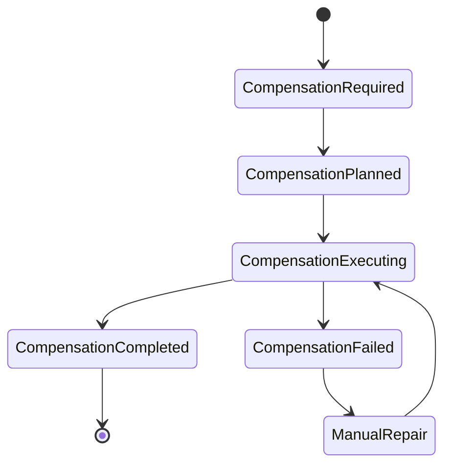

---

## 15. Saga State Model

A saga should be modeled explicitly.

### 15.1 Saga Instance Fields

```json
{
  "sagaId": "saga-123",
  "sagaType": "ORDER_FULFILLMENT",
  "businessKey": "order-456",
  "state": "EXECUTING",
  "version": 7,
  "currentStep": "ACTIVATE_BILLING",
  "correlationId": "corr-789",
  "startedAt": "2026-07-02T09:00:00Z",
  "lastTransitionAt": "2026-07-02T09:45:00Z",
  "timeoutAt": "2026-07-02T10:15:00Z",
  "steps": []
}
```

### 15.2 Saga Step Fields

```json
{
  "stepId": "step-001",
  "type": "CREATE_ASSET",
  "state": "COMPLETED",
  "attempt": 1,
  "idempotencyKey": "order-item-1:create-asset:v1",
  "externalReference": "asset-999",
  "startedAt": "2026-07-02T09:10:00Z",
  "completedAt": "2026-07-02T09:12:00Z",
  "compensationStep": "CANCEL_ASSET"
}
```

### 15.3 Saga Invariants

- A completed step must not execute again unless explicitly replay-safe.
- A compensating step must reference the original step.
- A saga must have a terminal state.
- A saga timeout must produce an operational signal.
- A saga transition must be optimistic-lock protected.
- A saga event must be emitted after meaningful state changes.

---

## 16. Workflow Engine vs Domain State Machine

Workflow engines can help execute sagas. They do not replace domain modeling.

### 16.1 What Workflow Engines Are Good At

- Long-running process state
- Timers
- Retries
- Human tasks
- Visual process monitoring
- External task coordination
- Operational visibility

### 16.2 What They Do Not Solve Automatically

- Domain invariants
- Idempotency keys
- Financial correctness
- Snapshot semantics
- Compensation semantics
- Data ownership
- Versioned business rules
- Audit evidence quality

### 16.3 Design Rule

Keep domain state in domain aggregates. Use workflow state to coordinate execution.

Bad:

```text
Order state exists only as BPMN token position.
```

Good:

```text
Order aggregate owns order lifecycle.
Workflow coordinates tasks and updates order through domain commands.
```

---

## 17. Consistency Invariants for CPQ/OMS

Define invariants by strictness.

### 17.1 Always-True Local Invariants

- A quote cannot be accepted unless it passed required validation.
- An accepted quote snapshot cannot be modified destructively.
- An order item cannot transition from `COMPLETED` to `CREATED`.
- A billing activation request must reference an order item and charge snapshot.
- An approval decision must reference the exact quote version approved.

### 17.2 Eventually-True Cross-Domain Invariants

- Completed billable order items eventually have active billing charges or approved non-billing reason.
- Completed product order items eventually have product instances or approved exception.
- Order status eventually appears in support/CRM read models.
- Billing status eventually appears in order operations dashboard.

### 17.3 Monitored Invariants

- No event consumer lag exceeds threshold for critical domains.
- No `UNKNOWN_OUTCOME` task remains unresolved beyond SLA.
- No completed order item lacks asset/billing reconciliation result.
- No active billing charge exists for canceled order item unless correction reason exists.

---

## 18. Exactly-Once Is a Business Property, Not Infrastructure Magic

Infrastructure often provides at-least-once delivery. Some systems provide stronger guarantees under constraints, but enterprise integrations still need idempotent consumers.

Business exactly-once means:

> The business effect happens once, even if the message/request is delivered more than once.

Achieve it with:

- Idempotency keys
- Unique constraints
- Inbox table
- Outbox table
- External reference keys
- Status query by business key
- Reconciliation
- Immutable event IDs
- Consumer deduplication

Do not rely on the broker alone to protect business correctness.

---

## 19. Ordering Guarantees

Not all events need global ordering. Most CPQ/OMS events need ordering per aggregate.

### 19.1 Aggregate Sequence

Add sequence numbers:

```json
{
  "eventId": "evt-123",
  "aggregateType": "Order",
  "aggregateId": "order-456",
  "aggregateVersion": 12,
  "eventType": "OrderItemCompleted"
}
```

Consumers can detect gaps:

```text
expected version 11, received version 12 -> pause and recover
```

### 19.2 Ordering Pitfalls

- Publishing from multiple producers for same aggregate.
- Repartitioning topics without stable aggregate key.
- Retrying old messages after newer messages processed.
- Updating read models without version checks.
- Treating event timestamp as reliable ordering source.

---

## 20. Concurrency Control

### 20.1 Optimistic Locking

Use aggregate version fields.

```sql
UPDATE product_order
SET status = 'VALIDATING', version = version + 1
WHERE order_id = :orderId
  AND version = :expectedVersion;
```

If zero rows are updated, another process changed the aggregate. Reload and decide.

### 20.2 Command Preconditions

Commands should include expected state/version when appropriate.

```json
{
  "command": "CancelOrder",
  "orderId": "order-123",
  "expectedVersion": 8,
  "reasonCode": "CUSTOMER_REQUEST"
}
```

### 20.3 Concurrent Mutation Examples

| Conflict | Handling |
|---|---|
| User cancels order while fulfillment callback completes task | State machine decides whether cancellation still allowed; may require compensation. |
| Price change occurs while quote is being submitted | Quote fingerprint/version check. |
| Approval decision arrives after quote revision | Decision applies only to referenced quote version; otherwise stale. |
| Billing callback arrives after order item canceled | Reconcile and compensate billing. |

---

## 21. Saga Versioning and Process Evolution

Enterprise workflows change. Existing orders may still be running under old rules.

### 21.1 Versioned Saga Definition

Store process version on the saga instance.

```json
{
  "sagaType": "ORDER_FULFILLMENT",
  "definitionVersion": "2026.07.01",
  "startedAt": "2026-07-02T09:00:00Z"
}
```

### 21.2 Rules

- In-flight sagas should generally continue under their original definition unless migration is explicit.
- New orders use the latest active definition.
- Compensation logic must remain available for old steps.
- Removing a task type requires migration strategy.
- Replay tests must cover old process versions.

---

## 22. Reconciliation as a Safety Net

Sagas reduce inconsistency, but they do not eliminate it. Reconciliation is mandatory.

### 22.1 Reconciliation Loop

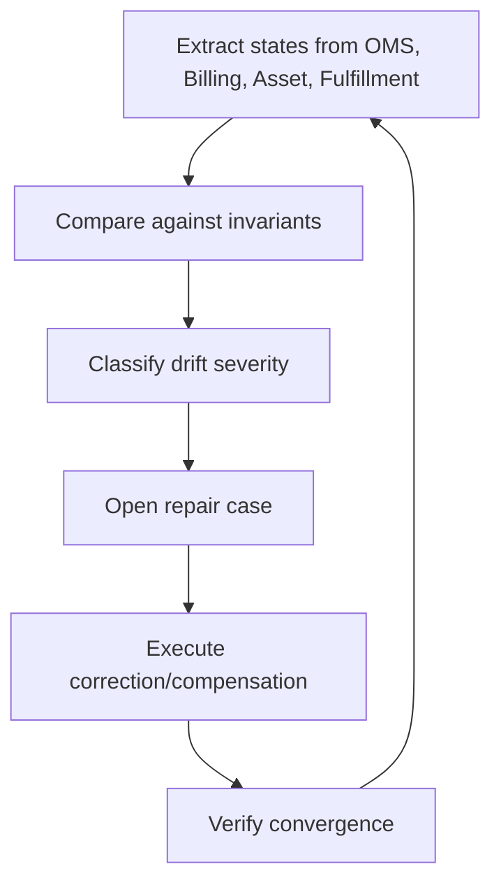

### 22.2 Example Reconciliation Rule

```text
For every order item in COMPLETED state with chargeType = RECURRING:
  there must exist an active billing charge with:
    same orderItemId or accepted commercial reference,
    same currency,
    same charge amount or approved adjusted amount,
    same effective start date or approved override.
```

### 22.3 Severity

| Severity | Example | Handling |
|---|---|---|
| P0 | Service active but billing missing for high-value account | Immediate repair/escalation. |
| P1 | Billing active but order item canceled | Stop/credit and investigate. |
| P2 | CRM status stale | Read model repair. |
| P3 | Analytics lag | Batch rebuild. |

---

## 23. Observability for Distributed Consistency

Track business consistency metrics, not only technical metrics.

### 23.1 Metrics

- Saga duration by type
- Saga stuck count
- Step retry count
- Unknown outcome count
- Compensation count
- Compensation failure count
- Outbox unpublished event age
- Inbox duplicate event count
- Consumer lag by critical topic
- Order-to-billing mismatch count
- Order-to-asset mismatch count
- Manual repair backlog age
- Idempotency conflict count

### 23.2 Traceability

Every distributed flow should carry:

- Correlation ID
- Causation ID
- Business key
- Saga ID
- Order ID
- Quote ID
- Customer/account ID
- External reference ID
- Idempotency key

Without these, production debugging becomes archaeology.

---

## 24. Security and Control Considerations

Distributed consistency failures can become security and compliance failures.

Examples:

- User bypasses OMS and directly edits billing to fix an order.
- Support resubmits fulfillment task without authorization.
- Deal desk approval is reused after quote changed.
- Manual correction lacks reason code.
- Event replay accidentally re-triggers financial action.

Controls:

- State-aware permissions
- Idempotent reprocessing tools
- Replay-safe event consumers
- Segregation of duties for financial corrections
- Reason codes and approval for compensation
- Audit for every manual intervention

---

## 25. Testing Strategy

### 25.1 Unit Tests

- State transition validity
- Idempotency key handling
- Compensation eligibility
- Retry classification
- Unknown outcome transition

### 25.2 Integration Tests

- Outbox publishing after commit
- Inbox deduplication
- Consumer replay
- External timeout behavior
- Duplicate callback handling

### 25.3 Saga Tests

- Happy path
- Failure before side effect
- Failure after side effect
- Timeout with unknown outcome
- Partial fulfillment
- Cancellation during execution
- Compensation failure
- Process version migration

### 25.4 Reconciliation Tests

- Missing billing charge
- Duplicate billing charge
- Asset missing after order completion
- Fulfillment completed but OMS stuck
- Consumer missed event
- Manual downstream correction

### 25.5 Chaos / Failure Injection

Inject:

- Broker outage
- Downstream timeout
- Duplicate messages
- Out-of-order events
- Database deadlock
- Relay crash after publish before marking event published
- Consumer crash after side effect before inbox commit

---

## 26. Design Review Checklist

### Transaction Boundaries

- [ ] Are local transaction boundaries explicit?
- [ ] Are local invariants enforced inside the owning domain?
- [ ] Are cross-domain operations modeled as sagas or event-driven flows?
- [ ] Is there no hidden distributed transaction assumption?

### Saga Design

- [ ] Is saga state explicit and queryable?
- [ ] Are step states explicit?
- [ ] Are timeouts modeled?
- [ ] Is unknown outcome modeled separately from failure?
- [ ] Are compensations defined for side-effecting steps?
- [ ] Are unrecoverable failures routed to fallout?

### Idempotency and Events

- [ ] Does every command have an idempotency strategy?
- [ ] Does every consumer deduplicate events?
- [ ] Is outbox used for state-change events?
- [ ] Is inbox used for non-idempotent consumers?
- [ ] Are event payloads versioned?
- [ ] Is event ordering handled per aggregate?

### Reconciliation

- [ ] Are cross-domain invariants monitored?
- [ ] Are repair cases created automatically?
- [ ] Are financial mismatches prioritized?
- [ ] Is reconciliation itself observable?

### Operations

- [ ] Can operators see stuck sagas?
- [ ] Can operators safely retry a step?
- [ ] Can operators distinguish retry, compensation, and correction?
- [ ] Are manual interventions audited?

---

## 27. Common Interview / Staff-Level Questions

1. Why should quote-to-order conversion not be one distributed transaction?
2. Where should strong consistency be enforced in CPQ/OMS?
3. What is the difference between retry and compensation?
4. How do you handle a timeout after billing activation request?
5. Why does an outbox table reduce event-loss risk?
6. Why does a consumer still need idempotency if the producer has outbox?
7. When would you use choreography instead of orchestration?
8. How do you prevent stale approval from being applied to a revised quote?
9. What metrics reveal distributed consistency problems?
10. Why is exactly-once a business design problem, not only a broker feature?

---

## 28. Practice Exercise

Design a saga for this scenario:

> An accepted enterprise quote creates an order with three order items: primary connectivity, managed router, and premium support. Connectivity requires feasibility and provisioning. Router requires inventory reservation and shipping. Premium support becomes active only after connectivity is completed. Billing should start for connectivity and support after service activation, but router hardware should bill on shipment. The customer cancels the router item after inventory reservation but before shipment.

Produce:

1. Saga steps and dependencies.
2. Local transaction boundaries.
3. Idempotency keys for each external command.
4. Compensation plan for router cancellation.
5. Unknown outcome handling for billing activation.
6. Reconciliation rules for OMS, billing, asset, and shipping.
7. Operational dashboard states.

---

## 29. Key Takeaways

1. CPQ/OMS cannot be one ACID transaction across all systems.
2. Strong consistency belongs inside local domain boundaries.
3. Sagas coordinate cross-domain progress; they do not remove the need for domain invariants.
4. Orchestration is usually better for complex order fulfillment; choreography is useful for passive reactions and simple independent flows.
5. Outbox protects event publication after local commit.
6. Inbox protects consumers from duplicate effects.
7. Unknown outcome must be modeled explicitly.
8. Compensation is not rollback; it is a new business action.
9. Reconciliation is mandatory for enterprise-grade correctness.
10. Exactly-once business effect requires idempotency, deduplication, constraints, and repair—not faith in infrastructure.

---

## 30. References

- Chris Richardson, Microservices.io Saga Pattern: describes sagas as a way to manage transactions spanning services when each service has its own database.
- Chris Richardson, Microservices.io Transactional Outbox Pattern: describes persisting business state and events atomically before publishing events asynchronously.
- Chris Richardson, Microservices.io Database per Service Pattern: describes keeping each service's persistent data private and accessible only via API.
- TM Forum, TMF622 Product Ordering Management API: describes product order placement with required order parameters based on catalog-defined product offerings.
- CNCF CloudEvents: describes a common event data format for interoperability across services, platforms, and systems.
