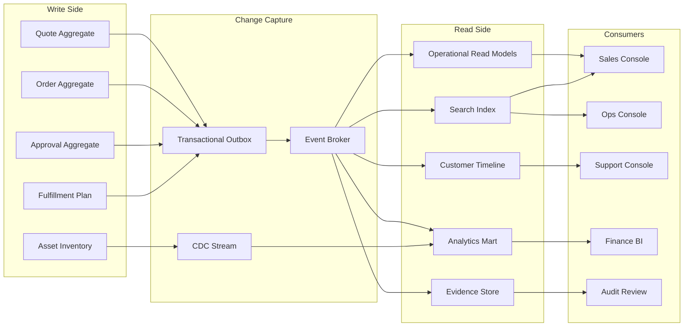
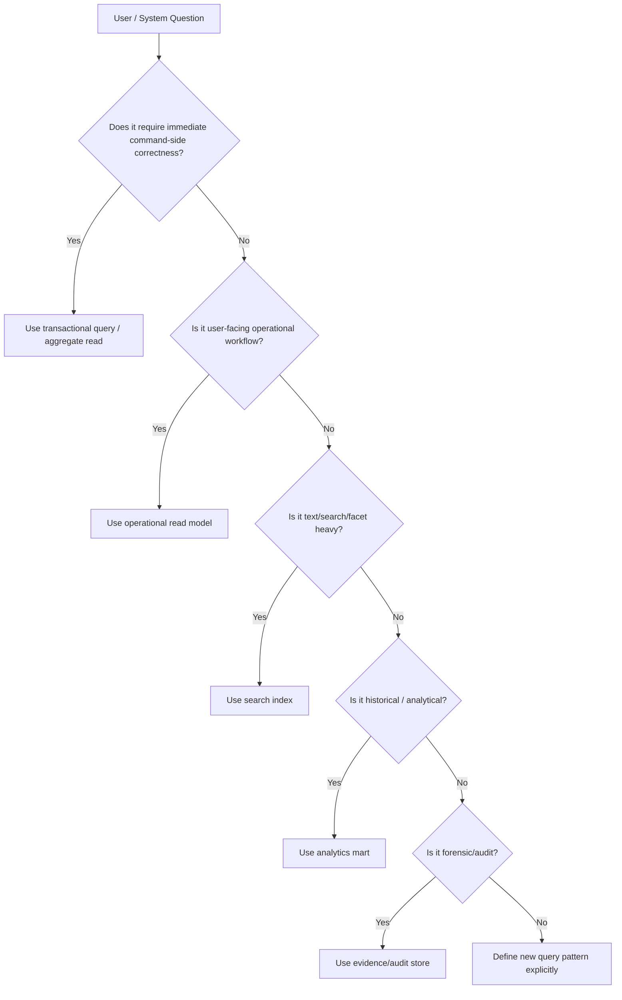
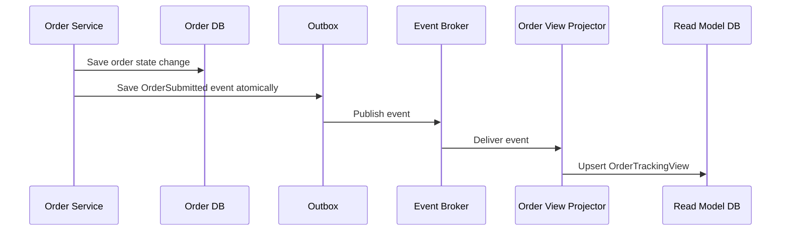
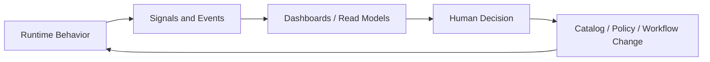
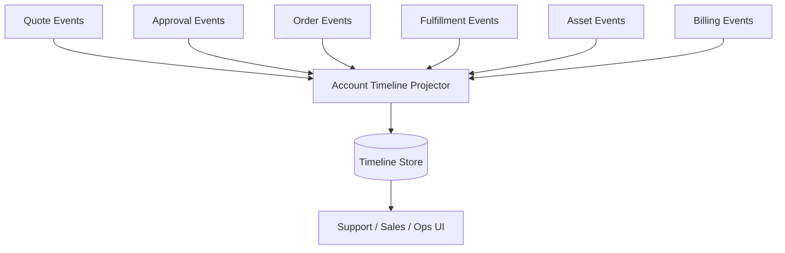
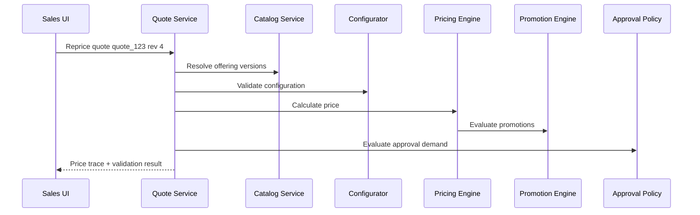
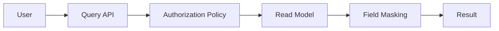
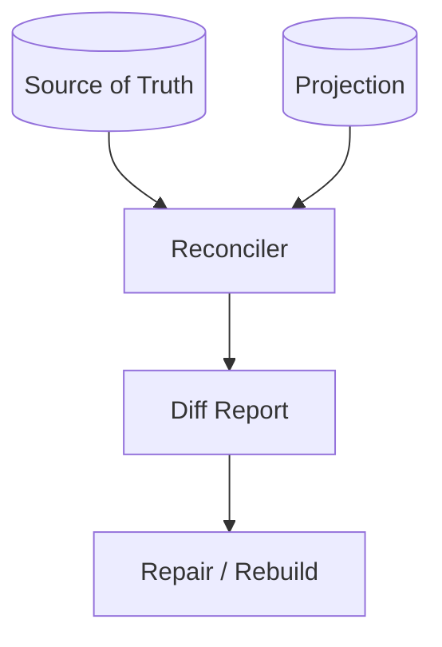

# Part 029 — Search, Read Models, Reporting, and Operational Visibility

A CPQ/OMS platform is not useful just because it can accept quotes and submit orders. In an enterprise, the platform must also answer operational questions quickly and defensibly:

- Which quotes are waiting for approval?
- Which approved quotes are about to expire?
- Which orders are stuck?
- Which product lines are blocked by feasibility?
- Which fulfillment tasks are breaching SLA?
- Which deals carry unusual discounts?
- Which orders were submitted against stale catalog or pricing data?
- Which customer accounts are affected by a downstream outage?
- Which users, rules, systems, and versions caused a commercial decision?

This part focuses on the query side of CPQ/OMS: search, read models, reporting, dashboards, operational visibility, and feedback loops.

The core mental model is simple:

> The write model protects correctness. The read model accelerates understanding.

Do not force the write model to serve every operational dashboard. Do not let reporting teams query transactional tables directly and accidentally couple business operations to storage internals. And do not build dashboards that hide freshness, lineage, or reconciliation gaps.

---

## 1. Kaufman Framing: The Sub-Skill We Are Practicing

The sub-skill here is not "install Elasticsearch" or "create a dashboard". The real skill is designing trustworthy visibility for a complex commercial execution platform.

By the end of this part, you should be able to:

1. Decide which questions belong to transactional queries, search indexes, read models, analytics marts, or observability tooling.
2. Design read models without corrupting command-side invariants.
3. Handle eventual consistency and freshness expectations explicitly.
4. Build operational dashboards that lead to action, not vanity metrics.
5. Separate business reporting from system observability.
6. Trace quote/order outcomes across catalog, pricing, approval, fulfillment, billing, and asset systems.
7. Detect drift between source-of-truth state and projected read models.

The practice target is concrete: given any CPQ/OMS feature, you should be able to define its command model, read model, search model, reporting model, observability signals, and reconciliation checks.

---

## 2. Why Read Models Matter in CPQ/OMS

Enterprise users rarely interact with a single quote or order in isolation. They work through queues, dashboards, exception views, account timelines, approval worklists, renewal pipelines, fallout boards, and management reports.

A naive CPQ/OMS design usually starts like this:

```text
Application UI -> Transactional Database -> Many joins -> Dashboard
```

This works for a small application. It fails when:

1. Quote and order aggregates become large.
2. Data is distributed across services.
3. Different teams need different views.
4. Search requires text relevance, faceting, filtering, and sorting.
5. Operational views need near-real-time updates.
6. Finance needs historical snapshots.
7. Audit needs immutable evidence.
8. Support needs account-level timeline reconstruction.
9. Leadership needs trend reports over months or years.

A large CPQ/OMS platform therefore needs multiple query surfaces.



The read side is not a lower-quality copy of the write side. It is a set of purpose-built models optimized for questions, workflows, and decisions.

---

## 3. Command Model vs Query Model

The command model is designed around invariants.

Examples:

- A quote cannot be accepted after expiry.
- A submitted quote cannot be edited without a new revision.
- A discount above threshold requires approval.
- An order cannot be submitted without required billing account.
- A fulfillment task cannot complete before its dependency completes.

The query model is designed around access patterns.

Examples:

- Show all quotes expiring in the next 7 days.
- Show orders stuck in feasibility for more than 2 hours.
- Show account timeline across quote, order, asset, billing, and support events.
- Show all orders affected by a catalog version.
- Show approval worklist grouped by approver, region, and SLA.

Martin Fowler describes CQRS as separating the model used to update information from the model used to read information. The warning is important: CQRS can add risky complexity and should be applied where it solves a real problem, not as default architecture ornamentation.

For CPQ/OMS, CQRS is often justified because:

1. Write-side invariants are complex.
2. Read-side questions are numerous and cross-aggregate.
3. Search requirements differ from transactional access.
4. Operational dashboards need denormalized views.
5. Reporting requires historical and analytical transformations.

But the separation must be intentional.



---

## 4. Query Surface Taxonomy

A mature CPQ/OMS usually has at least seven query surfaces.

| Query Surface | Primary Use | Freshness Need | Typical Storage | Example |
|---|---:|---:|---|---|
| Transactional read | Immediate correctness | Strong/current | OLTP database | Re-open quote and validate current state |
| Operational read model | Work queues and screens | Seconds | Relational/document projection | Approval worklist |
| Search index | Text, filter, sort, facet | Seconds to minutes | Search engine | Search quotes by customer/product/status |
| Timeline model | Cross-domain event history | Seconds/minutes | Event projection/document store | Account timeline |
| Analytics mart | Trend and BI | Minutes/hours/day | Warehouse/lakehouse | Discount leakage by quarter |
| Audit/evidence store | Legal/forensic proof | Immutable | Append-only store/object store | Accepted quote evidence package |
| Observability backend | System behavior | Seconds | Metrics/traces/logs backend | Pricing latency p95, error rate |

Do not merge all of these into one database table. That usually creates a model that is bad at everything: too slow for UI, too mutable for audit, too detailed for reporting, and too coupled for evolution.

---

## 5. Designing Operational Read Models

An operational read model exists to make a workflow fast and understandable.

Examples:

- `QuoteWorklistView`
- `ApprovalInboxView`
- `OrderTrackingView`
- `FulfillmentFalloutView`
- `CustomerCommercialTimelineView`
- `ExpiringQuoteView`
- `StaleApprovalView`
- `OrderSlaRiskView`

A good read model is not just a table clone. It encodes workflow semantics.

### 5.1 Example: Approval Inbox Read Model

```yaml
ApprovalInboxItem:
  approvalRequestId: appr_123
  quoteId: quote_456
  quoteNumber: Q-2026-000456
  quoteRevision: 4
  customerName: Acme Manufacturing
  accountSegment: Enterprise
  region: APAC
  totalContractValue: 1250000.00
  currency: USD
  maxDiscountPercent: 42.5
  marginPercent: 18.2
  requestedBy: sales.rep@example.com
  currentApprover: finance.director@example.com
  approvalPolicyVersion: deal-policy-2026.07.01
  approvalReasonCodes:
    - DISCOUNT_ABOVE_FLOOR
    - MARGIN_BELOW_REGION_THRESHOLD
  submittedAt: 2026-07-02T09:15:00+07:00
  slaDueAt: 2026-07-03T09:15:00+07:00
  status: PENDING
  freshness:
    sourceEventId: evt_999
    projectedAt: 2026-07-02T09:15:04+07:00
    lagSeconds: 4
```

Notice what this model optimizes for:

- Who needs to act?
- Why do they need to act?
- How urgent is it?
- What commercial risk is involved?
- Which version of the policy created this request?
- Is the view fresh enough to trust?

The read model should not be the authority for approving the quote. It is the authority for showing the worklist. The command-side approval aggregate remains the authority for state transition.

---

## 6. Designing Search Models

Search is different from transactional querying.

A sales rep may search by:

- Quote number.
- Customer name.
- Product name.
- Opportunity ID.
- Account owner.
- Approval status.
- Quote expiry date.
- Region.
- Channel.
- Tag.
- External reference.

An operations user may search by:

- Order number.
- Customer identifier.
- Fulfillment status.
- Fallout reason.
- Downstream system.
- Service address.
- SLA breach.
- Product family.
- Correlation ID.

A search document should be designed around retrieval, not normalization.

### 6.1 Quote Search Document

```json
{
  "documentType": "quote",
  "quoteId": "quote_456",
  "quoteNumber": "Q-2026-000456",
  "revision": 4,
  "status": "APPROVED",
  "customer": {
    "accountId": "acct_001",
    "name": "Acme Manufacturing",
    "legalName": "Acme Manufacturing Pte Ltd",
    "segment": "Enterprise"
  },
  "commercial": {
    "currency": "USD",
    "totalContractValue": 1250000.00,
    "maxDiscountPercent": 42.5,
    "marginPercent": 18.2
  },
  "products": [
    { "offeringId": "off_100", "name": "Enterprise Connectivity Bundle", "family": "Connectivity" },
    { "offeringId": "off_200", "name": "Managed Security Add-On", "family": "Security" }
  ],
  "dates": {
    "createdAt": "2026-06-28T10:00:00+07:00",
    "approvedAt": "2026-07-01T14:20:00+07:00",
    "expiresAt": "2026-07-15T23:59:59+07:00"
  },
  "trace": {
    "catalogVersion": "cat-2026.07.01",
    "priceBookVersion": "pb-apac-2026.07.01",
    "approvalPolicyVersion": "deal-policy-2026.07.01"
  }
}
```

The search document duplicates data intentionally. It is designed for user discovery. But duplication creates a duty: the platform must manage projection lag and reindexing.

### 6.2 Near-Real-Time Does Not Mean Immediate

Search engines are often near-real-time. For example, Elasticsearch makes document changes visible after refresh rather than instantly; by default, indices that have received recent searches are refreshed periodically, commonly around one second. That is good enough for many search use cases, but not for immediate command-side correctness.

Therefore:

- Do not use the search index to decide whether a quote can be accepted.
- Do not use search freshness to enforce approval state.
- Do not assume a submitted order appears in search immediately.
- Do show projection freshness when user trust matters.
- Do provide fallback by exact ID from transactional source when needed.

---

## 7. Designing Reporting Models

Reporting is not just bigger search. Reporting asks questions over time, cohorts, segments, and aggregates.

Examples:

- Average discount by region and product family.
- Approval cycle time by approver group.
- Quote conversion rate by channel.
- Order fallout rate by downstream system.
- Revenue leakage from overridden floor prices.
- Billing mismatch by product family.
- Average lead time from quote acceptance to activation.
- Renewal amendment rate by customer segment.

Operational read models are usually entity-centric. Reporting models are usually event-centric, fact-centric, or dimensional.

### 7.1 Fact Table Examples

```text
fact_quote_line_price
- quote_id
- quote_revision
- quote_line_id
- account_id
- product_offering_id
- product_family
- region
- channel
- price_book_version
- list_price_amount
- discount_amount
- net_price_amount
- margin_amount
- currency
- created_date_key
- approved_date_key

fact_order_fulfillment_task
- order_id
- order_item_id
- task_id
- task_type
- downstream_system
- product_family
- region
- started_at
- completed_at
- duration_seconds
- outcome
- fallout_reason_code
- retry_count
```

### 7.2 Reporting Must Preserve Business Semantics

A dangerous reporting pattern is to flatten domain data without preserving meaning.

For example, "discount" may mean:

1. Line-level discretionary discount.
2. Bundle discount.
3. Promotion discount.
4. Contracted price adjustment.
5. Manual price override.
6. Renewal incentive.
7. Partner margin adjustment.
8. Tax-inclusive display effect.

If a report sums all discount-like fields into one column, the result may be misleading. Reporting models need semantic columns, not just numerical convenience.

---

## 8. Operational Visibility vs Business Reporting vs Observability

These three are often confused.

| Concern | Main Question | Primary Users | Data Shape |
|---|---|---|---|
| Operational visibility | What needs action now? | Sales, ops, support, deal desk | Worklists, queues, dashboards |
| Business reporting | What happened over time? | Finance, product, leadership | Facts, dimensions, aggregates |
| Observability | How is the system behaving? | Engineering, SRE, platform ops | Metrics, logs, traces |

A stuck order dashboard is operational visibility.

A monthly fallout-rate report is business reporting.

A spike in `order_submit_latency_p95` is observability.

A top-tier engineer designs all three and connects them without collapsing them into one vague "dashboard" concept.

---

## 9. CPQ/OMS Operational Dashboards

Operational dashboards should be designed around decisions.

Bad dashboard:

```text
Number of quotes: 123456
Number of orders: 88901
Number of tasks: 241991
```

Better dashboard:

```text
Quotes requiring action:
- Pending approval > SLA: 42
- Approved but expiring in 7 days: 318
- Accepted but not converted to order: 17
- Quotes blocked by stale pricing: 9

Orders requiring action:
- In fallout: 66
- Feasibility pending > 2 hours: 31
- Provisioning unknown outcome: 12
- Billing handoff mismatch: 8
```

The difference is actionability.

### 9.1 Quote Operations Dashboard

Key views:

1. Quotes by state and age.
2. Expiring approved quotes.
3. Quotes pending customer acceptance.
4. Quotes blocked by validation errors.
5. Quotes requiring approval.
6. Approval cycle time by policy reason.
7. Stale quotes caused by catalog/price changes.
8. High-risk discount exceptions.
9. Quote conversion funnel.
10. Quote-to-order conversion failure rate.

### 9.2 Order Operations Dashboard

Key views:

1. Orders by lifecycle state.
2. Orders stuck by state and age.
3. Fallout by reason code.
4. Fallout by downstream system.
5. Retry backlog.
6. Unknown-outcome tasks.
7. Manual repair queue age.
8. SLA breach forecast.
9. Partial fulfillment count.
10. Cancellation/change-order conflict queue.

### 9.3 Deal Desk Dashboard

Key views:

1. Discount exceptions by region.
2. Approval queue by approver group.
3. Average approval time by reason code.
4. Margin erosion by product family.
5. Override count by sales team.
6. Stale approval invalidation rate.
7. Policy exceptions converted to closed-won.
8. Policy exceptions later cancelled or amended.

### 9.4 Finance/Reconciliation Dashboard

Key views:

1. Accepted quote vs order mismatch.
2. Order vs billing mismatch.
3. Asset vs billing mismatch.
4. Price component mismatch.
5. Currency and rounding adjustment count.
6. Billing account missing/invalid.
7. Tax jurisdiction unresolved.
8. Revenue leakage candidates.

---

## 10. Freshness and Trust

A read model is only trustworthy if users know how fresh it is.

Every critical projection should track freshness metadata.

```yaml
ProjectionFreshness:
  projectionName: OrderTrackingView
  aggregateType: Order
  aggregateId: ord_123
  sourceVersion: 57
  sourceEventId: evt_abc
  sourceEventTime: 2026-07-02T10:00:00+07:00
  projectedAt: 2026-07-02T10:00:05+07:00
  projectionLagSeconds: 5
  projectionSchemaVersion: 3
  projectorVersion: order-tracking-projector:2026.07.02
```

Freshness matters differently by use case.

| Use Case | Freshness Expectation | Safe If Stale? |
|---|---:|---|
| Submit order | Current | No |
| Show approval inbox | Seconds | Usually yes with refresh warning |
| Search quote by customer | Seconds/minutes | Yes |
| Finance month-end reporting | Batch-verified | No, must reconcile |
| Audit evidence | Immutable/current at capture | No |
| Operational stuck order dashboard | Seconds/minutes | Yes if lag visible |

Design rule:

> If stale data can cause a wrong state transition, do not use the read model as the decision authority.

---

## 11. Projection Patterns

### 11.1 Event-Driven Projection

Most operational read models should be updated from domain events.



The projector must be idempotent.

```text
projection_key = aggregate_id + projection_name
processed_event_key = event_id + projector_name
```

If the same event is delivered twice, the result must not double-count, duplicate, or regress state.

### 11.2 Snapshot Projection

For large aggregates, projecting every event from the beginning may be expensive. Use periodic snapshots.

```text
Order events 1..500 -> snapshot v500
Order events 501..520 -> replay from snapshot
```

This is useful for customer timeline, large order history, or order tracking views.

### 11.3 CDC-Based Projection

Change Data Capture can project database changes into read models. It is useful when legacy systems do not emit clean domain events.

But CDC has limits:

1. It captures table changes, not always business meaning.
2. It may expose internal schema coupling.
3. It may require event enrichment.
4. It can produce noisy low-level changes.
5. It may be difficult to distinguish correction from business transition.

Use CDC as an integration technique, not as a replacement for domain events where the domain is under your control.

### 11.4 Scheduled Rebuild

Some read models should be rebuildable from source.

```text
Source of truth -> replay / re-extract -> rebuild projection -> compare checksum -> swap alias
```

Rebuild capability is mandatory for:

- Search indexes.
- Analytics marts.
- Derived KPI tables.
- Operational dashboards with known projection bugs.

---

## 12. Projection Failure Modes

| Failure | Symptom | Risk | Control |
|---|---|---|---|
| Event lost | View missing entity | User cannot find order | Outbox, replay, reconciliation |
| Event duplicated | Duplicate dashboard counts | Bad operational decisions | Idempotent projector |
| Event out of order | State regression | Wrong queue placement | Version checks |
| Projector bug | Wrong derived field | Misleading dashboard | Rebuild and golden tests |
| Search lag | Recent change invisible | User confusion | Freshness indicator, exact lookup fallback |
| Schema drift | Projection fails | Stale read model | Contract tests and schema versioning |
| Partial enrichment | Missing customer/product data | Broken filters | Dead-letter and enrichment retry |
| Backfill overload | Read DB degraded | Operational outage | Throttled rebuild and blue/green index |

### 12.1 State Regression Guard

Every event should carry an aggregate version or monotonic sequence.

```yaml
event:
  eventId: evt_123
  aggregateType: Order
  aggregateId: ord_789
  aggregateVersion: 42
  eventType: OrderFulfillmentStarted
```

The projector should reject or quarantine events that would regress the projection.

```pseudo
if event.aggregateVersion <= projection.lastAppliedVersion:
    ignore_as_duplicate_or_old(event)
else:
    apply(event)
    projection.lastAppliedVersion = event.aggregateVersion
```

For cross-aggregate read models, use per-source cursors.

```yaml
CustomerTimelineProjection:
  accountId: acct_001
  cursors:
    Quote: 1041
    Order: 881
    Billing: 501
    Asset: 772
```

---

## 13. Read Model Ownership

Read models need owners. Otherwise, they become ungoverned shared tables.

| Model | Owner | Source | Consumers | SLA |
|---|---|---|---|---|
| QuoteWorklistView | CPQ team | Quote events | Sales UI | p95 lag < 10s |
| ApprovalInboxView | Deal Desk platform team | Approval events | Approvers | p95 lag < 10s |
| OrderTrackingView | OMS team | Order events | Ops/support | p95 lag < 15s |
| FalloutDashboardView | OMS ops team | Fulfillment events | Ops | p95 lag < 30s |
| QuoteSearchIndex | CPQ platform team | Quote events | Sales/support | p95 lag < 60s |
| FinanceQuoteMart | Finance data team | Quote/order/billing events | Finance BI | daily verified |
| AuditEvidenceStore | Compliance/platform team | Evidence events | Audit/legal | immutable |

A read model without an owner is a future production incident.

---

## 14. KPI Design for CPQ/OMS

Metrics should map to lifecycle outcomes.

### 14.1 Quote KPIs

| KPI | Definition | Why It Matters |
|---|---|---|
| Quote cycle time | Created -> accepted/rejected/expired | Sales efficiency |
| Configuration error rate | Invalid configurations / attempted configurations | Catalog/configurator quality |
| Pricing recalculation rate | Recalculation events per quote | Pricing instability or UX friction |
| Approval rate | Quotes requiring approval / submitted quotes | Policy strictness |
| Approval cycle time | Submitted for approval -> approved/denied | Deal velocity |
| Stale approval rate | Invalidated approvals / approved quotes | Policy drift/control issue |
| Quote conversion rate | Accepted quotes converted to orders | Handoff quality |
| Quote-to-order failure rate | Failed conversions / attempted conversions | Boundary correctness |

### 14.2 Order KPIs

| KPI | Definition | Why It Matters |
|---|---|---|
| Order submit success rate | Accepted submissions / attempts | Front-door reliability |
| Feasibility pass rate | Feasible order items / checked order items | Sales/order quality |
| Decomposition failure rate | Failed decomposition / submitted orders | Product model quality |
| Fallout rate | Orders in fallout / submitted orders | Fulfillment quality |
| Mean time to repair | Fallout detected -> recovered | Operations effectiveness |
| Unknown outcome count | Tasks with uncertain downstream result | Integration risk |
| Cancellation conflict rate | Failed cancellation due to in-flight dependency | Mutation complexity |
| Fulfillment lead time | Submitted -> fulfilled | Customer experience |

### 14.3 Commercial Control KPIs

| KPI | Definition | Why It Matters |
|---|---|---|
| Discount leakage | Discount below allowed threshold without valid approval | Revenue control |
| Margin exception rate | Deals below margin guardrail / total deals | Commercial risk |
| Policy override count | Manual overrides by policy type | Governance pressure |
| Contract-billing mismatch | Billing terms mismatch accepted quote/contract | Revenue leakage |
| Price replay mismatch | Current replay result differs from captured result | Pricing determinism issue |

---

## 15. Operational Visibility as a Feedback Loop

Kaufman's learning model emphasizes fast feedback. In platform engineering, operational visibility is the feedback loop.



For CPQ/OMS, feedback loops should exist at several levels.

| Feedback Loop | Signal | Action |
|---|---|---|
| Catalog quality | Configuration invalid rate | Fix product rules |
| Pricing stability | Price recalculation mismatch | Fix pricing rule ordering |
| Approval efficiency | Approval SLA breach | Adjust routing/delegation |
| Fulfillment quality | Fallout by reason/system | Fix decomposition/integration |
| Revenue control | Discount leakage | Tighten policy/evidence |
| UX friction | Quote abandonment step | Improve guided selling/completeness |

A dashboard that does not change behavior is probably reporting theater.

---

## 16. Account Timeline Model

Support, sales, and operations often need a unified account timeline.

```text
2026-06-20 Quote Q-100 created
2026-06-21 Quote Q-100 submitted for approval
2026-06-22 Quote Q-100 approved
2026-06-23 Quote Q-100 accepted by customer
2026-06-23 Order O-200 submitted
2026-06-24 Feasibility passed
2026-06-24 Provisioning task failed
2026-06-24 Fallout case F-300 opened
2026-06-25 Fallout repaired
2026-06-26 Service activated
2026-06-26 Asset A-400 created
2026-06-27 Billing subscription B-500 activated
```

The timeline is a projection from many sources.



The timeline must preserve source identity.

```yaml
TimelineEntry:
  accountId: acct_001
  occurredAt: 2026-06-24T10:35:00+07:00
  entryType: FULFILLMENT_TASK_FAILED
  title: Provisioning task failed
  summary: Router activation failed due to missing service parameter.
  source:
    system: FulfillmentOrchestrator
    aggregateType: FulfillmentTask
    aggregateId: task_123
    eventId: evt_456
  related:
    quoteId: quote_100
    orderId: order_200
    assetId: null
  visibility: INTERNAL_ONLY
```

Without source identity, the timeline becomes a story with no evidence.

---

## 17. Audit Views Are Not Normal Dashboards

Audit is not just reporting with more columns.

Audit views must answer:

1. What did the user see?
2. What did the system calculate?
3. Which rules and versions were used?
4. Who approved what?
5. What was the exact accepted commercial commitment?
6. What changed after acceptance?
7. Was the downstream order faithful to the accepted quote?
8. Was billing faithful to the contract/order?

Audit views should be evidence-backed.

```yaml
AuditEvidenceLink:
  evidenceType: ACCEPTED_QUOTE_PACKAGE
  businessObjectType: Quote
  businessObjectId: quote_123
  businessObjectVersion: 5
  hash: sha256:...
  storedAt: 2026-07-02T10:00:00+07:00
  retentionPolicy: 7_YEARS
  immutable: true
```

A mutable dashboard is not an audit record.

---

## 18. Observability for CPQ/OMS

OpenTelemetry treats telemetry as signals such as traces, metrics, and logs. For CPQ/OMS, these signals must carry business correlation context, not just HTTP request metadata.

Important correlation fields:

```yaml
correlation:
  correlationId: corr_123
  causationId: evt_456
  quoteId: quote_789
  quoteRevision: 4
  orderId: order_111
  customerId: acct_001
  productOfferingId: off_222
  catalogVersion: cat-2026.07.01
  priceBookVersion: pb-2026.07.01
  policyVersion: deal-policy-2026.07.01
  channel: PARTNER_PORTAL
  region: APAC
```

Without business context, observability answers only "which service is slow?" With business context, it can answer "which product family, channel, or catalog version is causing fallout?"

### 18.1 Trace Example: Quote Reprice



Each span should include enough attributes to support diagnosis without leaking sensitive commercial data into logs.

### 18.2 Metrics

Use the four golden signals for user-facing systems: latency, traffic, errors, and saturation. For service dashboards, the RED method is also useful: rate, errors, and duration.

Example metrics:

```text
cpq_quote_reprice_requests_total{channel,region,result}
cpq_quote_reprice_duration_seconds{channel,region,price_book_version}
cpq_quote_validation_errors_total{rule_type,severity}
cpq_approval_sla_breaches_total{approver_group,reason_code}
oms_order_submit_requests_total{channel,result}
oms_order_submit_duration_seconds{channel}
oms_fulfillment_task_failures_total{task_type,downstream_system,reason_code}
oms_order_fallout_count{region,product_family,reason_code}
projection_lag_seconds{projection_name}
search_index_lag_seconds{index_name}
```

### 18.3 Logs

Logs should be structured and redacted.

Bad log:

```text
Error while submitting order
```

Better log:

```json
{
  "level": "ERROR",
  "message": "Order submission rejected by validation gate",
  "correlationId": "corr_123",
  "orderId": "ord_456",
  "quoteId": "quote_789",
  "validationCode": "BILLING_ACCOUNT_MISSING",
  "state": "DRAFT",
  "channel": "PARTNER_PORTAL",
  "region": "APAC"
}
```

Do not log full price waterfalls, customer PII, contract terms, payment data, or confidential discount approvals unless you have explicit controls and retention policies.

---

## 19. Dashboard Design Rules

### Rule 1: Every Dashboard Needs a Decision

Ask:

- What decision does this dashboard support?
- Who owns the decision?
- How frequently is it used?
- What action follows a red signal?

If no action follows, the dashboard is likely noise.

### Rule 2: Show State and Age Together

A state without age hides risk.

```text
BAD: 140 orders in FEASIBILITY_PENDING
GOOD: 140 orders in FEASIBILITY_PENDING, 31 older than 2 hours, 8 older than 24 hours
```

### Rule 3: Show Reason Codes, Not Just Counts

```text
BAD: 66 orders in fallout
GOOD:
- 21 missing provisioning parameter
- 14 inventory reservation timeout
- 11 downstream validation rejected
- 9 billing account mismatch
- 6 unknown outcome
- 5 manual cancellation conflict
```

### Rule 4: Show Ownership

Every queue item should have an owner or owning team.

```yaml
FalloutItem:
  ownerTeam: ProvisioningOps
  nextAction: Provide missing VLAN parameter
  dueAt: 2026-07-02T16:00:00+07:00
```

### Rule 5: Show Freshness

A dashboard without freshness can create false confidence.

```text
Data current through: 2026-07-02 10:15:03 +07:00
Projection lag p95: 8s
Last failed projector: none
```

### Rule 6: Separate Leading and Lagging Indicators

Lagging indicator:

```text
Fallout rate last month: 4.2%
```

Leading indicator:

```text
Feasibility latency p95 increased 3x in last hour for APAC fiber orders.
```

Operational teams need leading indicators.

---

## 20. Search and Reporting Security

Read models often aggregate sensitive information.

Security concerns:

1. Price confidentiality.
2. Discount approval visibility.
3. Customer PII.
4. Legal entity restrictions.
5. Partner/channel data isolation.
6. Region-specific data residency.
7. Internal-only fallout notes.
8. Audit evidence access.
9. Bulk export risk.

Security should be applied at query boundary, not just UI boundary.



Examples:

- A partner should not see internal margin data.
- A sales rep may see own-region quotes but not global deal desk notes.
- Finance may see billing mismatch reports but not full legal documents.
- Support may see order status but not confidential approval comments.
- Audit may see evidence packages but only through controlled access.

---

## 21. Reconciliation for Read Models

Every derived model can drift.

Reconciliation compares source-of-truth state against projection state.



Reconciliation examples:

| Projection | Reconciliation Check |
|---|---|
| Quote search index | Every active quote exists with latest revision/status |
| Approval inbox | Every pending approval request appears exactly once |
| Order tracking view | Every submitted order has current lifecycle state |
| Fallout dashboard | Every open fallout case appears in repair queue |
| Finance mart | Accepted quote totals match order/billing facts |
| Customer timeline | Events are complete per source cursor |

### 21.1 Checksum-Based Validation

For large models, compare checksums by partition.

```text
source_checksum(account_id, month) == projection_checksum(account_id, month)
```

If mismatch:

1. Identify impacted partition.
2. Rebuild projection for partition.
3. Compare again.
4. Record reconciliation evidence.

---

## 22. Read Model Versioning

A read model has schema and semantic version.

Schema version changes when columns/fields change.

Semantic version changes when meaning changes.

Example:

```yaml
QuoteSearchDocument:
  schemaVersion: 5
  semanticVersion: 3
  discountPercent:
    meaning: "line-weighted effective discount excluding tax and partner margin adjustment"
```

This matters because reporting teams may build dashboards on field meaning. Changing meaning without versioning silently corrupts reports.

### 22.1 Blue/Green Projection Deployment

For high-value indexes and read models:

```text
quote_search_v5_blue -> active alias
quote_search_v6_green -> build in background
validate v6
switch alias to v6
retain v5 for rollback
```

Do not migrate critical search/read models in place if rollback matters.

---

## 23. Example: Order Tracking View Design

### 23.1 User Questions

The order tracking page must answer:

1. What is the order status?
2. What is blocking progress?
3. Which line items are completed?
4. Which tasks are in progress?
5. Which downstream system is responsible?
6. What is the promised due date?
7. Is the order at risk?
8. What can the user do next?

### 23.2 Read Model

```yaml
OrderTrackingView:
  orderId: ord_123
  orderNumber: O-2026-000123
  customer:
    accountId: acct_001
    displayName: Acme Manufacturing
  source:
    quoteId: quote_456
    quoteRevision: 4
  orderState: IN_PROGRESS
  orderStateAgeSeconds: 7200
  risk:
    slaRisk: HIGH
    reason: Provisioning task has breached expected duration.
  items:
    - orderItemId: item_1
      productName: Enterprise Connectivity Bundle
      action: ADD
      state: IN_PROGRESS
      fulfillmentMilestone: PROVISIONING
      blockingTaskId: task_9
    - orderItemId: item_2
      productName: Managed Security Add-On
      action: ADD
      state: WAITING_DEPENDENCY
      waitingFor: item_1
  tasks:
    - taskId: task_9
      type: PROVISION_SERVICE
      downstreamSystem: NetworkProvisioning
      state: RETRYING
      retryCount: 2
      lastErrorCode: MISSING_TECHNICAL_PARAMETER
      ownerTeam: ProvisioningOps
  dates:
    submittedAt: 2026-07-02T08:00:00+07:00
    promisedCompletionAt: 2026-07-05T17:00:00+07:00
  freshness:
    sourceEventId: evt_777
    sourceVersion: 32
    projectedAt: 2026-07-02T10:00:03+07:00
```

### 23.3 Projection Sources

| Field | Source |
|---|---|
| Order state | Order lifecycle events |
| Item state | Order item lifecycle events |
| Task state | Fulfillment task events |
| Customer display | Customer/account reference projection |
| Product display | Catalog reference projection |
| SLA risk | Derived from task age, state, SLA calendar |
| Blocking task | Fulfillment dependency graph projection |

---

## 24. Anti-Patterns

### 24.1 Reporting Directly on OLTP Tables

This creates load, coupling, and semantic fragility.

Better: publish events or CDC into a reporting model with documented semantics.

### 24.2 One Mega Read Model

A universal `quote_order_customer_report_view` becomes unmaintainable.

Better: purpose-built views with clear ownership.

### 24.3 Search Index as Source of Truth

Search indexes are optimized for discovery, not correctness.

Better: use search for discovery, then fetch exact state from source for state-changing actions.

### 24.4 Hidden Projection Lag

Users assume the dashboard is current and make wrong decisions.

Better: show freshness and provide refresh/fallback behavior.

### 24.5 Ambiguous Metrics

"Discount" means different things to sales, finance, and pricing.

Better: define metric semantics explicitly and version them.

### 24.6 No Rebuild Path

A projection bug becomes permanent corruption.

Better: make projections rebuildable from source events/snapshots.

### 24.7 Logs Without Business Context

Engineers can see errors but cannot map them to quote/order/customer/product.

Better: propagate correlation and business identifiers safely.

---

## 25. Design Review Checklist

Use this checklist when reviewing CPQ/OMS query-side design.

### 25.1 Access Pattern

- What questions must the model answer?
- Who asks those questions?
- How often?
- What action follows the answer?
- What latency is required?

### 25.2 Source and Ownership

- What is the source of truth?
- Which events feed the projection?
- Who owns the read model?
- Who owns field semantics?
- Who owns reconciliation?

### 25.3 Correctness

- Is the read model used for decision authority?
- What happens if the model is stale?
- Does every row/document carry source version?
- Is projection idempotent?
- Can projection regress state?

### 25.4 Freshness

- What is expected projection lag?
- Is lag measured?
- Is lag visible to users?
- Are alerts defined for lag breaches?

### 25.5 Security

- Are sensitive fields masked or excluded?
- Is authorization enforced server-side?
- Are exports controlled?
- Are audit views immutable?

### 25.6 Operations

- Can the model be rebuilt?
- Can the model be backfilled safely?
- Can consumers tolerate schema evolution?
- Are dead-letter events monitored?
- Is there a reconciliation report?

---

## 26. Practice Scenarios

### Scenario 1: Expiring Quote Worklist

Design a read model for sales reps to find approved quotes expiring in the next 7 days.

Consider:

- Quote state.
- Quote expiry date.
- Customer/account owner.
- Quote revision.
- Approval freshness.
- Stale price/catalog flags.
- Conversion eligibility.
- Notification triggers.

### Scenario 2: Fallout Dashboard

Design an operational dashboard for order fallout.

Consider:

- Fallout reason code.
- Downstream system.
- Owner team.
- SLA age.
- Retry count.
- Last error.
- Customer priority.
- Revenue impact.
- Repair action.

### Scenario 3: Finance Discount Report

Design a monthly discount report.

Consider:

- Discount taxonomy.
- Product family.
- Region.
- Sales channel.
- Approval reason.
- Contracted vs promotional vs manual discount.
- Currency conversion.
- Quote revision.
- Accepted vs rejected quote.

### Scenario 4: Search Rebuild

Your quote search index has a bug: approved quotes are indexed without expiry dates.

Define:

- Impacted users.
- Source events/data for rebuild.
- Blue/green index plan.
- Validation criteria.
- Rollback plan.
- Communication plan.

---

## 27. Summary

A CPQ/OMS platform needs multiple query surfaces because different users ask different questions under different freshness, security, and correctness constraints.

The key principles are:

1. Write models protect invariants.
2. Read models accelerate workflows.
3. Search indexes support discovery, not authority.
4. Reporting models preserve business semantics over time.
5. Audit views require immutable evidence.
6. Observability must include business correlation context.
7. Projection lag must be measured and visible.
8. Read models must be owned, versioned, secured, and rebuildable.
9. Dashboards should drive action, not decoration.
10. Reconciliation is mandatory because every projection can drift.

If Part 028 explained how distributed consistency works on the command side, this part explains how understanding emerges on the query side.

In the next part, we move to performance and scalability engineering: latency budgets, throughput, capacity modeling, caching, load patterns, bottlenecks, and testing strategy for CPQ/OMS at enterprise scale.

---

## References

- Martin Fowler, CQRS: https://martinfowler.com/bliki/CQRS.html
- Microsoft Azure Architecture Center, CQRS Pattern: https://learn.microsoft.com/en-us/azure/architecture/patterns/cqrs
- Elastic Docs, Near real-time search: https://www.elastic.co/docs/manage-data/data-store/near-real-time-search
- OpenTelemetry Docs, Signals: https://opentelemetry.io/docs/concepts/signals/
- Google SRE Book, Monitoring Distributed Systems: https://sre.google/sre-book/monitoring-distributed-systems/
- Grafana, The RED Method: https://grafana.com/files/grafanacon_eu_2018/Tom_Wilkie_GrafanaCon_EU_2018.pdf
