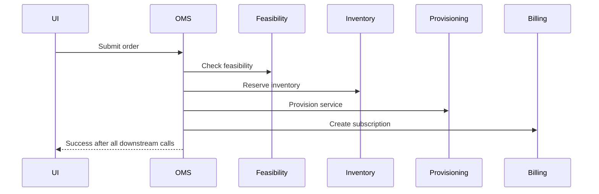
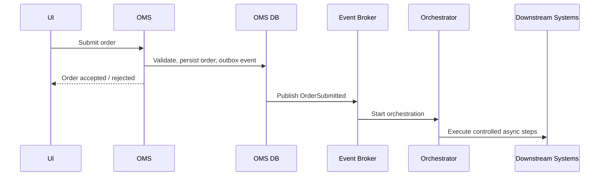
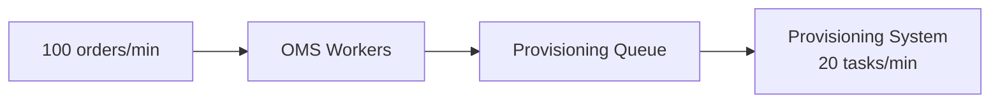
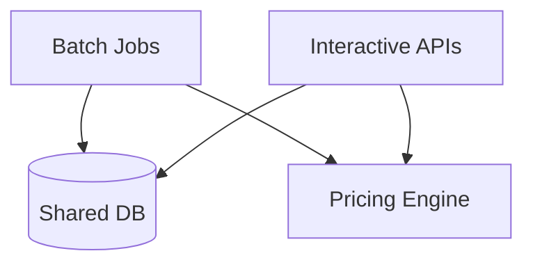
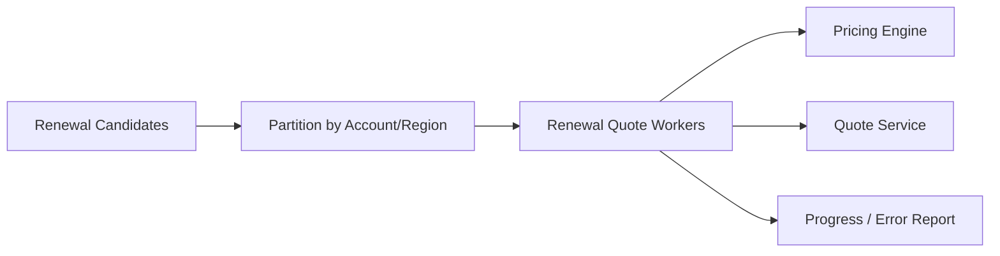
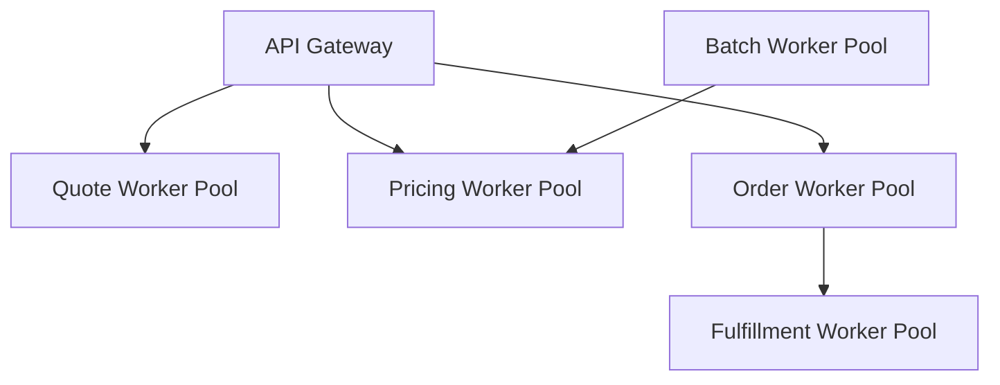
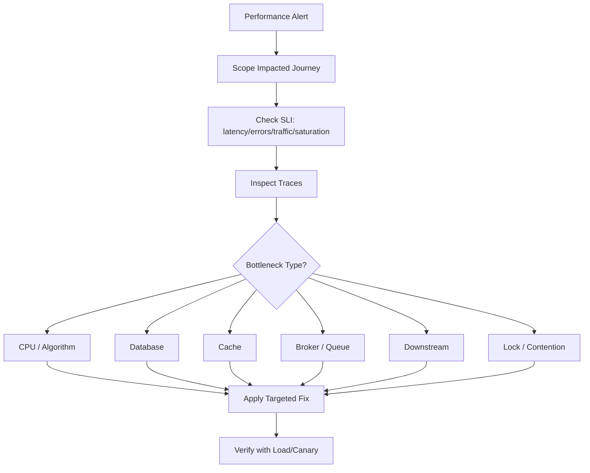
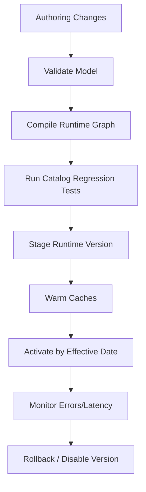

# Part 030 — Performance and Scalability Engineering

Performance in CPQ/OMS is not one problem. It is a portfolio of different workload problems:

- A sales rep expects interactive configuration and pricing.
- A partner portal may submit large carts in bursts.
- A deal desk inbox may need near-real-time approval updates.
- A quote with 2,000 lines may require complex pricing and validation.
- A catalog publish may invalidate caches across regions.
- A renewal batch may generate thousands of quotes overnight.
- A large customer migration may submit thousands of orders.
- A downstream provisioning system may accept only limited throughput.
- A search index rebuild may compete with operational workloads.
- A reporting pipeline may lag during end-of-quarter close.

A top-tier engineer does not say "add more pods" as a first answer. They identify the workload, define latency/throughput/freshness targets, find the bottleneck, protect correctness, and scale the right part of the system.

This part explains how to engineer performance and scalability for enterprise CPQ/OMS without destroying correctness, auditability, or operational control.

---

## 1. Kaufman Framing: The Sub-Skill We Are Practicing

The sub-skill here is performance reasoning under business constraints.

By the end of this part, you should be able to:

1. Define latency budgets for CPQ and OMS user journeys.
2. Separate interactive, asynchronous, batch, and integration-constrained workloads.
3. Model throughput and concurrency using practical queueing concepts.
4. Identify hot paths in catalog, configuration, pricing, quote, order, and fulfillment.
5. Design caching without introducing stale-price or stale-catalog bugs.
6. Design bulk and burst handling without overloading downstream systems.
7. Build load tests that resemble real CPQ/OMS behavior.
8. Use observability to distinguish CPU, IO, lock, cache, database, broker, and downstream bottlenecks.
9. Protect critical business flows with backpressure, isolation, and graceful degradation.
10. Define performance gates for releases.

Performance is not an afterthought. It is a design dimension.

---

## 2. Performance vs Scalability vs Efficiency

These terms are related but different.

| Term | Meaning | CPQ/OMS Example |
|---|---|---|
| Latency | Time to complete one operation | Quote reprice p95 < 2s |
| Throughput | Number of operations per time | 300 order submissions/minute |
| Concurrency | Number of in-flight users/requests | 5,000 active partner users |
| Scalability | Ability to handle more load by adding resources/design capacity | Pricing workers scale horizontally |
| Efficiency | Resource cost to achieve target | Same throughput with lower CPU/database load |
| Freshness | Delay before data becomes visible/usable | Order tracking projection lag p95 < 15s |
| Reliability under load | Correct behavior at high utilization | No duplicate orders during retry storm |

AWS Well-Architected describes performance efficiency as using computing resources efficiently to meet requirements and maintaining efficiency as demand changes and technology evolves. For CPQ/OMS, that means scaling the correct subsystem without loosening commercial invariants.

---

## 3. CPQ/OMS Workload Taxonomy

Start by classifying workload. Different workload types need different engineering tactics.

| Workload | User Expectation | Typical Bottleneck | Strategy |
|---|---|---|---|
| Interactive configuration | Sub-second to a few seconds | Rule evaluation, catalog lookup | Precompiled rules, cache, incremental validation |
| Interactive pricing | Seconds | Pricing rules, promotion evaluation, database lookup | Price cache, pipeline optimization, trace sampling |
| Quote save/submit | Seconds | Validation, DB transaction, approval demand | Aggregate design, async non-critical work |
| Approval inbox | Seconds freshness | Projection lag | Event-driven read model |
| Quote document generation | Seconds/minutes | Template rendering, PDF generation | Async job, document cache, status polling |
| Order submission | Seconds | Validation, idempotency, DB write | Fast accept + async orchestration |
| Feasibility check | Seconds/minutes | Downstream serviceability/inventory | Async gate, timeout, cached qualification |
| Fulfillment orchestration | Minutes/days | Downstream throughput and dependencies | Queueing, rate limits, backpressure |
| Search | Sub-second to seconds | Index size/query complexity | Search index tuning, filters, pagination |
| Reporting | Minutes/hours | Data volume | Warehouse, partitioning, batch/stream processing |
| Renewal batch | Hours | Pricing/configuration scale | Batch workers, partitioning, throttling |

Do not optimize all workloads the same way.

---

## 4. Latency Budgets

A latency budget decomposes a user journey into time allocation per component.

### 4.1 Example: Interactive Quote Reprice

Target: p95 under 2 seconds for typical quote, p99 under 5 seconds.

```text
Sales UI -> Quote Service -> Catalog -> Configurator -> Pricing -> Promotion -> Approval Evaluation -> Response
```

Budget:

| Segment | Budget |
|---|---:|
| Network/UI overhead | 150 ms |
| Quote load and authorization | 150 ms |
| Catalog resolution | 150 ms |
| Configuration validation | 350 ms |
| Pricing calculation | 600 ms |
| Promotion evaluation | 250 ms |
| Approval demand evaluation | 150 ms |
| Persistence / audit trace | 150 ms |
| Safety margin | 100 ms |
| Total | 2,000 ms |

If pricing consumes 1.7 seconds alone, the budget is broken even if the service looks "healthy" in isolation.

### 4.2 Example: Order Submission

Target: API response p95 under 3 seconds for order acceptance, with fulfillment asynchronous.

| Segment | Budget |
|---|---:|
| Authorization and channel validation | 150 ms |
| Idempotency check | 100 ms |
| Quote/order snapshot validation | 300 ms |
| Required data validation | 400 ms |
| Persist order and outbox event | 300 ms |
| Initial decomposition eligibility | 600 ms |
| Response assembly | 150 ms |
| Safety margin | 1,000 ms |
| Total | 3,000 ms |

Notice: full fulfillment does not belong inside synchronous order submission. The synchronous path should accept or reject the order safely, then orchestration continues asynchronously.

---

## 5. The Dangerous Performance Anti-Pattern: Synchronous Everything

Naive flow:



This flow has bad latency, bad reliability, and bad failure semantics.

Better flow:



Synchronous boundaries should be chosen deliberately:

- Synchronous: user input validation, idempotency, source-of-truth write, immediate rejection.
- Asynchronous: long-running feasibility, provisioning, billing activation, document generation, notifications, reporting projections.

---

## 6. Queueing Mental Model

Performance problems often become queueing problems.

Little's Law is commonly expressed as:

```text
L = λW
```

Where:

- `L` = average number of items in the system.
- `λ` = arrival rate.
- `W` = average time in the system.

In CPQ/OMS terms:

```text
in_flight_orders = order_arrival_rate * average_processing_time
```

If 100 orders arrive per minute and average orchestration time is 30 minutes:

```text
L = 100/min * 30 min = 3,000 in-flight orders
```

This is why long-running order management needs durable state, dashboards, backpressure, and reconciliation. You cannot reason about it like a stateless HTTP endpoint.

### 6.1 Bottleneck Example

If the provisioning system accepts only 20 requests/minute, but OMS receives 100 orders/minute requiring provisioning, the queue grows by roughly 80 provisioning tasks/minute.

Adding more OMS instances will not solve the bottleneck. It will make the backlog grow faster unless you apply rate limiting, prioritization, or capacity negotiation.



The constraint is downstream capacity, not OMS compute.

---

## 7. Hot Paths in CPQ

### 7.1 Catalog Resolution

Catalog resolution answers:

- Which offering version applies?
- Which options are available?
- Which rules apply?
- Which price entries apply?
- Which channel/region/customer segment constraints apply?

Performance risks:

1. Runtime joins across deep catalog tables.
2. Repeated effective-date resolution.
3. Dynamic rule interpretation for every request.
4. Cache stampede after catalog publish.
5. Large bundle trees.
6. Personalized catalog visibility.

Engineering tactics:

- Publish a runtime-optimized catalog model.
- Precompute offering graph snapshots.
- Use effective-date indexes.
- Cache by stable keys: `catalogVersion + channel + region + segment`.
- Use cache warming after publish.
- Use bounded graph traversal.
- Avoid N+1 product option queries.

### 7.2 Configuration Validation

Configurator hot path:

```text
selection change -> validate constraints -> update available options -> explain invalid choices
```

Tactics:

- Represent product configuration as a graph.
- Precompile constraints where possible.
- Evaluate incrementally after changes.
- Separate hard constraints from advisory recommendations.
- Cache static compatibility matrices.
- Return explanation codes without heavy text rendering in hot path.
- Cap configuration graph depth and option explosion.

### 7.3 Pricing Calculation

Pricing hot path:

```text
resolve price entries -> apply price waterfall -> promotions -> discounts -> taxes boundary -> totals -> trace
```

Tactics:

- Separate price lookup from price calculation.
- Use immutable price book versions.
- Preload common price entries.
- Minimize cross-line recalculation.
- Cache deterministic sub-results.
- Avoid calling external tax/billing systems in interactive pricing unless required.
- Use pricing trace sampling or compressed trace storage for non-final recalculations.
- Optimize rounding and currency conversion consistently.

### 7.4 Quote Save

Quote save should not regenerate every artifact.

Synchronous:

- Validate version.
- Persist quote changes.
- Persist price/configuration snapshot if changed.
- Emit event.

Asynchronous:

- Search projection.
- Analytics projection.
- Notification.
- Heavy document generation.
- Recommendation recalculation.

---

## 8. Hot Paths in OMS

### 8.1 Order Submission

Order submission must be fast and safe.

Hot path controls:

1. Idempotency key lookup.
2. Quote acceptance status check.
3. Required data validation.
4. Customer/account/billing reference validation.
5. Order snapshot creation.
6. Initial lifecycle state write.
7. Outbox event write.

Avoid:

- Calling all downstream fulfillment systems synchronously.
- Generating all downstream technical tasks before response if expensive.
- Performing analytics updates inline.
- Blocking on email/notification.

### 8.2 Decomposition

Decomposition converts product order lines into service/resource/fulfillment tasks.

Risks:

- Large bundle tree explosion.
- Recursive dependencies.
- Rule interpretation bottleneck.
- Missing product-to-service mapping.
- Repeated catalog lookup.

Tactics:

- Precompile decomposition templates per catalog version.
- Validate decomposition at catalog publish time.
- Cache product-to-service mappings.
- Detect graph cycles before runtime.
- Use async decomposition for large orders.
- Store decomposition plan as snapshot for audit/replay.

### 8.3 Fulfillment Orchestration

Fulfillment is often constrained by external systems.

Tactics:

- Per-downstream rate limits.
- Work queues by task type/downstream system.
- Priority lanes for high-value or SLA-critical orders.
- Circuit breakers for degraded downstream systems.
- Retry with backoff and jitter.
- Dead-letter and manual repair queues.
- Idempotent downstream commands.
- Backpressure to order intake when downstream backlog is dangerous.

---

## 9. Scaling Dimensions

Scale is multidimensional.

| Dimension | Example | Design Response |
|---|---|---|
| Users | 10,000 concurrent sales/partner users | Stateless API scale, cache, auth optimization |
| Quote size | 2,000 quote lines | Batch validation, incremental pricing, pagination |
| Catalog size | 100,000 offerings/options | Runtime catalog index, search, graph partitioning |
| Rule count | 50,000 pricing/configuration rules | Rule compilation, indexing, policy partitioning |
| Order volume | 1M orders/day | Async orchestration, partitioned queues |
| In-flight orders | 500,000 active orders | Durable workflow state, efficient state queries |
| Downstream systems | 100 integrations | Bulkhead, rate limiting, adapter isolation |
| Reporting data | Years of quote/order history | Warehouse partitioning, aggregation |
| Regions | Global deployment | Data locality, regional caches, compliance |
| Tenants/channels | B2B, partner, internal, API | Partitioned visibility and throttling |

A design that scales user count may not scale quote size. A design that scales quote size may not scale catalog publish frequency. You must state which dimension you are scaling.

---

## 10. Caching Strategy

Caching improves latency and reduces load, but CPQ/OMS caching can create commercial risk.

### 10.1 Cacheable Data

| Data | Cacheability | Notes |
|---|---|---|
| Published catalog version | High | Immutable versions are safe |
| Runtime offering graph | High | Key by version/channel/region |
| Price book version | High | Immutable price entries are safe |
| Compatibility matrix | High | Key by catalog version |
| Eligibility result | Medium | Depends on customer/address/time |
| Qualification result | Medium/low | Expiry and evidence required |
| Inventory availability | Low | Often volatile |
| Approval decision | Low | Must bind to quote fingerprint |
| Tax result | Medium/low | Depends on jurisdiction/date/product/customer |
| Quote/order state | Low | Prefer source read or short TTL |

### 10.2 Safe Cache Key Design

Bad key:

```text
price:product_123
```

Better key:

```text
price:{productOfferingId}:{priceBookVersion}:{currency}:{region}:{customerSegment}:{effectiveDate}
```

For eligibility:

```text
eligibility:{offeringId}:{catalogVersion}:{customerId}:{serviceAddressHash}:{channel}:{effectiveDate}
```

Never omit a dimension that affects the result.

### 10.3 Cache Invalidation

Prefer immutable versioned data over invalidation.

```text
catalogVersion = cat-2026.07.01
priceBookVersion = pb-apac-2026.07.01
policyVersion = deal-policy-2026.07.01
```

When a new version is published, new requests use the new version according to effective-date rules. Old quotes retain snapshots of old versions.

### 10.4 Cache Stampede

After catalog publish, many nodes may load the same new catalog graph.

Controls:

- Cache warming.
- Single-flight loading.
- Request coalescing.
- Staggered rollout.
- Read-through cache with lock timeout.
- Fallback to previous version only if business rules permit.

---

## 11. Database Performance

CPQ/OMS transactional databases often degrade because read, write, search, and reporting workloads are mixed.

### 11.1 OLTP Design Principles

- Store aggregates for safe transactional updates.
- Keep write transactions short.
- Index lifecycle state and owner queues intentionally.
- Avoid unbounded child loading for large quotes/orders.
- Use optimistic locking for quote/order revisions.
- Use append-only history for audit instead of updating history rows.
- Archive cold data without breaking audit access.
- Partition high-volume event/outbox tables.

### 11.2 Common Query Problems

| Problem | Symptom | Fix |
|---|---|---|
| N+1 quote line loading | Slow large quote open | Bulk fetch/pagination/read model |
| Deep joins for dashboard | Database CPU high | Operational projection |
| Missing composite index | Worklist slow | Index by state + owner + due date |
| Unbounded search in OLTP | Lock/CPU pressure | Search index |
| Hot account/order row | Lock contention | Aggregate boundary redesign |
| Outbox table growth | Publish lag | Partition/archive processed records |
| Audit table scan | Slow evidence lookup | Index by business object/version |

### 11.3 Large Quote Strategy

Large quotes require special treatment.

Tactics:

- Paginate quote lines.
- Store derived totals separately with version.
- Recalculate affected line groups only.
- Use async full validation for very large quotes.
- Use bulk line operations.
- Avoid sending entire quote payload for every change.
- Track dirty sections.
- Compress large trace artifacts.

---

## 12. Event Broker and Queue Performance

Event brokers are not magic scalability devices. They move and buffer work.

Key design questions:

1. What is the partition key?
2. What ordering guarantee is required?
3. What is the maximum acceptable lag?
4. Can consumers process events idempotently?
5. What happens when a consumer is slower than producer?
6. How are poison messages handled?
7. How is replay managed?

### 12.1 Partitioning

For order lifecycle events, partition by `orderId` to preserve per-order ordering.

For account timeline, partition by `accountId` if account-level ordering matters.

For analytics, partition by time/product/region depending on query patterns.

Bad partition key can cause hot partitions.

```text
partition_key = region
```

If APAC carries 70% of traffic, one partition may become hot.

Better:

```text
partition_key = hash(orderId)
```

Then build account/region ordering only where required.

### 12.2 Consumer Lag

Consumer lag is not only a technical metric. In CPQ/OMS it means operational visibility or downstream execution is delayed.

Examples:

- Search projection lag -> users cannot find new quotes.
- Approval projection lag -> approvers see stale inbox.
- Fulfillment command lag -> orders wait longer.
- Billing handoff lag -> revenue recognition delayed.

Lag must be tied to business impact.

---

## 13. Bulk and Batch Workloads

Bulk workloads are common in CPQ/OMS:

- Annual price book update.
- Catalog republish.
- Renewal quote generation.
- Mass amendment.
- Customer migration.
- Partner bulk order import.
- Search reindex.
- Analytics backfill.

Batch work should not starve interactive workloads.



Controls:

1. Separate worker pools.
2. Separate queues.
3. Rate limits for batch jobs.
4. Time windows.
5. Priority scheduling.
6. Database resource isolation.
7. Backpressure.
8. Checkpointing and resumability.
9. Dry-run mode.
10. Progress visibility.

### 13.1 Renewal Batch Pattern



Each batch item should be idempotent.

```text
renewal_job_id + account_id + subscription_id + renewal_date
```

If the job restarts, it should not create duplicate renewal quotes.

---

## 14. Backpressure and Load Shedding

Backpressure means the system tells callers or upstream processes to slow down before failure cascades.

Examples:

- Partner bulk order API returns `429 Too Many Requests` with retry-after.
- OMS slows intake for low-priority orders when fulfillment queue exceeds threshold.
- Renewal batch pauses when pricing p95 exceeds limit.
- Search reindex throttles when database load is high.
- Notification jobs are delayed during incident.

Load shedding means dropping or delaying non-critical work.

Critical:

- Order state writes.
- Idempotency checks.
- Accepted quote evidence.
- Approval decisions.

Deferrable:

- Search projection.
- Analytics projection.
- Non-critical notifications.
- Recommendation update.
- Some document previews.

Never shed audit evidence or state-transition events silently.

---

## 15. Isolation and Bulkheads

A bulkhead prevents one workload or downstream failure from sinking the whole platform.



Isolation dimensions:

| Dimension | Example |
|---|---|
| Workload | Interactive vs batch |
| Tenant/channel | Internal sales vs partner API |
| Region | APAC vs EU vs US |
| Downstream | Billing adapter vs provisioning adapter |
| Priority | VIP/customer-impacting vs background |
| Data store | OLTP vs reporting/search |
| Thread pool | Pricing vs document generation |

Without bulkheads, a slow document generation job can degrade quote pricing, or a downstream provisioning outage can exhaust order workers.

---

## 16. Graceful Degradation

Graceful degradation keeps the platform useful under partial failure.

Examples:

| Failure | Degraded Behavior |
|---|---|
| Recommendation engine down | Continue configuration without recommendations |
| Search index lagging | Allow exact quote/order lookup from source |
| Document preview slow | Queue document generation asynchronously |
| Analytics pipeline down | Continue operations; mark reporting stale |
| Non-critical notification down | Retry later; show in-app status |
| Pricing cache cold | Serve slower but correct price from source |
| Eligibility service degraded | Block only operations that legally require fresh eligibility |

Do not degrade in ways that compromise commercial correctness.

Unsafe degradation:

- Using stale approval for changed quote.
- Accepting order without required compliance eligibility.
- Pricing with outdated price book after effective date.
- Creating billing subscription from partial order snapshot.

---

## 17. Performance Testing Strategy

Performance tests must reflect real workloads.

### 17.1 Test Types

| Test | Purpose |
|---|---|
| Microbenchmark | Measure isolated algorithm/rule performance |
| Component load test | Measure service under controlled load |
| End-to-end load test | Measure journey across services |
| Stress test | Find breaking point |
| Soak test | Find leaks/degradation over time |
| Spike test | Test sudden bursts |
| Batch performance test | Test renewal/migration jobs |
| Failover under load | Test resilience during load |
| Replay test | Re-run production-like events safely |
| Capacity test | Validate forecasted scale |

### 17.2 CPQ Test Scenarios

Include:

1. Small quote, common products.
2. Large quote, many lines.
3. Deep bundle configuration.
4. High promotion count.
5. High discount approval demand.
6. Multi-currency pricing.
7. Asset-based amendment.
8. Renewal batch.
9. Partner bulk import.
10. Catalog publish cache warmup.

### 17.3 OMS Test Scenarios

Include:

1. Normal order submission.
2. Large order with many items.
3. High-volume burst after campaign.
4. Feasibility system slow.
5. Provisioning unknown outcome.
6. Billing handoff latency.
7. Cancellation during fulfillment.
8. Retry storm.
9. Downstream outage.
10. Recovery after backlog.

### 17.4 Test Data Quality

Synthetic data must preserve domain shape.

Bad synthetic data:

```text
100,000 identical quotes with one line each.
```

Better synthetic data:

```text
- 60% small quotes, 30% medium, 10% large.
- Product family distribution based on production mix.
- Realistic bundle depth.
- Realistic approval reasons.
- Realistic region/channel/customer segmentation.
- Realistic downstream latency distributions.
```

Performance test data that ignores domain shape produces false confidence.

---

## 18. Observability for Performance

Google's SRE guidance identifies four golden signals: latency, traffic, errors, and saturation. CPQ/OMS should measure these at both technical and business-operation levels.

### 18.1 Technical Signals

```text
http_server_request_duration_seconds{service,route,status}
process_cpu_utilization{service}
db_query_duration_seconds{service,query_name}
db_connection_pool_wait_seconds{service}
broker_consumer_lag{topic,consumer_group}
cache_hit_ratio{cache_name}
thread_pool_queue_depth{pool_name}
```

### 18.2 Business Operation Signals

```text
cpq_quote_reprice_duration_seconds{channel,region,quote_size_bucket}
cpq_config_validation_duration_seconds{product_family,bundle_depth}
cpq_price_calculation_duration_seconds{price_book_version,line_count_bucket}
cpq_quote_submit_duration_seconds{requires_approval}
oms_order_submit_duration_seconds{channel,item_count_bucket}
oms_decomposition_duration_seconds{catalog_version,product_family}
oms_fulfillment_task_duration_seconds{task_type,downstream_system}
oms_order_backlog_count{state,region,priority}
```

### 18.3 Saturation Signals

Saturation means a resource is close to or beyond useful capacity.

Measure:

- CPU utilization.
- Memory pressure.
- GC pause time.
- Database connection pool wait.
- Thread pool queue depth.
- Broker consumer lag.
- Downstream rate-limit hits.
- Cache eviction rate.
- Queue backlog age.
- Lock wait time.

Latency often rises before outright errors. Saturation explains why.

---

## 19. Performance Debugging Flow

When performance degrades, avoid random tuning.



Questions:

1. Which user journey is impacted?
2. Is traffic higher than normal?
3. Is error rate higher?
4. Is latency higher at p50, p95, or p99?
5. Is saturation visible?
6. Is the bottleneck internal or downstream?
7. Did a catalog/price/policy release change workload shape?
8. Did a batch job start?
9. Did a cache invalidate?
10. Did a projection or queue lag increase?

---

## 20. Release Performance Gates

Every major CPQ/OMS release should define performance gates.

Examples:

| Gate | Target |
|---|---:|
| Quote open p95 | < 1.5s for normal quote |
| Quote reprice p95 | < 2s for normal quote |
| Large quote reprice p95 | < 10s for 1,000 lines |
| Configuration validation p95 | < 500ms for common bundle |
| Order submit p95 | < 3s |
| Order submit duplicate rate | 0 business duplicates |
| Decomposition p95 | < 5s for normal order |
| Projection lag p95 | < 15s for operational views |
| Search index lag p95 | < 60s |
| Fulfillment queue backlog age | Within SLA per priority |
| Outbox publish lag p95 | < 10s |
| Error rate under target load | < agreed SLO |

A release should not be declared ready because unit tests pass. It must meet performance budgets under representative data and workload.

---

## 21. Large Quote Performance Pattern

Large quotes are a special case because cost grows with lines, rules, promotions, and cross-line dependencies.

### 21.1 Problem

A quote with 2,000 lines may trigger:

- 2,000 product validations.
- 2,000 price lookups.
- Cross-line bundle rules.
- Volume-tier pricing.
- Promotion stacking.
- Approval evaluation.
- Margin calculation.
- Document generation.

Naive complexity can become unacceptable.

### 21.2 Strategy

Use a dirty-region model.

```yaml
QuoteDirtyState:
  changedLineIds:
    - line_101
    - line_102
  affectedGroups:
    - bundle_group_5
    - volume_tier_group_enterprise_connectivity
  requiresFullReprice: false
  requiresApprovalReevaluation: true
  requiresDocumentRegeneration: false
```

Only recalculate affected groups where safe. But define when full recalculation is mandatory:

- Currency changed.
- Price book changed.
- Contract term changed.
- Promotion eligibility changed.
- Bundle root changed.
- Approval-affecting discount changed.
- Effective date changed.

### 21.3 API Payload Strategy

Avoid sending the entire quote on every edit.

Use commands:

```json
{
  "commandId": "cmd_123",
  "quoteId": "quote_456",
  "expectedRevision": 7,
  "operation": "UPDATE_LINE_QUANTITY",
  "lineId": "line_101",
  "quantity": 250
}
```

Response can return changed sections:

```json
{
  "quoteId": "quote_456",
  "revision": 8,
  "changedLines": ["line_101", "line_102"],
  "changedTotals": true,
  "approvalDemandChanged": true,
  "validationSummary": {
    "errors": 0,
    "warnings": 2
  }
}
```

---

## 22. Catalog Publish Performance Pattern

Catalog publish can be one of the riskiest platform operations.

A publish may trigger:

- Runtime catalog build.
- Rule compilation.
- Price book activation.
- Search index update.
- Cache warming.
- Eligibility model update.
- Downstream synchronization.
- Validation of existing draft quotes.

### 22.1 Safe Publish Pipeline



Performance gates:

- Runtime graph build time.
- Rule compilation time.
- Cache warm success.
- Configurator latency regression.
- Pricing latency regression.
- Search/index update lag.
- Error rate after activation.

Catalog publish is not just a data update. It is a production release.

---

## 23. Order Burst Pattern

Campaigns, partner imports, migration windows, and end-of-quarter deals can produce order bursts.

### 23.1 Risk

Burst traffic can overload:

- Order submission API.
- Idempotency store.
- Order database.
- Outbox publisher.
- Broker partitions.
- Decomposition workers.
- Downstream systems.
- Operational dashboards.

### 23.2 Strategy


Controls:

1. Channel-level rate limits.
2. Idempotency at intake.
3. Durable queue before expensive processing.
4. Worker concurrency limits.
5. Downstream-specific throttling.
6. Priority scheduling.
7. Backlog dashboards.
8. Retry-after guidance for API clients.
9. Dead-letter isolation.
10. Reconciliation after burst.

---

## 24. Capacity Planning Model

Capacity planning should model each major workload.

Example:

```yaml
Workload: Partner order submission
Peak arrival rate: 500 orders/minute
Average items/order: 4
P95 items/order: 20
Synchronous validation p95 target: 3s
Decomposition average time: 1.5s/order
Provisioning downstream capacity: 200 tasks/minute
Billing downstream capacity: 300 subscriptions/minute
Expected peak duration: 2 hours
```

Derived questions:

1. How many API instances are needed for intake?
2. How many DB writes/second are expected?
3. How large will outbox grow?
4. How many broker partitions are needed?
5. How many decomposition workers are safe?
6. How fast will provisioning backlog grow?
7. How long until backlog drains after burst?
8. Which SLA tiers need priority?

### 24.1 Backlog Drain Calculation

If arrival during burst is 500 orders/minute and downstream can process 200/minute, backlog grows by 300/minute.

For a 2-hour burst:

```text
backlog = 300/min * 120 min = 36,000 orders
```

After burst, if normal arrival is 50/minute and capacity is 200/minute, drain rate is 150/minute.

```text
drain_time = 36,000 / 150 = 240 minutes = 4 hours
```

This is a simplified model, but it forces realistic conversation.

---

## 25. Performance and Correctness Trade-Offs

Not every optimization is acceptable.

| Optimization | Risk | Safer Alternative |
|---|---|---|
| Use stale price cache | Wrong customer price | Versioned immutable price cache |
| Skip approval evaluation for speed | Revenue leakage | Cache policy rules, not decisions |
| Disable validation for batch import | Bad downstream orders | Async validation with reject/repair queue |
| Search index as state authority | Stale decisions | Source-of-truth fetch for commands |
| Parallelize all fulfillment tasks | Dependency violations | Dependency-aware parallelism |
| Increase retries aggressively | Downstream overload | Backoff, jitter, circuit breaker |
| Share one worker pool | Cascade failure | Bulkheads |
| Inline document generation | Slow quote submit | Async document job |
| Denormalize without version | Reporting corruption | Semantic versioning and lineage |

Top-tier performance work preserves invariants.

---

## 26. Performance Design Checklist

### 26.1 Workload

- What is the workload type: interactive, async, batch, search, reporting, integration?
- What is the target p50/p95/p99 latency?
- What is expected peak throughput?
- What is expected concurrency?
- What is the data shape?
- What is the largest supported quote/order?

### 26.2 Bottleneck

- Is the bottleneck CPU, DB, cache, broker, lock, network, downstream, or algorithmic complexity?
- What is saturated?
- Is latency correlated with traffic, data size, or specific product/rule/version?
- Is there a recent catalog/price/policy release?

### 26.3 Correctness

- Does the optimization change business outcome?
- Is cached data versioned?
- Can stale data cause illegal acceptance/submission?
- Are idempotency and ordering preserved?
- Are audit traces preserved?

### 26.4 Scalability

- Can this component scale horizontally?
- Is partitioning correct?
- Are there hot keys?
- Are downstream limits respected?
- Is there backpressure?
- Is batch isolated from interactive traffic?

### 26.5 Operations

- Are SLIs/SLOs defined?
- Are dashboards action-oriented?
- Are load tests representative?
- Can the system degrade safely?
- Can backlogs be measured and drained?
- Are release performance gates enforced?

---

## 27. Practice Scenarios

### Scenario 1: Slow Quote Reprice

Symptoms:

- Quote reprice p95 increased from 1.8s to 6s.
- Only APAC enterprise bundles are affected.
- Error rate is normal.
- CPU increased in pricing workers.
- Catalog version changed today.

Investigate:

1. Pricing trace by product family.
2. Rule count by new catalog version.
3. Cache hit ratio.
4. Cross-line promotion evaluation.
5. Bundle depth.
6. Regression tests for pricing latency.

Likely causes:

- New rule pattern causing O(n²) cross-line evaluation.
- Cache key changed accidentally.
- Runtime catalog graph not warmed.
- Promotion eligibility evaluates all lines repeatedly.

### Scenario 2: Order Backlog Explosion

Symptoms:

- Order intake normal.
- Fulfillment backlog growing.
- Provisioning task duration p95 high.
- Retry count increased.
- Downstream rate-limit errors present.

Actions:

1. Reduce worker concurrency for affected downstream.
2. Enable backoff and jitter.
3. Pause low-priority batch jobs.
4. Prioritize high-SLA orders.
5. Communicate backlog drain estimate.
6. Reconcile unknown outcomes.

### Scenario 3: Search Index Lag

Symptoms:

- Users cannot find newly submitted orders.
- Order source DB shows orders correctly.
- Search projection lag is 20 minutes.
- Projector dead-letter queue has schema errors.

Actions:

1. Stop relying on search for exact lookup.
2. Fix event schema compatibility.
3. Replay dead-letter events.
4. Rebuild affected index partition.
5. Show freshness warning in UI.

### Scenario 4: Renewal Batch Degrades Interactive Pricing

Symptoms:

- Nightly renewal job overlaps APAC business hours.
- Pricing p95 spikes for sales reps.
- CPU high and DB price lookup high.

Actions:

1. Separate batch and interactive worker pools.
2. Throttle renewal job.
3. Pre-warm price data.
4. Run batch by region/time window.
5. Add performance gate for batch concurrency.

---

## 28. Summary

Performance and scalability in CPQ/OMS are not solved by generic scaling. They require workload-specific architecture.

The key principles are:

1. Define latency and throughput targets per journey.
2. Separate interactive, async, batch, search, and reporting workloads.
3. Keep synchronous paths short and correctness-focused.
4. Treat long-running fulfillment as queueing and orchestration, not HTTP request handling.
5. Cache immutable versioned data aggressively, but never cache away correctness.
6. Isolate batch from interactive workloads.
7. Respect downstream capacity with rate limits and backpressure.
8. Design for large quotes, large catalogs, and order bursts explicitly.
9. Use observability to identify actual bottlenecks.
10. Enforce performance gates before release.

Part 029 gave us visibility. This part gives us capacity and speed. Together, they form the operational foundation for running CPQ/OMS as an enterprise platform.

In the next part, we move from speed to survivability: reliability, resilience, and failure modeling.

---

## References

- AWS Well-Architected Framework, Performance Efficiency: https://docs.aws.amazon.com/wellarchitected/latest/framework/performance-efficiency.html
- Google SRE Book, Monitoring Distributed Systems: https://sre.google/sre-book/monitoring-distributed-systems/
- OpenTelemetry Documentation: https://opentelemetry.io/docs/
- OpenTelemetry Signals: https://opentelemetry.io/docs/concepts/signals/
- Elastic Docs, Near real-time search: https://www.elastic.co/docs/manage-data/data-store/near-real-time-search
- Martin Fowler, CQRS: https://martinfowler.com/bliki/CQRS.html
