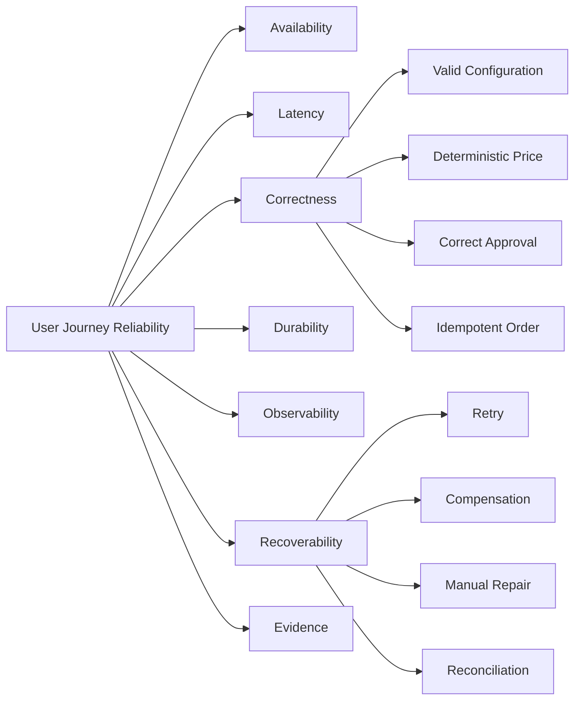
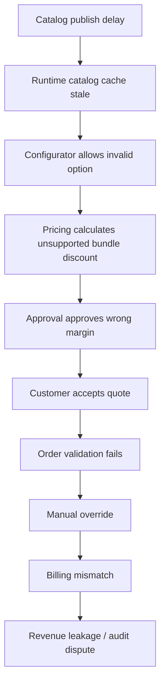
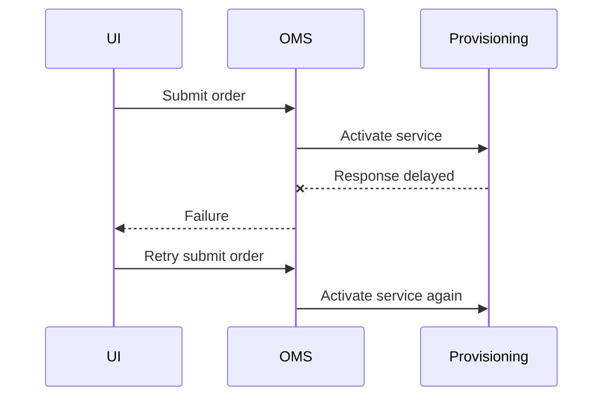
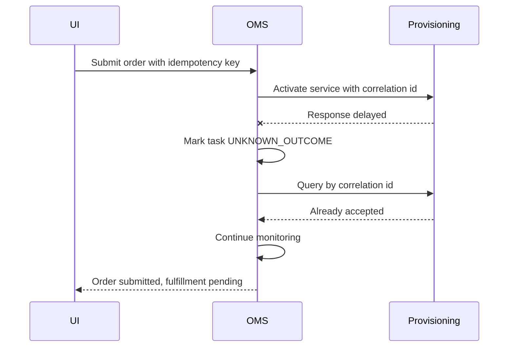
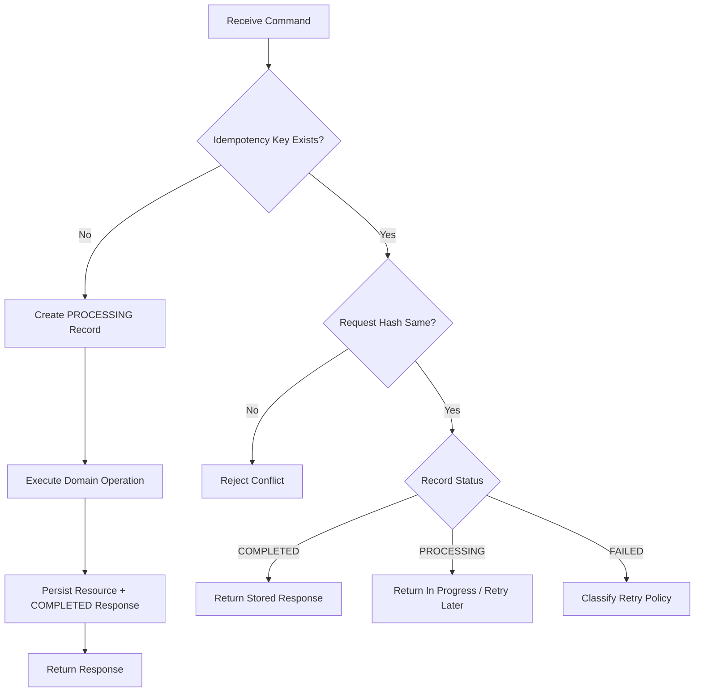
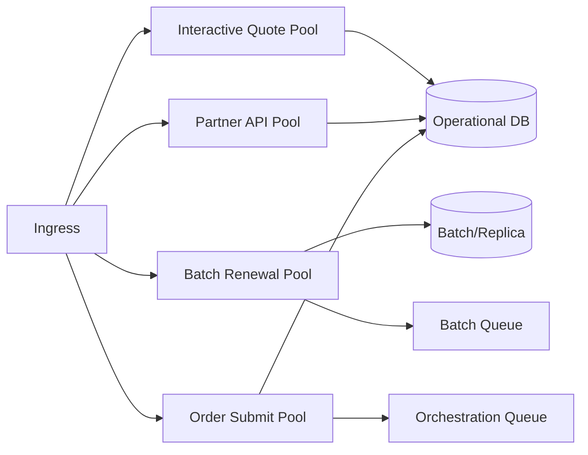
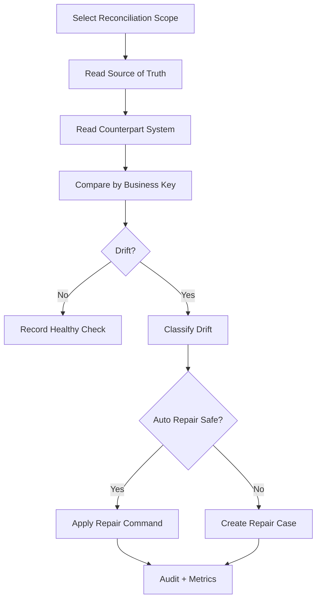
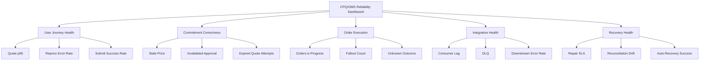
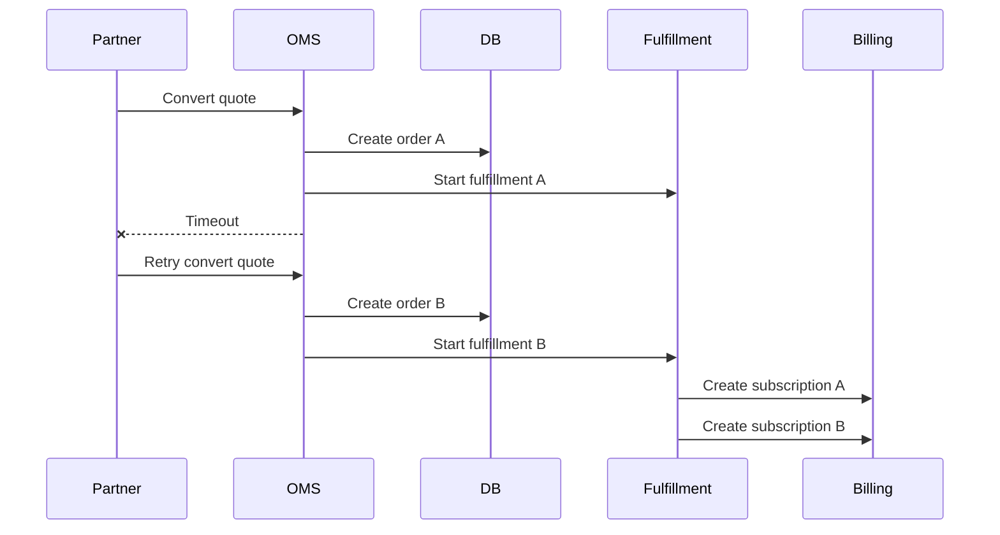
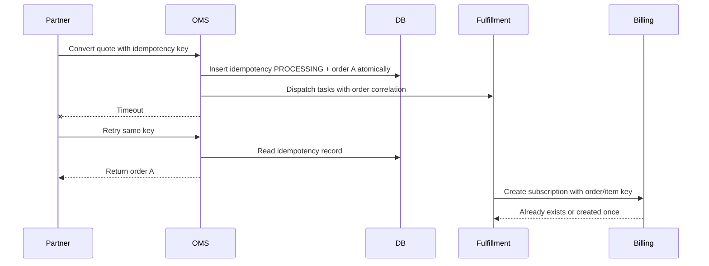

# Part 031 — Reliability, Resilience, and Failure Modeling

Reliability in CPQ/OMS is not merely uptime.

A CPQ/OMS platform can be technically available while still producing unreliable business outcomes:

- The quote UI loads, but the price is stale.
- The order API returns success, but fulfillment never starts.
- The approval workflow completes, but the quote changes afterward.
- The pricing service is healthy, but its catalog cache is out of date.
- The order is submitted twice because the customer retried after timeout.
- The orchestration engine retries a provisioning request and creates duplicate service activation.
- The dashboard says the order is complete, but billing never received the subscription.
- The fallout queue is empty because failures were swallowed by an integration adapter.

For enterprise CPQ/OMS, reliability means the platform performs the intended business function correctly and consistently across quote, approval, order, fulfillment, billing handoff, and audit lifecycle.

This part builds a failure-modeling mindset for CPQ/OMS. The goal is not to memorize patterns like retry, circuit breaker, or saga. The goal is to know when those patterns protect the business and when they hide damage.

---

## 1. Kaufman Framing: The Sub-Skill We Are Practicing

The sub-skill here is reliability reasoning.

By the end of this part, you should be able to:

1. Define reliability as business correctness, not only service uptime.
2. Build a failure taxonomy for CPQ/OMS.
3. Identify hidden failure modes across quote, pricing, approval, order, orchestration, and billing handoff.
4. Define recovery invariants before choosing resilience mechanisms.
5. Design retry, timeout, circuit breaker, idempotency, compensation, and reconciliation as a coherent system.
6. Distinguish transient failure, permanent failure, unknown outcome, semantic failure, and policy failure.
7. Design degraded modes that do not violate commercial commitments.
8. Build observability around customer-visible and business-visible reliability.
9. Run incident reviews that feed back into product, pricing, catalog, and orchestration design.
10. Evaluate whether an architecture is resilient or merely complex.

The practice target is this:

> Given a CPQ/OMS user journey, you can enumerate realistic failures, define safe outcomes, design recovery, and prove which invariants remain protected.

---

## 2. Reliability Is a Business Property

A common mistake is to equate reliability with system availability.

For CPQ/OMS, that is too shallow.

| Layer | Shallow Reliability Question | Better Reliability Question |
|---|---|---|
| Catalog | Is the catalog service up? | Is the user configuring against the correct effective catalog version? |
| Configurator | Does the API respond? | Does the configuration remain valid under current product constraints? |
| Pricing | Is pricing latency acceptable? | Is the price deterministic, explainable, current, and approved? |
| Quote | Can users save quotes? | Can we prove what customer accepted and under which policy version? |
| Approval | Are approvals processed? | Was the right authority applied to the exact commercial state? |
| Order | Can orders be submitted? | Is submission idempotent and tied to the accepted quote snapshot? |
| Orchestration | Are tasks running? | Are dependencies, retries, compensation, and manual repair safe? |
| Fulfillment | Did downstream respond? | Do we know whether the side effect happened if response was lost? |
| Billing handoff | Was an event published? | Can billing reconstruct the exact charge and subscription commitment? |
| Reporting | Is dashboard visible? | Is projection lag understood and reconciled against source of truth? |

A top-tier engineer defines reliability at the level where business harm occurs.

For example:

- Revenue harm: underpriced quote, expired promotion honored, missed billing.
- Legal harm: wrong terms generated, accepted quote evidence missing.
- Customer harm: duplicate order, wrong product activated, cancellation ignored.
- Operational harm: stuck order, hidden fallout, unrecoverable manual repair.
- Audit harm: state changed without actor, reason, or policy version.

---

## 3. Reliability Target Model

A CPQ/OMS reliability target should combine technical and business signals.

A useful target has five dimensions:

1. **Availability** — the user can perform the required operation.
2. **Latency** — the operation completes within acceptable time.
3. **Correctness** — the result satisfies domain invariants.
4. **Durability** — accepted commitments and side effects are not lost.
5. **Recoverability** — when failure occurs, the platform can move to a known safe state.

The subtle dimension is correctness. An unreliable CPQ/OMS often fails by producing a plausible but wrong result.

---

## 4. CPQ/OMS Failure Taxonomy

Failure modeling starts with classification.

| Failure Type | Meaning | CPQ/OMS Example | Typical Response |
|---|---|---|---|
| Transient technical failure | Temporary infrastructure/system issue | Pricing API timeout | Retry with deadline and idempotency |
| Permanent technical failure | Request cannot succeed without change | Invalid downstream payload schema | Stop, classify, repair |
| Semantic failure | Request is technically valid but business-invalid | Quote has expired price snapshot | Revalidate, block, remediate |
| Policy failure | Violates commercial/security/compliance rule | Discount exceeds threshold without approval | Route approval or reject |
| Unknown outcome | Caller does not know whether side effect happened | Provisioning request timed out after submit | Query, reconcile, or safe retry with idempotency key |
| Partial success | Some tasks completed, others failed | Router provisioned, billing failed | Continue, compensate, or manual repair |
| Stale decision | Decision made on outdated input | Eligibility cache allowed ineligible product | Detect freshness violation and re-evaluate |
| Duplicate action | Same command executed more than once | Customer submitted order twice | Idempotency and duplicate detection |
| Lost event | State changed but event not delivered | Order submitted but no orchestration event | Outbox/replay/reconciliation |
| Split-brain ownership | Two systems think they own same truth | CRM and OMS both mutate order status | Ownership matrix and conflict resolution |
| Silent corruption | Wrong data persists without obvious failure | Rounding bug in price allocation | Golden tests, reconciliation, anomaly detection |
| Human repair error | Manual correction creates inconsistency | Ops edits task state but not order state | Repair workflow with validation and audit |

Most real incidents combine several of these.

Example:

1. Pricing cache is stale.
2. Sales rep submits quote.
3. Approval evaluates old margin.
4. Customer accepts document.
5. Quote converts to order.
6. Billing rejects because price version is no longer active.
7. Support manually edits billing payload.
8. Audit cannot explain why customer got that price.

This is not one bug. It is a failure chain.

---

## 5. Failure Chain Thinking

A failure chain describes how local defects become business incidents.

A mature reliability design breaks the chain early.

Possible breakpoints:

- Catalog publish includes runtime propagation health check.
- Configuration response includes catalog version and constraint version.
- Pricing validates catalog version compatibility.
- Quote acceptance checks quote freshness.
- Order conversion revalidates conversion-critical invariants.
- Billing handoff uses accepted quote snapshot, not current catalog lookup.
- Reconciliation detects quote/order/billing mismatch.

Reliability improves when you design breakpoints, not when you only add retries.

---

## 6. CPQ Reliability Hotspots

### 6.1 Catalog Publish and Runtime Consistency

Catalog changes are dangerous because they affect future configuration, pricing, eligibility, and orderability.

Failure modes:

- Authoring catalog is approved but runtime catalog is not published.
- Runtime catalog is published in one region but not another.
- Configurator uses catalog version `v42`; pricing uses `v41`.
- Product rule is effective today; price book starts tomorrow.
- A bundle is sellable but not orderable.
- A product is hidden in UI but still accessible through API.

Reliability controls:

- Publish catalog as an immutable versioned release.
- Treat runtime publish as a deployment with health checks.
- Require compatibility checks across product, pricing, promotion, eligibility, and orderability.
- Include catalog version in all configuration, pricing, quote, and order snapshots.
- Emit catalog publish events with version, effective date, and affected objects.
- Build a catalog propagation dashboard.

Invariant:

> A quote must record the exact catalog version used for every quote line.

---

### 6.2 Configuration Reliability

Configuration reliability means the selected product structure is valid and explainable.

Failure modes:

- Invalid option combination saved due to rule evaluation gap.
- Constraint engine times out and returns partial validity.
- Configuration line is edited directly through API bypassing configurator.
- Rule ordering produces nondeterministic outcomes.
- User sees stale available options after changing parent selection.
- Bulk import creates impossible configurations.

Controls:

- Centralize validation on server side.
- Treat UI validation as advisory, not authoritative.
- Store configuration trace and rule version.
- Use deterministic rule ordering.
- Reject direct quote line mutations that bypass configuration invariants.
- Run golden configuration test sets during catalog release.

Invariant:

> No quote can be submitted unless each configurable product has a valid configuration trace for the exact quote line state.

---

### 6.3 Pricing Reliability

Pricing reliability is one of the highest-risk areas because wrong price can become legal/commercial commitment.

Failure modes:

- Price service timeout leaves old price on quote.
- Rounding differs between quote and billing.
- Discount rule executes in different order after deployment.
- Promotion applied beyond eligibility window.
- Currency conversion uses outdated rate.
- Bundle discount allocation does not match billing allocation.
- Approval is based on price before rep changes quantity.

Controls:

- Price calculation is explicit, immutable, and traceable.
- Quote line has pricing status: `NOT_PRICED`, `PRICED`, `STALE`, `FAILED`.
- Quote submit blocks stale or failed price.
- Pricing engine returns calculation trace, input hash, policy version, and price version.
- Approval fingerprint includes price-relevant inputs.
- Billing handoff receives price components, not merely net total.
- Golden master pricing tests compare full waterfall, not only final amount.

Invariant:

> A quote cannot be accepted unless its price snapshot is current, deterministic, traceable, and within approved policy.

---

### 6.4 Approval Reliability

Approval reliability means the right authority approved the exact state being committed.

Failure modes:

- Approver approves quote, then rep changes discount.
- Delegation is expired but still used.
- Approval service is down, so UI allows manual status change.
- Parallel approvals race and produce inconsistent state.
- Approval policy changes during in-flight approval.
- Approval reason is missing.

Controls:

- Approval request references immutable approval fingerprint.
- Quote changes invalidate approval if they affect approved dimensions.
- Approval task includes policy version and authority reason.
- Approver authorization is checked at decision time.
- Manual approval override requires stronger permission and reason code.
- Approval events are immutable audit records.

Invariant:

> Approval is valid only for the quote state, policy version, and authority context it evaluated.

---

## 7. OMS Reliability Hotspots

### 7.1 Order Submission Reliability

Order submission must be idempotent.

Failure modes:

- User double-clicks submit.
- Browser retries after timeout.
- Partner system retries without idempotency key.
- API gateway retries a non-idempotent POST.
- Quote is converted twice into two orders.
- Order number is generated before transaction fails.

Controls:

- Require client request ID or idempotency key.
- Scope idempotency key to operation and actor.
- Store request hash and response hash.
- Use unique constraint on quote conversion identity.
- Return existing order on duplicate equivalent request.
- Reject duplicate key with different payload.

Invariant:

> One accepted quote conversion intent produces at most one canonical product order unless explicitly split by a governed policy.

---

### 7.2 Order Decomposition Reliability

Decomposition converts commercial order lines into executable fulfillment tasks.

Failure modes:

- Commercial product maps to outdated technical product.
- Dependency graph misses prerequisite task.
- Order line action is wrong: `ADD` instead of `MODIFY`.
- Parent/child asset relationship is lost.
- Decomposition fails after order is accepted.
- Manual repair creates task not linked to order line.

Controls:

- Version decomposition rules.
- Store decomposition plan as immutable execution blueprint.
- Validate graph before execution.
- Link every task to order item, product instance, and rule version.
- Treat decomposition failure as controlled fallout, not silent order rejection.
- Test with asset-based scenarios and mixed action orders.

Invariant:

> Every fulfillment task must be traceable to a product order item, action, decomposition rule version, and intended asset impact.

---

### 7.3 Fulfillment Reliability

Fulfillment interacts with systems that often have their own semantics, constraints, and failure modes.

Failure modes:

- Downstream accepts request but response is lost.
- Downstream returns success but performs partial side effect.
- Timeout triggers retry that duplicates provisioning.
- Downstream has no idempotency support.
- Completion event arrives before task is marked started.
- Manual downstream action bypasses OMS.

Controls:

- Use external correlation ID for every downstream action.
- Prefer downstream idempotency support; otherwise build deduplication/reconciliation.
- Treat timeout after submit as unknown outcome, not failure.
- Use query-by-correlation before retrying side-effecting operations.
- Model downstream state separately from OMS task state.
- Reconcile downstream actual state against intended state.

Invariant:

> The platform must never assume a side effect failed merely because the response was lost.

---

### 7.4 Billing Handoff Reliability

Billing handoff failures are often discovered late and are expensive.

Failure modes:

- Subscription created without one-time fee.
- Billing uses current price instead of accepted quote price.
- Discount duration is lost.
- Contract term and billing term differ.
- Asset activation date and billing start date diverge.
- Billing event published but consumer failed.

Controls:

- Treat billing handoff as its own stateful integration, not fire-and-forget.
- Include accepted quote snapshot and price component details.
- Use outbox for billing events.
- Track billing acknowledgment.
- Reconcile active assets against billable subscriptions.
- Create revenue leakage dashboard.

Invariant:

> Every billable fulfilled asset must have a corresponding billing/subscription representation or a documented non-billable reason.

---

## 8. Resilience Mechanisms and When They Are Dangerous

Patterns are not inherently safe. They are safe only when aligned with domain semantics.

| Mechanism | Helps With | Dangerous When |
|---|---|---|
| Timeout | Prevents unbounded waiting | Too short creates retry storms or false failures |
| Retry | Recovers transient failures | Retrying non-idempotent side effects duplicates work |
| Circuit breaker | Protects failing dependency | Opens on critical validation dependency and allows bypass |
| Bulkhead | Isolates workload classes | Starves low-volume but critical control flows |
| Queue | Smooths bursts | Hides latency and backlog until SLA breach |
| Cache | Reduces latency/load | Serves stale catalog, price, eligibility, or entitlement |
| Saga | Coordinates distributed changes | Compensation semantics are not defined |
| Compensation | Reverses prior action | The action is not actually reversible |
| Manual repair | Handles exceptional cases | Repair bypasses invariants and audit |
| Reconciliation | Detects drift | Runs too late or has no owner |

A resilience mechanism must answer three questions:

1. What failure does it handle?
2. What invariant does it protect?
3. What harm can it introduce?

---

## 9. Timeout Design

Timeouts are domain decisions, not just HTTP client settings.

### 9.1 Timeout Categories

| Timeout | Meaning | Example |
|---|---|---|
| User interaction timeout | How long user waits | Reprice request must complete within 3s |
| Service call timeout | How long service waits for dependency | Eligibility call 500ms |
| Workflow task timeout | How long orchestration waits before classification | Provisioning task 30 minutes |
| Business SLA timeout | How long business allows a process to remain incomplete | Approval required within 24 hours |
| Staleness timeout | How long a decision remains reusable | Qualification valid for 7 days |

### 9.2 Timeout Anti-Pattern

The timeout is not the problem. The problem is that the system converted unknown outcome into failure.

### 9.3 Better Model

Rule:

> For side-effecting operations, timeout after request submission means unknown outcome until proven otherwise.

---

## 10. Retry Design

Retry is useful for transient failures. It is harmful when applied blindly.

### 10.1 Retry Classification

| Scenario | Retry? | Reason |
|---|---:|---|
| HTTP 503 from pricing read operation | Usually yes | Likely transient |
| HTTP timeout before request left client | Usually yes | No side effect likely occurred |
| HTTP timeout after downstream accepted activation request | Not blindly | Outcome unknown |
| Validation error: invalid product combination | No | Semantic failure |
| Authorization failure | No | Security/policy failure |
| Duplicate request with same idempotency key | Return existing result | Idempotent behavior |
| Rate limited dependency | Retry with backoff or queue | Protect dependency |
| Schema mismatch | No | Permanent integration failure |

### 10.2 Retry Budget

Retry must have a budget.

Without budget:

- downstream outage creates retry storm;
- queues grow silently;
- user-facing latency increases;
- duplicate side effects become more likely;
- logs become noisy;
- incident response becomes harder.

A retry budget should define:

- maximum attempts;
- total elapsed time;
- backoff strategy;
- jitter;
- retryable error classes;
- idempotency requirement;
- fallback classification;
- alert threshold.

---

## 11. Idempotency as a Reliability Primitive

Idempotency means executing the same logical request more than once has the same intended effect as executing it once.

In CPQ/OMS, idempotency is mandatory for:

- quote creation from external channel;
- quote repricing request;
- quote submit for approval;
- approval decision;
- quote acceptance;
- quote-to-order conversion;
- order submission;
- fulfillment task dispatch;
- cancellation request;
- billing handoff event;
- event consumer processing.

### 11.1 Idempotency Record

A robust idempotency record contains:

| Field | Purpose |
|---|---|
| idempotencyKey | External logical request identity |
| operation | Operation scope |
| actorId | Prevents key reuse across actor boundary |
| requestHash | Detects same key with different payload |
| resourceId | Created/affected resource |
| status | PROCESSING / COMPLETED / FAILED / EXPIRED |
| responseSnapshot | Repeatable response |
| createdAt / expiresAt | Retention control |
| correlationId | Observability |

### 11.2 Idempotency Flow

Invariant:

> Idempotency is part of command semantics, not an API gateway decoration.

---

## 12. Circuit Breakers and Dependency Health

Circuit breakers prevent a failing dependency from consuming all caller resources.

They are useful for:

- non-critical recommendation service;
- search index read;
- document preview service;
- external enrichment service;
- optional analytics event path.

They are dangerous for:

- price calculation when price is required;
- eligibility check when compliance requires it;
- approval authority check;
- order validation;
- billing handoff state update.

A circuit breaker must specify fallback semantics.

| Dependency | Safe Fallback? | Example |
|---|---:|---|
| Product image service | Yes | Show placeholder |
| Recommendation service | Yes | Hide recommendation widget |
| Search projection | Sometimes | Show stale indicator or direct lookup |
| Pricing service | Rarely | Use only if quote has valid non-stale price snapshot and operation permits no recalculation |
| Eligibility service | Rarely | Block submit if compliance-relevant |
| Approval service | No for final commit | Queue submission or show unavailable |
| Order database | No | Fail safely |

Rule:

> Degraded mode must never create a stronger business commitment than the fully validated path would allow.

---

## 13. Bulkheads and Workload Isolation

Bulkheads isolate failure domains.

CPQ/OMS needs isolation across:

- interactive CPQ users;
- partner API traffic;
- batch renewals;
- catalog publish jobs;
- pricing simulations;
- order submission;
- fulfillment orchestration;
- reporting export;
- search reindexing;
- reconciliation jobs.

Without isolation, a renewal batch can degrade quote pricing for sales reps, or a search reindex can slow order submission.

Isolation mechanisms:

- separate worker pools;
- queue partitioning;
- rate limits per channel/customer/operation;
- database connection pools per workload;
- dedicated read replicas;
- priority queues;
- admission control;
- circuit breakers per dependency;
- tenant-level quotas.

Reliability invariant:

> Non-critical high-volume workload must not starve critical low-volume control flows such as cancellation, approval decision, or manual recovery.

---

## 14. Queue Reliability

Queues make systems resilient to bursts, but they also hide delay.

Failure modes:

- message published but not committed with source state;
- consumer processes message twice;
- poison message blocks partition;
- ordering assumption is false;
- retry topic grows silently;
- dead-letter queue has no owner;
- event payload lacks enough context for recovery;
- consumer schema incompatible after deployment.

Controls:

- transactional outbox for state change plus event intent;
- idempotent consumers;
- poison message classification;
- dead-letter queue ownership and SLA;
- partition key design aligned with ordering requirement;
- consumer lag alerts;
- replay procedure;
- event contract testing;
- schema version compatibility.

Queue observability should include:

| Metric | Why It Matters |
|---|---|
| publish rate | workload volume |
| consume rate | processing capacity |
| lag | backlog and freshness |
| oldest message age | SLA risk |
| retry count | dependency or semantic failure |
| DLQ count | unrecovered failures |
| poison message frequency | data/rule quality issue |
| duplicate detection rate | retry/idempotency health |

Rule:

> A queue is reliable only if backlog, retries, DLQ, replay, and ownership are operationally visible.

---

## 15. Cache Reliability

Caching is often required for performance, but it is also one of the fastest ways to create stale business decisions.

CPQ/OMS cache candidates:

- catalog runtime view;
- product rules;
- eligibility rules;
- price book entries;
- promotion rules;
- customer account hierarchy;
- tax jurisdiction lookup;
- contract pricing;
- asset inventory read model;
- search results.

### 15.1 Cache Risk Matrix

| Cached Data | Risk If Stale | Safe Usage |
|---|---|---|
| Product image | Low | UI display |
| Product description | Low/medium | Non-legal display unless terms-sensitive |
| Catalog option availability | Medium/high | Interactive guidance; validate before submit |
| Eligibility | High | May be used for browsing; must recheck before commit |
| Price book | High | Use versioned snapshots and freshness checks |
| Promotion | High | Must respect effective window and eligibility |
| Approval authority | High | Check at decision time |
| Asset inventory | High | Reconcile before change order commit |

### 15.2 Cache Contract

Every cache should have a contract:

- data owner;
- freshness expectation;
- invalidation mechanism;
- fallback behavior;
- version identifier;
- safe operations when stale;
- unsafe operations when stale;
- observability metric;
- incident playbook.

Invariant:

> Cache freshness must be explicit in every operation that can create a customer, legal, fulfillment, or billing commitment.

---

## 16. Reconciliation as a First-Class Reliability Loop

Reconciliation finds drift between intended state and actual state.

Do not treat reconciliation as a reporting afterthought. In enterprise CPQ/OMS, it is a reliability control.

### 16.1 Reconciliation Pairs

| Intended Source | Actual/Counterpart | Drift Example |
|---|---|---|
| Accepted quote | Product order | Accepted quote not converted |
| Product order | Orchestration plan | Missing task for order item |
| Orchestration task | Downstream system | OMS says pending, downstream completed |
| Fulfilled asset | Product inventory | Activated service not recorded as asset |
| Asset inventory | Billing subscription | Active asset not billed |
| Quote price snapshot | Billing charge | Billed amount differs from accepted quote |
| Approval audit | Quote state | Quote accepted without valid approval |
| Catalog publish | Runtime cache | Region running old catalog version |

### 16.2 Reconciliation Flow

A reconciliation job must not simply patch data silently. It should create evidence.

Fields to record:

- reconciliation run ID;
- scope;
- source record;
- counterpart record;
- detected difference;
- classification;
- repair decision;
- actor/system;
- timestamp;
- resulting state.

---

## 17. Manual Repair Without Destroying Integrity

Manual repair is inevitable in enterprise OMS.

But manual repair must be designed as a controlled workflow, not database editing.

### 17.1 Repair Principles

1. Repair through domain commands.
2. Require reason code and evidence.
3. Validate repair against invariants.
4. Preserve original failure state.
5. Create compensating or corrective event.
6. Keep role separation for high-risk actions.
7. Prefer scoped repair to broad data patch.
8. Re-run affected validations after repair.
9. Link repair to incident/fallout case.
10. Make repair auditable and reversible where possible.

### 17.2 Repair Actions

| Repair Action | Safe When | Dangerous When |
|---|---|---|
| Retry task | Previous attempt failed before side effect | Outcome unknown |
| Mark task complete | External evidence proves completion | Evidence missing |
| Correct payload field | Error isolated and validated | Changes commercial commitment |
| Re-run decomposition | No tasks executed or safe diff exists | Existing side effects depend on old plan |
| Cancel remaining tasks | Completed tasks do not require compensation | Partial activation creates billing issue |
| Force order complete | All external obligations satisfied | Used to hide unresolved failure |
| Re-open order | Downstream can accept correction | Billing/customer already notified |

Manual repair invariant:

> A repair action must make the system more truthful, not merely less noisy.

---

## 18. Degraded Mode Design

Degraded mode means the system continues operating with reduced functionality during partial failure.

Good degraded mode:

- protects correctness;
- communicates limitation clearly;
- avoids irreversible commitments if validation is unavailable;
- queues safe operations;
- allows read-only access where useful;
- prioritizes critical business flows.

Bad degraded mode:

- allows quote acceptance without fresh price;
- bypasses approval because workflow is down;
- submits order without eligibility check;
- hides that search is stale;
- silently drops events;
- turns validation errors into warnings.

### 18.1 Degraded Mode Matrix

| Dependency Down | Safe Degraded Mode | Unsafe Degraded Mode |
|---|---|---|
| Product image service | Hide images | Block all quoting |
| Recommendation service | Disable recommendations | Substitute unapproved bundle suggestions |
| Search index | Direct lookup by ID; show stale warning | Claim no orders exist |
| Document preview | Allow quote editing, block final proposal generation | Generate unsigned/unversioned document |
| Approval service | Allow draft work; queue submit | Auto-approve |
| Pricing service | Allow draft edits; mark price stale | Accept quote with old price |
| Eligibility service | Allow browsing; block submit if required | Assume eligible |
| Order orchestration | Accept order only if queue durable and capacity known; otherwise block | Drop fulfillment event |

Rule:

> If a dependency is required to prove an invariant, degraded mode must not bypass that invariant.

---

## 19. Observability for Reliability

Reliability observability should capture technical and domain signals.

The four classic user-facing signals are latency, traffic, errors, and saturation. CPQ/OMS needs those, plus business-specific signals.

### 19.1 Technical Signals

| Signal | CPQ/OMS Example |
|---|---|
| Latency | Reprice p95, submit order p95, approval decision p95 |
| Traffic | Quote saves/min, order submissions/min, task dispatch/min |
| Errors | Pricing failures, validation failures, downstream 5xx |
| Saturation | DB connections, worker queue depth, CPU, broker lag |

### 19.2 Domain Reliability Signals

| Signal | Why It Matters |
|---|---|
| stale quote count | Prevents accepted stale commitments |
| stale price count | Pricing correctness risk |
| approval invalidation rate | Quote governance signal |
| quote-to-order conversion failures | Revenue/order capture risk |
| duplicate submit attempts | Idempotency and UX signal |
| orders in fallout | Fulfillment health |
| oldest fallout age | SLA and customer risk |
| unknown outcome tasks | Downstream reliability risk |
| DLQ count by event type | Integration health |
| reconciliation drift count | Cross-system correctness |
| active asset without billing | Revenue leakage |
| billed subscription without fulfilled asset | Customer/billing dispute risk |

### 19.3 Example Reliability Dashboard

---

## 20. SLOs for CPQ/OMS

A Service Level Objective should align with user journey or business outcome.

### 20.1 Example SLOs

| Area | SLO Example |
|---|---|
| Quote editing | 99.5% of quote save operations complete within 1s over rolling 30 days |
| Pricing | 99% of interactive reprice requests complete within 2s and return traceable price snapshot |
| Quote submit | 99.9% of submit attempts either succeed or return actionable validation errors |
| Approval | 99% of approval decisions are reflected in quote state within 10s |
| Order submission | 99.9% of accepted quote conversion commands are idempotent and produce one canonical order |
| Orchestration | 99% of fulfillment tasks are dispatched within 60s after dependency readiness |
| Projection freshness | 99% of order tracking updates visible within 30s |
| Fallout handling | 95% of critical fallout cases classified within 15 minutes |
| Billing handoff | 99.9% of fulfilled billable assets have billing acknowledgment within agreed SLA |

### 20.2 Error Budget Interpretation

An error budget is not just for uptime. In CPQ/OMS, error budget burn can mean:

- too many pricing errors;
- stale catalog propagation;
- high order fallout;
- slow approval reflection;
- excessive unknown outcomes;
- billing handoff drift;
- projection freshness breach.

If error budget is burned, release velocity should slow in the affected domain until reliability improves.

---

## 21. Chaos and Failure Testing

Chaos testing for CPQ/OMS must be domain-aware.

Randomly killing pods is useful, but insufficient.

Better scenarios:

| Scenario | Expected System Behavior |
|---|---|
| Pricing dependency times out during quote submit | Quote submit fails safely or marks price stale; no acceptance |
| Approval service unavailable | Draft editing continues; submit queues or blocks; no auto-approval |
| Catalog publish partially propagates | Version mismatch detected; runtime traffic protected |
| Order submit response lost | Idempotency returns same canonical order on retry |
| Downstream provisioning timeout | Task moves to unknown outcome; query/reconcile before retry |
| Event broker unavailable | Source transaction persists; outbox retries; no event loss |
| Consumer processes same event twice | Idempotent consumer ignores duplicate |
| Billing rejects subscription payload | Order enters controlled fallout; asset state not falsely completed |
| Search index delayed | UI shows freshness indicator; source lookup available |
| Repair user attempts unsafe force complete | Permission and invariant checks block action |

### 21.1 Failure Injection Checklist

For each scenario, define:

- injected failure;
- affected journey;
- protected invariant;
- expected state transition;
- expected user-visible behavior;
- expected event/log/metric;
- recovery mechanism;
- manual repair path;
- reconciliation check;
- pass/fail criteria.

---

## 22. Incident Response for CPQ/OMS

An incident response model must include domain triage.

### 22.1 Incident Questions

When CPQ/OMS fails, ask:

1. Are users blocked or receiving wrong outcomes?
2. Are accepted quotes affected?
3. Are prices wrong or merely unavailable?
4. Are approvals invalid or delayed?
5. Were orders duplicated?
6. Are orders stuck, failed, or unknown outcome?
7. Are downstream side effects known?
8. Is billing affected?
9. Is customer communication required?
10. Is audit evidence intact?

### 22.2 Incident Severity Examples

| Severity | Example |
|---|---|
| SEV-1 | Quotes accepted with wrong price; duplicate customer orders; billing mismatch at scale |
| SEV-2 | Order submissions failing for major channel; high fallout; approval decisions not reflected |
| SEV-3 | Search projection delayed; document preview unavailable; limited catalog publish failure |
| SEV-4 | Non-critical dashboard issue; degraded recommendations |

### 22.3 Post-Incident Review Template

A useful review includes:

- incident timeline;
- affected customer/business scope;
- failed invariants;
- detection gap;
- mitigation;
- recovery;
- data correction needed;
- customer/legal/finance impact;
- missing tests;
- missing observability;
- architecture changes;
- ownership changes;
- prevention checklist.

Do not stop at root cause. In distributed enterprise systems, there is usually no single root cause. Look for failed barriers.

---

## 23. Reliability Design Review Checklist

Use this checklist before approving a CPQ/OMS architecture.

### 23.1 Business Correctness

- [ ] What business commitment does this flow create?
- [ ] What data must be current before commitment?
- [ ] What snapshot must be preserved?
- [ ] What approval/policy evidence is required?
- [ ] What would cause revenue leakage?
- [ ] What would cause customer harm?

### 23.2 Failure Classification

- [ ] What are transient failures?
- [ ] What are permanent failures?
- [ ] What are semantic failures?
- [ ] What are policy failures?
- [ ] What are unknown-outcome cases?
- [ ] What are partial-success cases?

### 23.3 Recovery

- [ ] Is retry safe?
- [ ] Is operation idempotent?
- [ ] Is compensation defined?
- [ ] Is manual repair available?
- [ ] Is reconciliation available?
- [ ] Is recovery auditable?

### 23.4 Observability

- [ ] Are technical golden signals captured?
- [ ] Are domain reliability signals captured?
- [ ] Is there a dashboard for stale quote, stale price, fallout, drift, DLQ, and unknown outcome?
- [ ] Can support trace quote → order → orchestration → fulfillment → billing?
- [ ] Can engineering replay or reconstruct the incident path?

### 23.5 Operational Ownership

- [ ] Who owns each failure class?
- [ ] Who owns DLQ?
- [ ] Who owns reconciliation drift?
- [ ] Who can approve manual repair?
- [ ] Who communicates customer impact?
- [ ] Who approves data correction?

---

## 24. Common Anti-Patterns

### 24.1 Retry Everywhere

Symptoms:

- duplicated provisioning;
- downstream overload;
- delayed failure visibility;
- noisy logs;
- no idempotency.

Better approach:

- classify failure;
- retry only safe transient failures;
- use idempotency;
- treat unknown outcome separately;
- set retry budget.

### 24.2 Cache Without Contract

Symptoms:

- stale price;
- stale eligibility;
- region mismatch;
- users see products they cannot order.

Better approach:

- version cache;
- expose freshness;
- define safe operations;
- validate before commitment.

### 24.3 Workflow State as Domain Truth

Symptoms:

- orchestration says complete but order domain disagrees;
- manual task update changes business state indirectly;
- reporting uses workflow engine tables as source of truth.

Better approach:

- separate workflow execution state from domain state;
- emit domain events through domain aggregate;
- use workflow as coordinator, not legal source of truth.

### 24.4 Manual Database Repair

Symptoms:

- no audit trail;
- inconsistent projections;
- missing events;
- later reconciliation confusion.

Better approach:

- repair commands;
- reason codes;
- validation;
- corrective events;
- repair case record.

### 24.5 Fire-and-Forget Billing Handoff

Symptoms:

- active assets not billed;
- billing rejects invisible to OMS;
- finance discovers issue late.

Better approach:

- stateful handoff;
- acknowledgment tracking;
- reconciliation;
- billing fallout queue.

---

## 25. Mini Case Study: Duplicate Enterprise Order

### 25.1 Scenario

A partner submits an accepted quote to create an order. The API times out after 25 seconds. The partner retries the same request three times. OMS creates four product orders. Two orders complete fulfillment. Billing receives two subscription creation events.

### 25.2 Broken Design

Problems:

- no idempotency key;
- no unique quote conversion constraint;
- timeout treated as failure;
- fulfillment starts before response certainty;
- billing handoff accepts duplicate subscription.

### 25.3 Corrected Design

Protected invariants:

- one quote conversion intent creates one canonical order;
- fulfillment tasks use order/item correlation;
- billing subscription creation is idempotent;
- retry returns stored response.

---

## 26. Practice Exercises

### Exercise 1 — Failure Taxonomy

Pick one journey:

- quote repricing;
- submit for approval;
- accept quote;
- convert quote to order;
- dispatch fulfillment task;
- cancel in-flight order.

Create a table with:

- transient failures;
- permanent failures;
- semantic failures;
- policy failures;
- unknown outcomes;
- partial successes;
- stale decision risks.

### Exercise 2 — Recovery Invariants

For each failure in Exercise 1, define:

- safe state;
- retry policy;
- compensation policy;
- manual repair path;
- reconciliation check;
- audit evidence.

### Exercise 3 — Degraded Mode Matrix

For each dependency in a CPQ/OMS architecture, define:

- safe degraded mode;
- unsafe degraded mode;
- operations to block;
- operations to allow;
- user message;
- metric/alert.

### Exercise 4 — Incident Review

Write a post-incident review for this incident:

> During a catalog publish, pricing service used a new price book but configurator used old compatibility rules. Sales accepted 120 quotes before order validation began rejecting converted orders.

Include:

- failed barriers;
- customer impact;
- financial impact;
- missing tests;
- missing observability;
- short-term mitigation;
- long-term architecture fix.

---

## 27. Self-Assessment

You understand this part when you can answer these without hand-waving:

1. Why is CPQ/OMS reliability more than uptime?
2. What is the difference between failure and unknown outcome?
3. Why can retry be dangerous in fulfillment?
4. What must be included in an idempotency record?
5. Which CPQ dependencies can degrade safely and which cannot?
6. How do stale catalog and stale price become legal/commercial incidents?
7. Why should manual repair go through domain commands?
8. What does reconciliation detect that monitoring often misses?
9. Which domain reliability metrics belong on the dashboard?
10. How do you prove that a duplicate order incident cannot happen again?

---

## 28. References

- AWS Well-Architected Framework — Reliability Pillar: https://docs.aws.amazon.com/wellarchitected/latest/reliability-pillar/welcome.html
- Google SRE Book — Monitoring Distributed Systems: https://sre.google/sre-book/monitoring-distributed-systems/
- Microservices.io — Saga Pattern: https://microservices.io/patterns/data/saga.html
- Microservices.io — Transactional Outbox Pattern: https://microservices.io/patterns/data/transactional-outbox.html
- CloudEvents Specification: https://cloudevents.io/
- TM Forum Open APIs: https://www.tmforum.org/open-digital-architecture/open-apis

---

## 29. What Comes Next

Reliability asks: can the system keep business commitments correct under failure?

The next part asks: can the system protect sensitive commercial, customer, legal, and operational data while preserving audit evidence and regulatory defensibility?

That requires security, compliance, audit, and control design.
