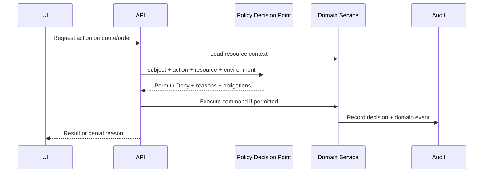
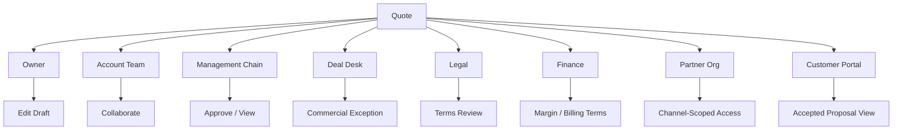
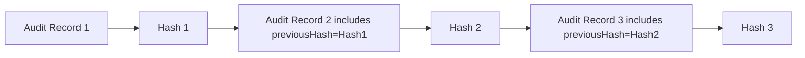
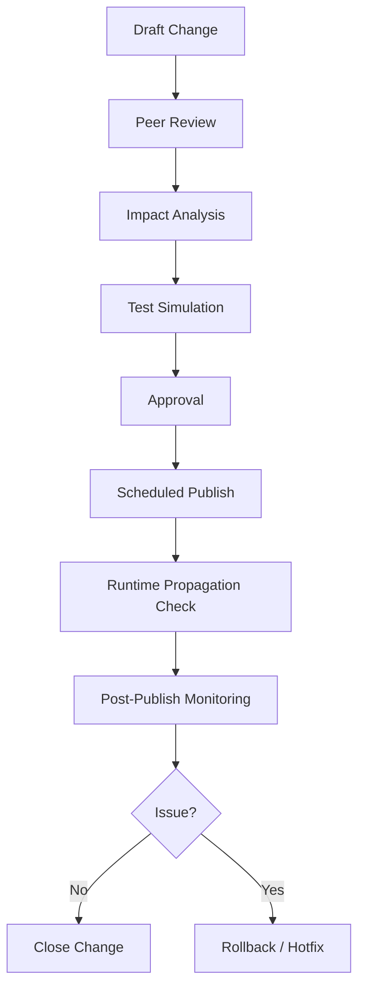
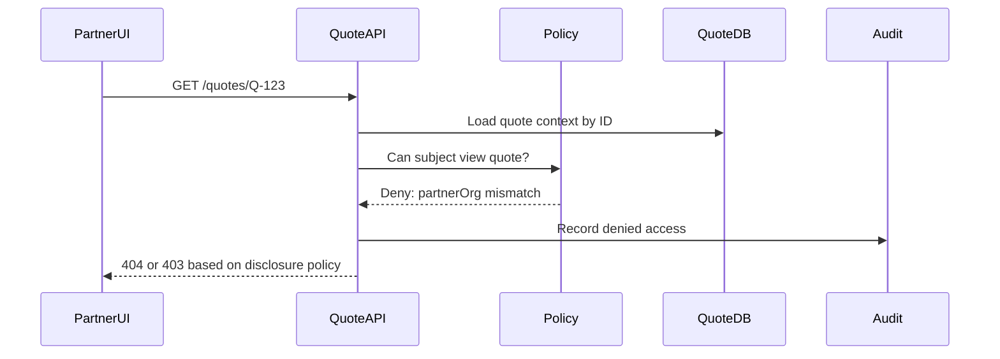
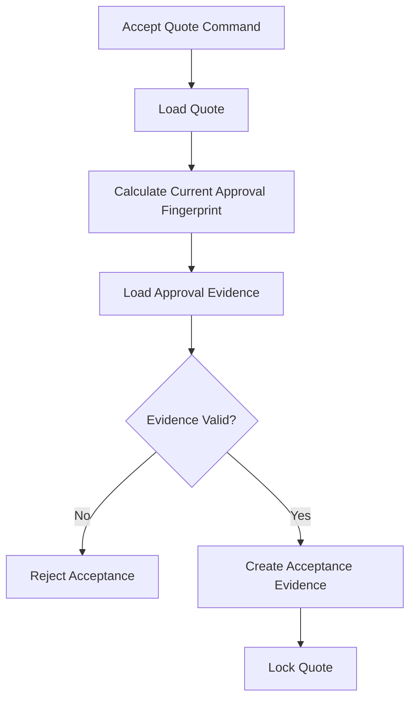

# Part 032 — Security, Compliance, Audit, and Regulatory Defensibility

Enterprise CPQ/OMS handles some of the most sensitive business data in a company:

- negotiated prices;
- discount exceptions;
- margins;
- customer contracts;
- quote documents;
- approval decisions;
- account hierarchies;
- billing accounts;
- service addresses;
- product entitlements;
- order status;
- provisioning details;
- cancellation and dispute evidence.

A security failure in CPQ/OMS is not only a technical breach. It can become:

- revenue leakage;
- unfair discount exposure;
- contractual dispute;
- privacy incident;
- regulatory violation;
- audit finding;
- customer trust failure;
- insider misuse;
- partner-channel abuse;
- operational sabotage.

This part explains how to design security, compliance, audit, and defensibility into CPQ/OMS as first-class architecture dimensions.

---

## 1. Kaufman Framing: The Sub-Skill We Are Practicing

The sub-skill here is control design.

By the end of this part, you should be able to:

1. Identify CPQ/OMS assets that require protection.
2. Design authorization beyond simple role checks.
3. Separate visibility, action permission, approval authority, and data mutation rights.
4. Apply RBAC, ABAC, policy-as-data, and separation of duties.
5. Prevent quote, price, discount, and order object-level authorization failures.
6. Protect sensitive price, margin, customer, and contract data.
7. Design audit records that are legally and operationally useful.
8. Build tamper-evident change history for commercial commitments.
9. Define defensible evidence packages for quote, approval, order, and billing handoff.
10. Evaluate whether a CPQ/OMS platform can survive audit, dispute, and incident review.

The target performance:

> Given a CPQ/OMS capability, you can define who can see it, who can change it, who can approve it, what evidence is produced, and how misuse is detected.

---

## 2. Security Is a Domain Design Problem

Security is often bolted onto CPQ/OMS as login plus roles.

That is not enough.

CPQ/OMS authorization must understand domain concepts:

- customer account hierarchy;
- sales territory;
- partner channel;
- legal entity;
- product line;
- geography;
- quote owner;
- opportunity team;
- approver authority;
- discount threshold;
- margin sensitivity;
- quote state;
- order state;
- contract status;
- asset ownership;
- support responsibility;
- regulatory region.

For example, these are different permissions:

| Permission Question | Domain Meaning |
|---|---|
| Can Alice view this quote? | Visibility |
| Can Alice edit this quote? | Mutation authority |
| Can Alice apply this discount? | Commercial delegation |
| Can Alice approve this discount? | Approval authority |
| Can Alice see margin? | Sensitive financial visibility |
| Can Alice convert quote to order? | Commitment creation |
| Can Alice cancel this order? | Operational authority |
| Can Alice repair failed task? | Recovery authority |
| Can Alice change billing account? | Financial control |
| Can Alice export quotes? | Data exfiltration risk |

A role named `SALES_MANAGER` cannot safely answer all of those.

---

## 3. CPQ/OMS Protected Asset Map

Start by identifying what must be protected.

```mermaid
flowchart TD
    A[CPQ/OMS Protected Assets] --> B[Commercial Data]
    A --> C[Customer Data]
    A --> D[Legal Evidence]
    A --> E[Operational Control]
    A --> F[Financial Data]
    A --> G[Platform Configuration]

    B --> B1[Price]
    B --> B2[Discount]
    B --> B3[Margin]
    B --> B4[Promotion]
    B --> B5[Deal Terms]

    C --> C1[Customer Profile]
    C --> C2[Account Hierarchy]
    C --> C3[Service Address]
    C --> C4[Contacts]

    D --> D1[Accepted Quote]
    D --> D2[Proposal Document]
    D --> D3[Approval Evidence]
    D --> D4[E-Signature Reference]

    E --> E1[Order State]
    E --> E2[Fulfillment Task]
    E --> E3[Manual Repair]
    E --> E4[Cancellation]

    F --> F1[Billing Account]
    F --> F2[Payment Term]
    F --> F3[Subscription Charge]

    G --> G1[Catalog]
    G --> G2[Pricing Policy]
    G --> G3[Approval Rule]
    G --> G4[Eligibility Rule]
```



Each protected asset needs:

- owner;
- classification;
- allowed viewers;
- allowed mutators;
- allowed approvers;
- retention period;
- audit requirements;
- masking/redaction rule;
- export policy;
- incident response owner.

---

## 4. Threat Model for CPQ/OMS

Threat modeling should be concrete. Instead of asking "is the system secure?", ask what can go wrong.

### 4.1 External Threats

| Threat | Example | Harm |
|---|---|---|
| Partner object access abuse | Partner changes quote ID in API call and views another partner's quote | Commercial data exposure |
| Credential theft | Attacker uses sales rep token to export quotes | Data breach |
| API scraping | Competitor scrapes product pricing or discount structure | Competitive harm |
| Order tampering | External channel changes billing account or order item | Fraud / fulfillment harm |
| Replay attack | Old quote acceptance submitted again | Duplicate commitment |
| Injection | Malicious data in proposal text or integration field | Data corruption / exploit |

### 4.2 Internal Threats

| Threat | Example | Harm |
|---|---|---|
| Excessive privilege | Sales user can approve own discount | Revenue leakage |
| Margin exposure | Rep sees margin for all customers | Negotiation harm |
| Policy bypass | Admin edits quote status directly to Approved | Audit/control failure |
| Manual repair abuse | Ops marks incomplete order as complete | Customer/billing dispute |
| Catalog tampering | Unauthorized product rule change | Invalid selling |
| Price manipulation | Backdated price book edit | Financial/legal exposure |

### 4.3 Systemic Threats

| Threat | Example | Harm |
|---|---|---|
| Missing audit | Cannot prove who changed discount | Audit finding |
| Weak data ownership | CRM and OMS overwrite account data | Data integrity failure |
| Unbounded export | Large quote export with PII and prices | Breach blast radius |
| Insecure event payload | Events leak margin to broad consumers | Data exposure |
| Over-trusting UI | API permits actions hidden in UI | Authorization bypass |
| Stale authorization cache | Revoked approver can still approve | Control failure |

---

## 5. Authorization Model: RBAC, ABAC, and Domain Policy

### 5.1 RBAC Alone Is Not Enough

RBAC answers: what role does the user have?

Examples:

- `SALES_REP`
- `SALES_MANAGER`
- `DEAL_DESK`
- `LEGAL_APPROVER`
- `ORDER_MANAGER`
- `FULFILLMENT_OPERATOR`
- `BILLING_SPECIALIST`
- `CATALOG_ADMIN`
- `PRICING_ADMIN`
- `SUPPORT_AGENT`

RBAC is useful for coarse-grained capabilities.

But CPQ/OMS usually needs more conditions:

- same sales territory;
- assigned account team;
- partner organization owns quote;
- quote is in editable state;
- discount is below authority threshold;
- customer is in allowed region;
- product family is within approver authority;
- order is not past cancellation cutoff;
- user is not requester and approver simultaneously;
- user has break-glass permission and reason.

This is ABAC and domain policy.

### 5.2 ABAC Dimensions

ABAC answers based on attributes.

| Attribute Type | Examples |
|---|---|
| Subject attributes | user ID, role, team, territory, partner org, legal entity, clearance |
| Resource attributes | quote owner, account, region, product family, quote state, sensitivity |
| Action attributes | view, edit, approve, submit, cancel, repair, export |
| Environment attributes | time, channel, network, risk score, break-glass mode |
| Business attributes | discount %, margin, deal size, renewal status, product regulatory class |

### 5.3 Policy Decision Flow



Important distinction:

- The **policy decision point** decides whether action is allowed.
- The **domain service** still enforces domain invariants.

Authorization does not replace validation.

---

## 6. Four Different Control Questions

A mature CPQ/OMS separates these:

1. **Visibility** — can the user see the object?
2. **Mutation** — can the user change it?
3. **Approval authority** — can the user approve an exception?
4. **Commitment authority** — can the user create a customer/legal/financial commitment?

### 6.1 Example Matrix

| Action | Visibility | Mutation | Approval | Commitment |
|---|---:|---:|---:|---:|
| View quote summary | Required | No | No | No |
| View line price | Required | No | No | No |
| View margin | Sensitive | No | No | No |
| Edit quantity | Required | Required | No | No |
| Apply discount | Required | Required | Maybe | No |
| Submit for approval | Required | State-specific | No | No |
| Approve discount | Required | No | Required | No |
| Generate proposal | Required | Maybe | No | Pre-commitment evidence |
| Accept quote | Required | No | No | Yes |
| Convert to order | Required | No | No | Yes |
| Cancel order | Required | Operational | Maybe | Commitment reversal |
| Repair fulfillment task | Required | Operational | Maybe | Operational correction |

Anti-pattern:

> A user who can edit a quote can also approve and accept it.

That violates separation of duties for high-risk deals.

---

## 7. Object-Level Authorization

CPQ/OMS APIs are especially vulnerable to object-level authorization mistakes because most operations are object-centric:

- `/quotes/{quoteId}`
- `/quotes/{quoteId}/lines/{lineId}`
- `/orders/{orderId}`
- `/orders/{orderId}/tasks/{taskId}`
- `/accounts/{accountId}/assets`
- `/documents/{documentId}`

The dangerous bug:

> The API checks that the user is authenticated, but not whether the user can access that specific object.

### 7.1 Broken Example

```http
GET /quotes/Q-100045
Authorization: Bearer token-for-partner-A
```

If partner A can change the ID to `Q-100046` and see partner B's quote, the system has object-level authorization failure.

### 7.2 Correct Pattern

Every object access should answer:

1. Who is the subject?
2. What action is requested?
3. What object is targeted?
4. What tenant/account/channel/territory owns the object?
5. What state is the object in?
6. What sensitivity does the object contain?
7. What relationship does subject have to object?
8. What obligations apply if permitted?

Pseudo-policy:

```text
permit view_quote when
  subject.active == true and
  resource.type == "Quote" and
  action == "view" and
  (
    subject.id == resource.ownerId or
    subject.accountTeam contains resource.accountId or
    subject.partnerOrgId == resource.partnerOrgId or
    subject.role contains "SUPPORT_AGENT" with active_case(resource.accountId)
  )
```

### 7.3 Resource Scoping Is Not Optional

Never rely only on frontend filters.

Queries must be scoped at the server side:

```sql
-- Conceptual only
select *
from quote
where quote_id = :quoteId
  and account_id in (:authorizedAccountIds)
```

For complex ABAC, this may be implemented through a policy service, domain query gateway, or secure data access layer. The key is that authorization follows the data access, not the UI route.

---

## 8. Field-Level and Property-Level Authorization

Seeing a quote does not mean seeing every field.

Sensitive fields:

- margin;
- cost;
- floor price;
- approval notes;
- competitor notes;
- legal negotiation comments;
- internal risk score;
- credit result;
- customer PII;
- tax identifiers;
- payment details;
- service address;
- provisioning identifiers.

### 8.1 Field-Level Visibility Matrix

| Field | Sales Rep | Sales Manager | Deal Desk | Finance | Support | Partner |
|---|---:|---:|---:|---:|---:|---:|
| List price | Yes | Yes | Yes | Yes | Limited | Yes/limited |
| Net price | Yes | Yes | Yes | Yes | Limited | Yes/limited |
| Cost | No | Maybe | Yes | Yes | No | No |
| Margin % | No | Maybe | Yes | Yes | No | No |
| Floor price | No | Maybe | Yes | Yes | No | No |
| Approval comment | Own/relevant | Yes | Yes | Maybe | No | No |
| Customer contact | Yes | Yes | Yes | Yes | Case-based | Own org only |
| Billing account | Limited | Yes | Yes | Yes | Case-based | No/limited |

### 8.2 Write Protection

Field-level authorization must protect writes too.

A common API bug:

```json
{
  "quantity": 10,
  "discountPercent": 70,
  "approvalStatus": "APPROVED",
  "marginOverride": true
}
```

If the API blindly maps request fields onto entity fields, the user can perform mass assignment.

Controls:

- command-specific DTOs;
- allowlist writable fields per action;
- server-side derivation for protected fields;
- policy check for sensitive changes;
- reject unexpected fields;
- audit before/after for sensitive fields.

Rule:

> Never expose internal aggregate mutation shape as public API request shape.

---

## 9. Quote Visibility and Collaboration Security

Enterprise quotes involve multiple actors:

- quote owner;
- account team;
- sales manager;
- deal desk;
- legal;
- finance;
- partner reseller;
- customer buyer;
- support;
- fulfillment/order team.

### 9.1 Collaboration Model



### 9.2 State-Dependent Access

Access changes by quote state.

| Quote State | Security Implication |
|---|---|
| Draft | owner/team can edit; sensitive price guarded |
| In Review | commercial fields may be locked |
| Approved | approval-relevant fields locked unless approval invalidated |
| Presented | proposal snapshot protected |
| Accepted | quote becomes evidence; edits prohibited |
| Expired | renewal/clone allowed; acceptance blocked |
| Converted | order reference protected; quote immutable |
| Cancelled | visible for audit; mutation blocked |

Invariant:

> Once a quote is accepted, the accepted state, price, terms, approval evidence, and document reference must be immutable except through governed correction.

---

## 10. Price and Margin Confidentiality

Price security is not just customer privacy. It is commercial strategy protection.

### 10.1 Data Classes

| Data | Sensitivity | Why |
|---|---|---|
| Public list price | Low/medium | May be public or channel-limited |
| Customer-specific price | High | Contractual and competitive |
| Discount percent | High | Negotiation leverage |
| Floor price | Very high | Direct revenue leakage risk |
| Cost | Very high | Strategic margin data |
| Margin | Very high | Negotiation and financial control |
| Promotion logic | Medium/high | Abuse and gaming risk |
| Approval threshold | High | Users may tune requests below threshold |

### 10.2 Controls

- Mask margin/cost by default.
- Do not put margin in broad event payloads.
- Avoid exposing floor price in UI API response.
- Use separate permission for margin view.
- Redact sensitive fields in logs.
- Encrypt sensitive exports.
- Watermark proposal/customer-facing documents if needed.
- Detect unusual quote/price export behavior.
- Prevent partner users from inferring internal approval thresholds.

Anti-pattern:

> Emit `QuotePriced` event containing list price, net price, cost, margin, floor price, approval threshold, and customer details to a broad event topic.

Better:

- publish minimal event for broad consumers;
- provide restricted query API for sensitive details;
- use field-level authorization;
- classify event topics by sensitivity.

---

## 11. Approval Control and Separation of Duties

Approval is a control system.

It must prevent:

- self-approval;
- approval by unauthorized role;
- approval of changed quote;
- approval after delegation expiry;
- approval without reason;
- approval threshold gaming;
- bypass by status edit;
- hidden conflict of interest.

### 11.1 Separation of Duties Rules

Examples:

```text
A user who requested a discount above threshold cannot be the final approver.

A user who owns the pricing policy cannot approve a temporary policy exception without secondary approval.

A user who performs manual billing correction cannot approve the same correction if financial threshold is exceeded.

A support agent may view quote/order for an active case but cannot modify commercial terms.
```

### 11.2 Approval Evidence

Approval record should include:

| Field | Purpose |
|---|---|
| approvalRequestId | Stable approval identity |
| quoteId / quoteVersion | Scope |
| approvalFingerprint | Exact commercial state |
| policyVersion | Rule basis |
| approverId | Actor |
| approverAuthority | Why they were allowed |
| decision | Approved / Rejected / Escalated |
| reasonCode | Audit classification |
| comment | Context |
| timestamp | Evidence time |
| delegationContext | If delegated |
| risk/margin/discount summary | Decision basis |

Invariant:

> Approval must be provably tied to the exact state it approved.

---

## 12. Audit Log vs Event Log vs History Table

These are different.

| Record Type | Purpose | Example |
|---|---|---|
| Domain event | Business state changed | `QuoteAccepted`, `OrderSubmitted` |
| Audit log | Who did what, when, from where, under what permission | Alice approved discount from IP X |
| Change history | Before/after values | discount changed from 10% to 15% |
| Evidence record | Proof for legal/compliance review | accepted quote PDF hash, e-sign reference |
| Operational log | Debug/diagnostic detail | pricing service returned timeout |

You need all of them, but not all in the same storage or format.

### 12.1 Audit Record Minimum

A useful audit record contains:

- actor ID;
- actor type: user/system/service;
- delegated actor if any;
- action;
- resource type;
- resource ID;
- tenant/account/customer context;
- before/after or event reference;
- policy decision ID;
- permission/authority basis;
- reason code;
- timestamp;
- request/correlation ID;
- source IP/device/channel where appropriate;
- result: success/denied/failure;
- immutable hash/reference if tamper-evident design is used.

### 12.2 Audit Quality Test

An auditor asks:

> Why did customer X receive 42% discount on quote Q-123, and who approved it?

A defensible system can answer:

- who created the quote;
- which catalog, price, and policy versions applied;
- how discount was calculated;
- why approval was required;
- who approved;
- what authority they had;
- what exact quote state they approved;
- whether quote changed after approval;
- what document customer accepted;
- when and how order was created;
- what billing received.

If the platform cannot answer this, it is not enterprise-grade.

---

## 13. Tamper-Evident Evidence

For high-value quotes and regulated environments, audit records should be tamper-evident.

This does not necessarily require blockchain. A practical design can use append-only records and hash chaining.

### 13.1 Hash Chain Concept



If someone changes record 2, hash 2 changes and record 3 no longer matches.

### 13.2 Evidence Package

An accepted quote evidence package may include:

- quote ID and version;
- quote line snapshot;
- configuration snapshot;
- pricing trace;
- price component details;
- discount and approval record;
- proposal document hash;
- terms template version;
- e-signature reference;
- acceptance timestamp;
- accepter identity;
- channel/source;
- order conversion reference;
- billing handoff reference.

Invariant:

> Evidence must survive later catalog, price, policy, template, and user-role changes.

---

## 14. Compliance and Regulatory Defensibility

Compliance requirements vary by industry and jurisdiction. The architecture should provide general control primitives:

- identity and access control;
- least privilege;
- separation of duties;
- approval evidence;
- immutable history;
- data minimization;
- retention and deletion policy;
- privacy controls;
- encryption;
- change management;
- incident response;
- monitoring and detection;
- vendor/integration control;
- audit reporting.

NIST CSF 2.0 organizes cybersecurity outcomes around six functions: Govern, Identify, Protect, Detect, Respond, and Recover. For CPQ/OMS, these map naturally to governance, asset/data classification, access protection, anomaly detection, incident handling, and recovery/reconciliation.

### 14.1 CPQ/OMS Control Mapping

| Control Function | CPQ/OMS Interpretation |
|---|---|
| Govern | Define ownership, policy, authority, risk, and accountability |
| Identify | Classify quote/order/customer/price/billing data and dependencies |
| Protect | Enforce access, encryption, masking, approval, and SoD |
| Detect | Monitor anomalous discounting, export, access, repair, and drift |
| Respond | Incident workflow for breach, misuse, wrong price, duplicate order |
| Recover | Data correction, customer remediation, reconciliation, evidence preservation |

---

## 15. Privacy and PII in CPQ/OMS

CPQ/OMS often stores or references personal data:

- customer contact name;
- email;
- phone;
- billing contact;
- service address;
- shipping address;
- identity documents in some industries;
- buyer signature;
- support notes;
- communication history.

### 15.1 Privacy Principles

1. Store only what the domain needs.
2. Classify fields by sensitivity.
3. Mask by default in broad views.
4. Restrict exports.
5. Redact logs.
6. Encrypt at rest and in transit.
7. Use purpose-based access where needed.
8. Define retention policy.
9. Support deletion/anonymization where legally required and compatible with audit obligations.
10. Preserve legal evidence without overexposing personal data.

### 15.2 Data Minimization Example

Bad event:

```json
{
  "eventType": "OrderSubmitted",
  "customerName": "...",
  "customerEmail": "...",
  "billingAddress": "...",
  "serviceAddress": "...",
  "fullQuoteLines": [...],
  "margin": 0.43,
  "approvalComments": "..."
}
```

Better broad event:

```json
{
  "eventType": "OrderSubmitted",
  "orderId": "O-123",
  "accountId": "A-456",
  "quoteId": "Q-789",
  "occurredAt": "2026-07-02T10:15:00Z",
  "sensitivity": "INTERNAL",
  "links": {
    "order": "/orders/O-123"
  }
}
```

Consumers requiring sensitive data must use authorized query APIs.

---

## 16. API Security Design

CPQ/OMS APIs must defend against common API weaknesses.

### 16.1 Key Risks

| Risk | CPQ/OMS Example | Control |
|---|---|---|
| Broken object-level authorization | User accesses another account's quote by ID | Object-level policy check |
| Broken authentication | Stolen token used by integration | Strong auth, token rotation, mTLS for system-to-system |
| Broken object property authorization | User updates protected approval status field | Command DTO allowlist + field policy |
| Unrestricted resource consumption | Bulk quote pricing overloads pricing engine | rate limits, quotas, async jobs |
| Broken function-level authorization | Sales rep calls admin price-book endpoint | action-level authorization |
| Mass assignment | API maps request to entity | explicit command model |
| SSRF/injection via document/template fields | External URL fetch or unsafe template data | validation, sandboxing, escaping |
| Unsafe event exposure | Sensitive payload to broad topic | topic classification, data minimization |

### 16.2 API Gateway Is Not Enough

An API gateway can enforce:

- authentication;
- basic rate limiting;
- coarse routing;
- token validation;
- request size limit;
- TLS termination;
- WAF rules.

It cannot fully enforce:

- quote ownership;
- account hierarchy;
- discount authority;
- quote state transition permission;
- line-level product restrictions;
- field-level margin masking;
- separation of duties;
- approval fingerprint validity.

Those require domain-aware checks in application/policy layer.

---

## 17. Security for Events and Async Flows

Events are often treated as internal and therefore trusted. That is risky.

### 17.1 Event Security Questions

For every event, ask:

1. Who can publish this event?
2. Who can consume it?
3. Does payload contain sensitive data?
4. Is the event authentic?
5. Can the event be replayed safely?
6. Is the consumer idempotent?
7. Is schema evolution controlled?
8. Does the event create a downstream commitment?
9. Is failed consumption visible?
10. Is payload retained longer than allowed?

### 17.2 Event Topic Classification

| Topic Type | Example | Security Treatment |
|---|---|---|
| Public/internal low sensitivity | Catalog display update | Broad internal access okay |
| Internal commercial | Quote state changed | Restricted consumers |
| Sensitive financial | Price/margin changed | Highly restricted; minimize payload |
| Legal evidence | Quote accepted/document generated | Restricted and immutable |
| Operational control | Fulfillment task command | Strong producer/consumer identity |
| Privacy-sensitive | Customer/contact changed | Minimize, encrypt, retention control |

### 17.3 Event Payload Principle

> Publish what consumers need to know that something happened; expose sensitive details through authorized APIs.

---

## 18. Change Management and Configuration Governance

In CPQ/OMS, configuration changes can be as dangerous as code changes.

Governed configuration:

- catalog rule;
- product compatibility;
- price book;
- discount policy;
- promotion rule;
- approval rule;
- eligibility rule;
- document template;
- legal clause;
- decomposition rule;
- fulfillment mapping;
- tax mapping;
- billing mapping.

### 18.1 Configuration Release Control



Required evidence:

- change owner;
- reason;
- affected products/customers/channels;
- effective date;
- test result;
- approver;
- publish result;
- rollback plan;
- post-publish validation.

Control invariant:

> No high-risk commercial policy change should reach runtime without review, simulation, approval, and rollback plan.

---

## 19. Break-Glass Access

Break-glass access is emergency elevated access.

It is sometimes necessary, but dangerous.

### 19.1 Requirements

Break-glass should require:

- explicit activation;
- short duration;
- reason code;
- incident/case reference;
- strong authentication;
- approval or after-the-fact review;
- enhanced logging;
- limited scope;
- automatic expiration;
- alert to security/ops owner.

### 19.2 Example Use Cases

Allowed:

- unblock critical order fallout with documented customer impact;
- view sensitive data for active security incident;
- correct corrupted state using repair workflow.

Not allowed:

- bypass approval for sales convenience;
- view customer quotes out of curiosity;
- edit price book without change process;
- force order complete to hide SLA breach.

---

## 20. Logging Without Leaking Data

Logs are useful, but logs can become a data breach.

Do not log:

- full quote payload with customer data;
- full proposal document content;
- margin/cost/floor price;
- payment details;
- authentication tokens;
- e-signature secrets;
- raw identity documents;
- unnecessary service address details;
- approval comments containing sensitive negotiation information.

Do log:

- correlation ID;
- resource ID;
- action;
- actor/service identity;
- policy decision ID;
- error classification;
- state transition;
- validation code;
- external system correlation;
- safe summary fields.

Example safe log:

```json
{
  "correlationId": "c-123",
  "actorId": "u-456",
  "action": "QUOTE_SUBMIT_FOR_APPROVAL",
  "quoteId": "Q-789",
  "quoteVersion": 12,
  "policyDecisionId": "pd-111",
  "result": "DENIED",
  "reasonCode": "DISCOUNT_EXCEEDS_AUTHORITY"
}
```

---

## 21. Data Retention and Legal Hold

CPQ/OMS data has conflicting needs:

- sales wants historical quotes;
- finance wants billing evidence;
- legal wants accepted documents;
- privacy may require deletion/minimization;
- support wants operational history;
- audit wants immutable records;
- analytics wants long-term trends.

A retention design must classify data.

| Data | Retention Consideration |
|---|---|
| Draft quote | May expire/delete after business period |
| Accepted quote | Retain as contract evidence |
| Proposal document | Retain with accepted quote/legal policy |
| Approval evidence | Retain for audit and dispute |
| Order history | Retain for fulfillment/support/legal |
| Billing handoff | Retain for financial audit |
| Debug logs | Shorter retention, redacted |
| PII fields | Minimize and apply privacy/legal rules |
| Analytics aggregates | De-identify where possible |

Legal hold overrides normal deletion for relevant records. The system should support marking quote/order/document/evidence records under hold.

---

## 22. Detection and Abuse Monitoring

Preventive controls are not enough. You also need detection.

### 22.1 Suspicious Patterns

| Pattern | Possible Meaning |
|---|---|
| User views many quotes outside normal accounts | Data harvesting |
| Partner receives repeated authorization denials across quote IDs | Object enumeration |
| High discount just below approval threshold | Threshold gaming |
| Repeated manual repair by same operator | Process abuse or training issue |
| Frequent break-glass activation | Weak normal process or misuse |
| Export volume spike | Exfiltration risk |
| Price book changes near quarter-end | High-risk commercial manipulation |
| Quote accepted after approval invalidation | Control bypass |
| Billing account changed after acceptance | Fraud or correction risk |
| Search for margin fields by unauthorized role | Insider risk |

### 22.2 Detection Signals

- denied access rate by resource type;
- object ID enumeration pattern;
- export volume by user/channel;
- sensitive field access count;
- discount distribution by rep/manager;
- manual override count;
- approval bypass attempts;
- break-glass activation;
- policy change frequency;
- after-hours high-risk changes;
- failed field-level update attempts.

Detection should feed:

- security alert;
- compliance review;
- sales operations review;
- training feedback;
- product UX improvement;
- policy tuning.

---

## 23. Regulatory Defensibility Model

Regulatory defensibility means the platform can explain and prove its behavior.

A defensible CPQ/OMS can answer:

1. What was offered?
2. Who configured it?
3. Which catalog and rule version allowed it?
4. How was price calculated?
5. Which discount policy applied?
6. Who approved exceptions?
7. What document was presented?
8. Who accepted it?
9. What order was created?
10. What fulfillment happened?
11. What billing received?
12. Who changed anything afterward?
13. Was access appropriate?
14. Was customer data protected?
15. Were corrections controlled?

### 23.1 Evidence Chain

```mermaid
flowchart LR
    A[Catalog Version] --> B[Configuration Snapshot]
    B --> C[Pricing Trace]
    C --> D[Quote Version]
    D --> E[Approval Evidence]
    E --> F[Proposal Document Hash]
    F --> G[Acceptance Evidence]
    G --> H[Product Order]
    H --> I[Fulfillment Evidence]
    I --> J[Billing Handoff]
    J --> K[Reconciliation / Audit Report]
```



If any link is missing, the organization may struggle to defend the outcome.

---

## 24. Security Design Review Checklist

### 24.1 Asset and Classification

- [ ] What sensitive data does this capability access?
- [ ] Is data classified?
- [ ] Is margin/cost/floor price protected?
- [ ] Is PII minimized?
- [ ] Is event payload minimized?
- [ ] Are logs redacted?

### 24.2 Authorization

- [ ] Is object-level authorization enforced server-side?
- [ ] Is field-level read protection defined?
- [ ] Is field-level write protection defined?
- [ ] Are state-dependent permissions defined?
- [ ] Is approval authority separate from edit permission?
- [ ] Is separation of duties enforced?
- [ ] Are partner/channel/tenant boundaries enforced?

### 24.3 Audit and Evidence

- [ ] Are domain events recorded?
- [ ] Are audit records actor-aware?
- [ ] Is policy decision captured?
- [ ] Are before/after changes captured for sensitive fields?
- [ ] Is accepted quote immutable?
- [ ] Is proposal document hash stored?
- [ ] Is approval tied to quote fingerprint?
- [ ] Can evidence survive later policy/catalog changes?

### 24.4 Integration and Events

- [ ] Are event producers authenticated?
- [ ] Are consumers authorized?
- [ ] Are sensitive events restricted?
- [ ] Are event schemas versioned?
- [ ] Are consumers idempotent?
- [ ] Is failed consumption visible?

### 24.5 Operations

- [ ] Is break-glass controlled?
- [ ] Are manual repairs audited?
- [ ] Is suspicious access monitored?
- [ ] Are export limits enforced?
- [ ] Is retention policy defined?
- [ ] Is legal hold supported?
- [ ] Is incident response mapped to quote/order/billing impact?

---

## 25. Common Anti-Patterns

### 25.1 UI-Only Security

The UI hides buttons, but API still allows the action.

Better:

- enforce permission in API/application layer;
- test direct API access;
- use command-specific authorization.

### 25.2 Role Explosion

Hundreds of roles are created to model every exception.

Better:

- use coarse roles plus attributes;
- define policy rules;
- model authority thresholds as data.

### 25.3 Approval as Status Field

Quote has `approvalStatus = APPROVED`, editable by admin.

Better:

- approval is a domain evidence record;
- status derives from valid approval record;
- changes invalidate approval fingerprint.

### 25.4 Audit Log Without Context

Audit says "quote updated" but not what changed, why, or under what permission.

Better:

- include action, actor, resource, before/after, reason, policy decision, and correlation ID.

### 25.5 Sensitive Data in Events

Broad event topics contain margin, cost, PII, and approval comments.

Better:

- minimize payload;
- classify topics;
- restrict consumers;
- expose details through authorized API.

### 25.6 Break-Glass as Normal Workflow

Teams routinely use emergency access to complete business operations.

Better:

- fix normal workflow;
- restrict emergency access;
- review usage;
- alert owners.

---

## 26. Mini Case Study: Partner Quote Data Exposure

### 26.1 Scenario

A partner portal allows users to view quotes using this endpoint:

```http
GET /api/quotes/{quoteId}
```

The frontend only shows quote IDs owned by the partner. But the API checks only authentication, not object ownership. A partner user increments quote IDs and downloads quotes from another partner, including customer-specific prices.

### 26.2 Failed Controls

- no object-level authorization;
- sequential guessable IDs;
- no account/partner scope check;
- no export anomaly detection;
- quote response included unnecessary sensitive fields;
- no alert on repeated cross-partner access attempts.

### 26.3 Corrected Design



Additional controls:

- non-enumerable public references;
- server-side partner/org scoping;
- field masking for partner role;
- rate limiting;
- denied-access anomaly detection;
- security test for horizontal access;
- data minimization in quote response.

Protected invariant:

> A partner can access only quotes explicitly associated with its partner organization and permitted account relationship.

---

## 27. Mini Case Study: Discount Approval Bypass

### 27.1 Scenario

A sales manager submits a quote with 35% discount. Deal desk rejects it. The sales manager uses an internal admin screen to set `approvalStatus = APPROVED`. The quote is accepted and converted to order.

### 27.2 Failed Controls

- approval modeled as mutable field;
- admin screen bypassed domain command;
- no separation of duties;
- quote acceptance checked status, not approval evidence;
- audit lacked reason and authority;
- no alert on direct approval status mutation.

### 27.3 Corrected Design

Approval is valid only when:

- approval record exists;
- approval fingerprint matches current quote fingerprint;
- approver had authority at decision time;
- decision was positive;
- approval was not revoked/expired;
- quote has not changed in approval-relevant dimensions.

Quote acceptance checks approval evidence, not status field.



Protected invariant:

> No quote requiring approval can be accepted without valid approval evidence for the current commercial state.

---

## 28. Practice Exercises

### Exercise 1 — Authorization Matrix

Choose one capability:

- edit quote line;
- apply discount;
- approve quote;
- convert quote to order;
- cancel order;
- repair fulfillment task;
- change billing account.

Create a matrix with:

- roles;
- attributes;
- allowed actions;
- denied actions;
- field-level visibility;
- state-dependent rules;
- audit fields.

### Exercise 2 — Object-Level Authorization Test

For quote, order, account asset, and document APIs, design tests for:

- same user, own object;
- same role, different account;
- partner A accessing partner B object;
- support agent without active case;
- revoked user;
- state transition with insufficient authority.

### Exercise 3 — Evidence Package

Design an accepted quote evidence package for a high-value enterprise deal.

Include:

- quote snapshot;
- configuration;
- price trace;
- approval;
- document;
- e-signature;
- acceptance;
- order conversion;
- billing handoff;
- audit hash.

### Exercise 4 — Sensitive Event Redesign

Given this event:

```json
{
  "eventType": "QuoteApproved",
  "quoteId": "Q-123",
  "customerName": "ACME",
  "netPrice": 100000,
  "cost": 54000,
  "margin": 0.46,
  "floorPrice": 79000,
  "approvalComment": "...",
  "billingAddress": "..."
}
```

Redesign it into:

1. broad internal event;
2. restricted finance event;
3. authorized query API response.

---

## 29. Self-Assessment

You understand this part when you can answer these without guessing:

1. Why is CPQ/OMS authorization more complex than role checks?
2. What is object-level authorization and why is CPQ/OMS vulnerable to it?
3. Why should approval not be represented as a mutable status field?
4. What fields should be masked from sales reps, partners, support, and broad event consumers?
5. What is the difference between domain event, audit log, change history, and evidence record?
6. How do you prove that an accepted quote was valid at the time of acceptance?
7. How do you prevent partner quote data leakage?
8. What should a break-glass workflow require?
9. How do you design event payloads without leaking sensitive data?
10. What makes a CPQ/OMS platform regulatory-defensible?

---

## 30. References

- NIST Cybersecurity Framework 2.0: https://www.nist.gov/cyberframework
- OWASP API Security Top 10 2023: https://owasp.org/API-Security/editions/2023/en/0x11-t10/
- OWASP API1:2023 — Broken Object Level Authorization: https://owasp.org/API-Security/editions/2023/en/0xa1-broken-object-level-authorization/
- OWASP API3:2023 — Broken Object Property Level Authorization: https://owasp.org/API-Security/editions/2023/en/0xa3-broken-object-property-level-authorization/
- CloudEvents Specification: https://cloudevents.io/
- AWS Well-Architected Framework — Security Pillar: https://docs.aws.amazon.com/wellarchitected/latest/security-pillar/welcome.html
- TM Forum Open APIs: https://www.tmforum.org/open-digital-architecture/open-apis

---

## 31. What Comes Next

Security and audit define whether CPQ/OMS behavior is controlled and defensible.

The next part moves into testing strategy.

Testing an enterprise CPQ/OMS platform requires more than unit tests. We need domain tests, pricing golden masters, catalog simulations, state-machine tests, contract tests, replay tests, reconciliation tests, migration tests, and failure-injection tests.
