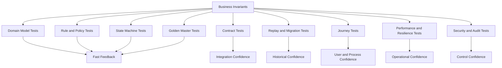
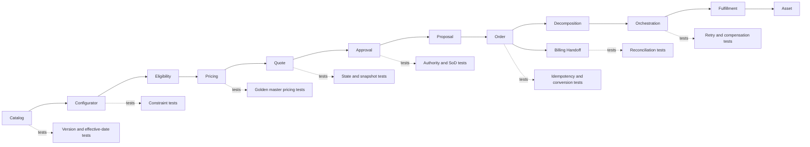
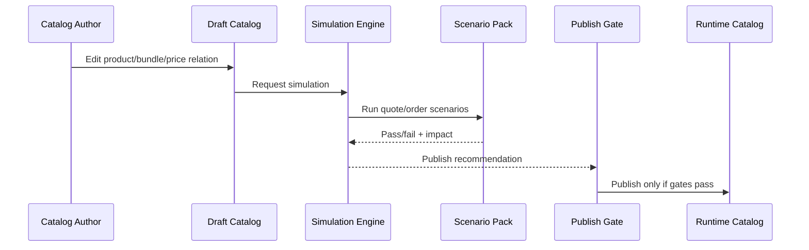
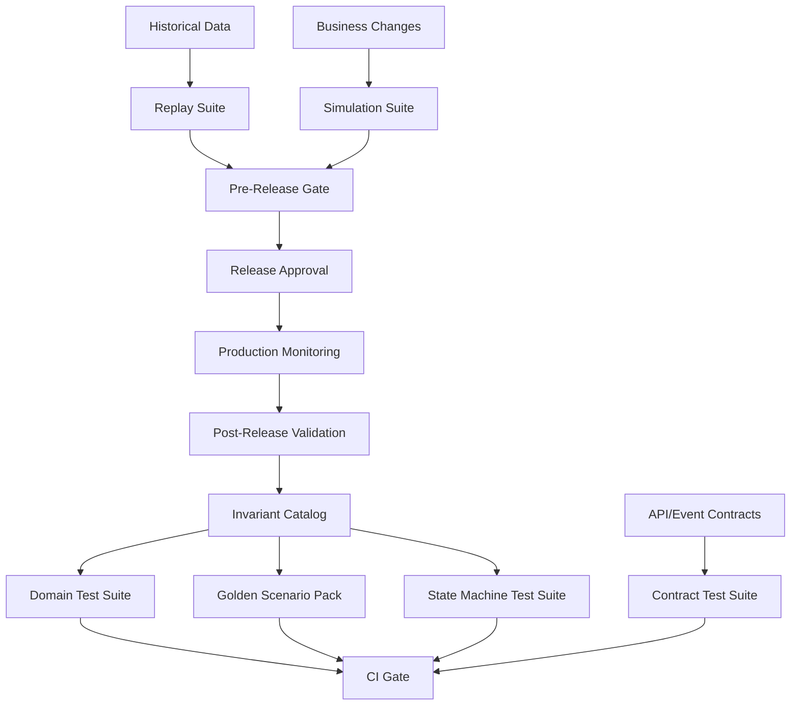

# Part 033 — Testing Strategy for Enterprise CPQ/OMS

Testing CPQ/OMS is not the same as testing a normal CRUD system.

A normal CRUD system asks:

> Did the API store and retrieve the object correctly?

An enterprise CPQ/OMS platform asks harder questions:

> Did the system produce a commercially correct, legally defensible, operationally executable, and auditable commitment under a specific catalog version, price version, policy version, customer context, channel, approval state, and order lifecycle?

That difference changes the entire testing strategy.

In CPQ/OMS, defects are rarely isolated to a single endpoint. A seemingly small error can propagate across:

- product configuration;
- eligibility;
- pricing;
- discount policy;
- quote approval;
- proposal document;
- contract handoff;
- order conversion;
- fulfillment decomposition;
- billing setup;
- asset inventory;
- support visibility;
- revenue reporting.

So the testing strategy must be designed around **business invariants**, **state transitions**, **commercial correctness**, **versioned rules**, **integration contracts**, and **operational recovery**.

This part gives you the testing model you would expect in an internal engineering handbook for a production-grade CPQ/OMS platform.

---

## 1. Kaufman Framing: The Sub-Skill We Are Practicing

The sub-skill here is quality architecture.

By the end of this part, you should be able to:

1. Identify the critical invariants that must never break.
2. Classify tests by risk, feedback speed, and ownership.
3. Design tests for product model, catalog, configuration, pricing, quote, approval, order, orchestration, and billing handoff.
4. Build golden datasets for deterministic pricing and policy evaluation.
5. Test state machines using transition tables and illegal transition matrices.
6. Test event-driven flows without depending on brittle full-stack orchestration for every scenario.
7. Design contract tests between CPQ, OMS, billing, ERP, inventory, fulfillment, and analytics.
8. Test migration, replay, rollback, and data correction.
9. Define release gates for catalog, pricing, policy, workflow, and platform code changes.
10. Explain why "high coverage" is not the same as "enterprise-grade confidence".

The target performance:

> Given a CPQ/OMS change, you can decide what must be tested, at what layer, by whom, with what dataset, and which failure modes must block release.

---

## 2. Why Generic Test Strategy Fails in CPQ/OMS

A generic service testing approach usually looks like this:

- unit tests for functions;
- API tests for endpoints;
- integration tests for database and external services;
- some end-to-end tests;
- maybe performance tests before release.

That is not enough for CPQ/OMS.

The main reason is that CPQ/OMS correctness is not only code correctness. It is the correctness of a **versioned commercial decision system**.

A quote price is determined by:

- product catalog version;
- product option selection;
- product constraints;
- customer account;
- customer segment;
- legal entity;
- country;
- currency;
- sales channel;
- contract terms;
- promotion campaign;
- discount authority;
- approval status;
- effective dates;
- tax boundary;
- rounding policy;
- quote revision;
- billing frequency;
- subscription term;
- asset state.

A normal API test can confirm that `POST /quotes` returns `201 Created`. It cannot prove that the quote is commercially correct.

### 2.1 The Actual Failure Modes

In enterprise CPQ/OMS, testing must catch failures like these:

| Failure | Example | Business Impact |
|---|---|---|
| Stale catalog | Rep sells a discontinued product | Fulfillment rejection, customer dispute |
| Stale price | Quote accepted with old price | Revenue leakage |
| Invalid bundle | Required child product missing | Provisioning failure |
| Broken eligibility | Product sold in restricted geography | Regulatory or contractual violation |
| Approval bypass | Discount beyond authority accepted | Margin leakage, audit finding |
| Wrong quote snapshot | Accepted quote differs from generated proposal | Legal dispute |
| Duplicate order | User retries submit and two orders are created | Double fulfillment, billing error |
| Decomposition error | Commercial product maps to wrong technical task | Fulfillment failure |
| Missing compensation | Cancellation stops one task but not another | Zombie service, billing drift |
| Broken reconciliation | Billing does not match order | Revenue leakage and support escalation |

The point is not to test every possible permutation manually. The point is to design a testing system that aggressively protects the invariants.

---

## 3. The CPQ/OMS Testing Pyramid Is Not a Triangle

The classic test pyramid is useful, but CPQ/OMS needs a richer model.

A better mental model is a **risk-layered test portfolio**.



The shape is not important. The economics are important:

- Put high-volume permutations in fast deterministic tests.
- Put integration assumptions in contract tests.
- Put cross-system business scenarios in a smaller number of journey tests.
- Put historical correctness in replay tests.
- Put operational correctness in resilience and recovery tests.
- Put governance correctness in audit and security tests.

### 3.1 Testing by Question

Instead of asking "what kind of test should we write?", ask:

| Question | Test Type |
|---|---|
| Is this rule correct for many inputs? | Rule/policy test |
| Is this price stable and explainable? | Golden master pricing test |
| Is this transition legal? | State machine test |
| Can this message be consumed by downstream systems? | Contract test |
| Can the system recover after duplicate events? | Idempotency/replay test |
| Can a user complete the workflow? | Journey test |
| Can production survive peak traffic? | Load/performance test |
| Can we prove who approved what? | Audit/evidence test |
| Can old orders still be interpreted? | Migration/backward compatibility test |

---

## 4. Testing Around Invariants

The most important tests in CPQ/OMS are not endpoint tests. They are invariant tests.

An invariant is a rule that must always hold, regardless of implementation detail.

Examples:

1. A submitted quote must have a frozen catalog reference.
2. An accepted quote must have a price snapshot.
3. A quote requiring approval cannot be accepted before approval is complete.
4. A quote approval is invalid if the quote financial fingerprint changes.
5. An order converted from quote must reference the accepted quote version.
6. A product order item cannot be fulfilled before decomposition is complete.
7. A cancellation cannot erase historical fulfillment evidence.
8. A billed subscription must trace back to a contract/order/quote lineage.
9. A price shown to a user must be reproducible from the pricing trace.
10. A user cannot approve their own restricted discount exception if separation-of-duties policy applies.

### 4.1 Invariant Catalog

Every CPQ/OMS team should maintain an invariant catalog.

Example:

```md
Invariant: Approved Quote Fingerprint Stability

Statement:
  Once a quote is approved, the approved financial fingerprint must match
  the fingerprint at acceptance and order conversion time.

Applies to:
  Quote approval, quote acceptance, quote-to-order conversion.

Violation impact:
  Discount bypass, price dispute, margin leakage, audit failure.

Test layers:
  - quote aggregate unit test
  - approval workflow test
  - quote acceptance API test
  - quote-to-order conversion test
  - audit replay test

Blocking severity:
  Release blocker.
```

This is more valuable than a vague testing checklist.

---

## 5. Test Scope Map Across CPQ/OMS Capabilities

The following map shows how testing concerns align with platform capabilities.



Each capability has a different correctness model. A single testing pattern cannot cover them all.

---

## 6. Product Model and Catalog Tests

Catalog bugs are dangerous because they are often published by business users, not developers.

You must test both:

1. The catalog platform.
2. The catalog content.

### 6.1 Catalog Platform Tests

These tests verify that the catalog system behaves correctly.

Examples:

- cannot publish product offering without required product specification;
- cannot publish overlapping active versions unless policy allows it;
- cannot delete a catalog version referenced by quote/order/asset history;
- effective date lookup returns the correct version;
- channel visibility works correctly;
- localization fallback works correctly;
- rollback restores the previous runtime version;
- runtime catalog read is immutable for a published version.

### 6.2 Catalog Content Tests

These tests verify that authored product data is safe.

Examples:

- every required bundle component is available in the same effective window;
- every child option references a valid parent;
- every option group has valid cardinality;
- every sellable offer has price coverage for required currencies;
- every channel-visible offer has eligibility policy;
- every technical mapping target exists;
- no circular dependency exists in bundle graph;
- no discontinued component is required by an active bundle.

### 6.3 Catalog Simulation

Before publishing catalog changes, run simulation against representative scenarios.



Simulation scenarios should include:

- top revenue products;
- high-risk bundles;
- regulated products;
- active promotions;
- existing contract amendments;
- high-volume sales channels;
- renewal flows;
- downgrade/cancellation flows.

---

## 7. Configurator Tests

Configurator tests must validate the rules that determine valid product combinations.

### 7.1 Constraint Test Types

| Test Type | Purpose |
|---|---|
| Cardinality test | Option group min/max selection |
| Dependency test | Selecting A requires B |
| Exclusion test | Selecting A forbids C |
| Compatibility test | Option works only with specific parent/version/channel |
| Defaulting test | System selects default option when criteria match |
| Explanation test | Invalid configuration returns useful reason |
| Determinism test | Same input returns same configuration result |
| Performance test | Large bundle evaluates within latency budget |

### 7.2 Example Constraint Test Matrix

| Scenario | Selected Options | Expected Result |
|---|---|---|
| Required modem missing | Internet plan only | Invalid: modem required |
| Premium support with basic plan | Basic + premium support | Invalid: support requires pro plan |
| Region-restricted add-on | Product + add-on in unsupported region | Invalid: add-on unavailable |
| Valid enterprise bundle | Parent + required child + optional add-on | Valid |

### 7.3 Property-Based Testing for Configurators

For complex configuration graphs, example-based tests are not enough.

Use property-based thinking:

- Generate many valid and invalid option combinations.
- Assert invariants.
- Shrink failing combinations to minimal reproduction.

Useful properties:

1. No valid configuration violates required cardinality.
2. No selected option references a missing parent.
3. Explanation always exists for invalid result.
4. Adding an incompatible option cannot produce a valid state.
5. Removing an optional child cannot invalidate parent unless cardinality requires it.
6. Rule evaluation is deterministic for the same input and catalog version.

---

## 8. Eligibility, Qualification, and Entitlement Tests

Eligibility tests are not the same as configurator tests.

Configurator tests answer:

> Is the selected product combination structurally valid?

Eligibility tests answer:

> Is this customer allowed to buy or modify this product in this context?

### 8.1 Eligibility Test Dimensions

| Dimension | Examples |
|---|---|
| Geography | country, state, service area, restricted region |
| Customer | segment, legal type, credit status, risk profile |
| Channel | direct sales, partner, self-service, call center |
| Account | parent account, billing account, legal entity |
| Contract | active contract, negotiated terms, committed volume |
| Installed base | existing asset, entitlement, upgrade path |
| Regulatory | industry restriction, residency, consent, compliance status |
| Time | effective window, qualification expiry |

### 8.2 Qualification Expiry Test

A common bug is accepting a stale qualification.

Test cases:

1. Qualification is valid at quote creation but expired at submission.
2. Qualification is valid at submission but expired at order conversion.
3. Qualification is refreshed and changes from pass to fail.
4. Qualification is refreshed and changes from fail to pass.
5. Qualification result is manually overridden with approved evidence.

Expected invariant:

> A qualification result can only be reused if it is still valid for the intended action and context.

---

## 9. Pricing Tests

Pricing is the highest-value test domain in CPQ.

Pricing defects directly affect:

- revenue;
- margin;
- customer trust;
- approval routing;
- commission;
- renewal value;
- billing;
- accounting;
- analytics.

### 9.1 Pricing Test Layers

| Layer | Test Focus |
|---|---|
| Price data validation | price coverage, currency, effective windows |
| Calculation unit tests | formulas, rounding, charge duration |
| Rule tests | conditions, actions, precedence |
| Golden master tests | expected output for known scenarios |
| Property tests | invariants across generated inputs |
| Trace tests | explainability and replay |
| Approval integration tests | threshold/fingerprint correctness |
| Billing handoff tests | price transfer correctness |

### 9.2 Golden Master Pricing Tests

A golden master pricing test compares current output against an approved expected result.

Golden dataset example:

```yaml
scenarioId: ENT-SUBSCRIPTION-RAMP-001
catalogVersion: catalog-2026.07.01
priceBookVersion: pb-enterprise-2026q3
customerSegment: ENTERPRISE
country: ID
currency: IDR
termMonths: 36
products:
  - code: CLOUD-CORE
    quantity: 100
  - code: PREMIUM-SUPPORT
    quantity: 1
discounts:
  - type: DISCRETIONARY
    percent: 12
expected:
  listTotal: 1200000000
  netTotal: 1056000000
  approvalRequired: true
  approvalReasons:
    - DISCOUNT_EXCEEDS_MANAGER_THRESHOLD
  priceFingerprint: sha256:...
```

Golden tests should cover:

- top-selling bundles;
- edge pricing rules;
- contract pricing;
- ramp deals;
- tiered pricing;
- usage pricing;
- currency conversion;
- rounding;
- promotions;
- discount approval threshold;
- renewal/amendment pricing;
- cancellation credits;
- negative quantity adjustments;
- large quotes.

### 9.3 Pricing Trace Tests

A pricing engine must explain its result.

Test not only the final price, but also the trace:

```json
{
  "lineId": "QL-1001",
  "listPrice": 1000,
  "priceComponents": [
    {"type": "LIST", "amount": 1000},
    {"type": "VOLUME_DISCOUNT", "amount": -100, "ruleId": "VOL-10"},
    {"type": "PROMOTION", "amount": -50, "ruleId": "PROMO-Q3"},
    {"type": "DISCRETIONARY", "amount": -75, "approved": false}
  ],
  "netPrice": 775,
  "approvalRequired": true
}
```

Trace tests should assert:

- component order;
- rule IDs;
- rule version;
- effective date;
- rounding step;
- approval reasons;
- excluded rules;
- explanation for rejected promotions.

### 9.4 Pricing Regression Strategy

Use three levels:

1. **Small deterministic unit tests** for formulas.
2. **Golden scenario pack** for business-approved examples.
3. **Replay tests** against historical anonymized quotes.

Replay tests answer:

> If this pricing engine had processed yesterday's accepted quotes, would the result still match the committed commercial record?

---

## 10. Quote Lifecycle Tests

Quote lifecycle testing is mostly state machine testing.

### 10.1 Legal Transition Matrix

| From | To | Allowed? | Guard |
|---|---:|---:|---|
| Draft | Validated | Yes | quote complete |
| Draft | Accepted | No | must be presented/approved |
| Validated | InApproval | Yes | approval required |
| Validated | Presented | Yes | no approval required |
| InApproval | Approved | Yes | all approvals complete |
| InApproval | Accepted | No | approval incomplete |
| Approved | Presented | Yes | proposal generated |
| Presented | Accepted | Yes | customer acceptance evidence |
| Accepted | Draft | No | immutable commitment |
| Expired | Accepted | No | expired quote |
| Superseded | Accepted | No | no longer current |

Each row should become automated tests.

### 10.2 Quote Snapshot Tests

Quote snapshot tests verify that quote history remains interpretable.

Test cases:

- accepted quote retains catalog version;
- accepted quote retains price trace;
- accepted quote retains approval evidence;
- accepted quote retains proposal document hash;
- accepted quote retains customer acceptance evidence;
- quote revision does not mutate previous revision;
- superseded quote cannot be converted to order;
- order conversion references accepted quote version.

### 10.3 Quote Completeness Tests

Completeness depends on action.

A quote may be editable with missing data, but not submit-ready.

| Action | Required Completeness |
|---|---|
| Save draft | minimum identity and owner |
| Validate | product lines and customer context |
| Submit approval | price, discount, approval reason |
| Generate proposal | legal entity, terms, billing info |
| Accept | proposal version and acceptance evidence |
| Convert to order | accepted quote, valid snapshot, orderable lines |

Tests must reflect action-specific completeness, not one global `isValid` flag.

---

## 11. Approval Workflow Tests

Approval tests must verify control integrity, not just workflow completion.

### 11.1 Approval Test Areas

| Area | Test Examples |
|---|---|
| Routing | correct approver group for discount/margin/region |
| Authority | approver has sufficient approval limit |
| Sequence | legal approval after finance approval if required |
| Parallelism | all required parallel approvals must complete |
| Delegation | delegate can approve only within delegated authority |
| Escalation | overdue approval escalates correctly |
| Separation of duties | submitter cannot approve restricted exception |
| Stale approval | approval invalidated after financial fingerprint change |
| Audit | approval records reason, actor, timestamp, policy version |

### 11.2 Approval Fingerprint Test

Approval fingerprint should include fields that affect approval decision.

Typical inputs:

- quote version;
- total contract value;
- annual recurring revenue;
- margin;
- discount amount;
- discount percent;
- product mix;
- term length;
- payment terms;
- non-standard clause indicator;
- customer risk segment;
- policy version.

Test cases:

1. Change quote description only: fingerprint unchanged.
2. Change discount: fingerprint changed.
3. Change product quantity: fingerprint changed.
4. Change payment term: fingerprint changed if approval policy uses payment term.
5. Change internal note: fingerprint unchanged.

Invariant:

> An approval can authorize only the commercial condition it evaluated.

---

## 12. Proposal and Document Tests

Proposal tests must protect legal traceability.

Test cases:

- generated document uses the accepted quote version;
- generated document uses correct template version;
- mandatory clauses are present;
- optional clauses follow rule selection;
- customer name and legal entity are correct;
- prices match quote snapshot;
- document hash is stored;
- regenerated document produces same hash if input is identical;
- changed input produces different document hash;
- signed document references generated proposal version.

Avoid testing PDF pixels unless necessary. Test structured document data and metadata first.

---

## 13. Order Capture and Quote-to-Order Tests

Order tests protect the transition from commercial commitment to operational execution.

### 13.1 Order Capture Tests

Test cases:

- order requires source quote for quote-driven channel;
- direct order requires explicit pricing authority if no quote exists;
- duplicate idempotency key does not create duplicate order;
- retry after timeout returns existing order if created;
- order item hierarchy preserves quote line relationship;
- order action is correct: add, modify, disconnect, suspend, resume;
- billing account references valid account;
- related parties are preserved;
- order state starts in expected state.

### 13.2 Quote-to-Order Conversion Tests

Test the conversion matrix.

| Quote Field | Order Behavior |
|---|---|
| Accepted quote ID | Reference |
| Quote line ID | Reference |
| Product configuration | Snapshot |
| Price | Snapshot |
| Catalog version | Reference + snapshot metadata |
| Approval evidence | Reference |
| Customer context | Snapshot key values + reference account |
| Proposal document | Reference |
| Acceptance evidence | Reference |

Test cases:

1. Accepted quote converts once.
2. Same idempotency key returns same order.
3. Superseded quote cannot convert.
4. Expired quote cannot convert unless policy override exists.
5. Quote changed after approval must be reapproved before conversion.
6. Partial conversion respects line eligibility.
7. Split order preserves original quote lineage.

---

## 14. Decomposition and Orchestration Tests

OMS orchestration tests are often brittle when written only as full-stack tests. Instead, test the plan compiler and executor separately.

### 14.1 Decomposition Tests

Input:

- product order;
- product catalog mapping;
- installed base;
- fulfillment capability;
- service/resource catalog;
- geography;
- channel;
- dependency rules.

Output:

- fulfillment plan;
- service orders;
- resource orders;
- billing setup commands;
- asset update commands;
- dependency graph.

Test cases:

- commercial bundle decomposes into expected tasks;
- disconnect order creates teardown tasks;
- modify order creates delta tasks, not full re-provision;
- dependent task waits for prerequisite;
- billing task waits for activation milestone if required;
- optional add-on failure follows policy: block, skip, or fallout;
- unknown product mapping fails early with actionable error.

### 14.2 Orchestration State Machine Tests

Test transition table:

| From | Event | To | Side Effect |
|---|---|---|---|
| Pending | prerequisites satisfied | Ready | enqueue task |
| Ready | task started | Running | send command |
| Running | success | Completed | release dependents |
| Running | retryable failure | Retrying | schedule retry |
| Running | non-retryable failure | Fallout | create fallout case |
| Retrying | retry exhausted | Fallout | alert operations |
| Completed | compensation requested | Compensating | send reverse command |
| Compensating | compensation success | Compensated | update plan |

Test illegal transitions too:

- completed task cannot return to running;
- cancelled task cannot complete;
- compensated task cannot be billed as active;
- failed task cannot release dependents unless policy allows partial fulfillment.

---

## 15. Event and Async Tests

Event-driven CPQ/OMS requires testing for message correctness and delivery behavior.

### 15.1 Event Contract Tests

Test:

- schema compatibility;
- required fields;
- event type;
- event version;
- source;
- subject/entity identity;
- correlation ID;
- causation ID;
- occurred-at timestamp;
- idempotency key;
- payload semantics.

Example event envelope:

```json
{
  "id": "evt-123",
  "type": "com.example.quote.accepted.v1",
  "source": "cpq.quote-service",
  "subject": "quote/Q-1001",
  "time": "2026-07-02T10:00:00Z",
  "correlationId": "corr-789",
  "causationId": "cmd-456",
  "data": {
    "quoteId": "Q-1001",
    "quoteVersion": 4,
    "acceptedAt": "2026-07-02T09:59:58Z"
  }
}
```

### 15.2 Consumer Idempotency Tests

For each event consumer, test:

1. same event delivered once;
2. same event delivered twice;
3. same event delivered after consumer restart;
4. older event arrives after newer event;
5. malformed event goes to dead-letter queue;
6. unknown event version is rejected or handled by compatibility layer;
7. consumer side effects are not duplicated.

### 15.3 Outbox/Inbox Tests

Test scenarios:

- database commit succeeds but event publishing fails;
- event publishing succeeds but acknowledgment fails;
- outbox worker restarts mid-batch;
- duplicate outbox rows are prevented;
- inbox records processed event IDs;
- replay does not duplicate business side effects.

---

## 16. Integration Contract Tests

A CPQ/OMS platform integrates with many systems. Full end-to-end testing across all systems is expensive and unstable.

Use contract tests for boundaries.

### 16.1 Important Contracts

| Boundary | Contract Risk |
|---|---|
| CPQ → Catalog | product version lookup and option model |
| CPQ → Pricing | price request/response and trace |
| CPQ → Approval | policy input and decision output |
| CPQ → Document | quote proposal data |
| CPQ → CLM/e-signature | contract/proposal package |
| CPQ → OMS | accepted quote to order conversion |
| OMS → Inventory | reservation request/response |
| OMS → Provisioning | technical activation command |
| OMS → Billing | order/billing/subscription handoff |
| OMS → Asset Inventory | asset creation/update/cancel |
| OMS → Data Platform | events and projections |

### 16.2 Contract Test Rule

A contract test should verify:

- shape;
- required fields;
- enum compatibility;
- semantic constraints;
- idempotency behavior;
- error model;
- version compatibility.

Do not use contract tests to re-test all business logic. They protect the boundary.

---

## 17. End-to-End Journey Tests

End-to-end tests are valuable, but they should be few and business-critical.

Examples:

1. New customer buys standard subscription.
2. Existing customer upgrades subscription.
3. Enterprise deal with discount approval and proposal generation.
4. Quote accepted and converted to order.
5. Order decomposes into fulfillment tasks and completes.
6. Billing handoff produces subscription setup.
7. Order falls out and is repaired.
8. Cancellation after partial fulfillment triggers compensation.
9. Renewal quote uses installed base and contract terms.
10. Partner channel quote enforces channel-specific eligibility.

### 17.1 Journey Test Anti-Pattern

Avoid making every rule test an end-to-end test.

Bad pattern:

> To test a discount rule, open browser, create account, build quote, submit approval, generate document, convert order, check billing.

Better pattern:

- test discount rule in rule test;
- test approval threshold in approval test;
- test quote-to-order handoff in conversion test;
- use one representative end-to-end journey to prove integration.

---

## 18. Migration and Backward Compatibility Tests

Enterprise CPQ/OMS lives for years. Old quotes, orders, assets, and contracts must remain interpretable.

### 18.1 Migration Test Cases

- old quote can still be viewed;
- old quote price trace can still be interpreted;
- old catalog version remains resolvable;
- old order state maps to new state model;
- old asset maps to new asset schema;
- old approval record remains auditable;
- migration is idempotent;
- migration can resume after failure;
- migrated record passes invariant checks;
- rollback or fallback plan exists.

### 18.2 Schema Evolution Tests

Test:

- adding optional field;
- adding required field with defaulting/migration;
- enum extension;
- field deprecation;
- event version upgrade;
- old consumer reading new message;
- new consumer reading old message.

### 18.3 Historical Replay Tests

Replay historical events or snapshots into new code paths.

Goals:

- detect behavioral changes;
- validate migration logic;
- compare old and new projection output;
- ensure old commitments remain explainable;
- find hidden assumptions in current implementation.

---

## 19. Performance Tests

CPQ/OMS performance must be tested by workload class.

### 19.1 Workload Classes

| Workload | Examples | Test Focus |
|---|---|---|
| Interactive CPQ | configure, price, validate quote | latency |
| Batch CPQ | mass renewal, price refresh | throughput |
| Approval | submit, route, approve | queue latency |
| Order capture | quote-to-order burst | idempotency and throughput |
| Orchestration | fulfillment task execution | backlog and retry |
| Reporting | search, dashboard, export | read model freshness |
| Catalog publish | publish and cache warmup | rollout safety |

### 19.2 Performance Test Scenarios

- large quote with 1,000 lines;
- deep bundle with nested option groups;
- mass quote repricing;
- end-of-quarter approval spike;
- campaign/promotion launch;
- large catalog publish;
- partner API burst;
- order conversion batch;
- downstream outage causing retry backlog;
- read model rebuild.

### 19.3 Performance Assertions

Test not only latency averages.

Assert:

- p50, p95, p99 latency;
- error rate;
- saturation;
- queue depth;
- retry count;
- dead-letter count;
- cache hit ratio;
- database lock wait;
- projection lag;
- downstream timeout rate;
- recovery time after spike.

---

## 20. Resilience and Chaos Tests

Resilience tests verify the system under failure.

### 20.1 CPQ Failure Scenarios

- pricing service unavailable;
- catalog cache stale;
- eligibility provider timeout;
- approval workflow engine down;
- document generation failure;
- e-signature provider down;
- duplicate quote submission;
- quote acceptance timeout.

### 20.2 OMS Failure Scenarios

- order submission timeout after order created;
- event broker unavailable;
- fulfillment provider returns unknown status;
- downstream duplicate success response;
- billing API temporarily fails;
- asset update fails after activation success;
- compensation fails;
- orchestration worker crashes mid-task.

### 20.3 Expected Resilience Properties

A resilient CPQ/OMS system should:

- fail closed for risky commercial decisions;
- fail open only when explicitly authorized and auditable;
- preserve idempotency;
- produce actionable fallout;
- avoid retry storms;
- avoid duplicate billing/fulfillment;
- recover from worker restarts;
- reconcile unknown outcomes;
- preserve audit trail.

---

## 21. Security and Audit Tests

Security tests must include business object authorization, not only technical authentication.

### 21.1 Authorization Tests

Test:

- user cannot see quote outside territory;
- partner cannot see internal margin;
- sales rep cannot approve own restricted discount;
- finance approver cannot edit quote content unless allowed;
- support user can see order status but not price details;
- admin action requires elevated permission;
- break-glass access is audited;
- field-level masking applies to export and API responses;
- object-level authorization applies to direct ID access.

### 21.2 Audit Tests

Test that audit records include:

- actor;
- action;
- entity;
- previous value when allowed;
- new value when allowed;
- timestamp;
- correlation ID;
- request origin;
- policy version;
- approval reason;
- system-generated vs human-generated indicator.

Audit tests should also verify immutability or tamper evidence.

---

## 22. Test Data Management

CPQ/OMS test data is difficult because product, price, customer, contract, and asset context must align.

### 22.1 Test Data Layers

| Layer | Examples |
|---|---|
| Reference data | countries, currencies, tax regions |
| Catalog data | product specs, offerings, bundles, options |
| Pricing data | price books, discounts, promotions |
| Customer data | accounts, segments, legal entities |
| Contract data | negotiated terms, commitments |
| Asset data | installed products, subscriptions |
| Workflow data | approval policies, approvers |
| Integration data | downstream mock IDs, fulfillment capabilities |

### 22.2 Test Data Principles

1. Version test data like production data.
2. Keep small canonical datasets for fast tests.
3. Maintain larger scenario packs for regression and simulation.
4. Generate synthetic high-volume data for performance tests.
5. Anonymize production data before replay.
6. Avoid tests that depend on mutable shared data.
7. Seed data through public APIs where possible.
8. Track ownership of business scenario datasets.

### 22.3 Scenario Pack Design

A good scenario pack includes:

- simple happy path;
- enterprise discount approval;
- invalid configuration;
- eligibility fail;
- promotion conflict;
- renewal;
- upgrade;
- downgrade;
- cancellation;
- partial fulfillment;
- fallout repair;
- billing reconciliation;
- migration edge case.

---

## 23. Environment Strategy

Testing confidence depends on environment design.

### 23.1 Environment Types

| Environment | Purpose |
|---|---|
| Local | developer feedback |
| Component test | service + local dependencies |
| Contract test | boundary compatibility |
| Integration test | selected real dependencies |
| UAT/business simulation | business scenario validation |
| Performance | load and capacity testing |
| Pre-production | release candidate validation |
| Production shadow | replay/compare without side effects |

### 23.2 Avoid Environment Theater

Having many environments does not mean having confidence.

You need:

- data parity where relevant;
- schema compatibility;
- policy version alignment;
- representative traffic;
- realistic downstream behavior;
- failure injection;
- observability;
- rollback rehearsals.

---

## 24. Release Gates

A CPQ/OMS release gate must consider the type of change.

### 24.1 Gate by Change Type

| Change Type | Required Gates |
|---|---|
| Code change | unit, domain, contract, integration, regression |
| Catalog change | catalog validation, simulation, impact analysis |
| Price change | price coverage, golden master, margin impact |
| Promotion change | eligibility, stacking, exclusivity, billing impact |
| Approval policy change | authority matrix, SoD, route simulation |
| Orchestration change | state machine, compensation, replay |
| API change | compatibility, consumer contract tests |
| Data migration | dry run, invariant scan, rollback plan |
| Security policy change | authorization and audit tests |

### 24.2 Release Blocker Examples

Block release if:

- accepted quote price cannot be replayed;
- quote approval can be bypassed;
- order submit is not idempotent;
- catalog publish breaks active top-selling bundles;
- promotion creates negative price unintentionally;
- billing handoff loses discount duration;
- object-level authorization fails;
- migration corrupts quote/order lineage;
- event schema breaks known consumer;
- fallout is not generated for non-retryable fulfillment failure.

---

## 25. Observability for Tests

Tests should produce evidence, not only pass/fail.

For CPQ/OMS, test reports should include:

- scenario ID;
- catalog version;
- price book version;
- policy version;
- quote ID;
- order ID;
- expected decision;
- actual decision;
- price trace;
- approval route;
- generated events;
- state transitions;
- failed invariant;
- reproduction input.

This matters because business stakeholders need to trust the result.

---

## 26. Example Test Matrix for a Major Pricing Release

Suppose the business wants to launch:

- new enterprise bundle;
- new Q3 promotion;
- updated approval threshold;
- new 36-month ramp pricing;
- new billing handoff mapping.

A strong test plan:

| Test Area | Required Tests |
|---|---|
| Catalog | bundle graph, option cardinality, availability |
| Configurator | valid/invalid bundle selections |
| Eligibility | enterprise segment, country, channel |
| Pricing | golden master for 12/24/36-month terms |
| Promotions | stacking and exclusivity |
| Approval | threshold routing and SoD |
| Proposal | document values and clause selection |
| Quote-to-order | snapshot and conversion line mapping |
| Billing | recurring charge schedule and ramp mapping |
| Event | quote accepted/order submitted events |
| Performance | large quote pricing latency |
| Security | partner cannot access restricted price |
| Replay | historical similar quotes unaffected |

---

## 27. Anti-Patterns

### 27.1 Testing Only the Happy Path

Happy path tests prove the demo works. They do not prove enterprise readiness.

### 27.2 Using Production-Like Data Without Version Discipline

If test data changes randomly, failures become noise.

### 27.3 End-to-End Everything

End-to-end tests are expensive and brittle when used as the primary test strategy.

### 27.4 Ignoring Business-Authored Changes

Catalog, price, promotion, and approval changes can break production without code deployment.

### 27.5 Testing Final Price Without Trace

A correct final price with wrong internal reasoning can still break approval, audit, billing, or dispute handling.

### 27.6 Testing State Machines Only Through UI

State machines require transition-table tests and illegal transition tests.

### 27.7 No Replay

Without replay, you cannot confidently change pricing, order, or orchestration logic.

### 27.8 No Reconciliation Tests

If billing and asset inventory drift from OMS, the platform may look healthy while business correctness is broken.

---

## 28. Practical Testing Blueprint

A mature CPQ/OMS testing system has these components:



---

## 29. Staff-Level Review Questions

When reviewing a CPQ/OMS test strategy, ask:

1. What are the top ten invariants?
2. Which tests protect each invariant?
3. Which business-authored changes can reach production without code deployment?
4. Are catalog, price, promotion, and approval changes simulated before publish?
5. Can accepted quote price be replayed?
6. Can quote-to-order conversion be tested deterministically?
7. Are state machines tested by transition matrix?
8. Are illegal transitions tested?
9. Are event consumers idempotent under duplicate delivery?
10. Are API/event contracts versioned and tested?
11. Are billing and asset reconciliation tested?
12. Does the test suite include stale catalog/price/qualification cases?
13. Are migration tests based on real historical shapes?
14. Are performance tests aligned to actual workload classes?
15. Can the release be rolled back safely?
16. Are test failures actionable for engineers and business owners?
17. Are security and audit requirements tested, not assumed?
18. Is there evidence that high-risk paths were tested before release?

---

## 30. Practice Exercise

Design a testing strategy for this scenario:

> A company launches a new enterprise bundle that includes a base subscription, optional premium support, tiered usage pricing, a launch promotion, country-specific eligibility, approval required above 20% discount, and a billing handoff that creates a 36-month ramp subscription.

Produce:

1. Invariant list.
2. Catalog tests.
3. Configurator tests.
4. Eligibility tests.
5. Pricing golden master scenarios.
6. Approval tests.
7. Quote lifecycle tests.
8. Quote-to-order tests.
9. Billing handoff contract tests.
10. Event contract tests.
11. End-to-end journey tests.
12. Performance tests.
13. Release gates.

A strong answer distinguishes between fast deterministic tests, contract tests, and a small number of end-to-end tests.

---

## 31. Part 033 Summary

Testing enterprise CPQ/OMS is about protecting commercial and operational correctness.

The core ideas:

1. Test business invariants, not just endpoints.
2. Treat catalog, pricing, promotion, approval, and orchestration as versioned decision systems.
3. Use golden master tests for pricing and policy scenarios.
4. Use state machine tests for quote, approval, order, and fulfillment lifecycle.
5. Use contract tests for integration boundaries.
6. Use replay tests for historical confidence.
7. Use simulation before publishing business-authored changes.
8. Use journey tests sparingly for critical flows.
9. Test idempotency, duplicate delivery, retry, compensation, and reconciliation.
10. Make test output explainable enough for business and audit stakeholders.

If Part 032 focused on defensibility, Part 033 gives you the testing structure to prove that defensibility before production.

---

## 32. References

- Martin Fowler, "Test Pyramid" — https://martinfowler.com/bliki/TestPyramid.html
- Martin Fowler, "The Practical Test Pyramid" — https://martinfowler.com/articles/practical-test-pyramid.html
- TM Forum TMF620 Product Catalog Management API — https://www.tmforum.org/resources/specification/tmf620-product-catalog-management-api-rest-specification-r17-5-0/
- TM Forum TMF622 Product Ordering API — https://www.tmforum.org/resources/interface/tmf622-product-ordering-api-rest-specification-r14-5-0/
- AWS Well-Architected Framework, Reliability Pillar — https://docs.aws.amazon.com/wellarchitected/latest/reliability-pillar/welcome.html
- Google SRE, Monitoring Distributed Systems — https://sre.google/sre-book/monitoring-distributed-systems/
- CloudEvents Specification — https://cloudevents.io/
- OpenAPI Initiative — https://www.openapis.org/
- AsyncAPI Initiative — https://www.asyncapi.com/
