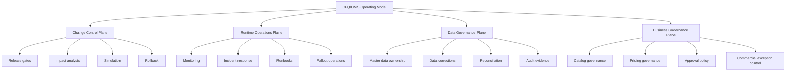
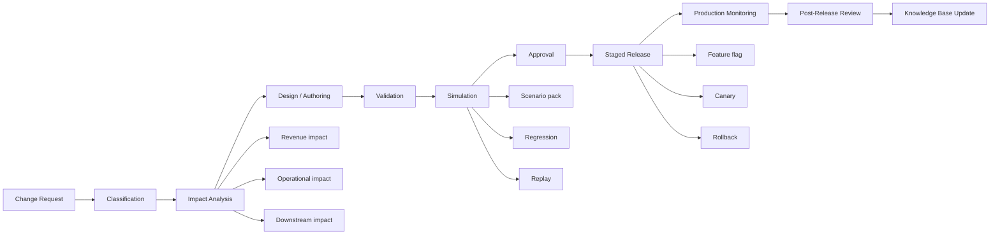
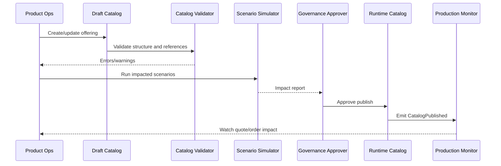
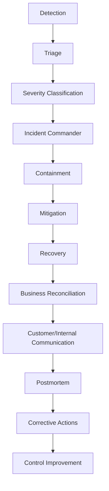
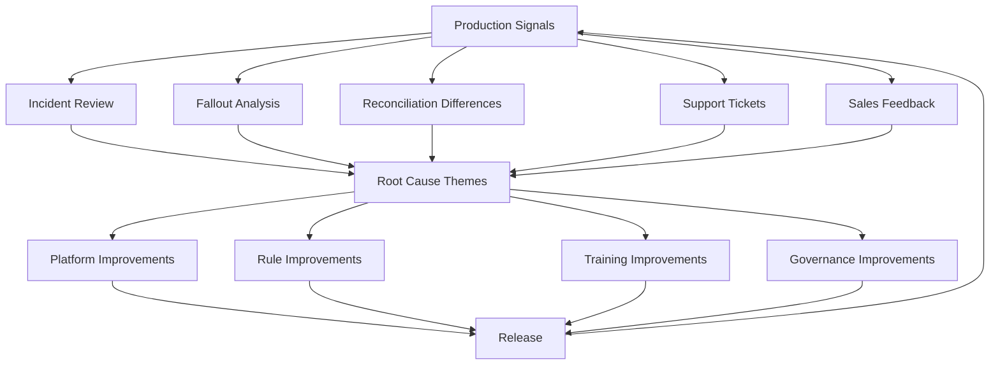

# Part 034 — Platform Operations, Governance, and Change Management

An enterprise CPQ/OMS platform does not fail only because code is wrong.

It also fails because:

- catalog changes are published without impact analysis;
- price changes are approved informally;
- promotions overlap unexpectedly;
- approval policies drift from commercial authority;
- fulfillment mapping changes without OMS awareness;
- sales teams invent manual workarounds;
- data corrections are made directly in production;
- incident reviews focus on symptoms, not system design;
- ownership is unclear between sales ops, product, finance, legal, IT, and engineering.

At enterprise scale, CPQ/OMS is not just a software system. It is a **business operating platform**.

That means you need an operating model.

This part explains how to govern, release, operate, and evolve a CPQ/OMS platform without turning it into a fragile maze of emergency fixes and undocumented business exceptions.

---

## 1. Kaufman Framing: The Sub-Skill We Are Practicing

The sub-skill here is platform operating model design.

By the end of this part, you should be able to:

1. Define ownership across CPQ, OMS, sales ops, finance, legal, product, fulfillment, and engineering.
2. Design governance for catalog, pricing, promotion, approval, workflow, and integration changes.
3. Build a safe change lifecycle from proposal to production monitoring.
4. Define release gates for business-authored and engineering-authored changes.
5. Design operational runbooks for quote, approval, order, fulfillment, billing, and asset issues.
6. Handle data corrections without destroying auditability.
7. Build an incident management loop that improves the platform.
8. Align release management with sales cycles, quarter close, promotion windows, and regulatory deadlines.
9. Distinguish platform operations from normal application support.
10. Evaluate whether a CPQ/OMS organization can sustain enterprise scale.

The target performance:

> Given a CPQ/OMS change or production issue, you can define who owns it, how impact is assessed, how it is released, how it is monitored, how rollback works, and how evidence is preserved.

---

## 2. The Core Operating Problem

Most CPQ/OMS platforms have two kinds of change:

1. **Engineering changes**: code, APIs, orchestration engine, data model, security, infrastructure.
2. **Business-authored changes**: catalog, pricing, promotions, approval policy, product rules, eligibility rules, templates, fulfillment mappings.

Engineering teams often govern only the first category.

That is a mistake.

In CPQ/OMS, business-authored changes can be just as dangerous as code changes.

A new promotion rule can create negative prices.
A catalog update can break active bundles.
An approval matrix change can bypass finance approval.
A document template change can remove a required legal clause.
A fulfillment mapping change can route orders to the wrong downstream system.

Therefore, governance must apply to **all production-impacting decisions**, not only software deployments.

---

## 3. CPQ/OMS Operating Model Overview

A mature operating model has four control planes:



Each plane has different stakeholders and different failure modes.

---

## 4. Ownership Model

Ownership must be explicit. CPQ/OMS crosses too many teams for informal responsibility to work.

### 4.1 Common Ownership Domains

| Domain | Typical Owner | Engineering Role |
|---|---|---|
| Product catalog structure | Product operations | platform tooling, validation, publish pipeline |
| Product offering content | Product management / sales ops | governance and runtime support |
| Price books | Finance / pricing team | calculation correctness and versioning |
| Discount policy | Revenue operations / finance | policy engine and approval integration |
| Approval matrix | Finance / legal / sales leadership | workflow implementation and audit |
| Proposal templates | Legal / sales ops | document generation platform |
| Quote lifecycle | Revenue operations + engineering | state machine and evidence model |
| Order lifecycle | Operations + engineering | orchestration and fallout model |
| Fulfillment mapping | Operations / network / provisioning teams | decomposition and contract validation |
| Billing handoff | Finance / billing ops | integration and reconciliation |
| Security policy | Security / compliance | authorization controls and monitoring |
| Platform reliability | Engineering / SRE | SLO, incidents, runbooks, resilience |

### 4.2 RACI Example

| Activity | Sales Ops | Product Ops | Finance | Legal | Fulfillment Ops | Engineering | SRE |
|---|---|---|---|---|---|---|---|
| Create product offering | C | A/R | C | C | C | C | I |
| Publish catalog | C | A/R | C | C | C | R | I |
| Change price book | C | C | A/R | I | I | R | I |
| Change discount threshold | C | I | A/R | C | I | R | I |
| Change proposal clause | C | I | C | A/R | I | R | I |
| Change orchestration plan | I | C | I | I | A/R | R | C |
| Repair stuck order | I | I | C | I | A/R | R | C |
| Correct accepted quote | A/R | C | C | C | I | R | I |
| Run incident review | C | C | C | C | C | A/R | A/R |

A matrix like this prevents vague statements such as "the business owns it" or "engineering owns it".

---

## 5. Change Taxonomy

Not every change has the same risk. Classify changes before deciding controls.

### 5.1 Change Types

| Change Type | Example | Risk |
|---|---|---|
| Low-risk content | label text, UI copy | customer confusion |
| Catalog structure | new bundle, option cardinality | invalid sellable products |
| Pricing | price book, tier rule, rounding | revenue leakage |
| Promotion | campaign, coupon, stacking | margin leakage, billing mismatch |
| Eligibility | country/customer restriction | compliance violation |
| Approval | threshold/authority matrix | control failure |
| Document | proposal template, clause | legal dispute |
| Order mapping | product-to-service mapping | fulfillment failure |
| Workflow | state transition, escalation | stuck quote/order |
| Integration | API/event schema | downstream breakage |
| Security | role/permission/policy | data exposure or fraud |
| Migration | schema/data transformation | historical corruption |

### 5.2 Risk Dimensions

Assess each change by:

- customer impact;
- revenue impact;
- margin impact;
- legal impact;
- regulatory impact;
- operational impact;
- reversibility;
- blast radius;
- detectability;
- timing sensitivity;
- historical data impact;
- downstream dependency impact.

---

## 6. Standard Change Lifecycle

A safe CPQ/OMS change lifecycle looks like this:



### 6.1 Change Request

A change request should include:

- business objective;
- effective date;
- impacted products;
- impacted markets;
- impacted channels;
- impacted customers;
- impacted quotes/orders/assets;
- owner;
- approvers;
- rollback requirement;
- monitoring requirement.

### 6.2 Impact Analysis

Impact analysis should answer:

1. Which active quotes are affected?
2. Which pending orders are affected?
3. Which assets/subscriptions are affected?
4. Which promotions overlap?
5. Which approval thresholds change?
6. Which proposal clauses change?
7. Which billing mappings change?
8. Which downstream contracts/events change?
9. Which reports/analytics change?
10. What happens if the change is rolled back?

### 6.3 Simulation

Simulation is mandatory for high-risk business changes.

Run the change against:

- golden scenario pack;
- top revenue scenarios;
- open quotes;
- recently accepted quotes;
- renewal candidates;
- active promotions;
- high-risk countries/channels;
- downstream integration mocks;
- representative order decomposition flows.

### 6.4 Approval

Approval should be evidence-based.

Approvers should see:

- impact analysis result;
- simulation result;
- failed/passed scenarios;
- rollback plan;
- residual risk;
- effective date;
- owner accountability.

---

## 7. Catalog Release Governance

Catalog governance is one of the most important operational disciplines in CPQ/OMS.

### 7.1 Catalog Release Principles

1. Draft catalog is editable.
2. Published catalog is immutable.
3. Runtime catalog is version-addressable.
4. Quotes/orders/assets reference catalog versions.
5. Catalog publish is gated by validation and simulation.
6. Catalog rollback is planned before release.
7. Catalog content ownership is separated from platform ownership.
8. Emergency catalog changes are audited.

### 7.2 Catalog Publish Pipeline



### 7.3 Catalog Governance Checklist

Before publish:

- product offering has valid lifecycle state;
- required product specification exists;
- option groups have valid cardinality;
- dependency graph has no invalid cycle;
- price coverage exists;
- eligibility policy exists;
- fulfillment mapping exists if orderable;
- proposal content exists if sellable;
- channel visibility is intentional;
- effective dates do not overlap incorrectly;
- open quote impact is understood;
- rollback candidate is known.

---

## 8. Pricing and Promotion Governance

Pricing governance protects revenue and margin.

### 8.1 Pricing Change Controls

Pricing changes should require:

- price owner;
- effective date;
- currency coverage;
- product coverage;
- region/channel coverage;
- margin impact analysis;
- contract impact analysis;
- golden master pricing regression;
- approval from pricing/finance owner;
- monitoring of quote conversion and discount usage after release.

### 8.2 Promotion Governance

Promotion changes should validate:

- eligibility;
- effective window;
- stacking rules;
- exclusivity;
- coupon limits;
- budget caps;
- discount allocation;
- billing interpretation;
- cancellation/refund treatment;
- reporting attribution.

### 8.3 Quarter-End Freeze

Many enterprises need special rules around quarter-end.

During high-risk periods:

- freeze non-critical catalog/pricing changes;
- allow emergency fixes through expedited control;
- increase monitoring of approval queues;
- monitor quote acceptance spikes;
- protect pricing engine capacity;
- communicate blackout windows to sales teams;
- pre-approve operational support coverage.

---

## 9. Approval Policy Governance

Approval policies encode commercial authority. Treat them like financial controls.

### 9.1 Approval Policy Lifecycle

Approval policy should have:

- owner;
- version;
- effective date;
- approval authority matrix;
- rule conditions;
- escalation path;
- delegation rules;
- separation-of-duties constraints;
- audit requirements;
- simulation scenarios;
- retirement date if temporary.

### 9.2 Approval Policy Change Risks

A bad approval policy change can:

- over-route approvals and slow sales;
- under-route approvals and leak margin;
- route to wrong region/manager;
- allow self-approval;
- ignore legal clauses;
- fail to invalidate stale approval;
- break delegated approval;
- create audit findings.

### 9.3 Approval Simulation

Before release, simulate:

- discount under threshold;
- discount over threshold;
- low margin deal;
- strategic account override;
- non-standard payment terms;
- non-standard legal clause;
- delegated approver;
- expired delegation;
- self-approval attempt;
- multi-region deal.

---

## 10. Order Orchestration Governance

Order orchestration changes must be governed because they affect fulfillment, billing, asset inventory, and customer experience.

### 10.1 Change Examples

- new product-to-service mapping;
- new provisioning task;
- changed dependency order;
- changed retry policy;
- changed compensation behavior;
- changed fallout classification;
- changed billing activation milestone;
- changed asset update rule.

### 10.2 Orchestration Release Gate

Before release:

- compile representative fulfillment plans;
- run state machine transition tests;
- test retry and timeout;
- test compensation;
- test partial fulfillment;
- test cancellation at every major state;
- test downstream contract compatibility;
- test billing/asset synchronization;
- rehearse fallout handling;
- verify observability dashboards.

---

## 11. Release Management

CPQ/OMS release management must coordinate both software and business configuration.

### 11.1 Release Types

| Release Type | Example | Cadence |
|---|---|---|
| Platform release | new service/API/workflow engine | sprint/release train |
| Catalog release | product/bundle update | business cadence |
| Pricing release | price book update | quarter/month/campaign |
| Policy release | approval/eligibility change | as needed with controls |
| Emergency release | defect or risk remediation | expedited |
| Migration release | data/schema transition | planned window |

### 11.2 Release Train Model

A release train helps coordinate:

- business readiness;
- engineering readiness;
- support readiness;
- downstream readiness;
- training/communication;
- rollback planning;
- post-release monitoring.

### 11.3 Feature Flags and Progressive Delivery

Use feature flags for:

- new configurator experience;
- new pricing calculation path;
- new promotion engine;
- new approval routing;
- new order decomposition path;
- new billing integration;
- new partner API behavior.

Flag dimensions may include:

- sales channel;
- country;
- product line;
- customer segment;
- user group;
- account list;
- traffic percentage.

Never use feature flags as a substitute for governance. They reduce blast radius; they do not remove the need for validation.

---

## 12. Operational Monitoring

A CPQ/OMS platform needs business-aware monitoring.

### 12.1 Technical Signals

Monitor:

- latency;
- error rate;
- saturation;
- queue depth;
- dead-letter count;
- cache hit ratio;
- database lock wait;
- retry rate;
- downstream timeout rate;
- event publishing lag;
- projection lag.

### 12.2 Business Signals

Monitor:

- quote creation rate;
- quote validation failure rate;
- pricing failure rate;
- average discount;
- approval queue aging;
- proposal generation failure rate;
- quote acceptance rate;
- quote-to-order conversion failure rate;
- order fallout rate;
- stuck order count;
- billing handoff failure rate;
- asset reconciliation mismatch;
- revenue leakage indicators.

### 12.3 Governance Signals

Monitor:

- emergency changes;
- policy overrides;
- manual data corrections;
- break-glass access;
- approval bypass attempts;
- failed authorization checks;
- rejected catalog publishes;
- failed simulations;
- rollback frequency.

---

## 13. Operational Dashboards

Dashboards should be role-specific.

### 13.1 Sales Operations Dashboard

- quote volume;
- validation failures;
- approval aging;
- expiring quotes;
- high-discount quotes;
- proposal generation failures;
- acceptance rate.

### 13.2 Order Operations Dashboard

- submitted orders;
- orders by state;
- stuck orders;
- fallout cases;
- retry backlog;
- fulfillment SLA breach;
- cancellation queue;
- manual intervention workload.

### 13.3 Finance Dashboard

- discount distribution;
- margin exceptions;
- billing handoff failures;
- price mismatch;
- revenue leakage candidates;
- unauthorized discount attempts;
- reconciliation differences.

### 13.4 Engineering/SRE Dashboard

- service health;
- API latency;
- broker lag;
- database saturation;
- error budget;
- failed jobs;
- dead-letter queues;
- cache staleness;
- dependency health.

---

## 14. Incident Management

CPQ/OMS incidents can be commercial incidents, not only technical incidents.

### 14.1 Incident Examples

| Incident | Severity Driver |
|---|---|
| Pricing engine unavailable | sales blocked, revenue impact |
| Wrong discount calculation | margin leakage |
| Approval workflow stuck | deal delay, quarter close risk |
| Proposal generation wrong | legal/customer dispute |
| Duplicate order creation | fulfillment and billing error |
| Order orchestration backlog | customer activation delay |
| Billing handoff failure | revenue recognition delay |
| Data exposure | security/compliance impact |
| Catalog publish broke product | sales/fulfillment outage |

### 14.2 Incident Classification

Classify by:

- customer impact;
- financial impact;
- legal/compliance impact;
- operational impact;
- number of affected records;
- duration;
- reversibility;
- public/customer visibility;
- quarter-close impact.

### 14.3 Incident Workflow



### 14.4 Containment Patterns

Containment may include:

- disable promotion;
- freeze catalog publish;
- pause quote acceptance;
- block quote-to-order conversion for affected product;
- route high-risk orders to manual review;
- disable downstream integration worker;
- stop retry storm;
- isolate partner channel;
- enable fallback pricing mode;
- show maintenance/degraded status.

### 14.5 Postmortem Discipline

A useful postmortem captures:

- timeline;
- detection signal;
- customer/business impact;
- contributing factors;
- what worked;
- what failed;
- why controls did not catch it earlier;
- corrective actions;
- owners and deadlines;
- follow-up verification.

The goal is system learning, not blame.

---

## 15. Runbooks

Runbooks convert tribal knowledge into operational capability.

### 15.1 Required CPQ Runbooks

- pricing engine outage;
- stale catalog cache;
- failed catalog publish;
- incorrect price calculation;
- stuck approval queue;
- approval policy misrouting;
- proposal generation failure;
- quote acceptance failure;
- quote correction request;
- partner API incident.

### 15.2 Required OMS Runbooks

- duplicate order submitted;
- order stuck in submitted state;
- decomposition failure;
- provisioning timeout;
- downstream unknown outcome;
- order fallout repair;
- cancellation failure;
- compensation failure;
- billing handoff failure;
- asset inventory mismatch;
- event replay request;
- dead-letter queue growth.

### 15.3 Runbook Template

```md
# Runbook: Order Stuck in Fulfillment

Symptoms:
  - order state remains IN_PROGRESS beyond SLA
  - orchestration task has no progress event
  - customer support escalation received

Severity Criteria:
  - Sev2 if >100 orders affected or enterprise customer blocked
  - Sev3 if isolated and repairable

Initial Checks:
  - verify orchestration plan state
  - check downstream provider status
  - inspect task retry history
  - check event broker lag
  - check dead-letter queue

Safe Actions:
  - retry idempotent task
  - request downstream status reconciliation
  - move to fallout only if non-retryable failure confirmed

Unsafe Actions:
  - direct database state mutation
  - manual completion without downstream evidence
  - duplicate provisioning command without idempotency key

Escalation:
  - fulfillment ops
  - engineering on-call
  - billing ops if activation milestone affected

Evidence Required:
  - order ID
  - task ID
  - correlation ID
  - downstream request/response
  - action taken
  - actor and timestamp
```

---

## 16. Fallout Operations

Fallout is not an exception log. It is an operational workflow.

### 16.1 Fallout Queue Design

A good fallout queue includes:

- case ID;
- order ID;
- impacted customer;
- impacted product;
- current state;
- failure category;
- retryability;
- SLA age;
- owner group;
- recommended action;
- safe actions;
- forbidden actions;
- dependency impact;
- customer communication status;
- audit log.

### 16.2 Fallout Ownership

Different fallout types need different owners:

| Fallout Type | Owner |
|---|---|
| Missing customer data | sales/support ops |
| Product mapping missing | product ops + engineering |
| Provisioning failure | fulfillment ops |
| Billing handoff failure | billing ops + engineering |
| Asset mismatch | asset/inventory ops |
| Approval inconsistency | revenue ops/finance |
| Security violation | security/compliance |

### 16.3 Fallout Metrics

Track:

- fallout rate;
- fallout by product;
- fallout by channel;
- fallout by downstream system;
- mean time to detect;
- mean time to repair;
- repeated fallout cause;
- manual repair volume;
- SLA breach rate;
- customer-impacting fallout.

---

## 17. Data Correction Governance

Data correction is one of the most dangerous CPQ/OMS operations.

A direct database update may fix a symptom while destroying auditability.

### 17.1 Data Correction Principles

1. Prefer business correction commands over raw mutation.
2. Preserve original value and correction reason.
3. Record actor, approver, timestamp, and evidence.
4. Validate downstream impact before correction.
5. Emit correction events when downstream systems need awareness.
6. Reconcile after correction.
7. Separate emergency correction from normal workflow.
8. Review recurring corrections as product/platform defects.

### 17.2 Correction Types

| Correction Type | Example | Required Control |
|---|---|---|
| Non-commercial metadata | typo in internal note | low-risk audit |
| Quote commercial data | discount, price, term | finance/legal approval |
| Order state | stuck state correction | engineering + ops approval |
| Billing handoff | wrong subscription mapping | finance + billing ops approval |
| Asset inventory | missing asset relation | asset owner approval |
| Audit data | impossible or extremely restricted | compliance/legal process |

### 17.3 Correction Workflow


---

## 18. Reconciliation Operations

Reconciliation is how the platform detects drift.

### 18.1 Reconciliation Pairs

| Source A | Source B | Drift Example |
|---|---|---|
| Accepted quote | Order | missing line or wrong price |
| Order | Fulfillment | task completed but order not updated |
| Order | Billing | subscription missing/wrong charge |
| Order | Asset inventory | asset not created or wrong status |
| Billing | Contract | term mismatch |
| Catalog | Runtime cache | stale product definition |
| Approval | Quote | stale approval after quote change |
| Event log | Projection | missing read model update |

### 18.2 Reconciliation Modes

- synchronous validation before handoff;
- asynchronous scheduled reconciliation;
- event-driven reconciliation;
- manual reconciliation queue;
- post-incident reconciliation;
- migration reconciliation.

### 18.3 Reconciliation Output

A reconciliation job should produce:

- matched records;
- unmatched records;
- field differences;
- severity;
- owner;
- recommended repair;
- automatic repair eligibility;
- audit evidence.

---

## 19. Knowledge Management and Training

A CPQ/OMS platform is only as good as the organization using it.

### 19.1 Required Knowledge Assets

- product modeling guide;
- catalog authoring guide;
- pricing rule guide;
- promotion governance guide;
- approval policy guide;
- quote lifecycle guide;
- order fallout runbook;
- data correction policy;
- incident response guide;
- release calendar;
- known limitations;
- glossary;
- decision records.

### 19.2 Training Audiences

| Audience | Needs |
|---|---|
| Sales reps | quote creation, validation, approval status |
| Sales ops | catalog/pricing/policy operations |
| Finance | discount/margin control, billing reconciliation |
| Legal | proposal clauses, contract evidence |
| Fulfillment ops | order state, fallout repair |
| Support | customer-visible order status |
| Engineering | architecture, state machines, integrations |
| SRE | runbooks, monitoring, incident response |
| Executives | KPIs, risk, release readiness |

---

## 20. Governance Boards Without Bureaucracy

Governance should reduce risk without blocking healthy change.

### 20.1 When a Board Is Useful

Use a governance board for:

- high-impact catalog release;
- strategic price change;
- quarter-end change;
- approval authority change;
- new regulated product;
- major order orchestration change;
- billing model change;
- migration;
- security policy change.

### 20.2 When a Board Is Too Heavy

Avoid governance board review for:

- low-risk content correction;
- internal label change;
- non-production experiment;
- reversible user experience toggle;
- isolated bug fix with no commercial impact.

### 20.3 Lightweight Governance Pattern

Classify changes into tiers:

| Tier | Example | Control |
|---|---|---|
| Tier 0 | typo, internal metadata | peer review |
| Tier 1 | low-risk catalog content | automated validation + owner approval |
| Tier 2 | price/promotion/approval update | simulation + business approval |
| Tier 3 | high-risk commercial/workflow change | cross-functional approval + release plan |
| Tier 4 | regulated/security/migration change | formal governance + audit package |

---

## 21. Business Calendar Awareness

CPQ/OMS changes must respect business timing.

Important periods:

- quarter close;
- fiscal year close;
- product launch;
- campaign launch;
- renewal season;
- regulatory deadline;
- partner onboarding;
- billing cycle close;
- ERP financial close;
- peak sales events.

During these periods, change risk increases because:

- usage spikes;
- manual pressure increases;
- business tolerance for downtime decreases;
- emergency overrides become tempting;
- support workload increases;
- reconciliation becomes more important.

---

## 22. Capacity and Cost Operations

CPQ/OMS workloads are uneven.

### 22.1 Capacity Drivers

- end-of-quarter quote spikes;
- mass renewal generation;
- large catalog publish;
- price book refresh;
- campaign launch;
- partner API burst;
- order conversion backlog;
- downstream outage recovery;
- projection rebuild;
- historical replay.

### 22.2 Capacity Planning Outputs

Maintain:

- workload forecast;
- capacity model;
- bottleneck inventory;
- scaling policy;
- batch window plan;
- queue capacity plan;
- downstream rate limit map;
- cost allocation model;
- emergency scaling procedure.

### 22.3 Cost Governance

Watch for:

- runaway replay jobs;
- expensive search queries;
- over-retention of debug traces;
- unbounded document generation;
- high cardinality metrics;
- excessive API polling;
- retry storms;
- unused environments;
- oversized caches.

---

## 23. Disaster Recovery and Business Continuity

CPQ/OMS continuity is business-critical.

### 23.1 Recovery Objectives

Define:

- RTO for quote creation;
- RTO for quote acceptance;
- RTO for order submission;
- RTO for fulfillment orchestration;
- RPO for quote/order/audit data;
- degraded mode for sales operations;
- manual fallback rules;
- reconciliation procedure after recovery.

### 23.2 Degraded Modes

Possible degraded modes:

- read-only quote access;
- save draft but no acceptance;
- use cached catalog but block risky products;
- allow standard pricing only;
- manual approval queue;
- pause quote-to-order conversion;
- accept orders but delay fulfillment;
- fallback document generation;
- manual billing handoff with later reconciliation.

Degraded mode must be explicit. Improvised degraded mode creates audit and revenue risk.

---

## 24. Audit and Evidence Operations

Governance is incomplete if evidence is hard to retrieve.

### 24.1 Evidence Packages

For quote:

- quote version;
- product configuration;
- price snapshot;
- pricing trace;
- discount justification;
- approval records;
- proposal document hash;
- customer acceptance evidence.

For order:

- source quote/order request;
- validation result;
- decomposition plan;
- orchestration events;
- fulfillment responses;
- fallout repairs;
- billing handoff;
- asset updates.

For business change:

- change request;
- impact analysis;
- simulation result;
- approval;
- release timestamp;
- rollback plan;
- post-release validation.

### 24.2 Evidence Retrieval SLA

Define how quickly the organization can answer:

- Why was this price offered?
- Who approved this discount?
- Which policy version applied?
- Which catalog version was used?
- What did the customer accept?
- Why did this order fail?
- Who corrected this data?
- Which downstream system received the handoff?
- Was the issue remediated?

If answering requires a multi-day forensic effort, the platform is not operationally mature.

---

## 25. Continuous Improvement Loop

A mature CPQ/OMS organization learns from operations.



### 25.1 Improvement Themes

Look for recurring patterns:

- same product causes fallout;
- same approval policy causes delays;
- same downstream system causes retries;
- same sales team creates invalid quotes;
- same catalog authoring mistake repeats;
- same billing mismatch recurs;
- same manual correction is requested frequently.

Recurring operational pain should become platform improvement, not permanent manual work.

---

## 26. Metrics for Governance Health

Track governance health like a product.

### 26.1 Change Metrics

- number of changes by type;
- emergency change rate;
- failed change rate;
- rollback rate;
- simulation failure rate;
- approval cycle time;
- release lead time;
- business-authored defect rate.

### 26.2 Operational Metrics

- incident count by severity;
- mean time to detect;
- mean time to mitigate;
- mean time to recover;
- fallout rate;
- manual repair rate;
- reconciliation mismatch rate;
- support ticket volume;
- SLA breach rate.

### 26.3 Control Metrics

- approval bypass attempts;
- stale approval invalidations;
- unauthorized access attempts;
- break-glass events;
- data corrections by type;
- audit evidence retrieval time;
- expired policy count;
- overdue corrective actions.

---

## 27. Anti-Patterns

### 27.1 Treating Catalog as Static Data

Catalog is executable business logic. It needs validation, simulation, versioning, and release control.

### 27.2 Direct Production Database Fixes

Direct fixes may solve the ticket while corrupting evidence and downstream consistency.

### 27.3 No Business Owner for Rules

If nobody owns a rule, nobody can safely change or retire it.

### 27.4 Engineering-Only Release Management

Business-authored changes can break production without code. They need release gates too.

### 27.5 Manual Workarounds as Permanent Process

Manual repair may be necessary, but recurring repair is a product signal.

### 27.6 Incident Reviews Without Corrective Actions

A postmortem without tracked action items becomes theater.

### 27.7 Governance by Meeting, Not by System

Meetings do not scale. Governance must be embedded into workflows, validations, approvals, and evidence capture.

### 27.8 No Quarter-End Operating Mode

Quarter-end behavior is different. Treating it like normal traffic is operationally naive.

---

## 28. Platform Operating Blueprint

A mature CPQ/OMS platform should have:

1. Versioned catalog publish pipeline.
2. Price and promotion governance workflow.
3. Approval policy lifecycle management.
4. Quote/order state machine ownership.
5. Order fallout operations.
6. Data correction workflow.
7. Reconciliation jobs.
8. Role-specific dashboards.
9. Incident response process.
10. Runbooks for critical failures.
11. Release calendar and change freeze policy.
12. Business scenario simulation.
13. Audit evidence retrieval.
14. Continuous improvement backlog.
15. Cross-functional ownership model.

---

## 29. Staff-Level Review Questions

When reviewing CPQ/OMS operations and governance, ask:

1. Who owns each type of production-impacting change?
2. Are business-authored changes governed like code changes when risk is high?
3. Can catalog, price, promotion, and approval changes be simulated before publish?
4. Is there an explicit release gate by change type?
5. Are published catalog and policy versions immutable?
6. Can the platform identify active quotes affected by a catalog/price change?
7. Can approval policy changes be tested against historical deals?
8. Is there a clear data correction process?
9. Are direct database fixes prohibited or tightly controlled?
10. Is fallout managed as workflow, not just alerts?
11. Are reconciliation differences routed to owners?
12. Do dashboards expose both technical and business signals?
13. Are incidents classified by business impact, not only technical outage?
14. Are postmortem action items tracked to completion?
15. Is quarter-end operating mode defined?
16. Can audit evidence be retrieved quickly?
17. Are support teams trained on quote/order lifecycle?
18. Is recurring manual repair feeding the product backlog?
19. Does rollback preserve auditability?
20. Are ownership and escalation paths documented?

---

## 30. Practice Exercise

Design the operating model for this scenario:

> The business wants to launch a new regulated product bundle in three countries, with country-specific eligibility, a launch promotion, finance approval above 15% discount, legal clause variations, new fulfillment mapping, and billing handoff changes. Launch date is two weeks before quarter close.

Produce:

1. Change classification.
2. Ownership/RACI matrix.
3. Impact analysis checklist.
4. Catalog release plan.
5. Pricing/promotion governance plan.
6. Approval policy simulation plan.
7. Legal/proposal governance plan.
8. Fulfillment mapping release plan.
9. Billing handoff validation plan.
10. Release gates.
11. Rollback plan.
12. Monitoring dashboard.
13. Incident runbooks.
14. Quarter-close risk controls.
15. Post-release review plan.

A strong answer explicitly separates business ownership from platform engineering ownership.

---

## 31. Part 034 Summary

Enterprise CPQ/OMS is not just built. It is operated.

The core ideas:

1. Govern business-authored changes, not only code.
2. Treat catalog, price, promotion, approval, and orchestration as production-impacting control planes.
3. Use impact analysis and simulation before high-risk release.
4. Maintain explicit ownership across sales ops, product, finance, legal, fulfillment, engineering, and SRE.
5. Operate fallout as a workflow with ownership and SLA.
6. Correct data through audited business commands, not casual database mutation.
7. Reconcile quote, order, billing, asset, and projection data continuously.
8. Monitor business signals as seriously as technical signals.
9. Use incident reviews to improve controls and platform design.
10. Build governance into the system, not only meetings.

Part 034 completes the platform operations layer.

Part 035 will be the capstone: designing an enterprise-grade CPQ/OMS platform blueprint that integrates domain model, lifecycle, APIs, events, data ownership, failure model, testing, governance, and review checklist.

---

## 32. References

- AWS Well-Architected Framework, Operational Excellence Pillar — https://docs.aws.amazon.com/wellarchitected/latest/operational-excellence-pillar/welcome.html
- Google SRE, Blameless Postmortem Culture — https://sre.google/sre-book/postmortem-culture/
- TM Forum TMF620 Product Catalog Management API — https://www.tmforum.org/resources/specification/tmf620-product-catalog-management-api-rest-specification-r17-5-0/
- TM Forum TMF622 Product Ordering API — https://www.tmforum.org/resources/interface/tmf622-product-ordering-api-rest-specification-r14-5-0/
- CloudEvents Specification — https://cloudevents.io/
- OpenAPI Initiative — https://www.openapis.org/
- AsyncAPI Initiative — https://www.asyncapi.com/
