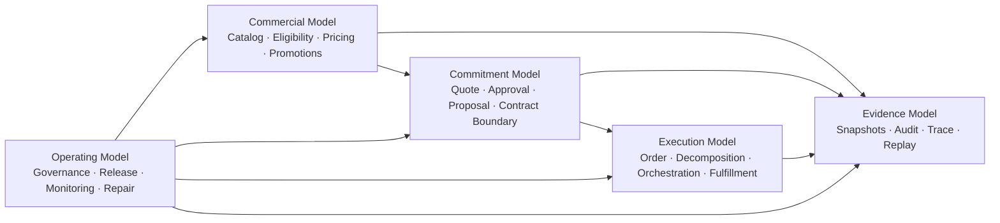
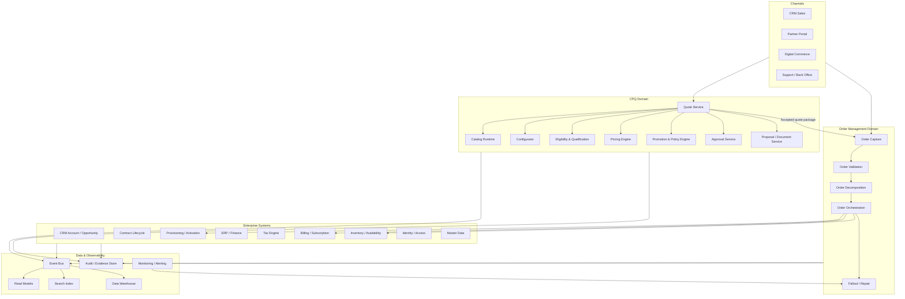
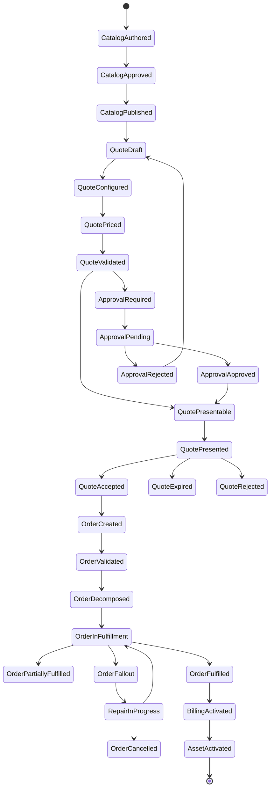
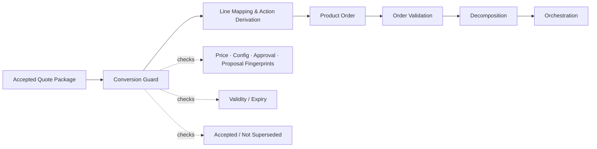
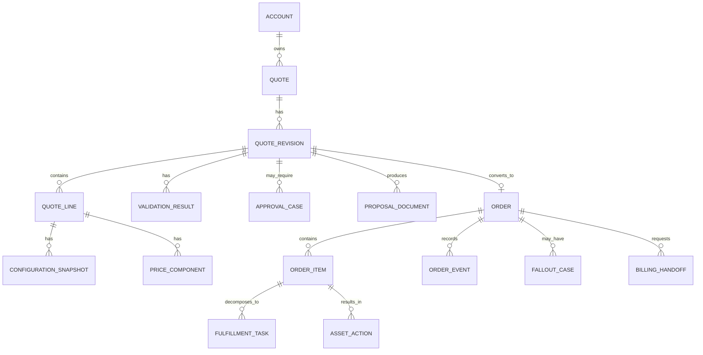
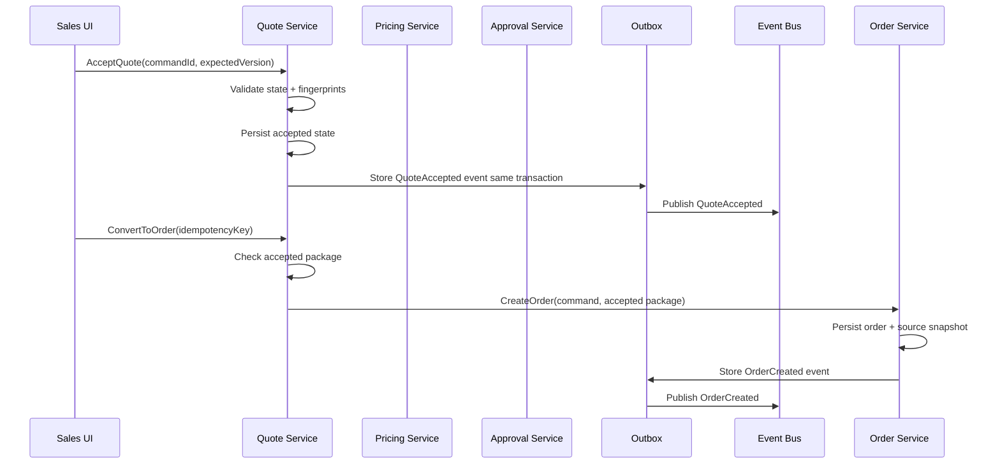
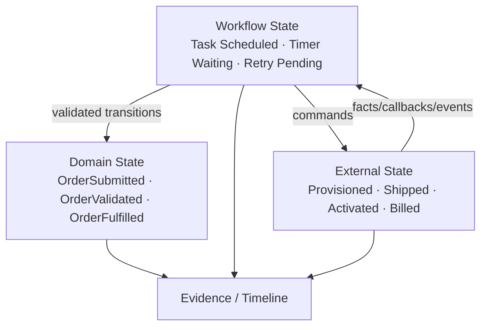
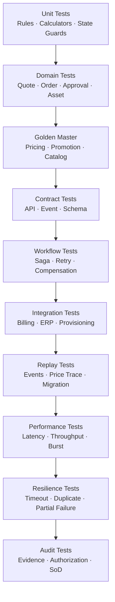

# Part 035 — Capstone: Designing an Enterprise-Grade CPQ/OMS Platform

This is the final part of the series.

The goal is not to introduce many new concepts. The goal is to **integrate everything** into a design that can survive architecture review, product change, operational incidents, compliance audit, high-volume traffic, and messy enterprise reality.

A CPQ/OMS platform is not just a sales tool. At enterprise scale, it becomes the **commercial operating system** that turns product strategy into enforceable customer commitments and executable fulfillment plans.

If the platform is weak, the organization pays through:

- inconsistent prices,
- unauthorized discounts,
- invalid product combinations,
- quote/order drift,
- billing disputes,
- fulfillment fallout,
- manual repair queues,
- audit gaps,
- duplicated truth,
- and slow commercial change.

A strong platform gives the business the opposite: fast selling, controlled exception handling, accurate orders, traceable commitments, reliable fulfillment, and defensible evidence.

---

## 1. Kaufman Capstone Target

In Kaufman's learning model, the final objective is not passive knowledge. It is **target performance**.

For this series, the capstone target is:

> Given a complex enterprise CPQ/OMS scenario, you can design, defend, operate, and evolve the platform architecture with clear domain boundaries, state machines, data ownership, APIs, event contracts, consistency model, reliability model, security model, testing strategy, and governance process.

You should be able to answer these questions without hand-waving:

1. What is the source of truth for catalog, price, quote, order, contract, asset, billing, and fulfillment status?
2. Which data is referenced, copied, snapshotted, derived, or replayable?
3. Which decisions are deterministic and explainable?
4. Which lifecycle transitions are allowed, blocked, reversible, or compensatable?
5. Which operations are synchronous and which are asynchronous?
6. Which failures are safe to retry, unsafe to retry, or require human repair?
7. Which events are facts and which are commands disguised as events?
8. Which state belongs to CPQ, OMS, billing, ERP, CRM, or provisioning?
9. Which controls prove regulatory, financial, and legal defensibility?
10. How do you test correctness when product, price, policy, and order behavior keep changing?

The capstone design is therefore not a diagram-only exercise. It is an **invariant-driven architecture**.

---

## 2. Capstone Scenario

Assume we are designing a platform for a large B2B enterprise that sells complex products across multiple channels and regions.

The business requirements:

- Sales teams sell configurable products and bundles.
- Products have options, dependencies, exclusions, eligibility rules, and regional constraints.
- Prices vary by currency, region, channel, account segment, contract, volume, usage, term, and effective date.
- Discounts require governance and approval.
- Promotions can stack, exclude each other, or depend on bundle composition.
- Quotes can be revised, approved, presented, accepted, expired, cancelled, cloned, and converted to orders.
- Orders can be new sales, upgrades, downgrades, renewals, amendments, suspensions, resumptions, terminations, migrations, or cancellations.
- Fulfillment may require multiple downstream systems.
- Some order tasks are synchronous; many are asynchronous.
- Billing, contract, entitlement, asset, tax, ERP, CRM, identity, inventory, and provisioning systems are external or separately owned.
- The platform must support audit, evidence, operational visibility, scale, resilience, and safe change.

The architecture must be enterprise-grade, not demo-grade.

---

## 3. Core Mental Model

Think of the platform as five connected control planes.

| Control Plane | Main Question | Primary Risk If Weak |
|---|---|---|
| Commercial Model | What can be sold, to whom, at what price, under which policy? | Revenue leakage, invalid selling, inconsistent pricing |
| Commitment Model | What exactly did we promise the customer? | Quote/order drift, legal dispute, billing mismatch |
| Execution Model | How do we turn commitment into fulfilled products/services? | Stuck orders, partial fulfillment, duplicate provisioning |
| Evidence Model | Can we prove why every decision happened? | Audit failure, compliance weakness, approval disputes |
| Operating Model | Can the business safely change products, prices, rules, and workflows? | Release chaos, slow change, uncontrolled production mutation |

The platform is healthy only when all five are aligned.



---

## 4. North-Star Architecture

A good CPQ/OMS platform separates **decisioning**, **commitment**, **execution**, and **visibility**.



The important point is not the box layout. The important point is **ownership**:

- catalog owns sellable structure,
- configurator owns valid composition,
- eligibility owns sellability for a context,
- pricing owns commercial calculation,
- quote owns commercial commitment draft and accepted package,
- approval owns exception authorization,
- proposal owns customer-visible legal/commercial artifact,
- order owns execution request,
- orchestration owns fulfillment plan and task progress,
- billing owns charge execution and invoice lifecycle,
- contract owns legal agreement lifecycle,
- asset/product inventory owns active customer product instances,
- audit owns evidence preservation.

---

## 5. Domain Ownership Blueprint

A common enterprise failure is trying to make one system own everything. This creates oversized services, unclear authority, and hidden coupling.

Use this ownership model instead.

| Domain Object | Owner | Non-Owner Consumers | Must Snapshot? | Why |
|---|---|---|---|---|
| Product Specification | Product/Catalog Domain | CPQ, OMS, provisioning | Usually reference version | It describes product semantics, not a customer commitment |
| Product Offering | Catalog Domain | CPQ, OMS, commerce, partner | Yes on quote/order | Offered terms may change after sale |
| Configuration | Configurator/Quote | Pricing, quote, order | Yes | Needed to prove what was selected |
| Eligibility Decision | Eligibility Service | Quote, order validation | Yes | Needed to prove why item was sellable |
| Qualification Result | Qualification Service | Quote/order | Yes with expiry | May depend on time-sensitive external data |
| Price Calculation | Pricing Service | Quote, approval, billing handoff | Yes | Customer commitment depends on exact price result |
| Promotion Decision | Promotion Engine | Pricing, quote | Yes | Promo availability changes frequently |
| Quote | Quote Service | CRM, approval, order | Yes internally | Commercial commitment package |
| Approval Decision | Approval Service | Quote, audit | Yes | Defensible exception authorization |
| Proposal Document | Proposal Service | Customer, CLM, audit | Yes | Customer-visible evidence |
| Product Order | OMS | Fulfillment, billing, support | Yes | Execution request must be immutable enough for audit |
| Fulfillment Task | Orchestration | Operations, support | State history | Needed for recovery and SLA tracking |
| Contract | CLM | Billing, quote, support | Reference + evidence | Legal authority belongs to CLM |
| Subscription | Billing/Subscription | CPQ, asset, support | Reference | Billing engine owns charge execution |
| Asset/Product Instance | Asset Inventory | CPQ, OMS, support | Reference + action snapshot | Used for amendments and entitlements |
| Invoice | Billing/ERP | Support, finance | Reference | Financial record owned by finance system |

The rule is simple:

> A service can cache, project, or snapshot data from another domain, but it must not silently become the authority for that domain.

---

## 6. Enterprise Invariants

An invariant is a statement that must remain true no matter how many services, users, retries, integrations, and failures exist.

These are the non-negotiable CPQ/OMS invariants.

### 6.1 Catalog and Configuration Invariants

1. A quote line must reference a known catalog version or contain a valid catalog snapshot.
2. A configured bundle must satisfy all mandatory, cardinality, dependency, exclusion, and compatibility constraints.
3. A product offering that is inactive or not effective for the selling date cannot be newly sold unless an explicit override exists.
4. A configuration result must be reproducible or explainable from its snapshot.
5. A catalog change must not retroactively mutate accepted quotes or submitted orders.

### 6.2 Pricing Invariants

1. A presented quote must contain a deterministic price result.
2. A price result must include price inputs, rule versions, currency, rounding mode, effective date, tax boundary, and calculation trace.
3. A quote cannot be accepted if its price fingerprint is stale unless revalidated or explicitly reapproved.
4. Discounts below policy threshold must have approval evidence.
5. A billing handoff must not infer commercial terms that were not present in the accepted quote/order package.

### 6.3 Quote Invariants

1. Only one active accepted revision may be convertible for a quote family unless split conversion is explicitly supported.
2. Accepted quote content must be immutable except through a new revision or controlled amendment.
3. A quote cannot move to accepted without passing required validation and approval gates.
4. Proposal document hash must match the accepted quote package when legally relevant.
5. Expired, cancelled, or superseded quotes cannot be converted to new orders.

### 6.4 Order Invariants

1. An order must have a stable idempotency identity for submit operations.
2. A submitted order must preserve the accepted commercial commitment snapshot or its authorized order-capture equivalent.
3. Order decomposition must be traceable from product order item to service/resource/fulfillment tasks.
4. Fulfillment tasks must be idempotent or protected by deduplication.
5. Unknown downstream outcome must not be treated as failure or success without reconciliation.
6. In-flight cancellation must honor task cutoff and compensation rules.

### 6.5 Evidence Invariants

1. Every material decision must have actor, time, input, output, rule/policy version, and correlation ID.
2. Manual override must be explicit, authorized, reasoned, and auditable.
3. Audit records must not be silently editable by ordinary business or support users.
4. Support repair must produce evidence, not hidden mutation.
5. Reconciliation corrections must preserve original state and correction state.

These invariants are more important than technology choice.

---

## 7. Canonical Lifecycle Blueprint

The full lifecycle can be represented as a progression from **model** to **commitment** to **execution** to **operation**.



This diagram hides many details, but it gives a strong mental model: **each phase should have clear entry conditions, exit conditions, evidence, and ownership**.

---

## 8. Quote-to-Order Boundary

The quote-to-order boundary is one of the most important design points.

A quote is a commercial commitment. An order is an execution request.

They should not be the same aggregate.



At conversion time, do not casually recalculate everything. Decide deliberately.

| Data | Conversion Strategy | Reason |
|---|---|---|
| Customer identity | Reference + validate | CRM/account may change, but order must target valid current entity |
| Product offering | Snapshot + version reference | Offering definition may change after quote |
| Configuration | Snapshot | Exact selected options must be preserved |
| Eligibility result | Snapshot + optionally revalidate | Some eligibility is time-sensitive |
| Qualification result | Snapshot + revalidate if expired | Credit/serviceability may expire |
| Price result | Snapshot | Accepted commercial terms must not drift |
| Tax estimate | Usually recalculate at billing/tax boundary | Tax may depend on transaction date and jurisdiction |
| Approval decision | Snapshot | Required evidence for exception authorization |
| Proposal document | Artifact reference + hash | Needed for legal/commercial evidence |
| Fulfillment plan | Usually derive after order submit | Technical execution may depend on current inventory/capacity |

The dangerous anti-pattern is this:

> Convert quote to order by storing only quote ID and recalculating downstream from current catalog and current price rules.

That design destroys commercial defensibility.

---

## 9. API Boundary Blueprint

Enterprise APIs should reflect behavior and lifecycle, not database tables.

### 9.1 Command APIs

Command APIs change state. They need authorization, idempotency, validation, and concurrency control.

Example command surface:

```http
POST /quotes
POST /quotes/{quoteId}/lines
POST /quotes/{quoteId}/configure
POST /quotes/{quoteId}/price
POST /quotes/{quoteId}/validate
POST /quotes/{quoteId}/submit-for-approval
POST /quotes/{quoteId}/approve
POST /quotes/{quoteId}/present
POST /quotes/{quoteId}/accept
POST /quotes/{quoteId}/convert-to-order

POST /orders
POST /orders/{orderId}/submit
POST /orders/{orderId}/cancel
POST /orders/{orderId}/amend
POST /orders/{orderId}/repair-actions
POST /orders/{orderId}/retry-task
```

A command should usually contain:

```json
{
  "commandId": "cmd-01J...",
  "idempotencyKey": "account-123:quote-456:convert:v3",
  "expectedVersion": 17,
  "actor": {
    "type": "user",
    "id": "user-123"
  },
  "reason": "Customer accepted proposal version 3",
  "payload": {}
}
```

### 9.2 Query APIs

Query APIs should serve user journeys and operational needs.

Example query surface:

```http
GET /quotes/{quoteId}
GET /quotes/{quoteId}/pricing-trace
GET /quotes/{quoteId}/validation-results
GET /quotes/{quoteId}/approval-history
GET /quotes/{quoteId}/evidence-package

GET /orders/{orderId}
GET /orders/{orderId}/timeline
GET /orders/{orderId}/fulfillment-plan
GET /orders/{orderId}/fallout
GET /accounts/{accountId}/commercial-timeline
```

Query APIs may read from projections, but they must expose freshness and source where relevant.

### 9.3 Calculation APIs

Calculation APIs are deterministic decision services.

```http
POST /pricing/calculate
POST /eligibility/evaluate
POST /configuration/validate
POST /promotions/evaluate
```

They should return:

- input fingerprint,
- output fingerprint,
- rule versions,
- explanation trace,
- warnings,
- blocking errors,
- expiry,
- and replay token if applicable.

### 9.4 Event Contracts

Use events for facts that already happened.

Good event names:

```text
CatalogPublished
QuoteConfigured
QuotePriced
QuoteValidationFailed
QuoteSubmittedForApproval
QuoteApproved
QuotePresented
QuoteAccepted
QuoteConvertedToOrder
OrderSubmitted
OrderValidated
OrderDecomposed
FulfillmentTaskStarted
FulfillmentTaskCompleted
OrderFalloutDetected
OrderRepairApplied
OrderFulfilled
BillingActivationRequested
AssetActivated
```

Avoid events that are actually commands:

```text
CreateOrder
ApproveQuote
RetryProvisioning
CancelOrder
```

Those are commands, not facts.

---

## 10. Event Envelope Blueprint

A consistent envelope makes events traceable, routable, and replayable.

```json
{
  "specversion": "1.0",
  "type": "com.company.cpq.quote.accepted.v1",
  "source": "cpq.quote-service",
  "id": "evt-01J...",
  "time": "2026-07-02T10:15:30Z",
  "subject": "quote/quote-123",
  "datacontenttype": "application/json",
  "dataschema": "https://schemas.company.com/cpq/quote-accepted/v1.json",
  "data": {
    "quoteId": "quote-123",
    "quoteVersion": 3,
    "accountId": "acct-001",
    "acceptedAt": "2026-07-02T10:15:30Z",
    "priceFingerprint": "sha256:...",
    "configurationFingerprint": "sha256:...",
    "approvalFingerprint": "sha256:...",
    "proposalDocumentHash": "sha256:..."
  },
  "extensions": {
    "correlationId": "corr-abc",
    "causationId": "cmd-xyz",
    "tenantId": "tenant-1",
    "actorId": "user-123"
  }
}
```

Key rules:

1. Event ID is globally unique.
2. Event type is versioned.
3. Event payload is immutable once published.
4. Correlation and causation IDs are mandatory for business-critical flows.
5. Events must be safe for consumers that process duplicates.
6. Sensitive fields must be classified before being published.

---

## 11. Data Model Blueprint

At capstone level, do not start from physical tables. Start from aggregates and ownership.



A minimal aggregate split:

| Aggregate | Main Responsibility | Consistency Boundary |
|---|---|---|
| Quote | Commercial commitment draft/revision | Quote header, lines, lifecycle status, snapshots |
| Approval Case | Authorization workflow | Approval request, approvers, decisions, delegation |
| Product Order | Execution request | Order header, items, submission status, source package |
| Fulfillment Plan | Execution graph | Tasks, dependencies, task state, retry metadata |
| Fallout Case | Exception recovery | Classification, owner, repair action, resolution |
| Catalog Publication | Runtime sellable model | Published version, effective window, rule set |
| Price Calculation | Deterministic result | Inputs, outputs, trace, fingerprints |
| Evidence Package | Defensible record | Snapshots, hashes, actors, decisions, artifacts |

Do not force all lifecycle details into one aggregate. Oversized aggregates become concurrency bottlenecks and authorization nightmares.

---

## 12. Consistency and Saga Blueprint

CPQ/OMS cannot be one ACID transaction across CRM, catalog, pricing, approval, billing, ERP, inventory, and provisioning.

Use local transactions plus reliable messaging.



Saga rules:

1. Use synchronous calls for fast deterministic decisioning when user experience needs immediate feedback.
2. Use asynchronous orchestration for long-running fulfillment.
3. Persist state before publishing events.
4. Use outbox to prevent lost business facts.
5. Use inbox/deduplication for event consumers.
6. Treat timeout as unknown, not as failure.
7. Reconcile external systems that do not provide strong response guarantees.
8. Prefer compensation over distributed rollback.

---

## 13. Workflow and State Machine Blueprint

Workflow engine state and domain state are not the same thing.

Bad design:

> The workflow engine token position is the source of truth for business order state.

Better design:

> Domain services own business state. Workflow orchestration coordinates steps and records execution progress, but domain transitions remain explicit and auditable.



The state machine must define:

- allowed transitions,
- guard conditions,
- actor/system authority,
- side effects,
- compensation behavior,
- timeout behavior,
- retry policy,
- terminal states,
- repair states,
- and audit event emitted.

---

## 14. Security and Authorization Blueprint

CPQ/OMS security must protect more than login.

It must protect commercial power.

### 14.1 Access Control Layers

| Layer | Example Control |
|---|---|
| Tenant | User can only access own tenant/legal entity |
| Account | User can only quote for accounts in territory/team |
| Quote | User can view/edit/approve only allowed quote classes |
| Field | Margin, cost, floor price hidden from ordinary sales users |
| Action | Submit, approve, override, cancel, repair require separate permissions |
| Policy | Discount override requires role + threshold + separation of duties |
| Data Export | Bulk quote/order export restricted and logged |
| Break Glass | Emergency support access requires reason, expiry, and review |

### 14.2 Segregation of Duties

The same actor should not be able to:

- create a discount policy,
- apply the exceptional discount,
- approve the exception,
- modify the audit evidence,
- and correct the billing result.

That is not bureaucracy. That is financial control.

### 14.3 Audit Model

Every material action should answer:

```text
who did what, when, from where, under which authority,
against which version, with which input, producing which result,
and what changed because of it?
```

For high-risk actions, include:

- reason code,
- free-text justification,
- prior state hash,
- new state hash,
- policy version,
- approval reference,
- correlation ID,
- and evidence artifact links.

---

## 15. Reliability Blueprint

Enterprise CPQ/OMS reliability is not only uptime. It is **business-correct behavior under failure**.

### 15.1 Failure Mode Matrix

| Failure | Risk | Design Control |
|---|---|---|
| Pricing service unavailable | Sales blocked or wrong fallback price | Clear degraded mode; no silent price guessing |
| Catalog cache stale | Invalid product sold | Versioned catalog, cache invalidation, stale detection |
| Quote accepted twice | Duplicate order | Idempotency key, quote conversion lock, order source uniqueness |
| Approval callback lost | Quote stuck | Outbox/inbox, polling reconciliation, SLA alert |
| Provisioning timeout | Duplicate provisioning if retried blindly | Unknown outcome state, external idempotency key, reconciliation |
| Billing handoff duplicate | Double billing | Deduplication by order item/billing instruction identity |
| Event consumer lag | Stale read model | Freshness indicator, backlog alert, critical query fallback |
| Manual repair wrong | Broken asset/billing state | Repair authorization, dry-run, validation, audit, rollback/compensation |
| Partial fulfillment | Customer receives incomplete service | Partial state, customer communication, compensation logic |
| Data correction hidden | Audit failure | Correction ledger, no destructive mutation |

### 15.2 Reliability Principles

1. Make duplicate commands safe.
2. Make unknown outcomes explicit.
3. Prefer immutable history over destructive correction.
4. Reconcile every external boundary that matters financially or operationally.
5. Separate user-facing availability from correctness-critical operations.
6. Degrade only where business-approved.
7. Alert on business symptoms, not only infrastructure symptoms.

---

## 16. Performance Blueprint

Performance design should start from business journeys.

| Journey | Target Concern | Common Bottleneck |
|---|---|---|
| Open quote | Read latency | Large quote aggregation, slow CRM/account lookup |
| Configure bundle | Interactive latency | Constraint evaluation, catalog graph traversal |
| Calculate price | Deterministic compute latency | Rule explosion, external tax/price dependency |
| Submit approval | Workflow latency | Approver resolution, policy evaluation |
| Convert to order | Consistency latency | Quote lock, validation, order creation transaction |
| Submit order | Throughput | validation fan-out, inventory/provisioning dependencies |
| Fulfillment | Long-running reliability | downstream outages, async callback loss |
| Search orders | Projection freshness | event lag, index refresh, poor partitioning |
| Reporting | Data volume | joining operational store directly |

### 16.1 Hot Path Rules

1. Do not call every enterprise system synchronously during interactive quote editing.
2. Precompute or cache published catalog runtime models.
3. Keep pricing deterministic and traceable even when optimized.
4. Use async validation for expensive non-blocking checks.
5. Isolate bulk/batch quote operations from interactive users.
6. Avoid using reporting queries against transactional hot tables.
7. Expose projection freshness for operational dashboards.

### 16.2 Capacity Model

A serious design should estimate:

- active sales users,
- quote edits per user per hour,
- average quote lines,
- max quote lines,
- pricing calculations per quote,
- approval submissions per day,
- accepted quotes per day,
- orders per day,
- order lines per order,
- fulfillment tasks per order line,
- event volume per order,
- peak campaign/batch load,
- partner API burst behavior,
- and reconciliation volume.

Without a capacity model, scalability discussions become decorative.

---

## 17. Testing Blueprint

Testing must prove that the platform preserves invariants.



### 17.1 Minimum Golden Datasets

You need golden datasets for:

- simple one-time charge,
- recurring monthly charge,
- annual prepaid charge,
- tiered usage charge,
- volume discount,
- bundle discount,
- promotion stacking,
- promotion exclusion,
- contracted price,
- regional/currency price,
- rounding edge case,
- approval threshold edge case,
- amendment prorating,
- downgrade credit,
- renewal cotermination,
- asset-based upgrade,
- expired catalog version,
- stale pricing fingerprint,
- quote-to-order conversion,
- partial fulfillment,
- cancellation after cutoff,
- billing handoff replay.

### 17.2 Test Data Principle

Do not test only happy-path catalog examples.

Test the ugly catalog:

- retired products,
- overlapping effective dates,
- incompatible options,
- missing price entry,
- duplicate SKU mapping,
- circular dependency,
- deeply nested bundle,
- region-specific legal clause,
- account-specific contract price,
- expired promotion,
- migrated asset with incomplete metadata,
- order with partially fulfilled children.

That is where enterprise systems fail.

---

## 18. Governance Blueprint

Enterprise CPQ/OMS changes are business changes, not merely software changes.

### 18.1 Governance Domains

| Change Type | Governance Required |
|---|---|
| New product offering | Product approval, catalog QA, sales enablement, fulfillment readiness |
| Price book change | Finance approval, effective date, margin analysis, rollback plan |
| Discount policy change | Revenue governance, approval threshold review, audit impact |
| Promotion launch | Eligibility, stacking, budget, legal, expiration, monitoring |
| Approval matrix change | Delegation, SoD, threshold, fallback approver |
| Workflow change | Operations readiness, compensation path, incident runbook |
| Billing mapping change | Finance validation, reconciliation, migration plan |
| Integration contract change | Consumer impact analysis, versioning, contract tests |
| Data correction | Approval, evidence, reconciliation, downstream notification |

### 18.2 Release Checklist

Before production release, confirm:

- catalog version approved,
- pricing golden tests pass,
- quote validation scenarios pass,
- approval routing preview verified,
- proposal template generated correctly,
- quote-to-order conversion tested,
- billing handoff tested,
- fulfillment decomposition tested,
- reconciliation report defined,
- dashboards updated,
- support runbook updated,
- rollback/disable mechanism ready,
- audit evidence verified,
- business owner sign-off captured.

---

## 19. Operational Visibility Blueprint

The system must expose business health, not only CPU and memory.

### 19.1 CPQ Metrics

- quote creation rate,
- quote revision rate,
- quote validation failure rate,
- pricing latency,
- pricing error rate,
- stale quote rate,
- approval submission rate,
- approval SLA breach rate,
- average discount by segment,
- floor-price override count,
- quote acceptance rate,
- quote expiration rate,
- quote-to-order conversion failure rate.

### 19.2 OMS Metrics

- order submit rate,
- order validation failure rate,
- decomposition failure rate,
- fulfillment task success rate,
- fulfillment task retry rate,
- stuck order count,
- order fallout rate,
- repair queue age,
- cancellation rate,
- partial fulfillment rate,
- billing handoff failure rate,
- asset activation delay,
- reconciliation mismatch count.

### 19.3 Evidence Metrics

- missing audit attribute count,
- failed evidence package generation,
- unsigned proposal reference,
- approval decision without reason,
- manual override count,
- break-glass access count,
- policy change without approval,
- data correction count by domain.

Good operational dashboards show where business promises are stuck, stale, unsafe, or disputed.

---

## 20. Design Review Template

Use this as the final architecture review checklist.

### 20.1 Domain Boundary Review

- What aggregate owns this state?
- Which service is authoritative?
- Which services only cache or project this data?
- What is snapshotted and why?
- What is referenced and why?
- What can change after quote acceptance?
- What must never change after acceptance?

### 20.2 Lifecycle Review

- What states exist?
- Which transitions are allowed?
- What guards each transition?
- What evidence is produced?
- What side effects occur?
- Is the transition idempotent?
- Can the transition be retried?
- Can it be cancelled?
- Can it be compensated?

### 20.3 Integration Review

- Is this command, query, or event?
- Is the external system authoritative?
- What happens if the external system times out?
- What idempotency key is used?
- How are duplicates handled?
- How is unknown outcome reconciled?
- What schema version is used?
- How are consumers protected from breaking changes?

### 20.4 Commercial Correctness Review

- Which catalog version is used?
- Which price rule version is used?
- Which promotion version is used?
- Which approval policy version is used?
- Can the result be explained?
- Can the result be replayed?
- Can the result be compared against golden tests?
- Does billing receive exact commercial terms?

### 20.5 Security and Audit Review

- Who can view this data?
- Who can mutate this data?
- Who can approve exceptions?
- Who can repair production data?
- Is segregation of duties enforced?
- Is sensitive pricing/margin data protected?
- Is every material decision auditable?
- Can audit evidence be tampered with?

### 20.6 Operations Review

- What metrics prove health?
- What alerts detect stuck flow?
- What dashboard does support use?
- What runbook exists for fallout?
- What is the rollback strategy?
- What is the reconciliation strategy?
- What are the top five failure modes?
- What is the customer communication path?

---

## 21. Capstone Exercise

Design a CPQ/OMS platform for this case:

> A B2B company sells configurable subscription bundles to enterprise customers in 12 countries. Products include base packages, optional add-ons, region-specific compliance features, usage-based charges, and professional services. Customers can buy new subscriptions, upgrade, downgrade, renew, amend, suspend, resume, and terminate. Sales reps can discount up to a threshold. Larger discounts need approval. Accepted quotes become orders. Orders decompose into billing setup, entitlement activation, provisioning, shipping, and professional service scheduling. Downstream systems are unreliable and independently owned.

Produce these artifacts:

1. capability map,
2. bounded context map,
3. quote state machine,
4. order state machine,
5. data ownership matrix,
6. quote-to-order conversion strategy,
7. API surface,
8. event catalog,
9. saga design,
10. failure mode matrix,
11. security model,
12. testing strategy,
13. operational dashboard,
14. release governance checklist,
15. final architecture risks and trade-offs.

The exercise is complete only when you can explain trade-offs, not just draw boxes.

---

## 22. Example Final Blueprint Summary

A strong final answer would sound like this:

> The platform separates commercial decisioning from execution. Catalog, configuration, eligibility, pricing, promotions, quote, approval, proposal generation, order capture, decomposition, orchestration, fallout, billing handoff, and asset lifecycle are separate capabilities with clear ownership. Accepted quote revisions preserve commercial snapshots and fingerprints. Quote-to-order conversion is guarded by status, expiry, version, approval, price, and configuration checks. Orders preserve the accepted commitment package and derive fulfillment plans after submission. Long-running fulfillment is orchestrated asynchronously with idempotent tasks, explicit unknown-outcome states, compensation, and reconciliation. Events describe facts, commands remain APIs. Read models serve sales, support, finance, and operations but do not become sources of truth. Audit evidence captures actor, policy version, decision trace, and artifact hashes. Governance controls catalog, pricing, discount, promotion, approval, and workflow changes. Testing is invariant-based with golden pricing, replay, contract, workflow, failure, security, and migration tests.

That summary is compact, but it contains the core architecture.

---

## 23. Common Capstone Mistakes

### Mistake 1 — Treating CPQ as a UI

CPQ is not a screen for selecting products. It is a commercial decision system.

### Mistake 2 — Treating OMS as CRUD

OMS is not `orders` table CRUD. It is lifecycle, orchestration, exception recovery, and evidence.

### Mistake 3 — Recalculating Accepted Quotes

Recalculating accepted quotes using current catalog/price rules breaks commercial traceability.

### Mistake 4 — Using Events as Commands

`OrderCreated` is a fact. `CreateOrder` is a command. Mixing them makes systems unpredictable.

### Mistake 5 — Ignoring Unknown Outcome

Timeout does not mean failure. Retrying blindly can duplicate fulfillment or billing.

### Mistake 6 — Hiding Manual Repair

Manual repair must be controlled and auditable. Hidden production mutation creates long-term corruption.

### Mistake 7 — Making Reporting the Source of Truth

Read models help users. They should not own business truth.

### Mistake 8 — No Golden Pricing Dataset

Without golden pricing tests, every pricing release is a revenue-risk event.

### Mistake 9 — No Governance for Catalog and Policy

A technically correct platform can still fail if business users can publish unsafe catalog, price, or policy changes.

### Mistake 10 — No Evidence Package

Enterprise CPQ/OMS must prove why a customer got this product, this price, this approval, this document, this order, and this billing result.

---

## 24. Final Mental Model

The whole series can be compressed into one sentence:

> Enterprise CPQ/OMS is the controlled transformation of product strategy into legally defensible commercial commitments and reliably executable operational plans.

Or even shorter:

> CPQ decides and proves the promise; OMS executes and recovers the promise.

A top-level engineer designs the platform around that boundary.

---

## 25. Series Completion

This is the final part of the planned 35-part series.

You now have the complete advanced learning path:

1. Kaufman skill map,
2. domain boundaries,
3. complexity drivers,
4. north-star capability map,
5. product modeling,
6. catalog architecture,
7. configuration and constraint solving,
8. eligibility and entitlement,
9. installed base,
10. pricing model,
11. discount governance,
12. promotion policy,
13. pricing correctness,
14. quote lifecycle,
15. quote validation,
16. approval governance,
17. proposal and legal traceability,
18. contract/subscription/billing boundary,
19. order capture,
20. quote-to-order conversion,
21. order validation and decomposition,
22. orchestration state machines,
23. fallout recovery,
24. in-flight mutation,
25. enterprise integration,
26. API/event boundaries,
27. data ownership,
28. transaction boundaries and saga design,
29. read models and visibility,
30. performance and scalability,
31. reliability and failure modeling,
32. security and audit,
33. testing strategy,
34. operations and governance,
35. capstone architecture blueprint.

The next level after this series is not more theory. The next level is to build a reference architecture, implement a walking skeleton, model real-world catalog/pricing/order scenarios, and run architecture reviews against failure cases.

---

## 26. Reference Anchors

These are useful external anchors for the concepts used throughout the series:

- TM Forum TMF620 Product Catalog Management API: product catalog lifecycle and consultation during ordering/sales processes.
- TM Forum TMF622 Product Ordering Management API: standardized product order creation based on product offering from catalog.
- CloudEvents specification: common event metadata format for interoperability across services and platforms.
- AWS Well-Architected Framework: operational excellence, security, reliability, performance efficiency, cost optimization, and sustainability review model.
- Martin Fowler CQRS and Test Pyramid articles: read/write model separation and balanced automated testing portfolio.
- Microservices.io Saga and Transactional Outbox patterns: consistency across services without distributed transactions.

---

# End of Series

Series status: **complete**.

Final part: **Part 035 — Capstone Enterprise-Grade CPQ/OMS Platform Design**.
