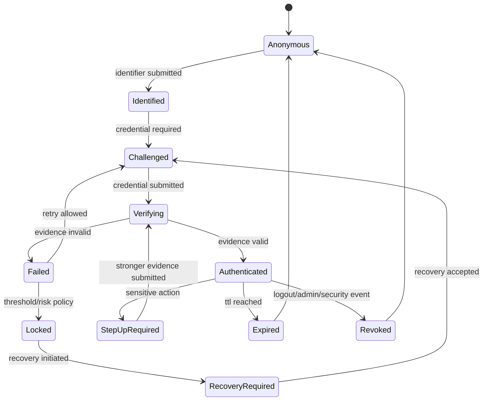
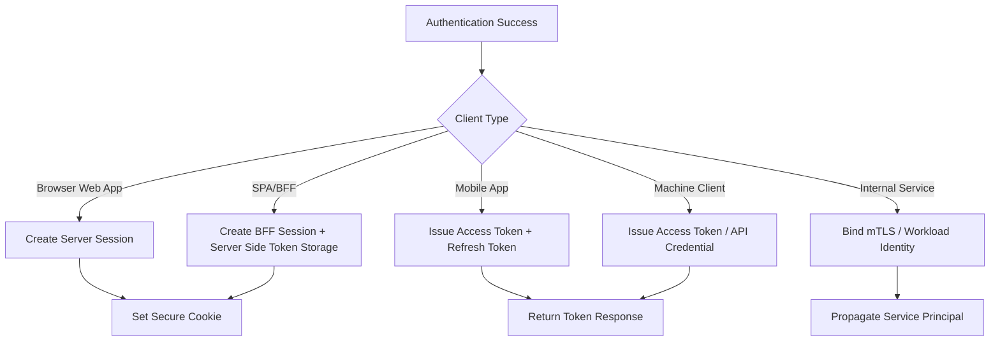
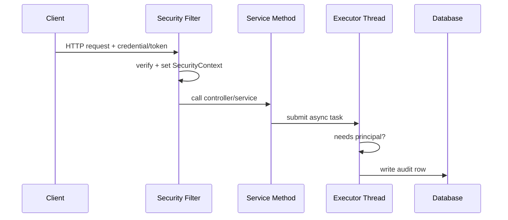
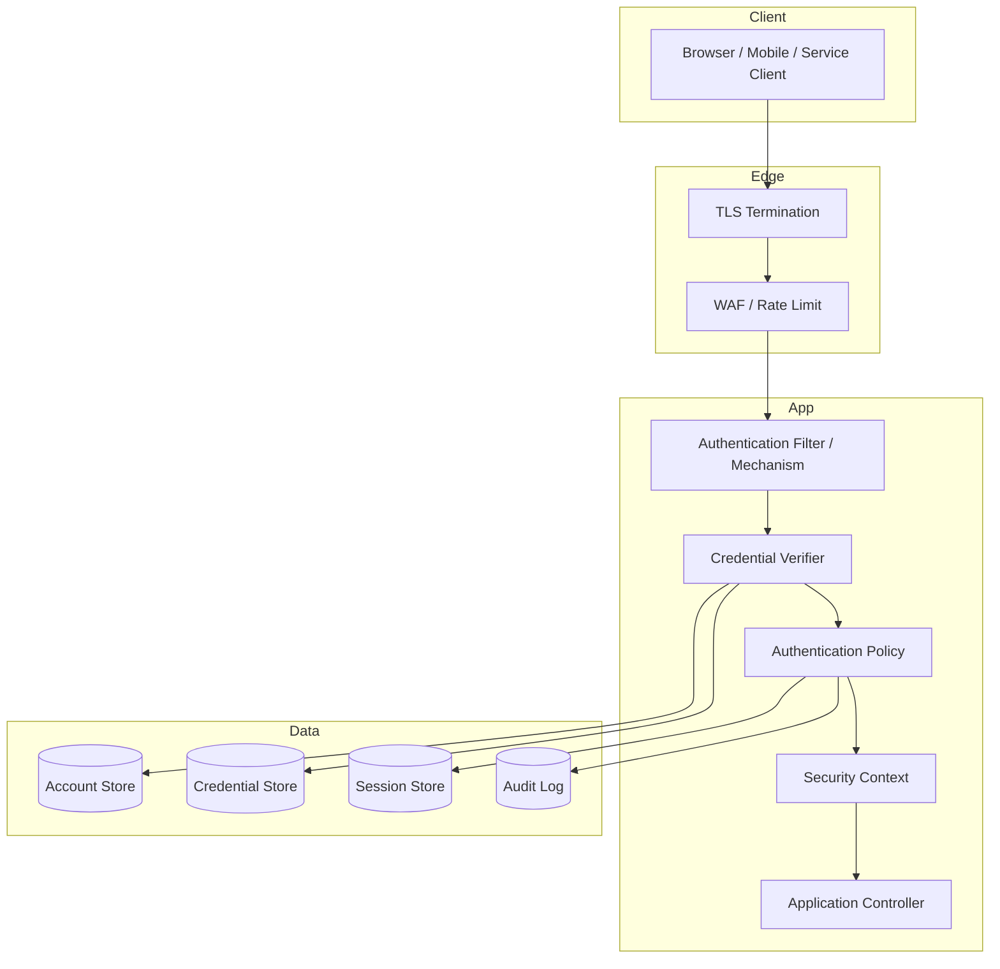

# Part 001 — Authentication Mental Model

> Target part ini: setelah membaca, kita tidak lagi melihat authentication sebagai “login user lalu generate token”. Kita akan melihatnya sebagai proses membangun **klaim identitas yang dapat dipercaya secara lokal**, dengan boundary, lifecycle, assurance, failure mode, dan konsekuensi implementasi Java yang jelas.

Authentication adalah proses menjawab pertanyaan:

> “Apakah aktor yang sedang berinteraksi dengan sistem ini benar-benar dapat dikaitkan dengan identitas yang diklaim, pada saat ini, dengan metode pembuktian tertentu, pada boundary tertentu, untuk tujuan tertentu?”

Kalimat itu panjang karena authentication production-grade memang bukan sekadar `username + password == true`.

Di aplikasi enterprise, authentication adalah fondasi untuk:

- session browser,
- API access,
- SSO,
- mobile login,
- service-to-service identity,
- machine identity,
- audit trail,
- fraud detection,
- step-up authentication,
- incident response,
- dan authorization.

Authorization menjawab “boleh melakukan apa”. Authentication menjawab “siapa/apa ini, dan seberapa yakin kita”. Namun dalam sistem nyata, dua hal ini sering saling menempel. Karena itu, engineer yang bagus harus bisa memisahkan keduanya secara konseptual, tetapi menyambungkannya secara benar di runtime.

---

## 1. Problem yang Sebenarnya

Banyak implementasi authentication gagal bukan karena framework-nya buruk, tetapi karena model mentalnya terlalu dangkal.

Contoh model dangkal:

```txt
request masuk -> cek token -> user valid -> lanjut
```

Masalahnya:

- token bisa valid tapi dipakai oleh pihak yang salah,
- user bisa valid tapi tenant salah,
- session bisa valid tapi sudah dicabut,
- password bisa benar tapi login berasal dari botnet,
- principal bisa ada tapi assurance-nya terlalu rendah,
- JWT bisa signed tapi audience-nya salah,
- request internal bisa datang dari service yang tidak seharusnya dipercaya,
- `SecurityContext` bisa bocor antar thread jika asynchronous boundary tidak ditangani.

Model yang lebih benar:

```txt
actor presents evidence -> verifier evaluates evidence -> system creates an authentication result -> result is bound to a request/session/token/context -> downstream code consumes a local security context -> every boundary decides what it trusts
```

Authentication bukan hanya validasi credential. Authentication adalah **rantai keputusan kepercayaan**.

---

## 2. Vocabulary yang Harus Presisi

Kita mulai dari istilah. Banyak bug security muncul karena tim mencampuradukkan istilah.

| Istilah | Arti Praktis | Contoh | Kesalahan Umum |
|---|---|---|---|
| Actor | Entitas yang melakukan aksi | manusia, service, device, job scheduler | Menganggap actor selalu manusia |
| Identity | Representasi stabil tentang entitas | user id, service id, device id | Menganggap email adalah identity permanen |
| Identifier | Nilai yang menunjuk identity | username, email, phone, client_id | Memakai identifier sebagai bukti authentication |
| Credential | Bukti yang disajikan untuk mengklaim identity | password, private key, OTP, passkey assertion, mTLS cert | Menyimpan credential seperti data biasa |
| Authenticator | Faktor/perangkat/metode untuk membuktikan identity | password authenticator, TOTP app, passkey, hardware key | Menganggap semua MFA setara |
| Principal | Representasi identity di runtime aplikasi | `Principal`, `Authentication.getPrincipal()` | Memasukkan terlalu banyak data domain ke principal |
| Subject | Kumpulan principal + credential dalam konteks security tertentu | JAAS `Subject` | Memakai konsep Subject tanpa boundary yang jelas |
| Authentication Result | Keputusan hasil verifikasi | success/failure + principal + assurance + metadata | Hanya boolean `true/false` |
| Session | State server/client yang mempertahankan login | cookie session id, server session | Menganggap session sama dengan identity |
| Token | Artefak yang membawa/mereferensikan authentication result | JWT, opaque access token, refresh token | Menganggap token valid berarti user masih aman |
| Assurance | Tingkat keyakinan hasil authentication | AAL, MFA used, phishing-resistant | Tidak membedakan password vs passkey |
| Security Context | Authentication result yang tersedia untuk kode saat request diproses | Spring `SecurityContext`, Jakarta `SecurityContext` | Menganggap context selalu tersedia di async thread |

Istilah ini harus konsisten sejak desain database, API contract, sampai incident runbook.

---

## 3. Authentication Bukan Identity Proofing

Ada tiga proses yang sering dicampur:

```txt
identity proofing -> authentication -> authorization
```

### 3.1 Identity Proofing

Identity proofing menjawab:

> “Apakah orang ini benar-benar pemilik identitas dunia nyata tertentu?”

Contoh:

- verifikasi KTP/passport,
- verifikasi perusahaan,
- e-KYC,
- pemeriksaan dokumen,
- liveness check.

Ini biasanya terjadi saat enrollment/onboarding.

### 3.2 Authentication

Authentication menjawab:

> “Apakah aktor sekarang adalah subscriber/account/service yang sudah dikenal sistem?”

Contoh:

- login password,
- passkey assertion,
- mTLS client certificate,
- OIDC login dari IdP,
- API key verification.

### 3.3 Authorization

Authorization menjawab:

> “Apakah identity/principal ini boleh melakukan aksi ini pada resource ini?”

Contoh:

- user boleh approve invoice,
- service boleh publish event,
- admin tenant A tidak boleh akses tenant B,
- case worker boleh escalate case hanya di state tertentu.

### 3.4 Kenapa Pemisahan Ini Penting

Jika authentication dicampur dengan authorization, biasanya muncul bug seperti:

```java
if (user.isLoggedIn()) {
    approvePayment(paymentId);
}
```

Padahal pertanyaan sebenarnya:

```txt
1. Apakah actor authenticated?
2. Metode authentication-nya cukup kuat?
3. Apakah session belum expired/dicabut?
4. Apakah actor masih aktif?
5. Apakah actor berada di tenant yang benar?
6. Apakah actor punya permission untuk approve payment ini?
7. Apakah payment sedang berada di state yang dapat di-approve?
8. Apakah action ini butuh step-up authentication?
```

Authentication hanya satu bagian dari rantai kontrol.

---

## 4. Authentication sebagai Pipeline

Secara mental, authentication adalah pipeline.

```mermaid
flowchart LR
    A[Incoming Interaction] --> B[Identify Claimed Identity]
    B --> C[Collect Credential / Evidence]
    C --> D[Verify Evidence]
    D --> E[Evaluate Risk and Policy]
    E --> F[Create Authentication Result]
    F --> G[Bind Result to Context]
    G --> H[Issue Session or Token]
    H --> I[Propagate Local Security Context]
    I --> J[Audit and Observe]
```



Pipeline ini berlaku untuk login password, OIDC, API key, mTLS, passkey, dan internal service authentication. Yang berubah hanya jenis evidence, verifier, dan binding-nya.

---

## 5. Core Invariants

Invariant adalah aturan yang harus tetap benar di semua implementasi.

### Invariant 1 — Credential Bukan Identity

Password, API key, private key, token, dan OTP bukan identity. Itu adalah bukti atau artefak untuk membuktikan/membawa authentication result.

Implikasi:

- Rotasi credential tidak boleh mengubah identity.
- Satu identity bisa punya banyak credential.
- Credential bisa dicabut tanpa menghapus account.
- Credential compromise harus bisa ditangani tanpa membuat ulang seluruh user.

Model data yang buruk:

```sql
users(
  email primary key,
  password_hash text
)
```

Model yang lebih sehat:

```sql
accounts(
  id uuid primary key,
  status text not null,
  created_at timestamptz not null
);

account_identifiers(
  id uuid primary key,
  account_id uuid not null references accounts(id),
  type text not null,
  value text not null,
  verified_at timestamptz,
  unique(type, value)
);

credentials(
  id uuid primary key,
  account_id uuid not null references accounts(id),
  type text not null,
  secret_hash text,
  public_key jsonb,
  status text not null,
  created_at timestamptz not null,
  last_used_at timestamptz
);
```

Email adalah identifier. Password hash adalah credential material. Account id adalah identity lokal.

### Invariant 2 — Authentication Result Harus Kontekstual

Hasil authentication minimal harus menjawab:

- siapa principal-nya,
- kapan diverifikasi,
- dengan metode apa,
- issuer/verifier-nya siapa,
- untuk audience apa,
- assurance level berapa,
- session/token id apa,
- tenant/context apa,
- risk signal apa,
- expiry/revalidation kapan.

Boolean `authenticated = true` terlalu miskin.

Representasi yang lebih baik:

```java
public record AuthenticationResult(
    SubjectId subjectId,
    PrincipalKind principalKind,
    TenantId tenantId,
    AuthenticationMethod method,
    AssuranceLevel assuranceLevel,
    Instant authenticatedAt,
    Instant expiresAt,
    String issuer,
    String audience,
    Optional<String> sessionId,
    Optional<String> credentialId,
    Map<String, String> riskSignals
) {}
```

### Invariant 3 — Session dan Token adalah Derived Artifact

Session atau token bukan sumber kebenaran identity. Keduanya adalah artefak yang membawa atau mereferensikan authentication result.

- Session id biasanya mereferensikan state server-side.
- JWT membawa claims signed.
- Opaque token mereferensikan state di authorization server/resource server.
- Refresh token merepresentasikan kemampuan meminta access token baru.

Jika account dinonaktifkan, session/token yang sudah ada harus dipertimbangkan ulang berdasarkan policy.

### Invariant 4 — Trust Tidak Otomatis Melewati Boundary

Jika gateway sudah memvalidasi token, apakah service internal boleh percaya header `X-User-Id` begitu saja?

Jawabannya: hanya jika boundary-nya dikontrol, authenticated, integrity-protected, dan ada kontrak eksplisit.

Header dari client eksternal tidak boleh dipercaya sebagai identity.

### Invariant 5 — Principal Harus Minimal dan Stabil

Principal sebaiknya berisi identity runtime yang cukup untuk authorization dan audit awal, bukan snapshot seluruh profil user.

Buruk:

```java
class Principal {
    String id;
    String email;
    String address;
    String phone;
    List<Order> recentOrders;
    BigDecimal accountBalance;
}
```

Lebih baik:

```java
public record AuthenticatedPrincipal(
    String subject,
    String tenantId,
    PrincipalType type,
    Set<String> authorities,
    AssuranceLevel assurance,
    Instant authenticatedAt
) implements java.security.Principal {

    @Override
    public String getName() {
        return subject;
    }
}
```

Principal bukan view model. Principal adalah identity handle.

---

## 6. Identity, Principal, Subject: Bedanya Apa?

### 6.1 Identity

Identity adalah konsep domain/security yang stabil.

Contoh:

```txt
account: acc_123
service: svc_billing
client application: cli_mobile_android
workload: spiffe://prod/ns/payments/sa/api
```

Identity hidup lebih lama daripada request.

### 6.2 Principal

Principal adalah representasi identity yang dipakai runtime.

Di Java:

```java
Principal principal = request.getUserPrincipal();
```

Di Spring Security:

```java
Authentication authentication = SecurityContextHolder
    .getContext()
    .getAuthentication();

Object principal = authentication.getPrincipal();
```

Di Jakarta Security:

```java
Principal principal = securityContext.getCallerPrincipal();
```

Principal berada di boundary runtime. Ia harus cukup kecil, serializable bila perlu, dan tidak boleh membawa secret.

### 6.3 Subject

`Subject` berasal dari JAAS dan merepresentasikan kumpulan principal plus credential.

Contoh konseptual:

```txt
Subject
  principals:
    - UserPrincipal(acc_123)
    - TenantPrincipal(tnt_456)
    - RolePrincipal(case_worker)
  public credentials:
    - x509 certificate metadata
  private credentials:
    - kerberos ticket / secret material
```

Dalam aplikasi modern berbasis Spring Security atau Jakarta Security, kita jarang memakai JAAS `Subject` secara langsung. Namun konsep Subject tetap berguna saat memodelkan “satu actor bisa punya beberapa principal sekaligus”.

Contoh: seorang user login sebagai:

```txt
subject = acc_123
tenant = regulator_id
role = senior_case_worker
session = sess_789
assurance = phishing_resistant_mfa
```

---

## 7. Credential: Bukti, Bukan Sekadar Secret

Credential bisa berupa secret, possession proof, biometric-mediated proof, certificate, atau cryptographic assertion.

| Credential | Verifier | Risiko Utama | Catatan |
|---|---|---|---|
| Password | password hash verifier | phishing, reuse, stuffing | harus rate-limited dan breach-aware |
| TOTP | shared secret + time window | phishing, seed leak, clock drift | bukan phishing-resistant |
| Email OTP | mailbox control | mailbox compromise, delay | cocok untuk recovery rendah risiko |
| SMS OTP | phone network/SIM risk | SIM swap, interception | sebaiknya bukan faktor kuat untuk high-risk |
| Passkey/WebAuthn | public key challenge-response | device/account recovery complexity | phishing-resistant jika origin-bound |
| mTLS cert | certificate chain + private key possession | cert leak, CA trust misconfig | kuat untuk service/workload identity |
| API key | secret lookup/hash | leakage, overbroad scope | cocok untuk programmatic access bila dibatasi |
| HMAC signing | shared secret + canonical request | canonicalization bugs, replay | cocok untuk webhook/API high-integrity |
| OIDC id_token | signature + issuer + audience + nonce | confused deputy, bad validation | authentication federation |

Yang penting: setiap credential punya verification semantics berbeda. Jangan membuat interface yang menyembunyikan semua perbedaan sampai policy tidak bisa diekspresikan.

Contoh interface yang terlalu miskin:

```java
boolean authenticate(String username, String secret);
```

Lebih baik:

```java
public interface CredentialVerifier<C extends CredentialEvidence> {
    VerificationResult verify(C evidence, VerificationContext context);
}

public sealed interface CredentialEvidence permits
    PasswordEvidence,
    TotpEvidence,
    WebAuthnEvidence,
    ApiKeyEvidence,
    MtlsCertificateEvidence,
    OidcAssertionEvidence {
}
```

Dengan begitu, policy bisa tahu apakah metode authentication cukup kuat untuk aksi tertentu.

---

## 8. Authentication State Machine

Authentication flow sebaiknya dilihat sebagai state machine, bukan hanya method call.



Kenapa state machine penting?

Karena setiap transisi punya aturan:

- kapan rate limit naik,
- kapan audit event ditulis,
- kapan session id dirotasi,
- kapan account locked,
- kapan step-up dibutuhkan,
- kapan token/session dicabut,
- kapan user diberi pesan generik.

Tanpa state machine, flow authentication biasanya penuh `if` acak dan edge case yang bocor.

---

## 9. Authentication Result di Java Runtime

### 9.1 Servlet

Servlet menyediakan `Principal` melalui request:

```java
Principal principal = request.getUserPrincipal();
boolean isAdmin = request.isUserInRole("ADMIN");
```

Ini nyaman, tetapi terlalu terbatas untuk authentication modern. Kita sering butuh assurance, tenant, method, session id, dan risk signal.

### 9.2 Spring Security

Spring Security memodelkan authentication melalui `Authentication` di dalam `SecurityContext`.

Konsep penting:

```txt
SecurityContextHolder
  -> SecurityContext
      -> Authentication
          -> principal
          -> credentials
          -> authorities
          -> details
          -> authenticated flag
```

Contoh akses:

```java
Authentication authentication = SecurityContextHolder
    .getContext()
    .getAuthentication();

if (authentication == null || !authentication.isAuthenticated()) {
    throw new UnauthenticatedException();
}

AuthenticatedPrincipal principal = (AuthenticatedPrincipal) authentication.getPrincipal();
```

Masalah umum:

- menyimpan password di `credentials` setelah authentication,
- memasukkan entity JPA user langsung sebagai principal,
- menganggap `isAuthenticated()` cukup untuk semua policy,
- tidak membersihkan context di thread pool custom,
- kehilangan context di async/reactive boundary,
- mencampur authorities dari token dengan permission terbaru dari database tanpa strategi konsistensi.

### 9.3 Jakarta Security

Jakarta Security menyediakan `SecurityContext`, `HttpAuthenticationMechanism`, dan `IdentityStore`. Model ini cocok untuk aplikasi Jakarta EE/JAX-RS/Jakarta REST.

Contoh konseptual:

```java
@Inject
SecurityContext securityContext;

public Response me() {
    Principal caller = securityContext.getCallerPrincipal();
    boolean allowed = securityContext.isCallerInRole("case-worker");
    return Response.ok(caller.getName()).build();
}
```

Seperti Servlet, ini berguna tetapi biasanya perlu ditambah model domain authentication sendiri untuk aplikasi kompleks.

---

## 10. Build Your Own Authentication Core

Sebelum memakai framework, kita bangun core mental implementation kecil. Tujuannya bukan menggantikan Spring Security/Keycloak, tetapi memahami kontrak internal yang sehat.

### 10.1 Domain Types

```java
public record SubjectId(String value) {
    public SubjectId {
        if (value == null || value.isBlank()) {
            throw new IllegalArgumentException("subject id must not be blank");
        }
    }
}

public record TenantId(String value) {}

public enum PrincipalKind {
    HUMAN_USER,
    SERVICE_ACCOUNT,
    DEVICE,
    BATCH_JOB
}

public enum AuthenticationMethod {
    PASSWORD,
    PASSWORD_PLUS_TOTP,
    PASSKEY,
    OIDC,
    API_KEY,
    HMAC_SIGNATURE,
    MTLS
}

public enum AssuranceLevel {
    LOW,
    MEDIUM,
    HIGH,
    PHISHING_RESISTANT
}
```

### 10.2 Evidence

```java
public sealed interface AuthenticationEvidence permits
    PasswordEvidence,
    ApiKeyEvidence,
    MtlsEvidence,
    OidcEvidence {
}

public record PasswordEvidence(
    String identifier,
    char[] password,
    String remoteAddress,
    String userAgent
) implements AuthenticationEvidence {}

public record ApiKeyEvidence(
    String presentedKey,
    String remoteAddress
) implements AuthenticationEvidence {}

public record MtlsEvidence(
    List<X509Certificate> certificateChain
) implements AuthenticationEvidence {}

public record OidcEvidence(
    String issuer,
    String idToken,
    String nonce
) implements AuthenticationEvidence {}
```

Perhatikan `char[]` untuk password agar bisa di-clear setelah dipakai. Di dunia nyata, banyak framework tetap menerima `String`; kita tetap harus mengurangi lifetime secret sebisa mungkin.

### 10.3 Verification Result

```java
public sealed interface VerificationResult permits
    VerificationResult.Success,
    VerificationResult.Failure,
    VerificationResult.StepUpRequired {

    record Success(
        SubjectId subjectId,
        TenantId tenantId,
        PrincipalKind principalKind,
        AuthenticationMethod method,
        AssuranceLevel assuranceLevel,
        String credentialId,
        Instant verifiedAt
    ) implements VerificationResult {}

    record Failure(
        FailureReason reason,
        boolean countAsFailedAttempt,
        boolean revealToUser
    ) implements VerificationResult {}

    record StepUpRequired(
        SubjectId subjectId,
        Set<AuthenticationMethod> acceptableMethods
    ) implements VerificationResult {}
}
```

Kenapa failure perlu field `revealToUser`?

Karena alasan internal seperti `ACCOUNT_NOT_FOUND`, `PASSWORD_WRONG`, `ACCOUNT_LOCKED`, `CREDENTIAL_REVOKED`, dan `TENANT_DISABLED` tidak selalu boleh dibedakan di pesan UI. Untuk user, kita sering memberi pesan generik; untuk audit dan risk engine, detail harus tetap ada.

### 10.4 Authentication Service

```java
public final class AuthenticationService {
    private final List<CredentialVerifier<? extends AuthenticationEvidence>> verifiers;
    private final AuthenticationPolicy policy;
    private final AuthenticationEventSink eventSink;

    public AuthenticationResult authenticate(AuthenticationCommand command) {
        VerificationContext context = VerificationContext.from(command);

        CredentialVerifier verifier = selectVerifier(command.evidence());
        VerificationResult verification = verifier.verifyUnsafe(command.evidence(), context);

        AuthenticationDecision decision = policy.evaluate(verification, context);
        eventSink.publish(AuthenticationEvent.from(decision, context));

        if (!decision.accepted()) {
            throw new AuthenticationFailedException(decision.publicReason());
        }

        return decision.toAuthenticationResult();
    }
}
```

Kata `verifyUnsafe` di sini sengaja provokatif: generic type erasure bisa membuat desain verifier raw/rawtype berbahaya. Dalam implementasi production, kita jaga dispatch evidence-verifier secara type-safe.

---

## 11. Authentication Result Bukan Selalu Session

Setelah authentication sukses, sistem punya beberapa pilihan.



Tidak semua login harus menghasilkan JWT. Tidak semua API harus stateless. Tidak semua browser flow harus menyimpan access token di JavaScript.

Pilihan session/token adalah desain boundary, bukan default framework.

---

## 12. Session vs Token

| Aspek | Server Session | JWT Access Token | Opaque Token |
|---|---|---|---|
| State | server-side | mostly self-contained | server/introspection-side |
| Revocation | mudah jika session store ada | sulit sampai expiry kecuali denylist/short TTL | mudah via token store/introspection |
| Payload | minimal id | claims di token | minimal reference |
| Scaling | butuh shared store/sticky strategy | mudah secara stateless | butuh introspection/cache |
| Leakage impact | tergantung TTL/session policy | bearer leakage berbahaya sampai expiry | bisa dicabut cepat |
| Browser suitability | sangat baik via HttpOnly cookie | raw token di JS berisiko | tergantung storage |
| Debuggability | perlu lookup | mudah dibaca | perlu lookup |

Mental model:

- Session cocok untuk browser server-rendered/BFF dan kontrol revocation kuat.
- JWT cocok untuk distributed verification dengan TTL pendek dan validasi ketat.
- Opaque token cocok saat authorization server/resource server ingin kontrol kuat dan introspection.

---

## 13. Authentication Method Mempengaruhi Assurance

Tidak semua authentication sukses sama kuatnya.

```txt
password only < password + TOTP < device-bound passkey < hardware-backed phishing-resistant authenticator < mTLS workload identity with controlled issuance
```

Aksi sensitif harus bisa mensyaratkan assurance tertentu.

Contoh:

```java
public void approveHighValueTransfer(AuthenticationResult auth, Transfer transfer) {
    if (auth.assuranceLevel().ordinal() < AssuranceLevel.HIGH.ordinal()) {
        throw new StepUpAuthenticationRequired("High value transfer requires stronger auth");
    }

    // lanjut ke authorization dan business invariant
}
```

Namun jangan memakai `ordinal()` di production policy. Gunakan policy eksplisit.

```java
public final class AssurancePolicy {
    public boolean satisfies(AssuranceLevel actual, AssuranceRequirement required) {
        return switch (required) {
            case PASSWORD_OK -> actual == LOW || actual == MEDIUM || actual == HIGH || actual == PHISHING_RESISTANT;
            case MFA_REQUIRED -> actual == MEDIUM || actual == HIGH || actual == PHISHING_RESISTANT;
            case PHISHING_RESISTANT_REQUIRED -> actual == PHISHING_RESISTANT;
        };
    }
}
```

---

## 14. Principal Design untuk Aplikasi Enterprise

Principal yang bagus punya kualitas berikut:

- immutable,
- minimal,
- tidak membawa secret,
- punya subject id stabil,
- punya tenant/context bila multi-tenant,
- punya principal kind,
- punya authorities/scope hasil interpretasi yang jelas,
- punya authentication metadata minimal,
- mudah di-log secara aman,
- tidak bergantung pada lazy-loaded ORM entity.

Contoh:

```java
public record RuntimePrincipal(
    String subject,
    String tenant,
    PrincipalKind kind,
    Set<String> authorities,
    AuthenticationMethod method,
    AssuranceLevel assurance,
    Instant authenticatedAt,
    String authenticationSessionId
) implements Principal {

    @Override
    public String getName() {
        return subject;
    }
}
```

Anti-pattern:

```java
// buruk: entity JPA sebagai principal
public class UserEntity implements UserDetails {
    @OneToMany(fetch = FetchType.LAZY)
    private List<OrderEntity> orders;
}
```

Risiko:

- lazy loading terjadi di security layer,
- serialization leak,
- stale data,
- coupling domain persistence dengan authentication runtime,
- data sensitif ikut masuk session.

---

## 15. Authentication Context dan Thread Boundary

Di Java server, request sering berpindah boundary:

- servlet thread,
- executor service,
- virtual thread,
- scheduled job,
- messaging consumer,
- reactive pipeline,
- gRPC interceptor,
- async callback.

Security context tidak selalu ikut otomatis.



Pertanyaan penting:

> Principal apa yang dipakai di `Executor Thread`?

Jika tidak dikontrol, hasilnya bisa:

- context hilang,
- context salah,
- context dari request sebelumnya bocor,
- audit mencatat `system` padahal aksi user,
- async task memakai permission yang tidak seharusnya.

Solusi konseptual:

- jangan bergantung buta pada thread-local untuk boundary async,
- pass `ActorContext` eksplisit untuk operasi domain penting,
- gunakan wrapper executor/security context propagation yang resmi dari framework bila tersedia,
- clear context setelah eksekusi,
- bedakan `initiating actor` dan `executing actor`.

Contoh eksplisit:

```java
public record ActorContext(
    String subject,
    String tenant,
    PrincipalKind kind,
    String sessionId,
    Instant authenticatedAt
) {}

public void submitCaseReview(CaseId caseId, ActorContext actor) {
    audit.log(actor, "CASE_REVIEW_SUBMITTED", caseId.value());
    workflow.startReview(caseId, actor);
}
```

Ini lebih defensible daripada mengambil principal secara tersembunyi di layer bawah.

---

## 16. Human Identity vs Machine Identity

Authentication tidak selalu manusia.

| Jenis Actor | Identity | Credential | Runtime Principal | Contoh |
|---|---|---|---|---|
| Human user | account id | password/passkey/OIDC | user principal | case worker login |
| Service account | service id/client id | client secret/private key/mTLS | service principal | billing service call payment service |
| Workload | workload identity | mTLS/SPIFFE token | workload principal | pod A calls pod B |
| Device | device id | device key/cert | device principal | POS terminal |
| Batch job | job id | scheduled workload identity | job principal | nightly reconciliation |
| External client | client id | OAuth client auth/API key | client principal | partner API |

Kesalahan umum: semua dianggap `User`.

Buruk:

```java
String userId = token.getSubject(); // padahal token berasal dari service client
```

Lebih baik:

```java
PrincipalKind kind = principal.kind();

switch (kind) {
    case HUMAN_USER -> enforceHumanPolicy(principal);
    case SERVICE_ACCOUNT -> enforceServicePolicy(principal);
    case DEVICE -> enforceDevicePolicy(principal);
    case BATCH_JOB -> enforceBatchPolicy(principal);
}
```

Service account tidak boleh dipaksa punya email, nama depan, atau MFA. Human user tidak boleh diperlakukan seperti long-lived machine credential.

---

## 17. Authentication Event Model

Authentication tanpa observability adalah blind spot.

Minimal event:

```java
public record AuthenticationEvent(
    String eventId,
    String eventType,
    Optional<String> subject,
    Optional<String> tenant,
    Optional<String> credentialId,
    Optional<String> sessionId,
    String method,
    String outcome,
    String failureReason,
    String remoteAddress,
    String userAgent,
    Instant occurredAt,
    Map<String, String> riskSignals
) {}
```

Event penting:

- `LOGIN_IDENTIFIER_SUBMITTED`,
- `LOGIN_CHALLENGE_ISSUED`,
- `LOGIN_SUCCESS`,
- `LOGIN_FAILURE`,
- `MFA_CHALLENGE_ISSUED`,
- `MFA_SUCCESS`,
- `MFA_FAILURE`,
- `SESSION_CREATED`,
- `SESSION_ROTATED`,
- `SESSION_REVOKED`,
- `TOKEN_ISSUED`,
- `TOKEN_REFRESHED`,
- `TOKEN_REUSE_DETECTED`,
- `CREDENTIAL_ADDED`,
- `CREDENTIAL_REMOVED`,
- `PASSWORD_CHANGED`,
- `RECOVERY_STARTED`,
- `RECOVERY_COMPLETED`,
- `RISK_STEP_UP_REQUIRED`.

Jangan log:

- password,
- OTP,
- raw token,
- API key,
- authorization code,
- refresh token,
- private key,
- full credential material.

Audit auth harus membantu investigasi tanpa menciptakan secret leak baru.

---

## 18. Failure Modes yang Harus Ada di Kepala

### 18.1 Account Enumeration

Pesan berbeda untuk account tidak ditemukan vs password salah dapat membantu attacker.

Internal reason boleh detail. Public message harus generik.

```txt
Public: “Invalid credentials.”
Internal: ACCOUNT_NOT_FOUND or PASSWORD_MISMATCH
```

### 18.2 Session Fixation

Jika session id tidak dirotasi setelah login, attacker bisa menanam session id sebelum korban login.

Invariant:

```txt
successful authentication must create/rotate the session identifier
```

### 18.3 Token Replay

Bearer token yang dicuri bisa dipakai ulang selama valid.

Mitigasi:

- TLS everywhere,
- TTL pendek,
- audience validation,
- sender-constrained token bila perlu,
- replay detection untuk refresh token,
- secure storage.

### 18.4 Confused Deputy

Service menerima token yang valid tetapi bukan untuk dirinya.

Mitigasi:

- validate `aud`,
- validate `iss`,
- validate token type,
- jangan menerima ID token sebagai access token,
- jangan menerima token dari issuer tak dikenal.

### 18.5 Stale Principal

Principal memuat role lama. User sudah dicabut role-nya, tapi session/token masih punya authority lama.

Mitigasi:

- short-lived access token,
- session revalidation,
- permission versioning,
- token introspection,
- event-driven revocation,
- policy lookup runtime untuk aksi sensitif.

### 18.6 Thread-Local Context Leak

Security context dari request sebelumnya tertinggal di pooled thread.

Mitigasi:

- clear context di finally,
- gunakan framework filter chain resmi,
- jangan set manual tanpa cleanup,
- wrapper executor untuk propagation yang aman.

---

## 19. Minimal Authentication Architecture



Yang penting dari diagram ini:

- edge security bukan pengganti authentication aplikasi,
- verifier tidak langsung memberi akses; policy mengevaluasi hasilnya,
- context adalah hasil lokal untuk request,
- audit adalah bagian dari flow, bukan tambahan belakangan,
- session/token issuance adalah efek dari authentication success, bukan authentication itu sendiri.

---

## 20. Authentication Decision Matrix Awal

| Scenario | Pattern Awal yang Masuk Akal | Hindari |
|---|---|---|
| Server-rendered internal web app | Stateful session + HttpOnly Secure SameSite cookie + SSO/MFA | JWT di localStorage |
| Public SPA | BFF session atau OIDC Authorization Code + PKCE dengan storage hati-hati | Implicit flow lama |
| Mobile app | Authorization Code + PKCE + secure token storage + refresh rotation | Password grant |
| Partner API | OAuth client credentials, mTLS, HMAC, atau scoped API key | shared admin account |
| Internal microservice | mTLS/workload identity + token exchange bila perlu | forward raw user token ke semua service tanpa audience |
| Webhook inbound | HMAC request signing + timestamp + replay protection | hanya secret di URL |
| High-risk admin action | step-up auth + fresh session + audit | mengandalkan login lama |

---

## 21. Java Implementation Heuristics

### 21.1 Jangan Mulai dari JWT

Mulai dari pertanyaan:

- client-nya apa,
- boundary-nya apa,
- siapa verifier-nya,
- revocation butuh seberapa cepat,
- token/session akan disimpan di mana,
- actor manusia atau mesin,
- assurance dibutuhkan berapa,
- audit harus menjawab apa,
- multi-tenant atau tidak,
- recovery flow-nya bagaimana.

JWT adalah salah satu encoding, bukan architecture.

### 21.2 Jangan Memakai Entity sebagai Principal

Gunakan principal immutable yang minimal. Load data domain secara eksplisit di service layer.

### 21.3 Jangan Membuat Authentication Silent

Semua success/failure penting harus menghasilkan event. Tanpa event, tidak ada detection.

### 21.4 Jangan Menerima Header Identity Tanpa Boundary

`X-User-Id`, `X-Email`, `X-Roles` hanya boleh dipercaya dari gateway/internal proxy yang authenticated dan membersihkan header dari luar.

### 21.5 Jangan Menyamakan Login Fresh dengan Login Lama

Aksi sensitif butuh freshness.

```txt
authenticated_at too old -> require re-authentication or step-up
```

---

## 22. Checklist Part 001

Gunakan checklist ini saat review desain authentication.

### Model

- [ ] Identity dipisah dari identifier.
- [ ] Credential dipisah dari account.
- [ ] Principal minimal dan immutable.
- [ ] Human, service, device, dan batch identity dibedakan.
- [ ] Authentication result punya method, time, issuer, audience, assurance.

### Runtime

- [ ] Security context jelas asalnya.
- [ ] Context tidak bocor antar thread/request.
- [ ] Async boundary punya actor context eksplisit atau propagation aman.
- [ ] Session/token dianggap derived artifact.
- [ ] Revocation dan expiry punya policy jelas.

### Security

- [ ] Failure reason internal tidak otomatis bocor ke user.
- [ ] Session id dirotasi setelah login.
- [ ] Token audience/issuer divalidasi.
- [ ] Raw secret tidak masuk log.
- [ ] Audit event ditulis untuk success/failure penting.

### Production

- [ ] Ada runbook credential compromise.
- [ ] Ada metrik login failure/success/rate limit.
- [ ] Ada strategi stale authority.
- [ ] Ada strategi tenant context.
- [ ] Ada step-up untuk aksi sensitif.

---

## 23. Latihan

### Latihan 1 — Refactor Model Dangkal

Diberikan tabel:

```sql
users(
  email text primary key,
  password text,
  role text
)
```

Refactor menjadi model yang memisahkan:

- account,
- identifier,
- credential,
- role/authority,
- session,
- audit event.

Jelaskan invariant tiap tabel.

### Latihan 2 — Principal Design

Desain `RuntimePrincipal` untuk aplikasi case management multi-tenant. Syarat:

- bisa mewakili human user dan service account,
- punya tenant,
- punya authentication method,
- punya assurance,
- aman untuk diserialisasi di session,
- tidak membawa data sensitif.

### Latihan 3 — Failure Mode Review

Ambil flow login existing. Cari minimal 10 failure mode:

- account enumeration,
- brute force,
- credential stuffing,
- stale session,
- session fixation,
- replay,
- tenant confusion,
- missing audit,
- insecure cookie,
- context leak.

Untuk tiap failure mode, tulis mitigasi.

---

## 24. Ringkasan

Authentication production-grade adalah sistem untuk membuat, membatasi, membawa, dan mengevaluasi klaim identitas.

Mental model utama:

```txt
identity != identifier != credential != principal != session != token
```

Jika satu hal yang harus diingat dari part ini:

> Authentication result harus kontekstual, memiliki lifecycle, dan hanya dipercaya di boundary yang jelas.

Part berikutnya akan membahas boundary dan trust model: **di mana authentication sebenarnya dimulai, di mana berakhir, dan kapan service boleh percaya hasil authentication dari komponen lain.**

---

## References

- Spring Security Reference — Servlet Authentication Architecture: https://docs.spring.io/spring-security/reference/servlet/authentication/architecture.html
- Spring Security Reference — Servlet Architecture and FilterChainProxy: https://docs.spring.io/spring-security/reference/servlet/architecture.html
- Jakarta Security 4.0 Specification: https://jakarta.ee/specifications/security/4.0/
- NIST SP 800-63-4 Digital Identity Guidelines: https://pages.nist.gov/800-63-4/
- RFC 9700 — Best Current Practice for OAuth 2.0 Security: https://www.rfc-editor.org/info/rfc9700/
