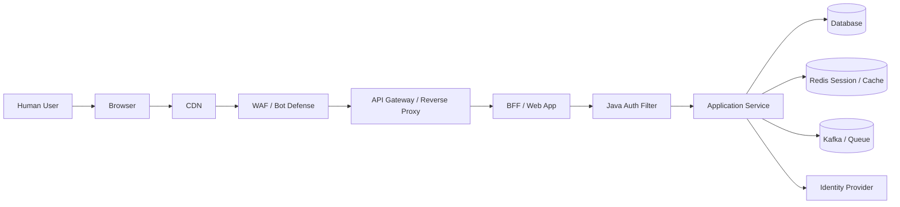
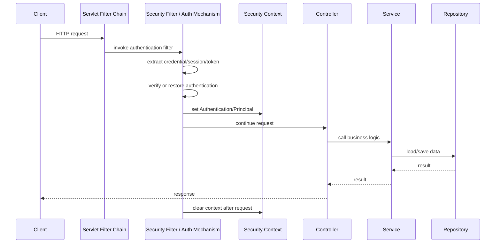
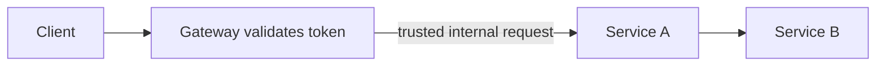
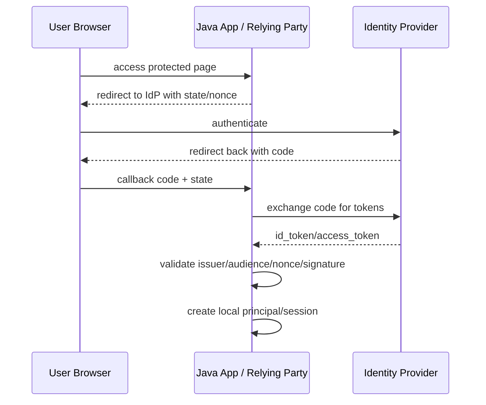
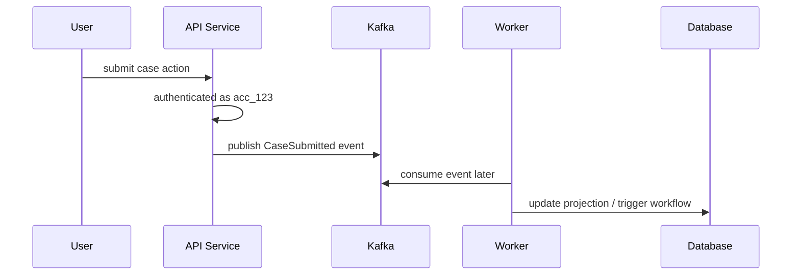

# Part 002 — Authentication Boundary & Trust Model

> Target part ini: kita akan menentukan **di mana authentication dimulai, di mana hasilnya boleh dipercaya, dan kapan hasil itu harus diverifikasi ulang**. Ini adalah fondasi untuk desain auth yang tidak rapuh di microservices, gateway, browser, SSO, async worker, dan multi-tenant system.

Kalimat “user sudah login” tidak cukup untuk sistem production.

Pertanyaan yang lebih benar:

```txt
Siapa yang melakukan authentication?
Bukti apa yang diverifikasi?
Di boundary mana verifikasi terjadi?
Hasilnya dikirim ke komponen lain dalam bentuk apa?
Komponen penerima boleh percaya karena alasan apa?
Apa yang terjadi saat trust chain putus?
```

Authentication yang kuat selalu punya **trust model**.

---

## 1. Problem: Authentication Sering Benar di Satu Layer, Salah di Boundary

Banyak sistem punya login yang tampak benar:

```txt
browser -> login -> session -> controller
```

Tetapi mulai gagal ketika arsitektur berkembang:

```txt
browser -> CDN -> WAF -> gateway -> BFF -> service A -> service B -> Kafka -> worker -> database
```

Pertanyaan yang muncul:

- Apakah service B tahu user asli atau hanya tahu service A?
- Apakah worker Kafka punya user context?
- Apakah event lama masih boleh membawa authority lama?
- Apakah gateway menghapus spoofed header dari client?
- Apakah internal service memvalidasi token sendiri atau percaya gateway?
- Apakah tenant berasal dari URL, token, session, database, atau header?
- Apakah principal di audit log adalah initiating actor atau executing actor?
- Apakah logout browser mencabut token downstream?

Jika trust model tidak eksplisit, sistem akan membangun “kepercayaan implisit”. Itu biasanya menjadi sumber security bug.

---

## 2. Boundary: Definisi Praktis

Boundary adalah titik di mana data, control flow, atau identity claim berpindah dari satu domain kepercayaan ke domain lain.

Contoh boundary:

- browser ke server,
- public internet ke edge,
- edge gateway ke internal service,
- service A ke service B,
- synchronous request ke async job,
- app ke database,
- app ke identity provider,
- tenant A ke tenant B,
- admin plane ke data plane,
- human user ke service account,
- JVM thread ke executor thread.

Di setiap boundary, kita harus bertanya:

```txt
Apa yang saya percaya?
Kenapa saya percaya?
Bagaimana saya memverifikasi?
Apa yang tidak boleh saya teruskan?
Apa yang harus saya catat?
```

---

## 3. Trust Model: Definisi Praktis

Trust model adalah jawaban eksplisit atas:

1. **Trust anchor** — akar kepercayaan apa yang digunakan?
2. **Verification** — bukti apa yang diverifikasi dan oleh siapa?
3. **Propagation** — hasil authentication dibawa ke mana dan dalam bentuk apa?
4. **Confinement** — hasil itu hanya berlaku untuk scope apa?
5. **Revocation** — bagaimana kepercayaan dicabut?
6. **Failure behavior** — apa yang terjadi jika verifikasi gagal atau tidak tersedia?

Contoh trust anchor:

- password hash di credential store,
- public key IdP untuk validasi JWT,
- trusted CA untuk mTLS,
- HMAC shared secret untuk webhook,
- session store server-side,
- hardware-backed authenticator attestation policy,
- Kubernetes workload identity issuer,
- internal gateway certificate.

Tanpa trust anchor, “trusted” hanyalah asumsi.

---

## 4. Peta Boundary Authentication Web Modern



Kita tidak perlu warna untuk memahami intinya: setiap panah adalah potensi boundary.

CDN/WAF bisa mengurangi serangan, tetapi tidak menggantikan authentication aplikasi. Gateway bisa memvalidasi token, tetapi downstream tetap perlu trust contract. Database bisa menyimpan account, tetapi bukan tempat untuk membuat keputusan authentication request-level.

---

## 5. Authentication Boundary vs Authorization Boundary

Authentication boundary:

> Titik tempat sistem memverifikasi bukti identitas dan menghasilkan principal/security context.

Authorization boundary:

> Titik tempat sistem memutuskan apakah principal boleh melakukan action pada resource.

Keduanya bisa berada di layer yang sama, tetapi tidak selalu.

Contoh:

```txt
Gateway validates access token        -> authentication boundary
Service checks permission on resource -> authorization boundary
```

Masalah umum:

```txt
Gateway sudah authenticate user, maka semua service otomatis allow.
```

Ini salah. Authentication bukan permission.

Model yang benar:

```txt
Gateway: token valid, issuer valid, audience valid, request authenticated.
Service: principal boleh melakukan action ini pada resource ini di state ini.
```

---

## 6. Boundary Utama dalam Java Web App

Untuk aplikasi Java Servlet/Spring/Jakarta, boundary request biasanya seperti ini:



Boundary penting:

- sebelum security filter: request tidak dipercaya,
- setelah security filter sukses: ada local security context,
- service layer: tidak boleh percaya parameter `userId` dari client tanpa mencocokkan principal,
- repository: tidak boleh diam-diam mengambil principal untuk query security tanpa desain eksplisit,
- setelah request: context harus dibersihkan.

---

## 7. Trust Contract antar Layer

Setiap layer butuh kontrak.

### 7.1 Controller Contract

Controller boleh percaya bahwa framework sudah mengisi security context, tetapi tetap harus:

- menolak unauthenticated request,
- tidak menerima identity dari body sebagai sumber kebenaran,
- meneruskan actor context ke service bila action perlu audit/domain invariant,
- tidak melakukan authorization kompleks yang seharusnya ada di domain/service layer.

Buruk:

```java
@PostMapping("/cases/{caseId}/assign")
public void assign(@PathVariable String caseId, @RequestBody AssignRequest request) {
    caseService.assign(caseId, request.assigneeUserId(), request.requestedByUserId());
}
```

`requestedByUserId` dari body bisa dipalsukan.

Lebih baik:

```java
@PostMapping("/cases/{caseId}/assign")
public void assign(@PathVariable String caseId,
                   @RequestBody AssignRequest request,
                   Authentication authentication) {
    RuntimePrincipal principal = (RuntimePrincipal) authentication.getPrincipal();
    ActorContext actor = ActorContext.from(principal);

    caseService.assign(new CaseId(caseId), new UserId(request.assigneeUserId()), actor);
}
```

### 7.2 Service Contract

Service layer menerima `ActorContext`, bukan mengambil principal secara sembunyi-sembunyi di semua tempat.

```java
public void assign(CaseId caseId, UserId assignee, ActorContext actor) {
    Case caze = caseRepository.get(caseId);

    authorization.check(actor, Action.ASSIGN_CASE, caze);
    caze.assignTo(assignee, actor);

    caseRepository.save(caze);
    audit.log(actor, "CASE_ASSIGNED", caseId.value());
}
```

Ini membuat unit test lebih jelas dan audit lebih defensible.

### 7.3 Repository Contract

Repository sebaiknya tidak menjadi tempat utama authentication/authorization. Ia boleh menerapkan tenant guard atau row-level constraint, tetapi keputusan business authorization harus tetap jelas.

Buruk:

```java
public Case findCase(String caseId) {
    String currentUser = SecurityContextHolder.getContext().getAuthentication().getName();
    return jdbc.query("select * from cases where id = ? and owner = ?", caseId, currentUser);
}
```

Masalah:

- hidden dependency,
- sulit dites,
- async/batch context kacau,
- authorization tersebar.

Lebih baik:

```java
public Optional<CaseRecord> findByIdWithinTenant(CaseId caseId, TenantId tenantId) {
    return jdbc.query("""
        select *
        from cases
        where id = ? and tenant_id = ?
        """, caseId.value(), tenantId.value());
}
```

Tenant guard eksplisit. Authorization tetap di service/domain policy.

---

## 8. Edge Authentication Pattern

Edge authentication berarti token/session divalidasi di gateway/reverse proxy/API gateway sebelum request sampai ke service.



Kelebihan:

- validasi terpusat,
- policy kasar bisa diterapkan di depan,
- mengurangi beban service,
- konsisten untuk banyak service,
- observability ingress lebih baik.

Risiko:

- downstream terlalu percaya header,
- gateway misconfigured menjadi single point of auth failure,
- service bisa diakses bypass gateway,
- identity propagation tidak jelas,
- authorization detail tetap tidak selesai.

### 8.1 Syarat Trust yang Sehat

Service boleh percaya hasil edge authentication hanya jika:

- service tidak bisa diakses langsung dari internet,
- network path gateway-service dikontrol,
- gateway menghapus identity headers dari client sebelum menambahkan header internal,
- komunikasi gateway-service dilindungi TLS/mTLS atau boundary equivalent,
- ada allowlist header internal,
- service tahu issuer internal header,
- header memiliki integrity protection atau request berasal dari authenticated proxy,
- ada fallback failure behavior yang aman.

Jika salah satu tidak terpenuhi, service harus memverifikasi token sendiri atau menolak request.

---

## 9. Header-Based Identity Propagation

Header propagation sering dipakai:

```txt
X-User-Id: acc_123
X-Tenant-Id: tnt_456
X-Auth-Method: oidc
X-Auth-Assurance: mfa
```

Ini hanya aman dalam boundary internal yang kuat. Dari public internet, header ini harus dianggap attacker-controlled.

### 9.1 Anti-Pattern

```java
String userId = request.getHeader("X-User-Id");
```

Jika endpoint bisa dicapai langsung, attacker cukup mengirim:

```http
X-User-Id: admin
```

### 9.2 Pattern yang Lebih Aman

- Di gateway: strip semua inbound identity headers.
- Gateway validasi credential/token.
- Gateway generate internal identity headers.
- Service hanya menerima dari network path gateway.
- Service bisa validasi gateway mTLS certificate.
- Untuk high-risk service, gunakan signed internal assertion.

Contoh internal assertion:

```txt
X-Internal-Auth: base64url(payload).base64url(signature)
```

Payload:

```json
{
  "sub": "acc_123",
  "tenant": "tnt_456",
  "method": "oidc",
  "assurance": "mfa",
  "iat": 1783076400,
  "exp": 1783076460,
  "aud": "case-service",
  "iss": "edge-gateway"
}
```

Ini pada dasarnya menjadi token internal. Jika sudah sejauh ini, pertimbangkan apakah lebih baik memakai JWT/JWS internal dengan key management yang benar.

---

## 10. Token Validation Boundary

Jika service menerima JWT, validasi tidak boleh hanya `signature valid`.

Minimal validasi:

- signature,
- issuer,
- audience,
- expiry,
- not-before bila ada,
- issued-at sanity,
- algorithm allowlist,
- key id dari JWK yang dipercaya,
- token type/use,
- tenant claim bila multi-tenant,
- subject format,
- scope/authority mapping,
- clock skew terbatas,
- replay policy bila relevan.

Pseudo-code:

```java
public VerifiedToken verify(String rawToken, TokenValidationContext context) {
    DecodedJwt jwt = parser.parse(rawToken);

    algorithmPolicy.requireAllowed(jwt.header().algorithm());
    PublicKey key = jwkResolver.resolve(jwt.header().keyId(), jwt.header().algorithm());
    signatureVerifier.verify(jwt, key);

    claims.requireIssuer(context.expectedIssuer());
    claims.requireAudience(context.serviceAudience());
    claims.requireNotExpired(clock.instant(), allowedClockSkew);
    claims.requireTokenUse(TokenUse.ACCESS_TOKEN);
    claims.requireTenantIfNeeded(context.tenantMode());

    return mapper.toVerifiedToken(jwt);
}
```

Anti-pattern:

```java
Jwt jwt = Jwt.decode(token);
String userId = jwt.getSubject();
```

Decode bukan verify.

---

## 11. Session Boundary

Session boundary menjawab:

> Di mana login state disimpan dan siapa yang boleh memakainya?

Browser session biasanya:

```txt
server session store <-> session id cookie <-> browser
```

```mermaid
sequenceDiagram
    participant B as Browser
    participant A as Java App
    participant S as Session Store

    B->>A: POST /login credentials
    A->>A: verify credentials
    A->>S: create session sess_123 -> auth result
    A-->>B: Set-Cookie: SESSION=sess_123; HttpOnly; Secure; SameSite
    B->>A: GET /cases Cookie SESSION=sess_123
    A->>S: load session sess_123
    S-->>A: authentication result
    A->>A: set local security context
```

Session boundary failure:

- cookie tidak `Secure`,
- cookie bisa dibaca JavaScript karena tidak `HttpOnly`,
- SameSite tidak sesuai,
- session id tidak dirotasi setelah login,
- session store tidak punya revocation,
- session timeout terlalu panjang,
- logout hanya menghapus cookie tetapi server session masih hidup,
- session id masuk URL/log.

### 11.1 Session Locality

Pertanyaan desain:

- Apakah session hanya valid untuk satu app?
- Apakah session shared lintas app?
- Apakah SSO session berbeda dari app session?
- Apakah session membawa tenant aktif?
- Apakah tenant switch merotasi session/context?
- Apakah session butuh device binding?

SSO sering punya dua lapis:

```txt
IdP session: user masih login di identity provider
Application session: user masih login di aplikasi tertentu
```

Logout app tidak selalu logout IdP. Logout IdP tidak selalu otomatis membersihkan semua app session kecuali ada mekanisme front-channel/back-channel logout atau session management yang benar.

---

## 12. Identity Provider Boundary

Saat memakai OIDC/SAML/SSO, aplikasi tidak memverifikasi password user secara langsung. Aplikasi mempercayai IdP.

Trust chain:

```txt
user authenticates to IdP
IdP issues assertion/token
application validates assertion/token
application creates local session/principal
```



Boundary penting:

- aplikasi mempercayai IdP tertentu, bukan semua issuer,
- `state` melindungi CSRF/callback mix-up,
- `nonce` mengikat ID token ke authentication request,
- redirect URI harus ketat,
- ID token untuk authentication ke client/RP, bukan access token ke resource API,
- aplikasi tetap perlu local account mapping.

### 12.1 Account Linking Boundary

Federated login tidak otomatis berarti account lokal sudah benar.

Pertanyaan:

- Apakah `email` cukup untuk linking? Biasanya tidak selalu.
- Apakah email sudah verified oleh IdP?
- Apakah issuer berubah?
- Apakah subject stable per issuer?
- Apakah tenant menentukan IdP?
- Apakah satu user boleh punya beberapa IdP?

Model yang lebih aman:

```sql
federated_identities(
  id uuid primary key,
  account_id uuid not null references accounts(id),
  issuer text not null,
  subject text not null,
  email_at_link_time text,
  linked_at timestamptz not null,
  unique(issuer, subject)
);
```

Jangan hanya:

```txt
where user.email = id_token.email
```

Email bisa berubah, bisa belum verified, dan bisa collision di konteks issuer berbeda.

---

## 13. Microservice Boundary

Dalam microservices, ada dua identity yang sering bercampur:

```txt
initiating actor: user/service yang memulai aksi
executing actor: service yang sedang menjalankan aksi
```

Contoh:

```txt
User acc_123 clicks Approve
case-service calls payment-service
payment-service writes transaction
```

Payment service menerima request dari case-service. Jadi executing actor adalah `case-service`. Tetapi action diinisiasi oleh `acc_123`.

Audit yang baik mencatat keduanya:

```json
{
  "action": "PAYMENT_APPROVED",
  "initiating_actor": "user:acc_123",
  "executing_actor": "service:case-service",
  "tenant": "tnt_456",
  "request_id": "req_abc"
}
```

### 13.1 Token Relay vs Token Exchange

Token relay:

```txt
service A forwards original user token to service B
```

Risiko:

- audience token mungkin untuk service A, bukan B,
- service B mendapat authority terlalu luas,
- token menyebar ke banyak service,
- sulit audit dan revocation,
- confused deputy.

Token exchange:

```txt
service A exchanges user token for token intended for service B
```

Lebih sehat karena token baru bisa punya:

- audience service B,
- scope lebih sempit,
- TTL lebih pendek,
- actor chain/delegation claim,
- issuer yang jelas.

### 13.2 Service-to-Service Authentication

Internal call butuh authentication sendiri. Jangan hanya mengandalkan “karena di private network”.

Pilihan:

- mTLS antar service,
- service mesh identity,
- OAuth client credentials,
- signed internal JWT,
- workload identity,
- HMAC untuk call tertentu.

Minimal invariant:

```txt
service B must know both: who called me and on whose behalf, if any
```

---

## 14. Async Boundary: Kafka, Queue, Worker

Async boundary adalah salah satu tempat authentication context sering rusak.



Pertanyaan:

- Apakah worker “authenticated as user”?
- Tidak. Worker authenticated sebagai worker/service.
- Apakah event boleh membawa initiating actor?
- Ya, sebagai audit/delegation context, bukan sebagai live session.
- Apakah authority user harus dievaluasi ulang saat event diproses?
- Tergantung action semantics.

### 14.1 Event Actor Context

Untuk event audit:

```json
{
  "event_type": "CASE_SUBMITTED",
  "case_id": "case_123",
  "tenant": "tnt_456",
  "initiating_actor": {
    "type": "HUMAN_USER",
    "subject": "acc_123",
    "session_id": "sess_789",
    "authenticated_at": "2026-07-03T10:00:00Z",
    "assurance": "MFA"
  },
  "producing_service": "case-service",
  "occurred_at": "2026-07-03T10:02:00Z"
}
```

Worker tidak boleh memperlakukan event actor sebagai current authenticated session. Event actor adalah historical context.

### 14.2 Async Authorization Trap

Jika event adalah command yang belum diotorisasi, worker harus authorize.

Jika event adalah fact setelah action authorized, worker tidak perlu mengulang authorization yang sama; ia memproses consequence.

Bedakan:

```txt
Command: ApprovePaymentRequested
Fact: PaymentApproved
```

Authentication context untuk command dan fact berbeda secara semantik.

---

## 15. Database Boundary

Database tidak melakukan authentication aplikasi kecuali kita memakai database user per actor, yang jarang untuk web apps. Biasanya aplikasi memakai service credential ke database.

Jadi database melihat:

```txt
executing actor = application database user
```

Bukan:

```txt
human user = acc_123
```

Karena itu audit domain harus ditulis aplikasi.

Contoh audit table:

```sql
create table audit_events (
  id uuid primary key,
  tenant_id uuid not null,
  event_type text not null,
  resource_type text not null,
  resource_id text not null,
  initiating_actor_type text not null,
  initiating_actor_id text not null,
  executing_actor_type text not null,
  executing_actor_id text not null,
  authentication_method text,
  authentication_session_id text,
  request_id text,
  occurred_at timestamptz not null,
  metadata jsonb not null default '{}'
);
```

### 15.1 Row-Level Security Boundary

PostgreSQL RLS bisa membantu tenant isolation, tetapi perlu desain connection/session variable yang benar.

Contoh konseptual:

```sql
select set_config('app.tenant_id', 'tnt_456', true);
```

Lalu policy:

```sql
create policy tenant_isolation on cases
using (tenant_id::text = current_setting('app.tenant_id', true));
```

Risiko:

- connection pool tidak reset variable,
- tenant id berasal dari input tidak dipercaya,
- background job lupa set tenant,
- superuser bypass,
- policy tidak mencakup semua table.

RLS bukan pengganti authentication. RLS adalah defense-in-depth untuk data boundary.

---

## 16. Tenant Boundary

Multi-tenant authentication punya jebakan serius.

Pertanyaan utama:

```txt
Kapan tenant ditentukan?
Dari mana tenant berasal?
Apakah user bisa memilih tenant?
Apakah identifier unik global atau per tenant?
Apakah IdP per tenant?
Apakah session bound ke tenant aktif?
```

### 16.1 Tenant Resolution Patterns

| Pattern | Contoh | Kelebihan | Risiko |
|---|---|---|---|
| Subdomain | `tenant-a.example.com` | jelas untuk browser | takeover/misrouting bila mapping lemah |
| Path | `/t/{tenant}/cases` | eksplisit | raw path tenant bisa dipalsukan |
| Header internal | `X-Tenant-Id` | baik antar service | spoofing jika dari public client |
| Token claim | `tenant_id` claim | kuat jika signed/validated | stale/overbroad tenant claim |
| User selection after login | switch tenant UI | fleksibel | session/context confusion |
| IdP realm | realm per tenant | isolasi tinggi | operasional lebih kompleks |

Invariant:

```txt
tenant context must be derived from a trusted source and must match the authenticated subject's allowed tenancy
```

### 16.2 Tenant Confusion Example

Buruk:

```java
@GetMapping("/tenants/{tenantId}/cases/{caseId}")
public CaseDto get(@PathVariable String tenantId, @PathVariable String caseId) {
    return caseService.get(tenantId, caseId);
}
```

Jika service tidak membandingkan `tenantId` path dengan principal tenant/membership, user tenant A bisa mencoba tenant B.

Lebih baik:

```java
public CaseDto get(String tenantIdFromPath, String caseId, RuntimePrincipal principal) {
    TenantId requestedTenant = new TenantId(tenantIdFromPath);

    if (!principal.canActInTenant(requestedTenant)) {
        throw new TenantAccessDeniedException();
    }

    return caseService.get(requestedTenant, new CaseId(caseId), ActorContext.from(principal));
}
```

---

## 17. Browser Boundary

Browser adalah hostile-but-necessary environment. Kita tidak boleh menganggap semua state di browser aman.

| Browser Storage | Bisa Diakses JS | Risiko | Cocok untuk |
|---|---:|---|---|
| HttpOnly Secure Cookie | Tidak | CSRF jika SameSite/CSRF defense buruk | session id |
| localStorage | Ya | XSS token theft | sebaiknya hindari untuk high-value token |
| sessionStorage | Ya | XSS, tab lifecycle | low sensitivity sementara |
| in-memory JS | Ya saat runtime | XSS runtime | token sangat pendek, SPA tertentu |
| IndexedDB | Ya | XSS persistent access | bukan untuk secret bernilai tinggi |

Untuk browser app, sering kali pattern paling aman adalah:

```txt
browser -> HttpOnly session cookie -> BFF -> token stored server-side
```

Bukan:

```txt
browser JS stores long-lived access token
```

### 17.1 CSRF vs XSS Boundary

- Cookie otomatis dikirim browser, maka CSRF relevan.
- Token di JS tidak otomatis dikirim, tetapi XSS bisa mencuri token.
- HttpOnly cookie mengurangi token theft via JS, tetapi butuh CSRF protection.
- SameSite membantu, tetapi tidak selalu menggantikan CSRF defense untuk semua scenario.

Boundary browser adalah trade-off, bukan satu jawaban universal.

---

## 18. Admin Plane vs Data Plane

Admin action sering punya risiko lebih tinggi daripada user action biasa.

Contoh admin plane:

- reset password user,
- disable MFA,
- impersonate user,
- rotate signing key,
- change IdP configuration,
- grant role,
- export audit log,
- disable tenant.

Admin plane sebaiknya punya boundary lebih kuat:

- MFA wajib,
- phishing-resistant MFA untuk operasi kritikal,
- fresh authentication,
- approval workflow,
- break-glass account policy,
- immutable audit,
- network/device restriction bila perlu,
- explicit reason/comment.

Jangan hanya:

```txt
ROLE_ADMIN -> boleh semua
```

Admin authentication harus mempertimbangkan **freshness** dan **assurance**.

---

## 19. Freshness Boundary

Authentication yang valid belum tentu fresh.

Contoh:

```txt
user login 10 jam lalu dengan password
sekarang ingin mengubah payout bank account
```

Sistem sebaiknya meminta step-up/re-authentication.

Model:

```java
public record FreshnessRequirement(Duration maxAge, AssuranceRequirement assurance) {}

public boolean isFreshEnough(AuthenticationResult auth, FreshnessRequirement requirement, Clock clock) {
    boolean ageOk = Duration.between(auth.authenticatedAt(), clock.instant())
        .compareTo(requirement.maxAge()) <= 0;

    boolean assuranceOk = assurancePolicy.satisfies(auth.assuranceLevel(), requirement.assurance());

    return ageOk && assuranceOk;
}
```

Boundary freshness biasanya diterapkan untuk:

- change password,
- add/remove MFA,
- change email/phone,
- financial transfer,
- admin role grant,
- view/export sensitive data,
- delete account,
- impersonation.

---

## 20. Revocation Boundary

Revocation menjawab:

```txt
Saat trust dicabut, seberapa cepat semua komponen berhenti percaya?
```

Jenis revocation:

- account disabled,
- credential revoked,
- session logout,
- refresh token reuse detected,
- signing key compromised,
- IdP trust removed,
- tenant disabled,
- role removed,
- device lost,
- service account rotated.

### 20.1 Revocation Speed

| Artifact | Revocation Cepat? | Catatan |
|---|---:|---|
| Server session | Ya | hapus session store |
| Opaque token | Ya | introspection/token store |
| JWT access token | Tidak selalu | tunggu expiry atau denylist |
| Refresh token | Ya jika server-side tracked | wajib reuse detection |
| API key | Ya jika lookup setiap request | cache perlu invalidation |
| mTLS cert | Tergantung CRL/OCSP/rotation | operationally complex |

Trade-off:

```txt
stateless validation improves availability/latency, but weakens immediate revocation
stateful validation improves control, but adds dependency and latency
```

Tidak ada pilihan gratis.

---

## 21. Trust Boundary Decision Matrix

| Boundary | Boleh Percaya Apa? | Harus Verifikasi Apa? | Failure Aman |
|---|---|---|---|
| Public client -> app | hampir tidak ada | credential/session/token, CSRF, origin bila relevan | 401/403 generic |
| Gateway -> service | internal identity only if path controlled | mTLS/network/header stripping/token | reject if missing/invalid |
| Service -> service | caller service identity | mTLS/JWT/audience/scope | reject, do not fallback anonymous |
| App -> IdP | IdP metadata/key dari issuer trusted | signature, issuer, audience, nonce/state | fail closed |
| App -> DB | DB service credential | DB TLS/credential/role | fail closed |
| Sync -> async event | historical actor context | event signature/source/schema | quarantine/dead letter |
| User -> tenant | selected/requested tenant | membership/issuer/claim mapping | deny tenant access |
| Session -> action | session principal | expiry, revocation, freshness | step-up or reject |

---

## 22. Production Checklist

### Boundary Inventory

- [ ] Semua ingress path diketahui.
- [ ] Tidak ada service internal yang bisa bypass gateway tanpa auth control.
- [ ] Semua identity-bearing header dari public request di-strip.
- [ ] Token validation policy per service jelas.
- [ ] Audience/issuer per service terdokumentasi.
- [ ] Session boundary dan IdP boundary dipisah.
- [ ] Async actor context dibedakan dari current authentication.

### Trust Contract

- [ ] Setiap service tahu trust anchor-nya.
- [ ] Setiap propagated identity punya issuer.
- [ ] Setiap propagated identity punya audience/scope/context.
- [ ] Revocation policy eksplisit.
- [ ] Failure mode default adalah fail closed.
- [ ] Audit mencatat initiating actor dan executing actor.

### Java Runtime

- [ ] Security context tidak diambil sembarangan di repository.
- [ ] Actor context eksplisit untuk domain action penting.
- [ ] Thread-local security context dibersihkan setelah request.
- [ ] Async propagation tidak implicit/acak.
- [ ] Controller tidak percaya user id dari request body/header publik.

### Multi-Tenant

- [ ] Tenant resolution berasal dari trusted source.
- [ ] Tenant dari path/header dicocokkan dengan principal.
- [ ] Account linking IdP memakai `(issuer, subject)`, bukan email saja.
- [ ] Session tenant switch punya policy jelas.
- [ ] Audit selalu membawa tenant id.

---

## 23. Latihan

### Latihan 1 — Boundary Map

Ambil satu aplikasi web Java yang pernah kamu bangun. Gambar boundary map:

```txt
browser -> edge -> gateway -> app -> database/cache/queue/idp
```

Untuk setiap panah, tulis:

- data identity apa yang lewat,
- siapa yang memverifikasi,
- trust anchor apa,
- apa failure behavior-nya,
- apakah audit event dibuat.

### Latihan 2 — Header Spoofing Review

Cari semua penggunaan:

```txt
X-User-Id
X-Tenant-Id
X-Role
X-Forwarded-User
```

Tentukan:

- apakah header bisa datang dari public client,
- apakah gateway strip lalu recreate,
- apakah service bisa diakses bypass gateway,
- apakah ada mTLS gateway-service,
- apakah ada test untuk spoofed header.

### Latihan 3 — Async Actor Context

Desain payload event `CaseEscalated` yang membawa:

- initiating actor,
- executing service,
- tenant,
- authentication method,
- session id atau correlation id,
- occurred_at,
- reason.

Jelaskan mana yang historical context dan mana yang current authority.

---

## 24. Ringkasan

Authentication tidak hanya terjadi saat login. Authentication adalah trust decision yang bergerak melewati boundary.

Mental model utama:

```txt
Every boundary must decide what identity claim it accepts, why it accepts it, and how it fails safely.
```

Jika satu hal yang harus diingat dari part ini:

> Jangan pernah membawa identity melewati boundary tanpa issuer, audience/context, verification story, dan revocation story.

Part berikutnya akan masuk ke threat model authentication: credential theft, replay, phishing, session fixation, account enumeration, confused deputy, token substitution, dan bagaimana threat model itu mengubah implementasi Java kita.

---

## References

- Spring Security Reference — Servlet Architecture and FilterChainProxy: https://docs.spring.io/spring-security/reference/servlet/architecture.html
- Spring Security Reference — Servlet Authentication Architecture: https://docs.spring.io/spring-security/reference/servlet/authentication/architecture.html
- Jakarta Security 4.0 Specification: https://jakarta.ee/specifications/security/4.0/
- NIST SP 800-63-4 Digital Identity Guidelines: https://pages.nist.gov/800-63-4/
- RFC 9700 — Best Current Practice for OAuth 2.0 Security: https://www.rfc-editor.org/info/rfc9700/
