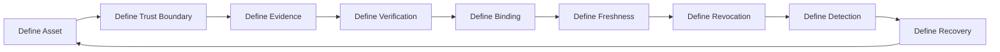
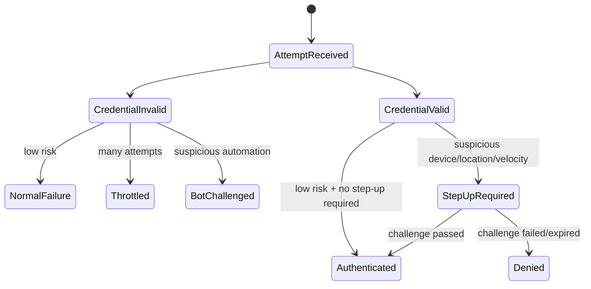
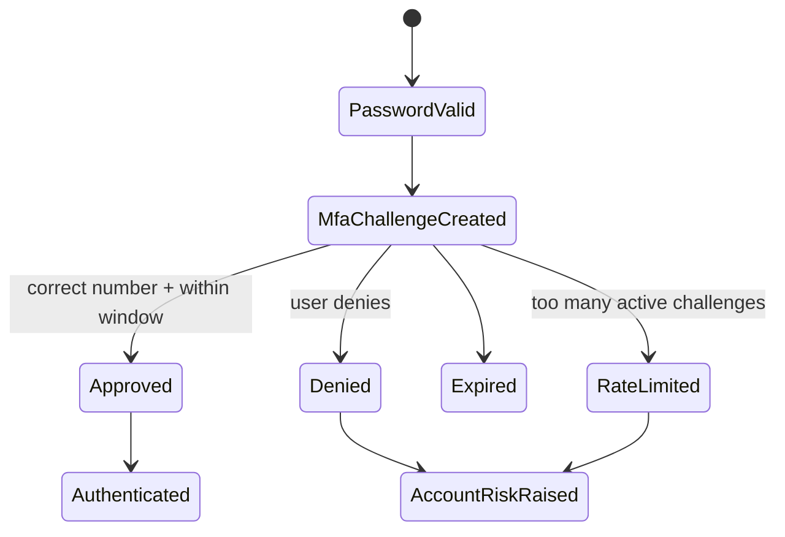
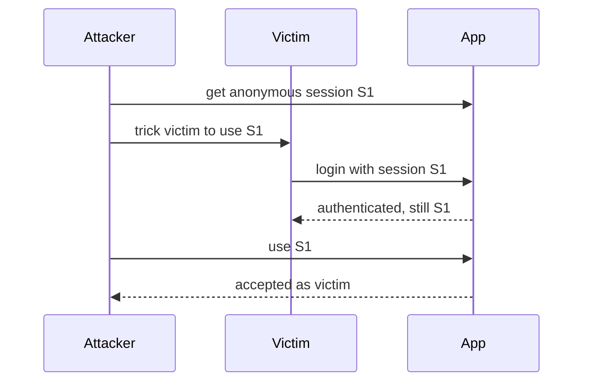
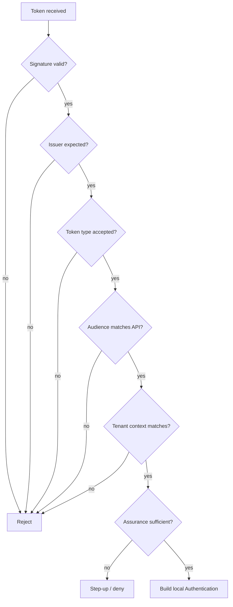
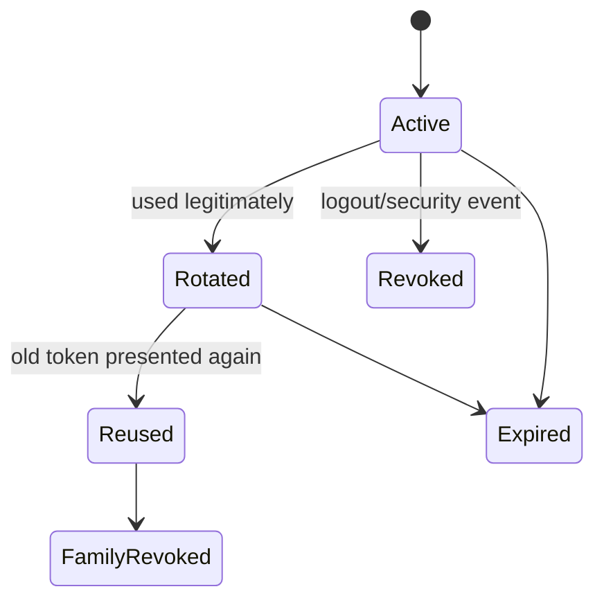

# Part 003 — Threat Model for Authentication

> Target part ini: kita membangun threat model autentikasi yang bisa langsung dipakai untuk desain, code review, testing, incident response, dan architecture review. Fokusnya bukan daftar serangan hafalan, tetapi bagaimana serangan mengubah invariant implementasi Java.

Authentication production-grade harus dimulai dari pertanyaan sederhana:

> “Apa yang sebenarnya sedang kita lindungi, siapa yang mencoba memalsukannya, lewat boundary mana, dan bagaimana sistem gagal saat bukti identitas tidak lagi dapat dipercaya?”

Jika tim hanya mulai dari framework, desainnya biasanya seperti ini:

```txt
Spring Security + JWT + bcrypt + refresh token = secure
```

Itu bukan threat model. Itu daftar komponen.

Threat model yang lebih berguna:

```txt
asset -> adversary -> entry point -> attack path -> broken invariant -> detection -> prevention -> recovery
```

Authentication bukan hanya login. Authentication adalah sistem pembuktian identitas yang diserang dari banyak sisi:

- credential dicuri,
- session dicuri,
- token di-replay,
- redirect OAuth dimanipulasi,
- user dipancing phishing,
- reset password dipakai sebagai bypass,
- header internal dipalsukan,
- key signing bocor,
- principal salah tenant,
- SecurityContext bocor antar request atau async job,
- audit identity salah sehingga insiden tidak bisa direkonstruksi.

Part ini membuat peta serangan sebelum kita masuk ke implementasi detail di part berikutnya.

---

## 1. Threat Model Autentikasi dalam Satu Kalimat

Authentication threat model menjawab:

> “Dengan asumsi ada aktor jahat, jaringan tidak selalu aman, client tidak selalu jujur, user bisa tertipu, secret bisa bocor, dan dependency bisa salah konfigurasi, invariant apa yang harus tetap benar agar sistem tidak menerima identitas palsu?”

Invariant utama:

```txt
A request must not be treated as authenticated unless the system can verify valid, fresh, intended, non-replayed, non-confused evidence of identity at the current trust boundary.
```

Kata pentingnya:

| Kata | Makna |
|---|---|
| `verify` | Bukti harus diverifikasi, bukan dipercaya karena hadir. |
| `valid` | Format, signature, credential, dan status harus benar. |
| `fresh` | Bukti tidak boleh stale, expired, atau dari sesi lama yang tidak lagi sah. |
| `intended` | Bukti harus dibuat untuk audience, client, redirect, tenant, dan flow ini. |
| `non-replayed` | Bukti tidak boleh bisa dipakai ulang oleh pencuri. |
| `non-confused` | Bukti tidak boleh disalahartikan lintas client, service, tenant, atau protocol. |
| `current trust boundary` | Valid di boundary A belum tentu valid di boundary B. |

Authentication bug serius hampir selalu pelanggaran salah satu kata di atas.

---

## 2. Asset yang Dilindungi Authentication

Sebelum bicara serangan, tentukan asset.

| Asset | Contoh | Kenapa Penting |
|---|---|---|
| Credential secret | password hash, API key hash, TOTP secret, private key, refresh token | Jika bocor, attacker bisa membuktikan identity. |
| Authentication artifact | session id, access token, ID token, authorization code | Jika dicuri, attacker bisa bypass login. |
| Identity binding | user ↔ tenant, device ↔ user, service ↔ workload | Jika salah, request sah bisa diarahkan ke identity salah. |
| Verification key | JWK public key set, issuer config, trust anchor, CA bundle | Jika salah, token palsu bisa diterima. |
| Recovery channel | email reset, phone OTP, backup code, support override | Sering menjadi jalur bypass MFA/password. |
| Login state | state, nonce, PKCE verifier, CSRF token, login transaction | Jika dimanipulasi, flow OIDC/OAuth bisa dibajak. |
| Session state | server session, remember-me token, refresh token family | Jika tidak dikelola, logout/revocation gagal. |
| Security context | Principal di thread/request/event | Jika bocor, kode downstream memakai identity salah. |
| Audit evidence | auth success/failure log, session id, actor id, IP, device | Jika salah, investigation dan compliance runtuh. |

Mental model:

```txt
authentication protects not only the credential, but every artifact that can become proof of identity
```

Karena itu, menyimpan access token di log sama bahayanya dengan menyimpan password pada banyak skenario.

---

## 3. Adversary Model

Tidak semua attacker sama. Kontrol yang benar tergantung musuhnya.

| Adversary | Kemampuan | Contoh Serangan |
|---|---|---|
| Opportunistic bot | Banyak request murah, daftar password bocor | credential stuffing, password spraying |
| Targeted attacker | Mengenal korban tertentu | phishing, SIM swap, MFA fatigue |
| Network attacker | Bisa melihat/memanipulasi traffic tertentu | token theft jika TLS gagal, redirect manipulation |
| Malicious client | Mengontrol browser/mobile/app sendiri | header spoofing, token substitution |
| Compromised service | Satu internal service sudah dikuasai | lateral movement, token relay abuse |
| Insider/admin abuse | Punya akses operasional | reset credential, impersonation tanpa audit |
| Supply-chain attacker | Mengubah dependency/build/deployment | credential exfiltration, signing key theft |
| Tenant adversary | User sah tenant A menyerang tenant B | tenant confusion, cross-tenant token use |

Aplikasi internal tidak kebal. Pada sistem enterprise, adversary paling berbahaya sering bukan internet bot, tetapi:

```txt
valid user + valid credential + wrong boundary + missing tenant invariant
```

---

## 4. Attack Surface Authentication

Authentication surface bukan hanya `/login`.

```mermaid
flowchart TD
    A[Public Client] --> B[/login]
    A --> C[/oauth2/authorization/{provider}]
    A --> D[/callback]
    A --> E[/refresh]
    A --> F[/logout]
    A --> G[/password-reset]
    A --> H[/mfa/challenge]
    A --> I[/webauthn/register]
    A --> J[/webauthn/assert]
    K[Service Client] --> L[/token]
    K --> M[/api with Authorization header]
    N[Admin Console] --> O[impersonation / reset / disable]
    P[Async Worker] --> Q[event consumer identity reconstruction]
    R[Gateway] --> S[internal identity headers]
```

Threat model harus mencakup:

- login,
- registration,
- password reset,
- account recovery,
- MFA enrollment,
- MFA reset,
- passkey registration,
- session refresh,
- logout,
- token introspection,
- token exchange,
- OIDC callback,
- service credential rotation,
- admin impersonation,
- support override,
- internal header propagation,
- background job execution,
- audit event generation.

Banyak breach tidak terjadi lewat login utama. Terjadi lewat recovery, refresh, support tool, atau trust boundary internal.

---

## 5. Threat Modeling Loop yang Dipakai di Seri Ini

Untuk setiap authentication pattern, gunakan loop ini:



Checklist pertanyaan:

1. **Asset** — apa yang jika bocor membuat identity bisa dipalsukan?
2. **Boundary** — siapa yang boleh mengirim bukti ini?
3. **Evidence** — apa bukti yang disajikan?
4. **Verification** — bagaimana bukti diverifikasi?
5. **Binding** — bukti ini terikat ke user, client, device, tenant, redirect URI, audience, dan session mana?
6. **Freshness** — apa expiry, nonce, timestamp, one-time-use, atau rotation rule?
7. **Revocation** — bagaimana bukti dibatalkan sebelum expired?
8. **Detection** — sinyal apa yang menunjukkan abuse?
9. **Recovery** — apa langkah aman saat credential/token/session/key bocor?

Jika satu pertanyaan tidak punya jawaban, desain belum production-grade.

---

## 6. Threat: Credential Theft

Credential theft terjadi saat bukti login dicuri.

Contoh:

- password dicuri dari phishing,
- password hash bocor dari database,
- API key tersalin ke Git,
- TOTP secret bocor dari backup,
- refresh token dicuri dari local storage,
- private key service dicuri dari container image,
- database dump berisi recovery token plaintext.

### 6.1 Broken Invariant

```txt
Only the legitimate actor can present the credential.
```

Saat credential bocor, invariant itu mati. Sistem harus punya lapisan lain:

- hashing lambat untuk password,
- MFA/step-up,
- device binding,
- token rotation,
- anomaly detection,
- key rotation,
- revocation,
- blast-radius control.

### 6.2 Java Design Consequence

Credential tidak boleh diperlakukan sebagai string biasa.

Buruk:

```java
record LoginRequest(String username, String password) {}

log.info("login request={}", request); // fatal: password bisa masuk log
```

Lebih aman:

```java
public final class RawPassword {
    private final char[] value;

    private RawPassword(char[] value) {
        this.value = value;
    }

    public static RawPassword of(char[] value) {
        if (value == null || value.length == 0) {
            throw new IllegalArgumentException("password is required");
        }
        return new RawPassword(value.clone());
    }

    public char[] exposeForHashingOnly() {
        return value.clone();
    }

    public void erase() {
        java.util.Arrays.fill(value, '\0');
    }

    @Override
    public String toString() {
        return "[REDACTED]";
    }
}
```

Namun jujur secara engineering: di banyak aplikasi web Java, password sudah menjadi `String` saat JSON deserialization. Jadi kelas seperti ini bukan jaminan sempurna. Nilainya tetap berguna untuk:

- mencegah accidental logging,
- menegaskan semantic boundary,
- membatasi API internal,
- memaksa code review terhadap credential exposure.

### 6.3 Controls

| Control | Fungsi |
|---|---|
| Password hashing adaptif | Membuat hash dump mahal di-crack. |
| Secret scanning | Mendeteksi API key/private key di repository. |
| MFA phishing-resistant | Mengurangi dampak password phishing. |
| Token rotation | Membuat refresh token reuse terdeteksi. |
| Short-lived access token | Membatasi durasi abuse setelah token bocor. |
| Credential version | Memungkinkan invalidasi semua token setelah credential reset. |
| Redacted logging | Mencegah secret masuk log. |
| Envelope encryption | Mengurangi dampak dump database untuk secret tertentu. |

---

## 7. Threat: Credential Stuffing

Credential stuffing adalah penggunaan credential bocor dari tempat lain untuk mencoba login di sistem kita.

Ciri:

- username/password valid dari breach eksternal,
- volume tinggi,
- IP tersebar,
- user-agent beragam,
- banyak failure tetapi sebagian kecil success,
- target endpoint login dan refresh.

### 7.1 Broken Invariant

```txt
A correct password implies legitimate user presence.
```

Di dunia modern, password benar tidak cukup. Password benar bisa berarti:

```txt
user legitimate OR attacker has reused leaked credential
```

### 7.2 State Machine



### 7.3 Java Implementation Shape

Jangan letakkan rate limiting hanya setelah password verification. Password hashing mahal. Bot bisa membuat CPU exhaustion.

Pipeline lebih aman:

```txt
request normalization
-> cheap abuse gate by IP / username hash / device fingerprint
-> credential verification
-> risk evaluation
-> MFA/step-up if needed
-> session/token issuance
```

Contoh interface:

```java
public interface LoginAbuseGate {
    AbuseDecision evaluate(LoginAttemptSignal signal);
}

public record LoginAttemptSignal(
        String usernameCanonical,
        String ipAddress,
        String userAgent,
        String deviceCookie,
        String tenantId,
        java.time.Instant occurredAt
) {}

public sealed interface AbuseDecision {
    record Allow() implements AbuseDecision {}
    record Delay(java.time.Duration duration) implements AbuseDecision {}
    record Challenge(String reason) implements AbuseDecision {}
    record Block(String reason) implements AbuseDecision {}
}
```

Important invariant:

```txt
rate limiting key must not be only IP and must not be only username
```

Hanya IP gagal karena botnet. Hanya username gagal karena attacker bisa lock user tertentu. Production biasanya memakai kombinasi:

- IP prefix,
- username canonical hash,
- tenant,
- ASN/geography,
- device cookie,
- failure velocity,
- success anomaly,
- global attack mode.

---

## 8. Threat: Password Spraying

Password spraying mencoba satu password umum ke banyak akun.

Contoh:

```txt
Summer2026! -> user1
Summer2026! -> user2
Summer2026! -> user3
```

Ini menghindari lockout per akun.

### 8.1 Broken Invariant

```txt
Low failure count per account means low risk.
```

Salah. Serangan tersebar perlu deteksi global.

### 8.2 Detection Signal

| Signal | Arti |
|---|---|
| Satu password fingerprint gagal di banyak akun | password spraying |
| Banyak username dari IP/ASN sama | bot campaign |
| Failure meningkat per tenant | targeted tenant attack |
| Banyak `user not found` | enumeration + spray |
| Banyak valid username + wrong password | stuffing/spray terhadap account valid |

Catatan: jangan log password plaintext. Untuk mendeteksi spraying berbasis password, bisa memakai fingerprint HMAC sementara dengan key khusus telemetry dan retention pendek.

```java
public interface PasswordTelemetryFingerprint {
    String fingerprint(char[] rawPassword);
}
```

Rule:

```txt
fingerprint must not be reversible, must not be stored long-term, and must not use the password hashing store key
```

---

## 9. Threat: Brute Force

Brute force mencoba banyak kombinasi sampai benar.

Untuk web login manusia, brute force online seharusnya dihentikan oleh:

- throttling,
- lockout adaptif,
- challenge,
- MFA,
- breach password screening,
- monitoring.

Namun lockout bisa menjadi DoS.

### 9.1 Trade-off Lockout

| Strategy | Kelebihan | Risiko |
|---|---|---|
| Hard lock account | Menghentikan brute force per akun | Attacker bisa lock banyak akun sah |
| Delay progresif | Lebih user-friendly | Perlu state store dan tuning |
| IP throttling | Murah | Lemah terhadap botnet/NAT |
| Username throttling | Efektif per akun | Bisa menjadi DoS targeted |
| Risk-based challenge | Lebih adaptif | Butuh sinyal risiko bagus |
| Tenant attack mode | Bagus saat campaign | Bisa mengganggu user normal |

Production invariant:

```txt
controls must slow attackers without giving them a cheap account-lockout weapon
```

---

## 10. Threat: Account Enumeration

Account enumeration terjadi saat attacker bisa membedakan akun ada/tidak.

Contoh response buruk:

```json
{ "error": "email not registered" }
```

atau:

```txt
user exists -> password hashing runs -> response 450ms
user missing -> immediate return -> response 20ms
```

### 10.1 Broken Invariant

```txt
The authentication endpoint does not reveal whether an identifier exists.
```

### 10.2 Error Semantics

Buruk:

```txt
Unknown email
Wrong password
Account disabled
MFA not enrolled
```

Lebih aman untuk public login:

```txt
Invalid username or password
```

Namun sistem internal tetap perlu alasan detail untuk audit. Jadi pisahkan:

```txt
external error: generic
internal audit reason: precise
```

Contoh:

```java
public record LoginFailure(
        ExternalAuthError externalError,
        InternalFailureReason internalReason,
        String correlationId
) {}

enum ExternalAuthError {
    INVALID_CREDENTIALS,
    TEMPORARILY_UNAVAILABLE,
    ADDITIONAL_VERIFICATION_REQUIRED
}

enum InternalFailureReason {
    USER_NOT_FOUND,
    PASSWORD_MISMATCH,
    ACCOUNT_DISABLED,
    TENANT_DISABLED,
    PASSWORD_EXPIRED,
    RATE_LIMITED,
    RISK_BLOCKED
}
```

### 10.3 Timing Defense

Untuk user tidak ditemukan, lakukan dummy password verification dengan hash dummy yang cost-nya sama.

```java
public final class PasswordVerifier {
    private final PasswordEncoder encoder;
    private final String dummyHash;

    public PasswordCheckResult verify(String username, char[] password) {
        UserCredential credential = credentialRepository.findByUsername(username)
                .orElse(null);

        String hashToCheck = credential != null ? credential.passwordHash() : dummyHash;
        boolean matches = encoder.matches(new String(password), hashToCheck);

        if (credential == null) {
            return PasswordCheckResult.unknownUser();
        }
        if (!matches) {
            return PasswordCheckResult.mismatch(credential.userId());
        }
        return PasswordCheckResult.success(credential.userId());
    }
}
```

Catatan: `new String(password)` tidak ideal karena membuat immutable string. Banyak library Java memang menerima `CharSequence`, sehingga trade-off harus dipahami. Part password storage akan membahas lebih detail.

---

## 11. Threat: Phishing

Phishing membuat user memberikan credential atau menyetujui challenge di situs/app palsu.

Yang dicuri bisa:

- password,
- OTP,
- TOTP,
- magic link,
- session cookie,
- OAuth authorization,
- push approval,
- recovery code.

### 11.1 Broken Invariant

```txt
The user can reliably distinguish legitimate verifier from attacker-controlled verifier.
```

Dalam praktik, user sering tidak bisa.

Karena itu, kontrol modern mengarah ke phishing-resistant authentication, terutama public-key based authenticator seperti WebAuthn/passkeys yang mengikat assertion ke origin.

### 11.2 MFA Tidak Selalu Phishing-Resistant

| Faktor | Phishing Resistance | Catatan |
|---|---:|---|
| Password | Rendah | Bisa diketik di situs palsu. |
| Email OTP | Rendah | Bisa diminta lalu diteruskan attacker. |
| SMS OTP | Rendah | Rentan phishing dan SIM swap. |
| TOTP | Sedang/rendah | Kode bisa di-phish real-time. |
| Push approve | Sedang | Rentan fatigue/social engineering jika tanpa number matching. |
| WebAuthn/passkey | Tinggi | Assertion terikat origin dan private key tidak keluar. |
| mTLS client cert | Tinggi untuk machine | Bergantung proteksi private key. |

NIST SP 800-63B membedakan authenticator assurance level dan menekankan phishing resistance pada level assurance tinggi. OWASP juga menempatkan MFA sebagai kontrol penting, tetapi pilihan faktor menentukan kualitas keamanan.

### 11.3 Java Consequence

Jangan membuat desain MFA sebagai boolean:

```java
boolean mfaEnabled;
```

Model yang lebih benar:

```java
public record AuthenticatorEnrollment(
        String authenticatorId,
        String userId,
        AuthenticatorType type,
        PhishingResistance phishingResistance,
        java.time.Instant enrolledAt,
        java.time.Instant lastUsedAt,
        boolean active
) {}

enum AuthenticatorType {
    PASSWORD,
    TOTP,
    EMAIL_OTP,
    SMS_OTP,
    WEBAUTHN_PLATFORM,
    WEBAUTHN_ROAMING,
    CLIENT_CERTIFICATE
}

enum PhishingResistance {
    NONE,
    PARTIAL,
    STRONG
}
```

Authentication result harus membawa metode yang dipakai:

```java
public record AuthenticationAssurance(
        int aal,
        boolean multiFactor,
        boolean phishingResistant,
        java.util.Set<AuthenticatorType> methods,
        java.time.Instant authenticatedAt
) {}
```

---

## 12. Threat: MFA Fatigue

MFA fatigue terjadi saat attacker yang sudah tahu password mengirim banyak push challenge sampai user menekan approve.

### 12.1 Broken Invariant

```txt
An approved MFA challenge implies user intent.
```

Approval bisa terjadi karena lelah, panik, atau tertipu.

### 12.2 Controls

| Control | Fungsi |
|---|---|
| Number matching | User harus mencocokkan angka dari login screen. |
| Challenge context | Tampilkan lokasi, device, app, dan waktu. |
| Rate limit challenge | Jangan izinkan spam push. |
| Deny reporting | User bisa melaporkan “this was not me”. |
| Step-up after denial | Denial berulang menjadi sinyal compromise. |
| Prefer WebAuthn | Mengurangi push approval yang mudah disalahgunakan. |

State machine:



---

## 13. Threat: Replay Attack

Replay terjadi saat bukti autentikasi yang sah dipakai ulang oleh attacker.

Contoh:

- access token dicuri lalu dipakai ulang,
- API request signature dipakai ulang karena tidak ada nonce,
- authorization code dipakai dua kali,
- password reset token tidak one-time-use,
- WebAuthn challenge tidak invalidated,
- refresh token lama masih diterima setelah rotation.

### 13.1 Broken Invariant

```txt
Evidence that was valid once is not necessarily valid again.
```

### 13.2 Replay Defense Matrix

| Artifact | Replay Defense |
|---|---|
| Session id | TLS, HttpOnly cookie, rotation on login, revocation. |
| Authorization code | Short expiry, one-time-use, PKCE binding. |
| Refresh token | Rotation, reuse detection, token family invalidation. |
| HMAC request | Timestamp, nonce, canonical request, replay cache. |
| Password reset token | One-time-use, short expiry, store hash only. |
| MFA challenge | Short expiry, attempt count, challenge id, consumed flag. |
| WebAuthn challenge | Origin/RP ID verification, challenge one-time-use. |

### 13.3 Java Pattern: One-Time Token Store

```java
public interface OneTimeTokenStore {
    void issue(TokenPurpose purpose, String subjectId, String tokenHash, java.time.Instant expiresAt);

    ConsumeResult consume(TokenPurpose purpose, String tokenHash, java.time.Instant now);
}

public sealed interface ConsumeResult {
    record Consumed(String subjectId) implements ConsumeResult {}
    record NotFound() implements ConsumeResult {}
    record Expired() implements ConsumeResult {}
    record AlreadyConsumed() implements ConsumeResult {}
}
```

Database invariant:

```sql
-- concept only
unique(token_hash)
check(consumed_at is null or consumed_at >= issued_at)
```

Consumption harus atomic:

```sql
update one_time_token
set consumed_at = now()
where token_hash = :hash
  and purpose = :purpose
  and consumed_at is null
  and expires_at > now()
returning subject_id;
```

Jika memakai `select` lalu `update` terpisah tanpa lock/condition, dua request paralel bisa sama-sama lolos.

---

## 14. Threat: Session Fixation

Session fixation terjadi saat attacker membuat atau mengetahui session id sebelum korban login, lalu session itu tetap dipakai setelah korban authenticated.

Flow buruk:



### 14.1 Broken Invariant

```txt
Session identity after login must not be attacker-controlled from before login.
```

### 14.2 Controls

- rotate session id after successful login,
- clear anonymous pre-authentication attributes that are not explicitly allowed,
- bind CSRF/login transaction state carefully,
- invalidate session after logout,
- prevent session id in URL,
- use Secure + HttpOnly cookies,
- avoid accepting session id from query parameter.

Spring Security has built-in session fixation protection for servlet applications, but custom login/session logic can bypass it if done incorrectly.

### 14.3 Java Review Point

Red flag:

```java
request.getSession(true).setAttribute("USER_ID", userId);
```

without session id rotation.

Better conceptual flow:

```txt
anonymous session -> credential verified -> session id changed -> authenticated context stored -> old id invalid
```

---

## 15. Threat: Session Hijacking

Session hijacking terjadi saat attacker mendapatkan session id/cookie yang sudah authenticated.

Sumber:

- XSS membaca token non-HttpOnly,
- malware/browser extension,
- insecure cookie flag,
- TLS termination salah,
- log berisi cookie,
- session id di URL/referrer,
- Redis/session store leak.

### 15.1 Broken Invariant

```txt
Possession of session id implies legitimate browser session.
```

Session id adalah bearer artifact. Siapa pun yang memegangnya bisa menjadi user, kecuali ada binding tambahan.

### 15.2 Controls

| Control | Catatan |
|---|---|
| HttpOnly | Mengurangi pencurian via JavaScript. |
| Secure | Cookie hanya via HTTPS. |
| SameSite | Mengurangi cross-site request risk. |
| Rotation after login | Mengurangi fixation. |
| Idle timeout | Membatasi stale session. |
| Absolute timeout | Membatasi sesi terlalu lama. |
| Device/session inventory | User bisa melihat dan revoke session. |
| Server-side revocation | Logout dan incident response efektif. |
| Anomaly detection | IP/ASN/device shift bisa trigger step-up. |

---

## 16. Threat: CSRF Login and Forced Login

CSRF sering dibahas untuk aksi state-changing setelah login. Namun login juga bisa diserang.

Forced login:

```txt
attacker logs victim browser into attacker's account
victim performs actions thinking it is their own account
attacker observes results or manipulates data
```

### 16.1 Broken Invariant

```txt
The account in the browser session reflects the user's intent.
```

### 16.2 Controls

- CSRF protection on login form,
- state parameter in OIDC/OAuth,
- clear existing session before login transition,
- explicit account switch UX,
- show authenticated identity clearly,
- protect linking flows with reauthentication.

---

## 17. Threat: Token Theft

Token theft adalah pencurian access token, refresh token, ID token, API token, atau opaque reference token.

### 17.1 Common Root Causes

| Location | Risk |
|---|---|
| Browser localStorage | XSS can read bearer token. |
| Mobile insecure storage | Malware/rooted device can extract. |
| Logs/APM traces | Authorization header accidentally captured. |
| Reverse proxy logs | Header/body leakage. |
| URL fragments/query | Token leaks via referrer/history. |
| CI/CD variables | Over-permissive secrets. |
| Database | Refresh token stored plaintext. |

### 17.2 Broken Invariant

```txt
Token possession implies legitimate actor.
```

Bearer token has no proof-of-possession. For many systems, this is accepted trade-off, but it must be explicit.

### 17.3 Controls

- access token short TTL,
- refresh token rotation,
- store refresh tokens hashed,
- no tokens in URLs,
- redaction at ingress logs,
- separate ID token vs access token,
- validate issuer/audience/expiry/signature,
- token binding/DPoP/mTLS for high-risk clients where appropriate,
- revoke token family on reuse detection.

---

## 18. Threat: JWT Algorithm and Key Confusion

JWT verification bugs are common when teams treat JWT as “base64 JSON with signature”.

Examples:

- accepting `alg: none`,
- allowing algorithm chosen by token without policy,
- confusing HMAC shared secret with RSA public key,
- using wrong issuer JWK set,
- trusting `kid` to fetch arbitrary key URL,
- not validating `aud`,
- using ID token as API access token,
- accepting expired token due to clock skew too wide.

### 18.1 Broken Invariant

```txt
A signed token from any known key is valid for this API.
```

Correct invariant:

```txt
A token is accepted only if it is signed by the configured issuer's allowed algorithm/key, intended for this audience, not expired, not before valid, and semantically valid for this token type.
```

### 18.2 Verification Checklist

| Claim/Header | Check |
|---|---|
| `iss` | Exact expected issuer. |
| `aud` | Contains this resource server/API audience. |
| `exp` | Not expired. |
| `nbf` | Not before accepted. |
| `iat` | Reasonable age if policy requires. |
| `sub` | Present and canonical. |
| `typ` | Distinguish access token vs ID token where policy uses type. |
| `alg` | Allowed by server config, not token preference. |
| `kid` | Selects from trusted JWK set only. |
| `azp`/client | Required in some multi-client OIDC scenarios. |
| tenant claim | Must match tenant resolution boundary. |

### 18.3 Java Rule

Do not parse JWT manually for authentication decisions.

Bad:

```java
String[] parts = token.split("\\.");
String payload = new String(Base64.getUrlDecoder().decode(parts[1]));
String userId = objectMapper.readTree(payload).get("sub").asText();
```

This extracts claims without verification.

Use a verifier configured with issuer, audience, algorithm/key policy, and clock policy. In Spring Security Resource Server, these concerns are represented by JWT decoder and validators. In Jakarta/MicroProfile environments, container or framework integration must still enforce equivalent checks.

---

## 19. Threat: Token Substitution

Token substitution occurs when a valid token for one context is accepted in another.

Examples:

- ID token accepted as access token,
- token for API A accepted by API B,
- token for tenant A accepted in tenant B,
- token from staging issuer accepted in production,
- token for client mobile accepted by admin web app,
- service token accepted as user token.

### 19.1 Broken Invariant

```txt
Valid token means valid here.
```

Correct:

```txt
valid token + correct type + correct issuer + correct audience + correct tenant + correct client + correct assurance + correct boundary
```

### 19.2 Decision Model



---

## 20. Threat: Confused Deputy

Confused deputy occurs when a privileged component is tricked into using its authority for the wrong actor or context.

Authentication examples:

- API gateway authenticates user but internal service trusts spoofable `X-User-Id`,
- service A calls service B with its own token but performs action for arbitrary user id from request,
- backend exchanges token without preserving actor/client/audience constraints,
- support tool impersonates user without audit and reason,
- multi-tenant resolver uses path tenant but token tenant differs.

### 20.1 Broken Invariant

```txt
A trusted component's identity can safely stand in for the original actor.
```

Not always. You need delegation semantics.

### 20.2 Delegation Record

```java
public record ActorChain(
        Actor initiatingActor,
        Actor authenticatingClient,
        Actor executingService,
        DelegationMode delegationMode
) {}

enum DelegationMode {
    NONE,
    USER_DELEGATED,
    SERVICE_ACTING_ON_BEHALF_OF_USER,
    ADMIN_IMPERSONATION,
    SYSTEM_AUTOMATION
}
```

Without actor chain, audit says:

```txt
pricing-service updated quote
```

But investigation needs:

```txt
user U initiated request via web-client C, gateway G authenticated it, pricing-service S executed it, using delegated user context, in tenant T
```

---

## 21. Threat: Tenant Confusion

Tenant confusion happens when identity, session, token, route, or data access refers to different tenants.

Examples:

```txt
sub=user-123, tenant=A
request path=/tenants/B/cases/9
header X-Tenant-Id=B
SQL uses tenant from header
```

### 21.1 Broken Invariant

```txt
Tenant context can be selected independently from authenticated identity.
```

In multi-tenant systems, tenant is part of authentication context, not just authorization filter.

### 21.2 Tenant Invariant

```txt
effectiveTenant must be derived from a verified tenant membership or verified tenant-scoped token, not from public request input alone
```

Implementation model:

```java
public record AuthenticatedTenantContext(
        String tenantId,
        TenantBindingSource source,
        String subjectId,
        java.time.Instant verifiedAt
) {}

enum TenantBindingSource {
    TOKEN_CLAIM,
    SESSION_SELECTION,
    VERIFIED_MEMBERSHIP_LOOKUP,
    MTLS_CERT_SAN,
    SERVICE_ACCOUNT_BINDING
}
```

Failure rule:

```txt
if pathTenant != authenticatedTenant and no explicit tenant-switch protocol exists -> reject
```

---

## 22. Threat: Recovery Channel Abuse

Password reset and account recovery are often weaker than login.

Common attacks:

- reset token leaked in logs,
- token not one-time-use,
- token stored plaintext,
- reset does not revoke existing sessions,
- email account compromise gives full takeover,
- support agent resets MFA without strong proof,
- phone OTP recovery vulnerable to SIM swap,
- backup codes stored plaintext,
- recovery flow reveals account existence.

### 22.1 Broken Invariant

```txt
Recovery proves the same level of identity as login.
```

Often false.

### 22.2 Recovery Rules

| Rule | Why |
|---|---|
| Reset tokens are random, high entropy, short-lived, hashed at rest. | DB/log leak should not enable reset. |
| Reset tokens are one-time-use. | Prevent replay. |
| Reset success rotates credential version. | Existing tokens/sessions can be invalidated. |
| MFA reset requires stronger process than password reset. | MFA reset is account takeover path. |
| Recovery events are high-signal audit events. | Needed for investigation. |
| User notified after recovery change. | Early detection. |

---

## 23. Threat: OAuth/OIDC Callback Attack

OIDC login adds specific threats:

- missing `state` allows CSRF login,
- missing `nonce` allows ID token replay/substitution,
- weak redirect URI validation,
- authorization code interception,
- code replay,
- mix-up attacks between providers,
- trusting user email without issuer/account binding,
- account linking takeover.

### 23.1 Broken Invariant

```txt
A successful callback means this browser initiated this login for this client and this provider.
```

Correct callback needs binding:

```txt
browser session + state + nonce + PKCE verifier + redirect_uri + client_id + issuer + code one-time-use
```

### 23.2 OIDC Callback State

```java
public record OidcLoginTransaction(
        String transactionId,
        String stateHash,
        String nonceHash,
        String pkceVerifierEncrypted,
        String expectedIssuer,
        String clientId,
        String redirectUri,
        java.time.Instant expiresAt,
        boolean consumed
) {}
```

Transaction must be consumed atomically. Callback replay should fail.

---

## 24. Threat: Internal Header Spoofing

A common enterprise pattern:

```txt
Gateway authenticates -> sends X-User-Id to internal services
```

This can work only if internal services cannot be reached by untrusted clients and gateway strips/recreates identity headers.

### 24.1 Broken Invariant

```txt
Presence of X-User-Id means gateway authenticated it.
```

Presence is not provenance.

### 24.2 Controls

- reject identity headers at public edge,
- gateway strips all incoming identity headers,
- gateway recreates signed/internal headers,
- service reachable only through trusted network/mTLS,
- internal services verify gateway identity,
- prefer token validation or signed context over raw headers for sensitive systems,
- log provenance of identity context.

---

## 25. Threat: SecurityContext Leakage

Java applications often store authentication in thread-local context.

Spring Security uses `SecurityContextHolder`. Servlet request handling often maps one thread to one request, but async execution, thread pools, reactive streams, scheduled jobs, and CompletableFuture can break assumptions.

### 25.1 Broken Invariant

```txt
The current thread's security context belongs to the current request.
```

Thread pools reuse threads. If context is not cleared or propagated correctly, identity can leak.

### 25.2 Bad Pattern

```java
CompletableFuture.runAsync(() -> {
    Authentication auth = SecurityContextHolder.getContext().getAuthentication();
    audit(auth.getName());
});
```

Depending on configuration, this may see no auth, stale auth, or wrong auth.

### 25.3 Safer Pattern

Capture explicit immutable actor context at boundary:

```java
public record ActorContext(
        String subjectId,
        String tenantId,
        String sessionId,
        String correlationId,
        java.time.Instant authenticatedAt
) {}
```

Pass it explicitly to async work:

```java
public void submitCaseReview(CaseId caseId, ActorContext actor) {
    reviewExecutor.submit(() -> reviewWorkflow.start(caseId, actor));
}
```

Rule:

```txt
SecurityContext is a request-local convenience, not a durable identity propagation mechanism
```

---

## 26. Threat: Logging and Observability Leakage

Authentication data frequently leaks through logs, traces, metrics labels, and exception messages.

Sensitive fields:

- `Authorization`,
- `Cookie`,
- `Set-Cookie`,
- password,
- OTP,
- reset token,
- refresh token,
- authorization code,
- `client_secret`,
- API key,
- private key,
- JWK private material,
- full ID token/access token.

### 26.1 Broken Invariant

```txt
Logs are safe because only internal people can access them.
```

Logs are often replicated, indexed, exported, retained, and accessed by many systems.

### 26.2 Redaction Design

```java
public interface SensitiveValueRedactor {
    String redactHeader(String name, String value);
    String redactJsonField(String fieldName, String value);
}
```

Rule:

```txt
redaction must happen before data leaves process boundary, not only in SIEM dashboard
```

---

## 27. Threat: Key Compromise

If token signing key, HMAC secret, mTLS CA, or private key leaks, attacker may mint valid-looking authentication evidence.

### 27.1 Broken Invariant

```txt
Tokens signed by our key are trustworthy.
```

If key is compromised, this invariant is false.

### 27.2 Key Compromise Runbook Questions

- Which keys exist?
- Which tokens/artifacts were signed with each key?
- What is the `kid`?
- Can old key be disabled immediately?
- Do services cache JWK sets? For how long?
- Can all sessions/token families be revoked?
- Are refresh tokens tied to credential/session version?
- Can we distinguish tokens minted before/after compromise?
- Are logs sufficient to find suspicious minting?

Design invariant:

```txt
key rotation must be routine before it is an emergency
```

---

## 28. Threat: IdP Outage and Fail-Open Behavior

When identity provider or JWK endpoint is down, systems sometimes fail open accidentally.

Examples:

- skip token validation when JWK fetch fails,
- accept stale keys forever,
- cache introspection success too long,
- fallback admin password enabled,
- bypass auth for health checks too broadly.

### 28.1 Broken Invariant

```txt
Availability failure should not become authentication bypass.
```

Correct posture:

```txt
fail closed for unknown authentication, degrade gracefully for already-established sessions according to explicit risk policy
```

For example:

- existing server-side sessions may continue until idle/absolute timeout,
- new OIDC login cannot start if IdP unavailable,
- API token validation may use cached JWK for bounded duration,
- introspection-only opaque token APIs may return 503 rather than accept unknown token.

---

## 29. Threat-to-Control Matrix

| Threat | Prevent | Detect | Recover |
|---|---|---|---|
| Credential stuffing | rate limit, MFA, breached password check | failure spikes, impossible velocity | force reset, step-up, notify |
| Password spraying | global/tenant detection, password policy | same password fingerprint failures | tenant attack mode |
| Account enumeration | generic errors, timing defense | user-not-found velocity | tune endpoint responses |
| Phishing | WebAuthn/passkeys, origin binding | new device/location | revoke sessions, reset credential |
| MFA fatigue | number matching, challenge limits | repeated push denies | lock risk, require stronger factor |
| Replay | nonce, one-time token, rotation | reuse detection | revoke family/session |
| Session fixation | rotate session id | duplicate session anomalies | invalidate sessions |
| Token theft | short TTL, storage hygiene | token use from new context | revoke token/session |
| JWT confusion | strict validators | invalid token reasons | rotate key/config |
| Header spoofing | strip/recreate, mTLS | direct service access logs | block path, redeploy gateway rule |
| Tenant confusion | tenant invariant | cross-tenant mismatch | revoke sessions, fix resolver |
| Key compromise | KMS/HSM, rotation | unusual signing/key access | emergency rotate, revoke all |

---

## 30. Review Checklist for Java Code

Use this in pull request review.

### 30.1 Login Endpoint

- Does it return generic public errors?
- Does it avoid user enumeration via timing?
- Is rate limiting before expensive password hashing?
- Are failure reasons logged internally but redacted externally?
- Is session id rotated after login?
- Are MFA/step-up decisions explicit?
- Are password values redacted from logs and exceptions?

### 30.2 Token Validation

- Is signature verified by a real library?
- Are issuer and audience validated?
- Are algorithm and key source pinned by server config?
- Is token type checked?
- Is tenant claim matched to request context?
- Is expiry enforced with reasonable clock skew?
- Are ID tokens forbidden as API access tokens?

### 30.3 OIDC Login

- Is state generated, stored, and consumed?
- Is nonce generated and verified?
- Is PKCE used where appropriate?
- Is redirect URI exact/pinned?
- Is issuer bound to login transaction?
- Is callback transaction one-time-use?
- Is account linking protected by reauthentication?

### 30.4 Session

- Is session id never accepted via URL?
- Are cookie flags correct?
- Are idle and absolute timeouts present?
- Is logout server-side?
- Is session inventory/revocation possible?
- Are sessions invalidated after credential reset?

### 30.5 Async/Event

- Is actor context explicit?
- Is `SecurityContextHolder` avoided in background work?
- Does event payload distinguish initiating actor and executing service?
- Is tenant included and verified?

---

## 31. Mermaid Attack Tree: Account Takeover

```mermaid
flowchart TD
    A[Account Takeover] --> B[Know Password]
    A --> C[Steal Session]
    A --> D[Abuse Recovery]
    A --> E[Phish MFA]
    A --> F[Exploit Token Validation]
    A --> G[Admin/Support Abuse]

    B --> B1[Credential stuffing]
    B --> B2[Password spraying]
    B --> B3[Database hash cracking]

    C --> C1[XSS steals token]
    C --> C2[Cookie leak]
    C --> C3[Session fixation]

    D --> D1[Reset token replay]
    D --> D2[Email compromise]
    D --> D3[MFA reset bypass]

    E --> E1[TOTP proxy phishing]
    E --> E2[Push fatigue]
    E --> E3[Fake support call]

    F --> F1[Missing aud]
    F --> F2[Wrong issuer]
    F --> F3[ID token accepted as access token]

    G --> G1[Impersonation without approval]
    G --> G2[Manual credential reset]
    G --> G3[Audit deletion]
```



Attack tree seperti ini berguna untuk security review karena memaksa tim melihat login sebagai satu ekosistem, bukan satu endpoint.

---

## 32. Mini Case Study: Bug yang Terlihat Aman

Desain:

```txt
- SPA login via OIDC
- API menerima JWT
- API mengecek signature dan exp
- tenant id dikirim dari frontend lewat X-Tenant-Id
```

Bug:

```txt
API does not check aud and does not bind token tenant to X-Tenant-Id
```

Attack:

1. User tenant A login secara sah.
2. User mendapatkan access token valid dari issuer.
3. User mengirim request ke `/tenant/B/cases` dengan `X-Tenant-Id: B`.
4. API menerima token karena signature valid.
5. Repository query memakai `X-Tenant-Id`.
6. Cross-tenant access terjadi.

Fix:

```txt
- API validates audience.
- Tenant context is derived from verified claim/session membership.
- Public tenant header is only a requested tenant, not effective tenant.
- path/header tenant must match authenticated tenant selection.
- repository receives AuthenticatedTenantContext, not raw string from request.
```

---

## 33. Mini Case Study: Refresh Token Reuse

Bad design:

```txt
refresh_token table stores token plaintext
refresh endpoint checks token exists and not expired
same refresh token can be used many times
logout only deletes current access token cache entry
```

Attack:

1. Refresh token stolen from device.
2. Victim and attacker both refresh successfully.
3. System cannot tell theft occurred.
4. Logout does not stop attacker because refresh token still valid.

Better design:

```txt
refresh token rotation + hashed token storage + token family + reuse detection
```

State:



---

## 34. Threat Model Template

Gunakan template ini sebelum mengimplementasikan pattern autentikasi baru.

```md
# Authentication Threat Model

## Flow
- Entry point:
- Actor:
- Credential/evidence:
- Trust boundary:
- Authentication result:
- Session/token artifact:

## Assets
- Secrets:
- Tokens:
- Keys:
- Recovery artifacts:
- Audit evidence:

## Invariants
- Identity invariant:
- Tenant invariant:
- Freshness invariant:
- Revocation invariant:
- Context propagation invariant:

## Threats
- Credential theft:
- Replay:
- Enumeration:
- Phishing:
- Confused deputy:
- Token substitution:
- Session fixation/hijacking:
- Recovery abuse:
- Key compromise:

## Controls
- Prevention:
- Detection:
- Recovery:

## Tests
- Unit tests:
- Integration tests:
- Security regression tests:
- Chaos/incident drills:
```

---

## 35. Latihan

### Latihan 1 — Review Endpoint Login

Ambil endpoint login yang pernah kamu buat. Jawab:

- Apakah response membocorkan user existence?
- Apakah timing berbeda untuk user tidak ditemukan?
- Apakah rate limiting terjadi sebelum password hashing?
- Apakah password bisa masuk log?
- Apakah session id berubah setelah login?
- Apakah audit reason cukup detail?

### Latihan 2 — Review JWT Resource Server

Cari semua validasi token:

- signature,
- issuer,
- audience,
- expiry,
- token type,
- tenant,
- client,
- assurance,
- revocation/credential version.

Tandai mana yang belum ada.

### Latihan 3 — Buat Attack Tree

Buat attack tree untuk:

```txt
Admin account takeover in a multi-tenant case management platform
```

Minimal cabang:

- password compromise,
- IdP compromise,
- support override,
- session hijack,
- token validation bug,
- tenant confusion,
- audit tampering.

---

## 36. Ringkasan

Threat model authentication bukan dokumen formalitas. Ia adalah alat untuk mengubah desain.

Jika satu hal yang harus diingat:

> Authentication aman bukan karena credential valid, tetapi karena bukti identitas valid untuk boundary, tujuan, waktu, tenant, actor, dan assurance yang tepat — serta bisa dideteksi dan dicabut ketika asumsi itu rusak.

Part berikutnya akan memetakan Java authentication landscape: Servlet, Spring Security, Jakarta Security, Jakarta Authentication/JASPIC, JAAS, JAX-RS, MicroProfile JWT, identity provider, dan kapan masing-masing masuk akal dipakai.

---

## References

- OWASP Authentication Cheat Sheet: https://cheatsheetseries.owasp.org/cheatsheets/Authentication_Cheat_Sheet.html
- OWASP Top 10 — Identification and Authentication Failures: https://owasp.org/Top10/A07_2021-Identification_and_Authentication_Failures/
- NIST SP 800-63B-4 — Digital Identity Guidelines, Authentication and Authenticator Management: https://pages.nist.gov/800-63-4/sp800-63b.html
- RFC 9700 — Best Current Practice for OAuth 2.0 Security: https://www.rfc-editor.org/info/rfc9700
- RFC 8725 — JSON Web Token Best Current Practices: https://www.rfc-editor.org/info/rfc8725
- OpenID Connect Core 1.0: https://openid.net/specs/openid-connect-core-1_0.html
- W3C Web Authentication Level 3: https://www.w3.org/TR/webauthn-3/
- Spring Security Reference — Servlet Authentication Architecture: https://docs.spring.io/spring-security/reference/servlet/authentication/architecture.html
