# Part 004 — Java Authentication Landscape

> Target part ini: kita tahu peta komponen autentikasi Java modern, kapan memakai Spring Security, Jakarta Security, Jakarta Authentication/JASPIC, JAAS, JAX-RS filter, MicroProfile JWT, API gateway, atau external IdP. Setelah ini, framework tidak lagi terlihat seperti magic; semuanya hanya variasi dari boundary, verifier, context, dan propagation.

Java authentication landscape terlihat membingungkan karena ada banyak generasi teknologi:

- Servlet container security,
- JAAS,
- JASPIC / Jakarta Authentication,
- Jakarta Security,
- JAX-RS `SecurityContext`,
- Spring Security,
- MicroProfile JWT,
- OAuth2/OIDC client/resource server,
- Keycloak/Auth0/Okta/Azure AD/Cognito sebagai Identity Provider,
- service mesh / mTLS,
- API gateway identity propagation.

Banyak engineer bertanya:

> “Mana yang paling benar?”

Jawaban production-grade:

```txt
Yang benar adalah yang cocok dengan boundary, runtime, deployment model, protocol, dan ownership identity-mu.
```

Part ini bukan katalog API. Ini peta keputusan.

---

## 1. Mental Model Landscape

Semua stack authentication Java bisa dipetakan ke pipeline ini:

```txt
request/message arrives
-> extract evidence
-> verify evidence
-> resolve identity
-> build authentication result
-> store it in request/runtime context
-> enforce or expose to application code
-> propagate or terminate at next boundary
```

Diagram:

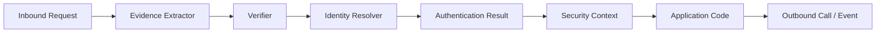

Framework berbeda hanya menaruh komponen ini di tempat berbeda:

| Stack | Extract Evidence | Verify | Context | Typical Runtime |
|---|---|---|---|---|
| Servlet container security | container | container/realm | `Principal`, roles | Tomcat/Jetty/GlassFish/WildFly |
| Spring Security | filter chain | `AuthenticationProvider`/decoder | `SecurityContextHolder` | Spring MVC/Boot |
| Jakarta Security | `HttpAuthenticationMechanism` | `IdentityStore` | Jakarta `SecurityContext` | Jakarta EE |
| Jakarta Authentication/JASPIC | container SPI | auth module | container subject/principal | Jakarta EE containers |
| JAAS | `LoginModule` | login module | `Subject` | Java SE/container legacy |
| JAX-RS filter | `ContainerRequestFilter` | custom/library | JAX-RS `SecurityContext` | Jersey/RESTEasy |
| MicroProfile JWT | container/runtime | MP-JWT implementation | `JsonWebToken`, roles | MicroProfile runtimes |
| API Gateway | gateway plugin | gateway/IdP | headers/token to service | distributed systems |
| Service mesh mTLS | sidecar/proxy | certificate trust | workload identity | Kubernetes/microservices |

---

## 2. Historical Layers: Why So Many APIs Exist?

Java security evolved through multiple deployment eras.

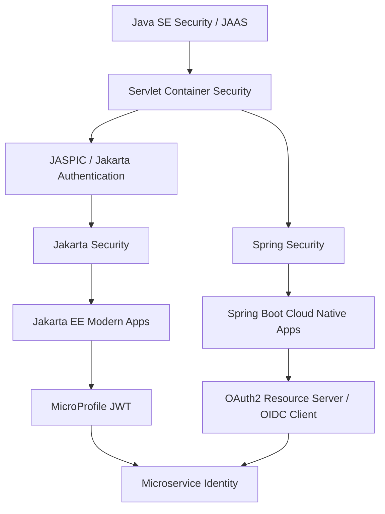

The practical reason:

- Java SE needed a generic subject/login model.
- Servlet containers needed web authentication.
- Enterprise containers needed portable authentication SPI.
- Jakarta Security made common authentication easier.
- Spring Security built a framework-level model independent of container security.
- Microservices needed JWT/OIDC/mTLS patterns.

Do not treat all APIs as equally modern for all workloads.

---

## 3. Servlet as the Base Web Boundary

Most Java web authentication frameworks on servlet stack eventually interact with Servlet request/response.

Core concepts:

- `HttpServletRequest`,
- `HttpServletResponse`,
- `Filter`,
- `FilterChain`,
- `Principal`,
- `isUserInRole`,
- session/cookie,
- dispatch types,
- error handling,
- async request processing.

### 3.1 Servlet Filter Pipeline

Authentication often runs before controller/resource code.

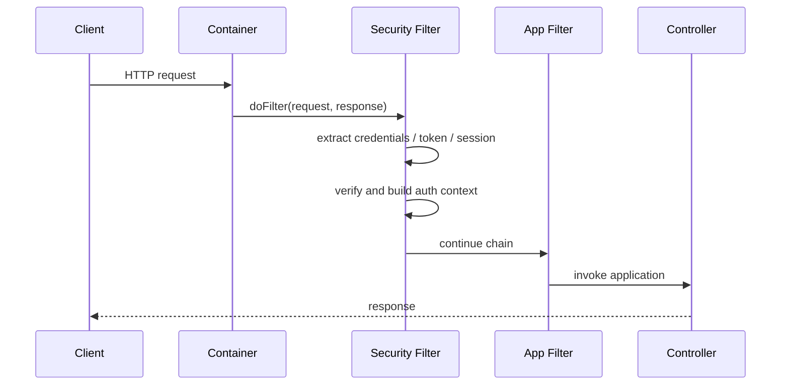

If authentication is a servlet filter concern, ordering matters.

Wrong order examples:

- request logging filter logs `Authorization` before redaction,
- CORS/preflight handling runs after auth and breaks browser clients,
- tenant resolution runs before token verification and trusts header,
- exception mapper converts auth failure to `500`,
- async handoff loses security context.

### 3.2 Servlet Principal Is Too Small for Modern Auth

Servlet gives you something like:

```java
Principal principal = request.getUserPrincipal();
boolean admin = request.isUserInRole("ADMIN");
```

Useful, but insufficient for modern authentication because production auth needs:

- issuer,
- tenant,
- client id,
- session id,
- assurance level,
- authentication methods,
- token id,
- credential version,
- actor chain,
- risk score,
- original subject vs delegated actor.

So most serious applications wrap or enrich context beyond raw `Principal`.

```java
public record AuthenticatedActor(
        String subjectId,
        String displayName,
        String tenantId,
        String issuer,
        String clientId,
        AuthenticationAssurance assurance,
        java.time.Instant authenticatedAt
) implements java.security.Principal {
    @Override
    public String getName() {
        return subjectId;
    }
}
```

---

## 4. Spring Security: Framework-Level Security Pipeline

Spring Security is the dominant authentication framework for Spring applications because it owns the application security pipeline instead of relying only on container-managed security.

Spring Security's servlet architecture is centered around:

- `DelegatingFilterProxy`,
- `FilterChainProxy`,
- `SecurityFilterChain`,
- `SecurityContextHolder`,
- `Authentication`,
- `AuthenticationManager`,
- `AuthenticationProvider`,
- `AuthenticationEntryPoint`,
- `AccessDeniedHandler`,
- session management,
- OAuth2/OIDC client,
- resource server JWT/opaque token support.

### 4.1 Spring Security Authentication Pipeline

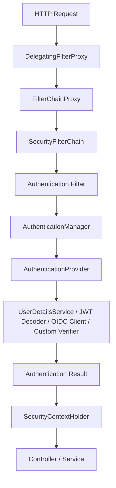

### 4.2 Spring's Core Abstraction: `Authentication`

`Authentication` is both:

- an authentication request before verification, and
- an authentication result after verification.

Conceptually:

```java
public interface Authentication extends Principal, Serializable {
    Collection<? extends GrantedAuthority> getAuthorities();
    Object getCredentials();
    Object getDetails();
    Object getPrincipal();
    boolean isAuthenticated();
    void setAuthenticated(boolean isAuthenticated);
}
```

Design implication:

```txt
never assume Authentication object means authenticated unless isAuthenticated and source are trusted
```

Also avoid stuffing domain entity into principal. Use stable auth-specific principal.

Bad:

```java
authentication.getPrincipal(); // returns mutable JPA User entity
```

Better:

```java
public record AppPrincipal(
        String userId,
        String tenantId,
        String username,
        Set<String> authorities,
        AuthenticationAssurance assurance
) {}
```

### 4.3 When Spring Security Is a Good Fit

Use Spring Security when:

- app is Spring Boot / Spring MVC / Spring WebFlux,
- you need form login/session,
- you need OAuth2/OIDC client login,
- you need JWT/opaque token resource server,
- you need method security,
- you need custom providers but still want a mature pipeline,
- you need strong integration with Spring ecosystem.

Avoid fighting it. If you are in Spring, custom authentication should usually be implemented as:

- custom filter,
- custom `AuthenticationToken`,
- custom `AuthenticationProvider`,
- custom `UserDetailsService`/`ReactiveUserDetailsService`,
- custom `JwtAuthenticationConverter`,
- custom `AuthenticationSuccessHandler`/`FailureHandler`,
- custom session strategy,
- custom `SecurityContextRepository`.

Do not build a parallel auth mechanism inside controllers.

### 4.4 Spring Security Failure Mode

Bad pattern:

```java
@PostMapping("/login")
public Token login(@RequestBody LoginRequest request) {
    User user = userService.checkPassword(request.username(), request.password());
    return jwtService.issue(user);
}
```

This may bypass:

- security filter events,
- authentication manager,
- password encoder policy,
- session fixation protection,
- failure handler,
- audit hooks,
- rate limiting integration,
- exception semantics,
- remember-me/session strategies.

There are cases where explicit login endpoint is fine, especially stateless API auth service. But the design must intentionally reintroduce every missing invariant.

---

## 5. Jakarta Security: Modern Jakarta EE Authentication API

Jakarta Security provides a higher-level API for application security in Jakarta EE.

Important concepts:

- `HttpAuthenticationMechanism`,
- `IdentityStore`,
- `Credential`,
- `SecurityContext`,
- built-in mechanisms such as form/basic/custom form/OpenID Connect depending on version/runtime,
- CDI integration.

### 5.1 Jakarta Security Pipeline

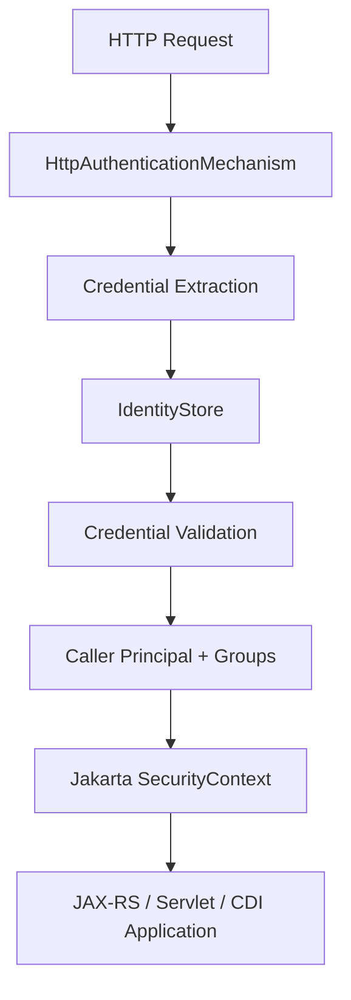

### 5.2 Example Shape

Conceptual example:

```java
@ApplicationScoped
public class DatabaseIdentityStore implements IdentityStore {

    @Override
    public CredentialValidationResult validate(UsernamePasswordCredential credential) {
        // lookup account
        // verify password hash
        // return principal and groups
        return CredentialValidationResult.INVALID_RESULT;
    }
}
```

Jakarta Security fits well when:

- application runs on Jakarta EE runtime,
- team wants portable container-integrated security,
- CDI is central,
- app uses JAX-RS/Servlet/Jakarta stack without Spring,
- security should integrate with container roles/principals.

### 5.3 Jakarta Security vs Spring Security

| Dimension | Spring Security | Jakarta Security |
|---|---|---|
| Ecosystem | Spring-first | Jakarta EE-first |
| Main pipeline | Spring filter chain | Container/Jakarta mechanism |
| Context | `SecurityContextHolder` | Jakarta `SecurityContext` / container principal |
| Extensibility | Very broad Spring abstractions | Standardized Jakarta APIs |
| OAuth/OIDC support | Rich in Spring ecosystem | Available via Jakarta Security mechanisms/runtime support |
| Best fit | Spring Boot services/apps | Jakarta EE apps |

Neither is universally “better”. Wrong question. Ask:

```txt
Which runtime owns the request security pipeline?
```

---

## 6. Jakarta Authentication / JASPIC: Low-Level Container SPI

Jakarta Authentication, formerly JASPIC, is a low-level SPI for authentication mechanisms integrated with containers.

Think of it as:

```txt
container authentication plugin layer
```

It is not the most ergonomic API for everyday application login, but it matters when:

- building a custom container authentication mechanism,
- integrating third-party authentication into Jakarta containers,
- working with app servers where auth is container-owned,
- understanding legacy enterprise authentication.

### 6.1 Where It Sits

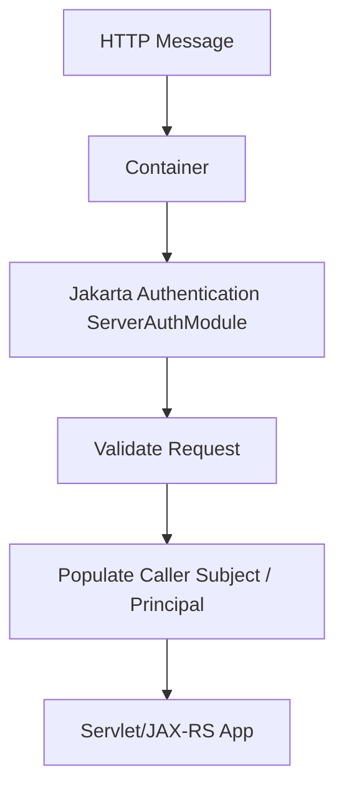

### 6.2 When Not to Use Directly

Do not start with Jakarta Authentication/JASPIC for a normal Spring Boot app.

It is low-level, container-centric, and typically hidden behind higher-level APIs. If you need custom login inside Jakarta EE, Jakarta Security is usually a better application-level entry point.

---

## 7. JAAS: Java SE Subject/LoginModule Model

JAAS stands for Java Authentication and Authorization Service.

JAAS provides:

- `LoginContext`,
- `LoginModule`,
- `Subject`,
- `Principal`,
- credential sets,
- pluggable login configuration.

### 7.1 JAAS Mental Model

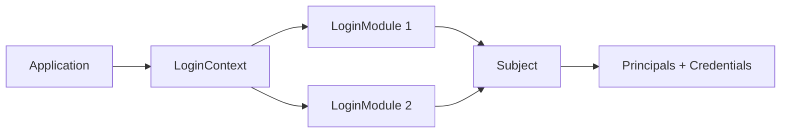

JAAS is older but still appears in:

- Kerberos/GSSAPI integration,
- enterprise app server internals,
- legacy Java systems,
- custom security modules,
- some Spring Security integrations,
- Hadoop/Kafka ecosystems historically.

### 7.2 JAAS in Modern App Design

Use JAAS directly only when:

- runtime or protocol requires it,
- you integrate with Kerberos or container realm,
- legacy system already depends on it,
- you write low-level Java SE authentication modules.

For new web apps, JAAS is usually not the primary API.

### 7.3 Important Distinction

JAAS `Subject` is not the same as Spring `Authentication`, Jakarta `SecurityContext`, or domain `User`.

Mapping must be explicit:

```txt
JAAS Subject -> application principal -> request security context -> domain user lookup
```

---

## 8. JAX-RS SecurityContext and Filters

JAX-RS exposes:

```java
@Context
SecurityContext securityContext;
```

and filters:

```java
@Provider
@Priority(Priorities.AUTHENTICATION)
public class AuthenticationFilter implements ContainerRequestFilter {
    @Override
    public void filter(ContainerRequestContext requestContext) {
        // extract token
        // verify token
        // set SecurityContext
    }
}
```

### 8.1 JAX-RS Custom Filter Pattern

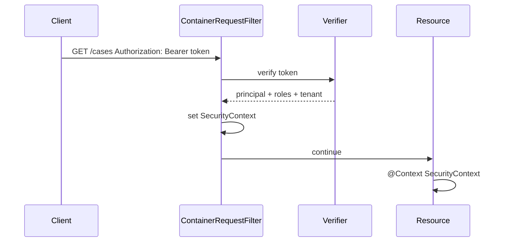

### 8.2 When This Pattern Is Good

Use JAX-RS filters when:

- you have a lightweight Jersey/RESTEasy app,
- you are not using Spring Security/Jakarta Security,
- auth requirement is narrow,
- you need custom resource server token verification,
- framework/runtime security integration is not available.

### 8.3 Risk

Custom filters are easy to get subtly wrong:

- filter order wrong,
- exception mapping inconsistent,
- roles not integrated with annotations,
- CORS/preflight broken,
- token validation incomplete,
- no session management,
- no central auth events,
- no async context propagation,
- every service reimplements verification differently.

Rule:

```txt
JAX-RS auth filter is acceptable for small, explicit boundaries; it is dangerous as an ad-hoc replacement for a full security architecture
```

---

## 9. MicroProfile JWT

MicroProfile JWT defines JWT authentication/authorization behavior for MicroProfile runtimes.

It is useful for:

- MicroProfile services,
- Jakarta EE microservices,
- JWT bearer token resource server behavior,
- injection of token claims,
- role mapping from token claims.

Conceptual usage:

```java
@Inject
JsonWebToken jwt;

@GET
@Path("/me")
public Me me() {
    return new Me(jwt.getSubject(), jwt.getIssuer());
}
```

### 9.1 Where It Fits

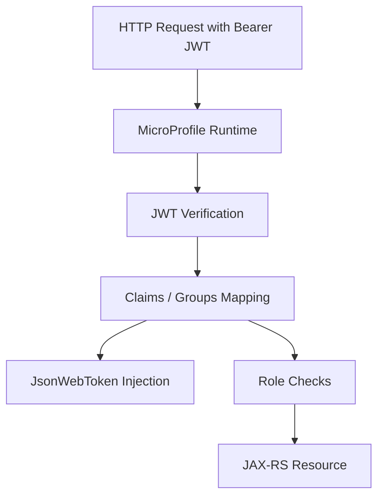

### 9.2 Production Considerations

Even with MicroProfile JWT, you still need to reason about:

- issuer,
- audience,
- key location/JWK set,
- accepted algorithms,
- groups/roles mapping,
- tenant claims,
- token type,
- clock skew,
- revocation strategy,
- error semantics,
- local custom claims validation.

Framework validates mechanics; you own semantics.

---

## 10. Identity Provider as External Authentication Authority

Modern enterprise apps often do not own primary user authentication. They delegate to an IdP.

Examples:

- Keycloak,
- Microsoft Entra ID,
- Okta,
- Auth0,
- Amazon Cognito,
- Google Identity,
- corporate SAML IdP.

The application becomes either:

- OIDC client / relying party,
- OAuth2 resource server,
- SAML service provider,
- token-consuming backend,
- identity-aware internal service.

### 10.1 IdP Boundary

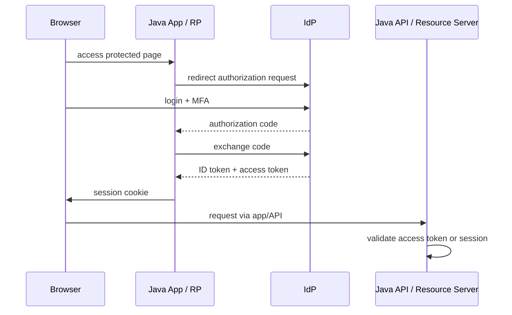

### 10.2 What App Still Owns

Delegating login to IdP does not remove app responsibility.

The app still owns:

- client configuration,
- redirect URI safety,
- state/nonce/PKCE handling,
- session creation,
- local account linking,
- tenant mapping,
- role/authority mapping,
- step-up trigger,
- logout semantics,
- audit events,
- recovery of local sessions after IdP incident.

Bad assumption:

```txt
We use SSO, so authentication is solved.
```

Better:

```txt
The IdP verifies the user; the app still decides how to bind that result to local account, tenant, session, and authority.
```

---

## 11. API Gateway Authentication

API gateway can authenticate at the edge.

Patterns:

- validate JWT at gateway,
- introspect opaque token,
- terminate OIDC session,
- inject identity headers,
- enforce coarse scopes,
- perform rate limiting,
- route based on client/tenant.

### 11.1 Gateway-Only Auth Risk

```txt
gateway authenticates request
internal service blindly trusts X-User-Id
internal service is accidentally exposed or reachable by another path
attacker sends X-User-Id directly
```

Gateway auth works only with boundary controls:

- internal network isolation,
- mTLS gateway-to-service,
- stripping incoming identity headers,
- signed identity context,
- service-side audience/tenant validation where needed,
- defense-in-depth for critical services.

### 11.2 Recommended Model

| Service Type | Gateway Auth Enough? | Service Should Verify? |
|---|---:|---:|
| Public high-risk API | No | Yes |
| Internal low-risk read API | Sometimes | Maybe signed context/mTLS |
| Tenant-sensitive API | Usually no | Yes, tenant invariant local |
| Admin API | No | Yes + step-up/assurance |
| Event ingestion | No | Yes, producer identity |

---

## 12. Service Mesh and mTLS

mTLS authenticates workloads/services using certificates.

It answers:

```txt
Which workload/service is connecting?
```

It does not automatically answer:

```txt
Which end user initiated this action?
```

### 12.1 Workload vs User Identity

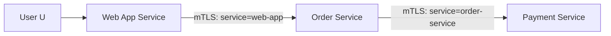

mTLS proves service identity on each hop. User identity must be propagated separately if needed.

```txt
workload identity != end-user identity
```

### 12.2 Common Bug

Service B receives user token, calls Service C using B's client credentials, and C performs user-specific action without knowing user context.

This is not necessarily wrong, but it must be modeled as:

```txt
service acting on behalf of user
```

not:

```txt
user directly authenticated to C
```

---

## 13. Where Authentication Happens by Architecture Style

### 13.1 Monolith with Server-Side UI

Typical:

```txt
browser -> Java app -> server session -> database
```

Recommended:

- Spring Security or Jakarta Security,
- server-side session,
- HttpOnly Secure SameSite cookie,
- CSRF protection,
- session fixation protection,
- local or IdP-backed login,
- explicit logout and session inventory.

### 13.2 SPA + API

Typical:

```txt
browser SPA -> API -> database
```

Risky if SPA stores long-lived tokens.

Better patterns:

- Backend-for-Frontend with server-side session,
- Authorization Code + PKCE,
- short-lived access token,
- refresh token rotation if browser receives refresh token,
- strict CORS/CSRF model,
- no access token in localStorage for high-risk apps where avoidable.

### 13.3 Mobile App + API

Typical:

```txt
mobile app -> OIDC -> API
```

Concerns:

- PKCE required,
- secure storage,
- device binding/risk,
- refresh token rotation,
- jailbreak/root detection as signal not absolute trust,
- app attestation if needed.

### 13.4 Machine-to-Machine

Typical:

```txt
service -> token endpoint -> API
```

Patterns:

- OAuth2 client credentials,
- mTLS client authentication,
- private_key_jwt,
- API keys for simpler cases,
- HMAC request signing for specific APIs,
- workload identity in cloud/service mesh.

### 13.5 Event-Driven Systems

Typical:

```txt
producer -> Kafka topic -> consumer
```

Authentication layers:

- producer authenticates to broker,
- consumer authenticates to broker,
- event payload carries historical actor context,
- consumer must not treat historical actor as current live session,
- audit must distinguish initiating actor and processing service.

---

## 14. Decision Matrix

| Requirement | Preferred Starting Point |
|---|---|
| Spring Boot web app with login | Spring Security form/OIDC login |
| Spring Boot REST API consuming JWT | Spring Security Resource Server |
| Jakarta EE app with form/custom login | Jakarta Security |
| Jakarta EE container-level custom auth | Jakarta Authentication/JASPIC |
| Lightweight Jersey service | JAX-RS filter or container integration |
| MicroProfile service consuming JWT | MicroProfile JWT |
| Enterprise SSO | OIDC/SAML via IdP + app session/resource server |
| Machine-to-machine | OAuth2 client credentials, mTLS, private_key_jwt, API key depending risk |
| Internal service identity | mTLS/workload identity + explicit user delegation if needed |
| Legacy Kerberos/enterprise auth | JAAS/GSSAPI/container integration |
| Multi-tenant SaaS | IdP/realm strategy + local tenant binding invariant |

---

## 15. The Biggest Architecture Choice: Stateful vs Stateless

Authentication landscape often collapses into this choice:

```txt
Do we keep session state server-side, or do we put authentication result into client-carried token?
```

### 15.1 Stateful Session

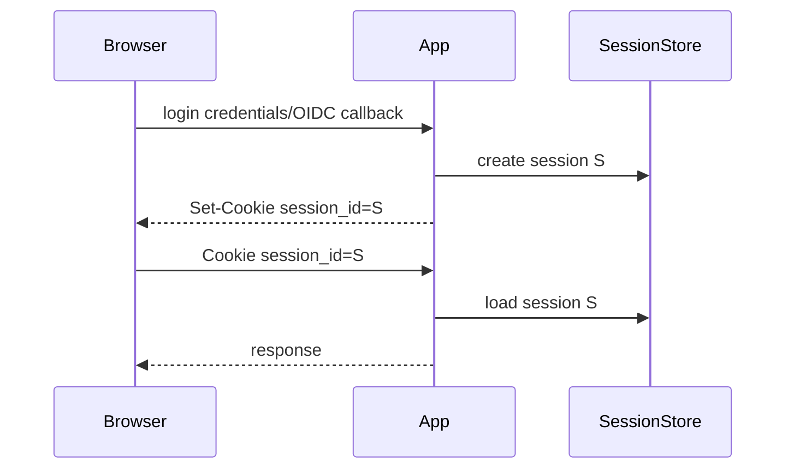

Pros:

- easy revocation,
- small cookie,
- safer for browser tokens,
- logout semantics clearer,
- can update server-side auth state.

Cons:

- session store dependency,
- horizontal scaling complexity,
- cross-region session strategy,
- gateway/API integration needs design.

### 15.2 Stateless Token

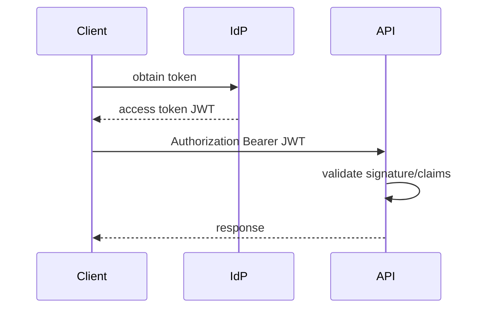

Pros:

- no session lookup per request,
- good for APIs,
- issuer/resource server separation,
- works across services.

Cons:

- revocation harder,
- token theft impact until expiry,
- claim staleness,
- key rotation complexity,
- every service must validate correctly,
- token size/logging risk.

Production answer is often hybrid:

```txt
browser session at edge/BFF + short-lived tokens for API/service calls + refresh/session state server-side
```

---

## 16. Authentication Context Mapping

Every stack maps authentication result differently.

| Concept | Spring Security | Jakarta Security | Servlet | JAX-RS | JAAS | MicroProfile JWT |
|---|---|---|---|---|---|---|
| Runtime identity | `Authentication` | caller principal | `Principal` | `SecurityContext` principal | `Subject` | `JsonWebToken` |
| Roles | `GrantedAuthority` | groups/roles | `isUserInRole` | `isUserInRole` | principals/permissions | groups claim |
| Context storage | `SecurityContextHolder` | container/CDI context | request/session | request context | subject context | runtime injection |
| Custom verifier | `AuthenticationProvider` | `IdentityStore`/mechanism | realm/filter | filter | `LoginModule` | runtime config/custom extension |
| Web integration | filter chain | container/Jakarta | container | JAX-RS runtime | indirect | MicroProfile runtime |

Mapping bug example:

```txt
JWT claim groups = [admin]
Spring converts to SCOPE_admin
method security checks ROLE_ADMIN
result: user authenticated but authorization fails or, worse, wrong mapping grants access
```

Authentication and authorization are separate, but context mapping connects them. Bad mapping creates security bugs.

---

## 17. Avoiding Domain Entity Principal

Temptation:

```java
public class User implements UserDetails {
    @Id String id;
    String email;
    String passwordHash;
    List<Role> roles;
}
```

This couples persistence, authentication, and domain model.

Problems:

- password hash may leak through principal serialization,
- lazy loading during auth context access,
- stale roles,
- tenant ambiguity,
- huge object in session,
- domain mutation affects security context,
- serialization issues in clustered sessions.

Better:

```java
public record SecurityPrincipal(
        String subjectId,
        String tenantId,
        String username,
        Set<String> authorities,
        int credentialVersion,
        AuthenticationAssurance assurance
) implements java.io.Serializable {}
```

Then domain user lookup is explicit:

```java
UserProfile profile = userProfileRepository.getBySubjectId(principal.subjectId());
```

Rule:

```txt
principal is an authentication projection, not the domain aggregate
```

---

## 18. Authentication Result Should Be Rich Enough

A boolean is not enough.

Minimum production authentication result:

```java
public record AuthenticationResult(
        String subjectId,
        String tenantId,
        ActorType actorType,
        String issuer,
        String clientId,
        Set<String> authorities,
        AuthenticationAssurance assurance,
        AuthenticatedSessionRef session,
        Map<String, String> attributes,
        java.time.Instant authenticatedAt
) {}

enum ActorType {
    HUMAN_USER,
    SERVICE_ACCOUNT,
    DEVICE,
    SYSTEM_JOB,
    ADMIN_IMPERSONATION
}

public record AuthenticatedSessionRef(
        String sessionId,
        String tokenId,
        String credentialVersion
) {}
```

Not every request has every field. But absence must be explicit, not accidental.

---

## 19. Framework Ownership Boundaries

Do not let multiple layers believe they own authentication unless carefully coordinated.

Bad architecture:

```txt
API gateway validates token
Spring Security also validates token differently
controller manually parses token again
repository trusts tenant header
```

This creates inconsistent identity.

Better:

```txt
one layer owns primary verification
other layers either verify defense-in-depth with same policy or consume a signed/bound context
application receives one canonical AuthenticatedActor
```

Decision:

| Layer | Responsibility |
|---|---|
| Gateway | coarse validation, rate limit, header stripping, routing |
| Application security framework | canonical authentication context |
| Domain service | business invariant requiring authenticated actor |
| Repository | tenant/data isolation using authenticated tenant context |
| Audit | durable record of actor/context |

---

## 20. Common Anti-Patterns in Java Authentication Landscape

### 20.1 Controller-Based Authentication Everywhere

```java
@GetMapping("/cases")
public List<Case> cases(@RequestHeader("Authorization") String auth) {
    Jwt jwt = jwtUtil.parse(auth);
    return service.cases(jwt.getSubject());
}
```

Problems:

- duplicated validation,
- missing consistent errors,
- no central audit,
- easy to forget on one endpoint,
- hard to test globally,
- no method security integration.

### 20.2 Trusting `X-User-Id`

```java
String userId = request.getHeader("X-User-Id");
```

Only acceptable if:

- public edge strips it,
- gateway recreates it,
- service reachable only from gateway,
- channel is authenticated,
- provenance is auditable.

### 20.3 JWT Without Audience

```txt
signature valid + not expired = accepted
```

Missing `aud` allows token substitution.

### 20.4 Domain Role Explosion in Token

Putting all permissions into JWT creates:

- large token,
- stale authorization,
- hard revocation,
- leaked business metadata,
- role mapping drift.

Keep token claims stable and minimal; fetch volatile authorization when needed.

### 20.5 Treating SSO Email as Stable Identity

Email can change, be reused, or be unverified depending provider.

Prefer:

```txt
issuer + subject as federated identity key
```

Then map to local account.

---

## 21. Implementation Selection Examples

### 21.1 Spring Boot Admin Portal

Requirement:

- browser UI,
- enterprise SSO,
- MFA at IdP,
- local roles,
- high-risk admin actions need step-up,
- audit requirements.

Recommended:

```txt
Spring Security OIDC Login
+ server-side session
+ local account/tenant mapping
+ method security
+ step-up marker/assurance check
+ session inventory
+ audit events
```

### 21.2 Public REST API for Partners

Requirement:

- machine clients,
- no browser,
- partner-specific credentials,
- request integrity important.

Options:

```txt
OAuth2 client credentials with private_key_jwt or mTLS
```

or for simpler controlled ecosystem:

```txt
API key id + HMAC request signing + replay nonce
```

Spring Security Resource Server is good if OAuth2/JWT is used.

### 21.3 Jakarta EE Internal Case Management

Requirement:

- Jakarta EE runtime,
- JAX-RS resources,
- database-backed users,
- internal SSO later.

Recommended:

```txt
Jakarta Security HttpAuthenticationMechanism + IdentityStore
```

or OIDC mechanism if runtime supports it.

### 21.4 Lightweight Jersey Service

Requirement:

- one resource server,
- validates internal JWT,
- no Spring/Jakarta Security.

Acceptable:

```txt
JAX-RS ContainerRequestFilter
+ trusted JWT library
+ strict issuer/audience/tenant validation
+ custom SecurityContext
```

But document the missing platform features.

---

## 22. Mermaid: Choosing the Stack

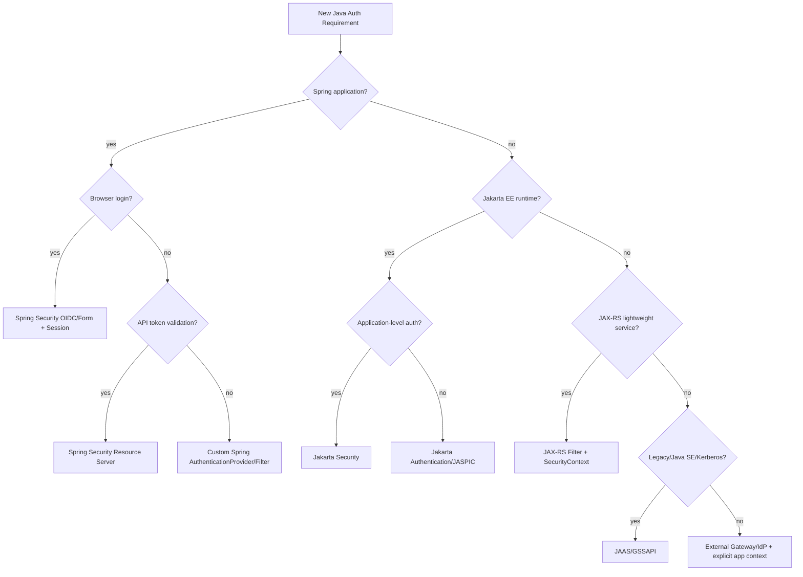

---

## 23. Testing Implication by Stack

| Stack | Test Focus |
|---|---|
| Spring Security | filter chain, `SecurityContext`, method security, login success/failure handlers |
| Jakarta Security | mechanism, identity store, container integration, role mapping |
| JAX-RS filter | priority/order, abort response, custom SecurityContext injection |
| MicroProfile JWT | claim validation, role mapping, issuer/key config |
| Gateway auth | header stripping, direct service bypass, signed context |
| mTLS | certificate identity, SAN mapping, rotation, failure mode |
| JAAS | LoginModule behavior, Subject principal mapping |

Security tests should verify the boundary, not only service method behavior.

Example Spring MockMVC intent:

```java
mockMvc.perform(get("/admin"))
       .andExpect(status().isUnauthorized());
```

But also test token semantic rejection:

```txt
token signed but wrong audience -> 401
token valid but wrong tenant -> 403 or 401 depending model
ID token presented to API -> 401
expired token -> 401
```

---

## 24. Operational Implication by Stack

Authentication choice affects operations.

| Concern | Stateful Session | JWT Resource Server | OIDC Login | mTLS |
|---|---|---|---|---|
| Revocation | Easy if server-side | Harder until expiry | Session + IdP logout complexity | Certificate revocation/rotation |
| Outage behavior | Session store critical | JWK/cache critical | IdP critical for new login | CA/control plane critical |
| Observability | session events | token validation failures | redirect/callback events | cert handshake failures |
| Key rotation | session signing/encryption maybe | JWK rotation | client secret/key rotation | cert rotation |
| Incident response | purge sessions | revoke tokens/families | disable client/user/session | revoke cert/workload |

Design must include runbooks, not only code.

---

## 25. Recommended Layered Architecture for Serious Java Apps

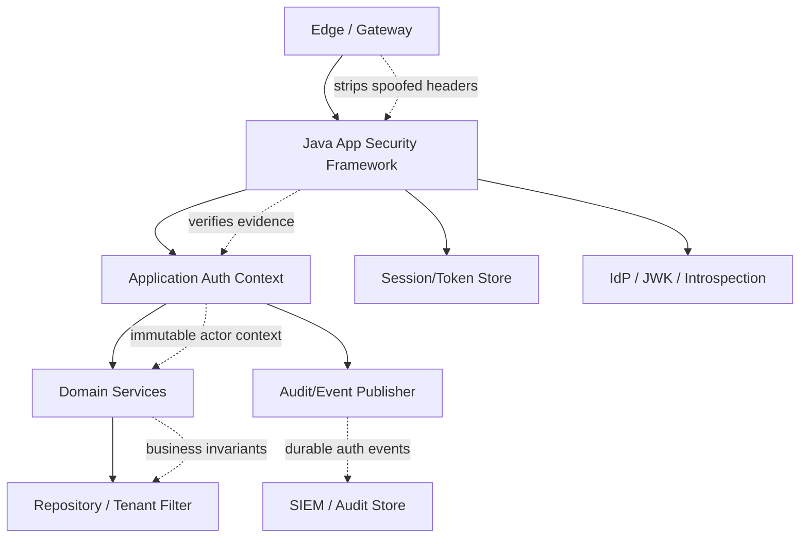

Responsibilities:

1. **Edge** protects exposure, coarse abuse, header hygiene.
2. **Security framework** verifies authentication evidence.
3. **Auth context mapper** converts framework object to application principal.
4. **Domain layer** consumes actor context explicitly.
5. **Repository layer** enforces tenant/data isolation.
6. **Audit layer** records durable actor/session/tenant events.
7. **Operations** can revoke, rotate, detect, and recover.

---

## 26. Java Package Structure Recommendation

A production codebase should not scatter auth logic everywhere.

Example:

```txt
com.acme.identity
  authn
    api
      LoginController.java
      OidcCallbackController.java
    application
      AuthenticatePasswordUseCase.java
      RefreshTokenUseCase.java
      LogoutUseCase.java
      StepUpUseCase.java
    domain
      Account.java
      Credential.java
      AuthenticatorEnrollment.java
      AuthenticationResult.java
      AuthenticationAssurance.java
      LoginAttempt.java
      Session.java
    infrastructure
      spring
        SecurityConfig.java
        AppAuthenticationProvider.java
        JwtAuthenticationConverter.java
      jakarta
        AppHttpAuthenticationMechanism.java
        DatabaseIdentityStore.java
      token
        JwtVerifier.java
        OpaqueTokenIntrospector.java
      session
        RedisSessionRepository.java
      audit
        AuthenticationAuditPublisher.java
```

Rule:

```txt
framework integration is infrastructure; authentication concepts are domain/application concerns
```

Do not let `UserDetails`, `Authentication`, or `JsonWebToken` become your core domain model.

---

## 27. What We Will Use in Later Parts

This series will use multiple implementation perspectives:

- Spring Security for servlet/filter/authentication provider/resource server patterns,
- Jakarta Security for standard Jakarta EE model,
- JAX-RS filters for low-level understanding,
- Keycloak/OIDC for federated identity,
- Redis/PostgreSQL only where needed for session/token/account state,
- mTLS/API key/HMAC for machine authentication,
- event-driven identity propagation for Kafka-style systems.

But the invariant remains framework-neutral:

```txt
extract -> verify -> bind -> contextualize -> expose -> propagate safely
```

---

## 28. Latihan

### Latihan 1 — Stack Identification

Ambil satu aplikasi Java yang pernah kamu kerjakan. Jawab:

- Runtime-nya Spring, Jakarta EE, atau lightweight JAX-RS?
- Siapa yang memiliki primary authentication pipeline?
- Apakah ada gateway yang juga melakukan auth?
- Apakah aplikasi memvalidasi token sendiri?
- Apakah principal yang dipakai domain berasal dari framework object langsung?
- Apakah tenant berasal dari token/session atau request header?

### Latihan 2 — Framework Boundary Diagram

Gambar diagram:

```txt
client -> gateway -> Java security framework -> controller/resource -> service -> repository -> audit
```

Tandai di mana:

- credential/token diekstrak,
- signature/password diverifikasi,
- principal dibuat,
- tenant dipilih,
- roles/authorities dipetakan,
- audit ditulis,
- context keluar ke async/event.

### Latihan 3 — Decision Matrix

Pilih stack untuk tiga kasus:

1. Admin portal Spring Boot dengan Microsoft Entra ID.
2. Jakarta EE JAX-RS service yang menerima JWT dari Keycloak.
3. Partner API machine-to-machine dengan requirement request integrity.

Untuk masing-masing, tulis:

- pattern,
- framework/library,
- trust boundary,
- token/session strategy,
- revocation story,
- failure mode utama.

---

## 29. Ringkasan

Java authentication landscape tidak perlu membingungkan jika dilihat sebagai pipeline.

Framework berbeda, tetapi problem tetap sama:

```txt
extract evidence -> verify evidence -> build identity context -> bind it to runtime boundary -> consume safely -> propagate intentionally
```

Kesimpulan praktis:

- Spring app: mulai dari Spring Security, jangan bypass filter chain tanpa alasan kuat.
- Jakarta EE app: mulai dari Jakarta Security, turun ke Jakarta Authentication/JASPIC hanya jika perlu container SPI.
- Lightweight JAX-RS: filter boleh, tetapi harus sadar semua invariant yang harus dibangun sendiri.
- Microservices: JWT/mTLS/gateway bukan pengganti threat model; semuanya boundary yang harus diverifikasi.
- IdP menyelesaikan login utama, bukan local account binding, session, tenant, audit, dan authorization mapping.

Part berikutnya akan masuk ke Servlet Filter Chain Authentication: request lifecycle, filter ordering, security context, thread boundary, async pitfalls, dan implementasi filter autentikasi yang benar.

---

## References

- Spring Security Reference — Servlet Architecture: https://docs.spring.io/spring-security/reference/servlet/architecture.html
- Spring Security Reference — Servlet Authentication Architecture: https://docs.spring.io/spring-security/reference/servlet/authentication/architecture.html
- Jakarta Security 4.0 Specification: https://jakarta.ee/specifications/security/4.0/jakarta-security-spec-4.0
- Jakarta Authentication 3.1 Specification: https://jakarta.ee/specifications/authentication/3.1/
- Oracle JAAS Reference Guide: https://docs.oracle.com/en/java/javase/23/security/java-authentication-and-authorization-service-jaas-reference-guide.html
- MicroProfile JWT Specification: https://microprofile.io/specifications/jwt/
- Jersey Documentation — Security: https://eclipse-ee4j.github.io/jersey.github.io/documentation/latest/security.html
- NIST SP 800-63-4 Digital Identity Guidelines: https://pages.nist.gov/800-63-4/
