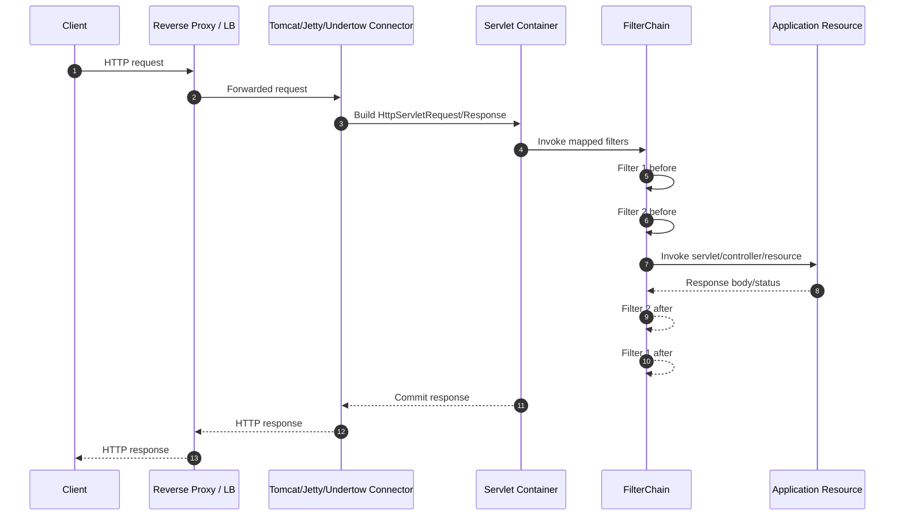
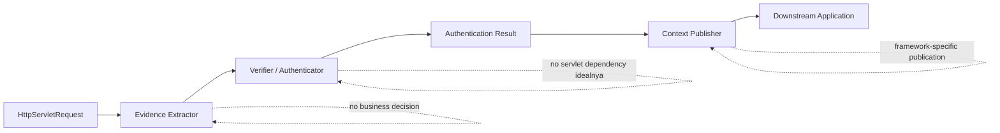
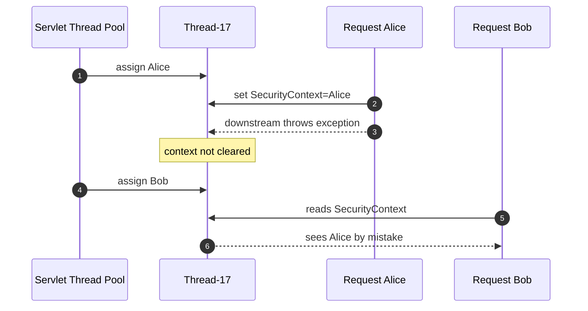
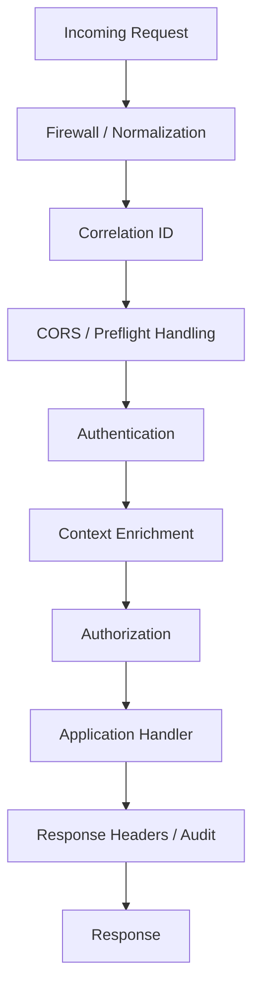
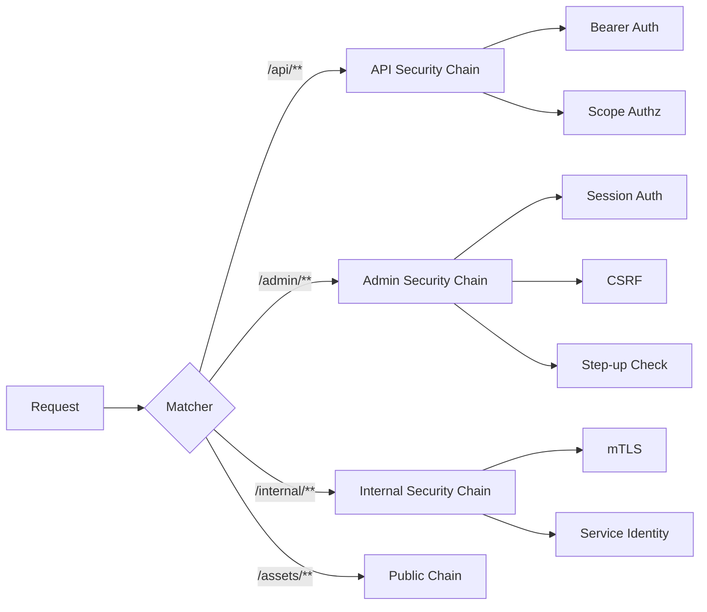
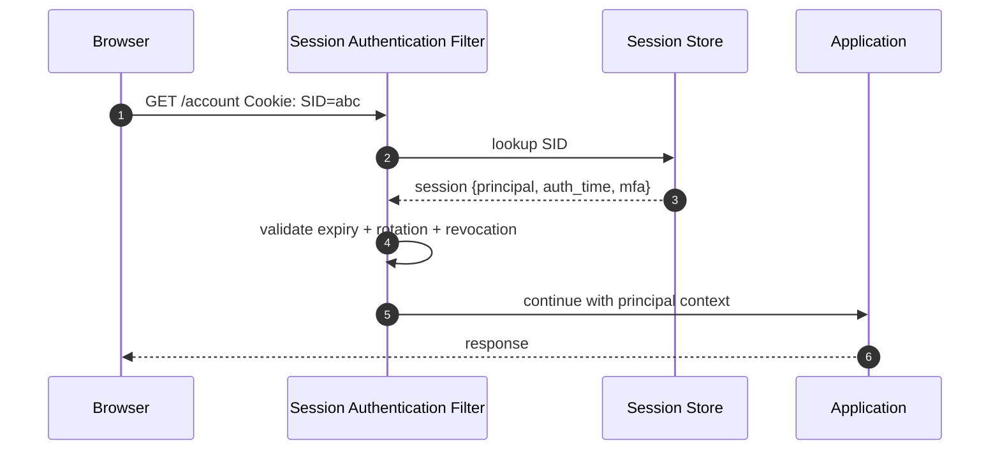
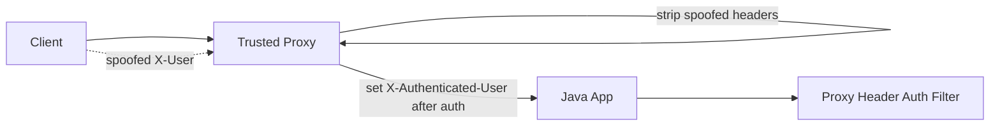

# Part 005 — Servlet Filter Chain Authentication

> Target part ini: kita memahami autentikasi di level **HTTP request pipeline**, bukan di level anotasi controller. Servlet filter chain adalah tempat autentikasi web Java paling sering dimulai, baik kita memakai Spring Security, Jakarta Security, JAX-RS, custom filter, API gateway adapter, maupun legacy servlet application.

Autentikasi web Java sering terlihat seperti ini:

```java
@GetMapping("/me")
public UserProfile me(@AuthenticationPrincipal CurrentUser user) {
    return profileService.getProfile(user.id());
}
```

Kode itu nyaman, tetapi ia menyembunyikan hal terpenting:

```txt
bagaimana user bisa muncul di situ?
```

Jawabannya hampir selalu melewati pipeline seperti ini:

```txt
client -> connector -> servlet container -> filter chain -> security filter -> application handler
```

Kalau pipeline ini tidak kita kuasai, kita akan membuat bug yang sulit dilihat:

- endpoint tertentu tidak terkena filter security,
- filter JWT jalan setelah authorization filter,
- CORS preflight dipaksa autentikasi,
- session dibuat untuk API stateless,
- `SecurityContext` bocor ke request lain,
- request async kehilangan identity,
- error dispatch memproses auth dua kali,
- public path salah matching,
- reverse proxy header dipercaya mentah-mentah,
- custom filter mengembalikan 403 padahal seharusnya 401.

Part ini membedah filter chain dari bawah: Servlet dulu, baru pattern autentikasinya.

---

## 1. Problem yang Sebenarnya

Framework security bukan titik awal. Titik awalnya adalah pertanyaan ini:

> Saat HTTP request tiba, pada titik mana sistem berhak mengatakan “request ini berasal dari principal X”?

Di aplikasi Servlet, titik paling natural adalah **sebelum request mencapai resource**.

Resource bisa berupa:

- Servlet,
- Spring MVC controller,
- JAX-RS resource,
- static file,
- error page,
- actuator endpoint,
- GraphQL endpoint,
- upload endpoint,
- reverse-proxied handler.

Filter memungkinkan kita memeriksa, membungkus, menghentikan, atau meneruskan request sebelum resource dipanggil. Jakarta Servlet API mendefinisikan `Filter` sebagai objek yang melakukan filtering terhadap request, response, atau keduanya. `FilterChain` memungkinkan filter memanggil filter berikutnya atau resource akhir.

Mental model-nya:

```txt
Filter bukan “middleware tambahan”.
Filter adalah gerbang request di dalam Servlet container.
```

Untuk autentikasi, filter chain memegang tiga tanggung jawab:

1. **Extract evidence** dari request.
   - cookie,
   - Authorization header,
   - client certificate,
   - session id,
   - form credential,
   - API key,
   - signed request header.

2. **Evaluate evidence**.
   - verifikasi password,
   - validasi token,
   - lookup session,
   - cek signature,
   - cek expiry,
   - cek revocation,
   - cek tenant/audience/issuer.

3. **Publish local result**.
   - set request principal,
   - set `SecurityContext`,
   - wrap request,
   - attach attributes,
   - continue or stop chain.

Jangan campur tiga hal ini secara sembarangan. Kode filter yang baik memiliki boundary yang jelas antara **parsing**, **verification**, dan **context publication**.

---

## 2. Servlet Pipeline: Dari Socket ke Handler

Secara sederhana:



Yang penting:

- filter dipanggil **berurutan**,
- filter dapat menghentikan request dengan tidak memanggil `chain.doFilter`,
- filter dapat memodifikasi request/response,
- filter dapat bekerja sebelum dan sesudah downstream,
- filter ordering adalah bagian dari security design,
- filter mapping menentukan request mana yang terkena filter.

Authentication filter biasanya melakukan pekerjaan sebelum `chain.doFilter`:

```java
public final class ExampleAuthenticationFilter implements Filter {
    @Override
    public void doFilter(ServletRequest rawRequest,
                         ServletResponse rawResponse,
                         FilterChain chain) throws IOException, ServletException {
        HttpServletRequest request = (HttpServletRequest) rawRequest;
        HttpServletResponse response = (HttpServletResponse) rawResponse;

        AuthenticationEvidence evidence = extractEvidence(request);
        AuthenticationResult result = verifier.verify(evidence);

        if (result.failed()) {
            response.setStatus(HttpServletResponse.SC_UNAUTHORIZED);
            return;
        }

        try {
            publishAuthentication(request, result);
            chain.doFilter(request, response);
        } finally {
            clearAuthentication();
        }
    }
}
```

Struktur `try/finally` bukan kosmetik. Ia adalah invariant.

> Authentication context yang dipasang untuk request harus selalu dibersihkan setelah request selesai, bahkan ketika downstream throw exception.

---

## 3. Filter sebagai Authentication Boundary

Filter autentikasi bukan tempat untuk menaruh semua logic security. Ia adalah adapter dari HTTP request menuju authentication subsystem.

Boundary yang sehat:



Pisahkan layer seperti ini:

| Layer | Tugas | Tidak boleh melakukan |
|---|---|---|
| Filter | adaptasi HTTP pipeline | query bisnis berat, policy authorization domain |
| Evidence extractor | membaca cookie/header/body/cert | menetapkan user valid |
| Verifier | membuktikan credential/token/session | tahu detail servlet container berlebihan |
| Context publisher | menaruh hasil di context lokal | verifikasi credential lagi |
| Downstream app | memakai principal yang sudah dipublish | membaca password/token mentah lagi |

Desain yang buruk:

```java
// Bad: filter melakukan semua hal, sulit dites, sulit diganti, rawan bug boundary
String token = req.getHeader("Authorization").substring(7);
Claims claims = Jwts.parser().setSigningKey(secret).parseClaimsJws(token).getBody();
User user = userRepository.findByEmail(claims.getSubject());
if (user.isAdmin()) {
    req.setAttribute("admin", true);
}
chain.doFilter(req, res);
```

Desain yang lebih baik:

```java
AuthenticationEvidence evidence = bearerTokenExtractor.extract(request);
AuthenticationResult result = tokenAuthenticator.authenticate(evidence);
securityContextPublisher.publish(result);
chain.doFilter(request, response);
```

Filter harus kecil karena filter berada di jalur request paling panas dan paling sensitif.

---

## 4. `chain.doFilter`: Titik yang Sering Diremehkan

`chain.doFilter(request, response)` adalah titik transisi:

```txt
before chain.doFilter  -> kita masih bisa mencegah resource dipanggil
inside downstream      -> controller/resource/service berjalan
finally after chain    -> kita membersihkan context, audit, metric, header final
```

Pattern umum:

```java
try {
    before(request, response);
    chain.doFilter(request, response);
} finally {
    after(request, response);
}
```

Untuk auth:

```java
try {
    AuthenticationResult result = authenticate(request);
    contextHolder.set(result);
    chain.doFilter(request, response);
} finally {
    contextHolder.clear();
}
```

Kesalahan umum:

```java
contextHolder.set(result);
chain.doFilter(request, response);
contextHolder.clear(); // tidak dieksekusi kalau downstream throw exception
```

Bug ini bisa menyebabkan principal request A terlihat di request B jika thread container direuse dan context tersimpan di `ThreadLocal`.

Servlet container memakai thread pool. Thread bukan milik request secara permanen. Thread hari ini memproses Alice, setelah selesai bisa memproses Bob.



Ini bukan bug teoritis. Ini adalah alasan framework security serius mengurus clear-context di filter boundary.

---

## 5. Minimal Authentication Filter dari Nol

Kita buat filter sederhana untuk Bearer token. Ini bukan rekomendasi produksi final, tetapi alat belajar.

### 5.1 Domain Model

```java
public sealed interface AuthenticationEvidence
        permits BearerTokenEvidence, NoEvidence {
}

public record BearerTokenEvidence(String token) implements AuthenticationEvidence {
    public BearerTokenEvidence {
        if (token == null || token.isBlank()) {
            throw new IllegalArgumentException("token must not be blank");
        }
    }
}

public enum NoEvidence implements AuthenticationEvidence {
    INSTANCE
}

public record AuthenticatedPrincipal(
        String subject,
        String tenantId,
        Set<String> scopes,
        Instant authenticatedAt,
        String method
) {
}

public sealed interface AuthenticationResult
        permits AuthenticationResult.Success, AuthenticationResult.Failure {

    record Success(AuthenticatedPrincipal principal) implements AuthenticationResult {
    }

    record Failure(String code, String safeMessage) implements AuthenticationResult {
    }
}
```

Catatan desain:

- `subject` bukan email. Email bisa berubah.
- `tenantId` explicit, jangan disimpulkan belakangan dari path saja.
- `scopes` bukan authorization final, tetapi input untuk authorization.
- `method` penting untuk audit dan step-up.
- failure message harus aman dari account/token enumeration.

### 5.2 Extractor

```java
public final class BearerTokenExtractor {
    public AuthenticationEvidence extract(HttpServletRequest request) {
        String header = request.getHeader("Authorization");
        if (header == null || header.isBlank()) {
            return NoEvidence.INSTANCE;
        }

        if (!header.regionMatches(true, 0, "Bearer ", 0, "Bearer ".length())) {
            return NoEvidence.INSTANCE;
        }

        String token = header.substring("Bearer ".length()).trim();
        if (token.isEmpty()) {
            return NoEvidence.INSTANCE;
        }

        return new BearerTokenEvidence(token);
    }
}
```

Hal-hal kecil yang penting:

- Jangan `substring(7)` sebelum memastikan prefix ada.
- Jangan log token.
- Jangan menerima banyak format tanpa alasan.
- Jangan menerima token dari query parameter untuk API biasa.
- Jangan normalize token terlalu agresif.

### 5.3 Authenticator

```java
public interface TokenAuthenticator {
    AuthenticationResult authenticate(AuthenticationEvidence evidence);
}

public final class OpaqueTokenAuthenticator implements TokenAuthenticator {
    private final TokenIntrospectionClient introspectionClient;

    public OpaqueTokenAuthenticator(TokenIntrospectionClient introspectionClient) {
        this.introspectionClient = Objects.requireNonNull(introspectionClient);
    }

    @Override
    public AuthenticationResult authenticate(AuthenticationEvidence evidence) {
        if (evidence == NoEvidence.INSTANCE) {
            return new AuthenticationResult.Failure(
                    "missing_credential",
                    "Authentication required"
            );
        }

        if (!(evidence instanceof BearerTokenEvidence bearer)) {
            return new AuthenticationResult.Failure(
                    "unsupported_credential",
                    "Authentication required"
            );
        }

        TokenIntrospectionResult token = introspectionClient.introspect(bearer.token());
        if (!token.active()) {
            return new AuthenticationResult.Failure(
                    "invalid_token",
                    "Authentication required"
            );
        }

        if (token.expiresAt().isBefore(Instant.now())) {
            return new AuthenticationResult.Failure(
                    "expired_token",
                    "Authentication required"
            );
        }

        AuthenticatedPrincipal principal = new AuthenticatedPrincipal(
                token.subject(),
                token.tenantId(),
                token.scopes(),
                Instant.now(),
                "bearer-token"
        );

        return new AuthenticationResult.Success(principal);
    }
}
```

Di production, `TokenAuthenticator` harus menangani:

- issuer validation,
- audience validation,
- expiry dan not-before,
- clock skew terbatas,
- key rotation bila JWT,
- revocation bila opaque/reference token,
- scope/tenant binding,
- error taxonomy,
- cache yang aman,
- telemetry.

Part ini belum masuk JWT detail. Kita akan bahas di Part 016–018.

### 5.4 Context Holder Minimal

```java
public final class CurrentAuthentication {
    private static final ThreadLocal<AuthenticatedPrincipal> CURRENT = new ThreadLocal<>();

    private CurrentAuthentication() {
    }

    public static Optional<AuthenticatedPrincipal> get() {
        return Optional.ofNullable(CURRENT.get());
    }

    public static void set(AuthenticatedPrincipal principal) {
        CURRENT.set(Objects.requireNonNull(principal));
    }

    public static void clear() {
        CURRENT.remove();
    }
}
```

Ini hanya contoh untuk memahami mekanisme. Dalam Spring Security, gunakan `SecurityContextHolder`, bukan membuat global context sendiri.

### 5.5 Filter

```java
public final class BearerAuthenticationFilter implements Filter {
    private final BearerTokenExtractor extractor;
    private final TokenAuthenticator authenticator;

    public BearerAuthenticationFilter(BearerTokenExtractor extractor,
                                      TokenAuthenticator authenticator) {
        this.extractor = Objects.requireNonNull(extractor);
        this.authenticator = Objects.requireNonNull(authenticator);
    }

    @Override
    public void doFilter(ServletRequest rawRequest,
                         ServletResponse rawResponse,
                         FilterChain chain) throws IOException, ServletException {
        HttpServletRequest request = (HttpServletRequest) rawRequest;
        HttpServletResponse response = (HttpServletResponse) rawResponse;

        AuthenticationEvidence evidence = extractor.extract(request);
        AuthenticationResult result = authenticator.authenticate(evidence);

        if (result instanceof AuthenticationResult.Failure failure) {
            response.setStatus(HttpServletResponse.SC_UNAUTHORIZED);
            response.setHeader("WWW-Authenticate", "Bearer");
            response.setContentType("application/json");
            response.getWriter().write("{\"error\":\"unauthorized\"}");
            return;
        }

        AuthenticationResult.Success success = (AuthenticationResult.Success) result;

        try {
            CurrentAuthentication.set(success.principal());
            chain.doFilter(request, response);
        } finally {
            CurrentAuthentication.clear();
        }
    }
}
```

Invariant:

```txt
If authentication succeeds, context must be published before downstream.
If downstream finishes or fails, context must be cleared.
If authentication fails, downstream must not run.
```

---

## 6. Public Endpoint vs Optional Authentication

Tidak semua endpoint harus authenticated.

Ada tiga kategori:

| Kategori | Contoh | Behavior |
|---|---|---|
| Required authentication | `/api/me`, `/api/orders` | credential missing/invalid → 401 |
| Public | `/health`, `/login`, `/assets/**` | tidak perlu auth, idealnya skip heavy auth |
| Optional authentication | homepage personalisasi, product page | kalau credential valid, publish user; kalau tidak ada credential, lanjut anonymous |

Optional authentication sering jadi sumber bug.

Buruk:

```txt
Authorization: Bearer invalid-token
-> dianggap anonymous
-> request tetap lanjut
```

Untuk optional auth, bedakan:

```txt
no credential       -> anonymous allowed
invalid credential  -> authentication failure
expired credential  -> authentication failure or explicit refresh flow
```

Pattern:

```java
AuthenticationEvidence evidence = extractor.extract(request);

if (evidence == NoEvidence.INSTANCE && routePolicy.isOptional(request)) {
    chain.doFilter(request, response);
    return;
}

AuthenticationResult result = authenticator.authenticate(evidence);
```

Security invariant:

> “Tidak membawa credential” berbeda dari “membawa credential palsu/rusak/kadaluarsa”.

Kalau invalid token dianggap anonymous, attacker bisa memaksa downgrade identity dan mengeksploitasi logic yang berbeda antara anonymous dan authenticated user.

---

## 7. 401 vs 403 di Filter Chain

Kesalahan umum: semua kegagalan security dikembalikan sebagai 403.

Gunakan mental model:

```txt
401 Unauthorized  = belum berhasil diautentikasi untuk resource itu
403 Forbidden     = sudah dikenali, tetapi tidak boleh melakukan aksi itu
```

Contoh:

| Situasi | Status |
|---|---:|
| Tidak ada bearer token untuk endpoint protected | 401 |
| Bearer token invalid | 401 |
| Session expired | 401 atau redirect login untuk browser flow |
| User valid tapi tidak punya role/scope | 403 |
| User valid tapi tenant mismatch | biasanya 403 atau 404 tergantung disclosure policy |
| CSRF token missing di session browser | 403 |

Untuk API bearer token, `WWW-Authenticate` header penting agar client memahami challenge.

Contoh minimal:

```http
HTTP/1.1 401 Unauthorized
WWW-Authenticate: Bearer realm="api"
Content-Type: application/json

{"error":"unauthorized"}
```

Jangan terlalu detail dalam response:

```json
{"error":"token_expired_because_user_123_was_revoked"}
```

Itu bocor.

Lebih aman:

```json
{"error":"unauthorized"}
```

Detail internal masuk audit log, bukan response publik.

---

## 8. Filter Ordering: Auth Sebelum Authz

Filter order adalah arsitektur.

Urutan yang masuk akal untuk request API:

```txt
request normalization / firewall
correlation id
CORS
authentication
request context enrichment
authorization
application
response security headers
```

Diagram:



Kenapa CORS sering sebelum auth?

- Browser preflight `OPTIONS` tidak membawa credential aplikasi seperti bearer token biasa.
- Kalau preflight dipaksa auth, browser tidak pernah sampai ke actual request.
- Tapi CORS bukan authorization. CORS hanya browser boundary.

Kenapa authorization harus setelah authentication?

- Authorization butuh tahu siapa principal-nya.
- Kalau authz berjalan dulu, ia hanya bisa melihat anonymous atau stale context.

Kenapa audit bisa sebelum dan sesudah?

- Before: buat correlation id, start time, attempt metadata.
- After: status akhir, principal final, failure reason, latency.

---

## 9. Multiple Filter Chains

Aplikasi production jarang punya satu policy untuk semua path.

Contoh:

| Path | Chain | Auth style |
|---|---|---|
| `/api/**` | API chain | bearer token/JWT/opaque |
| `/admin/**` | Admin chain | session + MFA + CSRF |
| `/actuator/health` | Health chain | public/infra restricted |
| `/internal/**` | Internal chain | mTLS + service token |
| `/login` | Login chain | unauthenticated form endpoint |

Mental model:



Failure mode:

```txt
/admin/** accidentally matches /api/** first
```

Akibat:

- admin endpoint terkena bearer token policy, bukan session + MFA,
- CSRF tidak aktif,
- redirect login tidak jalan,
- kontrol admin melemah.

Rule:

> Matcher yang lebih spesifik harus dievaluasi sebelum matcher yang lebih umum.

Di Spring Security, ini muncul sebagai multiple `SecurityFilterChain` dengan `securityMatcher` dan `@Order`.

---

## 10. Dispatcher Type: REQUEST, FORWARD, INCLUDE, ERROR, ASYNC

Servlet bukan hanya request normal.

Dispatcher type umum:

| Dispatcher type | Makna | Auth implication |
|---|---|---|
| `REQUEST` | request client biasa | autentikasi utama |
| `FORWARD` | server-side forward | hati-hati double-processing |
| `INCLUDE` | include resource | jarang untuk REST modern |
| `ERROR` | error dispatch | jangan bocorkan error, jangan auth ulang sembarang |
| `ASYNC` | async continuation | context propagation harus jelas |

Kesalahan umum:

- Filter jalan dua kali pada `ERROR` dispatch dan menulis response lagi.
- Filter tidak jalan pada async continuation padahal resource membaca context.
- Error page public malah membaca principal stale.

Dalam custom filter, periksa dispatcher type bila perlu:

```java
DispatcherType type = request.getDispatcherType();
if (type != DispatcherType.REQUEST) {
    chain.doFilter(request, response);
    return;
}
```

Namun jangan asal skip. Untuk beberapa aplikasi, error dispatch tetap perlu security context agar audit/error renderer tahu principal. Yang penting adalah keputusan eksplisit.

Checklist:

- Apakah filter harus berjalan pada `ERROR`?
- Apakah filter idempotent jika dipanggil lebih dari sekali?
- Apakah filter bisa mengenali context yang sudah dipublish?
- Apakah async task membawa context secara aman?
- Apakah error response tidak menulis credential/token?

---

## 11. Once-Per-Request Pattern

Banyak security filter harus berjalan sekali per logical request.

Problem:

```txt
REQUEST dispatch -> filter runs
FORWARD dispatch -> filter runs again
ERROR dispatch   -> filter runs again
```

Kalau filter tidak idempotent:

- audit event dobel,
- token introspection dobel,
- login attempt count naik dobel,
- response header ditulis ulang,
- context ditimpa.

Pattern sederhana:

```java
public abstract class OncePerRequestFilterLike implements Filter {
    private static final String ALREADY_FILTERED_SUFFIX = ".FILTERED";

    @Override
    public final void doFilter(ServletRequest request,
                               ServletResponse response,
                               FilterChain chain) throws IOException, ServletException {
        String key = getClass().getName() + ALREADY_FILTERED_SUFFIX;

        if (request.getAttribute(key) != null) {
            chain.doFilter(request, response);
            return;
        }

        request.setAttribute(key, Boolean.TRUE);
        doFilterOnce((HttpServletRequest) request, (HttpServletResponse) response, chain);
    }

    protected abstract void doFilterOnce(HttpServletRequest request,
                                         HttpServletResponse response,
                                         FilterChain chain) throws IOException, ServletException;
}
```

Namun jangan menjadikan once-per-request sebagai pelarian. Tetap pikirkan dispatcher type dan async boundary.

---

## 12. Request Attribute vs ThreadLocal vs Session

Hasil authentication bisa dipublish di beberapa tempat.

| Storage | Scope | Kelebihan | Risiko |
|---|---|---|---|
| Request attribute | satu request | jelas, mudah dibersihkan otomatis | harus dipassing/diambil manual |
| ThreadLocal | satu thread | mudah diakses dari mana saja | bocor jika tidak clear, hilang di async |
| HttpSession | lintas request browser | cocok session login | stateful, fixation, distributed store |
| Token | dibawa client | stateless-ish | revocation sulit, leak berdampak besar |

Untuk filter custom minimal, request attribute lebih aman daripada ThreadLocal jika downstream bisa menerima `HttpServletRequest`.

```java
request.setAttribute("currentPrincipal", principal);
```

Tapi framework seperti Spring Security memakai `SecurityContextHolder` agar service/controller bisa mengakses principal tanpa passing request.

Rule:

> Semakin global akses context, semakin ketat lifecycle cleanup-nya.

---

## 13. Wrapping `HttpServletRequest`

Servlet API punya konsep principal di request:

```java
request.getUserPrincipal();
request.getRemoteUser();
request.isUserInRole("ADMIN");
```

Custom filter bisa wrap request agar method ini mengembalikan principal custom.

```java
public final class AuthenticatedRequest extends HttpServletRequestWrapper {
    private final AuthenticatedPrincipal principal;

    public AuthenticatedRequest(HttpServletRequest request,
                                AuthenticatedPrincipal principal) {
        super(request);
        this.principal = principal;
    }

    @Override
    public Principal getUserPrincipal() {
        return () -> principal.subject();
    }

    @Override
    public String getRemoteUser() {
        return principal.subject();
    }

    @Override
    public boolean isUserInRole(String role) {
        return principal.scopes().contains("role:" + role);
    }
}
```

Filter:

```java
HttpServletRequest wrapped = new AuthenticatedRequest(request, success.principal());
chain.doFilter(wrapped, response);
```

Kapan berguna?

- aplikasi legacy memakai `getUserPrincipal`,
- framework non-Spring membaca principal dari Servlet API,
- integrasi JAX-RS/SecurityContext,
- migrasi bertahap.

Kapan berbahaya?

- role mapping terlalu sederhana,
- tenant tidak dibawa,
- downstream mengira `isUserInRole` adalah authorization final,
- wrapper tidak dipakai karena filter memanggil `chain.doFilter(request, response)` bukan wrapped request.

---

## 14. Authentication Filter untuk Browser Session

Bearer token bukan satu-satunya. Browser app sering memakai session cookie.

Flow:



Filter session melakukan:

- baca cookie id,
- validasi format cookie,
- lookup session store,
- cek expiry idle/absolute,
- cek revoked/logout,
- cek user/account status minimal,
- publish principal,
- optional rotate session id saat event tertentu,
- clear context.

Pseudo-code:

```java
SessionId sid = cookieExtractor.extract(request);
if (sid.missing()) {
    challengeOrAnonymous(request, response, chain);
    return;
}

SessionRecord session = sessionStore.find(sid.value())
        .orElseThrow(() -> new UnauthenticatedException());

if (session.isExpired(clock.instant()) || session.revoked()) {
    sessionStore.delete(sid.value());
    unauthorized(response);
    return;
}

try {
    CurrentAuthentication.set(session.principal());
    chain.doFilter(request, response);
} finally {
    CurrentAuthentication.clear();
}
```

Session detail dibahas di Part 013–015. Di sini yang penting: session auth tetap filter-chain problem.

---

## 15. Authentication Filter untuk Login Endpoint

Login endpoint berbeda dari request protected biasa.

Protected request:

```txt
request membawa credential yang sudah diterbitkan sebelumnya
contoh: session id, bearer token
```

Login request:

```txt
request membawa primary credential untuk membentuk session/token baru
contoh: username + password, passkey assertion, TOTP challenge
```

Flow login:

```mermaid
sequenceDiagram
    autonumber
    participant B as Browser
    participant LF as Login Filter / Controller
    participant AS as Authentication Service
    participant SS as Session Store

    B->>LF: POST /login username + password
    LF->>AS: authenticate credential
    AS-->>LF: success principal + assurance
    LF->>SS: create session
    SS-->>LF: session id
    LF-->>B: Set-Cookie SID; redirect /home
```

Login bisa diimplementasikan sebagai controller atau filter. Banyak framework memakai filter karena login adalah bagian dari security pipeline.

Hal yang harus dijaga:

- hanya method yang benar, biasanya `POST`,
- body size limit,
- CSRF untuk browser form,
- rate limit sebelum verifikasi password mahal,
- password tidak masuk log,
- session id baru setelah sukses,
- error message tidak enumeratif,
- audit event untuk success/failure,
- MFA state jika belum fully authenticated.

Invariant penting:

```txt
Login success tidak boleh mempertahankan anonymous/pre-auth session id lama.
```

Ini mencegah session fixation.

---

## 16. CORS Preflight dan Authentication

Browser melakukan preflight untuk cross-origin request tertentu:

```http
OPTIONS /api/orders HTTP/1.1
Origin: https://app.example.com
Access-Control-Request-Method: POST
Access-Control-Request-Headers: authorization, content-type
```

Preflight bukan request aplikasi. Ia tidak membawa bearer token sebagai bukti aplikasi normal.

Filter auth yang buruk:

```java
if (request.getHeader("Authorization") == null) {
    unauthorized(response);
    return;
}
```

Akibat: preflight gagal, actual request tidak pernah dikirim.

Pattern:

```java
if (isCorsPreflight(request)) {
    chain.doFilter(request, response);
    return;
}
```

Namun:

> Melewati auth untuk preflight bukan berarti melewati authorization untuk actual request.

CORS harus dikonfigurasi ketat:

- origin allowlist eksplisit,
- method allowlist eksplisit,
- header allowlist eksplisit,
- credential mode hati-hati,
- jangan `Access-Control-Allow-Origin: *` dengan credential,
- jangan pakai CORS sebagai security boundary utama untuk non-browser client.

---

## 17. Reverse Proxy Header: Jangan Percaya Mentah-mentah

Authentication filter sering membaca:

- scheme `https`,
- host,
- remote address,
- client certificate header,
- `X-Forwarded-For`,
- `X-Forwarded-Proto`,
- `Forwarded`,
- upstream authenticated user header.

Masalah:

```txt
Client bisa mengirim X-Forwarded-User: admin@example.com
```

Kalau aplikasi percaya header itu tanpa memastikan header hanya datang dari trusted proxy, authentication bypass terjadi.

Pattern aman:

```txt
Internet client
  -> trusted edge proxy strips inbound identity headers
  -> proxy authenticates or forwards validated signal
  -> app accepts identity header only from trusted network/proxy/mTLS
```

Diagram:



Rules:

- Edge harus strip semua inbound identity headers.
- App hanya percaya header dari trusted proxy identity.
- Prefer mTLS/service mesh identity antara proxy dan app.
- Header identity harus minimal dan signed jika melewati jaringan tidak sepenuhnya trusted.
- Jangan jadikan `X-Forwarded-*` sebagai auth evidence kecuali chain of custody jelas.

---

## 18. Async Boundary

Servlet mendukung async processing. Spring juga punya `@Async`, `CompletableFuture`, scheduler, executor, Reactor, dan virtual thread usage.

Masalah dasar:

```txt
SecurityContext di ThreadLocal tidak otomatis pindah ke thread lain.
```

Contoh:

```java
@GetMapping("/export")
public CompletionStage<ResponseEntity<String>> export() {
    return CompletableFuture.supplyAsync(() -> {
        // CurrentAuthentication.get() mungkin kosong
        return reportService.exportForCurrentUser();
    });
}
```

Pattern yang lebih explicit:

```java
AuthenticatedPrincipal principal = CurrentAuthentication.get()
        .orElseThrow();

return CompletableFuture.supplyAsync(() -> {
    return reportService.exportFor(principal.subject(), principal.tenantId());
}, executor);
```

Untuk Spring Security, gunakan mekanisme context propagation yang disediakan framework, misalnya delegating security context executor, atau pass identity secara explicit ke command object.

Decision rule:

| Situasi | Preferensi |
|---|---|
| Business operation async | pass explicit principal/tenant ke command |
| Framework-level async security | gunakan delegating security context mechanism |
| Background job | jangan memakai request principal kecuali job dibuat dari action user dan identity disimpan sebagai audit initiator |
| Event publishing | simpan actor identity di event metadata, bukan ThreadLocal |

Invariant:

```txt
Request-scoped identity tidak boleh diam-diam menjadi process-wide identity.
```

---

## 19. Exception Handling di Filter

Authentication filter harus membedakan beberapa jenis error:

| Error | Response | Internal action |
|---|---|---|
| Missing credential | 401 / anonymous depending route | metric auth.missing |
| Malformed credential | 401 | audit suspicious maybe |
| Invalid signature/token | 401 | audit/token failure metric |
| Expired token/session | 401 | maybe include generic refresh hint |
| Introspection service timeout | 503 or fail closed 401 depending policy | alert dependency |
| Internal bug | 500 | page/alert, no credential leak |

Fail-open vs fail-closed harus eksplisit.

Untuk protected resource, default aman:

```txt
if authentication verifier is unavailable -> deny or return 503, not anonymous
```

Misalnya introspection server down:

- 401 menyiratkan credential salah,
- 503 menyiratkan dependency auth unavailable,
- 500 terlalu generik.

Dalam B2B API, 503 sering lebih jujur untuk dependency failure. Dalam public API, 401 bisa menghindari detail, tetapi monitoring internal harus jelas.

Kode:

```java
try {
    AuthenticationResult result = authenticator.authenticate(evidence);
    handle(result);
} catch (AuthenticationDependencyException ex) {
    audit.authDependencyFailure(ex.dependencyName());
    response.setStatus(HttpServletResponse.SC_SERVICE_UNAVAILABLE);
    return;
} catch (RuntimeException ex) {
    audit.authUnexpectedFailure();
    response.setStatus(HttpServletResponse.SC_INTERNAL_SERVER_ERROR);
    return;
}
```

Jangan:

```java
catch (Exception e) {
    chain.doFilter(request, response); // fail open
}
```

---

## 20. Logging dan Audit di Filter

Jangan log token, password, session id, authorization header, cookie mentah.

Log yang baik:

```json
{
  "event": "authentication.failure",
  "request_id": "01J...",
  "route": "/api/orders",
  "method": "GET",
  "client_ip_hash": "...",
  "credential_type": "bearer",
  "failure_code": "invalid_token",
  "tenant_hint": "tnt_123",
  "user_agent_family": "Chrome",
  "time": "2026-07-03T10:00:00Z"
}
```

Log yang buruk:

```json
{
  "Authorization": "Bearer eyJhbGciOi...",
  "Cookie": "SID=abc...",
  "password": "P@ssw0rd"
}
```

Audit event minimal untuk authentication filter:

| Event | Trigger |
|---|---|
| `auth.evidence.missing` | protected route tanpa credential |
| `auth.evidence.malformed` | header/cookie format salah |
| `auth.failure` | credential ditolak |
| `auth.success` | credential valid dan context dipublish |
| `auth.dependency.failure` | verifier/session store/idp down |
| `auth.context.cleared` | optional debug metric, bukan audit utama |

Gunakan correlation id agar failure di filter bisa dihubungkan dengan log downstream.

---

## 21. Metrics yang Harus Ada

Authentication filter berada di jalur kritis. Minimal metrics:

```txt
auth_requests_total{route,method,credential_type,result}
auth_failures_total{failure_code,credential_type}
auth_latency_seconds{credential_type,result}
auth_dependency_latency_seconds{dependency}
auth_context_leak_detected_total
auth_filter_skipped_total{reason}
```

Hati-hati cardinality:

- jangan label metric dengan `user_id`, token id, email, IP mentah,
- route harus templated, bukan path mentah seperti `/users/123/orders/456`,
- failure_code harus finite enum.

SLO yang realistis:

- token verification local JWT: low milliseconds,
- opaque token introspection remote: bergantung network/cache,
- password login: sengaja mahal karena hash cost,
- session lookup Redis: low milliseconds tapi harus degraded policy jelas.

---

## 22. Testing Filter Chain

Unit test extractor:

```java
@Test
void extractsBearerTokenCaseInsensitive() {
    MockHttpServletRequest request = new MockHttpServletRequest();
    request.addHeader("Authorization", "bearer abc.def.ghi");

    AuthenticationEvidence evidence = extractor.extract(request);

    assertThat(evidence).isEqualTo(new BearerTokenEvidence("abc.def.ghi"));
}
```

Unit test filter failure:

```java
@Test
void invalidTokenStopsChain() throws Exception {
    MockHttpServletRequest request = new MockHttpServletRequest("GET", "/api/me");
    MockHttpServletResponse response = new MockHttpServletResponse();
    AtomicBoolean downstreamCalled = new AtomicBoolean(false);

    FilterChain chain = (req, res) -> downstreamCalled.set(true);

    filter.doFilter(request, response, chain);

    assertThat(response.getStatus()).isEqualTo(401);
    assertThat(downstreamCalled).isFalse();
}
```

Test cleanup:

```java
@Test
void clearsContextWhenDownstreamThrows() {
    FilterChain chain = (req, res) -> {
        assertThat(CurrentAuthentication.get()).isPresent();
        throw new ServletException("boom");
    };

    assertThatThrownBy(() -> filter.doFilter(request, response, chain))
            .isInstanceOf(ServletException.class);

    assertThat(CurrentAuthentication.get()).isEmpty();
}
```

Integration test:

- protected endpoint without credential → 401,
- protected endpoint invalid credential → 401,
- protected endpoint valid credential → 200,
- public endpoint without credential → 200,
- optional endpoint no credential → 200 anonymous,
- optional endpoint invalid credential → 401,
- CORS preflight → expected CORS response,
- async endpoint preserves or explicitly passes identity,
- error path does not leak context.

---

## 23. Production Failure Modes

### 23.1 Filter Not Registered

Symptom:

```txt
curl /api/me returns 200 without token
```

Cause:

- filter mapping wrong,
- chain matcher wrong,
- deployment profile disabled security,
- static resource path overlaps API,
- gateway protected only one route, backend exposed directly.

Control:

- startup log effective chains,
- security smoke test in CI/CD,
- deny-by-default integration test,
- network policy prevents bypassing gateway,
- actuator route inventory.

### 23.2 Filter Registered Twice

Symptom:

- duplicate logs,
- duplicate introspection calls,
- request latency doubled,
- login attempts counted twice.

Cause:

- registered as servlet filter and framework security filter,
- component scanned and manually registered,
- multiple app contexts.

Control:

- once-per-request guard,
- explicit registration,
- tests asserting one auth event per request.

### 23.3 Wrong Order

Symptom:

- authorization sees anonymous,
- CORS broken,
- CSRF blocks API token flow,
- exception handler misses auth exception.

Control:

- document filter order,
- use framework order APIs,
- integration tests per flow,
- debug log effective chain.

### 23.4 Context Leak

Symptom:

- intermittent wrong user,
- impossible audit trail,
- only under concurrency,
- disappears in local test.

Cause:

- ThreadLocal not cleared,
- custom executor reuses context,
- static mutable principal,
- async propagation wrong.

Control:

- `finally clear`,
- framework context holder,
- concurrency tests,
- avoid static current user outside framework.

### 23.5 Fail Open

Symptom:

- auth dependency outage turns endpoints public,
- invalid token proceeds as anonymous,
- parsing exception swallowed.

Control:

- explicit failure taxonomy,
- fail-closed default,
- circuit breaker returns controlled 503,
- chaos test auth dependency.

---

## 24. Production Checklist

Gunakan checklist ini saat review filter autentikasi custom.

### Registration

- [ ] Filter terdaftar hanya sekali.
- [ ] Path matcher explicit.
- [ ] Public path tidak overlap protected path.
- [ ] Health/metrics policy explicit.
- [ ] Internal endpoints tidak expose langsung tanpa auth.

### Ordering

- [ ] Firewall/normalization sebelum auth.
- [ ] CORS preflight ditangani sebelum auth challenge.
- [ ] Authentication sebelum authorization.
- [ ] Exception handling menangkap auth failure dengan benar.
- [ ] Audit/correlation id tersedia untuk auth log.

### Evidence

- [ ] Credential hanya diterima dari lokasi yang disetujui.
- [ ] Format invalid ditolak.
- [ ] Token/password/session id tidak pernah dilog.
- [ ] Header dari proxy hanya dipercaya dari trusted boundary.
- [ ] Missing credential dibedakan dari invalid credential.

### Verification

- [ ] Expiry dicek.
- [ ] Revocation/session status dicek bila relevan.
- [ ] Issuer/audience/tenant dicek untuk token.
- [ ] Dependency failure tidak fail-open.
- [ ] Cache tidak menerima stale result tanpa policy.

### Context

- [ ] Context dipublish sebelum downstream.
- [ ] Context dibersihkan di `finally`.
- [ ] Async propagation explicit.
- [ ] Error dispatch behavior explicit.
- [ ] Principal immutable.

### Response

- [ ] 401 vs 403 benar.
- [ ] `WWW-Authenticate` dipakai untuk bearer/basic challenge bila perlu.
- [ ] Response tidak bocor detail credential.
- [ ] Browser flow redirect hanya untuk browser route, bukan API JSON.
- [ ] Security headers tidak hilang pada failure response.

---

## 25. Latihan Produksi

### Drill 1 — Buat Route Matrix

Ambil aplikasi kamu dan buat tabel:

| Route | Public/Protected/Optional | Credential | Filter chain | Expected failure |
|---|---|---|---|---|
| `/api/me` | protected | bearer | api | 401 |
| `/admin` | protected | session + MFA | admin | redirect login / 401 |
| `/health` | public | none | infra | 200 |

Cari route yang tidak jelas.

### Drill 2 — Context Leak Test

Buat test concurrency:

- request Alice valid,
- downstream throw exception,
- request Bob tanpa token,
- pastikan Bob tidak melihat Alice.

### Drill 3 — CORS Preflight Test

Test:

```bash
curl -i -X OPTIONS \
  -H 'Origin: https://app.example.com' \
  -H 'Access-Control-Request-Method: POST' \
  -H 'Access-Control-Request-Headers: authorization, content-type' \
  http://localhost:8080/api/orders
```

Expected:

- bukan 401 karena token missing,
- CORS header benar,
- actual POST tetap butuh auth.

### Drill 4 — Fail-Closed Chaos

Matikan token introspection service/session store.

Expected:

- protected endpoint tidak menjadi anonymous,
- response controlled,
- metric/alert muncul,
- log tidak bocor token.

---

## 26. Ringkasan

Servlet filter chain adalah fondasi autentikasi web Java.

Yang harus melekat di kepala:

1. Filter adalah boundary sebelum resource.
2. `chain.doFilter` adalah titik transisi ke downstream.
3. Authentication filter harus extract → verify → publish → cleanup.
4. Context cleanup harus berada di `finally`.
5. Missing credential tidak sama dengan invalid credential.
6. Filter ordering adalah bagian dari security design.
7. Public, protected, dan optional route harus dibedakan.
8. Async dan dispatcher type bisa merusak asumsi request-scoped identity.
9. Proxy header bukan auth evidence kecuali trust chain jelas.
10. Framework seperti Spring Security menyelesaikan banyak hal ini, tetapi engineer tetap harus memahami mekanik dasarnya.

Part berikutnya masuk ke Spring Security Architecture Deep Dive: `DelegatingFilterProxy`, `FilterChainProxy`, `SecurityFilterChain`, `SecurityContextHolder`, `AuthenticationManager`, `ProviderManager`, `AuthenticationProvider`, `AuthenticationEntryPoint`, `AccessDeniedHandler`, dan bagaimana semuanya tersambung dalam request nyata.

---

## References

- Jakarta Servlet API — `Filter`: https://jakarta.ee/specifications/servlet/5.0/apidocs/jakarta/servlet/filter
- Jakarta Servlet API — `FilterChain`: https://jakarta.ee/specifications/servlet/5.0/apidocs/jakarta/servlet/filterchain
- Spring Security Reference — Servlet Architecture: https://docs.spring.io/spring-security/reference/servlet/architecture.html
- Spring Security Reference — Servlet Authentication Architecture: https://docs.spring.io/spring-security/reference/servlet/authentication/architecture.html
- OWASP Authentication Cheat Sheet: https://cheatsheetseries.owasp.org/cheatsheets/Authentication_Cheat_Sheet.html
