# Part 006 — Spring Security Architecture Deep Dive

> Target part ini: kita tidak hanya bisa menulis konfigurasi Spring Security, tetapi paham **mengapa request bergerak seperti itu**, objek apa yang dibuat, siapa yang memutuskan autentikasi, di mana context disimpan, bagaimana failure dikonversi menjadi response, dan bagaimana menambah custom authentication tanpa merusak invariant framework.

Spring Security sering dipakai seperti ini:

```java
@Bean
SecurityFilterChain security(HttpSecurity http) throws Exception {
    return http
            .authorizeHttpRequests(auth -> auth
                    .requestMatchers("/login", "/assets/**").permitAll()
                    .anyRequest().authenticated())
            .formLogin(Customizer.withDefaults())
            .build();
}
```

Itu berguna, tetapi untuk level production engineer, pertanyaan sebenarnya:

```txt
Ketika request /api/me datang, komponen mana yang membaca credential?
Siapa yang membuat Authentication object?
Siapa yang memanggil AuthenticationProvider?
Di mana principal disimpan?
Kapan context dibersihkan?
Mengapa kadang 401, kadang redirect, kadang 403?
Apa risiko jika custom filter ditempatkan di posisi salah?
```

Part ini membongkar Spring Security di jalur Servlet.

---

## 1. Spring Security Bukan “Interceptor Controller”

Spring Security Servlet berjalan terutama di **Servlet filter chain**, sebelum request mencapai Spring MVC controller.

High-level:

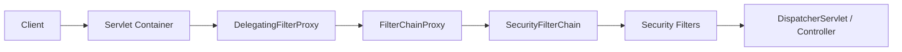

Komponen utamanya:

| Komponen | Peran |
|---|---|
| `DelegatingFilterProxy` | bridge dari Servlet container ke Spring bean |
| `FilterChainProxy` | entrypoint utama Spring Security Servlet support |
| `SecurityFilterChain` | daftar security filter untuk request tertentu |
| Security filters | filter spesifik: context, csrf, login, bearer, basic, authorization, logout, dll |
| `SecurityContextHolder` | holder untuk `SecurityContext` request/thread saat ini |
| `Authentication` | objek credential request atau authenticated principal |
| `AuthenticationManager` | kontrak autentikasi |
| `ProviderManager` | implementasi umum yang mendelegasikan ke provider |
| `AuthenticationProvider` | verifier untuk jenis credential tertentu |
| `AuthenticationEntryPoint` | response saat authentication diperlukan |
| `AccessDeniedHandler` | response saat authenticated principal tidak berhak |

Spring Security bukan satu filter. Ia adalah filter proxy yang memilih chain dan menjalankan banyak filter terurut.

---

## 2. Request Lifecycle di Spring Security

Satu request protected kira-kira bergerak seperti ini:

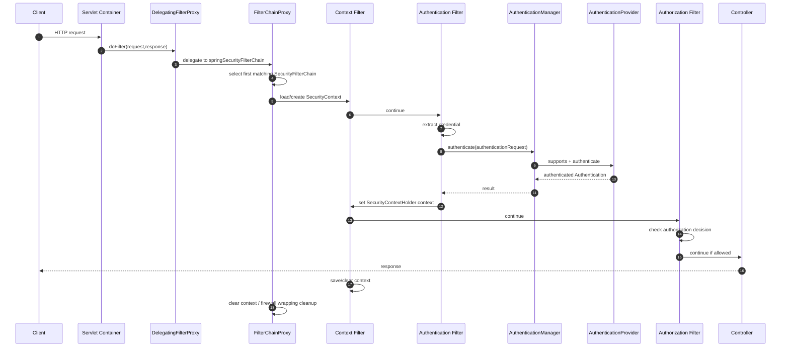

Tidak semua request melewati authentication filter aktif. Misalnya:

- request public mungkin tetap melewati beberapa security filter, tetapi tidak membutuhkan principal,
- request dengan session valid mungkin context diload dari repository,
- request bearer token memakai bearer token filter,
- request login form memakai username/password filter,
- request basic auth memakai basic filter,
- request authorization gagal bisa berhenti sebelum controller.

Mental model:

```txt
Spring Security adalah state machine kecil per request.
Input: request + existing context + credential evidence.
Output: response + maybe SecurityContext + maybe saved session + audit/side effect.
```

---

## 3. `DelegatingFilterProxy`: Jembatan Servlet ke Spring Bean

Servlet container tahu `Filter`, tetapi tidak tahu Spring bean.

Spring application context tahu bean, dependency injection, lifecycle Spring, tetapi Servlet container butuh filter yang bisa diregistrasikan.

`DelegatingFilterProxy` menyelesaikan mismatch ini:

```txt
Servlet Container Filter Registry
  contains DelegatingFilterProxy
      delegates to Spring Bean named springSecurityFilterChain
```

Diagram:

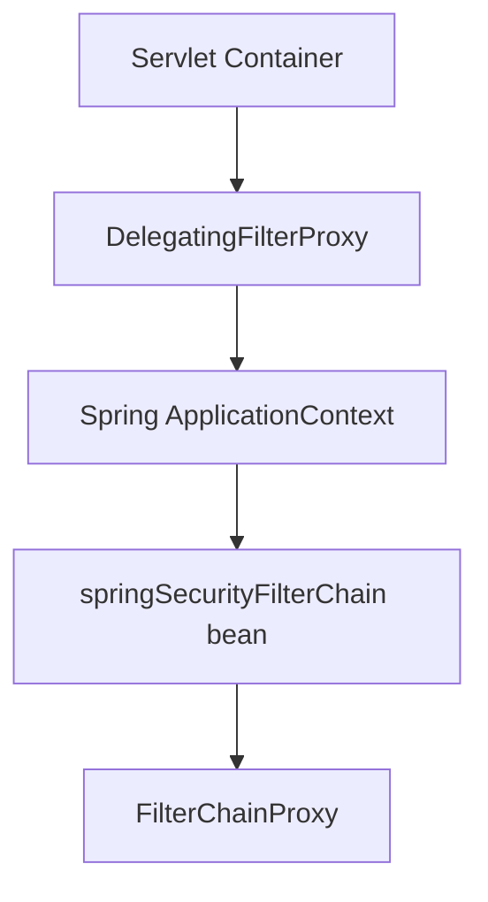

Pseudo-code mental model:

```java
public final class DelegatingFilterProxy implements Filter {
    @Override
    public void doFilter(ServletRequest request,
                         ServletResponse response,
                         FilterChain chain) throws IOException, ServletException {
        Filter delegate = applicationContext.getBean("springSecurityFilterChain", Filter.class);
        delegate.doFilter(request, response, chain);
    }
}
```

Kenapa penting?

- Security filter bisa memakai Spring DI.
- Filter registration tetap sesuai Servlet spec.
- Spring Security bisa menjadi satu entrypoint filter dari sudut pandang container.

Production implication:

- Jangan mendaftarkan banyak custom filter langsung ke Servlet container kalau tujuannya masuk Spring Security chain.
- Prefer menambahkan filter lewat `HttpSecurity` agar ordering dan chain matching tetap dikelola Spring Security.
- Jika filter didaftarkan sebagai servlet filter dan juga Spring Security filter, ia bisa berjalan dua kali.

---

## 4. `FilterChainProxy`: Pusat Spring Security Servlet

`FilterChainProxy` adalah filter Spring Security utama.

Tanggung jawabnya:

1. menerima request dari `DelegatingFilterProxy`,
2. memilih `SecurityFilterChain` yang matching,
3. menjalankan security filters dalam chain tersebut,
4. menerapkan firewall/wrapping behavior,
5. memastikan cleanup penting seperti `SecurityContext`.

Secara mental:

```java
public final class FilterChainProxy implements Filter {
    private final List<SecurityFilterChain> chains;

    public void doFilter(ServletRequest request,
                         ServletResponse response,
                         FilterChain originalChain) {
        SecurityFilterChain chain = firstMatchingChain(request);
        List<Filter> filters = chain.getFilters();
        VirtualFilterChain virtual = new VirtualFilterChain(filters, originalChain);
        virtual.doFilter(request, response);
    }
}
```

Spring Security documentation menekankan bahwa hanya chain pertama yang match yang dipakai. Ini sangat penting.

Contoh:

```java
@Bean
@Order(1)
SecurityFilterChain api(HttpSecurity http) throws Exception {
    return http
            .securityMatcher("/api/**")
            .authorizeHttpRequests(a -> a.anyRequest().authenticated())
            .oauth2ResourceServer(o -> o.jwt(Customizer.withDefaults()))
            .build();
}

@Bean
@Order(2)
SecurityFilterChain web(HttpSecurity http) throws Exception {
    return http
            .securityMatcher("/**")
            .authorizeHttpRequests(a -> a.anyRequest().authenticated())
            .formLogin(Customizer.withDefaults())
            .build();
}
```

Jika urutan dibalik:

```txt
/ api /** tidak pernah mencapai API chain karena /** match dulu.
```

Security invariant:

> Chain matching harus spesifik dulu, umum terakhir.

---

## 5. `SecurityFilterChain`: Policy per Request Class

`SecurityFilterChain` adalah kombinasi:

```txt
RequestMatcher + ordered list of security filters
```

Satu aplikasi bisa punya beberapa chain:

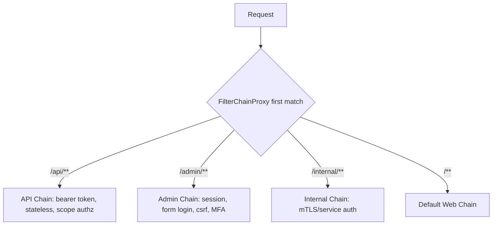

Contoh konfigurasi multi-chain:

```java
@Configuration
@EnableWebSecurity
class SecurityConfiguration {

    @Bean
    @Order(1)
    SecurityFilterChain api(HttpSecurity http) throws Exception {
        return http
                .securityMatcher("/api/**")
                .sessionManagement(s -> s.sessionCreationPolicy(SessionCreationPolicy.STATELESS))
                .csrf(csrf -> csrf.disable())
                .authorizeHttpRequests(auth -> auth
                        .requestMatchers("/api/public/**").permitAll()
                        .anyRequest().authenticated())
                .oauth2ResourceServer(oauth2 -> oauth2.jwt(Customizer.withDefaults()))
                .build();
    }

    @Bean
    @Order(2)
    SecurityFilterChain admin(HttpSecurity http) throws Exception {
        return http
                .securityMatcher("/admin/**")
                .authorizeHttpRequests(auth -> auth
                        .anyRequest().hasRole("ADMIN"))
                .formLogin(Customizer.withDefaults())
                .csrf(Customizer.withDefaults())
                .build();
    }
}
```

Perhatikan:

- API stateless dan browser session tidak dicampur sembarangan.
- CSRF disable hanya untuk API bearer-token, bukan global tanpa analisis.
- Admin memakai session + CSRF + role.
- `@Order` adalah security-critical.

Anti-pattern:

```java
http.csrf(csrf -> csrf.disable()); // global karena “API error waktu test”
```

Lebih baik:

```txt
Pisahkan chain browser dan API.
Disable CSRF hanya di chain yang memang tidak memakai cookie/session credential browser.
```

---

## 6. `SecurityContextHolder`: Local Security Context

Spring Security menyimpan authenticated principal di `SecurityContext`.

Struktur:

```txt
SecurityContextHolder
  -> SecurityContext
      -> Authentication
          -> principal
          -> credentials
          -> authorities
          -> authenticated flag
          -> details
```

Diagram:

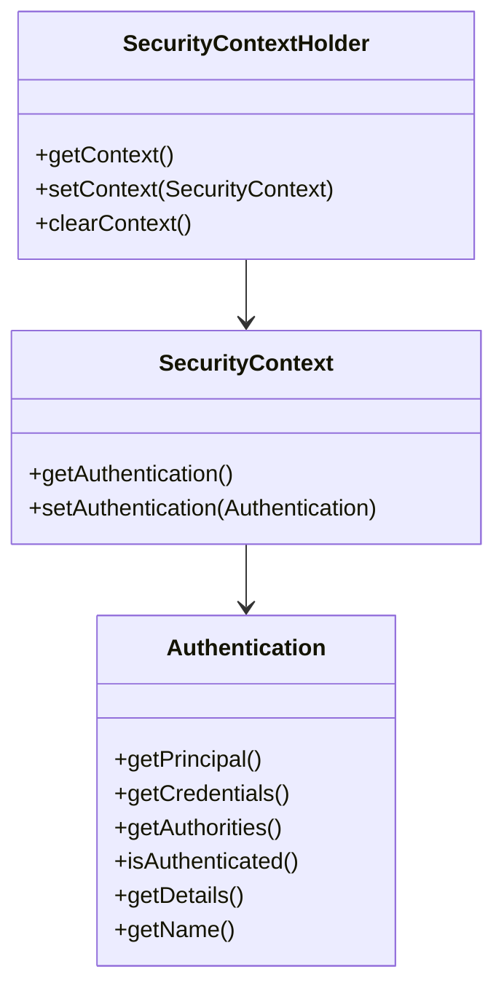

Default storage adalah `ThreadLocal`. Artinya context tersedia di thread yang sama tanpa passing parameter eksplisit.

```java
Authentication authentication = SecurityContextHolder
        .getContext()
        .getAuthentication();
```

Ini nyaman, tetapi punya konsekuensi:

- context harus dibersihkan setelah request,
- context tidak otomatis pindah ke thread async,
- test harus membersihkan context,
- jangan menyimpan `Authentication` ke static field,
- jangan mengandalkan context di background job.

Spring Security memastikan cleanup di filter boundary. Tetapi custom code tetap bisa membuat kebocoran jika menyalahi lifecycle.

Production rule:

```txt
SecurityContext adalah request execution context, bukan domain model permanen.
```

Jangan simpan `Authentication` sebagai entity database. Simpan user id, tenant id, method, auth time, session id/token id bila perlu.

---

## 7. `Authentication`: Dua Makna dalam Satu Interface

`Authentication` punya dua fase:

1. **Authentication request**: credential yang belum terbukti.
2. **Authentication result**: principal yang sudah terbukti.

Contoh sebelum autentikasi:

```java
Authentication request = UsernamePasswordAuthenticationToken.unauthenticated(
        username,
        password
);
```

Contoh setelah autentikasi:

```java
Authentication result = UsernamePasswordAuthenticationToken.authenticated(
        userDetails,
        null,
        userDetails.getAuthorities()
);
```

Spring Security documentation menjelaskan bahwa `Authentication` dapat menjadi input ke `AuthenticationManager`, dan juga dapat merepresentasikan current authenticated user.

Field penting:

| Field | Saat request | Saat result |
|---|---|---|
| principal | username/client id/token subject hint | user details/current principal |
| credentials | password/token/assertion | biasanya dibersihkan/null |
| authorities | kosong/unknown | roles/scopes/high-level authorities |
| authenticated | false | true |
| details | IP/session/user-agent/request details | request metadata atau auth metadata |

Kesalahan umum:

```java
UsernamePasswordAuthenticationToken token =
    new UsernamePasswordAuthenticationToken(user, password, authorities);
// constructor ini historically bisa membuat token authenticated tergantung constructor
```

Gunakan factory method modern saat tersedia:

```java
UsernamePasswordAuthenticationToken.unauthenticated(username, password);
UsernamePasswordAuthenticationToken.authenticated(principal, null, authorities);
```

Rule:

> Jangan membuat `Authentication` authenticated sebelum credential benar-benar diverifikasi.

---

## 8. `AuthenticationManager`: Kontrak Verifikasi

`AuthenticationManager` adalah interface:

```java
public interface AuthenticationManager {
    Authentication authenticate(Authentication authentication)
            throws AuthenticationException;
}
```

Tugasnya:

```txt
Input: Authentication request
Output: authenticated Authentication atau throw AuthenticationException
```

Tidak semua aplikasi butuh custom `AuthenticationManager`. Biasanya Spring Security membangun satu dari provider yang kita konfigurasi.

Mental model:

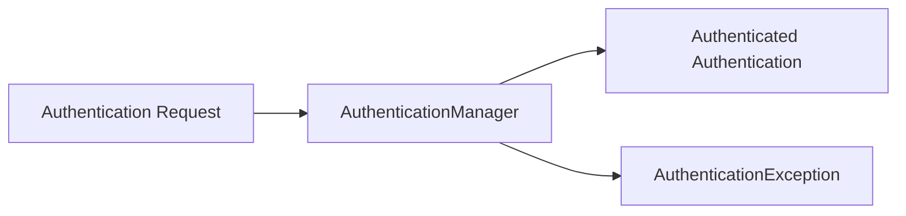

Contoh penggunaan di filter custom:

```java
Authentication request = new ApiKeyAuthenticationToken(apiKey);
Authentication result = authenticationManager.authenticate(request);
SecurityContext context = SecurityContextHolder.createEmptyContext();
context.setAuthentication(result);
SecurityContextHolder.setContext(context);
```

Perhatikan: filter tidak memverifikasi API key sendiri. Ia membuat token request dan meminta manager/provider memverifikasi.

---

## 9. `ProviderManager`: Delegasi ke Banyak Provider

Implementasi umum `AuthenticationManager` adalah `ProviderManager`.

Ia memiliki list `AuthenticationProvider`.

Mental model:

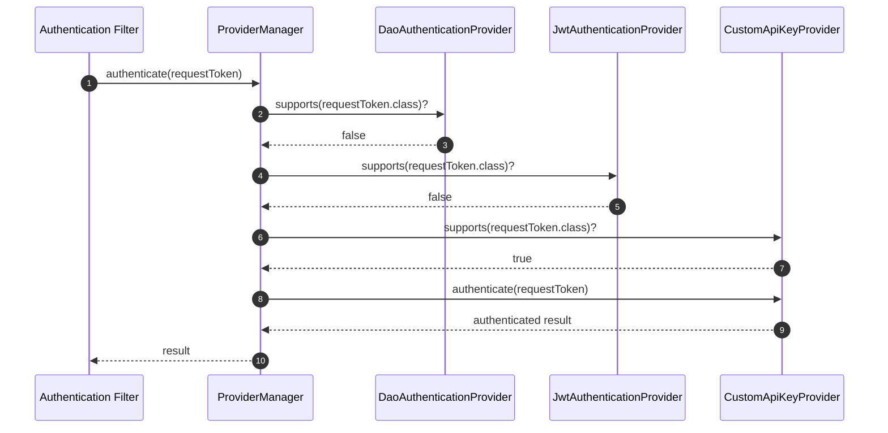

`AuthenticationProvider` melakukan dua hal:

```java
boolean supports(Class<?> authentication);
Authentication authenticate(Authentication authentication);
```

Provider harus ketat pada `supports`.

Buruk:

```java
@Override
public boolean supports(Class<?> authentication) {
    return true;
}
```

Akibat:

- provider mencoba memproses token yang bukan miliknya,
- exception salah,
- ordering jadi security-critical tanpa perlu,
- debugging sulit.

Lebih baik:

```java
@Override
public boolean supports(Class<?> authentication) {
    return ApiKeyAuthenticationToken.class.isAssignableFrom(authentication);
}
```

---

## 10. Custom Authentication Token

Misalnya kita ingin API key authentication.

### 10.1 Token Request/Result

```java
public final class ApiKeyAuthenticationToken extends AbstractAuthenticationToken {
    private final Object principal;
    private final String apiKey;

    private ApiKeyAuthenticationToken(Object principal,
                                      String apiKey,
                                      Collection<? extends GrantedAuthority> authorities,
                                      boolean authenticated) {
        super(authorities);
        this.principal = principal;
        this.apiKey = apiKey;
        setAuthenticated(authenticated);
    }

    public static ApiKeyAuthenticationToken unauthenticated(String apiKey) {
        return new ApiKeyAuthenticationToken(null, apiKey, List.of(), false);
    }

    public static ApiKeyAuthenticationToken authenticated(ApiClientPrincipal principal,
                                                          Collection<? extends GrantedAuthority> authorities) {
        return new ApiKeyAuthenticationToken(principal, null, authorities, true);
    }

    @Override
    public Object getCredentials() {
        return apiKey;
    }

    @Override
    public Object getPrincipal() {
        return principal;
    }
}
```

Invariant:

- request token membawa credential,
- result token tidak menyimpan secret mentah,
- principal immutable,
- authorities hanya hasil verifikasi.

### 10.2 Principal

```java
public record ApiClientPrincipal(
        String clientId,
        String tenantId,
        String keyId,
        Instant authenticatedAt
) implements Principal {
    @Override
    public String getName() {
        return clientId;
    }
}
```

Jangan pakai raw API key sebagai principal name.

---

## 11. Custom `AuthenticationProvider`

```java
@Component
public final class ApiKeyAuthenticationProvider implements AuthenticationProvider {
    private final ApiKeyRepository apiKeyRepository;
    private final PasswordEncoder secretHasher;
    private final Clock clock;

    public ApiKeyAuthenticationProvider(ApiKeyRepository apiKeyRepository,
                                        PasswordEncoder secretHasher,
                                        Clock clock) {
        this.apiKeyRepository = apiKeyRepository;
        this.secretHasher = secretHasher;
        this.clock = clock;
    }

    @Override
    public Authentication authenticate(Authentication authentication) throws AuthenticationException {
        ApiKeyAuthenticationToken token = (ApiKeyAuthenticationToken) authentication;
        String presentedApiKey = (String) token.getCredentials();

        ParsedApiKey parsed = ParsedApiKey.parse(presentedApiKey)
                .orElseThrow(() -> new BadCredentialsException("Invalid API key"));

        ApiKeyRecord record = apiKeyRepository.findByKeyId(parsed.keyId())
                .orElseThrow(() -> new BadCredentialsException("Invalid API key"));

        if (record.revoked()) {
            throw new BadCredentialsException("Invalid API key");
        }

        if (record.expiresAt() != null && record.expiresAt().isBefore(clock.instant())) {
            throw new CredentialsExpiredException("Invalid API key");
        }

        if (!secretHasher.matches(parsed.secret(), record.secretHash())) {
            throw new BadCredentialsException("Invalid API key");
        }

        ApiClientPrincipal principal = new ApiClientPrincipal(
                record.clientId(),
                record.tenantId(),
                record.keyId(),
                clock.instant()
        );

        List<GrantedAuthority> authorities = record.scopes().stream()
                .map(scope -> new SimpleGrantedAuthority("SCOPE_" + scope))
                .toList();

        return ApiKeyAuthenticationToken.authenticated(principal, authorities);
    }

    @Override
    public boolean supports(Class<?> authentication) {
        return ApiKeyAuthenticationToken.class.isAssignableFrom(authentication);
    }
}
```

Notes:

- Public response boleh generik, tetapi internal exception code/audit bisa detail.
- Hash API key secret seperti password; jangan simpan secret mentah.
- Gunakan prefix/key id untuk lookup cepat, secret untuk verification.
- Scope jadi authorities, tetapi authorization tetap layer lain.

---

## 12. Custom Authentication Filter di Spring Security

Filter membaca header, membuat `Authentication` request, memanggil manager, publish context.

```java
public final class ApiKeyAuthenticationFilter extends OncePerRequestFilter {
    private final AuthenticationManager authenticationManager;
    private final SecurityContextRepository securityContextRepository;

    public ApiKeyAuthenticationFilter(AuthenticationManager authenticationManager,
                                      SecurityContextRepository securityContextRepository) {
        this.authenticationManager = authenticationManager;
        this.securityContextRepository = securityContextRepository;
    }

    @Override
    protected void doFilterInternal(HttpServletRequest request,
                                    HttpServletResponse response,
                                    FilterChain filterChain) throws ServletException, IOException {
        String apiKey = request.getHeader("X-API-Key");

        if (apiKey == null || apiKey.isBlank()) {
            filterChain.doFilter(request, response);
            return;
        }

        try {
            Authentication authRequest = ApiKeyAuthenticationToken.unauthenticated(apiKey);
            Authentication authResult = authenticationManager.authenticate(authRequest);

            SecurityContext context = SecurityContextHolder.createEmptyContext();
            context.setAuthentication(authResult);
            SecurityContextHolder.setContext(context);
            securityContextRepository.saveContext(context, request, response);

            filterChain.doFilter(request, response);
        } catch (AuthenticationException ex) {
            SecurityContextHolder.clearContext();
            response.setStatus(HttpServletResponse.SC_UNAUTHORIZED);
            response.setContentType("application/json");
            response.getWriter().write("{\"error\":\"unauthorized\"}");
        }
    }
}
```

Untuk API stateless, sering tidak perlu menyimpan context ke session. Gunakan `NullSecurityContextRepository` atau setup stateless sesuai desain.

Konfigurasi:

```java
@Bean
SecurityFilterChain api(HttpSecurity http,
                        ApiKeyAuthenticationProvider provider) throws Exception {
    AuthenticationManager manager = new ProviderManager(provider);
    SecurityContextRepository contextRepository = new RequestAttributeSecurityContextRepository();

    ApiKeyAuthenticationFilter apiKeyFilter =
            new ApiKeyAuthenticationFilter(manager, contextRepository);

    return http
            .securityMatcher("/partner-api/**")
            .csrf(csrf -> csrf.disable())
            .sessionManagement(s -> s.sessionCreationPolicy(SessionCreationPolicy.STATELESS))
            .securityContext(sc -> sc.securityContextRepository(contextRepository))
            .addFilterBefore(apiKeyFilter, UsernamePasswordAuthenticationFilter.class)
            .authorizeHttpRequests(auth -> auth
                    .anyRequest().authenticated())
            .build();
}
```

Filter placement harus dipilih dengan sadar. Untuk API key, tempatkan sebelum authorization dan sebelum filter login form yang tidak relevan.

---

## 13. SecurityContext Persistence: Session vs Stateless

Spring Security memisahkan context holder dari context repository.

Holder:

```txt
SecurityContextHolder = context saat request diproses
```

Repository:

```txt
SecurityContextRepository = cara load/save context antar request
```

Pilihan umum:

| Repository | Cocok untuk | Catatan |
|---|---|---|
| `HttpSessionSecurityContextRepository` | browser session | stateful, session fixation control penting |
| `RequestAttributeSecurityContextRepository` | satu request/error dispatch | tidak persist antar request |
| `NullSecurityContextRepository` | stateless API | context tidak disimpan |
| custom repository | legacy/session store khusus | harus sangat hati-hati cleanup/rotation |

Untuk API JWT stateless:

```java
.sessionManagement(s -> s.sessionCreationPolicy(SessionCreationPolicy.STATELESS))
.securityContext(sc -> sc.securityContextRepository(new NullSecurityContextRepository()))
```

Untuk browser login:

```java
.formLogin(Customizer.withDefaults())
.sessionManagement(s -> s.sessionFixation(sf -> sf.migrateSession()))
```

Jangan campur tanpa sadar:

```txt
JWT API tetapi Spring membuat HttpSession karena request cache/form login/default config.
```

Audit dengan cara:

- lihat response `Set-Cookie: JSESSIONID`,
- cek session creation metrics,
- test endpoint stateless tidak membuat session,
- aktifkan debug log saat development.

---

## 14. Authentication Success Handler

Untuk flow seperti form login, hasil success tidak hanya set context. Biasanya ada redirect/session behavior.

Tanggung jawab success handler:

- menentukan response sukses,
- redirect ke saved request/home,
- membuat/rotasi session,
- menulis cookie,
- audit success,
- reset failure counter,
- trigger MFA next step jika belum complete,
- tidak membocorkan credential.

Contoh custom JSON success handler:

```java
public final class JsonAuthenticationSuccessHandler implements AuthenticationSuccessHandler {
    @Override
    public void onAuthenticationSuccess(HttpServletRequest request,
                                        HttpServletResponse response,
                                        Authentication authentication) throws IOException {
        response.setStatus(HttpServletResponse.SC_OK);
        response.setContentType("application/json");
        response.getWriter().write("{\"status\":\"ok\"}");
    }
}
```

Untuk browser form, redirect mungkin benar. Untuk API login, JSON response mungkin benar. Jangan memakai behavior browser untuk API tanpa sengaja.

---

## 15. Authentication Failure Handler

Failure handler mengubah `AuthenticationException` menjadi response.

Tanggung jawab:

- set status/redirect,
- message aman,
- audit failure,
- increment failure counter,
- add `WWW-Authenticate` jika challenge protocol butuh,
- jangan log password/token.

Contoh:

```java
public final class JsonAuthenticationFailureHandler implements AuthenticationFailureHandler {
    @Override
    public void onAuthenticationFailure(HttpServletRequest request,
                                        HttpServletResponse response,
                                        AuthenticationException exception) throws IOException {
        response.setStatus(HttpServletResponse.SC_UNAUTHORIZED);
        response.setContentType("application/json");
        response.getWriter().write("{\"error\":\"unauthorized\"}");
    }
}
```

Mapping internal:

| Exception | Public response | Internal metric |
|---|---|---|
| `BadCredentialsException` | 401 generic | bad_credentials |
| `CredentialsExpiredException` | 401 generic / password reset flow | credentials_expired |
| `LockedException` | 401 generic or locked flow | account_locked |
| `DisabledException` | 401 generic | account_disabled |
| dependency timeout custom | 503 | auth_dependency_timeout |

Enumeration warning:

> Public response tidak boleh memberi attacker oracle apakah username ada, password salah, account disabled, atau MFA belum setup, kecuali desain recovery sudah aman.

---

## 16. `AuthenticationEntryPoint` vs Failure Handler

Dua konsep ini sering tertukar.

| Komponen | Dipakai ketika | Contoh |
|---|---|---|
| `AuthenticationFailureHandler` | proses autentikasi aktif gagal | POST `/login` password salah |
| `AuthenticationEntryPoint` | resource protected butuh authentication | GET `/api/me` tanpa token |

Entry point menjawab:

```txt
Client belum authenticated, bagaimana kita meminta credential?
```

Contoh API bearer:

```java
public final class JsonBearerEntryPoint implements AuthenticationEntryPoint {
    @Override
    public void commence(HttpServletRequest request,
                         HttpServletResponse response,
                         AuthenticationException authException) throws IOException {
        response.setStatus(HttpServletResponse.SC_UNAUTHORIZED);
        response.setHeader("WWW-Authenticate", "Bearer realm=\"api\"");
        response.setContentType("application/json");
        response.getWriter().write("{\"error\":\"unauthorized\"}");
    }
}
```

Contoh browser:

```txt
redirect ke /login
```

Jika API tanpa token malah redirect HTML login page, client API akan bingung.

Rule:

```txt
Entry point harus sesuai client type: browser, API, machine, mobile.
```

---

## 17. `AccessDeniedHandler`: Authenticated tapi Tidak Boleh

Kalau principal sudah ada tetapi tidak memenuhi authorization, Spring memakai access denied path.

```txt
not authenticated -> AuthenticationEntryPoint -> 401/redirect
authenticated but forbidden -> AccessDeniedHandler -> 403
```

Contoh custom JSON:

```java
public final class JsonAccessDeniedHandler implements AccessDeniedHandler {
    @Override
    public void handle(HttpServletRequest request,
                       HttpServletResponse response,
                       AccessDeniedException accessDeniedException) throws IOException {
        response.setStatus(HttpServletResponse.SC_FORBIDDEN);
        response.setContentType("application/json");
        response.getWriter().write("{\"error\":\"forbidden\"}");
    }
}
```

Konfigurasi:

```java
.exceptionHandling(ex -> ex
        .authenticationEntryPoint(new JsonBearerEntryPoint())
        .accessDeniedHandler(new JsonAccessDeniedHandler()))
```

Failure mode:

- Semua error jadi 403 → client tidak refresh/login.
- Semua error jadi 401 → user valid tapi forbidden terlihat seperti logout.
- Browser redirect dipakai untuk API → client mendapat HTML.

---

## 18. Form Login Architecture

Form login adalah authentication flow stateful.

Komponen tipikal:

```txt
UsernamePasswordAuthenticationFilter
  -> AuthenticationManager
      -> DaoAuthenticationProvider
          -> UserDetailsService
          -> PasswordEncoder
  -> SuccessHandler / FailureHandler
  -> SecurityContextRepository / Session
```

Sequence:

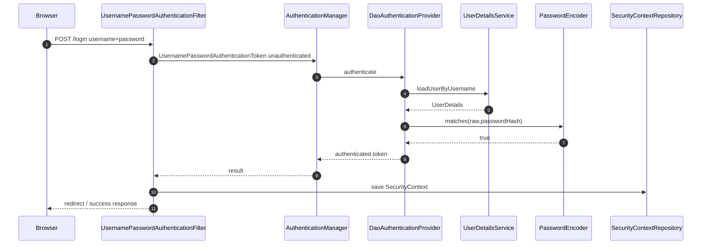

Production notes:

- `UserDetailsService` harus lookup by stable login identifier.
- `PasswordEncoder` harus adaptive dan migration-friendly.
- Failure tidak boleh enumeratif.
- Session fixation protection harus aktif.
- CSRF harus aktif untuk browser form.
- MFA bukan “role”; MFA adalah authentication state/assurance.

---

## 19. `DaoAuthenticationProvider`

`DaoAuthenticationProvider` adalah provider umum untuk username/password.

Tanggung jawab:

- load user,
- cek account flags,
- verify password,
- produce authenticated token,
- optionally hide user-not-found detail,
- erase credentials.

Konfigurasi modern:

```java
@Bean
UserDetailsService users(UserRepository repository) {
    return username -> repository.findByUsername(username)
            .map(AppUserDetails::new)
            .orElseThrow(() -> new UsernameNotFoundException("User not found"));
}

@Bean
PasswordEncoder passwordEncoder() {
    return PasswordEncoderFactories.createDelegatingPasswordEncoder();
}
```

`DelegatingPasswordEncoder` berguna untuk hash migration karena encoded password bisa memiliki id seperti `{bcrypt}` atau `{argon2}` tergantung konfigurasi.

Namun untuk production top-tier, jangan berhenti di default. Tetapkan:

- algorithm policy,
- cost parameter,
- rehash-on-login,
- breach password check,
- pepper strategy bila dipakai,
- login throttling,
- audit event,
- password reset hardening.

Detail password dibahas Part 009–010.

---

## 20. HTTP Basic Architecture

HTTP Basic sederhana:

```txt
Authorization: Basic base64(username:password)
```

Spring Security basic auth:

```java
http.httpBasic(Customizer.withDefaults())
```

Flow:

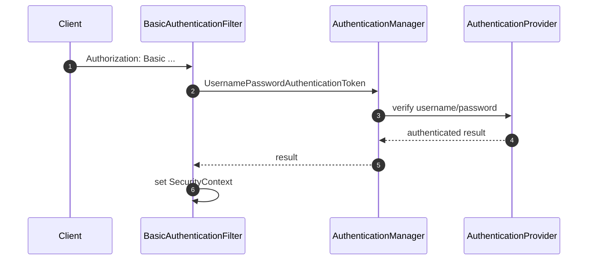

Kapan cocok?

- internal tooling sederhana via TLS,
- legacy integration,
- quick admin endpoint dalam environment terkontrol.

Kapan tidak cocok?

- public user login modern,
- browser app dengan UX/security kompleks,
- tanpa TLS,
- jika password utama dikirim berkali-kali ke API.

Basic auth tidak punya logout natural karena client menyimpan credential.

---

## 21. Bearer Token / Resource Server Architecture

Untuk OAuth2 Resource Server:

```java
http.oauth2ResourceServer(oauth2 -> oauth2.jwt(Customizer.withDefaults()));
```

Flow JWT:

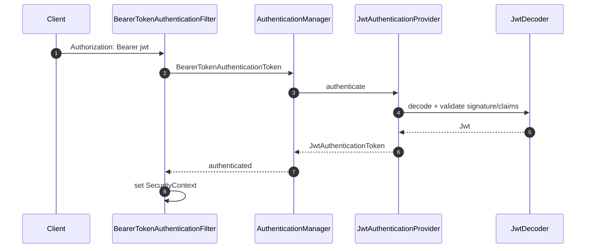

Production validation harus mencakup:

- signature,
- issuer,
- audience,
- expiry,
- not-before,
- algorithm restrictions,
- key rotation,
- authority mapping,
- tenant binding.

Spring dapat mengonfigurasi decoder dari issuer metadata, tetapi engineer tetap harus memastikan audience/tenant mapping benar. JWT valid secara signature belum tentu valid untuk API kamu.

---

## 22. Authorities: Roles, Scopes, Permissions

Spring Security memakai `GrantedAuthority` sebagai high-level permission marker.

Contoh:

```java
new SimpleGrantedAuthority("ROLE_ADMIN")
new SimpleGrantedAuthority("SCOPE_orders.read")
```

Konvensi:

- `hasRole("ADMIN")` biasanya mencari `ROLE_ADMIN`,
- `hasAuthority("SCOPE_orders.read")` mencari authority persis.

Authentication menghasilkan authorities, authorization menggunakannya.

Jangan overclaim:

```txt
JWT contains admin=true -> map to ROLE_ADMIN globally
```

Harus cek:

- issuer trusted,
- audience benar,
- tenant benar,
- claim semantics jelas,
- role berasal dari IdP atau app domain,
- apakah role global atau tenant-scoped.

Untuk multi-tenant, authority datar bisa berbahaya:

```txt
ROLE_ADMIN
```

Lebih aman punya domain context:

```txt
tenant:tnt_123:role:admin
scope:orders.read
```

Atau simpan tenant di principal dan lakukan authorization domain-aware.

---

## 23. Anonymous Authentication

Spring Security dapat memasang anonymous authentication agar pipeline selalu punya principal.

Manfaat:

- authorization logic bisa membedakan anonymous vs authenticated,
- controller bisa menerima principal optional,
- tidak perlu null-check terus.

Risiko:

- engineer mengira `authentication != null` berarti user login,
- audit mencatat anonymous sebagai user valid,
- optional auth downgrade tidak terlihat.

Rule:

```java
Authentication auth = SecurityContextHolder.getContext().getAuthentication();
boolean loggedIn = auth != null
        && auth.isAuthenticated()
        && !(auth instanceof AnonymousAuthenticationToken);
```

Jangan hanya:

```java
if (authentication != null) {
    // user is logged in
}
```

---

## 24. Remember-Me Bukan Session Normal

Remember-me memberi autentikasi otomatis berbasis cookie persistent.

Perlakukan sebagai assurance lebih rendah daripada login baru.

Flow:

```txt
browser sends remember-me cookie
-> remember-me service validates
-> authentication created
-> user considered authenticated but auth method differs
```

Risk:

- cookie persistent dicuri,
- user mengira sudah logout total,
- step-up tidak diterapkan untuk aksi sensitif.

Pattern:

- tandai auth method `remember_me`,
- butuh step-up untuk password change, payout, admin action,
- rotate token,
- store series/token server-side untuk revocation,
- expose device/session management.

---

## 25. Logout Architecture

Logout bukan hanya hapus cookie.

Untuk session browser:

```txt
invalidate session
clear SecurityContext
delete session cookie
revoke remember-me token
emit audit event
```

Untuk bearer JWT stateless:

```txt
client deletes token, but server may still accept token until expiry unless revocation/jti/introspection exists
```

Spring logout config:

```java
http.logout(logout -> logout
        .logoutUrl("/logout")
        .invalidateHttpSession(true)
        .clearAuthentication(true)
        .deleteCookies("JSESSIONID"));
```

Production nuance:

- OIDC RP-initiated logout berbeda dari local logout.
- Back-channel/front-channel logout punya reliability trade-off.
- Refresh token revocation lebih penting daripada access token revocation jika access token pendek.
- Logout all devices butuh session/token registry.

Detail token lifecycle dan logout dibahas Part 018.

---

## 26. ExceptionTranslationFilter Mental Model

Spring Security memiliki mekanisme yang mengubah exception security menjadi response.

Mental model:

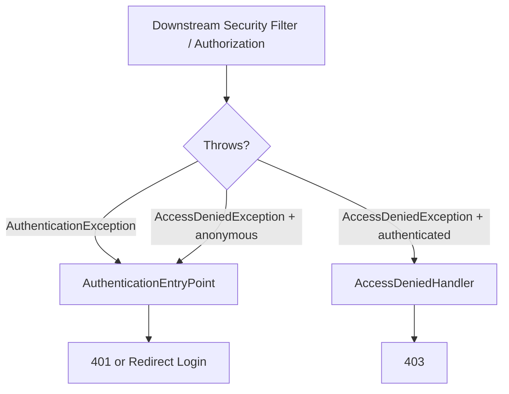

Konsekuensi:

- Jangan menulis response sendiri di semua tempat jika framework sudah punya exception translation.
- Untuk custom filter, pilih apakah akan throw `AuthenticationException` atau handle response sendiri.
- Pastikan custom filter posisinya berada di area yang ditangkap exception translation bila ingin exception diterjemahkan framework.

API configuration:

```java
http.exceptionHandling(ex -> ex
        .authenticationEntryPoint(new JsonBearerEntryPoint())
        .accessDeniedHandler(new JsonAccessDeniedHandler()));
```

---

## 27. CSRF dalam Arsitektur Spring Security

CSRF bukan autentikasi, tetapi sangat dekat dengan browser session auth.

Jika browser otomatis mengirim cookie session ke domain kamu, attacker bisa memicu request cross-site dari browser korban. CSRF token membuktikan request berasal dari page/app yang punya token, bukan hanya browser yang punya cookie.

Rule praktis:

| Flow | CSRF |
|---|---|
| Browser session + cookie | aktifkan |
| Server-rendered form | aktifkan |
| SPA dengan cookie session | aktifkan atau gunakan strategi token yang benar |
| API bearer token di Authorization header tanpa cookie | biasanya bisa disable untuk chain itu |
| Basic auth browser | hati-hati, browser bisa cache credential |

Jangan disable CSRF global hanya karena Postman request gagal.

Pisahkan chain:

```java
// API stateless
csrf.disable()

// Browser admin
csrf.enabled default
```

---

## 28. Stateless API: Konfigurasi yang Bersih

Contoh resource server stateless:

```java
@Bean
SecurityFilterChain api(HttpSecurity http) throws Exception {
    return http
            .securityMatcher("/api/**")
            .sessionManagement(s -> s.sessionCreationPolicy(SessionCreationPolicy.STATELESS))
            .securityContext(sc -> sc.securityContextRepository(new NullSecurityContextRepository()))
            .csrf(csrf -> csrf.disable())
            .authorizeHttpRequests(auth -> auth
                    .requestMatchers(HttpMethod.GET, "/api/public/**").permitAll()
                    .anyRequest().authenticated())
            .oauth2ResourceServer(oauth2 -> oauth2
                    .jwt(jwt -> jwt.jwtAuthenticationConverter(jwtAuthenticationConverter())))
            .exceptionHandling(ex -> ex
                    .authenticationEntryPoint(new JsonBearerEntryPoint())
                    .accessDeniedHandler(new JsonAccessDeniedHandler()))
            .build();
}
```

Test invariants:

- valid JWT → 200,
- missing JWT → 401 JSON, bukan redirect,
- invalid JWT → 401 JSON,
- insufficient scope → 403 JSON,
- no `JSESSIONID` created,
- CORS preflight works,
- CSRF not blocking bearer API.

---

## 29. Browser App: Konfigurasi yang Bersih

Contoh browser admin:

```java
@Bean
SecurityFilterChain admin(HttpSecurity http) throws Exception {
    return http
            .securityMatcher("/admin/**")
            .authorizeHttpRequests(auth -> auth
                    .requestMatchers("/admin/login", "/admin/assets/**").permitAll()
                    .anyRequest().hasRole("ADMIN"))
            .formLogin(form -> form
                    .loginPage("/admin/login")
                    .loginProcessingUrl("/admin/login")
                    .defaultSuccessUrl("/admin", true))
            .logout(logout -> logout
                    .logoutUrl("/admin/logout")
                    .invalidateHttpSession(true)
                    .deleteCookies("JSESSIONID"))
            .sessionManagement(session -> session
                    .sessionFixation(sf -> sf.migrateSession()))
            .csrf(Customizer.withDefaults())
            .build();
}
```

Test invariants:

- unauthenticated admin page redirects to login,
- POST login requires CSRF if form route protected by CSRF policy,
- session id changes after login,
- logout invalidates session,
- non-admin authenticated user gets 403,
- API clients do not receive admin login HTML.

---

## 30. Password Encoder dan Credential Erasure

Spring Security encourages password hashing via `PasswordEncoder`.

Credential erasure penting karena password mentah tidak boleh bertahan lebih lama dari perlu.

ProviderManager secara default mencoba menghapus credential sensitif dari successful authentication result. Ini baik, tetapi bisa mengejutkan jika object yang sama dipakai cache.

Rule:

- Jangan cache object yang menyimpan raw credential.
- Jangan taruh password di principal.
- Jangan expose `UserDetails` dengan password hash ke JSON.
- Jangan log `Authentication` penuh jika credentials belum erased.

Contoh buruk:

```java
log.info("auth={}", authentication);
```

Lebih aman:

```java
log.info("auth_success subject={} method={}", authentication.getName(), "password");
```

---

## 31. Method Security vs Web Security

Spring Security punya dua lapis umum:

1. Web/request security.
2. Method security.

Web security:

```java
.authorizeHttpRequests(auth -> auth
    .requestMatchers("/admin/**").hasRole("ADMIN"))
```

Method security:

```java
@PreAuthorize("hasAuthority('SCOPE_orders.write')")
public Order approve(OrderId id) { ... }
```

Authentication tetap sama: method security membaca `SecurityContextHolder`.

Failure mode:

- Request async kehilangan context → method security melihat anonymous.
- Internal call bypass proxy → annotation tidak jalan.
- Controller endpoint permitAll tetapi service method protected → bisa benar, bisa mengejutkan.

Rule:

```txt
Web security menjaga perimeter request.
Method security menjaga use-case boundary.
Keduanya butuh SecurityContext yang benar.
```

---

## 32. Testing Spring Security Architecture

### 32.1 MockMvc: Missing Credential

```java
@Test
void apiMeWithoutTokenReturns401() throws Exception {
    mockMvc.perform(get("/api/me"))
            .andExpect(status().isUnauthorized())
            .andExpect(header().string("WWW-Authenticate", containsString("Bearer")));
}
```

### 32.2 MockMvc: With Mock User

```java
@Test
@WithMockUser(username = "alice", authorities = "SCOPE_profile.read")
void profileWithMockUser() throws Exception {
    mockMvc.perform(get("/api/me"))
            .andExpect(status().isOk());
}
```

Use carefully. `@WithMockUser` bypasses actual authentication mechanism. Good for authorization/controller tests, not token verification tests.

### 32.3 JWT Resource Server Test

```java
@Test
void apiWithJwt() throws Exception {
    mockMvc.perform(get("/api/me")
                    .with(jwt().jwt(jwt -> jwt
                            .subject("usr_123")
                            .claim("tenant", "tnt_001"))
                            .authorities(new SimpleGrantedAuthority("SCOPE_profile.read"))))
            .andExpect(status().isOk());
}
```

### 32.4 Full Integration Test

Gunakan real JWT decoder/test key atau testcontainer IdP untuk memverifikasi:

- issuer,
- audience,
- signature,
- key rotation,
- expired token,
- wrong algorithm,
- wrong tenant.

Jangan hanya test dengan mock principal lalu mengklaim authentication sudah aman.

---

## 33. Debugging Effective Security Chain

Saat security tidak berjalan sesuai harapan, jangan menebak. Inspect chain.

Hal yang dicek:

- chain mana yang match request,
- filter apa saja di chain,
- apakah request membuat session,
- authentication object sebelum authorization,
- entry point mana yang dipakai,
- access denied handler mana yang dipakai,
- apakah request kena anonymous authentication.

Checklist debugging:

```txt
1. Path request persis apa?
2. Method apa?
3. Dispatcher type apa?
4. SecurityFilterChain mana yang match duluan?
5. Credential ada di mana?
6. Filter authentication yang diharapkan ada di chain?
7. AuthenticationProvider supports token type itu?
8. Authentication result berisi authorities apa?
9. Authorization rule apa yang menolak?
10. Response dibuat oleh entry point, failure handler, atau access denied handler?
```

Untuk development, Spring Security debug log bisa membantu, tetapi jangan aktifkan verbose sensitive logging di production tanpa kontrol.

---

## 34. Common Anti-Patterns

### 34.1 Custom Filter Memverifikasi Semuanya Sendiri

Buruk:

```txt
Filter parse token, query DB, map roles, decide authorization, write response.
```

Efek:

- provider tidak reusable,
- test sulit,
- authorization tersebar,
- failure handling inconsistent.

Lebih baik:

```txt
Filter extract -> AuthenticationManager -> Provider -> SecurityContext -> Authorization layer.
```

### 34.2 `permitAll` untuk Memperbaiki Error

```java
.anyRequest().permitAll()
```

Ini bukan fix. Ini mematikan perimeter.

### 34.3 Global CSRF Disable

```java
.csrf(csrf -> csrf.disable())
```

Tanpa pemisahan browser/API, ini sering melemahkan browser session flow.

### 34.4 Role dari JWT Dipercaya Tanpa Audience/Tenant

JWT signed oleh issuer yang benar tetapi audience salah tetap tidak boleh diterima.

### 34.5 Menyimpan Authentication di Domain Entity

`Authentication` adalah runtime object, bukan domain aggregate.

### 34.6 Menganggap Stateless Berarti Tidak Ada State

JWT stateless tetap punya state di luar:

- signing keys,
- user status,
- client registration,
- refresh token,
- revocation policy,
- risk/session state,
- audit.

---

## 35. Production Review Matrix

| Area | Pertanyaan review | Red flag |
|---|---|---|
| Chain matching | Chain mana yang match path ini? | `/**` berada sebelum `/api/**` |
| Session policy | Apakah API membuat session? | `Set-Cookie: JSESSIONID` di API stateless |
| Entry point | API menerima JSON 401? | redirect login HTML untuk API |
| Context | Siapa set/clear context? | custom ThreadLocal tanpa finally |
| Provider | Provider supports token apa? | `supports()` return true semua |
| Credentials | Apakah secret erased? | password/token ada di log |
| Authorities | Role/scope asalnya dari mana? | claim JWT langsung jadi admin global |
| CSRF | Browser cookie flow protected? | disable global |
| Async | Context dipropagasi atau explicit? | service async membaca ThreadLocal kosong/stale |
| Test | Test actual auth mechanism? | hanya `@WithMockUser` |

---

## 36. Minimal Production Blueprint

Untuk aplikasi modern, pisahkan minimal tiga chain:

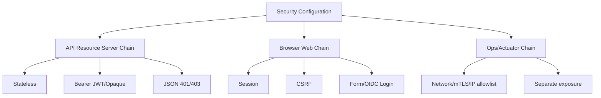

Blueprint:

1. `/api/**`: stateless bearer token, no session, JSON errors.
2. `/admin/**`: session, CSRF, MFA/step-up, browser redirects.
3. `/actuator/health`: explicit public or infra-only.
4. `/actuator/**`: not public; mTLS/network/role.
5. `/**`: default deny or clearly defined web flow.

Default-deny principle:

```java
.authorizeHttpRequests(auth -> auth
        .requestMatchers("/assets/**", "/login").permitAll()
        .anyRequest().authenticated())
```

Better for high-risk systems:

```txt
Every route has an owner and explicit security classification.
```

---

## 37. Exercises

### Exercise 1 — Draw Your Effective Chain

Untuk aplikasi kamu, gambar:

```txt
request path -> matching chain -> filters -> auth manager -> providers -> context repository -> entrypoint/handler
```

Jika tidak bisa menggambar, berarti konfigurasi belum dipahami.

### Exercise 2 — Build API Key Auth Properly

Implementasikan:

- `ApiKeyAuthenticationToken`,
- `ApiKeyAuthenticationProvider`,
- `ApiKeyAuthenticationFilter`,
- stateless security chain,
- JSON entry point,
- tests untuk missing/invalid/valid key,
- test bahwa API tidak membuat session.

### Exercise 3 — Split Browser and API Chain

Ambil aplikasi yang sekarang punya satu `SecurityFilterChain`. Pecah menjadi:

- `/api/**`,
- `/admin/**`,
- default/public.

Pastikan CSRF hanya disabled di API stateless.

### Exercise 4 — Authentication Failure Taxonomy

Buat mapping:

| Internal exception | Public status | Public body | Metric | Audit |
|---|---|---|---|---|
| bad credentials | 401 | generic | yes | yes |
| locked | 401 generic | generic | yes | yes |
| auth dependency timeout | 503 | generic | yes alert | yes |
| insufficient scope | 403 | generic | yes | yes |

### Exercise 5 — JWT Claim Mapping Review

Ambil JWT contoh dan jawab:

- issuer siapa,
- audience apa,
- subject stabil atau tidak,
- tenant claim ada atau tidak,
- authorities berasal dari claim apa,
- apakah role tenant-scoped,
- apa yang terjadi jika token dari client lain dikirim ke API ini.

---

## 38. Ringkasan

Spring Security Servlet architecture bisa diringkas seperti ini:

```txt
Servlet container
  -> DelegatingFilterProxy
      -> FilterChainProxy
          -> first matching SecurityFilterChain
              -> ordered security filters
                  -> AuthenticationManager
                      -> AuthenticationProvider
                  -> SecurityContextHolder
                  -> Authorization
                  -> Application
```

Poin yang harus melekat:

1. `DelegatingFilterProxy` menjembatani Servlet container dan Spring bean.
2. `FilterChainProxy` adalah pusat Spring Security Servlet.
3. `SecurityFilterChain` dipilih berdasarkan first match.
4. Filter order adalah security architecture.
5. `Authentication` adalah request credential atau authenticated result.
6. `AuthenticationManager` memverifikasi lewat provider.
7. `SecurityContextHolder` menyimpan context lokal, biasanya thread-bound.
8. Entry point berbeda dari failure handler.
9. 401 berbeda dari 403.
10. Stateless API dan browser session sebaiknya dipisahkan dalam chain berbeda.
11. Custom authentication harus masuk melalui token/provider/filter yang bersih, bukan filter raksasa.
12. Test harus mencakup actual authentication mechanism, bukan hanya mock user.

Part berikutnya masuk ke Jakarta Security Authentication Model: `HttpAuthenticationMechanism`, `IdentityStore`, `SecurityContext`, hubungan dengan Servlet/Jakarta EE, dan bagaimana cara berpikir saat tidak memakai Spring Security.

---

## References

- Spring Security Reference — Servlet Architecture: https://docs.spring.io/spring-security/reference/servlet/architecture.html
- Spring Security Reference — Servlet Authentication Architecture: https://docs.spring.io/spring-security/reference/servlet/authentication/architecture.html
- Spring Security Reference — OAuth2 Resource Server JWT: https://docs.spring.io/spring-security/reference/servlet/oauth2/resource-server/jwt.html
- Spring Security Reference — Testing: https://docs.spring.io/spring-security/reference/servlet/test/index.html
- Jakarta Servlet API — `Filter`: https://jakarta.ee/specifications/servlet/5.0/apidocs/jakarta/servlet/filter
- OWASP Authentication Cheat Sheet: https://cheatsheetseries.owasp.org/cheatsheets/Authentication_Cheat_Sheet.html
