# Part 007 — Jakarta Security Authentication Model

> Target part ini: kita memahami **model autentikasi standar Jakarta EE**, bukan hanya "cara login di server tertentu". Setelah bagian ini, kamu harus bisa membaca sistem Jakarta Security seperti membaca state machine: request masuk, mechanism membaca credential, identity store memvalidasi, container membentuk caller principal, aplikasi mengakses `SecurityContext`, lalu response dikembalikan dengan boundary yang jelas.

Jakarta Security berguna ketika aplikasi berjalan di dunia Jakarta EE: Payara, WildFly, Open Liberty, GlassFish, TomEE, atau runtime enterprise lain yang ingin tetap portable di atas standar.

Spring Security sangat kuat dan dominan di ekosistem Spring. Tetapi di Jakarta EE, standar resminya adalah **Jakarta Security**. Mental model-nya berbeda:

```txt
Spring Security:
    application-owned security pipeline
    banyak keputusan ada di konfigurasi aplikasi Spring

Jakarta Security:
    container-integrated security pipeline
    aplikasi mendefinisikan mechanism/store/context hook
    container ikut mengelola caller identity dan role mapping
```

Yang penting: Jakarta Security bukan sekadar API login. Ia adalah **kontrak antara aplikasi dan container** untuk autentikasi HTTP, validasi credential, dan akses security context.

---

## 1. Masalah yang Diselesaikan Jakarta Security

Sebelum Jakarta Security, aplikasi Jakarta/Java EE sering punya beberapa jalur autentikasi yang tersebar:

| Area | Masalah lama |
|---|---|
| `web.xml` login config | declarative, tetapi sulit dikustomisasi secara application-native |
| Container realm | kuat, tetapi vendor-specific |
| JAAS | lower-level, historis, tidak nyaman untuk HTTP web apps modern |
| Servlet filter custom | fleksibel, tetapi sering tidak terintegrasi dengan caller principal container |
| JAX-RS filter | terlambat dalam pipeline untuk banyak use case web security |
| Framework sendiri | portability rendah, risk inconsistent context |

Jakarta Security memberi abstraksi standar untuk:

1. **HTTP authentication mechanism**  
   Bagaimana request membawa credential dan bagaimana response challenge dikirim.

2. **Identity store**  
   Bagaimana credential divalidasi dan group/caller attribute didapat.

3. **Security context**  
   Bagaimana aplikasi melihat caller yang sudah diautentikasi.

4. **Container integration**  
   Bagaimana principal dan roles masuk ke mekanisme security Jakarta EE.

Jika Spring Security bertanya:

```txt
Filter apa yang harus saya pasang?
AuthenticationProvider mana yang memvalidasi credential?
SecurityContextRepository mana yang menyimpan context?
```

Jakarta Security bertanya:

```txt
HttpAuthenticationMechanism apa yang membaca request?
IdentityStore mana yang memvalidasi caller?
SecurityContext apa yang terlihat oleh application code?
Bagaimana container mengikat identity itu ke request?
```

---

## 2. Arsitektur Besar

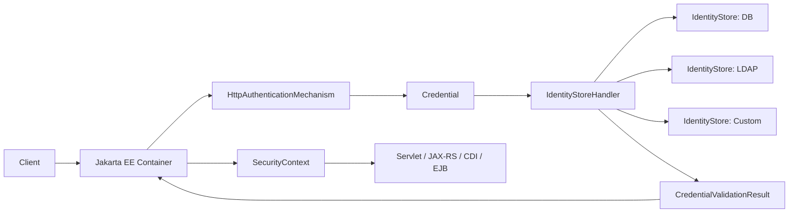

Model minimal:

```txt
HTTP request
  -> authentication mechanism extracts credential
  -> identity store validates credential
  -> validation result contains caller + groups
  -> container establishes authenticated caller
  -> application reads SecurityContext
```

Yang harus dipegang:

> `HttpAuthenticationMechanism` bukan database user.  
> `IdentityStore` bukan HTTP filter.  
> `SecurityContext` bukan tempat validasi password.  
> Masing-masing punya boundary.

---

## 3. Komponen Inti

| Komponen | Tugas | Jangan digunakan untuk |
|---|---|---|
| `HttpAuthenticationMechanism` | Membaca request, membuat credential, mengirim challenge/failure/success | Query user database langsung kecuali sangat sederhana |
| `Credential` | Representasi credential yang dibawa request | Menyimpan identity permanen |
| `IdentityStore` | Validasi credential dan provide groups | Mengatur HTTP response |
| `IdentityStoreHandler` | Menggabungkan satu atau banyak identity store | Menjadi business service |
| `CredentialValidationResult` | Hasil validasi caller | Menyimpan session/token jangka panjang |
| `SecurityContext` | API aplikasi untuk melihat caller dan role | Mengganti access-control service kompleks |
| Container | Mengikat identity ke request dan role model | Menjadi domain identity source of truth |

---

## 4. Lifecycle Request

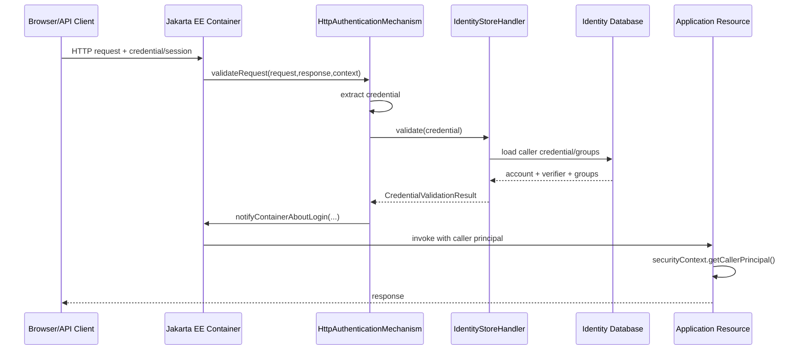

Di sini ada beberapa titik keputusan:

| Titik | Pertanyaan |
|---|---|
| Request tidak punya credential | Public resource? challenge? continue? |
| Credential malformed | 400? 401? generic error? |
| Credential valid | Caller dibuat, group dipetakan |
| Credential invalid | Generic failure; jangan leak apakah user ada |
| Account disabled/locked | Secara eksternal tetap generic |
| Store unavailable | Fail closed untuk protected resource |
| Multiple mechanisms | Mechanism selection harus deterministic |

---

## 5. Authentication Status: Jangan Semua Dianggap Boolean

HTTP authentication bukan `true/false`. Dalam Jakarta Security, mechanism mengembalikan status yang mewakili langkah pipeline.

Model konseptual:

| Status | Arti operasional |
|---|---|
| `SUCCESS` | Authentication berhasil dan container dapat melanjutkan request |
| `SEND_CONTINUE` | Mechanism sudah mengirim intermediate response/challenge; request belum lanjut ke app |
| `SEND_FAILURE` | Mechanism sudah mengirim failure response |
| `NOT_DONE` | Mechanism tidak menyelesaikan autentikasi; container/request handling lanjut sesuai konteks |

Mental model:

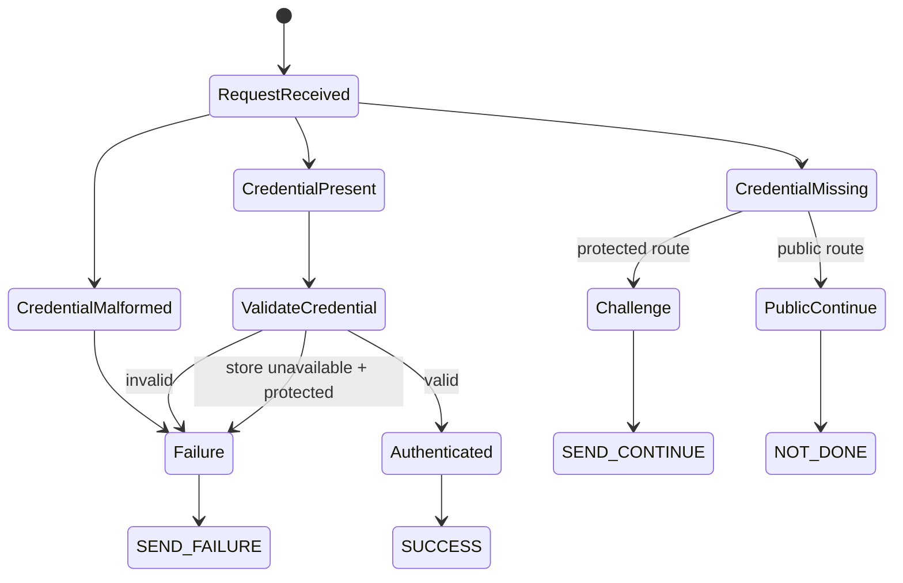

Production bug umum muncul ketika engineer menyederhanakan semua ke boolean:

```txt
if authenticated -> continue
else -> 401
```

Padahal:

- public endpoint boleh tidak authenticated;
- login redirect butuh `SEND_CONTINUE`;
- OIDC flow bisa multi-step;
- preflight CORS tidak boleh dipaksa login;
- invalid credential dan missing credential punya response strategy berbeda;
- failure response harus tidak membocorkan detail account.

---

## 6. `HttpAuthenticationMechanism`

`HttpAuthenticationMechanism` adalah adapter HTTP.

Tanggung jawabnya:

1. membaca credential dari request;
2. memutuskan apakah request butuh authentication attempt;
3. membuat `Credential`;
4. meminta validasi ke `IdentityStoreHandler` atau store;
5. memberitahu container jika login berhasil;
6. mengirim challenge/failure jika perlu.

Pseudocode mental:

```java
@ApplicationScoped
public class LoginAuthenticationMechanism implements HttpAuthenticationMechanism {

    @Inject
    private IdentityStoreHandler identityStoreHandler;

    @Override
    public AuthenticationStatus validateRequest(
            HttpServletRequest request,
            HttpServletResponse response,
            HttpMessageContext context) throws AuthenticationException {

        if (!isLoginSubmission(request)) {
            return context.doNothing();
        }

        UsernamePasswordCredential credential = new UsernamePasswordCredential(
                request.getParameter("username"),
                request.getParameter("password")
        );

        CredentialValidationResult result = identityStoreHandler.validate(credential);

        if (result.getStatus() == CredentialValidationResult.Status.VALID) {
            return context.notifyContainerAboutLogin(
                    result.getCallerPrincipal(),
                    result.getCallerGroups()
            );
        }

        response.setStatus(HttpServletResponse.SC_UNAUTHORIZED);
        return context.responseUnauthorized();
    }
}
```

Ini contoh konseptual. Dalam production, jangan langsung percaya `request.getParameter()` tanpa validasi size, encoding, method, content type, CSRF, rate limit, audit event, dan generic error semantics.

### Boundary yang benar

`HttpAuthenticationMechanism` boleh tahu:

- endpoint login;
- HTTP method;
- header/cookie/form field;
- challenge response;
- redirect target;
- apakah credential dikirim;
- apakah result valid/invalid.

`HttpAuthenticationMechanism` sebaiknya tidak tahu:

- struktur kompleks domain account;
- kebijakan password hash;
- SQL detail;
- risk scoring detail;
- business role derivation yang kompleks;
- provisioning identity.

Kenapa? Karena mechanism adalah **transport layer authentication adapter**. Begitu ia memuat banyak business logic, kamu sulit memakai credential yang sama dari Basic, Form, API key, atau OIDC.

---

## 7. `IdentityStore`

`IdentityStore` adalah boundary validasi credential.

Pertanyaan yang dijawab:

```txt
Apakah credential ini membuktikan caller X?
Jika valid, group apa yang melekat pada caller?
```

Identity store bukan selalu database. Bisa:

| Store | Use case |
|---|---|
| Database identity store | username/password internal |
| LDAP identity store | enterprise directory |
| Custom identity store | account service, external verifier, legacy IAM |
| Remember-me identity store | token persistent untuk remember-me |
| OIDC-backed identity | claims dari provider federasi |

Contoh custom store:

```java
@ApplicationScoped
public class ApplicationIdentityStore implements IdentityStore {

    @Inject
    AccountCredentialRepository credentials;

    @Inject
    PasswordVerifier passwordVerifier;

    @Override
    public CredentialValidationResult validate(Credential credential) {
        if (!(credential instanceof UsernamePasswordCredential usernamePassword)) {
            return CredentialValidationResult.NOT_VALIDATED_RESULT;
        }

        String login = normalizeLogin(usernamePassword.getCaller());
        AccountCredentialRecord record = credentials.findActivePasswordCredential(login)
                .orElse(null);

        if (record == null) {
            // tetap lakukan dummy hash di production untuk mengurangi timing signal
            passwordVerifier.verifyAgainstDummyHash(usernamePassword.getPasswordAsString());
            return CredentialValidationResult.INVALID_RESULT;
        }

        boolean valid = passwordVerifier.verify(
                usernamePassword.getPasswordAsString(),
                record.passwordHash()
        );

        if (!valid) {
            return CredentialValidationResult.INVALID_RESULT;
        }

        Set<String> groups = credentials.findGroups(record.accountId());

        return new CredentialValidationResult(
                new CallerPrincipal(record.accountId().toString()),
                groups
        );
    }
}
```

Production notes:

- Caller principal sebaiknya memakai **stable opaque subject id**, bukan email.
- Login identifier boleh email/username/phone, tetapi principal internal sebaiknya immutable.
- `groups` jangan otomatis dianggap permission granular.
- Store harus membedakan internal reason, tetapi response eksternal tetap generic.
- Store harus mendukung credential migration, misalnya rehash setelah successful login.

---

## 8. `CredentialValidationResult`

`CredentialValidationResult` adalah kontrak hasil validasi.

Secara konseptual:

```txt
VALID:
    caller principal diketahui
    optional groups diketahui

INVALID:
    credential dikenali sebagai credential type yang didukung
    tetapi proof gagal

NOT_VALIDATED:
    store tidak menangani credential type ini
```

Perbedaan `INVALID` dan `NOT_VALIDATED` penting ketika ada banyak store.

Contoh:

```txt
Store A: username/password database
Store B: API key
Store C: LDAP

Request membawa API key.
Store A -> NOT_VALIDATED
Store B -> VALID/INVALID
Store C -> NOT_VALIDATED
```

Jika semua store yang tidak mengenal credential mengembalikan `INVALID`, chain bisa gagal terlalu cepat.

### Invariant

```txt
A store must not say INVALID merely because the credential is not its type.
A store says INVALID when the credential is its type, but proof is wrong.
A store says NOT_VALIDATED when it cannot evaluate that credential type.
```

---

## 9. `IdentityStoreHandler`: Komposisi Store

Dalam sistem enterprise, identity jarang berasal dari satu sumber.

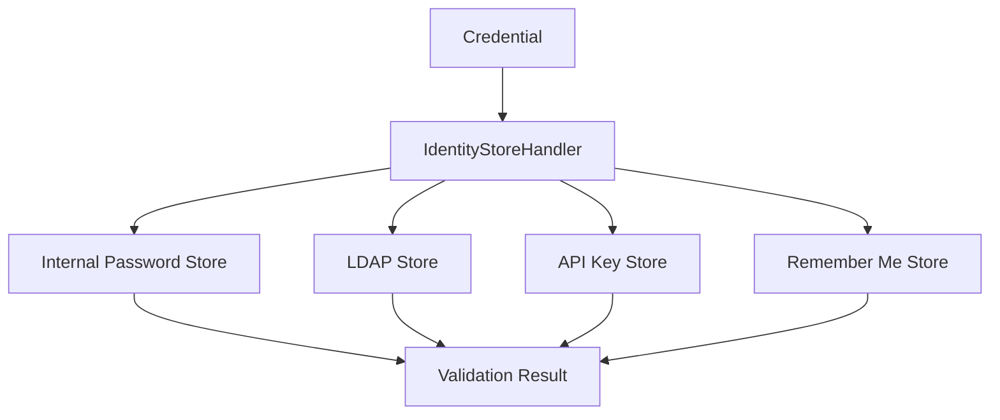

Pertanyaan desain:

1. Apakah satu store validasi credential, store lain provide groups?
2. Apakah LDAP groups dimapping ke application roles?
3. Apakah account lokal harus linked dengan external directory identity?
4. Apakah failure di satu store harus fail closed atau coba store lain?
5. Apakah ordering deterministic?

Contoh production rule:

| Scenario | Recommended behavior |
|---|---|
| Password store down | Protected login fail closed; jangan fallback ke weaker path |
| LDAP group store down | Login bisa fail closed jika role wajib; jangan beri default admin/user |
| API key malformed | Invalid segera, tidak perlu cek LDAP |
| Credential type tidak cocok | `NOT_VALIDATED` |
| Multiple valid stores | Hindari; identity linking harus eksplisit |

---

## 10. `SecurityContext`

Aplikasi tidak seharusnya membaca session raw atau header raw untuk tahu siapa caller. Di Jakarta Security, aplikasi membaca `SecurityContext`.

Contoh:

```java
@Path("/me")
@RequestScoped
public class MeResource {

    @Inject
    SecurityContext securityContext;

    @GET
    @Produces(MediaType.APPLICATION_JSON)
    public Response me() {
        Principal caller = securityContext.getCallerPrincipal();

        if (caller == null) {
            return Response.status(Response.Status.UNAUTHORIZED).build();
        }

        return Response.ok(Map.of(
                "subject", caller.getName(),
                "employee", securityContext.isCallerInRole("employee"),
                "admin", securityContext.isCallerInRole("admin")
        )).build();
    }
}
```

Gunakan `SecurityContext` untuk:

- mengambil caller principal;
- mengecek role coarse-grained;
- memicu authentication programmatically pada kasus tertentu;
- integrasi container security.

Jangan gunakan `SecurityContext` sebagai satu-satunya authorization engine untuk domain kompleks seperti:

```txt
Can investigator A escalate case B from stage X to stage Y?
Can tenant admin invite user across legal entity boundary?
Can merchant support agent refund order above threshold?
```

Untuk itu, gunakan authorization layer terpisah. Authentication menjawab **siapa caller**, bukan semua keputusan **apa yang boleh dilakukan**.

---

## 11. Group vs Role vs Permission

Jakarta Security dan container security sering berbicara tentang **groups** dan **roles**.

Jangan samakan semuanya.

| Istilah | Arti praktis |
|---|---|
| Caller principal | identity yang sudah diautentikasi |
| Group | membership dari identity source, misalnya LDAP group atau application group |
| Role | abstraction yang dipakai container/application untuk access check |
| Permission | aksi granular di domain |
| Entitlement | hak akses terstruktur, sering resource-aware |
| Scope | delegated access string, sering di OAuth/OIDC |

Mapping yang sehat:

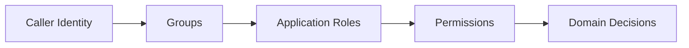

Anti-pattern:

```txt
LDAP group CN=Payroll-Europe-L2 langsung digunakan sebagai permission domain.
```

Lebih sehat:

```txt
External group -> normalized application role -> policy decision -> domain action
```

Contoh mapping:

| External group | Application role | Domain permission |
|---|---|---|
| `ldap:corp-support-l1` | `support_agent` | view ticket, add note |
| `ldap:corp-support-l2` | `support_supervisor` | assign ticket, escalate ticket |
| `ldap:corp-security-admin` | `security_admin` | disable account, revoke sessions |

Authentication layer cukup membawa caller + normalized group/role claim. Authorization layer memutuskan aksi.

---

## 12. Built-in Authentication Mechanisms

Jakarta Security menyediakan mechanism standar melalui annotation, tergantung versi/platform.

Kategori penting:

| Mechanism | Cocok untuk | Catatan |
|---|---|---|
| Basic authentication | internal API sederhana, test, machine constrained environment | jangan pakai untuk browser user login modern tanpa alasan kuat |
| Form authentication | aplikasi web klasik | butuh CSRF, session rotation, generic error, rate limit |
| Custom form authentication | ketika form flow perlu customization | hati-hati redirect dan saved request |
| OpenID Connect authentication | federated login / SSO | perlu state, nonce, issuer validation, session binding |
| Custom mechanism | API key, HMAC, legacy SSO, special tenant flow | harus menjaga invariant pipeline |

Contoh declarative form:

```java
@FormAuthenticationMechanismDefinition(
    loginToContinue = @LoginToContinue(
        loginPage = "/login.xhtml",
        errorPage = "/login-error.xhtml"
    )
)
@ApplicationScoped
public class SecurityConfiguration {
}
```

Contoh database store declarative:

```java
@DatabaseIdentityStoreDefinition(
    dataSourceLookup = "java:global/jdbc/AuthDS",
    callerQuery = "select password_hash from auth_user where login = ? and status = 'ACTIVE'",
    groupsQuery = "select group_name from auth_user_group where login = ?",
    hashAlgorithm = Pbkdf2PasswordHash.class,
    priority = 10
)
@ApplicationScoped
public class IdentityStoreConfiguration {
}
```

Catatan: annotation-based store cocok untuk kasus sederhana. Untuk production account lifecycle yang kaya, custom `IdentityStore` sering lebih jelas karena kamu perlu:

- account status state machine;
- credential version;
- password hash migration;
- risk signal;
- lockout dan rate limit;
- tenant-aware lookup;
- audit event;
- recovery state;
- passkey/MFA binding.

---

## 13. Custom Mechanism: API Key Contoh Minimal

Kita akan bahas API key detail di Part 019. Di sini cukup untuk memahami Jakarta Security boundary.

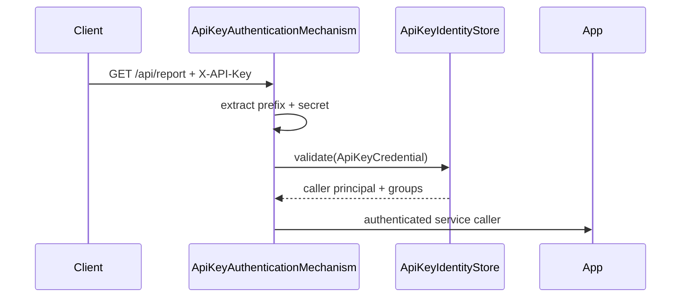

Credential object:

```java
public final class ApiKeyCredential implements Credential {
    private final String keyPrefix;
    private final String secret;

    public ApiKeyCredential(String keyPrefix, String secret) {
        this.keyPrefix = keyPrefix;
        this.secret = secret;
    }

    public String keyPrefix() {
        return keyPrefix;
    }

    public String secret() {
        return secret;
    }
}
```

Mechanism:

```java
@ApplicationScoped
public class ApiKeyAuthenticationMechanism implements HttpAuthenticationMechanism {

    @Inject
    IdentityStoreHandler identityStoreHandler;

    @Override
    public AuthenticationStatus validateRequest(
            HttpServletRequest request,
            HttpServletResponse response,
            HttpMessageContext context) throws AuthenticationException {

        String header = request.getHeader("X-API-Key");

        if (header == null || header.isBlank()) {
            return context.doNothing();
        }

        ApiKeyCredential credential = parseApiKey(header);
        CredentialValidationResult result = identityStoreHandler.validate(credential);

        if (result.getStatus() == CredentialValidationResult.Status.VALID) {
            return context.notifyContainerAboutLogin(
                    result.getCallerPrincipal(),
                    result.getCallerGroups()
            );
        }

        response.setStatus(HttpServletResponse.SC_UNAUTHORIZED);
        return context.responseUnauthorized();
    }

    private ApiKeyCredential parseApiKey(String header) {
        int dot = header.indexOf('.');
        if (dot <= 0 || dot == header.length() - 1) {
            throw new IllegalArgumentException("Malformed API key");
        }
        return new ApiKeyCredential(header.substring(0, dot), header.substring(dot + 1));
    }
}
```

Store:

```java
@ApplicationScoped
public class ApiKeyIdentityStore implements IdentityStore {

    @Inject
    ApiKeyRepository apiKeys;

    @Inject
    SecretVerifier secretVerifier;

    @Override
    public CredentialValidationResult validate(Credential credential) {
        if (!(credential instanceof ApiKeyCredential apiKey)) {
            return CredentialValidationResult.NOT_VALIDATED_RESULT;
        }

        ApiKeyRecord record = apiKeys.findByPrefix(apiKey.keyPrefix()).orElse(null);
        if (record == null) {
            secretVerifier.verifyAgainstDummySecret(apiKey.secret());
            return CredentialValidationResult.INVALID_RESULT;
        }

        if (!record.active()) {
            return CredentialValidationResult.INVALID_RESULT;
        }

        if (!secretVerifier.verify(apiKey.secret(), record.secretHash())) {
            return CredentialValidationResult.INVALID_RESULT;
        }

        return new CredentialValidationResult(
                new CallerPrincipal("service:" + record.serviceAccountId()),
                Set.of("service_client", "api_key_client")
        );
    }
}
```

Important: jangan simpan API key plaintext. Simpan hash secret, gunakan prefix untuk lookup, dan lakukan constant-time verification sebisa mungkin.

---

## 14. Jakarta Security dengan JAX-RS

JAX-RS resource biasanya berada setelah container authentication.

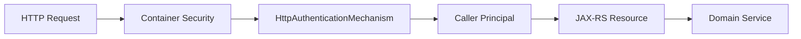

Di resource:

```java
@Path("/orders")
public class OrderResource {

    @Inject
    SecurityContext securityContext;

    @Inject
    OrderApplicationService orders;

    @POST
    @Consumes(MediaType.APPLICATION_JSON)
    public Response create(CreateOrderRequest request) {
        Principal principal = securityContext.getCallerPrincipal();
        if (principal == null) {
            return Response.status(Response.Status.UNAUTHORIZED).build();
        }

        OrderId orderId = orders.createOrder(
                SubjectId.parse(principal.getName()),
                request
        );

        return Response.status(Response.Status.CREATED)
                .entity(Map.of("orderId", orderId.value()))
                .build();
    }
}
```

Pattern yang benar:

```txt
SecurityContext -> SubjectId -> Domain Command -> Authorization/Policy -> Business execution
```

Anti-pattern:

```txt
SecurityContext.isCallerInRole("admin") tersebar di setiap resource method.
```

Untuk domain kompleks, buat adapter:

```java
@RequestScoped
public class CurrentSubject {

    @Inject
    SecurityContext securityContext;

    public Optional<SubjectId> subjectId() {
        Principal principal = securityContext.getCallerPrincipal();
        if (principal == null) {
            return Optional.empty();
        }
        return Optional.of(SubjectId.parse(principal.getName()));
    }

    public boolean hasContainerRole(String role) {
        return securityContext.isCallerInRole(role);
    }
}
```

Lalu resource tidak tahu detail container:

```java
SubjectId subject = currentSubject.subjectId()
        .orElseThrow(UnauthenticatedException::new);
```

---

## 15. Session, Stateless, dan Jakarta Security

Jakarta Security tidak memaksa semua sistem stateful atau stateless. Tetapi mechanism tertentu punya konsekuensi.

| Pattern | State | Cocok untuk |
|---|---|---|
| Form login | biasanya stateful session | browser app server-rendered |
| Basic | stateless per request | internal/simple API; harus TLS |
| API key | stateless per request | machine-to-machine |
| OIDC login | browser session + IdP token lifecycle | SSO web app |
| Bearer token custom | stateless validation atau opaque introspection | API/resource server |

Stateful session flow:

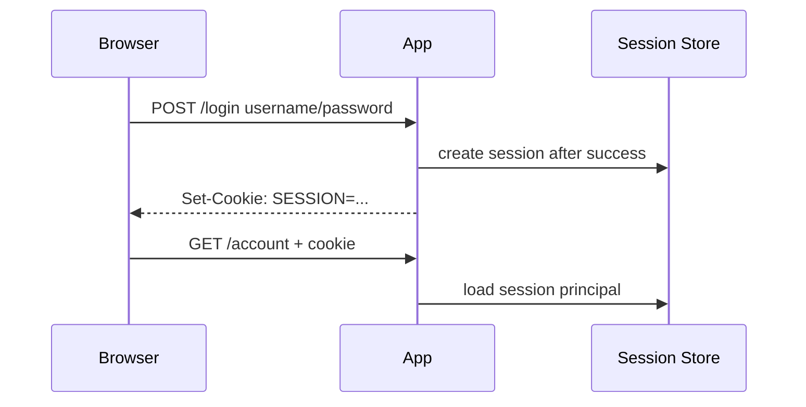

Stateless credential flow:

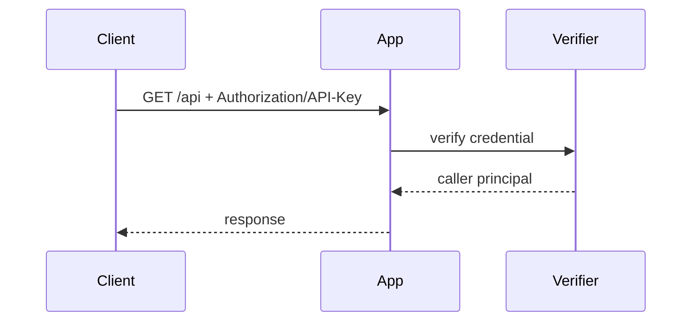

Production decision:

| Requirement | Prefer |
|---|---|
| Browser server-side app | session cookie |
| SPA with BFF | BFF session cookie; token hidden from browser JS |
| Public API | OAuth/OIDC access token |
| Internal service | mTLS, workload identity, client credentials, HMAC depending constraints |
| Legacy partner API | API key/HMAC with rotation and replay defense |

---

## 16. Failure Mode: Context Tidak Konsisten

Salah satu bug paling mahal adalah identity terlihat berbeda di layer berbeda.

Contoh:

```txt
HTTP header says user A
SecurityContext says user B
Domain command says user C
Audit log says user D
```

Ini biasanya terjadi karena:

- custom filter membuat sendiri principal tetapi tidak notify container;
- JAX-RS filter membaca JWT sendiri tanpa sinkron dengan container;
- ThreadLocal tidak dibersihkan;
- async task membawa identity lama;
- reverse proxy menambahkan header identity yang dipercaya app;
- session fixation setelah login;
- tenant id berasal dari path, principal berasal dari token, tetapi tidak divalidasi relasinya.

Invariant:

```txt
For one request, there must be exactly one authenticated subject view.
All downstream layers must derive from the same canonical subject source.
```

Praktik sehat:

```txt
HTTP credential -> container auth -> SecurityContext -> CurrentSubject -> domain command metadata -> audit event
```

Jangan:

```txt
Controller membaca X-User-Id header langsung.
Service membaca session langsung.
Repository membaca tenant context global.
Audit membaca MDC userId yang di-set filter lain.
```

---

## 17. Failure Mode: Group Drift

Group/role sering berubah lebih cepat daripada session.

Scenario:

```txt
08:00 user login, mendapat group "admin"
09:00 admin privilege dicabut di directory
09:05 user masih punya session lama
09:10 user melakukan destructive action
```

Pilihan desain:

| Strategy | Kelebihan | Kekurangan |
|---|---|---|
| Store groups in session | cepat | stale privilege |
| Reload groups per request | fresh | latency tinggi, dependency store |
| Cache groups short TTL | balance | complexity invalidation |
| Token short expiry | limits stale window | refresh complexity |
| Back-channel revocation | kuat | operational complexity |

Production-grade system biasanya menggabungkan:

- short session/role cache TTL untuk role sensitif;
- explicit privilege version di account;
- session invalidation saat role berubah;
- audit event untuk role change;
- step-up auth untuk destructive actions.

---

## 18. Failure Mode: Mechanism Ambiguity

Jakarta Security 4.0 memperkenalkan dukungan lebih baik untuk multiple HTTP authentication mechanisms melalui handler. Tetapi dari sudut desain, multiple mechanisms tetap berbahaya jika tidak punya routing jelas.

Contoh buruk:

```txt
Form login, Basic auth, API key, OIDC, dan custom header semua aktif untuk semua path.
```

Risiko:

- credential downgrade;
- unexpected auth path;
- API client mendapat HTML login page;
- browser request diterima via Basic;
- machine credential diterima di user endpoint;
- audit tidak tahu mechanism mana yang dipakai.

Desain lebih sehat:

| Path | Mechanism |
|---|---|
| `/ui/**` | form/OIDC session |
| `/api/public/**` | no auth or optional auth |
| `/api/user/**` | bearer/session depending architecture |
| `/api/partner/**` | HMAC/API key |
| `/internal/**` | mTLS/service identity |
| `/admin/**` | OIDC + MFA/step-up |

Mermaid:

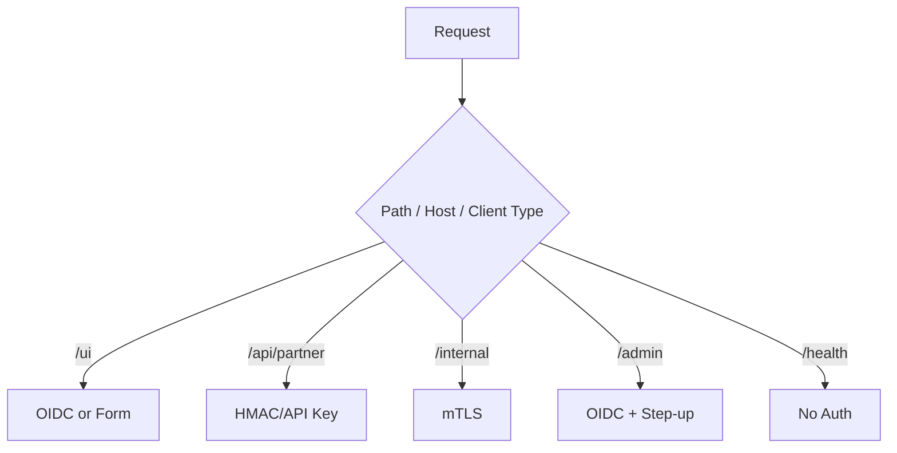

Invariant:

```txt
Authentication mechanism selection must be explicit, deterministic, observable, and testable.
```

---

## 19. Failure Mode: Login Error Leaks

Jakarta Security memberi API, tetapi tidak otomatis menyelamatkan desain error kamu.

Login response yang buruk:

```txt
"User not found"
"Password incorrect"
"Account is disabled"
"Your LDAP account exists but has no group"
```

Ini mempercepat account enumeration dan targeted attack.

Response eksternal yang lebih sehat:

```txt
"Invalid username or password."
```

Internal audit tetap detail:

```json
{
  "eventType": "AUTH_LOGIN_FAILED",
  "reason": "ACCOUNT_DISABLED",
  "subjectCandidateHash": "...",
  "ip": "203.0.113.10",
  "userAgentHash": "...",
  "mechanism": "FORM",
  "tenantId": "tenant_123"
}
```

Boundary:

| Audience | Detail |
|---|---|
| User response | generic |
| Security log | structured and specific |
| Metrics | aggregate reason codes |
| Alerting | anomaly/rate based |
| Support tool | controlled visibility with audit |

---

## 20. Failure Mode: Jakarta API Dipakai untuk Semua IAM

Jakarta Security bukan full IAM platform.

Ia tidak otomatis menyediakan:

- full user lifecycle management;
- account registration policy;
- password reset design;
- MFA orchestration lengkap;
- device management;
- passkey management;
- identity proofing;
- risk scoring;
- tenant lifecycle;
- consent management;
- SCIM provisioning;
- advanced token exchange;
- enterprise federation governance.

Gunakan Jakarta Security sebagai **application authentication integration layer**.

Untuk sistem besar, architecture-nya sering:

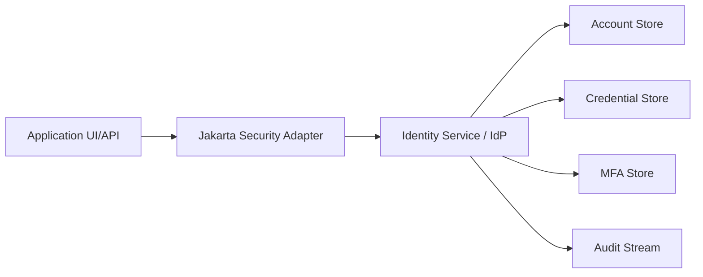

Jakarta app tidak harus menjadi identity platform. Ia bisa menjadi relying party/resource server yang menerima identity dari IdP.

---

## 21. Testing Jakarta Security

Minimal test matrix:

| Test | Tujuan |
|---|---|
| valid login | caller principal terbentuk |
| invalid password | response generic |
| unknown user | response sama dengan invalid password |
| disabled account | response generic, audit specific |
| public endpoint | tidak memaksa login |
| protected endpoint | challenge/401 |
| role check | group mapping benar |
| group change | stale privilege behavior terdefinisi |
| store down | fail closed |
| multiple mechanisms | path routing deterministic |
| logout | session/context cleared |
| async execution | identity tidak bocor |

Contoh black-box test:

```java
@Test
void invalidUserAndWrongPasswordHaveSameExternalShape() {
    HttpResponse<String> unknownUser = postLogin("unknown@example.com", "whatever");
    HttpResponse<String> wrongPassword = postLogin("alice@example.com", "wrong");

    assertEquals(401, unknownUser.statusCode());
    assertEquals(401, wrongPassword.statusCode());
    assertEquals(normalize(unknownUser.body()), normalize(wrongPassword.body()));
}
```

Contoh role assertion:

```java
@Test
void authenticatedCallerReceivesExpectedRole() {
    Session session = login("operator@example.com", "correct-password");

    HttpResponse<String> response = get("/ops/dashboard", session.cookie());

    assertEquals(200, response.statusCode());
}
```

---

## 22. Production Checklist

### Mechanism

- [ ] mechanism selection explicit by route/client type;
- [ ] public endpoints do not trigger login loops;
- [ ] API endpoints do not return HTML login unexpectedly;
- [ ] malformed credentials handled safely;
- [ ] all failed login responses are generic;
- [ ] credential extraction has size limits;
- [ ] CORS preflight handled before auth challenge where appropriate;
- [ ] CSRF enforced for browser form/session flows;
- [ ] redirect targets validated;
- [ ] audit event includes mechanism name.

### Store

- [ ] store returns `NOT_VALIDATED` for unsupported credential type;
- [ ] store returns `INVALID` for supported but wrong credential;
- [ ] no plaintext secret stored;
- [ ] dummy verification used where timing leak matters;
- [ ] account status handled as internal reason only;
- [ ] password hash migration planned;
- [ ] groups normalized before use;
- [ ] tenant boundary included in lookup;
- [ ] store unavailable behavior is fail closed;
- [ ] security-relevant changes emit audit events.

### Context

- [ ] application reads canonical identity from `SecurityContext` or a wrapper;
- [ ] no controller trusts `X-User-Id` from external clients;
- [ ] subject id is stable and opaque;
- [ ] tenant id and subject relationship validated;
- [ ] audit subject matches `SecurityContext` subject;
- [ ] async execution does not leak caller;
- [ ] logout clears session/context;
- [ ] role/group staleness is bounded.

---

## 23. Design Drill

Desain Jakarta Security untuk aplikasi case management internal:

Requirement:

```txt
- UI browser memakai enterprise OIDC.
- Admin endpoint butuh step-up MFA di IdP.
- Partner API memakai HMAC request signing.
- Internal service endpoint memakai mTLS.
- Semua audit event harus punya subject, tenant, mechanism, assurance level.
- Role external dari IdP harus dimapping ke role internal.
```

Jawaban yang diharapkan bukan satu class besar.

Model yang sehat:

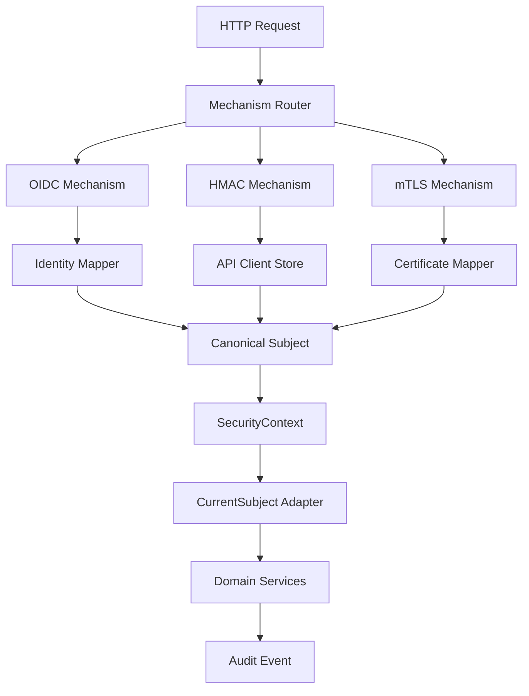

Key invariant:

```txt
Every mechanism must normalize into one canonical subject model.
```

---

## 24. Apa yang Harus Diingat

Jakarta Security membuat autentikasi Jakarta EE menjadi lebih terstruktur, tetapi ia tidak menggantikan desain identity yang benar.

Ringkasnya:

```txt
HttpAuthenticationMechanism = HTTP adapter
Credential = proof container
IdentityStore = proof verifier + group provider
CredentialValidationResult = result contract
SecurityContext = application view of authenticated caller
Container = binding layer between auth result and request execution
```

Production engineer harus menjaga invariant:

1. Satu request punya satu canonical subject.
2. Credential extraction tidak dicampur dengan domain identity lifecycle.
3. Store membedakan unsupported credential vs invalid credential.
4. Error eksternal generic, log internal specific.
5. Role/group mapping explicit dan tidak stale tanpa batas.
6. Multi-mechanism routing deterministic.
7. Jakarta Security dipakai sebagai integration layer, bukan seluruh IAM platform.

---

## 25. Referensi

- Jakarta Security 4.0 Specification — `https://jakarta.ee/specifications/security/4.0/jakarta-security-spec-4.0`
- Jakarta Security 4.0 Release Page — `https://jakarta.ee/specifications/security/4.0/`
- Jakarta Security API: `OpenIdAuthenticationMechanismDefinition` — `https://jakarta.ee/specifications/security/4.0/apidocs/jakarta.security/jakarta/security/enterprise/authentication/mechanism/http/openidauthenticationmechanismdefinition`
- Jakarta Security API: `FormAuthenticationMechanismDefinition` — `https://jakarta.ee/specifications/security/4.0/apidocs/jakarta.security/jakarta/security/enterprise/authentication/mechanism/http/formauthenticationmechanismdefinition`
- Jakarta Security Identity Store package — `https://javadoc.io/static/jakarta.security.enterprise/jakarta.security.enterprise-api/4.0.0-M2/jakarta.security/jakarta/security/enterprise/identitystore/package-summary.html`
- Jakarta Security `UsernamePasswordCredential` API — `https://jakarta.ee/specifications/security/3.0/apidocs/jakarta.security/jakarta/security/enterprise/credential/usernamepasswordcredential`
- OWASP Authentication Cheat Sheet — `https://cheatsheetseries.owasp.org/cheatsheets/Authentication_Cheat_Sheet.html`
