# Part 008 — User Identity Domain Model

> Target part ini: kita membangun model domain identity yang cukup kuat untuk mendukung password login, session, token, API key, OIDC federation, MFA, passkeys, recovery, tenant-aware auth, audit, dan incident response. Ini bukan sekadar tabel `users(id,email,password)`.

Banyak sistem autentikasi gagal bukan karena library-nya jelek. Mereka gagal karena domain model-nya terlalu miskin.

Model buruk:

```sql
create table users (
  id bigint primary key,
  email varchar(255),
  password varchar(255),
  role varchar(50)
);
```

Itu cukup untuk demo. Untuk production, model ini lemah karena:

- email dianggap identity permanen;
- password disimpan satu kolom tanpa lifecycle;
- tidak ada credential version;
- tidak ada session model;
- tidak ada status state machine;
- tidak ada MFA/passkey;
- role dicampur ke account;
- tenant tidak dimodelkan;
- recovery tidak terlihat;
- audit tidak bisa menjawab “siapa melakukan apa, dengan assurance apa?”;
- incident response tidak bisa revoke selektif.

Authentication system yang baik harus menjawab:

```txt
Siapa subjeknya?
Credential apa yang membuktikan subjek itu?
Authenticator apa yang terdaftar?
Session/token mana yang aktif?
Tenant mana yang sedang diakses?
Apa level assurance authentication saat ini?
Apakah identity itu user manusia, service account, device, atau external principal?
Bagaimana identity berubah sepanjang lifecycle?
Bagaimana kita revoke saat compromise?
```

---

## 1. Prinsip Utama

Identity domain model harus memisahkan hal-hal yang sering dicampur:

| Konsep | Jangan dicampur dengan |
|---|---|
| Person | Account login |
| Account | Credential |
| Subject | Email/username |
| Credential | Authenticator |
| Session | Token |
| Tenant membership | Global account |
| Role | Permission |
| Login identifier | Immutable subject id |
| Authentication event | Business audit event |
| Recovery channel | MFA authenticator |

Prinsip paling penting:

> **Identifier yang dipakai sebagai subject internal harus stable, opaque, dan tidak bergantung pada email/username.**

Email bisa berubah. Username bisa rename. Nomor telepon bisa berpindah pemilik. External IdP subject bisa berbeda per client/tenant. Tapi `subject_id` internal harus stabil.

---

## 2. Mental Model: Identity Graph

Untuk sistem kecil, kamu melihat user sebagai row. Untuk sistem besar, identity adalah graph.

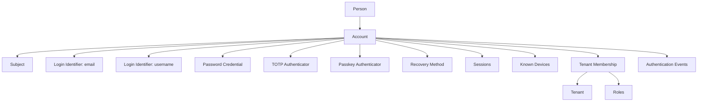

Bentuk graf ini membuat desain lebih tahan terhadap perubahan:

- satu person bisa punya lebih dari satu account;
- satu account bisa punya banyak identifier;
- satu account bisa punya banyak authenticator;
- satu account bisa menjadi member di banyak tenant;
- satu session bisa punya assurance level tertentu;
- satu credential bisa dirotasi tanpa mengganti subject;
- satu external identity bisa linked/unlinked.

---

## 3. Core Aggregate

Dalam domain-driven design, jangan buru-buru membuat satu aggregate raksasa `User`.

Pisahkan boundary:

| Aggregate / Entity | Fungsi |
|---|---|
| `Account` | lifecycle login identity manusia/service |
| `Subject` | canonical authenticated identity |
| `LoginIdentifier` | email/username/phone/external alias untuk lookup |
| `Credential` | secret/verifier yang membuktikan klaim |
| `Authenticator` | faktor autentikasi terdaftar, misalnya TOTP/passkey |
| `Session` | authenticated continuity state |
| `TenantMembership` | hubungan account dengan tenant |
| `RecoveryMethod` | channel/prosedur recovery |
| `DeviceBinding` | device/browser/client binding |
| `AuthenticationEvent` | immutable evidence trail |
| `RiskSignal` | sinyal untuk adaptive auth |

Jika kamu menamai semuanya `User`, sistem akan cepat membusuk.

---

## 4. Account Bukan Person

`Person` adalah manusia di dunia nyata. `Account` adalah representasi login di sistem.

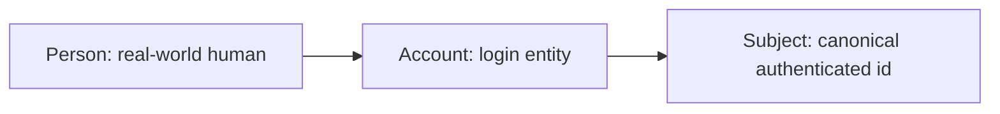

Kenapa dipisah?

| Scenario | Dampak jika dicampur |
|---|---|
| Employee punya admin account dan normal account | privilege separation kacau |
| Customer merged dari dua source | login identity ikut rusak |
| Support impersonation | audit tidak bisa bedakan actor vs target |
| Person resign tetapi account service tetap aktif | lifecycle campur |
| Legal identity berubah nama/email | subject berubah padahal audit harus stabil |

Minimal model:

```java
public record PersonId(UUID value) {}
public record AccountId(UUID value) {}
public record SubjectId(String value) {}

public final class Account {
    private final AccountId id;
    private final SubjectId subjectId;
    private final Optional<PersonId> personId;
    private AccountStatus status;
    private AccountType type;
    private long credentialVersion;
    private long privilegeVersion;

    // behavior, not just getters
}
```

`AccountType`:

```java
public enum AccountType {
    HUMAN,
    SERVICE,
    ROBOT,
    BREAK_GLASS,
    EXTERNAL_FEDERATED
}
```

---

## 5. Subject: Canonical Identity

Subject adalah identity yang sudah dinormalisasi setelah autentikasi.

```txt
credential proof -> account -> subject
```

Subject internal sebaiknya:

- opaque;
- immutable;
- globally unique atau tenant-scoped dengan namespace jelas;
- tidak reusable setelah account delete;
- tidak mengandung PII;
- aman untuk audit log;
- dapat direferensikan dari token/session/audit.

Contoh subject id:

```txt
sub_01J2K7H8EH7Z8T4S9PVK6CJ4C1
acct_01J2K7H8EH7Z8T4S9PVK6CJ4C1
human:01J2K7H8EH7Z8T4S9PVK6CJ4C1
service:billing-worker:prod
```

Yang buruk:

```txt
alice@example.com
+6281234567890
john.doe
42
```

Kenapa email buruk sebagai subject?

```txt
- email bisa berubah
- email bisa dipakai ulang oleh provider/domain tertentu
- email adalah PII
- email expose tenant/company
- email case/normalization kompleks
- email bisa menjadi login identifier, bukan subject identity
```

Invariant:

```txt
Once a subject_id appears in an audit event, it must continue to identify the same logical subject forever.
```

---

## 6. Account Lifecycle State Machine

Account bukan boolean `enabled`.

Production state:

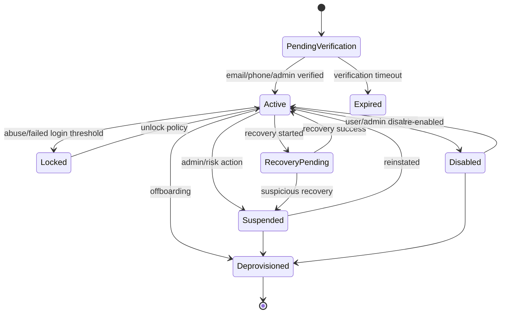

Minimal enum:

```java
public enum AccountStatus {
    PENDING_VERIFICATION,
    ACTIVE,
    LOCKED,
    SUSPENDED,
    RECOVERY_PENDING,
    DISABLED,
    DEPROVISIONED
}
```

Jangan semua status diperlakukan sama.

| Status | Login behavior | External response | Internal reason |
|---|---|---|---|
| `PENDING_VERIFICATION` | deny or limited | generic | email/phone unverified |
| `ACTIVE` | allow | success | valid |
| `LOCKED` | deny temporarily | generic | failed attempt threshold |
| `SUSPENDED` | deny | generic | admin/risk action |
| `RECOVERY_PENDING` | deny or step-up | generic | recovery flow active |
| `DISABLED` | deny | generic | user/admin disabled |
| `DEPROVISIONED` | deny permanently | generic | lifecycle ended |

Invariant:

```txt
External login failure shape must not reveal account status.
Internal audit reason must preserve exact account status.
```

---

## 7. Login Identifier

Login identifier adalah nilai yang user/client pakai untuk menemukan account.

Jenis:

| Identifier | Contoh | Risiko |
|---|---|---|
| Email | `alice@example.com` | PII, normalization, reuse |
| Username | `alice` | enumeration, rename |
| Phone | `+62812...` | reassignment, SIM swap |
| External subject | OIDC `iss+sub` | provider-specific |
| API key prefix | `ak_live_xxx` | leakage correlation |
| Certificate fingerprint | SHA-256 cert hash | rotation |

Model:

```java
public record LoginIdentifierId(UUID value) {}

public final class LoginIdentifier {
    private final LoginIdentifierId id;
    private final AccountId accountId;
    private final LoginIdentifierType type;
    private final String normalizedValueHash;
    private final String displayValueEncrypted;
    private boolean verified;
    private Instant verifiedAt;
    private Instant createdAt;
}

public enum LoginIdentifierType {
    EMAIL,
    USERNAME,
    PHONE,
    OIDC_SUBJECT,
    SAML_NAME_ID,
    API_KEY_PREFIX,
    CERTIFICATE_FINGERPRINT
}
```

Kenapa `normalizedValueHash`?

- lookup cepat tanpa menyimpan PII plaintext sebagai index utama;
- bisa enforce uniqueness;
- audit tidak selalu butuh expose value;
- breach impact lebih kecil.

Namun jangan pura-pura hash email selalu aman. Email punya entropy rendah dan bisa didictionary attack. Untuk data sensitif, gunakan pepper/HMAC dengan secret server-side.

Example:

```java
String normalized = EmailNormalizer.normalize(rawEmail);
String lookupKey = hmacSha256(appPepper, normalized);
```

DB:

```sql
create table login_identifier (
    id uuid primary key,
    account_id uuid not null references account(id),
    type varchar(40) not null,
    normalized_lookup_key bytea not null,
    display_value_ciphertext bytea,
    verified boolean not null default false,
    verified_at timestamptz,
    created_at timestamptz not null,
    unique (type, normalized_lookup_key)
);
```

---

## 8. Credential vs Authenticator

Credential adalah proof/verifier. Authenticator adalah faktor/metode yang user punya atau gunakan.

| Konsep | Contoh |
|---|---|
| Credential | password hash, API key secret hash, private-key public key credential id, TOTP secret encrypted |
| Authenticator | password authenticator, passkey authenticator, TOTP app, hardware key, recovery code set |

Untuk password, credential dan authenticator sering terlihat sama. Untuk passkey/WebAuthn, bedanya jelas:

```txt
Authenticator = security key / platform authenticator
Credential = public key credential registered on server
```

Model generik:

```java
public record CredentialId(UUID value) {}
public record AuthenticatorId(UUID value) {}

public final class Authenticator {
    private final AuthenticatorId id;
    private final AccountId accountId;
    private final AuthenticatorType type;
    private AuthenticatorStatus status;
    private String label;
    private Instant enrolledAt;
    private Instant lastUsedAt;
}

public enum AuthenticatorType {
    PASSWORD,
    TOTP,
    WEBAUTHN_PASSKEY,
    SMS_OTP,
    EMAIL_OTP,
    RECOVERY_CODE,
    API_KEY,
    CLIENT_CERTIFICATE
}
```

Credential:

```java
public final class Credential {
    private final CredentialId id;
    private final AccountId accountId;
    private final Optional<AuthenticatorId> authenticatorId;
    private final CredentialType type;
    private CredentialStatus status;
    private final String algorithm;
    private final int version;
    private final byte[] verifier;
    private Instant createdAt;
    private Instant rotatedAt;
    private Instant expiresAt;
}

public enum CredentialType {
    PASSWORD_HASH,
    API_KEY_HASH,
    TOTP_SECRET,
    WEBAUTHN_PUBLIC_KEY,
    RECOVERY_CODE_HASH,
    CLIENT_CERT_FINGERPRINT,
    FEDERATED_SUBJECT_LINK
}
```

Invariant:

```txt
Credential verification must never require plaintext secret stored server-side unless the protocol inherently requires a decryptable secret, such as TOTP.
```

Even for TOTP, encrypt secret at rest and isolate key management.

---

## 9. Password Credential Model

Password bukan satu kolom. Ia punya lifecycle.

Minimal fields:

```sql
create table password_credential (
    id uuid primary key,
    account_id uuid not null references account(id),
    status varchar(40) not null,
    password_hash text not null,
    algorithm varchar(40) not null,
    parameters jsonb not null,
    version integer not null,
    created_at timestamptz not null,
    last_verified_at timestamptz,
    rotated_at timestamptz,
    must_rotate boolean not null default false,
    compromised_detected_at timestamptz,
    retired_at timestamptz
);
```

Why:

| Field | Reason |
|---|---|
| `algorithm` | support migration from PBKDF2/BCrypt to Argon2 etc |
| `parameters` | cost factor/memory/time/version |
| `version` | optimistic locking and audit |
| `last_verified_at` | detect dormant credentials |
| `must_rotate` | force reset after incident |
| `compromised_detected_at` | breach handling |
| `retired_at` | forensic trail |

Verification result should carry operational signal:

```java
public sealed interface PasswordVerificationResult {
    record Valid(boolean rehashRecommended) implements PasswordVerificationResult {}
    record Invalid() implements PasswordVerificationResult {}
    record Locked() implements PasswordVerificationResult {}
    record MustRotate() implements PasswordVerificationResult {}
}
```

Do not expose these exact reasons to the login response.

---

## 10. Session Model

Session adalah continuity setelah authentication event.

Session bukan account. Session bukan token. Session adalah server-side atau logical state bahwa subject sudah authenticated dengan condition tertentu.

Fields:

```sql
create table auth_session (
    id uuid primary key,
    account_id uuid not null references account(id),
    subject_id varchar(80) not null,
    tenant_id uuid,
    status varchar(40) not null,
    assurance_level varchar(40) not null,
    authentication_method varchar(80) not null,
    authenticated_at timestamptz not null,
    last_seen_at timestamptz not null,
    expires_at timestamptz not null,
    absolute_expires_at timestamptz not null,
    privilege_version bigint not null,
    credential_version bigint not null,
    device_id uuid,
    ip_hash bytea,
    user_agent_hash bytea,
    revoked_at timestamptz,
    revocation_reason varchar(80)
);
```

Session status:

```java
public enum SessionStatus {
    ACTIVE,
    IDLE_EXPIRED,
    ABSOLUTE_EXPIRED,
    LOGGED_OUT,
    REVOKED,
    REAUTH_REQUIRED,
    COMPROMISED
}
```

Important distinction:

| Expiry | Meaning |
|---|---|
| Idle expiry | no activity for duration |
| Absolute expiry | session cannot live beyond max age |
| Step-up expiry | high-assurance action window expired |
| Token expiry | bearer/reference token validity |
| Refresh expiry | ability to mint new access token |

State machine:

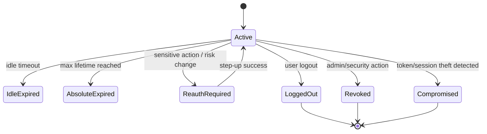

Invariant:

```txt
Session must bind to subject, authentication method, assurance level, and privilege/credential version.
```

Why `privilege_version`?

If roles change, you can invalidate sessions whose privilege version is stale.

Why `credential_version`?

If password/MFA changes, you can revoke sessions minted with old credential state.

---

## 11. Token Model

Token may be JWT, opaque token, refresh token, remember-me token, API key, or recovery token. They are not the same.

| Token type | Holder | Revocation need | Storage |
|---|---|---|---|
| Access JWT | client | short-lived; hard revocation | usually not stored fully |
| Opaque access token | client | introspection/revocation easy | hash/reference stored |
| Refresh token | client | must support rotation/reuse detection | hash stored |
| Remember-me token | browser | must revoke on logout/security event | hash stored |
| Recovery token | user email/device | one-time, short-lived | hash stored |
| API key | partner/service | rotation and scope | prefix + hash |

Generic token table:

```sql
create table auth_token (
    id uuid primary key,
    token_family_id uuid,
    account_id uuid references account(id),
    subject_id varchar(80) not null,
    client_id varchar(120),
    token_type varchar(40) not null,
    token_lookup_key bytea not null,
    token_hash bytea not null,
    status varchar(40) not null,
    scope text[] not null default '{}',
    audience text[] not null default '{}',
    issued_at timestamptz not null,
    expires_at timestamptz not null,
    last_used_at timestamptz,
    rotated_from uuid,
    revoked_at timestamptz,
    revocation_reason varchar(80),
    unique (token_lookup_key)
);
```

Never store bearer token plaintext.

Refresh token family model:

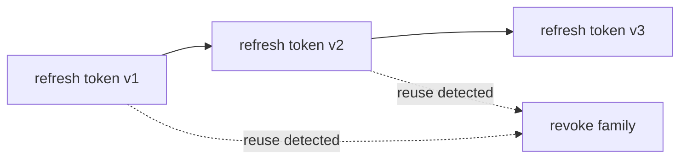

Invariant:

```txt
A refresh token that has been rotated must not be accepted again.
Reuse means possible theft and should revoke the token family.
```

---

## 12. Tenant Membership Model

Multi-tenant auth fails when tenant is treated as request parameter only.

Wrong:

```txt
GET /tenant/{tenantId}/cases
Authorization: Bearer token for account A

Controller trusts tenantId from path.
```

Correct:

```txt
tenantId from request must be checked against subject membership and token/session claims.
```

Model:

```sql
create table tenant_membership (
    id uuid primary key,
    tenant_id uuid not null references tenant(id),
    account_id uuid not null references account(id),
    status varchar(40) not null,
    membership_type varchar(40) not null,
    role_version bigint not null,
    joined_at timestamptz not null,
    suspended_at timestamptz,
    unique (tenant_id, account_id)
);

create table tenant_role_assignment (
    id uuid primary key,
    membership_id uuid not null references tenant_membership(id),
    role_key varchar(120) not null,
    assigned_at timestamptz not null,
    assigned_by_subject_id varchar(80)
);
```

State:

```java
public enum TenantMembershipStatus {
    INVITED,
    ACTIVE,
    SUSPENDED,
    REMOVED
}
```

Tenant resolution pipeline:

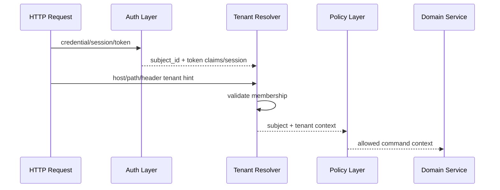

Invariant:

```txt
A tenant hint is not tenant authorization.
```

---

## 13. External Identity Link

OIDC/SAML federation introduces external identity.

Do not replace internal subject with raw external claims.

Model:

```sql
create table external_identity_link (
    id uuid primary key,
    account_id uuid not null references account(id),
    provider_key varchar(120) not null,
    issuer varchar(500) not null,
    external_subject varchar(500) not null,
    external_subject_lookup_key bytea not null,
    status varchar(40) not null,
    linked_at timestamptz not null,
    last_login_at timestamptz,
    unique (provider_key, issuer, external_subject_lookup_key)
);
```

Why `issuer + subject`?

In OIDC, `sub` is meaningful under an issuer. A `sub` alone is not globally meaningful.

Flow:

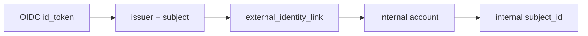

Invariant:

```txt
External identity proves a link. Application audit uses internal subject.
```

---

## 14. MFA / Authenticator Enrollment Model

MFA is not a boolean `mfa_enabled`.

You need:

- which authenticators are enrolled;
- which are verified;
- which are usable for login vs step-up;
- backup/recovery method;
- last used timestamp;
- compromised/revoked state;
- enrollment assurance;
- factor type.

Table:

```sql
create table authenticator (
    id uuid primary key,
    account_id uuid not null references account(id),
    type varchar(40) not null,
    status varchar(40) not null,
    label varchar(120),
    verified boolean not null default false,
    enrolled_at timestamptz not null,
    verified_at timestamptz,
    last_used_at timestamptz,
    revoked_at timestamptz,
    metadata jsonb not null default '{}'
);
```

Specific tables:

```sql
create table totp_authenticator_secret (
    authenticator_id uuid primary key references authenticator(id),
    secret_ciphertext bytea not null,
    secret_key_id varchar(120) not null,
    period_seconds integer not null,
    digits integer not null,
    algorithm varchar(20) not null
);

create table webauthn_credential (
    authenticator_id uuid not null references authenticator(id),
    credential_id bytea primary key,
    public_key_cose bytea not null,
    sign_count bigint,
    transports text[] not null default '{}',
    backup_eligible boolean,
    backup_state boolean,
    attestation_type varchar(80),
    aaguid uuid
);
```

MFA enrollment state:

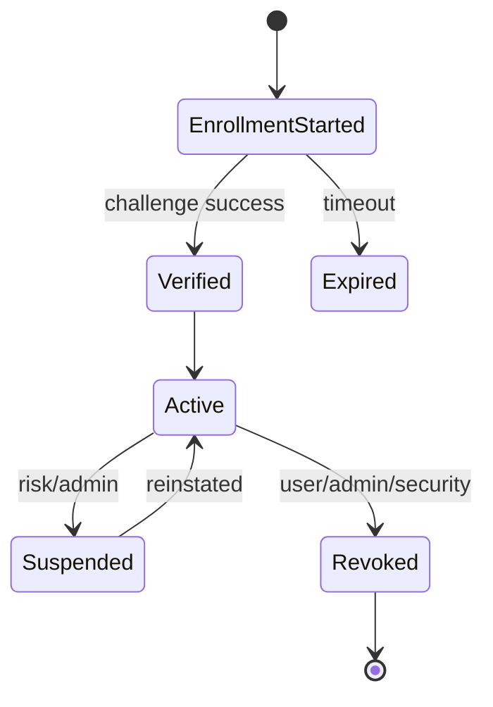

Invariant:

```txt
An authenticator is not trusted until enrollment proof is verified.
```

---

## 15. Recovery Model

Recovery is often the weakest part of authentication.

Do not model recovery as just `reset_token` on user row.

Recovery needs:

- request event;
- channel;
- token hash;
- expiry;
- one-time consumption;
- risk evaluation;
- session invalidation after success;
- credential version increment;
- audit chain.

Table:

```sql
create table account_recovery_request (
    id uuid primary key,
    account_id uuid references account(id),
    login_identifier_lookup_key bytea,
    status varchar(40) not null,
    channel varchar(40) not null,
    token_hash bytea not null,
    requested_at timestamptz not null,
    expires_at timestamptz not null,
    consumed_at timestamptz,
    ip_hash bytea,
    user_agent_hash bytea,
    risk_score integer,
    failure_reason varchar(80)
);
```

State machine:

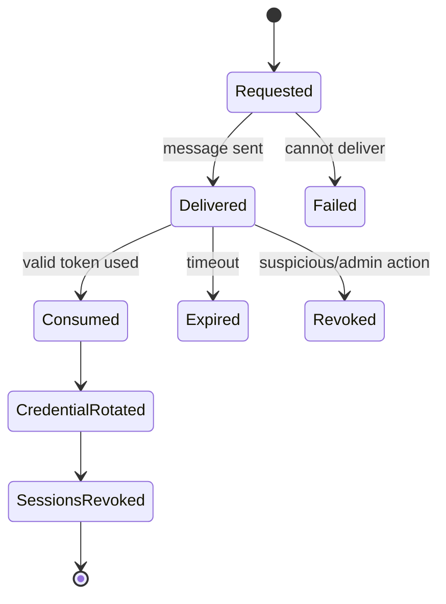

Invariant:

```txt
Successful recovery should rotate the affected credential and revoke existing sessions unless policy explicitly says otherwise.
```

---

## 16. Device Model

Device model is a risk signal, not absolute identity.

A cookie/browser fingerprint/device id can help risk-based authentication, but it is not proof of identity by itself.

Table:

```sql
create table known_device (
    id uuid primary key,
    account_id uuid not null references account(id),
    device_binding_hash bytea not null,
    label varchar(120),
    first_seen_at timestamptz not null,
    last_seen_at timestamptz not null,
    last_ip_hash bytea,
    last_user_agent_hash bytea,
    status varchar(40) not null,
    trust_level varchar(40) not null,
    unique (account_id, device_binding_hash)
);
```

Device status:

```java
public enum DeviceStatus {
    NEW,
    RECOGNIZED,
    TRUSTED,
    SUSPICIOUS,
    REVOKED
}
```

Rule:

```txt
Known device can reduce friction.
Known device must not bypass required authenticator for high-risk action.
```

---

## 17. Risk Signal Model

Risk signal should be append-only or at least auditable.

Examples:

| Signal | Meaning |
|---|---|
| failed login velocity | brute force / stuffing |
| impossible travel | geo anomaly |
| new device | unknown client |
| ASN change | network anomaly |
| password breach match | credential compromise |
| refresh token reuse | token theft |
| MFA fatigue pattern | push bombing |
| recovery requested after password fail | takeover attempt |

Model:

```sql
create table auth_risk_signal (
    id uuid primary key,
    account_id uuid references account(id),
    subject_id varchar(80),
    tenant_id uuid,
    signal_type varchar(80) not null,
    severity varchar(40) not null,
    score integer not null,
    observed_at timestamptz not null,
    source varchar(80) not null,
    attributes jsonb not null default '{}'
);
```

Adaptive auth uses risk signals:

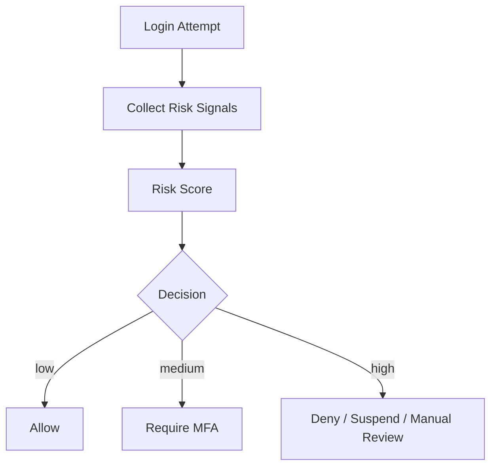

Invariant:

```txt
Risk signal influences authentication flow; it should not silently mutate account status without auditable decision.
```

---

## 18. Authentication Event Model

Authentication events are forensic evidence.

Do not rely only on application logs.

Event table / stream payload:

```json
{
  "eventId": "evt_01J2...",
  "eventType": "AUTH_LOGIN_SUCCEEDED",
  "occurredAt": "2026-07-03T10:15:30Z",
  "subjectId": "sub_01J2...",
  "accountId": "acc_01J2...",
  "tenantId": "tenant_01J2...",
  "mechanism": "PASSWORD_SESSION",
  "assuranceLevel": "AAL2",
  "credentialId": "cred_01J2...",
  "authenticatorId": "authn_01J2...",
  "sessionId": "sess_01J2...",
  "clientId": "web-bff",
  "ipHash": "...",
  "userAgentHash": "...",
  "outcome": "SUCCESS",
  "reason": "VALID_PASSWORD_AND_TOTP",
  "correlationId": "req_01J2..."
}
```

Event types:

| Event | Trigger |
|---|---|
| `AUTH_LOGIN_STARTED` | login request begins |
| `AUTH_LOGIN_SUCCEEDED` | authentication success |
| `AUTH_LOGIN_FAILED` | credential/status failure |
| `AUTH_STEP_UP_REQUIRED` | assurance insufficient |
| `AUTH_STEP_UP_SUCCEEDED` | MFA/passkey success |
| `AUTH_SESSION_CREATED` | session minted |
| `AUTH_SESSION_REVOKED` | explicit revocation |
| `AUTH_PASSWORD_CHANGED` | password rotation |
| `AUTH_RECOVERY_REQUESTED` | recovery started |
| `AUTH_RECOVERY_CONSUMED` | recovery token used |
| `AUTH_API_KEY_CREATED` | API key created |
| `AUTH_API_KEY_REVOKED` | API key revoked |
| `AUTH_EXTERNAL_IDENTITY_LINKED` | OIDC/SAML link created |

Invariant:

```txt
Every security-relevant authentication state transition must produce an audit event.
```

---

## 19. Assurance Level in Domain Model

Authentication is not binary.

A session created by password-only login is not equivalent to:

- password + TOTP;
- passkey user verification;
- enterprise OIDC with MFA;
- service account mTLS;
- recovery-token login.

Model:

```java
public enum AuthenticationAssuranceLevel {
    AAL1,
    AAL2,
    AAL3,
    INTERNAL_SERVICE,
    RECOVERY_LIMITED,
    UNKNOWN
}
```

Do not overclaim NIST AAL unless your implementation satisfies the actual requirements. But as internal model, assurance level is useful.

Use cases:

| Action | Required assurance |
|---|---|
| View own profile | password/session acceptable |
| Change email | recent auth + MFA |
| Change password | recent auth or recovery flow |
| Create API key | MFA/passkey step-up |
| Disable another user | admin role + high assurance |
| Export regulated data | high assurance + tenant policy |

Store on session:

```java
public record AuthenticatedSession(
    SessionId id,
    SubjectId subjectId,
    TenantId tenantId,
    AuthenticationAssuranceLevel assuranceLevel,
    Set<AuthenticationMethod> methods,
    Instant authenticatedAt,
    Instant stepUpExpiresAt
) {}
```

Invariant:

```txt
Authorization for sensitive operations should check freshness and assurance, not only role.
```

---

## 20. Java Package Boundary

A maintainable Java auth system should not put everything in `security`.

Suggested packages:

```txt
com.example.identity.account
com.example.identity.credential
com.example.identity.authenticator
com.example.identity.session
com.example.identity.tenant
com.example.identity.recovery
com.example.identity.risk
com.example.identity.audit
com.example.identity.federation
com.example.identity.api
com.example.identity.infrastructure
```

Better:

```txt
identity-core
  Account, SubjectId, Credential, Authenticator, Session domain model

identity-application
  LoginService, RegisterCredentialService, RevokeSessionService

identity-adapters-jakarta
  HttpAuthenticationMechanism, IdentityStore, SecurityContext adapter

identity-adapters-spring
  AuthenticationProvider, SecurityFilterChain adapter

identity-infrastructure-postgres
  repositories, SQL mapping

identity-infrastructure-redis
  rate limit/session cache/token cache

identity-events
  audit event schema and publisher
```

Why separate adapters?

Because authentication domain should survive framework migration:

```txt
Spring Security today
Jakarta Security tomorrow
OIDC external IdP next year
```

The core invariants remain.

---

## 21. Application Services

Avoid placing all logic in filters/providers.

Core services:

| Service | Responsibility |
|---|---|
| `LoginApplicationService` | orchestrates login attempt |
| `CredentialVerificationService` | verifies credential and migration signal |
| `AccountStatusPolicy` | decides account state behavior |
| `SessionService` | creates/revokes/validates sessions |
| `MfaChallengeService` | creates and verifies step-up challenges |
| `RecoveryService` | password/account recovery flow |
| `ExternalIdentityLinkService` | maps IdP identity to account |
| `RiskEvaluationService` | evaluates login context |
| `AuthenticationAuditService` | emits immutable auth events |

Login orchestration:

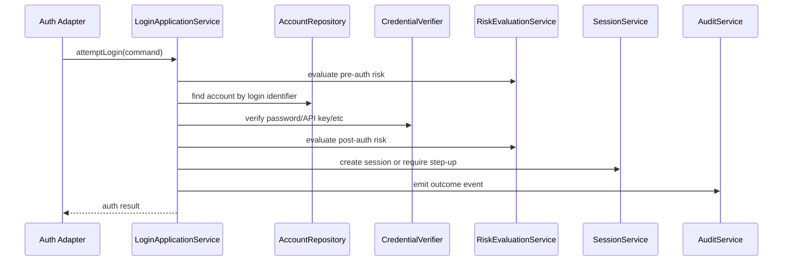

Command:

```java
public record LoginAttemptCommand(
    TenantHint tenantHint,
    LoginIdentifierInput loginIdentifier,
    PresentedCredential credential,
    ClientContext clientContext,
    Instant attemptedAt,
    CorrelationId correlationId
) {}
```

Result:

```java
public sealed interface LoginAttemptResult {
    record Success(SubjectId subjectId, SessionId sessionId, AuthenticationAssuranceLevel aal)
            implements LoginAttemptResult {}
    record StepUpRequired(SubjectId subjectId, ChallengeId challengeId)
            implements LoginAttemptResult {}
    record Failed(GenericFailureReason publicReason, InternalFailureReason internalReason)
            implements LoginAttemptResult {}
}
```

External adapter only sees what it needs to render HTTP response.

---

## 22. Database Schema: Production Skeleton

A pragmatic first schema:

```sql
create table account (
    id uuid primary key,
    subject_id varchar(80) not null unique,
    person_id uuid,
    type varchar(40) not null,
    status varchar(40) not null,
    credential_version bigint not null default 0,
    privilege_version bigint not null default 0,
    created_at timestamptz not null,
    updated_at timestamptz not null,
    deprovisioned_at timestamptz
);

create table login_identifier (
    id uuid primary key,
    account_id uuid not null references account(id),
    type varchar(40) not null,
    normalized_lookup_key bytea not null,
    display_value_ciphertext bytea,
    verified boolean not null default false,
    verified_at timestamptz,
    created_at timestamptz not null,
    unique (type, normalized_lookup_key)
);

create table credential (
    id uuid primary key,
    account_id uuid not null references account(id),
    authenticator_id uuid,
    type varchar(40) not null,
    status varchar(40) not null,
    algorithm varchar(80),
    parameters jsonb not null default '{}',
    verifier bytea not null,
    version integer not null,
    created_at timestamptz not null,
    last_verified_at timestamptz,
    rotated_at timestamptz,
    expires_at timestamptz,
    revoked_at timestamptz
);

create table authenticator (
    id uuid primary key,
    account_id uuid not null references account(id),
    type varchar(40) not null,
    status varchar(40) not null,
    label varchar(120),
    verified boolean not null default false,
    enrolled_at timestamptz not null,
    verified_at timestamptz,
    last_used_at timestamptz,
    revoked_at timestamptz,
    metadata jsonb not null default '{}'
);

create table auth_session (
    id uuid primary key,
    account_id uuid not null references account(id),
    subject_id varchar(80) not null,
    tenant_id uuid,
    status varchar(40) not null,
    assurance_level varchar(40) not null,
    authentication_method varchar(80) not null,
    authenticated_at timestamptz not null,
    last_seen_at timestamptz not null,
    expires_at timestamptz not null,
    absolute_expires_at timestamptz not null,
    privilege_version bigint not null,
    credential_version bigint not null,
    revoked_at timestamptz,
    revocation_reason varchar(80)
);

create table authentication_event (
    id uuid primary key,
    event_type varchar(80) not null,
    occurred_at timestamptz not null,
    account_id uuid,
    subject_id varchar(80),
    tenant_id uuid,
    mechanism varchar(80),
    assurance_level varchar(40),
    outcome varchar(40) not null,
    reason varchar(120),
    correlation_id varchar(120),
    attributes jsonb not null default '{}'
);
```

Indexes:

```sql
create index idx_account_subject on account(subject_id);
create index idx_login_identifier_lookup on login_identifier(type, normalized_lookup_key);
create index idx_credential_account_type_status on credential(account_id, type, status);
create index idx_session_subject_status on auth_session(subject_id, status);
create index idx_session_expires on auth_session(expires_at);
create index idx_auth_event_subject_time on authentication_event(subject_id, occurred_at desc);
create index idx_auth_event_type_time on authentication_event(event_type, occurred_at desc);
```

---

## 23. Invariant Catalogue

Use these as code review rules.

### Identity

```txt
I-001: subject_id is stable and opaque.
I-002: login identifier is not subject identity.
I-003: deleted/deprovisioned subject_id is never reused.
I-004: account type is explicit: human, service, break-glass, external.
```

### Credential

```txt
C-001: no bearer secret stored plaintext.
C-002: credential has status and version.
C-003: password hash algorithm and parameters are stored.
C-004: credential rotation increments account credential_version.
C-005: unsupported credential type is not treated as invalid proof by unrelated verifier.
```

### Session

```txt
S-001: session binds subject_id, account_id, assurance level, credential_version, and privilege_version.
S-002: logout/revocation changes server-side state where possible.
S-003: role/privilege changes can invalidate stale sessions.
S-004: session cannot outlive absolute expiry.
S-005: step-up freshness is separately tracked.
```

### Tenant

```txt
T-001: tenant hint is not tenant authorization.
T-002: subject membership must be checked before tenant-scoped operation.
T-003: cross-tenant identity links must be explicit.
T-004: audit event includes tenant when operation is tenant-scoped.
```

### Audit

```txt
A-001: every auth state transition emits an event.
A-002: external error is generic; internal event has exact reason.
A-003: audit subject comes from canonical authenticated subject.
A-004: impersonation records actor and target separately.
```

---

## 24. Anti-Patterns

### Anti-pattern 1: `users.role`

```sql
alter table users add column role varchar(30);
```

Problem:

- cannot model multi-tenant roles;
- cannot audit assignment;
- cannot support multiple roles;
- cannot version privilege;
- cannot represent external group mapping.

Better:

```txt
tenant_membership -> role_assignment -> policy/permission
```

### Anti-pattern 2: Email as Primary Key

Problem:

- email changes;
- PII leakage;
- provider/domain normalization;
- account recovery complications;
- audit instability.

Better:

```txt
subject_id/account_id as immutable id
email as login_identifier
```

### Anti-pattern 3: Boolean MFA

```sql
mfa_enabled boolean
```

Problem:

- cannot know factor type;
- cannot revoke one device;
- cannot track enrollment verification;
- cannot model passkeys;
- cannot handle backup codes;
- cannot assess assurance.

Better:

```txt
authenticator table + authenticator-specific credential table
```

### Anti-pattern 4: Password Reset Token on User Row

Problem:

- cannot audit multiple recovery attempts;
- race conditions;
- no token family/state;
- weak incident response.

Better:

```txt
account_recovery_request as independent lifecycle object
```

### Anti-pattern 5: Session Without Version

Problem:

```txt
User's admin role revoked, but old session still says admin.
```

Better:

```txt
session.privilege_version must match account.privilege_version
```

---

## 25. Implementation Path

Build in this order:

```txt
1. SubjectId and Account aggregate
2. LoginIdentifier model with normalization/lookup key
3. Credential model with password hash metadata
4. AuthenticationEvent append-only publisher
5. LoginApplicationService with generic external failure
6. Session model with credential/privilege version
7. TenantMembership model
8. Authenticator model for MFA/passkey
9. Recovery request model
10. Risk signal model
```

Do not start with JWT. Start with identity state.

Why?

```txt
A token is just a transport artifact.
The hard problem is the identity lifecycle behind it.
```

---

## 26. Exercises

### Exercise 1 — Refactor Demo User Table

Given:

```sql
users(id, email, password, role, enabled)
```

Refactor into production model supporting:

- email login;
- password hash migration;
- account lock;
- session revocation after password change;
- tenant-specific roles;
- audit event.

Expected entities:

```txt
account
login_identifier
credential
auth_session
tenant_membership
tenant_role_assignment
authentication_event
```

### Exercise 2 — Design External Identity Link

Requirement:

```txt
Users can login via company OIDC.
Some users also have password fallback.
Email from IdP can change.
```

Design:

- link key;
- account matching policy;
- audit event;
- unlink policy;
- fallback login risk.

Expected answer:

```txt
issuer + external sub -> external_identity_link -> account -> subject
email only as claim, not identity key
```

### Exercise 3 — Incident Response

Scenario:

```txt
A user's password is leaked.
They have 4 sessions, 2 refresh tokens, 1 API key, and 1 passkey.
```

Design revocation:

- mark password credential compromised;
- increment credential version;
- revoke sessions tied to old credential version;
- revoke refresh token family;
- decide whether API key is affected;
- keep passkey unless evidence says compromised;
- emit audit events.

---

## 27. Apa yang Harus Diingat

Authentication domain model adalah fondasi. Library hanya mengeksekusi model itu.

Yang harus tertanam:

```txt
Account != Person
Subject != Email
Credential != Session
Authenticator != Credential
Tenant hint != Tenant authorization
MFA != boolean
Recovery != reset_token column
Audit != console log
Token != identity lifecycle
```

Jika modelnya benar, Spring Security, Jakarta Security, Keycloak, OIDC, session cookie, JWT, passkey, dan API key bisa diintegrasikan secara konsisten.

Jika modelnya salah, framework terbaik pun hanya membungkus kekacauan.

---

## 28. Referensi

- NIST SP 800-63-4 Digital Identity Guidelines — `https://pages.nist.gov/800-63-4/`
- NIST SP 800-63B-4 Authentication and Authenticator Management — `https://csrc.nist.gov/pubs/sp/800/63/b/4/final`
- OWASP Authentication Cheat Sheet — `https://cheatsheetseries.owasp.org/cheatsheets/Authentication_Cheat_Sheet.html`
- OWASP WSTG: Testing for Account Enumeration and Guessable User Account — `https://owasp.org/www-project-web-security-testing-guide/latest/4-Web_Application_Security_Testing/03-Identity_Management_Testing/04-Testing_for_Account_Enumeration_and_Guessable_User_Account`
- OWASP Top 10 2021 A07 Identification and Authentication Failures — `https://owasp.org/Top10/2021/A07_2021-Identification_and_Authentication_Failures/`
- OpenID Connect Core 1.0 — `https://openid.net/specs/openid-connect-core-1_0.html`
- WebAuthn Level 3 — `https://www.w3.org/TR/webauthn-3/`
