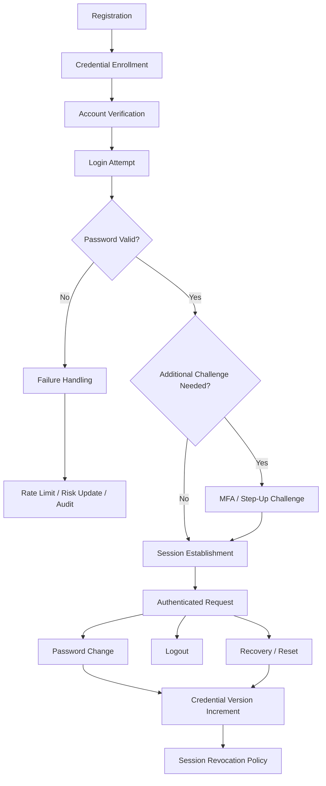
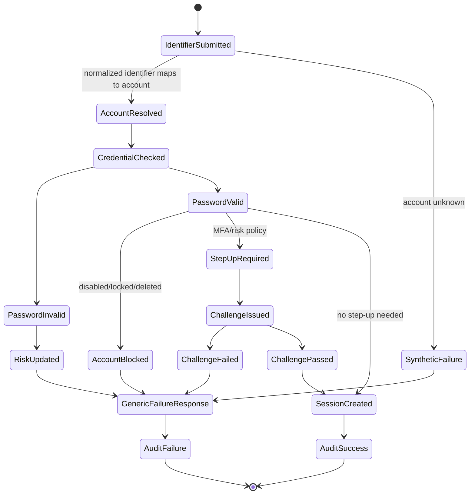
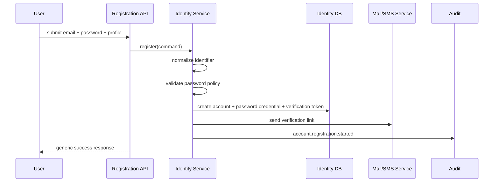
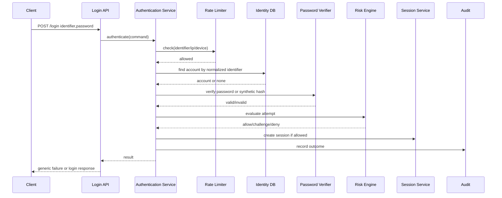
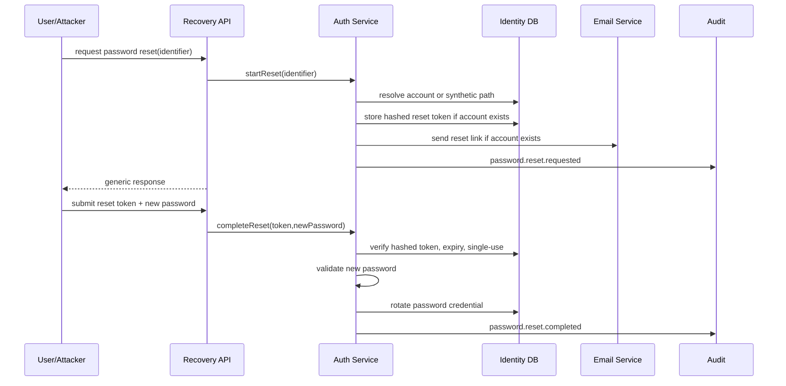

# Part 009 — Password Authentication Pattern

> Target part ini: membangun password authentication sebagai **sistem lifecycle**, bukan sekadar endpoint `/login` yang membandingkan `password` dengan hash. Kita akan desain registration, login, password change, password reset, lockout, rate limiting, abuse defense, audit, dan integrasi Java production-grade.

Password authentication terlihat sederhana:

```txt
input username + password -> check database -> login
```

Di production, model itu terlalu miskin. Password authentication sebenarnya adalah kombinasi dari:

```txt
identifier resolution
credential verification
account lifecycle
risk decision
session establishment
abuse control
audit trail
recovery path
incident response
```

Kesalahan umum engineer bukan pada syntax `PasswordEncoder.matches(...)`, tetapi pada boundary dan lifecycle:

- membocorkan apakah account ada;
- login endpoint bisa dipakai untuk credential stuffing;
- reset password menjadi bypass authentication;
- account lockout menjadi denial-of-service vector;
- password change tidak mencabut session/token lama;
- credential tidak punya version sehingga revocation sulit;
- audit hanya mencatat “login failed”, bukan reason, subject, tenant, risk, dan correlation id;
- registration membuat duplicate identity karena email normalization buruk;
- MFA dianggap tambahan UI, bukan bagian dari state machine authentication.

Password auth yang kuat harus tetap usable, tetapi tidak naif.

---

## 1. Password Authentication Bukan “Modern” atau “Legacy”; Ia Adalah Baseline yang Harus Dikelola

Passkey, WebAuthn, OIDC, SSO, dan MFA semakin penting. Namun password masih sering muncul sebagai:

- bootstrap credential untuk user baru;
- fallback untuk user tanpa passkey;
- first factor sebelum step-up MFA;
- internal admin console;
- B2B tenant login;
- migration bridge dari sistem lama;
- local emergency login ketika external IdP gagal.

Jadi tujuan kita bukan memuja password. Tujuannya adalah membuat password auth **tidak menjadi titik runtuh sistem identity**.

Mental model:

```txt
Password tidak membuktikan “user ini aman”.
Password hanya membuktikan “claimant mengetahui secret yang sebelumnya diregistrasikan”.
```

Karena password adalah shared secret yang bisa dicuri, ditebak, dipakai ulang, dan dipancing lewat phishing, sistem harus mengelilinginya dengan:

- breached password screening;
- adaptive throttling;
- MFA untuk aksi sensitif;
- session rotation;
- audit;
- anomaly detection;
- recovery control;
- credential lifecycle.

---

## 2. Core Domain Terms

Kita gunakan vocabulary yang eksplisit supaya implementation tidak ambigu.

| Term | Makna | Contoh |
|---|---|---|
| `LoginIdentifier` | Input yang dipakai user untuk mencari account | email, username, phone, employee id |
| `Account` | Entitas login di sistem | user account aktif/nonaktif/locked |
| `Credential` | Secret/proof yang bisa diverifikasi | password hash, passkey public key |
| `PasswordCredential` | Credential berbasis password | hash + algorithm + version |
| `Claimant` | Pihak yang mengklaim identity | browser user yang submit login |
| `Principal` | Identity setelah authenticated | `AccountPrincipal(accountId, tenantId)` |
| `AuthenticationAttempt` | Satu percobaan login | success/failure/challenge |
| `Session` | Bukti login setelah authentication | cookie session, refresh token |
| `RecoveryMethod` | Cara memulihkan akses | email link, admin reset, backup code |
| `RiskSignal` | Sinyal risiko saat login | IP velocity, device baru, impossible travel |

Invariant awal:

```txt
Identifier bukan credential.
Credential bukan account.
Account bukan session.
Password reset bukan login.
Login success bukan berarti aksi sensitif boleh langsung dilakukan.
```

---

## 3. Flow Besar Password Authentication



Hal yang penting: login bukan satu endpoint. Ia adalah lifecycle yang menyentuh registration, recovery, session, risk, audit, dan revocation.

---

## 4. Password Auth State Machine

Kita mulai dari state machine, bukan controller.



Production rule:

```txt
Internal reason boleh detail.
External response harus generic.
Audit harus detail tetapi aman.
Metric harus agregat dan tidak bocor ke attacker.
```

---

## 5. Registration Pattern

Registration sering dianggap “buat user baru”. Lebih tepat:

```txt
Registration adalah enrollment account + identifier + initial credential + verification obligation.
```

### 5.1 Registration Flow



Response registration sebaiknya tidak membocorkan apakah email sudah terdaftar.

Contoh external response:

```json
{
  "message": "If the account can be created or verified, instructions will be sent."
}
```

Untuk consumer app tertentu, UX mungkin butuh memberi tahu “email already used”. Itu trade-off bisnis-security. Untuk sistem risiko tinggi, default lebih aman adalah generic response.

### 5.2 Registration Invariants

```txt
RI-001: Login identifier harus dinormalisasi sebelum uniqueness check.
RI-002: Plain password tidak boleh pernah disimpan, dilog, dikirim ke queue, atau dimasukkan ke event.
RI-003: Password policy divalidasi sebelum hashing mahal dilakukan.
RI-004: Credential dibuat dengan algorithm id dan parameter version.
RI-005: Account baru sebaiknya punya status eksplisit: PENDING_VERIFICATION, ACTIVE, DISABLED, CLOSED.
RI-006: Verification token harus single-use, expiring, dan hashed at rest.
RI-007: Registration event tidak boleh berisi password atau token mentah.
```

### 5.3 Identifier Normalization

Email terlihat sederhana, tetapi normalization berbahaya kalau terlalu agresif.

Minimal:

```java
public final class LoginIdentifierNormalizer {
    public NormalizedIdentifier normalizeEmail(String raw) {
        if (raw == null || raw.isBlank()) {
            throw new InvalidIdentifierException();
        }

        String trimmed = raw.trim();
        int at = trimmed.lastIndexOf('@');
        if (at <= 0 || at == trimmed.length() - 1) {
            throw new InvalidIdentifierException();
        }

        String local = trimmed.substring(0, at);
        String domain = trimmed.substring(at + 1).toLowerCase(Locale.ROOT);

        // Jangan otomatis menghapus dot/plus pada local-part secara global.
        // Itu provider-specific dan bisa menyebabkan account takeover edge case.
        String canonical = local + "@" + IDN.toASCII(domain);

        return new NormalizedIdentifier("email", canonical);
    }
}
```

Prinsip:

```txt
Normalize enough for consistency.
Do not normalize so aggressively that two distinct real-world mailboxes collapse into one identity.
```

### 5.4 Password Policy saat Registration

Policy yang baik bukan:

```txt
minimum 8, harus uppercase, lowercase, number, symbol, rotate tiap 90 hari
```

Policy yang lebih masuk akal:

```txt
- minimum length cukup panjang;
- allow spaces dan passphrase;
- maximum length tinggi tetapi tetap punya batas DoS;
- block common/breached/known weak password;
- jangan paksa composition rule aneh;
- jangan periodic reset tanpa indikasi compromise;
- dukung password manager paste/autofill;
- tampilkan strength guidance tanpa menyimpan password.
```

Contoh validator:

```java
public final class PasswordPolicy {
    private final BreachedPasswordChecker breachedPasswordChecker;

    public PasswordValidationResult validate(char[] password, AccountContext ctx) {
        if (password == null) return PasswordValidationResult.invalid("PASSWORD_REQUIRED");

        int codePoints = new String(password).codePointCount(0, password.length);
        if (codePoints < 12) return PasswordValidationResult.invalid("PASSWORD_TOO_SHORT");
        if (codePoints > 1024) return PasswordValidationResult.invalid("PASSWORD_TOO_LONG");

        if (looksLikeIdentifier(password, ctx.loginIdentifier())) {
            return PasswordValidationResult.invalid("PASSWORD_RESEMBLES_IDENTIFIER");
        }

        if (breachedPasswordChecker.isKnownCompromised(password)) {
            return PasswordValidationResult.invalid("PASSWORD_COMPROMISED");
        }

        return PasswordValidationResult.valid();
    }
}
```

Catatan implementation:

- `char[]` dipakai agar bisa di-clear, walau di JVM tidak sempurna karena copy bisa terjadi;
- jangan log password validation detail mentah;
- jangan panggil breached password API dengan password mentah;
- validasi maximum length untuk mencegah password hashing DoS.

---

## 6. Login Pattern

Login flow harus memisahkan:

1. input parsing;
2. identifier normalization;
3. candidate account lookup;
4. synthetic password verification jika account tidak ada;
5. credential verification;
6. account status check;
7. risk decision;
8. session creation;
9. audit;
10. response.

### 6.1 Login Sequence



### 6.2 Login Result Model

Jangan return boolean. Return outcome yang eksplisit.

```java
public sealed interface AuthenticationResult permits
        AuthenticationResult.Success,
        AuthenticationResult.ChallengeRequired,
        AuthenticationResult.Failure {

    record Success(
            AccountId accountId,
            SessionId sessionId,
            AuthenticationAssuranceLevel assuranceLevel,
            Instant authenticatedAt
    ) implements AuthenticationResult {}

    record ChallengeRequired(
            ChallengeId challengeId,
            ChallengeType challengeType,
            Duration expiresIn
    ) implements AuthenticationResult {}

    record Failure(
            FailureCode internalCode,
            PublicFailure publicFailure,
            boolean retryable
    ) implements AuthenticationResult {}
}
```

`FailureCode` internal bisa detail:

```java
enum FailureCode {
    UNKNOWN_IDENTIFIER,
    PASSWORD_INVALID,
    ACCOUNT_DISABLED,
    ACCOUNT_LOCKED,
    PASSWORD_EXPIRED,
    RATE_LIMITED,
    RISK_DENIED,
    CREDENTIAL_REVOKED
}
```

Public response tetap generic:

```java
enum PublicFailure {
    INVALID_CREDENTIALS,
    TRY_AGAIN_LATER
}
```

### 6.3 Authentication Service Skeleton

```java
public final class PasswordAuthenticationService {
    private final AccountRepository accountRepository;
    private final PasswordCredentialRepository credentialRepository;
    private final PasswordVerifier passwordVerifier;
    private final RateLimiter rateLimiter;
    private final RiskEngine riskEngine;
    private final SessionService sessionService;
    private final AuthenticationAudit audit;
    private final SyntheticPasswordVerifier syntheticPasswordVerifier;

    public AuthenticationResult authenticate(LoginCommand command) {
        Instant now = Instant.now();
        AttemptContext attempt = AttemptContext.from(command, now);

        RateDecision rateDecision = rateLimiter.check(attempt.rateLimitKeys());
        if (!rateDecision.allowed()) {
            audit.failure(attempt, FailureCode.RATE_LIMITED);
            return failure(FailureCode.RATE_LIMITED, PublicFailure.TRY_AGAIN_LATER);
        }

        NormalizedIdentifier identifier = normalize(command.identifier());
        Optional<Account> maybeAccount = accountRepository.findByIdentifier(identifier);

        VerificationResult verification = maybeAccount
                .map(account -> verifyKnownAccount(account, command.password()))
                .orElseGet(() -> syntheticPasswordVerifier.verify(command.password()));

        if (maybeAccount.isEmpty() || !verification.valid()) {
            rateLimiter.recordFailure(attempt.rateLimitKeys());
            audit.failure(attempt.withIdentifier(identifier), maybeAccount.isEmpty()
                    ? FailureCode.UNKNOWN_IDENTIFIER
                    : FailureCode.PASSWORD_INVALID);
            return failure(FailureCode.PASSWORD_INVALID, PublicFailure.INVALID_CREDENTIALS);
        }

        Account account = maybeAccount.get();
        if (!account.canAuthenticate()) {
            audit.failure(attempt.forAccount(account.id()), account.toFailureCode());
            return failure(account.toFailureCode(), PublicFailure.INVALID_CREDENTIALS);
        }

        RiskDecision risk = riskEngine.evaluate(account, attempt, verification);
        if (risk.denied()) {
            audit.failure(attempt.forAccount(account.id()), FailureCode.RISK_DENIED);
            return failure(FailureCode.RISK_DENIED, PublicFailure.INVALID_CREDENTIALS);
        }

        if (risk.requiresChallenge()) {
            Challenge challenge = riskEngine.issueChallenge(account, risk);
            audit.challengeIssued(attempt.forAccount(account.id()), challenge);
            return new AuthenticationResult.ChallengeRequired(
                    challenge.id(), challenge.type(), challenge.expiresIn());
        }

        Session session = sessionService.createAuthenticatedSession(account, attempt, verification.assuranceLevel());
        rateLimiter.recordSuccess(attempt.rateLimitKeys());
        audit.success(attempt.forAccount(account.id()), session.id());

        return new AuthenticationResult.Success(
                account.id(), session.id(), verification.assuranceLevel(), now);
    }

    private VerificationResult verifyKnownAccount(Account account, char[] password) {
        PasswordCredential credential = credentialRepository.activePasswordFor(account.id())
                .orElseThrow(() -> new AuthenticationInvariantViolation("No active password credential"));
        return passwordVerifier.verify(password, credential);
    }

    private AuthenticationResult.Failure failure(FailureCode internal, PublicFailure external) {
        return new AuthenticationResult.Failure(internal, external, true);
    }
}
```

Important detail:

```txt
Unknown account path tetap melakukan synthetic password verification.
```

Tujuannya bukan membuat timing side-channel mustahil sepenuhnya. Tujuannya mengurangi perbedaan kasar antara account ada dan tidak ada.

---

## 7. Synthetic Verification untuk Account Enumeration Defense

Kalau account tidak ditemukan, jangan langsung return.

Bad:

```java
if (account == null) {
    return invalid(); // terlalu cepat
}
```

Better:

```java
public final class SyntheticPasswordVerifier {
    private final PasswordEncoder passwordEncoder;
    private final String syntheticHash;

    public VerificationResult verify(char[] rawPassword) {
        boolean ignored = passwordEncoder.matches(CharBuffer.wrap(rawPassword), syntheticHash);
        return VerificationResult.invalid();
    }
}
```

Catatan:

- synthetic hash harus dibuat dengan algorithm dan cost yang sama dengan hash normal;
- jangan gunakan password tetap yang diketahui publik di repo;
- rotate synthetic hash ketika policy hash berubah;
- tetap gunakan rate limiting karena timing defense bukan proteksi utama.

---

## 8. Account Status Check

Status account harus eksplisit.

```java
public enum AccountStatus {
    PENDING_VERIFICATION,
    ACTIVE,
    LOCKED,
    DISABLED,
    CLOSED,
    COMPROMISED
}
```

Mapping status ke authentication:

| Status | Login password valid? | External response | Internal action |
|---|---:|---|---|
| `PENDING_VERIFICATION` | Bisa valid | Generic failure atau verification required tergantung policy | resend verification optional |
| `ACTIVE` | Bisa success | Success/challenge | create session |
| `LOCKED` | Tidak success | Generic failure atau try later | audit lock state |
| `DISABLED` | Tidak success | Generic failure | security/admin reason |
| `CLOSED` | Tidak success | Generic failure | no recovery except policy |
| `COMPROMISED` | Tidak success normal | Generic failure / recovery required | force reset + revoke sessions |

Rule:

```txt
Jangan biarkan password valid pada account disabled menghasilkan response yang membedakan account disabled dari password salah.
```

Kalau UX enterprise menuntut “akun Anda disabled”, gunakan channel aman setelah identity cukup terbukti, bukan dari login public endpoint.

---

## 9. Rate Limiting dan Abuse Control

Rate limiting login tidak bisa hanya per IP. Credential stuffing memakai botnet/proxy. Rate limit harus multi-key.

| Key | Menangkap | Risiko false positive |
|---|---|---|
| IP | brute force dari satu sumber | NAT/corporate network |
| identifier | serangan ke satu user | account lockout DoS |
| IP + identifier | repeated attempt spesifik | bypass via rotating IP |
| device fingerprint | suspicious client | privacy/fragility |
| ASN/country | campaign level | terlalu kasar |
| tenant | attack ke tenant | noisy tenant impact |

Pattern:

```txt
Gunakan graduated response, bukan binary lockout.
```

Urutan response yang lebih sehat:

1. allow;
2. delay/jitter;
3. require CAPTCHA untuk low-risk consumer app;
4. require MFA/step-up;
5. temporary throttle;
6. security review/manual lock untuk high-risk.

### 9.1 Rate Limit Decision Model

```java
public record RateDecision(
        boolean allowed,
        boolean delayed,
        Duration delay,
        boolean challengeRecommended,
        String policyId
) {}
```

### 9.2 Redis Token Bucket Example

Ini bukan Redis tutorial; fokusnya auth decision.

```java
public final class LoginRateLimiter {
    private final RedisScript<Long> consumeTokenScript;
    private final StringRedisTemplate redis;

    public RateDecision check(List<RateLimitKey> keys) {
        for (RateLimitKey key : keys) {
            long remaining = redis.execute(
                    consumeTokenScript,
                    List.of(key.redisKey()),
                    String.valueOf(key.capacity()),
                    String.valueOf(key.refillPerMinute()),
                    String.valueOf(Instant.now().getEpochSecond())
            );

            if (remaining < 0) {
                return new RateDecision(false, false, Duration.ZERO, false, key.policyId());
            }
        }
        return new RateDecision(true, false, Duration.ZERO, false, "login-default");
    }
}
```

Production notes:

- Redis unavailable tidak boleh otomatis membuat login unlimited;
- tentukan fail-open/fail-closed per risk tier;
- rate limit harus punya metric;
- jangan menggunakan user-controlled raw identifier sebagai Redis key tanpa normalization dan hashing;
- jangan membuat lockout permanen otomatis hanya karena failure count.

---

## 10. Generic Error Response

Bad:

```json
{ "error": "Email not found" }
```

Bad:

```json
{ "error": "Password wrong for active account" }
```

Better:

```json
{
  "error": "INVALID_CREDENTIALS",
  "message": "The identifier or password is invalid."
}
```

Untuk rate limit:

```json
{
  "error": "TRY_AGAIN_LATER",
  "message": "Unable to process the login attempt right now. Please try again later."
}
```

Jangan lupa timing dan status code.

| Case | Suggested HTTP | Public body |
|---|---:|---|
| unknown account | 401 | invalid credentials |
| wrong password | 401 | invalid credentials |
| disabled account | 401 atau 403 sesuai policy | generic |
| locked due to abuse | 429 atau 401 | try later/generic |
| MFA required | 200/401 dengan challenge contract | challenge required |

Untuk API yang strict, `401` berarti authentication gagal. Untuk browser login, sebagian tim memakai `200` dengan body application-level agar UX lebih mudah. Yang penting: konsisten dan tidak bocor.

---

## 11. Password Change Pattern

Password change berbeda dari password reset.

```txt
Password change = user sudah authenticated dan membuktikan password lama atau step-up.
Password reset = user tidak bisa menggunakan password lama dan memakai recovery proof.
```

### 11.1 Change Password Sequence

```mermaid
sequenceDiagram
    participant U as Authenticated User
    participant API as Account API
    participant AUTH as Auth Service
    participant DB as Identity DB
    participant SESS as Session Service
    participant AUD as Audit

    U->>API: POST /me/password/change oldPassword,newPassword
    API->>AUTH: changePassword(command)
    AUTH->>DB: load active password credential
    AUTH->>AUTH: verify old password
    AUTH->>AUTH: validate new password policy
    AUTH->>DB: insert new credential version; revoke old
    AUTH->>SESS: revoke other sessions or increment credentialVersion
    AUTH->>AUD: password.changed
    API-->>U: success
```

### 11.2 Change Password Invariants

```txt
CP-001: User harus recently authenticated atau memberikan old password.
CP-002: New password harus melewati policy yang sama atau lebih kuat dari registration.
CP-003: New password tidak boleh sama dengan current password.
CP-004: Old password hash tidak di-update in-place tanpa version history/revocation event.
CP-005: Credential version harus naik.
CP-006: Session/token yang dibuat sebelum credential change harus punya policy: revoke all, revoke others, atau step-up required.
CP-007: Audit harus mencatat actor, subject, method, assurance, device, IP, dan correlation id.
```

### 11.3 Credential Version Pattern

Setiap session membawa `credentialVersionAtLogin`.

```java
public record AuthenticatedSession(
        SessionId id,
        AccountId accountId,
        long credentialVersionAtLogin,
        Instant authenticatedAt
) {}
```

Saat request:

```java
if (session.credentialVersionAtLogin() < account.currentCredentialVersion()) {
    throw new ReauthenticationRequiredException();
}
```

Ini lebih scalable daripada mencari dan menghapus semua session satu per satu, terutama untuk token stateless. Untuk session stateful, bisa revoke langsung.

---

## 12. Password Reset Pattern

Password reset adalah salah satu bagian paling berbahaya dalam authentication system.

Ia sering menjadi bypass:

```txt
Attacker tidak perlu tahu password lama.
Attacker cukup menguasai email/phone/recovery channel.
```

Jadi reset password harus dianggap sebagai authentication ceremony tersendiri.

### 12.1 Reset Flow



### 12.2 Reset Token Rules

```txt
RT-001: Token harus high entropy.
RT-002: Token mentah hanya dikirim ke user, tidak disimpan plaintext.
RT-003: Simpan hash token di database.
RT-004: Token single-use.
RT-005: Token punya expiry pendek.
RT-006: Token terikat ke purpose: PASSWORD_RESET.
RT-007: Token terikat ke account dan credential version.
RT-008: Reset completion harus revoke session sesuai policy.
RT-009: Reset request response harus generic.
RT-010: Reset event harus audit-grade.
```

### 12.3 Reset Token Entity

```java
public final class RecoveryToken {
    private RecoveryTokenId id;
    private AccountId accountId;
    private RecoveryPurpose purpose;
    private String tokenHash;
    private Instant expiresAt;
    private Instant consumedAt;
    private long credentialVersionAtIssue;

    public boolean canBeConsumed(Instant now, long currentCredentialVersion) {
        return consumedAt == null
                && now.isBefore(expiresAt)
                && credentialVersionAtIssue == currentCredentialVersion;
    }
}
```

Why bind to credential version?

```txt
Jika user berhasil mengganti password setelah token dibuat, token reset lama tidak boleh tetap valid.
```

---

## 13. Email Verification vs Password Reset

Jangan reuse token table tanpa purpose separation.

| Flow | Proof yang diberikan | Risiko |
|---|---|---|
| Email verification | kontrol email saat registration | account activation abuse |
| Password reset | kontrol recovery channel | account takeover |
| Magic link login | kontrol email sebagai authenticator | phishing/replay |

Masing-masing harus punya:

- purpose;
- expiry;
- entropy;
- audience;
- single-use semantics;
- audit event;
- rate limit.

---

## 14. Database Model Minimal Production-Grade

```sql
create table auth_account (
    id uuid primary key,
    status varchar(40) not null,
    current_credential_version bigint not null default 1,
    created_at timestamptz not null,
    updated_at timestamptz not null
);

create table auth_login_identifier (
    id uuid primary key,
    account_id uuid not null references auth_account(id),
    identifier_type varchar(40) not null,
    normalized_value varchar(512) not null,
    verified_at timestamptz,
    created_at timestamptz not null,
    unique(identifier_type, normalized_value)
);

create table auth_password_credential (
    id uuid primary key,
    account_id uuid not null references auth_account(id),
    credential_version bigint not null,
    password_hash text not null,
    algorithm varchar(80) not null,
    parameters_json jsonb not null,
    created_at timestamptz not null,
    revoked_at timestamptz,
    revoke_reason varchar(80),
    unique(account_id, credential_version)
);

create table auth_recovery_token (
    id uuid primary key,
    account_id uuid not null references auth_account(id),
    purpose varchar(80) not null,
    token_hash text not null,
    credential_version_at_issue bigint not null,
    expires_at timestamptz not null,
    consumed_at timestamptz,
    created_at timestamptz not null
);

create index idx_auth_recovery_token_hash
    on auth_recovery_token(token_hash);
```

Tidak semua sistem butuh tabel selengkap ini sejak hari pertama, tetapi domain-nya harus siap. Minimal jangan mengunci diri pada `users.password_hash` tanpa version.

---

## 15. Spring Security Integration Pattern

Di Spring Security, password authentication biasanya masuk melalui `AuthenticationProvider`.

```java
public final class DomainPasswordAuthenticationProvider implements AuthenticationProvider {
    private final PasswordAuthenticationService passwordAuthenticationService;

    @Override
    public Authentication authenticate(Authentication authentication) throws AuthenticationException {
        String identifier = authentication.getName();
        char[] password = authentication.getCredentials().toString().toCharArray();

        AuthenticationResult result = passwordAuthenticationService.authenticate(
                new LoginCommand(identifier, password, RequestMetadata.current())
        );

        if (result instanceof AuthenticationResult.Success success) {
            AccountPrincipal principal = new AccountPrincipal(success.accountId(), success.assuranceLevel());
            return UsernamePasswordAuthenticationToken.authenticated(
                    principal,
                    null,
                    List.of()
            );
        }

        if (result instanceof AuthenticationResult.ChallengeRequired challenge) {
            throw new MfaRequiredAuthenticationException(challenge.challengeId());
        }

        throw new BadCredentialsException("Invalid credentials");
    }

    @Override
    public boolean supports(Class<?> authentication) {
        return UsernamePasswordAuthenticationToken.class.isAssignableFrom(authentication);
    }
}
```

Important:

```txt
Spring exception boleh generic.
Domain audit harus tetap detail.
```

Jangan menaruh semua logic di `AuthenticationProvider`. Provider hanya adapter. Domain service tetap milik application core.

---

## 16. Jakarta Security Integration Pattern

Dengan Jakarta Security, password auth bisa dihubungkan lewat `HttpAuthenticationMechanism` dan `IdentityStore`.

```java
@ApplicationScoped
public class PasswordHttpAuthenticationMechanism implements HttpAuthenticationMechanism {
    @Inject
    PasswordAuthenticationService authenticationService;

    @Override
    public AuthenticationStatus validateRequest(
            HttpServletRequest request,
            HttpServletResponse response,
            HttpMessageContext context) throws AuthenticationException {

        if (!isLoginRequest(request)) {
            return context.doNothing();
        }

        LoginCommand command = parseLoginCommand(request);
        AuthenticationResult result = authenticationService.authenticate(command);

        if (result instanceof AuthenticationResult.Success success) {
            CredentialValidationResult validation = new CredentialValidationResult(
                    success.accountId().toString(),
                    Set.of()
            );
            return context.notifyContainerAboutLogin(validation);
        }

        writeGenericFailure(response);
        return AuthenticationStatus.SEND_FAILURE;
    }
}
```

Rule sama:

```txt
Framework mechanism bukan tempat semua domain rule tinggal.
```

---

## 17. Password Authentication Event Model

Audit event harus cukup untuk forensik dan detection.

```java
public record AuthenticationAuditEvent(
        UUID eventId,
        String eventType,
        Instant occurredAt,
        AccountId accountId,
        String normalizedIdentifierHash,
        String tenantId,
        String outcome,
        String internalReason,
        String publicReason,
        String ipAddressHash,
        String userAgentHash,
        String deviceId,
        String correlationId,
        AuthenticationAssuranceLevel assuranceLevel
) {}
```

Event yang perlu ada:

| Event | Kapan |
|---|---|
| `auth.password.registration.started` | registration command diterima |
| `auth.password.registration.completed` | account + credential dibuat |
| `auth.password.login.succeeded` | session dibuat |
| `auth.password.login.failed` | credential/account/risk failure |
| `auth.password.challenge.required` | step-up/MFA dibutuhkan |
| `auth.password.changed` | password diganti dari authenticated session |
| `auth.password.reset.requested` | reset dimulai |
| `auth.password.reset.completed` | reset selesai |
| `auth.password.credential.revoked` | credential dicabut |
| `auth.account.locked` | account masuk lock state |

Audit design principle:

```txt
Log enough to investigate.
Do not log enough to help the attacker.
```

---

## 18. Failure Modes

### 18.1 Account Enumeration

Symptom:

```txt
Unknown email response lebih cepat atau pesan berbeda.
```

Mitigation:

- generic error;
- synthetic verification;
- response time smoothing secukupnya;
- rate limiting;
- monitoring enumeration pattern.

### 18.2 Credential Stuffing

Symptom:

```txt
Banyak login failure dengan password valid di breach lain.
```

Mitigation:

- breached password block saat registration/change;
- risk-based challenge;
- IP/ASN/device velocity;
- impossible travel detection;
- notify user saat suspicious success;
- MFA/passkey adoption.

### 18.3 Lockout DoS

Symptom:

```txt
Attacker sengaja membuat banyak failed attempts agar account korban locked.
```

Mitigation:

- jangan permanent lock otomatis;
- gunakan progressive delay/challenge;
- lock berdasarkan risk, bukan failure count mentah;
- pisahkan admin lock dari abuse throttle;
- allow recovery/step-up safe path.

### 18.4 Recovery Channel Takeover

Symptom:

```txt
Password reset berhasil melalui email/phone yang sudah dikompromi.
```

Mitigation:

- notify old and new channel;
- step-up untuk mengganti recovery channel;
- delay high-risk recovery change;
- revoke sessions after reset;
- support passkey/MFA.

### 18.5 Session Not Rotated

Symptom:

```txt
Session pre-login tetap dipakai setelah login.
```

Mitigation:

- rotate session id after authentication;
- bind session to authentication time and credential version;
- set cookie attributes correctly;
- revoke old sessions after password change/reset according to policy.

### 18.6 Password Hash DoS

Symptom:

```txt
Attacker submit password sangat panjang atau banyak login paralel sehingga CPU/memory habis.
```

Mitigation:

- maximum password length;
- request body size limit;
- rate limit sebelum expensive hash;
- separate auth worker pool;
- tune Argon2/bcrypt cost with capacity planning.

---

## 19. Production Checklist

### Registration

- [ ] Identifier dinormalisasi secara konservatif.
- [ ] Uniqueness constraint ada di database.
- [ ] Password policy mendukung passphrase.
- [ ] Breached/common password dicek.
- [ ] Plain password tidak pernah dilog.
- [ ] Credential punya algorithm id dan version.
- [ ] Verification token hashed, expiring, single-use.
- [ ] Registration response tidak bocor jika policy butuh anti-enumeration.

### Login

- [ ] Generic error untuk unknown account dan wrong password.
- [ ] Synthetic verification untuk unknown account path.
- [ ] Rate limiting multi-key.
- [ ] Account status check setelah credential verification path aman.
- [ ] Session id rotated setelah success.
- [ ] Credential version disimpan di session/token.
- [ ] Audit event detail tetapi aman.
- [ ] Metrics memisahkan success, failure, challenge, throttle.

### Password Change

- [ ] Requires recent authentication atau old password.
- [ ] New password divalidasi dengan policy terkini.
- [ ] Credential version naik.
- [ ] Session revocation policy eksplisit.
- [ ] User diberi notifikasi.
- [ ] Audit event dibuat.

### Password Reset

- [ ] Start reset response generic.
- [ ] Reset token high entropy.
- [ ] Reset token hashed at rest.
- [ ] Token single-use dan expiring.
- [ ] Token terikat purpose dan credential version.
- [ ] Reset completion revoke session/token sesuai policy.
- [ ] Recovery channel change butuh step-up.

---

## 20. Decision Matrix

| Context | Password-only cukup? | Rekomendasi |
|---|---:|---|
| Public low-risk content app | Mungkin | password + rate limit + breached password check |
| Banking/fintech/regulatory | Tidak | password + phishing-resistant MFA/passkey + risk engine |
| Internal admin console | Tidak | SSO/OIDC + MFA + step-up + audit |
| Machine-to-machine | Tidak relevan | client credentials, mTLS, API key/HMAC tergantung case |
| Legacy migration | Sementara | password bridge + forced upgrade + staged MFA |
| B2B multi-tenant SaaS | Jarang cukup | tenant-aware SSO + local fallback dengan strong controls |

Rule of thumb:

```txt
Semakin besar dampak account takeover, semakin password harus menjadi salah satu sinyal, bukan satu-satunya proof.
```

---

## 21. Minimal End-to-End Contract

### 21.1 Login Request

```json
{
  "identifier": "alice@example.com",
  "password": "correct horse battery staple",
  "tenantHint": "acme",
  "deviceId": "optional-device-id"
}
```

### 21.2 Success Response

```json
{
  "status": "AUTHENTICATED",
  "session": {
    "expiresAt": "2026-07-03T12:00:00Z"
  },
  "assuranceLevel": "AAL1"
}
```

### 21.3 Challenge Response

```json
{
  "status": "CHALLENGE_REQUIRED",
  "challengeId": "ch_01J...",
  "challengeType": "TOTP",
  "expiresInSeconds": 300
}
```

### 21.4 Failure Response

```json
{
  "status": "FAILED",
  "error": "INVALID_CREDENTIALS",
  "message": "The identifier or password is invalid."
}
```

---

## 22. Exercises

### Exercise 1 — Design Review

Ambil sistem login yang hanya punya tabel:

```sql
users(id, email, password_hash, role)
```

Ubah menjadi model yang mendukung:

- password version;
- reset token;
- account status;
- login identifier verification;
- audit;
- session revocation setelah password change.

### Exercise 2 — Abuse Scenario

Desain rate limiting untuk kasus:

```txt
10.000 failed login attempts per menit
rotating IP
100 target account
1 tenant enterprise
```

Jawab:

- key apa saja yang dipakai;
- kapan challenge;
- kapan throttle;
- kapan notify tenant admin;
- bagaimana mencegah lockout DoS.

### Exercise 3 — Failure Response Review

Review response berikut:

```json
{ "error": "ACCOUNT_DISABLED" }
```

Tentukan:

- apakah aman untuk public login endpoint;
- kapan boleh ditampilkan;
- bagaimana audit internal harus mencatatnya.

---

## 23. Ringkasan

Password authentication production-grade bukan operasi `matches(password, hash)`.

Ia adalah sistem yang mengelola:

```txt
identifier -> account -> credential -> verification -> risk -> challenge -> session -> audit -> recovery -> revocation
```

Ingat invariant paling penting:

```txt
Password valid hanya berarti claimant tahu secret.
Ia belum berarti user aman, device aman, session aman, tenant benar, atau aksi sensitif boleh dilakukan.
```

Di part berikutnya kita masuk lebih dalam ke bagian paling teknis dari password auth: **password storage & verification**. Kita akan membahas Argon2id, BCrypt, PBKDF2, pepper, parameter tuning, Spring `PasswordEncoder`, migration, rehash, legacy hash, dan operational failure mode.

---

## References

- OWASP Authentication Cheat Sheet — generic authentication responses, authentication endpoint guidance, and anti-enumeration principles.
- OWASP Password Storage Cheat Sheet — password hashing algorithms, salt, pepper, Argon2id, bcrypt, PBKDF2.
- NIST SP 800-63B-4 — digital identity authentication guidelines and password verifier requirements.
- Spring Security Reference — password storage and authentication architecture.
- Jakarta Security 4.0 Specification — standard Jakarta EE authentication APIs.
