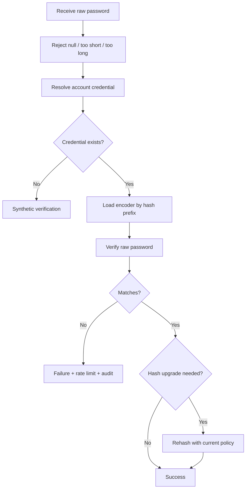
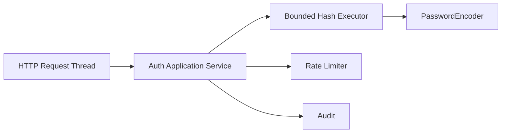

# Part 010 — Password Storage & Verification

> Target part ini: memahami password storage sebagai desain cryptographic-operational system. Kita akan membahas kenapa SHA-256 salah, kapan Argon2id/BCrypt/PBKDF2 dipakai, bagaimana menyimpan algorithm metadata, bagaimana migration tanpa memaksa semua user reset, bagaimana pepper dikelola, dan bagaimana verification pipeline di Java dibuat aman serta operasional.

Password storage sering disalahpahami sebagai:

```txt
hash(password) lalu simpan
```

Itu terlalu dangkal. Yang kita butuhkan:

```txt
password -> normalization policy -> pre-validation -> adaptive one-way function -> encoded credential -> metadata -> verification -> upgrade decision -> audit
```

Password storage yang baik harus tahan terhadap dua kondisi:

1. **online attack**, saat attacker menebak lewat login endpoint;
2. **offline attack**, saat attacker mencuri database hash dan menebak tanpa menyentuh sistem kita.

Rate limiting membantu online attack. Password hashing yang benar membantu offline attack.

---

## 1. Threat Model Password Storage

Misalkan attacker berhasil mendapatkan tabel password credential:

```sql
select account_id, password_hash from auth_password_credential;
```

Jika hash dibuat dengan SHA-256:

```txt
sha256(password)
```

attacker bisa mencoba tebakan sangat cepat menggunakan GPU/ASIC. Masalahnya bukan SHA-256 “rusak”; masalahnya SHA-256 memang dirancang cepat. Password storage membutuhkan fungsi yang sengaja mahal.

Proper password hashing function harus:

- one-way;
- salted;
- adaptive/tunable;
- lambat untuk attacker;
- masih cukup cepat untuk user legitimate;
- menyimpan metadata parameter;
- mendukung upgrade parameter.

Untuk memory-hard algorithms seperti Argon2id/scrypt, kita juga ingin membuat parallel cracking mahal dari sisi memory, bukan hanya CPU.

---

## 2. Jangan Gunakan Ini untuk Password Storage

| Jangan pakai | Kenapa |
|---|---|
| Plaintext | credential leak langsung menjadi account takeover |
| Encryption reversible | jika key bocor, semua password bocor; password tidak perlu didekripsi |
| MD5/SHA-1 | cepat dan obsolete untuk password storage |
| SHA-256/SHA-512 langsung | terlalu cepat untuk offline guessing |
| `hash(password + staticSalt)` | static salt tidak melindungi antar-user |
| custom crypto | hampir selalu salah |
| global pepper sebagai pengganti hash kuat | pepper bukan pengganti Argon2/bcrypt/PBKDF2 |

Rule:

```txt
Untuk password, kita tidak butuh fungsi hash cepat.
Kita butuh password hashing/KDF yang sengaja mahal dan bisa di-tune.
```

---

## 3. Salt, Pepper, Work Factor

### 3.1 Salt

Salt adalah nilai unik per password hash.

Tujuannya:

```txt
password sama pada dua account menghasilkan hash berbeda.
```

Salt bukan secret. Ia boleh disimpan bersama hash. Password hashing library modern biasanya menyertakan salt di encoded hash string.

Bad:

```txt
hash = sha256(password)
```

Better:

```txt
hash = argon2id(password, randomSalt, memory, iterations, parallelism)
encoded = $argon2id$v=19$m=...,t=...,p=...$salt$hash
```

### 3.2 Pepper

Pepper adalah secret tambahan yang tidak disimpan di database yang sama dengan hash.

Tujuannya:

```txt
Jika database credential bocor tetapi pepper tidak bocor, offline cracking menjadi lebih sulit atau tidak bisa langsung dilakukan.
```

Pepper bukan replacement untuk salt. Pepper juga bukan alasan memakai SHA-256.

Pepper sebaiknya disimpan di:

- KMS;
- HSM;
- secrets manager;
- environment secret dengan rotation policy yang jelas.

### 3.3 Work Factor

Work factor adalah biaya verifikasi.

Untuk BCrypt: cost/log rounds.

Untuk Argon2id:

- memory cost;
- iteration/time cost;
- parallelism.

Untuk PBKDF2:

- iteration count;
- PRF;
- derived key length.

Work factor harus ditentukan dari benchmark sistem sendiri, bukan copy-paste.

---

## 4. Algorithm Decision Matrix

| Algorithm | Kelebihan | Kekurangan | Cocok untuk |
|---|---|---|---|
| Argon2id | memory-hard, modern, direkomendasikan luas | butuh library/parameter tuning; memory pressure | default modern non-FIPS |
| BCrypt | matang, luas, Spring support stabil | limit/truncation historis; CPU-hard bukan memory-hard | sistem umum, compatibility tinggi |
| PBKDF2 | FIPS-friendly, JDK/Spring support baik | tidak memory-hard; perlu iteration tinggi | environment yang butuh FIPS/compliance |
| scrypt | memory-hard | lebih jarang dipakai dibanding Argon2id/BCrypt di Java enterprise | compatibility tertentu |

Practical recommendation:

```txt
Default modern: Argon2id.
Compatibility enterprise: BCrypt.
FIPS-driven environment: PBKDF2.
```

Namun keputusan final harus mempertimbangkan:

- compliance;
- library availability;
- CPU/memory budget;
- login QPS;
- latency SLO;
- container memory limit;
- disaster recovery;
- migration path;
- security team standard.

---

## 5. Encoded Password Format

Jangan hanya simpan hash mentah.

Bad:

```txt
$2a$10$....
```

Lebih baik simpan format yang memberi tahu verifier:

```txt
{bcrypt}$2a$12$...
{argon2id}$argon2id$v=19$m=65536,t=3,p=2$...
{pbkdf2@SpringSecurity_v5_8}...
```

Spring Security `DelegatingPasswordEncoder` memakai prefix `{id}` untuk memilih encoder.

Mental model:

```txt
Encoded password adalah self-describing credential artifact.
```

Ia harus menjawab:

```txt
algorithm apa?
parameter apa?
salt mana?
hash mana?
versi policy mana?
apakah perlu upgrade?
```

---

## 6. Credential Entity Design

```java
public final class PasswordCredential {
    private final CredentialId id;
    private final AccountId accountId;
    private final long credentialVersion;
    private final String encodedHash;
    private final PasswordAlgorithm algorithm;
    private final String parameterProfile;
    private final Instant createdAt;
    private final Instant revokedAt;

    public boolean active() {
        return revokedAt == null;
    }
}
```

Database:

```sql
create table auth_password_credential (
    id uuid primary key,
    account_id uuid not null,
    credential_version bigint not null,
    encoded_hash text not null,
    algorithm varchar(80) not null,
    parameter_profile varchar(80) not null,
    created_at timestamptz not null,
    revoked_at timestamptz,
    revoke_reason varchar(80),
    unique(account_id, credential_version)
);
```

Kenapa `algorithm` tetap disimpan jika encoded hash sudah punya prefix?

Karena:

- memudahkan query migration progress;
- memudahkan audit;
- memudahkan policy report;
- memudahkan incident response saat algorithm tertentu dianggap lemah.

Tetapi sumber kebenaran verifikasi tetap encoded hash, bukan kolom algorithm yang bisa drift.

---

## 7. Verification Pipeline



Implementation principle:

```txt
Verify first. Upgrade after successful verification.
```

Jangan rehash password yang tidak valid. Jangan mengubah credential ketika verification gagal.

---

## 8. Spring Security PasswordEncoder Pattern

Spring Security memberi abstraction `PasswordEncoder`.

Minimal:

```java
PasswordEncoder encoder = PasswordEncoderFactories.createDelegatingPasswordEncoder();

String encoded = encoder.encode(rawPassword);
boolean valid = encoder.matches(rawPassword, encoded);
```

Production-grade config sebaiknya eksplisit.

```java
@Configuration
public class PasswordHashingConfig {

    @Bean
    PasswordEncoder passwordEncoder() {
        String currentId = "argon2id-v1";

        Map<String, PasswordEncoder> encoders = new HashMap<>();
        encoders.put("argon2id-v1", new Argon2PasswordEncoder(
                16,      // salt length
                32,      // hash length
                2,       // parallelism
                65536,   // memory KiB
                3        // iterations
        ));
        encoders.put("bcrypt-v1", new BCryptPasswordEncoder(12));
        encoders.put("pbkdf2-v1", Pbkdf2PasswordEncoder.defaultsForSpringSecurity_v5_8());

        return new DelegatingPasswordEncoder(currentId, encoders);
    }
}
```

Catatan:

- parameter di atas adalah contoh profile, bukan angka universal;
- benchmark di environment sendiri;
- Spring version dapat mengubah defaults antargenerasi;
- simpan profile id agar migration jelas.

---

## 9. Password Hash Policy

Buat object policy eksplisit.

```java
public record PasswordHashPolicy(
        String currentEncoderId,
        Set<String> acceptedEncoderIds,
        Set<String> deprecatedEncoderIds,
        Duration targetVerificationLatency,
        int maxPasswordCodePoints
) {
    public boolean upgradeRequired(String encodedHash) {
        String id = extractId(encodedHash);
        return deprecatedEncoderIds.contains(id) || !id.equals(currentEncoderId);
    }
}
```

Policy harus menjawab:

| Pertanyaan | Contoh jawaban |
|---|---|
| encoder baru untuk password baru? | `argon2id-v1` |
| hash lama masih diterima? | `bcrypt-v1`, `pbkdf2-v1` |
| kapan rehash? | setelah login sukses |
| kapan force reset? | hash legacy terlalu lemah atau format tidak dapat diverifikasi aman |
| berapa maksimum password length? | 1024 code points atau sesuai risk/capacity |

---

## 10. Rehash-on-Login Strategy

Migration paling halus:

```txt
Saat user login sukses dengan hash lama, sistem membuat hash baru dengan policy saat ini.
```

```java
public final class PasswordVerifier {
    private final PasswordEncoder passwordEncoder;
    private final PasswordHashPolicy policy;
    private final PasswordCredentialRepository repository;

    public VerificationResult verify(AccountId accountId, char[] rawPassword, PasswordCredential credential) {
        String raw = CharBuffer.wrap(rawPassword).toString();
        boolean matches = passwordEncoder.matches(raw, credential.encodedHash());

        if (!matches) {
            return VerificationResult.invalid();
        }

        boolean upgraded = false;
        if (policy.upgradeRequired(credential.encodedHash())) {
            String newEncoded = passwordEncoder.encode(raw);
            repository.replaceCredential(accountId, credential.id(), newEncoded, policy.currentEncoderId());
            upgraded = true;
        }

        return VerificationResult.valid(upgraded);
    }
}
```

Caveat:

```txt
String raw = ... membuat copy password di heap.
```

Spring `PasswordEncoder` umumnya memakai `CharSequence`, sehingga copy kadang sulit dihindari. Tetap clear buffer yang kita kontrol, hindari logging, dan minimalkan lifetime object.

### 10.1 Race Condition saat Rehash

Dua login paralel bisa sama-sama mencoba rehash.

Mitigation:

```sql
update auth_password_credential
set encoded_hash = ?, algorithm = ?, parameter_profile = ?, updated_at = now()
where id = ?
  and encoded_hash = ?
  and revoked_at is null;
```

Jika row count `0`, ada concurrent update. Tidak masalah selama verification sudah sukses dan credential masih valid.

---

## 11. Legacy Hash Migration

Legacy case umum:

```txt
md5(password)
sha1(password)
sha256(password)
bcrypt cost terlalu rendah
PBKDF2 iteration terlalu rendah
custom salted hash
```

Migration options:

| Strategy | Kelebihan | Kekurangan |
|---|---|---|
| rehash-on-login | UX smooth | user inactive tetap legacy |
| forced reset | cepat menghapus legacy | friction tinggi |
| wrapped legacy hash | tidak butuh plaintext | bisa membawa kelemahan lama |
| staged migration | kontrol risiko | butuh operasi matang |

### 11.1 Wrapped Legacy Hash

Kadang sistem lama menyimpan:

```txt
sha1(password + salt)
```

Saat login sukses, langsung rehash password mentah ke Argon2id/BCrypt. Jangan membuat desain jangka panjang seperti:

```txt
argon2id(sha1(password + salt))
```

kecuali sebagai bridge sementara dengan dokumen risiko. Wrapping bisa berguna untuk migration tanpa plaintext, tetapi tidak selalu meningkatkan security seperti yang diharapkan karena input entropy tetap password user dan format lama mungkin punya kelemahan.

### 11.2 Migration State

```java
public enum CredentialMigrationStatus {
    CURRENT,
    DEPRECATED_ACCEPTED,
    LEGACY_REHASH_ON_LOGIN,
    FORCE_RESET_REQUIRED,
    REVOKED
}
```

Policy:

```txt
Legacy hash yang terlalu lemah tidak harus selalu diterima selamanya.
Untuk sistem high-risk, pakai force reset setelah cut-off date.
```

---

## 12. Pepper Design

Ada dua pola umum.

### 12.1 Pre-hash Pepper

```txt
hash = Argon2id(HMAC(pepper, password), salt, params)
```

Kelebihan:

- database leak saja tidak cukup untuk cracking langsung;
- pepper dipakai sebelum password hashing.

Kekurangan:

- rotate pepper sulit tanpa password mentah;
- jika pepper hilang, semua password tidak dapat diverifikasi;
- perlu secret availability tinggi.

### 12.2 Post-hash Pepper

```txt
stored = HMAC(pepper, passwordHash)
```

Atau simpan hash dan MAC terpisah.

Kelebihan:

- bisa memvalidasi integrity hash;
- rotation model bisa lebih fleksibel tergantung desain.

Kekurangan:

- design lebih kompleks;
- salah implementasi bisa mengurangi benefit;
- tetap butuh Argon2/bcrypt/PBKDF2.

### 12.3 Pepper Versioning

```java
public record PepperProfile(
        String version,
        SecretKey key,
        boolean activeForNewHash,
        boolean acceptedForVerification
) {}
```

Credential menyimpan pepper version, bukan pepper value.

```sql
alter table auth_password_credential
add column pepper_version varchar(40);
```

### 12.4 Pepper Rotation Reality

Pepper rotation tidak seperti API key rotation.

Jika pepper dipakai untuk password hashing, kita tidak bisa rehash semua password tanpa password mentah. Pilihan:

- rotate on next successful login;
- force reset untuk user tertentu;
- support multiple pepper versions selama transition;
- incident response jika pepper diduga bocor.

Rule:

```txt
Jangan menambahkan pepper jika tim belum siap mengoperasikan lifecycle-nya.
```

---

## 13. Parameter Tuning

Tidak ada angka universal. Parameter harus memenuhi:

```txt
verification cukup lambat untuk attacker,
tetapi cukup cepat untuk legitimate login SLO dan kapasitas peak.
```

Benchmark minimal:

```java
public final class PasswordHashBenchmark {
    public static void main(String[] args) {
        PasswordEncoder encoder = new Argon2PasswordEncoder(16, 32, 2, 65536, 3);
        String password = "correct horse battery staple";

        int warmup = 10;
        int runs = 100;

        for (int i = 0; i < warmup; i++) encoder.encode(password);

        List<Long> millis = new ArrayList<>();
        for (int i = 0; i < runs; i++) {
            long start = System.nanoTime();
            String encoded = encoder.encode(password);
            encoder.matches(password, encoded);
            long end = System.nanoTime();
            millis.add(TimeUnit.NANOSECONDS.toMillis(end - start));
        }

        millis.sort(Long::compareTo);
        System.out.println("p50=" + percentile(millis, 50));
        System.out.println("p95=" + percentile(millis, 95));
        System.out.println("p99=" + percentile(millis, 99));
    }
}
```

Benchmark harus dilakukan pada:

- container limit sebenarnya;
- instance type production;
- JVM flags production;
- concurrency login realistis;
- cold start scenario;
- peak attack scenario.

### 13.1 Capacity Formula Sederhana

```txt
required_auth_workers ≈ peak_login_qps * p95_verification_seconds / target_utilization
```

Contoh:

```txt
peak_login_qps = 100
p95_verify = 250ms = 0.25s
target_utilization = 0.70
workers ≈ 100 * 0.25 / 0.70 = 35.7
```

Ini kasar, tetapi cukup untuk memaksa diskusi kapasitas.

Untuk Argon2id, memory juga penting:

```txt
max_concurrent_hashes <= available_memory_for_hashing / memory_per_hash
```

Jika memory per hash 64 MiB dan budget memory 2 GiB:

```txt
max_concurrent_hashes ≈ 2048 / 64 = 32
```

Jadi auth service harus punya concurrency guard.

---

## 14. Hashing Worker Isolation

Jangan biarkan expensive password hash menghabiskan request thread pool utama.

Pattern:



Java sketch:

```java
public final class BoundedPasswordHashExecutor {
    private final ExecutorService executor;
    private final Semaphore permits;

    public BoundedPasswordHashExecutor(int concurrency) {
        this.executor = Executors.newFixedThreadPool(concurrency);
        this.permits = new Semaphore(concurrency);
    }

    public <T> T run(Callable<T> task) {
        boolean acquired = permits.tryAcquire();
        if (!acquired) {
            throw new AuthenticationOverloadedException();
        }
        try {
            Future<T> future = executor.submit(task);
            return future.get(2, TimeUnit.SECONDS);
        } catch (TimeoutException e) {
            throw new AuthenticationOverloadedException(e);
        } catch (ExecutionException | InterruptedException e) {
            Thread.currentThread().interrupt();
            throw new AuthenticationFailureException(e);
        } finally {
            permits.release();
        }
    }
}
```

Caveat:

- jangan asal interrupt hashing library jika tidak mendukung cancellation;
- timeout harus dipilih hati-hati;
- overload response jangan bocorkan account existence;
- metric wajib ada.

---

## 15. Constant-Time Comparison

Password hashing library biasanya mengurus compare hash secara aman. Tetapi untuk token hash, reset token, atau API key hash, gunakan constant-time compare.

```java
public final class ConstantTime {
    public static boolean equals(byte[] a, byte[] b) {
        return MessageDigest.isEqual(a, b);
    }
}
```

Jangan:

```java
Arrays.equals(a, b)
```

untuk secret comparison yang exposed terhadap timing. Untuk password, jangan implement compare sendiri jika library sudah benar.

---

## 16. Unicode dan Password Input

Unicode password adalah area rawan.

Pilihan policy:

1. simpan/verifikasi byte persis dari input setelah transport decoding;
2. lakukan normalization tertentu sebelum hashing;
3. batasi karakter tertentu.

Trade-off:

- normalization bisa membantu user yang mengetik karakter ekivalen;
- normalization bisa membuat dua string berbeda menjadi sama;
- tanpa normalization, user bisa terkunci karena keyboard/input method berbeda;
- logging/debugging Unicode bisa bocor.

Practical approach:

```txt
Tetapkan policy eksplisit.
Jangan diam-diam mengubah policy setelah credential sudah dibuat.
Simpan password_policy_version pada credential jika normalization policy berubah.
```

Example:

```java
public interface PasswordInputCanonicalizer {
    char[] canonicalize(char[] rawPassword);
    String policyVersion();
}
```

Untuk banyak sistem, pendekatan yang aman adalah menerima passphrase panjang, mendukung space, dan tidak menerapkan composition transformation aneh. Jika melakukan Unicode normalization, dokumentasikan dan versioning policy.

---

## 17. Maximum Password Length dan DoS

“Allow long passwords” bukan berarti tanpa batas.

Hashing password 10 MB bisa membuat DoS.

Set batas:

```java
public final class PasswordPreValidator {
    private static final int MAX_CODE_POINTS = 1024;

    public void validateBeforeHash(char[] password) {
        if (password == null) throw new InvalidPasswordException();
        int cp = new String(password).codePointCount(0, password.length);
        if (cp > MAX_CODE_POINTS) throw new InvalidPasswordException();
    }
}
```

Juga set:

- HTTP request body limit;
- JSON parser limit;
- reverse proxy body limit;
- login endpoint rate limit.

---

## 18. Breached Password Checking

Password hashing melindungi setelah database bocor. Ia tidak mencegah user memilih password yang sudah ada di breach corpus.

Pattern:

```txt
registration/change password -> check known compromised password -> reject
```

Jangan kirim password mentah ke layanan eksternal.

Options:

- local denylist untuk common passwords;
- k-anonymity API seperti prefix hash lookup;
- offline breach corpus internal;
- commercial password intelligence.

Java port:

```java
public interface BreachedPasswordChecker {
    boolean isKnownCompromised(char[] password);
}
```

Implementation harus:

- tidak log password;
- tidak cache password mentah;
- time out dengan policy jelas;
- memiliki fail-open/fail-closed per risk tier.

---

## 19. Password Verification Result

Return result yang kaya, bukan boolean.

```java
public record PasswordVerificationResult(
        boolean valid,
        boolean hashUpgraded,
        String encoderId,
        String parameterProfile,
        AuthenticationAssuranceLevel assuranceLevel
) {
    public static PasswordVerificationResult invalid() {
        return new PasswordVerificationResult(false, false, null, null, null);
    }
}
```

Kenapa perlu `encoderId`?

- audit migration;
- metrics algorithm distribution;
- incident response;
- detecting weak hash still used.

Jangan kirim field ini ke client.

---

## 20. Observability

Metrics penting:

```txt
auth_password_verify_duration_seconds{encoder_id, outcome}
auth_password_hash_upgrade_total{from,to}
auth_password_verify_failure_total{reason}
auth_password_hash_overload_total
auth_password_credential_algorithm_count{algorithm}
auth_password_breached_rejected_total
auth_password_legacy_force_reset_total
```

Log event harus punya:

- correlation id;
- account id jika ada;
- identifier hash jika account tidak ada;
- algorithm/profile id;
- outcome;
- failure reason internal;
- no raw password;
- no encoded hash kecuali redacted.

Bad log:

```txt
Login failed for alice@example.com with password hunter2
```

Bad log:

```txt
Password hash for account 123 = {bcrypt}$2a$...
```

Better:

```json
{
  "event": "auth.password.verify.failed",
  "accountId": "acc_123",
  "identifierHash": "sha256:...",
  "reason": "PASSWORD_INVALID",
  "correlationId": "req_abc",
  "encoderId": "bcrypt-v1"
}
```

---

## 21. Testing Strategy

### 21.1 Unit Tests

- valid password matches;
- invalid password fails;
- deprecated hash upgrades after success;
- deprecated hash does not upgrade after failure;
- max length rejected before hash;
- unknown account uses synthetic verifier;
- revoked credential cannot authenticate;
- race on rehash is safe.

### 21.2 Property Tests

Useful invariants:

```txt
encode(password) != encode(password) for same password due to salt.
matches(password, encode(password)) always true.
matches(other, encode(password)) false with high probability.
```

### 21.3 Performance Tests

- p50/p95/p99 encode/matches latency;
- concurrent login under attack;
- memory pressure for Argon2id;
- Redis/rate limiter unavailable scenario;
- GC behavior under failed login flood.

### 21.4 Migration Tests

- legacy MD5 accepted before cut-off;
- legacy MD5 rehashed on success;
- legacy MD5 rejected after cut-off;
- bcrypt low cost rehashed;
- pepper version old accepted;
- pepper version retired rejected/force reset.

---

## 22. Failure Modes

### 22.1 Hash Parameter Too Weak

Symptom:

```txt
bcrypt cost 4, PBKDF2 iteration rendah, Argon2 memory terlalu kecil.
```

Impact:

```txt
Database leak lebih mudah di-crack.
```

Mitigation:

- credential inventory;
- rehash-on-login;
- forced reset for dormant accounts;
- parameter benchmark schedule.

### 22.2 Hash Parameter Too Strong

Symptom:

```txt
Login latency tinggi, CPU/memory habis saat traffic spike.
```

Impact:

```txt
Authentication outage.
```

Mitigation:

- benchmark;
- bounded executor;
- rate limit before hash;
- autoscaling;
- degrade safely.

### 22.3 Pepper Lost

Symptom:

```txt
Semua password verification gagal.
```

Impact:

```txt
Mass lockout.
```

Mitigation:

- backup/escrow policy;
- KMS/HSM HA;
- pepper versioning;
- disaster runbook;
- emergency recovery flow.

### 22.4 Pepper Leaked

Symptom:

```txt
Pepper secret exposed in logs/repo/secret dump.
```

Impact:

```txt
Jika DB hash juga bocor, offline attack lebih mudah.
```

Mitigation:

- rotate pepper with staged login rehash;
- force reset high-risk accounts;
- investigate DB exposure;
- revoke sessions if credential compromise suspected;
- incident communication.

### 22.5 Logging Raw Password

Symptom:

```txt
Request logging middleware menyimpan body /login.
```

Impact:

```txt
Credential leak dari log system.
```

Mitigation:

- redact sensitive fields at ingress;
- disable body logging for auth endpoints;
- secret scanning logs;
- incident response.

---

## 23. Production Runbook: Password Hash Upgrade

### Step 1 — Inventory

Query:

```sql
select algorithm, parameter_profile, count(*)
from auth_password_credential
where revoked_at is null
group by algorithm, parameter_profile
order by count(*) desc;
```

### Step 2 — Define Target

```txt
currentEncoderId = argon2id-v2
accepted = argon2id-v1, bcrypt-v1, pbkdf2-v1
forceReset = md5-v1, sha1-v1
```

### Step 3 — Deploy Accept-All Verify Policy

Pastikan semua format yang masih valid bisa diverifikasi.

### Step 4 — Rehash on Successful Login

Aktifkan upgrade setelah verification sukses.

### Step 5 — Notify Dormant Accounts

Untuk user yang tidak login setelah periode tertentu, minta reset.

### Step 6 — Cut Off Legacy

Setelah date tertentu, legacy terlalu lemah masuk `FORCE_RESET_REQUIRED`.

### Step 7 — Monitor

Monitor:

- upgrade rate;
- login failure spike;
- support tickets;
- auth latency;
- algorithm distribution.

---

## 24. End-to-End Java Sketch

```java
public final class ProductionPasswordCredentialService {
    private final PasswordEncoder passwordEncoder;
    private final PasswordHashPolicy hashPolicy;
    private final PasswordPreValidator preValidator;
    private final BreachedPasswordChecker breachedPasswordChecker;
    private final PasswordCredentialRepository repository;

    public PasswordCredential create(AccountId accountId, char[] rawPassword) {
        preValidator.validateBeforeHash(rawPassword);

        if (breachedPasswordChecker.isKnownCompromised(rawPassword)) {
            throw new WeakPasswordException("Password is known to be compromised");
        }

        String encoded = passwordEncoder.encode(CharBuffer.wrap(rawPassword));
        return repository.insert(accountId, encoded, hashPolicy.currentEncoderId());
    }

    public PasswordVerificationResult verify(AccountId accountId, char[] rawPassword) {
        preValidator.validateBeforeHash(rawPassword);

        PasswordCredential credential = repository.findActiveByAccountId(accountId)
                .orElseThrow(() -> new MissingCredentialException(accountId));

        String raw = CharBuffer.wrap(rawPassword).toString();
        boolean valid = passwordEncoder.matches(raw, credential.encodedHash());
        if (!valid) {
            return PasswordVerificationResult.invalid();
        }

        boolean upgraded = false;
        if (hashPolicy.upgradeRequired(credential.encodedHash())) {
            String upgradedHash = passwordEncoder.encode(raw);
            repository.replaceCredential(accountId, credential.id(), upgradedHash, hashPolicy.currentEncoderId());
            upgraded = true;
        }

        return new PasswordVerificationResult(
                true,
                upgraded,
                extractId(credential.encodedHash()),
                credential.parameterProfile(),
                AuthenticationAssuranceLevel.AAL1
        );
    }
}
```

Production improvements:

- wrap hashing in bounded executor;
- clear `char[]` after use;
- avoid converting to `String` if selected library supports char/byte directly;
- add audit outside service;
- add transaction boundary for replacement;
- add optimistic locking.

---

## 25. Checklist

### Algorithm

- [ ] Tidak memakai plaintext/reversible encryption/MD5/SHA langsung.
- [ ] Menggunakan Argon2id, BCrypt, PBKDF2, atau scrypt sesuai policy.
- [ ] Parameter di-benchmark di environment production-like.
- [ ] Encoded hash self-describing dengan algorithm id.
- [ ] Salt unik per password.
- [ ] Pepper lifecycle jelas jika dipakai.

### Storage

- [ ] Credential punya version.
- [ ] Credential bisa revoked tanpa menghapus audit history.
- [ ] Algorithm/profile bisa di-query untuk inventory.
- [ ] Hash tidak pernah muncul di log/event/client.
- [ ] Reset token/API key tidak memakai password hash table yang sama tanpa purpose separation.

### Verification

- [ ] Max password length dicek sebelum hashing.
- [ ] Unknown account path memakai synthetic verification.
- [ ] Rehash hanya setelah successful verification.
- [ ] Deprecated hash punya migration policy.
- [ ] Hashing concurrency dibatasi.
- [ ] Metrics latency dan overload tersedia.

### Operations

- [ ] Ada runbook hash upgrade.
- [ ] Ada runbook pepper lost/leaked.
- [ ] Ada credential inventory dashboard.
- [ ] Ada forced reset path untuk legacy high-risk.
- [ ] Ada testing untuk migration dan race condition.

---

## 26. Ringkasan

Password storage production-grade adalah desain lifecycle:

```txt
policy -> validation -> adaptive hashing -> encoded metadata -> verification -> rehash -> migration -> incident response
```

Ingat prinsip utama:

```txt
Fast hash is a feature for checksums.
Fast hash is a bug for password storage.
```

Gunakan Argon2id/BCrypt/PBKDF2/scrypt dengan parameter yang ditentukan melalui benchmark. Simpan metadata. Dukung migration. Jangan lupakan overload, pepper lifecycle, logging, dan legacy cut-off.

Di part berikutnya kita akan membangun **Login Flow as State Machine**: attempt, challenge, success, failure, lock, recovery, concurrency, idempotency, dan domain event yang membuat authentication flow bisa diaudit dan diuji secara ketat.

---

## References

- Spring Security Reference — Password Storage and `PasswordEncoder` / `DelegatingPasswordEncoder`.
- OWASP Password Storage Cheat Sheet — password hashing, salt, pepper, Argon2id, bcrypt, PBKDF2 guidance.
- OWASP Authentication Cheat Sheet — authentication response, password policy, anti-enumeration, and login defense guidance.
- NIST SP 800-63B-4 — password authenticator and verifier requirements in digital identity systems.
- RFC 9106 — Argon2 memory-hard password hashing and key derivation function.
