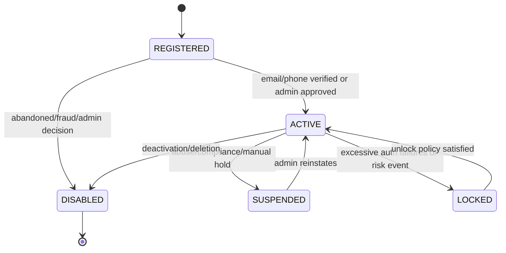
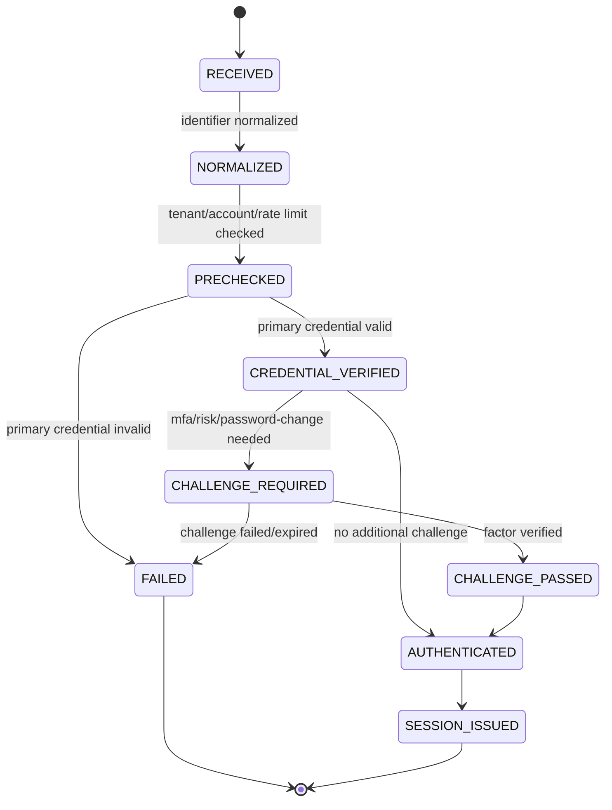
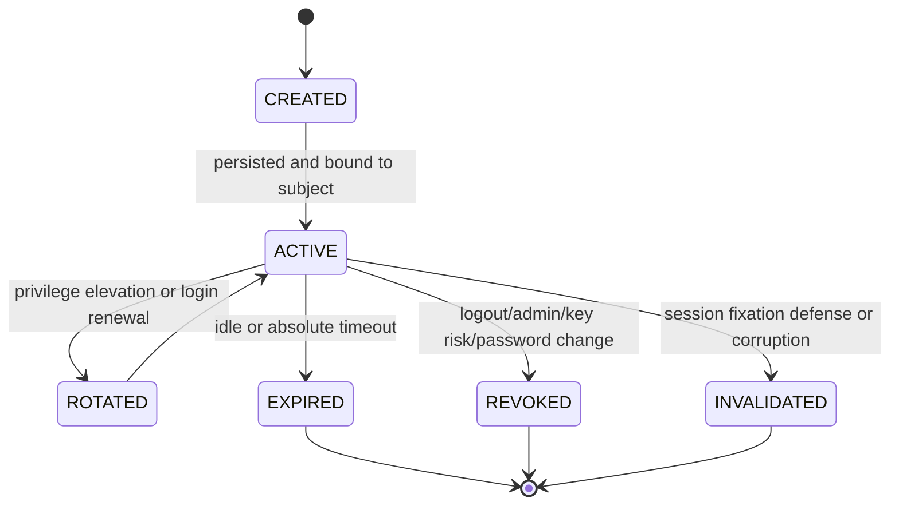
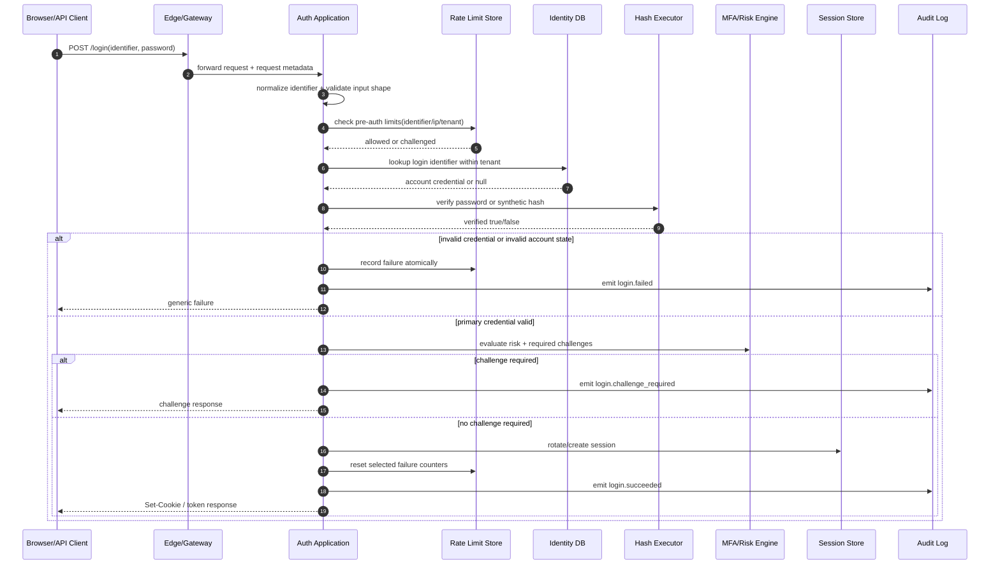
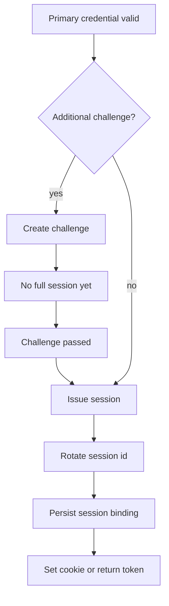
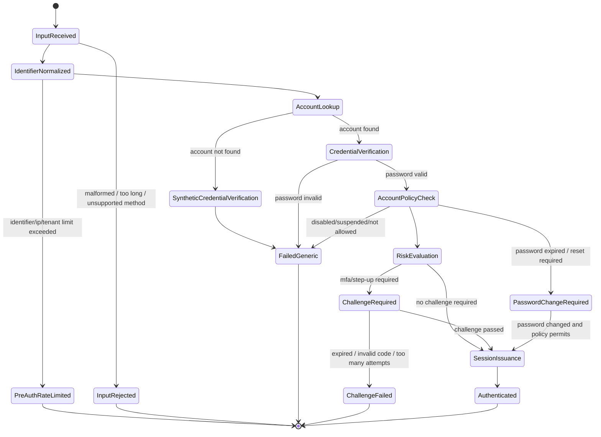

# Part 011 — Login Flow as State Machine

> Target part ini: membangun cara berpikir bahwa login bukan sekadar `if password matches then create session`. Login adalah state machine yang menghubungkan account lifecycle, credential verification, risk decision, challenge, session issuance, audit, throttling, dan recovery boundary. Setelah part ini, kamu harus bisa mendesain login flow yang eksplisit, bisa dites, bisa diaudit, dan tidak rapuh saat menghadapi race condition, enumeration attack, MFA, multi-tenant, dan failure operational.

Banyak bug autentikasi lahir dari model mental yang terlalu sederhana:

```java
if (passwordEncoder.matches(rawPassword, hash)) {
    login(user);
} else {
    reject();
}
```

Kode itu tidak salah sebagai potongan kecil. Tapi sebagai desain sistem, itu berbahaya karena menyembunyikan pertanyaan penting:

- apakah account aktif?
- apakah identifier valid untuk tenant ini?
- apakah credential expired?
- apakah password benar tetapi MFA wajib?
- apakah user sedang locked karena abuse?
- apakah session lama harus dirotasi?
- apakah login ini harus dicatat sebagai failure, success, challenge, atau suspicious attempt?
- apakah failure response membocorkan account existence?
- apakah dua login paralel bisa membuat counter/lock state tidak konsisten?

Login production-grade harus diperlakukan sebagai **state transition system**.

---

## 1. Model Mental: Authentication Attempt, Bukan Login Request

Request HTTP adalah envelope. Unit domain yang sebenarnya adalah **authentication attempt**.

```txt
HTTP request
  -> normalized login identifier
  -> tenant resolution
  -> authentication attempt
  -> credential verification
  -> risk decision
  -> challenge decision
  -> success/failure transition
  -> session/token issuance or rejection
```

Satu request `/login` bisa menghasilkan beberapa outcome:

| Outcome internal | Response eksternal | Catatan |
|---|---|---|
| identifier unknown | generic failure | jangan bocorkan bahwa account tidak ada |
| password wrong | generic failure | counter/throttle naik |
| account locked | generic failure atau support flow | hindari enumeration |
| credential expired | controlled transition | bisa butuh reset/change password |
| password correct, MFA required | challenge response | belum authenticated penuh |
| password correct, risk high | step-up challenge | jangan langsung issue session penuh |
| success | session/token issued | rotate session, audit success |

Authentication attempt adalah objek domain sementara yang punya state, event, dan expiry. Ia bukan hanya log row.

---

## 2. Tiga State Machine yang Sering Tercampur

Dalam sistem autentikasi, minimal ada tiga state machine berbeda.

### 2.1 Account Lifecycle State

Account state menjawab: **bolehkah subject ini memiliki akses sama sekali?**



State ini relatif panjang umur dan disimpan di database utama.

### 2.2 Authentication Attempt State

Attempt state menjawab: **di mana posisi proses login saat ini?**



State ini pendek umur. Ia bisa disimpan di Redis, database, encrypted browser state, atau hanya event stream tergantung flow.

### 2.3 Session State

Session state menjawab: **apakah hasil autentikasi masih berlaku untuk request berikutnya?**



Bug besar muncul ketika tiga state ini dicampur dalam satu boolean seperti `enabled`, `authenticated`, atau `loggedIn`.

---

## 3. Prinsip Utama: Login Harus Punya Invariant

Invariant adalah aturan yang selalu benar, apa pun path eksekusinya.

### 3.1 Security Invariants

| Invariant | Alasan |
|---|---|
| Tidak ada session/token penuh sebelum semua required challenge selesai | mencegah partial authentication menjadi akses penuh |
| Response failure eksternal tetap generic | mencegah account enumeration |
| Failure harus dicatat walaupun account tidak ada | mencegah blind spot abuse telemetry |
| Password verification untuk account tidak ada harus memakai synthetic path | mengurangi timing difference |
| Session ID harus berubah setelah authentication sukses | mencegah session fixation |
| Redirect target setelah login harus divalidasi allowlist/relative URL | mencegah open redirect |
| Security context harus dibersihkan setelah request | mencegah principal leak antar request/thread |
| Risk decision harus berdasarkan snapshot attempt | mencegah keputusan berubah di tengah flow tanpa audit |
| MFA challenge tidak boleh menurunkan assurance level | mencegah bypass step-up |
| Lock/throttle update harus atomic | mencegah race condition counter |

### 3.2 Operational Invariants

| Invariant | Alasan |
|---|---|
| Setiap attempt punya correlation id | incident response dan audit reconstruction |
| Semua outcome utama punya event | observability dan fraud detection |
| Hash verification dibatasi concurrency-nya | mencegah CPU/memory exhaustion |
| Login endpoint punya budget latency | mencegah cascade failure |
| IdP/downstream outage tidak berubah menjadi fail-open | mencegah akses tanpa verifikasi |
| Failure handler tidak membuat session jika mode stateless | mencegah state leak di API |

Production authentication bukan hanya benar secara kriptografi. Ia juga harus stabil ketika dependency lambat, Redis down, IdP error, atau traffic bot naik tajam.

---

## 4. Login Flow End-to-End

Flow login yang matang terlihat seperti ini:



Kuncinya: **lookup, verification, failure accounting, challenge, dan session issuance adalah langkah berbeda**. Jangan biarkan satu `AuthenticationProvider` melakukan semuanya tanpa boundary.

---

## 5. Data Model Minimal untuk Login Flow

Kita tidak selalu perlu menyimpan semua attempt secara sinkron. Tapi model konseptualnya harus jelas.

### 5.1 Account Authentication State

```sql
create table auth_account_state (
    account_id              uuid primary key,
    tenant_id               uuid not null,
    lifecycle_state         varchar(32) not null,
    password_credential_id  uuid,
    failed_login_count      integer not null default 0,
    failed_login_window_at  timestamptz,
    locked_until            timestamptz,
    last_success_login_at   timestamptz,
    last_failure_login_at   timestamptz,
    credential_version      bigint not null default 0,
    updated_at              timestamptz not null
);

create index idx_auth_account_state_tenant_state
    on auth_account_state (tenant_id, lifecycle_state);
```

Catatan desain:

- `failed_login_count` bukan satu-satunya defense. Ia hanya account-level signal.
- `locked_until` harus diperlakukan hati-hati karena bisa menjadi mekanisme lockout DoS.
- `credential_version` berguna untuk invalidasi session/token setelah password change/reset.

### 5.2 Authentication Attempt Event

```sql
create table auth_event (
    event_id          uuid primary key,
    tenant_id         uuid,
    account_id        uuid,
    attempt_id        uuid not null,
    event_type        varchar(64) not null,
    login_identifier  varchar(512),
    subject_ref       varchar(256),
    ip_hash           varchar(128),
    user_agent_hash   varchar(128),
    risk_score        integer,
    outcome           varchar(32) not null,
    reason_code       varchar(64),
    occurred_at       timestamptz not null,
    metadata_json     jsonb not null default '{}'::jsonb
);

create index idx_auth_event_attempt on auth_event (attempt_id);
create index idx_auth_event_tenant_time on auth_event (tenant_id, occurred_at desc);
create index idx_auth_event_account_time on auth_event (account_id, occurred_at desc);
```

Jangan simpan raw password, raw OTP, full IP tanpa policy, full user agent tanpa alasan, atau token di audit log.

### 5.3 Ephemeral Login Challenge

```sql
create table auth_login_challenge (
    challenge_id      uuid primary key,
    tenant_id         uuid not null,
    account_id        uuid not null,
    attempt_id        uuid not null,
    challenge_type    varchar(32) not null,
    challenge_state   varchar(32) not null,
    expires_at        timestamptz not null,
    attempts_left     integer not null,
    created_at        timestamptz not null,
    completed_at      timestamptz,
    metadata_json     jsonb not null default '{}'::jsonb
);
```

Untuk OTP/MFA, challenge secret harus disimpan aman. Untuk TOTP biasanya tidak perlu challenge secret per attempt, tapi tetap perlu attempt/challenge state untuk throttling dan audit.

---

## 6. Outcome Semantics: Internal Kaya, Eksternal Sederhana

Internal reason code harus spesifik. Response ke user harus dikontrol.

| Internal reason | External message | HTTP style |
|---|---|---|
| `UNKNOWN_IDENTIFIER` | Invalid username or password | 401/400 tergantung UI/API |
| `WRONG_PASSWORD` | Invalid username or password | 401/400 |
| `ACCOUNT_DISABLED` | Invalid username or password atau contact support | policy-dependent |
| `ACCOUNT_LOCKED` | Unable to sign in right now | 401/423 policy-dependent |
| `PASSWORD_EXPIRED` | Password change required | 200/403 dengan next step |
| `MFA_REQUIRED` | Additional verification required | 200/401 dengan challenge |
| `RISK_STEP_UP_REQUIRED` | Additional verification required | 200/401 dengan challenge |
| `RATE_LIMITED` | Try again later | 429 atau generic |
| `SYSTEM_UNAVAILABLE` | Try again later | 503, bukan fail-open |

Prinsipnya: **internal observability boleh detail, external semantics harus tahan enumeration dan abuse**.

---

## 7. Command Model untuk Login

Daripada menulis satu method besar `login()`, pecah menjadi command dan decision.

```java
public record StartLoginCommand(
        String tenantHint,
        String rawIdentifier,
        char[] rawPassword,
        RequestMetadata requestMetadata,
        String correlationId
) {}

public record LoginDecision(
        LoginOutcome outcome,
        UUID attemptId,
        UUID accountId,
        ChallengeDescriptor challenge,
        SessionDescriptor session,
        String internalReasonCode
) {
    public boolean authenticated() {
        return outcome == LoginOutcome.AUTHENTICATED;
    }
}

public enum LoginOutcome {
    FAILED,
    CHALLENGE_REQUIRED,
    AUTHENTICATED,
    RATE_LIMITED,
    TEMPORARILY_UNAVAILABLE
}
```

`LoginDecision` adalah boundary antara domain auth dan delivery layer. Controller/filter tidak perlu tahu detail hash, lockout, atau risk engine.

---

## 8. Java Implementation Skeleton

### 8.1 Application Service

```java
public final class LoginApplicationService {

    private final TenantResolver tenantResolver;
    private final LoginIdentifierNormalizer identifierNormalizer;
    private final LoginRateLimitService rateLimitService;
    private final AccountCredentialRepository credentialRepository;
    private final PasswordVerificationService passwordVerificationService;
    private final LoginStatePolicy loginStatePolicy;
    private final RiskDecisionService riskDecisionService;
    private final ChallengeService challengeService;
    private final SessionIssuer sessionIssuer;
    private final AuthAuditService auditService;

    public LoginDecision startLogin(StartLoginCommand command) {
        UUID attemptId = UUID.randomUUID();
        Instant now = Instant.now();

        NormalizedTenant tenant = tenantResolver.resolve(command.tenantHint(), command.requestMetadata());
        NormalizedIdentifier identifier = identifierNormalizer.normalize(command.rawIdentifier());

        PreAuthLimitDecision preLimit = rateLimitService.checkBeforeCredentialVerification(
                tenant.id(), identifier.value(), command.requestMetadata(), now);

        if (!preLimit.allowed()) {
            auditService.loginRateLimited(attemptId, tenant.id(), identifier, command.requestMetadata(), preLimit.reason());
            return LoginDecisionFactory.rateLimited(attemptId, preLimit.reason());
        }

        AccountCredentialView credentialView = credentialRepository
                .findPasswordCredential(tenant.id(), identifier.value())
                .orElse(AccountCredentialView.synthetic(tenant.id(), identifier.value()));

        PasswordVerificationResult verification = passwordVerificationService.verify(
                command.rawPassword(), credentialView.passwordHash());

        AccountLoginPrecheck precheck = loginStatePolicy.evaluate(credentialView, now);

        if (!verification.matches() || !precheck.loginMayProceed()) {
            rateLimitService.recordFailure(tenant.id(), identifier.value(), credentialView.accountIdOrNull(), command.requestMetadata(), now);
            auditService.loginFailed(attemptId, tenant.id(), credentialView.accountIdOrNull(), identifier,
                    command.requestMetadata(), failureReason(verification, precheck));
            return LoginDecisionFactory.failed(attemptId);
        }

        RiskDecision risk = riskDecisionService.evaluate(
                credentialView.accountId(), tenant.id(), command.requestMetadata(), now);

        if (risk.requiresChallenge()) {
            ChallengeDescriptor challenge = challengeService.createChallenge(
                    tenant.id(), credentialView.accountId(), attemptId, risk.requiredChallenge(), now);
            auditService.loginChallengeRequired(attemptId, tenant.id(), credentialView.accountId(), risk);
            return LoginDecisionFactory.challengeRequired(attemptId, credentialView.accountId(), challenge);
        }

        SessionDescriptor session = sessionIssuer.issueAuthenticatedSession(
                tenant.id(), credentialView.accountId(), credentialView.credentialVersion(), command.requestMetadata(), now);

        rateLimitService.recordSuccess(tenant.id(), identifier.value(), credentialView.accountId(), command.requestMetadata(), now);
        auditService.loginSucceeded(attemptId, tenant.id(), credentialView.accountId(), session.sessionId(), risk);

        return LoginDecisionFactory.authenticated(attemptId, credentialView.accountId(), session);
    }
}
```

Skeleton ini menunjukkan boundary, bukan copy-paste final. Beberapa dependency harus punya transactional guarantee sendiri.

### 8.2 Password Verification Service

```java
public final class PasswordVerificationService {

    private final PasswordEncoder passwordEncoder;
    private final String syntheticPasswordHash;
    private final ExecutorService hashExecutor;
    private final Duration timeout;

    public PasswordVerificationResult verify(char[] rawPassword, String encodedHash) {
        String hashToVerify = encodedHash == null ? syntheticPasswordHash : encodedHash;
        String password = new String(rawPassword);

        Future<Boolean> future = hashExecutor.submit(() -> passwordEncoder.matches(password, hashToVerify));
        try {
            boolean matched = future.get(timeout.toMillis(), TimeUnit.MILLISECONDS);
            return new PasswordVerificationResult(matched, false);
        } catch (TimeoutException e) {
            future.cancel(true);
            return new PasswordVerificationResult(false, true);
        } catch (InterruptedException e) {
            Thread.currentThread().interrupt();
            return new PasswordVerificationResult(false, true);
        } catch (ExecutionException e) {
            return new PasswordVerificationResult(false, true);
        } finally {
            Arrays.fill(rawPassword, '\0');
        }
    }
}
```

Catatan:

- `String` tidak bisa dihapus dari memory seperti `char[]`, tetapi banyak framework Java masih memaksa `String`. Minimal jangan simpan raw password di field/log.
- Hash executor harus bounded. Jangan jalankan Argon2/bcrypt langsung di unbounded request thread pool tanpa capacity planning.
- Synthetic hash harus memakai algorithm dan parameter yang sama dengan hash real saat ini.

---

## 9. Spring Security Integration Pattern

Spring Security sudah punya pipeline yang kuat. Kita tidak perlu mengganti semuanya. Yang perlu adalah menempatkan state machine domain di boundary yang benar.

### 9.1 Custom Authentication Token

```java
public final class LoginAuthenticationToken extends AbstractAuthenticationToken {

    private final String tenantHint;
    private final String identifier;
    private final Object credentials;
    private final RequestMetadata requestMetadata;

    public LoginAuthenticationToken(
            String tenantHint,
            String identifier,
            Object credentials,
            RequestMetadata requestMetadata
    ) {
        super(null);
        this.tenantHint = tenantHint;
        this.identifier = identifier;
        this.credentials = credentials;
        this.requestMetadata = requestMetadata;
        setAuthenticated(false);
    }

    private LoginAuthenticationToken(
            AuthenticatedPrincipal principal,
            Collection<? extends GrantedAuthority> authorities
    ) {
        super(authorities);
        this.tenantHint = principal.tenantId().toString();
        this.identifier = principal.subjectRef();
        this.credentials = null;
        this.requestMetadata = null;
        setAuthenticated(true);
        setDetails(principal);
    }

    public static LoginAuthenticationToken authenticated(
            AuthenticatedPrincipal principal,
            Collection<? extends GrantedAuthority> authorities
    ) {
        return new LoginAuthenticationToken(principal, authorities);
    }

    @Override
    public Object getCredentials() {
        return credentials;
    }

    @Override
    public Object getPrincipal() {
        return identifier;
    }

    public String tenantHint() {
        return tenantHint;
    }

    public RequestMetadata requestMetadata() {
        return requestMetadata;
    }
}
```

### 9.2 AuthenticationProvider Delegates to Domain Service

```java
public final class LoginAuthenticationProvider implements AuthenticationProvider {

    private final LoginApplicationService loginService;
    private final AuthorityMapper authorityMapper;

    @Override
    public Authentication authenticate(Authentication authentication) {
        LoginAuthenticationToken token = (LoginAuthenticationToken) authentication;

        StartLoginCommand command = new StartLoginCommand(
                token.tenantHint(),
                String.valueOf(token.getPrincipal()),
                String.valueOf(token.getCredentials()).toCharArray(),
                token.requestMetadata(),
                token.requestMetadata().correlationId()
        );

        LoginDecision decision = loginService.startLogin(command);

        return switch (decision.outcome()) {
            case AUTHENTICATED -> LoginAuthenticationToken.authenticated(
                    AuthenticatedPrincipal.from(decision),
                    authorityMapper.map(decision.accountId())
            );
            case CHALLENGE_REQUIRED -> throw new ChallengeRequiredAuthenticationException(decision.challenge());
            case RATE_LIMITED -> throw new RateLimitedAuthenticationException();
            case TEMPORARILY_UNAVAILABLE -> throw new AuthenticationServiceException("Authentication unavailable");
            case FAILED -> throw new BadCredentialsException("Invalid credentials");
        };
    }

    @Override
    public boolean supports(Class<?> authentication) {
        return LoginAuthenticationToken.class.isAssignableFrom(authentication);
    }
}
```

Perhatikan bahwa exception message internal bisa spesifik untuk log, tetapi response user harus dikontrol oleh failure handler.

### 9.3 Success Handler

```java
public final class LoginSuccessHandler implements AuthenticationSuccessHandler {

    private final RedirectTargetValidator redirectTargetValidator;

    @Override
    public void onAuthenticationSuccess(
            HttpServletRequest request,
            HttpServletResponse response,
            Authentication authentication
    ) throws IOException {
        String target = request.getParameter("returnTo");
        String safeTarget = redirectTargetValidator.safeTargetOrDefault(target, "/");

        response.setStatus(HttpServletResponse.SC_FOUND);
        response.setHeader("Location", safeTarget);
    }
}
```

Success handler tidak boleh menerima arbitrary absolute URL seperti `https://evil.example/phish`.

### 9.4 Failure Handler

```java
public final class LoginFailureHandler implements AuthenticationFailureHandler {

    @Override
    public void onAuthenticationFailure(
            HttpServletRequest request,
            HttpServletResponse response,
            AuthenticationException exception
    ) throws IOException {
        response.setStatus(statusFor(exception));
        response.setContentType("application/json");
        response.getWriter().write(genericBodyFor(exception));
    }

    private int statusFor(AuthenticationException exception) {
        if (exception instanceof RateLimitedAuthenticationException) {
            return 429;
        }
        if (exception instanceof ChallengeRequiredAuthenticationException) {
            return 401;
        }
        return 401;
    }

    private String genericBodyFor(AuthenticationException exception) {
        if (exception instanceof ChallengeRequiredAuthenticationException challenge) {
            return "{\"next\":\"additional_verification_required\",\"challengeId\":\""
                    + challenge.challenge().challengeId() + "\"}";
        }
        return "{\"error\":\"invalid_login\",\"message\":\"Invalid username or password\"}";
    }
}
```

Untuk browser form, response bisa redirect ke halaman login dengan generic flash message. Untuk API, gunakan JSON.

---

## 10. Jakarta Security Integration Pattern

Jakarta Security memakai `HttpAuthenticationMechanism` dan `IdentityStore` sebagai abstraction. Untuk login flow kompleks, gunakan `HttpAuthenticationMechanism` sebagai delivery adapter, bukan tempat seluruh domain logic.

```java
@ApplicationScoped
public class FormLoginAuthenticationMechanism implements HttpAuthenticationMechanism {

    @Inject
    LoginApplicationService loginService;

    @Override
    public AuthenticationStatus validateRequest(
            HttpServletRequest request,
            HttpServletResponse response,
            HttpMessageContext context
    ) throws AuthenticationException {
        if (!isLoginRequest(request)) {
            return context.doNothing();
        }

        StartLoginCommand command = new StartLoginCommand(
                request.getParameter("tenant"),
                request.getParameter("username"),
                request.getParameter("password").toCharArray(),
                RequestMetadata.from(request),
                correlationId(request)
        );

        LoginDecision decision = loginService.startLogin(command);

        return switch (decision.outcome()) {
            case AUTHENTICATED -> context.notifyContainerAboutLogin(
                    decision.accountId().toString(),
                    Set.of("USER")
            );
            case CHALLENGE_REQUIRED -> sendChallenge(response, decision);
            case RATE_LIMITED, FAILED -> sendGenericFailure(response);
            case TEMPORARILY_UNAVAILABLE -> sendUnavailable(response);
        };
    }
}
```

Boundary yang perlu dijaga:

- `HttpAuthenticationMechanism` membaca request dan menulis response.
- `LoginApplicationService` membuat keputusan domain.
- `IdentityStore` cocok untuk credential validation sederhana, tetapi login flow modern sering butuh service yang lebih kaya.

---

## 11. Atomicity dan Race Condition

Login failure counter terlihat sederhana, tetapi race condition mudah terjadi.

### 11.1 Lost Update

```txt
T1 read failed_count = 4
T2 read failed_count = 4
T1 write failed_count = 5
T2 write failed_count = 5
```

Padahal harusnya menjadi 6. Gunakan atomic update:

```sql
update auth_account_state
set failed_login_count = failed_login_count + 1,
    last_failure_login_at = now(),
    locked_until = case
        when failed_login_count + 1 >= 10 then now() + interval '15 minutes'
        else locked_until
    end,
    updated_at = now()
where account_id = :account_id;
```

Atau gunakan Redis atomic increment dengan expiry untuk window-based throttle. Untuk state penting yang butuh audit kuat, persist event ke database juga.

### 11.2 Parallel Success and Failure

Skenario:

1. user legitimate login sukses;
2. bot credential stuffing masih mengirim banyak failure;
3. failure counters terus naik dan mengunci account setelah sukses.

Solusi:

- reset counter hanya untuk dimension tertentu setelah success;
- pisahkan account-level lock dari identifier/IP/global throttle;
- jangan biarkan IP throttle sukses direset oleh satu login valid;
- gunakan event time dan window, bukan satu integer global tanpa konteks.

### 11.3 MFA Race

Skenario:

1. password benar, MFA challenge dibuat;
2. user meminta challenge kedua;
3. challenge lama masih valid;
4. attacker memakai challenge lama.

Pattern:

- challenge punya `challenge_id`, `attempt_id`, expiry, state;
- challenge completion harus atomic: `PENDING -> PASSED` hanya sekali;
- challenge lama bisa di-revoke saat challenge baru dibuat, tergantung UX/security;
- challenge harus bound ke account, tenant, purpose, dan attempt.

```sql
update auth_login_challenge
set challenge_state = 'PASSED', completed_at = now()
where challenge_id = :challenge_id
  and challenge_state = 'PENDING'
  and expires_at > now()
  and attempts_left > 0;
```

Jika affected rows = 0, jangan treat sebagai success.

---

## 12. Session Issuance Boundary

Session issuance harus terjadi hanya setelah `AUTHENTICATED` penuh.



Untuk browser stateful login:

- rotate session id setelah login;
- set cookie `HttpOnly`, `Secure`, `SameSite` sesuai kebutuhan;
- bind session ke account, tenant, credential version, assurance level;
- record `created_at`, `last_seen_at`, `absolute_expires_at`, `idle_expires_at`;
- invalidate pre-auth session state yang tidak diperlukan.

Untuk stateless token login:

- issue token hanya setelah challenge selesai;
- gunakan short-lived access token;
- refresh token harus punya lifecycle dan reuse detection;
- jangan masukkan sensitive data di JWT claims;
- pastikan issuer, audience, expiry, signature, dan key id divalidasi di resource server.

---

## 13. Assurance Level dan Partial Authentication

Login modern sering multi-step. Jangan representasikan semua sebagai boolean `authenticated`.

Gunakan assurance state:

```java
public enum AuthenticationAssurance {
    NONE,
    PRIMARY_CREDENTIAL_VERIFIED,
    MFA_VERIFIED,
    PHISHING_RESISTANT_VERIFIED,
    ADMIN_STEP_UP_VERIFIED
}
```

Contoh policy:

| Operation | Required assurance |
|---|---|
| melihat dashboard umum | `MFA_VERIFIED` atau policy tenant |
| mengubah email/password | recent `MFA_VERIFIED` |
| melihat data sensitif | recent step-up |
| admin action | `ADMIN_STEP_UP_VERIFIED` |
| high-risk payment/action | phishing-resistant atau risk-dependent |

MFA yang sukses 30 hari lalu tidak selalu cukup untuk operasi sensitif hari ini. Simpan `authenticated_at`, `mfa_verified_at`, `step_up_verified_at`, dan `assurance_level`.

---

## 14. Error Handling dan User Experience

Security yang baik bukan berarti semua error dibuat kabur tanpa arah. Yang harus generic adalah informasi yang membantu attacker membedakan account existence/status.

### 14.1 Login Failure

```txt
Invalid username or password.
```

Jangan:

```txt
User does not exist.
Password incorrect.
Account exists but is disabled.
```

### 14.2 Rate Limited

```txt
We could not sign you in right now. Please try again later.
```

Untuk user legitimate, sediakan recovery/support path yang tidak membocorkan account existence.

### 14.3 MFA Required

```txt
Additional verification required.
```

MFA required tidak harus dirahasiakan setelah password benar, tetapi detail faktor yang tersedia harus hati-hati:

```txt
Send code to email ending in ***@example.com
```

Jangan membocorkan full email/phone.

---

## 15. Redirect After Login

Open redirect adalah bug authentication flow klasik.

Buruk:

```java
response.sendRedirect(request.getParameter("returnTo"));
```

Lebih baik:

```java
public final class RedirectTargetValidator {

    private static final Set<String> ALLOWED_PREFIXES = Set.of("/app", "/dashboard", "/settings");

    public String safeTargetOrDefault(String rawTarget, String defaultTarget) {
        if (rawTarget == null || rawTarget.isBlank()) {
            return defaultTarget;
        }
        if (rawTarget.startsWith("//")) {
            return defaultTarget;
        }
        URI uri;
        try {
            uri = URI.create(rawTarget);
        } catch (IllegalArgumentException ex) {
            return defaultTarget;
        }
        if (uri.isAbsolute()) {
            return defaultTarget;
        }
        String path = uri.getPath();
        return ALLOWED_PREFIXES.stream().anyMatch(path::startsWith) ? rawTarget : defaultTarget;
    }
}
```

Jika sistem multi-domain enterprise membutuhkan redirect lintas domain, gunakan allowlist eksplisit per tenant/client, bukan arbitrary parameter.

---

## 16. Login Flow untuk API vs Browser

| Concern | Browser Form Login | API Login |
|---|---|---|
| Credential transport | form POST over HTTPS | JSON POST over HTTPS |
| CSRF | wajib untuk cookie-authenticated form | tergantung cookie vs bearer |
| Session | cookie + server session umum | token/session tergantung architecture |
| Redirect | common | sebaiknya tidak; gunakan JSON |
| Failure response | halaman/login flash | JSON problem detail |
| CORS | jarang untuk same-origin | penting untuk cross-origin SPA |
| Preflight | harus tidak memaksa auth | harus dikonfigurasi |
| Rate limit | identifier + IP + session | client id + IP + identifier |

Jangan memaksa satu flow untuk semua client. Browser, mobile app, service-to-service, dan SPA punya boundary berbeda.

---

## 17. Testing Login State Machine

### 17.1 State Transition Test

```java
@Test
void passwordCorrectButMfaRequiredMustNotIssueSession() {
    StartLoginCommand command = validPasswordLoginForMfaUser();

    LoginDecision decision = loginService.startLogin(command);

    assertThat(decision.outcome()).isEqualTo(LoginOutcome.CHALLENGE_REQUIRED);
    assertThat(decision.session()).isNull();
    assertThat(challengeRepository.findByAttemptId(decision.attemptId())).isPresent();
    assertThat(auditSink.events()).extracting(AuthEvent::type)
            .contains("login.challenge_required")
            .doesNotContain("login.succeeded");
}
```

### 17.2 Generic Failure Test

```java
@ParameterizedTest
@MethodSource("invalidLoginScenarios")
void invalidScenariosReturnSameExternalMessage(LoginScenario scenario) throws Exception {
    mockMvc.perform(post("/login")
            .param("username", scenario.username())
            .param("password", scenario.password()))
        .andExpect(status().isUnauthorized())
        .andExpect(jsonPath("$.message").value("Invalid username or password"));
}
```

### 17.3 No Session Before Success

```java
@Test
void failedLoginMustNotCreateAuthenticatedSession() throws Exception {
    MvcResult result = mockMvc.perform(post("/login")
            .param("username", "alice@example.com")
            .param("password", "wrong"))
        .andExpect(status().isUnauthorized())
        .andReturn();

    MockHttpSession session = (MockHttpSession) result.getRequest().getSession(false);
    if (session != null) {
        assertThat(session.getAttribute("SPRING_SECURITY_CONTEXT")).isNull();
    }
}
```

### 17.4 Race Test

```java
@Test
void concurrentFailuresShouldIncrementCounterAtomically() throws Exception {
    int attempts = 50;
    ExecutorService executor = Executors.newFixedThreadPool(10);
    CountDownLatch start = new CountDownLatch(1);

    List<Future<?>> futures = IntStream.range(0, attempts)
            .mapToObj(i -> executor.submit(() -> {
                start.await();
                loginService.startLogin(wrongPasswordCommand("alice@example.com"));
                return null;
            }))
            .toList();

    start.countDown();
    for (Future<?> future : futures) {
        future.get();
    }

    AuthAccountState state = accountStateRepository.findByIdentifier("alice@example.com");
    assertThat(state.failedLoginCount()).isEqualTo(attempts);
}
```

Test seperti ini sering menemukan bug lost update lebih cepat daripada review desain.

---

## 18. Production Failure Modes

### 18.1 Partial Authentication Becomes Full Authentication

Gejala:

- setelah password benar, sistem membuat session;
- MFA page hanya UI barrier;
- attacker yang punya password bisa akses endpoint API langsung.

Fix:

- jangan set `SecurityContext` penuh sebelum MFA selesai;
- gunakan separate pre-auth challenge token dengan scope sangat terbatas;
- enforce assurance level di server, bukan hanya di frontend.

### 18.2 Login Failure Creates Session Unexpectedly

Gejala:

- API stateless mengembalikan `JSESSIONID` saat login gagal;
- failure handler menyimpan request/cache ke session.

Fix:

- audit configuration Spring Security failure handler/request cache;
- disable session creation untuk stateless API;
- gunakan explicit JSON failure response.

### 18.3 Account Lockout DoS

Gejala:

- attacker mencoba password salah ke banyak account;
- banyak user legitimate terkunci.

Fix:

- gunakan progressive throttling, bukan immediate hard lock;
- kombinasikan dimension IP/ASN/device/identifier;
- pisahkan high-risk throttle dari permanent account lock;
- sediakan recovery path aman.

### 18.4 Timing Enumeration

Gejala:

- account yang ada butuh 250 ms karena bcrypt;
- account tidak ada butuh 5 ms;
- attacker bisa enumerate email.

Fix:

- gunakan synthetic hash verification;
- normalize response envelope;
- monitor latency distribution per failure reason secara internal.

### 18.5 Open Redirect After Login

Gejala:

```txt
/login?returnTo=https://evil.example/callback
```

Fix:

- hanya allow relative path;
- atau allowlist redirect URI per client/tenant;
- jangan menerima protocol-relative URL `//evil.example`.

### 18.6 SecurityContext Leak

Gejala:

- user A terlihat sebagai user B dalam async/background execution;
- context tidak dibersihkan atau dipropagasi tidak aman.

Fix:

- jangan mengandalkan `ThreadLocal` melewati async boundary tanpa wrapper;
- clear context di finally;
- pass explicit subject context untuk background job.

---

## 19. Mermaid: Complete Login State Machine



State machine ini bukan harus diimplementasikan dengan framework state machine. Yang penting adalah transition dan invariant-nya eksplisit.

---

## 20. Checklist Implementasi

Gunakan checklist ini saat review login flow:

- [ ] Login flow punya explicit internal outcome, bukan boolean.
- [ ] Account lifecycle state dipisah dari attempt state.
- [ ] Session state dipisah dari account state.
- [ ] Password benar + MFA required tidak membuat session penuh.
- [ ] Failure response tidak membocorkan account existence.
- [ ] Unknown account tetap menjalankan synthetic verification.
- [ ] Failure accounting atomic.
- [ ] Session ID dirotasi setelah login sukses.
- [ ] Redirect target divalidasi.
- [ ] Audit event dibuat untuk success, failure, challenge, rate limit, dan unavailable.
- [ ] Hash executor bounded dan punya timeout.
- [ ] SecurityContext dibersihkan setelah request.
- [ ] CORS preflight tidak diperlakukan sebagai login/auth failure.
- [ ] Browser login punya CSRF protection.
- [ ] API login tidak membuat session tanpa sengaja.
- [ ] Challenge state punya expiry dan attempts limit.
- [ ] Lockout policy tidak mudah menjadi DoS.
- [ ] Login flow bisa diuji dengan state transition tests.

---

## 21. Production Drill

Desain dan uji skenario berikut:

```txt
Tenant A memakai password + TOTP.
Tenant B memakai password saja.
User alice@example.com ada di dua tenant.
Attacker mengirim 10.000 login attempt dari 500 IP.
Sebagian attempt memakai tenant hint salah.
Sebagian attempt memakai password benar untuk Tenant A.
Sebagian attempt mencoba bypass MFA dengan memanggil endpoint API langsung setelah password benar.
```

Jawab:

1. Di state mana setiap attempt berhenti?
2. Counter apa yang naik?
3. Event apa yang diterbitkan?
4. Apakah response membocorkan tenant membership Alice?
5. Apakah password benar tetapi MFA belum selesai bisa membuat session?
6. Apakah success di Tenant A mereset failure counter Tenant B?
7. Bagaimana incident responder membedakan bot attack dari user legitimate yang lupa password?

Kalau desainmu tidak bisa menjawab tujuh pertanyaan itu, login flow masih terlalu implisit.

---

## 22. Ringkasan

Login production-grade adalah state machine dengan beberapa domain state:

- account lifecycle;
- authentication attempt;
- challenge/MFA;
- session/token;
- risk and throttle state;
- audit event stream.

Yang membedakan engineer matang dari sekadar pengguna framework adalah kemampuan menjaga invariant:

```txt
no full session before full authentication
no information leak through failure semantics
no non-atomic failure accounting
no hidden state transition without audit
no fail-open when dependency fails
```

Spring Security, Jakarta Security, Keycloak, atau custom auth service hanyalah implementasi. Model mental yang benar adalah: **authentication is a controlled transition from untrusted request to trusted subject context**.

---

## Referensi

- Spring Security Reference — Servlet Authentication Architecture: https://docs.spring.io/spring-security/reference/servlet/authentication/architecture.html
- Spring Security Reference — Authentication Persistence and Session Management: https://docs.spring.io/spring-security/reference/servlet/authentication/session-management.html
- Jakarta Security 4.0 Specification: https://jakarta.ee/specifications/security/4.0/
- OWASP Authentication Cheat Sheet: https://cheatsheetseries.owasp.org/cheatsheets/Authentication_Cheat_Sheet.html
- OWASP Forgot Password Cheat Sheet: https://cheatsheetseries.owasp.org/cheatsheets/Forgot_Password_Cheat_Sheet.html
- NIST SP 800-63B-4 — Authentication and Authenticator Management: https://pages.nist.gov/800-63-4/sp800-63b.html
