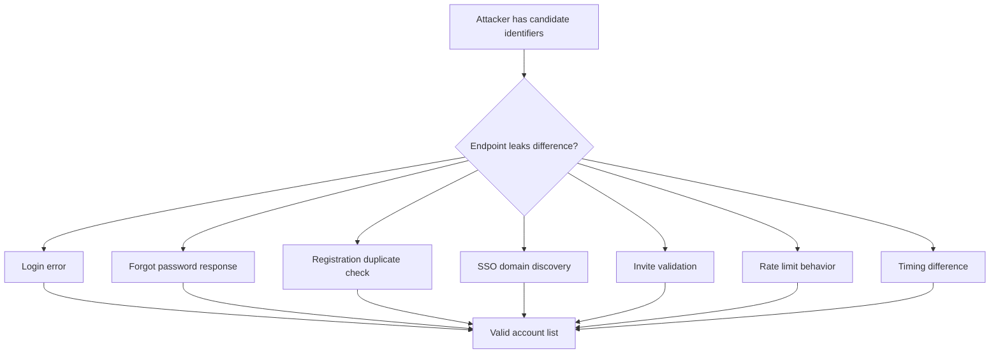
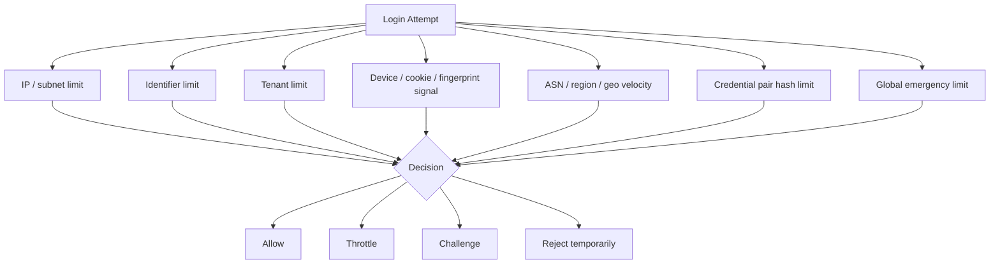

# Part 012 — Account Enumeration & Rate Limiting

> Target part ini: memahami account enumeration dan rate limiting sebagai defense layer yang saling melengkapi. Kita akan membahas cara attacker mengetahui account yang valid, kenapa generic response saja tidak cukup, bagaimana timing leak muncul, bagaimana membuat throttling multi-dimensi, kapan account lockout berbahaya, bagaimana mengimplementasikan rate limiter di Java/Redis/PostgreSQL, dan bagaimana menguji sistem agar tahan credential stuffing.

Dua kesalahan umum dalam login security:

```txt
Kesalahan 1: "Pesan error sudah generic, berarti aman dari enumeration."
Kesalahan 2: "Account lock setelah 5 kali gagal, berarti aman dari brute force."
```

Keduanya terlalu sederhana.

Pesan generic tidak cukup jika timing, status code, recovery flow, registration flow, atau rate-limit behavior tetap membocorkan informasi. Account lockout juga bisa menjadi senjata attacker untuk mengunci ribuan user legitimate.

Authentication abuse defense harus dilihat sebagai sistem:

```txt
input normalization
  -> enumeration-resistant response
  -> synthetic verification
  -> multi-dimensional throttling
  -> progressive friction
  -> safe lock policy
  -> audit and detection
  -> recovery path
```

---

## 1. Apa Itu Account Enumeration?

Account enumeration adalah kondisi ketika attacker bisa membedakan apakah identifier tertentu valid.

Identifier bisa berupa:

- email;
- username;
- phone number;
- employee id;
- customer number;
- tenant domain;
- SSO domain;
- organization slug;
- invitation token;
- recovery identifier.

Enumeration bukan hanya lewat endpoint `/login`. Semua endpoint identity bisa menjadi oracle.



Valid account list meningkatkan efektivitas phishing, credential stuffing, password spraying, SIM swap targeting, dan social engineering.

---

## 2. Jenis Enumeration Leak

### 2.1 Explicit Message Leak

Buruk:

```txt
No account found for this email.
Password incorrect.
Account disabled.
```

Lebih aman:

```txt
Invalid username or password.
```

Untuk recovery:

```txt
If an account exists for this identifier, we will send instructions.
```

### 2.2 Status Code Leak

Buruk:

| Scenario | HTTP |
|---|---:|
| account tidak ada | 404 |
| password salah | 401 |
| account locked | 423 |
| account disabled | 403 |

Attacker tidak perlu membaca body. Status code sudah cukup.

Lebih aman untuk public login:

| Scenario | HTTP |
|---|---:|
| account tidak ada | 401 atau 400 dengan body generic |
| password salah | 401 atau 400 dengan body generic |
| account locked | policy-dependent, sering tetap generic |

Untuk internal/admin API, reason detail boleh tersedia jika caller sudah authenticated dan authorized.

### 2.3 Timing Leak

Buruk:

```txt
unknown account -> 5 ms
known account + wrong password -> 250 ms
```

Attacker bisa mengukur banyak request dan memisahkan dua distribusi.

Penyebab umum:

- unknown account tidak menjalankan password hash verification;
- known account membaca banyak relational data;
- disabled account return terlalu cepat;
- email recovery untuk account valid melakukan queue write, invalid tidak;
- rate limiter hanya membuat key untuk account valid.

### 2.4 Recovery Flow Leak

Buruk:

```txt
We sent reset email to alice@example.com.
No account exists for bob@example.com.
```

Lebih aman:

```txt
If an account exists, reset instructions will be sent.
```

Tapi message saja tidak cukup. Durasi response, email queue behavior, dan rate-limit behavior juga harus seragam.

### 2.5 Registration Leak

Buruk:

```txt
This email is already registered.
```

Dalam beberapa produk, ini acceptable trade-off demi UX. Tapi pada high-risk system, itu enumeration vector. Alternatif:

```txt
If this email is eligible, we will send next steps.
```

Atau gunakan flow:

- user memasukkan email;
- sistem selalu mengirim email;
- jika account sudah ada, email berisi sign-in/recovery guidance;
- jika belum ada, email berisi registration continuation;
- UI tetap konsisten.

### 2.6 SSO Domain Discovery Leak

Buruk:

```txt
acme.com uses Okta.
unknowncorp.com has no tenant.
```

Untuk enterprise SaaS, domain discovery kadang memang diperlukan. Maka kontrolnya bukan selalu “sembunyikan semua”, tetapi:

- throttle domain discovery;
- jangan tampilkan metadata tenant berlebihan;
- gunakan verified domain ownership;
- hindari menunjukkan daftar IdP/factor detail sebelum user membuktikan kontrol email/domain.

### 2.7 Rate Limit Side Channel

Contoh leak:

```txt
valid account wrong password -> rate limited after 5 attempts
invalid account -> never rate limited
```

Attacker tinggal mencoba beberapa kali dan melihat mana yang kena 429.

Solusi:

- buat throttle key untuk identifier normalized, walau account tidak ada;
- jangan hanya throttle by account id;
- response rate-limited tetap dikontrol agar tidak menjadi oracle.

---

## 3. Enumeration-Resistant Response Design

Response publik harus punya tiga kesamaan:

1. **message semantics** konsisten;
2. **status semantics** tidak membocorkan perbedaan sensitif;
3. **timing envelope** tidak terlalu berbeda.

### 3.1 Login Response

```json
{
  "error": "invalid_login",
  "message": "Invalid username or password"
}
```

Untuk rate limit:

```json
{
  "error": "unable_to_sign_in",
  "message": "We could not sign you in right now. Please try again later."
}
```

Jangan kirim:

```json
{
  "error": "account_locked",
  "lockedUntil": "2026-07-03T12:00:00Z"
}
```

kecuali setelah user sudah melewati proof yang cukup atau dalam trusted channel.

### 3.2 Forgot Password Response

```json
{
  "status": "accepted",
  "message": "If an account exists for this identifier, instructions will be sent."
}
```

Endpoint recovery harus tetap membuat audit event untuk invalid identifier. Invalid attempt tetap penting untuk abuse detection.

### 3.3 Registration Response

Untuk sistem low-risk consumer, duplicate email message bisa diterima sebagai UX trade-off. Untuk sistem regulasi/enterprise/high-risk, gunakan email-mediated response.

```json
{
  "status": "accepted",
  "message": "Check your email for next steps."
}
```

---

## 4. Timing Resistance: Jangan Naif

Banyak engineer mencoba:

```java
Thread.sleep(250);
```

Ini bukan solusi lengkap.

Masalahnya:

- sleep menghabiskan request thread;
- attacker bisa tetap melihat distribusi berbeda;
- latency real berubah saat load tinggi;
- synthetic delay bisa menjadi DoS amplifier;
- known account path mungkin 250 ms hari ini, 600 ms saat DB lambat.

Yang lebih baik:

1. jalankan synthetic password verification untuk unknown account;
2. gunakan response envelope yang memiliki minimum duration kecil tapi bounded;
3. jangan membuat invalid path jauh lebih cepat;
4. instrument latency by internal reason;
5. rate limit sebelum expensive verification untuk traffic jelas abusive;
6. jangan membuat timing sempurna sebagai satu-satunya defense.

### 4.1 Synthetic Verification

```java
public final class CredentialLookupService {

    private final AccountCredentialRepository repository;
    private final String syntheticPasswordHash;

    public AccountCredentialView findOrSynthetic(UUID tenantId, String normalizedIdentifier) {
        return repository.findPasswordCredential(tenantId, normalizedIdentifier)
                .orElseGet(() -> AccountCredentialView.synthetic(
                        tenantId,
                        normalizedIdentifier,
                        syntheticPasswordHash
                ));
    }
}
```

Synthetic hash harus:

- valid untuk algorithm saat ini;
- punya parameter sebanding dengan hash real;
- diganti saat parameter hash utama diganti;
- tidak disimpan sebagai magic plaintext di code.

### 4.2 Bounded Minimum Response Time

```java
public final class ResponseTimingGuard {

    private final Clock clock;
    private final Duration minimumDuration;
    private final Duration maximumPadding;

    public void enforceMinimumDuration(Instant startedAt) {
        Duration elapsed = Duration.between(startedAt, clock.instant());
        Duration remaining = minimumDuration.minus(elapsed);

        if (remaining.isNegative() || remaining.isZero()) {
            return;
        }

        Duration bounded = remaining.compareTo(maximumPadding) > 0 ? maximumPadding : remaining;
        try {
            Thread.sleep(bounded.toMillis());
        } catch (InterruptedException e) {
            Thread.currentThread().interrupt();
        }
    }
}
```

Gunakan ini hati-hati. Untuk sistem high-throughput, lebih baik memakai async/non-blocking delay atau worker model. Jangan membuat sleep besar di request thread.

---

## 5. Rate Limiting vs Throttling vs Lockout

Istilah sering bercampur.

| Mekanisme | Arti | Cocok untuk | Risiko |
|---|---|---|---|
| Rate limiting | membatasi jumlah request per window | endpoint abuse, bot traffic | false positive NAT/shared IP |
| Throttling | memperlambat atau menambah friction | repeated failures | UX buruk jika terlalu agresif |
| Progressive delay | delay meningkat setelah failure | password spraying | bisa jadi DoS jika blocking thread |
| CAPTCHA/friction | proof tambahan | suspicious automation | accessibility, bypass, vendor dependency |
| Account lockout | mencegah login sementara | targeted brute force | lockout DoS terhadap user legitimate |
| Step-up | minta faktor tambahan | risk-based login | kompleksitas state dan recovery |

NIST SP 800-63B-4 mewajibkan verifier menerapkan rate-limiting mechanism yang secara efektif membatasi jumlah failed authentication attempts pada subscriber. Interpretasi production-grade-nya: jangan hanya satu counter global; gunakan control yang efektif terhadap online guessing tanpa membuat account mudah disandera attacker.

---

## 6. Multi-Dimensional Throttling

Single key rate limit jarang cukup.

Buruk:

```txt
limit by IP only
```

Masalah:

- attacker pakai botnet/proxy;
- banyak user legitimate di NAT kantor terkena false positive;
- password spraying terhadap banyak account dari banyak IP lolos.

Lebih baik gunakan beberapa dimension.



### 6.1 Recommended Dimensions

| Dimension | Key example | Detects | Caution |
|---|---|---|---|
| IP | `ip:203.0.113.10` | single-source brute force | NAT false positive |
| subnet | `subnet:203.0.113.0/24` | rotating IP nearby | coarse blocking |
| identifier | `id:tenant:hash(email)` | targeted attack | enumeration side-channel |
| tenant | `tenant:uuid` | tenant-wide attack | noisy tenant affects all users |
| account id | `acct:uuid` | known account abuse | only works after lookup |
| device cookie | `dev:hash(cookie)` | repeated browser automation | privacy and spoofing |
| credential pair | `pair:hash(identifier+password)` | credential stuffing reuse | never store raw password |
| ASN/country | `asn:12345` | proxy networks | false positives for remote teams |
| endpoint | `endpoint:/login` | volumetric abuse | too broad |
| global | `global:login` | emergency protection | can affect all users |

Credential pair hash should be HMACed with a server-side secret and short-retained. Never log raw passwords.

---

## 7. Decision Model

A rate limiter should not return only boolean.

```java
public record RateLimitDecision(
        RateLimitOutcome outcome,
        String dominantReason,
        Duration retryAfter,
        int riskPoints,
        Map<String, DimensionDecision> dimensions
) {
    public boolean allowed() {
        return outcome == RateLimitOutcome.ALLOW || outcome == RateLimitOutcome.ALLOW_WITH_MONITORING;
    }
}

public enum RateLimitOutcome {
    ALLOW,
    ALLOW_WITH_MONITORING,
    THROTTLE,
    REQUIRE_CHALLENGE,
    REJECT_TEMPORARILY
}
```

Kenapa perlu richer decision?

- API response mungkin sama, tapi audit berbeda;
- risk engine butuh skor;
- progressive friction butuh alasan;
- SRE butuh dominant dimension saat incident;
- policy bisa berubah tanpa mengubah controller.

---

## 8. Algorithms: Fixed Window, Sliding Window, Token Bucket

### 8.1 Fixed Window

```txt
max 10 attempts per 60 seconds
key = login:ip:203.0.113.10:202607031201
```

Mudah, tapi burst di boundary window bisa lolos.

### 8.2 Sliding Window Log

Simpan timestamp attempt dan hitung dalam window bergerak. Akurat, tapi lebih mahal.

### 8.3 Sliding Window Counter

Approximation yang lebih murah. Cocok untuk banyak kasus.

### 8.4 Token Bucket

Ada bucket dengan capacity dan refill rate. Cocok untuk membolehkan burst terbatas.

```txt
capacity = 10
refill = 1 token per 30 seconds
consume 1 per failed attempt
```

Untuk authentication, sering lebih baik limit berdasarkan **failed attempts**, bukan total attempts saja. Tapi endpoint-level rate limit tetap perlu untuk volumetric abuse.

---

## 9. Redis Implementation Pattern

Redis cocok untuk pre-auth throttling karena operasi atomic dan latency rendah. Tapi jangan jadikan Redis satu-satunya audit record.

### 9.1 Simple Atomic Counter

```java
public final class RedisFailureCounter {

    private final StringRedisTemplate redis;

    public long incrementFailure(String key, Duration ttl) {
        Long count = redis.opsForValue().increment(key);
        if (count != null && count == 1L) {
            redis.expire(key, ttl);
        }
        return count == null ? 0L : count;
    }
}
```

Race kecil: jika process mati antara `INCR` dan `EXPIRE`, key bisa tidak punya TTL. Untuk production, gunakan Lua.

### 9.2 Lua Counter with TTL

```lua
local key = KEYS[1]
local ttl = tonumber(ARGV[1])
local count = redis.call('INCR', key)
if count == 1 then
  redis.call('PEXPIRE', key, ttl)
end
return count
```

Java execution:

```java
public long incrementWithTtl(String key, Duration ttl) {
    DefaultRedisScript<Long> script = new DefaultRedisScript<>();
    script.setScriptText("""
        local key = KEYS[1]
        local ttl = tonumber(ARGV[1])
        local count = redis.call('INCR', key)
        if count == 1 then
          redis.call('PEXPIRE', key, ttl)
        end
        return count
        """);
    script.setResultType(Long.class);

    Long result = redisTemplate.execute(script, List.of(key), String.valueOf(ttl.toMillis()));
    return result == null ? 0L : result;
}
```

### 9.3 Multi-Dimensional Check

```java
public final class LoginRateLimitService {

    private final RateLimitStore store;
    private final RateLimitPolicy policy;

    public RateLimitDecision checkBeforeCredentialVerification(
            UUID tenantId,
            String normalizedIdentifier,
            RequestMetadata metadata,
            Instant now
    ) {
        List<RateLimitKey> keys = List.of(
                RateLimitKey.ip(metadata.ipAddress()),
                RateLimitKey.identifier(tenantId, normalizedIdentifier),
                RateLimitKey.tenant(tenantId),
                RateLimitKey.subnet(metadata.ipSubnet()),
                RateLimitKey.endpoint("login")
        );

        List<DimensionDecision> decisions = keys.stream()
                .map(key -> store.peek(key, policy.windowFor(key), now))
                .map(policy::evaluate)
                .toList();

        return RateLimitDecisionCombiner.combine(decisions);
    }

    public void recordFailure(
            UUID tenantId,
            String normalizedIdentifier,
            UUID accountId,
            RequestMetadata metadata,
            Instant now
    ) {
        store.increment(RateLimitKey.ip(metadata.ipAddress()), Duration.ofMinutes(5), now);
        store.increment(RateLimitKey.identifier(tenantId, normalizedIdentifier), Duration.ofMinutes(15), now);
        store.increment(RateLimitKey.tenant(tenantId), Duration.ofMinutes(1), now);
        if (accountId != null) {
            store.increment(RateLimitKey.account(accountId), Duration.ofMinutes(15), now);
        }
    }
}
```

Important: create identifier key even when account does not exist. Otherwise rate limit behavior leaks account existence.

---

## 10. PostgreSQL Role: Durable Audit and Account State

Redis is not the source of truth for audit. Use database/event stream for durable security history.

```sql
create table auth_rate_limit_event (
    event_id          uuid primary key,
    tenant_id         uuid,
    account_id        uuid,
    normalized_id_hash varchar(128),
    ip_hash           varchar(128),
    dimension         varchar(64) not null,
    outcome           varchar(32) not null,
    reason_code       varchar(64),
    occurred_at       timestamptz not null,
    metadata_json     jsonb not null default '{}'::jsonb
);

create index idx_auth_rate_limit_event_tenant_time
    on auth_rate_limit_event (tenant_id, occurred_at desc);
```

Use database for:

- account lifecycle lock state;
- admin-visible security history;
- investigation;
- compliance audit;
- long-term trend analysis.

Use Redis/cache for:

- short-lived counters;
- fast pre-auth decisions;
- emergency deny/throttle flags;
- distributed rate limit state.

---

## 11. Account Lockout: Use Carefully

Account lockout feels safe, but can be weaponized.

Attack:

```txt
for each known employee email:
    submit wrong password 10 times
```

Result:

- employees locked out;
- support team overloaded;
- attacker can trigger incident at chosen time.

### 11.1 Better Lockout Policy

Prefer layered controls:

1. progressive throttle per identifier;
2. per-IP/subnet limits;
3. risk-based step-up;
4. temporary soft lock for very high confidence attack;
5. notify user through side-channel;
6. safe self-service recovery;
7. admin unlock with audit.

### 11.2 Soft Lock vs Hard Lock

| Type | Meaning | Use |
|---|---|---|
| soft lock | password login slowed or requires step-up | common abuse |
| hard lock | no login until support/admin/recovery | severe compromise/fraud |
| tenant lock | tenant-wide protective mode | active incident |
| credential lock | password disabled but passkey/SSO still allowed | suspected password compromise |

Hard lock should be rare and auditable.

---

## 12. Progressive Friction

Instead of immediate lock:

```txt
0-4 failures: normal generic failure
5-9 failures: slower response / stronger throttle
10-19 failures: require CAPTCHA or email verification hint
20+: temporary reject for this dimension
```

But be realistic: CAPTCHA is not magic. It can hurt accessibility, frustrate legitimate users, and introduce third-party dependency. Treat it as friction, not authentication.

### 12.1 Progressive Delay Without Blocking Request Threads

For high-scale systems, avoid sleeping in servlet threads. Options:

- return 429 with `Retry-After` for API;
- use async servlet response;
- use queue-based challenge;
- impose delay at edge/gateway;
- require step-up rather than server-side sleep.

---

## 13. Spring Security Integration

### 13.1 Pre-Authentication Rate Limit Filter

```java
public final class LoginRateLimitFilter extends OncePerRequestFilter {

    private final LoginRateLimitService rateLimitService;
    private final ObjectMapper objectMapper;

    @Override
    protected boolean shouldNotFilter(HttpServletRequest request) {
        return !("POST".equals(request.getMethod()) && "/login".equals(request.getServletPath()));
    }

    @Override
    protected void doFilterInternal(
            HttpServletRequest request,
            HttpServletResponse response,
            FilterChain filterChain
    ) throws ServletException, IOException {
        LoginEnvelope envelope = LoginEnvelope.peek(request);
        RateLimitDecision decision = rateLimitService.checkBeforeCredentialVerification(
                envelope.tenantId(),
                envelope.normalizedIdentifier(),
                RequestMetadata.from(request),
                Instant.now()
        );

        if (decision.outcome() == RateLimitOutcome.REJECT_TEMPORARILY) {
            response.setStatus(429);
            response.setContentType("application/json");
            if (decision.retryAfter() != null) {
                response.setHeader("Retry-After", String.valueOf(decision.retryAfter().toSeconds()));
            }
            objectMapper.writeValue(response.getWriter(), Map.of(
                    "error", "unable_to_sign_in",
                    "message", "We could not sign you in right now. Please try again later."
            ));
            return;
        }

        filterChain.doFilter(request, response);
    }
}
```

Caution: reading the body in a filter can consume it before authentication processing. Use a cached request wrapper or design login endpoint explicitly.

### 13.2 Authentication Failure Handler Records Failure

If failure accounting is already inside domain service, failure handler should not double count. Keep one owner.

```java
public final class GenericAuthenticationFailureHandler implements AuthenticationFailureHandler {

    @Override
    public void onAuthenticationFailure(
            HttpServletRequest request,
            HttpServletResponse response,
            AuthenticationException exception
    ) throws IOException {
        response.setStatus(exception instanceof RateLimitedAuthenticationException ? 429 : 401);
        response.setContentType("application/json");
        response.getWriter().write("""
            {"error":"invalid_login","message":"Invalid username or password"}
            """);
    }
}
```

Do not put `exception.getMessage()` into the response.

### 13.3 Security Configuration Sketch

```java
@Bean
SecurityFilterChain securityFilterChain(
        HttpSecurity http,
        LoginRateLimitFilter loginRateLimitFilter,
        AuthenticationProvider loginAuthenticationProvider
) throws Exception {
    http
        .addFilterBefore(loginRateLimitFilter, UsernamePasswordAuthenticationFilter.class)
        .authenticationProvider(loginAuthenticationProvider)
        .formLogin(form -> form
            .loginProcessingUrl("/login")
            .successHandler(loginSuccessHandler())
            .failureHandler(genericAuthenticationFailureHandler())
        );

    return http.build();
}
```

Untuk API stateless, jangan pakai form login default secara sembarangan. Gunakan explicit JSON authentication filter dan session policy stateless.

---

## 14. Jakarta Security Integration

Di Jakarta Security, enumeration/rate limit bisa diletakkan di `HttpAuthenticationMechanism` sebelum credential validation.

```java
@ApplicationScoped
public class RateLimitedLoginMechanism implements HttpAuthenticationMechanism {

    @Inject
    LoginRateLimitService rateLimitService;

    @Inject
    LoginApplicationService loginService;

    @Override
    public AuthenticationStatus validateRequest(
            HttpServletRequest request,
            HttpServletResponse response,
            HttpMessageContext context
    ) throws AuthenticationException {
        if (!isLogin(request)) {
            return context.doNothing();
        }

        LoginEnvelope envelope = LoginEnvelope.from(request);
        RateLimitDecision rateLimit = rateLimitService.checkBeforeCredentialVerification(
                envelope.tenantId(),
                envelope.normalizedIdentifier(),
                RequestMetadata.from(request),
                Instant.now()
        );

        if (rateLimit.outcome() == RateLimitOutcome.REJECT_TEMPORARILY) {
            writeGenericRateLimit(response);
            return AuthenticationStatus.SEND_FAILURE;
        }

        LoginDecision decision = loginService.startLogin(envelope.toCommand());
        if (decision.authenticated()) {
            return context.notifyContainerAboutLogin(decision.accountId().toString(), Set.of("USER"));
        }

        writeGenericFailure(response);
        return AuthenticationStatus.SEND_FAILURE;
    }
}
```

Again: mechanism is adapter, not the whole auth domain.

---

## 15. API Key and Machine Auth Rate Limits

This part focuses on user login, but similar principles apply to API keys and service credentials.

Differences:

| User Login | API Key / Client Credential |
|---|---|
| identifier may be email/username | key id/client id |
| password hash verification expensive | secret hash/signature verification can vary |
| account lockout harms humans | key disable can break integrations |
| recovery flow exists | rotation/reissue flow exists |
| risk signals include device/browser | signals include client id, source network, workload identity |

For API keys:

- prefix key with non-secret key id;
- rate limit by key id, account, tenant, source IP, endpoint;
- distinguish invalid key id vs invalid secret internally only;
- do not reveal whether key id exists;
- alert on repeated invalid signatures.

---

## 16. Observability and Detection

You cannot tune rate limiting without telemetry.

### 16.1 Metrics

Expose metrics like:

```txt
auth_login_attempt_total{tenant, outcome}
auth_login_failure_total{tenant, reason}
auth_rate_limit_decision_total{tenant, outcome, dimension}
auth_login_latency_seconds{outcome}
auth_synthetic_verification_total{tenant}
auth_account_lock_total{tenant, lock_type}
auth_challenge_required_total{tenant, challenge_type}
```

Be careful with labels. Do not use raw email, account id, IP, or user agent as metric labels. Cardinality will explode and can leak sensitive data.

### 16.2 Logs

Structured event:

```json
{
  "eventType": "auth.login.failed",
  "attemptId": "...",
  "tenantId": "...",
  "accountId": null,
  "identifierHash": "hmac-sha256:...",
  "ipHash": "hmac-sha256:...",
  "reasonCode": "WRONG_PASSWORD_OR_UNKNOWN_IDENTIFIER",
  "rateLimitOutcome": "ALLOW",
  "correlationId": "...",
  "occurredAt": "2026-07-03T12:00:00Z"
}
```

Never log raw password, OTP, bearer token, session id, refresh token, reset token, or full credential.

### 16.3 Detection Queries

Questions your system should answer:

- Which tenants are under password spraying?
- Which IPs/subnets generate high failure across many identifiers?
- Which identifiers receive high failure across many IPs?
- Is failure latency distribution different for unknown vs known accounts?
- Did rate limit block legitimate users after a deployment?
- Are recovery requests correlated with login failures?
- Is one ASN producing most abuse traffic?

---

## 17. Testing Enumeration Resistance

### 17.1 Same Message Test

```java
@Test
void unknownAccountAndWrongPasswordReturnSameMessage() throws Exception {
    String unknown = mockMvc.perform(login("nobody@example.com", "wrong"))
            .andExpect(status().isUnauthorized())
            .andReturn().getResponse().getContentAsString();

    String wrong = mockMvc.perform(login("alice@example.com", "wrong"))
            .andExpect(status().isUnauthorized())
            .andReturn().getResponse().getContentAsString();

    assertThat(unknown).isEqualTo(wrong);
}
```

### 17.2 Same Status Test

```java
@ParameterizedTest
@ValueSource(strings = {
        "nobody@example.com",
        "disabled@example.com",
        "locked@example.com",
        "alice@example.com"
})
void invalidLoginScenariosUseConsistentStatus(String identifier) throws Exception {
    mockMvc.perform(login(identifier, "wrong-password"))
            .andExpect(status().isUnauthorized());
}
```

### 17.3 Timing Distribution Test

Do not assert exact equality. Compare distributions and thresholds.

```java
@Test
void unknownAndKnownInvalidLoginShouldHaveComparableLatency() {
    List<Long> unknownLatencies = measureInvalidLogin("nobody@example.com", 100);
    List<Long> knownLatencies = measureInvalidLogin("alice@example.com", 100);

    double unknownMedian = median(unknownLatencies);
    double knownMedian = median(knownLatencies);

    double ratio = Math.max(unknownMedian, knownMedian) / Math.min(unknownMedian, knownMedian);
    assertThat(ratio).isLessThan(1.5);
}
```

This is not a formal side-channel proof. It is a regression guard.

### 17.4 Rate Limit Side-Channel Test

```java
@Test
void unknownIdentifierShouldStillAccumulateIdentifierRateLimit() throws Exception {
    for (int i = 0; i < 20; i++) {
        mockMvc.perform(login("unknown@example.com", "wrong"));
    }

    mockMvc.perform(login("unknown@example.com", "wrong"))
            .andExpect(status().isTooManyRequests());
}
```

If unknown accounts never rate-limit but known accounts do, you have an oracle.

---

## 18. Configuration Example

A practical starting policy, not universal truth:

```yaml
auth:
  login:
    response:
      generic-failure-message: "Invalid username or password"
      minimum-failure-duration-ms: 150
      maximum-padding-ms: 300
    rate-limit:
      ip:
        window: 1m
        max-failures: 30
      subnet:
        window: 5m
        max-failures: 200
      identifier:
        window: 15m
        max-failures: 10
      tenant:
        window: 1m
        max-failures: 1000
      account:
        window: 15m
        max-failures: 10
    lockout:
      soft-lock-after: 10
      soft-lock-duration: 15m
      hard-lock-after: 100
      hard-lock-requires-admin: true
    audit:
      hash-identifiers: true
      retain-raw-ip: false
```

Tune based on:

- product risk;
- login volume;
- user geography;
- enterprise NAT patterns;
- passwordless/MFA adoption;
- support capacity;
- regulatory requirements;
- incident history.

---

## 19. Failure Modes

### 19.1 Generic Message but Timing Leak

Fix with synthetic verification, comparable data access, and latency monitoring.

### 19.2 Account Lockout DoS

Fix with progressive throttling, soft locks, per-IP and per-identifier separation, and side-channel recovery.

### 19.3 Identifier Rate Limit Leaks Account Existence

Fix by applying identifier limits before account lookup and for unknown identifiers too.

### 19.4 Redis Down Causes Fail-Open

Options:

- fail closed for high-risk admin login;
- degraded local limiter for normal login;
- emergency edge throttle;
- circuit breaker and alert;
- never silently disable all throttling without observable event.

### 19.5 Metrics Leak PII

Fix by hashing identifiers and avoiding high-cardinality labels.

### 19.6 Rate Limit Too Aggressive for NAT Users

Fix by combining IP with identifier and tenant, not IP only. Monitor false positives.

### 19.7 Registration Endpoint Enumerates Users

Fix with email-mediated registration or accept risk explicitly with documented product/security decision.

---

## 20. Decision Matrix

| Context | Recommended strategy |
|---|---|
| Consumer app low risk | generic login errors, basic throttling, recovery email generic |
| B2B SaaS | tenant-aware throttling, SSO discovery protection, audit per tenant |
| Financial/regulatory system | strong generic responses, synthetic verification, MFA/step-up, durable audit, soft lock policy |
| Internal enterprise app | SSO-first, password login minimized, lockout integrated with IdP policy |
| Public API client auth | key/client-id throttling, no key existence leak, strong audit |
| Admin console | stricter rate limit, phishing-resistant MFA, fail-closed on limiter outage |

---

## 21. Implementation Checklist

- [ ] Login, recovery, registration, invite, and SSO discovery reviewed for enumeration.
- [ ] Failure message is generic where needed.
- [ ] HTTP status does not distinguish unknown account from wrong password.
- [ ] Unknown account path runs synthetic verification.
- [ ] Identifier throttle applies even when account does not exist.
- [ ] Rate limit has multiple dimensions, not IP only.
- [ ] Account lockout cannot easily be weaponized as DoS.
- [ ] Rate limiter operations are atomic.
- [ ] Redis counters have TTL set atomically.
- [ ] Durable audit exists outside Redis.
- [ ] Metrics do not use PII/high-cardinality labels.
- [ ] Recovery endpoint response is consistent.
- [ ] Registration duplicate behavior is an explicit product/security decision.
- [ ] Timing distribution is regression-tested.
- [ ] Failure handler does not expose exception messages.
- [ ] Limiter outage behavior is documented and monitored.
- [ ] Support/admin unlock path is audited.

---

## 22. Production Drill

Simulasikan serangan:

```txt
Attacker punya 100.000 email kandidat.
Ia memakai 2.000 residential proxy.
Ia mencoba satu password umum per email.
Ia juga memanggil forgot-password untuk email yang terlihat valid.
Ia mengamati status code, response body, response time, dan kapan 429 muncul.
```

Jawab:

1. Apakah attacker bisa membedakan email valid dari invalid?
2. Dimension limit mana yang aktif lebih dulu?
3. Apakah identifier invalid ikut rate-limited?
4. Apakah forgot-password punya response dan timing sebanding?
5. Apakah user legitimate di perusahaan besar dengan NAT ikut terdampak?
6. Apa event yang masuk ke SIEM?
7. Bagaimana SRE melihat tenant mana yang sedang diserang?
8. Apa yang terjadi jika Redis down saat serangan?

Desain yang matang harus punya jawaban eksplisit untuk semua pertanyaan ini.

---

## 23. Ringkasan

Account enumeration dan rate limiting bukan fitur tambahan kecil. Mereka adalah bagian inti dari authentication boundary.

Mental model yang perlu dipegang:

```txt
Every login endpoint is also an oracle unless deliberately designed not to be.
Every failed authentication attempt is also an abuse signal.
Every lockout policy can become an attacker tool.
```

Pola production-grade:

- generic external response;
- detailed internal reason code;
- synthetic verification;
- multi-dimensional throttling;
- atomic counters;
- soft lock over naive hard lock;
- durable audit;
- PII-safe observability;
- explicit failure behavior when dependency degrades.

Autentikasi yang kuat bukan hanya menolak password salah. Ia menolak menjadi oracle, menolak menjadi DoS amplifier, dan tetap memberi sinyal operasional yang cukup untuk mendeteksi serangan.

---

## Referensi

- OWASP Authentication Cheat Sheet: https://cheatsheetseries.owasp.org/cheatsheets/Authentication_Cheat_Sheet.html
- OWASP Forgot Password Cheat Sheet: https://cheatsheetseries.owasp.org/cheatsheets/Forgot_Password_Cheat_Sheet.html
- OWASP Web Security Testing Guide — Testing for Account Enumeration: https://owasp.org/www-project-web-security-testing-guide/latest/4-Web_Application_Security_Testing/03-Identity_Management_Testing/04-Testing_for_Account_Enumeration_and_Guessable_User_Account
- OWASP Blocking Brute Force Attacks: https://owasp.org/www-community/controls/Blocking_Brute_Force_Attacks
- OWASP API Security — Lack of Resources & Rate Limiting: https://owasp.org/API-Security/editions/2019/en/0xa4-lack-of-resources-and-rate-limiting/
- NIST SP 800-63B-4 — Authentication and Authenticator Management: https://pages.nist.gov/800-63-4/sp800-63b.html
- Spring Security Reference — Authentication Persistence and Session Management: https://docs.spring.io/spring-security/reference/servlet/authentication/session-management.html
