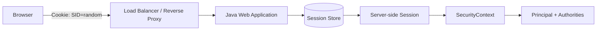
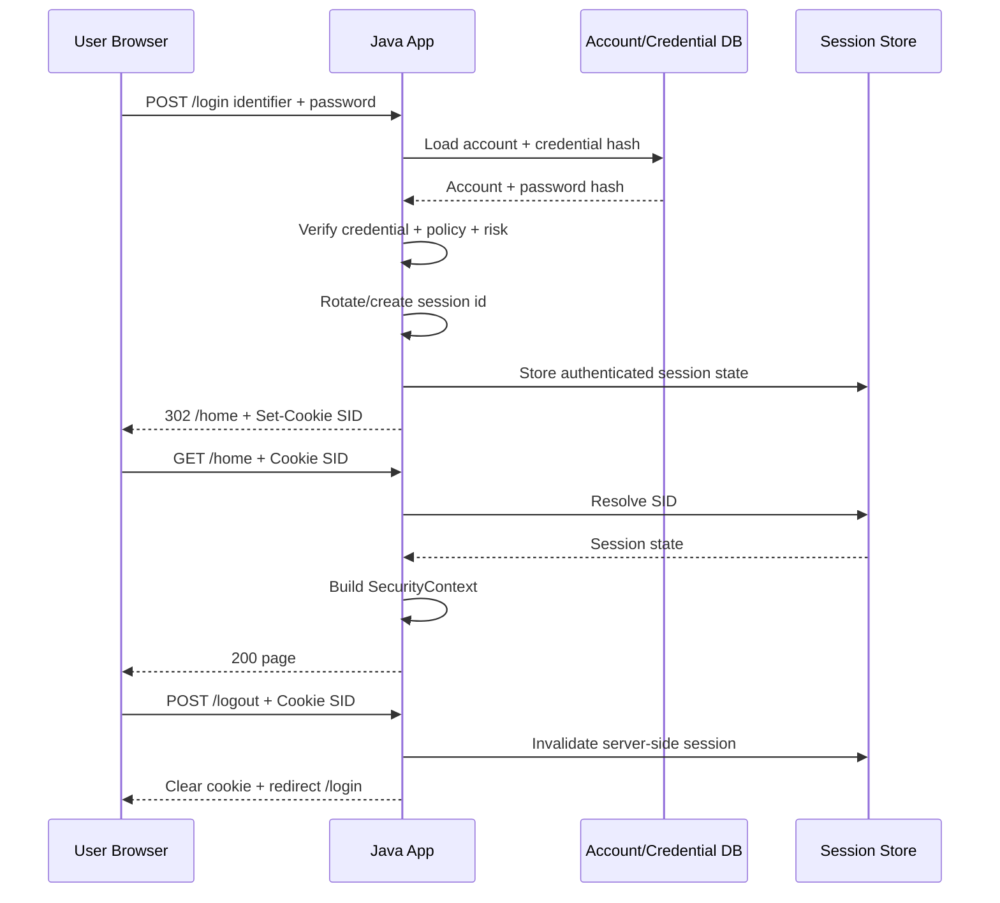
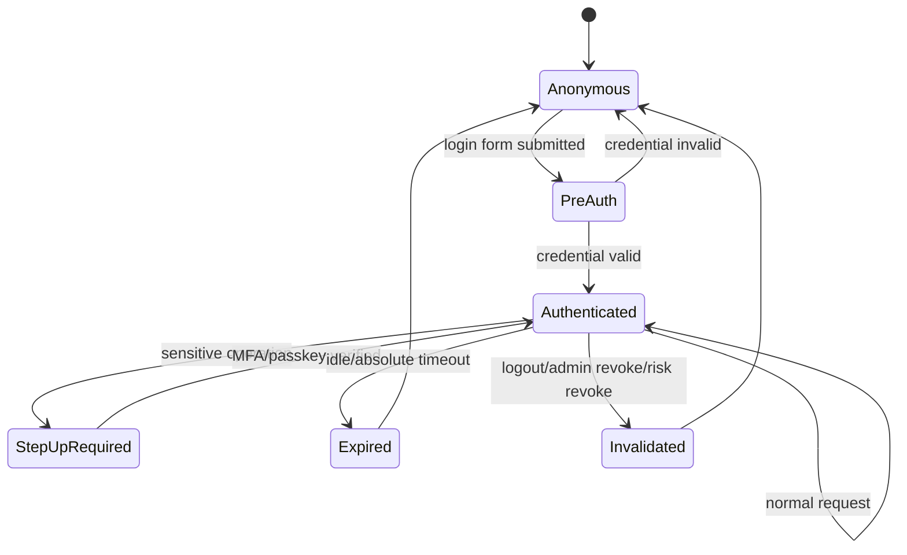
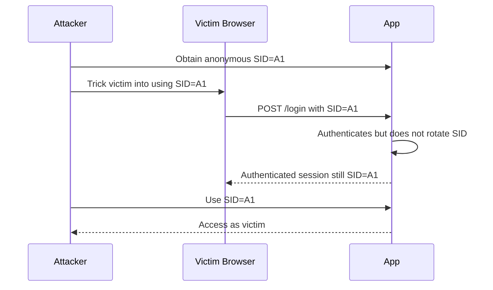
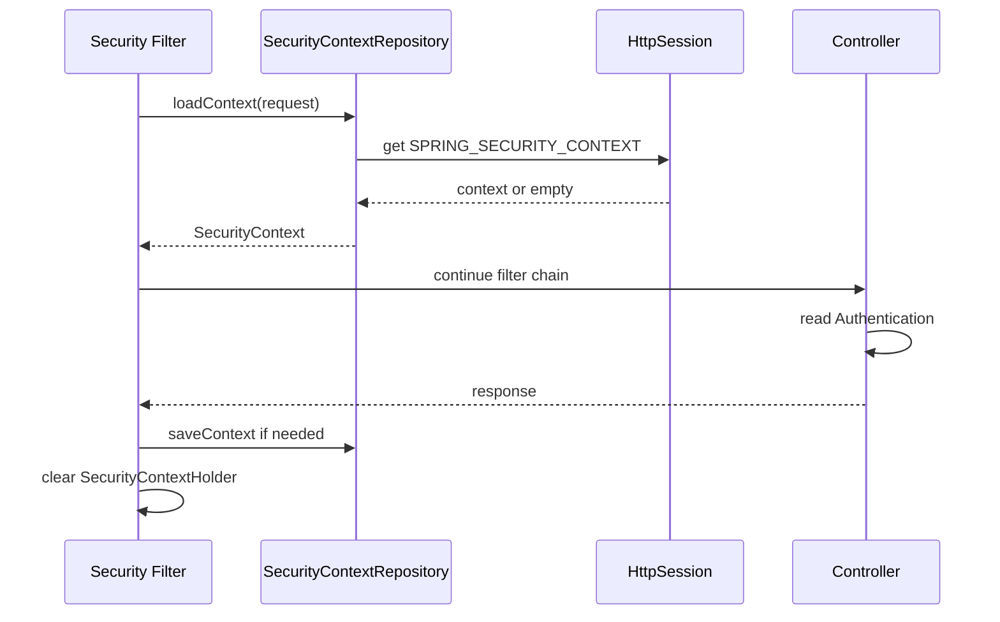
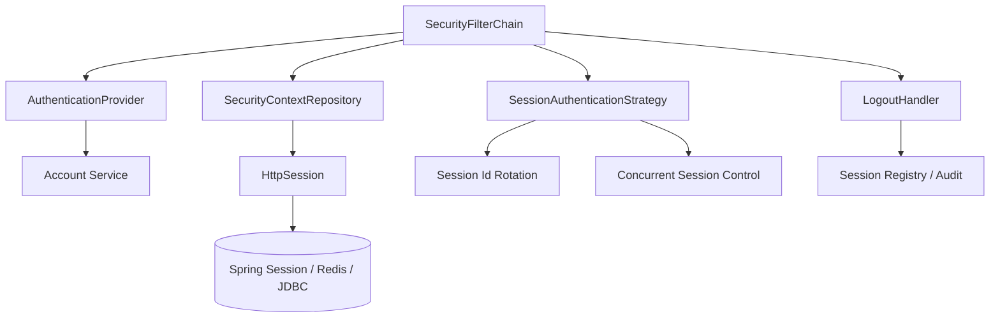
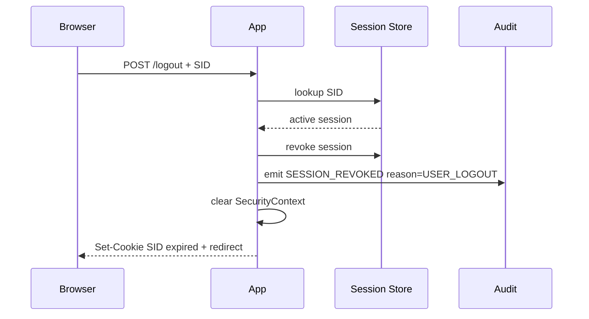

# Part 013 — Session Authentication Pattern

> Target part ini: memahami session authentication sebagai pattern stateful yang benar-benar production-grade. Kita akan membedakan cookie, session id, server-side session, `SecurityContext`, principal, dan persistent login. Kita juga akan membahas session fixation, session rotation, timeout, logout semantics, clustered session, concurrent session, observability, dan failure mode yang sering lolos dari desain awal.

Session authentication sering dianggap teknologi lama.

Itu salah framing.

Session authentication bukan pattern usang. Ia adalah pattern yang sangat cocok untuk aplikasi browser-first, admin console, internal tool, BFF, monolith modular, dan sebagian besar web application yang membutuhkan kontrol logout kuat, revocation cepat, dan privilege refresh yang konsisten.

Kesalahan bukan pada session. Kesalahan biasanya ada pada desain ini:

```txt
browser stores random session id
server stores authenticated state
application treats session as if it is just a token
logout only deletes cookie but not server-side state
session id is not rotated after login
session data grows without lifecycle discipline
cluster stores session inconsistently
```

Session auth adalah sistem stateful. Kalau kita memperlakukannya seperti bearer token stateless, desain akan bocor.

---

## 1. Mental Model Utama

Session authentication memiliki empat benda berbeda:

```txt
Cookie          = mekanisme browser untuk membawa identifier antar request
Session ID      = random opaque identifier di dalam cookie
Server Session  = state server-side yang terhubung dengan session id
SecurityContext = representasi authentication aktif untuk request saat ini
```

Jangan campur keempatnya.



Cookie bukan session. Cookie hanya membawa session id.

Session id bukan user. Session id adalah pointer acak ke server-side state.

Server session bukan authorization model. Server session hanya state container.

`SecurityContext` bukan penyimpanan permanen. Ia adalah konteks request yang biasanya dimuat dari session lalu dibersihkan setelah request selesai.

Invariant paling penting:

```txt
A request is authenticated only if a valid session id resolves to an active server-side session whose authentication state is still valid for the current account, tenant, risk, and policy version.
```

Kalimat itu lebih akurat daripada:

```txt
Ada cookie berarti user login.
```

---

## 2. Kapan Session Authentication Cocok?

Session authentication cocok ketika:

- client utama adalah browser;
- aplikasi butuh logout yang benar-benar bisa mencabut akses;
- user interaction intensif dan stateful;
- privilege bisa berubah saat user masih aktif;
- aplikasi butuh step-up authentication;
- server-side revocation penting;
- sensitive operation harus memeriksa ulang state terbaru;
- ada admin console, backoffice, case management, workflow UI, atau customer portal;
- ada kebutuhan audit session lifecycle.

Session authentication kurang cocok ketika:

- client adalah service-to-service murni;
- API publik diakses banyak third-party client;
- deployment edge sangat tersebar dan tidak ingin shared session store;
- offline access dibutuhkan;
- authorization perlu delegated access lintas resource owner seperti OAuth.

Decision rule:

```txt
Browser app + need strong logout/revocation => session auth is usually simpler and safer.
Third-party API + delegated access => OAuth/OIDC/token pattern.
Internal service identity => mTLS/client credentials/API signing.
```

---

## 3. Session Authentication Lifecycle

Flow session auth dasar:



Ada beberapa transisi penting:

| Transisi | Wajib terjadi? | Kenapa |
|---|---:|---|
| anonymous request → pre-auth request | Ya | User belum authenticated, tapi request tetap punya lifecycle. |
| pre-auth → authenticated | Ya | Setelah credential/challenge valid. |
| authenticated → session rotated | Ya | Mencegah session fixation. |
| authenticated → expired | Ya | Timeout idle/absolute. |
| authenticated → invalidated | Ya | Logout, revoke, suspicious activity. |
| authenticated → privilege refreshed | Situasional | Role/tenant/policy berubah. |
| authenticated → step-up required | Situasional | Operasi sensitif butuh assurance lebih tinggi. |

Session auth adalah state machine.



Kalau state machine ini tidak eksplisit, bug biasanya muncul sebagai:

- user tetap bisa akses setelah logout;
- user lama tetap punya role lama;
- session tidak hilang setelah password reset;
- session id tidak berubah setelah login;
- remember-me dianggap sama dengan authenticated session;
- MFA challenge dianggap sudah login penuh;
- concurrent login tidak terdeteksi;
- session store gagal tapi aplikasi tetap menganggap user login.

---

## 4. Data yang Boleh dan Tidak Boleh Ada di Session

Server-side session menggoda karena mudah menyimpan apa saja.

Jangan.

Session harus kecil, jelas, dan bisa dibuang.

Contoh data yang masuk akal:

```txt
session_id_hash
account_id
subject_id
tenant_id aktif
authentication_time
last_seen_time
assurance_level
mfa_satisfied_until
credential_version_at_login
policy_version_at_login
device_binding_id optional
risk_level_at_login
csrf_secret optional
```

Data yang sebaiknya tidak disimpan di session:

- object JPA entity penuh;
- daftar permission besar;
- data profil user lengkap;
- shopping cart besar;
- sensitive PII;
- access token third-party tanpa enkripsi;
- password hash;
- raw secret;
- mutable domain object;
- data workflow yang menjadi source of truth.

Rule sederhana:

```txt
Session stores authentication continuity, not business truth.
```

Kalau session store hilang, user boleh perlu login ulang. Tapi data bisnis tidak boleh hilang.

---

## 5. Session ID Design

Session id harus:

- random;
- high entropy;
- opaque;
- tidak mengandung user id;
- tidak mengandung tenant id;
- tidak predictable;
- tidak reusable setelah logout;
- tidak diterima dari URL;
- tidak stabil melewati login boundary tanpa rotasi.

Jangan membuat format seperti ini:

```txt
user-123:tenant-abc:timestamp:signature
```

Itu bukan session id. Itu token buatan sendiri.

Session id idealnya random opaque string yang tidak punya makna bisnis.

```txt
SID = random(>=128 bits entropy)
```

Server-side store yang memetakan:

```txt
hash(SID) -> session record
```

Menyimpan hash session id di database/session store sering lebih aman daripada menyimpan raw SID. Kalau store bocor, attacker tidak langsung mendapat session bearer credential.

---

## 6. Session Fixation

Session fixation terjadi ketika attacker bisa membuat korban login memakai session id yang sudah diketahui attacker.

Contoh mental model:



Defense:

```txt
Always rotate session id after authentication state changes from anonymous/pre-auth to authenticated.
```

Session id juga sebaiknya dirotasi ketika:

- login sukses;
- MFA selesai;
- privilege naik;
- tenant aktif berubah;
- account recovery selesai;
- password diganti;
- user switch/admin impersonation dimulai atau dihentikan.

Di Servlet modern, rotasi bisa memakai `HttpServletRequest#changeSessionId()`.

Contoh:

```java
public void onAuthenticationSuccess(HttpServletRequest request) {
    HttpSession existing = request.getSession(false);
    if (existing != null) {
        request.changeSessionId();
    } else {
        request.getSession(true);
    }
}
```

Di Spring Security, session fixation protection tersedia sebagai bagian dari session management. Namun tetap pahami boundary-nya: framework membantu memutar session id, tapi desain logout, multi-device revocation, dan privilege refresh tetap tanggung jawab aplikasi.

---

## 7. SecurityContext vs HttpSession

Dalam Spring Security, `SecurityContext` adalah container untuk `Authentication` aktif.

Dalam aplikasi Servlet stateful, context biasanya dipersist ke `HttpSession` di antara request.

Mental model:

```txt
Request starts
  -> load SecurityContext from repository/session
  -> application uses SecurityContext during request
  -> save context if changed
  -> clear thread-local context
Request ends
```

Diagram:



Failure mode penting:

```txt
SecurityContextHolder uses thread-local semantics.
If the context is not cleared, one request can leak authentication into another request handled by the same thread.
```

Jangan pernah menyimpan `Authentication` ke static variable, singleton mutable field, atau async job tanpa propagation eksplisit.

---

## 8. Spring Security Session Pattern

Konfigurasi konseptual:

```java
@Configuration
class SecurityConfig {

    @Bean
    SecurityFilterChain webSecurity(HttpSecurity http) throws Exception {
        http
            .authorizeHttpRequests(auth -> auth
                .requestMatchers("/login", "/assets/**", "/health").permitAll()
                .requestMatchers("/admin/**").hasRole("ADMIN")
                .anyRequest().authenticated()
            )
            .formLogin(form -> form
                .loginPage("/login")
                .loginProcessingUrl("/login")
                .defaultSuccessUrl("/home", true)
                .failureUrl("/login?error")
            )
            .sessionManagement(session -> session
                .sessionFixation(fixation -> fixation.changeSessionId())
                .maximumSessions(3)
            )
            .logout(logout -> logout
                .logoutUrl("/logout")
                .invalidateHttpSession(true)
                .clearAuthentication(true)
                .deleteCookies("SID")
                .logoutSuccessUrl("/login?logout")
            );

        return http.build();
    }
}
```

Catatan:

- Nama cookie default Servlet sering `JSESSIONID`; banyak organisasi mengganti ke nama seperti `SID` agar tidak membocorkan stack.
- `deleteCookies("SID")` harus cocok dengan nama cookie actual.
- Kalau cookie memakai path/domain tertentu, clear cookie harus memakai path/domain yang sama.
- `maximumSessions` hanya benar-benar meaningful di cluster jika session registry/store juga cluster-aware.
- Jangan menganggap `.invalidateHttpSession(true)` otomatis mencabut semua device user. Itu hanya session saat ini kecuali ada desain session registry.

Spring session auth production-grade biasanya butuh komponen tambahan:



---

## 9. Jakarta Servlet/JAX-RS Session Pattern

Kalau tidak memakai Spring Security, pattern minimal tetap sama:

1. login endpoint memverifikasi credential;
2. session id dirotasi;
3. session menyimpan authentication state minimal;
4. filter membaca session setiap request;
5. filter membangun request-scoped principal;
6. logout menghapus server-side state dan cookie.

Contoh filter konseptual:

```java
public final class SessionAuthenticationFilter implements Filter {

    private final SessionRepository sessionRepository;

    @Override
    public void doFilter(
            ServletRequest servletRequest,
            ServletResponse servletResponse,
            FilterChain chain
    ) throws IOException, ServletException {
        HttpServletRequest request = (HttpServletRequest) servletRequest;
        HttpServletResponse response = (HttpServletResponse) servletResponse;

        try {
            Optional<String> sid = readSessionCookie(request);
            if (sid.isPresent()) {
                sessionRepository.findActiveByRawSessionId(sid.get())
                    .filter(this::isStillValid)
                    .ifPresent(session -> {
                        AuthContextHolder.set(AuthContext.from(session));
                        sessionRepository.touch(session.id());
                    });
            }

            chain.doFilter(request, response);
        } finally {
            AuthContextHolder.clear();
        }
    }

    private boolean isStillValid(AuthSession session) {
        return !session.expired()
            && !session.revoked()
            && session.accountEnabled()
            && session.policyVersionStillValid();
    }
}
```

Login handler:

```java
public void login(HttpServletRequest request, HttpServletResponse response) {
    LoginCommand command = parseAndValidate(request);

    AuthenticationResult result = authenticationService.authenticate(command);
    if (!result.success()) {
        throw new GenericAuthenticationFailure();
    }

    HttpSession httpSession = request.getSession(true);
    request.changeSessionId();

    AuthSession authSession = sessionService.createSession(
        result.accountId(),
        result.subjectId(),
        result.tenantId(),
        requestMetadata(request)
    );

    httpSession.setAttribute("AUTH_SESSION_ID", authSession.id());
    setSessionCookie(response, httpSession.getId());
}
```

Logout handler:

```java
public void logout(HttpServletRequest request, HttpServletResponse response) {
    HttpSession session = request.getSession(false);
    if (session != null) {
        String authSessionId = (String) session.getAttribute("AUTH_SESSION_ID");
        if (authSessionId != null) {
            sessionService.revoke(authSessionId, "USER_LOGOUT");
        }
        session.invalidate();
    }

    clearCookie(response, "SID", "/", null);
}
```

Production implementation perlu lebih rapi, tapi invariant-nya sama.

---

## 10. Session Timeout

Ada dua timeout penting:

| Timeout | Makna | Contoh |
|---|---|---|
| Idle timeout | Expire jika tidak ada aktivitas | 15-30 menit untuk admin console |
| Absolute timeout | Expire walau user aktif terus | 8-12 jam workday |

Idle timeout mencegah session ditinggal terbuka.

Absolute timeout mencegah session hidup terlalu lama karena aktivitas otomatis, tab background, polling, atau attacker yang sudah mendapat session.

Model data:

```sql
create table auth_session (
    id uuid primary key,
    account_id uuid not null,
    subject_id uuid not null,
    tenant_id uuid,
    session_id_hash bytea not null unique,
    created_at timestamptz not null,
    authenticated_at timestamptz not null,
    last_seen_at timestamptz not null,
    idle_expires_at timestamptz not null,
    absolute_expires_at timestamptz not null,
    revoked_at timestamptz,
    revoked_reason text,
    assurance_level text not null,
    credential_version_at_login bigint not null,
    policy_version_at_login bigint not null,
    ip_first inet,
    ip_last inet,
    user_agent_hash bytea
);
```

Validasi:

```java
boolean isValid(AuthSession s, Instant now, Account account) {
    return s.revokedAt() == null
        && now.isBefore(s.idleExpiresAt())
        && now.isBefore(s.absoluteExpiresAt())
        && account.enabled()
        && account.credentialVersion() == s.credentialVersionAtLogin()
        && account.policyVersion() <= s.policyVersionAtLogin();
}
```

Catatan `policyVersion` bergantung desain. Kadang jika policy berubah, semua session lama harus invalid. Kadang cukup force step-up.

---

## 11. Sliding Session: Hati-Hati Write Amplification

Sliding idle timeout berarti `last_seen_at` diperbarui saat user aktif.

Naif:

```txt
Every request updates session last_seen_at.
```

Masalah:

- write ke database/Redis sangat tinggi;
- lock contention;
- replication lag;
- latency naik;
- session store menjadi bottleneck;
- bot/polling memperpanjang session tanpa user interaction nyata.

Pattern lebih baik:

```txt
Update last_seen_at only if now - last_seen_at > touch_interval.
```

Contoh:

```java
void touchIfNeeded(AuthSession session, Instant now) {
    Duration sinceLastTouch = Duration.between(session.lastSeenAt(), now);
    if (sinceLastTouch.compareTo(Duration.ofMinutes(2)) < 0) {
        return;
    }
    sessionRepository.updateLastSeen(session.id(), now);
}
```

Untuk admin console sensitif, bedakan:

- passive background request;
- active user action;
- sensitive operation.

Jangan biarkan polling `/notifications` memperpanjang session selama berhari-hari.

---

## 12. Logout Semantics

Logout yang benar minimal melakukan tiga hal:

```txt
1. revoke/invalidate server-side authentication state
2. remove/expire browser cookie
3. clear request security context
```

Logout yang lemah:

```txt
response.addCookie(expiredCookie)
```

Itu hanya meminta browser menghapus cookie. Kalau server-side session masih aktif dan attacker punya SID, session tetap bisa digunakan.

Logout flow yang benar:



Global logout membutuhkan session registry:

```sql
update auth_session
set revoked_at = now(), revoked_reason = 'GLOBAL_LOGOUT'
where account_id = :accountId
  and revoked_at is null;
```

Password reset policy biasanya:

```txt
After successful password reset:
  revoke all existing sessions except optionally the recovery session
  require fresh login
```

High-risk event policy:

```txt
If credential compromise suspected:
  revoke all sessions
  rotate recovery tokens
  require MFA/passkey re-enrollment review
```

---

## 13. Concurrent Session Control

Concurrent session control menjawab:

```txt
How many active sessions can one account have?
```

Pilihan:

| Policy | Cocok untuk | Risiko |
|---|---|---|
| Unlimited | Consumer app umum | Sulit deteksi takeover |
| Max N sessions | Admin/internal app | Bisa ganggu user multi-device |
| One session only | High-risk console | Bad UX, race condition |
| Risk-based | Mature platform | Kompleks |

Contoh policy:

```txt
Standard user: max 5 active sessions
Privileged admin: max 2 active sessions
Break-glass admin: max 1 active session + step-up every sensitive operation
Service account: no browser session allowed
```

Implementation pattern:

```java
public AuthSession createSession(LoginSuccess login) {
    List<AuthSession> active = sessionRepository.findActiveByAccount(login.accountId());

    SessionLimit limit = policy.sessionLimitFor(login.accountId(), login.roles());
    if (active.size() >= limit.maxSessions()) {
        if (limit.mode() == SessionLimitMode.REJECT_NEW_LOGIN) {
            throw new TooManySessionsException();
        }
        if (limit.mode() == SessionLimitMode.REVOKE_OLDEST) {
            sessionRepository.revokeOldest(login.accountId(), "CONCURRENT_SESSION_LIMIT");
        }
    }

    return sessionRepository.create(login);
}
```

Failure mode:

```txt
Two simultaneous successful logins both observe active count = N-1 and both create sessions.
```

Defense:

- database transaction;
- advisory lock per account;
- Redis atomic script;
- unique partial index if policy allows;
- eventual reconciliation job.

---

## 14. Session Store Choices

Session store design akan dibahas lebih dalam di Part 015, tapi pattern dasarnya perlu dikenali sekarang.

| Store | Kelebihan | Kelemahan |
|---|---|---|
| In-memory JVM | cepat, sederhana | hilang saat restart, tidak cluster-safe |
| Sticky session | mudah secara infra | failover buruk, imbalance |
| Redis | cepat, TTL native, cluster-friendly | dependency kritis, eviction risk |
| PostgreSQL | durable, query audit bagus | latency/write load lebih tinggi |
| Hybrid Redis + DB audit | cepat + audit kuat | kompleksitas sinkronisasi |

Untuk aplikasi enterprise/regulatory, model yang sering masuk akal:

```txt
Redis = hot session lookup
PostgreSQL = durable audit/session ledger
```

Tapi jangan menulis semua request detail ke PostgreSQL tanpa batching/throttling. Pisahkan authentication state lookup dari audit event ingestion.

---

## 15. Session and Privilege Drift

Privilege drift terjadi ketika session lama masih membawa privilege yang sudah tidak valid.

Contoh:

- role admin dicabut, session masih punya `ROLE_ADMIN`;
- tenant membership dihapus, session masih bisa akses tenant;
- account disabled, session masih aktif;
- password diganti, session lama tetap aktif;
- MFA unenrolled, session masih dianggap MFA-verified.

Ada dua strategi:

### Strategy A — Store authorities in session

```txt
Login time computes authorities
Session stores authorities
Every request trusts session copy
```

Kelebihan: cepat.

Kelemahan: stale privilege.

### Strategy B — Store identity in session, resolve authorities per request/cache

```txt
Session stores account_id + tenant_id + auth_time
Each request resolves current authorities or policy version
```

Kelebihan: privilege lebih fresh.

Kelemahan: lebih mahal.

Production compromise:

```txt
Session stores compact identity + versions.
Authorities are cached with short TTL and invalidated on policy change.
Sensitive operation checks current policy directly.
```

Invariant:

```txt
Never allow stale session authority to grant irreversible or high-risk action.
```

---

## 16. Remember-Me Bukan Session Biasa

Remember-me sering rancu.

Remember-me bukan authenticated session penuh. Ia adalah mekanisme untuk membuat session baru setelah session lama habis, biasanya dengan persistent token.

Risk model:

```txt
session cookie stolen      -> attacker gets active session
remember-me token stolen   -> attacker can mint new session until token revoked/expired
```

Karena itu remember-me harus:

- opt-in;
- punya expiry terbatas;
- token random dan disimpan hashed;
- rotated on use;
- bound ke device metadata jika mungkin;
- revoke saat password change/reset;
- tidak memberikan assurance level tinggi;
- require step-up untuk sensitive action.

Jangan:

```txt
remember_me=true means user fully authenticated forever
```

Gunakan:

```txt
remember_me creates low-assurance session
sensitive operation requires fresh authentication or MFA
```

---

## 17. Step-Up Authentication dalam Session

Session bisa punya assurance level.

Contoh:

```txt
AAL1 = password-only / remembered login
AAL2 = password + MFA / passkey assertion
AAL3 = phishing-resistant or hardware-backed policy, if required
```

Untuk operasi sensitif:

- change password;
- change MFA;
- add payout account;
- approve enforcement action;
- export bulk data;
- impersonate user;
- change tenant policy;
- create admin user.

Pattern:

```java
public void requireFreshStepUp(AuthContext ctx, SensitiveAction action) {
    Instant now = clock.instant();
    StepUpPolicy p = policy.forAction(action);

    if (ctx.assuranceLevel().lowerThan(p.requiredAssurance())) {
        throw new StepUpRequiredException(action);
    }

    if (Duration.between(ctx.lastStrongAuthAt(), now).compareTo(p.maxAge()) > 0) {
        throw new StepUpRequiredException(action);
    }
}
```

Session state:

```txt
assurance_level=AAL2
last_strong_auth_at=2026-07-03T09:42:00Z
step_up_valid_until=2026-07-03T09:52:00Z
```

Jangan membuat MFA flag permanen di account lalu menganggap semua session kuat selamanya.

---

## 18. Session Observability

Authentication session harus observable karena incident biasanya terlihat di lifecycle event.

Event minimum:

```txt
SESSION_CREATED
SESSION_ROTATED
SESSION_TOUCHED optional/sampled
SESSION_EXPIRED_IDLE
SESSION_EXPIRED_ABSOLUTE
SESSION_REVOKED_USER_LOGOUT
SESSION_REVOKED_ADMIN
SESSION_REVOKED_PASSWORD_RESET
SESSION_REVOKED_RISK
SESSION_REJECTED_CONCURRENT_LIMIT
SESSION_REJECTED_INVALID
SESSION_REJECTED_EXPIRED
```

Log field:

```txt
event_type
session_id_hash_prefix
account_id
subject_id
tenant_id
ip_hash / ip_prefix
user_agent_hash
authentication_method
assurance_level
risk_level
reason
correlation_id
request_id
```

Jangan log raw session id.

Metrik penting:

```txt
active_sessions_total
session_create_rate
session_revoke_rate
session_lookup_latency
session_store_error_rate
invalid_session_rate
expired_session_rate
concurrent_session_rejection_rate
logout_success_rate
session_fixation_rotation_count
```

Alert yang berguna:

- spike invalid session dari satu IP range;
- banyak session baru untuk satu account;
- banyak global logout;
- session store latency naik;
- logout gagal;
- Redis eviction pada key session;
- mismatch antara session active di Redis dan ledger DB.

---

## 19. Failure Modes

### 19.1 Session id tidak dirotasi setelah login

Dampak: session fixation.

Defense: `changeSessionId()` setelah authentication state naik.

### 19.2 Logout hanya clear cookie

Dampak: stolen SID tetap aktif.

Defense: revoke server-side session.

### 19.3 Session terlalu besar

Dampak: memory pressure, serialization error, slow replication.

Defense: session minimal dan serializable secara eksplisit.

### 19.4 SecurityContext leak antar request

Dampak: request user B bisa memakai context user A.

Defense: clear thread-local di `finally`; jangan custom context static.

### 19.5 Session store down

Dampak: semua user tiba-tiba unauthenticated atau app error.

Defense: fail closed untuk protected resource, degrade gracefully untuk public page, alert cepat.

### 19.6 Privilege stale

Dampak: revoked admin masih bisa melakukan aksi admin.

Defense: versioning, short TTL authority cache, sensitive action direct check.

### 19.7 Cookie deletion salah path/domain

Dampak: browser tetap mengirim cookie lama.

Defense: clear cookie dengan attribute path/domain sama seperti saat set.

### 19.8 Remember-me disamakan dengan strong session

Dampak: persistent token theft menjadi account takeover penuh.

Defense: low assurance + step-up.

### 19.9 Background polling memperpanjang session

Dampak: idle timeout tidak efektif.

Defense: touch only on meaningful activity atau batasi endpoint yang memperpanjang session.

### 19.10 Cluster tidak konsisten

Dampak: login sukses di node A, request berikutnya ke node B dianggap logout.

Defense: shared session store atau sticky session dengan failover trade-off sadar.

---

## 20. Testing Strategy

Session auth harus dites sebagai stateful protocol.

### 20.1 Session fixation test

```java
@Test
void loginRotatesSessionId() throws Exception {
    MvcResult anonymous = mvc.perform(get("/login"))
        .andReturn();

    MockHttpSession oldSession = (MockHttpSession) anonymous.getRequest().getSession(false);
    String oldId = oldSession.getId();

    MvcResult loggedIn = mvc.perform(post("/login")
            .session(oldSession)
            .param("username", "alice@example.com")
            .param("password", "correct-password"))
        .andExpect(status().is3xxRedirection())
        .andReturn();

    MockHttpSession newSession = (MockHttpSession) loggedIn.getRequest().getSession(false);
    assertThat(newSession.getId()).isNotEqualTo(oldId);
}
```

### 20.2 Logout invalidates server-side state

```java
@Test
void logoutInvalidatesSession() throws Exception {
    MockHttpSession session = loginAs("alice@example.com");

    mvc.perform(post("/logout").session(session))
        .andExpect(status().is3xxRedirection());

    mvc.perform(get("/account").session(session))
        .andExpect(status().is3xxRedirection());
}
```

### 20.3 Password reset revokes old sessions

```java
@Test
void passwordResetRevokesExistingSessions() {
    AuthSession phone = sessionService.create(accountId, Device.PHONE);
    AuthSession laptop = sessionService.create(accountId, Device.LAPTOP);

    accountService.resetPassword(accountId, newPassword);

    assertThat(sessionService.isActive(phone.id())).isFalse();
    assertThat(sessionService.isActive(laptop.id())).isFalse();
}
```

### 20.4 Privilege drift test

```java
@Test
void revokedAdminRoleCannotUseOldSessionForAdminAction() {
    AuthSession session = loginAsAdmin();
    roleService.removeRole(session.accountId(), "ADMIN");

    assertThrows(AccessDeniedException.class, () -> {
        adminActionService.approveCriticalAction(session.authContext());
    });
}
```

### 20.5 Session store outage test

Test expected behavior:

```txt
Protected page -> 503 or redirect to login based on policy, never anonymous success.
Public page    -> still served.
Audit          -> emits session store error metric.
```

---

## 21. Production Checklist

Session auth layak production jika:

- session id random, opaque, high entropy;
- session id tidak pernah ada di URL;
- session id dirotasi setelah login dan step-up;
- server-side session direvoke saat logout;
- cookie clear memakai path/domain yang benar;
- idle timeout dan absolute timeout ada;
- session store punya TTL sesuai policy;
- remember-me dibedakan dari strong session;
- password reset/recovery mencabut session lama;
- role/tenant/policy change tidak membuat privilege stale;
- session store failure fail closed untuk protected resource;
- context dibersihkan setelah request;
- audit event tidak menyimpan raw SID;
- concurrency policy eksplisit;
- step-up tersedia untuk sensitive action;
- test mencakup fixation, logout, expiry, revocation, concurrent login, dan store outage.

---

## 22. Design Review Questions

Gunakan pertanyaan ini saat review arsitektur:

```txt
Where is the session id generated?
Who rotates it after authentication?
Where is the server-side session stored?
What happens if the store is down?
How is logout enforced server-side?
Can one user revoke all sessions?
What happens after password reset?
How are role changes reflected in active sessions?
Is remember-me lower assurance than fresh login?
Does background polling extend idle timeout?
How do we detect stolen session reuse?
Are session cookies HttpOnly, Secure, SameSite, scoped narrowly?
Are raw session ids absent from logs?
How do we test fixation and stale privilege?
```

Kalau tim tidak bisa menjawab pertanyaan ini, session auth belum production-grade.

---

## 23. Ringkasan

Session authentication bukan hanya `JSESSIONID`.

Session auth adalah stateful authentication continuity system.

Mental model yang benar:

```txt
cookie carries opaque session id
server resolves session id to session state
session state establishes request SecurityContext
SecurityContext is valid only inside request boundary
logout/revocation must invalidate server-side state
session id must rotate across privilege boundaries
```

Session auth kuat ketika kita butuh kontrol server-side: logout, revocation, timeout, step-up, privilege refresh, dan audit.

Session auth lemah ketika kita menyimpan terlalu banyak data, lupa rotasi, lupa revoke, mempercayai cookie sebagai identity, atau membiarkan session lama membawa privilege lama.

Part berikutnya membahas cookie dan browser boundary secara detail: `HttpOnly`, `Secure`, `SameSite`, CSRF, CORS, origin, cookie scope, dan kenapa browser security attribute adalah bagian inti dari session authentication, bukan detail kecil di konfigurasi.

---

## Referensi

- Spring Security Reference — Authentication Persistence and Session Management.
- Spring Security Reference — Servlet Architecture and SecurityContext.
- Spring Session Reference — Spring Security integration and concurrent session control.
- OWASP Session Management Cheat Sheet.
- OWASP Authentication Cheat Sheet.
- Jakarta Servlet API — `Filter`, `HttpSession`, and request lifecycle.
- MDN Web Docs — HTTP cookies and `Set-Cookie` behavior.
