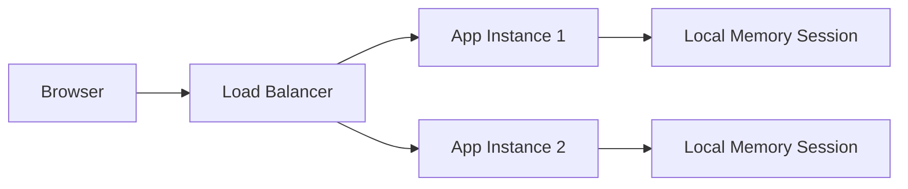
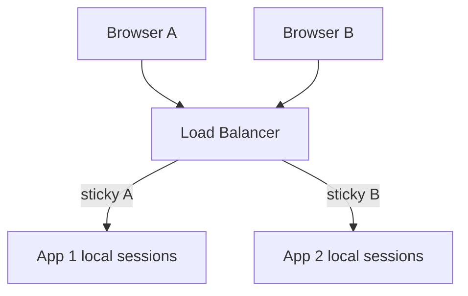
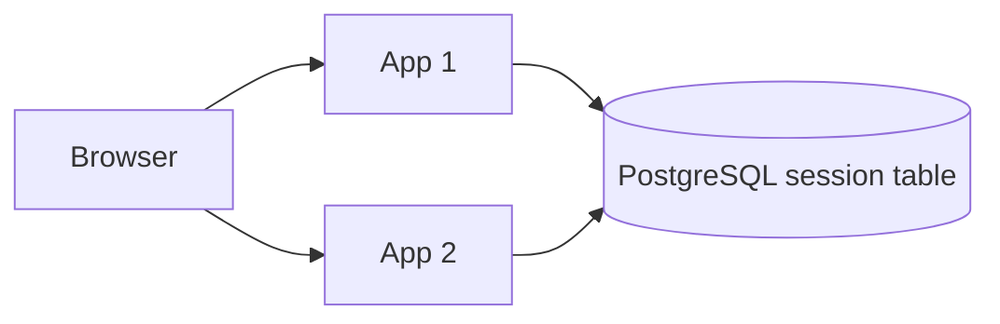
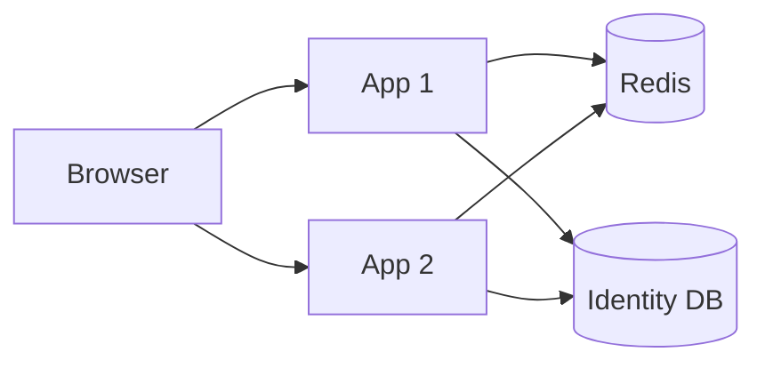
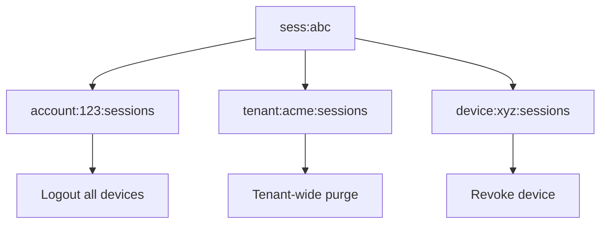
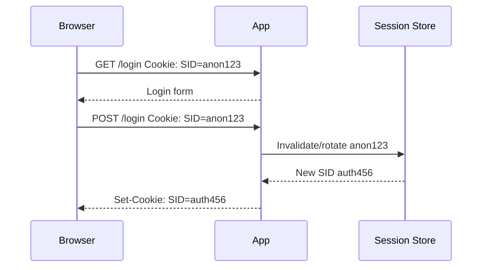
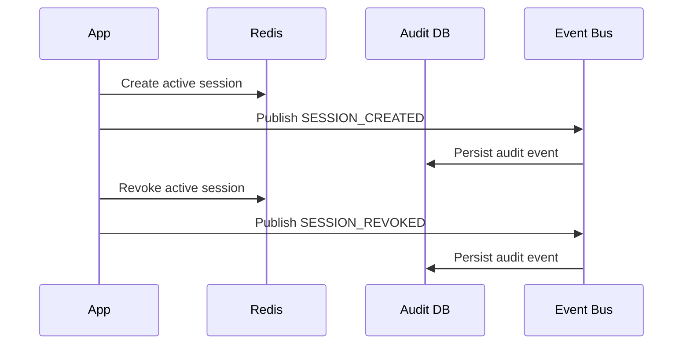
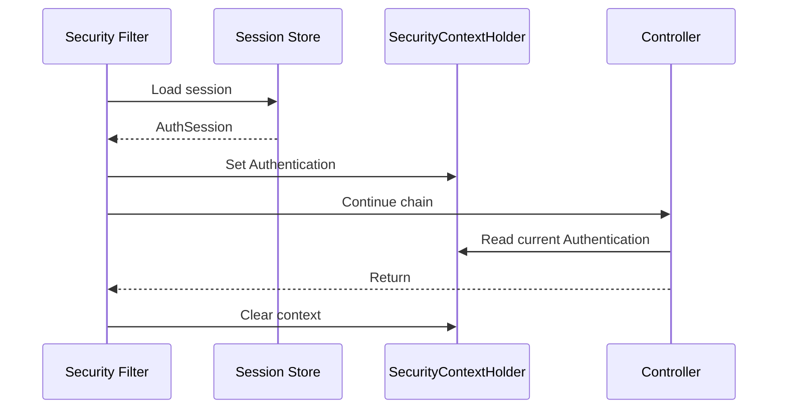

# Part 015 — Session Store Design

> Target part ini: memahami cara mendesain session store untuk aplikasi Java production-grade. Kita akan membahas in-memory session, sticky session, database-backed session, Redis-backed session, Spring Session, custom Servlet/Jakarta implementation, TTL, indexing, revocation, logout, failover, concurrency, observability, dan failure modes.

Session authentication terlihat sederhana karena browser hanya membawa cookie.

Tetapi di sisi server, session adalah distributed state.

Kalau aplikasi hanya satu instance, `HttpSession` in-memory terasa cukup. Begitu aplikasi masuk Kubernetes, horizontal scaling, blue/green deployment, Redis, multi-region, forced logout, step-up auth, dan incident response, desain session store menjadi bagian inti arsitektur authentication.

Mental model yang harus dipegang:

```txt
Cookie value is not the session.
Cookie value is usually a pointer to server-side session state.
```

Session store adalah tempat server menyimpan continuity state:

```txt
session_id -> authenticated subject + auth time + expiry + device + tenant + assurance + metadata
```

Kalau store hilang, lambat, stale, atau tidak bisa direvoke, authentication layer ikut rusak.

---

## 1. Problem: Session Itu Security State, Bukan Cache Biasa

Banyak engineer memperlakukan session seperti cache:

```txt
If Redis loses session, user logs in again. No big deal.
```

Kadang benar.

Tapi untuk sistem regulated, enterprise, finansial, healthcare, case management, atau admin console, session bukan sekadar cache. Ia menyimpan security continuity:

- siapa user yang sedang authenticated,
- kapan authentication terjadi,
- credential/method apa yang dipakai,
- tenant mana yang sedang aktif,
- role/scope snapshot apa yang berlaku,
- apakah MFA sudah dilewati,
- apakah session sudah direvoke,
- apakah session berasal dari device/risk context tertentu,
- apakah session harus dipurge saat incident.

Jadi desain session store harus menjawab pertanyaan operasional:

```txt
Can we kill all sessions for one account?
Can we kill all sessions for one tenant?
Can we kill one device session?
Can we rotate session id after login?
Can we expire idle sessions reliably?
Can we detect concurrent session abuse?
Can we survive Redis/node restart?
Can we avoid stale authorization after role change?
Can we audit session creation and destruction?
```

Kalau jawabannya tidak jelas, session store belum production-grade.

---

## 2. Core Mental Model

Session authentication terdiri dari dua sisi:

```txt
Browser credential transport  : cookie carrying session id
Server-side continuity state : session record in store
```

Diagram:

```mermaid
sequenceDiagram
    participant B as Browser
    participant A as Java App
    participant S as Session Store
    participant DB as Identity DB

    B->>A: POST /login username/password
    A->>DB: Verify account + credential
    DB-->>A: Valid subject
    A->>S: Create session record
    S-->>A: session_id
    A-->>B: Set-Cookie: SID=session_id; HttpOnly; Secure; SameSite=Lax

    B->>A: GET /dashboard Cookie: SID=session_id
    A->>S: Load session by session_id
    S-->>A: subject + expiry + assurance + tenant
    A->>A: Build SecurityContext
    A-->>B: Response
```

Invariant pertama:

```txt
The cookie is only a lookup key. The authority remains server-side.
```

Invariant kedua:

```txt
A session id must be unguessable, scoped, rotatable, expirable, and revocable.
```

Invariant ketiga:

```txt
Session store reads happen on almost every authenticated request.
```

Artinya session store adalah latency-sensitive path.

---

## 3. What Exactly Is Stored in a Session?

Minimal session record:

```txt
session_id
account_id
subject_id
created_at
last_seen_at
expires_at
idle_expires_at
status
```

Production session record biasanya butuh lebih banyak:

```txt
session_id
account_id
subject_id
tenant_id
active_tenant_membership_id
authentication_time
authentication_methods
assurance_level
mfa_satisfied_at
credential_version_at_login
authority_version_at_login
session_version
created_at
last_seen_at
absolute_expires_at
idle_expires_at
revoked_at
revoked_reason
ip_first_seen
ip_last_seen
user_agent_hash
device_id
risk_score_at_login
csrf_secret_or_reference
security_context_snapshot
```

Jangan menyimpan semuanya secara membabi buta.

Gunakan prinsip:

```txt
Store enough state to enforce security invariants.
Do not turn session into arbitrary user profile cache.
```

Contoh Java model:

```java
public record AuthSession(
    String sessionId,
    UUID accountId,
    UUID subjectId,
    UUID tenantId,
    Instant authenticationTime,
    Set<String> authenticationMethods,
    int assuranceLevel,
    long credentialVersion,
    long authorityVersion,
    Instant createdAt,
    Instant lastSeenAt,
    Instant idleExpiresAt,
    Instant absoluteExpiresAt,
    SessionStatus status
) {}

enum SessionStatus {
    ACTIVE,
    REVOKED,
    EXPIRED
}
```

Hal yang sebaiknya tidak disimpan langsung di session:

- plaintext password,
- refresh token mentah,
- OTP code,
- private key,
- recovery code,
- full PII yang tidak diperlukan,
- object graph besar dari ORM,
- permission list yang terlalu besar tanpa versioning,
- data bisnis yang bukan authentication state.

---

## 4. Session Store Requirements

Session store harus mendukung operasi dasar:

| Operation | Kenapa penting |
|---|---|
| Create session | Setelah login berhasil. |
| Load session | Pada setiap request authenticated. |
| Touch session | Untuk idle timeout dan last seen. |
| Rotate session id | Untuk mencegah session fixation. |
| Revoke session | Untuk logout dan incident response. |
| Delete expired session | Untuk cleanup. |
| Find sessions by account | Untuk logout all devices. |
| Find sessions by tenant | Untuk tenant incident atau tenant suspension. |
| Find sessions by device | Untuk device management. |
| Count active sessions | Untuk concurrent session policy. |

Minimal API internal:

```java
public interface SessionStore {
    AuthSession create(CreateSessionCommand command);
    Optional<AuthSession> findActive(String sessionId, Instant now);
    AuthSession rotate(String oldSessionId, RotationReason reason);
    void touch(String sessionId, Instant now);
    void revoke(String sessionId, RevocationReason reason, Instant now);
    void revokeAllForAccount(UUID accountId, RevocationReason reason, Instant now);
    List<AuthSession> findActiveByAccount(UUID accountId);
}
```

Desain ini sengaja tidak mengekspos `Map<String, Object>`.

Authentication state harus typed, auditable, dan enforceable.

---

## 5. Store Option 1: Servlet Container In-Memory Session

Ini default banyak aplikasi Java klasik:

```txt
Browser SID -> Tomcat/Jetty/Undertow memory
```

Flow:



Kelebihan:

- sederhana,
- cepat,
- tidak perlu external dependency,
- cukup untuk single-node atau small internal app.

Kekurangan:

- session hilang saat instance restart,
- tidak cocok untuk horizontal scaling tanpa sticky session,
- sulit revoke session lintas node,
- sulit observe seluruh active session,
- deployment bisa memutus semua login,
- memory pressure bisa menjadi security availability issue.

Cocok untuk:

```txt
single-instance internal tool
low-risk app
non-critical admin prototype
local development
```

Tidak cocok untuk:

```txt
multi-node production
regulated workflow
high availability system
multi-region system
forced logout requirement
```

---

## 6. Store Option 2: Sticky Session

Sticky session berarti load balancer mengirim user yang sama ke app instance yang sama.



Kelebihan:

- tetap memakai local session,
- lebih mudah daripada distributed session store,
- latensi rendah.

Masalah:

- node failure memutus session,
- scale-down memutus session,
- rebalancing sulit,
- revocation lintas node tidak natural,
- blue/green deployment rawan logout massal,
- session affinity kadang tidak stabil di proxy berlapis.

Sticky session sering menjadi kompromi sementara, bukan desain final.

Rule of thumb:

```txt
Sticky session can reduce pain, but it does not remove distributed session semantics.
```

---

## 7. Store Option 3: Database-Backed Session

Database-backed session menyimpan session di PostgreSQL/MySQL/Oracle.



Contoh schema PostgreSQL:

```sql
CREATE TABLE auth_session (
    session_id_hash      bytea PRIMARY KEY,
    account_id           uuid NOT NULL,
    subject_id           uuid NOT NULL,
    tenant_id            uuid,
    authentication_time  timestamptz NOT NULL,
    assurance_level      integer NOT NULL,
    credential_version   bigint NOT NULL,
    authority_version    bigint NOT NULL,
    created_at           timestamptz NOT NULL,
    last_seen_at         timestamptz NOT NULL,
    idle_expires_at      timestamptz NOT NULL,
    absolute_expires_at  timestamptz NOT NULL,
    revoked_at           timestamptz,
    revoked_reason       text,
    user_agent_hash      bytea,
    ip_last_seen         inet,
    metadata             jsonb NOT NULL DEFAULT '{}'::jsonb
);

CREATE INDEX idx_auth_session_account_active
ON auth_session (account_id, absolute_expires_at)
WHERE revoked_at IS NULL;

CREATE INDEX idx_auth_session_tenant_active
ON auth_session (tenant_id, absolute_expires_at)
WHERE revoked_at IS NULL;
```

Kenapa `session_id_hash`, bukan plaintext?

Karena session id adalah bearer credential. Kalau database dump bocor dan session id disimpan plaintext, attacker bisa memakai session aktif. Dengan hash, attacker masih perlu session id asli.

Pattern:

```txt
cookie SID = random 256-bit value
store key  = HMAC-SHA-256(server_secret, SID)
```

Contoh Java:

```java
public final class SessionIdHasher {
    private final MacPrototype macPrototype;

    public byte[] hash(String rawSessionId) {
        Mac mac = macPrototype.newMac();
        return mac.doFinal(rawSessionId.getBytes(StandardCharsets.US_ASCII));
    }
}
```

Kelebihan database-backed session:

- durable,
- mudah query by account/tenant,
- mudah audit,
- transaction-friendly,
- cocok untuk regulated system.

Kekurangan:

- setiap request bisa membebani DB,
- latency lebih tinggi dari Redis,
- cleanup expired rows perlu strategi,
- write amplification kalau `last_seen_at` ditulis setiap request,
- harus hati-hati dengan index bloat.

Optimasi umum:

```txt
Do not update last_seen_at on every request.
Update only if last_seen_at older than threshold, e.g. 60 seconds.
```

Contoh:

```sql
UPDATE auth_session
SET last_seen_at = now(),
    idle_expires_at = now() + interval '30 minutes'
WHERE session_id_hash = :hash
  AND revoked_at IS NULL
  AND idle_expires_at > now()
  AND absolute_expires_at > now()
  AND last_seen_at < now() - interval '60 seconds';
```

---

## 8. Store Option 4: Redis-Backed Session

Redis sering menjadi pilihan session store untuk Java apps karena:

- akses cepat,
- TTL native,
- atomic operation,
- cocok untuk high-throughput session lookup,
- didukung Spring Session.

Model:



Key design sederhana:

```txt
sess:{sessionIdHash} -> hash/json session payload, TTL = absolute expiry
acct:{accountId}:sessions -> set of sessionIdHash
user_session:{sessionIdHash}:csrf -> csrf secret/reference
```

Redis commands pattern:

```txt
HSET sess:{hash} account_id ... subject_id ... expires_at ...
EXPIRE sess:{hash} 28800
SADD acct:{accountId}:sessions {hash}
EXPIRE acct:{accountId}:sessions 28800
```

Untuk revocation:

```txt
DEL sess:{hash}
SREM acct:{accountId}:sessions {hash}
PUBLISH auth-session-revoked {hash}
```

Atau soft revocation:

```txt
HSET sess:{hash} status REVOKED revoked_at ... revoked_reason ...
EXPIRE sess:{hash} 600
```

Soft revocation berguna untuk audit pendek atau race window handling.

### Redis TTL vs Idle Timeout

Absolute timeout mudah:

```txt
EXPIRE session absolute_seconds_remaining
```

Idle timeout lebih tricky.

Setiap request aktif perlu memperpanjang TTL, tapi jangan update Redis terlalu sering.

Pattern:

```txt
On request:
  load session
  if now > idle_expires_at -> reject
  if now - last_seen_at > touch_threshold -> update last_seen_at + idle_expires_at + expire
```

Pseudo-code:

```java
public Optional<AuthSession> loadAndMaybeTouch(String sid, Instant now) {
    AuthSession session = redisSessionRepository.find(sid).orElse(null);
    if (session == null) return Optional.empty();

    if (session.revoked() || session.idleExpiresAt().isBefore(now) || session.absoluteExpiresAt().isBefore(now)) {
        redisSessionRepository.delete(sid);
        return Optional.empty();
    }

    if (session.lastSeenAt().isBefore(now.minusSeconds(60))) {
        redisSessionRepository.touch(sid, now, now.plus(Duration.ofMinutes(30)));
    }

    return Optional.of(session);
}
```

---

## 9. Spring Session: What It Solves

Spring Session provides infrastructure to replace container-managed `HttpSession` with external session repositories such as Redis. Dengan Spring Session, aplikasi dapat transparan memakai Redis untuk `HttpSession` sehingga session bisa dibagi antar instance.

Konsep penting:

```txt
HttpSession API remains familiar.
Storage moves out of servlet container.
SessionRepository becomes the persistence abstraction.
```

Basic Spring Boot dependency:

```xml
<dependency>
    <groupId>org.springframework.session</groupId>
    <artifactId>spring-session-data-redis</artifactId>
</dependency>

<dependency>
    <groupId>org.springframework.boot</groupId>
    <artifactId>spring-boot-starter-data-redis</artifactId>
</dependency>
```

Configuration sketch:

```java
@Configuration
@EnableRedisHttpSession(
    maxInactiveIntervalInSeconds = 1800,
    redisNamespace = "auth:session"
)
public class SessionConfig {
}
```

Application properties:

```properties
spring.session.store-type=redis
spring.data.redis.host=redis
spring.data.redis.port=6379
server.servlet.session.cookie.http-only=true
server.servlet.session.cookie.secure=true
server.servlet.session.cookie.same-site=lax
```

Important distinction:

```txt
RedisSessionRepository       = simple session storage
RedisIndexedSessionRepository = indexed sessions, useful for querying sessions by principal
```

Indexed session repository can support features such as finding sessions by principal. But indexing has cost: more keys, more cleanup complexity, and more consistency concerns.

Production warning:

```txt
Do not enable indexed sessions casually. Enable it because you need account/device/concurrent-session operations.
```

---

## 10. Session Indexing

Without indexing, a store can answer:

```txt
find session by session_id
```

With indexing, it can answer:

```txt
find all sessions for account_id
find all sessions for principal_name
find all sessions for tenant_id
find all sessions for device_id
```

Indexing is required for:

- logout all devices,
- admin-forced logout,
- max concurrent session,
- account compromise response,
- tenant suspension,
- device management UI,
- security analytics.

Index model:



Redis example:

```txt
sess:{sidHash}                      -> session payload
idx:account:{accountId}:sessions    -> set sidHash
idx:tenant:{tenantId}:sessions      -> set sidHash
idx:device:{deviceId}:sessions      -> set sidHash
```

Cleanup challenge:

```txt
When session expires naturally by TTL, secondary indexes may still contain dead session ids.
```

Options:

1. Lazy cleanup during index scan.
2. Keyspace notifications.
3. Scheduled reconciliation.
4. Store index entries with sorted set score as expiry timestamp.

Sorted set pattern:

```txt
ZADD idx:account:{accountId}:sessions <absolute_expiry_epoch> <sidHash>
ZRANGEBYSCORE idx:account:{accountId}:sessions -inf now -> expired refs
ZREMRANGEBYSCORE idx:account:{accountId}:sessions -inf now
```

This is more predictable than relying only on Redis key expiration callbacks.

---

## 11. Session Rotation

Session rotation matters because of session fixation.

Bad flow:

```txt
Anonymous SID stays same after login.
```

Better flow:

```txt
Anonymous session id -> login succeeds -> create/rotate authenticated session id
```

Diagram:



Rotation invariant:

```txt
Any transition from unauthenticated to authenticated must change the session id.
```

Additional rotation events:

- after MFA success,
- after privilege escalation,
- after tenant switch if tenant context is embedded in session,
- after password change,
- after recovery flow completion,
- after risk-based step-up.

Spring Security supports session fixation protection in session management. But teams still need to reason about custom session stores and custom login flows.

---

## 12. Revocation Semantics

Logout is revocation.

But there are multiple kinds:

| Event | Scope |
|---|---|
| User clicks logout | One session. |
| User clicks logout all devices | All sessions for account. |
| Password changed | Often all other sessions. |
| MFA reset | All sessions or step-up required. |
| Account disabled | All sessions. |
| Tenant suspended | All tenant sessions. |
| Key/cookie secret compromise | Global session purge. |
| Admin suspicious activity action | Targeted session/device purge. |

API:

```java
public enum RevocationReason {
    USER_LOGOUT,
    LOGOUT_ALL_DEVICES,
    PASSWORD_CHANGED,
    ACCOUNT_DISABLED,
    TENANT_SUSPENDED,
    ADMIN_FORCED,
    INCIDENT_RESPONSE,
    SESSION_ROTATED,
    EXPIRED
}
```

Important invariant:

```txt
Logout must invalidate server-side session and clear client-side cookie.
```

Server only:

```txt
Session deleted but cookie remains -> next request gets unauthenticated, okay but noisy.
```

Client only:

```txt
Cookie deleted but server session remains -> stolen cookie may still work.
```

Correct:

```txt
Delete/revoke session store record + Set-Cookie expired with identical Path/Domain/SameSite/Secure context.
```

---

## 13. Concurrent Session Control

Policy examples:

```txt
Allow unlimited sessions.
Allow max 5 active sessions per account.
Allow max 1 active admin session.
Allow max 1 active session per regulated operator per tenant.
Allow many sessions but show device management UI.
```

Concurrent session control requires account index.

Pseudo-flow:

```java
public AuthSession createSession(CreateSessionCommand command) {
    List<AuthSession> active = sessionStore.findActiveByAccount(command.accountId());

    if (command.policy().maxSessions().isPresent()
            && active.size() >= command.policy().maxSessions().getAsInt()) {
        AuthSession victim = selectVictim(active);
        sessionStore.revoke(victim.sessionId(), RevocationReason.CONCURRENT_LIMIT, clock.instant());
    }

    return sessionStore.create(command);
}
```

Victim selection options:

| Strategy | Meaning |
|---|---|
| Reject new login | Strict security. User must logout elsewhere. |
| Revoke oldest | Common consumer UX. |
| Revoke least recently used | More intuitive device behavior. |
| Require step-up | Safer for admin/privileged account. |

For high-risk systems, do not silently kick sessions without audit.

---

## 14. Authorization Drift and Session Versioning

Session often contains role/authority snapshot.

Risk:

```txt
Admin removes user's role, but user's old session still contains old authority.
```

Solution: versioning.

Account table:

```sql
ALTER TABLE account ADD COLUMN authority_version bigint NOT NULL DEFAULT 1;
ALTER TABLE account ADD COLUMN credential_version bigint NOT NULL DEFAULT 1;
```

Session includes snapshot:

```txt
session.authority_version_at_login
session.credential_version_at_login
```

On request:

```java
if (session.authorityVersion() < account.currentAuthorityVersion()) {
    sessionStore.revoke(session.sessionId(), RevocationReason.AUTHORITY_CHANGED, now);
    throw new AuthenticationCredentialsNotFoundException("Session no longer valid");
}
```

Performance trade-off:

```txt
Checking DB account version on every request is expensive.
```

Alternatives:

- short session TTL,
- distributed cache for account version,
- event-driven session revocation,
- authority version in Redis,
- only check for privileged endpoints,
- step-up revalidation for sensitive actions.

Production-grade systems usually combine these.

---

## 15. Serialization Strategy

Do not let arbitrary Java object serialization become your session format.

Bad pattern:

```txt
Store entire UserDetails object graph in session.
```

Why bad:

- brittle across deployment versions,
- class compatibility issues,
- accidental PII persistence,
- deserialization risk,
- large payload,
- stale authority state,
- hard to inspect/debug.

Better:

```json
{
  "v": 3,
  "accountId": "...",
  "subjectId": "...",
  "tenantId": "...",
  "authTime": "2026-07-03T04:00:00Z",
  "amr": ["pwd", "totp"],
  "aal": 2,
  "credentialVersion": 17,
  "authorityVersion": 42,
  "createdAt": "...",
  "lastSeenAt": "...",
  "idleExpiresAt": "...",
  "absoluteExpiresAt": "..."
}
```

Use explicit version field:

```txt
v = session payload schema version
```

Deployment migration can then handle old sessions:

```java
switch (payload.version()) {
    case 1 -> migrateV1(payload);
    case 2 -> migrateV2(payload);
    case 3 -> parseV3(payload);
    default -> rejectAndForceLogin();
}
```

---

## 16. Redis Failure Modes

Redis is fast, but session store failure is auth availability failure.

Failure modes:

| Failure | Impact |
|---|---|
| Redis down | All session lookup fails. |
| Redis slow | Every authenticated request slow. |
| Redis eviction | Random logout. |
| Redis split brain | Stale session / inconsistent revocation. |
| Redis memory pressure | Session loss or latency spike. |
| TTL misconfiguration | Sessions never expire or expire too soon. |
| No TLS/auth | Session data exposed on network. |
| Shared Redis namespace | Key collision/data leak. |
| Serialization bug | Mass logout after deploy. |

Important decision:

```txt
Fail closed or fail open when session store is unavailable?
```

For authentication, default should be:

```txt
Fail closed.
```

Meaning:

```txt
If session cannot be validated, request is unauthenticated.
```

Fail-open is dangerous:

```txt
Redis timeout -> let request continue as authenticated
```

This breaks authentication invariant.

But fail-closed can cause outage. Therefore architecture must invest in Redis HA, timeouts, circuit breakers, and degradation strategy.

Recommended patterns:

- short network timeout,
- bounded connection pool,
- Redis TLS/authentication,
- dedicated Redis namespace/database/cluster,
- maxmemory policy that does not silently evict active auth sessions,
- metrics on session lookup latency and miss rate,
- explicit incident runbook.

---

## 17. Database Failure Modes

Database-backed sessions have different risks:

| Failure | Impact |
|---|---|
| DB down | Auth outage. |
| DB slow | Global request latency. |
| Row/table bloat | Lookup degradation. |
| Excessive touch updates | Write amplification. |
| Lock contention | Login/logout slowdown. |
| Cleanup job lag | Storage growth. |
| Plaintext session id | Session replay after DB leak. |

Mitigations:

- hash session id before storage,
- partition session table by time if very large,
- partial indexes for active sessions,
- avoid writing last_seen every request,
- periodic cleanup,
- read replica only if revocation consistency trade-off is understood,
- clear transaction boundaries,
- no session operations inside long business transaction.

Wrong:

```java
@Transactional
public Order submitOrder(...) {
    sessionStore.touch(sessionId); // inside large order transaction
    ...
}
```

Better:

```txt
Authenticate before business transaction.
Do session touch separately or asynchronously with bounded semantics.
```

---

## 18. Hybrid Pattern: Redis Hot Path + Database Audit

For high-scale regulated systems:

```txt
Redis = active session hot path
PostgreSQL = durable session event/audit history
```

Flow:



This avoids DB lookup on every request while preserving auditability.

But do not confuse audit with source of truth:

```txt
Active session validity comes from Redis.
Historical evidence comes from audit store.
```

If Redis data is lost, user sessions may be invalidated, but audit remains.

---

## 19. Session and Kubernetes

Kubernetes makes in-memory session fragility obvious.

Events that affect sessions:

- rolling restart,
- pod eviction,
- HPA scale-down,
- node drain,
- blue/green deployment,
- liveness probe kill,
- memory pressure OOM,
- config/secret rotation.

With local session:

```txt
Pod dies -> sessions on that pod die.
```

With external store:

```txt
Pod dies -> session survives if store survives.
```

Kubernetes recommendations:

- externalize sessions for production web apps,
- keep app pods stateless where possible,
- configure readiness probe to avoid routing traffic before Redis connectivity is ready,
- use short timeouts for Redis/session dependencies,
- avoid storing huge session payloads that increase network and memory cost,
- protect Redis credentials and TLS config as secrets,
- test rolling deployment while logged in.

Deployment drill:

```txt
1. Login as user.
2. Start multi-step form.
3. Roll deployment.
4. Continue action.
5. Verify session remains valid or fails predictably.
6. Verify no privilege drift or partial-auth state loss.
```

---

## 20. SecurityContext and Session Boundary

Spring Security often stores `SecurityContext` in session for stateful web apps.

Mental model:

```txt
Session store persists enough data to reconstruct SecurityContext.
SecurityContextHolder exposes authentication for current request/thread.
```

Request lifecycle:



Invariant:

```txt
Session state may survive requests.
Thread-local SecurityContext must not.
```

Failure:

```txt
SecurityContext not cleared -> authentication leak across reused container threads.
```

This was discussed earlier in filter chain parts, but session store makes the persistence boundary explicit.

---

## 21. Custom Servlet/Jakarta Session Filter

Minimal custom filter mental model:

```java
public final class SessionAuthenticationFilter implements Filter {
    private final SessionStore sessionStore;
    private final Clock clock;

    @Override
    public void doFilter(ServletRequest req, ServletResponse res, FilterChain chain)
            throws IOException, ServletException {

        HttpServletRequest request = (HttpServletRequest) req;
        HttpServletResponse response = (HttpServletResponse) res;

        try {
            Optional<String> sid = readSessionCookie(request);
            if (sid.isPresent()) {
                sessionStore.findActive(sid.get(), clock.instant())
                    .ifPresent(session -> {
                        AuthPrincipal principal = AuthPrincipal.from(session);
                        request.setAttribute("auth.principal", principal);
                    });
            }

            chain.doFilter(request, response);
        } finally {
            // If using ThreadLocal custom context, clear it here.
            AuthContext.clear();
        }
    }
}
```

Important: absence of valid session should not automatically mean 500.

It means:

```txt
request is anonymous
```

Authorization layer later decides whether anonymous is allowed.

---

## 22. Session Store Interface with Atomic Rotation

Rotation must be atomic.

Bad:

```txt
create new session
then delete old session
```

Race:

```txt
old session may still be valid briefly
```

Better:

```txt
transaction / Lua script / compare-and-swap operation
```

Pseudo-interface:

```java
public interface SessionStore {
    RotationResult rotateSession(
        String oldSessionId,
        CreateSessionCommand newSession,
        RotationReason reason,
        Instant now
    );
}

public sealed interface RotationResult {
    record Rotated(AuthSession newSession) implements RotationResult {}
    record OldSessionNotFound() implements RotationResult {}
    record OldSessionExpired() implements RotationResult {}
}
```

Redis Lua sketch:

```lua
-- KEYS[1] = old session key
-- KEYS[2] = new session key
-- ARGV[1] = new payload
-- ARGV[2] = ttl seconds

if redis.call('EXISTS', KEYS[1]) == 0 then
  return 0
end

redis.call('DEL', KEYS[1])
redis.call('SET', KEYS[2], ARGV[1], 'EX', ARGV[2])
return 1
```

In real implementation, also update account/device indexes.

---

## 23. Session TTL Policy

There are two major expiry types:

```txt
Idle timeout     = expires after inactivity
Absolute timeout = expires after max lifetime regardless of activity
```

Example policy:

| Session Type | Idle Timeout | Absolute Timeout |
|---|---:|---:|
| Consumer web | 30 min | 12 hours |
| Admin console | 15 min | 8 hours |
| Regulated operator | 10 min | 4 hours |
| Step-up assurance | 5 min | 30 min |
| Remembered device | Not auth session | Separate credential |

Do not use only idle timeout.

Without absolute timeout:

```txt
A continuously active stolen session may live forever.
```

Do not use only absolute timeout.

Without idle timeout:

```txt
A forgotten browser session stays usable until absolute expiry.
```

Enforcement:

```java
boolean active = session.status() == ACTIVE
    && now.isBefore(session.idleExpiresAt())
    && now.isBefore(session.absoluteExpiresAt());
```

---

## 24. Session ID Generation

Session id requirements:

- cryptographically random,
- high entropy,
- URL/cookie safe,
- not derived from account id,
- not sequential,
- not logged,
- not reused after authentication transition,
- not meaningful to client.

Java:

```java
public final class SessionIdGenerator {
    private final SecureRandom secureRandom = new SecureRandom();

    public String generate() {
        byte[] bytes = new byte[32]; // 256 bits
        secureRandom.nextBytes(bytes);
        return Base64.getUrlEncoder().withoutPadding().encodeToString(bytes);
    }
}
```

Do not:

```java
String sid = accountId + ":" + System.currentTimeMillis();
```

Do not:

```java
String sid = UUID.randomUUID().toString();
```

UUIDv4 has randomness, but 122 bits effective. It may be acceptable in many contexts, but for high-security bearer session ids, 256-bit random token is a better default.

---

## 25. Logout Implementation

Spring Security logout sketch:

```java
@Bean
SecurityFilterChain security(HttpSecurity http) throws Exception {
    return http
        .logout(logout -> logout
            .logoutUrl("/logout")
            .invalidateHttpSession(true)
            .clearAuthentication(true)
            .deleteCookies("SID")
            .logoutSuccessHandler((request, response, authentication) -> {
                response.setStatus(HttpServletResponse.SC_NO_CONTENT);
            })
        )
        .build();
}
```

For custom session store:

```java
public void logout(HttpServletRequest request, HttpServletResponse response) {
    readSessionCookie(request).ifPresent(sid ->
        sessionStore.revoke(sid, RevocationReason.USER_LOGOUT, clock.instant())
    );

    Cookie cookie = new Cookie("SID", "");
    cookie.setHttpOnly(true);
    cookie.setSecure(true);
    cookie.setPath("/");
    cookie.setMaxAge(0);
    response.addCookie(cookie);
}
```

Caveat:

```txt
Cookie deletion must match name, path, and domain used during creation.
```

If creation used `Domain=.example.com` but deletion omits domain, browser may keep the original cookie.

---

## 26. Session Store Observability

Minimum metrics:

| Metric | Meaning |
|---|---|
| `auth.session.create.count` | Login/session creation rate. |
| `auth.session.lookup.count` | Authenticated request lookup rate. |
| `auth.session.lookup.miss.count` | Missing/expired/unknown session id. |
| `auth.session.lookup.latency` | Store latency on auth path. |
| `auth.session.touch.count` | Idle extension writes. |
| `auth.session.revoke.count` | Logout/forced revocation rate. |
| `auth.session.active.count` | Active sessions by app/tenant/risk. |
| `auth.session.store.error.count` | Redis/DB errors. |
| `auth.session.payload.bytes` | Session size. |

Important logs:

```txt
SESSION_CREATED
SESSION_ROTATED
SESSION_REVOKED
SESSION_EXPIRED
SESSION_LOOKUP_FAILED
SESSION_STORE_UNAVAILABLE
SESSION_AUTHORITY_VERSION_MISMATCH
SESSION_CREDENTIAL_VERSION_MISMATCH
```

Do not log raw session id.

Log safe fingerprint:

```java
String sidFingerprint = hex(hmacSha256(logKey, rawSid)).substring(0, 16);
```

---

## 27. Testing Strategy

Unit tests:

- session id generator entropy shape,
- expiry calculation,
- active/revoked predicate,
- version mismatch predicate,
- cookie parsing,
- cookie deletion attributes.

Integration tests:

- login creates session in store,
- request with valid session authenticates,
- expired session rejected,
- revoked session rejected,
- logout deletes store record,
- logout clears cookie,
- session rotates after login,
- old session id no longer works,
- concurrent session policy enforced.

Distributed tests:

```txt
1. Start app instance A and B sharing Redis.
2. Login through A.
3. Access through B with same cookie.
4. Logout through B.
5. Access through A must fail.
```

Failure tests:

- Redis unavailable,
- Redis timeout,
- DB timeout,
- deploy with session schema version change,
- expired index references,
- forced logout all devices,
- role change invalidates old authority version.

Security regression tests:

```txt
Session id must change after login.
Session id must change after MFA.
Server must reject old session after rotation.
Session cookie must be HttpOnly/Secure/SameSite.
No raw session id in logs.
```

---

## 28. Decision Matrix

| Requirement | Recommended Store |
|---|---|
| Single-node low-risk app | In-memory may be enough. |
| Horizontal scaling web app | Redis / Spring Session. |
| Strong audit and durability | DB + audit events, or Redis + DB audit. |
| Logout all devices | Indexed Redis or DB. |
| Tenant-wide purge | Indexed Redis or DB. |
| Very high request rate | Redis hot path. |
| Strict durability over speed | Database-backed session. |
| Stateless API only | Token auth, not session store. |
| Regulated admin workflow | Redis/DB with audit, versioning, revocation. |

Architecture choice:

```txt
If session revocation and device visibility matter, design indexes from day one.
If scale and latency matter, keep hot path in Redis.
If audit matters, emit durable session events.
If simplicity matters, use Spring Session before building custom plumbing.
```

---

## 29. Common Anti-Patterns

### Anti-pattern: Session as User Cache

```txt
Put entire user profile, permissions, preferences, and business context in session.
```

Consequence:

- stale data,
- large payload,
- memory pressure,
- migration pain.

Better:

```txt
Store identity continuity. Fetch/cache business data separately.
```

### Anti-pattern: No Server-Side Revocation

```txt
Logout just clears cookie.
```

Consequence:

```txt
Stolen cookie remains valid.
```

### Anti-pattern: No Session Rotation

```txt
Anonymous SID becomes authenticated SID.
```

Consequence:

```txt
Session fixation.
```

### Anti-pattern: Redis Eviction Allowed for Sessions

```txt
maxmemory-policy allkeys-lru
```

Consequence:

```txt
Random logout and unpredictable auth behavior.
```

### Anti-pattern: Raw Session ID in Logs

```txt
GET /api Cookie: SID=abc...
```

Consequence:

```txt
Log leak becomes session takeover.
```

---

## 30. Production Checklist

Before calling a session store production-grade, verify:

```txt
[ ] Session id is cryptographically random.
[ ] Session id is rotated after login.
[ ] Session id is rotated after MFA/step-up.
[ ] Session id is never stored plaintext in durable DB.
[ ] Cookie uses Secure and HttpOnly.
[ ] SameSite policy is explicit.
[ ] Logout revokes server-side session.
[ ] Logout clears browser cookie correctly.
[ ] Idle timeout is enforced.
[ ] Absolute timeout is enforced.
[ ] Session payload is versioned.
[ ] Session payload is small and explicit.
[ ] Session store fails closed.
[ ] Session store latency is monitored.
[ ] Session revocation is observable.
[ ] Account-wide logout exists if required.
[ ] Tenant-wide purge exists if required.
[ ] Redis/DB failure behavior is tested.
[ ] No raw session id appears in logs/traces.
[ ] Authorization version drift is handled.
[ ] Deployment does not silently corrupt sessions.
```

---

## 31. Mini Reference Implementation Shape

Package shape:

```txt
com.example.auth.session
  AuthSession.java
  SessionStatus.java
  SessionStore.java
  SessionIdGenerator.java
  SessionIdHasher.java
  SessionCookieWriter.java
  RedisSessionStore.java
  JdbcSessionAuditWriter.java
  SessionAuthenticationFilter.java
  SessionRevocationService.java
  SessionPolicy.java
```

Boundary:

```txt
Controller does not know Redis.
Business service does not parse cookie.
SessionStore does not decide authorization policy.
Authentication filter builds request identity.
Authorization layer checks permissions.
SessionRevocationService handles operational revocation.
```

This separation prevents authentication logic from leaking everywhere.

---

## 32. Exercises

### Exercise 1 — Session Store Design Review

Design session store for an internal case management platform:

```txt
- 20,000 users
- 2,000 concurrent users
- multi-tenant
- admin can force logout user
- tenant can be suspended
- role changes must take effect within 1 minute
- Kubernetes deployment
- Redis available
- PostgreSQL available
```

Produce:

- store choice,
- Redis key model,
- audit event model,
- timeout policy,
- revocation policy,
- failure behavior.

### Exercise 2 — Session Fixation Test

Write integration test:

```txt
1. GET /login and capture anonymous cookie.
2. POST /login with same cookie.
3. Assert response Set-Cookie has different value.
4. Assert old cookie cannot access /dashboard.
5. Assert new cookie can access /dashboard.
```

### Exercise 3 — Redis Outage Drill

Simulate Redis outage:

```txt
1. User logged in.
2. Stop Redis or block connection.
3. Request authenticated endpoint.
4. Verify request fails closed.
5. Verify no 500 leak for normal user path if app chooses redirect/401.
6. Verify alert is emitted.
```

---

## Closing Mental Model

Session store design is not merely persistence.

It is the operational shape of stateful authentication.

A good session store answers:

```txt
Who is authenticated?
Until when?
With what assurance?
Under which tenant/context?
Can we invalidate it now?
Can we explain later what happened?
Can the system survive deployment and partial failure?
```

If those questions are answerable, session authentication becomes controllable.

If not, the system may still work in demos, but it will fail during incidents.

Next part moves from server-side continuity state to token-based authentication.

