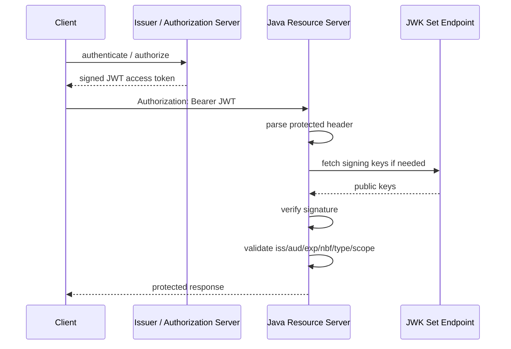
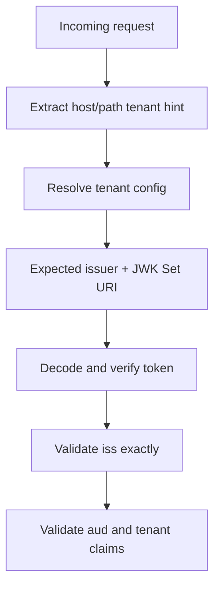
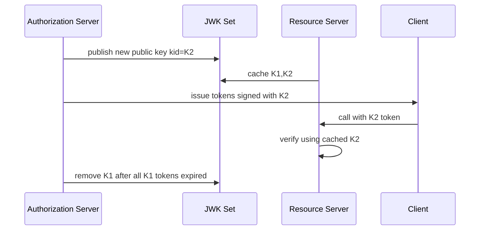
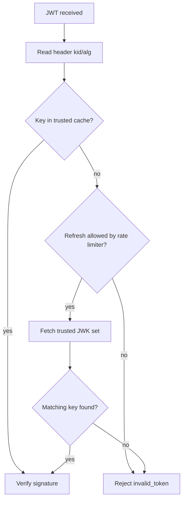

# Part 017 — JWT Production-Grade Usage

> Target part ini: memahami JWT sebagai format token yang harus divalidasi dengan kontrak ketat, bukan sebagai “base64 JSON yang ditandatangani”. Kita akan membahas JWS/JWE, claims, signature, JWK, key rotation, `kid`, algorithm allowlist, issuer, audience, token confusion, claim mapping, Spring Security, JAX-RS, observability, dan testing.

JWT sering dipilih karena terasa sederhana.

```txt
Header.Payload.Signature
```

Tetapi kesederhanaan bentuknya sering menipu.

JWT bukan authentication system.
JWT bukan authorization system.
JWT bukan session system.
JWT hanyalah format token.

Yang membuat JWT aman bukan karena ia bernama JWT, tetapi karena seluruh validation contract-nya benar:

```txt
issuer benar
signature benar
algorithm benar
audience benar
time claims benar
token type benar
key benar
subject semantics benar
claims tidak disalahartikan
boundary tidak tertukar
```

RFC 8725 adalah dokumen Best Current Practices untuk JWT dan secara eksplisit memperingatkan implementer terhadap masalah seperti weak signatures, weak symmetric keys, incorrect composition, plaintext leakage, substitution attacks, dan cross-JWT confusion.

---

## 1. Mental Model: JWT Is a Signed Statement

JWT adalah statement terstruktur dari issuer.

Contoh mental model:

```txt
Issuer says:
  subject user:123
  may call audience billing-api
  until 2026-07-03T10:15:00Z
  with scope invoice:read
  under key kid=2026-07-rsa-01
```

Resource server tidak “login ulang” user.
Resource server hanya memverifikasi statement tersebut.



Invariant:

```txt
A JWT is accepted only if the verifier can prove that the trusted issuer signed exactly the token being used for exactly this API boundary and exactly this token purpose.
```

---

## 2. JWT Parts: Header, Claims, Signature

A compact signed JWT usually looks like this:

```txt
eyJhbGciOiJSUzI1NiIsImtpZCI6IjIwMjYtMDctcnNhLTAxIiwidHlwIjoiYXQrand0In0
.
eyJpc3MiOiJodHRwczovL2lkcC5leGFtcGxlLmNvbSIsInN1YiI6InVzZXI6MTIzIiwiYXVkIjoiYmlsbGluZy1hcGkiLCJleHAiOjE3ODMwNjA5MDAsInNjb3BlIjoiaW52b2ljZTpyZWFkIn0
.
signature
```

Split:

```txt
Header     = cryptographic metadata
Payload    = claims / statement body
Signature  = integrity proof
```

The header is not trusted before verification.
The payload is not trusted before verification.
The `kid` is not trusted before verification.

But the verifier needs the header to choose how to verify.
That is where many JWT bugs start.

---

## 3. JWS vs JWE

JWT can be:

| Form | Meaning | Common Usage |
|---|---|---|
| JWS | signed token | Access token, ID token |
| JWE | encrypted token | Confidential claims between parties |
| Nested JWT | signed then encrypted or encrypted then signed | Specialized protocols |

Most application teams use JWS.

Important distinction:

```txt
JWS gives integrity, not confidentiality.
```

If you put sensitive data inside a signed JWT, anyone holding the token can decode the payload.

Bad JWT payload:

```json
{
  "sub": "user:123",
  "email": "alice@example.com",
  "national_id": "...",
  "salary": "...",
  "permissions": ["..."]
}
```

Better:

```json
{
  "iss": "https://idp.example.com",
  "sub": "user:123",
  "aud": "billing-api",
  "scope": "invoice:read",
  "exp": 1783060900,
  "iat": 1783060600,
  "jti": "tok_01J..."
}
```

Keep JWT claims minimal.

---

## 4. Production Rule: Do Not Trust Decoded JWT

A common debugging habit becomes a production bug:

```java
String[] parts = token.split("\\.");
String payload = new String(Base64.getUrlDecoder().decode(parts[1]));
JsonNode claims = objectMapper.readTree(payload);
String userId = claims.get("sub").asText();
```

This code extracts identity from an unverified token.

Correct pipeline:

```txt
extract token
parse enough header for verification plan
choose trusted key by trusted key source + allowed kid
verify signature
validate registered claims
validate private claims
map principal/authorities
set security context
```

Never run authorization decisions from an unverified decoded payload.

---

## 5. Registered Claims That Matter

JWT has registered claim names. Production systems usually care about these:

| Claim | Meaning | Production Rule |
|---|---|---|
| `iss` | issuer | Must match exact trusted issuer |
| `sub` | subject | Must be stable, non-reassignable, domain-scoped |
| `aud` | audience | Must include this API, not just any API |
| `exp` | expiry | Must be required and enforced |
| `nbf` | not before | Enforce with small clock skew |
| `iat` | issued at | Useful for max token age and diagnostics |
| `jti` | token id | Useful for replay detection/revocation/audit |

Production invariant:

```txt
No accepted access token without iss, sub, aud, exp.
```

For OAuth-style APIs, also validate token purpose/type.

Common forms:

```json
{
  "typ": "at+jwt"
}
```

or:

```json
{
  "token_use": "access"
}
```

or issuer-specific claim:

```json
{
  "azp": "frontend-client"
}
```

Do not assume an ID token is an access token.
Do not assume an access token is an ID token.

---

## 6. Claim Semantics: `sub` Is Not Always a User

`sub` means subject.

It may represent:

```txt
human user
service account
device
batch process
external user
federated identity
anonymous-but-bound session
```

Bad code:

```java
UUID userId = UUID.fromString(jwt.getSubject());
User user = userRepository.findById(userId).orElseThrow();
```

Better:

```java
AuthenticatedSubject subject = subjectMapper.map(jwt);

switch (subject.kind()) {
    case HUMAN_USER -> handleUser(subject);
    case SERVICE_ACCOUNT -> handleService(subject);
    case DEVICE -> handleDevice(subject);
}
```

A robust auth model treats subject kind as explicit.

Example claim design:

```json
{
  "iss": "https://idp.example.com",
  "sub": "user:01J2...",
  "sub_type": "human_user",
  "tenant_id": "tenant:acme",
  "aud": "case-management-api",
  "scope": "case:read case:update",
  "exp": 1783060900
}
```

Do not reuse bare integer IDs across tenants.

---

## 7. Audience Validation Is Not Optional

Audience prevents token substitution across APIs.

Bad architecture:

```txt
All APIs accept any token from the issuer.
```

Failure:

```txt
A token issued for profile-api is replayed against payment-api.
```

Better:

```txt
billing-api accepts aud=billing-api only
case-api accepts aud=case-api only
admin-api accepts aud=admin-api only
```

For composite systems, prefer explicit audience list:

```json
{
  "aud": ["case-api", "document-api"]
}
```

Avoid broad audience:

```json
{
  "aud": "all-services"
}
```

That turns the token into a platform-wide bearer credential.

---

## 8. Issuer Validation Must Be Exact

Issuer validation must not be fuzzy.

Bad:

```txt
iss startsWith https://idp.example.com
iss contains example.com
iss is configured by request tenant parameter
```

Better:

```txt
iss == https://idp.example.com/realms/acme
```

Multi-tenant issuer validation requires tenant resolution before validation.



Never let the token alone choose its own trusted issuer.

Bad pattern:

```txt
read iss from token
fetch discovery document from that iss
trust returned keys
```

That is issuer confusion.

---

## 9. Algorithm Allowlist

The `alg` header is attacker-controlled input until verified.

Production rule:

```txt
The verifier chooses allowed algorithms from configuration, not from token preference.
```

Bad:

```java
Algorithm algorithm = Algorithm.valueOf(header.alg());
verify(token, algorithm);
```

Better:

```txt
Allowed algorithms for this issuer:
  RS256 only
  or ES256 only
  or PS256 only
```

Do not allow `none`.
Do not allow algorithm family switching unless intentionally configured.
Do not accept HS256 and RS256 for the same issuer unless you deeply understand the key confusion risks.

Safer default for many enterprise systems:

```txt
Issuer uses asymmetric signing.
Resource servers hold only public keys.
```

This reduces blast radius if one API is compromised.

---

## 10. Key Management: `kid` Is a Selector, Not Authority

`kid` helps select a key.
It does not make the key trusted.

Bad mental model:

```txt
JWT says kid=abc, so fetch/use key abc.
```

Better:

```txt
JWT says kid=abc.
Verifier searches only trusted JWK set for issuer X.
If exactly one allowed key matches kid and alg/use constraints, verify.
```

JWK validation checklist:

```txt
JWK Set URI is configured, not token-controlled.
Key belongs to expected issuer.
Key algorithm/use is compatible.
Key id matches token kid.
Key material has sufficient strength.
Cache honors safe TTL.
Unknown kid triggers bounded refresh.
```

Avoid token header parameters that point to remote keys unless your JOSE library is explicitly configured to reject or safely handle them:

```txt
jku
x5u
x5c
kid path traversal tricks
```

For most business APIs:

```txt
Ignore remote key hints in token header.
Use configured JWK Set URI only.
```

---

## 11. Key Rotation Model

JWT key rotation requires overlap.



Rules:

```txt
publish new public key before signing with it
keep old public key until all old tokens expire
rotate private signing key under controlled runbook
monitor unknown kid errors
never delete old key immediately after rotation
```

Emergency key compromise is different:

```txt
stop signing with compromised key
remove public key if accepting tokens is worse than breaking sessions
revoke grants/sessions as needed
force re-authentication
notify dependent services
```

Key rotation is not only cryptography.
It is distributed systems operations.

---

## 12. Spring Security JWT Validation

Spring Security Resource Server validates JWTs through `JwtDecoder` and maps successful validation to `JwtAuthenticationToken` in the `SecurityContext`.

Minimal resource server configuration:

```java
@Configuration
@EnableWebSecurity
class SecurityConfig {

    @Bean
    SecurityFilterChain securityFilterChain(HttpSecurity http) throws Exception {
        return http
            .authorizeHttpRequests(auth -> auth
                .requestMatchers("/actuator/health").permitAll()
                .requestMatchers("/api/invoices/**").hasAuthority("SCOPE_invoice:read")
                .anyRequest().authenticated()
            )
            .oauth2ResourceServer(oauth2 -> oauth2
                .jwt(Customizer.withDefaults())
            )
            .build();
    }
}
```

Configuration:

```yaml
spring:
  security:
    oauth2:
      resourceserver:
        jwt:
          issuer-uri: https://idp.example.com/realms/acme
```

With issuer metadata, Spring can discover the JWK Set URI and validate issuer-related metadata depending on configuration and provider behavior.

Production systems should still make validation expectations explicit.

---

## 13. Explicit Audience Validator in Spring

Spring validates standard time claims and issuer when configured appropriately, but audience validation is often application-specific.

Example:

```java
@Configuration
class JwtValidationConfig {

    @Bean
    JwtDecoder jwtDecoder(
            @Value("${security.jwt.issuer}") String issuer,
            @Value("${security.jwt.jwk-set-uri}") String jwkSetUri,
            @Value("${security.jwt.audience}") String audience
    ) {
        NimbusJwtDecoder decoder = NimbusJwtDecoder
            .withJwkSetUri(jwkSetUri)
            .jwsAlgorithm(SignatureAlgorithm.RS256)
            .build();

        OAuth2TokenValidator<Jwt> issuerValidator = JwtValidators.createDefaultWithIssuer(issuer);
        OAuth2TokenValidator<Jwt> audienceValidator = new AudienceValidator(audience);

        decoder.setJwtValidator(new DelegatingOAuth2TokenValidator<>(
            issuerValidator,
            audienceValidator,
            new TokenTypeValidator("at+jwt")
        ));

        return decoder;
    }
}
```

Audience validator:

```java
final class AudienceValidator implements OAuth2TokenValidator<Jwt> {
    private final String requiredAudience;

    AudienceValidator(String requiredAudience) {
        this.requiredAudience = Objects.requireNonNull(requiredAudience);
    }

    @Override
    public OAuth2TokenValidatorResult validate(Jwt jwt) {
        if (jwt.getAudience().contains(requiredAudience)) {
            return OAuth2TokenValidatorResult.success();
        }

        OAuth2Error error = new OAuth2Error(
            "invalid_token",
            "Token audience does not include required resource server audience",
            null
        );
        return OAuth2TokenValidatorResult.failure(error);
    }
}
```

Token type validator:

```java
final class TokenTypeValidator implements OAuth2TokenValidator<Jwt> {
    private final String requiredType;

    TokenTypeValidator(String requiredType) {
        this.requiredType = requiredType;
    }

    @Override
    public OAuth2TokenValidatorResult validate(Jwt jwt) {
        String typ = jwt.getHeaders().get("typ") instanceof String value ? value : null;

        if (requiredType.equals(typ)) {
            return OAuth2TokenValidatorResult.success();
        }

        return OAuth2TokenValidatorResult.failure(new OAuth2Error(
            "invalid_token",
            "Token type is not accepted by this resource server",
            null
        ));
    }
}
```

Do not leak details to clients.
Internal logs can contain structured reason codes.
HTTP response should remain generic.

---

## 14. Mapping JWT Claims to Authorities

Spring Security commonly maps OAuth scopes to authorities like:

```txt
scope invoice:read -> SCOPE_invoice:read
```

Example custom converter:

```java
@Configuration
class JwtAuthorityConfig {

    @Bean
    SecurityFilterChain securityFilterChain(HttpSecurity http) throws Exception {
        JwtAuthenticationConverter converter = new JwtAuthenticationConverter();
        converter.setJwtGrantedAuthoritiesConverter(new DomainJwtAuthorityConverter());

        return http
            .authorizeHttpRequests(auth -> auth
                .requestMatchers(HttpMethod.GET, "/api/invoices/**")
                    .hasAuthority("SCOPE_invoice:read")
                .requestMatchers(HttpMethod.POST, "/api/invoices/**")
                    .hasAuthority("SCOPE_invoice:write")
                .anyRequest().authenticated()
            )
            .oauth2ResourceServer(oauth2 -> oauth2
                .jwt(jwt -> jwt.jwtAuthenticationConverter(converter))
            )
            .build();
    }
}
```

Converter:

```java
final class DomainJwtAuthorityConverter implements Converter<Jwt, Collection<GrantedAuthority>> {

    @Override
    public Collection<GrantedAuthority> convert(Jwt jwt) {
        Set<GrantedAuthority> authorities = new LinkedHashSet<>();

        String scope = jwt.getClaimAsString("scope");
        if (scope != null) {
            Arrays.stream(scope.split(" "))
                .filter(s -> !s.isBlank())
                .map(s -> new SimpleGrantedAuthority("SCOPE_" + s))
                .forEach(authorities::add);
        }

        List<String> permissions = jwt.getClaimAsStringList("permissions");
        if (permissions != null) {
            permissions.stream()
                .filter(p -> p.startsWith("perm:"))
                .map(SimpleGrantedAuthority::new)
                .forEach(authorities::add);
        }

        return List.copyOf(authorities);
    }
}
```

Production warning:

```txt
Mapping is authorization policy.
Do not treat arbitrary token arrays as trusted roles without issuer-specific contract.
```

---

## 15. Do Not Put Mutable Authorization Truth in Long-Lived JWTs

JWT is self-contained.
That is both useful and dangerous.

If a user loses a role at 10:00 but their token expires at 11:00, a resource server that only trusts JWT claims may keep accepting old authorization until expiry.

Options:

| Strategy | Effect | Trade-off |
|---|---|---|
| Short access token lifetime | Limits stale privilege window | More refresh traffic |
| Opaque token/introspection | Real-time state | Network dependency |
| Permission version claim | Allows local stale-check | Needs shared version store |
| Session/token revocation list | Emergency cutoff | Adds state to stateless model |
| Fine-grained authorization lookup | Always current | Latency and coupling |

Claim design example:

```json
{
  "sub": "user:123",
  "tenant_id": "tenant:acme",
  "authz_version": 42,
  "scope": "case:read"
}
```

Resource server may compare `authz_version` with cached account/tenant version.
If token version is stale, reject or re-introspect.

---

## 16. ID Token vs Access Token

OpenID Connect ID tokens are for the client/relying party.
OAuth access tokens are for resource servers.

Bad:

```txt
Frontend sends ID token to API.
API accepts it as bearer token.
```

Why bad:

```txt
ID token audience is usually client_id, not API.
Claims semantics differ.
Token type differs.
Nonce semantics belong to OIDC login flow.
```

Better:

```txt
Frontend obtains access token for API audience.
API accepts access token only.
API rejects ID token.
```

Validation rule:

```txt
audience must be the API
not the frontend client id
not any trusted client
```

---

## 17. Cross-JWT Confusion

Cross-JWT confusion happens when one kind of JWT is accepted where another kind is expected.

Examples:

```txt
ID token accepted as access token
logout token accepted as access token
authorization response JWT accepted as API token
internal service token accepted as user token
tenant A token accepted in tenant B context
```

Defense:

```txt
use explicit typ where protocol supports it
validate issuer
audience
token purpose
required claims
prohibited claims
subject kind
tenant binding
```

Resource server validation should be profile-specific.

Do not write one generic “JWTValidator” that accepts all tokens from all issuers for all purposes.

---

## 18. Token Confusion Across Tenants

Multi-tenant JWT systems fail when token tenant and request tenant diverge.

Example:

```http
GET /tenants/beta/cases/123
Authorization: Bearer <token with tenant_id=acme>
```

Validation must include cross-check:

```txt
resolved request tenant == token tenant claim == issuer/realm tenant
```

Example Spring filter after JWT authentication:

```java
@Component
final class TenantBindingFilter extends OncePerRequestFilter {

    @Override
    protected void doFilterInternal(
            HttpServletRequest request,
            HttpServletResponse response,
            FilterChain chain
    ) throws ServletException, IOException {
        Authentication authentication = SecurityContextHolder.getContext().getAuthentication();

        if (authentication instanceof JwtAuthenticationToken jwtAuth) {
            String tenantFromPath = extractTenantFromPath(request);
            String tenantFromToken = jwtAuth.getToken().getClaimAsString("tenant_id");

            if (!Objects.equals(tenantFromPath, tenantFromToken)) {
                response.sendError(HttpServletResponse.SC_FORBIDDEN);
                return;
            }
        }

        chain.doFilter(request, response);
    }
}
```

This is not authentication alone.
It is authentication boundary binding.

---

## 19. JAX-RS JWT Validation Filter

In non-Spring JAX-RS systems, use a request filter.

Skeleton:

```java
@Provider
@Priority(Priorities.AUTHENTICATION)
public final class JwtAuthenticationFilter implements ContainerRequestFilter {
    private final JwtVerifier verifier;

    public JwtAuthenticationFilter(JwtVerifier verifier) {
        this.verifier = verifier;
    }

    @Override
    public void filter(ContainerRequestContext requestContext) {
        String authorization = requestContext.getHeaderString(HttpHeaders.AUTHORIZATION);
        String token = extractBearerToken(authorization);

        if (token == null) {
            requestContext.abortWith(Response.status(Response.Status.UNAUTHORIZED).build());
            return;
        }

        VerifiedJwt verified = verifier.verify(token);

        SecurityContext original = requestContext.getSecurityContext();
        requestContext.setSecurityContext(new JwtSecurityContext(verified, original.isSecure()));
    }

    private static String extractBearerToken(String header) {
        if (header == null) return null;
        if (!header.startsWith("Bearer ")) return null;
        return header.substring("Bearer ".length()).trim();
    }
}
```

Custom `SecurityContext`:

```java
public final class JwtSecurityContext implements SecurityContext {
    private final VerifiedJwt jwt;
    private final boolean secure;

    public JwtSecurityContext(VerifiedJwt jwt, boolean secure) {
        this.jwt = jwt;
        this.secure = secure;
    }

    @Override
    public Principal getUserPrincipal() {
        return () -> jwt.subject();
    }

    @Override
    public boolean isUserInRole(String role) {
        return jwt.authorities().contains(role);
    }

    @Override
    public boolean isSecure() {
        return secure;
    }

    @Override
    public String getAuthenticationScheme() {
        return "Bearer";
    }
}
```

But do not implement JOSE cryptography manually.
Use mature libraries.
Your custom code should orchestrate validation policy, not parse ASN.1 or verify signatures from scratch.

---

## 20. JWK Cache Design

JWK fetching is an operational dependency.

Failure modes:

```txt
IdP unavailable at API startup
JWK endpoint slow
unknown kid flood
key rotation not propagated
stale cache after emergency key revocation
cache stampede across pods
```

Design rules:

```txt
cache JWK set with bounded TTL
refresh on unknown kid with rate limit
fail closed for invalid tokens
consider startup behavior explicitly
monitor JWK fetch latency/error
support emergency cache eviction
```

Unknown `kid` should not trigger unbounded remote calls.

Pseudo-flow:



---

## 21. JWT Size and Transport Cost

JWTs are sent on every request.

Large tokens hurt:

```txt
network bandwidth
proxy/header limits
log redaction risk
mobile battery
cache key size
latency under high RPS
```

Bad claim design:

```json
{
  "roles": [
    "role1",
    "role2",
    "role3",
    "... hundreds more ..."
  ],
  "full_profile": { "...": "..." }
}
```

Better:

```json
{
  "sub": "user:123",
  "tenant_id": "tenant:acme",
  "scope": "case:read case:update",
  "authz_version": 12
}
```

JWT should carry stable, compact, security-critical context.
Not the full user object.

---

## 22. Logging and Redaction

Never log full JWTs.

Bad:

```java
log.info("Invalid token {}", token);
```

Better:

```java
log.warn("jwt_validation_failed reason={} issuer={} kid={} jti_hash={} client_ip={}",
    reason,
    safeIssuer,
    safeKid,
    hashJti(jti),
    clientIp
);
```

Safe fields:

```txt
issuer
kid
algorithm
jti hash
subject hash
failure reason code
request id
client id
resource audience
```

Unsafe fields:

```txt
full token
signature
raw Authorization header
email if not needed
PII-heavy custom claims
```

---

## 23. Error Semantics

External response should be generic:

```http
HTTP/1.1 401 Unauthorized
WWW-Authenticate: Bearer error="invalid_token"
```

Avoid exposing:

```txt
signature invalid
kid unknown
expired 27 seconds ago
audience mismatch
issuer mismatch
```

Internally, log structured reason code:

```txt
JWT_EXPIRED
JWT_NOT_YET_VALID
JWT_BAD_SIGNATURE
JWT_UNKNOWN_KID
JWT_AUDIENCE_MISMATCH
JWT_ISSUER_MISMATCH
JWT_TYPE_MISMATCH
JWT_TENANT_MISMATCH
```

This preserves security while enabling operations.

---

## 24. Revocation Reality

Self-contained JWTs are hard to revoke immediately.

Options:

| Option | Description | Fit |
|---|---|---|
| Short expiry | Wait for expiry | Most common access token strategy |
| Revocation list by `jti` | Check token id in Redis/DB | Emergency or high-risk APIs |
| Subject/session version | Reject stale token version | Account-level revocation |
| Opaque token | Introspect every time | Centralized revocation |
| mTLS/DPoP-bound token | Reduces stolen bearer replay | High-security systems |

Do not promise “stateless JWT logout” if your business requirement is immediate revocation.

Correct statement:

```txt
Self-contained JWTs allow local validation, but immediate revocation requires state, short TTL, introspection, or sender constraint.
```

---

## 25. JWT Validation Test Matrix

A production-grade JWT validator must reject:

```txt
missing token
malformed token
unsigned token
wrong algorithm
algorithm none
wrong signature
unknown kid
wrong issuer
wrong audience
expired token
not-yet-valid token
missing exp
missing sub
missing aud
ID token sent to API
access token for different API
wrong tenant
oversized token
invalid scope format
clock skew abuse
```

Example test names:

```java
@Test void rejectsTokenWithWrongAudience() {}
@Test void rejectsIdTokenAsAccessToken() {}
@Test void rejectsTokenFromUntrustedIssuer() {}
@Test void rejectsTokenSignedWithUnknownKid() {}
@Test void rejectsExpiredTokenOutsideClockSkew() {}
@Test void rejectsTenantMismatchBetweenPathAndClaim() {}
@Test void doesNotLogRawAuthorizationHeader() {}
```

Tests should include real signed tokens from test keys.
Do not test only mocked `Jwt` objects.

---

## 26. Local Development Without Bad Habits

Development shortcuts often become production vulnerabilities.

Avoid:

```txt
jwt.validation.enabled=false
accept unsigned tokens locally
hardcode prod-like shared HMAC secret in repo
skip audience validation in tests
use one global test token forever
```

Better:

```txt
run local test issuer
use generated ephemeral keys
publish local JWK set
validate issuer/audience exactly
use short-lived test tokens
include negative token fixtures
```

For integration tests, create a deterministic test key pair:

```txt
src/test/resources/jwks/test-private.jwk
src/test/resources/jwks/test-public-jwks.json
```

Never commit production keys.

---

## 27. Production Checklist

JWT acceptance checklist:

```txt
[ ] Trusted issuer configured explicitly
[ ] Trusted JWK Set URI configured explicitly
[ ] Algorithm allowlist configured
[ ] Signature validation mandatory
[ ] iss validated exactly
[ ] aud validated for this resource server
[ ] exp required and enforced
[ ] nbf enforced with bounded clock skew
[ ] token purpose/type validated
[ ] ID token rejected as access token
[ ] tenant binding validated where relevant
[ ] subject kind understood
[ ] authorities mapped from issuer-specific contract
[ ] full token never logged
[ ] JWK cache monitored
[ ] key rotation tested
[ ] emergency key compromise runbook exists
[ ] revocation strategy documented
```

---

## 28. Decision Matrix

| Requirement | JWT Fit? | Reason |
|---|---:|---|
| Low-latency local API validation | Good | No per-request introspection needed |
| Immediate revocation | Weak alone | Needs state/short TTL/introspection |
| Very large authorization graph | Weak | Token bloat/stale permissions |
| Multi-service propagation | Good with discipline | Must validate audience and token exchange |
| Browser session logout | Weak alone | Browser cookies/session store usually better |
| Cross-organization federation | Good | OIDC/JWT ecosystem is mature |
| Confidential claims | Weak unless JWE | JWS is readable by holder |
| High-risk stolen token replay defense | Bearer JWT weak | Consider mTLS/DPoP/sender-constrained tokens |

---

## 29. A Senior Engineer's Rule of Thumb

Use JWT when:

```txt
services need local verification
access tokens are short-lived
issuer and audience are strict
claims are compact and stable
key rotation is operationally mature
revocation requirements are realistic
```

Avoid JWT as primary mechanism when:

```txt
permissions change constantly
logout must revoke immediately everywhere
claims contain sensitive business data
teams cannot operate key rotation
APIs cannot enforce audience/token type consistently
```

JWT is powerful because it removes a network call.
JWT is dangerous because it removes a network call.

The lost network call was also a chance to check current state.

---

## 30. References

- RFC 7519 — JSON Web Token (JWT): https://datatracker.ietf.org/doc/html/rfc7519
- RFC 8725 — JSON Web Token Best Current Practices: https://www.rfc-editor.org/rfc/rfc8725.html
- RFC 9068 — JWT Profile for OAuth 2.0 Access Tokens: https://datatracker.ietf.org/doc/html/rfc9068
- RFC 9700 — Best Current Practice for OAuth 2.0 Security: https://datatracker.ietf.org/doc/rfc9700/
- Spring Security Resource Server JWT: https://docs.spring.io/spring-security/reference/servlet/oauth2/resource-server/jwt.html
- OpenID Connect Core 1.0: https://openid.net/specs/openid-connect-core-1_0.html
- OWASP JSON Web Token for Java Cheat Sheet: https://cheatsheetseries.owasp.org/cheatsheets/JSON_Web_Token_for_Java_Cheat_Sheet.html
