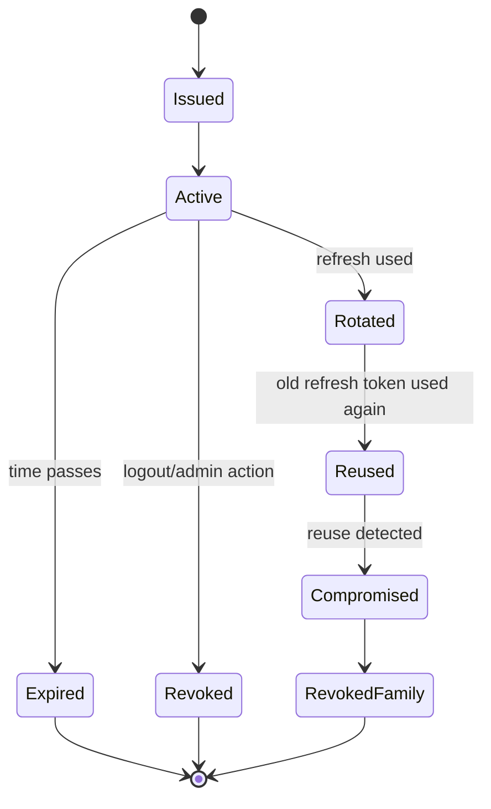
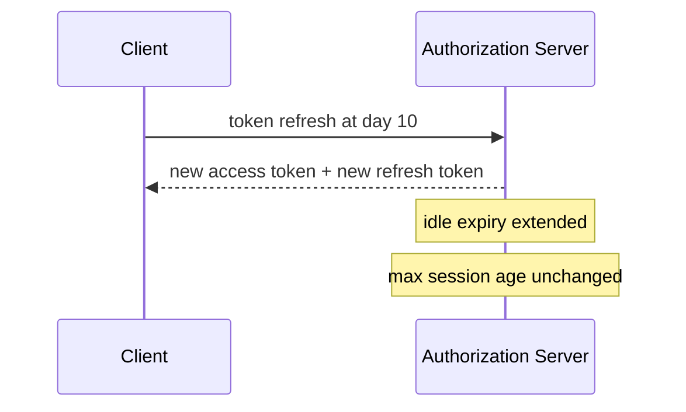
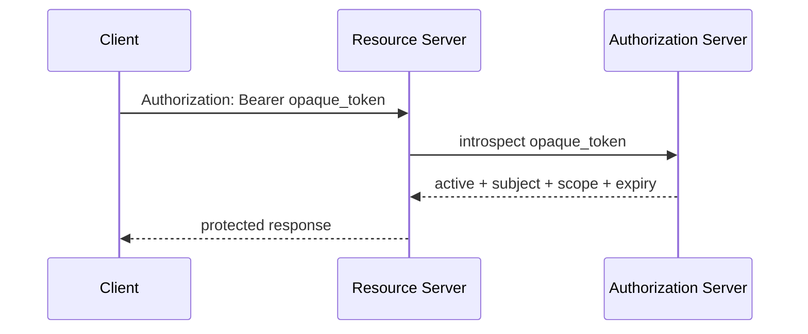
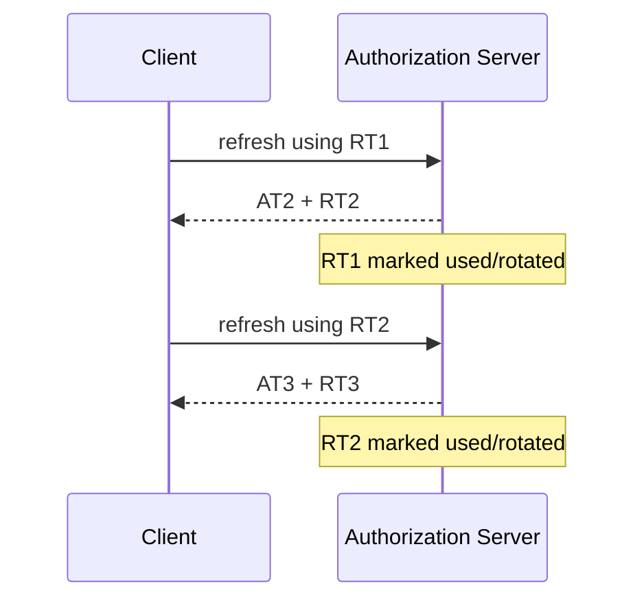
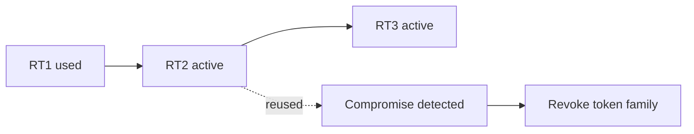
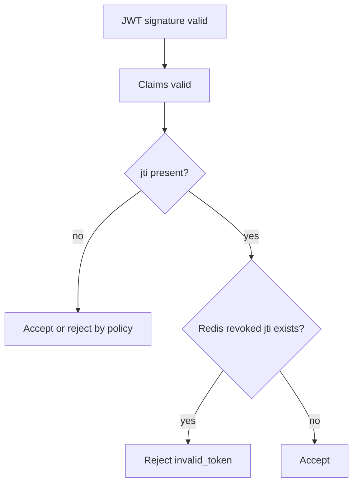
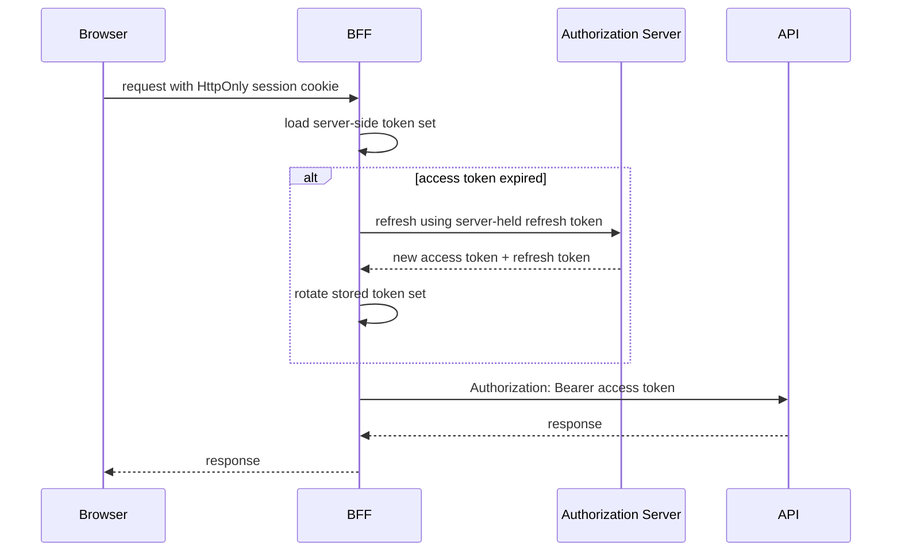
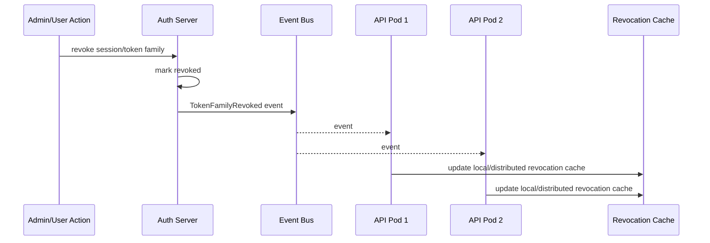

# Part 018 — Token Lifecycle & Revocation

> Target part ini: memahami token sebagai objek lifecycle, bukan string yang “ada expiry”-nya. Kita akan membahas access token, refresh token, expiry, refresh rotation, token family, reuse detection, revocation, introspection, logout semantics, Redis/PostgreSQL design, Spring integration, dan runbook token compromise.

Token authentication sering gagal bukan saat token dibuat.

Ia gagal saat token harus mati.

Pertanyaan produksi yang sering terlambat ditanyakan:

```txt
Apa yang terjadi saat user logout?
Apa yang terjadi saat refresh token dicuri?
Apa yang terjadi saat role dicabut?
Apa yang terjadi saat signing key bocor?
Apa yang terjadi saat device hilang?
Apa yang terjadi saat tenant menonaktifkan user?
Apa yang terjadi saat authorization server down?
```

Part ini membahas sisi yang sering disederhanakan: lifecycle dan revocation.

---

## 1. Mental Model: Token Is a Leased Credential

Token bukan identity permanen.
Token adalah credential dengan lease.

```txt
issued -> active -> refreshed / rotated -> expired / revoked / compromised
```

Access token biasanya pendek umur.
Refresh token biasanya lebih panjang umur.



Production invariant:

```txt
Every token has an owner, issuer, audience, purpose, lifetime, and death path.
```

If a token cannot be killed, its lifetime must be short enough that the business accepts the risk.

---

## 2. Access Token vs Refresh Token

| Token | Purpose | Lifetime | Used By | Sent To |
|---|---|---:|---|---|
| Access token | Call protected API | Short | Client/API caller | Resource server |
| Refresh token | Obtain new access token | Longer | Client | Authorization server |

Do not send refresh tokens to resource servers.
Do not store refresh tokens in JavaScript-accessible browser storage.
Do not use refresh tokens as API credentials.

Access token compromise means attacker can call APIs until expiry/revocation.
Refresh token compromise means attacker can mint new access tokens until refresh token is revoked or reuse is detected.

Refresh tokens are more sensitive than access tokens.

---

## 3. Token Lifetime Design

There is no universal perfect TTL.

You choose TTL based on:

```txt
risk level
client type
revocation requirement
authorization volatility
network availability
user experience
ability to detect compromise
```

Example policy matrix:

| Context | Access Token | Refresh Token | Notes |
|---|---:|---:|---|
| Internal service-to-service | 5-15 min | Usually none | Prefer client credentials or workload identity |
| Browser BFF session | 5-15 min | Server-side only | Browser gets session cookie, not raw refresh token |
| Mobile app | 5-15 min | Days/weeks with rotation | Bind to device when possible |
| Admin console | 2-5 min | Shorter, step-up required | High-risk operations need re-auth |
| Public SPA | Short | Avoid or rotate with strong controls | Prefer BFF where possible |

Rule:

```txt
The more revocation matters, the shorter the local-verification window should be.
```

---

## 4. Absolute Expiry vs Idle Expiry

Token lifecycle can use:

```txt
absolute expiry: token dies after fixed time from issuance
idle expiry: credential dies after inactivity
max session age: entire grant/session dies after maximum lifetime
```

Access token usually has absolute expiry only.
Refresh token/session often has both idle and absolute expiry.

Example:

```txt
access_token TTL       = 10 minutes
refresh_token idle TTL = 30 days
session max age        = 90 days
```

Each refresh extends idle expiry but not max session age.



---

## 5. Logout Semantics Are Not One Thing

“Logout” can mean several different operations.

| Logout Type | Meaning | Required Action |
|---|---|---|
| Local app logout | Remove app session | Clear local session/cookie/token storage |
| OAuth client logout | Stop client from refreshing | Revoke refresh token/grant |
| Resource server cutoff | Stop access token use | Short TTL or revocation/introspection |
| SSO logout | End IdP session | OIDC logout protocol / IdP session termination |
| All-device logout | Revoke all sessions/grants | Account/session version bump or revoke all token families |

Bad requirement statement:

```txt
Implement logout for JWT.
```

Better:

```txt
On logout from this browser, invalidate the server-side app session and revoke the refresh token family. Existing access tokens may remain valid for at most 5 minutes unless high-risk revocation is triggered.
```

A senior engineer clarifies logout semantics before choosing mechanism.

---

## 6. Self-Contained Token Revocation Problem

A self-contained JWT can be validated locally.

That means resource server can accept it without calling issuer.

Good:

```txt
low latency
resilience to issuer outage
simple scaling
```

Bad:

```txt
issuer cannot instantly tell every resource server the token is dead
```

Therefore:

```txt
local validation and immediate revocation are in tension
```

You can resolve tension with:

```txt
short access token TTL
revocation list
introspection
subject/session version check
event-driven revocation cache
sender-constrained tokens
```

But you cannot get immediate global revocation with purely stateless local JWT validation and long token lifetime.

---

## 7. RFC 7009 Token Revocation

OAuth 2.0 Token Revocation defines a standard way for a client to tell the authorization server a token is no longer needed.

Simplified request:

```http
POST /oauth2/revoke
Content-Type: application/x-www-form-urlencoded
Authorization: Basic <client-auth>

token=<refresh-token>&token_type_hint=refresh_token
```

Important nuance:

```txt
Revocation request invalidates the token at the authorization server.
It does not magically erase already-issued self-contained access tokens from all resource servers.
```

If access tokens are self-contained JWTs, existing access tokens may remain accepted until expiry unless resource servers check revocation state.

---

## 8. RFC 7662 Token Introspection

Token introspection lets a protected resource query authorization server to determine whether a token is active and retrieve metadata.

Simplified request:

```http
POST /oauth2/introspect
Content-Type: application/x-www-form-urlencoded
Authorization: Basic <resource-server-auth>

token=<access-token>
```

Simplified response:

```json
{
  "active": true,
  "sub": "user:123",
  "client_id": "case-web",
  "scope": "case:read",
  "exp": 1783060900
}
```

Introspection is especially useful for opaque tokens.

Trade-off:

| Property | Local JWT | Introspection |
|---|---:|---:|
| Latency | Low | Network call/cache needed |
| Revocation freshness | Weak alone | Stronger |
| Issuer outage tolerance | Better | Worse unless cached |
| Operational simplicity | Medium | Medium/high |
| Central policy control | Lower | Higher |

---

## 9. Opaque Token Pattern

Opaque token is a reference.

```txt
tok_live_01J2G7QX...
```

Resource server cannot read claims locally.
It must introspect or query a trusted token store.

Flow:



Opaque token is a good fit when:

```txt
revocation freshness matters
claims are sensitive
centralized control matters
resource servers are few or can tolerate introspection
```

JWT is a good fit when:

```txt
local validation matters
access token lifetime is short
claims are safe and compact
revocation delay is acceptable
```

---

## 10. Refresh Token Rotation

Refresh token rotation means every refresh returns a new refresh token and invalidates the old one.



Why it matters:

```txt
If RT1 is stolen, attacker and legitimate client will eventually race.
Reuse of old token reveals compromise.
```

RFC 9700 states that refresh tokens for public clients must be sender-constrained or use refresh token rotation.

---

## 11. Refresh Token Family

A refresh token family groups all tokens derived from the same original grant/session.

```txt
family_id = fam_01J2...
RT1 -> RT2 -> RT3 -> RT4
```

If RT2 is reused after RT3 exists, you may not know who is legitimate.

Conservative response:

```txt
revoke the entire family
force re-authentication
emit security event
notify user if risk policy requires
```

State model:



This is the core of reuse detection.

---

## 12. Token Store Schema

For production-grade refresh token lifecycle, you need state.

PostgreSQL model:

```sql
create table oauth_token_family (
    id uuid primary key,
    account_id uuid not null,
    client_id text not null,
    tenant_id uuid,
    created_at timestamptz not null,
    max_expires_at timestamptz not null,
    revoked_at timestamptz,
    revoked_reason text,
    compromise_detected_at timestamptz
);

create table oauth_refresh_token (
    id uuid primary key,
    family_id uuid not null references oauth_token_family(id),
    token_hash bytea not null unique,
    parent_token_id uuid references oauth_refresh_token(id),
    status text not null,
    issued_at timestamptz not null,
    used_at timestamptz,
    expires_at timestamptz not null,
    replaced_by_token_id uuid references oauth_refresh_token(id),
    client_fingerprint_hash bytea,
    ip_hash bytea,
    user_agent_hash bytea,
    constraint refresh_token_status_check check (
        status in ('ACTIVE', 'USED', 'REVOKED', 'EXPIRED', 'COMPROMISED')
    )
);

create index idx_refresh_token_family_status
    on oauth_refresh_token(family_id, status);

create index idx_refresh_token_expiry
    on oauth_refresh_token(expires_at);
```

Store token hash, not raw refresh token.

Raw token is shown once to client.
Server stores hash.

---

## 13. Refresh Token Format

Refresh token should be high entropy.

Example format:

```txt
rt_live_<base64url-random-256-bit-secret>
```

Prefix is useful for operations:

```txt
rt_live_ = production live refresh token
rt_test_ = test refresh token
at_      = opaque access token
```

But prefix is not security.
Entropy is security.

Storage:

```java
String rawToken = "rt_live_" + randomBase64Url(32);
byte[] tokenHash = hmacSha256(serverPepper, rawToken);
```

Hashing refresh tokens prevents database read access from immediately becoming token replay capability.

Use keyed HMAC or strong hash with server-side pepper.

---

## 14. Atomic Refresh Rotation

Refresh rotation must be atomic.

Failure mode:

```txt
two concurrent refresh requests use same RT1
both succeed
client receives RT2 and RT3
server state becomes inconsistent
```

Use transaction + row lock:

```java
@Transactional
public TokenResponse refresh(String rawRefreshToken, ClientContext context) {
    byte[] hash = tokenHasher.hash(rawRefreshToken);

    RefreshToken token = refreshTokenRepository
        .findByHashForUpdate(hash)
        .orElseThrow(() -> invalidGrant());

    TokenFamily family = familyRepository
        .findByIdForUpdate(token.familyId())
        .orElseThrow(() -> invalidGrant());

    validateFamilyActive(family);
    validateTokenUsable(token);

    if (token.status() == RefreshTokenStatus.USED) {
        markFamilyCompromised(family, token, context);
        throw invalidGrant();
    }

    RefreshToken next = issueNextRefreshToken(token, context);
    token.markUsed(next.id());

    AccessToken accessToken = issueAccessToken(family, context);

    return new TokenResponse(accessToken.raw(), next.raw());
}
```

The exact repository implementation depends on your stack, but invariant is universal:

```txt
Only one request may transition a refresh token from ACTIVE to USED.
```

---

## 15. SQL Locking Pattern

PostgreSQL style:

```sql
select *
from oauth_refresh_token
where token_hash = :hash
for update;
```

Then:

```sql
update oauth_refresh_token
set status = 'USED',
    used_at = now(),
    replaced_by_token_id = :next_id
where id = :current_id
  and status = 'ACTIVE';
```

Check affected rows.

If zero rows updated, treat as reuse/race and evaluate family state.

Never implement refresh rotation as:

```txt
read token
if active then insert new token
update old token later
```

That creates race windows.

---

## 16. Redis for Access Token Revocation

If access token is JWT but you need emergency cutoff, Redis can store revoked `jti` until token expiry.

Key:

```txt
revoked:jti:<sha256(jti)> -> reason
TTL = token exp - now
```

Validation path:



Trade-off:

```txt
Adds state and Redis dependency to JWT validation.
```

Use only when business needs it.
Otherwise short access token TTL may be enough.

---

## 17. Account-Level Revocation With Versioning

For “logout all devices” or “role change invalidates tokens”, use version claims.

Account table:

```sql
alter table account
add column token_version bigint not null default 0;
```

JWT claim:

```json
{
  "sub": "user:123",
  "token_version": 17,
  "exp": 1783060900
}
```

Resource server validates:

```txt
token.token_version == current_account.token_version
```

On revoke-all:

```sql
update account
set token_version = token_version + 1
where id = :account_id;
```

Trade-off:

```txt
Requires lookup/cache in resource server.
Turns pure local JWT into semi-stateful validation.
```

A common optimization is short TTL + cached version lookup.

---

## 18. Grant-Level Revocation

OAuth-like systems should distinguish:

```txt
account
client
session
grant
token family
token
```

Revoking a single refresh token may not be enough.

Examples:

| User Action | Better Revocation Scope |
|---|---|
| Logout current browser | Current token family/session |
| Logout all devices | All active families for account/client/tenant |
| Password changed | All refresh token families for account, maybe all sessions |
| Admin disables user | All tokens and sessions for account |
| Client secret compromised | All grants for client |
| Tenant suspended | All grants under tenant |

Revocation scope must match threat.

---

## 19. Device-Aware Token Families

For user-facing systems, token families should be device/session aware.

Fields:

```txt
device_id
client_id
tenant_id
created_ip_hash
last_ip_hash
user_agent_hash
last_used_at
risk_level
```

User UI:

```txt
Chrome on Windows — Jakarta — last used 2 hours ago
Safari on iPhone — Singapore — last used yesterday
```

Security action:

```txt
revoke this device
revoke all other devices
```

Do not expose raw token identifiers.
Expose session/device metadata.

---

## 20. Reuse Detection Response

When refresh token reuse is detected:

```txt
mark token family compromised
revoke family
revoke related access tokens if tracked
emit high-risk event
require re-authentication
optionally require password reset/MFA depending on policy
```

Example event:

```json
{
  "event_type": "REFRESH_TOKEN_REUSE_DETECTED",
  "severity": "HIGH",
  "account_id": "user:123",
  "client_id": "case-web",
  "tenant_id": "tenant:acme",
  "family_id": "fam_01J...",
  "ip_hash": "...",
  "user_agent_hash": "...",
  "occurred_at": "2026-07-03T03:15:00Z"
}
```

Do not silently ignore reuse.
Reuse is a breach signal.

---

## 21. Client Storage Strategy

Where tokens live matters.

| Client | Access Token Storage | Refresh Token Storage |
|---|---|---|
| BFF web app | Server-side | Server-side |
| Traditional server-rendered app | Server session | Server session/token store |
| SPA | Memory if possible | Prefer BFF; otherwise high caution |
| Mobile | Secure enclave/keystore where possible | Secure storage + rotation |
| CLI | OS credential store | OS credential store |
| Machine client | Secret manager/workload identity | Usually no refresh token |

Browser localStorage is risky for bearer tokens because XSS can read it.

HttpOnly cookies reduce token theft by JavaScript but reintroduce CSRF considerations.

There is no free lunch.

---

## 22. BFF Token Lifecycle

Backend-for-Frontend pattern:

```txt
Browser holds only session cookie.
BFF holds tokens server-side.
BFF calls APIs with access token.
```

Flow:



Advantages:

```txt
refresh token not exposed to browser JavaScript
centralized CSRF/session controls
server can revoke/rotate safely
```

Costs:

```txt
BFF becomes stateful
more server complexity
must protect session store
```

---

## 23. Resource Server Caching of Introspection

If using introspection, resource server may cache positive responses.

Cache key:

```txt
sha256(access_token)
```

Cache TTL:

```txt
min(token_exp - now, configured_max_cache_ttl)
```

Do not cache beyond token expiry.

Trade-off:

```txt
Longer cache TTL improves performance but delays revocation visibility.
```

Example:

```txt
high-risk API introspection cache = 0-5 seconds
normal API introspection cache = 30-60 seconds
low-risk API introspection cache = 2-5 minutes
```

Revocation event can evict cache entries if token id is known.

---

## 24. Spring Security Opaque Token Introspection

Spring Security Resource Server supports opaque token introspection.

Example:

```yaml
spring:
  security:
    oauth2:
      resourceserver:
        opaquetoken:
          introspection-uri: https://idp.example.com/oauth2/introspect
          client-id: case-api
          client-secret: ${INTROSPECTION_CLIENT_SECRET}
```

Security config:

```java
@Configuration
@EnableWebSecurity
class OpaqueTokenSecurityConfig {

    @Bean
    SecurityFilterChain securityFilterChain(HttpSecurity http) throws Exception {
        return http
            .authorizeHttpRequests(auth -> auth
                .requestMatchers("/actuator/health").permitAll()
                .anyRequest().authenticated()
            )
            .oauth2ResourceServer(oauth2 -> oauth2
                .opaqueToken(Customizer.withDefaults())
            )
            .build();
    }
}
```

For production, wrap/customize introspection to add:

```txt
timeouts
circuit breaker
metrics
safe caching
claim normalization
audience validation
tenant validation
```

---

## 25. Token Revocation Event Propagation

For distributed systems, revocation often needs event propagation.



Event payload should not contain raw tokens.

Use:

```txt
family_id
jti
subject_id
tenant_id
client_id
revoked_at
reason
```

---

## 26. Logout Endpoint Design

For application logout:

```http
POST /auth/logout
Cookie: SESSION=...
```

Server actions:

```txt
identify current session/token family
revoke refresh token family
clear server session
clear cookie
emit logout event
return generic success
```

Pseudo-code:

```java
@PostMapping("/auth/logout")
public ResponseEntity<Void> logout(HttpServletRequest request, HttpServletResponse response) {
    AuthSession session = sessionResolver.currentSession(request);

    if (session != null) {
        tokenLifecycleService.revokeFamily(
            session.tokenFamilyId(),
            RevocationReason.USER_LOGOUT
        );
        serverSessionStore.delete(session.id());
        audit.emitUserLogout(session.accountId(), session.id());
    }

    cookieService.clearSessionCookie(response);
    return ResponseEntity.noContent().build();
}
```

Make logout idempotent.

```txt
Calling logout twice should not error in a way that leaks session existence.
```

---

## 27. Admin Revocation API

Admin revocation is high-risk.

API:

```http
POST /admin/accounts/{accountId}/sessions/revoke
Content-Type: application/json

{
  "scope": "ALL_DEVICES",
  "reason": "ACCOUNT_COMPROMISE"
}
```

Required controls:

```txt
strong admin authentication
step-up authentication for high-risk action
authorization check
reason required
audit event immutable
rate limit/bulk operation control
notification policy
```

Admin revocation itself is a privileged action.
Treat it like money movement or evidence deletion.

---

## 28. Token Compromise Runbook

When token compromise is suspected:

```txt
1. Determine token type: access, refresh, ID, API key, signing key.
2. Determine scope: one user, one client, one tenant, global.
3. Revoke token/family/grant/client as appropriate.
4. If JWT access tokens exist, evaluate expiry window and revocation cache need.
5. Rotate signing keys if key compromise is possible.
6. Force re-authentication where needed.
7. Preserve logs and audit evidence.
8. Notify affected users/tenants according to policy.
9. Add detection rule for similar pattern.
10. Post-incident: reduce lifetime or improve sender constraint if needed.
```

Do not start by “rotating everything” unless blast radius demands it.
Uncontrolled rotation can cause platform-wide outage.

---

## 29. Failure Modes

| Failure Mode | Cause | Defense |
|---|---|---|
| Refresh token replay succeeds | No rotation/atomicity | Single-use refresh tokens + lock |
| Old access token works too long | Long JWT TTL | Short TTL/revocation/introspection |
| Logout does not revoke refresh token | Only client storage cleared | Server-side family revocation |
| All devices logout misses mobile app | Session model not device-aware | Token family per device/session |
| Role removed but token keeps role | Authorization embedded in long JWT | Short TTL/version check/introspection |
| DB leak allows refresh replay | Raw tokens stored | Store token hash/HMAC only |
| Concurrent refresh breaks client | Race condition | Row lock/idempotency window strategy |
| Revocation cache outage fails open | Bad fallback policy | Define fail-open/fail-closed by API risk |
| Token event exposes secrets | Raw token in event | Use ids/hashes only |
| Introspection overload | No caching/backpressure | Cache + timeout + circuit breaker |

---

## 30. Testing Strategy

Test lifecycle transitions, not only happy path.

Required tests:

```java
@Test void refreshActiveTokenRotatesToNewToken() {}
@Test void refreshUsedTokenRevokesFamily() {}
@Test void concurrentRefreshAllowsOnlyOneSuccess() {}
@Test void revokedFamilyCannotRefresh() {}
@Test void expiredRefreshTokenIsRejected() {}
@Test void logoutRevokesCurrentTokenFamily() {}
@Test void revokeAllDevicesInvalidatesAllFamilies() {}
@Test void accessTokenRevocationListRejectsRevokedJti() {}
@Test void tokenHashIsStoredInsteadOfRawToken() {}
@Test void logoutIsIdempotent() {}
```

Integration test concurrent refresh:

```java
@Test
void concurrentRefreshOnlyOneSucceeds() throws Exception {
    String refreshToken = issueRefreshTokenForTestUser();

    ExecutorService executor = Executors.newFixedThreadPool(2);
    Callable<Result> task = () -> tokenClient.refresh(refreshToken);

    List<Future<Result>> futures = executor.invokeAll(List.of(task, task));

    long success = futures.stream().filter(f -> f.get().isSuccess()).count();
    long failure = futures.stream().filter(f -> f.get().isInvalidGrant()).count();

    assertEquals(1, success);
    assertEquals(1, failure);
    assertTokenFamilyCompromisedOrRaceHandled(refreshToken);
}
```

Define whether concurrent same-client refresh is treated as compromise or benign race.
For public clients, conservative compromise detection is safer.
For BFF with retry behavior, you may implement a short idempotency grace window, but only intentionally.

---

## 31. Observability

Metrics:

```txt
token_issued_total{type,client,tenant}
token_refresh_total{client,result}
token_revoked_total{reason,scope}
refresh_token_reuse_detected_total{client,tenant}
introspection_latency_ms
introspection_error_total
revocation_cache_hit_total
jwt_revoked_jti_hit_total
```

Logs:

```txt
TOKEN_REFRESH_SUCCESS
TOKEN_REFRESH_INVALID_GRANT
REFRESH_TOKEN_REUSE_DETECTED
TOKEN_FAMILY_REVOKED
LOGOUT_COMPLETED
ADMIN_REVOKE_ALL_SESSIONS
INTROSPECTION_FAILED
```

Never log raw tokens.

Audit events must answer:

```txt
who triggered revocation
what was revoked
why
when
from where
which client/tenant/account was affected
```

---

## 32. Production Checklist

```txt
[ ] Access token TTL defined by risk class
[ ] Refresh token TTL and max session age defined
[ ] Refresh token rotation implemented for public clients
[ ] Refresh token reuse detection implemented
[ ] Token family model exists
[ ] Refresh token stored as hash/HMAC, not raw token
[ ] Refresh rotation is atomic
[ ] Logout semantics documented
[ ] Logout revokes server-side grant/family where needed
[ ] Admin revoke-all operation exists and is audited
[ ] Access token revocation strategy documented
[ ] Introspection/revocation cache policy documented
[ ] Raw tokens are never logged/events/analytics
[ ] Token compromise runbook exists
[ ] Concurrent refresh tested
[ ] Revocation event propagation tested
```

---

## 33. Decision Matrix

| Requirement | Recommended Pattern |
|---|---|
| Fast API validation, revocation delay acceptable | Short-lived JWT access token |
| Immediate revocation required | Opaque token + introspection or JWT + revocation state |
| Browser security prioritized | BFF + HttpOnly session cookie + server-held tokens |
| Mobile long-lived login | Refresh token rotation + secure storage + device family |
| High-risk admin | Short token TTL + step-up + revocation/version check |
| Service-to-service | Client credentials, mTLS/workload identity, short access tokens |
| Tenant shutdown | Tenant-level grant/session revocation + event propagation |

---

## 34. Senior Engineer Summary

Token lifecycle design is a state machine.

Do not ask only:

```txt
How do we create a token?
```

Ask:

```txt
How does this token die?
How quickly must it die?
Who is allowed to kill it?
How do resource servers learn it is dead?
What evidence do we keep?
What happens during race, outage, and compromise?
```

A token system without revocation semantics is not incomplete documentation.
It is incomplete security architecture.

---

## 35. References

- RFC 7009 — OAuth 2.0 Token Revocation: https://datatracker.ietf.org/doc/html/rfc7009
- RFC 7662 — OAuth 2.0 Token Introspection: https://datatracker.ietf.org/doc/html/rfc7662
- RFC 9700 — Best Current Practice for OAuth 2.0 Security: https://datatracker.ietf.org/doc/rfc9700/
- Spring Security Resource Server Opaque Token: https://docs.spring.io/spring-security/reference/servlet/oauth2/resource-server/opaque-token.html
- Spring Security Resource Server JWT: https://docs.spring.io/spring-security/reference/servlet/oauth2/resource-server/jwt.html
- OpenID Connect RP-Initiated Logout 1.0: https://openid.net/specs/openid-connect-rpinitiated-1_0.html
- OpenID Connect Back-Channel Logout 1.0: https://openid.net/specs/openid-connect-backchannel-1_0.html
