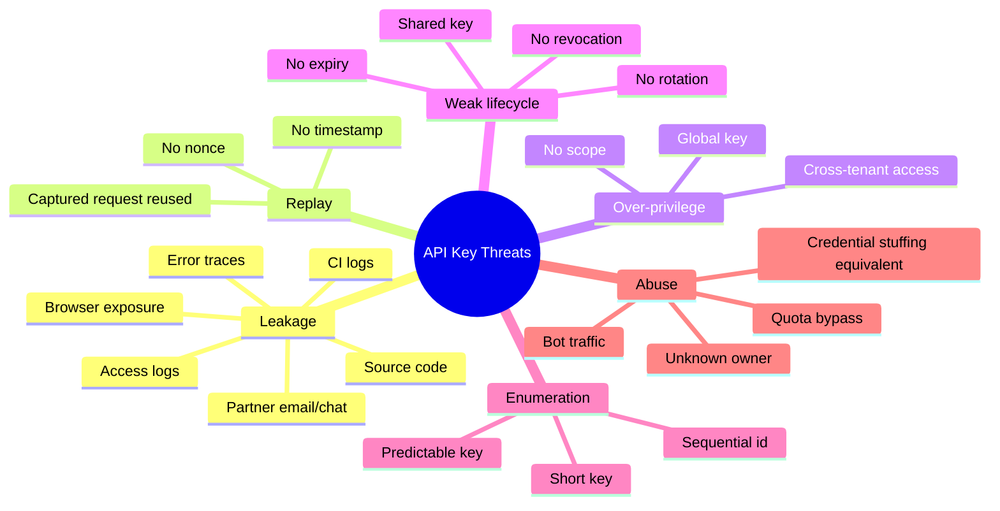
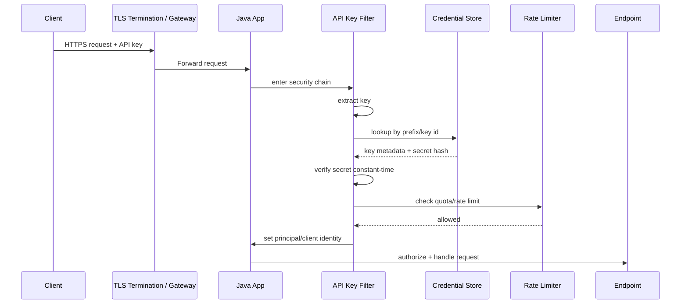
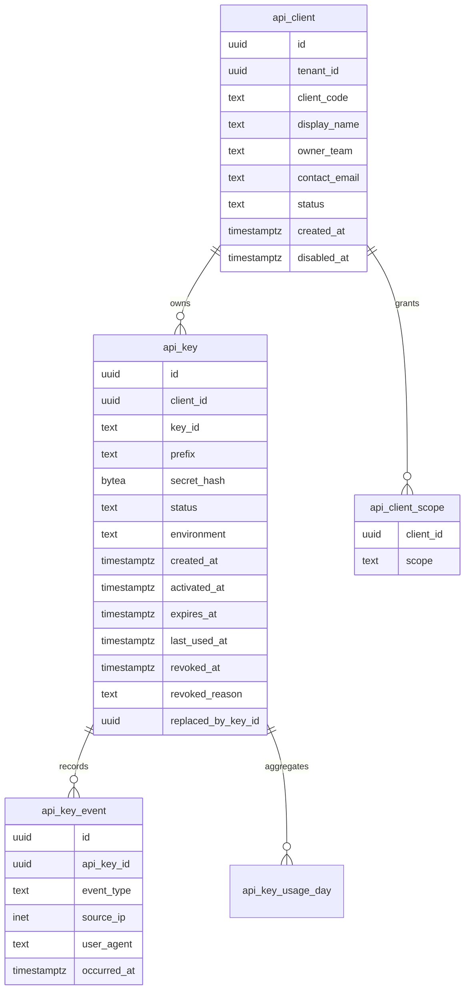
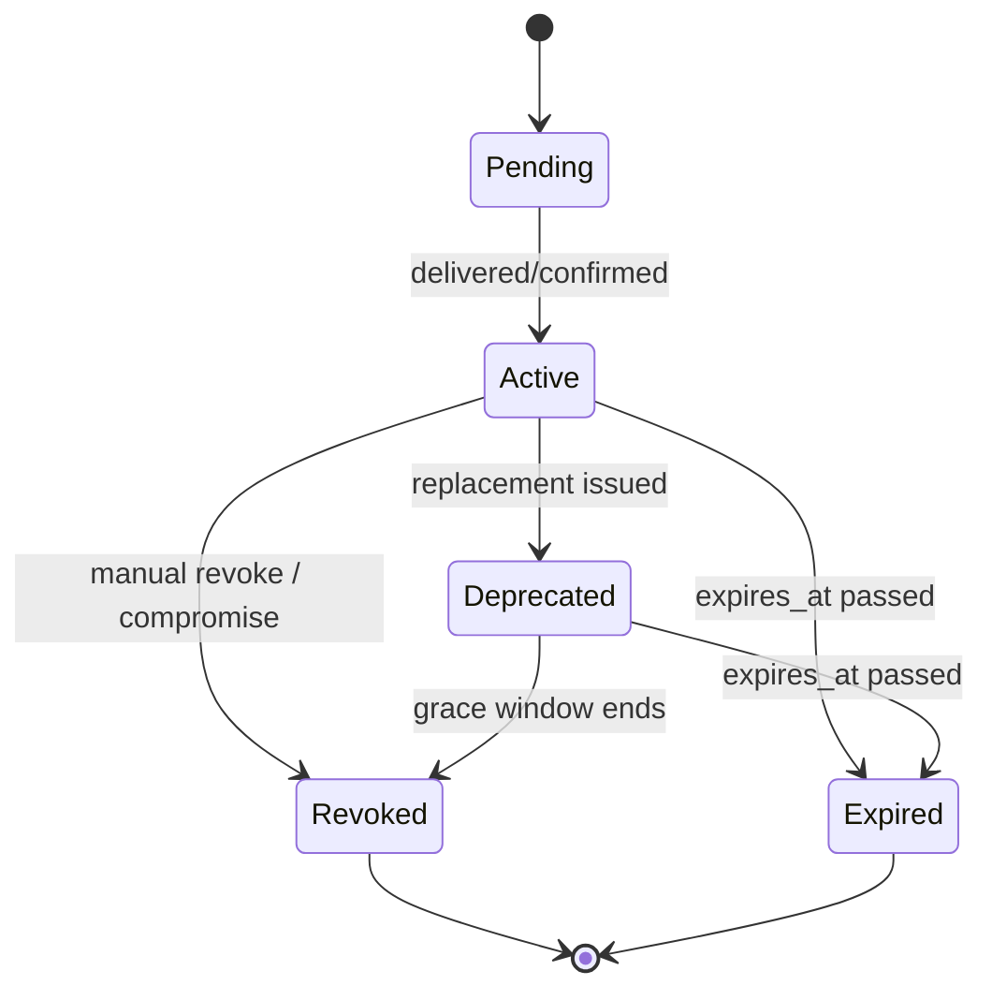
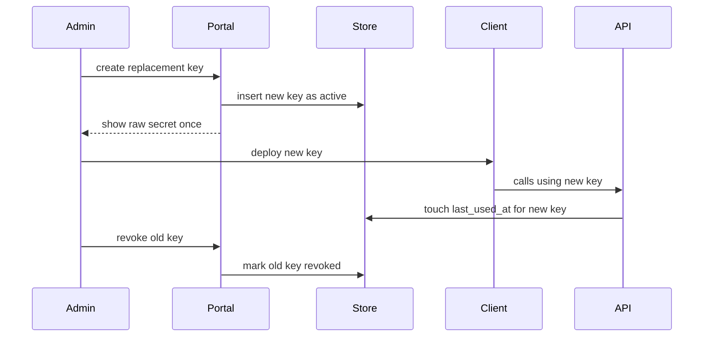

# Part 019 — API Key Authentication Pattern

> Target part ini: memahami API key sebagai **client credential**, bukan pengganti login user. Kita akan membangun mental model, format key, schema storage, validation pipeline, rotation, revocation, scope, tenant binding, rate limiting, observability, Spring Security implementation, JAX-RS implementation, dan runbook saat key bocor.

API key terlihat sederhana:

```txt
X-API-Key: abc123
```

Tapi di production, kesederhanaan itu menipu.

API key sering gagal bukan karena algoritmanya rumit.
API key gagal karena lifecycle-nya tidak didesain.

Contoh failure nyata:

```txt
Key disimpan plaintext di database.
Key tidak punya owner.
Key tidak punya scope.
Key tidak punya expiry.
Key tidak bisa di-rotate tanpa downtime.
Key masuk access log.
Key dibagikan antar service.
Key dipakai sebagai user authentication.
Key berlaku lintas tenant.
Key bocor tapi tidak ada cara revoke cepat.
```

Part ini membahas API key sebagai credential serius.

---

## 1. Mental Model: API Key Is a Client Credential

API key adalah credential untuk **client application**, **integration**, **partner**, **automation**, atau **service account**.

API key bukan bukti identitas manusia.

```txt
User credential    -> membuktikan manusia / subscriber / end-user
API key credential -> membuktikan aplikasi / client / integration
```

Invariant utama:

```txt
An API key authenticates the caller application, not the human user behind it.
```

Karena itu, API key sebaiknya tidak dipakai untuk:

```txt
login user
session user
mobile user authentication
SPA authentication
password reset
MFA bypass
privilege escalation
```

API key cocok untuk:

```txt
partner API integration
server-to-server call sederhana
internal automation
webhook sender identification
metered API access
low/medium risk machine client
legacy integration yang belum bisa OAuth2/mTLS
```

Tetapi untuk high-value mutation, API key saja sering tidak cukup.

Contoh:

```txt
POST /payments/disbursements
POST /accounts/{id}/close
POST /identity/recovery/approve
POST /regulatory-cases/{id}/enforcement-actions
```

Untuk operasi seperti itu, API key perlu diperkuat dengan salah satu:

```txt
OAuth2 client credentials
mTLS
HMAC request signing
JWT client assertion
network allowlist
step-up approval
fine-grained authorization
```

---

## 2. API Key vs Password vs Token vs HMAC

Jangan menyamakan semua secret.

| Mechanism | Membuktikan | Biasanya dikirim | Replay-resistant? | Bisa scoped? | Cocok untuk |
|---|---|---|---|---|---|
| Password | User tahu secret | Login form | Tidak langsung | Melalui account | Human login |
| Session cookie | Browser punya session id | Cookie | Terbatas oleh cookie policy | Server-side | Browser app |
| Bearer token | Caller membawa token | Authorization header | Tidak, kecuali sender-constrained | Ya | API access |
| API key | Client punya static secret | Header/query/body | Tidak | Harus didesain | Integration/client auth |
| HMAC signed request | Client punya secret dan menandatangani request | Headers + signature | Ya, jika timestamp/nonce benar | Ya | High-integrity API calls |
| mTLS | Client punya private key cert | TLS handshake | Strong | Ya | Service identity |

Mental model praktis:

```txt
API key = static bearer credential.
Siapa pun yang memegang key bisa memakainya.
```

Karena API key biasanya bearer-like, maka seluruh desain harus mengurangi dampak jika key bocor.

```txt
blast radius = scope x lifetime x privilege x tenant reach x rate limit x observability gap
```

---

## 3. Threat Model

API key threat model sederhana tapi tajam.



Minimum assumption:

```txt
An API key will eventually leak.
```

Design goal:

```txt
Make leaked key detection fast, impact bounded, and replacement operationally safe.
```

---

## 4. Where API Key Authentication Lives

API key authentication biasanya berada di awal request pipeline.



Authentication menjawab:

```txt
Who is this client?
```

Authorization tetap harus menjawab:

```txt
Can this client perform this action on this resource in this tenant?
```

Valid API key tidak boleh otomatis berarti boleh akses semua endpoint.

---

## 5. Anti-Pattern: API Key as User Login

Pola salah:

```txt
User membuka UI.
Frontend menyimpan API key.
Frontend mengirim API key ke backend.
Backend menganggap API key sebagai user.
```

Masalah:

```txt
API key terekspos di browser.
Tidak ada user session lifecycle.
Tidak ada MFA.
Tidak ada device management.
Tidak ada account recovery lifecycle.
Tidak ada user consent.
Sulit revoke per device.
Sulit audit siapa manusia sebenarnya.
```

Browser adalah hostile environment untuk static client secret.

Rule:

```txt
Do not put long-lived API keys in browser JavaScript, mobile public apps, or downloadable clients.
```

Untuk browser app gunakan:

```txt
session cookie + backend
OIDC Authorization Code + PKCE + BFF
short-lived access token dengan refresh handled server-side
```

Untuk mobile public client gunakan:

```txt
OAuth2/OIDC Authorization Code + PKCE
proof-of-possession bila memungkinkan
server-side risk checks
```

---

## 6. API Key Format

Format API key harus membantu operasi tanpa menurunkan keamanan.

Bad format:

```txt
abc123
partnerA-secret
tenant-42-key
000000001
```

Better format:

```txt
ak_live_2YJ7M5W6Q9ZC3D4E5F6G7H8J9K0L1P2R3S4T5V6W7X8Y9Z0A
```

Komponen:

```txt
ak         -> product/type prefix
live       -> environment marker, optional
2YJ7...    -> high entropy random secret
```

Atau format dengan lookup id dan secret:

```txt
ak_live_kid_7GHT3M.secret_c3Pj9VxX7rZfK2nQm9...
```

Pola recommended untuk production:

```txt
<public_prefix>_<key_id>.<secret>
```

Contoh:

```txt
ak_live_01HY7Q6MS5RVA4CNZ2Y9Q82F3K.1sM7xOzZP6EwWkz0w8v2f5rAq...
```

`key_id` dapat disimpan plaintext karena bukan secret.
`secret` hanya ditampilkan sekali saat pembuatan.

Validation menjadi efisien:

```txt
1. Parse key_id.
2. Load metadata by key_id.
3. Hash/HMAC secret input.
4. Compare dengan stored hash menggunakan constant-time comparison.
```

---

## 7. Entropy Requirement

API key harus random, bukan meaningful.

```txt
Do not derive API keys from username, tenant id, email, timestamp, sequence, or UUID alone.
```

Praktik aman:

```txt
Generate at least 128 bits of entropy for normal API keys.
Use 256 bits for high-value credentials.
Use SecureRandom.
Encode using Base64URL without padding or Crockford Base32.
```

Java example:

```java
import java.security.SecureRandom;
import java.util.Base64;

public final class ApiKeyGenerator {
    private static final SecureRandom RNG = new SecureRandom();

    public static String generateSecret256() {
        byte[] bytes = new byte[32]; // 256 bits
        RNG.nextBytes(bytes);
        return Base64.getUrlEncoder().withoutPadding().encodeToString(bytes);
    }
}
```

Why not UUID?

```txt
UUIDv4 has about 122 random bits.
It may be acceptable for identifiers, but API key secret design usually benefits from explicit byte-length generation and encoding control.
```

Use explicit cryptographic randomness.

---

## 8. Store Hash, Not Secret

Never store full API key secret plaintext.

Bad schema:

```sql
api_key_value text not null
```

Better schema:

```sql
secret_hash bytea not null
```

Important nuance:

API keys are high-entropy random secrets.
Passwords are low-entropy human secrets.

Therefore:

```txt
Password -> slow password hashing: Argon2id / bcrypt / PBKDF2
API key  -> HMAC/SHA-256 or keyed hash over high-entropy random secret is usually appropriate
```

If your API key is human-chosen or short, treat it like password.
But production API keys should be machine-generated random secrets.

Recommended storage pattern:

```txt
stored_secret_hash = HMAC-SHA-256(server_pepper, raw_secret)
```

Why HMAC with server pepper?

```txt
If database leaks alone, attacker cannot verify guessed keys without pepper.
If keys are high entropy, offline guessing is infeasible.
HMAC gives fixed-size indexed/compared representation.
Pepper lives outside database, preferably in KMS/Vault/secret manager.
```

Java example:

```java
import javax.crypto.Mac;
import javax.crypto.spec.SecretKeySpec;
import java.nio.charset.StandardCharsets;

public final class ApiKeyHasher {
    private final byte[] pepper;

    public ApiKeyHasher(byte[] pepper) {
        this.pepper = pepper.clone();
    }

    public byte[] hash(String rawSecret) {
        try {
            Mac mac = Mac.getInstance("HmacSHA256");
            mac.init(new SecretKeySpec(pepper, "HmacSHA256"));
            return mac.doFinal(rawSecret.getBytes(StandardCharsets.UTF_8));
        } catch (Exception e) {
            throw new IllegalStateException("Cannot hash API key", e);
        }
    }
}
```

Constant-time comparison:

```java
import java.security.MessageDigest;

boolean matches(byte[] expected, byte[] actual) {
    return MessageDigest.isEqual(expected, actual);
}
```

Do not use:

```java
Arrays.equals(expected, actual) // may short-circuit
expectedString.equals(actualString)
```

---

## 9. Database Model

API key needs metadata.
Without metadata, you cannot operate it.



Minimum columns:

```sql
create table api_client (
    id uuid primary key,
    tenant_id uuid not null,
    client_code text not null,
    display_name text not null,
    owner_team text,
    contact_email text,
    status text not null check (status in ('active', 'disabled')),
    created_at timestamptz not null default now(),
    disabled_at timestamptz,
    unique (tenant_id, client_code)
);

create table api_key (
    id uuid primary key,
    client_id uuid not null references api_client(id),
    key_id text not null unique,
    prefix text not null,
    secret_hash bytea not null,
    status text not null check (status in ('active', 'pending', 'deprecated', 'revoked', 'expired')),
    environment text not null check (environment in ('test', 'live')),
    created_at timestamptz not null default now(),
    activated_at timestamptz,
    expires_at timestamptz,
    last_used_at timestamptz,
    revoked_at timestamptz,
    revoked_reason text,
    replaced_by_api_key_id uuid references api_key(id),
    version bigint not null default 0
);

create table api_client_scope (
    client_id uuid not null references api_client(id),
    scope text not null,
    primary key (client_id, scope)
);

create index idx_api_key_client_status on api_key(client_id, status);
create index idx_api_key_expires_at on api_key(expires_at);
```

Do not store:

```txt
raw secret
full key in audit event
full key in last used metadata
```

Store safe preview only:

```txt
prefix: ak_live_01HY7Q6MS5...
suffix: optional last 4 chars for UI display, not for lookup
```

---

## 10. Key States

API key has lifecycle.



State semantics:

| State | Meaning | Request accepted? |
|---|---|---|
| `pending` | created but not activated | usually no |
| `active` | usable | yes |
| `deprecated` | old key during rotation grace | maybe yes, but emit warning |
| `revoked` | intentionally killed | no |
| `expired` | lifetime ended | no |

Invariant:

```txt
Only active keys should be accepted by default.
Deprecated acceptance must be explicit and time-bounded.
```

---

## 11. Validation Pipeline

API key validation should be deterministic.

```txt
extract -> parse -> lookup -> status -> expiry -> verify -> scope -> rate limit -> principal
```

Detailed pipeline:

```java
public ApiClientPrincipal authenticate(ApiKeyCredential credential) {
    ParsedApiKey parsed = parser.parse(credential.rawValue());

    ApiKeyRecord record = repository.findByKeyId(parsed.keyId())
        .orElseThrow(BadApiKeyException::new);

    if (!record.isActive(clock.instant())) {
        throw new BadApiKeyException();
    }

    byte[] actualHash = hasher.hash(parsed.secret());
    if (!constantTimeEquals(record.secretHash(), actualHash)) {
        throw new BadApiKeyException();
    }

    ApiClient client = clientRepository.findActive(record.clientId())
        .orElseThrow(BadApiKeyException::new);

    quotaLimiter.check(client.id(), credential.sourceIp());

    repository.touchLastUsedAsync(record.id(), clock.instant());

    return new ApiClientPrincipal(
        client.id(),
        client.tenantId(),
        client.clientCode(),
        client.scopes(),
        record.id()
    );
}
```

Error response should not reveal which stage failed.

Bad:

```json
{ "error": "API key exists but expired" }
```

Better:

```json
{ "error": "invalid_client" }
```

Internally log reason with safe metadata:

```json
{
  "event": "api_key_auth_failed",
  "reason": "expired",
  "key_id": "01HY7Q6MS5RVA4CNZ2Y9Q82F3K",
  "tenant_id": "...",
  "source_ip": "203.0.113.10"
}
```

---

## 12. Header Placement

Preferred:

```http
Authorization: ApiKey ak_live_01HY...secret...
```

Acceptable if ecosystem requires:

```http
X-API-Key: ak_live_01HY...secret...
```

Avoid:

```http
GET /resource?api_key=ak_live_...
```

Query-string keys leak through:

```txt
browser history
server logs
reverse proxy logs
referrer headers
monitoring tools
analytics
screenshots
```

For highly sensitive APIs, require:

```txt
TLS
Authorization header
no query string credentials
redacted logs
shorter expiry
rotation policy
optional HMAC/mTLS
```

---

## 13. Spring Security Implementation

API key authentication fits Spring Security as custom authentication.

Core objects:

```txt
ApiKeyAuthenticationToken
ApiKeyAuthenticationConverter
ApiKeyAuthenticationProvider
AuthenticationFilter
SecurityFilterChain
```

### 13.1 Authentication Token

```java
import org.springframework.security.authentication.AbstractAuthenticationToken;
import org.springframework.security.core.GrantedAuthority;

import java.util.Collection;

public final class ApiKeyAuthenticationToken extends AbstractAuthenticationToken {
    private final Object principal;
    private final String apiKey;

    private ApiKeyAuthenticationToken(
            Object principal,
            String apiKey,
            Collection<? extends GrantedAuthority> authorities,
            boolean authenticated
    ) {
        super(authorities);
        this.principal = principal;
        this.apiKey = apiKey;
        setAuthenticated(authenticated);
    }

    public static ApiKeyAuthenticationToken unauthenticated(String rawApiKey) {
        return new ApiKeyAuthenticationToken(null, rawApiKey, null, false);
    }

    public static ApiKeyAuthenticationToken authenticated(
            ApiClientPrincipal principal,
            Collection<? extends GrantedAuthority> authorities
    ) {
        return new ApiKeyAuthenticationToken(principal, null, authorities, true);
    }

    @Override
    public Object getCredentials() {
        return apiKey;
    }

    @Override
    public Object getPrincipal() {
        return principal;
    }

    @Override
    public void eraseCredentials() {
        super.eraseCredentials();
        // raw key is held in final field in this simplified example.
        // In production, use a mutable credential holder or ensure the token is short-lived.
    }
}
```

For stronger secret hygiene, avoid keeping raw key in long-lived objects.

### 13.2 Converter

```java
import jakarta.servlet.http.HttpServletRequest;
import org.springframework.security.core.Authentication;
import org.springframework.security.web.authentication.AuthenticationConverter;

public final class ApiKeyAuthenticationConverter implements AuthenticationConverter {
    @Override
    public Authentication convert(HttpServletRequest request) {
        String authorization = request.getHeader("Authorization");
        if (authorization != null && authorization.startsWith("ApiKey ")) {
            return ApiKeyAuthenticationToken.unauthenticated(authorization.substring("ApiKey ".length()).trim());
        }

        String xApiKey = request.getHeader("X-API-Key");
        if (xApiKey != null && !xApiKey.isBlank()) {
            return ApiKeyAuthenticationToken.unauthenticated(xApiKey.trim());
        }

        return null;
    }
}
```

### 13.3 Provider

```java
import org.springframework.security.authentication.AuthenticationProvider;
import org.springframework.security.core.Authentication;
import org.springframework.security.core.AuthenticationException;

public final class ApiKeyAuthenticationProvider implements AuthenticationProvider {
    private final ApiKeyAuthenticator authenticator;

    public ApiKeyAuthenticationProvider(ApiKeyAuthenticator authenticator) {
        this.authenticator = authenticator;
    }

    @Override
    public Authentication authenticate(Authentication authentication) throws AuthenticationException {
        String rawKey = (String) authentication.getCredentials();
        ApiClientPrincipal principal = authenticator.authenticate(rawKey);
        return ApiKeyAuthenticationToken.authenticated(principal, principal.authorities());
    }

    @Override
    public boolean supports(Class<?> authentication) {
        return ApiKeyAuthenticationToken.class.isAssignableFrom(authentication);
    }
}
```

### 13.4 Security Filter Chain

```java
import org.springframework.context.annotation.Bean;
import org.springframework.security.authentication.AuthenticationManager;
import org.springframework.security.config.annotation.web.builders.HttpSecurity;
import org.springframework.security.web.SecurityFilterChain;
import org.springframework.security.web.authentication.AuthenticationFilter;

@Bean
SecurityFilterChain apiSecurity(HttpSecurity http, AuthenticationManager authenticationManager) throws Exception {
    AuthenticationFilter apiKeyFilter = new AuthenticationFilter(
        authenticationManager,
        new ApiKeyAuthenticationConverter()
    );
    apiKeyFilter.setSuccessHandler((request, response, authentication) -> {
        // Continue filter chain. AuthenticationFilter success behavior may need customization depending on setup.
    });

    http
        .securityMatcher("/api/**")
        .csrf(csrf -> csrf.disable())
        .addFilter(apiKeyFilter)
        .authorizeHttpRequests(auth -> auth
            .requestMatchers("/api/public/**").permitAll()
            .requestMatchers("/api/admin/**").hasAuthority("SCOPE_admin")
            .anyRequest().authenticated()
        );

    return http.build();
}
```

In real Spring Security configuration, test filter order explicitly.
A custom API key filter should run before authorization and after infrastructure filters that normalize request context.

---

## 14. Simpler Spring Filter Pattern

For legacy or non-standard cases, a `OncePerRequestFilter` can be enough.

```java
import jakarta.servlet.FilterChain;
import jakarta.servlet.ServletException;
import jakarta.servlet.http.HttpServletRequest;
import jakarta.servlet.http.HttpServletResponse;
import org.springframework.security.core.context.SecurityContextHolder;
import org.springframework.web.filter.OncePerRequestFilter;

import java.io.IOException;

public final class ApiKeyFilter extends OncePerRequestFilter {
    private final ApiKeyAuthenticator authenticator;

    public ApiKeyFilter(ApiKeyAuthenticator authenticator) {
        this.authenticator = authenticator;
    }

    @Override
    protected void doFilterInternal(
            HttpServletRequest request,
            HttpServletResponse response,
            FilterChain filterChain
    ) throws ServletException, IOException {
        try {
            String rawKey = extractApiKey(request);
            if (rawKey != null) {
                ApiClientPrincipal principal = authenticator.authenticate(rawKey);
                ApiKeyAuthenticationToken auth = ApiKeyAuthenticationToken.authenticated(
                    principal,
                    principal.authorities()
                );
                SecurityContextHolder.getContext().setAuthentication(auth);
            }

            filterChain.doFilter(request, response);
        } catch (BadApiKeyException ex) {
            SecurityContextHolder.clearContext();
            response.setStatus(HttpServletResponse.SC_UNAUTHORIZED);
            response.setContentType("application/json");
            response.getWriter().write("{\"error\":\"invalid_client\"}");
        } finally {
            // Usually Spring Security context persistence clears the context.
            // Keep this here only if this filter is used outside the managed security chain.
        }
    }

    private String extractApiKey(HttpServletRequest request) {
        String auth = request.getHeader("Authorization");
        if (auth != null && auth.startsWith("ApiKey ")) {
            return auth.substring(7).trim();
        }
        String key = request.getHeader("X-API-Key");
        return key == null || key.isBlank() ? null : key.trim();
    }
}
```

Trade-off:

```txt
AuthenticationProvider model -> cleaner integration with Spring Security
OncePerRequestFilter -> simpler, but easier to bypass/misorder if careless
```

---

## 15. JAX-RS / Jakarta REST Implementation

For JAX-RS applications:

```java
import jakarta.annotation.Priority;
import jakarta.ws.rs.Priorities;
import jakarta.ws.rs.container.ContainerRequestContext;
import jakarta.ws.rs.container.ContainerRequestFilter;
import jakarta.ws.rs.core.HttpHeaders;
import jakarta.ws.rs.core.Response;
import jakarta.ws.rs.core.SecurityContext;
import jakarta.ws.rs.ext.Provider;

import java.io.IOException;
import java.security.Principal;

@Provider
@Priority(Priorities.AUTHENTICATION)
public final class ApiKeyRequestFilter implements ContainerRequestFilter {
    private final ApiKeyAuthenticator authenticator;

    public ApiKeyRequestFilter(ApiKeyAuthenticator authenticator) {
        this.authenticator = authenticator;
    }

    @Override
    public void filter(ContainerRequestContext ctx) throws IOException {
        String rawKey = extract(ctx);
        if (rawKey == null) {
            return;
        }

        try {
            ApiClientPrincipal principal = authenticator.authenticate(rawKey);
            SecurityContext original = ctx.getSecurityContext();
            ctx.setSecurityContext(new ApiKeySecurityContext(principal, original.isSecure()));
        } catch (BadApiKeyException ex) {
            ctx.abortWith(Response.status(Response.Status.UNAUTHORIZED)
                .entity("{\"error\":\"invalid_client\"}")
                .type("application/json")
                .build());
        }
    }

    private String extract(ContainerRequestContext ctx) {
        String auth = ctx.getHeaderString(HttpHeaders.AUTHORIZATION);
        if (auth != null && auth.startsWith("ApiKey ")) {
            return auth.substring("ApiKey ".length()).trim();
        }
        return ctx.getHeaderString("X-API-Key");
    }
}
```

Security context:

```java
import jakarta.ws.rs.core.SecurityContext;
import java.security.Principal;

public final class ApiKeySecurityContext implements SecurityContext {
    private final ApiClientPrincipal principal;
    private final boolean secure;

    public ApiKeySecurityContext(ApiClientPrincipal principal, boolean secure) {
        this.principal = principal;
        this.secure = secure;
    }

    @Override
    public Principal getUserPrincipal() {
        return principal;
    }

    @Override
    public boolean isUserInRole(String role) {
        return principal.scopes().contains(role) || principal.authorities().stream()
            .anyMatch(a -> a.getAuthority().equals(role));
    }

    @Override
    public boolean isSecure() {
        return secure;
    }

    @Override
    public String getAuthenticationScheme() {
        return "ApiKey";
    }
}
```

---

## 16. Scope Design

API key without scope is a loaded gun.

Bad:

```txt
partner_api_key -> can do everything
```

Better:

```txt
orders:read
orders:create
orders:cancel
quotes:read
quotes:create
webhooks:send
cases:read
cases:update-status
```

Scope grammar should be boring:

```txt
<resource>:<action>
```

Examples:

```txt
quote:read
quote:create
order:submit
order:cancel
case:read
case:transition
payment:initiate
payment:refund
```

Avoid vague scopes:

```txt
admin
full_access
partner
standard
api
```

For high-risk operations, add constraints:

```txt
scope + tenant + resource owner + amount limit + workflow state + approval status
```

Example authorization check:

```java
public void requireScope(ApiClientPrincipal client, String requiredScope) {
    if (!client.scopes().contains(requiredScope)) {
        throw new ForbiddenException("insufficient_scope");
    }
}
```

But scope alone is not enough.

```java
public void authorizeOrderSubmit(ApiClientPrincipal client, Order order) {
    requireScope(client, "order:submit");

    if (!order.tenantId().equals(client.tenantId())) {
        throw new ForbiddenException("cross_tenant_access_denied");
    }

    if (!order.partnerId().equals(client.clientId())) {
        throw new ForbiddenException("resource_owner_mismatch");
    }

    if (!order.isSubmittable()) {
        throw new ConflictException("order_not_submittable");
    }
}
```

Authentication identifies the API client.
Authorization still enforces business boundary.

---

## 17. Tenant Binding

Multi-tenant API keys must be tenant-bound.

Bad:

```txt
api_key -> client_id
client_id -> many tenants
request has tenant_id param
```

This allows tenant confusion if authorization is weak.

Better:

```txt
api_key -> client_id -> tenant_id
```

If one partner legitimately accesses multiple tenants, model it explicitly:

```sql
create table api_client_tenant_grant (
    client_id uuid not null references api_client(id),
    tenant_id uuid not null,
    grant_status text not null,
    created_at timestamptz not null default now(),
    primary key (client_id, tenant_id)
);
```

Then require tenant resolution:

```txt
request tenant -> client tenant grant -> resource tenant -> authorization policy
```

Invariant:

```txt
Never infer tenant solely from request input when credential metadata already has tenant context.
```

---

## 18. Rate Limiting and Quotas

API key authentication should feed rate limiting.

Dimensions:

```txt
api_key_id
client_id
tenant_id
source_ip
endpoint group
scope
risk class
```

Example policy:

| Endpoint | Limit |
|---|---:|
| `GET /quotes/*` | 3000/min/client |
| `POST /quotes` | 300/min/client |
| `POST /orders` | 60/min/client |
| `POST /payments` | 10/min/client + HMAC required |
| failed auth | 20/min/source IP + key id |

Redis token bucket sketch:

```java
public final class ApiQuotaLimiter {
    private final RedisClient redis;

    public void check(String clientId, String routeGroup) {
        String key = "quota:" + routeGroup + ":" + clientId + ":" + currentMinute();
        long count = redis.incr(key);
        if (count == 1) {
            redis.expire(key, 90);
        }
        if (count > limitFor(routeGroup)) {
            throw new TooManyRequestsException();
        }
    }
}
```

Production nuance:

```txt
Rate limit authenticated clients by client id.
Rate limit invalid requests by IP/subnet/fingerprint.
Do not let unknown API key attempts hit database at unlimited rate.
Cache negative lookup carefully with short TTL.
```

---

## 19. Key Rotation

Rotation is not an afterthought.

Good API key systems support at least two active keys per client during transition.



Rotation policy:

```txt
Allow overlapping active keys.
Show secret once.
Expose last_used_at per key.
Allow revocation per key.
Do not revoke all keys accidentally unless incident mode.
Support automation through secure admin API.
```

Schema supports:

```txt
old key -> replaced_by_api_key_id -> new key
```

Key UI should show:

```txt
name
prefix
created_at
last_used_at
expires_at
status
scopes
environment
created_by
revoked_by
```

Never show raw secret after creation.

---

## 20. Expiry Policy

Should API keys expire?

Answer: usually yes, but forced expiry without rotation tooling causes outages.

Practical policy:

```txt
test keys: 30-90 days
live partner keys: 90-365 days depending on risk
high-risk keys: 30-90 days + HMAC/mTLS
internal automation keys: prefer workload identity/mTLS; if not, 90 days
```

Expiry without notification is an incident generator.

Required operational features:

```txt
expiry warning at T-30/T-14/T-7/T-1
owner contact
dashboard
last_used_at
automated rotation option
emergency extension workflow
```

Invariant:

```txt
A key expiry policy is only mature if key owners can rotate before expiry without opening a ticket under pressure.
```

---

## 21. Revocation

Revocation must be immediate enough for the risk class.

Options:

```txt
Database status check on every request -> simple, slower
Cache key metadata with short TTL -> faster, revocation delayed by TTL
Event-driven cache invalidation -> fast, more complex
Redis active key cache -> fast but needs authoritative DB fallback
```

Common production pattern:

```txt
DB is source of truth.
App caches active key metadata for 30-120 seconds.
Revocation publishes invalidation event.
High-risk endpoints bypass cache or require fresh check.
```

Revocation event:

```json
{
  "event_type": "api_key.revoked",
  "api_key_id": "...",
  "client_id": "...",
  "tenant_id": "...",
  "reason": "suspected_leak",
  "revoked_by": "security-ops",
  "occurred_at": "2026-07-03T04:00:00Z"
}
```

Do not delete key rows.

```txt
Delete removes auditability.
Revoke preserves evidence.
```

---

## 22. Logging and Redaction

API keys must never appear in logs.

Redact these locations:

```txt
Authorization header
X-API-Key header
query string
exception message
request dump
access logs
proxy logs
APM spans
debug logs
failed auth logs
webhook delivery logs
```

Safe log:

```json
{
  "event": "api_request_authenticated",
  "auth_type": "api_key",
  "key_id": "01HY7Q6MS5RVA4CNZ2Y9Q82F3K",
  "key_prefix": "ak_live_01HY7Q6M",
  "client_id": "...",
  "tenant_id": "...",
  "route": "POST /orders",
  "source_ip": "203.0.113.10"
}
```

Unsafe log:

```json
{
  "headers": {
    "X-API-Key": "ak_live_01HY...raw-secret..."
  }
}
```

Spring redaction filter sketch:

```java
public final class HeaderRedactor {
    private static final Set<String> SECRET_HEADERS = Set.of(
        "authorization",
        "x-api-key",
        "x-signature",
        "cookie",
        "set-cookie"
    );

    public static String safeHeader(String name, String value) {
        if (SECRET_HEADERS.contains(name.toLowerCase(Locale.ROOT))) {
            return "[REDACTED]";
        }
        return value;
    }
}
```

---

## 23. Observability

API key authentication needs security observability, not just request metrics.

Metrics:

```txt
api_key.auth.success.count
api_key.auth.failure.count by reason
api_key.auth.latency
api_key.lookup.latency
api_key.cache.hit.rate
api_key.revoked.used.count
api_key.expired.used.count
api_key.rotation.age.days
api_key.last_used.age.days
api_key.quota.rejected.count
```

Security detections:

```txt
same key from new ASN/country
same key from many IPs in short window
revoked key still being used
expired key still being used
key used after long dormancy
key using new endpoint/scope
failure spike for unknown key ids
prefix enumeration attempts
sudden quota spike
```

Example detection rule:

```txt
IF api_key_id is active
AND source_asn not in historical_asn_set
AND endpoint risk >= high
THEN alert security_ops with severity medium/high
```

---

## 24. API Key Portal Requirements

A production API key system usually needs a portal or admin API.

Minimum capabilities:

```txt
create client
create key
show secret once
list keys
show last used
show scopes
add/remove scopes
rotate key
revoke key
disable client
export audit events
configure quota
set owner contact
```

Security requirements:

```txt
Only privileged admins can create/revoke keys.
Key creation requires reason and owner.
High-risk scopes require approval.
Raw secret is displayed once.
Raw secret is never emailed.
Admin actions are audited.
```

Bad process:

```txt
Developer asks in Slack.
Ops creates key manually in database.
Ops sends key via chat.
No owner, no expiry, no scopes.
```

Good process:

```txt
Self-service request -> approval -> generated key -> displayed once -> owner stored -> expiry warnings -> audit trail
```

---

## 25. OpenAPI Contract

Document API key scheme explicitly.

```yaml
components:
  securitySchemes:
    ApiKeyAuth:
      type: apiKey
      in: header
      name: X-API-Key

security:
  - ApiKeyAuth: []
```

If using `Authorization: ApiKey`, OpenAPI cannot model arbitrary auth schemes as `apiKey` perfectly in all tooling, but you can document with HTTP bearer-like custom scheme:

```yaml
components:
  securitySchemes:
    ApiKeyAuthorization:
      type: http
      scheme: ApiKey
```

Be careful with generated clients.
Many tools understand `X-API-Key` better than custom `Authorization: ApiKey`.

Contract should also document:

```txt
where to send key
that HTTPS is required
that query string is forbidden
error format
rate limit headers
rotation expectations
scope model
```

---

## 26. Error Semantics

Authentication failure:

```http
HTTP/1.1 401 Unauthorized
Content-Type: application/json

{
  "error": "invalid_client"
}
```

Authorization failure:

```http
HTTP/1.1 403 Forbidden
Content-Type: application/json

{
  "error": "insufficient_scope"
}
```

Rate limit:

```http
HTTP/1.1 429 Too Many Requests
Retry-After: 60
Content-Type: application/json

{
  "error": "rate_limited"
}
```

Do not reveal:

```txt
unknown key id
wrong secret
expired key
revoked key
client disabled
scope missing for a sensitive endpoint
```

Externally, stay generic.
Internally, keep precise audit reason.

---

## 27. Caching Strategy

Naive design:

```txt
Every request hits PostgreSQL.
```

This may be acceptable at low volume but can become auth bottleneck.

Better:

```txt
Cache key metadata by key_id.
Cache only active/deprecated metadata.
Use short TTL.
Invalidate on revoke/disable/scope change.
Never cache raw key.
```

Cache value:

```java
public record CachedApiKey(
    UUID apiKeyId,
    UUID clientId,
    UUID tenantId,
    String keyId,
    byte[] secretHash,
    Set<String> scopes,
    Instant expiresAt,
    String status,
    long version
) {}
```

Risk:

```txt
If secret_hash is in cache, compromise of app memory/cache can aid abuse.
```

Mitigations:

```txt
protect cache network
encrypt in transit
short TTL
least privilege access
cache segmentation
avoid exposing cache dump
clear on incident
```

For extremely sensitive systems, skip shared cache for high-risk endpoints.

---

## 28. Negative Lookup Caching

Attackers may generate random key ids to hammer the database.

Negative cache:

```txt
key_id not found -> cache miss result for 10-30 seconds
```

But be careful:

```txt
If you create a new key with same id impossible due randomness.
If parser accepts short user-controlled id, attacker can poison many cache entries.
```

Mitigate:

```txt
strict key format
length limit
rate limit before database
small TTL
bounded cache size
```

---

## 29. Key Compromise Runbook

When key leaks:

```txt
1. Identify key id/prefix from leaked material.
2. Revoke key immediately.
3. Identify client, tenant, scopes, and owner.
4. Pull last_used_at and recent request logs.
5. Detect unusual IP/ASN/endpoint/resource access.
6. Rotate replacement key if client still legitimate.
7. Notify owner/partner.
8. Review data access and mutations.
9. Revoke related keys if sharing suspected.
10. Create post-incident control improvement.
```

Runbook query examples:

```sql
select *
from api_key
where key_id = :key_id;

select route, source_ip, count(*), min(occurred_at), max(occurred_at)
from api_key_event
where api_key_id = :api_key_id
  and occurred_at > now() - interval '30 days'
group by route, source_ip
order by count(*) desc;
```

Questions incident commander asks:

```txt
Was the key used after leak time?
Was it used from abnormal IPs?
Was it used against high-risk endpoints?
Did it access cross-tenant resources?
Were mutations performed?
Could logs contain the raw key elsewhere?
Are downstream systems caching this credential?
```

---

## 30. Failure Modes

| Failure | Cause | Impact | Control |
|---|---|---|---|
| Key leaked through logs | no redaction | attacker can call API | redact, scan, revoke |
| Key cannot rotate | single-key model | downtime or prolonged exposure | multi-key rotation |
| Key overprivileged | no scope | broad compromise | least privilege scopes |
| Key cross-tenant | tenant not bound | data breach | tenant-bound principal |
| Key stored plaintext | DB leak | immediate compromise | HMAC hash + pepper |
| Key in URL | query string | log/referrer leak | header-only policy |
| Unknown owner | poor governance | slow incident response | owner/contact metadata |
| No rate limit | abuse | cost/data impact | quota/rate limiter |
| Cache stale after revoke | long TTL | revoked key still works | invalidation + short TTL |
| API key as user login | wrong model | weak user auth | OIDC/session for users |

---

## 31. Decision Matrix

Use API key when:

```txt
caller is a confidential server-side client
risk is low to medium
integration needs simplicity
credential can be stored securely
scopes and revocation are implemented
TLS is mandatory
```

Avoid API key alone when:

```txt
caller is browser/mobile public client
operation is high financial/regulatory risk
request integrity matters
replay must be prevented
non-repudiation-like evidence is needed
client identity needs certificate-grade assurance
```

Prefer alternatives:

| Need | Prefer |
|---|---|
| User login | OIDC/session |
| Machine-to-machine with standard ecosystem | OAuth2 client credentials |
| Strong service identity | mTLS/SPIFFE |
| Request integrity and replay defense | HMAC request signing |
| Browser app | BFF + session cookie |
| Partner webhook verification | HMAC signature |

---

## 32. Production Checklist

API key creation:

```txt
[ ] SecureRandom with >=128-bit entropy
[ ] environment-aware prefix
[ ] key id separated from secret
[ ] raw secret displayed once
[ ] secret hash stored, not raw secret
[ ] owner/contact captured
[ ] tenant binding captured
[ ] scopes assigned explicitly
[ ] expiry set
[ ] audit event emitted
```

Validation:

```txt
[ ] HTTPS only
[ ] no query string credentials
[ ] strict parser
[ ] lookup by key id/prefix
[ ] constant-time secret comparison
[ ] active/expired/revoked status checked
[ ] tenant-bound principal created
[ ] scope-based authorization enforced
[ ] rate limiting enforced
[ ] safe generic errors
```

Operations:

```txt
[ ] rotation supported
[ ] revocation supported
[ ] last_used_at tracked
[ ] suspicious usage detection
[ ] log redaction
[ ] secret scanning
[ ] expiry notification
[ ] emergency revoke runbook
[ ] cache invalidation tested
```

---

## 33. Practice Drill

Design an API key system for a partner integration that can:

```txt
read quotes
create quotes
submit orders
receive webhooks
not access other tenants
not call payment endpoints
rotate without downtime
```

Produce:

```txt
1. API client schema
2. API key schema
3. key format
4. validation pipeline
5. scope list
6. rate limit policy
7. revocation runbook
8. OpenAPI security scheme
9. test matrix
```

Edge case questions:

```txt
What happens if the key is expired?
What happens if tenant id in URL differs from key tenant?
What happens if revoked key is used from known IP?
What happens if key id exists but secret mismatches?
What happens if partner needs emergency rotation?
What happens if API gateway logs the Authorization header?
```

---

## 34. Key Takeaways

API key authentication is acceptable when treated as a real credential system.

The production-grade model:

```txt
API key = high-entropy client credential + owner + tenant + scope + expiry + revocation + rotation + observability
```

Not production-grade:

```txt
static string in config table
```

The central invariant:

```txt
Every API key must have bounded privilege, bounded lifetime, known ownership, safe storage, and a tested death path.
```

Part berikutnya akan membahas **HMAC Request Signing Pattern**: ketika API key saja tidak cukup karena request harus tahan replay dan tampering.

---

## References

- OWASP API Security Top 10 2023 — API2: Broken Authentication
- OWASP REST Security Cheat Sheet
- OWASP Secrets Management Cheat Sheet
- Spring Security Servlet Authentication Architecture
- Spring Security `AuthenticationFilter` API
- Jakarta RESTful Web Services / JAX-RS filter model
- NIST SP 800-63B-4 Digital Identity Guidelines
