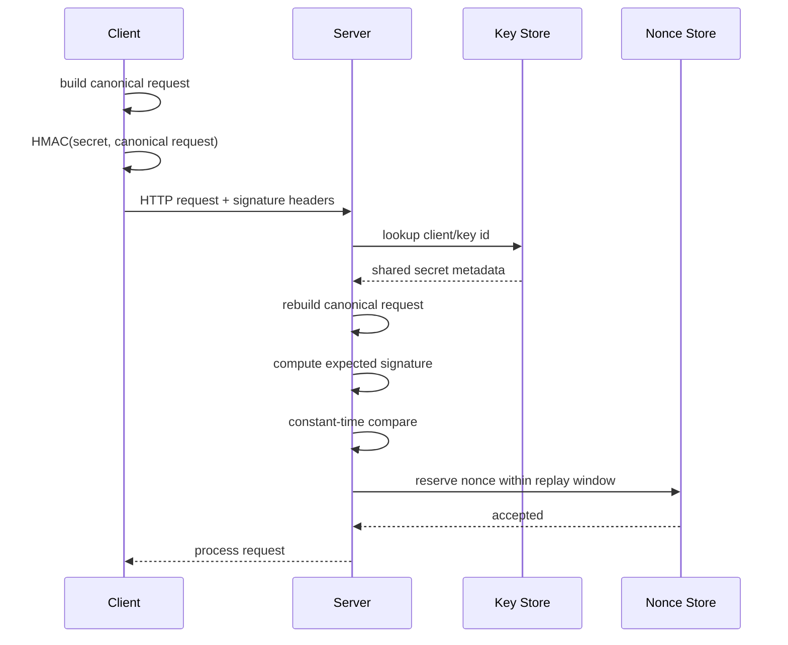
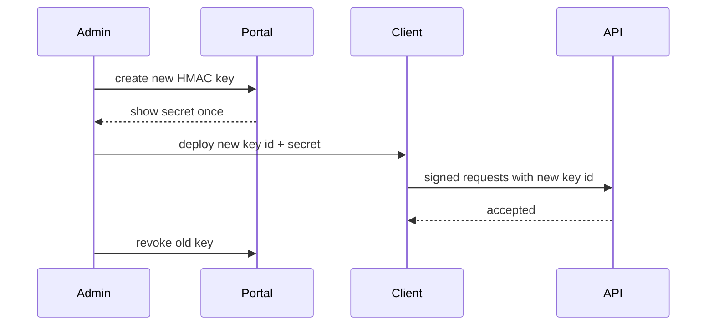

# Part 020 — HMAC Request Signing Pattern

> Target part ini: memahami HMAC request signing sebagai **proof-of-possession over an HTTP request**. Kita akan membahas canonical request, signed headers, payload hash, timestamp, nonce, replay window, key lookup, constant-time verification, Spring/JAX-RS implementation, webhook verification, key rotation, testing golden vectors, dan failure modes.

API key menjawab:

```txt
Does the caller know the secret?
```

HMAC request signing menjawab pertanyaan yang lebih kuat:

```txt
Does the caller know the secret AND did the caller sign this exact request at this time?
```

Itu perbedaan besar.

API key biasa adalah bearer credential.
Jika dicuri dari satu request, attacker bisa replay credential untuk request lain.

HMAC signing mengikat secret ke request:

```txt
method + path + query + selected headers + body hash + timestamp + nonce
```

Jika attacker mengubah body, signature gagal.
Jika attacker replay request lama, timestamp/nonce menolak.

---

## 1. Mental Model: Signed Request, Not Signed User

HMAC adalah Message Authentication Code berbasis shared secret.

Dalam konteks HTTP API:

```txt
client and server share a secret
client builds canonical request
client computes HMAC(secret, canonical_request)
client sends signature metadata
server rebuilds canonical request
server computes expected HMAC
server compares signatures constant-time
```



Invariant:

```txt
The verifier must sign exactly the same bytes/semantics the signer signed.
```

Most HMAC bugs are canonicalization bugs.

---

## 2. What HMAC Provides and Does Not Provide

HMAC provides:

```txt
message integrity
shared-secret authentication
proof that signer had the secret
request tamper detection
replay resistance if timestamp/nonce is included and enforced
```

HMAC does not provide:

```txt
confidentiality
public-key non-repudiation
identity proofing
user authentication
authorization
protection if shared secret leaks
```

If traffic is not encrypted, HMAC does not hide payload.

Rule:

```txt
HMAC request signing still requires HTTPS.
```

TLS protects confidentiality and server authenticity.
HMAC adds application-layer request integrity and replay defense.

---

## 3. When to Use HMAC Request Signing

Use HMAC when:

```txt
partner API performs high-value mutations
webhooks must be verified
request body integrity matters
replay must be rejected
client cannot use mTLS/OAuth properly
API key alone is too weak
intermediaries may terminate TLS before app layer
```

Common examples:

```txt
payment callback verification
order submission API
regulatory filing API
partner case transition API
inventory reservation API
banking-style transfer initiation
admin automation over public network
```

Avoid custom HMAC when:

```txt
standard OAuth2/OIDC/mTLS already solves the problem
clients cannot implement canonicalization correctly
ecosystem interoperability matters more than custom control
request transformations by proxies are unpredictable
```

For general HTTP signature interoperability, consider RFC 9421 HTTP Message Signatures.
For AWS-compatible ecosystems, study AWS Signature Version 4.
For a private platform, keep the custom scheme small and deterministic.

---

## 4. API Key vs HMAC

| Dimension | API Key | HMAC Signing |
|---|---|---|
| Secret sent over wire | Yes, usually | No, signature sent |
| Request integrity | No | Yes |
| Replay protection | No, unless extra | Yes, with timestamp/nonce |
| Client complexity | Low | Medium/high |
| Server complexity | Low | Medium/high |
| Good for webhooks | Weak | Strong |
| Good for high-risk mutation | Weak alone | Better |
| Failure-prone area | lifecycle | canonicalization |

API key:

```http
X-API-Key: ak_live_secret
```

HMAC:

```http
X-Client-Id: client_123
X-Key-Id: key_abc
X-Timestamp: 2026-07-03T04:00:00Z
X-Nonce: 2f6a0e60-1f0a-4e7b-9b53-3d4a7b54a111
X-Content-SHA256: 0e5751c026e543b2e8ab2eb06099daa1...
X-Signed-Headers: host;x-timestamp;x-nonce;x-content-sha256
X-Signature: hmac-sha256=:MEUCIQDp...:
```

The secret is never sent.

---

## 5. Protocol Shape

A simple internal HMAC scheme can use these headers:

```http
X-Client-Id: partner-acme
X-Key-Id: hmk_live_01HY7Q6MS5RVA4CNZ2Y9Q82F3K
X-Timestamp: 2026-07-03T04:00:00Z
X-Nonce: 01HY7Q7AT5YDSR2E3T7H7F4C5P
X-Content-SHA256: 8b1a9953c4611296a827abf8c47804d7...
X-Signed-Headers: host;x-client-id;x-key-id;x-timestamp;x-nonce;x-content-sha256
X-Signature: hmac-sha256=:base64url(signature):
```

Minimum signed components:

```txt
method
path
query string
host
content hash
timestamp
nonce
client id
key id
```

For mutating requests, always sign body hash.

For bodyless requests:

```txt
payload_hash = SHA-256(empty byte array)
```

Do not omit payload hash just because body is empty.
Consistency reduces bugs.

---

## 6. Canonical Request

Canonical request is a deterministic string.

Example format:

```txt
<HTTP_METHOD>\n
<CANONICAL_PATH>\n
<CANONICAL_QUERY>\n
<CANONICAL_HEADERS>\n
<SIGNED_HEADERS>\n
<PAYLOAD_SHA256_HEX>
```

Example:

```txt
POST
/api/v1/orders
currency=IDR&externalId=Q-123
host:api.example.com
x-client-id:partner-acme
x-content-sha256:8b1a9953c4611296a827abf8c47804d7...
x-key-id:hmk_live_01HY7Q6MS5RVA4CNZ2Y9Q82F3K
x-nonce:01HY7Q7AT5YDSR2E3T7H7F4C5P
x-timestamp:2026-07-03T04:00:00Z

host;x-client-id;x-content-sha256;x-key-id;x-nonce;x-timestamp
8b1a9953c4611296a827abf8c47804d7...
```

HMAC input should be this canonical string, or a string-to-sign derived from it.

A string-to-sign pattern:

```txt
HMAC-SHA256\n
2026-07-03T04:00:00Z\n
SHA256_HEX(canonical_request)
```

This makes logs/debugging easier because canonical request hash can be compared without exposing secret.

---

## 7. Canonicalization Rules

Define canonicalization rules before coding.

### 7.1 Method

```txt
uppercase HTTP method
```

Example:

```txt
post -> POST
```

### 7.2 Path

Decide one rule and never change it casually.

Recommended:

```txt
use raw path as received by application after trusted proxy normalization
ensure it starts with /
do not collapse path segments unless both client and server do it identically
percent-encode consistently
```

Danger cases:

```txt
/api/a/../b
/api/a/%2e%2e/b
/api/orders/%2Fsecret
/api/orders//123
```

If proxy normalizes path differently from app, signatures break or become bypassable.

### 7.3 Query String

Canonical query should be deterministic:

```txt
split parameters
percent-decode only according to defined rules
sort by encoded name, then encoded value
preserve repeated keys
represent empty value consistently
join with &
```

Example input:

```txt
?b=2&a=1&a=0&empty=
```

Canonical:

```txt
a=0&a=1&b=2&empty=
```

Danger cases:

```txt
space as + vs %20
empty param vs missing param
repeated parameter order
unicode normalization
```

### 7.4 Headers

Canonical headers:

```txt
lowercase header names
trim leading/trailing spaces
collapse sequential internal whitespace to one space
sort by header name
include only signed headers
end canonical header block with newline
```

Never sign hop-by-hop headers that proxies mutate:

```txt
connection
keep-alive
transfer-encoding
upgrade
proxy-authenticate
proxy-authorization
te
trailer
```

Be careful with:

```txt
x-forwarded-for
x-forwarded-host
x-forwarded-proto
content-length
```

If proxies change them, clients cannot sign them reliably.

### 7.5 Body

Hash the exact bytes sent.

```txt
payload_hash = lowercase hex SHA-256(request_body_bytes)
```

JSON canonicalization is hard.
Do not sign “parsed JSON”.
Sign bytes.

This means:

```txt
{"a":1,"b":2}
```

and:

```txt
{
  "b": 2,
  "a": 1
}
```

are different bodies and produce different hashes.

That is okay if clients sign exactly what they send.

---

## 8. Replay Defense

HMAC without replay defense only detects tampering.
It does not stop captured requests being sent again.

Replay defense needs:

```txt
timestamp window
nonce uniqueness
idempotency for mutation
```

### 8.1 Timestamp Window

Example policy:

```txt
Accept timestamp within ±5 minutes of server time.
```

Server check:

```java
Duration skew = Duration.between(requestTimestamp, clock.instant()).abs();
if (skew.compareTo(Duration.ofMinutes(5)) > 0) {
    throw new InvalidSignatureException("stale_signature");
}
```

Do not allow huge windows.

```txt
Long replay window = attacker has more time to reuse captured requests.
```

### 8.2 Nonce Store

Nonce must be unique per key within replay window.

Redis pattern:

```txt
SET hmac_nonce:{key_id}:{nonce} 1 NX EX 300
```

If command returns false, nonce was already used.
Reject as replay.

Java sketch:

```java
public final class RedisNonceStore {
    private final RedisClient redis;

    public void reserve(String keyId, String nonce, Duration ttl) {
        String key = "hmac_nonce:" + keyId + ":" + nonce;
        boolean inserted = redis.setIfAbsent(key, "1", ttl);
        if (!inserted) {
            throw new ReplayDetectedException();
        }
    }
}
```

### 8.3 Idempotency

Nonce prevents exact replay.
Idempotency prevents accidental duplicate business effect.

For mutation APIs:

```http
Idempotency-Key: order-submit-20260703-abc
```

Store idempotency result by:

```txt
client_id + endpoint + idempotency_key
```

Nonce and idempotency solve different problems.

```txt
Nonce -> security replay
Idempotency key -> business duplicate effect
```

Use both for high-value POSTs.

---

## 9. Key Model

HMAC uses shared secret, similar lifecycle to API key.

```sql
create table hmac_client (
    id uuid primary key,
    tenant_id uuid not null,
    client_code text not null,
    display_name text not null,
    status text not null check (status in ('active', 'disabled')),
    created_at timestamptz not null default now(),
    unique (tenant_id, client_code)
);

create table hmac_key (
    id uuid primary key,
    client_id uuid not null references hmac_client(id),
    key_id text not null unique,
    secret_ciphertext bytea not null,
    secret_version text not null,
    algorithm text not null default 'HMAC-SHA256',
    status text not null check (status in ('active', 'deprecated', 'revoked', 'expired')),
    created_at timestamptz not null default now(),
    expires_at timestamptz,
    revoked_at timestamptz,
    last_used_at timestamptz
);
```

Unlike API key verification by hash, HMAC verification needs the verifier to compute HMAC with the shared secret.
That means the server must be able to access the secret or a derived signing key.

Storage options:

```txt
KMS/Vault encrypted secret in DB
secret stored in dedicated secret manager by key id
derived verification key stored encrypted
HSM/KMS MAC verification if supported by platform
```

Do not store plaintext HMAC secrets in database.

---

## 10. Key Derivation

Simple scheme:

```txt
signature = HMAC(secret, string_to_sign)
```

Stronger compartmentalized scheme:

```txt
k_date = HMAC(secret, yyyyMMdd)
k_service = HMAC(k_date, service_name)
k_signing = HMAC(k_service, "request-signing")
signature = HMAC(k_signing, string_to_sign)
```

Benefits:

```txt
limits impact of derived key exposure
supports date/service scoping
resembles battle-tested SigV4-style separation
```

Costs:

```txt
more client complexity
more test vectors needed
more clock/date edge cases
```

For many internal systems, simple HMAC-SHA256 with strong secret, strict nonce, and rotation is enough.
For public partner ecosystems, derivation can be worth it.

---

## 11. Java HMAC Implementation

Core HMAC:

```java
import javax.crypto.Mac;
import javax.crypto.spec.SecretKeySpec;
import java.nio.charset.StandardCharsets;
import java.util.Base64;

public final class HmacSigner {
    public static byte[] hmacSha256(byte[] key, String message) {
        try {
            Mac mac = Mac.getInstance("HmacSHA256");
            mac.init(new SecretKeySpec(key, "HmacSHA256"));
            return mac.doFinal(message.getBytes(StandardCharsets.UTF_8));
        } catch (Exception e) {
            throw new IllegalStateException("Cannot compute HMAC", e);
        }
    }

    public static String base64Url(byte[] bytes) {
        return Base64.getUrlEncoder().withoutPadding().encodeToString(bytes);
    }
}
```

Constant-time compare:

```java
import java.security.MessageDigest;

public final class SignatureVerifier {
    public static boolean constantTimeEquals(byte[] expected, byte[] actual) {
        return MessageDigest.isEqual(expected, actual);
    }
}
```

Do not compare encoded signature strings with normal equals if you can decode and compare bytes.

---

## 12. SHA-256 Payload Hash

```java
import java.security.MessageDigest;
import java.util.HexFormat;

public final class PayloadHash {
    public static String sha256Hex(byte[] body) {
        try {
            MessageDigest digest = MessageDigest.getInstance("SHA-256");
            return HexFormat.of().formatHex(digest.digest(body));
        } catch (Exception e) {
            throw new IllegalStateException("Cannot compute SHA-256", e);
        }
    }
}
```

Empty body hash:

```java
String emptyHash = PayloadHash.sha256Hex(new byte[0]);
```

All clients and servers should have this value in golden tests.

---

## 13. Canonical Request Builder

Simplified builder:

```java
import java.util.*;
import java.util.stream.Collectors;

public final class CanonicalRequest {
    public static String build(
            String method,
            String path,
            List<QueryParam> queryParams,
            Map<String, List<String>> headers,
            List<String> signedHeaders,
            String payloadSha256Hex
    ) {
        String canonicalMethod = method.toUpperCase(Locale.ROOT);
        String canonicalPath = normalizePath(path);
        String canonicalQuery = canonicalizeQuery(queryParams);

        List<String> lowerSigned = signedHeaders.stream()
            .map(h -> h.toLowerCase(Locale.ROOT))
            .sorted()
            .toList();

        String canonicalHeaders = lowerSigned.stream()
            .map(name -> name + ":" + canonicalHeaderValue(headers, name) + "\n")
            .collect(Collectors.joining());

        String signedHeaderLine = String.join(";", lowerSigned);

        return canonicalMethod + "\n" +
            canonicalPath + "\n" +
            canonicalQuery + "\n" +
            canonicalHeaders + "\n" +
            signedHeaderLine + "\n" +
            payloadSha256Hex;
    }

    private static String normalizePath(String path) {
        if (path == null || path.isBlank()) {
            return "/";
        }
        if (!path.startsWith("/")) {
            return "/" + path;
        }
        return path;
    }

    private static String canonicalizeQuery(List<QueryParam> params) {
        return params.stream()
            .map(p -> percentEncode(p.name()) + "=" + percentEncode(p.value()))
            .sorted()
            .collect(Collectors.joining("&"));
    }

    private static String canonicalHeaderValue(Map<String, List<String>> headers, String lowerName) {
        List<String> values = headers.entrySet().stream()
            .filter(e -> e.getKey().equalsIgnoreCase(lowerName))
            .flatMap(e -> e.getValue().stream())
            .map(CanonicalRequest::normalizeWhitespace)
            .toList();

        if (values.isEmpty()) {
            throw new MissingSignedHeaderException(lowerName);
        }
        return String.join(",", values);
    }

    private static String normalizeWhitespace(String input) {
        return input.trim().replaceAll("\\s+", " ");
    }

    private static String percentEncode(String s) {
        // Simplified. For production, implement RFC-compatible percent encoding explicitly,
        // test it with golden vectors, and do not rely blindly on form encoders that encode space as '+'.
        return PercentEncoding.strictEncode(s);
    }
}

public record QueryParam(String name, String value) {}
```

The placeholder `PercentEncoding.strictEncode` must be implemented and tested.
Do not use `URLEncoder` blindly because it is for HTML form encoding semantics, not always canonical URI signing semantics.

---

## 14. Server Verification Pipeline

```txt
extract signature headers
validate required fields
validate algorithm allowlist
lookup key id
validate key/client status
validate timestamp window
validate nonce uniqueness
validate payload hash
build canonical request
build string to sign
compute expected HMAC
constant-time compare
create authenticated principal
continue authorization
```

Java sketch:

```java
public final class HmacRequestAuthenticator {
    private final HmacKeyRepository keyRepository;
    private final NonceStore nonceStore;
    private final Clock clock;

    public HmacPrincipal authenticate(IncomingSignedRequest request) {
        SignatureHeaders sig = SignatureHeaders.from(request.headers());

        if (!sig.algorithm().equals("hmac-sha256")) {
            throw new InvalidSignatureException();
        }

        HmacKeyRecord key = keyRepository.findActive(sig.keyId())
            .orElseThrow(InvalidSignatureException::new);

        validateTimestamp(sig.timestamp());
        validatePayloadHash(request.bodyBytes(), sig.contentSha256());

        String canonicalRequest = CanonicalRequest.build(
            request.method(),
            request.path(),
            request.queryParams(),
            request.headers(),
            sig.signedHeaders(),
            sig.contentSha256()
        );

        String stringToSign = "HMAC-SHA256\n" +
            sig.timestamp() + "\n" +
            sha256Hex(canonicalRequest.getBytes(StandardCharsets.UTF_8));

        byte[] expected = HmacSigner.hmacSha256(key.secret(), stringToSign);
        byte[] actual = sig.signatureBytes();

        if (!MessageDigest.isEqual(expected, actual)) {
            throw new InvalidSignatureException();
        }

        nonceStore.reserve(key.keyId(), sig.nonce(), Duration.ofMinutes(5));

        return new HmacPrincipal(
            key.clientId(),
            key.tenantId(),
            key.keyId(),
            key.scopes()
        );
    }

    private void validateTimestamp(Instant timestamp) {
        Duration skew = Duration.between(timestamp, clock.instant()).abs();
        if (skew.compareTo(Duration.ofMinutes(5)) > 0) {
            throw new InvalidSignatureException();
        }
    }

    private void validatePayloadHash(byte[] body, String expectedHash) {
        String actual = PayloadHash.sha256Hex(body);
        if (!MessageDigest.isEqual(
                expectedHash.getBytes(StandardCharsets.US_ASCII),
                actual.getBytes(StandardCharsets.US_ASCII))) {
            throw new InvalidSignatureException();
        }
    }
}
```

Important ordering note:

```txt
Validate timestamp before expensive work.
Reserve nonce after signature passes, or before with careful abuse handling.
```

If you reserve nonce before signature validation, attackers can poison nonce store.
If you reserve after signature validation, replayed invalid signatures cost CPU.
Balance with rate limits.

---

## 15. Spring Security Filter

HMAC auth can be implemented as custom Spring authentication.

Simplified `OncePerRequestFilter`:

```java
public final class HmacAuthenticationFilter extends OncePerRequestFilter {
    private final HmacRequestAuthenticator authenticator;

    public HmacAuthenticationFilter(HmacRequestAuthenticator authenticator) {
        this.authenticator = authenticator;
    }

    @Override
    protected void doFilterInternal(
            HttpServletRequest request,
            HttpServletResponse response,
            FilterChain chain
    ) throws ServletException, IOException {
        CachedBodyHttpServletRequest wrapped = new CachedBodyHttpServletRequest(request);

        try {
            if (!hasSignatureHeaders(wrapped)) {
                chain.doFilter(wrapped, response);
                return;
            }

            IncomingSignedRequest signed = IncomingSignedRequest.from(wrapped);
            HmacPrincipal principal = authenticator.authenticate(signed);

            Authentication auth = HmacAuthenticationToken.authenticated(
                principal,
                principal.authorities()
            );
            SecurityContextHolder.getContext().setAuthentication(auth);

            chain.doFilter(wrapped, response);
        } catch (InvalidSignatureException ex) {
            SecurityContextHolder.clearContext();
            response.setStatus(HttpServletResponse.SC_UNAUTHORIZED);
            response.setContentType("application/json");
            response.getWriter().write("{\"error\":\"invalid_signature\"}");
        }
    }
}
```

Key issue:

```txt
Servlet request body can normally be read once.
```

If the auth filter reads the body to hash it, downstream controller may see empty body unless you wrap/cache it.

Use a bounded caching wrapper.
Do not allow unlimited body buffering.

```txt
max signed body size
streaming strategy for large uploads
reject unsupported content types if necessary
```

---

## 16. JAX-RS Filter

JAX-RS filter can verify signature before resource method.

```java
@Provider
@Priority(Priorities.AUTHENTICATION)
public final class HmacContainerRequestFilter implements ContainerRequestFilter {
    private final HmacRequestAuthenticator authenticator;

    @Override
    public void filter(ContainerRequestContext ctx) throws IOException {
        if (!hasSignatureHeaders(ctx)) {
            return;
        }

        byte[] body = readAndReplaceEntityStream(ctx);

        try {
            IncomingSignedRequest signed = IncomingSignedRequest.from(ctx, body);
            HmacPrincipal principal = authenticator.authenticate(signed);
            ctx.setSecurityContext(new HmacSecurityContext(principal, ctx.getSecurityContext().isSecure()));
        } catch (InvalidSignatureException ex) {
            ctx.abortWith(Response.status(Response.Status.UNAUTHORIZED)
                .type("application/json")
                .entity("{\"error\":\"invalid_signature\"}")
                .build());
        }
    }

    private byte[] readAndReplaceEntityStream(ContainerRequestContext ctx) throws IOException {
        byte[] body = ctx.getEntityStream().readAllBytes();
        ctx.setEntityStream(new ByteArrayInputStream(body));
        return body;
    }
}
```

Again: bound body size.
`readAllBytes()` is intentionally simplified; production needs max-size enforcement.

---

## 17. Webhook Verification Pattern

Webhook is one of the best use cases for HMAC.

Sender signs event payload:

```http
POST /webhooks/payment-provider
X-Webhook-Id: evt_123
X-Timestamp: 2026-07-03T04:00:00Z
X-Signature: hmac-sha256=:...:
Content-Type: application/json

{ "eventId": "evt_123", "type": "payment.succeeded" }
```

Receiver verifies:

```txt
source/provider id
signature
timestamp
event id uniqueness
payload schema
business idempotency
```

Webhook-specific replay defense:

```txt
Store webhook event id.
Reject duplicate event id unless idempotent replay with same payload hash.
```

Do not process webhook before verification.

Bad:

```txt
parse event -> update payment -> verify signature
```

Good:

```txt
read raw body -> verify signature -> parse event -> validate schema -> idempotency -> update payment
```

Reason:

```txt
JSON parser may normalize/modify representation.
Signature must be computed over raw body bytes.
```

---

## 18. Signed Headers Selection

Sign stable headers.

Recommended:

```txt
host
x-client-id
x-key-id
x-timestamp
x-nonce
x-content-sha256
content-type for body requests
idempotency-key for mutating requests
```

Avoid signing unstable headers:

```txt
user-agent
accept-encoding
connection
content-length
x-forwarded-for unless controlled by trusted gateway
traceparent unless both sides preserve it exactly
```

If you sign `content-type`, define exact casing/value semantics.

```txt
application/json
application/json; charset=utf-8
```

These are not identical strings.
Canonicalization must normalize or require one exact value.

---

## 19. Clock Skew

Clock skew is operational, not theoretical.

Clients may run with bad NTP.
Servers may be in multiple regions.

Policy:

```txt
window: ±5 minutes default
error: generic externally
log: timestamp_skew_seconds internally
response header: server time optional for troubleshooting
```

Example:

```http
HTTP/1.1 401 Unauthorized
X-Server-Time: 2026-07-03T04:05:10Z
Content-Type: application/json

{ "error": "invalid_signature" }
```

Be cautious: too much error detail can help attackers tune replay attempts.

---

## 20. Large Body and Streaming

Hashing body requires reading body.

For large uploads:

Options:

```txt
Reject HMAC signing for bodies over configured size.
Require client-provided content hash and stream-verify while reading.
Use chunked signing protocol.
Use pre-signed upload URLs.
Use mTLS/OAuth and storage-level checksum instead.
```

Do not blindly buffer 500MB request body in auth filter.

Production limits:

```txt
max signed JSON body: e.g. 1MB or 10MB
max webhook body: provider-specific
max canonical header size
max query parameter count
max nonce length
max signed headers count
```

Security boundary:

```txt
Canonicalization must be bounded before authentication to avoid CPU/memory DoS.
```

---

## 21. Error Handling

External errors should be simple:

```json
{ "error": "invalid_signature" }
```

Internal reasons can be precise:

```txt
missing_signature
unsupported_algorithm
unknown_key_id
client_disabled
key_revoked
stale_timestamp
nonce_reused
payload_hash_mismatch
canonical_header_missing
signature_mismatch
```

Do not return:

```txt
expected signature
canonical request string
server-computed string-to-sign
secret id status detail
```

Those are for secure debug logs only, and even then be careful.

For partner debugging, provide a safe diagnostic mode in non-production:

```txt
canonical request hash
signed headers list
server time
payload hash mismatch yes/no
```

Never expose shared secret or expected HMAC.

---

## 22. Testing with Golden Vectors

HMAC schemes require golden vectors.

For every client language, publish:

```txt
sample method
sample path
sample query
sample headers
sample body
canonical request
string to sign
secret
expected signature
```

Example test shape:

```java
@Test
void buildsCanonicalRequest() {
    String canonical = CanonicalRequest.build(
        "POST",
        "/api/v1/orders",
        List.of(new QueryParam("externalId", "Q-123"), new QueryParam("currency", "IDR")),
        Map.of(
            "Host", List.of("api.example.com"),
            "X-Timestamp", List.of("2026-07-03T04:00:00Z"),
            "X-Nonce", List.of("nonce-123"),
            "X-Content-SHA256", List.of("abc")
        ),
        List.of("host", "x-timestamp", "x-nonce", "x-content-sha256"),
        "abc"
    );

    assertThat(canonical).isEqualTo("""
        POST
        /api/v1/orders
        currency=IDR&externalId=Q-123
        host:api.example.com
        x-content-sha256:abc
        x-nonce:nonce-123
        x-timestamp:2026-07-03T04:00:00Z

        host;x-content-sha256;x-nonce;x-timestamp
        abc""".stripIndent());
}
```

Also test failure cases:

```txt
query parameter reordered
body whitespace changed
timestamp stale
nonce reused
header missing
uppercase header name
duplicate query key
unicode query value
path encoded slash
wrong secret
wrong key id
revoked key
```

---

## 23. Performance Model

Cost components:

```txt
body hashing
canonicalization
secret lookup/decryption
HMAC computation
nonce store round trip
logging/audit
```

Usually expensive parts:

```txt
body read/hash for large payloads
KMS/Vault secret retrieval
Redis nonce check under high QPS
DB lookup if not cached
```

Performance controls:

```txt
cache decrypted/derived key with short TTL
bound body size
use Redis pipelining if needed
rate limit before expensive verification for obvious invalid traffic
avoid verbose debug logging
precompute lower-case signed headers
```

But never optimize by removing nonce for high-risk endpoints.

---

## 24. Multi-Region Replay Store

Nonce store in multi-region systems is hard.

Options:

```txt
single home region for signed endpoint
region-sticky routing per client
global strongly consistent nonce store
short replay window plus idempotency/event id
accept regional replay risk for low-risk endpoint
```

If requests can hit any region and nonce stores are regional, attacker may replay same signed request to another region.

Mitigation:

```txt
include region in signature scope and route accordingly
or use global nonce replication
or make mutation idempotent and globally constrained
```

Decision must be explicit.

---

## 25. Interaction with Proxies and Gateways

Proxies can break signatures.

They may change:

```txt
host
path normalization
query encoding
headers
content-encoding
transfer-encoding
body compression
trailing slash
```

Architecture choices:

```txt
Verify signature at edge gateway before mutation.
Or ensure gateway forwards raw path/query and signed headers unchanged.
Or define canonicalization based on post-gateway representation and require clients to sign that representation.
```

Best practice for private platforms:

```txt
Terminate TLS at trusted gateway.
Preserve raw path/query if app verifies.
Reject ambiguous paths.
Do not rewrite signed headers.
Document gateway behavior as part of auth protocol.
```

---

## 26. Algorithm Agility

Header should include algorithm:

```http
X-Signature: hmac-sha256=:...:
```

But server must use allowlist.

Allowed:

```txt
hmac-sha256
```

Maybe future:

```txt
hmac-sha512
```

Never accept algorithm from header without policy.

Bad:

```java
Mac.getInstance(request.getAlgorithm())
```

Good:

```java
if (!algorithm.equals("hmac-sha256")) {
    throw new InvalidSignatureException();
}
```

This avoids algorithm confusion.

---

## 27. Rotation

HMAC rotation resembles API key rotation, but clients need signing library/config update.

Support:

```txt
multiple active keys per client
key id in header
last used per key
deprecated grace window
revocation
expiry warnings
```

Rotation sequence:



Do not infer key by trying every secret for a client.
Require `X-Key-Id`.

Reasons:

```txt
performance
safe rotation
clear audit
no timing/key oracle
```

---

## 28. Webhook Sender vs API Caller

HMAC has two common directions.

### 28.1 Client Signs API Request

```txt
partner -> your API
```

You authenticate partner.
You enforce partner authorization.
You reject replay.

### 28.2 Provider Signs Webhook

```txt
external provider -> your webhook endpoint
```

You verify provider.
You validate event.
You deduplicate event.
You process business state transition.

These are similar but not identical.

Webhook verification often uses provider-defined signature format.
Do not invent your own if provider already defines one.
Implement their exact spec.

---

## 29. HMAC and Authorization

Valid signature only proves request came from a holder of the shared secret.

It does not answer:

```txt
Can this client submit this order?
Can this client access this tenant?
Can this client use this workflow transition?
Can this client refund this payment?
```

Authorization still required:

```java
public void authorize(HmacPrincipal client, Order order, String action) {
    if (!client.scopes().contains("order:" + action)) {
        throw new ForbiddenException();
    }
    if (!client.tenantId().equals(order.tenantId())) {
        throw new ForbiddenException();
    }
    if (!order.partnerId().equals(client.clientId())) {
        throw new ForbiddenException();
    }
}
```

Do not put authorization decisions inside canonicalization.
Keep layers separate.

---

## 30. Observability

Metrics:

```txt
hmac.auth.success.count
hmac.auth.failure.count by reason
hmac.auth.latency
hmac.payload_hash.latency
hmac.nonce.reserve.latency
hmac.nonce.reuse.count
hmac.timestamp.skew.seconds
hmac.signature_mismatch.count
hmac.key.revoked.used.count
```

Logs:

```json
{
  "event": "hmac_auth_failed",
  "reason": "nonce_reused",
  "client_id": "partner-acme",
  "key_id": "hmk_live_01HY7Q6MS5RVA4CNZ2Y9Q82F3K",
  "path": "/api/v1/orders",
  "method": "POST",
  "source_ip": "203.0.113.10",
  "timestamp_skew_seconds": 12
}
```

Never log:

```txt
shared secret
expected signature
raw Authorization/API key equivalent
full body for sensitive requests
```

Potentially log under secure debug only:

```txt
canonical request hash
string-to-sign hash
signed headers list
```

---

## 31. Failure Modes

| Failure | Cause | Impact | Control |
|---|---|---|---|
| Signature mismatch for valid clients | canonicalization ambiguity | integration outage | golden vectors, SDK |
| Replay accepted | no nonce store | duplicate mutation | nonce + timestamp |
| Body tampering accepted | body hash not signed | data manipulation | sign payload hash |
| Proxy breaks auth | path/header rewrite | false failures/bypass | gateway contract |
| Memory DoS | unbounded body buffering | outage | size limit/stream hash |
| Nonce poisoning | reserve before auth | DoS | rate limit/order carefully |
| Secret DB leak | plaintext secrets | compromise | encrypted secrets/KMS |
| Algorithm confusion | accepts arbitrary alg | bypass risk | allowlist |
| Multi-region replay | regional nonce stores | replay in other region | global nonce/region binding |
| Debug leak | logs canonical secrets/body | data leak | redaction |

---

## 32. Decision Matrix

Use HMAC signing when:

```txt
request integrity matters
replay defense matters
partner cannot use mTLS
webhook verification is needed
shared-secret model is acceptable
client implementation can be controlled/tested
```

Prefer mTLS when:

```txt
service identity is infrastructure-managed
certificate lifecycle is mature
private key protection is stronger than shared secret handling
```

Prefer OAuth2 client credentials when:

```txt
standard token ecosystem is needed
central authorization server exists
scopes and token lifecycle are already mature
```

Prefer RFC 9421 when:

```txt
interoperable HTTP message signing is required
multiple components/signatures are needed
standard signature metadata matters
```

---

## 33. Production Checklist

Protocol:

```txt
[ ] HMAC-SHA256 allowlisted
[ ] canonical request format documented
[ ] signed headers documented
[ ] payload hash required
[ ] timestamp required
[ ] nonce required
[ ] replay window defined
[ ] key id required
[ ] HTTPS required
```

Implementation:

```txt
[ ] exact byte body hash
[ ] strict header canonicalization
[ ] strict query canonicalization
[ ] constant-time signature compare
[ ] bounded body buffering
[ ] nonce store atomic SET NX
[ ] key status/expiry checked
[ ] algorithm confusion prevented
[ ] generic external errors
```

Operations:

```txt
[ ] key rotation supported
[ ] revocation supported
[ ] golden vectors published
[ ] client SDK tested
[ ] logs redacted
[ ] signature failure metrics
[ ] replay alerts
[ ] proxy behavior documented
[ ] incident runbook ready
```

---

## 34. Practice Drill

Design HMAC signing for:

```txt
POST /api/v1/tenants/{tenantId}/orders/{orderId}/submit
```

Requirements:

```txt
partner-bound tenant
request body signed
replay rejected within 5 minutes
duplicate business submission idempotent
key rotation without downtime
signature debug support in sandbox
```

Produce:

```txt
1. required headers
2. canonical request format
3. sample request
4. sample canonical request
5. string-to-sign
6. Java verifier
7. nonce store key design
8. authorization check
9. golden tests
10. incident runbook
```

Edge cases:

```txt
same nonce different body
same body different nonce
timestamp 10 minutes old
query params reordered
header casing differs
body whitespace changes
proxy adds trailing slash
client signs compressed body but server sees decompressed body
```

---

## 35. Key Takeaways

HMAC request signing is not “just hash the body”.
It is a protocol.

The core invariant:

```txt
Both sides must compute the same canonical representation of the same request, then compare signatures without leaking timing or replay surface.
```

Use HMAC when API key alone is too weak and request integrity matters.
But do not underestimate operational complexity.

Production-grade HMAC requires:

```txt
canonicalization discipline
nonce/timestamp replay defense
safe key lifecycle
bounded resource usage
clear error semantics
golden test vectors
proxy-aware deployment
```

Part berikutnya akan membahas **Mutual TLS Authentication Pattern**: ketika client identity berpindah dari shared secret ke certificate/private key model.

---

## References

- RFC 2104 — HMAC: Keyed-Hashing for Message Authentication
- NIST FIPS 198-1 — The Keyed-Hash Message Authentication Code
- RFC 9421 — HTTP Message Signatures
- AWS Signature Version 4 documentation
- OWASP REST Security Cheat Sheet
- OWASP API Security Top 10 2023
- Spring Security Servlet Authentication Architecture
- Jakarta RESTful Web Services filter model
