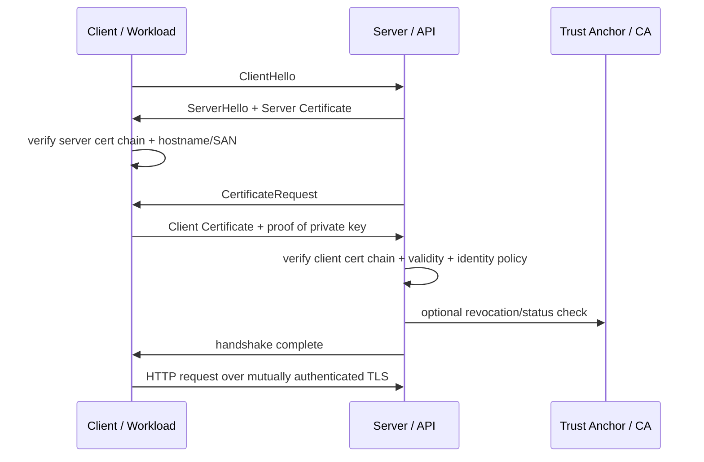
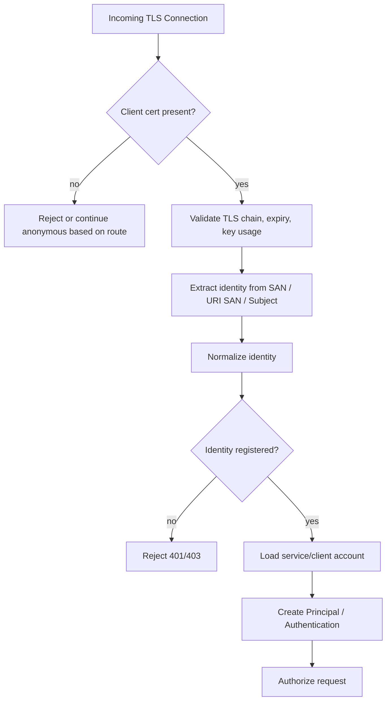
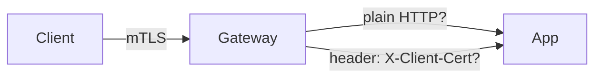
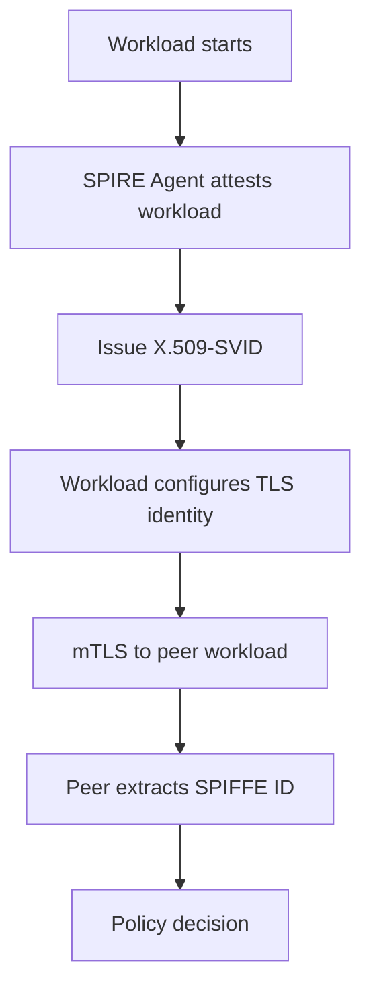
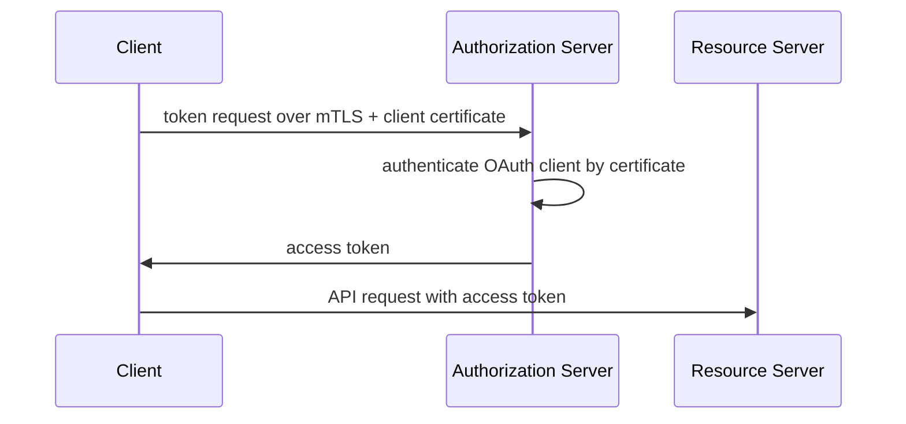
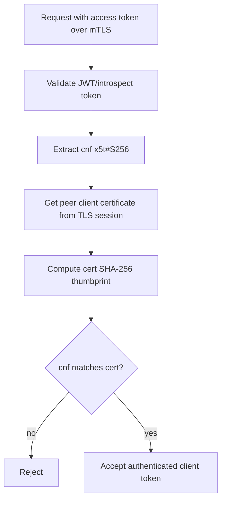
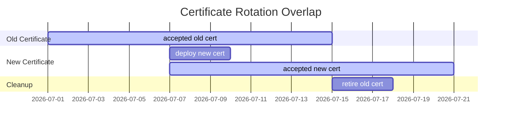
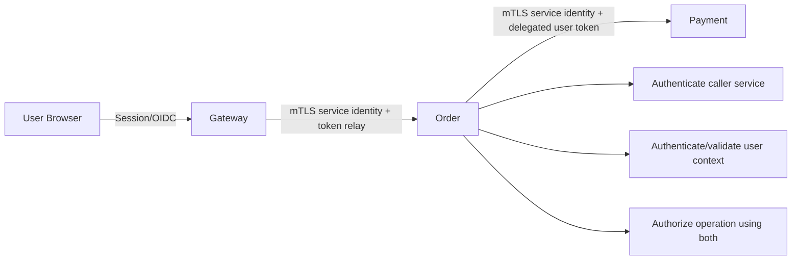

# Part 021 — Mutual TLS Authentication Pattern

> Target part ini: memahami mutual TLS sebagai pattern autentikasi berbasis **cryptographic peer identity**, bukan sekadar “HTTPS dua arah”. Kita akan membahas client certificate authentication, service identity, certificate-bound token, TLS termination, trust anchor, rotation, revocation, SPIFFE/SPIRE concepts, Java implementation, Spring/JAX-RS integration, gateway/service mesh boundary, testing, dan production failure modes.

Di part sebelumnya kita membahas API key dan HMAC request signing.
Keduanya berbasis shared secret.

mTLS berbeda.

```txt
API key / HMAC:
  caller proves knowledge of a shared secret

mTLS:
  caller proves possession of a private key whose certificate chains to a trusted authority
```

Itu mengubah banyak hal:

- secret tidak perlu dikirim di request;
- identitas dapat diikat ke certificate subject/SAN/SPIFFE ID;
- server dan client dapat saling mengautentikasi;
- channel transport dan peer identity menjadi satu boundary;
- rotation dapat dikelola lewat certificate lifecycle;
- replay token yang dicuri bisa dibatasi jika token diikat ke certificate.

mTLS paling cocok ketika identity yang ingin dibuktikan adalah **workload/client/service**, bukan manusia langsung.
Untuk manusia, mTLS bisa dipakai dalam skenario enterprise/high assurance, tetapi untuk web consumer login biasanya tidak ergonomis.

---

## 1. Mental Model: TLS Is Not Just Encryption

TLS biasa pada web umumnya hanya melakukan server authentication:

```txt
browser/client verifies server certificate
server usually does not verify client certificate
```

mTLS menambahkan client authentication:

```txt
client verifies server certificate
server verifies client certificate
```



mTLS authentication answers:

```txt
Is the peer controlling the private key corresponding to this certificate,
and does that certificate represent an identity trusted for this endpoint?
```

It does **not** automatically answer:

```txt
Is this peer authorized to call this business operation?
Is the human user behind the peer authenticated?
Is the request semantically safe?
Is the workload uncompromised?
```

mTLS gives you **authenticated channel identity**.
Authorization is still separate.

---

## 2. Authentication Objects in mTLS

A production mTLS design has these objects:

```txt
Trust Anchor / CA
  root/intermediate certificate authority trusted by both sides

Certificate
  public identity document signed by CA

Private Key
  private proof material held only by workload/client

Certificate Chain
  leaf certificate + intermediate CA certificates

Identity Claim
  subject, DNS SAN, URI SAN, SPIFFE ID, custom extension, or mapped principal

Trust Store
  certificates/CA used to verify peer certificates

Key Store
  local private key + certificate chain used by this workload
```

In Java terms:

```txt
KeyStore      = where my private key + cert chain live
TrustStore    = who I trust as issuer of peer certificates
KeyManager    = chooses my certificate during TLS handshake
TrustManager  = validates peer certificate during TLS handshake
SSLContext    = runtime TLS configuration built from key/trust material
```

The common mistake is mixing up keystore and truststore.

```txt
Keystore:   who am I?
Truststore: who do I trust?
```

---

## 3. Pattern: Certificate as Client Credential

At application layer, the client certificate becomes an authentication credential.

```txt
HTTP request
  arrives over TLS
  server obtains peer certificate from TLS session
  app maps certificate identity to principal/client/service account
  app builds Authentication object / Principal
  app continues authorization and business processing
```



Important invariant:

```txt
A certificate is not a permission set.
A certificate is evidence for an identity.
Permission must be resolved from policy.
```

Do not encode all business authorization in certificate subject fields.
Certificate issuance and business authorization should evolve independently.

---

## 4. When mTLS Is the Right Authentication Pattern

Use mTLS when you need strong workload/client identity at transport boundary.

Good fits:

- service-to-service authentication inside zero-trust environments;
- B2B API client authentication;
- regulated partner integrations;
- webhook consumers/providers with high assurance requirements;
- internal admin APIs;
- control plane to data plane communication;
- certificate-bound OAuth access tokens;
- database/proxy/client channel authentication;
- service mesh identity;
- device identity where certificates can be provisioned securely.

Poor fits:

- consumer web login;
- mobile apps where private keys cannot be strongly protected without platform-specific design;
- public browser-only clients;
- simple partner integrations without certificate lifecycle capability;
- systems unable to rotate certificates safely;
- environments where TLS terminates before application and identity is forwarded insecurely.

Decision heuristic:

```txt
If the caller is a workload, service, device, or enterprise client:
  mTLS may be appropriate.

If the caller is a human in a browser:
  OIDC/session/passkey is usually more appropriate.
```

---

## 5. mTLS vs API Key vs HMAC

| Pattern | Proof | Credential type | Replay resistance | Operational burden | Best fit |
|---|---|---|---|---|---|
| API key | knows secret | bearer/shared secret | weak unless combined with other controls | low | simple service/client auth |
| HMAC signing | signs request with shared secret | shared secret | strong if nonce/timestamp correct | medium | webhooks, partner APIs |
| mTLS | owns private key for trusted cert | asymmetric key + cert | strong at channel level | medium/high | service identity, B2B, zero trust |
| OAuth client credentials | authenticates client to AS and receives token | client secret/private key/mTLS | depends on token binding | medium | delegated API ecosystem |

mTLS is not automatically “better” than HMAC.
It solves a different problem.

HMAC binds each request to a signature.
mTLS authenticates the channel peer and can optionally bind tokens to the certificate.

---

## 6. TLS Termination Boundary

Most production bugs happen because teams say “we use mTLS” without specifying **where TLS terminates**.



Questions you must answer:

```txt
Where is the client certificate validated?
Does the application receive the verified certificate or only a forwarded header?
Can any caller spoof that header?
Is the app reachable except through the gateway?
Is gateway-to-app traffic mutually authenticated too?
Is certificate identity normalized consistently?
```

Valid deployment options:

### Option A — Application Terminates mTLS

```txt
client -> Java app over mTLS
```

Pros:

- app directly validates certificate;
- no trusted header problem;
- easier principal construction from TLS session;
- fewer network assumptions.

Cons:

- more TLS config in app;
- harder certificate lifecycle if many apps;
- less centralized policy.

### Option B — Gateway Terminates mTLS and Forwards Verified Identity

```txt
client -> gateway over mTLS
 gateway -> app over mTLS/plain internal transport
```

Pros:

- centralized TLS policy;
- easier certificate trust management;
- app receives normalized identity;
- common in API gateways/service meshes.

Cons:

- header spoofing risk;
- app must trust only gateway;
- app must not be directly reachable;
- identity forwarding contract must be strict.

If using headers, use a defensive rule:

```txt
Only accept forwarded client identity headers from a mutually authenticated trusted proxy.
Strip inbound identity headers at the edge before setting canonical headers.
```

### Option C — Service Mesh Handles mTLS

```txt
workload sidecar -> sidecar mTLS -> workload sidecar
```

Pros:

- transparent workload mTLS;
- automated certificate rotation;
- policy at mesh layer;
- good for internal service-to-service identity.

Cons:

- app may not see identity unless propagated;
- debugging becomes more complex;
- mesh identity and app principal can drift;
- authorization may be split across layers.

---

## 7. Identity Extraction: Subject Is Usually Not Enough

X.509 certificates have many fields.
Not all fields should be used as stable identity.

Common options:

```txt
Subject DN
  CN=client-a,O=partner

DNS SAN
  DNS:client-a.partner.example

URI SAN
  URI:spiffe://prod.example/ns/payments/sa/invoice-api

Custom extension
  enterprise-specific identity attribute

Thumbprint
  hash of certificate bytes; useful for pinning but problematic as logical identity
```

Production preference:

```txt
Use SAN-based identity, especially URI SAN for workload identity.
Avoid relying only on CN for new systems.
```

Why?

- subject string parsing is brittle;
- different CAs encode subject differently;
- CN semantics are legacy for hostname verification;
- SAN is more explicit;
- URI SAN supports SPIFFE-style workload identity.

Identity extraction pipeline:

```txt
raw certificate
  -> validate chain and usage
  -> extract allowed SAN type
  -> canonicalize identity string
  -> map to client/service account
  -> load policy metadata
```

Never write policy like this:

```java
if (certificate.getSubjectX500Principal().getName().contains("admin")) {
    allow();
}
```

That is stringly typed security.

---

## 8. SPIFFE/SPIRE Concepts

SPIFFE gives a standard identity format for workloads.
SPIRE is a system that can issue and rotate workload identities.

A SPIFFE ID looks like:

```txt
spiffe://trust-domain/path
```

Example:

```txt
spiffe://example.com/ns/payments/sa/invoice-api
```

Conceptually:

```txt
Trust Domain
  administrative identity boundary, e.g. example.com

Workload Attestation
  proof that a running workload is who it claims to be

SVID
  SPIFFE Verifiable Identity Document, often X.509-SVID or JWT-SVID

Workload API
  local API used by workloads to obtain identities
```

mTLS with SPIFFE usually means:

```txt
client has X.509-SVID
server has X.509-SVID
both validate peer chain against trust bundle
authorization uses peer SPIFFE ID
```



Important mental model:

```txt
SPIFFE identity is workload identity.
It is not automatically end-user identity.
```

If a user calls service A and service A calls service B, service B may need both:

```txt
workload identity: spiffe://example.com/ns/api/sa/service-a
user identity: sub=user-123 from token/session context
```

Do not collapse them into one field.

---

## 9. OAuth mTLS and Certificate-Bound Tokens

OAuth can use mTLS in two related ways:

```txt
1. Client authentication to authorization server
2. Certificate-bound access tokens
```

### 9.1 Client Authentication with mTLS

Instead of authenticating the OAuth client using `client_secret_basic`, the client proves possession of a private key during TLS handshake.



This strengthens client authentication because the secret is not a static bearer string.

### 9.2 Certificate-Bound Access Tokens

The access token contains confirmation material binding it to the client certificate.

JWT-style conceptual claim:

```json
{
  "iss": "https://auth.example.com",
  "sub": "client:billing-worker",
  "aud": "payments-api",
  "cnf": {
    "x5t#S256": "base64url-sha256-cert-thumbprint"
  }
}
```

Resource server validation must check:

```txt
Is the token valid?
Is issuer trusted?
Is audience correct?
Is token unexpired?
Does token cnf match the presented client certificate?
```

Without the last check, the token is just bearer again.



---

## 10. Java mTLS Building Blocks

Java TLS configuration revolves around:

```txt
KeyStore
KeyManagerFactory
TrustStore
TrustManagerFactory
SSLContext
```

Minimal SSLContext construction:

```java
import javax.net.ssl.KeyManagerFactory;
import javax.net.ssl.SSLContext;
import javax.net.ssl.TrustManagerFactory;
import java.io.InputStream;
import java.nio.file.Files;
import java.nio.file.Path;
import java.security.KeyStore;

public final class MtlsSslContextFactory {

    public static SSLContext create(
            Path keyStorePath,
            char[] keyStorePassword,
            Path trustStorePath,
            char[] trustStorePassword
    ) throws Exception {
        KeyStore keyStore = KeyStore.getInstance("PKCS12");
        try (InputStream in = Files.newInputStream(keyStorePath)) {
            keyStore.load(in, keyStorePassword);
        }

        KeyManagerFactory kmf = KeyManagerFactory.getInstance(
                KeyManagerFactory.getDefaultAlgorithm()
        );
        kmf.init(keyStore, keyStorePassword);

        KeyStore trustStore = KeyStore.getInstance("PKCS12");
        try (InputStream in = Files.newInputStream(trustStorePath)) {
            trustStore.load(in, trustStorePassword);
        }

        TrustManagerFactory tmf = TrustManagerFactory.getInstance(
                TrustManagerFactory.getDefaultAlgorithm()
        );
        tmf.init(trustStore);

        SSLContext sslContext = SSLContext.getInstance("TLS");
        sslContext.init(kmf.getKeyManagers(), tmf.getTrustManagers(), null);
        return sslContext;
    }
}
```

Notes:

- use `PKCS12` for portable keystores;
- avoid JKS for new designs unless legacy requires it;
- prefer runtime-injected secrets/certs instead of baking into image;
- protect private key material;
- implement rotation without restart where possible, but do not invent unsafe hot reload.

---

## 11. Java Server Configuration: Spring Boot Example

For a Spring Boot app terminating mTLS directly, server config can require client certificates.

Conceptual `application.yml`:

```yaml
server:
  ssl:
    enabled: true
    key-store: file:/etc/tls/server.p12
    key-store-password: ${SERVER_KEYSTORE_PASSWORD}
    key-store-type: PKCS12
    trust-store: file:/etc/tls/client-ca.p12
    trust-store-password: ${CLIENT_TRUSTSTORE_PASSWORD}
    trust-store-type: PKCS12
    client-auth: need
```

`client-auth` modes:

```txt
none  -> no client certificate requested
want  -> request client cert but allow absence
need  -> require valid client cert
```

For authentication, Spring Security can map the X.509 certificate to an authentication principal.

Conceptual security configuration:

```java
import org.springframework.context.annotation.Bean;
import org.springframework.context.annotation.Configuration;
import org.springframework.security.config.annotation.web.builders.HttpSecurity;
import org.springframework.security.web.SecurityFilterChain;

@Configuration
class SecurityConfig {

    @Bean
    SecurityFilterChain apiSecurity(HttpSecurity http) throws Exception {
        http
            .csrf(csrf -> csrf.disable())
            .authorizeHttpRequests(auth -> auth
                .requestMatchers("/health").permitAll()
                .anyRequest().authenticated()
            )
            .x509(x509 -> x509
                .subjectPrincipalRegex("CN=(.*?)(?:,|$)")
                .userDetailsService(new CertificateClientDetailsService())
            );

        return http.build();
    }
}
```

This example is intentionally simple.
For high-quality systems, prefer SAN/URI extraction over regex on CN.

A custom extractor can read the certificate from servlet request:

```java
import jakarta.servlet.http.HttpServletRequest;
import java.security.cert.X509Certificate;
import java.util.List;

public final class ClientCertificateExtractor {

    public static List<X509Certificate> certificates(HttpServletRequest request) {
        Object attribute = request.getAttribute("jakarta.servlet.request.X509Certificate");
        if (attribute instanceof X509Certificate[] chain) {
            return List.of(chain);
        }
        return List.of();
    }
}
```

Some containers may expose the older `javax.servlet.request.X509Certificate` attribute depending on API version and adapter path.
A migration-safe extractor can check both names.

---

## 12. JAX-RS / Jersey Authentication Filter

If you use JAX-RS without Spring Security, authenticate at a request filter.

```java
import jakarta.annotation.Priority;
import jakarta.ws.rs.Priorities;
import jakarta.ws.rs.container.ContainerRequestContext;
import jakarta.ws.rs.container.ContainerRequestFilter;
import jakarta.ws.rs.core.Context;
import jakarta.ws.rs.core.Response;
import jakarta.ws.rs.core.SecurityContext;
import jakarta.ws.rs.ext.Provider;
import jakarta.servlet.http.HttpServletRequest;
import java.security.Principal;
import java.security.cert.X509Certificate;

@Provider
@Priority(Priorities.AUTHENTICATION)
public final class MtlsAuthenticationFilter implements ContainerRequestFilter {

    @Context
    HttpServletRequest servletRequest;

    private final CertificateIdentityService identityService;

    public MtlsAuthenticationFilter(CertificateIdentityService identityService) {
        this.identityService = identityService;
    }

    @Override
    public void filter(ContainerRequestContext requestContext) {
        X509Certificate certificate = firstClientCertificate(servletRequest);

        if (certificate == null) {
            requestContext.abortWith(Response.status(Response.Status.UNAUTHORIZED).build());
            return;
        }

        AuthenticatedClient client = identityService.authenticate(certificate);
        if (client == null) {
            requestContext.abortWith(Response.status(Response.Status.FORBIDDEN).build());
            return;
        }

        SecurityContext previous = requestContext.getSecurityContext();
        requestContext.setSecurityContext(new SecurityContext() {
            @Override
            public Principal getUserPrincipal() {
                return () -> client.principalName();
            }

            @Override
            public boolean isUserInRole(String role) {
                return client.roles().contains(role);
            }

            @Override
            public boolean isSecure() {
                return previous != null && previous.isSecure();
            }

            @Override
            public String getAuthenticationScheme() {
                return "MTLS";
            }
        });
    }

    private X509Certificate firstClientCertificate(HttpServletRequest request) {
        Object chain = request.getAttribute("jakarta.servlet.request.X509Certificate");
        if (chain instanceof X509Certificate[] certificates && certificates.length > 0) {
            return certificates[0];
        }
        Object legacy = request.getAttribute("javax.servlet.request.X509Certificate");
        if (legacy instanceof X509Certificate[] certificates && certificates.length > 0) {
            return certificates[0];
        }
        return null;
    }
}
```

This filter assumes TLS validation already happened at container level.
The application-level service still maps identity to an allowed client account.

---

## 13. Certificate Identity Service

A production identity mapper should be explicit.

```java
import java.security.MessageDigest;
import java.security.cert.X509Certificate;
import java.time.Instant;
import java.util.HexFormat;
import java.util.List;

public final class CertificateIdentityService {

    private final ClientCertificateRepository repository;

    public CertificateIdentityService(ClientCertificateRepository repository) {
        this.repository = repository;
    }

    public AuthenticatedClient authenticate(X509Certificate cert) {
        CertificateIdentity identity = extractIdentity(cert);
        if (identity == null) {
            return null;
        }

        String thumbprint = sha256Thumbprint(cert);

        RegisteredClientCertificate registered = repository.findActiveByIdentity(identity.value());
        if (registered == null) {
            auditReject("unknown_identity", identity.value(), thumbprint);
            return null;
        }

        if (!registered.allowedThumbprints().isEmpty()
                && !registered.allowedThumbprints().contains(thumbprint)) {
            auditReject("thumbprint_not_allowed", identity.value(), thumbprint);
            return null;
        }

        if (registered.notAfter().isBefore(Instant.now())) {
            auditReject("registration_expired", identity.value(), thumbprint);
            return null;
        }

        return new AuthenticatedClient(
                registered.clientId(),
                identity.value(),
                registered.roles(),
                thumbprint
        );
    }

    private CertificateIdentity extractIdentity(X509Certificate cert) {
        // Prefer URI SAN / SPIFFE ID in production.
        // This is pseudo-code because SAN parsing is verbose.
        List<String> uriSans = CertificateSanReader.uriSubjectAlternativeNames(cert);
        return uriSans.stream()
                .filter(uri -> uri.startsWith("spiffe://example.com/"))
                .findFirst()
                .map(CertificateIdentity::new)
                .orElse(null);
    }

    private String sha256Thumbprint(X509Certificate cert) {
        try {
            byte[] encoded = cert.getEncoded();
            byte[] digest = MessageDigest.getInstance("SHA-256").digest(encoded);
            return HexFormat.of().formatHex(digest);
        } catch (Exception e) {
            throw new IllegalStateException("Cannot compute certificate thumbprint", e);
        }
    }

    private void auditReject(String reason, String identity, String thumbprint) {
        // emit structured audit event; do not log full certificate or private data
    }
}
```

Model objects:

```java
import java.time.Instant;
import java.util.Set;

public record CertificateIdentity(String value) {}

public record AuthenticatedClient(
        String clientId,
        String identity,
        Set<String> roles,
        String certificateThumbprint
) {}

public record RegisteredClientCertificate(
        String clientId,
        String identity,
        Set<String> roles,
        Set<String> allowedThumbprints,
        Instant notAfter
) {}
```

This lets you separate:

```txt
certificate cryptographic validity
  from
identity registration validity
  from
authorization policy
```

---

## 14. Database Model for mTLS Clients

For B2B or internal service clients, keep registration explicit.

```sql
create table mtls_client (
    client_id text primary key,
    tenant_id text,
    display_name text not null,
    status text not null check (status in ('ACTIVE', 'SUSPENDED', 'REVOKED')),
    created_at timestamptz not null default now(),
    updated_at timestamptz not null default now()
);

create table mtls_client_identity (
    identity_id uuid primary key,
    client_id text not null references mtls_client(client_id),
    identity_type text not null check (identity_type in ('URI_SAN', 'DNS_SAN', 'SUBJECT_DN', 'SPIFFE_ID')),
    identity_value text not null,
    trust_domain text,
    status text not null check (status in ('ACTIVE', 'RETIRED', 'REVOKED')),
    valid_from timestamptz not null,
    valid_until timestamptz not null,
    created_at timestamptz not null default now(),
    unique (identity_type, identity_value)
);

create table mtls_certificate_pin (
    pin_id uuid primary key,
    client_id text not null references mtls_client(client_id),
    sha256_thumbprint text not null,
    status text not null check (status in ('ACTIVE', 'RETIRED', 'REVOKED')),
    valid_from timestamptz not null,
    valid_until timestamptz not null,
    created_at timestamptz not null default now(),
    unique (sha256_thumbprint)
);

create table mtls_auth_event (
    event_id uuid primary key,
    occurred_at timestamptz not null default now(),
    client_id text,
    identity_value text,
    cert_thumbprint text,
    outcome text not null,
    reason text,
    remote_addr inet,
    route text,
    correlation_id text
);
```

Do not only store certificate blobs and call it done.
You need lifecycle and audit.

---

## 15. Rotation Strategy

Certificate rotation must support overlap.

Bad rotation:

```txt
old cert expires at 12:00
new cert deployed at 12:00
all clients reconnect at once
some fail due clock skew/cache/restart delay
```

Better rotation:

```txt
T-14d  issue new cert
T-7d   client deploys new cert
T-7d..T+7d server accepts old and new identity/material
T      old cert expires
T+7d   remove old registration/pin/trust
```



Rotation invariants:

```txt
A client must be able to prove identity with old or new certificate during overlap.
A compromised certificate must be revocable immediately.
A trust anchor rotation must be tested before production cutover.
Expired certificates must not be accepted because registration says active.
```

---

## 16. Revocation: CRL, OCSP, Short-Lived Certificates, Local Registry

Revocation is harder than teams expect.

Options:

| Mechanism | Strength | Weakness |
|---|---|---|
| CRL | standard certificate revocation list | can be large/stale; availability issues |
| OCSP | online certificate status | latency/privacy/availability complexity |
| Short-lived cert | limits blast radius | requires automated issuance/rotation |
| Local registry revoke | app/gateway denies known identity/thumbprint | not a replacement for PKI validation |

Practical production pattern:

```txt
Use short-lived certificates where possible.
Keep local client registration state.
Support emergency deny-list by identity/thumbprint.
Monitor expiry before it becomes an incident.
```

Do not depend on manual revocation alone.
Manual certificate operations become incident accelerants under pressure.

---

## 17. mTLS with Gateway-Forwarded Identity

If a gateway terminates mTLS, the app may receive identity headers:

```txt
X-Forwarded-Client-Cert
X-Client-Cert-SAN
X-Client-Cert-Verify
X-Authenticated-Client-Id
```

This is dangerous unless locked down.

Gateway-side requirements:

```txt
Strip all incoming identity headers from external clients.
Validate client certificate.
Normalize identity.
Set a canonical internal identity header.
Send request to app over trusted channel.
```

App-side requirements:

```txt
Accept identity headers only from known gateway network and/or gateway mTLS identity.
Reject if request is direct.
Use one canonical header schema.
Audit forwarded identity source.
Never parse raw untrusted certificate PEM header from arbitrary clients.
```

Example app guard:

```java
public final class TrustedGatewayIdentityVerifier {

    private final Set<String> trustedGatewaySpiffeIds;

    public VerifiedForwardedIdentity verify(InternalRequest request) {
        String gatewayIdentity = request.peerWorkloadIdentity();
        if (!trustedGatewaySpiffeIds.contains(gatewayIdentity)) {
            throw new AuthenticationException("untrusted_forwarder");
        }

        String clientIdentity = request.header("X-Authenticated-Client-Identity");
        String verification = request.header("X-Client-Cert-Verified");

        if (!"SUCCESS".equals(verification) || clientIdentity == null || clientIdentity.isBlank()) {
            throw new AuthenticationException("missing_verified_client_identity");
        }

        return new VerifiedForwardedIdentity(clientIdentity, gatewayIdentity);
    }
}
```

---

## 18. Service Identity vs User Identity

mTLS commonly authenticates a service.
OAuth/OIDC/session commonly authenticates a user.

For request propagation:

```txt
user browser -> API Gateway -> Order Service -> Payment Service
```

You may need two identities:

```txt
Service identity:
  Order Service calling Payment Service

User identity:
  Alice on behalf of whom the operation is performed
```

Do not replace user identity with mTLS service identity.
Do not trust user headers solely because service identity is valid.

Correct model:



Policy examples:

```txt
Allow service-a to call payment-api.capture
only if user token has tenant_id matching request tenant
and service-a is allowed to act for that tenant.
```

---

## 19. Certificate-Bound Token Resource Server in Java

A resource server receiving certificate-bound JWTs needs access to peer certificate.

Pseudo-code:

```java
public final class CertificateBoundTokenValidator {

    public void validate(JwtAccessToken token, X509Certificate peerCertificate) {
        String tokenThumbprint = token.confirmationCertificateThumbprint();
        if (tokenThumbprint == null) {
            throw new AuthenticationException("missing_cnf");
        }

        String actualThumbprint = Thumbprints.sha256Base64Url(peerCertificate);
        if (!constantTimeEquals(tokenThumbprint, actualThumbprint)) {
            throw new AuthenticationException("certificate_bound_token_mismatch");
        }
    }

    private boolean constantTimeEquals(String a, String b) {
        return java.security.MessageDigest.isEqual(
                a.getBytes(java.nio.charset.StandardCharsets.UTF_8),
                b.getBytes(java.nio.charset.StandardCharsets.UTF_8)
        );
    }
}
```

This validation belongs in authentication pipeline before authorization.

Failure mode:

```txt
Resource server validates token signature but ignores cnf claim.
Attacker with stolen token can use it without certificate.
```

---

## 20. Observability

mTLS failures are often invisible without structured telemetry.

Emit events for:

```txt
client cert missing
client cert expired
unknown issuer
unknown identity
identity disabled
thumbprint mismatch
certificate-bound token mismatch
truststore reload failure
certificate near expiry
handshake failure spike
route denied due mTLS policy
```

Log fields:

```txt
correlation_id
route
outcome
reason
peer_identity
cert_thumbprint_sha256
issuer_fingerprint
not_before
not_after
source_ip
trusted_forwarder_identity
```

Do not log:

```txt
private key
full certificate unless explicitly redacted and required
raw authorization token
full user PII
```

Metrics:

```txt
auth_mtls_attempt_total{outcome,reason,route}
auth_mtls_handshake_failure_total{reason}
auth_mtls_certificate_days_until_expiry{client_id}
auth_mtls_unknown_identity_total{trust_domain}
auth_mtls_token_binding_mismatch_total{route}
```

Alert examples:

```txt
Any production server certificate expires in < 14 days.
Any active client certificate expires in < 7 days.
Unknown client identity spike > baseline.
Certificate-bound token mismatch > 0 for privileged APIs.
Handshake failure rate > threshold after deployment.
```

---

## 21. Testing Strategy

Test mTLS at several layers.

### Unit Tests

- SAN extraction;
- thumbprint computation;
- registration lookup;
- deny-list behavior;
- expired registration;
- identity canonicalization;
- certificate-bound token match/mismatch.

### Integration Tests

- server requires client cert;
- valid client cert accepted;
- missing client cert rejected;
- cert from unknown CA rejected;
- expired cert rejected;
- wrong SAN rejected;
- gateway forwarded identity accepted only from trusted gateway.

### End-to-End Tests

- service A calls service B using real TLS;
- certificate rotation overlap;
- cert expiry alert;
- truststore rotation;
- mTLS plus OAuth token binding.

### Negative Tests

- spoofed forwarded identity header;
- token with valid signature but wrong certificate binding;
- cert with correct CN but wrong SAN;
- wildcard subject parsing;
- direct app access bypassing gateway;
- service mesh disabled/misconfigured.

---

## 22. Common Production Failure Modes

### 22.1 TLS Terminates at Gateway, App Trusts Header from Anyone

Symptom:

```txt
Attacker sends X-Authenticated-Client-Identity: partner-a
```

Root cause:

```txt
Application trusts identity header without verifying gateway origin.
```

Fix:

```txt
Strip headers at edge.
Accept identity headers only from trusted mTLS gateway.
Block direct app ingress.
```

### 22.2 Certificate Validity Confused with Business Authorization

Symptom:

```txt
Expired partner contract but certificate still valid.
```

Root cause:

```txt
Certificate acceptance treated as authorization.
```

Fix:

```txt
Map certificate identity to registered client account and active policy.
```

### 22.3 Rotation Without Overlap

Symptom:

```txt
Partner integration outage at certificate cutover.
```

Root cause:

```txt
Server accepts only one thumbprint/cert at a time.
```

Fix:

```txt
Support overlapping identities/material during planned rotation.
```

### 22.4 Client Certificate Optional on Sensitive Route

Symptom:

```txt
Route accepts anonymous TLS because client-auth=want and app forgets to enforce presence.
```

Fix:

```txt
Use client-auth=need where all routes require mTLS, or enforce route-level certificate presence.
```

### 22.5 Truststore Too Broad

Symptom:

```txt
Any certificate from public/enterprise CA can authenticate as client.
```

Fix:

```txt
Trust narrow client CA roots and map identity to explicit registration.
```

### 22.6 Service Identity Mistaken for User Identity

Symptom:

```txt
Payment service trusts Order service mTLS and performs user operation without user context.
```

Fix:

```txt
Authenticate service and user/delegation context separately.
```

---

## 23. Production Checklist

Use this before approving mTLS design.

```txt
[ ] TLS termination point is explicit.
[ ] Direct app access cannot bypass gateway/mTLS policy.
[ ] Server verifies client certificate chain, expiry, key usage, and trusted CA.
[ ] Identity extraction uses SAN/URI SAN/SPIFFE ID where possible.
[ ] Certificate identity is mapped to registered client/service account.
[ ] Authorization is not embedded only in certificate subject.
[ ] Certificate rotation supports overlap.
[ ] Emergency revoke/deny-list exists.
[ ] Certificate expiry monitoring exists.
[ ] Gateway-forwarded identity headers are stripped and re-set by trusted proxy only.
[ ] App accepts forwarded identity only from trusted gateway identity/channel.
[ ] Service identity and user identity are modeled separately.
[ ] Token binding cnf is validated when certificate-bound tokens are used.
[ ] Unknown/expired/revoked certificate events are audited.
[ ] Full certificate/private key/token are not logged.
[ ] Integration tests cover valid, missing, expired, unknown CA, wrong SAN, spoofed header.
```

---

## 24. Design Drill

Given:

```txt
A payments platform exposes APIs to enterprise partners.
Partners call through an API gateway.
Gateway supports mTLS.
Internal services use service mesh mTLS.
Some APIs also require OAuth access tokens.
```

Design the authentication model.

A strong answer should separate:

```txt
external partner identity:
  certificate URI SAN / registered partner client

gateway identity:
  trusted internal forwarder workload

internal service identity:
  SPIFFE/SPIRE or mesh workload identity

end-user/delegated subject:
  OAuth/OIDC token subject where applicable
```

You should propose:

- gateway mTLS verification;
- stripped/reissued identity headers;
- app-side trusted forwarder verification;
- partner registry table;
- certificate rotation overlap;
- OAuth certificate-bound token validation for high-risk routes;
- audit events for every authentication outcome;
- authorization policy using partner, tenant, route, and delegated subject.

---

## 25. Key Takeaways

mTLS is a strong pattern for workload/client/service authentication because it proves possession of a private key during TLS handshake.

But production mTLS is not just enabling `client-auth: need`.

The real design is:

```txt
trust anchor
  + certificate lifecycle
  + identity extraction
  + registration mapping
  + TLS termination boundary
  + header trust model
  + rotation/revocation
  + service/user identity separation
  + observability
```

The most important invariant:

```txt
mTLS authenticates a peer identity at a channel boundary.
It does not replace authorization, user authentication, or business policy.
```

---

## References

- RFC 8705 — OAuth 2.0 Mutual-TLS Client Authentication and Certificate-Bound Access Tokens.
- RFC 8446 — The Transport Layer Security Protocol Version 1.3.
- RFC 5280 — Internet X.509 Public Key Infrastructure Certificate and CRL Profile.
- RFC 9700 — Best Current Practice for OAuth 2.0 Security.
- Spring Security Reference — X.509 Authentication and Servlet Authentication Architecture.
- Spring Boot Reference — SSL and client authentication configuration.
- Jakarta Servlet Specification — request attributes and TLS client certificate exposure.
- SPIFFE/SPIRE Documentation — workload identity, SVID, trust domains, and mTLS use cases.
- OWASP Transport Layer Security Cheat Sheet.
- OWASP API Security Top 10 — Broken Authentication.
