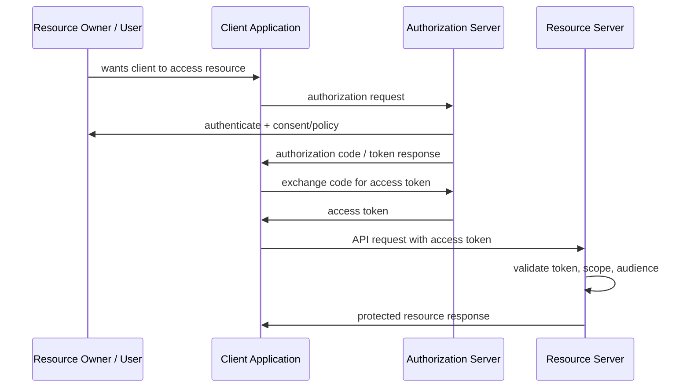
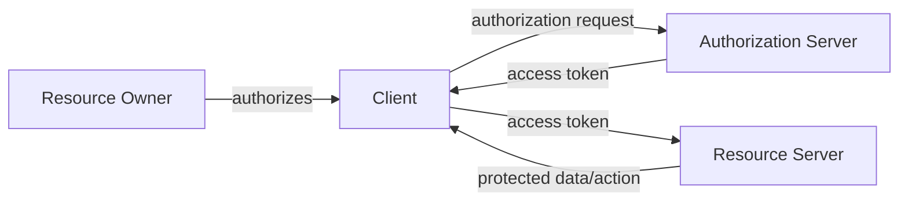
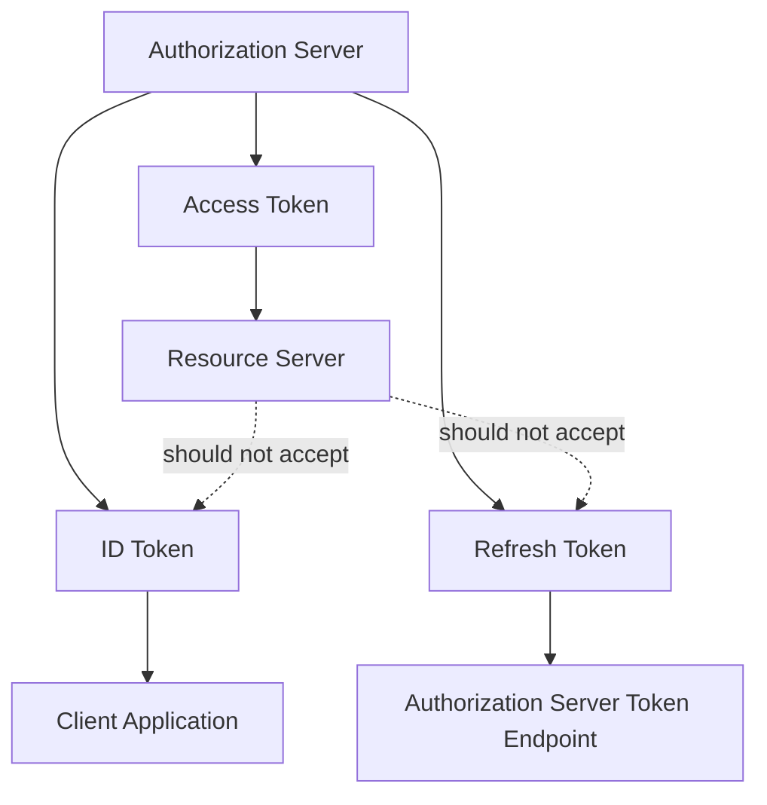
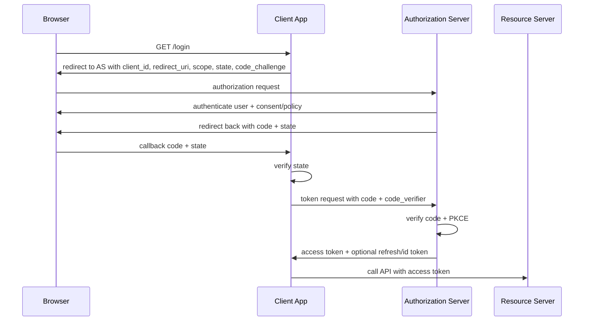
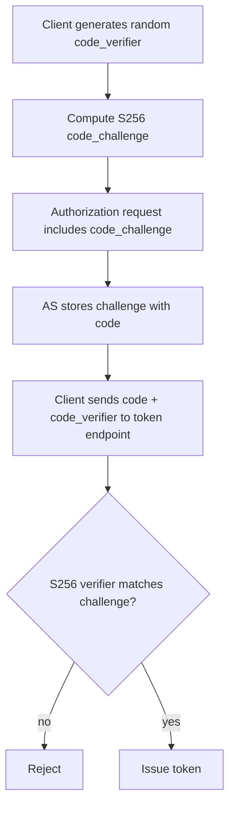
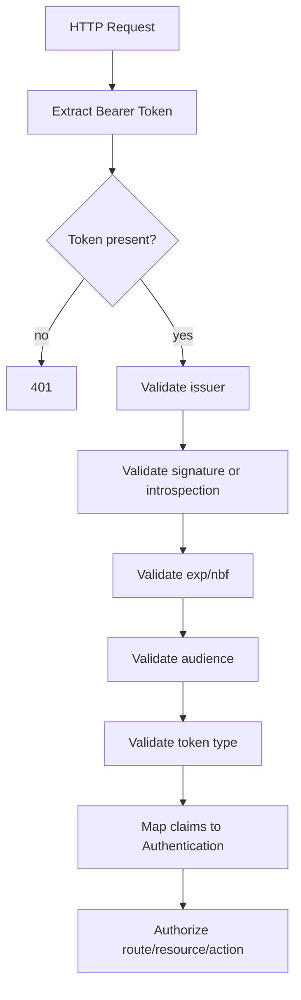
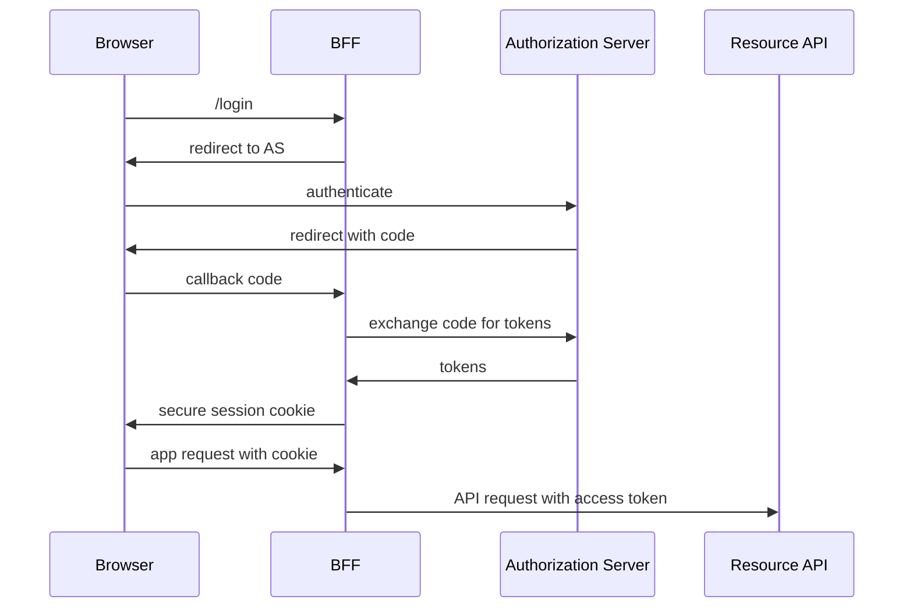

# Part 022 — OAuth 2.x Mental Model

> Target part ini: memahami OAuth 2.x sebagai **delegated authorization framework** yang sering dipakai di sistem autentikasi modern, tetapi bukan protokol autentikasi pengguna secara langsung. Kita akan membangun mental model actor, token, grant, scope, audience, client type, redirect, PKCE, resource server, authorization server, dan bagaimana Java application memakai OAuth tanpa mencampuradukkan authentication dan authorization.

OAuth sering disalahpahami.

Banyak engineer berkata:

```txt
We use OAuth for login.
```

Kalimat itu kurang presisi.
OAuth sendiri bukan protokol login.
OAuth adalah framework untuk memberikan **limited access** kepada client terhadap protected resource.

Untuk login, biasanya yang dipakai adalah OpenID Connect di atas OAuth.

Mental model yang benar:

```txt
OAuth 2.x:
  delegated authorization

OpenID Connect:
  authentication layer on top of OAuth 2.0
```

Kenapa ini penting?

Karena banyak vulnerability OAuth/OIDC terjadi ketika tim memperlakukan access token, ID token, session, consent, scope, dan user authentication sebagai benda yang sama.

---

## 1. Core Problem OAuth Solves

Tanpa OAuth, aplikasi pihak ketiga sering meminta password user untuk mengakses resource.

```txt
Bad old model:
  User gives password to third-party app.
  Third-party app uses password to access resource server.
```

Problem:

- third-party app melihat credential user;
- akses terlalu luas;
- sulit mencabut akses satu aplikasi;
- password reuse membuat blast radius besar;
- resource server tidak tahu delegasi mana yang sah.

OAuth memperkenalkan token terbatas.

```txt
Better model:
  User authenticates at authorization server.
  User/client receives consent or policy approval.
  Client receives access token.
  Client uses access token to call resource server.
```



OAuth’s real question:

```txt
May this client access this resource with this limited permission,
possibly on behalf of this resource owner?
```

It is not simply:

```txt
Who is the user?
```

That is OIDC territory.

---

## 2. OAuth Actors

OAuth has four conceptual roles.

```txt
Resource Owner
  entity capable of granting access to protected resource;
  often an end user, but can also be an organization/system owner.

Client
  application requesting access to protected resource.

Authorization Server
  system that authenticates resource owner/client and issues tokens.

Resource Server
  API/server hosting protected resources and validating access tokens.
```



In Java systems:

```txt
Spring MVC app with login button:
  OAuth client / OIDC relying party

Spring Boot API validating JWT:
  Resource server

Keycloak/Auth0/Okta/custom AS:
  Authorization server

User:
  Resource owner / authenticated subject
```

Do not blur these roles.
A system can play multiple roles, but each request path should have a clear role.

---

## 3. OAuth Is Often Adjacent to Authentication

OAuth flows require some authentication somewhere:

```txt
Authorization server authenticates user.
Authorization server may authenticate client.
Resource server authenticates token.
Client may create its own local session after OIDC login.
```

But OAuth access token validation by resource server is not the same as user login.

Example:

```txt
access_token.sub = user-123
```

This does not automatically mean:

```txt
User just logged in to this application.
User is present now.
User consented to this exact UI action.
Token is intended for this API.
Token came from this client.
```

That is why audience, issuer, expiry, client, scope, token type, nonce, state, and session binding matter.

---

## 4. Tokens: Access Token, Refresh Token, ID Token

OAuth/OIDC commonly has three token categories.

### 4.1 Access Token

Used by client to access resource server.

```txt
Audience: resource server / API
Consumer: resource server
Purpose: API authorization
Format: JWT or opaque
```

Resource server validates:

```txt
issuer
audience
expiry
signature/introspection
scope/permission
client/user context
binding where applicable
```

### 4.2 Refresh Token

Used by client to obtain new access tokens.

```txt
Audience: authorization server
Consumer: authorization server
Purpose: long-lived delegation renewal
Format: usually opaque
```

Resource server should not accept refresh tokens.

### 4.3 ID Token

OIDC token that asserts authentication information about the user.

```txt
Audience: OAuth/OIDC client
Consumer: client application
Purpose: login/authentication assertion
Format: JWT
```

Resource server should generally not accept ID tokens as API access tokens.



Critical invariant:

```txt
A token must be consumed only by its intended audience for its intended purpose.
```

---

## 5. Grant Types: Not All Flows Are Equal

A grant type is the way the client obtains tokens.

Common modern grants:

```txt
Authorization Code with PKCE
  interactive user login/authorization for web, SPA, mobile, BFF.

Client Credentials
  machine-to-machine client authentication and authorization.

Refresh Token
  renew access without repeating full interaction.

Device Authorization Grant
  input-constrained devices.
```

Legacy/problematic grants:

```txt
Implicit Grant
  historically used for browser apps; now discouraged/replaced by code + PKCE.

Resource Owner Password Credentials
  client collects user password; strongly discouraged for modern third-party flows.
```

OAuth 2.1 direction and OAuth Security BCP consolidate modern guidance: authorization code with PKCE, exact redirect URI matching, avoiding implicit grant, and avoiding password grant for normal modern clients.

---

## 6. Authorization Code Flow Mental Model

Authorization code flow separates browser front-channel from token back-channel.



Security purpose of important parameters:

| Parameter | Purpose |
|---|---|
| `client_id` | identifies OAuth client |
| `redirect_uri` | tells AS where to return authorization response |
| `scope` | requested permission/delegation |
| `state` | CSRF/session binding for OAuth redirect |
| `code_challenge` | PKCE proof derived from verifier |
| `code_verifier` | secret sent only to token endpoint |
| `nonce` | OIDC replay/session binding for ID token |
| `audience/resource` | intended API/resource server where supported |

The authorization code is not the final credential.
It is a short-lived intermediate artifact.

---

## 7. PKCE: Why It Exists

PKCE protects the authorization code from interception.

Without PKCE:

```txt
attacker steals authorization code
attacker exchanges code for token
```

With PKCE:

```txt
client creates code_verifier
client sends code_challenge in authorization request
AS binds code to challenge
client later sends code_verifier
AS verifies it matches challenge
stolen code alone is insufficient
```



Production invariant:

```txt
Authorization code flow should use PKCE for all OAuth clients.
```

Do not treat PKCE as “only for mobile”.
Modern guidance pushes it broadly because interception and mix-up risks are not limited to public clients.

---

## 8. Client Types: Public vs Confidential

OAuth client type describes whether the client can keep credentials secret.

```txt
Confidential client:
  backend server can store client secret/private key safely.

Public client:
  SPA/mobile/native app cannot reliably keep a static secret.
```

Examples:

| Client | Type | Notes |
|---|---|---|
| Server-rendered Spring MVC app | confidential | secret stored server-side |
| Backend-for-Frontend | confidential | browser sees only session cookie |
| SPA in browser | public | no static client secret |
| Native mobile app | public | can use platform keystore but not global static secret |
| CLI app | public/confidential depending deployment | often public unless managed environment |
| Batch service | confidential | can use client credentials/private_key_jwt/mTLS |

Do not put client secrets in SPA bundles.
That is not a secret.

---

## 9. Scope, Audience, Permission, Role

Teams often overload `scope`.

Mental model:

```txt
scope:
  what delegated access was granted to the client

audience:
  which resource server the token is intended for

role:
  business/application grouping; may be user role, client role, or tenant role

permission:
  concrete allowed operation/resource action
```

Bad token:

```json
{
  "sub": "user-123",
  "scope": "admin",
  "aud": "everything"
}
```

Better token:

```json
{
  "iss": "https://auth.example.com",
  "sub": "user-123",
  "aud": "payments-api",
  "azp": "billing-ui",
  "scope": "payment:read payment:capture",
  "tenant_id": "tenant-789",
  "exp": 1783100000
}
```

Even better for complex systems:

```txt
Use token claims for coarse delegated context.
Resolve fine-grained authorization in resource server/policy engine.
```

Do not put every authorization rule into token claims.
Long-lived tokens with embedded privileges cause privilege drift.

---

## 10. Resource Server Mental Model

A Java API acting as resource server should validate the access token and then authorize.



Resource server must not simply decode JWT.

Bad:

```java
String payload = new String(Base64.getUrlDecoder().decode(jwt.split("\\.")[1]));
// trust payload
```

Correct:

```txt
parse + verify signature + validate issuer + validate audience + validate expiry + validate type + validate policy
```

---

## 11. Spring Security Resource Server Example

For JWT access tokens:

```java
import org.springframework.context.annotation.Bean;
import org.springframework.context.annotation.Configuration;
import org.springframework.security.config.annotation.web.builders.HttpSecurity;
import org.springframework.security.oauth2.jwt.Jwt;
import org.springframework.security.oauth2.jwt.JwtDecoder;
import org.springframework.security.oauth2.jwt.JwtDecoders;
import org.springframework.security.oauth2.jwt.JwtValidators;
import org.springframework.security.oauth2.jwt.NimbusJwtDecoder;
import org.springframework.security.oauth2.core.DelegatingOAuth2TokenValidator;
import org.springframework.security.oauth2.core.OAuth2TokenValidator;
import org.springframework.security.oauth2.jwt.JwtClaimValidator;
import org.springframework.security.web.SecurityFilterChain;

import java.util.List;

@Configuration
class ResourceServerSecurityConfig {

    @Bean
    SecurityFilterChain api(HttpSecurity http) throws Exception {
        http
            .authorizeHttpRequests(auth -> auth
                .requestMatchers("/health").permitAll()
                .requestMatchers("/payments/**").hasAuthority("SCOPE_payment:read")
                .anyRequest().authenticated()
            )
            .oauth2ResourceServer(oauth2 -> oauth2.jwt());

        return http.build();
    }

    @Bean
    JwtDecoder jwtDecoder() {
        String issuer = "https://auth.example.com/realms/prod";
        NimbusJwtDecoder decoder = JwtDecoders.fromIssuerLocation(issuer);

        OAuth2TokenValidator<Jwt> issuerAndTimestamp = JwtValidators.createDefaultWithIssuer(issuer);
        OAuth2TokenValidator<Jwt> audience = new JwtClaimValidator<List<String>>(
            "aud",
            aud -> aud != null && aud.contains("payments-api")
        );

        decoder.setJwtValidator(new DelegatingOAuth2TokenValidator<>(issuerAndTimestamp, audience));
        return decoder;
    }
}
```

Key points:

```txt
Do not only configure issuer and forget audience.
Do not map all claims to authorities automatically.
Do not accept ID tokens as access tokens.
```

---

## 12. OAuth Login Client in Spring

A Spring application that lets users log in with OIDC often uses OAuth2 Login.

```java
import org.springframework.context.annotation.Bean;
import org.springframework.context.annotation.Configuration;
import org.springframework.security.config.annotation.web.builders.HttpSecurity;
import org.springframework.security.web.SecurityFilterChain;

@Configuration
class WebLoginSecurityConfig {

    @Bean
    SecurityFilterChain web(HttpSecurity http) throws Exception {
        http
            .authorizeHttpRequests(auth -> auth
                .requestMatchers("/", "/assets/**").permitAll()
                .anyRequest().authenticated()
            )
            .oauth2Login(oauth2 -> oauth2
                .loginPage("/login")
            );

        return http.build();
    }
}
```

This app is acting as:

```txt
OAuth client
OIDC relying party
local session issuer
```

After successful OIDC login, the app typically creates a local session.
The user does not send ID token on every server-rendered page request.
The browser sends a session cookie.

---

## 13. BFF Pattern: Browser Session + Backend Token Handling

For browser apps, a Backend-for-Frontend can reduce token exposure.



In this pattern:

```txt
Browser stores session cookie.
BFF stores tokens server-side.
APIs receive access tokens from BFF.
```

Benefits:

- access token not exposed to browser JavaScript;
- refresh token not stored in localStorage;
- browser security uses cookie/session controls;
- token handling centralized.

Trade-off:

- BFF must manage sessions and token refresh securely;
- BFF becomes a critical component;
- CSRF/cookie security still matters.

---

## 14. Authorization Server vs Identity Provider

People often say IdP when they mean Authorization Server.

A practical distinction:

```txt
Identity Provider:
  authenticates users and manages identity data.

Authorization Server:
  issues OAuth tokens based on grant, client, user, consent, and policy.
```

In many products, the same system is both.

Examples:

```txt
Keycloak realm:
  acts as IdP, authorization server, OIDC provider, SAML IdP, user federation broker.

Corporate IdP:
  may authenticate users via SAML/OIDC and be federated into another AS.
```

Design warning:

```txt
Do not assume one global IdP means one global authorization policy.
```

Resource-specific access still belongs near the resource server or a policy service.

---

## 15. OAuth Is Not a Permission Database

OAuth tokens carry authorization information.
They are not your whole permission system.

For small systems, scopes may be enough:

```txt
invoice:read
invoice:write
```

For complex enterprise systems, authorization also needs:

```txt
tenant
resource ownership
case state
delegation chain
separation of duties
risk level
time window
approval status
regulatory constraint
```

Token claims should be stable enough for token lifetime.

Bad:

```txt
Put every case assignment and regulatory exception into 30-minute JWT.
```

Better:

```txt
Token identifies subject/client/tenant/scope.
Resource server loads fresh authorization facts for high-risk decisions.
```

---

## 16. Common OAuth Misuse in Authentication Systems

### 16.1 Using Access Token as Login Proof Without OIDC Validation

Symptom:

```txt
Client sends access token to app.
App decodes sub and logs user in.
```

Problem:

```txt
Access token audience may be API, not client app.
Token may not prove interactive authentication for this client.
```

Fix:

```txt
Use OIDC authorization code flow.
Validate ID token nonce/audience/issuer.
Create local session intentionally.
```

### 16.2 Accepting ID Token at Resource Server

Symptom:

```txt
API accepts Authorization: Bearer <id_token>
```

Problem:

```txt
ID token audience is client, not API.
```

Fix:

```txt
Resource server accepts access tokens only.
Validate audience/token type.
```

### 16.3 Missing Audience Validation

Symptom:

```txt
Token issued for profile-api works against payments-api.
```

Root cause:

```txt
Resource server validates signature/issuer but not aud.
```

Fix:

```txt
Require resource-specific audience.
```

### 16.4 Scope Used as Role Without Context

Symptom:

```txt
scope=admin grants admin everywhere.
```

Fix:

```txt
Use scoped, resource-specific permissions and tenant context.
```

### 16.5 Client Secret in SPA

Symptom:

```txt
SPA bundle contains client_secret.
```

Fix:

```txt
Treat SPA as public client. Use authorization code + PKCE or BFF.
```

### 16.6 Redirect URI Wildcards

Symptom:

```txt
https://*.example.com/callback allowed.
```

Problem:

```txt
Subdomain takeover/open redirect can steal codes.
```

Fix:

```txt
Exact redirect URI matching.
```

### 16.7 Reusing One Client for All Applications

Symptom:

```txt
All apps share same client_id and secret.
```

Problem:

```txt
No blast-radius isolation, weak audit, impossible targeted revocation.
```

Fix:

```txt
One OAuth client per deployable/application/environment where operationally meaningful.
```

---

## 17. OAuth Threat Model Summary

Important OAuth threats:

```txt
authorization code interception
CSRF on callback
redirect URI manipulation
mix-up attack
open redirect exploitation
token substitution
token replay
audience confusion
issuer confusion
client impersonation
refresh token theft
scope escalation
consent phishing
front-channel leakage
```

Mapping to mitigations:

| Threat | Mitigation |
|---|---|
| code interception | PKCE |
| callback CSRF | state bound to local session |
| ID token replay | nonce |
| token replay | short expiry, sender-constrained tokens, mTLS/DPoP where appropriate |
| audience confusion | strict `aud` validation |
| issuer confusion | strict issuer allowlist and discovery per issuer |
| redirect abuse | exact redirect URI matching |
| refresh token theft | rotation/reuse detection/sender constraint |
| client impersonation | confidential client auth, private_key_jwt, mTLS |
| mix-up | issuer validation, AS-specific redirect handling, state/issuer checks |

---

## 18. Java Resource Server Design Invariants

For any Java resource server:

```txt
[ ] Token must be extracted only from expected location.
[ ] Bearer token must not be logged.
[ ] Issuer must be validated.
[ ] Signature or introspection result must be trusted.
[ ] Expiry and not-before must be enforced.
[ ] Audience must match this API.
[ ] Token type/purpose must be correct.
[ ] Scope/permission must be checked at route/resource level.
[ ] Tenant claim must match route/body/resource tenant where applicable.
[ ] User/client identity must be mapped to internal subject carefully.
[ ] Authorization failure must not become authentication success.
[ ] JWKS cache and key rotation must be handled.
```

---

## 19. Opaque Token vs JWT Access Token

JWT access token:

```txt
Resource server validates locally using JWKS.
Fast, decentralized, but revocation/privilege drift is harder.
```

Opaque token:

```txt
Resource server introspects with authorization server.
Centralized, easier revocation, but adds network dependency/latency.
```

Decision matrix:

| Need | Better fit |
|---|---|
| high throughput internal APIs | JWT with short expiry |
| immediate revocation | opaque/introspection or short JWT + deny-list |
| sensitive partner APIs | opaque or sender-constrained JWT |
| many resource servers | JWT with strong audience discipline |
| rapidly changing permissions | opaque or policy lookup at resource server |

Do not pick JWT just because it looks modern.
Pick token format based on operational requirements.

---

## 20. OAuth Client Registration Model

A production authorization server needs explicit client records.

```sql
create table oauth_client (
    client_id text primary key,
    client_name text not null,
    client_type text not null check (client_type in ('PUBLIC', 'CONFIDENTIAL')),
    status text not null check (status in ('ACTIVE', 'SUSPENDED', 'REVOKED')),
    owner_team text,
    created_at timestamptz not null default now(),
    updated_at timestamptz not null default now()
);

create table oauth_client_redirect_uri (
    client_id text not null references oauth_client(client_id),
    redirect_uri text not null,
    primary key (client_id, redirect_uri)
);

create table oauth_client_grant (
    client_id text not null references oauth_client(client_id),
    grant_type text not null,
    primary key (client_id, grant_type)
);

create table oauth_client_scope (
    client_id text not null references oauth_client(client_id),
    scope text not null,
    primary key (client_id, scope)
);
```

Client registration is security policy.
Do not let it become an unreviewed admin form.

---

## 21. OAuth Debugging Checklist

When OAuth breaks, identify the failing boundary.

```txt
Authorization request:
  wrong client_id?
  redirect_uri mismatch?
  missing PKCE?
  invalid scope?
  wrong realm/issuer?

Callback:
  missing/invalid state?
  open redirect issue?
  code already used?
  callback path blocked by security filter?

Token exchange:
  wrong client authentication?
  code_verifier mismatch?
  clock skew?
  token endpoint unreachable?

Resource server:
  JWKS fetch failure?
  unknown kid?
  issuer mismatch?
  audience mismatch?
  scope mapping mismatch?
  token expired?

Application authz:
  scope present but internal permission denied?
  tenant mismatch?
  stale local session?
```

OAuth failures are easier to debug when you separate:

```txt
protocol failure
  from
token validation failure
  from
application authorization failure
```

---

## 22. Observability

Emit structured events for:

```txt
authorization request started
authorization callback received
state mismatch
PKCE failure
token exchange success/failure
JWKS key refresh
JWT validation failure by reason
introspection failure
refresh token rotation
refresh token reuse detected
resource server authorization denied
```

Metrics:

```txt
oauth_authorization_start_total{client_id,issuer}
oauth_callback_total{outcome,reason,client_id}
oauth_token_exchange_total{outcome,reason,client_id}
oauth_jwt_validation_total{outcome,reason,issuer,audience}
oauth_jwks_refresh_total{outcome,issuer}
oauth_introspection_latency_seconds{issuer}
oauth_refresh_reuse_detected_total{client_id}
```

Do not log:

```txt
authorization code
access token
refresh token
ID token
client secret
full callback URL if it contains code/state
```

---

## 23. Production Checklist

```txt
[ ] Authorization code flow uses PKCE.
[ ] Redirect URIs use exact matching.
[ ] State is generated per authorization attempt and bound to local session.
[ ] OIDC nonce is used and validated for login flows.
[ ] Resource servers validate issuer and audience.
[ ] Resource servers do not accept ID tokens as access tokens.
[ ] Clients do not store secrets in browser/mobile static bundles.
[ ] Refresh tokens use rotation/reuse detection or sender constraint where required.
[ ] Access tokens are short-lived enough for risk profile.
[ ] Token storage matches client type.
[ ] Scope design is resource-specific and not a global admin shortcut.
[ ] Tenant context is validated against resource/request.
[ ] JWKS rotation is tested.
[ ] OAuth/OIDC error responses do not leak tokens/secrets.
[ ] Logs redact code/token/client secret.
[ ] Each app/environment has separate OAuth client where appropriate.
```

---

## 24. Design Drill

Given:

```txt
A Java platform has:
- server-rendered admin portal
- Vue SPA customer portal
- mobile app
- internal microservices
- public partner API
- Keycloak as IdP/AS
```

Design OAuth/OIDC roles.

A strong answer:

```txt
Admin portal:
  confidential OIDC client using authorization code + PKCE, local server session.

Vue SPA:
  public client using authorization code + PKCE, or preferably BFF with server-side tokens.

Mobile app:
  public native client using authorization code + PKCE and platform-secure token storage.

Internal microservices:
  resource servers validating access tokens; service-to-service may use client credentials plus mTLS.

Partner API:
  resource server requiring audience=partner-api; partner clients use client credentials/private_key_jwt/mTLS; possibly certificate-bound tokens.

Keycloak:
  authorization server and identity provider; realm/client separation per environment/tenant strategy.
```

Then specify:

- issuer per environment/realm;
- audience per API;
- scope naming convention;
- token lifetime;
- refresh token policy;
- JWKS rotation handling;
- error/audit telemetry;
- migration plan away from implicit/password grants if present.

---

## 25. Key Takeaways

OAuth is not “login”.
OAuth is delegated authorization.

Authentication systems use OAuth because OAuth flows sit near login, token issuance, client identity, and resource access.
But the implementation must preserve the distinction:

```txt
ID token -> client login assertion
access token -> resource server API authorization
refresh token -> authorization server renewal credential
session cookie -> local browser session
```

The most important invariant:

```txt
Every token must be validated by the right party, for the right audience, for the right purpose.
```

Once that mental model is clear, Spring Security, Keycloak, OIDC, JWT validation, resource server configuration, and BFF design become coherent instead of magical.

---

## References

- RFC 6749 — The OAuth 2.0 Authorization Framework.
- RFC 6750 — OAuth 2.0 Bearer Token Usage.
- RFC 7636 — Proof Key for Code Exchange by OAuth Public Clients.
- RFC 9700 — Best Current Practice for OAuth 2.0 Security.
- OAuth 2.1 draft — The OAuth 2.1 Authorization Framework.
- OpenID Connect Core 1.0 — Authentication layer on top of OAuth 2.0.
- Spring Security Reference — OAuth2 Client, OAuth2 Login, and Resource Server.
- OWASP OAuth Security Cheat Sheet.
- OWASP API Security Top 10 — Broken Authentication.
- Keycloak Server Administration Guide — OIDC clients, realms, flows, and token settings.
