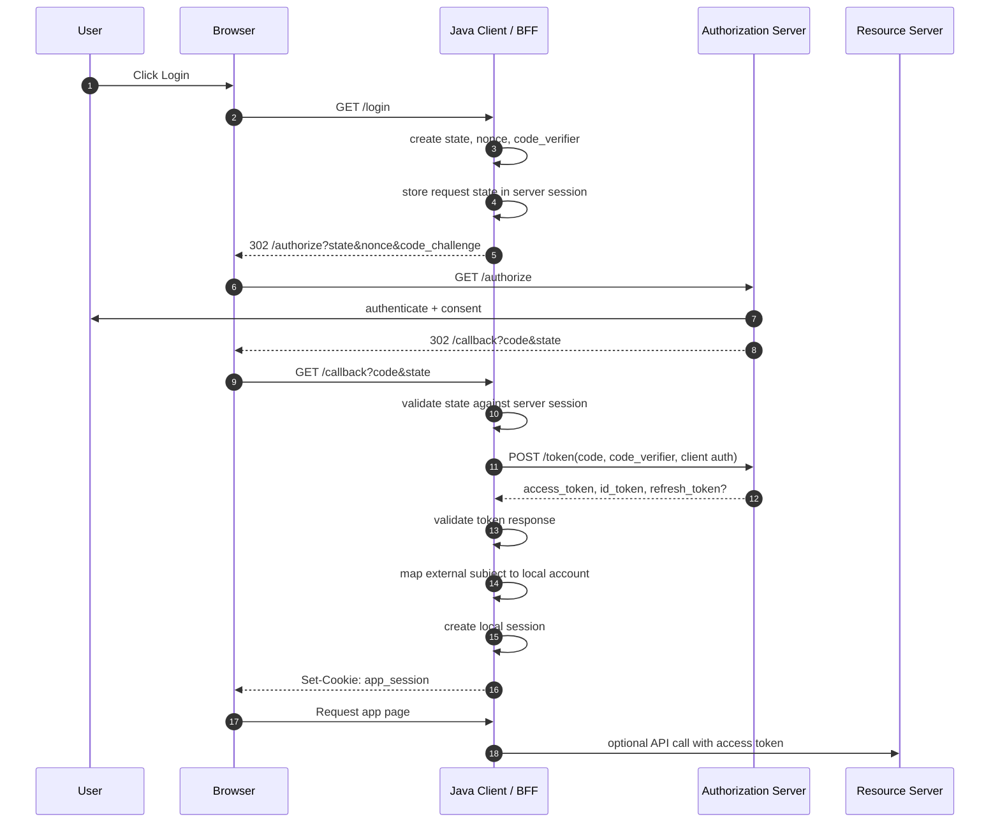
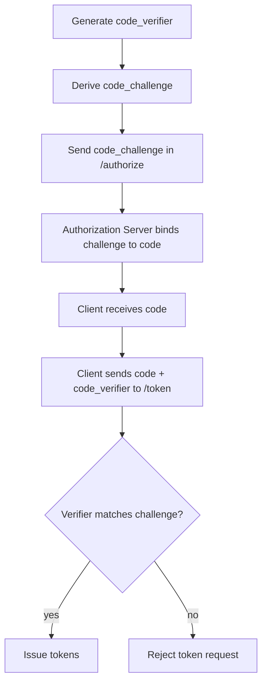
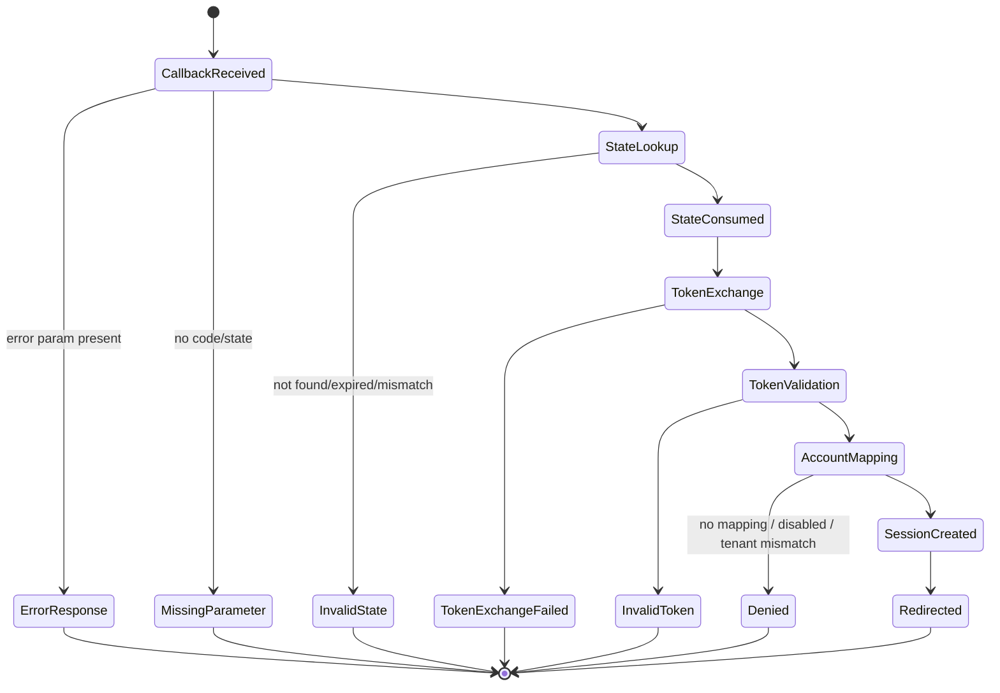
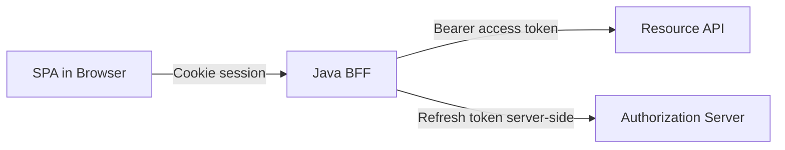
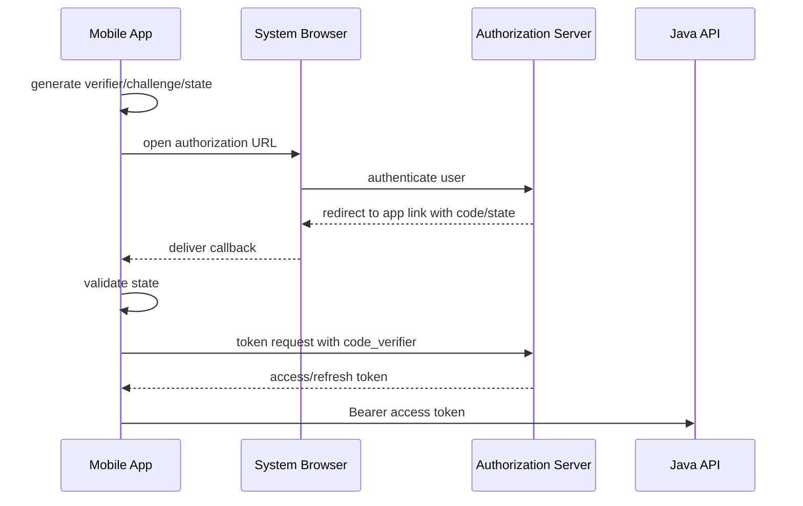

# Part 023 — Authorization Code + PKCE

> Target part ini: memahami dan mengimplementasikan Authorization Code Flow + PKCE secara production-grade untuk Java application: traditional server-side web app, SPA dengan BFF, mobile app, dan backend callback handler. Fokusnya bukan hanya “redirect ke IdP lalu dapat token”, tetapi menjaga binding antara browser session, authorization request, authorization response, token exchange, dan local application session.

Authorization Code + PKCE adalah flow modern yang paling penting untuk aplikasi yang melibatkan user.

Mental model sederhananya:

```txt
User authenticates at Authorization Server.
Client receives a short-lived authorization code.
Client exchanges code for tokens.
PKCE proves that the token exchanger is the same party that started the flow.
```

Authorization code bukan token akses.
Authorization code adalah **one-time intermediate credential**.
PKCE membuat code tersebut tidak berguna bagi attacker yang tidak memiliki `code_verifier`.

---

## 1. Problem yang Diselesaikan

Tanpa authorization code flow, aplikasi sering tergoda menyimpan credential user atau menerima token langsung di browser.
Itu memperbesar risiko:

- password user masuk ke aplikasi pihak ketiga;
- access token bocor di URL fragment, log, history, extension, atau JavaScript runtime;
- attacker menginject authorization code milik victim ke session attacker;
- redirect URI dipakai sebagai open redirect;
- CSRF menyebabkan user login sebagai account yang salah;
- SPA menyimpan refresh token long-lived di browser;
- backend membuat session tanpa memvalidasi state, nonce, issuer, audience, dan PKCE binding.

Authorization Code + PKCE memecah masalah menjadi beberapa boundary:

```txt
Browser boundary:
  user-agent membawa redirect dan cookie session

Authorization Server boundary:
  autentikasi user dan consent

Client callback boundary:
  validasi state dan tukar code

Token boundary:
  validasi token response dan buat local session
```

Invariant utama:

```txt
No local authenticated session may be created unless:
  authorization response is bound to local auth request,
  code exchange succeeds with correct verifier,
  issuer/client/audience/token claims are valid,
  and local account mapping succeeds safely.
```

---

## 2. Actors

| Actor | Peran | Contoh |
|---|---|---|
| Resource Owner | User yang memberi izin | employee, customer |
| User-Agent | Browser/mobile webview/system browser | Chrome, Safari, Android Custom Tab |
| Client | Aplikasi yang meminta token | Java web app, BFF, mobile app |
| Authorization Server | Penerbit code/token | Keycloak, Okta, Auth0, Entra ID, Spring Authorization Server |
| Resource Server | API yang menerima access token | Java REST API |
| Relying Party / OIDC Client | Client yang memakai OIDC untuk login | aplikasi internal perusahaan |

Untuk login modern, biasanya flow OAuth dipakai bersama OIDC.
OAuth memberi authorization framework.
OIDC memberi identity layer melalui ID token dan UserInfo.

---

## 3. Flow Besar



Yang penting: browser tidak perlu melihat token jika kita memakai server-side web app atau BFF.
Browser cukup memegang cookie aplikasi.

---

## 4. PKCE Mental Model

PKCE memakai dua nilai:

```txt
code_verifier  = high-entropy random secret generated by client
code_challenge = BASE64URL(SHA256(code_verifier))
```

Client mengirim `code_challenge` saat authorization request.
Client menyimpan `code_verifier` secara aman di state lokal.
Saat token exchange, client mengirim `code_verifier`.
Authorization server mengecek bahwa:

```txt
BASE64URL(SHA256(code_verifier)) == code_challenge previously attached to authorization code
```

Jika attacker mencuri authorization code tapi tidak tahu `code_verifier`, token exchange gagal.



Production rule:

```txt
Use S256 only.
Do not use plain unless forced by a legacy provider.
```

---

## 5. Authorization Request Parameters

Typical authorization request:

```txt
GET /authorize?
  response_type=code&
  client_id=orders-bff&
  redirect_uri=https://app.example.com/login/oauth2/code/keycloak&
  scope=openid%20profile%20email&
  state=...&
  nonce=...&
  code_challenge=...&
  code_challenge_method=S256
```

| Parameter | Required? | Why it matters |
|---|---:|---|
| `response_type=code` | yes | selects authorization code flow |
| `client_id` | yes | identifies registered client |
| `redirect_uri` | yes/strongly expected | prevents callback confusion when exact registered |
| `scope` | yes | `openid` required for OIDC login |
| `state` | yes | binds response to local browser session |
| `nonce` | OIDC yes | binds ID token to auth request |
| `code_challenge` | yes in modern deployments | PKCE protection |
| `code_challenge_method=S256` | yes | avoids weak plain verifier |

Do not treat `state` as a random decorative field.
`state` is a transaction identifier.

Do not treat `nonce` as equivalent to `state`.
They bind different things:

```txt
state:
  authorization response -> local browser session/auth request

nonce:
  ID token -> authentication request

code_verifier:
  token exchange -> original authorization request
```

---

## 6. Local Authorization Request State

Pada server-side Java app atau BFF, simpan authorization request state di server-side session atau short-lived cache.

Minimal state:

```java
public record OAuthLoginRequestState(
    String state,
    String nonce,
    String codeVerifier,
    String provider,
    String tenantId,
    URI redirectAfterLogin,
    Instant createdAt,
    Instant expiresAt,
    String userAgentHash,
    String ipPrefixHash
) {}
```

Invariant:

```txt
state must be one-time use.
state must expire quickly.
state must be bound to the browser session.
state must not contain sensitive data unless encrypted and authenticated.
```

Bad pattern:

```txt
state = returnUrl
```

Better pattern:

```txt
state = random_transaction_id
server_store[state] = { returnUrl, nonce, code_verifier, tenant, expiry }
```

Why?
Because `returnUrl` can become an open redirect and can leak internal state.

---

## 7. Callback Handler Pipeline

Callback handler is a security boundary.

Pipeline:

```txt
1. Parse query parameters.
2. Reject OAuth error response safely.
3. Require code and state.
4. Load local request state.
5. Verify state exists, matches browser session, not expired, not used.
6. Mark state as consumed atomically.
7. Exchange code using code_verifier.
8. Validate token response.
9. Validate ID token if OIDC login.
10. Resolve external identity mapping.
11. Apply local account policy.
12. Create local session.
13. Redirect only to approved local URL.
```

Mermaid state machine:



Important rule:

```txt
Do not create any local session before token validation and account mapping complete.
```

---

## 8. Token Exchange

Token request for confidential web client:

```http
POST /token HTTP/1.1
Host: idp.example.com
Content-Type: application/x-www-form-urlencoded
Authorization: Basic base64(client_id:client_secret)

grant_type=authorization_code&
code=SplxlOBeZQQYbYS6WxSbIA&
redirect_uri=https%3A%2F%2Fapp.example.com%2Flogin%2Foauth2%2Fcode%2Fkeycloak&
code_verifier=dBjftJeZ4CVP-mB92K27uhbUJU1p1r_wW1gFWFOEjXk
```

For public clients, do not use client secret.
PKCE is mandatory in modern secure designs.

For confidential clients, keep using client authentication.
PKCE is not a replacement for client authentication.

```txt
confidential client:
  client authentication + PKCE

public client:
  PKCE + exact redirect URI + platform protections
```

---

## 9. Token Response Validation

Typical token response:

```json
{
  "access_token": "...",
  "token_type": "Bearer",
  "expires_in": 300,
  "refresh_token": "...",
  "id_token": "..."
}
```

Validation checklist:

| Item | Check |
|---|---|
| HTTP status | must be 200 for success |
| TLS | token endpoint must use HTTPS |
| `token_type` | expected `Bearer` unless sender-constrained |
| access token | stored according to app architecture |
| ID token | validate if OIDC login |
| refresh token | store server-side only for BFF/web app |
| error body | do not leak to user |
| logging | never log token values |

For OIDC, ID token validation must check at least:

```txt
iss       expected issuer
sub       stable subject identifier
aud       contains client_id
azp       authorized party when required
exp       not expired
iat       reasonable freshness
nonce     equals original nonce
signature valid via trusted JWK
alg       allowlisted algorithm
kid       resolved from trusted JWKS
```

---

## 10. Spring Security: OAuth2 Login

For a server-side Java web app, Spring Security can handle most Authorization Code + OIDC login mechanics.

Typical Boot configuration:

```yaml
spring:
  security:
    oauth2:
      client:
        registration:
          keycloak:
            client-id: orders-bff
            client-secret: ${ORDERS_BFF_CLIENT_SECRET}
            authorization-grant-type: authorization_code
            redirect-uri: "{baseUrl}/login/oauth2/code/{registrationId}"
            scope:
              - openid
              - profile
              - email
        provider:
          keycloak:
            issuer-uri: https://idp.example.com/realms/acme
```

Security config:

```java
@Configuration
@EnableWebSecurity
class SecurityConfig {

    @Bean
    SecurityFilterChain security(HttpSecurity http) throws Exception {
        return http
            .authorizeHttpRequests(auth -> auth
                .requestMatchers("/", "/error", "/assets/**").permitAll()
                .anyRequest().authenticated()
            )
            .oauth2Login(oauth -> oauth
                .loginPage("/oauth2/authorization/keycloak")
                .userInfoEndpoint(userInfo -> userInfo
                    .oidcUserService(oidcUserService())
                )
            )
            .logout(logout -> logout
                .logoutUrl("/logout")
                .deleteCookies("SESSION")
                .invalidateHttpSession(true)
                .clearAuthentication(true)
            )
            .build();
    }

    @Bean
    OAuth2UserService<OidcUserRequest, OidcUser> oidcUserService() {
        OidcUserService delegate = new OidcUserService();
        return request -> {
            OidcUser oidcUser = delegate.loadUser(request);

            String issuer = oidcUser.getIssuer().toString();
            String subject = oidcUser.getSubject();

            LocalAccount account = resolveAndValidateLocalAccount(issuer, subject, oidcUser);

            Collection<GrantedAuthority> authorities = account.authorities();
            return new DefaultOidcUser(authorities, oidcUser.getIdToken(), oidcUser.getUserInfo());
        };
    }

    private LocalAccount resolveAndValidateLocalAccount(
        String issuer,
        String subject,
        OidcUser oidcUser
    ) {
        // Lookup by external identity, not by mutable email alone.
        throw new UnsupportedOperationException("implement account mapping");
    }
}
```

Critical point:

```txt
Use issuer + subject as external identity key.
Do not use email as primary identity key unless your IdP contract guarantees it strongly.
```

Email can change.
Email can be unverified.
Email can be recycled.
Federated identity needs stable subject mapping.

---

## 11. Spring Security: Custom Success Handler

Often you need custom post-login logic:

- tenant selection;
- account provisioning;
- terms acceptance;
- risk step-up;
- redirect normalization;
- audit event;
- local session version stamping.

Example:

```java
@Component
final class ProductionOAuthSuccessHandler implements AuthenticationSuccessHandler {

    private final RedirectStrategy redirects = new DefaultRedirectStrategy();
    private final AuditSink auditSink;
    private final SessionRegistry sessionRegistry;

    ProductionOAuthSuccessHandler(AuditSink auditSink, SessionRegistry sessionRegistry) {
        this.auditSink = auditSink;
        this.sessionRegistry = sessionRegistry;
    }

    @Override
    public void onAuthenticationSuccess(
        HttpServletRequest request,
        HttpServletResponse response,
        Authentication authentication
    ) throws IOException {
        OidcUser user = (OidcUser) authentication.getPrincipal();

        String issuer = user.getIssuer().toString();
        String subject = user.getSubject();

        request.changeSessionId();

        sessionRegistry.bind(
            request.getSession().getId(),
            issuer,
            subject,
            Instant.now()
        );

        auditSink.record(AuthenticationEvent.oauthLoginSucceeded(
            issuer,
            subject,
            request.getRemoteAddr(),
            request.getHeader("User-Agent")
        ));

        redirects.sendRedirect(request, response, safeRedirect(request));
    }

    private String safeRedirect(HttpServletRequest request) {
        Object target = request.getSession().getAttribute("POST_LOGIN_REDIRECT");
        if (target instanceof String path && path.startsWith("/") && !path.startsWith("//")) {
            return path;
        }
        return "/app";
    }
}
```

Do not redirect to arbitrary user-controlled URLs after login.

---

## 12. Backend-for-Frontend Pattern

For SPA, the safest production pattern is often BFF:

```txt
Browser SPA <-> BFF with secure cookie <-> APIs with access token
```

Browser receives app session cookie, not OAuth access token.
BFF stores tokens server-side.
BFF calls APIs.



Benefits:

- reduces token exposure to JavaScript;
- allows server-side refresh token rotation;
- centralizes CSRF/CORS/cookie controls;
- simplifies API audience and token relay;
- allows backend risk scoring and session revocation.

Trade-off:

- BFF becomes a critical security component;
- scaling requires session/token storage design;
- CSRF protection still matters;
- BFF must not become a confused deputy.

---

## 13. SPA Without BFF

Sometimes you cannot use BFF.
A public SPA may run Authorization Code + PKCE directly.

Constraints:

```txt
No client secret.
Use Authorization Code + PKCE.
Use exact redirect URIs.
Use short-lived access tokens.
Avoid long-lived refresh tokens in browser when possible.
Prefer refresh token rotation if refresh tokens are issued.
Store tokens carefully; no storage option is perfect.
```

Browser storage trade-off:

| Storage | Pros | Cons |
|---|---|---|
| memory only | less persistent theft | token lost on reload |
| sessionStorage | tab scoped | accessible to JS/XSS |
| localStorage | convenient | high XSS blast radius |
| cookie | browser-managed | CSRF risk if used automatically |

Strong stance:

```txt
For high-risk business applications, prefer BFF over browser-held refresh tokens.
```

---

## 14. Mobile App Pattern

Mobile public clients also use Authorization Code + PKCE.

Production rules:

- use system browser, not embedded webview;
- use claimed HTTPS redirect URI or platform app link when available;
- avoid custom scheme collision risks unless mitigated;
- store tokens in platform secure storage;
- use refresh token rotation or sender constraints when supported;
- bind session to device risk signals;
- support remote logout and token revocation.

Flow:



The Java backend still validates access token as resource server.
The mobile app is not a confidential client.

---

## 15. Redirect URI Discipline

Redirect URI is one of the most abused OAuth surfaces.

Rules:

```txt
Use exact redirect URI registration.
Avoid wildcard redirect URIs.
Avoid open redirect chains.
Do not use user-controlled host/path.
Normalize scheme/host/port carefully behind proxies.
```

Bad:

```txt
https://app.example.com/oauth/callback?next=https://evil.example
https://*.example.com/callback
https://app.example.com/redirect?target={anything}
```

Better:

```txt
https://app.example.com/login/oauth2/code/keycloak
https://tenant-a.example.com/login/oauth2/code/keycloak
```

For multi-tenant apps, do not simply allow arbitrary tenant subdomains.
Keep registered redirect URIs explicit or derive them from trusted tenant configuration.

---

## 16. State, Nonce, and CSRF

OAuth login CSRF can cause a user to be logged into the wrong account or bind the wrong external identity.

Example attack:

```txt
Attacker starts login with attacker's IdP account.
Attacker obtains callback URL with code/state.
Victim is tricked into visiting callback.
App completes login and victim browser is now linked to attacker identity.
```

Defense:

```txt
state generated by client.
state stored in victim browser session before redirect.
callback state must match session state.
state must be one-time use.
```

OIDC `nonce` helps bind ID token to the authentication request.
Do not rely on `nonce` alone for OAuth response CSRF if your client library expects `state`.

---

## 17. Account Mapping

External identity mapping is a domain problem.

Recommended table:

```sql
create table external_identity (
    id uuid primary key,
    tenant_id uuid not null,
    account_id uuid not null,
    provider text not null,
    issuer text not null,
    subject text not null,
    email text,
    email_verified boolean not null default false,
    created_at timestamptz not null,
    last_seen_at timestamptz,
    unique (issuer, subject),
    unique (tenant_id, provider, subject)
);
```

Usually better unique key:

```txt
(issuer, subject)
```

or for multi-tenant/federated configurations:

```txt
(tenant_id, issuer, subject)
```

Do not auto-link solely by email unless your risk model explicitly accepts account takeover by email collision/misconfiguration.

Mapping pipeline:

```txt
1. Extract issuer + subject.
2. Verify issuer is trusted for tenant/client.
3. Lookup external_identity.
4. If found, load account.
5. If not found, apply provisioning policy.
6. Check account status.
7. Check tenant membership.
8. Check risk and step-up requirement.
9. Create local session.
```

---

## 18. Just-in-Time Provisioning

JIT provisioning creates local account when external login succeeds.

Useful for enterprise SSO.
Dangerous if uncontrolled.

Policy questions:

| Question | Safe default |
|---|---|
| Who can be auto-provisioned? | only trusted issuer + tenant domain/group |
| Is email enough? | no, require verified email and issuer policy |
| What role is assigned? | minimal default role |
| Can admin roles be JIT assigned? | no, require explicit admin approval |
| Can disabled local accounts be recreated? | no |
| Is group claim trusted? | only from trusted issuer with mapping policy |

Example:

```java
public Account resolveOrProvision(OidcUser user, Tenant tenant) {
    ExternalSubject ext = new ExternalSubject(
        user.getIssuer().toString(),
        user.getSubject()
    );

    return externalIdentityRepository.findByTenantAndSubject(tenant.id(), ext)
        .map(identity -> accountRepository.requireActive(identity.accountId()))
        .orElseGet(() -> provisionIfAllowed(user, tenant));
}

private Account provisionIfAllowed(OidcUser user, Tenant tenant) {
    String email = user.getEmail();
    Boolean verified = user.getEmailVerified();

    if (!Boolean.TRUE.equals(verified)) {
        throw new AuthenticationDenied("unverified email");
    }

    if (!tenant.allowsDomain(email.substring(email.indexOf('@') + 1))) {
        throw new AuthenticationDenied("domain not allowed");
    }

    return accountProvisioningService.createMinimalAccount(
        tenant.id(),
        email,
        Set.of("USER")
    );
}
```

---

## 19. Token Storage in Server-Side App

Server-side web app/BFF can store token material server-side.

Options:

| Store | Fit | Risk |
|---|---|---|
| HTTP session | simple web app | memory/session replication concerns |
| Redis session | BFF / clustered app | Redis compromise exposes tokens |
| encrypted DB token store | long-lived integration | key management complexity |
| no token storage | login-only app | cannot call downstream APIs later |

If storing refresh token:

```txt
Encrypt at rest.
Restrict access at service boundary.
Rotate on use where provider supports it.
Never expose to browser.
Audit refresh attempts.
Delete on logout.
```

---

## 20. Spring Authorized Client Storage

Spring Security uses authorized client abstractions to associate OAuth tokens with a client and principal.

Conceptual pieces:

```txt
ClientRegistration:
  metadata about configured OAuth client

OAuth2AuthorizedClient:
  client registration + principal + access token + optional refresh token

OAuth2AuthorizedClientRepository / Service:
  persistence boundary for authorized client
```

Example WebClient:

```java
@Configuration
class OAuthClientConfig {

    @Bean
    WebClient apiWebClient(
        ClientRegistrationRepository registrations,
        OAuth2AuthorizedClientRepository clients
    ) {
        ServletOAuth2AuthorizedClientExchangeFilterFunction oauth =
            new ServletOAuth2AuthorizedClientExchangeFilterFunction(registrations, clients);

        oauth.setDefaultOAuth2AuthorizedClient(true);

        return WebClient.builder()
            .apply(oauth.oauth2Configuration())
            .baseUrl("https://api.example.com")
            .build();
    }
}
```

Do not let every controller freely relay every token to every downstream API.
Use explicit audience/scope routing.

---

## 21. BFF Token Relay Guard

A BFF can become a confused deputy.

Bad pattern:

```txt
Any browser request -> BFF forwards user's access token to arbitrary downstream service.
```

Better:

```txt
Route-specific downstream policy:
  route /orders/** may call orders-api with audience orders-api
  route /billing/** may call billing-api with audience billing-api
  route /admin/** requires step-up and admin role
```

Example policy:

```java
record DownstreamPolicy(
    String routePattern,
    String requiredAudience,
    Set<String> requiredScopes,
    boolean requiresStepUp
) {}
```

At call time:

```java
public Mono<ClientResponse> callOrders(ServerRequest request) {
    AuthenticatedSession session = requireSession(request);
    downstreamPolicy.enforce(session, "orders-api", Set.of("orders:read"));

    return tokenService.getToken(session, "orders-api", Set.of("orders:read"))
        .flatMap(token -> webClient.get()
            .uri("/orders")
            .headers(h -> h.setBearerAuth(token.value()))
            .exchangeToMono(Mono::just));
}
```

---

## 22. Error Handling

OAuth error response at callback:

```txt
/error?error=access_denied&error_description=...
```

Rules:

```txt
Do not show raw error_description to user.
Do not log full callback URL with code.
Do log provider, error code, correlation id.
Use generic user message.
Preserve security audit event.
```

Example:

```java
public void handleOAuthError(HttpServletRequest request, HttpServletResponse response) {
    String error = sanitize(request.getParameter("error"));
    audit.record("oauth_callback_error", Map.of(
        "provider", providerFromRequest(request),
        "error", error,
        "correlationId", correlationId(request)
    ));
    throw new BadCredentialsException("External sign-in failed");
}
```

---

## 23. Logging and Redaction

Never log:

- authorization code;
- access token;
- refresh token;
- ID token;
- full callback URL;
- `code_verifier`;
- client secret;
- raw `Authorization` header.

Log safely:

```json
{
  "event": "oauth_login_succeeded",
  "provider": "keycloak",
  "issuer": "https://idp.example.com/realms/acme",
  "subject_hash": "sha256:...",
  "tenant_id": "acme",
  "client_id": "orders-bff",
  "session_id_hash": "sha256:...",
  "correlation_id": "..."
}
```

---

## 24. Multi-Tenant Authorization Code Flow

Multi-tenant login adds complexity:

```txt
Which tenant is the user logging into?
Which issuer is valid for that tenant?
Which client registration should be used?
Which redirect URI is valid?
Can the same email exist in multiple tenants?
```

Tenant resolution strategies:

| Strategy | Example | Risk |
|---|---|---|
| subdomain | `acme.app.example.com` | wildcard redirect abuse |
| path | `/t/acme/login` | path confusion |
| email discovery | enter email first | enumeration risk |
| IdP-initiated | IdP sends login response | injection/confusion risk |
| invite link | token selects tenant | invite token security |

Safer model:

```txt
Tenant selected before redirect.
Tenant config maps to exact issuer and client registration.
Callback validates state -> tenant -> expected issuer.
Account mapping is tenant-aware.
```

---

## 25. IdP-Initiated Login

Some enterprise SSO systems support IdP-initiated login.
The IdP sends user to app without the app starting a local authorization request.

Risk:

```txt
No local state generated by client.
Harder to bind response to browser session.
More room for login CSRF and account confusion.
```

For OIDC, prefer SP/RP-initiated flow.
If IdP-initiated is unavoidable:

- restrict issuer and client;
- require strong tenant routing;
- avoid auto-linking accounts;
- create fresh local session only after strict token validation;
- require step-up for sensitive actions;
- log as distinct event type.

---

## 26. Reverse Proxy and Base URL Issues

OAuth redirect URI depends on public URL.
Behind proxies, Java app may see internal URL:

```txt
http://orders-bff:8080/login/oauth2/code/keycloak
```

while public URL is:

```txt
https://app.example.com/login/oauth2/code/keycloak
```

If forwarded headers are misconfigured, redirect URI generation fails.

Rules:

```txt
Trust forwarded headers only from trusted proxies.
Normalize public base URL explicitly.
Do not let arbitrary X-Forwarded-Host control redirect_uri.
```

Spring Boot commonly needs forwarded header support configured carefully depending on deployment.
Operational checklist:

```txt
- LB terminates TLS.
- App receives trusted forwarded headers.
- Redirect URI generated with https public host.
- Authorization server registered URI exactly matches.
- Host header injection tests pass.
```

---

## 27. Authorization Code Injection

Attack:

```txt
Attacker obtains code for victim or attacker flow.
Attacker injects it into another browser session callback.
Client exchanges code and binds wrong identity/resource to local session.
```

Defenses:

```txt
PKCE.
state bound to browser session.
nonce validation for OIDC.
issuer validation.
redirect_uri exact match.
one-time state consumption.
```

State alone is not enough if implementation has weak state handling.
Nonce alone is not enough for pure OAuth.
PKCE alone is not enough for local browser session binding.
Use all properly.

---

## 28. Logout Semantics

There are multiple sessions:

```txt
Application local session.
Authorization server SSO session.
Refresh token / authorized client state.
Downstream resource access token.
```

Local logout should:

```txt
Invalidate local session.
Delete local cookie.
Remove server-side authorized client tokens.
Optionally revoke refresh token.
Optionally redirect to IdP end-session endpoint for SSO logout.
Emit audit event.
```

Do not promise global logout unless you actually integrate provider logout.

Example Spring logout handler:

```java
@Component
final class OAuthLocalLogoutHandler implements LogoutHandler {

    private final OAuth2AuthorizedClientService authorizedClientService;

    OAuthLocalLogoutHandler(OAuth2AuthorizedClientService authorizedClientService) {
        this.authorizedClientService = authorizedClientService;
    }

    @Override
    public void logout(
        HttpServletRequest request,
        HttpServletResponse response,
        Authentication authentication
    ) {
        if (authentication == null) return;
        authorizedClientService.removeAuthorizedClient("keycloak", authentication.getName());
    }
}
```

---

## 29. Refresh Token Handling

For web/BFF:

```txt
Refresh token lives server-side only.
Refresh token is encrypted at rest if persisted.
Rotation is supported and tracked.
Reuse detection is treated as compromise.
Logout deletes authorized client state.
```

For SPA:

```txt
Avoid refresh token in browser for high-risk apps.
If issued, require rotation and short inactivity lifetime.
Use strict CSP and XSS hardening.
```

For mobile:

```txt
Store refresh token in platform secure storage.
Support revoke-all-devices.
Use device binding/risk where available.
```

---

## 30. Resource Server After Login

Authorization Code + PKCE often ends at login, but APIs must still validate tokens.

Do not assume:

```txt
Token was obtained via valid login, therefore API can trust gateway/session blindly.
```

Resource server must check:

```txt
signature/introspection active status;
issuer;
audience;
expiry;
scope/authority;
tenant claim;
subject mapping if needed;
```

Spring Resource Server config:

```java
@Configuration
class ApiSecurityConfig {

    @Bean
    SecurityFilterChain api(HttpSecurity http) throws Exception {
        return http
            .securityMatcher("/api/**")
            .authorizeHttpRequests(auth -> auth
                .requestMatchers("/api/orders/**").hasAuthority("SCOPE_orders:read")
                .anyRequest().authenticated()
            )
            .oauth2ResourceServer(oauth -> oauth.jwt(jwt -> jwt
                .jwtAuthenticationConverter(jwtAuthenticationConverter())
            ))
            .build();
    }

    private Converter<Jwt, ? extends AbstractAuthenticationToken> jwtAuthenticationConverter() {
        JwtGrantedAuthoritiesConverter scopes = new JwtGrantedAuthoritiesConverter();
        scopes.setAuthorityPrefix("SCOPE_");
        scopes.setAuthoritiesClaimName("scope");

        JwtAuthenticationConverter converter = new JwtAuthenticationConverter();
        converter.setJwtGrantedAuthoritiesConverter(scopes);
        return converter;
    }
}
```

---

## 31. Minimal Jakarta/JAX-RS Callback Handler

For non-Spring stacks, implement callback explicitly.

```java
@Path("/oauth/callback")
public class OAuthCallbackResource {

    private final OAuthStateStore stateStore;
    private final TokenClient tokenClient;
    private final OidcTokenValidator tokenValidator;
    private final AccountMapper accountMapper;
    private final SessionService sessions;

    @GET
    public Response callback(
        @QueryParam("code") String code,
        @QueryParam("state") String state,
        @Context HttpServletRequest request
    ) {
        if (code == null || state == null) {
            throw new NotAuthorizedException("Invalid sign-in response");
        }

        OAuthLoginRequestState saved = stateStore.consume(state, request.getSession().getId())
            .orElseThrow(() -> new NotAuthorizedException("Invalid sign-in response"));

        TokenResponse tokenResponse = tokenClient.exchangeAuthorizationCode(
            code,
            saved.codeVerifier(),
            saved.redirectUri()
        );

        ValidatedOidcIdentity identity = tokenValidator.validate(
            tokenResponse.idToken(),
            saved.nonce(),
            saved.expectedIssuer(),
            saved.clientId()
        );

        Account account = accountMapper.resolve(identity, saved.tenantId());
        sessions.createAuthenticatedSession(request, account);

        return Response.seeOther(URI.create(saved.safeRedirectAfterLogin())).build();
    }
}
```

Key detail:

```txt
stateStore.consume must be atomic.
```

---

## 32. Common Anti-Patterns

### Anti-pattern 1: Exchanging code in browser JavaScript for confidential client

If browser has client secret, it is not a secret.

### Anti-pattern 2: Using access token as local session

Access token is for resource server, not necessarily for browser session semantics.

### Anti-pattern 3: No state validation

This enables login CSRF and account confusion.

### Anti-pattern 4: Auto-link by email

This can cause account takeover when issuer/email verification assumptions break.

### Anti-pattern 5: Logging callback URL

Callback URL contains authorization code.

### Anti-pattern 6: Wildcard redirect URI

Wildcard redirect URI expands attacker-controlled callback surface.

### Anti-pattern 7: Treating OAuth login success as authorization success

Authentication tells who the user is.
Authorization still needs local policy.

---

## 33. Production Failure Modes

| Failure Mode | Root Cause | Mitigation |
|---|---|---|
| login CSRF | no/weak state | server-side state, one-time consume |
| code theft | no PKCE | S256 PKCE |
| code injection | weak binding | PKCE + state + nonce |
| token leak in logs | full URL/header logging | redaction middleware |
| open redirect | untrusted return URL | local path allowlist |
| account takeover | email auto-link | issuer+subject mapping |
| tenant confusion | issuer not tenant-bound | tenant issuer registry |
| wrong redirect URI | proxy misconfig | trusted forwarded header config |
| refresh token theft | browser/server leak | server-side storage, rotation, revocation |
| SSO logout mismatch | local logout only | clear semantics + provider logout integration |

---

## 34. Implementation Checklist

### Client registration

```txt
[ ] Authorization Code grant enabled.
[ ] PKCE required.
[ ] Exact redirect URI registered.
[ ] Client secret stored in secret manager for confidential client.
[ ] Scopes minimal.
[ ] Issuer pinned.
[ ] Refresh token policy explicit.
```

### Application

```txt
[ ] State generated with high entropy.
[ ] State stored server-side or protected.
[ ] State one-time consume.
[ ] Nonce generated and validated for OIDC.
[ ] Code verifier generated with sufficient entropy.
[ ] S256 code challenge used.
[ ] Callback URL not logged.
[ ] ID token validated.
[ ] Account mapping uses issuer + subject.
[ ] Safe post-login redirect.
[ ] Session id rotated on login.
[ ] Authorized client storage protected.
```

### Operations

```txt
[ ] Login success/failure audited.
[ ] Token exchange errors observable.
[ ] IdP latency monitored.
[ ] JWKS refresh failures alerted.
[ ] Redirect URI/proxy config tested.
[ ] Revocation/logout runbook exists.
```

---

## 35. Test Matrix

| Test | Expected |
|---|---|
| callback without state | rejected |
| callback with wrong state | rejected |
| callback replay with same state | rejected |
| callback with wrong nonce | rejected |
| token exchange with wrong code_verifier | rejected |
| unverified email JIT provisioning | rejected unless policy allows |
| disabled local account | rejected |
| unknown issuer | rejected |
| wrong tenant issuer | rejected |
| redirect to external URL | rejected |
| callback URL logging | no code/token in logs |
| logout | session invalidated + authorized client removed |

Example integration test shape:

```java
@Test
void callbackRejectsReplayedState() {
    OAuthLoginRequestState state = stateStore.create("session-1", tenantId);

    stateStore.consume(state.state(), "session-1");

    assertThatThrownBy(() -> stateStore.consume(state.state(), "session-1"))
        .isInstanceOf(InvalidOAuthStateException.class);
}
```

---

## 36. Decision Matrix

| Client Type | Recommended Pattern | Token in Browser? | Refresh Token? |
|---|---|---:|---|
| server-side web app | Auth Code + PKCE + local session | no | server-side optional |
| SPA high risk | BFF + Auth Code + PKCE | no | BFF server-side |
| SPA low/medium risk | Auth Code + PKCE public client | access token maybe | rotation if issued |
| mobile app | Auth Code + PKCE public client | app storage | secure storage + rotation |
| machine service | client credentials | no browser | usually no refresh token |

---

## 37. Mental Model Summary

Authorization Code + PKCE is safe when these bindings hold:

```txt
Browser session
  -> state
  -> authorization request
  -> authorization code
  -> code_verifier
  -> token response
  -> validated identity
  -> local account
  -> local session
```

Break any link, and you get login CSRF, code injection, token theft, tenant confusion, or account takeover.

The top 1% mindset is not “enable oauth2Login”.
It is:

```txt
Design and verify every binding in the login transaction.
```

---

## 38. References

- RFC 7636 — Proof Key for Code Exchange by OAuth Public Clients: https://datatracker.ietf.org/doc/html/rfc7636
- RFC 9700 — Best Current Practice for OAuth 2.0 Security: https://datatracker.ietf.org/doc/rfc9700/
- OpenID Connect Core 1.0: https://openid.net/specs/openid-connect-core-1_0.html
- Spring Security OAuth2 Login: https://docs.spring.io/spring-security/reference/servlet/oauth2/login/index.html
- Spring Security OAuth2 Client: https://docs.spring.io/spring-security/reference/servlet/oauth2/client/index.html
- Spring Authorization Server PKCE Guide: https://docs.spring.io/spring-authorization-server/reference/guides/how-to-pkce.html
